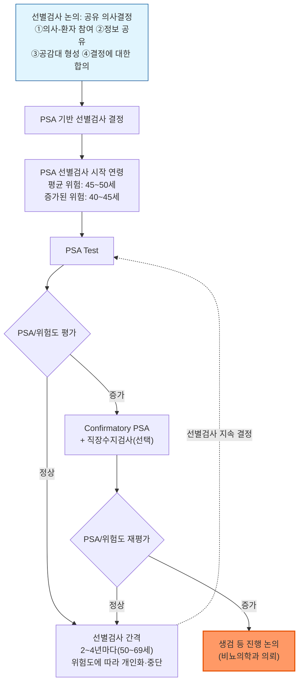
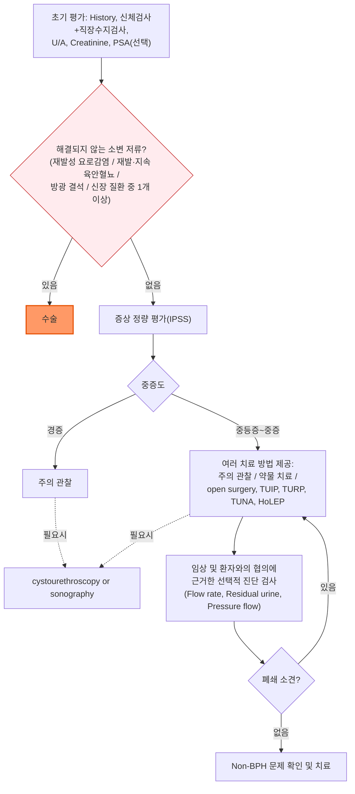
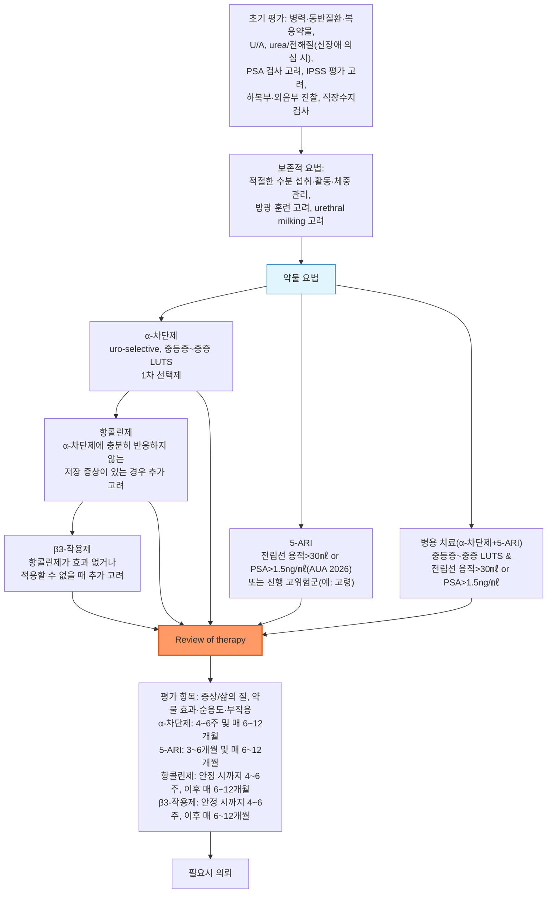
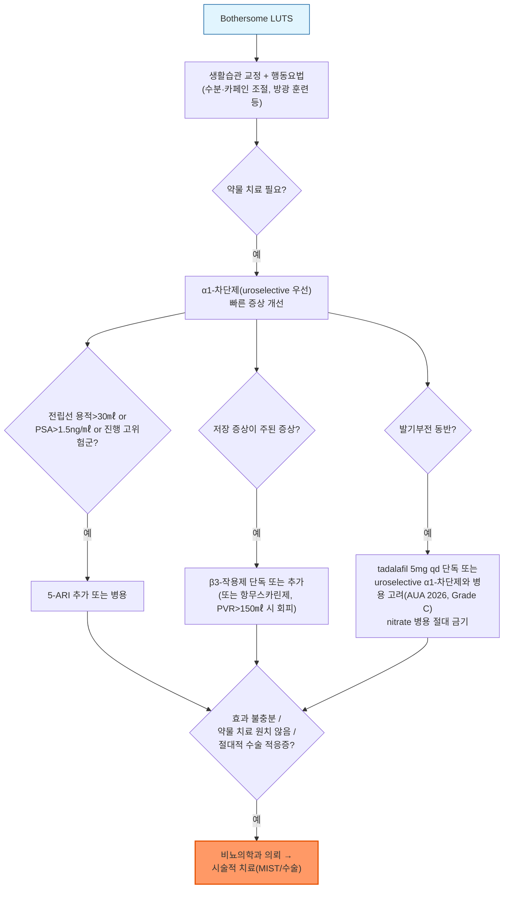

# 전립선비대증 Benign Prostatic Hyperplasia (BPH)

## <mark style="color:green;">일반 사항</mark>

* BPH(양성 전립선 증식) : 전립선 이행대의 평활근(smooth muscle), 상피(epithelium), 간질세포(stromal cell)의 양성 증식 — 본래 조직학적 진단명
*   관련 개념 구분 (BPH ≠ BPE ≠ BPO ≠ LUTS)

    * BPE(benign prostatic enlargement) : BPH에 의한 전립선의 해부학적 비대(육안적·영상학적 크기 증가)
    * BPO(benign prostatic obstruction) : BPE 등에 의한 방광출구폐색(요역동학적 진단)
    * LUTS(하부요로증상) : 환자가 호소하는 저장·배뇨·배뇨 후 증상 — BPH/BPE/BPO는 남성 LUTS의 흔한 원인이지만 유일한 원인은 아님(☞ 하부 요로 증상과 BPH의 관계)

<table><thead><tr><th width="90">용어</th><th width="150">진단 성격</th><th>핵심 정의</th></tr></thead><tbody><tr><td>BPH</td><td>조직학적 진단</td><td>전립선 이행대의 양성 세포 증식</td></tr><tr><td>BPE</td><td>해부학적 진단</td><td>BPH에 의한 전립선의 육안적·영상학적 크기 증가</td></tr><tr><td>BPO</td><td>기능적(요역동학적) 진단</td><td>BPE 등에 의한 방광출구폐색</td></tr><tr><td>LUTS</td><td>증상 진단</td><td>환자가 호소하는 저장·배뇨·배뇨 후 증상(원인은 BPH 외에도 다양)</td></tr></tbody></table>
* 유병률(조직학적 BPH 기준) : 40대 10\~20%, 50대 50%, 80대 80\~90%
* 전립선 크기와 증상의 중증도는 비례하지 않으며, 자각 증상을 호소하는 환자 비율은 조직학적 유병률보다 낮음
* BPH/BPO 수술(예: TURP) 검체에서 우연히 전립선암이 발견되는 경우가 있음(문헌마다 5\~30%로 보고 편차가 큼) — LUTS 자체가 전립선암을 강하게 시사하지는 않으나, 연령·위험 인자에 따라 전립선암 평가를 별도로 고려(PSA·DRE 등 일부 검사를 공유)

***

## <mark style="color:green;">원인 및 위험 인자</mark>

*   원인 : 명확히 규명되지 않음

    ✽testosterone, dihydrotestosterone(DHT), estrogen 등의 호르몬이 BPH 진행에 영향을 주지만 이들만으로 진행 기전을 완전히 설명할 수 없음; prostatic tissue가 여러 성장 인자에 비정상적으로 민감한 embryonic-like state로 회귀하는 것이 관련된다는 가설이 있음

### <mark style="color:orange;">위험 인자</mark>

* 고령 (가장 강력한 위험 인자)
* 대사증후군 구성 요소 : 비만, 운동 부족, 당뇨병, 이상지질혈증
* 심혈관 질환

✽일부 관찰 연구에서 β-차단제 복용과 BPH 진행/수술 위험 증가의 연관성이 보고되었으나 인과 관계는 확립되지 않았으며, 현재 이를 근거로 임상적 처방 선택(예: 다른 항고혈압제로의 변경)을 바꿀 근거는 부족함

***

## <mark style="color:green;">임상 양상</mark>

* 폐쇄 증상 : 요주저(hesitancy), 소변 줄기의 힘없음/가늘어짐, 잔뇨감, 이중 배뇨(2시간 내 두 번째 배뇨), 복압배뇨(straining), 배뇨 후 요점적
* 자극(저장) 증상 : 절박뇨, 빈뇨, 야뇨

✽조직학적으로 BPH가 있는 남성의 약 ½에서 중등증 이상의 하부 요로 증상(LUTS)이 발생

### <mark style="color:$danger;">🚩 Red Flags!</mark>

<mark style="color:$danger;">**즉각 조치 또는 이송**</mark>

* 급성 요폐(급성 완전 배뇨 불능, 치골 상부 팽만·심한 통증) → 즉시 도뇨 등 응급 처치 (☞ 도뇨 후 α1-차단제 시작 및 TWOC은 시술 및 기타 처치 참조)
* 육안적 혈뇨의 응고혈괴(clot retention)로 인한 요폐
* 발열·빈맥·저혈압을 동반한 요로 패혈증 의심
* 급격한 신기능 악화(무뇨, Cr 급상승) → 양측 상부 요로 폐쇄 의심

<mark style="color:$warning;">**당일 또는 조기 의뢰**</mark>

* 재발성 육안 혈뇨
* 재발성 요로 감염
* 방광 결석 의심 소견(배뇨 중 소변 흐름의 갑작스런 끊김, 체위 변경 시 호전)
* BPH에 이차적으로 발생한 만성 신질환(Cr↑, eGFR↓)
* 전립선암 의심 소견 : 직장수지검사상 결절·경화 또는 비대칭, 연령·위험도에 비해 지속적으로 상승하거나 재검에서도 상승하는 PSA → 전립선암 위험 평가 및 비뇨의학과 의뢰 고려

<mark style="color:$info;">**외래 추적 / 추가 평가 계획**</mark> <mark style="color:$info;">- 즉각 위험 낮으나 호전 없으면 의뢰</mark>

* 경증\~중등증에서 표준 약물 치료(α-차단제 등) 시작 후 4\~6주 이내 반응 평가에서 호전 없음
* 병용 요법 등 충분한 용량·기간 치료에도 증상 또는 삶의 질 저하가 지속되는 경우

***

## <mark style="color:green;">진단</mark>

### <mark style="color:orange;">기본 평가</mark>

* 병력 청취 : 비뇨기계 수술력, 외상, 요로 감염, 혈뇨, 요도 협착, 요폐, 신경학적 질환, 당뇨병, 약물 복용력(α-교감신경 작용제, 부교감신경 억제제), 성 기능 장애, 전립선 질환 가족력
* 증상 평가 : 국제 전립선 증상 점수표(IPSS)
* 직장수지검사(DRE) : enlarged, firm, non-tender prostate 확인; 결절·경화 소견 시 전립선암 감별
* U/A
*   PSA(전립선 특이 항원) 검사 : BPH 환자의 30\~50%에서 상승

    * 전립선암 위험 평가, 전립선 용적 추정, 5ARI 치료 적합성 판단 등을 위해 임상적 필요성과 공유 의사결정(shared decision-making)에 따라 선택적으로 시행 (AUA/SUO 2026)
    * 4.0 ng/㎖는 전통적으로 널리 쓰여온 참고치이나 절대적인 암 진단·조직검사 기준은 아니며, 연령·PSA 추세·직장수지검사 등을 함께 고려; 연령별 참고 상한은 40대 2.5, 50대 3.5, 60대 4.5, 70대 6.5 ng/㎖ 정도로 제시됨 (AUA/SUO 2026)
    * 새로 상승한 PSA는 곧바로 2차 검사(biomarker·영상·생검)로 진행하지 않고 먼저 반복 검사로 확인
    * 최근 사정은 PSA에 일시적 영향을 줄 수 있어 검사 전 회피

### <mark style="color:orange;">추가 검사</mark>

* 배뇨 일지 작성 : 환자의 호소가 모호한 경우에 시행
* 요속 검사(uroflowmetry) : Qmax 등 요속 및 배뇨 양상 평가
* 요역동학 검사(urodynamics, pressure-flow study) : 방광내압·배뇨근 압력을 측정하여 방광출구폐색(BOO) 및 배뇨근 저활동을 감별; 비침습 검사로 진단이 불명확하거나 침습적 치료를 고려할 때 선택적으로 시행
* 소변 배양 검사 : 감염 의심 시 시행
* 소변 세포 검사, 전립선 조직 검사 : 암 의심 시 고려
* free PSA : 혈중 PSA의 약 30%는 다른 단백질과 결합하지 않은 free form으로 존재; total PSA 4\~10 ng/㎖(gray zone)이면서 DRE가 정상인 경우 free/total PSA 비율이 낮을수록 전립선암 위험이 높아지는 경향이 있어 생검 여부 결정의 보조 지표로 활용(정확한 위험도는 연령·PSA·DRE·이전 생검력 등에 따라 달라짐)
* prostate cancer gene 3(PCA3) : DRE 후 소변에서 검사; 여러 2차 biomarker/영상(MRI 등) 중 하나로 선택적으로 활용, ≥35 시 암 위험 증가 참고치로 제시됨
* eGFR, s-Cr : 신질환 의심 시 시행
* 경직장 전립선 초음파 검사 : 전립선 크기 측정; 중년 남성 정상 20\~25 ㎤, 심한 BPH ＞50 ㎤
* 방광 초음파 검사 : 배뇨 후 잔뇨량 측정
* 신장 CT/초음파 : 신질환, BPH 합병증(예: 혈뇨, UTI, 만성 신질환, 결석 병력) 의심 시 고려
* 전립선 MRI : PSA 상승 환자에서 조직 검사 시행 여부 결정에 유용
* 방광경 : 침습적 치료 결정 시 고려

**국제 전립선 증상 점수 (International Prostate Symptom Score, IPSS)**

* 지난 한 달 동안에 대하여 아래 7개 문항을 평가\
  배점 : ①\~⑥ — 5번의 배뇨 중 없다=0점, 1번=1점, ＜절반=2점, 절반=3점, ＞절반=4점, 거의 항상=5점\
  ⑦ — 없다=0점, 1번=1점, 2번=2점, 3번=3점, 4번=4점, 5번 이상=5점

&#x20;\[증상 문항]\
&#x20;① 배뇨가 끝난 후에도 소변이 남아 있는 것처럼 느끼는 경우가 몇 번 있었습니까?\
&#x20;② 배뇨가 끝난 후 2시간 이내에 다시 소변을 보는 경우가 몇 번 있었습니까?\
&#x20;③ 배뇨 중 소변 줄기가 끊어졌다 다시 나오는 경우가 몇 번 있었습니까?\
&#x20;④ 소변을 참기 어려운 경우가 몇 번 있었습니까?\
&#x20;⑤ 소변 줄기 흐름이 약한 경우가 몇 번 있었습니까?\
&#x20;⑥ 배뇨를 시작하기 위해 힘을 주었던 경우가 몇 번 있었습니까?\
&#x20;⑦ 잠을 자다가 소변을 보기 위해 일어나는 경우가 하룻밤에 몇 번이나 있습니까?

* 판정 : 합계 0\~7점=경증, 8\~19점=중등증, 20\~35점=중증
* 삶의 질 평가(참고 문항) : ⑧ 지금 소변을 보는 상태로 평생을 보낸다면 어떻게 느끼겠습니까? (아무 문제없다 / 괜찮다 / 대체로 만족한다 / 반반이다 / 대체로 괴롭다 / 견딜 수 없다)

### <mark style="color:orange;">감별 진단</mark>

* 폐쇄·자극성 배뇨 증상을 일으킬 수 있는 질환·약물의 감별이 필요

<table><thead><tr><th width="150">범주</th><th>질환/원인</th></tr></thead><tbody><tr><td>비뇨기 질환</td><td>요로 감염, 전립선염, 방광 결석, 전립선암, 방광암, 요도 협착</td></tr><tr><td>신경학적 원인</td><td>신경인성 방광, 파킨슨병, 당뇨병성 신경병증</td></tr><tr><td>기능성/기타</td><td>과민성 방광, 심부전, 불면증, 수면무호흡증</td></tr><tr><td>약물 유발</td><td>이뇨제, 항콜린제(TCA·항히스타민제 포함), sympathomimetics(예: ephedrine 등 코 울혈 제거제), opioid</td></tr></tbody></table>

### <mark style="color:orange;">전립선암 선별 검사</mark>

**AUA/SUO (2026)**

*   검진 일정 : 45\~50세에 baseline PSA 검사 시작 가능; 가족력 등 전립선암 위험이 큰 경우(흑인, germline mutation, 유방암/난소암의 강한 가족력, 전립선암의 강한 가족력) 40\~45세부터 검진 권고

    50\~69세에 2\~4년마다 정기 검진 권고; 환자 선호도, 연령, PSA 수준, 전립선암 위험, 기대 수명, 전반적 건강 상태에 따라 재검사 간격 결정
* 1차 선별 검사 : PSA. 새로 상승한 경우 반복 검사; 필요시 직장수지검사 추가
* 2차 검사 : biomarker, 영상, 또는 조직 생검

***



<p align="center"><strong>전립선암의 initial screening</strong></p>

<p align="center"><em><mark style="color:$info;">Ref. AUA/SUO. Early detection of prostate cancer algorithm (2026 amendment)</mark></em></p>

**USPSTF (2018)**

* 55\~69세 남성 : 선별 검사로 인한 전립선암 사망률 감소 효과는 미약한 반면, 위양성에 의한 추가 검사(예: 조직 검사) 및 치료 합병증(요실금, 발기 부전 등)의 위해가 있어 일률적 선별보다 **개별화된 의사결정**을 권고(Grade C)
* ≥70세 남성 : 선별 검사의 잠재적 이득이 위해를 상회하지 않는다고 판단하여 **정기적 PSA 선별 검사를 권고하지 않음**(Grade D)


**선별(screening) 목적의 전립선 MRI — 아직 표준 진료 아님**\
일부 건강검진에서 PSA 없이 또는 PSA와 함께 전립선 MRI를 선별검사로 제공하기 시작했으나, 이는 2026년 국제 전문가 합의안(PRISM)이 제시한 연구/시범사업용 프로토콜이며 공식 임상진료지침으로 채택된 것은 아님. 현재 표준은 여전히 PSA 기반 선별이며, MRI는 PSA 상승 시 생검 여부 판단을 위한 2차 검사로 사용(위 AUA/SUO 알고리듬 참조). 환자가 사설 선별 MRI 결과를 가져오면 PI-RADS 점수와 촬영 기관의 신뢰도를 확인하고 필요시 비뇨의학과 의뢰


***



<p align="center"><strong>전립선비대증 진단 및 치료 알고리듬</strong></p>

<p align="center"><em><mark style="color:$info;">Ref. Lange 2020, Current Medical Diagnosis & Treatment 59th Ed. Table 23-2.</mark></em></p>

***

## <mark style="background-color:$warning;">Management</mark>

### <mark style="color:orange;">치료 방침</mark>

* 행동 및 생활 방식 중재를 모든 환자에게 우선 적용
* 증상 정도에 따라 치료 :
  * 무증상\~경증(IPSS ≤7점) 또는 증상이 크게 불편하지 않은 경우 → 치료 없이 관찰(watchful waiting), 개별화된 간격으로 재평가
  * 중등증\~중증 또는 삶의 질 저하가 있는 경우 → 약물 치료 시작, 반응 부족 또는 절대적 수술 적응증 시 시술적 치료 고려
* 추적 원칙 : 약제에 따라 4\~6주 또는 3\~6개월째 증상·삶의 질·순응도·부작용을 평가하고, 안정된 경우 6\~12개월 간격으로 재평가; IPSS·PVR·요속검사는 임상적으로 필요할 때 시행하며, DRE·PSA는 전립선암 선별(공유 의사결정) 또는 5ARI 모니터링 등 개별 적응증에 따라 시행 여부를 결정(모든 환자에게 매년 일괄 시행하는 것은 아님)

***

## <mark style="color:green;">비-약물 치료 및 예방</mark>

* 체중 관리, 규칙적 운동, 변비 관리
* 이뇨 작용과 방광 자극 효과가 있는 음료 회피 : 카페인(커피, 녹차), 알코올, 인공 감미료
* 과도한 수분 섭취를 피하고, 증상이 심한 경우 상황(외출 전 등)에 따라 시간대별로 수분 섭취를 조절 — 획일적으로 총 수분량을 제한하기보다 개인화된 조절을 권장(과도한 제한은 고령자에서 탈수·신기능 저하·변비 위험)
* 야뇨가 불편한 경우 저녁 이후(취침 전 3\~4시간 이내)에는 수분 섭취를 줄이고, 특히 카페인·알코올 회피; 야뇨가 두드러지면 nocturnal polyuria 등 다른 원인 감별을 위해 배뇨 일지(bladder diary)를 활용
* 장시간 배뇨할 수 없는 상황(장거리 버스 여행 등)을 피하고, 가능한 한 배뇨가 용이한 교통수단 이용
* 배뇨를 악화시키는 약제 주의 : 이뇨제, 항콜린제, TCA, 감기약(항히스타민제, 코 울혈 제거제), opioid
* double voiding : 배뇨 후 불완전 배뇨 또는 요점적 시 몇 분 후 다시 배뇨 시도
* urethral milking : 배뇨 후 요점적 시 음낭 뒷부분을 손가락 끝으로 짜냄
* 저장 증상이 지속되는 경우 timed voiding, bladder training 등의 행동요법을 고려

***

## <mark style="color:green;">약물 치료</mark>

* 진단 후 관찰하였음에도 불편한 상태가 호전되지 않으면 약물 치료 시작
  * α-차단제 1차 선택 → 반응 부족 시 5ARI 추가 고려, 발기부전 동반 시 PDE5i 시도 고려
* 안정 후에는 6\~12개월 간격으로 재평가; IPSS·PVR·요속검사는 임상적 필요에 따라, PSA는 전립선암 선별 또는 5ARI 모니터링 등 개별 적응증에 따라 시행(☞ 치료 방침의 추적 원칙 참조)

### <mark style="color:orange;">α1-교감신경 차단제 (α1-adrenoceptor antagonist)</mark>

<table><thead><tr><th width="150">선택성</th><th width="230">성분명 [상품명]</th><th>용법</th></tr></thead><tbody><tr><td>Non-uroselective</td><td>doxazosin <mark style="color:blue;">\[카두라 엑스엘]</mark></td><td>1\~8 ㎎ qd</td></tr><tr><td>Non-uroselective</td><td>terazosin <mark style="color:blue;">\[하이트린]</mark></td><td>1\~10 ㎎ qd</td></tr><tr><td>Uroselective</td><td>alfuzosin <mark style="color:blue;">\[자트랄]</mark></td><td>10 ㎎ qd</td></tr><tr><td>Uroselective</td><td>tamsulosin <mark style="color:blue;">\[하루날 디]</mark></td><td><strong>0.2 ㎎ qd로 시작</strong>(국내 보험기준 및 1차 진료 초회 용량), 필요시 0.4\~0.8 ㎎까지 증량</td></tr><tr><td>Uroselective</td><td>silodosin <mark style="color:blue;">\[트루패스]</mark></td><td>8 ㎎ qd</td></tr><tr><td>Uroselective(α1D)</td><td>naftopidil <mark style="color:blue;">\[플리바스]</mark></td><td>25\~75 ㎎ qd</td></tr></tbody></table>

✽alfuzosin, tamsulosin, silodosin = uroselective(α1A 우세); doxazosin, terazosin = non-uroselective. Uroselective 제제는 혈압 영향이 상대적으로 적은 반면 사정 장애(abnormal ejaculation) 빈도는 tamsulosin·silodosin에서 alfuzosin보다 높다는 보고가 있음 — α1-차단제 선택은 연령·동반질환·혈압 영향·사정 기능에 대한 우려 등을 고려하여 개별화

✽doxazosin XL(서방정)의 초기 용량·적정법은 즉시방출형(IR) 제형과 다를 수 있음; 위 표의 용량은 처방 전 국내 허가사항(예: 카두라 엑스엘, 하루날 디)을 최종 확인할 것

* 기전 : 하부 요로 평활근의 α1-adrenergic receptor 차단 → 방광 경부 및 전립선 평활근 이완(방광 출구 저항 감소), 요속 개선; **전립선 크기에는 영향 없음** — 증상은 빠르게 개선시키지만 전립선 용적을 줄이거나 급성 요폐·수술 등 장기적 진행 위험을 낮추지는 않음
* 중등증\~중증의 bothersome LUTS(IPSS ≥8점)에서 1차 약물 치료로 고려; 5ARI보다 초기 증상 개선 효과가 빠름
* 전립선 용적에 따른 적응증 제한은 없으며(5ARI와 달리 용적 기준으로 선택을 제한하지 않음), 전립선 용적이 크거나 진행 위험이 높은 경우 5ARI 병용을 고려
* 병용 : 5ARI 또는 항콜린제와 병용 가능
  * 중증 또는 α1-차단제 최대 용량에 반응하지 않는 경우 5ARI와의 병용 고려
* 부작용 : 기립성 저혈압, 어지럼, 무기력, 비염, 두통, 소화불량, 사정 장애(비정상 사정 — 역행성 사정보다는 정액량 감소·무정액이 주된 기전으로 알려짐)
  * non-uroselective 제제(doxazosin, terazosin) : 혈압 강하 작용이 뚜렷하여 정상 혈압 환자에서도 사용 가능하나 혈압 모니터링 필요, 저용량부터 점진적 증량
  * doxazosin·terazosin처럼 혈압 강하가 두드러진 제제는 초기 취침 시 투여 후 천천히 일어나도록 교육; uroselective 제제는 반드시 취침 시 투여할 필요는 없음(국내 허가사항에 따른 복용 시점 준수)
  * PDE5i와 병용 시 혈압 강하 영향이 증가할 수 있으므로 증상 관찰
* 투여 2\~4주 후 치료 반응 평가


**⚠️ 백내장 수술 예정 환자 안내 — Intraoperative Floppy Iris Syndrome(IFIS)**\
α1-차단제(특히 tamsulosin) 복용자는 백내장 수술 중 IFIS 위험이 증가할 수 있습니다. 백내장 수술을 계획 중이거나 예정된 환자는 반드시 안과의사에게 α1-차단제 복용 사실을 알리도록 안내하십시오. 약제를 미리 중단해도 위험이 일정 기간 지속될 수 있습니다.


### <mark style="color:orange;">항콜린제 (항무스카린제)</mark>

* 효과 : 배뇨 후 잔뇨량은 크게 늘리지 않으면서 과민성 방광 증상(빈뇨, 절박뇨)이 있는 환자에서 저장 증상 개선
* 부작용 : 입/눈 마름, 두통, 어지럼, 변비, 빈맥, 시야 흐림, 녹내장 악화, 졸음; 대부분 CYP450 대사
* 회피/주의 : 배뇨 후 잔뇨량(PVR)＞150 ㎖인 경우 사용하지 않음(EAU 2026, Weak recommendation), 장폐색, 조절되지 않는 녹내장은 금기
* 주의 : 고령자, 특히 인지기능 저하 환자 또는 cholinesterase 억제제(예: 치매 치료제) 복용자에서는 항콜린 부담(anticholinergic burden)과 인지기능 악화 가능성을 고려하여 병용을 피하거나 신중하게 사용
* oxybutynin : 5\~15 ㎎/일 #2\~3 <mark style="color:blue;">\[디트로판]</mark>
* propiverine : 20 ㎎ qd\~bid <mark style="color:blue;">\[비유피-4]</mark>
* tolterodine : 2\~4 ㎎ qd <mark style="color:blue;">\[디트루시톨 SR]</mark>
* solifenacin : 5\~10 ㎎ qd <mark style="color:blue;">\[베시케어]</mark>
* darifenacin : 7.5\~15 ㎎/일
* fesoterodine : 4\~8 ㎎ qd <mark style="color:blue;">\[토비애즈]</mark>
* imidafenacin : 0.1\~0.2 ㎎ bid <mark style="color:blue;">\[유리토스]</mark>
* trospium : 40\~60 ㎎/일 #2 <mark style="color:blue;">\[스파스몰리트]</mark>

### <mark style="color:orange;">5α-환원효소 억제제 (5α-Reductase inhibitor, 5ARI)</mark>

*   기전 : testosterone의 dihydrotestosterone(DHT)로의 전환 효소인 5α-reductase를 억제(isoenzyme type 1은 주로 간·피부, type 2는 주로 전립선에 존재) → DHT↓ → 전립선 세포의 성장·발달 억제 → 전립선 용적 감소, 소변 배출 기능 향상
*   사용 고려 기준 : 전립선 용적＞30 ㎖ 또는 PSA＞1.5 ng/㎖ (AUA 2026)

    ✽국내 건강보험 급여 기준은 별도로 PSA ≥1.4 ng/㎖ 등을 적용하므로(아래 hint 참조), 국제 가이드라인의 치료 고려 기준(1.5)과 국내 급여 기준(1.4)을 혼동하지 않도록 함
*   효과 : 장기 치료 시 전립선 용적 약 20\~30% 감소; 증상 개선에는 수개월(최대 6\~12개월) 소요, 전립선 용적＞30 ㎤에서 최대 효과
* 부작용 : 성욕 감소, 발기 부전, 사정 장애 등 성 기능 관련 부작용, 유방 팽창/압통(gynecomastia) — 5ARI의 대표적 부작용은 성 기능·유방 관련이며, 기립성 저혈압·어지럼은 주된 부작용이 아님(α1-차단제와 혼동 주의)
*   모니터링

    * 투여 3\~6개월 후 치료 반응 평가; PSA는 약 3\~6개월째 약 50% 감소하는 것이 일반적("50% rule")
    * 치료 중 PSA가 예상대로 감소하지 않거나, 감소 후 최저치(nadir)에서 지속적으로 상승하는 경우 복약 순응도·전립선염 등 다른 원인을 먼저 확인하고, 전립선암 평가를 위한 비뇨의학과 의뢰를 고려

    ✽약제에 의해 PSA가 약 50% 감소하므로(단, free PSA 비율은 변하지 않음) 투약 전과 비교 시 현재 수치를 ×2 하여 평가

    ✽일부 관찰연구(population-based cohort)에서 5ARI 사용과 제2형 당뇨병 발생 위험 증가의 연관성이 보고되었으나 연구 간 결과가 일관되지 않으며(국내 코호트에서는 연관성이 뚜렷하지 않다는 보고도 있음), 이를 근거로 모든 환자에서 별도의 정기적 당뇨병 선별검사를 시행하도록 권고할 근거는 부족함; 당뇨병 위험 인자가 있는 환자에서는 통상적인 당뇨병 선별을 고려
* finasteride : type 2-5ARI 선택적 억제; 5 ㎎ qd <mark style="color:blue;">\[프로스카]</mark>
* dutasteride : type 1, 2-5ARI 모두 억제하며 효과가 더 빠르고 강할 수 있음; 0.5 ㎎ qd <mark style="color:blue;">\[아보다트]</mark>


**⚠️ PSA 기준 — 국제 가이드라인 vs 국내 급여 기준을 혼동하지 마십시오**\
5ARI 치료 고려 기준(전립선 용적＞30 ㎖ 또는 PSA＞1.5 ng/㎖)은 AUA 2026 국제 가이드라인이며, 국내 건강보험 급여 기준(PSA ≥1.4 ng/㎖ 등, 아래)은 **서로 다른 문서에서 유래한 별개의 기준**입니다. 실제 처방 시 급여 인정 여부는 반드시 HIRA 고시를 확인하십시오.



**5ARI 보험기준 (예시 — 기관·시기별 확인 필요)**\
①IPSS 점수 ≥8점 & ②초음파검사상 전립선 크기 ≥30 ㎖ or 직장수지검사상 중등증 이상의 BPH 소견 or PSA ≥1.4 ng/㎖; 약제 투여 중 1회/12개월 이상 PSA 검사 시행\
✽정확한 급여 기준은 HIRA 고시를 반드시 확인할 것(기준 변경 가능)


### <mark style="color:orange;">β3-작용제 (β3-adrenoceptor agonist)</mark>

* 작용 : detrusor muscle의 선택적 β3-수용체 자극 → smooth muscle 이완, 방광 저장 기능 개선
* antimuscarinics에 비하여 입마름 등 항콜린성 부작용이 적음
* 저장 증상이 주된 경우 항무스카린제의 대안으로 단독 사용하거나, α1-차단제에 추가하여 병용할 수 있음(반드시 "항콜린제 실패 후" 순차적으로만 쓰는 것은 아님)
* 부작용 : 빈맥, 요로 감염, 혈압 상승; 허약한 고령자와 고혈압·심장 질환 동반 시 주의
* mirabegron <mark style="color:blue;">\[베타미가]</mark> : 국내 허가사항 기준 성인(노인 포함) 권장 용량 50 ㎎ qd(식사와 무관하게 복용, 씹거나 부수지 않고 물과 함께 복용)

<table><thead><tr><th width="120">구분</th><th width="120">중증도</th><th width="150">강력한 CYP3A 저해제 병용 없음</th><th>강력한 CYP3A 저해제 병용</th></tr></thead><tbody><tr><td rowspan="3">신장애</td><td>경증(GFR 60\~89)</td><td>50 ㎎</td><td>25 ㎎</td></tr><tr><td>중등도(GFR 30\~59)</td><td>50 ㎎</td><td>25 ㎎</td></tr><tr><td>중증(GFR 15\~29)</td><td>25 ㎎</td><td>권장되지 않음</td></tr><tr><td rowspan="2">간장애</td><td>경증(Child-Pugh A)</td><td>50 ㎎</td><td>25 ㎎</td></tr><tr><td>중등도(Child-Pugh B)</td><td>25 ㎎</td><td>권장되지 않음</td></tr></tbody></table>

✽국내 허가사항의 신장애·간장애·CYP3A 강력 저해제 병용 시 용량 조정 기준이며, 처방 전 최신 허가사항을 확인할 것

### <mark style="color:orange;">병용 요법</mark>

* α-차단제 + 5ARI 병용은 중등증\~중증 LUTS이면서 전립선 용적＞30 ㎤ 또는 PSA＞1.5 ng/㎖(국내 급여 기준은 1.4 ng/㎖)인 경우, 특히 진행(요폐·수술) 고위험군에서 단독 요법보다 장기적 증상 진행 억제 효과가 크다는 근거가 있음(MTOPS, CombAT 연구)
* 병용 초기에는 α-차단제가 빠른 증상 조절을, 5ARI가 장기적인 전립선 용적 감소·진행 억제를 담당 — 환자에게 두 약제의 역할 차이를 설명

### <mark style="color:orange;">Phosphodiesterase Type 5 억제제 (PDE5i)</mark>

* 발기 저하가 동반된 중등증 이하 증상에서 고려; 발기부전 없이 LUTS 단독 치료 목적이라도 tadalafil 5 ㎎ qd 단독 요법은 α1-차단제와 유사한 효과를 보임
* AUA 2026 : 발기부전 동반 여부와 관계없이 daily tadalafil 5 ㎎과 **uroselective α1-차단제(alfuzosin, tamsulosin, silodosin)**의 병용을 고려할 수 있음(Conditional Recommendation, Grade C) — non-uroselective 제제(doxazosin, terazosin)와의 병용에 대한 근거는 상대적으로 부족하므로 동일하게 적용하지 않음
* 병용 시에도 어지럼·기립성 저혈압 가능성이 있어 환자별로 혈압과 기립성 증상을 평가
* tadalafil : 5 ㎎ qd <mark style="color:blue;">\[시알리스]</mark> (✽BPH에 대하여 FDA 승인)


**⚠️ Nitrate 병용 절대 금기**\
tadalafil을 포함한 모든 PDE5 억제제는 nitrate 제제(니트로글리세린 등)와 병용 시 심각한 저혈압을 유발할 수 있어 **절대 금기**입니다. 처방 전 nitrate 복용 여부(협심증 병력 포함)를 반드시 확인하십시오.


### <mark style="color:orange;">대체 요법</mark>

* 증명된 유효한 식품 보조제는 없음
* urtica dioica(서양쐐기풀) : 유효성을 입증할 증거 부족
* saw palmetto(쏘팔메토) : Cochrane review 등에서 위약 대비 일관된 효과를 보이지 못함; 정제화된 추출물 성분의 anti-androgenic effect(lauric acid), 항염 효과(β-sitosterol)로 일부 증상 완화 보고가 있음; 부작용은 드물지만 혈액 응고 저하 가능성이 있어 aspirin, warfarin, NSAID 복용 시 주의

***

## <mark style="color:green;">시술 및 기타 처치</mark>

* 절대적 수술 적응증 : 약물치료로 호전되지 않는 반복/불응성 요폐, 재발성 요로 감염, 재발성·불응성 육안혈뇨, 방광 결석, 큰 방광 게실, BPO에 기인한 만성 신질환(신기능 악화)
* 상대적 적응증(shared decision-making) : 약물 치료에도 bothersome LUTS가 지속되거나 약물 치료를 원하지 않는 경우 — 반드시 일정 기간(예: 12개월) 비수술 치료를 선행해야 하는 것은 아니며, 증상·선호도·약물 부작용·진행 위험을 고려해 환자와 함께 결정
* 전통적 수술 : TURP(경요도 전립선 절제술), TUIP(경요도 전립선 절개술), HoLEP(홀뮴 레이저 전립선 적출술), open/robotic prostatectomy — 전립선 용적이 매우 큰 경우 고려; ThuLEP(thulium 레이저 적출술)도 전립선 용적과 무관하게 시행 가능한 대표적 enucleation 술식
* 하부 요로 증상이 있는 환자는 수술 후에도 약 25%에서 증상이 지속될 수 있음을 설명

✽TUNA(경요도 침 절제술), TUMT(경요도 미세파 열 치료)는 현재 AUA 가이드라인에서 더 이상 권고되지 않으며 legacy technology(가이드라인 권고 목록에서 제외됨)로 분류됨

### <mark style="color:orange;">최소 침습 시술 (Minimally Invasive Surgical Therapy, MIST)</mark>

* AUA LUTS/BPH 가이드라인 Part III: Procedural/Surgical Management(2026)에서 전립선 용적 30\~80 ㎤ 범위를 중심으로 아래 최소 침습 옵션이 정리됨(숙련된 술자·적절한 환자에서는 더 큰 용적까지 적용을 고려하기도 함) — 사정·발기 기능 보존을 원하는 환자에게 특히 유용
  * Prostatic urethral lift(PUL, UroLift) : 클립으로 전립선 조직을 견인·고정하여 요도 개방; median lobe가 없는 경우 우선 고려
  * Water vapor thermal therapy(WVTT, Rezum) : 경요도 스팀 주입으로 조직 괴사 유도; median lobe 동반 시에도 적용 가능
  * Aquablation : 로봇 유도 고압 water-jet으로 조직 절제; 전신 마취 필요, 큰 전립선(최대 150 ㎤)에서도 적용 보고
  * iTind(temporary implantable nitinol device) : 경요도로 일시적 nitinol 장치를 삽입하였다가 일정 기간 후 제거하는 최소 침습적 옵션
* 이들 시술은 비뇨의학과에서 시행하며, 1차 진료에서는 환자에게 전통적 수술 대비 회복이 빠르고 성 기능 부작용이 적을 수 있다는 선택지로 안내하고 의뢰

✽급성 요폐로 도뇨한 경우 α1-차단제를 시작하고, 도뇨관 제거 후 배뇨 시도(trial without catheter, TWOC)를 고려 — 1차 진료에서 실제로 유용한 접근

***

## <mark style="color:green;">하부 요로 증상 (Lower Urinary Tract Symptoms, LUTS)과 BPH의 관계</mark>

* LUTS는 방광 또는 배출로 이상과 관련된 하부 요로의 복합 증상(저장, 배뇨, 배뇨 후 증상)을 통칭하며, BPH는 남성 LUTS의 **가장 흔한 원인**이지만 유일한 원인은 아님
* BPH 이외의 주요 원인 : 배뇨근 과민, 신경학적 장애, 방광 경부 구축 등 평활근 기능 부전, 요도 협착, 전립선암, 방광암, 요로 감염, 전립선염, 방광 결석
* 약물 유발 : 이뇨제, 항콜린제(TCA, 항히스타민제), sympathomimetics(코 울혈 제거제), opioid
* 심혈관·신장·호흡기 질환도 야뇨·빈뇨 등 LUTS를 유발할 수 있음
* 젊은 연령에서 새로 발생한 LUTS, 특히 전형적인 BPH 양상과 맞지 않는 경우 → 요도 협착, 전립선염, 신경인성 방광 등 BPH 이외의 원인을 우선 감별하고 필요시 비뇨의학과 의뢰; 표준 치료에 반응하지 않는 LUTS도 마찬가지로 재평가 및 의뢰 고려

***



<p align="center"><strong>BPH에 기인하는 남성 LUTS 관리</strong></p>

<p align="center"><em><mark style="color:$info;">Ref. Diagnosis, management, and referral of men with lower urinary tract symptoms due to benign prostatic hyperplasia. NICE 2017.</mark></em></p>

✽위 알고리듬은 NICE(2017) 기준으로, 역사적 참고 자료로서의 가치를 위해 원문 그대로 유지함. 현재 AUA(2026)/EAU(2026) 가이드라인의 약물·시술 세부 권고와는 일부 차이가 있을 수 있음(예: PVR 기준, PSA 기준, MIST 옵션 등) — 아래 AUA 2026 기준 알고리듬 참조

***



<p align="center"><strong>LUTS/BPH 약물 치료 선택 개요</strong></p>

<p align="center"><em><mark style="color:$info;">Ref. AUA Management of LUTS Attributed to BPH Guideline (2026), Part I-III 요약 재구성</mark></em></p>

***

### <mark style="color:red;">질병코드</mark>

N40 전립선증식증

R39.8 비뇨계통의 기타 및 상세불명의 증상 및 징후

***

## <mark style="color:purple;">처방례</mark>

> **처방례 1. 중등증 또는 bothersome 배뇨 증상 (전형적 폐쇄 증상)**
>
> ```
> 자트랄 엑스엘 10 ㎎/T  1T  qd
> ```
>
> _✽중등증\~중증의 bothersome 폐쇄 증상에서 uroselective α1-차단제 단독 사용. alfuzosin XL 10 ㎎은 고정 용량 제형으로 별도 적정(titration)이 필요하지 않으며, 투여 2\~4주 후 효과와 부작용(특히 어지럼)을 평가_

> **처방례 2. 중등증\~중증, 전립선 용적 증가**
>
> ```
> 프로스카 5 ㎎/T   1T  qd
> 트루패스 8 ㎎/T   1T  qd
> ```
>
> _✽전립선 용적＞30 ㎖ 또는 PSA＞1.5 ng/㎖(국내 급여 기준은 1.4 ng/㎖)인 중등증\~중증 환자에서 α-차단제+5ARI 병용. 5ARI 효과 발현까지 수개월이 소요되므로 초기 증상 조절은 α-차단제가 담당함을 설명_

> **처방례 3. 방광 자극(저장) 증상 동반**
>
> ```
> 플리바스 50 ㎎/T  1T  qd
> 베시케어 5 ㎎/T   1T  qd
> ```
>
> _✽α-차단제에 충분히 반응하지 않는 저장 증상(빈뇨, 절박뇨) 동반 시 항콜린제 추가. 시작 전 배뇨 후 잔뇨량(PVR)＞150 ㎖ 여부를 반드시 확인(요폐 위험 — EAU 2026)_

> **처방례 4. 발기부전 동반**
>
> ```
> 시알리스 5 ㎎/T  1T  qd
> ```
>
> _✽중등증 이하 LUTS와 발기부전이 동반된 경우 tadalafil 단독으로 두 증상을 함께 조절 가능(FDA BPH 적응증 승인). AUA 2026은 uroselective α1-차단제(alfuzosin, tamsulosin, silodosin)와의 병용을 조건부로 허용(Grade C) — 병용 시 혈압·기립성 증상 관찰; nitrate 제제와의 병용은 절대 금기_

***

### <mark style="color:$success;">핵심 복약 지도</mark>

> **α1-차단제, 이렇게 복용하세요**
>
> 1. Non-uroselective 제제(doxazosin, terazosin)는 혈압 강하 효과가 뚜렷하므로 초기 취침 전 복용을 권장하고, 밤에 일어날 때는 천천히 일어나도록 안내; 정상 혈압 환자에서도 혈압 모니터링 필요
> 2. Uroselective 제제(tamsulosin, silodosin, alfuzosin)는 전신 혈압 강하 효과가 적어 반드시 취침 시 복용해야 하는 것은 아니며, 국내 허가사항의 복용 시점을 따름
> 3. Tadalafil과의 병용은 uroselective 제제(alfuzosin, tamsulosin, silodosin)에 한해 AUA 2026이 조건부로 허용(Grade C) — 병용 시 혈압·기립성 증상을 관찰; nitrate 병용은 절대 금기
> 4. 백내장 수술 예정 환자는 반드시 안과의사에게 복용 사실을 알리도록 안내(IFIS 위험)
> 5. 투여 2\~4주 후 치료 반응을 평가

> **5α-환원효소 억제제, PSA 해석에 주의하세요**
>
> * 6개월 이상 복용 시 PSA가 실제 값의 약 50%로 감소하므로, 투약 전 PSA와 비교할 때는 현재 수치를 ×2 하여 평가
> * 증상 개선까지 수개월(최대 6\~12개월)이 소요될 수 있음을 미리 설명
> * 성욕 감소, 발기 부전 등 성 기능 관련 부작용 발생 가능성을 처방 전 안내
> * 투여 3\~6개월 후에도 불편 증상이 지속되거나 PSA가 예상만큼("50% rule") 감소하지 않으면 전립선암 감별을 위한 의뢰 고려

> **항콜린제(항무스카린제) 처방 전 확인하세요**
>
> * 배뇨 후 잔뇨량(PVR)이 150 ㎖를 초과하면 항무스카린제 사용을 피함(EAU 2026, weak recommendation); 장폐색, 조절되지 않는 녹내장은 금기
> * 고령자, 인지기능 저하 환자, cholinesterase 억제제 복용자에서는 항콜린 부담과 인지기능 악화 가능성을 고려하여 병용을 피하거나 신중히 사용
> * 입 마름, 변비 등 부작용을 안내하고, 필요시 β3-작용제로 대체 또는 병용 고려
> * 항무스카린제 투여 후에는 증상 및 PVR을 재평가; β3-작용제에서도 배뇨 증상 악화 등 요폐가 의심되는 경우 PVR 추적을 고려(모든 환자에게 획일적으로 요구되는 것은 아님)

> **언제 다시 병원을 방문해야 하나요?**
>
> * 소변을 전혀 볼 수 없거나 하복부가 팽만하며 심한 통증이 있는 경우 — **즉시 응급실 방문**(급성 요폐)
> * 혈뇨가 육안으로 보이거나 반복되는 경우
> * 발열, 오한을 동반한 배뇨통이 있는 경우 — 요로 감염/전립선염 의심
> * 표준 약물 치료 4\~6주 후에도 증상이 호전되지 않는 경우

***

### <mark style="color:blue;">환자 안내서</mark>


**전립선비대증, 나이가 들며 흔히 생기는 변화입니다**

전립선은 방광 바로 아래에서 요도를 감싸고 있는 남성 생식기관입니다. 나이가 들면서 전립선이 커지면 요도를 눌러 소변 줄기가 약해지거나 자주 화장실에 가게 되는 등의 불편이 생길 수 있습니다. 대부분 심각한 병은 아니지만, 삶의 질에 영향을 줄 수 있어 적절한 관리가 필요합니다.


#### <mark style="color:$primary;">왜 소변 보기가 불편해지나요?</mark>

* 전립선이 커지면서 요도를 압박하여 소변 줄기가 약해지고, 다 본 후에도 시원하지 않은 느낌(잔뇨감)이 들 수 있습니다.
* 동시에 방광이 예민해져 자주(빈뇨), 갑자기(절박뇨) 화장실에 가고 싶어지고, 밤에도 자주 깨어 소변을 보게 됩니다(야뇨).

#### <mark style="color:$primary;">일상생활에서 어떻게 관리하나요?</mark>

* **카페인·술을 줄이십시오.** 커피, 녹차, 알코올은 이뇨 작용과 방광 자극을 함께 일으켜 증상을 악화시킵니다.
* **저녁 시간 수분 섭취를 조절하십시오.** 특히 잠들기 3\~4시간 전부터 물을 적게 드시면 야간뇨가 줄어듭니다.
* **규칙적으로 운동하고 체중을 관리하십시오.** 변비도 방광을 자극할 수 있으니 함께 관리합니다.
* **소변을 본 후 몇 분 있다가 한 번 더 시도해 보십시오(이중 배뇨).** 방광을 완전히 비우는 데 도움이 됩니다.
* 감기약(항히스타민제, 코 막힘약)이나 일부 위장약은 증상을 악화시킬 수 있으니 복용 전 의사·약사와 상의하십시오.

#### <mark style="color:$primary;">약은 어떻게 복용해야 하나요?</mark>

* α-차단제 계열 약은 **어지럼증**이 생길 수 있어 처음에는 잠자리에서 복용하고, 밤에 일어날 때 천천히 일어나십시오.
* 전립선을 실제로 줄여주는 약(5α-환원효소 억제제)은 효과가 나타나기까지 **몇 개월**이 걸릴 수 있습니다. 증상이 바로 좋아지지 않아도 임의로 중단하지 마십시오.
* 모든 약은 의사와 상의 없이 갑자기 끊거나 용량을 바꾸지 마십시오.

#### <mark style="color:$primary;">이럴 때는 즉시 병원을 방문하세요</mark>

* 🚨 **소변이 전혀 나오지 않고 아랫배가 심하게 불러오는 경우** — 응급 상황입니다.
* 혈뇨(피 섞인 소변)가 보이는 경우
* 열이 나면서 소변볼 때 아픈 경우
* 치료 중인데도 4\~6주 이상 증상이 나아지지 않는 경우
