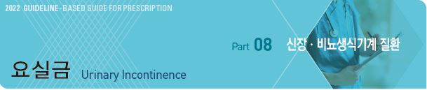
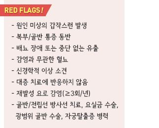
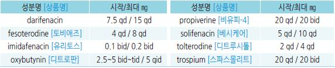
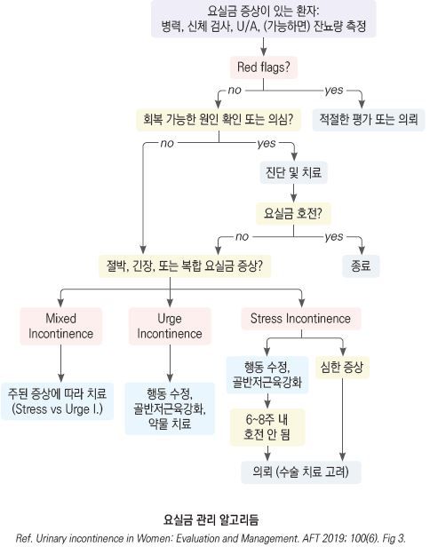
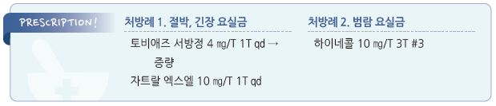

# 요실금 Urinary Incontinence



## 일반 사항

* 객관적으로 확인된 소변의 불수의적 유출
* 발생률 : 젊은 여성의 ¼; ＞75세 여성의 ¾, 남성의 ½
* 요실금 관련 상태 : 하부 요로 증상(LUTS), 과민성 방광(OAB)

## 분류 및 임상 양상

```

```

* 절박성 및 긴장성 요실금의 요인이 섞여 있는 혼합형 요실금이 흔함
* 일시적 요실금은 대부분 절박뇨 양상으로 나타남

### 급성/일시적 요실금의 원인

* 요로 감염, 질염
* 섬망, 우울
* 과다 수분 섭취, 음주, 차, 커피, 탄산음료, 인공 감미료, 자극적 음식
* 변비, 활동 제한
*   소변 저류 약물 : 항히스타민제, 항우울제, 항정신병제, 안정제,

    수면제, α-작용제
* 소변량 증가 약물 : 알코올, 카페인, 이뇨제

### 지속적 요실금의 원인

* 노화(Atrophic vaginitis), 임신, 질식 분만, 자궁절제
* Painful bladder syndrome, Interstitial cystitis, 방광 종양, 방광 결석
* 전립선염, BPH, 전립선 종양
* 신경 이상 : 다발경화증, 파킨슨병, 뇌졸중, 뇌종양, 척수 손상

## 진단

*   요실금은 고령에서 흔한 문제이지만 이를 잘 호소하지 않으므로 최소 1년에 한 번은 “소변이 새어 나오지 않는가?”

    문진을 통해 확인하는 것이 필요함

### 검사

* 실험실 검사 : U/A, 배양 검사(선택); 신 기능, 당뇨
* 전립선 검사
*   신경학적 검사 : 감각 이상 진찰, 근 위축 진찰, foot dorsiflexion, foot plantarflexion, toe extension, anal reflex,

    bulbocavernosus reflex
* 영상 검사 및 요역동학 검사 : 경고 징후 해당 시 상부 요로조영촬영, 초음파, CT, 방광경, 방광 용적 및 배뇨 후 잔뇨량 측정

### 문진표

#### Questionnaire for urinary incontinence diagnosis (QUID)

```

```

#### 3 Incontinence Questions

```

```

#### Bladder Control Self-Assessment Questionnaire (B-SAQ)

```

```

***

## Management

### 치료 방침

* 원인 회피(기저/원인 질환 치료, 유발 약물 중단), 행동 치료, 약물 치료

## 비-약물 치료

#### 생활 습관 중재

* 금연, 적정 체중 관리, 변비 관리
* 수분 섭취 제한(특히 취침 전 수분 섭취 제한. 야뇨가 있는 경우 취침 전 3\~4시간 내로는 수분 섭취를 피함)

> ```
> (✽과다 수분 섭취가 요실금 증상을 악화시킬 수 있지만, 수분 섭취를 너무 적게 하면 소변이 농축되고 방광이 자극되어 절박뇨가
> ```

> ```
>     유발될 수 있음)
> ```

* 음주, 신 음료, 카페인(1일 ≤1잔) 제한

#### 배뇨 환경 개선

* 배뇨 의사 표현 및 화장실 이용 환경 개선
* 패드 또는 기저귀 착용

#### 방광 훈련, 물리 요법

*   골반저/배뇨 근육 강화 : 골반저 근육을 수축시켜 요의를 참고 긴박감이 진정된 후 배뇨, Kegel 운동, 주기적 배뇨 훈련,

    요실금 체조(☞ [대한배뇨장애요실금학회](http://www.kcsoffice.org/sub05/sub01_8.html))
* pessary : 방광 자극과 자발적인 수축을 줄여줌; 골반 근육 운동이 여의치 않은 환자에게 고려
* 배뇨 훈련 : 시간제 배뇨, 패턴 배뇨
* 바이오피드백

### Kegel exercise (골반저 근육 운동)

* 적용 : 절박 및 긴장성 요실금
*   방법 : 골반 근육을 소변이나 방귀를 참을 때처럼 조임 → 이 상태를 10초 동안 유지하고 다음 10초간 이완시킴;

    이 동작을 한 번에 10회씩 하루 3\~4번 시행, 6주 이상 지속
* 주의 : 소변을 보는 도중에는 시도하지 않음

\*\* 주기적 배뇨 훈련 (timed & prompted voiding)\*\*

① 평소 배뇨 간격 중 가장 짧은 시간을 기준으로 요의와 무관하게 규칙적 배뇨. 예) 가장 짧은 간격이 1시간이라면

```
1시간마다 배뇨
```

② 예정된 시간 전에 요의가 발생하면 주의를 돌리거나 휴식을 취함. 예) 가능한 한 가만히 서 있거나 앉아 있음,

```
이완(예: 심호흡), 배뇨 생각을 하지 말고 다른 것을 생각함(예: 간단한 암산)

→ 배뇨를 조절할 수 있다고 느껴지면 천천히 화장실로 감
```

③ 소변 유출 없이 하루를 보낼 수 있을 때까지 위의 일정을 유지 → 이후 이전 배뇨 간격보다 15분 연장

```
→ 이후 소변 유출 없이 하루를 보내게 되면 다시 15분 연장
```

④ 배뇨 간격이 3\~4시간이 될 때까지, 또는 일상생활에 지장을 주지 않는 간격이 될 때까지 위의 훈련을 계속

```
(수 주 이상이 소요될 수 있음)
```

## 약물 치료

* 최소 권장량으로 시작 → 증상 완화, 환자 만족도, 부작용을 관찰하면서 점차 증량
* 보통 서방형 제제가 부작용이 적음
* 6(4\~12)주 치료 후 효과 판단

### 절박 요실금 (Urge incontinence)

* 지속형 antimuscarinics or β3-작용제 → 실패 시 증량, 다른 antimuscarinics로 교체 또는 병용

#### Antimuscarinics

* 작용 : 불수의적 방광 수축 감소, 방광 용적 증가; 절박 또는 긴장성 요실금에 적용
* 제제간의 효과 차이는 명확하지 않음
* 부작용 : 입마름, 눈 마름, 두통, 변비, 빈맥, 시야 흐림, 졸음, delirium, CYP450 대사
*   주의/금기 : 조절되지 않는 녹내장, 중증 심/간/신 장애, 장폐색, 요로폐색, 위장 비움 장애, cholinesterase 억제제

    복용자(치매), 쇠약한 고령자

    

#### β3-작용제 (β3-adrenoceptor agonist)

* 작용 : detrusor muscle에 대한 선택적 β-수용체 자극 → smooth muscle 이완
* antimuscarinics에 비하여 입마름이 적음; antimuscarinics와 병용 가능
* 부작용 : 빈맥, 요도염, 혈압 상승
* 주의/금기 : 허약한 고령자, 고혈압, 심장 질환
* mirabegron : 시작 25 ㎎/d → 2\~4주 후 50 ㎎/d. 늦은 작용(8주) \[베타미가]

#### α-차단제 (α-adrenergic antagonist)

* 작용 : smooth muscle, urethra, prostate capsule 이완 (보험주의)
* BPH, detrusor overactivity, 잔뇨량 ≤150 ㎖ 인 남성에서 antimuscarinics와 병용 시 효과
* 부작용 : 저혈압 (☞ p.668)
* alfuzosin : 10 ㎎ qd \[자트랄]
* tamsulosin : 0.4\~0.8 ㎎ qd \[하루날 디]
* silodosin : 8 ㎎ qd \[트루패스]

#### TCA

* imipramine : 10~~25 ㎎ bid~~tid \[이미프라민]

### 긴장 요실금 (Stress incontinence)

* antimuscarinics (✽긴장 요실금에 대한 FDA 승인 약제는 없음)
* SNRI : duloxetine 60 ㎎/d \[심발타] (보험기준 ☞ p.1177)

### 범람 요실금 (Overflow incontinence)

#### 5α-reductase 억제제

* 작용 : 전립선 크기 감소 (☞ p.669)
* 부작용 : 기립성 저혈압, 어지럼, 성 기능 장애, 쇠약감
* finasteride : 5 ㎎ qd \[프로스카]
* dutasteride : 0.5 ㎎ qd \[아보다트]

#### 콜린 작용제

* 작용 : 방광 수축 자극
* 부작용 : 저혈압, 빈맥, 홍조, 두통, 소화 장애, 절박뇨, 눈물, 축동, 천식 발작, 발한
*   금기 : 천식, 서맥, 저혈압, 미주신경긴장항진증, 관상동맥병, 간질, 위장관 수술, 방광 수술, 갑상선항진증, 파킨슨병,

    소화성 궤양
* bethanechol : 10\~30 ㎎ tid \[하이네콜]

### 기타

* 국소 vaginal estrogen : 질 위축이 있는 폐경기 여성에서 고려; 효과 불확실 (☞ p.599)
* 간헐적 도뇨관 배뇨, 도뇨관 삽입 : 범람 요실금에 적용
* bladder neck suspension 또는 suburethral sling : 긴장형 요실금에 적용
* sacral neuromodulation : 절박 요실금에 적용
* onabotulinumtoxin A : 배뇨근 내 주사; 절박 요실금에 적용
*   electrical sacral nerve stimulation : 방광 이완 효과; 절박 요실금에 적용

    

> **질병코드** N39.3 스트레스요실금

N39.40 절박요실금

N39.41 혼합요실금

N39.48 기타 명시된 요실금


