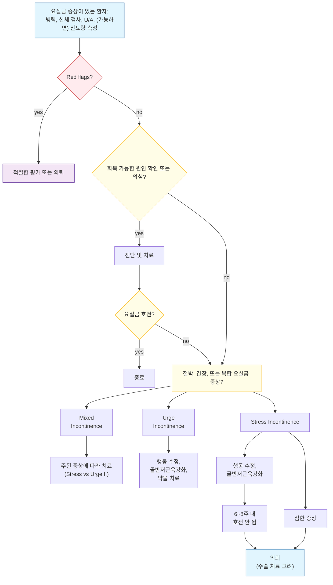
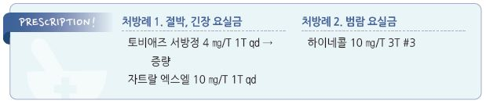

# 요실금 Urinary Incontinence

## 일반 사항

* 객관적으로 확인된 소변의 불수의적 유출
* 발생률 : 젊은 여성의 ¼; ＞75세 여성의 ¾, 남성의 ½
* 요실금 관련 상태 : 하부 요로 증상(LUTS), 과민성 방광(OAB)

## 분류 및 임상 양상

| **요실금 유형**                                                                                                      | **기전**                                                                | **원인/관련 인자**                                                                   | **임상 양상**                                    |
| --------------------------------------------------------------------------------------------------------------- | --------------------------------------------------------------------- | ------------------------------------------------------------------------------ | -------------------------------------------- |
| [**절박 요실금**](ca://s?q=%EC%A0%88%EB%B0%95_%EC%9A%94%EC%8B%A4%EA%B8%88_%EC%A0%95%EC%9D%98) (Urge)                 | overactive bladder 또는 detrusor overactivity에 의한 방광 수축 조절 장애           | 노화, 요로 감염, 변비, 방광 자극 음식, 이뇨 작용 음식(식품, 한약), 중추 신경 손상(파킨슨병, 다발경화증), 감각 신경 자극(추위) | 갑자기 조절할 수 없는 소변 유출(갑작스런 요의를 참을 수 없음), 빈뇨, 야뇨 |
| [**긴장 요실금**](ca://s?q=%EA%B8%B4%EC%9E%A5_%EC%9A%94%EC%8B%A4%EA%B8%88_%EC%A0%95%EC%9D%98) (Stress)               | 골반 지지 장애(골반저 근육 약화)에 따른 요도 괄약근의 불완전 결렬로 인한 요도 수축 장애                   | 외상(질식 분만, 골반 수술), 비만, 호르몬 변화(폐경), 노화, 신경학적 이상                                  | 기침, 재채기, 웃음, 운동, 무거운 물건을 들 때 복압 증가 시 발생      |
| [**범람 요실금**](ca://s?q=%EB%B2%94%EB%9E%8C_%EC%9A%94%EC%8B%A4%EA%B8%88_%EC%A0%95%EC%9D%98) (Overflow)             | neurogenic bladder(detrusor 장애), 방광 출구 폐쇄 등에 의한 과도한 방광 소변 저류, 방광의 과팽창 | BPH, 방광결석, 요도 협착, 변비, 약물(opioid, 항정신병제, 항우울제, 진정제, 항콜린성 약제, α-수용체, CCB)        | 약한 소변 줄기, 지연뇨, 빈뇨, 야뇨                        |
| [**기능성 요실금**](ca://s?q=%EA%B8%B0%EB%8A%A5%EC%84%B1_%EC%9A%94%EC%8B%A4%EA%B8%88_%EC%A0%95%EC%9D%98) (Functional) | 인지 장애 및/또는 이동 장애로 인한 방광 기능과 직접 관련되지 않음                                | 화장실 접근 불가능한 환경, 인지 장애(치매), 이동 장애(파킨슨병)                                         | 증상 발생에 변동성이 있는 요실금                           |

_※배뇨/식사 일지(수분 및 카페인 섭취, 요실금 시간 등)를 3일간 작성하여 평가_

* 절박성 및 긴장성 요실금의 요인이 섞여 있는 혼합형 요실금이 흔함
* 일시적 요실금은 대부분 절박뇨 양상으로 나타남

### 급성/일시적 요실금의 원인

* 요로 감염, 질염
* 섬망, 우울
* 과다 수분 섭취, 음주, 차, 커피, 탄산음료, 인공 감미료, 자극적 음식
* 변비, 활동 제한
*   소변 저류 약물 : 항히스타민제, 항우울제, 항정신병제, 안정제,

    수면제, α-작용제
* 소변량 증가 약물 : 알코올, 카페인, 이뇨제

### 지속적 요실금의 원인

* 노화(Atrophic vaginitis), 임신, 질식 분만, 자궁절제
* Painful bladder syndrome, Interstitial cystitis, 방광 종양, 방광 결석
* 전립선염, BPH, 전립선 종양
* 신경 이상 : 다발경화증, 파킨슨병, 뇌졸중, 뇌종양, 척수 손상

### Red Flags!

* 원인 미상의 갑작스런 발생
* 복부/골반 통증 동반
* 배뇨 장애 또는 중단 없는 유출
* 감염과 무관한 혈뇨
* 신경학적 이상 소견
* 대증 치료에 반응하지 않음
* 재발성 요로 감염(≥3회/년)
* 골반/전립선 방사선 치료, 요실금 수술, 광범위 골반 수술, 자궁탈출증 병력 R

## 진단

*   요실금은 고령에서 흔한 문제이지만 이를 잘 호소하지 않으므로 최소 1년에 한 번은 “소변이 새어 나오지 않는가?”

    문진을 통해 확인하는 것이 필요함

### 검사

* 실험실 검사 : U/A, 배양 검사(선택); 신 기능, 당뇨
* 전립선 검사
*   신경학적 검사 : 감각 이상 진찰, 근 위축 진찰, foot dorsiflexion, foot plantarflexion, toe extension, anal reflex,

    bulbocavernosus reflex
* 영상 검사 및 요역동학 검사 : 경고 징후 해당 시 상부 요로조영촬영, 초음파, CT, 방광경, 방광 용적 및 배뇨 후 잔뇨량 측정

### 문진표

#### Questionnaire for urinary incontinence diagnosis (QUID)

아래의 각 항에 대하여 ‘전혀, 드물게, 가끔, 자주, 대부분, 또는 항상’으로 평가
\
① 기침 또는 재채기를 할 때 소변이 조금이라도 새어나온다.
\
② 허리를 앞으로 구부리거나 물건을 들 때 소변이 조금이라도 새어나온다.
\
③ 빠르게 걷거나 가볍게 달릴 때 또는 운동할 때 소변이 조금이라도 새어나온다.
\
④ 배뇨를 위하여 화장실에서 탈의하는 동안 소변이 조금이라도 새어나온다.
\
⑤ 화장실에 도착하기 전에 소변이 새어나오는 참기 힘든 요의가 생긴다.
\
⑥ 갑작스럽고 참기 힘든 요의 때문에 빨리 화장실에 가야한다.
\
▸▶판정 ①\~③ 문항에 대하여 ‘자주’ 이상에 해당되면 긴장성 요실금 의심
\
④\~⑥ 문항에 대하여 ‘자주’ 이상에 해당되면 절박 요실금 의심

#### 3 Incontinence Questions

1. 최근 3개월 동안 조금이라도 소변이 새어 나온 적이 있다? ⇨ 있으면 2번 문항, 없으면 종료
2.  최근 3개월 동안 다음 중 해당되는 모든 것에 표시&#x20;

    □ 신체 활동(예: 기침, 재채기, 운동 또는 물건을 들 때) 중에 소변이 새어 나온 적이 있다. \
    □ 화장실에 갈 때까지 소변을 참을 수 없었던 적이 있다. \
    □ 신체 활동 없이, 그리고 급하게 소변이 마렵지 않은 상태에서 소변이 새어 나온 적이 있다.
3.  다음 중 최근 3개월 동안 가장 흔히 발생한 내용 한 가지에 표시 진단&#x20;

    □ 신체 활동(예: 기침, 재채기, 운동 또는 물건을 들 때) 중에 소변이 새어 나왔다. Stress I \
    □ 화장실에 갈 때까지 소변을 참을 수 없었다. Urge I \
    □ 신체 활동 없이 그리고 급하게 소변이 마렵지 않은 상태에서 소변이 새어 나왔다. Other \
    □ 신체 활동과 거의 동시에 급하게 소변이 마려워진다. Mixed I

#### Bladder Control Self-Assessment Questionnaire (B-SAQ)

아래의 각 항에 대하여 증상/괴로움 정도를 평가 \
•배점 : ‘전혀 없음=0점, 약간=1점, 보통=2점, 심함=3점’
\
질문 & 증상 점수&#x20;
\
① 소변을 보고 싶을 때 참는 것이 어렵습니까? \
② 소변을 자주 봐야하는 문제가 있습니까?&#x20;
\
③ 밤에 배뇨를 위하여 일어나곤 합니까?&#x20;
\
④ 요실금이 있습니까?

질문 & 괴로움 점수\
위 항목 각각 얼마나 많이 힘듭니까?


▶판정 : 0점= 문제없음, 1\~3점= 경증, 4\~6점= 중등증, 7\~9점= 중증, 10\~12점= 매우 심한 문제

***

## Management

### 치료 방침

* 원인 회피(기저/원인 질환 치료, 유발 약물 중단), 행동 치료, 약물 치료

## 비-약물 치료

#### 생활 습관 중재

* 금연, 적정 체중 관리, 변비 관리
* 수분 섭취 제한(특히 취침 전 수분 섭취 제한. 야뇨가 있는 경우 취침 전 3\~4시간 내로는 수분 섭취를 피함)
  * ✽과다 수분 섭취가 요실금 증상을 악화시킬 수 있지만, 수분 섭취를 너무 적게 하면 소변이 농축되고 방광이 자극되어 절박뇨가 유발될 수 있음
* 음주, 신 음료, 카페인(1일 ≤1잔) 제한

#### 배뇨 환경 개선

* 배뇨 의사 표현 및 화장실 이용 환경 개선
* 패드 또는 기저귀 착용

#### 방광 훈련, 물리 요법

* 골반저/배뇨 근육 강화 : 골반저 근육을 수축시켜 요의를 참고 긴박감이 진정된 후 배뇨, Kegel 운동, 주기적 배뇨 훈련, 요실금 체조(☞ [대한배뇨장애요실금학회](http://www.kcsoffice.org/sub05/sub01_8.html))
* pessary : 방광 자극과 자발적인 수축을 줄여줌; 골반 근육 운동이 여의치 않은 환자에게 고려
* 배뇨 훈련 : 시간제 배뇨, 패턴 배뇨
* 바이오피드백

**Kegel exercise (골반저 근육 운동)**

* 적용 : 절박 및 긴장성 요실금
*   방법 : 골반 근육을 소변이나 방귀를 참을 때처럼 조임 → 이 상태를 10초 동안 유지하고 다음 10초간 이완시킴;

    이 동작을 한 번에 10회씩 하루 3\~4번 시행, 6주 이상 지속
* 주의 : 소변을 보는 도중에는 시도하지 않음

**주기적 배뇨 훈련 (timed & prompted voiding)**

① 평소 배뇨 간격 중 가장 짧은 시간을 기준으로 요의와 무관하게 규칙적 배뇨. 예) 가장 짧은 간격이 1시간이라면 1시간마다 배뇨

② 예정된 시간 전에 요의가 발생하면 주의를 돌리거나 휴식을 취함. 예) 가능한 한 가만히 서 있거나 앉아 있음, 이완(예: 심호흡), 배뇨 생각을 하지 말고 다른 것을 생각함(예: 간단한 암산) → 배뇨를 조절할 수 있다고 느껴지면 천천히 화장실로 감

③ 소변 유출 없이 하루를 보낼 수 있을 때까지 위의 일정을 유지 → 이후 이전 배뇨 간격보다 15분 연장 → 이후 소변 유출 없이 하루를 보내게 되면 다시 15분 연장

④ 배뇨 간격이 3\~4시간이 될 때까지, 또는 일상생활에 지장을 주지 않는 간격이 될 때까지 위의 훈련을 계속 (수 주 이상이 소요될 수 있음)

## 약물 치료

* 최소 권장량으로 시작 → 증상 완화, 환자 만족도, 부작용을 관찰하면서 점차 증량 (☞ [전립선비대증](124_-benign-prostatic-hyperplasia-bph.md#undefined-11)
* 보통 서방형 제제가 부작용이 적음
* 6(4\~12)주 치료 후 효과 판단

### 절박 요실금 (Urge incontinence)

* 지속형 antimuscarinics or β3-작용제 → 실패 시 증량, 다른 antimuscarinics로 교체 또는 병용

#### Antimuscarinics

* 작용 : 불수의적 방광 수축 감소, 방광 용적 증가; 절박 또는 긴장성 요실금에 적용
* 제제간의 효과 차이는 명확하지 않음
* 부작용 : 입마름, 눈 마름, 두통, 변비, 빈맥, 시야 흐림, 졸음, delirium, CYP450 대사
*   주의/금기 : 조절되지 않는 녹내장, 중증 심/간/신 장애, 장폐색, 요로폐색, 위장 비움 장애, cholinesterase 억제제

    복용자(치매), 쇠약한 고령자
* darifenacin :  7.5 qd / 15 qd (시작//최대 ㎎)
* fesoterodine : 4 qd / 8 qd \[토비애즈]
* imidafenacin : 0.1 bid/ 0.2 bid \[유리토스]&#x20;
* oxybutynin : 2.5\~5 bid\~tid / 5 qid \[디트로판]&#x20;
* propiverine : 20 qd / 20 bid \[비유피-4]&#x20;
* solifenacin : 5 qd / 10 qd \[베시케어]
* tolterodine : 2 qd / 4 qd \[디트루시톨]&#x20;
* trospium : 20 qd / 20 bid \[스파스몰리트]&#x20;

#### β3-작용제 (β3-adrenoceptor agonist)

* 작용 : detrusor muscle에 대한 선택적 β-수용체 자극 → smooth muscle 이완
* antimuscarinics에 비하여 입마름이 적음; antimuscarinics와 병용 가능
* 부작용 : 빈맥, 요도염, 혈압 상승
* 주의/금기 : 허약한 고령자, 고혈압, 심장 질환
* mirabegron : 시작 25 ㎎/d → 2\~4주 후 50 ㎎/d. 늦은 작용(8주) \[베타미가]

#### α-차단제 (α-adrenergic antagonist)

* 작용 : smooth muscle, urethra, prostate capsule 이완 (보험주의)
* BPH, detrusor overactivity, 잔뇨량 ≤150 ㎖ 인 남성에서 antimuscarinics와 병용 시 효과
* 부작용 : 저혈압
* alfuzosin : 10 ㎎ qd \[자트랄]
* tamsulosin : 0.4\~0.8 ㎎ qd \[하루날 디]
* silodosin : 8 ㎎ qd \[트루패스]

#### TCA

* imipramine : 10\~25 ㎎ bid\~tid \[이미프라민]

### 긴장 요실금 (Stress incontinence)

* antimuscarinics (✽긴장 요실금에 대한 FDA 승인 약제는 없음)
* SNRI : duloxetine 60 ㎎/d \[심발타]&#x20;

### 범람 요실금 (Overflow incontinence)

#### 5α-reductase 억제제

* 작용 : 전립선 크기 감소
* 부작용 : 기립성 저혈압, 어지럼, 성 기능 장애, 쇠약감
* finasteride : 5 ㎎ qd \[프로스카]
* dutasteride : 0.5 ㎎ qd \[아보다트]

#### 콜린 작용제

* 작용 : 방광 수축 자극
* 부작용 : 저혈압, 빈맥, 홍조, 두통, 소화 장애, 절박뇨, 눈물, 축동, 천식 발작, 발한
* 금기 : 천식, 서맥, 저혈압, 미주신경긴장항진증, 관상동맥병, 간질, 위장관 수술, 방광 수술, 갑상선항진증, 파킨슨병, 소화성 궤양
* bethanechol : 10\~30 ㎎ tid \[하이네콜]

### 기타

* 국소 vaginal estrogen : 질 위축이 있는 폐경기 여성에서 고려; 효과 불확실 (☞ p.599)
* 간헐적 도뇨관 배뇨, 도뇨관 삽입 : 범람 요실금에 적용
* bladder neck suspension 또는 suburethral sling : 긴장형 요실금에 적용
* sacral neuromodulation : 절박 요실금에 적용
* onabotulinumtoxin A : 배뇨근 내 주사; 절박 요실금에 적용
* electrical sacral nerve stimulation : 방광 이완 효과; 절박 요실금에 적용

```mermaid
graph TD
    A["요실금 증상이 있는 환자:<br/>병력, 신체 검사, U/A, (가능하면) 잔뇨량 측정"] --> B{"Red flags?"}
    B -->|yes| C["적절한 평가 또는 의뢰"]
    B -->|no| D{"회복 가능한 원인 확인 또는 의심?"}
    D -->|yes| E["진단 및 치료"]
    E --> F{"요실금 호전?"}
    F -->|yes| G["종료"]
    F -->|no| H["절박, 긴장, 또는 복합 요실금 증상?"]
    D -->|no| H
    
    H --> I["Mixed<br/>Incontinence"]
    H --> J["Urge<br/>Incontinence"]
    H --> K["Stress Incontinence"]
    
    I --> L["주된 증상에 따라 치료<br/>(Stress vs Urge I.)"]
    J --> M["행동 수정,<br/>골반저근육강화,<br/>약물 치료"]
    
    K --> N["행동 수정,<br/>골반저근육강화"]
    K --> O["심한 증상"]
    
    N --> P["6~8주 내<br/>호전 안 됨"]
    P --> Q["의뢰<br/>(수술 치료 고려)"]
    O --> Q

    style A fill:#e1f5fe,stroke:#01579b
    style B fill:#ffebee,stroke:#c62828
    style C fill:#f3e5f5,stroke:#4a148c
    style D fill:#fffde7,stroke:#fbc02d
    style F fill:#fffde7,stroke:#fbc02d
    style H fill:#fffde7,stroke:#fbc02d
    style Q fill:#e1f5fe,stroke:#01579b
```

요실금 관리 알고리듬
\
Ref. Urinary incontinence in Women: Evaluation and Management. AFT 2019; 100(6). Fig 3

**질병코드**&#x20;

N39.3 스트레스요실금

N39.40 절박요실금

N39.41 혼합요실금

N39.48 기타 명시된 요실금

## 처방례

처방례 1. 절박, 긴장 요실금
\
토비애즈 서방정 4 ㎎/T 1T qd →
\
증량
\
자트랄 엑스엘 10 ㎎/T 1T qd


\
처방례 2. 범람 요실금
\
하이네콜 10 ㎎/T 3T #3

