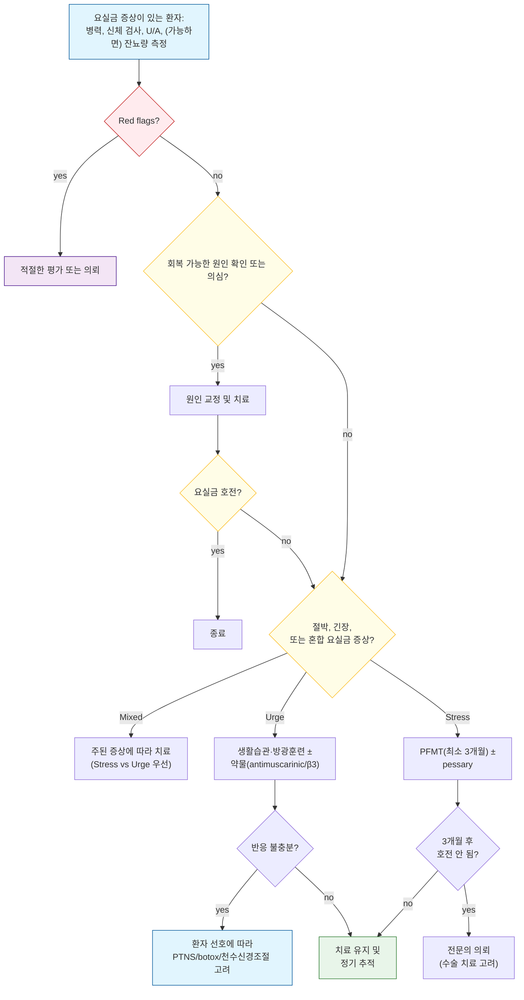

# 요실금 Urinary Incontinence (UI)

## <mark style="color:green;">일반 사항</mark>

* 불수의적인 소변 유출을 호소하는 상태 (ICS 정의)
* 관련 상태 : 하부 요로 증상(LUTS), 과민성 방광(OAB, 요실금을 동반하지 않을 수도 있음)
* 유병률 : 젊은 여성의 ¼; 75세 이상 여성의 ¾, 남성의 ½
* 분류 : **절박 요실금**, **긴장 요실금**, **범람 요실금**, **기능성 요실금**; 절박·긴장 요인이 혼합된 **혼합형 요실금**이 흔함

***

## <mark style="color:green;">원인 및 위험 인자</mark>

### <mark style="color:orange;">유형별 기전 및 원인</mark>

<table><thead><tr><th width="110">요실금 유형</th><th width="190">기전</th><th width="230">원인/관련 인자</th><th>임상 양상</th></tr></thead><tbody><tr><td><strong>절박 요실금</strong><br>(Urge)</td><td>overactive bladder 또는 detrusor overactivity에 의한 방광 수축 조절 장애</td><td>노화, 요로 감염, 변비, 방광 자극 음식, 이뇨 작용 음식(식품, 한약), 중추 신경 손상(파킨슨병, 다발경화증), 감각 신경 자극(추위)</td><td>갑자기 조절할 수 없는 소변 유출(갑작스런 요의를 참을 수 없음), 빈뇨, 야뇨</td></tr><tr><td><strong>긴장 요실금</strong><br>(Stress)</td><td>골반 지지 장애(골반저 근육 약화)에 따른 요도 괄약근의 불완전 폐쇄로 인한 요도 수축 장애</td><td>외상(질식 분만, 골반 수술), 비만, 호르몬 변화(폐경), 노화, 신경학적 이상</td><td>기침, 재채기, 웃음, 운동, 무거운 물건을 들 때 등 복압 증가 시 발생</td></tr><tr><td><strong>범람 요실금</strong><br>(Overflow)</td><td>neurogenic bladder(detrusor 장애), 방광 출구 폐쇄 등에 의한 방광 소변 과잉 저류, 방광 과팽창</td><td>BPH, 방광결석, 요도 협착, 변비, 약물(opioid, 항정신병제, 항우울제, 진정제, 항콜린성 약제, α-작용제, CCB)</td><td>약한 소변 줄기, 지연뇨, 빈뇨, 야뇨</td></tr><tr><td><strong>기능성 요실금</strong><br>(Functional)</td><td>인지 장애 및/또는 이동 장애로 방광 기능과 직접 관련되지 않음</td><td>화장실 접근이 어려운 환경, 인지 장애(치매), 이동 장애(파킨슨병)</td><td>증상 발생에 변동성이 있는 요실금</td></tr></tbody></table>

### <mark style="color:orange;">급성/일시적 요실금의 원인</mark>

* 요로 감염, 질염
* 섬망, 우울
* 과다 수분 섭취, 음주, 차, 커피, 탄산음료, 인공 감미료, 자극적 음식
* 변비, 활동 제한
* 소변 저류 약물 : 항히스타민제, 항우울제, 항정신병제, 안정제, 수면제, α-작용제
* 소변량 증가 약물 : 알코올, 카페인, 이뇨제

### <mark style="color:orange;">지속적 요실금의 원인</mark>

* 노화, 임신, 질식 분만, 자궁절제
* 폐경 후 GSM(생식비뇨기증후군)/질 위축(atrophic vaginitis)
* 전립선염, BPH, 전립선 종양
* 신경 이상 : 다발경화증, 파킨슨병, 뇌졸중, 뇌종양, 척수 손상

***

### <mark style="color:$danger;">🚩 Red Flags!</mark>

<mark style="color:$danger;">**즉각 조치 또는 의뢰**</mark>

* 새로 발생한 요폐/요실금이 **안장 마취(saddle anesthesia), 하지 위약, 변실금**과 동반 → 마미증후군(cauda equina syndrome) 의심, 즉시 응급 평가
* 급성 요폐(완전 배뇨 불가) + 하복부 팽만·통증

<mark style="color:$warning;">**당일 또는 조기 의뢰**</mark>

* 감염과 무관한 육안적 혈뇨(여성의 경우 월경과의 감별 필요) → 악성종양 배제 위한 비뇨의학과 의뢰
* 배뇨 조절과 무관하게 지속적으로(중단 없이) 새는 유출, 특히 골반/전립선 방사선 치료·요실금 수술·광범위 골반 수술·자궁탈출증 병력이 있는 경우 → 누공(fistula) 의심
* 새로 발생한 국소 신경학적 이상 소견(마미증후군 소견 제외)
* 원인 미상의 갑작스런 발생, 복부/골반 통증 동반

<mark style="color:$info;">**외래 추적 / 추가 평가 계획**</mark> <mark style="color:$info;">- 즉각 위험 낮으나 호전 없으면 의뢰</mark>

* 적절한 기간의 보존적 치료에도 반응이 불충분한 경우(예: SUI/MUI의 supervised PFMT ≥3개월, OAB/UUI의 방광훈련·약물치료 후 재평가)
* 반복되는 요로 감염(EAU/AUA 기준 : ≥3회/12개월 또는 ≥2회/6개월), 특히 혈뇨·배뇨장애·고잔뇨 등이 동반되면 추가 평가
* 원인이 불명확하여 요역동학 검사 등 추가 평가가 필요한 경우

***

## <mark style="color:green;">진단</mark>

* 요실금은 고령에서 흔한 문제이지만 환자가 먼저 호소하지 않는 경우가 많아, 최소 1년에 한 번은 "소변이 새어 나오지 않는가?"를 문진으로 확인하는 것이 필요함
* 배뇨/식사 일지(수분 및 카페인 섭취, 요실금 발생 시간 등)를 3일간 작성하면 유형 감별과 중증도 평가에 도움이 됨

### <mark style="color:orange;">검사</mark>

* 실험실 검사 : U/A, 배양 검사(선택); 신 기능, 혈당
* 전립선 검사(남성)
* 여성 골반 진찰 : 외음부·질 위축, 골반장기탈출증(POP), 골반저근육 수축력 평가; 필요 시 cough stress test
* 신경학적 검사 : 감각 이상 진찰, 근 위축 진찰, foot dorsiflexion, foot plantarflexion, toe extension, anal reflex, bulbocavernosus reflex
* 배뇨 후 잔뇨량(PVR) : 배뇨곤란·약한 요류·요폐/범람 요실금 의심, BPH/BOO, 신경계 질환, 항무스카린제 사용에 따른 요폐 위험이 있으면 측정; 고령자·남성·요폐 유발 약물(항콜린제, 오피오이드 등) 복용자에서는 초기 평가에 적극 포함. 임상적으로 유의한 PVR의 절대 cutoff는 확립되어 있지 않으므로, 잔뇨량·배뇨 증상·방광 용적을 함께 평가; PVR이 유의하게 증가한 경우 항무스카린제 사용에 주의(남성 BPH/OAB의 PVR 기준은 [전립선비대증](124_-benign-prostatic-hyperplasia-bph.md) 챕터 참고)
* 초음파 : PVR 측정에 유용; 그 외 요로 초음파는 기저 병변이 의심되는 경우 선택적으로 시행
* 추가 검사 : 적응증에 따라 상부 요로조영촬영·CT 등 영상검사 또는 방광경 검사 시행
* 요역동학 검사 : 단순 요실금의 초기 평가에서 routine으로 시행하지 않음; 진단이 불명확하거나 배뇨장애/신경인성 방광이 의심되거나 침습적 치료 전 추가 평가가 필요한 경우 고려

### <mark style="color:orange;">문진표</mark>

#### <mark style="color:$primary;">Questionnaire for Urinary Incontinence Diagnosis (QUID)</mark>

아래 각 항목에 대하여 '전혀, 드물게, 가끔, 자주, 대부분, 또는 항상'으로 평가\
① 기침 또는 재채기를 할 때 소변이 조금이라도 새어나온다.\
② 허리를 앞으로 구부리거나 물건을 들 때 소변이 조금이라도 새어나온다.\
③ 빠르게 걷거나 가볍게 달릴 때 또는 운동할 때 소변이 조금이라도 새어나온다.\
④ 배뇨를 위하여 화장실에서 탈의하는 동안 소변이 조금이라도 새어나온다.\
⑤ 화장실에 도착하기 전에 소변이 새어나오는 참기 힘든 요의가 생긴다.\
⑥ 갑작스럽고 참기 힘든 요의 때문에 빨리 화장실에 가야 한다.

▸▶판정 : 각 문항을 0\~5점(전혀=0 \~ 항상=5)으로 채점; Stress score(①+②+③) ≥4점 → 긴장성 요실금 의심, Urge score(④+⑤+⑥) ≥6점 → 절박 요실금 의심 [Bradley CS, et al. Neurourol Urodyn 2010]

#### <mark style="color:$primary;">3 Incontinence Questions (3IQ)</mark>

1. 최근 3개월 동안 조금이라도 소변이 새어 나온 적이 있다? → 있으면 2번 문항, 없으면 종료
2. 최근 3개월 동안 다음 중 해당되는 모든 것에 표시 :\
   □ 신체 활동(예: 기침, 재채기, 운동 또는 물건을 들 때) 중에 소변이 새어 나온 적이 있다.\
   □ 화장실에 갈 때까지 소변을 참을 수 없었던 적이 있다.\
   □ 신체 활동 없이, 그리고 급하게 소변이 마렵지 않은 상태에서 소변이 새어 나온 적이 있다.
3. 다음 중 최근 3개월 동안 가장 흔히 발생한 내용 한 가지에 표시 :\
   □ 신체 활동 중에 소변이 새어 나왔다 → Stress incontinence\
   □ 화장실에 갈 때까지 소변을 참을 수 없었다 → Urge incontinence\
   □ 신체 활동 없이, 급하게 소변이 마렵지 않은 상태에서 새어 나왔다 → Other\
   □ 신체 활동과 거의 동시에 급하게 소변이 마려워진다 → Mixed incontinence

#### <mark style="color:$primary;">Bladder Control Self-Assessment Questionnaire (B-SAQ)</mark>

증상/괴로움 정도를 '전혀 없음=0점, 약간=1점, 보통=2점, 심함=3점'으로 평가\
① 소변을 보고 싶을 때 참는 것이 어렵습니까?\
② 소변을 자주 봐야 하는 문제가 있습니까?\
③ 밤에 배뇨를 위하여 일어나곤 합니까?\
④ 요실금이 있습니까?

▶판정 : 0점 = 문제없음, 1\~3점 = 경증, 4\~6점 = 중등증, 7\~9점 = 중증, 10\~12점 = 매우 심한 문제

### <mark style="color:orange;">감별 진단</mark>

* 진성 요실금과 감별이 필요한 상황 : 요도-질 누공 등에 의한 지속적(체위 무관) 유출, 야뇨증(nocturnal enuresis, 수면 중에만 발생), 빈뇨/절박감만 있고 실제 유출은 없는 순수 과민성 방광
* painful bladder syndrome, interstitial cystitis, 방광 종양, 방광 결석 : 요실금보다는 빈뇨·절박감·통증으로 발현하는 경우가 많으나 감별이 필요; Red Flags 항목(혈뇨, 반응 불량) 참고

***


```mermaid
graph TD
    A["요실금 증상이 있는 환자:<br/>병력, 신체 검사, U/A, (가능하면) 잔뇨량 측정"] --> B{"Red flags?"}
    B -->|yes| C["적절한 평가 또는 의뢰"]
    B -->|no| D{"회복 가능한 원인 확인 또는 의심?"}
    D -->|yes| E["원인 교정 및 치료"]
    E --> F{"요실금 호전?"}
    F -->|yes| G["종료"]
    F -->|no| H{"절박, 긴장,<br/>또는 혼합 요실금 증상?"}
    D -->|no| H

    H -->|Mixed| I["주된 증상에 따라 치료<br/>(Stress vs Urge 우선)"]
    H -->|Urge| J["생활습관·방광훈련 ±<br/>약물(antimuscarinic/β3)"]
    H -->|Stress| K["PFMT(최소 3개월) ±<br/>pessary"]

    J --> M{"반응 불충분?"}
    M -->|yes| Q["환자 선호에 따라<br/>PTNS/botox/천수신경조절 고려"]
    M -->|no| S["치료 유지 및<br/>정기 추적"]

    K --> N{"3개월 후<br/>호전 안 됨?"}
    N -->|yes| R["전문의 의뢰<br/>(수술 치료 고려)"]
    N -->|no| S

    style A fill:#e1f5fe,stroke:#01579b
    style B fill:#ffebee,stroke:#c62828
    style C fill:#f3e5f5,stroke:#4a148c
    style D fill:#fffde7,stroke:#fbc02d
    style F fill:#fffde7,stroke:#fbc02d
    style H fill:#fffde7,stroke:#fbc02d
    style Q fill:#e1f5fe,stroke:#01579b
    style S fill:#e8f5e9,stroke:#2e7d32
```

<p align="center"><strong>요실금 평가 및 치료 알고리듬</strong></p>

***

## <mark style="background-color:$warning;">Management</mark>


**단계별 치료 전략**\
AUA/SUFU 과민성방광 가이드라인(2024)은 단계적(step) 치료 대신 환자의 선호·내약성을 고려한 **공동 의사결정(shared decision-making)**을 강조함. 행동 치료·물리 치료·약물 치료는 순차적이라기보다 병행 가능한 선택지로 접근


### <mark style="color:orange;">치료 방침</mark>

* 원인 회피(기저·유발 질환 치료, 유발 약물 중단)가 우선
* 절박·긴장·혼합형 요실금 : 생활 습관 교정 및 적절한 행동/골반저 치료를 우선 고려
* 범람 요실금 : 잔뇨량과 요폐 여부를 먼저 평가하여 방광 배출 확보 및 원인 질환(BPH/BOO 등) 치료를 우선함
* 약물 치료는 행동 치료에 반응이 불충분하거나 환자가 병행을 원할 때 추가
* 고령자 : 다제약물·인지저하 위험을 고려하여 항콜린 부담이 적은 약제(β3-작용제 등)를 우선 고려

***

## <mark style="color:green;">비-약물 치료 및 예방</mark>

#### <mark style="color:$primary;">생활 습관 중재</mark>

* 금연, 적정 체중 관리, 변비 관리
* 과도한 수분 섭취를 피하고 적정 수분 섭취 유지; 야뇨가 문제인 경우 취침 전 수 시간 동안 과도한 수분 섭취를 피함
  * ✽과다 수분 섭취는 요실금 증상을 악화시킬 수 있으나, 너무 적은 섭취는 소변이 농축되어 방광이 자극되고 절박뇨가 유발될 수 있음
* 음주, 신 음료, 카페인 섭취 감소(증상과의 연관성을 보며 조절)

#### <mark style="color:$primary;">배뇨 환경 개선</mark>

* 배뇨 의사 표현 및 화장실 이용 환경 개선
* 패드 또는 기저귀 착용

#### <mark style="color:$primary;">방광 훈련, 물리 요법</mark>

* 골반저/배뇨 근육 강화 : 요의를 참고 긴박감이 진정된 후 배뇨, Kegel 운동, 주기적 배뇨 훈련, 요실금 체조(☞ [대한배뇨장애요실금학회](http://www.kcsoffice.org/sub05/sub01_8.html))
* continence pessary : 요도·방광경부를 기계적으로 지지하여 복압 상승 시 요누출을 감소시킴; 긴장 요실금에서 비수술적 치료를 원하는 경우 고려
* 시간제 배뇨, 패턴 배뇨
* 바이오피드백
* 경피적 후경골신경 자극술(PTNS, percutaneous tibial nerve stimulation) : 항콜린제 또는 β3-작용제에 반응이 불충분하거나 부작용으로 사용이 어려운 절박 요실금에서 환자 선호에 따라 고려하는 최소침습 치료 옵션 [AUA/SUFU 2024]

#### <mark style="color:$primary;">Kegel exercise (골반저 근육 운동, PFMT)</mark>

* 적용 : 절박, 긴장, 혼합형 요실금
* Supervised training(전문 인력의 지도하에 시행)이 자가 운동만 하는 경우보다 유의하게 효과가 크므로, 가능하면 물리치료사·전문 간호사의 지도를 받도록 권장
* 단계별 방법 :
  1. 올바른 근육 확인 : 방귀를 참거나 소변을 참는 느낌으로 항문·질·요도 주변을 안쪽·위쪽으로 조이는 근육을 확인; 처음에는 전문가의 지도하에 정확한 수축 여부를 확인하는 것이 바람직
  2. 수축 : 확인된 골반저근을 조여 10초간 유지(처음에는 3\~5초부터 시작해 점차 늘림); 복부·엉덩이·허벅지 근육은 힘을 주지 않고 골반저근만 사용
  3. 이완 : 10초간 완전히 이완; 수축과 이완 시간을 비슷하게 유지
  4. 반복 : 위 수축-이완을 8\~10회 1세트로, 1일 3회 시행
  5. 지속 : 긴장/혼합 요실금의 PFMT는 최소 3개월 지속; 절박 요실금에서는 방광훈련과 PFMT를 병행할 수 있으며 방광훈련은 최소 6주 시행 — 조기에 효과를 판정하지 않도록 안내
* 주의 : 배뇨 도중에는 이 동작을 반복 훈련으로 시행하지 않음(요폐·불완전 배뇨 위험)

#### <mark style="color:$primary;">주기적 배뇨 훈련 (timed & prompted voiding)</mark>

1. 평소 배뇨 간격 중 가장 짧은 시간을 기준으로 요의와 무관하게 규칙적 배뇨(예: 가장 짧은 간격이 1시간이면 1시간마다 배뇨)
2. 예정된 시간 전에 요의가 발생하면 주의를 돌리거나 휴식(가만히 서 있거나 앉기, 심호흡, 간단한 암산 등) → 배뇨를 조절할 수 있다고 느껴지면 천천히 화장실로 이동
3. 소변 유출 없이 하루를 보낼 수 있을 때까지 유지 → 이후 배뇨 간격을 15분씩 연장
4. 배뇨 간격이 3\~4시간이 되거나 일상생활에 지장이 없는 간격이 될 때까지 지속(수 주 이상 소요될 수 있음)

***

## <mark style="color:green;">약물 치료</mark>

* 최소 권장량으로 시작 → 증상 완화, 환자 만족도, 부작용을 관찰하면서 점차 증량 (☞ [전립선비대증](124_-benign-prostatic-hyperplasia-bph.md))
* 보통 서방형 제제가 부작용이 적음
* 6(4\~12)주 치료 후 효과 판단

### <mark style="color:orange;">절박 요실금 (Urge incontinence)</mark>

* 지속형 antimuscarinics 또는 β3-작용제로 시작 → 실패 시 증량, 다른 antimuscarinics로 교체, 또는 계열 간 병용 고려 [AUA/SUFU 2024]

#### <mark style="color:$primary;">Antimuscarinics</mark>

* 작용 : 불수의적 배뇨근 수축을 억제하여 절박뇨·빈뇨·절박 요실금을 감소시킴; OAB/절박 요실금 및 절박 증상이 동반된 혼합형 요실금에 적용
* 제제 간 효과 차이는 명확하지 않음
* 부작용 : 입마름, 눈 마름, 두통, 변비, 빈맥, 시야 흐림, 졸음, delirium(특히 고령자), CYP450 대사
* 주의/금기 : 요폐/중증 방광출구폐색, 위장관 폐색 또는 심한 위장관 운동저하, 조절되지 않는 협우각녹내장; 신·간기능에 따른 용량조절 및 약제별 허가사항 확인 필요
  * ✽고령자에서는 anticholinergic burden 누적에 따른 인지기능 저하 위험을 고려하여 β3-작용제를 우선 고려하거나 최소 유효 용량 사용
* darifenacin : 7.5 qd / 15 qd (시작//최대 ㎎)
* fesoterodine : 4 qd / 8 qd <mark style="color:blue;">\[토비애즈]</mark>
* imidafenacin : 0.1 bid / 0.2 bid <mark style="color:blue;">\[유리토스]</mark>
* oxybutynin : 2.5\~5 bid\~tid / 5 qid <mark style="color:blue;">\[디트로판]</mark>
* propiverine : 20 qd / 20 bid <mark style="color:blue;">\[비유피-4]</mark>
* solifenacin : 5 qd / 10 qd <mark style="color:blue;">\[베시케어]</mark>
* tolterodine : 2 qd / 4 qd <mark style="color:blue;">\[디트루시톨]</mark>
* trospium : 20 qd / 20 bid <mark style="color:blue;">\[스파스몰리트]</mark>

#### <mark style="color:$primary;">β3-작용제 (β3-adrenoceptor agonist)</mark>

* 작용 : detrusor muscle에 대한 선택적 β3-수용체 자극 → smooth muscle 이완
* antimuscarinics에 비해 입마름·인지기능 관련 부작용이 적어 고령자·다제약물 환자에서 선호; antimuscarinics와 병용 가능 [AUA/SUFU 2024]
* 부작용 : 빈맥, 요로감염
* mirabegron : 시작 25 ㎎/d → 2\~4주 후 50 ㎎/d로 증량; 효과 발현이 늦음(약 8주); 조절되지 않는 중증 고혈압(수축기 ≥180 mmHg 또는 이완기 ≥110 mmHg)에서는 금기 [FDA label 기준] <mark style="color:blue;">\[베타미가]</mark>
* vibegron : 50 ㎎ qd, 식후 투여 (2022년 국내 허가, 2023년 비급여로 출시; 2026년 8월 기준 급여 미등재로 전액 본인부담); mirabegron 대비 상대적으로 혈압에 미치는 영향이 적음; 방광출구폐쇄 환자·항무스카린제 병용 시 소변 정체 위험 증가로 신중 투여, 신·간기능 장애 시 국내 허가사항 확인 필요 <mark style="color:blue;">\[베오바]</mark>

### <mark style="color:orange;">긴장 요실금 (Stress incontinence)</mark>

* PFMT(최소 3개월) 및 continence pessary가 1차 치료; ✽긴장 요실금 자체에 대해 FDA 승인된 약물은 없음
* SNRI : duloxetine — 국내 SUI 적응증 허가 외 사용. 증상 감소 효과는 있으나 완치율이 낮고 오심·어지럼 등 부작용 및 치료 중단률이 높음; 사용 시 저용량에서 시작하여 서서히 증량·감량 <mark style="color:blue;">\[심발타]</mark>

### <mark style="color:orange;">혼합형 요실금 (Mixed incontinence)</mark>

* 주된 증상(절박 vs 긴장)에 따라 우선 치료 방향 결정
* 절박 요소 : antimuscarinics 또는 β3-작용제
* 긴장 요소 : PFMT, continence pessary

### <mark style="color:orange;">범람 요실금 (Overflow incontinence)</mark>

#### <mark style="color:$primary;">원인 질환 치료 — BPH/방광출구폐색(BOO)</mark>

* α-차단제 ± 5α-reductase 억제제로 방광 출구 저항 완화 (☞ [전립선비대증](124_-benign-prostatic-hyperplasia-bph.md))
* α-차단제 : smooth muscle, urethra, prostate capsule 이완(보험 급여 기준 확인 필요); 부작용 — 저혈압
  * alfuzosin : 10 ㎎ qd <mark style="color:blue;">\[자트랄]</mark>
  * tamsulosin : 0.2 ㎎ qd (효과 불충분 시 0.4 ㎎ qd로 증량; 국내는 0.2 ㎎이 표준 시작 용량) <mark style="color:blue;">\[하루날 디]</mark>
  * silodosin : 8 ㎎ qd <mark style="color:blue;">\[트루패스]</mark>
* 5α-reductase 억제제 : 전립선 크기 감소; 부작용 — 성욕 감소, 발기부전, 사정 장애, 여성형 유방/유방 압통
  * finasteride : 5 ㎎ qd <mark style="color:blue;">\[프로스카]</mark>
  * dutasteride : 0.5 ㎎ qd <mark style="color:blue;">\[아보다트]</mark>
* 유의한 요폐/고잔뇨 : 간헐적 도뇨 등 방광 배출 확보 우선

#### <mark style="color:$primary;">콜린 작용제</mark>

* bethanechol 등 parasympathomimetic은 detrusor underactivity(방광 배출 장애)에 대한 임상적 유효성 근거가 부족하고 부작용(저혈압, 빈맥, 소화 장애, 천식 발작 등) 위험이 있어 routine으로 권장하지 않음; 간헐적 도뇨가 우선 고려됨

***

## <mark style="color:green;">시술 및 기타 처치</mark>

* 국소 vaginal estrogen : GSM/질 위축이 동반된 폐경 여성에서 고려; 요로·질 증상 및 일부 요실금 증상 개선에 도움이 될 수 있음 [EAU 2025]. 전신(systemic) estrogen은 요실금을 개선하지 않으며 오히려 악화시킬 수 있어 요실금 치료 목적으로 사용하지 않음
* 간헐적 도뇨, 유치 도뇨관 삽입 : 범람 요실금에 적용
* bladder neck suspension 또는 suburethral sling : 긴장형 요실금에 적용
* sacral neuromodulation, onabotulinumtoxinA 배뇨근 내 주사 : 절박 요실금에서 행동·약물 치료로 충분한 효과를 얻지 못하거나 약물 치료를 원하지 않는 환자에서 환자 선호에 따라 고려; onabotulinumtoxinA는 요폐 위험으로 자가 도뇨 가능 여부 사전 확인 필요

***

### <mark style="color:red;">질병코드</mark>

N39.3 스트레스요실금 Stress incontinence

N39.40 절박요실금 Urge incontinence

N39.41 혼합요실금 Mixed incontinence

N39.4 기타 명시된 요실금 Other specified urinary incontinence

R32 상세불명의 요실금 Unspecified urinary incontinence

***

## <mark style="color:purple;">처방례</mark>

> **처방례 1. 절박 요실금, 경증\~중등도**
>
> ```
> 베시케어정 5 ㎎/T   1T   qd
> ```
>
> _✽1차 선택 antimuscarinic; 4\~6주 후 효과 및 입마름·변비 등 부작용 평가 후 필요시 10 mg으로 증량_

> **처방례 2. 절박 요실금, 고령자 또는 인지저하 위험군**
>
> ```
> 베타미가서방정 25 ㎎/T   1T   qd
> ```
>
> _✽antimuscarinic 대비 항콜린 부담이 적어 고령·다제약물·인지저하 위험 환자에서 우선 고려; 효과 발현까지 최대 8주 소요될 수 있음을 설명; 2\~4주 후 반응 불충분하면 50 mg으로 증량_

> **처방례 3. 긴장 요실금**
>
> ```
> Kegel 운동(PFMT) 1일 3회 (10초 수축-10초 이완, 8회 이상/회) 최소 3개월, 가능하면 supervised training
> continence pessary 착용 고려 (골반저 운동 병행이 어려운 경우)
> ```
>
> _✽긴장 요실금은 PFMT·continence pessary가 1차 치료이며 FDA 승인 약물은 없음; 최소 3개월의 적절한 PFMT에도 증상이 지속되고 치료를 원하는 경우 전문의 의뢰 및 수술적 치료 고려_

> **처방례 4. 범람 요실금(BPH 동반 남성)**
>
> ```
> 하루날디캡슐 0.2 ㎎/C   1C   qd
> 아보다트연질캡슐 0.5 ㎎/C   1C   qd
> ```
>
> _✽α-차단제 + 5α-reductase 억제제 병용; 잔뇨량이 많거나 반응 불충분 시 간헐적 도뇨 및 비뇨의학과 의뢰_

> **처방례 5. 혼합형 요실금**
>
> ```
> 디트루시톨서방캡슐 4 ㎎/C   1C   qd
> Kegel 운동 병행
> ```
>
> _✽주된 증상(절박 vs 긴장)에 따라 우선 치료 방향을 정하되, 약물(절박 요소) + 행동 치료(긴장 요소)를 함께 진행_

***

### <mark style="color:$success;">핵심 복약 지도</mark>

> **Antimuscarinics 복약 지도**
>
> * 효과는 서서히 나타나며 4\~6주(최대 12주) 복용 후 판정합니다.
> * 서방형 제제가 속효형보다 입마름 등 부작용이 적으므로 우선 선택합니다.
> * 고령 환자, 특히 여러 약을 함께 복용 중이거나 인지기능 저하가 있는 경우 항콜린 부담이 누적되어 혼동·기억력 저하로 이어질 수 있어 정기적 재평가가 필요합니다.
> * 조절되지 않는 녹내장, 중증 위장관/요로 폐색이 있으면 사용하지 않습니다.

> **β3-작용제 복약 지도**
>
> * mirabegron은 효과 발현까지 최대 8주가 걸릴 수 있어 조기에 중단하지 않도록 안내합니다. 고혈압 환자는 치료 초기 및 정기적으로 혈압을 확인합니다.
> * vibegron은 혈압에 미치는 영향이 상대적으로 적습니다.

> **Duloxetine 복약 지도**
>
> * 긴장 요실금에 대한 duloxetine 사용은 국내 **허가 외(off-label) 사용**임을 환자에게 명확히 설명합니다.
> * 오심·어지럼 등 초기 부작용을 줄이기 위해 저용량부터 시작하여 서서히 증량합니다.

> **행동 치료 순응도**
>
> * 긴장/혼합 요실금의 골반저 근육 운동(PFMT)은 최소 3개월, 절박 요실금의 방광 훈련은 최소 6주 이상 꾸준히 지속해야 효과가 나타나며, 약물 치료와 병행 시 성공률이 높아짐을 설명합니다.

> **언제 다시 병원을 방문해야 하나요?**
>
> * 적절한 기간의 보존적 치료(SUI/MUI는 PFMT 최소 3개월, OAB/UUI는 방광훈련·약물치료 후 재평가)에도 증상이 호전되지 않는 경우
> * 감염과 무관한 **혈뇨**가 발생한 경우 — 조기 내원
> * 갑작스런 **배뇨 곤란/요폐**, 하지 위약, 회음부 감각 저하가 동반되는 경우 — 즉시 내원
> * 약물 복용 중 심한 입마름·변비·인지 변화 등 부작용이 발생한 경우

***

### <mark style="color:blue;">환자 안내서</mark>


**요실금, 흔하지만 참지 않아도 되는 문제입니다**

요실금은 나이가 들면서 흔히 생기지만 치료로 충분히 좋아질 수 있는 문제입니다. 부끄러워서 숨기기보다는 의료진과 상의하시는 것이 좋습니다.


#### <mark style="color:$primary;">왜 소변이 새나요?</mark>

* 방광이 너무 예민해져서 참지 못하고 소변이 새는 경우(절박 요실금)
* 기침·재채기·운동처럼 배에 힘이 들어갈 때 소변이 새는 경우(긴장 요실금) — 골반 근육 약화가 원인
* 방광이 다 비워지지 않고 조금씩 넘쳐 새는 경우(범람 요실금)

#### <mark style="color:$primary;">일상생활에서 어떻게 관리하나요?</mark>

* **너무 많거나 너무 적게 물을 마시지 마시고 적당히 드십시오.** 일반적으로 하루 1.5\~2L 정도가 참고할 만한 양입니다(체격이나 다른 질환에 따라 다를 수 있으니 궁금하시면 진료 시 문의하십시오). 야간에 소변이 새는 것이 문제라면 잠들기 몇 시간 전부터는 물을 과하게 드시지 않는 것이 도움이 됩니다. 물을 지나치게 줄이면 오히려 소변이 진해져 방광을 더 자극할 수 있습니다.
* **커피, 차, 탄산음료, 술은 줄여보십시오.** 방광을 자극해 증상을 악화시킬 수 있습니다.
* **변비를 관리하십시오.** 변비가 방광을 압박해 요실금을 악화시킬 수 있습니다.
* **케겔(골반저 근육) 운동을 꾸준히 하십시오.**
  1. 소변을 참거나 방귀를 참을 때처럼 아랫배·엉덩이·허벅지에는 힘을 주지 않고 골반 근육만 조입니다.
  2. 그 상태로 10초간 유지합니다(처음에는 3\~5초부터 시작해도 괜찮습니다).
  3. 10초간 완전히 힘을 풀어줍니다.
  4. 이 동작을 8\~10회 반복하는 것을 1세트로, 하루 3번 시행합니다.
  5. 기침이나 힘을 줄 때 새는 유형은 최소 3개월, 참지 못하고 새는 유형은 최소 6주 이상 꾸준히 지속해야 효과가 나타납니다. 처음에 근육을 찾기 어려우시면 병원에서 도움을 받으시는 것이 훨씬 효과적입니다.
* **정해진 시간마다 화장실에 가는 습관을 들이십시오.** 요의가 없어도 규칙적으로 배뇨하면 방광 조절력을 회복하는 데 도움이 됩니다.

#### <mark style="color:$primary;">약은 어떻게 써야 하나요?</mark>

* 약물 치료는 효과가 나타나기까지 몇 주가 걸릴 수 있으니 임의로 중단하지 마시고 정해진 기간(보통 4\~6주 이상) 복용해 보십시오.
* 입이 마르거나 변비가 심해지면 의료진에게 알려주십시오. 다른 약으로 조절할 수 있습니다.

#### <mark style="color:$primary;">이럴 때는 즉시 병원을 방문하세요</mark>

* 소변에 피가 섞여 나올 때
* 소변을 전혀 볼 수 없거나 아랫배가 심하게 부풀어 오를 때
* 다리에 힘이 빠지거나 엉덩이·회음부 감각이 이상할 때
* 갑자기 증상이 심해지거나 열이 동반될 때
