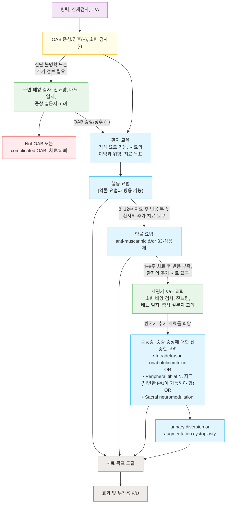

# 과민성 방광 Overactive bladder, OAB

## 일반 사항

*   요로 감염 및 다른 명백한 병인 없이 갑작스러운 요의와 배뇨를 참을 수 없는 요절박 증상을 일으키는 증후군;

    요실금이 있으면 OAB wet, 없으면 OAB dry로 분류
* 증상 : 절박뇨(절박 요실금), 빈뇨, 야뇨
* 유병률 : 12\~30%; 고령에서 30% 이상

## 원인

*   기전 : 근육성 변화(배뇨근의 불수의적 수축, 과민), 신경학적 변화

    (CNS 억제 경로 손상, 방광의 구심성 경로의 감작), 특발성

### Red Flags!

* U/A상 감염 없는 혈뇨(결석, 종양 배제)
* 반복적인 요로 감염
* 요배출 장애 증상 (예: 지연뇨, 빈뇨, 배뇨 후 점적)
* 과민성 방광 증상과 함께 배뇨 곤란, 통증 호소
* 신경학적 이상 의심
* 이전 요실금 수술 실패
* 이전 근치적 골반 수술 시행
* 3개월 이상의 적절한 치료에 반응 없음 또는 치료를 지속할 수 없음

## 진단

* 병력 청취
  1. 하루 중 수분 섭취와 배뇨 정도
  2. 주간 및 야간 빈뇨 유무 및 횟수
  3. 요절박 유무
  4. 요절박 발생 횟수 및 강도, 참을 수 있는 시간
  5. 배뇨 간격
  6. 요실금 유무 및 종류: 복압성, 절박성, 복합성
  7. 요실금 정도 : 속옷 교체 여부, 패드 사용 여부와 숫자
  8. 요폐색 증상 유무: 소변 줄기 정도, 요폐 과거력
  9. 신경계 질환 동반 유무: 뇌졸중, 척수질환, 파킨슨병
  10. 병력 및 수술력 : 질/요실금/전립선 수술, 하복부/골반강 내 수술 및 방사선 치료
  11. 약물 복용력: 이뇨제, 항우울제, 항고혈압제, 진통제
* 신체검사 : 복부 촉진(종괴, 탈장, 방광 과팽창), 전신 신경학적 검사, 골반/직장 검사(괄약근 긴장도, 항문주위 감각, 구해면체 반사), 직장수지검사, 질 검사(복압성 요실금, 골반 장기 탈출)
* U/A
*   필요시 추가 검사 : 소변 배양 검사, 요류 검사, 배뇨 후 잔뇨 검사, 요역동학 검사, PSA, 영상 검사

    (상부 요로, 전립선), 방광 요도 내시경

    * 배뇨 일지 : 24시간 배뇨 시각/배뇨량, 요절박/요실금 발생 시간/횟수; 3일 연속 기록
    * 증상 점수 설문지 : OABSS, OAB-V8

- [ ] uncomplicated 환자에서 초기 검사로 요류역학, 방광경, 신장/방광 초음파 검사 등은 권고 안 함

#### 과민성방광 증상점수 설문지 (Overactive Bladder Symptom Score: OABSS)

1. 아침에 일어나서 밤에 자기 전까지 소변을 몇 번 보았습니 까? ≤7번 0점, 8\~14번 1점, ≥15번 2점
2. 밤에 잠든 후부터 아침에 일 어날 때까지 소변을 보기 위해 몇 번이나 일어났습니까? 없음 0점, 1번 1점, 2번 2점, ≥3번 3점
3. 갑자기 소변이 마려워 참기 힘들었던 적이 있었습니까? 없음 0점, ＜1번/주 1점, ≥1번/주 2점, 1번/일 3점, 2\~4번/일 4점, ≥5번/일 5점
4. 4\. 갑자기 소변이 마려워서 참지 못하고 소변을 지린 적이 있었 습니까? 없음 0점, ＜1번/주 1점, ≥1번/주 2점, 1번/일 3점, 2\~4번/일 4점, ≥5번/일 5점

* 판정 : 3번 문항이 ≥2점이면서 총점 ≥3점 시 진단 \
  •중증도: 총점 ≤5점=경증, 6\~11점=중등증, ≥12점=중증

***

## Management

### 치료 방침

* OAB는 질환이 아니라 증상 복합체로 쉽게 완치되지 않을 수 있는 반면(20\~50%의 환자에서 치료에 충분히 반응하지 않음), 어떤 치료도 필요 없을 수 있음
* 치료 목표 : 방광 수축력↓, 방광 용량↑, 배뇨 감각 둔화
* 치료 방법 : 행동치료 &/or 약물치료 (☞ [요실금](125_-urinary-incontinence.md#management))
  * 방광 내 보톡스 주입술, 신경 조정술, 수술
*

OAB의 진단과 치료
\
Ref. Diagnosis and Treatment of OverActive Bladder (Non-Neurogenic) in Adults: AUA/SUFU Guideline (2019)

## 비-약물 치료

* bladder training, bladder control strategies, pelvic floor muscle training, fluid management

- [ ] ‘골반저 근육 및 urge suppression training + 수축-이완 훈련의 행동 요법’이 ‘tolterodine + tamsulosin’에 동등 이상의 효과가 있다는 보고가 있음

## 약물 치료

* anti-muscarinics 및 β3-adrenoceptor agonists 단독 또는 병용
  * 일반 제제보다 서방형 제제를 선호(입마름 부작용이 적음)
  * 한 종류의 anti-muscarinics에 효과가 적거나 사용할 수 없는 경우 용량 조정 또는 다른 종류의 anti-muscarinics 또는 β3-adrenoceptor agonist를 시도할 수 있음
* antimuscarinics : tolterodine \[디트루시톨], trospium \[스파스몰리트], solifenacin \[베시케어], fesoterodine \[토비애즈], darifenacin, oxybutynin \[디트로판], propiverine \[비유피-4]
* β3-작용제 : mirabegron \[베타미가]
* 미승인 약제 : α-차단제(BPH 동반 시), duloxetine(긴장 요실금 동반 시), CCB(효과 부족), 칼슘 통로 개방제(연구 중), prostaglandin 합성 억제제(연구 부족), vanilloid 수용체 차단제(연구 중)

## 기타

* intradetrusor onabotulinumtoxinA, self-catheterization, peripheral tibial nerve stimulation, sacral neuromodulation,
* augmentation cystoplasty, urinary diversion

### **질병코드**&#x20;

N32.8 방광의 기타 명시된 장애

## 처방례

디트루시톨 에스알 2 ㎎/C 1C qd
\
베타미가 서방정 50 ㎎/T 1T qd

