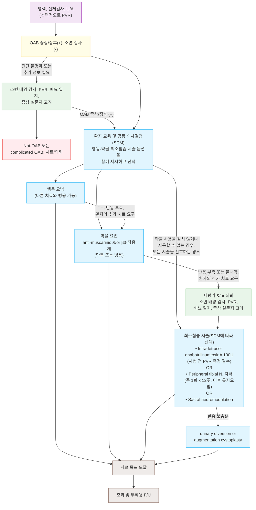

# 과민성 방광 Overactive Bladder (OAB)

## <mark style="color:green;">일반 사항</mark>

* 정의 (AUA/SUFU 2024) : 요로감염이나 다른 명백한 병인 없이 요절박을 특징으로 하며, 대개 빈뇨와 야뇨를 동반하고 절박성 요실금을 동반할 수도 동반하지 않을 수도 있는 증상 증후군
* 분류 : 요실금 동반 시 OAB wet, 비동반 시 OAB dry
* 유병률 : 인구 기반 연구에서 여성 9\~43%, 남성 7\~27%; 연령 증가에 따라 유병률·중증도 모두 증가하며 상당수 환자에서 수년간 증상 지속 \[AUA/SUFU 2024]. 국내 과거 역학조사(대한배뇨장애요실금학회, 18세 이상 성인 대상)에서는 약 12.2%(남성 약 10%, 여성 14.3%)로 보고됨
* 합병증/영향 : 수면 장애, 낙상 위험(특히 고령자의 야간 배뇨 중 낙상), 우울·불안, 사회적 위축·삶의 질 저하, 요실금 관련 피부염

## <mark style="color:green;">원인</mark>

* 특발성(원인 불명)이 다수
* 기전
  * 근육성 변화 : 일부 환자에서 배뇨근의 불수의적 수축, 배뇨근 과민이 관찰됨(모든 OAB 환자에서 확인되는 소견은 아니며, 요역동학 검사상 특이적 확진 소견은 없음)
  * 신경학적 변화 : 중추신경계 억제 경로 손상, 방광 구심성 경로의 감작
* 비뇨기 외 기여 인자(治療로 OAB 증상 호전 가능) \[AUA/SUFU 2024]
  * 비만, 변비, 골반저 근육 기능장애
  * 당뇨병, 폐경(여성), 전립선비대증 등 하부요로폐색(남성)
  * 인지저하·신경퇴행성 질환, 다제약물 복용(이뇨제, 항우울제, 항고혈압제 등)

## <mark style="color:green;">임상 양상</mark>

* 요절박(urgency) : 갑자기 발생하여 참기 어려운 강한 요의 - OAB의 핵심·필수 증상
* 빈뇨(frequency) : 환자가 지나치게 잦다고 느끼는 주간 배뇨 횟수 증가(임상·연구에서는 흔히 ≥8회/24시간을 참고하나 절대적 진단 기준은 아님)
* 야뇨(nocturia) : 수면 중 배뇨를 위해 1회 이상 기상
* 절박성 요실금(urgency incontinence) : 동반 시 OAB wet으로 분류

***

### <mark style="color:$danger;">🚩 Red Flags!</mark>

<mark style="color:$danger;">**즉각 조치 또는 의뢰**</mark>

* 급성 요폐(하복부 팽만·통증, 배뇨 불능) → 응급 도뇨 및 비뇨의학과 의뢰
* 새로 발생한 신경학적 결손(하지 위약, 회음부 감각저하, 마비 등) 동반 → cauda equina syndrome 등 척수병변 의심, 응급 의뢰

<mark style="color:$warning;">**당일 또는 조기 의뢰**</mark>

* 요로감염 없는 육안적 또는 현미경적 혈뇨 → 결석·종양 배제 위해 비뇨의학과 의뢰(영상검사·방광경 고려)
* 반복적인 요로감염
* 요배출 장애 증상 동반(예: 지연뇨, 세뇨, 배뇨 후 점적)
* 배뇨 곤란·통증이 OAB 증상과 함께 있는 경우
* 신경학적 질환 의심 또는 기왕력(뇌졸중, 척수질환, 파킨슨병 등)
* 이전 요실금 수술 실패, 근치적 골반 수술 또는 골반 방사선 치료 기왕력

<mark style="color:$info;">**외래 추적 / 추가 평가 계획**</mark> <mark style="color:$info;">- 즉각 위험 낮으나 호전 없으면 의뢰</mark>

* 선택한 치료(행동·약물·최소침습 시술 등)를 적절한 기간 시행했음에도 증상 개선이 불충분하거나, 부작용 때문에 지속하기 어려운 경우
* 환자가 최소침습 시술 등 추가 치료 옵션을 원하는 경우
* 진단이 불확실하거나 예상과 다른 치료 반응을 보이는 경우

***

## <mark style="color:green;">진단</mark>

* 병력 청취
  1. 하루 중 수분 섭취량과 배뇨 횟수
  2. 주간 및 야간 빈뇨 유무 및 횟수
  3. 요절박 유무, 발생 횟수·강도, 참을 수 있는 시간
  4. 배뇨 간격
  5. 요실금 유무 및 종류(복압성, 절박성, 복합성)
  6. 요실금 정도 : 속옷 교체 여부, 패드 사용 여부와 개수
  7. 요폐색 증상 유무 : 소변 줄기 정도, 요폐 과거력
  8. 신경계 질환 동반 유무 : 뇌졸중, 척수질환, 파킨슨병
  9. 병력 및 수술력 : 질/요실금/전립선 수술, 하복부·골반강 내 수술 및 방사선 치료
  10. 약물 복용력 : 이뇨제, 항우울제, 항고혈압제, 진통제
* 신체검사 : 복부 촉진(종괴, 탈장, 방광 과팽창), 전신 신경학적 검사, 골반/직장 검사(괄약근 긴장도, 항문주위 감각, 구해면체 반사), 직장수지검사, 질 검사(복압성 요실금, 골반 장기 탈출)
* U/A(요로감염·혈뇨 확인 목적, 필수)
* 초기 평가에서 선택적으로 고려 \[AUA/SUFU 2024]
  * 배뇨 후 잔뇨(PVR) : 배뇨 곤란 등 배출 증상 동반, 요폐 과거력, 전립선비대증, 신경학적 질환, 요실금·전립선 수술력, 오래된 당뇨병이 있는 경우 특히 고려
  * 배뇨 일지 : 24시간 배뇨 시각·배뇨량, 요절박·요실금 발생 시간·횟수를 3일 연속 기록
  * 증상 점수 설문지 : OABSS, OAB-V8
* 진단이 불확실하거나 비전형적 소견, 치료 반응이 불충분한 경우에 고려 : 소변 배양 검사, 요류 검사, 요역동학 검사, PSA, 영상 검사(상부 요로, 전립선), 방광 요도 내시경


Uncomplicated 환자에서 초기 검사로 요역동학 검사, 방광경 검사, 신장·방광 초음파 검사 등을 일률적으로 시행하는 것은 권고하지 않음; 진단 불확실 시에만 선택적으로 시행 \[AUA/SUFU 2024]


**과민성방광 증상점수 설문지 (Overactive Bladder Symptom Score, OABSS)**

1. 아침에 일어나서 밤에 자기 전까지 소변을 몇 번 보았습니까? ≤7번 0점, 8\~14번 1점, ≥15번 2점
2. 밤에 잠든 후부터 아침에 일어날 때까지 소변을 보기 위해 몇 번이나 일어났습니까? 없음 0점, 1번 1점, 2번 2점, ≥3번 3점
3. 갑자기 소변이 마려워 참기 힘들었던 적이 있었습니까? 없음 0점, ＜1번/주 1점, ≥1번/주 2점, 1번/일 3점, 2\~4번/일 4점, ≥5번/일 5점
4. 갑자기 소변이 마려워서 참지 못하고 소변을 지린 적이 있었습니까? 없음 0점, ＜1번/주 1점, ≥1번/주 2점, 1번/일 3점, 2\~4번/일 4점, ≥5번/일 5점

* 판정 : 3번 문항이 ≥2점(주 1회 이상 요절박)이면서 총점 ≥3점 시 진단
* 중증도 : 총점 3\~5점(진단 기준상 실질적으로 3점 이상; 관용적으로 "≤5점"으로도 표기) = 경증, 6\~11점 = 중등증, ≥12점 = 중증

### <mark style="color:orange;">감별 진단</mark>

* 유사한 하부요로 증상을 유발할 수 있는 질환들의 감별이 필요

<table><thead><tr><th width="150">질환</th><th width="230">OAB와의 차이점</th><th>핵심 감별 포인트</th></tr></thead><tbody><tr><td>급성 방광염/요로감염</td><td>염증성 병인이 명확</td><td>U/A 농뇨·세균뇨(+), 배뇨통 동반; 항생제 치료로 호전</td></tr><tr><td>방광 결석·종양</td><td>구조적 병변</td><td>요로감염 없는 혈뇨; 영상검사·방광경으로 확인</td></tr><tr><td>복압성 요실금</td><td>요절박 없이 복압 상승 시(기침, 재채기, 운동) 누출</td><td>병력·cough stress test 등 임상 평가로 대개 감별 가능; 진단이 불확실하거나 복합성 요실금 의심 시 요역동학 검사 고려</td></tr><tr><td>전립선비대증(남성)</td><td>방광출구 폐색이 주된 병인</td><td>지연뇨, 세뇨, 배뇨 후 점적, 잔뇨량 증가 동반</td></tr><tr><td>다뇨/야간다뇨</td><td>요량 자체의 증가(요절박은 없음)</td><td>배뇨 일지에서 24시간 요량 증가; 당뇨병·요붕증·이뇨제·과다 수분 섭취 확인</td></tr><tr><td>신경인성 방광</td><td>중추/말초 신경계 질환에 기인</td><td>뇌졸중, 척수손상, 다발경화증, 파킨슨병 등 신경학적 병력·소견 동반</td></tr></tbody></table>


**야뇨를 동반한 OAB에서 야간다뇨(nocturnal polyuria) 감별**\
야뇨를 동반한 OAB 환자 중 상당수는 방광 저장 문제가 아니라 야간다뇨가 주된 원인일 수 있음. 배뇨 일지로 야간 요량 비율을 확인하고, 야간다뇨가 주 원인인 경우 원인 교정 및 저녁 수분 섭취 제한을 우선 시행. desmopressin은 선택된 환자에서 고려할 수 있으나 저나트륨혈증 위험에 주의하며, 투여 전 혈청 Na를 확인하고 시작 또는 증량 후 약 1주 이내와 1개월경 재검한 뒤 이후 주기적으로 추적; 고령·고위험군(특히 65세 이상)에서는 더 빈번한 모니터링 고려. 투여 전 1시간부터 투여 후 약 8시간 동안 과도한 수분 섭취를 피하도록 교육


***



<p align="center"><strong>OAB의 진단과 치료 알고리듬</strong></p>

<p align="center"><em><mark style="color:$info;">Ref. AUA/SUFU Guideline on the Diagnosis and Treatment of Idiopathic Overactive Bladder (2024)</mark></em></p>


**2024 AUA/SUFU 가이드라인의 관점 변화**\
2024년 개정판은 행동 요법 → 약물 요법 → 시술의 엄격한 단계적(step therapy) 진행을 폐기함. 대신 환자의 목표·선호·치료 부담 감내 정도에 따라 행동·약물·최소침습 시술 옵션을 함께("메뉴" 형태로) 제시하고 **공동 의사결정(shared decision-making)**을 통해 선택하는 개인 맞춤형 접근을 권고함. 약물 사용을 원치 않거나 사용할 수 없는 환자는 행동·약물 요법을 거치지 않고 바로 최소침습 시술(Botox 등)로 진행하는 것도 합리적인 선택지로 인정됨 \[AUA/SUFU 2024, Statement 23\~24]


***

## <mark style="background-color:$warning;">Management</mark>

### <mark style="color:orange;">치료 방침</mark>

* OAB는 단일 질환이 아니라 증상 복합체로 쉽게 완치되지 않을 수 있음(20\~50%의 환자에서 치료에 충분히 반응하지 않음); 증상이 경미하고 환자가 원하지 않으면 치료가 필요하지 않을 수도 있음
* 치료 목표 : 요절박·빈뇨·절박성 요실금 증상 감소, 방광 저장 기능 개선 및 삶의 질 향상
* 치료 방법 : 행동 치료, 약물 치료, 최소침습 시술을 공동 의사결정을 통해 단독 또는 병용으로 선택(반드시 순차적 진행일 필요는 없음)(☞ [요실금](125_-urinary-incontinence.md#management))
* 공동 의사결정 원칙 : 치료 효과, 부작용, 비용, 순응도를 환자와 함께 논의하여 결정 \[AUA/SUFU 2024]

## <mark style="color:green;">비-약물 치료 및 예방</mark>

* Bladder training : 배뇨 간격을 점진적으로 늘리는 훈련
* Urge suppression training : 요절박 발생 시 골반저 근육 수축으로 절박감을 가라앉히고 화장실까지 이동
* Pelvic floor muscle training(골반저 근육 운동)
* Fluid management : 과도한 수분 섭취 제한, 카페인·알코올 등 방광 자극 물질 회피
* 체중 감량(비만 동반 시), 변비 관리
* 방광 일지 작성을 통한 자기 모니터링


'골반저 근육 및 urge suppression training + 수축-이완 훈련'을 포함한 행동 요법이 'tolterodine + tamsulosin' 병용 요법과 동등 이상의 효과를 보였다는 보고가 있음


## <mark style="color:green;">약물 치료</mark>

* anti-muscarinics 및 β3-adrenoceptor agonists를 단독 또는 병용
* 일반 제제보다 서방형 제제를 선호(구강건조 등 항콜린성 부작용이 적음)
* 한 종류의 anti-muscarinic에 효과가 적거나 사용할 수 없는 경우, 용량 조정 또는 다른 anti-muscarinic이나 β3-agonist로 교체를 시도

### <mark style="color:orange;">Anti-muscarinics</mark>

* tolterodine <mark style="color:blue;">\[디트루시톨]</mark>, trospium <mark style="color:blue;">\[스파스몰리트]</mark>, solifenacin <mark style="color:blue;">\[베시케어]</mark>, fesoterodine <mark style="color:blue;">\[토비애즈]</mark>, darifenacin <mark style="color:blue;">\[에나블렉스]</mark>, oxybutynin <mark style="color:blue;">\[디트로판]</mark>, propiverine <mark style="color:blue;">\[비유피-4]</mark>
* 금기·주의 : 요폐 또는 유의한 방광출구폐색, 위장관 운동저하·위정체, 조절되지 않는 협우각녹내장에서는 금기 또는 신중 투여


**⚠️ 항콜린 부담(anticholinergic burden)과 고령자 인지기능 저하 위험**\
장기간·고용량의 항콜린성 방광 치료제 누적 사용은 인지기능 저하 및 치매 위험 증가와 연관된다는 관찰 연구 결과가 있음(대규모 코호트 연구, BMJ 2018; JAMA Intern Med 2019). AGS Beers Criteria에서도 oxybutynin 등 강한 항콜린 작용제를 고령자 주의 약물로 분류함\
→ 고령, 경도인지장애·치매 병력, 여러 항콜린성 약물 병용 중인 환자에서는 anti-muscarinic보다 β3-adrenoceptor agonist를 우선 고려


### <mark style="color:orange;">β3-adrenoceptor agonist</mark>

* mirabegron <mark style="color:blue;">\[베타미가]</mark> - 국내 허가 용량은 50 mg qd(성인·고령자 공통 표준 용량); 신·간기능 및 강력한 CYP3A 억제제(itraconazole, ketoconazole, ritonavir, clarithromycin 등) 병용 여부에 따라 25 mg으로 감량하거나 투여가 권장되지 않을 수 있으므로 처방 전 허가사항의 용량조절표 참조 - 국내에 제네릭(<mark style="color:blue;">\[미라벡]</mark>, <mark style="color:blue;">\[셀레베타]</mark> 등)도 유통 중
  * 주의 : 혈압을 상승시킬 수 있어 정기적 혈압 측정 권고; **중증의 조절되지 않는 고혈압(수축기 ≥180 mmHg 및/또는 이완기 ≥110 mmHg)에서는 투여를 권장하지 않음**; 2단계 고혈압(수축기 ≥160 mmHg 또는 이완기 ≥100 mmHg)에서도 자료가 제한적이므로 신중히 사용 \[MHRA Drug Safety Update]
* vibegron <mark style="color:blue;">\[베오바정]</mark> 50 mg qd - mirabegron에 이어 두 번째로 개발된 β3-agonist로 2022년 10월 국내 허가(2026년 기준 비급여); β1/β2 대비 β3 선택성이 매우 높아 EMPOWUR 임상시험에서 위약 대비 유의한 혈압 상승이 관찰되지 않았으며, mirabegron과 같은 중증 고혈압 금기 문구는 없음 - 다만 임상적으로 심혈관계 상태는 지속 관찰 권고
  * 주의 : 국내 허가사항에서는 신장애·간장애 환자를 신중투여 대상으로 기술; 해외(미국 등) 처방정보에서는 말기신부전(eGFR \<15 mL/min/1.73m², 투석 여부 무관) 및 중증 간장애(Child-Pugh C)에서 임상 자료 부족으로 투여를 권장하지 않는다고 명시하는 경우가 있음 - 처방 전 국내 첨부문서 원문 확인 권장

### <mark style="color:orange;">병용 요법</mark>

* 단독 요법(anti-muscarinic 또는 β3-agonist)에 반응이 불충분한 경우, anti-muscarinic + β3-agonist(예: solifenacin + mirabegron) 병용을 고려할 수 있음 \[AUA/SUFU 2024]
* mirabegron 단독요법은 허가사항 범위(과민성 방광의 절박뇨·빈뇨·절박요실금 치료) 내 투여 시 요양급여 인정(고시 제2020-107호 등); anti-muscarinic + β3-agonist 병용요법의 급여 인정 여부·기준은 수시로 개정되므로 처방 시점의 HIRA 고시로 반드시 별도 확인

### <mark style="color:orange;">OAB 표준 약물치료가 아닌 참고 약제</mark>

* α-차단제 : OAB 자체의 표준 치료제는 아니며, 전립선비대증·방광출구폐색이 동반된 남성 하부요로증상(LUTS) 치료 목적으로 사용(☞ 처방례 5)
* duloxetine : OAB 치료제가 아니며 주로 복압성 요실금(SUI)과 관련하여 언급됨
* 근거가 제한적이거나 국내 미승인인 연구 단계 약제 : CCB(효과 부족), 칼슘 통로 개방제(연구 중), prostaglandin 합성 억제제(연구 부족), vanilloid 수용체 차단제(연구 중)

## <mark style="color:green;">시술 및 기타 처치</mark>

* Intradetrusor onabotulinumtoxinA(100 U) 주입술 : 행동·약물 치료에 반응이 불충분하거나 불내성이 있는 경우, 또는 약물을 사용할 수 없거나 원하지 않아 환자가 시술을 선호하는 경우 공동 의사결정을 통해 고려(반드시 약물 치료 실패가 선행되어야 하는 것은 아님) \[AUA/SUFU 2024]
  * 특발성 OAB 적응증에서는 100 U가 표준 시작 용량(신경인성 방광에서 사용하는 200 U와 혼동 주의)
  * 시행 전 배뇨 후 잔뇨(PVR) 측정 필수; 불완전 배뇨·요폐가 발생할 수 있어 청결 간헐적 자가도뇨(CIC)가 필요할 가능성을 사전에 설명하고 시행 가능 여부 확인 \[AUA/SUFU 2024, Statement 26]
  * 효과 지속 기간은 환자·용량에 따라 대략 4\~9개월로 다양하며, 반응이 좋은 경우 그 이상 지속되기도 함
* Peripheral tibial nerve stimulation(PTNS) : 표준 프로토콜은 주 1회 30분씩 총 12주(12회); 이후 반응이 있으면 월 1회 등 유지 요법으로 전환; 빈번한 외래 방문이 가능해야 함
* Sacral neuromodulation
* Augmentation cystoplasty, urinary diversion : 난치성 OAB에서 최후 수단으로 고려

***

### <mark style="color:red;">질병코드</mark>

N32.8 방광의 기타 명시된 장애

N32.9 방광의 상세불명 장애

N39.41 절박성 요실금 (OAB wet 동반 시)

***

## <mark style="color:purple;">처방례</mark>

> **처방례 1. 경증 OAB dry, 초치료**
>
> ```
> 디트루시톨 에스알 2 ㎎/C  1C  qd
> ```
>
> _✽서방형 anti-muscarinic 단독 요법으로 시작; 효과 판정까지 최소 4주 이상 필요하며, 구강건조·변비 발생 시 다른 계열로 교체 고려_

> **처방례 2. 중등증\~중증 OAB wet**
>
> ```
> 베타미가 서방정 50 ㎎/T  1T  qd
> ```
>
> _✽β3-agonist 단독 요법; anti-muscarinic 부작용(구강건조)을 피하고 싶은 환자, 절박성 요실금이 뚜렷한 경우에 선호_

> **처방례 3. 고령자(인지저하 위험 동반)**
>
> ```
> 베오바정 50 ㎎/T  1T  qd
> ```
>
> _✽항콜린 부담을 피해야 하는 고령·경도인지장애 환자에서는 anti-muscarinic보다 β3-agonist를 우선 선택; 낙상·다제약물 병용 여부도 함께 점검_

> **처방례 4. 단독 요법 반응 부족 - 병용 요법**
>
> ```
> 베시케어 5 ㎎/T  1T  qd
> 베타미가 서방정 50 ㎎/T  1T  qd
> ```
>
> _✽anti-muscarinic 또는 β3-agonist 단독 요법으로 4\~8주 치료 후 반응이 불충분한 경우 병용 고려; 병용 시 급여 기준 사전 확인_

> **처방례 5. 남성, 전립선비대증(BPH) 동반 OAB**
>
> ```
> 하루날디 0.2 ㎎/C  1C  qd
> 베타미가 서방정 50 ㎎/T  1T  qd
> ```
>
> _✽BPH와 OAB가 함께 있는 남성에서 α-blocker(BPH 표준 치료) + β3-agonist 병용은 AUA/SUFU 2024에서도 다루는 치료 옵션; 국내 개별 제품의 적응증·급여 기준은 처방 전 확인 필요; 배뇨 증상·잔뇨가 있는 경우 배뇨 후 잔뇨 검사로 주기적 확인_

***

### <mark style="color:$success;">핵심 복약 지도</mark>

> **서방형 제제 복용법**
>
> * 서방형(SR/OD) 제제는 씹거나 쪼개지 말고 그대로 삼키도록 안내
> * 효과 발현까지 통상 2\~4주 이상 소요될 수 있음을 미리 설명하여 임의 중단 방지

> **부작용 모니터링**
>
> * Anti-muscarinic : 구강건조, 변비, 시야 흐림, 요폐(특히 BPH 동반 남성) - 발생 시 계열 교체 고려; 치료 중 배뇨 곤란이나 잔뇨감이 새로 생기거나 악화되면 배뇨 후 잔뇨(PVR)를 재측정하고, 유의하게 증가하거나 배뇨 곤란이 동반되면 감량 또는 β3-agonist로 변경 검토
> * mirabegron : 혈압 상승 가능 - 치료 시작 후 정기적으로 혈압 확인; 중증의 조절되지 않는 고혈압에서는 사용하지 않음
> * vibegron : mirabegron과 같은 중증 고혈압 금기는 없으나, 심혈관계 상태는 지속적으로 관찰
> * 고령 환자에서 anti-muscarinic 처방 시 인지기능 변화(건망증, 혼돈) 여부를 보호자와 함께 확인

> **언제 다시 병원을 방문해야 하나요?**
>
> * 4\~8주 치료에도 증상이 호전되지 않는 경우
> * 요로감염 없이 **혈뇨**가 관찰되는 경우 - 즉시 내원
> * 갑작스러운 **소변을 전혀 볼 수 없는** 요폐 증상 - 즉시 내원
> * 약물 복용 후 심한 변비, 어지럼, 혼돈 등 부작용이 발생하는 경우

***

### <mark style="color:blue;">환자 안내서</mark>


**과민성 방광, 방광이 너무 예민해서 생기는 증상입니다**

방광에 소변이 충분히 차지 않았는데도 갑자기 강한 요의(요절박)를 느끼거나, 방광이 소변을 저장하는 기능이 지나치게 예민해져서 생기는 증상입니다. 세균 감염이 없는데도 소변을 자주 보고, 밤에도 소변 때문에 잠에서 깨며, 경우에 따라 화장실에 가기 전에 소변이 새기도 합니다.


#### <mark style="color:$primary;">왜 과민성 방광이 생기나요?</mark>

* 대부분 뚜렷한 원인 없이 방광 근육 자체가 과민해져서 발생합니다
* 뇌졸중, 파킨슨병 등 신경계 질환, 비만, 변비, 폐경, 전립선비대증도 증상을 악화시킬 수 있습니다
* 이뇨제, 일부 항우울제·항고혈압제 등 복용 중인 약물이 영향을 줄 수 있습니다

#### <mark style="color:$primary;">일상생활에서 어떻게 관리하나요?</mark>

* **카페인, 탄산음료, 술을 줄이십시오.** 방광을 자극하여 증상을 악화시킬 수 있습니다
* **소변을 참는 연습(방광 훈련)을 해보십시오.** 배뇨 간격을 조금씩 늘려가는 방법으로, 소변을 보고 싶을 때 조금씩 시간을 늘려가며 참으면 방광 용량이 늘어날 수 있습니다. 다만 배뇨가 원래 어렵거나 잔뇨가 많은 경우에는 의료진과 상의하여 시행하십시오
* **요의가 갑자기 느껴지면 잠시 멈추고 골반 근육에 힘을 주십시오.** 급하게 화장실로 뛰어가기보다 절박감이 가라앉을 때까지 잠시 기다린 뒤 이동하는 것이 도움이 됩니다
* **골반저 근육 운동(케겔 운동)을 꾸준히 하십시오.** 소변이 새는 것을 막는 데는 주로 도움이 되며(복압성 요실금에서 가장 효과적), 과민성 방광에서는 요절박이 느껴질 때 함께 사용하면 절박감을 가라앉히는 데 보조적으로 도움이 됩니다
* **적정 체중을 유지하고 변비를 관리하십시오.** 복압을 줄여 증상 완화에 도움이 됩니다
* 잠자리에 들기 2\~3시간 전에는 수분 섭취를 줄이면 야간뇨 감소에 도움이 될 수 있습니다

#### <mark style="color:$primary;">약은 어떻게 써야 하나요?</mark>

* 처방받은 약은 매일 규칙적으로 복용해야 하며, 효과가 나타나기까지 몇 주가 걸릴 수 있으니 임의로 중단하지 마십시오
* 입이 마르거나 변비가 생기면 물을 자주 마시고 섬유질 섭취를 늘리되, 증상이 심하면 병원에 알려주십시오
* 약 복용 중 혈압이 오르거나 어지럼, 심한 변비, 소변을 보기 힘든 증상이 생기면 병원에 문의하십시오

#### <mark style="color:$primary;">이럴 때는 즉시 병원을 방문하세요</mark>

* 소변에 피가 섞여 나오는 경우
* 소변을 전혀 볼 수 없는 경우
* 갑자기 다리에 힘이 빠지거나 감각이 이상해지는 경우
