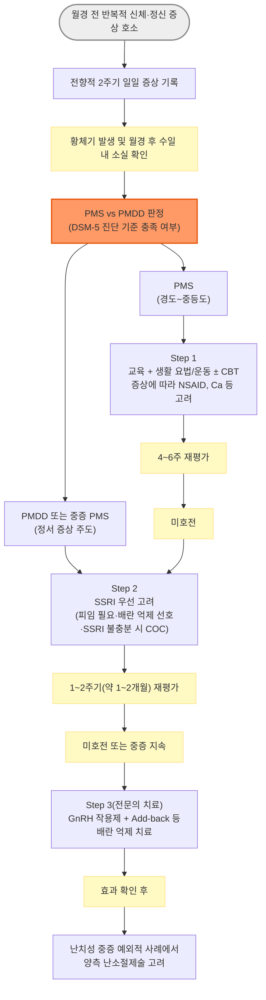

# 월경전증후군 Premenstrual Syndrome, PMS

## <mark style="color:green;">일반 사항</mark>

* 월경 주기 중 luteal phase(황체기)에 반복적으로 발생하는 신체적·정신적 증상군으로, 월경 시작과 함께 호전되기 시작하여 월경 후 수일 이내 현저히 감소하거나 소실됨
* 다른 이름 : premenstrual tension, 월경전긴장증후군
* 정의 (RCOG Green-top Guideline No. 48, 2016/2017) : 기질적 질환이나 기존 정신 질환이 없는 상태에서, 매 월경(배란) 주기의 황체기에 규칙적으로 재발하고 월경 시작과 함께 소실 또는 뚜렷이 호전되는 고통스러운 신체적·행동적·정신적 증상
* 월경전불쾌장애(premenstrual dysphoric disorder, PMDD) : 정서 증상이 주가 되어 기능 장애를 초래하는 중증의 월경전증후군; DSM-5(-TR) 진단 기준 충족 필요 (☞ 진단 참고)
* 많은 여성들이 월경 전에 신체적, 정신적 증상을 보이지만 이들이 모두 PMS에 해당되지는 않음 — 가임기 여성의 최대 90%가 최소 1개 이상의 월경전 증상을 경험 \[ACOG 2023]

### <mark style="color:orange;">분류</mark>

* Core(핵심형) PMS : 배란 주기에 의존하는 전형적 PMS로 가장 흔한 형태
* Variant(변이형) PMS \[ISPMD Consensus] — 아래 3가지는 core PMS와 감별이 필요
  * PME(premenstrual exacerbation) : 기존 정신 질환(우울증, 불안장애 등) 또는 신체 질환(편두통, 천식, 과민대장증후군 등)이 황체기에 악화되는 경우 — core PMS와의 핵심 차이는 난포기(follicular phase) 동안 완전한 증상 소실 구간(symptom-free interval)이 없다는 점이며, 전향적 일일 증상 일지(DRSP 등) 판독 시 이 구간의 유무를 확인하는 것이 감별의 핵심
  * Progestogen-induced PMS : progestogen 함유 호르몬제(피임제, 호르몬 대체 요법 등) 복용 중 PMS 유사 증상 발생
  * Non-ovulatory PMS : 배란이 확인되지 않는 드문 형태

### <mark style="color:orange;">유병률</mark>

* PMS 진단 기준 충족 : 월경 여성의 20\~30%(자료에 따라 30% 내외 보고)
* PMDD : 대체로 2\~5%로 보고(ACOG 2023); 일부 연구에서는 최대 8%까지 보고되어 자료원 간 편차가 있음

## <mark style="color:green;">원인 및 위험 인자</mark>

* 명확한 단일 원인은 불명

#### <mark style="color:$primary;">추정 병태생리</mark>

* estrogen 및 progesterone 자체의 절대량 이상이 아니라, 정상 범위의 생리적 호르몬 변동에 대한 중추신경계의 비정상적 반응(민감도 증가)으로 이해됨
* allopregnanolone(progesterone 대사물, GABA-A 수용체 조절물질)에 대한 개인별 민감도 차이가 핵심 기전으로 제시됨
* 신경 전달 물질 이상 : 특히 serotonin 신호 체계의 조절 이상(단순 저하가 아닌 주기적 변동에 대한 반응성 이상) — SSRI가 신속하게 반응하는 근거
* aldosterone & renin 활성도↑, Vit B6 부족·당 대사 이상 관련 가설도 있으나 근거 수준 낮음

#### <mark style="color:$primary;">위험 요인</mark>

* 20대 후반\~30대 중반
* 정신적 스트레스, 외상 경험
* 출산력이 없거나 적음
* 기분 장애(우울증, 불안증) 병력, PMDD 가족력 또는 PMS 가족력
* 흡연, 비만
* ✽ADHD, 조기 생식샘 절제, ovarian sensitivity 관련 유전 소인 등도 최근 연구에서 위험 요인으로 제시되고 있음

## <mark style="color:green;">임상 양상</mark>

* Core PMS에서는 증상이 황체기에 발생하고 월경 시작 후 수일 내 현저히 호전되며 난포기에는 최소화 또는 소실되는 주기적 패턴이 핵심 — 이 패턴이 확인되지 않으면 core PMS가 아님(☞ 진단; variant PMS는 분류 참고)
* 신체적 변화 : 복부 팽만감/복통, 피로, 구역, 변비, 유방 팽만감/압통, 근육통, 두통, 어지럼, 사지 부종, 체중 증가, 여드름, 두근거림
* 정서적 변화 : 과민, 감정 기복, 우울, 불안, 분노, 흥미 감소, 피로, 집중력 저하, 수면 장애, 식욕 변화, 성욕 변화, 활동 위축

***

### <mark style="color:$danger;">🚩 Red Flags!</mark>

<mark style="color:$danger;">**즉각 조치 또는 의뢰**</mark>

* 구체적 자살 사고, 자해 계획, 또는 자살 시도 직후 → 즉시 정신건강의학과 의뢰/응급 평가 (☞ 자살예방상담전화 109(24시간); 일반 정신건강 상담은 1577-0199)
* 급성 정신병적 증상(환각, 심한 와해된 사고) 동반

<mark style="color:$warning;">**당일 또는 조기 의뢰**</mark>

* 증상이 황체기에 국한되지 않고 한 달 내내 지속되거나 월경 후에도 소실되지 않음 → 주요우울장애·불안장애 등 원발 정신 질환 또는 PME 의심, 정신건강의학과 의뢰
* 기능 장애가 뚜렷하여 직장·학교·대인관계에 중대한 지장을 초래(PMDD 의심) → DSM-5 기준에 따른 전향적 평가 계획, 필요시 정신건강의학과 협진
* 비정상 자궁 출혈, 골반통, 성교통 등 부인과적 동반 증상 → 자궁내막증·자궁근종 등 기질적 원인 배제 위해 산부인과 의뢰

<mark style="color:$info;">**외래 추적 / 추가 평가 계획**</mark> <mark style="color:$info;">- 즉각 위험 낮으나 호전 없으면 의뢰</mark>

* 전향적 증상 일지 2주기 기록이 아직 완료되지 않아 확진이 보류된 상태
* 1차 생활 요법 및 대증 치료 4\~6주 시행 후에도 미호전
* SSRI 1\~2주기 평가 후에도 반응이 적음 → 약제 교체 또는 배란 억제 요법 고려

***

## <mark style="color:green;">진단</mark>

* PMS/PMDD는 병력에 근거한 임상 진단이며, 확진을 위한 단일 검사는 없음
* 진단의 핵심은 **전향적(prospective)** 증상 기록 — 환자의 회상에 의존하는 후향적 병력 청취만으로는 과다 진단 또는 과소 진단의 위험이 있음 \[ACOG 2023]
* PMS/PMDD 진단 자체를 위한 검사실 검사는 없으며, 병력상 감별진단이 필요한 경우에 한하여 선택적으로 시행
  * CBC/Hb(빈혈 의심), TSH(갑상선 질환 의심) 등
  * 25-OH Vit D는 결핍 위험 또는 임상적 의심이 있을 때 고려(월경전증후군 자체와의 관련성은 명확하지 않음)
  * 영상 검사 : 골반 초음파(비정상 출혈·골반통 등 부인과적 동반 소견이 있을 때)

### <mark style="color:orange;">월경전증후군(PMS) 진단</mark>

* 최소 두 번의 연속된 월경 주기에서, 정의에 부합하는 증상의 발생과 소실을 **전향적 일일 기록**으로 확인

### <mark style="color:orange;">PMDD 진단 기준 [DSM-5(-TR)]</mark>

A. 지난 1년 동안 대부분의 월경 주기에서 다음 증상 중 ≥5개가 월경 시작 1주 전에 발생하여 월경 시작 후 수일 내에 완화되어 월경 1주 후에는 증상이 없거나 거의 없음(B, C 항목을 합하여 총 ≥5개)

B. 다음 중 ≥1개 포함 필수(핵심 정서 증상)

① 현저한 감정의 불안정. 예) 갑자기 슬퍼지거나 눈물이 나거나, 거절에 대해 민감\
② 현저한 과민, 분노 또는 대인 갈등 증가\
③ 현저한 우울, 절망감, 자기 비하\
④ 현저한 불안, 긴장감, 안절부절

C. 총 ≥5개를 채우기 위한 추가 증상

⑤ 일상생활(예 : 직장, 학교, 친구, 취미)에 대한 관심 저하\
⑥ 집중이 어렵다는 느낌\
⑦ 무기력, 쉽게 피로함, 현저한 활력 결핍\
⑧ 식욕의 현저한 변화, 과식, 특정 음식에 대한 갈망\
⑨ 과다 수면 또는 불면\
⑩ 자신을 전혀 조절하지 못하는 것 같은 느낌\
⑪ 유방 압통 또는 부종, 두통, 관절통, 근육통, 복부 팽만감, 체중 증가 같은 신체적 증상

D. 이 증상들은 직장, 학교, 일상적인 사회적 활동, 또는 다른 사람들과의 유대 관계에 임상적으로 심한 고통 또는 방해를 야기함. 예) 등교 회피, 직장/학교/가정에서의 능력 저하

E. 주요우울장애, 공황장애, 기분저하장애, 인격장애 같은 다른 질환의 단순한 증상 악화가 아님(동반될 수는 있음)

F. 위의 기준들은 최소 두 증상 주기 동안 **전향적으로 일일 평가**(예 : Daily Record of Severity of Problems)에 의해 확인되어야 함. 확정에 앞서 임시로 진단할 수 있음

G. 이 증상들은 물질(예: 약물, 약물 남용, 다른 치료)의 생리적 효과 또는 다른 의학적 상태(예: 갑상선기능항진증)에 기인한 것이 아님


**청소년에서의 진단 시 주의**\
사춘기 여성에서는 월경전 증상이 이 시기 특유의 정서 변동과 감별하기 어려울 수 있음. 진단을 서두르기보다 전향적 증상 기록을 통한 확인이 특히 중요함 \[ACOG 2023]


### <mark style="color:orange;">감별</mark>

<table><thead><tr><th width="150">감별 질환</th><th width="260">PMS/PMDD와의 차이점</th><th>핵심 감별 포인트</th></tr></thead><tbody><tr><td>주요우울장애, 불안장애, 공황장애</td><td>증상이 월경 주기와 무관하게 지속</td><td>전향적 증상 일지에서 황체기 국한 여부 확인; PME 가능성도 함께 고려</td></tr><tr><td>갑상선 기능 이상(항진증/저하증)</td><td>주기와 무관한 피로, 감정 변화, 체중 변화</td><td>TSH 검사로 배제</td></tr><tr><td>자궁내막증</td><td>골반통·성교통·비정상 출혈 동반</td><td>병력·골반 진찰 ± 초음파</td></tr><tr><td>다낭성난소증후군(PCOS)</td><td>월경불순·고안드로겐혈증 소견 동반</td><td>임상·검사 평가(월경력, androgen 관련 소견); 필요시 초음파</td></tr><tr><td>편두통, 과민대장증후군, 만성피로증후군, 자가면역 질환(PME)</td><td>기존 진단된 질환이 황체기에 악화되나 난포기에도 증상이 남아있음</td><td>난포기 완전한 증상 소실 구간(symptom-free interval) 존재 여부로 core PMS와 감별</td></tr><tr><td>고프로락틴혈증</td><td>유방 증상·월경 이상 동반</td><td>prolactin 검사</td></tr><tr><td>주변폐경기(perimenopause)</td><td>40대 이후, 월경 주기 변화·혈관운동 증상 동반</td><td>연령·월경 주기 변화 양상 등 임상적 판단이 우선; 진단이 불확실한 일부 경우에 한해 선택적으로 FSH 고려</td></tr></tbody></table>

***



<p align="center"><strong>진단 및 단계별 치료 알고리듬</strong></p>

<p align="center"><em><mark style="color:$info;">Ref. [ACOG Clinical Practice Guideline No. 7, 2023]; [RCOG Green-top Guideline No. 48, 2016/2017]</mark></em></p>

***

## <mark style="background-color:$warning;">Management</mark>

### <mark style="color:orange;">치료 방침</mark>

* 신체적, 정신적 증상 완화 및 기능 회복
* 경도\~중등도는 생활 요법 및 대증 치료 우선, 정서 증상이 뚜렷하거나 PMDD 기준을 충족하면 SSRI 또는 배란 억제 요법을 조기에 고려
* 단일 치료보다 여러 접근을 병행하는 다면적(multimodal) 치료가 흔히 더 효과적 \[ACOG 2023]
* 약물 요법 : 배란 억제 호르몬, 뇌 신경전달물질 농도 조절(SSRI), 진통제, 진경제

## <mark style="color:green;">비-약물 치료 및 예방</mark>

* 스트레스 관리 : 이완, 심호흡, 마사지, 음악, 따듯한 목욕
* 규칙적인 유산소 운동(Aerobic, 요가, 필라테스 등) — Conditional recommendation, 근거 수준 낮음 \[ACOG 2023]
* 인지행동치료(CBT) — Strong recommendation(근거 수준은 낮음\~중등도) \[ACOG 2023]; SSRI 단독과 비교해 열등하지 않다는 보고가 있어 병용 또는 대안으로 고려 가능
* 침(acupuncture) — Conditional recommendation, 근거 수준 낮음 \[ACOG 2023]
* 균형 잡힌 건강 식이 : 전곡류, 과일, 채소 중심의 식단
  * 과도한 소금·카페인·알코올 섭취 및 정제 탄수화물(설탕류) 과다 섭취를 줄이는 것을 권장 — 유제품 자체를 제한할 근거는 부족하며, 오히려 calcium 섭취 권장과 상충될 수 있어 제외함
* 교육 자료 제공 자체도 도움이 될 수 있음(근거는 제한적이나 위해가 없음) \[ACOG 2023]

## <mark style="color:green;">약물 치료</mark>

### <mark style="color:orange;">Serotonergic antidepressant</mark>

* 정서 장애가 주요 증상일 때 SSRI를 1차 선택 — Strong recommendation \[ACOG 2023] (☞ p.1146)
* 국내 PMDD 적응증은 성분이 아닌 제품·제형별로 확인이 필요함 — fluoxetine, sertraline은 국내 허가 제품이 있으며, paroxetine CR 등 일부 paroxetine 제형도 PMDD 적응증을 보유한 바 있음(제품별 최신 첨부문서 확인 필요); escitalopram·venlafaxine·desvenlafaxine 등은 임상 근거는 있으나 일반적으로 공식 적응증 외 사용에 해당함
* 용량 : 최소 유효 용량 유지
  * 이전 치료에서 효과가 있었던 용량을 이후에 적용; 이전 치료에서 반응이 적었던 경우 다음 치료에서는 증량 또는 다른 약제 선택
* 투여 기간 : 아래 세 가지 방식 활용 가능
  * 지속 투여 또는 황체기 간헐 투여(월경 예정일 14일 전\~월경 시작 후 수일)의 근거가 가장 확립되어 있음
  * 증상 발현 시 투여(symptom-onset dosing) : 매 주기에서 월경전 증상 시작을 비교적 명확하게 인지할 수 있는 환자에서 증상이 시작될 때부터 월경 시작 시까지 투여 — 일부 환자에서 효과적인 선택지가 될 수 있음
  * PMDD에서는 우울증 치료와 달리 SSRI 반응이 비교적 빠르게 나타나는 것이 특징이며, 이 때문에 간헐 투여 방식들이 가능함; 증상 양상·부작용·환자 선호에 따라 방식을 선택
* 치료 효과와 내약성은 1\~2주기에 걸쳐 평가하여 용량·투여 방식 조정 또는 약제 변경 여부를 결정; 약제들 간의 효과 및 부작용에 차이가 있을 수 있음
* 청소년·젊은 성인에서는 항우울제 전반에 적용되는 FDA Black Box Warning(자살 사고·행동 위험 증가 경고)에 따라 치료 초기 자살 사고·행동 악화 여부를 면밀히 모니터링. 새로 발생하거나 악화된 자살 사고가 있으면 즉시 안전성 평가 및 정신건강의학과 협진/의뢰하고, 약물의 지속·감량·중단 여부는 임의로 중단하지 말고 임상적으로 결정 \[ACOG 2023]
* 부작용 : 구역·설사 등 위장관 증상, 두통, 불면 또는 졸림, 어지럼, 성 기능 저하 등
  * 대부분 치료 초기에 나타나며 지속 투여 중 감소하는 경우가 많음
  * 대처 : 감량 또는 약물 교체
* 아래 용량은 문헌상 대표적인 권장 범위이며, 교과서·연구에 따라 다소 차이가 있을 수 있어 참고치로 활용
* fluoxetine 20 ㎎/d — 지속 투여 또는 황체기 투여 <mark style="color:blue;">\[푸로작]</mark>
* escitalopram : 10\~20 ㎎/d <mark style="color:blue;">\[렉사프로]</mark>
* sertraline : 50\~150 ㎎/d <mark style="color:blue;">\[졸로푸트]</mark>
* paroxetine : 10\~20 ㎎/d <mark style="color:blue;">\[세로자트]</mark>; CR 12.5\~25 ㎎/d <mark style="color:blue;">\[팍실 CR]</mark>
  * ✽임신 가능성이 있는 여성에서는 paroxetine 사용 시 다른 SSRI보다 주의가 필요함(선천성 기형 위험 관련 보고)
* desvenlafaxine : 50\~100 ㎎/d <mark style="color:blue;">\[프리스틱]</mark>
* venlafaxine : SNRI; 75\~150 ㎎/d <mark style="color:blue;">\[이팩사 XR]</mark>

### <mark style="color:orange;">피임제</mark>

(☞ [피임](131_-contraception.md))

* Strong recommendation, 근거 수준은 낮음; progesterone/progestogen 단독 요법보다 배란을 억제하는 복합 경구 피임제가 더 효과적 \[ACOG 2023]
* 정서 증상이 주된 PMDD에서는 SSRI를 우선 고려하고, 피임이 필요하거나 배란 억제를 선호하는 경우 또는 SSRI 효과가 불충분한 경우에 복합 경구 피임제를 고려하는 것이 실용적

#### <mark style="color:$primary;">경구제</mark>

* 휴약 기간이 짧거나 없는 복합 호르몬 경구 피임제 선호; 일부 환자에서는 오히려 증상이 악화될 수 있음
  * <mark style="color:blue;">\[야즈]</mark> (28T) : 24일간 연분홍색 → 4일간 흰색(위약) 복용 — drospirenone/EE 24+4 요법으로 PMDD에 대한 근거가 가장 확립된 조합
  * 국내에서는 별도의 연속(extended-cycle) 전용 제품보다, 기존 COC를 위약 기간 없이 연속(back-to-back) 복용하는 방식으로 응용하는 경우가 많음
* ✽고용량 progestin(medroxyprogesterone acetate 20\~30 ㎎ qd <mark style="color:blue;">\[프로베라]</mark>)은 배란 억제 목적으로 사용되어 왔으나, RCOG GTG48(2016)에 따르면 progestogen 단독 요법의 PMS 치료 근거는 부족하며 일부 progestogen(norethisterone, levonorgestrel 등)은 PMS 유사 증상을 유발하거나 악화시킬 수 있어 우선순위가 낮음

#### <mark style="color:$primary;">비경구제</mark>

* depot medroxyprogesterone acetate(DMPA) : 150 ㎎ IM 3개월마다 — 배란은 억제되나, 주기적 PMS 증상이 저강도의 만성 배경 증상으로 대체되는 경우가 흔해 1차 선택으로는 권장되지 않음 \[RCOG GTG48]
* etonogestrel subdermal implant : 3년 마다 <mark style="color:blue;">\[임플라논 엔엑스티 이식제]</mark> — 배란 억제 효과가 일정하지 않아 PMS 목적의 1차 선택은 아님

### <mark style="color:orange;">GnRH 작용제 및 경피 호르몬 요법</mark>

* 대상 : SSRI 또는 경구 피임제로 조절되지 않는 심한 증상 — Conditional recommendation, 중등도 근거 수준 \[ACOG 2023]
* 작용 : 난소에서 일시적으로 estrogen 및 progesterone 생성을 중단시킴
* 부작용 : 호르몬 보충(add-back) 없이 사용 시 low estrogen 증상(안면 홍조) 및 골밀도 감소 위험, 특히 장기 사용 시 두드러짐 → 장기 사용 시에는 저에스트로겐 증상과 골소실을 예방하기 위해 continuous combined estrogen-progestogen add-back 또는 tibolone 등을 사용; 주기적(sequential) progestogen 노출은 일부 환자에서 PMS 유사 증상을 재유발할 수 있어 지속 병합 요법이 선호됨 (☞ [폐경기증후군](../226_/108_-menopause-syndrome.md))
  * ✽Add-back 없이 GnRH 작용제 단독 치료는 일반적으로 6개월 이내로 제한하며, 치료 전후 골건강 및 호르몬 요법 금기 여부를 평가 \[RCOG GTG48]
* leuprolide acetate : 3.75 ㎎ depot, 4주마다(매월) 주사 <mark style="color:blue;">\[루피어 데포 주]</mark>
* goserelin(고세렐린) 3.6 ㎎(= goserelin acetate 3.78 ㎎) depot, 4주마다(매월) 배에 피하 주사 <mark style="color:blue;">\[졸라덱스 데포 주]</mark>
* ✽대안으로 경피 estradiol을 이용한 배란 억제 요법을 고려할 수 있으며, 자궁이 있는 여성에서는 자궁내막 보호를 위해 최소 용량의 주기적 progestogen 또는 LNG-IUS 병용이 필요함. 특히 progestogen intolerance가 있는 환자에서는 LNG-IUS가 전신 progestogen 노출을 줄이는 방법이 될 수 있음 \[RCOG GTG48]; 국내 가용 제품 및 보험 기준은 처방 전 확인 필요

## <mark style="color:orange;">시술 및 기타 처치</mark>

* 양측 난소절제술(±자궁절제술) : 다른 모든 치료에 반응하지 않는 극심한 난치성 PMDD에서 최후 수단으로 고려 — Good Practice Point(RCT 근거 없음, 배란 억제가 치료적이라는 간접 근거에 기반) \[ACOG 2023]
  * 수술 전 GnRH 작용제 시험 투여로 배란 억제가 실제로 증상을 완화시키는지 확인 후 결정하는 것이 원칙
  * 조기 폐경에 준하는 장기적 영향(골밀도, 심혈관계 등)에 대한 상담 및 호르몬 대체 요법 계획이 필수적이므로 산부인과 전문의 의뢰

### <mark style="color:orange;">진통제</mark>

* 통증에 대한 대증 치료 — NSAID는 통증뿐 아니라 정서 증상에도 도움이 된다는 보고가 있음(Conditional recommendation) \[ACOG 2023]
* mefenamic acid : 500 ㎎ 1회 이후 250 ㎎ qid <mark style="color:blue;">\[폰탈]</mark>
* ibuprofen : 400 ㎎ tid <mark style="color:blue;">\[부루펜]</mark>
* naproxen : 275 ㎎ tid <mark style="color:blue;">\[아나프록스]</mark>

### <mark style="color:orange;">진경제</mark>

* 경련성 복통에 대한 대증 치료 (☞ p.371)
* cimetropium : 50 ㎎ tid <mark style="color:blue;">\[알기론]</mark>
* hyoscine butylbromide(scopolamine butylbromide) : 10\~20 ㎎ tid\~qid <mark style="color:blue;">\[부스코판]</mark>
* tiropramide : 100 ㎎ bid\~tid <mark style="color:blue;">\[티로파]</mark>

### <mark style="color:orange;">기타</mark>

* Vit B6 50\~100 ㎎/d, Ca 총 섭취량 1,000\~1,200 ㎎/d(식이+보충제 — Conditional recommendation \[ACOG 2023]) (☞ [골다공증](../228_/149_-osteoporosis.md#ca-vit-d))
  * ✽Vit B6는 하루 100 ㎎을 넘겨 장기간 복용할 경우 말초신경병증이 발생할 수 있어 100 ㎎/d 이내로 제한하고 장기 사용을 피하는 것이 안전함
* chasteberry(Vitex agnus-castus) 추출물 20\~40 ㎎/d : 작용 기전이 명확하지 않고, ACOG(2023)는 권고를 내리기에 앞서 추가 연구가 필요하다고 평가함 — 근거 수준이 확립된 치료는 아니며 환자가 원할 경우 보조적 선택지로 설명
* omega-3 fatty acids : 일부 연구에서 증상 개선이 보고되었으나 근거가 제한적이어서 표준 치료로 권고하기에는 불충분 — 처방용 omega-3-acid ethyl esters(고중성지방혈증 치료제)를 PMS 목적으로 상품명까지 특정하여 처방하는 것은 적응증 외 사용에 해당하므로 주의
* alprazolam 0.25 ㎎ tid\~qid ×황체기(월경 시작 후 tapering) <mark style="color:blue;">\[자낙스]</mark> : 일부 효과가 보고되었으나 의존·내성·인지기능 영향 위험 때문에 현재 치료 순위에서는 후순위이며, SSRI 등 근거가 확립된 치료가 우선
* spironolactone 25\~100 ㎎/d ×황체기(5\~10d) <mark style="color:blue;">\[알닥톤]</mark> : 부종·복부 팽만 등 체액 저류 증상이 현저한 일부 환자에서 고려할 수 있으나 근거는 제한적
* 입증되지 않은 방법들 : Mg(200\~400 ㎎), Vit D(2,000 IU/d), Vit E(400 IU), Mn(1.8 ㎎), St. John's wort(900 ㎎/d), soy(68 ㎎/d isoflavone), gingko(160\~320 ㎎/d), saffron(30 ㎎/d)

***

### <mark style="color:red;">질병코드</mark>

N94.3 월경전긴장증후군

✽PMDD는 KCD-8에 별도 코드가 없어 N94.3으로 청구하는 경우가 일반적이나, 정신과적 진단 기준이 뚜렷한 경우 임상 상황에 따라 F32/F41 계열과의 코드 선택이 달라질 수 있음 — **실제 청구 기준은 기관마다 다를 수 있으므로 반드시 기관별로 확인**

***

## <mark style="color:purple;">처방례</mark>

> **처방례 1.** 정서 증상 우세, 경도\~중등도
>
> ```
> 졸로푸트 50 ㎎/T  1T  qd
> 부루펜 200 ㎎/T  6T  #3
> ```
>
> _✽SSRI를 1차로 시작하며 통증 동반 시 NSAID 병용. 지속 투여 또는 황체기 투여 모두 가능하므로 환자 선호를 반영_

> **처방례 2.** 배란 억제가 필요한 경우
>
> ```
> 야즈 28T  1T  qd
> ```
>
> _✽SSRI 단독으로 조절되지 않거나 피임이 필요한 경우 우선 고려; drospirenone/EE 24+4 요법이 PMDD에 대한 근거가 가장 확립됨_

> **처방례 3.** 신체 증상(경련성 통증) 동반
>
> ```
> 티로파 100 ㎎/T  3T  #3
> 아나프록스 275 ㎎/T  3T  #3
> ```
>
> _✽불안 증상이 뚜렷하면 alprazolam 등 항불안제보다 SSRI를 우선 고려; alprazolam은 의존·내성 위험 때문에 근거가 확립된 치료로 조절되지 않는 예외적인 경우에 최소 기간·최소 용량으로 제한(보험주의)_

***

### <mark style="color:$success;">핵심 복약 지도</mark>

> **SSRI, 어떻게 복용하나요**
>
> * 지속 투여(매일)와 황체기 간헐 투여(배란 후\~월경 시작 후 수일) 모두 효과적이므로, 증상 양상·부작용·순응도를 고려해 환자와 함께 방식을 결정
> * PMDD에서는 우울증과 달리 반응이 비교적 빠르게 나타날 수 있음을 설명하되, 용량·투여 방식 조정이나 약제 변경 여부는 1\~2주기에 걸쳐 판단한다고 안내
> * 청소년 환자는 치료 초기 자살 사고·행동 악화 여부를 면밀히 관찰하고, 새로 발생하거나 악화되면 임의로 중단하지 말고 즉시 내원하여 안전성을 평가받도록 안내

> **복합 경구 피임제, 어떻게 선택하나요**
>
> * 휴약 기간이 짧거나 없는 제형이 증상 재발을 줄이는 데 유리
> * progestogen 단독 제제(고용량 progestin 경구, DMPA 등)는 근거가 약하고 일부 환자에서 증상을 악화시킬 수 있음을 처방 전 인지

> **Vit B6, Ca, 오메가-3, chasteberry — 근거 수준을 정확히 설명하세요**
>
> * Ca 총 섭취량 1,000\~1,200 ㎎/d(식이+보충제)은 근거 수준이 낮지만 권고되는 편이며, Vit B6는 100 ㎎/d를 넘기지 않도록 제한(말초신경병증 위험)
> * chasteberry, 오메가-3는 확립된 근거가 부족한 보조적 선택지임을 환자에게 명확히 설명

> **언제 다시 병원을 방문해야 하나요?**
>
> * SSRI 1\~2주기에 걸친 평가 또는 1차 치료 4\~6주 후에도 증상 호전이 없는 경우
> * 증상이 황체기에 국한되지 않고 한 달 내내 지속되는 경우 — 원발 정신 질환 감별 필요
> * **자살 사고, 자해 생각**이 들거나 일상생활이 심하게 어려운 경우 — 즉시 내원 또는 자살예방상담전화 109(24시간) 안내

***

### <mark style="color:blue;">환자 안내서</mark>


**월경전증후군, 몸과 마음이 함께 겪는 자연스러운 반응입니다**

월경 전 1\~2주 동안 몸이 붓고 예민해지거나 우울해지는 느낌은 많은 여성이 겪는 흔한 현상입니다. 다만 일상생활이 크게 힘들어질 정도라면 치료가 도움이 될 수 있습니다.


#### <mark style="color:$primary;">왜 이런 증상이 생기나요?</mark>

* 월경 주기에 따라 자연스럽게 변하는 호르몬 자체보다, 그 변화에 몸과 뇌가 **민감하게 반응**하는 것이 주된 원인으로 알려져 있습니다.
* 증상은 배란 이후(월경 시작 약 1\~2주 전)부터 시작되어 월경이 시작되면 며칠 안에 좋아집니다. 이 패턴이 반복되는지가 중요한 진단 단서입니다.

#### <mark style="color:$primary;">일상생활에서 어떻게 관리하나요?</mark>

* **증상 일기를 2번의 월경 주기 동안 매일 기록해 보세요.** 정확한 진단과 치료 방향 결정에 큰 도움이 됩니다.
* **규칙적으로 유산소 운동을 하세요.** 걷기, 요가 등 가벼운 운동도 도움이 될 수 있습니다.
* **짠 음식·카페인·술·단 음식을 줄이세요.** 붓기와 감정 기복을 줄이는 데 도움이 됩니다.
* **스트레스 관리 방법을 마련하세요.** 이완 호흡, 따뜻한 목욕, 충분한 수면 등이 도움이 됩니다.

#### <mark style="color:$primary;">약은 어떻게 써야 하나요?</mark>

* 정서 증상이 심한 경우 SSRI(항우울제 계열)를 사용하며, 매일 복용하거나 증상이 나타나는 기간에만 복용하는 방법 모두 가능합니다. 다른 우울증 치료와 달리 비교적 빠르게 효과가 나타날 수 있으며, 용량 조정이나 약 변경 여부는 1\~2번의 주기에 걸쳐 담당 의사와 함께 판단합니다. 복용 중 새로운 자살·자해 생각이 들면 스스로 약을 끊지 말고 바로 병원에 연락하십시오.
* 피임이 필요하거나 SSRI만으로 조절이 안 되는 경우 복합 경구 피임제를 함께 고려할 수 있습니다.
* 칼슘, 비타민 B6 등 영양 보충제는 도움이 될 수 있으나 확실한 효과가 증명된 것은 아닙니다. **비타민 B6를 하루 100 ㎎ 넘게 장기간 복용하면 손발 저림 등 신경 부작용이 생길 수 있으니 임의로 용량을 늘리지 마십시오.**

#### <mark style="color:$primary;">이럴 때는 즉시 병원을 방문하세요</mark>

* **자해하거나 죽고 싶다는 생각**이 들 때 — 혼자 견디지 말고 바로 병원이나 자살예방상담전화 109(24시간)로 연락하세요.
* 치료를 충분히 시도했는데도(약 4\~6주 이상) 증상이 나아지지 않을 때
* 증상이 월경 전뿐 아니라 한 달 내내 계속될 때
