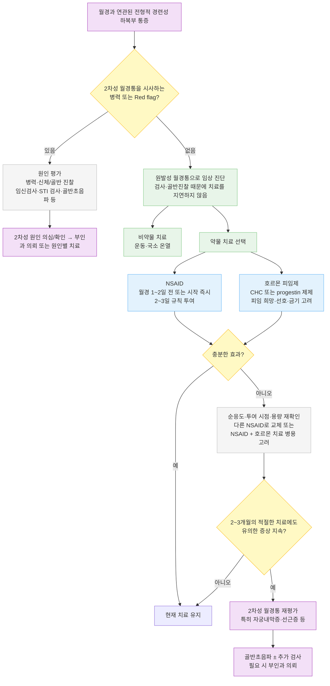

# 월경통 (月經痛) Dysmenorrhea

## <mark style="color:green;">일반 사항</mark>

* 월경통(dysmenorrhea) : 월경과 관련하여 발생하는 통증
* 원발성 월경통 (SOGC Guideline No. 345, 2025) : 골반의 기질적 병변 없이 월경과 연관되어 발생하는 경련성 하복부 통증으로, 대개 월경 시작 무렵 시작하여 2\~3일 지속
* 여성 골반통의 가장 흔한 원인 중 하나; 월경 여성의 50%가 영향을 받으며 약 10%는 심각한 증상 경험; 20\~24세에 가장 흔하고 나이가 들수록 유병률 감소
* 분류
  * 원발성 : 기질적 질환 없이 사춘기(초경 후 6\~12개월째)에 시작; 나이가 들수록 완화, 통증 기간 감소
  * 2차성 : 기저 골반 병리에 의해 발생. 초경 후 어느 연령에서나 발생 가능(보통 초경 수년 후); 2차성 월경통 의심 시 부인과 의뢰 고려


**진료 범위**\
본 챕터는 원발성 월경통의 1차 의료 관리에 초점을 둠. 자궁내막증에 의한 2차성 월경통·만성 골반통의 상세 진단·치료는 부인과 전문 영역이므로, 본 챕터에서는 감별과 의뢰 시점만 다룸(SOGC Guideline No. 345, 2025).


## <mark style="color:green;">원인</mark>

#### <mark style="color:$primary;">원발성 월경통</mark>

* 배란 주기 말 progesterone 감소 → 자궁내막의 arachidonic acid 대사 및 prostaglandin(PGF₂α, PGE₂) 생성 증가 → 자궁근 과수축·혈관수축 및 자궁 허혈 → 통증

#### <mark style="color:$primary;">2차성 월경통</mark>

* 기저 골반 병리로 발생 : 자궁내막증, 선근증(adenomyosis), 자궁근종, 유착, 골반내감염(PID), 구리 IUD 삽입 후 새로 발생하거나 악화된 월경통
  * ※ LNG-IUS는 오히려 월경통 및 자궁내막증 관련 통증을 감소시킬 수 있음

### <mark style="color:orange;">위험 인자</mark>

#### <mark style="color:$primary;">원발성</mark>

* 불규칙 월경, 과다 월경
* 빠른 초경(＜12세)
* 젊은 연령(＜30세)
* 우울, 불안, 스트레스
* 흡연, 음주
* 출산력 없음
* 가족력

#### <mark style="color:$primary;">2차성</mark>

* 골반 감염
* 구리 자궁 내 장치(특히 삽입 초기)
* 골반 기형
* 자궁내막증 가족력

## <mark style="color:green;">임상 양상</mark>

※ 원발성과 2차성 월경통의 증상은 상당 부분 중첩되지만, 발병 시기·진행 양상·동반 증상(성교통, 배변통, 비월경성 골반통)·치료 반응이 감별에 중요함

* 하복부/치골 상부의 경련 또는 통증; 간혹 허리, 대퇴부로 방사통
  * 통증은 월경 출혈 직전 또는 시작과 함께 발생, 경증\~중증 강도로 간헐적으로 발생; 1\~3일에 걸쳐 점차 감소(3일 넘게 지속되는 경우는 드묾)
* 구역, 설사, 복부 팽만감/복통
* 불안, 피로감, 두통, 어지럼, 몸살

### <mark style="color:$danger;">🚩 Red Flags!</mark>

<mark style="color:$danger;">**즉각 조치 또는 의뢰**</mark>

* 가임기 여성에서 급성 심한 편측 하복부 통증 + 실신·저혈압·어지럼 동반 → 자궁외임신 파열 의심(임신 검사 즉시 시행)
* 급성 심한 편측 하복부 통증 + 구역·구토 ± 부속기 압통 → 난소/부속기 염전(adnexal torsion) 의심 → 응급 부인과 평가
* 고열·오한 + 심한 골반통 + 복막 자극 징후 → 골반농양·범발성 복막염 의심

<mark style="color:$warning;">**당일 또는 조기 의뢰**</mark>

* 발열 + 골반통 + 비정상 질분비물 → 골반염(PID) 의심(당일 항생제 치료 평가 필요)
* 초경 직후부터 시작된 심한 주기적 통증, 특히 원발성 무월경 또는 월경혈 배출 장애가 동반되는 경우 → 폐쇄성 뮐러관 기형 감별
* 자궁 내 장치(IUD) 삽입 후 갑작스런 심한 통증 → 천공·감염 감별
* 성매개감염 위험 요인이 있는 골반통

<mark style="color:$info;">**외래 추적 / 추가 평가 계획**</mark> <mark style="color:$info;">- 즉각 위험 낮으나 호전 없으면 의뢰</mark>

* NSAID 또는 호르몬제 2\~3개월 규칙 치료에도 반응 없음
* 수년간 무증상이다가 새로 발생하거나, 진행성으로 악화되는 월경통 → 자궁내막증 의심
* 성교통·배변통이 동반되는 경우

## <mark style="color:green;">진단</mark>

### <mark style="color:orange;">검사</mark>

* 전형적인 원발성 월경통은 병력만으로 임상 진단하고 경험적 치료를 시작할 수 있으며, 골반 진찰이나 추가 검사가 반드시 필요한 것은 아님 \[SOGC 2025]
* 비전형적 병력, 2차성 월경통 의심, 경험적 치료 반응 불충분 시 골반 진찰 및 추가 검사 시행
* 검사 항목 : 필요에 따라 임신 검사, STI 검사(임질, 클라미디아) 및 골반 초음파 시행. MRI는 심부 자궁내막증·선근증 또는 해부학적 이상 평가 등에 선택적으로 사용. 영상검사가 음성이어도 표재성 자궁내막증은 배제되지 않으며, laparoscopy는 SOGC 2025에서는 여전히 자궁내막증 진단의 gold standard로 간주되나 임상적으로 의심되는 경우 수술적 확진을 기다리지 않고 경험적 치료를 시작할 수 있음; 경험적 치료 실패·진단 불확실 또는 수술적 치료가 필요한 경우 laparoscopy 고려

#### <mark style="color:$primary;">검사 대상</mark>

* 초경 직후부터 시작된 심한 주기적 통증(원발성 무월경·월경혈 배출 장애 동반 시 생식관 폐쇄 등 감별)
* 수년간 증상이 없다가 갑자기 발생
* 관습적 치료로 호전되지 않음
* 2차성 월경통 또는 기질적 이상, 병리적 질환이 의심됨

### <mark style="color:orange;">감별 진단</mark>

* 증상이 상당 부분 중첩되는 원발성 월경통과, 기저 병리가 있는 2차성 월경통의 감별이 핵심

<table><thead><tr><th width="140">질환</th><th width="230">핵심 감별 포인트</th><th>확인 검사</th></tr></thead><tbody><tr><td>자궁내막증</td><td>진행성으로 악화되는 통증, 성교통·배변통 동반, 흔히 초경 수년 후 발생</td><td>골반 초음파 ± MRI; 영상검사 음성이라도 배제 안 됨(상세 원칙은 위 "검사" 참조)</td></tr><tr><td>선근증(adenomyosis)</td><td>월경과다 동반, 30\~40대에 흔함, 자궁 비대(압통성)</td><td>골반 초음파/MRI</td></tr><tr><td>자궁근종</td><td>월경과다, 골반 압박감, 촉진되는 종괴</td><td>골반 초음파</td></tr><tr><td>골반염(PID)</td><td>발열, 비정상 질분비물, 부속기 압통</td><td>임질·클라미디아 검사, 골반 초음파</td></tr><tr><td>골반 유착</td><td>골반 수술·감염 병력, 만성 골반통 양상</td><td>병력; 필요시 laparoscopy</td></tr><tr><td>자궁 내 장치(IUD) 관련</td><td>삽입 후 새로 발생하거나 악화된 통증</td><td>병력, 초음파로 위치 확인</td></tr><tr><td>뮐러관 기형(폐쇄성)</td><td>초경 직후부터 심한 주기적 통증, 원발성 무월경 또는 월경혈 배출 장애</td><td>골반 초음파/MRI</td></tr></tbody></table>

***



<p align="center"><strong>1차 진료 원발성 월경통 진단·치료 알고리듬</strong></p>

<p align="center"><em><mark style="color:$info;">Ref. SOGC Guideline No. 345: Primary Dysmenorrhea (2025)를 바탕으로 1차의료 진료 흐름에 맞게 재구성</mark></em></p>

***

## <mark style="background-color:$warning;">Management</mark>


**단계별 치료 전략 (Step-wise Approach)**


| 단계 | 핵심 치료/평가 | 대상 |
| --- | --- | --- |
| 초기 | 운동·국소 온열 + NSAID 및/또는 호르몬 치료(환자의 피임 희망·금기·선호에 따라 선택) | 전형적 원발성 월경통 |
| 반응 부족 | NSAID 복용 시점·용량·순응도 확인 → 다른 NSAID로 교체 또는 호르몬 치료 추가/교체 | 초기 치료 효과 부족 |
| 지속 증상 | NSAID + 호르몬 치료 병용 고려 | 단독 치료 반응 부족 |
| 재평가 | 2차성 원인 재평가, 골반 초음파 ± 추가 검사, 필요 시 부인과 의뢰 | 적절한 치료 2\~3개월에도 지속되는 통증 또는 비전형적 경과 |

## <mark style="color:green;">비-약물 치료 및 예방</mark>

* 국소 온열 치료(온찜질) : 다수의 RCT를 종합한 메타분석에서 통증 감소 효과 확인(heat therapy meta-analysis, 2025)
* 규칙적 운동 : 증상 개선에 권고됨 \[SOGC 2025, conditional recommendation, low-certainty evidence]
* 고주파 TENS, 침·경혈 자극, 생강 보충 : NSAID를 사용할 수 없거나 원하지 않는 환자에서 보조 요법으로 고려 가능하나 근거 수준은 낮음 \[SOGC 2025, conditional, low-certainty]
  * 생강(750\~2,000 ㎎, 월경 첫 3\~4일) : 일부 메타분석에서 NSAID와 유사한 효과 보고되었으나 연구 간 이질성이 커 추가 검증 필요
* 요가, 마사지 : 근거 불충분
* 예방
  * 건강한 식습관을 권장할 수 있으나 특정 식이요법을 월경통 예방 목적으로 권고할 충분한 근거는 제한적
  * 2차성 : 성매개감염 예방(☞ 골반염 관련 챕터 참조)

## <mark style="color:green;">약물 치료</mark>

### <mark style="color:orange;">NSAID</mark>

* 작용 : prostaglandin 합성을 억제시켜 통증 및 월경량을 줄임
* 월경 예정일 1\~2일 전 또는 월경 출혈이 발생하자마자 투약을 시작하여 2\~3일간 규칙적 투여(통증이 심해진 후 시작하면 효과 저하)
* 개별 NSAID 간 임상적 우월성은 명확하지 않으므로 효과·부작용·복용 편의성을 고려하여 선택(Cochrane 리뷰상 COX-2 선택적 억제제가 기존 NSAID보다 더 효과적이라는 근거는 없음)
* 효과가 적으면 다른 종류의 NSAID로 교체
* acetaminophen도 사용할 수 있으나 일반적으로 NSAID보다 진통 효과가 낮음(NSAID 금기·불내성 시 대안)
* 위장관·신장·심혈관 위험이 있는 환자(소화성 궤양, 만성 신질환, 심질환)에서는 사용 전 위험도 평가; 심혈관 위험 인자가 있는 환자는 고용량 NSAID(예: ibuprofen ≥2,400 ㎎/day) 사용 시 특히 신중

#### <mark style="color:$primary;">대표 약제</mark>

* ibuprofen : 400 ㎎ tid\~qid 또는 400 ㎎ q4\~6h 필요 시 투여; 가능한 최소 유효 용량을 최단 기간 사용 <mark style="color:blue;">\[부루펜]</mark>
* naproxen sodium : 550 ㎎ 초회 → 275 ㎎ q6\~8h 또는 550 ㎎ q12h <mark style="color:blue;">\[아나프록스]</mark>
* mefenamic acid : 500 ㎎ 1회 이후 250 ㎎ qid(일일 최대 1,500 ㎎) <mark style="color:blue;">\[폰탈]</mark>

### <mark style="color:orange;">호르몬 피임제</mark>

* 원발성 월경통에 특히 유효; 피임을 원하는 여성에서 선호
* 자궁내막증에 의한 월경통에서는 CHC 또는 progestin 제제를 1차 약물 치료로 고려할 수 있으며, LNG-IUS도 효과적
* 첫 복용 주기부터 효과가 나타날 수 있지만 충분한 효과 발현까지 수개월이 소요됨
* 연속 투여 또는 위약 투여 기간을 짧게 하는 것이 초기 통증 조절에 효과적이며(6개월 후에는 비슷) 출혈이 적을 수 있음
* 복용 중 간헐적 출혈 발생 가능(특히 치료 시작 2\~3개월간)
* 중단 시 금단 출혈 및 월경통 발생 가능
* 호르몬제 금기 및 부작용에 대하여 유의 (☞ p.700)
* CHC 처방 전 흡연, 혈압, VTE/혈전성향증, 편두통 aura, 유방암 등 estrogen-containing contraceptive 금기 여부를 확인(상세 기준 ☞ p.700)

#### <mark style="color:$primary;">대표 제제</mark>

* <mark style="color:blue;">\[야즈]</mark> (28T)(비급여) : 국내 식약처 승인 월경곤란증(월경통) 치료 적응증 보유; 24일간 연분홍색 → 4일간 흰색(위약) 복용
* <mark style="color:blue;">\[야스민]</mark> (21T)(비급여) : 피임 목적 겸용 시 고려(월경통 단독 적응증 없음); 21일간 복용 → 7일간 휴약
* <mark style="color:blue;">\[미레나]</mark> 자궁 내 장치 : levonorgestrel 20 ㎍ 자궁 내 삽입; 삽입 후 5년간 유효. 피임 목적 삽입은 비급여이나, 월경과다증으로 확진되거나 월경곤란증으로 생리주기당 1\~2일간 일상생활이 불가능한 경우 급여 인정(HIRA 고시 제2013-127호) — 급여 여부는 원발성/2차성 구분이 아니라 증상의 중증도 기준임에 유의

### <mark style="color:orange;">보조 요법</mark>

* 소화기·자궁 경련성 통증이 동반된 경우 tiropramide(티로파)나 hyoscine 등의 진경제를 단기 보조제로 고려할 수 있음(월경통 자체의 표준 치료제는 아님)
* 오메가-3 <mark style="color:blue;">\[오마코]</mark>, Mg <mark style="color:blue;">\[마그네스]</mark>, 저지방 채소 식이, 호로파, 쥐오줌풀, Vit B1(100 ㎎), zataria, Zn : 일부 연구에서 효과 보고되나 고품질 근거는 불충분

## <mark style="color:green;">시술 및 기타 처치</mark>

* 수술적 치료는 1차진료 영역이 아니며, 충분한 약물·호르몬 치료에도 심한 증상이 지속되고 2차성 원인이 충분히 평가된 환자에서 부인과 전문의가 선택적으로 고려
* 수술적 치료는 최적화된 약물 치료에도 불구하고 월경통이 지속되거나 2차성 원인이 강력히 의심될 때만 고려 \[SOGC 2025, strong recommendation, moderate-certainty evidence]
* 수술 전 골반 진찰, 직장질 진찰, 복벽 근육 평가 등 철저한 임상 평가 선행 필요 \[SOGC 2025, strong recommendation, moderate-certainty evidence]
* (전문의 영역) 극히 난치성 증례에서는 원인·가임력 희망·동반 월경과다 등에 따라 수술적 치료를 개별적으로 고려

***

### <mark style="color:red;">질병코드</mark>

N94.4 원발성 월경통

N94.5 2차성 월경통

N94.6 상세불명 월경통

※ N94.6은 원발성/2차성 구분이 명확하지 않거나 확진 전 단계에서 실무적으로 흔히 사용됨

***

## <mark style="color:purple;">처방례</mark>

> **처방례 1. 급성 통증**
>
> ```
> 폰탈 250 ㎎/C  초회 2C, 이후 6시간마다 1C
> 티로파 100 ㎎/T  3T #3 (동반된 장관 경련 증상에 한해 증상 치료 목적으로 고려; 월경통 자체의 표준 치료제는 아님)
> ```
>
> _✽ mefenamic acid는 prostaglandin 합성을 억제하는 NSAID로 원발성 월경통에 흔히 사용되며, 월경 시작과 동시에 또는 1\~2일 전부터 규칙 복용해야 효과적_

> **처방례 2. 만성 원발 월경통(피임 원함)**
>
> ```
> 야즈 28T  1T qd
> ```
>
> _✽ 원발성 월경통에 특히 유효하며 피임을 원하는 여성에서 1차 선택; 충분한 효과 발현까지 수개월 소요될 수 있음을 사전 설명_

> **처방례 3. NSAID 단독 반응 부족 시 병용**
>
> ```
> 이부프로펜 400 ㎎/T  1T tid (월경 시작 1~2일 전부터)
> 야스민 21T  1T qd
> ```
>
> _✽ NSAID·CHC 병용은 단독요법 2\~3개월 반응 부족 시 고려; 병용에도 반응 없으면 2차성 월경통 감별 위해 골반 초음파 등 추가 평가 필요_

***

### <mark style="color:$success;">핵심 복약 지도</mark>

> **NSAID 복용 원칙**
>
> * **월경 예정일 1\~2일 전부터 미리 복용을 시작하세요.** 통증이 심해진 후 시작하면 효과가 떨어집니다.
> * 2\~3일간 규칙적으로 복용; 위장 장애가 우려되면 식후 복용
> * 적정 용량을 올바른 시점부터 규칙적으로 사용해도 반응이 부족하면, 자가로 증량하지 말고 재진하여 다른 NSAID 또는 호르몬 치료를 고려

> **호르몬 피임제 복용 원칙**
>
> * 첫 복용 주기부터 효과가 나타날 수 있으나 충분한 효과 발현까지 수개월 소요될 수 있음을 미리 설명
> * 복용 초기(2\~3개월) 간헐적 부정출혈이 나타날 수 있음 — 임의로 중단하지 않도록 안내
> * 혈전색전증 위험 인자(흡연, 편두통 aura, 혈전 병력 등) 처방 전 반드시 확인 (☞ p.700)

> **언제 다시 병원을 방문해야 하나요?**
>
> * NSAID 또는 호르몬제를 2\~3개월 규칙적으로 사용해도 통증이 호전되지 않는 경우
> * 통증이 점차 심해지거나 성교통·배변통이 새로 동반되는 경우
> * 발열, 비정상 질분비물, 성교 후 출혈이 동반되는 경우 — 조기 내원
> * **갑작스런 심한 편측 하복부 통증** 또는 **실신·어지럼**이 동반되는 경우 — 즉시 응급실 방문

***

### <mark style="color:blue;">환자 안내서</mark>


**월경통, 대부분은 치료로 충분히 조절됩니다**

월경통은 자궁이 수축하면서 생기는 통증으로, 월경하는 여성의 절반 정도가 경험할 만큼 흔합니다. 기저 질환이 없는 경우가 대부분이며, 약물과 생활 관리로 충분히 조절할 수 있습니다.


#### <mark style="color:$primary;">왜 월경통이 생기나요?</mark>

* 월경이 시작되면 자궁 내막에서 prostaglandin이라는 물질이 많이 나와 자궁근육을 강하게 수축시킵니다. 이 과정에서 하복부 경련과 통증이 생깁니다.
* 대부분의 원발성 월경통은 특별한 골반 질환 없이 발생하지만, 일상생활을 방해할 정도의 통증은 적극적으로 치료할 필요가 있습니다.
* 일부는 자궁내막증 등 기저 질환에 의한 것(2차성 월경통)일 수 있습니다.
* 초음파 등 영상검사에서 특별한 이상이 없다고 나오더라도 자궁내막증 등 초기 병변은 영상에서 잘 보이지 않을 수 있어, 통증이 지속된다면 재평가가 필요할 수 있습니다.

#### <mark style="color:$primary;">일상생활에서 어떻게 관리하나요?</mark>

* **아랫배를 따뜻하게 해주세요.** 🌡️ 온찜질이 통증 완화에 도움이 됩니다.
* **규칙적으로 운동하세요.** 꾸준한 운동은 월경통 증상을 줄이는 데 도움이 됩니다.
* 일부 환자에서는 카페인·알코올 등이 증상을 악화시킬 수 있으므로, 개인적으로 연관성이 뚜렷하면 줄여볼 수 있습니다.
* 온찜질·운동 외에 생강, 침 치료 등을 보조적으로 시도해볼 수 있으나, 아직 근거가 충분하지 않아 효과에 개인차가 있을 수 있습니다.

#### <mark style="color:$primary;">약은 어떻게 써야 하나요?</mark>

* **진통제(소염진통제)는 통증이 심해지기 전, 월경 예정일 1\~2일 전이나 출혈이 시작되자마자 복용하세요.** 통증이 심해진 후 먹으면 효과가 떨어집니다.
* 피임약(호르몬제)을 처방받은 경우, 효과가 충분히 나타나기까지 몇 달이 걸릴 수 있고 초기에 소량의 부정출혈이 있을 수 있습니다. 임의로 중단하지 마세요.

#### <mark style="color:$primary;">이럴 때는 즉시 병원을 방문하세요</mark>

* 약을 꾸준히 먹어도 2\~3개월 이상 통증이 나아지지 않는 경우
* 통증이 점점 심해지거나 성관계 시 아픈 증상이 새로 생긴 경우
* 열이 나거나 냄새 나는 질 분비물이 동반되는 경우
* **갑자기 한쪽 아랫배가 심하게 아프면서 어지럽거나 쓰러질 것 같은 경우** — 즉시 응급실로 가세요
