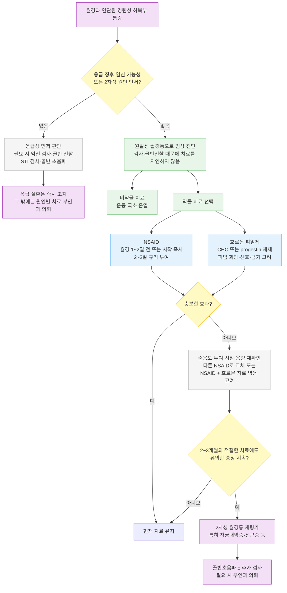

# 월경통 (月經痛) Dysmenorrhea

## <mark style="color:green;">일반 사항</mark>

* 월경통(dysmenorrhea) : 월경과 관련하여 발생하는 통증
* 원발성 월경통 (SOGC Guideline No. 345, 2025) : 골반의 기질적 병변 없이 월경과 연관되어 발생하는 경련성 하복부 통증으로, 대개 월경 시작 무렵 시작하여 2\~3일 지속
* 여성 골반통의 가장 흔한 원인 중 하나; 월경 여성의 50%가 영향을 받으며 약 10%는 심각한 증상 경험; 20\~24세에 가장 흔하고 나이가 들수록 유병률 감소
* 분류
  * 원발성 : 기질적 질환 없이 대개 초경 후 배란 주기가 자리 잡으면서 시작(보통 6\~12개월 이후); 나이가 들면서 완화되기도 하나 개인차가 있음
  * 2차성 : 기저 골반 병리에 의해 발생. 초경 후 어느 연령에서나 발생 가능(보통 초경 수년 후); 2차성 월경통 의심 시 부인과 의뢰 고려


**진료 범위**\
본 챕터는 원발성 월경통의 1차 의료 관리에 초점을 둠. 자궁내막증에 의한 2차성 월경통·만성 골반통의 상세 진단·치료는 부인과 전문 영역이므로, 본 챕터에서는 감별과 의뢰 시점만 다룸(SOGC Guideline No. 345, 2025).


## <mark style="color:green;">원인</mark>

#### <mark style="color:$primary;">원발성 월경통</mark>

* 배란 주기 말 progesterone 감소 → 자궁내막의 arachidonic acid 대사 및 prostaglandin(PGF₂α, PGE₂) 생성 증가 → 자궁근 과수축·혈관수축 및 자궁 허혈 → 통증

#### <mark style="color:$primary;">2차성 월경통</mark>

* 기저 골반 병리로 발생 : 자궁내막증, 선근증(adenomyosis), 자궁근종, 유착, 골반내감염(PID), 구리 IUD 삽입 후 새로 발생하거나 악화된 월경통
  * ※ LNG-IUS는 오히려 월경통 및 자궁내막증 관련 통증을 감소시킬 수 있음

### <mark style="color:orange;">위험 인자</mark>

#### <mark style="color:$primary;">원발성</mark>

* 불규칙 월경, 과다 월경
* 빠른 초경(＜12세)
* 젊은 연령(＜30세)
* 우울, 불안, 스트레스
* 흡연, 음주
* 출산력 없음
* 가족력

#### <mark style="color:$primary;">2차성</mark>

* 골반 감염
* 구리 자궁 내 장치(특히 삽입 초기)
* 골반 기형
* 자궁내막증 가족력

## <mark style="color:green;">임상 양상</mark>

※ 원발성과 2차성 월경통의 증상은 상당 부분 중첩되지만, 발병 시기·진행 양상·동반 증상(성교통, 배변통, 비월경성 골반통)·치료 반응이 감별에 중요함

* 하복부/치골 상부의 경련 또는 통증; 간혹 허리, 대퇴부로 방사통
  * 통증은 월경 출혈 직전 또는 시작과 함께 발생, 경증\~중증 강도로 간헐적으로 발생; 1\~3일에 걸쳐 점차 감소(3일 넘게 지속되는 경우는 드묾)
* 구역, 설사, 복부 팽만감/복통
* 불안, 피로감, 두통, 어지럼, 몸살

### <mark style="color:$danger;">🚩 Red Flags!</mark>

<mark style="color:$danger;">**즉각 조치 또는 의뢰**</mark>

* 임신 가능성이 있는 환자의 급성 골반통, 특히 편측 통증·질출혈·실신·저혈압 동반 → 자궁외임신(파열 포함) 감별; 활력징후 평가와 임신 검사, 불안정하면 응급 이송
* 급성 심한 편측 하복부 통증 + 구역·구토 ± 부속기 압통 → 난소/부속기 염전(adnexal torsion) 의심 → 응급 부인과 평가
* 고열·오한 + 심한 골반통 + 복막 자극 징후 → 골반농양·범발성 복막염 의심

<mark style="color:$warning;">**당일~수일 내 평가**</mark>

* 골반통 + 자궁경부 운동통/자궁 압통/부속기 압통 ± 발열·비정상 질분비물 → PID 의심; 당일 평가·경험적 치료를 지연하지 않음. 임신·중증 질환·농양 의심 등 입원 적응증이면 응급 의뢰
* 초경 직후부터 시작된 심한 주기적 통증, 특히 원발성 무월경 또는 월경혈 배출 장애가 동반되는 경우 → 폐쇄성 뮐러관 기형 감별(조기 부인과 평가)
* 자궁 내 장치(IUD) 삽입 후 새로 발생한 심한 통증 → 위치 이상·부분 배출·천공·PID 및 임신(자궁외임신 포함) 감별(당일 평가)

<mark style="color:$info;">**조기 평가 및 추적**</mark> <mark style="color:$info;">- 즉각 위험 낮으나 호전 없으면 의뢰</mark>

* NSAID 또는 호르몬제 2\~3개월 규칙 치료에도 반응 없음
* 수년간 무증상이다가 새로 발생하거나, 진행성으로 악화되는 월경통 → 자궁내막증 의심
* 성교통·배변통이 동반되는 경우

## <mark style="color:green;">진단</mark>

### <mark style="color:orange;">검사</mark>

* 월경 시작과 밀접한 전형적 통증이며 2차성 원인을 시사하는 병력·징후가 없으면 병력으로 임상 진단하여 경험적 치료 시작 가능; 모든 환자에게 골반 진찰·초음파가 필수는 아님 \[SOGC 2025]
* 초진 시 초경·월경 주기/출혈량, 통증 시작·지속·진행, 비월경성 통증, 성교통·배변통, 성생활·임신 가능성, STI 위험, 기존 치료의 용량·시점·반응 및 일상 기능 영향을 확인
* 비전형적 병력, 2차성 월경통 의심, 경험적 치료 반응 불충분 시 골반 진찰 및 추가 검사 시행
* 검사 항목 : 임신 가능성이 있거나 급성·비전형적 골반통이면 소변/혈청 임신 검사를 우선 시행. STI 위험·PID 의심 시 임질·클라미디아 NAAT 등 시행; 기질적 원인 의심 또는 치료 반응 부족 시 골반 초음파 고려. MRI는 심부 자궁내막증·선근증·해부학적 이상 평가 등에 선택적으로 사용. 초음파 음성으로 표재성 자궁내막증을 배제할 수 없음. ESHRE 2022는 영상과 임상 소견에 따른 추정 진단·경험적 치료를 허용하며, 영상 음성이나 경험적 치료 실패·부적합 시 전문의가 복강경을 고려
* STI 위험 요인이 있는 골반통은 PID·자궁경부염을 고려하여 골반 진찰·STI 검사를 시행. 다른 원인을 확인하지 못한 STI 위험 환자에서 PID는 자궁경부 운동통·자궁 압통·부속기 압통 중 하나 이상이 있으면 경험적 치료를 시작하며, NAAT 또는 초음파 결과를 기다리느라 치료를 늦추지 않음

#### <mark style="color:$primary;">검사 대상</mark>

* 초경 직후부터 시작된 심한 주기적 통증(원발성 무월경·월경혈 배출 장애 동반 시 생식관 폐쇄 등 감별)
* 수년간 증상이 없다가 갑자기 발생
* 적절한 1차 치료에 반응하지 않음
* 2차성 월경통 또는 기질적 이상, 병리적 질환이 의심됨

### <mark style="color:orange;">감별 진단</mark>

* 증상이 상당 부분 중첩되는 원발성 월경통과, 기저 병리가 있는 2차성 월경통의 감별이 핵심

<table><thead><tr><th width="140">질환</th><th width="230">핵심 감별 포인트</th><th>확인 검사</th></tr></thead><tbody><tr><td>자궁내막증</td><td>진행성으로 악화되는 통증, 성교통·배변통 동반, 흔히 초경 수년 후 발생</td><td>골반 초음파 ± MRI; 영상검사 음성이라도 배제 안 됨(상세 원칙은 위 "검사" 참조)</td></tr><tr><td>선근증(adenomyosis)</td><td>월경과다 동반, 30\~40대에 흔함, 자궁 비대(압통성)</td><td>골반 초음파/MRI</td></tr><tr><td>자궁근종</td><td>월경과다, 골반 압박감, 촉진되는 종괴</td><td>골반 초음파</td></tr><tr><td>골반염(PID)</td><td>발열, 비정상 질분비물, 부속기 압통</td><td>골반 진찰, 임신 검사·임질/클라미디아 NAAT; 초음파는 농양·다른 원인 의심 시</td></tr><tr><td>골반 유착</td><td>골반 수술·감염 병력, 만성 골반통 양상</td><td>병력; 필요시 laparoscopy</td></tr><tr><td>Cu-IUD 또는 IUD malposition 관련</td><td>삽입 후 새로 발생하거나 악화된 통증</td><td>병력, 초음파로 위치 확인</td></tr><tr><td>뮐러관 기형(폐쇄성)</td><td>초경 직후부터 심한 주기적 통증, 원발성 무월경 또는 월경혈 배출 장애</td><td>골반 초음파/MRI</td></tr></tbody></table>

***


```mermaid
graph TD
    A["월경과 연관된 경련성 하복부 통증"] --> B{"응급 징후·임신 가능성<br/>또는 2차성 원인 단서?"}
    B -->|있음| C["응급성 먼저 판단<br/>필요 시 임신 검사·골반 진찰<br/>STI 검사·골반 초음파"]
    C --> D["응급 질환은 즉시 조치<br/>그 밖에는 원인별 치료·부인과 의뢰"]
    B -->|없음| E["원발성 월경통으로 임상 진단<br/>검사·골반진찰 때문에 치료를 지연하지 않음"]
    E --> F["비약물 치료<br/>운동·국소 온열"]
    E --> G["약물 치료 선택"]
    G --> H["NSAID<br/>월경 1~2일 전 또는 시작 즉시<br/>2~3일 규칙 투여"]
    G --> I["호르몬 피임제<br/>CHC 또는 progestin 제제<br/>피임 희망·선호·금기 고려"]
    H --> J{"충분한 효과?"}
    I --> J
    J -->|예| K["현재 치료 유지"]
    J -->|아니오| L["순응도·투여 시점·용량 재확인<br/>다른 NSAID로 교체 또는<br/>NSAID + 호르몬 치료 병용 고려"]
    L --> M{"2~3개월의 적절한 치료에도<br/>유의한 증상 지속?"}
    M -->|아니오| K
    M -->|예| N["2차성 월경통 재평가<br/>특히 자궁내막증·선근증 등"]
    N --> O["골반초음파 ± 추가 검사<br/>필요 시 부인과 의뢰"]

    classDef purple fill:#f3e0f7,stroke:#ab47bc,stroke-width:1px;
    classDef blue fill:#e3f2fd,stroke:#64b5f6,stroke-width:1px;
    classDef yellow fill:#fff9c4,stroke:#fbc02d,stroke-width:1px;
    classDef gray fill:#f5f5f5,stroke:#bdbdbd,stroke-width:1px;
    classDef green fill:#e8f5e9,stroke:#81c784,stroke-width:1px;

    class A purple;
    class E,F,G green;
    class H,I blue;
    class B,J,M yellow;
    class C,L gray;
    class D,N,O purple;
```

<p align="center"><strong>1차 진료 원발성 월경통 진단·치료 알고리듬</strong></p>

<p align="center"><em><mark style="color:$info;">Ref. SOGC Guideline No. 345: Primary Dysmenorrhea (2025)를 바탕으로 1차의료 진료 흐름에 맞게 재구성</mark></em></p>

***

## <mark style="background-color:$warning;">Management</mark>


**단계별 치료 전략 (Step-wise Approach)**


<table><thead><tr><th>단계</th><th>핵심 치료·평가</th><th>대상</th></tr></thead><tbody><tr><td>초기</td><td>운동·국소 온열 및 NSAID/호르몬 치료 선택(피임 희망·금기·선호 고려)</td><td>전형적 원발성 월경통</td></tr><tr><td>반응 부족</td><td>NSAID 시점·용량·순응도 확인 후 다른 NSAID 또는 호르몬 치료 추가·교체</td><td>초기 치료 효과 부족</td></tr><tr><td>재평가</td><td>2차성 원인 재평가, 골반 초음파 ± 추가 검사, 필요 시 부인과 의뢰</td><td>적절한 치료 2\~3개월에도 지속 또는 비전형적 경과</td></tr></tbody></table>

## <mark style="color:green;">비-약물 치료 및 예방</mark>

* 국소 온열 치료(온찜질) : 통증 완화에 도움이 되며 NSAID와 함께 사용할 수 있음 \[SOGC 2025]
* 규칙적 운동 : 증상 개선에 권고됨 \[SOGC 2025, conditional recommendation, low-certainty evidence]
* 고주파 TENS, 침·경혈 자극, 생강 보충 : NSAID를 사용할 수 없거나 원하지 않는 환자에서 보조 요법으로 고려 가능하나 근거 수준은 낮음 \[SOGC 2025, conditional, low-certainty]
  * 생강 보충제는 연구별 제형·용량이 달라 표준 처방 용량을 제시하기 어려움. 상호작용과 임신 가능성을 확인
* 요가, 마사지 : 근거 불충분
* 예방
  * 건강한 식습관을 권장할 수 있으나 특정 식이요법을 월경통 예방 목적으로 권고할 충분한 근거는 제한적
  * 2차성 : 성매개감염 예방(☞ 골반염 관련 챕터 참조)

## <mark style="color:green;">약물 치료</mark>

### <mark style="color:orange;">NSAID</mark>

* 작용 : prostaglandin 합성을 억제시켜 통증 및 월경량을 줄임
* 주기가 예측 가능하면 월경 예정일 1\~2일 전, 예측하기 어렵다면 통증 또는 출혈 시작 즉시 투여; 통증이 심한 첫 2\~3일간 규칙적으로 복용
* 개별 NSAID 간 임상적 우월성은 명확하지 않으므로 효과·부작용·복용 편의성을 고려하여 선택(Cochrane 리뷰상 COX-2 선택적 억제제가 기존 NSAID보다 더 효과적이라는 근거는 없음)
* 적절히 투여해도 효과가 적으면 다른 NSAID로 교체할 수 있으나 두 종류의 전신 NSAID를 동시에 복용하지 않음
* acetaminophen도 사용할 수 있으나 일반적으로 NSAID보다 진통 효과가 낮음(NSAID 금기·불내성 시 대안)
* 임신 가능성, 소화성 궤양·위장관 출혈, 신기능 저하, 심혈관질환, 항응고제 복용, NSAID 과민반응·천식을 확인. 최저 유효 용량을 필요한 기간만 사용하고 여러 NSAID의 중복 복용을 피함

#### <mark style="color:$primary;">대표 약제</mark>

* ibuprofen : 400 ㎎ q6\~8h <mark style="color:blue;">\[부루펜]</mark>
* naproxen sodium : 550 ㎎ 초회 → 275 ㎎ q6\~8h(월경곤란증 국내 허가 용법) <mark style="color:blue;">\[아나프록스정 275 ㎎]</mark>
* mefenamic acid : 초회 500 ㎎ → 이후 250 ㎎ q6h(국내 허가 용법) <mark style="color:blue;">\[폰탈캡슐 250 ㎎]</mark>

### <mark style="color:orange;">호르몬 피임제</mark>

* 원발성 월경통에 특히 유효; 피임을 원하는 여성에서 선호
* 자궁내막증에 의한 월경통에서는 CHC 또는 progestin 제제를 1차 약물 치료로 고려할 수 있으며, LNG-IUS도 효과적
* 첫 복용 주기부터 효과가 나타날 수 있지만 충분한 효과 발현까지 수개월이 소요됨
* 연속 투여 또는 위약 투여 기간을 짧게 하는 것이 초기 통증 조절에 효과적이며(6개월 후에는 비슷) 출혈이 적을 수 있음
* 복용 중 간헐적 출혈 발생 가능(특히 치료 시작 2\~3개월간)
* 중단 시 금단 출혈 및 월경통 발생 가능
* 호르몬제 금기 및 부작용에 대하여 유의 (☞ p.700)
* CHC 처방 전 흡연, 혈압, VTE/혈전성향증, 편두통 aura, 유방암 등 estrogen-containing contraceptive 금기 여부를 확인(상세 기준 ☞ p.700)

#### <mark style="color:$primary;">대표 제제</mark>

* <mark style="color:blue;">\[야즈]</mark> (28T)(비급여) : 경구피임약 사용을 원하는 여성의 월경곤란증 치료 적응증 보유; 24일간 연분홍색 → 4일간 흰색(위약) 복용
* <mark style="color:blue;">\[야스민]</mark> (21T)(비급여) : 피임 목적 겸용 시 고려(월경통 단독 적응증 없음); 21일간 복용 → 7일간 휴약
* <mark style="color:blue;">\[미레나]</mark> 자궁 내 시스템 : levonorgestrel 52 ㎎ LNG-IUS; 국내 허가상 월경과다·월경곤란증 치료에는 삽입 후 5년, 피임에는 8년간 유효. 삽입·교체는 숙련된 의료진이 시행. 급여 적용은 현행 고시의 적응증·중증도 및 청구 기준을 처방 시점에 확인

### <mark style="color:orange;">보조 요법</mark>

* 진경제는 원발성 월경통의 표준 1차 치료가 아니며, NSAID·호르몬 치료를 대체하지 않음. 다른 경련성 복통이 동반될 때 해당 원인을 평가한 후 개별적으로 고려
* omega-3 fatty acid, magnesium, vitamin B1, zinc 등은 일부 연구에서 효과가 보고되었으나 근거의 질과 일관성이 부족하여 일상적으로 권고하기 어려움

## <mark style="color:green;">시술 및 기타 처치</mark>

* 수술적 치료는 최적화된 약물 치료에도 불구하고 월경통이 지속되거나 2차성 원인이 강력히 의심될 때만 고려 \[SOGC 2025, strong recommendation, moderate-certainty evidence]
* 수술 여부 결정 전 2차성 원인 및 비부인과적 골반통 원인을 포함한 충분한 재평가 필요
* 수술 전에는 전문의가 골반 진찰과 골반통의 부인과적·비부인과적 원인을 충분히 평가

***

### 질병코드

N94.4 원발성 월경통

N94.5 2차성 월경통

N94.6 상세불명 월경통

※ 원발성·2차성 여부가 아직 확인되지 않았다면 상세불명 코드를 고려하고, 평가 후 진단에 맞게 갱신

***

## <mark style="color:purple;">처방례</mark>

> **처방례 1. 급성 통증**
>
> ```
> 폰탈 250 ㎎/C  초회 2C, 이후 6시간마다 1C(통증이 심한 첫 2\~3일)
> ```
>
> _✽ 월경 주기가 예측되면 시작 1\~2일 전, 예측하기 어려우면 통증·출혈이 시작될 때 복용. 다른 NSAID와 중복하지 않음_

> **처방례 2. 만성 원발 월경통(피임 원함)**
>
> ```
> 야즈 28T  1T qd
> ```
>
> _✽ 피임을 원하고 복합호르몬제 금기가 없는 환자에서 선택; 충분한 효과 발현까지 수개월 소요될 수 있음을 설명_

> **처방례 3. NSAID 단독 반응 부족 시 병용**
>
> ```
> 이부프로펜 400 ㎎/T  1T tid (주기 예측 시 월경 시작 1~2일 전부터, 첫 2~3일)
> 야스민 21T  1T qd
> ```
>
> _✽ NSAID·CHC 병용은 단독요법 2\~3개월 반응 부족 시 고려; 병용에도 반응 없으면 2차성 월경통 감별 위해 골반 초음파 등 추가 평가 필요_

***

### <mark style="color:$success;">핵심 복약 지도</mark>

> **NSAID 복용 원칙**
>
> * **월경이 규칙적이면 예정일 1\~2일 전부터, 불규칙하면 출혈이나 통증이 시작될 때 복용하세요.** 통증이 심해질 때까지 기다리지 마세요.
> * 통증이 심한 첫 2\~3일간 처방대로 복용; 위장 장애가 우려되면 식후 복용. 다른 소염진통제와 중복 복용하지 않음
> * 적정 용량을 올바른 시점부터 규칙적으로 사용해도 반응이 부족하면, 자가로 증량하지 말고 재진하여 다른 NSAID 또는 호르몬 치료를 고려

> **호르몬 피임제 복용 원칙**
>
> * 첫 복용 주기부터 효과가 나타날 수 있으나 충분한 효과 발현까지 수개월 소요될 수 있음을 미리 설명
> * 복용 초기(2\~3개월) 간헐적 부정출혈이 나타날 수 있음 - 임의로 중단하지 않도록 안내
> * 혈전색전증 위험 인자(흡연, 편두통 aura, 혈전 병력 등) 처방 전 반드시 확인 (☞ p.700)

> **언제 다시 병원을 방문해야 하나요?**
>
> * NSAID 또는 호르몬제를 2\~3개월 규칙적으로 사용해도 통증이 호전되지 않는 경우
> * 통증이 점차 심해지거나 성교통·배변통이 새로 동반되는 경우
> * 발열, 비정상 질분비물, 성교 후 출혈이 동반되는 경우 - 조기 내원
> * **갑작스런 심한 편측 하복부 통증** 또는 **실신·어지럼**이 동반되는 경우 - 즉시 응급실 방문

***

## <mark style="color:blue;">환자 안내서</mark>


**월경통, 대부분은 치료로 충분히 조절됩니다**

월경통은 자궁이 수축하면서 생기는 통증으로, 월경하는 여성의 절반 정도가 경험할 만큼 흔합니다. 기저 질환이 없는 경우가 대부분이며, 약물과 생활 관리로 충분히 조절할 수 있습니다.


#### <mark style="color:$primary;">왜 월경통이 생기나요?</mark>

* 월경이 시작되면 자궁 내막에서 prostaglandin이라는 물질이 많이 나와 자궁근육을 강하게 수축시킵니다. 이 과정에서 하복부 경련과 통증이 생깁니다.
* 대부분의 원발성 월경통은 특별한 골반 질환 없이 발생하지만, 일상생활을 방해할 정도의 통증은 적극적으로 치료할 필요가 있습니다.
* 일부는 자궁내막증 등 기저 질환에 의한 것(2차성 월경통)일 수 있습니다.
* 초음파 등 영상검사에서 특별한 이상이 없다고 나오더라도 자궁내막증 등 초기 병변은 영상에서 잘 보이지 않을 수 있어, 통증이 지속된다면 재평가가 필요할 수 있습니다.

#### <mark style="color:$primary;">일상생활에서 어떻게 관리하나요?</mark>

* **아랫배를 따뜻하게 해주세요.** 🌡️ 온찜질이 통증 완화에 도움이 됩니다.
* **규칙적으로 운동하세요.** 꾸준한 운동은 월경통 증상을 줄이는 데 도움이 됩니다.
* 일부 환자에서는 카페인·알코올 등이 증상을 악화시킬 수 있으므로, 개인적으로 연관성이 뚜렷하면 줄여볼 수 있습니다.
* 온찜질·운동 외에 생강, 침 치료 등을 보조적으로 시도해볼 수 있으나, 아직 근거가 충분하지 않아 효과에 개인차가 있을 수 있습니다.

#### <mark style="color:$primary;">약은 어떻게 써야 하나요?</mark>

* **소염진통제는 월경 주기가 규칙적이면 예정일 1\~2일 전, 불규칙하면 출혈이나 통증이 시작될 때 복용하세요.** 다른 소염진통제를 함께 먹지 말고 임신 가능성이 있으면 먼저 의료진과 상의하세요.
* 피임약(호르몬제)을 처방받은 경우, 효과가 충분히 나타나기까지 몇 달이 걸릴 수 있고 초기에 소량의 부정출혈이 있을 수 있습니다. 임의로 중단하지 마세요.

#### <mark style="color:$primary;">다시 진료받아야 할 때</mark>

* 약을 처방대로 2\~3개월 사용해도 통증이 나아지지 않는 경우에는 재진하세요.
* 통증이 점점 심해지거나 성관계 시 아픈 증상이 새로 생긴 경우
* 열이 나거나 냄새 나는 질 분비물이 동반되면 당일 진료받으세요.
* **갑자기 아랫배가 심하게 아프거나, 임신 가능성이 있으면서 통증·출혈·어지럼/실신이 있으면 즉시 응급실로 가세요.**
