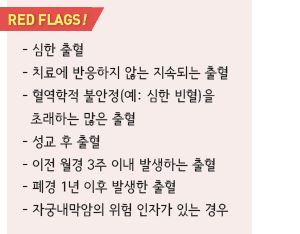
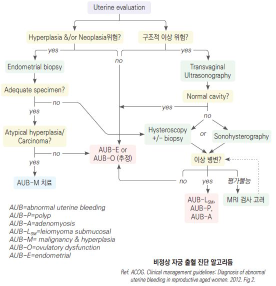
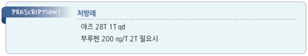

# 비정상 자궁 출혈 Abnormal Uterine Bleeding, AUB

## 일반 사항

*   비정상 자궁 출혈 (AUB) : 비임신 여성에서 규칙성, 양, 빈도, 기간에 있어 비정상적인 자궁 출혈; 월경 이외의 출혈,

    성교 후 출혈, 일반적(또는 평소) 월경보다 많거나 길어지는 출혈, 폐경 후 출혈;

    이전의 Dysfunctional uterine bleeding(DUB)을 대체한 용어
* 대부분 자궁의 structural pathology에 의함
* 호발 시기 : 청소년, 폐경 이행기
* 진단 및 치료 전 임신 여부를 반드시 확인해야 함
* 심한 과다월경 여성의 18%에서 기저 혈액 질환이 있음을 유념
* 40\~45세 이상에서는 자궁내막암 위험을 감하여 endometrial biopy를 수행
* 희발월경(oligomenorrhea) : ＞35일의 월경 주기
* 빈발월경(polymenorrhea) : ＜21일의 월경 주기
* 과다월경(hypermenorrhea, menorrhagia) : 정상 주기상의 과다 출혈
* 자궁출혈(metrorrhagia) : 월경 주기 사이의 출혈
* 불규칙 과다월경(menometrorrhagia) : 월경 기간 중 및 사이에 과도한 출혈 또는 기간
* 월경중간출혈 (intermenstrual bleeding) : 규칙적인 월경 사이의 출혈; 난소 기능 장애에 기인

### 일반적 월경 양상

* 간격 : 28일±7일(21~~35일); 초경 후 첫 3년간은 21~~45일
* 기간 : 5일(3\~7일)
* 출혈 양 : 40 ㎖(30\~60 ㎖)/cycle
* 패드 사용 패턴 : 교체 간격 ≥3시간, 사용량 ＜21 패드/주기, 수면 중 교체 필요 없음
* menstrual clots 지름 : ＜1 inch
* 빈혈 유발 없음

### 과다월경 (Menorrhagia)

* 출혈 양 : ≥80 ㎖/cycle
* 기간 : ＞7일 지속
* 패드 사용 패턴 : 교체 간격 1\~2시간; 한 번에 ≥2장 패드 착용 또는 밤중 패드 교체를 요함
* ¼의 응고된 혈액이 있는 출혈

## 원인

*   무배란성 출혈 : 주기적인 자궁내막 자극 소실, estrogen 증가, progesterone 소퇴성 출혈의 소실, 자궁내막 탈락,

    다낭성난소증후군; AUB의 80\~90% 해당
* 임신 : 자궁외임신, 유산 관련
* 생식기계의 구조적 이상 또는 감염 : leiomyoma, endometritis, uterine hyperplasia, STI, salpingitis,

기능성 난소낭종, 자궁경부염, 용종, 외상, 이물, 악성 종양

* 전신 질환 : IBD, 출혈성 질환, 중증 간/신질환, hyper/hypo-thyroidism, prolactinoma, 당뇨병, 섭식 장애
* 약물 : 항응고제, steroid, tamoxifen, SSRI, 항정신병제, 호르몬제(피임제)
* 기타 : 자궁 내 장치, 비만, 심한 운동

#### 연령별

* 사춘기 이전 : 외상, 이물, 자극, 감염, 비뇨기계 문제
*   사춘기 : hypothalamic-pituitary-ovarian axis 기능의 미성숙(대부분의 여성에서 초경 후 수개월 동안 불규칙 월경 발생),

    임신, 감염
*   가임기 : 임신, 배란 출혈(소량 출혈), 호르몬 피임제(대량 출혈), 감염, 응고 장애, 갑상선저하증, 간/신질환, uterine fibroid,

    uterine adenomyosis, endometrial polyp, 생식기계 악성 종양
* 폐경기 : 생식기계 위축/퇴행 변화, 감염, 항응고제 투여, 섬유종, 용종, 악성 종양

## 임상 양상

* Anovulatory bleeding의 특징 : 지속적 불규칙 출혈
* Ovulatory bleeding의 특징 : 규칙적 주기성 출혈, 월경 전 증상이 있음(예: 유방통, 감정 변화), midcycle pain이 있음(배란통)
* 창백(빈혈)

### 자궁내막암의 위험 인자

* ＞40세
* 비만, 당뇨병, 고혈압
* 유방암, 자궁내막증, 다낭성난소증후군
* tamoxifen 사용, unopposed estrogen 요법
* 이른 초경, 늦은 폐경(＞55세)
* 출산 경력 없음, 불임, 만성 무배란
* 가족력 : 여성 생식기계 암, 유방암, 대장암

## 진단

#### 신체검사 \[감별 질환]

* BMI \[obesity)
* 시각 검사 \[pituitary lesion]
* goiter \[thyroid dysfunction]
* hirsutism or acne \[hyperandrogenism]
* galactorrhea \[hyperprolactinemia]
* purpura, ecchymosis \[bleeding disorders]
* 골반 검사 \[자궁 형태 이상, 이물]

#### 실험실 검사

* 혈액 or 소변 hCG : 임신 또는 hydatidiform mole 배제
* CBC, 빈혈 검사(ferritin, TIBC, Fe, reticulocyte) : 과다 출혈 시
* LFT, RFT, TSH(갑상선 질환이 의심되는 경우)
* prolactin : 가급적 follicular phase에 시행; 증가되어 있는 경우 공복 시 재검
* 소변 및 질 분비물 검사 : 외음부 감염 징후가 있는 경우 \*Chlamydia \*등 감별
*   응고 장애 선별 검사 : PTT, PT, aPTT, fibrinogen

    •심한 과다월경 환자의 18%에서 응고 장애가 있음

    •출혈성 질환이 있는 경우 코피/잇몸 출혈/잦은 멍 발생의 동반, 출혈 가족력이 있을 수 있음

    •대상 : 과다 질 출혈 청소년, 만성 질 출혈, 산욕기 출혈, 수술 관련 출혈, 월 1\~2회의 코피/멍, 잇몸 출혈, 출혈성 가족력

#### 영상 검사

* 질식 초음파(또는 복부 초음파) : 1차 선택
* sonohysterography, hysteroscopy : 자궁 내 이상(예: fibroid, polyp) 진단에 유용
* MRI : 큰 fibroid, uterine pathology, adenomyosis 진단에 유용

#### 조직 검사 및 대상

* pap smear : ＞21세
*   endometrial biopsy : ＞40\~45세, 자궁내막암의 위험 인자, unopposed estrogen 노출력(예: 비만, PCOS), 치료에 반응하지

    않는 경우 고려
*   D\&C : 심한 출혈, 경구제 치료 실패 시, endometrial biopsy를 시행할 수 없는 경우

    

***

## Management

## 비-약물 치료

*
  * 철분 섭취를 늘림 (☞ p.1027)
* 생활 습관 중재 : 체중 관리, 운동

## 약물 치료

### 급성, 응급, 무배란성

*   conjugated equine estrogen 25 ㎎ IV q4h (max 6 doses) or 2.5 ㎎ PO q6h

    → estrogen 2\~4회 투여에 반응이 없거나 시간당 ＞1 pad 출혈 시 D\&C

    → 경구 복합 피임제 또는 progestin

### 급성, 비응급, 무배란성

*   복합 경구 피임제 고용량 투여 후 감량

    •예 : ≥30 ㎍ estrogen 4 pills/d ×4d → 3 pills/d ×3d → 2 pills/d ×2d → 1 pill/d ×3wk

    → 1주간 중단 → 이후 경구 피임제 최소 3개월간 투여
*   경구 estrogen 단독 또는 경구 progesterone 단독 : 급성 출혈 중단 목적

    •medroxyprogesterone acetate(DMPA) : \~20 ㎎ tid ×7d \[프로베라]

### 비응급, 무배란성

* 약제 선택 시 임신 희망 여부를 고려; 임신을 원하지 않는 경우 경구 피임제, IUD 선택 가능
*   복합 경구 피임제 : 월경 주기 조절; 월경 첫날부터 복용 (☞ p.700)

    •[야스민](../%EB%B9%84%EB%B3%B4%ED%97%98/) : ethinyl estradiol(EE) 30 ㎍, drospirenone 3 ㎎; 21일간 복용 → 7일간 휴약

    •[야즈](../%EB%B9%84%EB%B3%B4%ED%97%98/) : EE 20 ㎍, drospirenone 3 ㎎; 24일간 연분홍색 → 4일간 흰색(위약) 복용
*   progesterone 단독 : 주기 투여 시 월경 주기 16\~21일째 복용 시작, 중단 후 소퇴성 출혈 발생;

    투여 용량과 기간은 배란 이상에 의존함

    •medroxyprogesterone acetate(DMPA) : 10 ㎎/d ×12d/m \[프로베라]

    •norethindrone acetate : 주기(2.5\~10 ㎎ qd, 12d/m) 또는 지속(0.35 ㎎ qd) 투여

    •levonorgestrel IUD : progesterone 공급에 가장 효과적 \[미레나]

    •depot medroxyprogesterone acetate : 150 ㎎ IM q3m
*   clomiphene : 배란 유도

    •progesterone 투여 시 출혈이 발생하는 정상 내인성 estrogen 불임증 환자에서의 배란 유도

    •용법 : 주기의 제5일부터 50 ㎎/d ×5d 투여 → 제1주기로서 효과가 없는 경우에 그 다음 주기에서 100 ㎎/d ×5d 투여

    → 배란 유도에 실패한 경우 최대 250 ㎎/d 시도 \[클로미펜]

    •금기 : 다낭성난소증후군에 기인하지 않은 난소낭 또는 난소 증대, 간질환, 자궁내막증, 자궁내막종양,

    원발성 난소부전에 의한 요중 성선자극호르몬 분비가 많은 자, 부신 또는 갑상선 기능 이상에 의한 무배란,

    두개 내 병변(예: 뇌하수체 종양), 무배란증 이외의 불임증, prolactin 분비 과다에 의한 난소 부전, 혈액 응고 장애,

    담즙 대사 장애

#### Menorrhagia

* tranexamic acid, levonorgestrel IUD, NSAID

### NSAID

* 효과 : prostaglandin 생성 억제 작용; 출혈 및 통증 감소 효과
* ibuprofen : 400 ㎎ tid \[부루펜]
* naproxen : 275 ㎎ tid \[아나프록스]
* mefenamic acid : 500 ㎎ 1회 이후 250 ㎎ qid \[폰탈]

### 기타

* leuprolide : gonadotropin-releasing hormone(GnRH) agonist
* danazol : synthetic steroid; 200\~400 ㎎/d 최대 9개월 투여 \[다나졸]
* tranexamic acid : antifibrinolytics 작용; 1,300 ㎎ tid 월경 기간 중(최대 5일) \[도란사민] (보험주의)
* metformin or/& clomid : 임신을 원하는 PCOS 환자에 적용 (보험주의)
* 철분제 : 필요시

## 수술

* endometrial ablation
* hysterectomy

## 모니터링

* 급성 출혈이 안정되면 4\~6개월째에 추가 평가
* 호르몬 치료를 받은 환자는 월경 일지를 기록하고 평가

> **질병코드** N92 과다, 빈발 및 불규칙 월경

N93 기타 이상 자궁 및 질 출혈 질병코드

