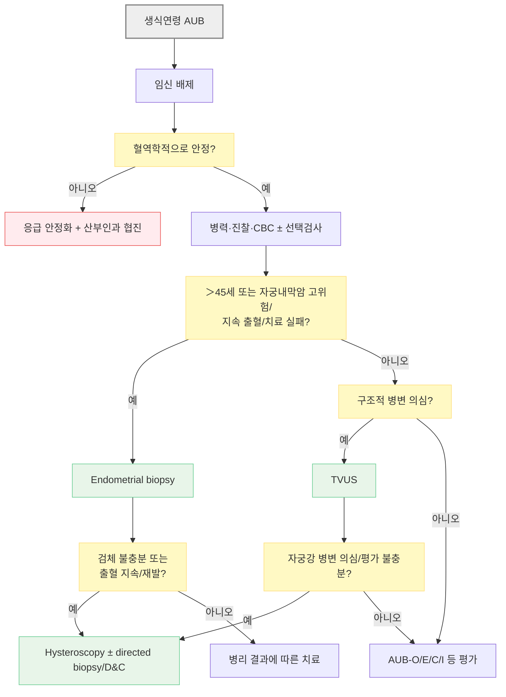
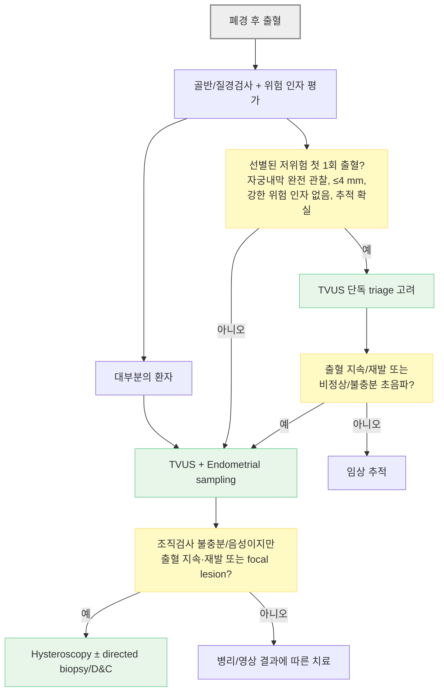

# 비정상 자궁 출혈 (Abnormal Uterine Bleeding, AUB)

## <mark style="color:green;">일반 사항</mark>

* 비정상 자궁 출혈(AUB) : 정상적인 월경의 빈도, 규칙성, 기간 또는 출혈량에서 벗어난 자궁 출혈을 포괄하는 임상적 용어. 본 챕터에서는 가임기 AUB와 폐경 후 출혈(postmenopausal bleeding, PMB)을 함께 다루되, **PALM-COEIN 분류는 비임신 생식연령 여성의 AUB에 적용하며 폐경 후 출혈은 별도의 평가 원칙을 적용**
* 이전의 dysfunctional uterine bleeding(DUB)을 대체한 용어
* 원인은 연령과 임상 상황에 따라 다르며, 구조적 원인과 비구조적 원인을 함께 평가
* 호발 시기 : 청소년, 폐경 이행기
* 가임 가능성이 있는 여성에서는 진단 및 치료 전 임신 여부를 반드시 확인
* heavy menstrual bleeding(HMB)에서는 철결핍/빈혈 및 출혈 장애 동반 가능성을 평가
* 생식연령 AUB에서 자궁내막 조직검사 : 일반적으로 **＞45세에서는 1차 평가로 시행**하며, ≤45세라도 unopposed estrogen 노출(비만, PCOS 등), 지속성 출혈 또는 약물 치료 실패가 있으면 시행 고려
* 폐경 후 출혈 : 폐경 후 12개월 이상의 무월경 이후 발생한 출혈로, 소량 또는 1회의 spotting이라도 자궁내막암 등 악성 질환을 배제하기 위한 평가가 필요

### <mark style="color:$primary;">월경 양상 관련 용어</mark>


FIGO에서는 menorrhagia, metrorrhagia, menometrorrhagia, dysfunctional uterine bleeding과 같은 과거 용어보다 **월경의 frequency, regularity, duration, flow volume 및 intermenstrual bleeding**을 직접 기술하는 것을 권장합니다. 임상 현장에서 익숙한 과거 용어는 참고용으로 병기할 수 있습니다.


* 월경 빈도(frequency, 생식연령) : 정상 간격 대략 24\~38일
  * 드문 월경(infrequent menstruation; 과거 oligomenorrhea) : 주기가 정상 범위보다 김
  * 잦은 월경(frequent menstruation; 과거 polymenorrhea) : 주기가 정상 범위보다 짧음
* 월경 기간(duration, 생식연령 성인) : 정상은 대체로 ≤8일(FIGO)
* heavy menstrual bleeding(HMB; 과거 menorrhagia) : 환자의 신체적·사회적·정서적·물질적 삶의 질을 방해할 정도의 과도한 월경 출혈
  * 과거 연구에서 ≥80 ㎖/cycle을 정량 기준으로 사용하였으나, 실제 임상에서는 출혈 부담·빈혈·삶의 질 영향을 중시
* 월경중간출혈(intermenstrual bleeding) : 규칙적인 월경 사이에 발생하는 출혈; 용종, 자궁경부 병변, 배란 관련 출혈, 호르몬제 등 다양한 원인이 가능
* 초경 후 초기 청소년에서는 성인보다 주기 변동이 클 수 있으며, 대체로 초경 후 첫 수년간 21\~45일 간격, ≤7일 지속이 정상 범위(ACOG Committee Opinion No. 651, 2015, reaffirmed 2025)

### <mark style="color:$primary;">Heavy menstrual bleeding을 시사하는 임상 단서</mark>

* 1\~2시간마다 패드/탐폰 교체가 필요하거나 밤중에 교체해야 함
* 한 번에 2개 이상의 생리용품을 겹쳐 사용해야 함
* 큰 응고혈이 반복적으로 배출됨
* 7\~8일 이상 출혈이 지속되거나 일상생활·수면·직장/학교 생활에 지장을 줌
* 철결핍 또는 빈혈이 동반됨

## <mark style="color:green;">원인</mark>

#### <mark style="color:$primary;">PALM-COEIN 병인 분류</mark>


FIGO의 PALM-COEIN 체계는 **비임신 생식연령 여성의 AUB**를 PALM(구조적 원인)-COEIN(비구조적 원인)으로 분류합니다. 임신 관련 출혈과 폐경 후 출혈은 이 분류와 별도의 평가 원칙을 적용합니다.


<table><thead><tr><th width="70">약어</th><th width="180">병인</th><th>비고</th></tr></thead><tbody><tr><td>P</td><td>Polyp(용종)</td><td>TVUS, sonohysterography, hysteroscopy로 평가</td></tr><tr><td>A</td><td>Adenomyosis(선근증)</td><td>TVUS 우선, 필요시 MRI</td></tr><tr><td>L</td><td>Leiomyoma(근종)</td><td>SM(점막하) / O(기타 부위)로 세분</td></tr><tr><td>M</td><td>Malignancy &amp; hyperplasia(악성종양·과형성)</td><td>연령·위험 인자·지속 출혈 여부에 따라 endometrial sampling</td></tr><tr><td>C</td><td>Coagulopathy(응고 장애)</td><td>HMB, 특히 초경부터 지속된 경우 VWD 등 고려</td></tr><tr><td>O</td><td>Ovulatory dysfunction(배란 장애)</td><td>PCOS, 갑상선 질환, 고프로락틴혈증, 체중 변화 등</td></tr><tr><td>E</td><td>Endometrial(자궁내막 원인)</td><td>다른 원인 배제 후 진단; 국소 지혈 기전 이상</td></tr><tr><td>I</td><td>Iatrogenic(의인성)</td><td>항응고제, 호르몬제, 자궁 내 장치 등</td></tr><tr><td>N</td><td>Not otherwise classified(미분류)</td><td>동정맥 기형, 제왕절개 반흔 결손 등</td></tr></tbody></table>

#### <mark style="color:$primary;">병인별 상세</mark>

* 배란 장애(AUB-O) : 무배란 또는 불규칙 배란으로 progesterone의 주기적 작용이 소실되어 불규칙하고 때로는 과도한 출혈 발생; PCOS, 청소년기 HPO axis 미성숙, 폐경 이행기, 갑상선 질환, 고프로락틴혈증, 급격한 체중 변화, 섭식 장애, 과도한 운동 등
* 임신 관련 출혈 : 자궁외임신, 유산, 임신성 융모성 질환 등 - PALM-COEIN 적용 전 우선 배제
* 구조적 원인(AUB-P/A/L/M) : endometrial polyp, adenomyosis, leiomyoma, endometrial hyperplasia/EIN, 악성 종양
* 응고 장애(AUB-C) : von Willebrand disease, 혈소판 이상, 기타 선천/후천성 출혈 장애
* 자궁내막 원인(AUB-E) : 배란은 정상이나 자궁내막의 국소 지혈 기전 이상으로 HMB 발생; 다른 원인을 배제한 후 진단
* 의인성(AUB-I) : 항응고제, 호르몬 피임제, menopausal hormone therapy, tamoxifen, 일부 psychotropic drug, 자궁 내 장치 등
  * 구리 자궁내장치(Copper-IUD)는 주로 HMB 양상의 출혈을 유발하는 반면, LNG-IUS 및 단일 progestin 제제는 삽입/시작 초기 수개월간 예측 불가한 불규칙 breakthrough bleeding을 유발하는 경향이 있어 출혈 양상으로 감별에 참고 가능
* 기타(AUB-N) : uterine arteriovenous malformation, cesarean scar defect 등
* 자궁경부염, 자궁경부 용종/암, 질·외음부 병변, STI/PID 등은 자궁 출혈과 혼동될 수 있으므로 출혈원을 확인

#### <mark style="color:$primary;">연령별 주요 원인</mark>

* 사춘기 이전 : 외상, 이물, 자극/감염, 요도 또는 직장 출혈; 성적 학대 가능성 포함하여 상황에 따라 평가
* 사춘기 : HPO axis 미성숙에 의한 배란 장애가 흔함; 임신, 감염, 출혈 장애도 고려
  * 초경부터 HMB가 지속되거나 첫 과다출혈 삽화가 심한 경우 von Willebrand disease 등 출혈 장애를 적극적으로 선별
* 가임기 : 임신 관련 출혈 우선 배제; 배란 장애, 호르몬 피임제, 응고 장애, 갑상선 질환, fibroid, adenomyosis, endometrial polyp, 감염, 자궁내막 과형성/악성 종양 등
* 폐경 이행기 : 배란 장애가 흔하지만 구조적 병변 및 자궁내막 과형성/암 위험도 증가하므로 연령과 위험 인자에 따라 자궁내막 평가
* 폐경 후 : 비뇨생식기 위축, endometrial/cervical polyp, menopausal hormone therapy, tamoxifen, 자궁내막 과형성/EIN, 자궁내막암·자궁경부암 등

#### <mark style="color:$primary;">자궁내막암의 주요 위험 인자</mark>

* 연령 증가 및 폐경 후 상태
* 비만, 당뇨병
* 만성 무배란/PCOS
* unopposed estrogen 노출
* tamoxifen 사용
* 이른 초경, 늦은 폐경
* nulliparity, 불임
* Lynch syndrome 또는 자궁내막암/대장암의 유의한 가족력

## <mark style="color:green;">임상 양상</mark>

* 배란 장애 출혈 : 주기와 양이 불규칙하고 예측하기 어려운 출혈
* 배란이 유지되는 경우 : 비교적 규칙적인 주기의 HMB가 흔하며 월경 전 증상이나 배란통이 동반될 수 있음
* 철결핍/빈혈 : 피로, 어지럼증, 운동능 저하, 창백 등

### <mark style="color:$danger;">🚩 Red Flags!</mark>

<mark style="color:$danger;">**즉각 조치 또는 응급 의뢰**</mark>

* 혈역학적 불안정(빈맥, 저혈압, 실신/전실신)을 동반한 심한 출혈 또는 중증 빈혈 → large-bore IV access, 수액/혈액제제 필요성 평가, 응급 산부인과 협진; 원인과 중증도에 따라 약물·자궁내 tamponade·hysteroscopy/D\&C 등 지혈 처치
* 가임기 여성의 심한 출혈 + 임신 가능성/복통 → 자궁외임신 등 임신 관련 응급질환 우선 배제

<mark style="color:$warning;">**당일 또는 조기 평가/의뢰**</mark>

* 폐경 후 출혈 - 1회 또는 소량 spotting이라도 조기 평가
* 지속 또는 반복되는 성교 후 출혈, 육안적 자궁경부 병변
* 자궁내막암 위험 인자가 있으면서 지속되는 AUB
* 약물 치료에도 지속되는 HMB 또는 철결핍빈혈 악화

<mark style="color:$info;">**외래 추적 / 추가 평가**</mark>

* 치료 후 출혈 일지를 기록하여 수주\~3개월 내 반응 평가
* 출혈이 지속/재발하거나 양상이 변하면 원인 재평가 및 필요시 산부인과 의뢰

## <mark style="color:green;">진단</mark>

#### <mark style="color:$primary;">병력 및 신체검사 - 감별 단서</mark>

* 출혈의 빈도·규칙성·기간·양, intermenstrual/postcoital bleeding 여부
* 임신 가능성, 피임법, HRT, tamoxifen, 항응고제 등 약물력
* 초경부터 HMB, 반복되는 코피/잇몸 출혈/멍, 산후·수술·치과 시술 시 과다출혈 및 가족력 → 출혈 장애 의심
* BMI, 갑상선종, 다모증/여드름, galactorrhea, 자반/반상출혈 평가
* 복부·골반 검사와 질경검사로 외음부·질·자궁경부 병변 및 실제 출혈원을 확인

#### <mark style="color:$primary;">실험실 검사</mark>

* 혈액 또는 소변 hCG : 가임 가능성이 있으면 우선 시행
* CBC : HMB에서는 기본적으로 시행; 기타 지속/중등도 이상의 AUB에서도 시행
* ferritin : 철결핍이 의심되거나 빈혈이 확인된 경우 고려(HMB 전 환자에서 routine 시행은 권장되지 않음)
* TSH : 갑상선 질환이 의심되거나 다른 원인이 뚜렷하지 않은 배란 장애가 있는 경우
* prolactin : 무월경/희발월경, galactorrhea 등 고프로락틴혈증 의심 시
* LFT/RFT : 간·신장 질환이 의심되는 경우 선택적으로 시행
* STI 검사 : 자궁경부염/PID 위험 또는 소견이 있는 경우 NAAT 등 시행
* 출혈 장애 의심 시 : CBC/platelet, PT/INR, aPTT 등 1차 검사
  * von Willebrand disease가 의심되면 PT/aPTT가 정상이어도 배제되지 않으므로 VWF antigen, VWF activity, factor VIII 등 특이 검사를 고려하거나 혈액내과 협진

#### <mark style="color:$primary;">영상 검사</mark>

* 질식 초음파(TVUS) : 생식연령 AUB의 구조적 병변 평가에서 1차 영상검사; 성경험이 없거나 TVUS가 곤란하면 복부 초음파 고려
* sonohysterography 또는 hysteroscopy : endometrial polyp, submucosal fibroid 등 자궁강 내 병변 평가에 유용
* MRI : adenomyosis, 큰/다발성 fibroid, 초음파로 해부학적 평가가 불충분한 경우 선택적으로 고려

#### <mark style="color:$primary;">자궁내막 및 자궁경부 평가 - 생식연령</mark>

* endometrial biopsy
  * ＞45세 AUB : 1차 평가로 시행
  * ≤45세 : unopposed estrogen 노출(비만, PCOS 등), 지속성 AUB, 약물 치료 실패 또는 기타 자궁내막암 고위험에서 시행 고려
* 자궁경부 평가 : 질경검사로 병변을 확인하고, 자궁경부암 선별검사가 미시행/기한 경과 시 해당 연령·검사력에 따라 시행
  * 육안적 이상 병변 또는 지속되는 성교 후 출혈은 screening과 별개로 진단적 평가/조직검사가 필요할 수 있음
* office endometrial biopsy에서 검체가 불충분하거나, 음성이지만 출혈이 지속/재발하고 focal lesion이 의심되면 hysteroscopy ± directed biopsy/D\&C 고려


**Guideline 차이** : ACOG는 연령·위험도에 따라 office endometrial sampling(예: Pipelle biopsy)을 1차로 권고하는 반면, NICE NG88은 HMB 평가에서 조직검사가 필요한 경우 diagnostic hysteroscopy 과정에서 함께 시행하도록 권고하며 routine blind biopsy는 권장하지 않습니다. 국내 진료에서는 환자 상황과 산부인과 진료 환경에 따라 접근을 결정합니다.


### <mark style="color:orange;">감별 진단</mark>

<table><thead><tr><th width="180">감별 질환</th><th width="220">AUB와의 차이점</th><th>핵심 감별 포인트</th></tr></thead><tbody><tr><td>임신 관련 출혈(자궁외임신, 유산 등)</td><td>무월경 후 출혈, 통증 동반 가능</td><td>β-hCG; 필요시 초음파</td></tr><tr><td>자궁경부 병변(경부염, 용종, CIN/암)</td><td>성교 후 출혈 또는 불규칙 출혈</td><td>질경검사, 자궁경부 검사, 필요시 조직검사</td></tr><tr><td>질·외음부 위축/외상·이물</td><td>출혈원이 자궁이 아님</td><td>외음부 및 질경검사</td></tr><tr><td>비뇨기계·직장 출혈</td><td>출혈원이 생식기가 아님</td><td>질경검사와 병력으로 출혈원 확인; 필요시 소변/직장 평가</td></tr></tbody></table>

***


```mermaid
flowchart TD
    A["생식연령 AUB"] --> B["임신 배제"]
    B --> C["혈역학적으로 안정?"]
    C -- "아니오" --> D["응급 안정화 + 산부인과 협진"]
    C -- "예" --> E["병력·진찰·CBC ± 선택검사"]
    E --> F["＞45세 또는 자궁내막암 고위험/<br>지속 출혈/치료 실패?"]
    F -- "예" --> G["Endometrial biopsy"]
    F -- "아니오" --> H["구조적 병변 의심?"]
    H -- "예" --> I["TVUS"]
    H -- "아니오" --> J["AUB-O/E/C/I 등 평가"]
    G --> K["검체 불충분 또는<br>출혈 지속/재발?"]
    K -- "예" --> L["Hysteroscopy ± directed biopsy/D&C"]
    K -- "아니오" --> M["병리 결과에 따른 치료"]
    I --> N["자궁강 병변 의심/평가 불충분?"]
    N -- "예" --> L
    N -- "아니오" --> J

    style A fill:#eeeeee,stroke:#888888,stroke-width:2px
    style C fill:#fff9c4,stroke:#ffe082
    style F fill:#fff9c4,stroke:#ffe082
    style H fill:#fff9c4,stroke:#ffe082
    style K fill:#fff9c4,stroke:#ffe082
    style N fill:#fff9c4,stroke:#ffe082
    style D fill:#FFEBEE,stroke:#EB5757,stroke-width:1px
    style G fill:#E8F5E9,stroke:#6FCF97,stroke-width:1px
    style I fill:#E8F5E9,stroke:#6FCF97,stroke-width:1px
    style L fill:#E8F5E9,stroke:#6FCF97,stroke-width:1px
```

<p align="center"><strong>생식연령 AUB 평가 알고리듬</strong></p>

<p align="center"><em><mark style="color:$info;">Ref. FIGO PALM-COEIN; ACOG Practice Bulletin No. 128; ACOG Committee Opinion No. 557</mark></em></p>

***

## <mark style="color:green;">폐경 후 출혈 (Postmenopausal Bleeding, PMB)</mark>

* 정의 : 자연 폐경 후 **12개월 이상의 무월경 이후 발생한 질 출혈, spotting 또는 혈성 분비물**
* 한 번의 소량 출혈이라도 평가가 필요하며, 자궁내막암을 포함한 생식기 악성 질환을 우선 배제
* 주요 원인 : 비뇨생식기 위축, endometrial/cervical polyp, menopausal hormone therapy 관련 출혈, tamoxifen, 자궁내막 과형성/EIN, 자궁내막암·자궁경부암 등


**ACOG 2026 update** : 폐경 후 출혈의 초기 평가에서 **대부분의 환자에게 TVUS와 endometrial tissue sampling을 함께 시행하는 것을 권고**합니다. 과거에는 첫 출혈 episode에서 TVUS 단독 triage가 널리 허용되었으나, 현재는 ultrasound-only 접근을 제한된 저위험 환자에 선택적으로 고려합니다.


#### <mark style="color:$primary;">초기 평가</mark>

* 병력 : 출혈 시점·양·재발 여부, HRT, tamoxifen, 항응고제, 비만/당뇨/가족력 등 자궁내막암 위험 인자
* 골반·질경검사 : 외음부/질 위축, 질 병변, 자궁경부 병변, polyp 및 실제 출혈원 확인
* **대부분 : TVUS + endometrial tissue sampling**
* **TVUS 단독 triage를 고려할 수 있는 제한적 상황**
  * 첫 1회의 PMB
  * 자궁내막이 전체적으로 명확히 보이고 두께 ≤4 ㎜
  * 자궁내막암의 강한 위험 인자가 없음
  * 출혈 재발 시 신속한 추적 평가가 확실함
* TVUS에서 endometrial thickness ≤4 ㎜는 자궁내막암 가능성이 매우 낮은 소견이지만, **지속 또는 재발 출혈이 있으면 두께와 관계없이 조직학적 평가 필요**
* 미국 자료에서는 일부 인종/고위험군에서 얇은 자궁내막을 이용한 TVUS 단독 triage의 민감도가 낮다는 보고가 있으며, 이러한 자료도 2026 ACOG 권고 강화의 배경이 됨
* 자궁내막이 충분히 보이지 않거나 ＞4 ㎜, 비균질/국소 병변, 조직검사 불충분, 또는 출혈 지속/재발 시 hysteroscopy ± directed biopsy/D\&C 고려
* **1차 office endometrial biopsy(Pipelle 등) 결과가 음성 또는 비특이적이더라도, 출혈이 지속·재발하거나 초음파상 비균질/국소 병변이 있으면 병리 소견을 맹신하지 말고 hysteroscopy ± directed biopsy를 추가로 고려해야 함** - 검체 채취 오류로 인한 위음성 가능성이 있음
* tamoxifen 사용 중 PMB에서는 자궁내막 두께만으로 triage하기 어렵기 때문에 조직학적 평가를 적극적으로 고려


```mermaid
flowchart TD
    A["폐경 후 출혈"] --> B["골반/질경검사 + 위험 인자 평가"]
    B --> C["대부분의 환자"]
    C --> D["TVUS + Endometrial sampling"]
    B --> E["선별된 저위험 첫 1회 출혈?<br>자궁내막 완전 관찰, ≤4 mm,<br>강한 위험 인자 없음, 추적 확실"]
    E -- "예" --> F["TVUS 단독 triage 고려"]
    E -- "아니오" --> D
    F --> G["출혈 지속/재발 또는<br>비정상/불충분 초음파?"]
    G -- "예" --> D
    G -- "아니오" --> H["임상 추적"]
    D --> I["조직검사 불충분/음성이지만<br>출혈 지속·재발 또는 focal lesion?"]
    I -- "예" --> J["Hysteroscopy ± directed biopsy/D&C"]
    I -- "아니오" --> K["병리/영상 결과에 따른 치료"]

    style A fill:#eeeeee,stroke:#888888,stroke-width:2px
    style E fill:#fff9c4,stroke:#ffe082
    style G fill:#fff9c4,stroke:#ffe082
    style I fill:#fff9c4,stroke:#ffe082
    style D fill:#E8F5E9,stroke:#6FCF97,stroke-width:1px
    style F fill:#E8F5E9,stroke:#6FCF97,stroke-width:1px
    style J fill:#E8F5E9,stroke:#6FCF97,stroke-width:1px
```

<p align="center"><strong>폐경 후 출혈 평가 알고리듬</strong></p>

<p align="center"><em><mark style="color:$info;">Ref. ACOG Clinical Practice Update 2026: Evaluation of Postmenopausal Bleeding</mark></em></p>

***

## <mark style="background-color:$warning;">Management</mark>

## <mark style="color:green;">비-약물 치료 및 예방</mark>

* HMB에서 철결핍/빈혈이 있으면 철분 치료(☞ [철결핍빈혈](../230_/193_-iron-deficiency-anemia.md))
* 체중 관리, 규칙적인 운동 등은 PCOS/배란 장애 및 자궁내막암 위험 감소에 도움
* 월경 일지를 이용하여 출혈의 빈도·기간·양과 치료 반응을 기록

## <mark style="color:green;">약물 치료</mark>

### <mark style="color:orange;">급성 AUB - 혈역학적 불안정 또는 중증 출혈</mark>


⚠️ 먼저 혈역학적 안정화와 응급 산부인과 협진이 우선입니다. 수술적 처치는 임상 안정성, 출혈 중증도, 원인, 약물 금기 및 반응, 향후 임신 계획에 따라 결정하며 **혈역학적 불안정 자체가 곧바로 D&C 단독 적응증을 의미하지는 않습니다.**


* large-bore IV access, 수액, CBC/type & screen, 필요시 수혈
* 안정화와 동시에 임신 관련 출혈 및 구조적 원인 평가
* estrogen 사용 금기가 없고 적응되는 경우 conjugated equine estrogen 25 ㎎ IV q4\~6h, 단기간(통상 ≤24시간) 사용을 고려
  * 출혈 조절 후 COC 또는 progestin 유지요법으로 전환(구체적 taper protocol은 기관별 차이가 크므로 기관 프로토콜에 따름)
* 약물 치료 실패, 약물 금기, 지속적 중증 출혈, 구조적 병변 등이 있으면 balloon tamponade, hysteroscopy/D\&C 또는 기타 수술적 지혈 고려

### <mark style="color:orange;">급성 AUB - 혈역학적으로 안정</mark>

* 고용량 복합 경구 피임제(COC) 또는 고용량 progestin을 1차 약물요법으로 고려
* COC 예 : monophasic COC(EE 30\~35 ㎍ 함유) 1T tid ×7d 후 1T qd로 감량/유지 - 기관별 taper protocol이 다양하며 estrogen 금기 및 VTE 위험 확인
* medroxyprogesterone acetate(MPA) : 20 ㎎ PO tid ×7d <mark style="color:blue;">\[프로베라]</mark>
  * estrogen 금기 또는 estrogen을 피하고 싶은 경우 유용
* tranexamic acid는 estrogen 금기이거나 보조적 지혈이 필요한 경우 고려할 수 있음; 급성기 특정 고용량 경구 regimen은 근거가 확립되어 있지 않으므로 제형·신기능 및 제품 허가사항에 따라 용량을 결정

### <mark style="color:orange;">만성/비응급 AUB - 배란 장애 및 HMB</mark>

* 원인, 임신 희망 여부, 피임 필요성, 동반 질환 및 환자 선호에 따라 선택
* 복합 경구 피임제 : 주기 조절 및 출혈량 감소
  * <mark style="color:blue;">\[야스민]</mark> : ethinyl estradiol(EE) 30 ㎍ + drospirenone 3 ㎎; 21일 복용 → 7일 휴약
  * <mark style="color:blue;">\[야즈]</mark> : EE 20 ㎍ + drospirenone 3 ㎎; 24일 활성정 → 4일 위약
* progestin 단독
  * medroxyprogesterone acetate(MPA) : 10 ㎎/d ×10\~14d/m <mark style="color:blue;">\[프로베라]</mark>
  * depot medroxyprogesterone acetate(DMPA) : 150 ㎎ IM q3m - 초기 불규칙 출혈 가능
  * norethindrone/norethisterone 계열은 제형·성분별 용량이 다르므로 norethindrone acetate와 0.35 ㎎ norethindrone POP를 혼용하지 않도록 주의
* levonorgestrel-releasing intrauterine system(LNG-IUS) : 자궁강 변형이 없는 HMB에서 가장 효과적인 장기 약물치료 중 하나이며 NICE 등에서 1차 치료로 우선 고려 <mark style="color:blue;">\[미레나]</mark>

#### <mark style="color:$primary;">Heavy menstrual bleeding 약물 선택</mark>

* LNG-IUS가 적합하고 환자가 동의하는 경우 우선 고려
* LNG-IUS를 원하지 않거나 적합하지 않은 경우
  * 비호르몬 : tranexamic acid, NSAID
  * 호르몬 : combined hormonal contraception, cyclical oral progestogen

#### <mark style="color:$primary;">Tranexamic acid</mark>

* antifibrinolytic 작용; 월경 시작과 함께 복용하여 HMB 기간에만 사용
* 대표 regimen : 1,000\~1,300 ㎎ tid, 월경 기간 중 최대 4\~5일
* 국내 제품의 허가 용법·용량과 신기능에 따른 감량 여부를 확인
* 과거 또는 활동성 혈전색전증, 고위험 thrombophilia에서는 주의/금기 여부 확인
* estrogen 함유 COC와의 병용은 권장되지 않음(미국 FDA 라벨은 금기로 명시); 불가피하게 병용해야 하는 경우 혈전 위험 인자를 신중히 재평가하고 국내 허가사항을 확인

#### <mark style="color:$primary;">NSAID</mark>

* prostaglandin 생성 억제 → 월경 출혈량과 dysmenorrhea 감소
* 월경 시작 또는 직전부터 출혈이 많은 기간 동안 사용
* ibuprofen : 400 ㎎ tid <mark style="color:blue;">\[부루펜]</mark>
* naproxen sodium : 275 ㎎ tid <mark style="color:blue;">\[아나프록스]</mark>
* mefenamic acid : 500 ㎎ 1회 이후 250 ㎎ q6h <mark style="color:blue;">\[폰탈]</mark>
* 소화성 궤양, 신기능 저하, NSAID 과민증 등 금기/주의 확인

#### <mark style="color:$primary;">자궁근종 관련 HMB</mark>

* LNG-IUS, tranexamic acid, NSAID, hormonal contraception 등을 근종의 크기·위치와 자궁강 변형 여부에 따라 선택
* GnRH agonist/antagonist는 수술 전 또는 중등도\~중증 증상에서 산부인과 영역에서 고려
* 경구 GnRH antagonist ± add-back therapy는 국가·제품별 허가, 최대 투여 기간, 골밀도 및 혈전 위험 관련 제한이 다르므로 **국내 허가사항을 확인 후 사용**
* danazol은 HMB 감소 효과가 있으나 androgenic adverse effect 때문에 현재 일반적인 1차 치료로는 거의 사용하지 않음

#### <mark style="color:$primary;">임신을 원하는 배란 장애/PCOS 환자</mark>

* AUB 조절과 별도로 불임 평가 및 배란유도 전략이 필요
* PCOS에 의한 무배란성 불임에서는 현재 국제 가이드라인에서 **letrozole을 1차 배란유도 약제로 권고**
* clomiphene ± metformin은 환자 특성과 가용성에 따라 대안으로 사용
* 배란유도 약제의 세부 증량 및 모니터링은 불임/PCOS 챕터에서 다루고, AUB 치료 목적으로 고용량 clomiphene을 사용하지 않음

## <mark style="color:green;">시술 및 기타 처치</mark>

* hysteroscopic polypectomy/submucosal myomectomy : focal intracavitary lesion이 원인인 경우
* endometrial ablation : 향후 임신을 원하지 않는 HMB 환자에서 선택적으로 고려; 악성/전암성 병변 배제 필요
* hysterectomy : 약물·보존적 치료 실패, 중증 구조적 질환, 악성/전암성 병변 등에서 definitive treatment
* 폐경 후 출혈은 원인에 따라 위축성 질염 치료, polypectomy, EIN/암 치료 등 원인 특이적으로 치료

### <mark style="color:orange;">모니터링</mark>

* 급성 출혈 조절 후 원인 평가와 유지치료 계획을 조기에 수립
* 월경 일지를 기록하고 대개 수주\~3개월 내 치료 반응, CBC/ferritin 필요성을 재평가
* 치료에도 출혈이 지속/재발하거나 악화되면 3개월을 기다리지 말고 조기 재평가
* 폐경 후 출혈은 초기 검사 결과가 양성이 아니더라도 출혈이 지속/재발하면 재평가

***

### <mark style="color:red;">질병코드</mark>

N92 과다, 빈발 및 불규칙 월경

N93 기타 이상 자궁 및 질 출혈

N95.0 폐경 후 출혈

***

## <mark style="color:purple;">처방례</mark>

> **처방례 1. 경증 HMB(비응급) - 비호르몬 치료**
>
> ```
> 부루펜 200 ㎎/T 2T tid  월경 시작부터 출혈이 많은 기간
> 도란사민 500 ㎎/T 2T tid  월경 기간 중 최대 4~5일
> ```
>
> _✽NSAID와 tranexamic acid는 HMB의 주요 비호르몬 치료. 신기능, 위장관 위험 및 혈전색전증 병력을 확인하고, 도란사민은 국내 허가 용법·용량을 확인하여 조정._

> **처방례 2. 배란 장애 AUB - 주기 조절 및 피임 목적**
>
> ```
> 야즈 28T 1T qd
> ```
>
> _✽복합 호르몬 피임제 금기(VTE 고위험, 편두통 with aura, 흡연 고령 여성 등)를 확인. 초기 1~3개월 breakthrough bleeding이 있을 수 있으며 대개 3개월 전후 치료 반응을 평가._

> **처방례 3. 급성, 비응급 AUB - progestin 고용량 요법**
>
> ```
> 프로베라 10 ㎎/T 2T tid  ×7일
> ```
>
> _✽Medroxyprogesterone acetate(MPA) 20 ㎎ tid ×7일. 출혈 조절 후 유지요법으로 전환하며, 지속되는 중증 출혈은 조기 산부인과 평가._

> **처방례 4. 배란 장애 AUB - progestin 주기요법**
>
> ```
> 프로베라 10 ㎎/T 1T qd  10~14일/월
> ```
>
> _✽무배란 환자에서 주기적 자궁내막 보호 및 소퇴성 출혈 유도 목적으로 사용. 장기 HMB 관리에는 LNG-IUS도 고려._

***

### <mark style="color:$success;">핵심 복약 지도</mark>

> **경구 피임제(COC) 복용 안내**
>
> * 매일 같은 시간에 복용합니다.
> * 시작 시점은 제제와 피임 목적에 따라 조정할 수 있으며, 월경 첫날 시작은 한 가지 방법입니다.
> * 복용 시작 후 첫 1\~3개월에는 breakthrough bleeding이 흔하며 대개 호전됩니다.
> * 흉통, 호흡곤란, 한쪽 다리의 갑작스러운 부종/통증, 신경학적 증상이 발생하면 즉시 진료를 받습니다.

> **Tranexamic acid(도란사민) 복용 안내**
>
> * 월경 시작과 동시에 복용하여 출혈이 많은 기간에만 사용합니다.
> * 처방된 1회 월경 주기당 최대 사용기간을 초과하지 않습니다.
> * 혈전색전증 병력 또는 고위험 인자가 있는 경우 반드시 의료진과 상의합니다.

> **NSAID 복용 안내**
>
> * 위장관 부작용을 줄이기 위해 음식과 함께 복용합니다.
> * 위궤양, 신장질환, NSAID 알레르기/천식 악화 병력이 있으면 의료진과 상의합니다.

> **언제 다시 병원을 방문해야 하나요?**
>
> * 어지럼증, 실신/전실신, 흉통, 호흡곤란 등 심한 빈혈·혈역학적 불안정 소견 - 즉시 진료
> * 1시간 이내에 패드가 흠뻑 젖는 심한 출혈이 반복되는 경우 - 조기 또는 응급 진료
> * 치료에도 출혈이 지속 또는 악화되거나 수주\~3개월 내 뚜렷한 호전이 없는 경우 - 재평가
> * 폐경 후 출혈이 처음 발생하거나 다시 발생한 경우 - 양이 적더라도 조기 평가

***

### <mark style="color:blue;">환자 안내서</mark>


**비정상 자궁 출혈은 원인을 확인하는 것이 가장 중요합니다.**

월경 주기·기간·양이 평소와 다르거나 월경 사이에 출혈이 생기는 상태를 말합니다. 가임기에는 임신 여부와 배란 장애, 자궁근종·용종, 약물 등을 평가하고, 폐경 후 출혈은 소량이라도 자궁내막암을 포함한 원인 평가가 필요합니다.


#### <mark style="color:$primary;">왜 비정상 자궁 출혈이 생기나요?</mark>

* 청소년기와 폐경 이행기에는 배란이 불규칙하여 출혈이 흔하게 발생할 수 있습니다.
* 자궁근종, 용종, 선근증 등 자궁의 구조적 문제가 원인이 될 수 있습니다.
* 갑상선 질환, PCOS, 출혈 장애 또는 항응고제·호르몬제 같은 약물이 원인이 되기도 합니다.
* 폐경 후에는 위축성 변화가 흔한 원인이지만, 자궁내막암 등 중요한 질환을 먼저 배제해야 합니다.

#### <mark style="color:$primary;">일상생활에서 어떻게 관리하나요?</mark>

* **출혈 일지를 기록하십시오.** 출혈 날짜, 기간, 패드 교체 간격, 큰 응고혈 여부를 기록하면 진단과 치료 반응 평가에 도움이 됩니다.
* **철분이 풍부한 음식을 섭취하십시오.** 출혈량이 많으면 철결핍빈혈이 동반될 수 있습니다.
* **체중 관리와 규칙적인 운동을 유지하십시오.** 특히 PCOS나 비만이 있는 경우 도움이 됩니다.

#### <mark style="color:$primary;">약은 어떻게 써야 하나요?</mark>

* 호르몬제는 임의로 중단하거나 용량을 변경하지 않습니다.
* tranexamic acid와 NSAID는 주로 월경 출혈이 있는 기간에 맞추어 복용합니다.
* 약을 복용해도 출혈이 계속되거나 더 심해지면 예정된 추적 시점까지 기다리지 말고 다시 진료를 받습니다.

#### <mark style="color:$primary;">이럴 때는 즉시 또는 빨리 병원을 방문하세요</mark>

* 어지럽거나 쓰러질 것 같고 심한 무기력감, 호흡곤란, 흉통이 동반될 때
* 1시간 이내에 패드가 흠뻑 젖을 정도의 출혈이 반복될 때
* 임신 가능성이 있으면서 출혈과 심한 복통이 동반될 때
* 성교 후 출혈이 반복될 때
* **폐경 이후 한 번이라도 다시 출혈이 생겼을 때**

