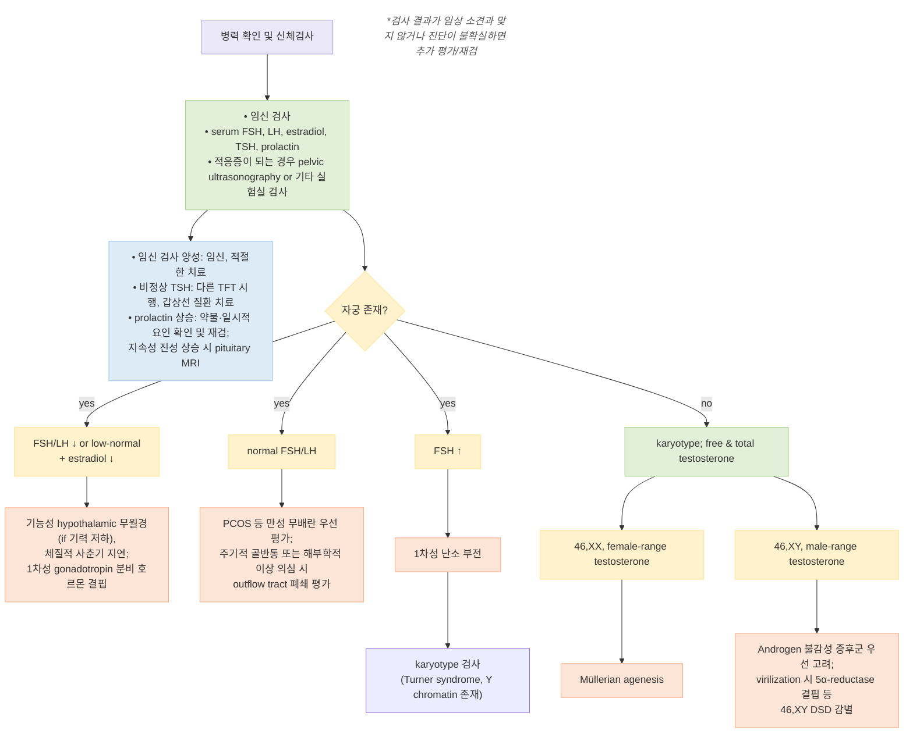
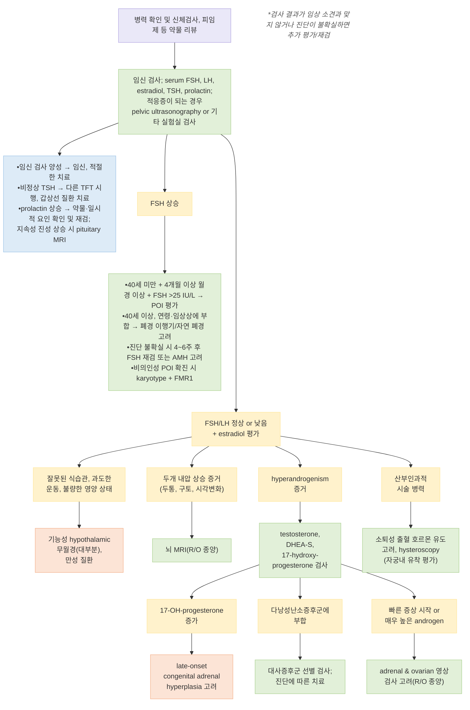

# 무월경 Amenorrhea

## <mark style="color:green;">일반 사항</mark>

* 무월경 : 정상적으로 있어야 할 월경이 없는 상태
* 분류 : 1차성 무월경, 2차성 무월경
* 정의 (ASRM Committee Opinion, 2024)
  * 1차성 무월경 : 15세까지 초경이 없거나(정상 2차 성징 발달 시), 10세 이전에 유방 발달이 시작된 경우 유방 발달 후 5년 이내 초경이 없거나, 13세까지 유방 발달이 전무한 경우
  * 2차성 무월경 : 이전에 규칙적이던 월경이 3개월 이상 없거나, 불규칙 월경력이 있던 경우 6개월 이상 없음
* 빈도 : 1차성 ＜1%; 2차성 3\~7%(연간 유병률)
* 흔한 원인 6가지(ASRM, 2024) — 대부분의 무월경이 이 범주에 속함
  * 다낭성난소증후군(PCOS), 고프로락틴혈증, 갑상선 기능 이상, 저성선자극호르몬 성선기능저하증(시상하부·뇌하수체 원인), 고성선자극호르몬 성선기능저하증(난소 부전), 해부학적 이상(유출로 폐쇄)
* 합병증
  * 불임, 골감소증/골다공증 및 골절 위험(저에스트로겐 상태 지속 시)
  * 만성 무배란(예: PCOS)에서 unopposed estrogen에 의한 자궁내막증식증·자궁내막암 위험

***

## <mark style="color:green;">원인 및 위험 인자</mark>

### <mark style="color:orange;">1차성 무월경</mark>

* 원인 : 타고난 사춘기 지연(체질적 사춘기 지연), 염색체 이상(예: gonadal dysgenesis, Turner syndrome), hypogonadotropic hypogonadism(Kallmann 증후군 등), 생식기 발달 장애(Müllerian agenesis), transverse vaginal septum/imperforate hymen, androgen 불감성 증후군, pituitary Dz

### <mark style="color:orange;">2차성 무월경</mark>

* physiologic : 임신/수유, 폐경
* Hypothalamic Dz(기능성 시상하부 무월경, FHA) : 급격한 체중 변화, 저체중 또는 에너지 가용성 부족(다이어트, IBD, 영양 흡수 장애, 소모성 질환 등), 심한 운동(여성 운동선수 세 요소/RED-S), 우울, 스트레스
* 내분비 질환 : 갑상선저하증, hyperprolactinemia, 비조절 당뇨병, 쿠싱증후군
* 난소 질환 : 다낭성난소증후군, 조기 난소부전(POI), 난소 종양
* Outflow tract 이상 : Asherman 증후군(자궁강내 유착 — 소파술·자궁내막염 후), 자궁경부 협착
* 약물 : 항우울제, 항정신병제, 화학요법, 피임제(특히 depot medroxyprogesterone)


**다낭성난소증후군(PCOS) 진단 기준 (Rotterdam/국제 근거중심 가이드라인, 2023 개정)**

다음 3가지 중 2가지 이상 : ① 배란장애(희발·무배란), ② 임상적/생화학적 hyperandrogenism, ③ 성인에서 초음파상 다낭성 난소 형태(PCOM) 또는 이를 대체하는 serum AMH(검사법·인구집단별 cutoff 적용) — 다른 원인(갑상선 질환, 고프로락틴혈증, 선천성 부신과형성 등) 배제 후 진단

✽**청소년에서는 초음파·AMH 모두 진단에 사용하지 않음.** 희발·무배란과 hyperandrogenism이 모두 있으면 초음파/AMH 자체가 진단에 불필요.


***

### <mark style="color:$danger;">🚩 Red Flags!</mark>

<mark style="color:$danger;">**즉각 조치 또는 의뢰**</mark>

* 임신 반응 양성 + 복통·실신·저혈압 동반 → 자궁외임신 파열 의심 → 즉시 응급실
* 고프로락틴혈증 + 심한 두통·시야 결손(양측 반맹 등) → 뇌하수체 거대선종/pituitary apoplexy 의심 → 즉시 영상 검사 및 응급 의뢰
* 심한 에너지 부족 상태(섭식장애·과도한 운동)에서 서맥, 저혈압, 전해질 이상 동반 → 입원 치료 필요[Endocrine Society 2017]

<mark style="color:$warning;">**당일 또는 조기 의뢰**</mark>

* 지속성·진성 고프로락틴혈증 확인 시 → 뇌하수체 MRI로 조기 평가(단계별 평가는 진단 섹션 참조)
* 급속 진행 남성화 징후(다모증 급속 진행, 음성 저하, 음핵 비대) 또는 매우 높은 androgen 수치 → androgen 분비 종양 의심 → 영상 검사(부신·난소)
* 13세까지 유방 발달 등 2차 성징이 전무하거나 신장 하위 ≤3% → 소아내분비 의뢰
* 심한 저체중(매우 낮은 BMI), 섭식장애 징후 동반 → 정신건강의학과 협진

<mark style="color:$info;">**외래 추적 / 추가 평가 계획**</mark> <mark style="color:$info;">- 즉각 위험 낮으나 호전 없으면 의뢰</mark>

* 기능성 시상하부 무월경 의심 시 → 에너지 균형·영양·운동·심리 요인을 교정하며 경과 관찰; 무월경 6개월 이상 지속 시 골밀도 검사(DXA) 계획[Endocrine Society 2017]
* 초기 검사에서 원인 불명 2차성 무월경 → 임상 소견과 검사 결과를 함께 재평가; POI가 의심되나 진단이 불확실한 경우 FSH를 4\~6주 후 재검

***

## <mark style="color:green;">진단</mark>

* 임신 배제가 모든 평가의 첫 단계
* BMI, 식이 습관, 육체적/정신적 스트레스, 병력(약물력 포함) 확인

### <mark style="color:orange;">검사</mark>

* 대상 : ① 13세까지 유방 발달 등 2차 성징이 없거나 신장 하위 ≤3%, ② 15세까지 무월경, ③ 3개월 이상(또는 불규칙 월경력에서 6개월 이상) 월경 없는 모든 여성
* 1차 실험실 검사 : s/u-hCG, FSH, LH, estradiol(E2), prolactin, TSH
  * 선택 : 영양결핍·섭식장애·만성 전신질환 의심 시 CBC, 전해질, glucose, 신·간기능, ESR/CRP
  * hyperandrogenism 의심 시 testosterone(total/free), DHEA-S, 17α-hydroxyprogesterone(nonclassic 선천성 부신과형성 선별)
  * 비의인성 POI로 확진된 경우 karyotype 및 FMR1 premutation 검사(국제 POI 가이드라인, 2024)
* 영상 검사 : 골반 초음파를 우선 고려; 적응증에 따라 뇌 MRI, pelvic MRI
* 추가 검사(적응증에 따라) : saline infusion sonography 또는 hysteroscopy(Asherman 증후군 의심 시; hysteroscopy는 자궁강 평가의 gold standard), pelvic MRI(선천성 해부학적 이상 상세 평가)


**참고 (ASRM Committee Opinion, 2024)**

* AMH는 무월경 진단에 필수 검사가 아니며, PCOS에서는 상승, POI에서는 미검출 소견을 보일 수 있으나 해석에 주의가 필요함
* 프로게스틴 소퇴 검사(progestin withdrawal test)는 과거 널리 쓰였으나 민감도·특이도가 낮음 — 무반응이 저에스트로겐 상태(폐경·FHA)와 유출로 폐쇄를 구분하지 못하므로 단독 판단 근거로 사용하지 않음


### <mark style="color:orange;">1차 검사 소견별 시사 진단</mark>

<table><thead><tr><th width="220">1차 검사 소견</th><th width="220">시사 진단</th><th>다음 단계</th></tr></thead><tbody><tr><td>1차성 무월경 + 2차 성징 미발달/저신장 + FSH 상승</td><td>선천성 성선 저하(Gonadal dysgenesis, Turner syndrome 등)</td><td>karyotype 검사(Turner syndrome, Y chromatin 확인)</td></tr><tr><td>FSH·LH 낮음/low-normal + E2 낮음, 자궁 있음</td><td>FHA/central hypogonadism, 체질적 사춘기 지연</td><td>에너지 균형·스트레스·체중 변화, 중추성 원인 평가</td></tr><tr><td>FSH·LH 정상, 자궁 있음, hyperandrogenism 소견</td><td>PCOS 우선 고려; 기타 androgen excess 원인 감별</td><td>testosterone, DHEA-S, 17-OHP; 필요 시 골반 초음파</td></tr><tr><td>FSH·LH 정상, 자궁 있음, 산부인과 시술력</td><td>Asherman 증후군(자궁강내 유착)</td><td>hysteroscopy</td></tr><tr><td>40세 미만 + 4개월 이상 무월경/희발월경 + FSH &gt;25 IU/L</td><td>조기 난소부전(POI)</td><td>진단 불확실 시 4~6주 후 FSH 재검 또는 AMH 고려; 비의인성 POI 확진 시 karyotype, FMR1</td></tr><tr><td>TSH 이상</td><td>갑상선 질환</td><td>TFT 추가, 갑상선 질환 치료</td></tr><tr><td>Prolactin 상승</td><td>고프로락틴혈증</td><td>경도 상승은 일시적 요인·약물 확인 후 재검; 지속 시 macroprolactin/TSH 평가, 진성·지속성 상승이면 pituitary MRI</td></tr><tr><td>자궁 없음, 46,XX, 여성 범위 testosterone</td><td>Müllerian agenesis</td><td>영상 검사, 산부인과 의뢰</td></tr><tr><td>자궁 없음, 46,XY, 남성 범위 testosterone</td><td>Androgen 불감성 증후군 우선 고려</td><td>유전 상담; 사춘기 virilization이 있으면 5α-reductase 결핍 등 46,XY DSD 감별</td></tr></tbody></table>

***



<p align="center"><strong>1차성 무월경의 진단</strong></p>

***



<p align="center"><strong>2차성 무월경의 진단</strong></p>

***

## <mark style="background-color:$warning;">Management</mark>

### <mark style="color:orange;">치료 방침</mark>

* 원인 질환 치료(예: 갑상선 질환, hyperprolactinemia)
* 영양, 적정 체중 관리 : 비만인 경우 감량, 체중이 너무 적은 경우 증량
* 심한 운동/활동을 하는 경우 에너지 가용성이 회복되도록 운동량을 개별적으로 조정하고 칼로리 섭취를 늘림
* 스트레스 관리, 필요시 인지행동치료(CBT) 등 심리 지지[Endocrine Society 2017]
* 호르몬제 치료(예: hypogonadism, ovarian insufficiency, 기능성 시상하부 무월경)
* nonclassic CAH : 무증상이면 치료가 불필요할 수 있으며, 임상적으로 의미 있는 hyperandrogenism 또는 임신 희망 환자에서 glucocorticoid를 선택적으로 고려
* 수술적 치료(예: Mullerian agenesis, malignancy, Asherman 증후군)
* 만성 무배란(PCOS 등)에서 unopposed estrogen 지속 시 자궁내막 보호 목적의 주기적 progestin 또는 복합경구피임제 고려
* 합병증으로서의 골다공증 평가 및 관리 (☞ p.804)

***

## <mark style="color:green;">비-약물 치료 및 예방</mark>

* 규칙적 식사, 균형 잡힌 영양 섭취; 저체중인 경우 점진적 체중 증량 목표 설정
* 과도한 유산소·고강도 운동을 하는 경우 훈련량 조정 및 스포츠의학 상담
* 여성 운동선수 세 요소(Female Athlete Triad)/RED-S 인지 — 에너지 가용성 저하, 무월경, 골밀도 저하가 함께 나타나는지 확인하고 영양사·스포츠의학·정신건강의학과 다학제 접근
* 수면 위생 및 스트레스 관리; 필요시 정신건강의학과 의뢰
* 무월경 6개월 이상 지속 시 골밀도 검사(DXA) 시행 고려(☞ p.804)

***

## <mark style="color:green;">약물 치료</mark>


본 챕터의 약제 용법·용량은 일반적 기준이며, 실제 처방 시 최신 제품 허가사항 및 HIRA 급여 기준을 확인할 것


### <mark style="color:orange;">원인 질환에 대한 치료</mark>

* 갑상선기능저하증 : levothyroxine <mark style="color:blue;">\[씬지로이드]</mark> — TSH 재검하며 용량 조정
* 고프로락틴혈증 : prolactin 경도 상승은 약물·스트레스 등 일시적 요인 확인 후 재검하고, 지속 시 macroprolactin/TSH 평가; 진성·지속성 고프로락틴혈증 확인 시 pituitary MRI 후 원인에 따라 dopamine agonist — cabergoline <mark style="color:blue;">\[도스티넥스]</mark>(주 1\~2회) 또는 bromocriptine 고려

### <mark style="color:orange;">기능성 시상하부 무월경(FHA) — 호르몬 치료</mark>

* 1차 치료는 에너지 균형 회복(체중 증량, 운동량 조정, 영양 개선)과 심리적 지지이며, 치료 반응을 정기적으로 재평가[Endocrine Society 2017 Strong recommendation]
* 월경 재개나 골밀도 개선만을 목적으로 한 복합 경구 피임제 단독 처방은 권장하지 않음 — 경구 estrogen은 간 초회통과 효과로 IGF-1을 억제하여 골밀도 개선 효과가 제한적임[Endocrine Society 2017]
* 영양·심리·운동 조정을 충분히 시행했음에도 월경이 회복되지 않는 경우, 특히 6\~12개월 이상 무월경이 지속되고 저골밀도/골 취약성이 있는 경우 경피 estradiol + 주기적 경구 progestin(경구 피임제가 아닌 형태) 단기 사용을 고려[Endocrine Society 2017 Conditional recommendation]

### <mark style="color:orange;">무배란성 무월경/불규칙 주기 — 호르몬제</mark> (☞ [피임](131_-contraception.md))

* medroxyprogesterone acetate(MPA) <mark style="color:blue;">\[프로베라]</mark> : 10 ㎎/d ×10d
  * 마지막 투여 후 소퇴성 출혈이 발생하면 자궁내막이 충분한 estrogen에 노출되어 있었고 유출로가 개방되어 있음을 시사하며, 무배란성 무월경(예: PCOS)에 부합
  * 출혈이 없으면 저에스트로겐 상태(FHA·POI) 또는 자궁내막 손상·유출로 이상을 고려
* 만성 무배란/PCOS의 주기 조절·자궁내막 보호 : 복합 경구 피임제(예: ethinyl estradiol/drospirenone <mark style="color:blue;">\[야스민]</mark>)를 통상 용법으로 사용
* 저에스트로겐 상태와 유출로/자궁내막 이상의 감별이 필요한 경우 : estrogen-progestin challenge test를 보조적으로 고려
* 호르몬제 금기 및 부작용(혈전증 위험 등)에 대하여 유의
* 호르몬 치료의 기간·중단 여부는 원인에 따라 결정
  * FHA : 생활습관 교정을 지속하며 필요 시 단기 경피 E2 + 주기적 progestin 사용 후 정기 재평가
  * POI : 금기가 없는 한 자연 폐경 연령(평균 약 51세)까지 호르몬 치료 지속 권고

***

## <mark style="color:green;">시술 및 기타 처치</mark>

* Asherman 증후군(자궁강내 유착) : hysteroscopic adhesiolysis
* Müllerian agenesis : 질 확장술 또는 수술적 질 조성술 — 산부인과 전문 클리닉 의뢰
* 해부학적 폐쇄(imperforate hymen, transverse vaginal septum) : 수술적 교정
* 뇌하수체 종양, 난소·부신 종양 의심 시 → 해당 전문과 의뢰

***

### <mark style="color:red;">질병코드</mark>

N91.0 원발성 무월경

N91.1 이차성 무월경

N91.2 무월경, 상세불명

***

## <mark style="color:purple;">처방례</mark>

> **처방례 1. 무배란성 2차성 무월경 — 프로게스틴 소퇴 요법**
>
> ```
> 프로베라정 5 ㎎/T  2T  qd  ×10일
> ```
>
> _✽본 요법의 주된 목적은 만성 무배란 상태에서의 자궁내막 보호 및 주기적 출혈 유도임. 참고로 소퇴성 출혈 유무는 무배란 여부를 시사할 수 있으나 진단적 가치는 제한적이며(ASRM, 2024), 원인 감별은 FSH/estradiol 및 골반 초음파를 우선함._

> **처방례 2. 불규칙 주기 조절 및 자궁내막 보호(만성 무배란, PCOS 등)**
>
> ```
> 야스민정 1T  qd  ×21일(휴약 7일), 매달 반복
> ```
>
> _✽자궁내막증식증 예방 목적; 혈전증 위험 인자(흡연, 비만, 혈전증 가족력 등) 사전 확인_

> **처방례 3. 기능성 시상하부 무월경, 충분한 생활습관 교정에도 월경이 회복되지 않는 경우**
>
> ```
> 에스트레바겔  1회 펌프(estradiol 0.5 ㎎)  1일 1회 도포(개별 용량 조절)
> 프로베라정 5 ㎎/T  2T  qd  ×10일/매월(주기적 병용)
> ```
>
> _✽에스트레바겔 1회 펌프 = estradiol 0.5 ㎎; 국내 허가 적응증은 폐경 관련 estrogen 결핍이며, FHA에서의 사용은 허가 외 사용(off-label)임. 경피 제형은 간 초회통과 효과를 피하며, FHA에서 복합 경구피임제(ethinyl estradiol)보다 골밀도 개선에 유리한 근거가 있음(Endocrine Society 2017); 자궁이 있는 경우 자궁내막 보호를 위해 주기적 progestin 병용_

> **처방례 4. 갑상선기능저하증 동반**
>
> ```
> 씬지로이드정 25~50 ㎍/T  1T  qd  공복
> ```
>
> _✽TSH 재검(4\~6주 간격)하며 용량 조정; 정상화 후 월경 재개 여부 재평가_

***

### <mark style="color:$success;">핵심 복약 지도</mark>

> **프로게스틴 소퇴 요법, 왜 필요한가요?**
>
> * 본 요법은 만성 무배란 상태에서 자궁내막을 보호하고 주기적 출혈을 유도하는 것이 주 목적입니다. 출혈 유무로 원인을 확진하지는 않습니다.
> * 참고로 MPA 복용 후 소퇴성 출혈이 발생하면 자궁내막이 충분한 estrogen에 노출되어 있었고 유출로가 개방되어 있음을 시사할 수 있습니다.
> * 출혈이 없으면 저에스트로겐 상태 또는 자궁내막 손상·유출로 이상 가능성이 있으므로 재평가가 필요합니다.

> **경피 에스트로겐 + 주기적 프로게스틴 요법**
>
> * 경피 17β-estradiol은 복합 경구피임제(ethinyl estradiol 함유)보다 FHA에서 골 건강 측면에 유리한 근거가 있습니다(간 초회통과 효과를 피함).
> * 자궁이 있는 경우 자궁내막 보호를 위해 주기적 progestin을 병용하며, 본 처방례에서는 MPA를 매월 10일 투여합니다 — 임의로 생략하면 자궁내막증식증 위험이 증가합니다.
> * 월경 재개나 골밀도 개선을 위한 목적**만으로** 복합 경구 피임제를 처방하지 않습니다 — 효과가 제한적입니다.

> **언제 다시 병원을 방문해야 하나요?**
>
> * 프로게스틴 소퇴 요법 후에도 출혈이 없는 경우
> * 심한 두통, 시야 이상, 새로 생긴 유즙 분비가 동반되는 경우 — 즉시 내원
> * 호르몬제 복용 중 하지 부종, 흉통, 호흡곤란(혈전증 의심 증상)이 있는 경우 — 즉시 내원
> * 무월경이 6개월 이상 지속되어 골밀도 검사가 필요한 경우

***

### <mark style="color:blue;">환자 안내서</mark>


**무월경, 우리 몸이 보내는 신호일 수 있습니다**

월경이 오랫동안 없다면 단순히 불편한 증상이 아니라 호르몬 균형이나 다른 건강 문제의 신호일 수 있습니다. 원인을 확인하고 적절히 관리하면 대부분 호전됩니다.


#### <mark style="color:$primary;">왜 월경이 없어지나요?</mark>

* 임신, 과도한 체중 감량이나 운동, 스트레스, 갑상선 문제, 다낭성난소증후군 등 다양한 원인이 있습니다.
* 원인에 따라 치료 방법이 다르므로 정확한 검사가 필요합니다.

#### <mark style="color:$primary;">일상생활에서 어떻게 관리하나요?</mark>

* **적정 체중을 유지하십시오.** 너무 마르거나 급격히 체중이 늘면 호르몬 균형이 깨질 수 있습니다.
* **운동량을 조절하십시오.** 과도한 운동은 오히려 월경을 멈추게 할 수 있습니다.
* **스트레스를 관리하십시오.** 심리적 부담이 큰 경우 상담이나 인지행동치료가 도움이 됩니다.

#### <mark style="color:$primary;">약은 어떻게 써야 하나요?</mark>

* 처방받은 호르몬제는 임의로 중단하거나 용량을 바꾸지 마십시오.
* 피임이 아니라 뼈 건강이나 월경 재개를 위해 약을 쓰는 경우, 의사가 권장한 기간과 방법(경구/경피)을 지켜야 효과가 있습니다.

#### <mark style="color:$primary;">이럴 때는 즉시 병원을 방문하세요</mark>

* 심한 두통이나 시야가 흐려지는 증상이 새로 생긴 경우
* 젖이 아닌데도 유즙이 나오는 경우
* 임신 가능성이 있는데 월경이 없는 경우 — 임신 여부를 반드시 확인하십시오
* **다리가 붓거나 갑자기 숨이 차는 경우 — 혈전증 신호일 수 있으니 즉시 내원하세요.**
