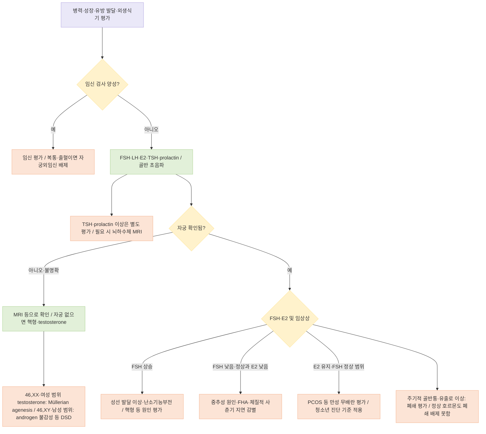
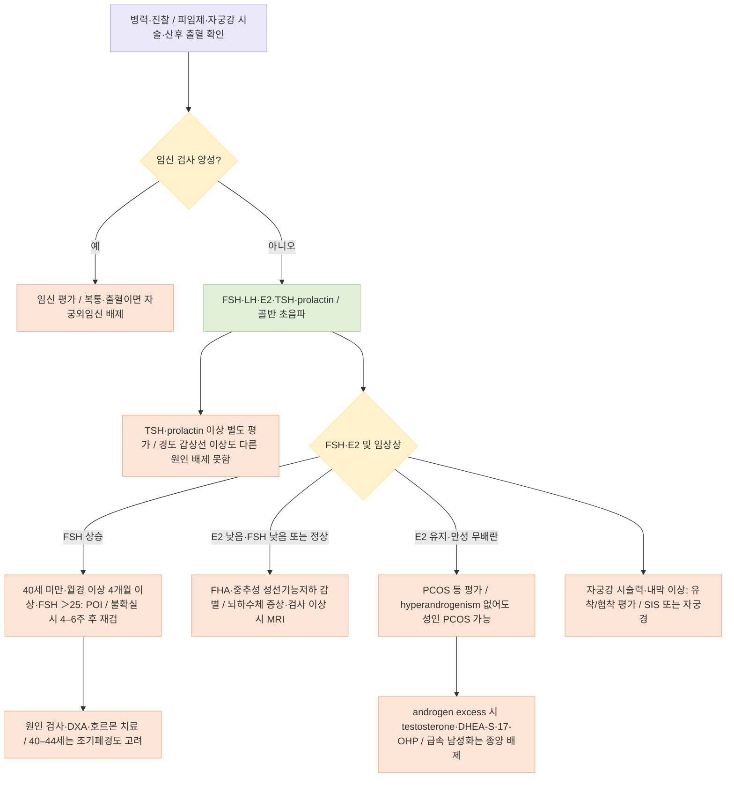

# 무월경 Amenorrhea

## <mark style="color:green;">일반 사항</mark>

* 무월경 : 정상적으로 있어야 할 월경이 없는 상태
* 분류 : 1차성 무월경, 2차성 무월경
* 정의 및 평가 시작 기준 (ASRM Committee Opinion, 2024)
  * 1차성 무월경 : 초경이 아직 없는 상태로, 정상 2차 성징이 있으나 15세까지 초경이 없으면 평가함. ASRM은 10세 이전에 유방 발달이 시작된 경우 유방 발달 후 5년 이내 초경이 없을 때도 평가를 권고함
  * 사춘기 지연 : 13세까지 유방 발달이 없으면 초경 연령을 기다리지 않고 평가함
  * 청소년 조기 평가 : 유방 발달 후 3년을 초과해도 초경이 없거나, 초경 1년 이후 한 주기라도 90일을 초과하면 평가함[국제 PCOS 가이드라인 2023]. 주기적 골반통·성장 이상·남성화 등 우려 소견이 있으면 더 일찍 평가함
  * 2차성 무월경 : 이전에 규칙적이던 월경이 3개월 이상 없거나, 불규칙 월경력이 있던 경우 6개월 이상 없음
* 빈도 : 임신·수유·폐경을 제외한 무월경의 유병률은 약 3\~4%로 보고됨[ASRM 2024]
* 흔한 원인 6가지(ASRM, 2024) - 대부분의 무월경이 이 범주에 속함
  * 다낭성난소증후군(PCOS), 고프로락틴혈증, 갑상선 기능 이상, 저성선자극호르몬 성선기능저하증(시상하부·뇌하수체 원인), 고성선자극호르몬 성선기능저하증(난소 부전), 해부학적 이상(유출로 폐쇄)
* 합병증
  * 불임, 골감소증/골다공증 및 골절 위험(저에스트로겐 상태 지속 시)
  * 만성 무배란(예: PCOS)에서 unopposed estrogen에 의한 자궁내막증식증·자궁내막암 위험

***

## <mark style="color:green;">원인 및 위험 인자</mark>

### <mark style="color:orange;">1차성 무월경</mark>

* 원인 : 타고난 사춘기 지연(체질적 사춘기 지연), 염색체 이상(예: gonadal dysgenesis, Turner syndrome), hypogonadotropic hypogonadism(Kallmann 증후군 등), 생식기 발달 장애(Müllerian agenesis), transverse vaginal septum/imperforate hymen, androgen 불감성 증후군, pituitary Dz

### <mark style="color:orange;">2차성 무월경</mark>

* physiologic : 임신/수유, 폐경
* 기능성 시상하부 무월경(functional hypothalamic amenorrhea, FHA) : 급격한 체중 변화, 저체중 또는 에너지 가용성 부족(다이어트, IBD, 영양 흡수 장애, 소모성 질환 등), 심한 운동(여성 운동선수 세 요소/RED-S), 우울, 스트레스
* 내분비 질환 : 갑상선 기능 이상(저하증·항진증), hyperprolactinemia, 비조절 당뇨병, 쿠싱증후군
* 중추성 원인 : 뇌하수체·시상하부 종양, 산후 대량출혈 후 Sheehan 증후군(수유 실패·피로·저혈압 동반 가능)
* 난소 질환 : 다낭성난소증후군, 조기 난소기능부전(premature ovarian insufficiency, POI), 난소 종양
* Outflow tract 이상 : Asherman 증후군(자궁강내 유착 - 소파술·자궁내막염 후), 자궁경부 협착
* 약물 : 항우울제, 항정신병제, 화학요법, 피임제(특히 depot medroxyprogesterone)


**다낭성난소증후군(PCOS) 진단 기준 (Rotterdam/국제 근거중심 가이드라인, 2023 개정)**

✽ 국제 명칭 업데이트 : 2026년 5월 12일 polyendocrine metabolic ovarian syndrome(PMOS)으로 명칭 변경이 발표됨[Monash University·ASRM]. 이 챕터는 국내에서 익숙한 PCOS 표기를 유지하고 PMOS를 병기하며, 진단·치료는 2023 근거중심 지침을 기준으로 기술함

다음 3가지 중 2가지 이상 : ① 배란장애(희발·무배란), ② 임상적/생화학적 hyperandrogenism, ③ 성인에서 초음파상 다낭성 난소 형태(PCOM) 또는 이를 대체하는 serum AMH(검사법·인구집단별 cutoff 적용) - 다른 원인(갑상선 질환, 고프로락틴혈증, 선천성 부신과형성 등) 배제 후 진단

✽**청소년은 초경 후 경과에 따른 월경 불규칙성과 임상적/생화학적 hyperandrogenism이 모두 있어야 하며, 초음파·AMH는 진단에 사용하지 않음.** 성인에서도 배란장애와 hyperandrogenism이 모두 있으면 초음파·AMH는 진단에 불필요함. AMH 단독으로 진단하거나 초음파와 AMH를 중복 적용해 과진단하지 않음. 청소년의 해부학적 이상·종양 평가를 위한 초음파까지 금지하는 의미는 아님


***

### <mark style="color:$danger;">🚩 Red Flags!</mark>

<mark style="color:$danger;">**즉각 조치 또는 의뢰**</mark>

* 임신 가능성이 있는 무월경에서 심한 복통, 실신, 저혈압 또는 복막 자극 징후 → 자궁외임신 파열 등 의심 → 즉시 응급실; 소변 임신검사 음성이라도 응급 평가를 지연하지 않음
* 갑작스러운 극심한 두통, 급성 시력·시야 저하, 복시·안구운동 마비 또는 의식 변화 → pituitary apoplexy 등 의심 → 즉시 응급 의뢰; prolactin 상승 유무와 무관함[Society for Endocrinology 2016]
* 심한 에너지 부족 상태(섭식장애·과도한 운동)에서 심한 서맥, 저혈압·기립성 불안정 또는 전해질 이상 동반 → 응급 평가 및 입원 치료 필요성 판단[Endocrine Society 2017]

<mark style="color:$warning;">**당일~수일 내 평가**</mark>

* 임신 반응 양성 + 복통·질출혈이 있으나 혈역학적으로 안정적 → 자궁외임신 배제를 위해 당일 산부인과 평가

* 새로 발생하거나 진행하는 두통·시야 이상 → 당일 평가; 설명되지 않는 지속성·진성 고프로락틴혈증 → 뇌하수체 MRI 및 전문과 평가 계획(단계별 평가는 진단 섹션 참조)
* 급속 진행 남성화 징후(다모증 급속 진행, 음성 저하, 음핵 비대) 또는 매우 높은 androgen 수치 → androgen 분비 종양 의심 → 영상 검사(부신·난소)
* 13세까지 유방 발달이 없거나, 저신장(3백분위수 이하)·성장속도 저하·Turner 표현형 동반 → 소아내분비 의뢰; 저신장 자체는 무월경의 정의가 아님
* 심한 저체중(매우 낮은 BMI), 섭식장애 징후 동반 → 정신건강의학과 협진

<mark style="color:$info;">**외래 추적 / 추가 평가 계획**</mark> <mark style="color:$info;">- 즉각 위험 낮으나 호전 없으면 의뢰</mark>

* 기능성 시상하부 무월경 의심 시 → 에너지 균형·영양·운동·심리 요인을 교정하며 경과 관찰; FHA에서 무월경 6개월 이상이면 DXA, 심한 영양결핍·취약골절이 있으면 더 일찍 시행[Endocrine Society 2017]
* 초기 검사에서 원인 불명 2차성 무월경 → 임상 소견과 검사 결과를 함께 재평가; POI가 의심되나 진단이 불확실한 경우 FSH를 4\~6주 후 재검

***

## <mark style="color:green;">진단</mark>

* 임신 배제가 모든 평가의 첫 단계
* 병력 : 초경·유방 발달 시점, 마지막 월경·이전 주기, 성생활·피임·임신 가능성, 수유, 식이·운동·체중 변화·스트레스, 약물, 자궁강 시술, 산후 출혈, 유즙 분비·두통·시야 이상, 다모증·남성화, 골절력 확인
* 진찰 : 활력징후·기립성 변화, BMI·성장곡선, 유방 발달(Tanner stage), 갑상선·유즙 분비·androgen excess 소견; 1차성 무월경에서는 동의와 연령·상황을 고려한 외생식기/골반 평가로 유출로 폐쇄·질/자궁 발달 이상 확인
* FHA는 배제 진단이며 정상 BMI에서도 에너지 가용성 부족으로 발생 가능함
* 임신 가능성이 남거나 임상 소견과 맞지 않는 소변 hCG 음성은 혈청 hCG로 확인함. 피임제 사용 중 무월경은 약제에 의한 자궁내막 억제일 수 있으며, 임신 배제 후 증상·위험 인자에 따라 추가 검사 결정함

### <mark style="color:orange;">검사</mark>

* 대상 : 일반 사항의 평가 시작 기준에 해당하는 경우; 경고 소견·임신 가능성이 있으면 해당 기간을 기다리지 않음
* 1차 실험실 검사 : s/u-hCG, FSH, LH, estradiol(E2), prolactin, TSH
  * 선택 : 영양결핍·섭식장애·만성 전신질환 의심 시 CBC, 전해질, glucose, 신·간기능, ESR/CRP
  * hyperandrogenism 의심 시 testosterone(total/free), DHEA-S, 아침 17-hydroxyprogesterone(17-OHP; nonclassic 선천성 부신과형성 선별); 상승 시 필요에 따라 ACTH 자극검사
  * 중추성 질환/FHA 의심 또는 TSH 이상 시 free T4 추가; 뇌하수체 기능저하가 의심되면 아침 cortisol 등 추가 평가
  * 비의인성 POI 확진 : 유전상담 후 karyotype 및 FMR1 premutation 검사; 원인 불명 POI는 21-hydroxylase 자가항체(양성이면 부신기능 평가), TSH 확인[국제 POI 가이드라인 2024/2025]
* 영상 검사 : 골반 초음파를 초기 평가에서 우선 고려(자궁·자궁내막·난소 평가; 가능한 경우 질식, 상황에 따라 경복부); 작은 저에스트로겐성 자궁이 초음파에서 불명확한 경우 MRI 등으로 확인한 뒤 자궁 무형성 판단
  * 뇌하수체 MRI : 설명되지 않는 지속성·진성 prolactin 상승, 심한/지속적 두통·시야 이상·비유도성 지속 구토·다뇨/갈증·국소 신경징후 또는 뇌하수체 호르몬 결핍/과잉 의심 시 시행함
  * 약물성 고프로락틴혈증 의심 시 처방의와 변경·중단 가능성을 검토하고 재검함; 항정신병제를 임의 중단하지 않음
* 추가 검사(적응증에 따라) : saline infusion sonography 또는 hysteroscopy(Asherman 증후군 의심 시; hysteroscopy는 자궁강 평가의 gold standard), pelvic MRI(선천성 해부학적 이상 상세 평가)


**참고 (ASRM Committee Opinion, 2024)**

* AMH는 무월경의 일괄 필수 검사가 아님. POI는 AMH 단독으로 진단하지 않으며, FSH 결과가 불명확할 때 임상상과 함께 보조적으로 활용함
* POI : 40세 미만 + 4개월 이상 자발성 무월경/불규칙 월경 + FSH ＞25 IU/L; 불확실할 때만 4\~6주 후 재검하며 모든 환자에서 2회 상승이 필수는 아님. 호르몬제는 FSH를 낮추거나 월경 양상을 가릴 수 있으므로 약물 영향을 검토함[국제 POI 가이드라인 2024/2025]
* 프로게스틴 소퇴 검사(progestin withdrawal test)는 과거 널리 쓰였으나 민감도·특이도가 낮음 - 무반응이 저에스트로겐 상태(폐경·FHA)와 유출로 폐쇄를 구분하지 못하므로 단독 판단 근거로 사용하지 않음


### <mark style="color:orange;">1차 검사 소견별 시사 진단</mark>

<table><thead><tr><th width="220">1차 검사 소견</th><th width="220">시사 진단</th><th>다음 단계</th></tr></thead><tbody><tr><td>1차성 무월경 + 2차 성징 미발달/저신장 + FSH 상승</td><td>선천성 성선 저하(Gonadal dysgenesis, Turner syndrome 등)</td><td>karyotype 검사(Turner syndrome, Y 염색체 물질 확인)</td></tr><tr><td>FSH·LH 낮음/low-normal + E2 낮음, 자궁 있음</td><td>FHA/central hypogonadism, 체질적 사춘기 지연</td><td>에너지 균형·스트레스·체중 변화, 중추성 원인 평가</td></tr><tr><td>자궁 있음, 배란장애 + hyperandrogenism 소견(FSH는 흔히 정상; LH 상승 가능)</td><td>PCOS 우선 고려; 기타 androgen excess 원인 감별</td><td>testosterone, DHEA-S, 17-OHP; 필요 시 골반 초음파</td></tr><tr><td>FSH·LH 정상, 자궁 있음, 산부인과 시술력</td><td>Asherman 증후군(자궁강내 유착)</td><td>hysteroscopy</td></tr><tr><td>40세 미만 + 4개월 이상 무월경/희발월경 + FSH &gt;25 IU/L</td><td>조기 난소기능부전(POI)</td><td>진단 불확실 시 4~6주 후 FSH 재검 또는 AMH 고려; 비의인성 POI 확진 시 karyotype, FMR1; 원인 불명은 21-hydroxylase 자가항체</td></tr><tr><td>TSH 이상</td><td>갑상선 질환</td><td>TFT 추가, 갑상선 질환 치료</td></tr><tr><td>Prolactin 상승</td><td>고프로락틴혈증</td><td>경도 상승은 일시적 요인·약물 확인 후 재검; 지속 시 macroprolactin/TSH 평가, 설명되지 않는 진성·지속성 상승이면 pituitary MRI</td></tr><tr><td>자궁 없음, 46,XX, 여성 범위 testosterone</td><td>Müllerian agenesis</td><td>영상으로 확인, 신장 등 동반 기형 평가, 산부인과 의뢰</td></tr><tr><td>자궁 없음, 46,XY, 남성 범위 testosterone</td><td>Androgen 불감성 증후군 우선 고려</td><td>유전 상담; 사춘기 virilization이 있으면 5α-reductase 결핍 등 46,XY DSD 감별</td></tr></tbody></table>

***


```mermaid
flowchart TD
    A["병력·성장·유방 발달·외생식기 평가"] ---> B{"임신 검사 양성?"}
    B -- 예 ---> P["임신 평가 / 복통·출혈이면 자궁외임신 배제"]
    B -- 아니오 ---> C["FSH·LH·E2·TSH·prolactin / 골반 초음파"]
    C ---> T["TSH·prolactin 이상은 별도 평가 / 필요 시 뇌하수체 MRI"]
    C ---> D{"자궁 확인됨?"}
    D -- 아니오·불명확 ---> G["MRI 등으로 확인 / 자궁 없으면 핵형·testosterone"]
    G ---> H["46,XX·여성 범위 testosterone: Müllerian agenesis / 46,XY·남성 범위: androgen 불감성 등 DSD"]
    D -- 예 ---> E{"FSH·E2 및 임상상"}
    E -- FSH 상승 ---> O["성선 발달 이상·난소기능부전 / 핵형 등 원인 평가"]
    E -- FSH 낮음·정상과 E2 낮음 ---> L["중추성 원인·FHA·체질적 사춘기 지연 감별"]
    E -- E2 유지·FSH 정상 범위 ---> N["PCOS 등 만성 무배란 평가 / 청소년 진단 기준 적용"]
    E ---> V["주기적 골반통·유출로 이상: 폐쇄 평가 / 정상 호르몬도 폐쇄 배제 못함"]
    classDef start fill:#EAE8F8,stroke:#B0A3E0,color:#333
    classDef test fill:#E2F0D9,stroke:#A9D08E,color:#333
    classDef decision fill:#FFF2CC,stroke:#FFE699,color:#333
    classDef action fill:#FCE4D6,stroke:#F4B08A,color:#333
    class A start
    class C,G test
    class B,D,E decision
    class P,T,H,O,L,N,V action
```

<p align="center"><strong>1차성 무월경의 진단</strong></p>

***


```mermaid
flowchart TD
    A["병력·진찰 / 피임제·자궁강 시술·산후 출혈 확인"] ---> B{"임신 검사 양성?"}
    B -- 예 ---> P["임신 평가 / 복통·출혈이면 자궁외임신 배제"]
    B -- 아니오 ---> C["FSH·LH·E2·TSH·prolactin / 골반 초음파"]
    C ---> T["TSH·prolactin 이상 별도 평가 / 경도 갑상선 이상도 다른 원인 배제 못함"]
    C ---> D{"FSH·E2 및 임상상"}
    D -- FSH 상승 ---> O["40세 미만·월경 이상 4개월 이상·FSH ＞25: POI / 불확실 시 4–6주 후 재검"]
    O ---> O2["원인 검사·DXA·호르몬 치료 / 40–44세는 조기폐경도 고려"]
    D -- E2 낮음·FSH 낮음 또는 정상 ---> L["FHA·중추성 성선기능저하 감별 / 뇌하수체 증상·검사 이상 시 MRI"]
    D -- E2 유지·만성 무배란 ---> N["PCOS 등 평가 / hyperandrogenism 없어도 성인 PCOS 가능"]
    N ---> N2["androgen excess 시 testosterone·DHEA-S·17-OHP / 급속 남성화는 종양 배제"]
    D ---> V["자궁강 시술력·내막 이상: 유착/협착 평가 / SIS 또는 자궁경"]
    classDef start fill:#EAE8F8,stroke:#B0A3E0,color:#333
    classDef test fill:#E2F0D9,stroke:#A9D08E,color:#333
    classDef decision fill:#FFF2CC,stroke:#FFE699,color:#333
    classDef action fill:#FCE4D6,stroke:#F4B08A,color:#333
    class A start
    class C test
    class B,D decision
    class P,T,O,O2,L,N,N2,V action
```

<p align="center"><strong>2차성 무월경의 진단</strong></p>

***

## <mark style="background-color:$warning;">Management</mark>

### <mark style="color:orange;">치료 방침</mark>

* 원인 질환 치료(예: 갑상선 질환, hyperprolactinemia)
* 영양·체중 관리 : PCOS에서 과체중/비만이 있으면 개인별 체중 관리; FHA는 BMI와 무관하게 에너지 부족을 교정하며 흔히 체중 증량이 필요함
* 심한 운동/활동을 하는 경우 에너지 가용성이 회복되도록 운동량을 개별적으로 조정하고 칼로리 섭취를 늘림
* 스트레스 관리, 필요시 인지행동치료(CBT) 등 심리 지지[Endocrine Society 2017]
* 호르몬제 치료(예: hypogonadism, ovarian insufficiency, 기능성 시상하부 무월경)
* nonclassic CAH : 무증상이면 치료가 불필요할 수 있으며, 임상적으로 의미 있는 hyperandrogenism 또는 임신 희망 환자에서 glucocorticoid를 선택적으로 고려
* 해부학적 이상·종양에 대한 전문 치료; Müllerian agenesis의 질 기능 개선은 비수술적 확장술을 우선 고려함
* 만성 무배란(PCOS 등)에서 unopposed estrogen 지속 시 자궁내막 보호 목적의 주기적 progestin 또는 복합경구피임제 고려
* 합병증으로서의 골다공증 평가 및 관리 (☞ p.804)

***

## <mark style="color:green;">비-약물 치료 및 예방</mark>

* 규칙적 식사, 균형 잡힌 영양 섭취; 저체중인 경우 점진적 체중 증량 목표 설정
* 과도한 유산소·고강도 운동을 하는 경우 훈련량 조정 및 스포츠의학 상담
* 여성 운동선수 세 요소(Female Athlete Triad)/RED-S 인지 - 에너지 가용성 저하, 무월경, 골밀도 저하가 함께 나타나는지 확인하고 영양사·스포츠의학·정신건강의학과 다학제 접근
* 수면 위생 및 스트레스 관리; 필요시 정신건강의학과 의뢰
* 골밀도 검사(DXA) : FHA에서 무월경 6개월 이상, 심한 영양결핍·에너지 부족 또는 취약골절이면 더 일찍 시행; POI는 진단 시 시행 권고함. PCOS 등 모든 무월경에 6개월 기준을 일괄 적용하지 않음(☞ p.804)
* 칼슘·비타민 D 섭취 및 결핍을 평가하고 필요 시 보충함

***

## <mark style="color:green;">약물 치료</mark>


국내 허가 용법과 지침·연구 요법을 구분해 기술함. 허가 외 사용은 해당 항목에 표시하며, 실제 처방 시 최신 제품 허가사항 및 HIRA 급여 기준을 확인함. 임신 희망 여부에 따라 치료를 달리하고 호르몬제 투여 전 임신을 배제함


### <mark style="color:orange;">원인 질환에 대한 치료</mark>

* 갑상선기능저하증 : levothyroxine <mark style="color:blue;">\[씬지로이드]</mark> - TSH 재검하며 용량 조정
* 고프로락틴혈증 : prolactin 경도 상승은 약물·스트레스 등 일시적 요인 확인 후 재검하고, 지속 시 macroprolactin/TSH 평가; 설명되지 않는 진성·지속성 고프로락틴혈증은 pituitary MRI로 평가하고 원인에 따라 dopamine agonist - cabergoline <mark style="color:blue;">\[카버락틴]</mark>(주 1\~2회) 또는 bromocriptine 고려

### <mark style="color:orange;">기능성 시상하부 무월경(FHA) - 호르몬 치료</mark>

* 1차 치료는 에너지 균형 회복(체중 증량, 운동량 조정, 영양 개선)과 심리적 지지이며, 치료 반응을 정기적으로 재평가[Endocrine Society 2017 Strong recommendation]
* 월경 재개나 골밀도 개선만을 목적으로 한 복합 경구 피임제 단독 처방은 권장하지 않음 - 경구 estrogen은 간 초회통과 효과로 IGF-1을 억제하여 골밀도 개선 효과가 제한적임[Endocrine Society 2017]
* 영양·심리·운동 조정을 충분히 시행했음에도 월경이 회복되지 않는 경우, 저골밀도/골 취약성을 함께 고려하여 경피 estradiol + 주기적 경구 progestin(경구 피임제가 아닌 형태) 단기 사용을 고려[Endocrine Society 2017 Conditional recommendation]. 지침은 모든 환자에 적용하는 고정 대기 기간을 정하지 않으므로 영양 회복 경과·골 위험에 따라 전문의와 결정함
* 주요 무작위시험은 17β-estradiol 패치 100 ㎍/일 전달(주 2회 교체) + micronized progesterone 200 ㎎/일, 매월 12일을 사용함[Ackerman 등 2019]. 패치의 일일 전달량과 겔에 바르는 ㎎ 용량은 직접 환산하지 않으며, 특정 저용량 겔의 동일한 골 효과가 입증된 것은 아님
* 피임 목적으로 복합 경구피임제를 선택하면 자연 월경 회복을 가릴 수 있고 에너지 부족이 지속되면 골 소실도 계속될 수 있음을 설명함

### <mark style="color:orange;">무배란성 무월경/불규칙 주기 - 호르몬제</mark> (☞ [피임](131_-contraception.md))

* medroxyprogesterone acetate(MPA) <mark style="color:blue;">\[프로베라]</mark> : 국내 속발성 무월경 허가 용법은 5\~10 ㎎/일 ×5\~10일; 충분히 estrogen에 노출된 자궁내막의 전환에는 10 ㎎/일 ×10일. 중단 후 보통 3\~7일 내 소퇴성 출혈이 나타남
  * 지속적 자궁내막 보호가 필요한 만성 무배란은 1회 투여로 종료하지 않고 주기적 반복 계획을 세움(통상 1\~3개월마다, 위험도·출혈 양상에 따라 조정)
  * 마지막 투여 후 소퇴성 출혈이 발생하면 자궁내막이 충분한 estrogen에 노출되어 있었고 유출로가 개방되어 있음을 시사하며, 무배란성 무월경(예: PCOS)에 부합
  * 출혈이 없으면 저에스트로겐 상태(FHA·POI) 또는 자궁내막 손상·유출로 이상을 고려
* 만성 무배란/PCOS의 주기 조절·자궁내막 보호 : 복합 경구 피임제(예: ethinyl estradiol/drospirenone <mark style="color:blue;">\[야스민]</mark>)를 통상 용법으로 사용; 야스민의 국내 허가 적응증은 피임이므로 PCOS 주기 조절·자궁내막 보호 목적은 허가 외 사용임
* 저에스트로겐 상태와 유출로/자궁내막 이상의 감별이 필요한 경우 : estrogen-progestin challenge test를 보조적으로 고려
* 복합 경구피임제 전 혈압, 35세 이상 흡연, 조짐편두통, 혈전증 병력·위험, 중증 간질환 등 금기·위험을 확인함(☞ [피임](131_-contraception.md)); 단순히 비만·흡연 여부만으로 일괄 판단하지 않음
* PCOS 확진 시 혈압·지질·혈당 평가; 혈당은 BMI와 무관하게 75 g OGTT가 가장 정확하며 불가능하면 공복혈당/HbA1c를 고려함. 무증상 자궁내막암 일괄 선별은 권장하지 않지만 비정상 출혈·지속적 내막 비후는 조직검사 필요성 평가함[국제 PCOS 가이드라인 2023]
* 임신 희망 시 복합 경구피임제 대신 원인별 불임 평가·배란 유도 상담을 의뢰함
* 호르몬 치료의 기간·중단 여부는 원인에 따라 결정
  * FHA : 생활습관 교정을 지속하며 필요 시 단기 경피 E2 + 주기적 progestin 사용 후 정기 재평가
  * POI : 금기가 없으면 증상 유무와 무관하게 통상 자연 폐경 연령까지 호르몬 치료 권고; 자궁이 있으면 progestogen 병용. 골 보호를 위한 성인 지침 용량은 경구 E2 ≥2 ㎎/일 또는 경피 패치 전달량 ≥100 ㎍/일(또는 동등 용량)을 제안함. 사춘기 미완료 환자에는 성인 용량을 바로 적용하지 않고 점진적 사춘기 유도 요법을 사용함
  * POI에서 난소 활동·자연 임신이 간헐적으로 가능하며 호르몬 대체요법은 피임 효과가 없으므로 피임·임신 희망을 별도로 상담함[국제 POI 가이드라인 2024/2025]

***

## <mark style="color:green;">시술 및 기타 처치</mark>

* Asherman 증후군(자궁강내 유착) : hysteroscopic adhesiolysis
* Müllerian agenesis : 심리 지지·동반 기형 평가; 환자가 준비되고 원할 때 비수술적 질 확장술 우선, 실패하거나 충분한 상담 후 수술을 선호하면 질 조성술 고려함 - 전문 클리닉 의뢰. 질 조성술은 자궁을 형성하거나 월경을 회복시키는 치료가 아님[ACOG Committee Opinion 728]
* 해부학적 폐쇄(imperforate hymen, transverse vaginal septum) : 수술적 교정
* 뇌하수체 종양, 난소·부신 종양 의심 시 → 해당 전문과 의뢰

***

### <mark style="color:red;">질병코드</mark>

N91.0 원발성 무월경 Primary amenorrhoea

N91.1 이차성 무월경 Secondary amenorrhoea

N91.2 무월경, 상세불명 Amenorrhoea, unspecified

***

## <mark style="color:purple;">처방례</mark>

> **처방례 1. 무배란성 2차성 무월경 - 프로게스틴 소퇴 요법**
>
> ```
> 프로베라정 5 ㎎/T  2T  qd  ×10일
> ```
>
> _✽임신 배제 후 시행함. 만성 무배란에서 자궁내막 보호가 필요하면 반복 주기를 계획함(통상 1\~3개월마다). 소퇴성 출혈은 보통 중단 후 3\~7일 내 나타나며 이 요법 자체에는 피임 효과가 없음. 참고로 소퇴성 출혈 유무는 무배란 여부를 시사할 수 있으나 진단적 가치는 제한적이며(ASRM, 2024), 원인 감별은 FSH/estradiol 및 골반 초음파를 우선함._

> **처방례 2. 불규칙 주기 조절 및 자궁내막 보호(만성 무배란, PCOS 등)**
>
> ```
> 야스민정 1T  qd  ×21일(휴약 7일), 매달 반복
> ```
>
> _✽PCOS 주기 조절·자궁내막 보호 목적은 국내 허가 외 사용임(허가 적응증: 피임). 혈압·조짐편두통·흡연·혈전증 위험 등 사전 확인; 임신 희망 환자에서는 별도 치료 계획함._

> **처방례 3. 기능성 시상하부 무월경, 충분한 생활습관 교정에도 월경이 회복되지 않는 경우**
>
> ```
> 경피 17β-estradiol  제형·용량을 전문의와 개별 결정
> 프로베라정 5 ㎎/T  2T  qd  ×12~14일/매월(자궁이 있는 경우)
> ```
>
> _✽전문의 협진 후 사용하는 요법 예시임. FHA에 대한 estradiol 사용은 허가 외 사용임. 국내 에스트레바겔은 1회 펌프당 E2 0.5 ㎎이며 폐경 관련 estrogen 결핍의 통상 허가 용법은 1일 1.5 ㎎(3회 누름), 24\~28일임. 이 허가 용법을 FHA의 검증된 표준 용량으로 간주하지 않으며, 패치 연구의 100 ㎍/일 전달량과 겔 도포량을 직접 환산하지 않음. MPA 12\~14일은 국내 estrogen 병용 주기적 요법에 맞춘 예시이며, E2 용량·출혈 양상에 따라 조정함. 피임 효과는 없음._

> **처방례 4. 갑상선기능저하증 동반**
>
> ```
> 씬지로이드정 25~50 ㎍/T  1T  qd  공복
> ```
>
> _✽TSH 재검(4\~6주 간격)하며 용량 조정; 정상화 후 월경 재개 여부 재평가_

***

### <mark style="color:$success;">핵심 복약 지도</mark>

> **프로게스틴 소퇴 요법, 왜 필요한가요?**
>
> * 본 요법은 만성 무배란 상태에서 자궁내막을 보호하고 주기적 출혈을 유도하는 것이 주 목적입니다. 출혈 유무로 원인을 확진하지는 않습니다.
> * 참고로 MPA 복용 후 소퇴성 출혈이 발생하면 자궁내막이 충분한 estrogen에 노출되어 있었고 유출로가 개방되어 있음을 시사할 수 있습니다.
> * 출혈이 없으면 저에스트로겐 상태 또는 자궁내막 손상·유출로 이상 가능성이 있으므로 재평가가 필요합니다.

> **경피 에스트로겐 + 주기적 프로게스틴 요법**
>
> * 경피 17β-estradiol은 복합 경구피임제(ethinyl estradiol 함유)보다 FHA에서 골 건강 측면에 유리한 근거가 있습니다(간 초회통과 효과를 피함).
> * 자궁이 있는 경우 자궁내막 보호를 위해 주기적 progestin을 병용하며, 본 처방례에서는 MPA를 매월 12~14일 투여합니다 - 임의로 생략하면 자궁내막증식증 위험이 증가합니다.
> * FHA에서 월경 재개나 골밀도 개선 목적만으로 복합 경구피임제를 사용하지 않습니다. 피임 목적으로 사용할 때는 자연 월경 회복을 가릴 수 있으므로 영양·골 건강을 따로 추적합니다.
> * 경피 에스트로겐 병용요법과 간헐적 프로베라 복용에는 피임 효과가 없으며, 월경이 돌아오기 전에도 임신할 수 있습니다.

> **언제 다시 병원을 방문해야 하나요?**
>
> * 프로게스틴 소퇴 요법 후에도 출혈이 없는 경우
> * 갑작스러운 극심한 두통·시력/시야 저하·의식 변화 - 즉시 응급실
> * 새로 생긴 유즙 분비만 있다면 외래 평가를 예약하고, 두통·시야 이상 동반 시 신속히 평가
> * 호르몬제 사용 중 한쪽 다리의 통증·부종, 갑작스러운 흉통·호흡곤란(혈전증 의심) - 즉시 응급 평가
> * FHA에서 무월경 6개월 이상 또는 심한 영양결핍·취약골절이 있는 경우 - 골밀도 평가 상담; POI는 진단 시 평가

***

## <mark style="color:blue;">환자 안내서</mark>


**무월경, 우리 몸이 보내는 신호일 수 있습니다**

월경이 오랫동안 없다면 단순히 불편한 증상이 아니라 호르몬 균형이나 다른 건강 문제의 신호일 수 있습니다. 원인에 따라 경과가 다르므로 평가와 관리가 필요합니다. 호르몬제로 출혈이 생겨도 자연 배란이 회복되었다는 뜻은 아닙니다.


#### <mark style="color:$primary;">왜 월경이 없어지나요?</mark>

* 임신, 과도한 체중 감량이나 운동, 스트레스, 갑상선 문제, 다낭성난소증후군 등 다양한 원인이 있습니다.
* 원인에 따라 치료 방법이 다르므로 정확한 검사가 필요합니다.

#### <mark style="color:$primary;">일상생활에서 어떻게 관리하나요?</mark>

* **적정 체중을 유지하십시오.** 너무 마르거나 급격히 체중이 늘면 호르몬 균형이 깨질 수 있습니다.
* **운동량을 조절하십시오.** 과도한 운동은 오히려 월경을 멈추게 할 수 있습니다.
* **스트레스를 관리하십시오.** 심리적 부담이 큰 경우 상담이나 인지행동치료가 도움이 됩니다.

#### <mark style="color:$primary;">약은 어떻게 써야 하나요?</mark>

* 처방받은 호르몬제는 임의로 중단하거나 용량을 바꾸지 마십시오.
* 뼈 건강이나 호르몬 보충을 위한 약은 권장한 기간과 방법을 지켜 사용하십시오. 에스트로겐을 쓰면서 자궁이 있는 경우 함께 처방된 프로게스틴을 생략하지 마십시오.
* 무월경이어도 임신할 수 있으며, 간헐적 프로베라나 에스트로겐 보충 요법은 피임약이 아닙니다. 임신을 원하지 않으면 별도의 피임을 상담하십시오.

#### <mark style="color:$primary;">이럴 때는 진료를 받으세요</mark>

* **갑작스러운 극심한 두통, 시력·시야 저하 또는 의식 변화가 있으면 즉시 응급실로 가십시오.**
* **임신 가능성과 함께 심한 복통·실신이 있으면 즉시 응급실로 가십시오.** 임신검사 양성과 복통·질출혈은 당일 평가가 필요합니다.
* **호르몬제 사용 중 한쪽 다리가 붓고 아프거나 갑자기 흉통·호흡곤란이 생기면 즉시 응급 평가를 받으십시오.**
* 수유 중이 아닌데 유즙이 나오면 외래 진료를 예약하십시오.
* 임신 가능성이 있는데 월경이 없으면 먼저 임신검사를 하십시오. 음성이어도 가능성이 남으면 진료를 받으십시오.
* 15세까지 초경이 없거나 13세까지 유방 발달이 없으면 평가가 필요합니다. 이전에 규칙적이던 월경이 3개월, 불규칙하던 월경이 6개월 이상 없으면 진료를 받으십시오. 청소년에서 초경 후 1년이 지났는데 한 번이라도 월경 간격이 90일을 넘으면 더 일찍 상담하십시오.


***

### 주요 참고문헌 및 허가정보

* ASRM Practice Committee. [Current evaluation of amenorrhea: a committee opinion](https://www.asrm.org/practice-guidance/practice-committee-documents/current-evaluation-of-amenorrhea/). Fertil Steril. 2024;122:52–61.
* Gordon CM, et al. [Functional Hypothalamic Amenorrhea: An Endocrine Society Clinical Practice Guideline](https://www.endocrine.org/clinical-practice-guidelines/hypothalamic-amenorrhea). J Clin Endocrinol Metab. 2017;102:1413–1439.
* Teede HJ, et al. [Recommendations from the 2023 International Evidence-based Guideline for the Assessment and Management of Polycystic Ovary Syndrome](https://integration.asrm.org/practice-guidance/practice-committee-documents/recommendations-from-the-2023-international-evidence-based-guideline-for-the-assessment-and-management-of-polycystic-ovary-syndrome/). 2023.
* ESHRE/ASRM/CRE-WHiRL/IMS. [Evidence-based guideline: premature ovarian insufficiency](https://academic.oup.com/hropen/article/2024/4/hoae065/7918369). Hum Reprod Open. 2024;2024:hoae065. [ASRM 게시본(2025)](https://www.asrm.org/practice-guidance/practice-committee-documents/evidence-based-guideline-premature-ovarian-insufficiency--2024/).
* Ackerman KE, et al. [Oestrogen replacement improves bone mineral density in oligo-amenorrhoeic athletes: a randomised clinical trial](https://pubmed.ncbi.nlm.nih.gov/30301734/). Br J Sports Med. 2019;53:229–236.
* ACOG Committee Opinion No. 728. [Müllerian Agenesis: Diagnosis, Management, and Treatment](https://www.acog.org/clinical/clinical-guidance/committee-opinion/articles/2018/01/mullerian-agenesis-diagnosis-management-and-treatment). 2018.
* Society for Endocrinology. [Emergency management of pituitary apoplexy in adult patients](https://pmc.ncbi.nlm.nih.gov/articles/PMC5314810/). Endocr Connect. 2016;5:G12–G15.
* Monash University. [PCOS/PMOS 국제 지침 및 2026년 명칭 변경 안내](https://www.monash.edu/medicine/mchri/pcos/guideline).
* Leeds Teaching Hospitals NHS Trust. [Polycystic Ovary Syndrome](https://www.leedsth.nhs.uk/patients/resources/polycystic-ovary-syndrome/) (주기적 progestogen 반복 간격 참고).
* 동구바이오제약. [카버락틴정 0.5 ㎎ 제품 정보](https://www.dongkoo.com/kor/product/view/67?page=22).
* 국내 제품 정보(2026-10-02 확인) : [프로베라정 5/10 ㎎ 제품설명서](https://labeling.pfizer.com/ShowLabeling.aspx?id=16179), [에스트레바겔 의약품안전나라](https://nedrug.mfds.go.kr/pbp/CCBBB01/getItemDetail?itemSeq=199806329), [에스트레바겔 제조사 정보](https://www.theu.co.kr/m/product/view.php?page=1&pk_seq=185), [야스민정 의약품안전나라](https://nedrug.mfds.go.kr/pbp/CCBBB01/getItemDetail?itemSeq=200801550).
