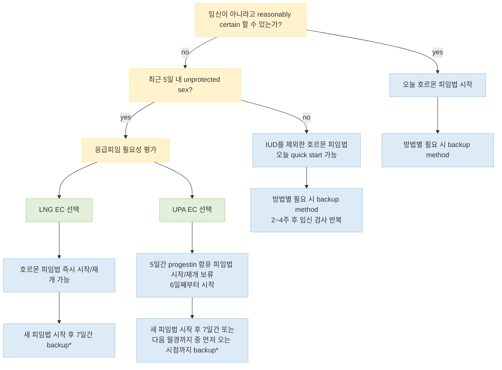
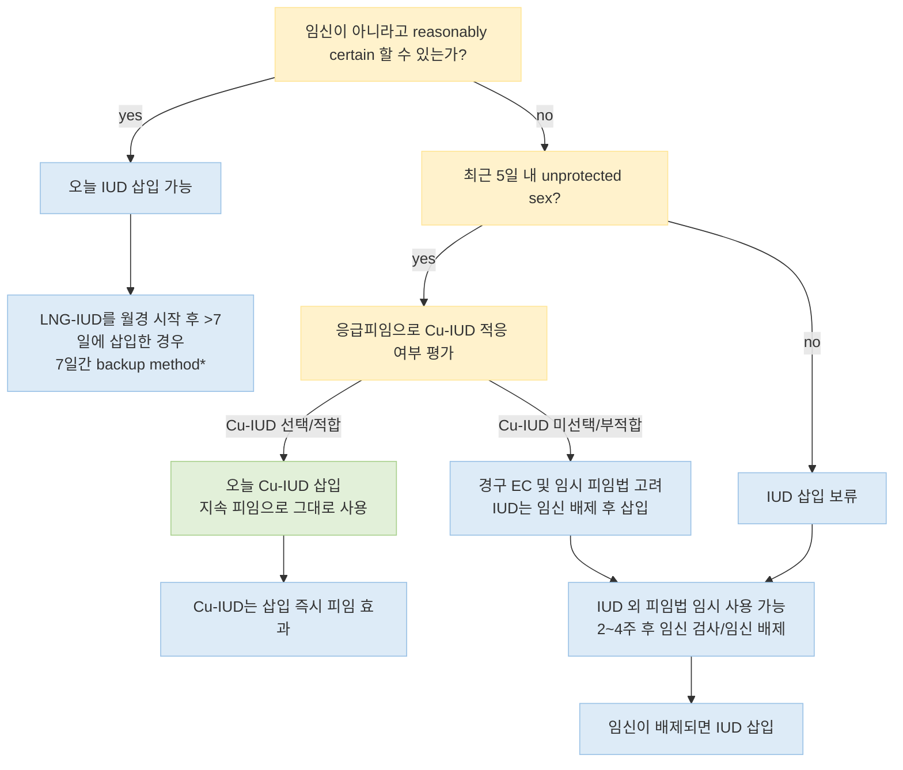

# 피임 Contraception

## <mark style="color:green;">일반 사항</mark>

* 임신이 아니라고 합리적으로 확신할 수 있다면 호르몬 피임제는 월경 주기의 어느 시점에서나 시작할 수 있음(quick start); 임신 여부를 확실히 배제하기 어려운 경우에도 IUD를 제외한 대부분의 호르몬 피임법은 우선 시작하고 2\~4주 후 임신 검사를 반복할 수 있음 \[CDC US SPR, 2024]
* 임신 중 호르몬 피임제의 사용은 임신이나 태아에 문제를 일으키지 않음
* 호르몬제 피임제 사용을 위한 Pap test는 권고하지 않음

#### <mark style="color:$primary;">피임 방법 선택 - 의학적 적격성 기준(MEC)</mark>

* 개별 의학적 상태에 따른 피임법의 상대적 적합성은 4단계로 분류: Category 1(제한 없음) ~ Category 4(용납 불가한 건강 위험) \[CDC US MEC, 2024]
* 2024년 개정에서 만성콩팥병(CKD)이 처음으로 별도 항목으로 추가되었으며, 비만·수술 전후·정맥혈전색전증(항응고제 병용 포함)·전신홍반루푸스·간경변·고형장기이식 등 다수 항목의 권고가 갱신됨 \[CDC US MEC, 2024]
* 2024년 개정판(U.S. SPR 2024)에서는 IUD 삽입 시 통증 관리에 대한 권고가 처음 포함됨(하단 핵심 복약 지도 참고)

#### <mark style="color:$primary;">피임법 사용 중 1년 내 의도하지 않은 임신율</mark>

<table><thead><tr><th width="260">피임 방법</th><th width="180" align="center">전형적 사용 실패율(%)¹⁾</th></tr></thead><tbody><tr><td>Etonogestrel implant</td><td align="center">약 0.1 이하</td></tr><tr><td>Levonorgestrel IUD</td><td align="center">약 0.1–0.4</td></tr><tr><td>Copper IUD</td><td align="center">0.8</td></tr><tr><td>여성 영구 피임술(tubal surgery)</td><td align="center">약 0.5</td></tr><tr><td>Vasectomy²⁾</td><td align="center">약 0.15</td></tr><tr><td>DMPA 주사</td><td align="center">4</td></tr><tr><td>복합 경구피임약/patch/ring</td><td align="center">7</td></tr><tr><td>Progestin-only pill</td><td align="center">7</td></tr><tr><td>남성용 콘돔³⁾</td><td align="center">13</td></tr><tr><td>Diaphragm</td><td align="center">17</td></tr></tbody></table>

Ref. CDC. Contraception and Birth Control Methods. U.S. SPR/MEC 관련 최신 상담 자료.

¹⁾ 전형적 사용=실제 생활에서의 누락·지연·잘못된 사용을 포함한 사용. 연구집단·조사 방법에 따라 실패율은 다소 차이가 있을 수 있음\
²⁾ 시술 직후 피임 효과가 확립되는 것은 아님. Post-vasectomy semen analysis(PVSA)에서 시술 성공이 확인될 때까지 다른 피임법을 사용\
³⁾ 라텍스 콘돔은 STI 예방 효과가 있으며, 사용 방법에 따라 피임 실패율이 크게 달라질 수 있음

✽Lactational amenorrhea method(LAM)는 **출산 후 6개월 미만 + 무월경 + 완전 또는 거의 완전 모유수유**의 세 조건을 모두 만족할 때 효과적인 일시적 피임법이며, 어느 한 조건이라도 충족하지 않게 되면 다른 피임법이 필요함

### <mark style="color:$danger;">🚩 Red Flags!</mark>

<mark style="color:$danger;">**즉각 조치 또는 의뢰**</mark>

* 호르몬 피임제/IUD 사용 중 급성 하복부 통증 + 무월경 또는 비정상 질 출혈 → 자궁외임신 의심(피임 중이라도 배제되지 않음), 응급 평가
* 급성 흉통, 호흡곤란, 객혈 (특히 estrogen 함유 제제 사용자) → 폐색전증 의심
* 한쪽 하지의 심한 부종·통증·발적·열감 → DVT 의심
* 신경학적 결손, 시야 소실/복시, 심한 구음 장애를 동반한 두통 → 뇌졸중/뇌혈관 사건 의심
* IUD 삽입 후 발열 + 골반통 + 화농성 질 분비물 → 골반염(PID) 의심, 응급 평가
* IUD 삽입 시 예상보다 깊은 삽입감·심한 통증·실 소실과 함께 임신 반응 양성 → 자궁 천공/이소성 임신 의심, 응급 부인과 의뢰

<mark style="color:$warning;">**당일 또는 조기 의뢰**</mark>

* CHC(estrogen 함유) 사용 중 새로 발생한 aura 동반 편두통 → estrogen 즉시 중단 및 대체 피임법 상담
* IUD 실이 만져지지 않음(임신 징후 유무와 무관) → 위치 확인을 위한 초음파
* 응급 피임제 복용 후 3주 이상 월경이 없음 → 임신 검사
* IUD 사용 중 새로 생긴 골반통 지속 → 감염/천공/부분 탈출(expulsion) 평가

<mark style="color:$info;">**외래 추적 / 추가 평가 계획**</mark> <mark style="color:$info;">- 즉각 위험 낮으나 호전 없으면 의뢰</mark>

* 새로운 피임법 시작 후 3개월 이상 지속되는 불규칙 출혈
* 부작용(유방통, 기분 변화, 체중 변화 등) 지속으로 피임법 변경이 필요한 경우
* DMPA 장기 사용자 중 골절·골다공증 고위험 인자가 있는 경우 위험–편익을 재평가; routine DXA를 일률적으로 시행하지 않음

***

## <mark style="color:green;">Estrogen/Progestin 복합제 (combined hormonal contraceptive, CHC)</mark>

* 작용 : 배란 억제, 자궁경부 점액 점도 증가, 자궁내막 변화

### <mark style="color:orange;">CHC 주요 사용 제한 및 금기(U.S. MEC 3–4 중심)</mark>

* ≥35세 흡연 : ＜15개비/d는 MEC 3, ≥15개비/d는 MEC 4
* 활동성 또는 중증 간질환
* 출산 후 초기 수유 여성(하단 출산 후 피임 참고)
* 조절되지 않는 고혈압(SBP ≥160 또는 DBP ≥100) 또는 혈관 질환
* 현재 유방암
* 큰 수술 후 장기간의 부동 상태
* 혈전성향(thrombophilia) 또는 고위험 DVT/폐색전증 병력
  * 치료적 항응고제를 사용 중인 현재/과거 DVT·PE는 일률적 절대금기가 아니며 대체로 MEC 3으로 개별 평가
* 다수의 죽상경화성 심혈관질환 위험 인자가 중복된 경우
* 전신홍반루푸스에서 항인지질항체 양성 또는 미확인
* aura 동반 편두통은 연령과 무관하게 MEC 4; aura 없는 편두통은 원칙적으로 MEC 2이나 다른 뇌졸중 위험 인자를 함께 평가
* 합병증이 동반된 판막 심장병
* 혈관 질환/망막병증/신경병증/신장병증이 있는 당뇨병 또는 장기간의 당뇨병
* 복합 경구피임제와 관련한 담즙 정체 병력 또는 중증 담낭/간담도 질환
* CKD 중 **현재 nephrotic syndrome 또는 혈액투석/복막투석 중인 경우 CHC는 MEC 4** \[CDC US MEC, 2024]

✽기타 동반 질환과 세부 상황은 CDC U.S. MEC 2024에 따라 개별 판단

### <mark style="color:orange;">경구제</mark>

* 작용 : 주로 배란 억제
* 장점 : 효과적, 규칙적 월경 유도, 월경량/월경통/배란통 감소, 난소암/자궁내막암/기능성 난소낭종/골다공증 위험 감소, 여드름 개선
* 부작용 : 질 출혈, 무월경, 유방통, 우울, 다모증, 구역, 복부 팽만, 두통; 초기 수개월간 심함
  * 중증 부작용 : stroke, thromboembolism, 고혈압, 심근경색, cholestatic jaundice
  * 저용량 제제에서도 VTE 위험 증가는 존재하며, 절대 위험은 낮지만 개인의 기저 혈전·심혈관 위험을 함께 평가
* 약물 상호 작용 : phenytoin, barbiturates, topiramate, carbamazepine, rifampin, antiretroviral
* 임신 직전 또는 임신 중 복용으로 태아에 유의미한 위험이 증가하지는 않음
* 28일 주기법에 있어서 '4일간 위약 투여법'이 '7일간 위약 투여법'보다 배란 억제, 월경 기간 단축, 호르몬 소퇴 증상(예: 두통, 피로, 월경통, 복부 팽만) 감소의 장점이 있을 수 있음
* 월경 횟수를 줄이기 위하여 위약을 3개월에 한 번만 복용하거나 위약 투여 기간 없이 복용하는 방법을 사용할 수 있음

#### <mark style="color:$primary;">용법</mark>

* 월경 주기 첫날(또는 월경 시작 후 첫 일요일)부터 복용, 매일 같은 시간에 복용
  * 임신이 아니라고 합리적으로 확신할 수 있으면 월경 주기 어느 시점에서나 시작 가능
  * 월경 시작 후 5일 이내 시작 : 추가 피임 불필요
  * 월경 시작 후 5일을 초과하여 시작 : 7일간 backup method 사용 또는 성관계 중지 \[CDC US SPR, 2024]
* 복용 누락 시 대처 \[CDC US SPR, 2024] - 아래 원칙은 하단 핵심 복약 지도와 동일하게 적용
  * 1정 누락(＜48시간) : 생각난 즉시 복용, 이후 예정대로 1일 1정 복용; 추가 피임은 일반적으로 불필요
  * 2정 이상 연속 누락(≥48시간) : 가장 최근에 누락한 1정만 즉시 복용하고 그 이전 누락 정은 버림; 이후 예정대로 1일 1정 복용하되, 7일 연속 active pill을 복용할 때까지 콘돔 등 backup method 사용 또는 성관계 중지
  * 마지막 active-pill 주에 누락했다면 휴약/위약 기간을 생략하고 현재 팩의 active pill 종료 다음 날 새 팩을 바로 시작
  * 첫 active-pill 주에 2정 이상 누락했고 최근 5일 내 무방비 성교가 있었다면 응급 피임을 고려(ulipristal 사용 시 이후 호르몬 피임 재개 시점에 유의)

#### <mark style="color:$primary;">제품 예</mark>

* <mark style="color:blue;">\[야스민]</mark> (21T) : ethinyl estradiol(EE) 30 ㎍ + drospirenone 3 ㎎, 21일간 복용 → 7일간 휴약
* <mark style="color:blue;">\[머시론]</mark> (21T) : EE 20 ㎍ + desogestrel 0.15 ㎎, 21일간 복용 → 7일간 휴약
* <mark style="color:blue;">\[야즈]</mark> (28T) : EE 20 ㎍ + drospirenone 3 ㎎, 24일간 연분홍색 → 4일간 흰색(위약) 복용
* <mark style="color:blue;">\[멜리안]</mark>/<mark style="color:blue;">\[센스리베]</mark> (21T) : EE 20 ㎍ + gestodene 0.075 ㎎, 21일간 복용 → 7일간 휴약 (3세대, 여드름/부종 부작용 적음)
* <mark style="color:blue;">\[미니보라]</mark> (21T) : EE 30 ㎍ + levonorgestrel 0.15 ㎎, 21일간 복용 → 7일간 휴약 (2세대, 정맥혈전증 위험이 상대적으로 낮음)
* \[Seasonale] (91T) : EE 30 ㎍ + levonorgestrel 0.15 ㎎, 12주간 복용 → 1주간 위약 복용 _(국내 미허가)_
* \[Lybrel] (28T) : EE 20 ㎍ + levonorgestrel 0.09 ㎎, 위약 없이 연속 복용 _(국내 미허가)_

### <mark style="color:orange;">주사제</mark>

* medroxyprogesterone acetate 25 ㎎ + estradiol cypionate 5 ㎎ IM, 1개월 마다 _(Lunelle/Cyclofem; 국내 미허가/미유통)_
* 부작용 : 불규칙한 자궁 출혈(반복 사용 시 감소)

### <mark style="color:orange;">패치</mark>

* 용법 : 주 1회 같은 요일에 1매씩 교체 부착, 3주 부착 후 1주 휴약 _(국내 시판 제품 없음; 해외 제품 예 - Xulane, Twirla)_
  * 교체/재부착이 예정보다 ＜48시간 지연 : 즉시 새 패치 부착, 추가 피임 불필요
  * ≥48시간 지연 : 즉시 새 패치 부착, 7일간 backup method 사용 \[CDC US SPR, 2024]
* 부작용 : 경구제와 같은 부작용, 국소 피부 반응; 유방통, 구역/구토, 월경통, 정맥혈전색전증(VTE) 위험이 경구제보다 많음; 질 출혈은 보다 적음
* 비만(＞90 ㎏) 시 효과 감소

### <mark style="color:orange;">질내 삽입링 (Vaginal Ring)</mark>

* 용법 : 삽입 3주 후 제거 및 1주 휴약
  * 사용 중 빠져 나오면 씻어서 재 삽입
  * 새 링 삽입이 예정보다 ＜48시간 지연 : 즉시 삽입, 추가 피임 불필요
  * ≥48시간 지연 : 즉시 삽입, 7일간 backup method 사용 \[CDC US SPR, 2024]
* 부작용 : 경구제와 같은 부작용(유방 불편감/구역/구토는 보다 적음). 질염/질 분비물 증가
* EE 2.7 ㎎, etonogestrel 11.7 ㎎ : 매일 EE 15 ㎍, etonogestrel 0.12 ㎎ 방출
* 국내 미허가 최신 제품 : segesterone acetate/EE ring - 1년간(13주기) 재사용 가능한 링 _(Annovera, 국내 미허가)_

***



\*backup 필요 기간은 피임법별로 다를 수 있으나 CHC 등은 일반적으로 7일; UPA는 progestin과 상호작용하므로 복용 후 5일간 progestin 함유 피임법을 시작하지 않음

<p align="center"><strong>호르몬 피임법 quick-start 알고리듬(IUD 제외)</strong></p>

<p align="center"><em><mark style="color:$info;">Ref. CDC U.S. Selected Practice Recommendations for Contraceptive Use, 2024</mark></em></p>

***

## <mark style="color:green;">프로게스틴 단독</mark>

### <mark style="color:orange;">일반 사항</mark>

* 작용 : 배란 억제, 자궁 경부 점막 비후, 자궁내막 변화(thinning)
* 장점 : 수유에 대한 영향이 없음, 복합제보다 두통/위장 장애 부작용이 적음, 월경 실혈 및 월경통 적음, estrogen 금기 환자에서 대부분 사용할 수 있음(implant/POP은 대체로 stroke·MI·VTE 위험을 증가시키지 않으나, DMPA는 일부 혈전 고위험 상태에서 VTE 위험을 추가로 높일 수 있어 제제별 MEC를 확인)
* 대상 : 비만, DVT 병력, 장시간 움직일 수 없는 경우, estrogen을 복용할 수 없는 경우, 항전간제 복용(lamotrigine), 수유 중
* 부작용 : 불규칙 월경/무월경, 점상 질 출혈(복용 시작 후 수개월간), 공복감(체중 증가), 유방통
* 주요 금기 : 현재 유방암은 implant/DMPA/POP 모두 U.S. MEC 4; 과거 유방암(5년 이상 재발 없음)은 대체로 MEC 3. 그 외 상태는 제제별 MEC를 개별 평가

### <mark style="color:orange;">경구제 (progestogen only pill, POP)</mark>

* 용법 : 월경 주기 첫날에 시작하여 중단 없이 매일 같은 시간에 지속 복용
* 복용을 중단하면 즉시 임신 가능
* 성분 계열 : norethindrone/norgestrel/levonorgestrel 계열과 drospirenone 계열 등이 있으며, 제제에 따라 복용 누락 허용 시간과 backup 기간이 다를 수 있음 \[CDC US SPR, 2024]
  * drospirenone 계열은 17α-spironolactone 유도체로 여드름/부종 부작용이 적으나, CKD에서 고칼륨혈증 병력이 있으면 금기
* 국내에는 progestin 단독 경구 피임제 상시 제품이 없으며, 경구 단독 progestin 제품으로는 응급 피임약만 유통됨(복합 경구피임제만 상용 판매)
* 해외 동향 : 미국은 2023년 norgestrel 단일 성분 progestin-only pill(Opill)을 처방전 없이(OTC) 구입 가능하도록 승인 _(국내 미허가)_

### <mark style="color:orange;">주사제 : Depo-medroxyprogesterone acetate (DMPA)</mark>

* 효과 : 경구제와 비슷
* 용법 : 3개월마다 150 ㎎ IM 또는 104 ㎎ SC; 4개월까지 효과
* 마지막 주사 후 평균 10개월(\~18개월) 이후 임신 가능 상태로 회복
* 항전간제 대사에 영향을 주지 않으며 약간의 발작 감소 효과가 있어 발작 환자에서 유용
* 부작용 : 경구제와 비슷; 불규칙 출혈 후 점차 무월경, 두통, 체중 증가, 골밀도 감소(혈중 estradiol 수준 감소와 관련되며 투약 중단 후 회복 가능; 골절 위험 증가는 일관되게 입증되지 않음)
* FDA labeling에는 장기 사용 시 BMD 감소에 대한 boxed warning과 2년 초과 사용에 대한 주의가 있으나, ACOG/WHO는 BMD 우려만으로 2년 이상 사용을 일률적으로 제한하지 않으며 개별 위험–편익에 따라 지속 가능; routine DXA는 권장하지 않음

### <mark style="color:orange;">자궁 내 장치 : Levonorgestrel IUD</mark>

* 작용 : 자궁 경부 비후, 자궁내막 탈락/위축, 배란 장애, 정자/난자에 대한 독성 작용(염증 반응)
* 월경량 감소 및 자궁내막증에 의한 통증 감소 효과가 있음 (✽과다 월경에 대하여 FDA 승인)
* 용법 : 월경 기간 또는 월경 시작 7일 이내 삽입
* 부작용 : 불규칙 월경(주로 첫 3\~6개월, 이후 호전)
* 금기 : septic abortion, postpartum sepsis, uterine cavity 기형, 임신영양모세포병, 자궁경부암, 자궁내막암, 설명할 수 없는 질 출혈, symptomatic PID, 최근의 화농성 자궁경부염
* <mark style="color:blue;">\[미레나]</mark> : levonorgestrel 52 ㎎, 매일 20 ㎍ 방출, 국내 허가 기준 5년간 작용 (✽미국 FDA는 2022년 피임 목적 사용 기간을 8년으로 연장 승인하였으나, 국내 식약처 허가사항이 동일하게 갱신되었는지는 확인 필요 - 처방 시 최신 국내 허가사항 확인)
* <mark style="color:blue;">\[카일리나]</mark> : levonorgestrel 19.5 ㎎, 매일 약 17.5 ㎍\~(차츰 감소) 방출, 5년간 작용; 미레나보다 소형이며 방출량이 적음
* <mark style="color:blue;">\[제이디스]</mark> : levonorgestrel 13.5 ㎎, 매일 14 ㎍\~(차츰 감소) 5 ㎍ 방출, 3년간 작용; 미레나·카일리나보다 출혈 기간이 긺
* IUD 삽입 시 통증 관리 : lidocaine spray/gel/cream 국소 도포 또는 자궁경부 주위 차단(paracervical block)이 통증 감소에 도움이 될 수 있음; NSAID 등 일반 진통제의 사전 투여는 삽입 자체의 통증 감소에는 일관된 효과가 입증되지 않으나, 삽입 후 월경통·경련 완화 목적으로는 도움이 될 수 있음; misoprostol 등 자궁경부 숙화제의 일상적 사용은 권장하지 않음(이전 삽입 실패 병력이 있는 경우 개별 고려) - 모든 환자에게 삽입 전 통증 관리 옵션을 상담하고 선호를 반영 \[ACOG 2025; CDC US SPR 2024]

***



\*LNG-IUD는 삽입 시점에 따라 backup이 필요할 수 있음. 임신 여부가 불확실한 경우에는 IUD를 quick-start하지 않음

<p align="center"><strong>IUD 시작 알고리듬</strong></p>

<p align="center"><em><mark style="color:$info;">Ref. CDC U.S. Selected Practice Recommendations for Contraceptive Use, 2024</mark></em></p>

***

### <mark style="color:orange;">이식제 : Etonogestrel</mark>

* 작용 : 경구제와 동일
* 부작용 : 경구제와 유사; 불규칙 월경(주로 첫 6\~12개월, 이후 호전)
* <mark style="color:blue;">\[임플라논 엔엑스티 이식제]</mark> : etonogestrel 68 ㎎, 팔 안쪽에 삽입, 3년간 유효

## <mark style="color:green;">비호르몬 피임</mark>

### <mark style="color:orange;">구리 자궁 내 장치 (Copper IUD)</mark>

* 작용 : 구리 이온에 의한 무균성 염증 반응 → 정자 기능·운동성·생존력을 저해하여 주로 수정을 방해(호르몬 작용 없음)
* <mark style="color:blue;">\[노바-티]</mark> : 삽입 후 5년마다 교체
* 부작용 : 출혈, 경련(월경량 증가 및 월경통 악화 가능 - 레보노르게스트렐 IUD보다 흔함)
* 성교 후 5일 이내 삽입 시 가장 효과적인 응급 피임 수단으로도 사용 가능(하단 응급 피임제 참고)

### <mark style="color:orange;">살정제 (Spermicide)</mark>

* <mark style="color:blue;">\[노원 질좌제]</mark> : nonoxynol-9 100 ㎎, 성교 10분\~1시간 전 질 깊숙이 삽입
* 부작용 : 질 상피를 손상시키고 HIV 등의 감염 위험을 증가시킬 수 있음(빈번한 사용 시 특히)

### <mark style="color:orange;">차단법 (Barrier method)</mark>

* 콘돔(남성용/여성용), diaphragm, sponge 등; 단독 사용 시 전형적 사용 실패율이 높아(상단 표 참고) 다른 방법과 병용하거나 STI 예방 목적을 함께 고려할 때 유용
* 라텍스 콘돔은 유일하게 임신과 STI를 동시에 예방; 라텍스 알레르기 시 polyurethane/polyisoprene 콘돔 대체 가능

## <mark style="color:green;">응급 피임제</mark>

### <mark style="color:orange;">일반 사항</mark>

* 작용 : 주로 배란을 지연 또는 억제하여 임신을 예방하며, 이미 성립된 임신을 중단시키는 작용은 없음
* 성교 후 가능한 한 빨리 복용할수록 효과적; 배란이 이미 일어난 이후에는 경구 응급피임제의 효과가 제한됨
* 부작용 : 구토, 복통, 설사, 피로, 두통, 어지럼, 유방통, 월경 변화 (✽복용 3시간 내 구토 시 재복용)
* 임신 중 복용 시의 위험 보고는 없으나 임신 중에는 복용하지 않음
* 응급피임 방법 중 copper IUD가 가장 효과적이며(성교 5일 내 삽입; 배란일을 추정할 수 있는 경우 배란 후 5일 이내라면 성교 후 5일이 지났어도 삽입 가능), 삽입 후에는 지속 피임법으로 그대로 사용할 수 있음. Cu-IUD를 응급피임으로 삽입한 경우 경구 응급피임제를 추가로 병용할 필요는 일반적으로 없음
* levonorgestrel(LNG) 복용 후에는 정규 호르몬 피임법을 즉시 시작/재개할 수 있으며 이후 7일간 backup method 사용 또는 성관계 중지. Ulipristal acetate(UPA) 복용 후에는 원칙적으로 5일간 progestin 함유 피임법 시작/재개를 피하고 6일째부터 시작하며, 그 후 7일간 또는 다음 월경 중 먼저 오는 시점까지 backup method 사용 (✽DMPA·임플란트 등 재방문이 필요한 방법은 추후 접근성이 불확실한 경우 UPA와 같은 날 시작을 개별 고려할 수 있으나, UPA 효과 감소 가능성과 비교하여 판단)
* 응급 피임 후 다음 월경 예정일 또는 21일 내 월경을 하지 않는 경우 임신 여부 확인

### <mark style="color:orange;">약제</mark>

#### <mark style="color:$primary;">Levonorgestrel</mark>

* 작용 : 대용량 progesterone
* BMI ≥25에서 효과가 저하될 수 있음
* 용법 : 성교 후 가능한 한 빨리, 최대 120시간(5일) 이내 복용 가능하나 72시간 이후 효과가 감소하므로 72\~120시간에서는 UPA 또는 Cu-IUD를 우선 고려; <mark style="color:blue;">\[노레보원]</mark> 1.5 ㎎/T 1T 1회

#### <mark style="color:$primary;">Ulipristal acetate</mark>

* 작용 : 선택적 progesterone 수용체 조절제로서 progesterone의 배란 및 자궁에 대한 작용을 방해
* BMI ≥30에서 피임 효과가 저하될 수 있다는 경향이 보고되나 근거는 확정적이지 않음; 고도비만 환자에서는 Cu-IUD가 가장 확실한 선택지
* 용법 : 성교 120시간(5일) 내 복용; <mark style="color:blue;">\[엘라원]</mark> 30 ㎎/T 1T 1회

#### <mark style="color:$primary;">Mifepristone</mark>

* 작용 : progesterone receptor에 결합하여 progesterone 작용을 차단 → 자궁 내막 파괴, 유산 유도
* 부작용 : 복통, 피로감, 질 출혈; 응급피임 목적으로는 국내 허가 안 됨

#### <mark style="color:$primary;">응급피임제의 효과(임신율)</mark>

<table><thead><tr><th width="180">복용까지의 시간</th><th width="150" align="center">Levonorgestrel</th><th align="center">Ulipristal acetate</th></tr></thead><tbody><tr><td>\~24시간</td><td align="center">2.5%</td><td align="center">0.9%</td></tr><tr><td>\~72시간</td><td align="center">2.2%</td><td align="center">1.4%</td></tr><tr><td>\~120시간</td><td align="center">2.2%</td><td align="center">1.3%</td></tr></tbody></table>

Ref. Canadian Contraception Consensus. 2015. Table 7

## <mark style="color:green;">출산 후 피임</mark>

### <mark style="color:orange;">수유하지 않는 경우</mark>

* 출산 후 ＜21일 : CHC MEC 4(사용 금지)
* 21\~42일 : VTE 위험 인자가 있으면 CHC 사용을 피하고, 위험 인자가 없으면 개별 평가
* ＞42일 : CHC 사용에 산후 시기 자체로 인한 제한 없음
* Progestin-only method는 산후 조기에 사용할 수 있으며 제제·상황별 MEC를 확인

### <mark style="color:orange;">수유 중인 경우</mark>

* 출산 후 ＜21일 : CHC MEC 4
* 21\~＜30일 : CHC MEC 3
* 30\~42일 : VTE 위험 인자가 있으면 MEC 3, 없으면 MEC 2
* ＞42일 : CHC MEC 2이나, 수유 유지가 중요한 경우 estrogen에 의한 모유량 감소 가능성을 고려하여 progestin-only method를 우선 권고하는 경우가 흔함
* Progestin-only method는 산후 조기부터 사용할 수 있으며, 6주 이후에는 대부분 제한 없이 사용 가능
* 수유 중 경구 응급 피임제 사용 가능; copper 또는 levonorgestrel IUD는 산후 즉시 삽입할 수 있으나 삽입 시점에 따른 expulsion 위험을 함께 설명

✽CDC MEC상 출산 42일 이후 CHC는 수유 중에도 MEC 2이나, **수유 유지가 특히 중요한 경우 estrogen에 따른 모유량 감소 가능성을 고려하여 비-estrogen 방법을 우선 선택할 수 있음**

## <mark style="color:green;">일시적 월경 조절</mark>

### <mark style="color:orange;">지연시킴</mark>

* medroxyprogesterone acetate : 다음 월경 예정일 2주(최소 5일) 전부터 복용. 가능한 한 매일 같은 시간에 복용; 복용 중단 2\~3일 내에 월경 시작 <mark style="color:blue;">\[프로베라]</mark>
* norethisterone(노르에티스테론) 5 ㎎ : 다음 월경 예정일 5일 전부터 월경 연장을 원하는 시점까지 1일 1회(또는 필요시 분할) 연속 복용; 복용 중단 2\~3일 내에 월경 시작 <mark style="color:blue;">\[프리모루트엔]</mark> \[식약처 허가사항]

### <mark style="color:orange;">앞당김</mark>

* 복합 경구용 피임제 : 앞선 월경이 끝난 날부터 10일 이상 매일 정해진 시간에 복용; 복용 중단 2\~3일 내에 월경 시작 <mark style="color:blue;">\[야스민]</mark>

***

### <mark style="color:red;">질병코드</mark>

Z30.0 일반적 피임 상담 및 조언

Z30.2 불임술(영구 피임술)

Z30.4 피임약 사용의 감시

Z30.5 자궁내 피임 장치 사용의 감시

Z30.8 기타 명시된 피임 관리

Z30.9 상세불명의 피임 관리

✽청구용 상세 코드는 병원 청구 기준에 따라 상이할 수 있어 원내 기준 확인 필요

***

## <mark style="color:purple;">처방례</mark>

> **처방례 1. 복합 경구피임제 신규 시작(전형적 사례)**
>
> ```
> 야스민정  1T  1일 1회  월경 시작일부터 매일 같은 시각
> ```
>
> _✽월경 시작 후 5일 이내 시작하면 추가 피임 불필요; 5일을 초과하여 시작한 경우 7일간 콘돔 등 backup method 병용 권고. 첫 3개월은 부정 출혈·유방통 등 부작용이 흔함을 사전 안내_

> **처방례 2. Estrogen 금기 환자의 프로게스틴 단독 피임(모유수유부 포함)**
>
> ```
> (국내 상시 판매 POP 제품 없음 - 미레나/카일리나/제이디스 IUD
>  또는 임플라논 삽입, DMPA 주사 중 상담하여 선택)
> ```
>
> _✽국내에는 응급피임약을 제외한 progestin 단독 경구제가 유통되지 않으므로, estrogen이 금기인 환자는 LARC(IUD·임플란트) 또는 DMPA로 상담을 유도_

> **처방례 3. DMPA 주사**
>
> ```
> DMPA 150 ㎎/1 mL  IM  1회, 3개월마다 반복
> 또는
> DMPA 104 ㎎/0.65 mL  SC  1회, 3개월마다 반복
> ```
>
> _✽IM/SC 제형별 정확한 국내 유통 상품명은 처방 전 확인; 마지막 주사 후 평균 10개월(최장 18개월) 이후 임신 가능; 장기 사용 시 골밀도 감소 가능성 설명 후 동의_

> **처방례 4. 응급 피임 - 성교 후 72시간 이내(특히 BMI ＜25에서 우선 고려 가능)**
>
> ```
> 노레보원정 1.5 ㎎  1T  1회 즉시 복용
> ※ 복용 3시간 이내 구토 시 재복용
> ※ 정규 호르몬 피임법은 즉시 시작/재개 가능
> ※ 시작/재개 후 7일간 backup method 또는 성관계 중지
> ```

> **처방례 5. 응급 피임 - 성교 후 72\~120시간 경과 또는 BMI ≥25**
>
> ```
> 엘라원정 30 ㎎  1T  1회 즉시 복용
> ※ 복용 후 5일간 progestin 함유 피임제 시작/재개 금지
> ※ 6일째부터 호르몬 피임을 시작/재개하고, 그 후 7일간 또는 다음 월경 중 먼저 오는 시점까지 backup method 사용
> ```
>
> _✽단일 방법 중 가장 효과적인 응급 피임은 구리 IUD(성교 후 5일 이내 삽입, 삽입 후 지속 피임법으로 사용 가능)이며, 원하는 경우 대신 안내_

> **처방례 6. 월경 지연이 필요한 경우(여행, 시험 등)**
>
> ```
> 프로베라정 5~10 ㎎  1일 1회  월경 예정일 5~14일 전부터 매일 복용
> ※ 복용 중단 2~3일 내 월경 시작
> ```

***

### <mark style="color:$success;">핵심 복약 지도</mark>

> **복합 경구피임제(CHC) - 누락 시 대처**
>
> * 1정 누락(＜48시간) : 생각난 즉시 복용, 이후 예정대로 1일 1정 복용; 추가 피임은 일반적으로 불필요
> * 2정 이상 연속 누락(≥48시간) : 가장 최근 누락한 1정만 즉시 복용하고 이전 누락 정은 버림; 이후 예정대로 1일 1정 복용하되, 7일 연속 active pill을 복용할 때까지 backup method 사용 또는 성관계 중지
> * 마지막 active-pill 주에 누락했다면 위약/휴약 기간을 생략하고 다음 팩을 바로 시작
> * 첫 active-pill 주에 2정 이상 누락했고 최근 5일 내 무방비 성교가 있었다면 응급 피임을 고려

> **IUD 삽입 전후 안내**
>
> * 삽입 전 통증 관리 옵션(국소 lidocaine, 자궁경부 주위 차단 등)을 반드시 상담하고 환자 선호를 반영 \[ACOG 2025]
> * 삽입 후 첫 3\~6개월간 불규칙 출혈이 흔하며 이후 호전됨을 사전 설명
> * 원하는 경우 실을 스스로 확인하는 방법을 안내할 수 있음; 실이 갑자기 만져지지 않거나 길이가 현저히 변한 경우 내원

> **응급 피임제 복용 안내**
>
> * 성교 후 가능한 한 빨리 복용할수록 효과적; 경구 응급피임제는 주로 배란을 지연/억제하며 이미 성립된 임신을 중단시키지 않음을 설명
> * 복용 3시간 내 구토 시 재복용 필요
> * 응급 피임은 반복적인 일상 피임법을 대체하지 않음을 설명하고, 상담 시 지속 가능한 피임법 선택으로 연결

> **언제 다시 병원을 방문해야 하나요?**
>
> * 새로운 피임법 시작 후 3개월 이상 부정 출혈이 지속되는 경우
> * **심한 하복부 통증**, **가슴 통증/호흡곤란**, **한쪽 다리의 심한 부종·통증**, **심한 두통이나 시야 이상**이 생긴 경우 - 즉시 내원
> * IUD 실이 만져지지 않거나 삽입 부위 통증이 지속되는 경우
> * 응급 피임제 복용 후 3주(또는 다음 월경 예정일)가 지나도 월경이 없는 경우

***

### <mark style="color:blue;">환자 안내서</mark>


**피임, 나에게 맞는 방법을 함께 찾아봐요**

피임 방법은 효과, 사용 편의성, 부작용, 동반 질환에 따라 사람마다 다르게 선택됩니다. 아래 내용을 참고하여 본인에게 맞는 방법을 상담하세요.


#### <mark style="color:$primary;">어떤 피임 방법이 있나요?</mark>

* 매일 복용하는 경구 피임약, 3개월마다 맞는 주사제, 팔에 삽입하는 이식제, 자궁 안에 넣는 자궁내장치(IUD)까지 다양한 방법이 있습니다.
* 자궁내장치·이식제는 한 번 시술하면 제품에 따라 3년 이상(길게는 그 이상) 신경 쓰지 않아도 되는 가장 효과가 높은 방법 중 하나입니다.
* 콘돔은 유일하게 성매개감염(STI)도 함께 예방하므로, 다른 피임법을 쓰더라도 함께 사용하는 것이 좋습니다.

#### <mark style="color:$primary;">약은 어떻게 써야 하나요?</mark>

* **경구 피임약은 매일 같은 시각에 복용하십시오.** 하루를 잊었다면 생각난 즉시 복용하고, 이틀 이상 잊었다면 병원이나 약국에 문의하세요.
* **응급 피임약은 사후 대처용입니다.** 성관계 후 가능한 한 빨리 복용할수록 효과가 좋으며, 이후에는 지속 가능한 정규 피임법을 함께 상담하는 것이 좋습니다.
* **IUD 삽입 시 통증이 걱정된다면 미리 말씀해 주세요.** 국소마취 등 통증을 줄이는 방법을 제공받을 수 있습니다.

#### <mark style="color:$primary;">이럴 때는 즉시 병원을 방문하세요</mark>

* 심한 배 아픔, 가슴 통증이나 숨참, 한쪽 다리가 심하게 붓고 아픈 경우
* 심한 두통과 함께 눈이 잘 안 보이거나 물체가 두 개로 보이는 경우
* 임신이 의심되는데 배가 한쪽으로 심하게 아픈 경우 (피임 중이라도 가능성 있음)
