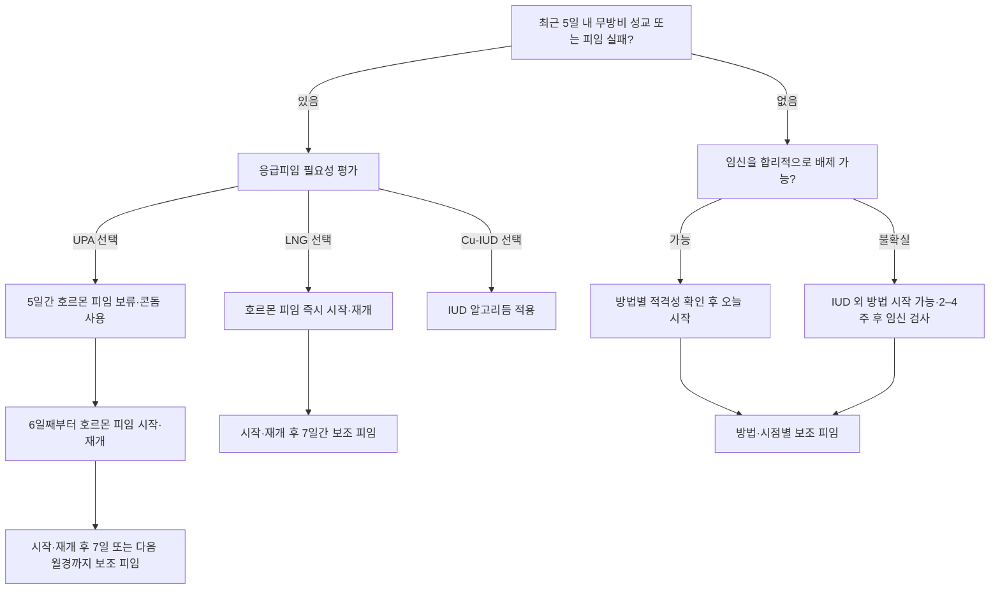
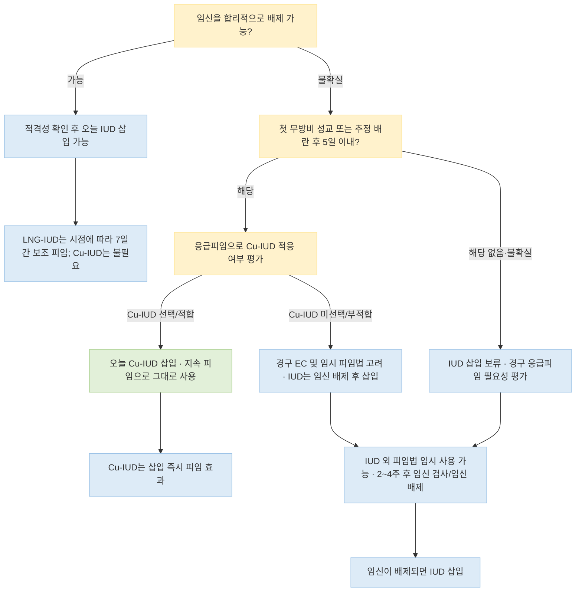

# 피임 Contraception

## <mark style="color:green;">일반 사항</mark>

* 임신이 아니라고 합리적으로 확신할 수 있다면 호르몬 피임제는 월경 주기의 어느 시점에서나 시작할 수 있음(quick start); 임신 여부를 확실히 배제하기 어려운 경우에도 IUD를 제외한 대부분의 호르몬 피임법은 우선 시작하고 2\~4주 후 임신 검사를 반복할 수 있음 \[CDC US SPR, 2024]
* 임신 초기에 경구피임약을 우연히 복용한 경우 주요 선천기형 위험 증가가 입증되지는 않았으나, 임신이 확인되면 중단함. 이를 모든 호르몬 제제의 임신 중 안전성 보장으로 해석하지 않으며, IUD가 삽입된 상태의 임신은 자궁외임신 및 유산·감염 위험 때문에 별도 평가가 필요함
* 경구피임제·임플란트 시작 전 Pap test나 골반 진찰을 일률적인 필수 조건으로 요구하지 않음; 연령·위험에 따른 자궁경부암 검진은 별도로 시행함. CHC 시작 전에는 혈압 측정이 필요하며 흡연, 편두통 조짐, 혈전·유방암 병력, 간·콩팥 질환 및 복용약을 확인함

#### <mark style="color:$primary;">피임 방법 선택 - 의학적 적격성 기준(MEC)</mark>

* 개별 의학적 상태에 따른 피임법의 상대적 적합성은 4단계로 분류: Category 1(제한 없음), 2(이득이 위험보다 큼), 3(위험이 대체로 이득보다 큼; 다른 적합한 방법 우선), 4(용납 불가한 건강 위험; 사용하지 않음) \[CDC US MEC, 2024]
* 2024년 개정에서 만성콩팥병(CKD)이 처음으로 별도 항목으로 추가되었으며, 비만·수술 전후·정맥혈전색전증(항응고제 병용 포함)·전신홍반루푸스·간경변·고형장기이식 등 다수 항목의 권고가 갱신됨 \[CDC US MEC, 2024]
* U.S. SPR 2024는 기존 IUD 삽입 통증 관리 권고를 갱신함; lidocaine 국소 도포/자궁경부 주위 차단과 환자 중심의 통증 관리 계획을 강조함(하단 핵심 복약 지도 참고)

#### <mark style="color:$primary;">임신이 아니라고 합리적으로 확신할 수 있는 기준</mark>

* 임신 증상·징후가 없으며 다음 중 하나 이상에 해당함: 정상 월경 시작 후 7일 이내 / 마지막 정상 월경 시작 후 성교 없음 / 신뢰할 수 있는 피임법을 정확하고 지속적으로 사용 / 자연·인공 유산 완료 후 7일 이내 / 출산 후 4주 이내 / 출산 후 6개월 미만이면서 무월경·완전 또는 거의 완전 모유수유
* 최근 무방비 성교로 인한 임신은 당일 소변 임신 검사 음성만으로 배제할 수 없음. 최근 5일 내 무방비 성교·피임 실패가 있으면 임신 검사 결과와 별도로 응급피임 필요성을 평가함
* 위 기준은 **임신 배제 기준**임; 산후 CHC 사용 금기나 방법별 시작 후 보조 피임 기간을 대신하지 않음 \[CDC U.S. SPR, 2024]

#### <mark style="color:$primary;">피임법 사용 중 1년 내 의도하지 않은 임신율</mark>

<table><thead><tr><th width="260">피임 방법</th><th width="180" align="center">전형적 사용 실패율(%)¹⁾</th></tr></thead><tbody><tr><td>Etonogestrel implant</td><td align="center">약 0.1 이하</td></tr><tr><td>Levonorgestrel IUD</td><td align="center">약 0.1–0.4</td></tr><tr><td>Copper IUD</td><td align="center">0.8</td></tr><tr><td>여성 영구 피임술(tubal surgery)</td><td align="center">약 0.5</td></tr><tr><td>Vasectomy²⁾</td><td align="center">약 0.15</td></tr><tr><td>DMPA 주사</td><td align="center">4</td></tr><tr><td>복합 경구피임약/patch/ring</td><td align="center">7</td></tr><tr><td>Progestin-only pill</td><td align="center">7</td></tr><tr><td>남성용 콘돔³⁾</td><td align="center">13</td></tr><tr><td>Diaphragm</td><td align="center">17</td></tr></tbody></table>

Ref. [CDC. Contraception and Birth Control Methods](https://www.cdc.gov/contraception/about/index.html). 미국 자료이며 국내 제품별 장기 사용기간과는 별도로 해석함.

¹⁾ 전형적 사용=실제 생활에서의 누락·지연·잘못된 사용을 포함한 사용. 연구집단·조사 방법에 따라 실패율은 다소 차이가 있을 수 있음\
²⁾ 시술 직후 피임 효과가 확립되는 것은 아님. Post-vasectomy semen analysis(PVSA)에서 시술 성공이 확인될 때까지 다른 피임법을 사용\
³⁾ 라텍스 콘돔은 STI 예방 효과가 있으며, 사용 방법에 따라 피임 실패율이 크게 달라질 수 있음

✽Lactational amenorrhea method(LAM)는 **출산 후 6개월 미만 + 무월경 + 완전 또는 거의 완전 모유수유**의 세 조건을 모두 만족할 때 효과적인 일시적 피임법이며, 어느 한 조건이라도 충족하지 않게 되면 다른 피임법이 필요함

### <mark style="color:$danger;">🚩 Red Flags!</mark>

<mark style="color:$danger;">**즉각 조치 또는 의뢰**</mark>

* 호르몬 피임제/IUD 사용 중 급성 하복부 통증 + 무월경 또는 비정상 질 출혈 → 자궁외임신 의심(피임 중이라도 배제되지 않음), 응급 평가
* 급성 흉통, 호흡곤란, 객혈 (특히 estrogen 함유 제제 사용자) → 폐색전증 의심
* 한쪽 하지의 심한 부종·통증·발적·열감 → DVT 의심
* 신경학적 결손, 시야 소실/복시, 심한 구음 장애를 동반한 두통 → 뇌졸중/뇌혈관 사건 의심
* IUD 삽입 후 심한 골반통, 고열·오한, 저혈압·빈맥, 복막 자극 징후 → 중증 PID·패혈증·천공 가능성, 응급 평가
* IUD 삽입 중/후 비정상적으로 심한 통증·출혈 또는 천공 의심 소견 → 즉시 시술 중단 및 부인과 평가; 임신 반응 양성을 필수 조건으로 삼지 않음

<mark style="color:$warning;">**당일~수일 내 평가**</mark>

* CHC(estrogen 함유) 사용 중 새로 발생한 aura 동반 편두통 → estrogen 즉시 중단 및 당일 평가·대체 피임법 상담; 지속되는 신경학적 결손은 즉각 조치
* IUD 실이 새로 만져지지 않거나 길이가 현저히 변함(임신 징후 유무와 무관) → 임신 검사·초음파로 위치 확인; 확인 전 콘돔 사용/성관계 중지, 최근 무방비 성교가 있으면 응급피임 평가
* 응급피임 후 3주 내 정상 월경/소퇴성 출혈이 없거나 월경 예정일보다 지연됨(LNG 5일 이상, UPA 7일 초과), 비정상 출혈·임신 증상 → 임신 검사; 심한 하복부 통증은 즉각 조치
* IUD 사용 중 새로 생긴 골반통, 발열 또는 화농성 분비물 → 감염/천공/부분 탈출 평가(당일); 세 소견이 모두 있어야 평가하는 것은 아님

<mark style="color:$info;">**외래 추적 / 추가 평가 계획**</mark> <mark style="color:$info;">- 즉각 위험 낮으나 호전 없으면 의뢰</mark>

* 새로운 피임법 시작 후 3개월 이상 지속되는 불규칙 출혈
* 부작용(유방통, 기분 변화, 체중 변화 등) 지속으로 피임법 변경이 필요한 경우
* DMPA 장기 사용자 중 골절·골다공증 고위험 인자가 있는 경우 위험–편익을 재평가; routine DXA를 일률적으로 시행하지 않음

***

## <mark style="color:green;">Estrogen/Progestin 복합제 (combined hormonal contraceptive, CHC)</mark>

* 작용 : 배란 억제, 자궁경부 점액 점도 증가, 자궁내막 변화

### <mark style="color:orange;">CHC 주요 사용 제한 및 금기(U.S. MEC 3–4 중심)</mark>

* ≥35세 흡연 : ＜15개비/d는 MEC 3, ≥15개비/d는 MEC 4. 국내 야스민 등 일부 제품은 흡연량과 무관하게 ≥35세 흡연을 금기로 규정하므로 제품별 허가사항도 확인함
* 비대상성 간경변, 간세포선종·악성 간종양은 MEC 4; 급성 바이러스간염/악화 시 신규 시작은 MEC 3–4. 만성 바이러스간염·대상성 간경변을 일률적 금기로 삼지 않음
* 출산 후 초기 수유 여성(하단 출산 후 피임 참고)
* 적절히 조절된 고혈압 또는 SBP 140–159/DBP 90–99 ㎜Hg는 MEC 3; SBP ≥160 또는 DBP ≥100 ㎜Hg 및 혈관 질환은 MEC 4. 한 번의 혈압 측정만으로 고혈압을 분류하지 않음
* 현재 유방암은 MEC 4; 유방암 병력으로 5년 이상 재발이 없어도 MEC 3
* 장기간의 부동을 동반하는 큰 수술은 MEC 4; 시술 전부터 대체 피임법을 계획함
* 혈전성향(thrombophilia) 또는 고위험 DVT/폐색전증 병력
  * 치료적 항응고제를 사용 중인 현재/과거 DVT·PE는 일률적 절대금기가 아니며 대체로 MEC 3으로 개별 평가
* 다수의 죽상경화성 심혈관질환 위험 인자가 중복된 경우
* 전신홍반루푸스에서 항인지질항체 양성 또는 미확인
* aura 동반 편두통은 연령과 무관하게 MEC 4; aura 없는 편두통은 원칙적으로 MEC 2이나 다른 뇌졸중 위험 인자를 함께 평가
* 허혈성 심장병 또는 뇌졸중 병력, 합병증이 동반된 판막 심장병은 MEC 4
* 혈관 질환/망막병증/신경병증/신장병증이 있는 당뇨병 또는 유병기간 ＞20년인 당뇨병은 MEC 3–4
* 복합 경구피임제와 관련한 담즙 정체 병력 또는 중증 담낭/간담도 질환
* CKD 중 **현재 nephrotic syndrome 또는 혈액투석/복막투석 중인 경우 CHC는 MEC 4** \[CDC US MEC, 2024]

* 겸상적혈구병은 MEC 4 \[CDC U.S. MEC, 2024]

✽기타 동반 질환과 세부 상황은 CDC U.S. MEC 2024에 따라 개별 판단; MEC와 국내 개별 제품의 금기·주의사항이 다를 수 있으므로 함께 확인함

### <mark style="color:orange;">경구제</mark>

* 작용 : 주로 배란 억제
* 장점 : 효과적, 규칙적 월경 유도, 월경량/월경통/배란통 감소, 난소암/자궁내막암 위험 감소, 여드름 개선
* 부작용 : 질 출혈, 무월경, 유방통, 우울, 다모증, 구역, 복부 팽만, 두통; 초기 수개월간 심함
  * 중증 부작용 : stroke, thromboembolism, 고혈압, 심근경색, cholestatic jaundice
  * 저용량 제제에서도 VTE 위험 증가는 존재하며, 절대 위험은 낮지만 개인의 기저 혈전·심혈관 위험을 함께 평가
* 약물 상호 작용
  * 효소 유도제(phenytoin, phenobarbital·primidone, carbamazepine·oxcarbazepine, topiramate, rifampin·rifabutin, St. John’s wort) 및 일부 항레트로바이러스제는 경구피임제/임플란트의 효과를 낮출 수 있음; IUD 등 대체 방법을 고려함
  * Estrogen 함유 피임제는 lamotrigine 농도를 낮춰 발작 조절을 악화시킬 수 있음; 중단·휴약 시 농도가 다시 상승할 수 있어 협진이 필요함
  * 대부분의 일반 항생제는 피임 효과를 유의하게 낮추지 않음; rifampin/rifabutin과 지속적인 구토·심한 설사는 별도로 평가함
  * Tirzepatide는 경구 호르몬 피임제의 효과를 낮출 수 있어 투여 시작 후 4주 및 매 증량 후 4주간 비경구 피임법으로 변경하거나 콘돔을 병용함 \[미국 FDA 허가사항, 2026]
* 임신 초기에 우연히 경구피임약을 복용한 것만으로 주요 선천기형 위험 증가가 입증되지는 않음; 임신 확인 시 중단함
* 28일 주기법에 있어서 '4일간 위약 투여법'이 '7일간 위약 투여법'보다 배란 억제, 월경 기간 단축, 호르몬 소퇴 증상(예: 두통, 피로, 월경통, 복부 팽만) 감소의 장점이 있을 수 있음
* 월경 횟수를 줄이기 위하여 위약을 3개월에 한 번만 복용하거나 위약 투여 기간 없이 복용하는 방법을 사용할 수 있음

#### <mark style="color:$primary;">용법</mark>

* 국내 제품 허가용법은 일반적으로 월경 첫날부터 시작하여 매일 같은 시간에 복용함; 아래 quick-start·누락 대처는 CDC 지침 기준이며 국내 제품 설명서와 구분함
  * 임신이 아니라고 합리적으로 확신할 수 있으면 월경 주기 어느 시점에서나 시작 가능
  * CDC : 월경 시작 후 5일 이내 시작하면 추가 피임 불필요. 다만 일부 국내 제품 설명서는 월경 2–5일째 시작 시 첫 7일간 보조 피임을 요구하므로 제품별 설명서를 따름
  * 월경 시작 후 5일을 초과하여 시작 : 7일간 backup method 사용 또는 성관계 중지 \[CDC US SPR, 2024]
* 복용 누락 시 대처 \[CDC US SPR, 2024] - **호르몬을 함유한 활성 정제** 기준임; 시간은 누락한 정제를 복용했어야 할 예정 시각부터 계산함. 위약 누락은 피임 효과에 영향 없음. 국내 제품 설명서는 12시간 등 다른 기준을 사용할 수 있으므로, 아래 CDC 원칙과 제품별 허가 기준을 구분함
  * 1정 누락(＜48시간) : 생각난 즉시 복용, 이후 예정대로 1일 1정 복용; 추가 피임은 일반적으로 불필요
  * 2정 이상 연속 누락(≥48시간) : 가장 최근에 누락한 1정만 즉시 복용하고 그 이전 누락 정은 버림; 이후 예정대로 1일 1정 복용하되, 7일 연속 active pill을 복용할 때까지 콘돔 등 backup method 사용 또는 성관계 중지
  * 2정 이상 연속 누락이 마지막 active-pill 주에 발생했다면 휴약/위약 기간을 생략하고 현재 팩의 active pill 종료 다음 날 새 팩을 바로 시작
  * 첫 active-pill 주에 2정 이상 누락했고 최근 5일 내 무방비 성교가 있었다면 응급 피임을 고려(Cu-IUD 또는 LNG 우선; CDC 누락 알고리듬은 UPA를 제외함. 최근 progestin 노출 및 UPA 후 재개 지연 때문에 UPA 선택 시 개별 상담 필요)

* 구토·심한 설사가 ≥48시간 지속되면 회복 후 활성 정제를 7일 연속 복용할 때까지 보조 피임; 마지막 활성 정제 주에 발생하면 휴약을 생략하고, 첫 주에 발생하며 최근 5일 내 무방비 성교가 있으면 응급피임 평가. 복용 직후 구토 시 재복용 여부는 국내 제품 설명서도 확인함

#### <mark style="color:$primary;">제품 예</mark>

* <mark style="color:blue;">\[야스민]</mark> (21T) : ethinyl estradiol(EE) 30 ㎍ + drospirenone 3 ㎎, 21일간 복용 → 7일간 휴약
* <mark style="color:blue;">\[머시론]</mark> (21T) : EE 20 ㎍ + desogestrel 0.15 ㎎, 21일간 복용 → 7일간 휴약
* <mark style="color:blue;">\[야즈]</mark> (28T) : EE 20 ㎍ + drospirenone 3 ㎎, 24일간 연분홍색 → 4일간 흰색(위약) 복용
* <mark style="color:blue;">\[멜리안]</mark>/<mark style="color:blue;">\[센스리베]</mark> (21T) : EE 20 ㎍ + gestodene 0.075 ㎎, 21일간 복용 → 7일간 휴약 (3세대; levonorgestrel 함유 복합제보다 VTE 위험이 높을 수 있어 부작용이 일률적으로 적다고 설명하지 않음)
* <mark style="color:blue;">\[미니보라]</mark> (21T) : EE 30 ㎍ + levonorgestrel 0.15 ㎎, 21일간 복용 → 7일간 휴약 (2세대, 정맥혈전증 위험이 상대적으로 낮음)
* \[Seasonale] (91T) : EE 30 ㎍ + levonorgestrel 0.15 ㎎, 12주간 복용 → 1주간 위약 복용 _(국내 미허가)_
* \[Lybrel] (28T) : EE 20 ㎍ + levonorgestrel 0.09 ㎎, 위약 없이 연속 복용 _(국내 미허가)_

### <mark style="color:orange;">주사제</mark>

* medroxyprogesterone acetate 25 ㎎ + estradiol cypionate 5 ㎎ IM, 1개월마다 _(Lunelle/Cyclofem; 국내 미허가/미유통)_
* 부작용 : 불규칙한 자궁 출혈(반복 사용 시 감소)

### <mark style="color:orange;">패치</mark>

* 용법 : 주 1회 같은 요일에 1매씩 교체 부착, 3주 부착 후 1주 휴약 _(국내 시판 제품 없음; 해외 제품 예 - Xulane, Twirla)_
  * 교체/재부착이 예정보다 ＜48시간 지연 : 즉시 새 패치 부착, 추가 피임 불필요
  * ≥48시간 지연 : 즉시 새 패치 부착, 7일간 backup method 사용. 첫 주 지연+최근 5일 내 무방비 성교 시 응급피임 평가(Cu-IUD/LNG 우선); 세 번째 주 지연 시 휴약 주를 생략하고 새 주기를 시작함 \[CDC US SPR, 2024]
* 부작용 : CHC 공통 부작용·혈전 위험 및 국소 피부 반응; 경구제와의 위험 차이는 제품별로 다름
* 체중/BMI에 따른 효과 저하·금기는 제품별로 다름; 해외 제품 설명서의 체중·BMI 제한을 확인함

### <mark style="color:orange;">질내 삽입링 (Vaginal Ring; 해외 방법)</mark>

* 용법 : 삽입 3주 후 제거 및 1주 휴약
  * 사용 중 빠져 나오면 제품 설명서에 따라 씻어 재삽입; 링 종류와 질 밖에 있었던 시간에 따라 보조 피임 기준이 다름
  * Etonogestrel/EE 링의 새 링 삽입·교체가 예정보다 ＜48시간 지연 : 즉시 삽입, 추가 피임 불필요
  * ≥48시간 지연 : 즉시 삽입, 7일간 backup method 사용. 첫 주 지연+최근 5일 내 무방비 성교 시 응급피임 평가(Cu-IUD/LNG 우선); 세 번째 주 지연 시 휴약 주를 생략함 \[CDC US SPR, 2024]. 이 48시간 기준을 segesterone acetate/EE 링에 적용하지 않음
* 부작용 : CHC 공통 부작용 및 질염/질 분비물 증가
* EE 2.7 ㎎, etonogestrel 11.7 ㎎ : 매일 EE 15 ㎍, etonogestrel 0.12 ㎎ 방출
* 해외 제품 예 : segesterone acetate/EE ring - 1년간(13주기) 재사용 가능한 링 _(Annovera, 국내 미허가)_

***


```mermaid
flowchart TD
    A["최근 5일 내 무방비 성교 또는 피임 실패?"]
    A -- "있음" ---> B["응급피임 필요성 평가"]
    A -- "없음" ---> C["임신을 합리적으로 배제 가능?"]
    B -- "LNG 선택" ---> D["호르몬 피임 즉시 시작·재개"]
    B -- "UPA 선택" ---> E["5일간 호르몬 피임 보류·콘돔 사용"]
    B -- "Cu-IUD 선택" ---> F["IUD 알고리듬 적용"]
    C -- "가능" ---> G["방법별 적격성 확인 후 오늘 시작"]
    C -- "불확실" ---> H["IUD 외 방법 시작 가능·2–4주 후 임신 검사"]
    E ---> I["6일째부터 호르몬 피임 시작·재개"]
    D ---> J["시작·재개 후 7일간 보조 피임"]
    I ---> K["시작·재개 후 7일 또는 다음 월경까지 보조 피임"]
    G ---> L["방법·시점별 보조 피임"]
    H ---> L
```

\*UPA 복용 후 5일 대기 기간 전체에도 콘돔 사용/성관계 중지가 필요함. CDC는 정규 피임 시작·재개 후 7일 또는 다음 월경 중 먼저 오는 시점까지 보조 피임을 권고하며, 국내 엘라원 허가사항은 다음 월경까지 비호르몬 피임 병용을 권고함. 임신 가능성이 불확실하거나 응급피임을 시행한 경우 추적 임신 검사도 안내함

<p align="center"><strong>호르몬 피임법 quick-start 알고리듬(IUD 제외)</strong></p>

<p align="center"><em><mark style="color:$info;">Ref. CDC U.S. Selected Practice Recommendations for Contraceptive Use, 2024</mark></em></p>

***

## <mark style="color:green;">프로게스틴 단독</mark>

### <mark style="color:orange;">일반 사항</mark>

* 작용 : 제제에 따라 배란 억제, 자궁경부 점액 점도 증가 및 자궁내막 위축
* 장점 : estrogen을 포함하지 않으며 월경량·월경통을 줄일 수 있음. U.S. MEC상 수유 중 또는 estrogen 금기 환자에게 적합한 방법이 많으나, 혈전·심혈관 위험과 국내 금기·주의사항은 제제별로 확인함; DMPA는 일부 혈전 고위험 상태에서 비선호
* 고려 대상 : estrogen 사용이 어려운 경우. DVT 병력·CKD·수유 여부만으로 모든 progestin 제제를 허용하지 않음; 특히 drospirenone 경구제는 고칼륨혈증 위험과 국내 허가사항을 별도로 확인함
* 부작용 : 불규칙 월경/무월경, 점상 질 출혈(복용 시작 후 수개월간), 공복감(체중 증가), 유방통
* 주요 금기 : 현재 유방암은 implant/DMPA/POP 모두 U.S. MEC 4; 과거 유방암(5년 이상 재발 없음)은 대체로 MEC 3. 그 외 상태는 제제별 MEC를 개별 평가

### <mark style="color:orange;">경구제 (progestin-only pill, POP)</mark>

* 국내 제품 : <mark style="color:blue;">\[슬린다정4㎎]</mark> drospirenone 4 ㎎; 2024년 국내 허가된 estrogen 비함유 경구피임제
* 용법(국내 허가) : 월경 첫날 시작 → 흰색 활성 정제 24일 → 녹색 위약 4일 → 휴약 없이 다음 팩 시작; 매일 같은 시간에 1정 복용함. 위약이 없는 전통적 POP와 구분함
* Quick start(CDC) : 임신을 합리적으로 배제하면 다른 날에도 시작 가능; drospirenone POP는 **월경 첫날을 초과하여 시작하면 7일간** 보조 피임. CHC의 ‘월경 시작 5일 이내’ 기준을 그대로 적용하지 않음
* 누락 대처(국내 허가) : 활성 정제 1정 누락 시 생각난 즉시 복용하고 예정대로 계속 복용; 2정 이상 누락 시 가장 최근 누락한 1정만 복용하고 이전 누락 정은 버리며 7일간 콘돔 병용. 위약 누락은 건너뛰고 다음 팩 시작일을 늦추지 않음
* CDC drospirenone POP 누락 기준 : 예정 복용시각에서 ＜48시간 경과 시 즉시 복용·보조 피임 불필요; ≥48시간이면 재개 후 활성 정제 7일 연속 복용까지 보조 피임. 첫 주 누락+최근 5일 내 무방비 성교 시 응급피임 평가(Cu-IUD/LNG 우선)
* 활성 정제 복용 3–4시간 내 구토·설사 시 국내 설명서에 따라 활성 정제 1정을 추가 복용; 반복되면 누락 대처를 적용함. CDC는 drospirenone POP 복용 중 구토·설사가 ＞24시간 지속되면 회복 후 7일간 보조 피임을 권고함
* 주요 국내 제한 : 고칼륨혈증 소인(신장·간·부신 장애), 중등도/중증 신기능 장애·급성 신부전, 혈전성/혈전색전성 반응, 중증 간질환·간종양, progestin 민감성 암 및 원인 미확인 질 출혈 등 금기·주의사항 확인. 칼륨 증가 약물을 장기 병용하는 경우 첫 투여 주기 중 혈청 K 확인
* **수유 중에는 국내 슬린다 허가사항상 복용이 권장되지 않음**. 비수유 산모도 분만 후 4주 이내 시작하지 않도록 되어 있음. 국제 지침의 POP 계열 사용 가능 판단과 구분하며, 수유부에서는 IUD·임플란트 등 대안을 상담함
* 해외 norethindrone/norgestrel POP는 복용 지연 ＞3시간 시 2일간 보조 피임 등 기준이 다름; 국내 슬린다에 이 기준을 적용하지 않음

Ref. 식약처 [슬린다정4밀리그램 허가사항](https://nedrug.mfds.go.kr/pbp/CCBBB01/getItemDetail?itemSeq=202401957); CDC U.S. SPR 2024, Progestin-Only Pills.

### <mark style="color:orange;">주사제 : Depo-medroxyprogesterone acetate (DMPA; 해외 방법)</mark>

* 해외 용법 : 150 ㎎ IM 또는 104 ㎎ SC, 일반적으로 13주마다 반복 \[CDC U.S. SPR, 2024]. 국내 상용 피임주사제의 현행 공급 여부는 별도 확인이 필요함; 다른 적응증의 MPA 주사제를 피임용으로 대체하지 않음
* 반복 주사 지연 : CDC는 마지막 주사 후 15주까지 추가 피임 없이 재주사를 허용함. ＞15주면 임신 배제 후 투여하고 7일간 보조 피임하며 최근 성교에 따라 응급피임(Cu-IUD/LNG)을 평가함. ‘4개월까지 효과’로 일률적으로 설명하지 않음
* 첫 투여 : 임신 배제 시 어느 때나 가능하나 월경 시작 후 ＞7일에 시작하면 7일간 보조 피임
* 가임력 회복 : 마지막 주사 후 임신까지 중앙값 약 10개월(IM 자료)이며 개인차가 큼; 18개월을 최장 회복기간으로 단정하지 않음
* 부작용 : 불규칙 출혈 후 점차 무월경, 체중 증가, 두통, 골밀도 감소. 골밀도는 중단 후 회복될 수 있으나 완전 회복은 개인별로 다르며 골절에 대한 장기 영향은 불확실함
* 골밀도 위험만으로 사용을 일률적으로 2년 이내로 제한하지는 않으나 위험–편익을 재평가함; 건강한 청소년·젊은 여성에게 DXA를 일률적으로 시행하지 않음
* 장기간 MPA 주사 사용과 수막종 위험 증가가 보고됨. EMA는 수막종 또는 그 병력이 있으면 비종양성 적응증으로 사용하지 않도록 권고함; 사용 중 수막종 진단 시 중단 \[EMA PRAC, 2024]

### <mark style="color:orange;">자궁 내 장치 : Levonorgestrel IUD</mark>

* 작용 : 주로 자궁경부 점액 점도 증가, 정자 기능·이동 억제 및 자궁내막 위축에 의한 국소 피임 효과; 많은 사용자는 배란이 유지됨
* 미레나는 국내에서 피임 외에 월경과다·월경곤란증·에스트로겐 대체요법 시 progestin 국소 적용에 허가됨; 카일리나·제이디스의 허가 효능을 동일하게 확장하지 않음
* 국내 제품 허가용법은 월경 시작 7일 이내 삽입. CDC는 임신을 합리적으로 배제하면 다른 시점에도 삽입할 수 있다고 권고하며, 월경 시작 후 ＞7일 삽입 시 7일간 보조 피임; 국제 지침과 국내 허가용법을 구분함
* 부작용 : 불규칙 월경(주로 첫 3\~6개월, 이후 호전)
* 삽입 금기/보류 : 임신, 현재 PID·화농성 자궁경부염·임질/클라미디아 감염, 산후 패혈증·감염성 유산, 삽입이 불가능한 자궁강 변형, 평가 전 원인 미확인 출혈, 치료 전 자궁경부암/자궁내막암 및 현재 유방암 등. 자궁강을 변형하지 않는 자궁근종을 일률적 금기로 삼지 않음; 임신영양모세포질환은 hCG·자궁 내 병변 여부에 따라 MEC가 다름
* 삽입 전 양손 골반 진찰·자궁경부 관찰 필요. STI 위험에 따른 임질/클라미디아 검사는 삽입 당일 시행할 수 있으며, 무증상이고 감염이 확인되지 않았다면 결과를 기다리며 삽입을 지연할 필요는 없음 \[CDC U.S. SPR, 2024]
* 사용 중 PID가 발생하면 항생제 치료를 시작하고 48–72시간 내 재평가함; IUD를 즉시 제거할 필요는 일반적으로 없으나 호전이 없으면 제거를 고려함. 제거를 원하면 항생제 시작 후 시행함; 중증·재발 감염은 전문 평가 및 국내 제품 허가사항도 확인함 \[CDC U.S. SPR, 2024]
* <mark style="color:blue;">\[미레나]</mark> : levonorgestrel 52 ㎎; 국내 허가 **피임 목적 8년**, 월경과다·월경곤란증·에스트로겐 대체요법 시 progestin 국소 적용은 **5년**. 방출량은 삽입 24일 후 약 21 ㎍/일 → 5년 약 11 ㎍/일 → 8년 약 7 ㎍/일; 사용 목적별 제거·교체 시기를 구분함
* <mark style="color:blue;">\[카일리나]</mark> : levonorgestrel 19.5 ㎎, 매일 약 17.5 ㎍\~(차츰 감소) 방출, 5년간 작용; 미레나보다 소형이며 방출량이 적음
* <mark style="color:blue;">\[제이디스]</mark> : levonorgestrel 13.5 ㎎, 매일 14 ㎍\~(차츰 감소) 5 ㎍ 방출, 3년간 작용; 출혈·무월경 양상은 용량 및 개인에 따라 다르므로 출혈 기간이 항상 더 길다고 단정하지 않음
* IUD 삽입 시 통증 관리 : lidocaine spray/gel/cream 국소 도포 또는 자궁경부 주위 차단(paracervical block)이 통증 감소에 도움이 될 수 있음; NSAID 등 일반 진통제의 사전 투여는 삽입 자체의 통증 감소에는 일관된 효과가 입증되지 않으나, 삽입 후 월경통·경련 완화 목적으로는 도움이 될 수 있음; misoprostol 등 자궁경부 숙화제의 일상적 사용은 권장하지 않음(이전 삽입 실패 병력이 있는 경우 개별 고려) - 모든 환자에게 삽입 전 통증 관리 옵션을 상담하고 선호를 반영 \[ACOG 2025; CDC US SPR 2024]

***


```mermaid
flowchart TD
    A["임신을 합리적으로 배제 가능?"]

    A -- "가능" ---> B["적격성 확인 후 오늘 IUD 삽입 가능"]
    A -- "불확실" ---> C["첫 무방비 성교 또는 추정 배란 후 5일 이내?"]

    C -- "해당" ---> D["응급피임으로 Cu-IUD 적응 여부 평가"]
    C -- "해당 없음·불확실" ---> E["IUD 삽입 보류 · 경구 응급피임 필요성 평가"]

    D -- "Cu-IUD 선택/적합" ---> F["오늘 Cu-IUD 삽입 · 지속 피임으로 그대로 사용"]
    D -- "Cu-IUD 미선택/부적합" ---> G["경구 EC 및 임시 피임법 고려 · IUD는 임신 배제 후 삽입"]

    E ---> H["IUD 외 피임법 임시 사용 가능 · 2~4주 후 임신 검사/임신 배제"]
    G ---> H
    H ---> I["임신이 배제되면 IUD 삽입"]

    B ---> J["LNG-IUD는 시점에 따라 7일간 보조 피임; Cu-IUD는 불필요"]
    F ---> K["Cu-IUD는 삽입 즉시 피임 효과"]

    classDef yellow fill:#FFF2CC,stroke:#FFE699,color:#333
    classDef green fill:#E2F0D9,stroke:#A9D08E,color:#333
    classDef blue fill:#DDEBF7,stroke:#9BC2E6,color:#333

    class A,C,D yellow
    class F green
    class B,E,G,H,I,J,K blue
```

\*LNG-IUD는 월경 시작 후 ＞7일 삽입 시 7일간 보조 피임. Cu-IUD 응급피임은 첫 무방비 성교 후 5일 이내 또는 배란일을 추정할 수 있을 때 배란 후 5일 이내인지 평가함; 최근 성교일만 보고 더 이전 성교에 따른 임신 가능성을 놓치지 않음. 임신 여부가 불확실하면 정규 IUD를 quick-start하지 않음. UPA 복용 후 LNG-IUD 시작 시점은 응급피임 항목의 원칙도 적용함

<p align="center"><strong>IUD 시작 알고리듬</strong></p>

<p align="center"><em><mark style="color:$info;">Ref. CDC U.S. Selected Practice Recommendations for Contraceptive Use, 2024</mark></em></p>

***

### <mark style="color:orange;">이식제 : Etonogestrel</mark>

* 작용 : 경구제와 동일
* 부작용 : 불규칙 출혈·점상출혈·무월경; 사용 중 출혈 양상은 예측하기 어렵고 일부에서는 불규칙 출혈이 지속될 수 있음
* <mark style="color:blue;">\[임플라논엔엑스티이식제]</mark> : etonogestrel 68 ㎎, 비우세 팔 상완의 정해진 부위 피하에 삽입, 국내 허가 3년. 삽입·제거는 교육받은 의료진이 시행하고 삽입 직후 촉지 확인
* 임신 배제 시 시작 가능; 월경 시작 후 ＞5일 삽입이면 7일간 보조 피임. 효소 유도 약물 병용 시 효과 저하 가능
* 이식제가 만져지지 않으면 위치 확인 전까지 보조 피임; 영상으로 위치를 확인하지 않은 맹목적 제거는 피함

## <mark style="color:green;">비호르몬 피임</mark>

### <mark style="color:orange;">구리 자궁 내 장치 (Copper IUD)</mark>

* 작용 : 구리 이온에 의한 무균성 염증 반응 → 정자 기능·운동성·생존력을 저해하여 주로 수정을 방해(호르몬 작용 없음)
* <mark style="color:blue;">\[노바-티]</mark> 등 : 구리 표면적·모델에 따라 사용기간이 다르므로 정확한 제품명과 사용설명서의 교체기간을 확인함; 모든 Cu-IUD를 5년으로 통일하지 않음
* 부작용 : 출혈, 경련(월경량 증가 및 월경통 악화 가능 - 레보노르게스트렐 IUD보다 흔함)
* Cu-IUD는 가장 효과적인 응급피임 방법으로 사용할 수 있음(하단 기준 참고); 실제 삽입 시 국내 사용 가능한 장치의 모델·허가사항과 응급피임 근거를 확인함
* 삽입 금기는 LNG-IUD와 대체로 같지만 현재 유방암에서도 호르몬이 없는 Cu-IUD는 MEC 1; 월경과다·빈혈이 있는 경우 출혈 증가 가능성을 고려함

### <mark style="color:orange;">살정제 (Spermicide)</mark>

* <mark style="color:blue;">\[노원질좌제100㎎]</mark> : nonoxynol-9 100 ㎎, 성교 10분~1시간 전 1개를 질 깊숙이 삽입; 성교마다 새 좌제를 사용하며 삽입 후 1시간이 지나면 다시 삽입함. 단독 피임의 신뢰도가 낮으며 STI 예방용으로 사용하지 않음
* 부작용 : 질 상피를 손상시키고 HIV 등의 감염 위험을 증가시킬 수 있음(빈번한 사용 시 특히)
* 국내 설명서상 임신·월경 중·출산 후 6주 이내에는 사용하지 않음; 사용 후 질 내부 세척을 피하며 필요한 경우 성교 후 최소 6시간이 지난 뒤 시행함. 본인·파트너의 HIV 감염 또는 높은 감염 위험이 있으면 다른 피임법을 선택함

### <mark style="color:orange;">차단법 (Barrier method)</mark>

* 콘돔(남성용/여성용), diaphragm, sponge 등; 단독 사용 시 전형적 사용 실패율이 높아(상단 표 참고) 다른 방법과 병용하거나 STI 예방 목적을 함께 고려할 때 유용
* 외용(남성용) 라텍스/합성 콘돔은 임신과 STI 위험을 함께 줄임; 라텍스 알레르기 시 polyurethane/polyisoprene 사용 가능. 내삽입형(여성용) 콘돔도 STI 예방에 도움이 될 수 있으나 근거는 더 제한적임. 천연막 콘돔은 STI 예방용으로 권고하지 않으며 외용·내삽입형 콘돔을 동시에 사용하지 않음

## <mark style="color:green;">응급 피임제</mark>

### <mark style="color:orange;">일반 사항</mark>

* 작용 : 주로 배란을 지연 또는 억제하여 임신을 예방하며, 이미 성립된 임신을 중단시키는 작용은 없음
* 성교 후 가능한 한 빨리 복용할수록 효과적; 배란이 이미 일어난 이후에는 경구 응급피임제의 효과가 제한됨
* 부작용 : 구토, 복통, 설사, 피로, 두통, 어지럼, 유방통, 월경 변화 (✽복용 3시간 내 구토 시 재복용)
* 이미 성립된 임신에는 효과가 없어 복용하지 않음. 임신 중 우연히 복용한 LNG의 위해 신호는 확인되지 않았으나 UPA의 임신 노출 자료는 더 제한적이므로 두 약의 안전성이 완전히 입증된 것으로 표현하지 않음
* 응급피임 방법 중 copper IUD가 가장 효과적이며(해당 월경주기의 첫 무방비 성교 후 5일 내 삽입; 배란일을 추정할 수 있는 경우 배란 후 5일 이내라면 성교 후 5일이 지났어도 삽입 가능), 삽입 후에는 지속 피임법으로 그대로 사용할 수 있음. Cu-IUD를 응급피임으로 삽입한 경우 경구 응급피임제를 추가로 병용할 필요는 일반적으로 없음
* LNG 복용 후 정규 호르몬 피임법은 즉시 시작/재개 가능; CDC는 이후 7일간 콘돔 사용 또는 성관계 중지를 권고함
* UPA 복용 후에는 **5일 대기 기간 전체에 콘돔 사용/성관계 중지** → 6일째부터 호르몬 피임 시작/재개 → 이후 7일 또는 다음 월경 중 먼저 오는 시점까지 보조 피임 \[CDC U.S. SPR, 2024]. LNG와 UPA를 동시 병용하지 않음
* 국내 노레보원·엘라원 허가사항은 다음 월경까지 비호르몬 피임 병용을 권고함; 위 CDC의 재개·보조 피임 원칙과 구분해 설명함
* UPA와 같은 날 임플란트 등 의료진 시술 방법을 시작하는 예외는 재방문 접근성이 불확실한 경우 효과 저하 위험과 미시작 위험을 비교하여 판단함; LNG-IUD의 경우에도 기존 임신이 배제되어야 함
* 추적 : 복용 후 3주 내 정상 월경/소퇴성 출혈이 없으면 임신 검사; 더 이르더라도 예정일보다 LNG 5일 이상·UPA 7일 초과 지연, 비정상 출혈 또는 임신 증상 시 검사. 마지막 무방비 성교 후 3주가 지나기 전의 음성 검사는 필요 시 다시 확인함
* 경구 응급피임제는 복용 이후의 새로운 무방비 성교를 보호하지 않음; 다시 노출되면 그 성교에 대한 응급피임 필요성을 재평가함
* 최근 4주 내 효소 유도제 복용 시 경구 응급피임 효과 저하 가능성이 있어 Cu-IUD 우선 고려. UPA는 병용을 피하며, Cu-IUD가 불가능하면 LNG 용량 조정 여부를 해당 제품 허가사항에 따라 판단함

### <mark style="color:orange;">약제</mark>

#### <mark style="color:$primary;">Levonorgestrel</mark>

* 작용 : 합성 progestin으로 배란을 지연/억제함
* 체중/BMI 증가 시 효과 저하 가능성이 있으나 특정 BMI에서 갑자기 효과가 없어지는 것으로 해석하지 않음; Cu-IUD/UPA를 고려하되 대안 접근 때문에 LNG 투여를 불필요하게 지연하지 않음
* 국내 허가 : 성교 후 가능한 한 빨리(12시간 이내 권장), **72시간 이내** <mark style="color:blue;">\[노레보원정]</mark> 1.5 ㎎/T 1T 1회. CDC는 최대 120시간 이내 사용을 허용하지만 72시간 이후는 국내 허가 범위를 벗어나며 효과도 감소하므로 UPA 또는 Cu-IUD 우선 고려

#### <mark style="color:$primary;">Ulipristal acetate</mark>

* 작용 : 선택적 progesterone 수용체 조절제로 배란을 지연/억제함; 자궁내막 파괴나 성립된 임신의 중단을 주된 응급피임 기전으로 설명하지 않음
* 체중/BMI 증가 시 효과 저하 가능성이 보고되나 근거는 확정적이지 않음; 체중에 따른 효과 저하가 없는 Cu-IUD가 가장 확실한 선택지
* 경구 glucocorticoid 치료가 필요한 중증 천식, 중증 간장애 및 약물 상호작용은 국내 허가사항을 확인함
* 용법 : 성교 120시간(5일) 내 복용; <mark style="color:blue;">\[엘라원]</mark> 30 ㎎/T 1T 1회

#### <mark style="color:$primary;">Mifepristone</mark>

* 해외에서 저용량 응급피임 사용이 연구된 progesterone 수용체 길항제임; 이 경우 배란 지연/억제가 주요 기전으로 임신중지 요법과 용량·목적을 구분함
* 국내 응급피임 허가가 없어 본 챕터의 국내 처방 선택지에 포함하지 않음

#### <mark style="color:$primary;">응급피임 방법 선택</mark>

<table><thead><tr><th>방법</th><th>임상 선택 기준</th></tr></thead><tbody><tr><td>Cu-IUD</td><td>가장 효과적이며 삽입 후 지속 피임 가능; 첫 무방비 성교 후 5일 이내 또는 추정 배란 후 5일 이내</td></tr><tr><td>UPA 30 ㎎</td><td>120시간 이내 국내 허가; 특히 성교 후 72–120시간 또는 체중 증가 시 LNG보다 우선 고려. 최근 progestin 사용·효소 유도제·피임 재개 시점 함께 평가</td></tr><tr><td>LNG 1.5 ㎎</td><td>72시간 이내 국내 허가; 가능한 한 빨리 투여하며 정규 호르몬 피임을 즉시 재개해야 하는 경우에도 고려</td></tr></tbody></table>

✽관찰된 임신율은 성교 시점·배란일·연구집단에 따라 달라지므로 과거 연구의 ‘24/72/120시간 이내’ 누적 자료를 개별 환자의 시간 구간별 고정 실패율로 제시하지 않음. BMI만으로 방법을 자동 결정하지 않음.

Ref. CDC U.S. SPR 2024, Emergency Contraception; 노레보원·엘라원 국내 허가사항.

## <mark style="color:green;">출산 후 피임</mark>

### <mark style="color:orange;">수유하지 않는 경우</mark>

* 출산 후 ＜21일 : CHC MEC 4(사용 금지)
* 21~42일 : VTE 위험 인자가 있으면 CHC MEC 3(위험 부담에 따라 MEC 4 가능), 없으면 MEC 2
* ＞42일 : CHC 사용에 산후 시기 자체로 인한 제한 없음
* U.S. MEC상 POP·임플란트·DMPA는 산후 조기에 사용 가능한 경우가 많지만 제제별 국내 허가와 다름; 슬린다는 비수유 산모도 출산 후 4주 이내 시작하지 않도록 국내 경고가 있어 이를 우선 확인함

### <mark style="color:orange;">수유 중인 경우</mark>

* 출산 후 ＜21일 : CHC MEC 4
* 21~＜30일 : CHC MEC 3; VTE 위험 인자가 있으면 MEC 4까지 높아질 수 있음
* 30~42일 : VTE 위험 인자가 있으면 MEC 3(위험 부담에 따라 MEC 4 가능), 없으면 MEC 2
* ＞42일 : CHC MEC 2이나, 수유 유지가 중요한 경우 estrogen에 의한 모유량 감소 가능성을 고려하여 progestin-only method를 우선 권고하는 경우가 흔함
* U.S. MEC상 POP·임플란트는 산후 ＜30일 MEC 2, ≥30일 MEC 1. DMPA는 산후 초기·VTE 위험을 별도로 평가함. 그러나 국내 슬린다 허가사항은 수유 중 복용을 권장하지 않으므로 POP 계열 권고를 제품에 그대로 적용하지 않음
* IUD : CDC는 산후 즉시 삽입을 허용하나 탈출 위험이 더 높음. **국내 미레나·카일리나·제이디스 허가용법은 자궁 회복 후 분만 6주 이후 삽입**이므로 즉시 삽입 권고와 구분함; 회복 지연 시 12주까지 연기를 고려함. 산후 패혈증 시 삽입 금기
* 수유 중 응급피임 : Cu-IUD 또는 LNG를 고려하며, 노레보원 국내 설명서는 복용 후 8시간 수유를 피하도록 권고함. 엘라원 국내 허가사항은 복용 후 최소 1주간 수유 생략을 권고하며, 수유 유지가 필요하면 유축·폐기 계획을 함께 상담함
* 국제 권고 차이 : FSRH 2025는 UPA 1회 복용 후 수유 중단이 필요 없다고 권고함. 국내 엘라원 허가사항과 차이가 있으므로 두 기준을 혼용하지 않고 설명함

✽VTE 위험 인자 : ≥35세, VTE 병력·혈전성향, BMI ≥30, 부동, 제왕절개, 산후 출혈·수혈, 전자간증, 흡연 등. CDC의 수유 중 CHC MEC 2 판단도 국내 개별 CHC 제품의 수유 관련 제한을 대체하지 않음.

## <mark style="color:green;">일시적 월경 조절</mark>

### <mark style="color:orange;">지연시킴</mark>

* 이미 단상성 복합 경구피임제를 복용 중인 경우 : 현재 팩의 활성 정제를 모두 복용한 뒤 휴약/위약을 생략하고 다음 팩의 활성 정제를 바로 시작하여 소퇴성 출혈을 미룰 수 있음; 제품별 설명서 확인. 부정 출혈이 생길 수 있음
* 신규 사용자는 임신 가능성·CHC 금기·필요한 보조 피임을 평가하고 충분한 여유를 두고 계획함; 월경 예정 직전 시작으로 출혈 억제가 보장되는 것은 아님
* 경구 medroxyprogesterone acetate(<mark style="color:blue;">\[프로베라]</mark>)의 단순 월경 지연은 **국내 허가 외 사용이며 피임 효과가 없음**. 무월경/기능성 자궁출혈 치료용 5–10 ㎎ qd 용법을 월경 지연 처방으로 그대로 적용하지 않음; 개별 상담·용법 확인이 필요함
* 해외 월경 지연 용법(norethisterone 5 ㎎ tid 등)을 국내 과거 제품의 허가용법·유통 상태에 그대로 대입하지 않음. 프리모루트엔의 현재 국내 공급을 확인하지 못했으므로 국내 처방례로 제시하지 않음

### <mark style="color:orange;">앞당김</mark>

* 피임약을 10일 정도만 복용하고 임의로 중단하여 출혈을 앞당기는 방법은 피임 목적으로 권고하지 않음; 충분한 배란 억제가 되지 않아 피임 실패가 가능함
* 복용 중인 제품의 활성 정제 수를 줄이거나 휴약기간을 늘리지 않음. 이후 출혈일을 조정하려면 제품 설명서에 따라 다음 휴약기간을 단축하는 방식 등을 사전에 계획함; 출혈 시점은 개인차가 있어 2–3일로 보장하지 않음

Ref. NHS SPS. [Choosing a medicine to delay periods](https://www.sps.nhs.uk/articles/choosing-a-medicine-to-delay-periods/) (2025); 프로베라 국내 허가사항.

***

### <mark style="color:red;">질병코드</mark>

Z30.0 일반적 피임 상담 및 조언

Z30.2 불임술(영구 피임술)

Z30.4 피임약 사용의 감시

Z30.5 자궁내 피임 장치 사용의 감시

Z30.8 기타 명시된 피임 관리

Z30.9 상세불명의 피임 관리

✽청구용 상세 코드는 병원 청구 기준에 따라 상이할 수 있어 원내 기준 확인 필요

***

## <mark style="color:purple;">처방례</mark>

> **처방례 1. 복합 경구피임제 신규 시작(CHC 금기 없음)**
>
> ```
> 야스민정  1T  1일 1회  월경 첫날부터 매일 같은 시각, 21일 복용
> 이후 7일 휴약하고 다음 팩 시작; 출혈 지속 여부와 무관하게 일정 유지
> ```
>
> _✽시작 전 혈압·흡연·편두통 조짐·혈전 병력 확인. 다른 날 시작은 임신 배제와 제품별 보조 피임 기준을 확인; 초기 부정 출혈·유방통 가능성 안내_

> **처방례 2. Estrogen 사용이 어려운 환자의 경구피임(슬린다 자체 금기 없음)**
>
> ```
> 슬린다정4㎎  1T  1일 1회  월경 첫날부터 매일 같은 시각
> 흰색 활성 정제 24일 → 녹색 위약 4일 → 휴약 없이 다음 팩 시작
> ```
>
> _✽신장·간·부신 기능 및 고칼륨혈증 소인·칼륨 증가 약물 병용 확인. 국내 허가상 수유 중 비권고이며 비수유 산모도 분만 후 4주 이내 시작하지 않음. 월경 첫날 이후 quick start 시 CDC 기준 7일간 보조 피임_

> **처방례 3. 장기 피임과 월경과다 조절을 함께 원하는 경우**
>
> ```
> 미레나 52 ㎎  1개  교육받은 의료진이 자궁강 내 삽입
> 국내 허가상 월경 시작 7일 이내 삽입
> ```
>
> _✽임신·현재 감염·자궁강 변형·유방암 등 금기 확인, 통증 관리 상담. 국내 허가 피임 목적 8년, 월경과다 등 치료 목적 5년으로 제거·교체 시기 구분. 산후에는 자궁 회복 후 분만 6주 이후 삽입_

> **처방례 4. 경구 응급피임 — 성교 후 72시간 이내**
>
> ```
> 노레보원정 1.5 ㎎  1T  1회 즉시 복용
> ※ 복용 3시간 이내 구토 시 같은 용량 재복용
> ※ 정규 호르몬 피임 즉시 시작·재개 가능
> ※ CDC: 이후 7일간 콘돔 사용 또는 성관계 중지
> ※ 국내 설명서: 다음 월경까지 비호르몬 피임 병용 권고
> ```
>
> _✽체중/BMI 증가·효소 유도제 복용·배란 시점에 따라 UPA 또는 Cu-IUD 우선 고려 가능. 복용 이후 새 성교는 보호하지 않음_

> **처방례 5. 경구 응급피임 — 성교 후 72–120시간 등 UPA가 적합한 경우**
>
> ```
> 엘라원정 30 ㎎  1T  1회 즉시 복용
> ※ 복용 3시간 이내 구토 시 같은 용량 재복용
> ※ 복용 후 5일간 호르몬 피임 보류 및 콘돔 사용/성관계 중지
> ※ 6일째부터 호르몬 피임 시작·재개
> ※ CDC: 재개 후 7일 또는 다음 월경 중 먼저 오는 시점까지 보조 피임
> ※ 국내 허가사항: 다음 월경까지 비호르몬 피임 병용 권고
> ```
>
> _✽Cu-IUD가 가장 효과적이며 지속 피임도 가능. 최근 progestin 복용·효소 유도제 및 수유 여부 확인; 국내 엘라원 허가상 복용 후 최소 1주 수유 생략 권고. 추적 임신 검사 시점 안내_

> **처방례 6. 기존 단상성 복합 경구피임제 복용자의 월경 지연**
>
> ```
> 야스민정  현재 팩의 활성 정제 21정을 모두 복용
> 7일 휴약을 생략하고 다음 팩의 활성 정제를 매일 1정씩 복용
> ```
>
> _✽이미 정확히 복용 중이고 CHC 금기가 없는 경우의 예임. 부정 출혈 가능성을 설명하고 후속 휴약·다음 팩 일정은 제품별 설명서에 따라 안내함; 활성 정제 복용일을 임의로 줄이지 않음_

***

### <mark style="color:$success;">핵심 복약 지도</mark>

> **복합 경구피임제(CHC) - 활성 정제 누락 시 대처(CDC)**
>
> * 1정 누락(＜48시간) : 생각난 즉시 복용, 이후 예정대로 1일 1정 복용; 추가 피임은 일반적으로 불필요
> * 2정 이상 연속 누락(≥48시간) : 가장 최근 누락한 1정만 즉시 복용하고 이전 누락 정은 버림; 이후 예정대로 1일 1정 복용하되, 7일 연속 active pill을 복용할 때까지 backup method 사용 또는 성관계 중지
> * 2정 이상 연속 누락이 마지막 active-pill 주에 발생했다면 위약/휴약 기간을 생략하고 다음 팩을 바로 시작
> * 첫 active-pill 주에 2정 이상 누락했고 최근 5일 내 무방비 성교가 있었다면 응급피임 평가(Cu-IUD/LNG 우선; UPA는 개별 상담)
> * 위약 누락은 피임 효과에 영향을 주지 않음; 국내 제품 설명서의 기준도 확인함

> **슬린다(POP) — 복용 안내**
>
> * 흰색 24정·녹색 4정 순서대로 복용하고 다음 팩 시작을 늦추지 않음
> * 활성 정제 2정 이상 누락 시 최근 1정만 복용·이전 누락 정 폐기, 7일간 콘돔 병용
> * 칼륨 증가 약물 복용·콩팥/간/부신 질환 및 수유 여부를 처방 전 알림

> **IUD 삽입 전후 안내**
>
> * 삽입 전 통증 관리 옵션(국소 lidocaine, 자궁경부 주위 차단 등)을 반드시 상담하고 환자 선호를 반영 \[ACOG 2025]
> * 삽입 후 첫 3\~6개월간 불규칙 출혈이 흔하며 이후 호전됨을 사전 설명
> * 실이 갑자기 만져지지 않거나 길이가 현저히 변하면 확인 전 콘돔 사용/성관계 중지 및 내원; 최근 무방비 성교가 있으면 응급피임 평가
> * 심한 통증·발열·과다 출혈·임신 의심 시 즉시 진료; LNG-IUD의 무월경만으로 난소 기능 이상을 의미하지는 않음

> **응급 피임제 복용 안내**
>
> * 성교 후 가능한 한 빨리 복용할수록 효과적; 경구 응급피임제는 주로 배란을 지연/억제하며 이미 성립된 임신을 중단시키지 않음을 설명
> * 복용 3시간 내 구토 시 재복용 필요
> * 복용 이후 새로운 무방비 성교는 보호하지 않음; 지속 피임법 선택으로 연결
> * UPA 복용 후 5일 대기 기간에도 콘돔 사용/성관계 중지 필요; LNG와 UPA 동시 병용 금지

> **언제 다시 병원을 방문해야 하나요?**
>
> * 새로운 피임법 시작 후 3개월 이상 부정 출혈이 지속되는 경우
> * **심한 하복부 통증**, **가슴 통증/호흡곤란**, **한쪽 다리의 심한 부종·통증**, **심한 두통이나 시야 이상**이 생긴 경우 - 즉시 내원
> * IUD 실이 만져지지 않거나 삽입 부위 통증이 지속되는 경우
> * 응급피임 후 3주 내 정상 월경/소퇴성 출혈이 없으면 임신 검사; 예정일보다 LNG 5일 이상·UPA 7일 초과 지연 또는 비정상 출혈·임신 증상 시 더 일찍 검사

***

## <mark style="color:blue;">환자 안내서</mark>


**피임, 나에게 맞는 방법을 함께 찾아봐요**

피임 방법은 효과, 사용 편의성, 부작용, 동반 질환에 따라 사람마다 다르게 선택됩니다. 아래 내용을 참고하여 본인에게 맞는 방법을 상담하세요.


#### <mark style="color:$primary;">어떤 피임 방법이 있나요?</mark>

* 매일 복용하는 경구 피임약, 팔에 삽입하는 이식제, 자궁 안에 넣는 자궁내장치(IUD) 등 다양한 방법이 있습니다. 수유 여부와 동반 질환에 따라 적합한 제품이 달라집니다.
* 자궁내장치·이식제는 피임 효과가 높은 방법입니다. 호르몬 자궁내장치는 제품에 따라 3·5·8년, 임플라논은 국내 허가상 3년간 사용합니다. 미레나를 월경과다 등의 치료 목적으로 사용하는 경우 교체 기준은 5년입니다.
* 콘돔은 임신과 성매개감염(STI) 위험을 함께 줄입니다. 다른 피임법을 쓰더라도 STI 예방이 필요하면 함께 사용하십시오.

#### <mark style="color:$primary;">약은 어떻게 써야 하나요?</mark>

* **경구 피임약은 매일 같은 시각에 복용하십시오.** 하루를 잊었다면 생각난 즉시 복용하고, 이틀 이상 잊었다면 병원이나 약국에 문의하세요.
* **응급 피임약은 가능한 한 빨리 복용하십시오.** 복용 후 새로 하는 성관계까지 보호해 주지는 않습니다. 엘라원을 복용했다면 일반 호르몬 피임약은 5일을 기다린 뒤 시작하며, 기다리는 동안에도 콘돔을 쓰거나 성관계를 피해야 합니다.
* **응급피임 후 정상 월경이 없으면 임신 검사가 필요합니다.** 복용 후 3주가 지나기 전이라도 월경이 예정일보다 많이 늦거나 평소와 다른 출혈·임신 증상이 있으면 진료받으십시오.
* **수유 중이라면 약을 처방받기 전에 말씀하십시오.** 국내 제품별로 수유 관련 주의사항이 다릅니다.
* **IUD 삽입 시 통증이 걱정된다면 미리 말씀해 주세요.** 국소마취 등 통증을 줄이는 방법을 제공받을 수 있습니다.

#### <mark style="color:$primary;">이럴 때는 즉시 병원을 방문하세요</mark>

* 심한 배 아픔, 가슴 통증이나 숨참, 한쪽 다리가 심하게 붓고 아픈 경우
* 심한 두통과 함께 눈이 잘 안 보이거나 물체가 두 개로 보이는 경우
* 임신이 의심되는데 배가 한쪽으로 심하게 아픈 경우 (피임 중이라도 가능성 있음)


***

### 주요 참고문헌

* CDC. [U.S. Medical Eligibility Criteria for Contraceptive Use, 2024](https://www.cdc.gov/mmwr/volumes/73/rr/rr7304a1.htm) 및 [Appendices](https://www.cdc.gov/mmwr/volumes/73/rr/rr7304a1_appendix.htm).
* CDC. [U.S. Selected Practice Recommendations for Contraceptive Use, 2024](https://www.cdc.gov/mmwr/volumes/73/rr/rr7303a1.htm): [임신 배제 기준](https://www.cdc.gov/contraception/hcp/usspr/not-pregnant.html), [CHC](https://www.cdc.gov/contraception/hcp/usspr/combined-hormonal-contraceptives.html), [POP](https://www.cdc.gov/contraception/hcp/usspr/progestin-only-pills.html), [IUD](https://www.cdc.gov/contraception/hcp/usspr/intrauterine-contraception.html), [임플란트](https://www.cdc.gov/contraception/hcp/usspr/implants.html), [주사제](https://www.cdc.gov/contraception/hcp/usspr/injectables.html), [응급피임](https://www.cdc.gov/contraception/hcp/usspr/emergency-contraception.html).
* 식약처. [슬린다정4밀리그램](https://nedrug.mfds.go.kr/pbp/CCBBB01/getItemDetail?itemSeq=202401957), [미레나20마이크로그람/일](https://nedrug.mfds.go.kr/pbp/CCBBB01/getItemDetail?itemSeq=200801711), [카일리나](https://nedrug.mfds.go.kr/pbp/CCBBB01/getItemDetail?itemSeq=201702435), [제이디스](https://nedrug.mfds.go.kr/pbp/CCBBB01/getItemDetail?itemSeq=201309383), [야스민](https://nedrug.mfds.go.kr/pbp/CCBBB01/getItemDetail?itemSeq=200801550), [엘라원정](https://nedrug.mfds.go.kr/pbp/CCBBB01/getItemDetail?itemSeq=201104376) 현행 허가사항(2026-10-02 확인).
* 노레보원정·프로베라정·임플라논엔엑스티이식제 국내 제품 허가사항: [노레보원](https://health.kr/searchDrug/result_drug.asp?drug_cd=A11APPPPP0711), [프로베라](https://health.kr/searchDrug/result_drug.asp?drug_cd=A11ABBBBB1687), [임플라논](https://health.kr/searchDrug/result_drug.asp?drug_cd=A11AIIIII0018) (약학정보원 수록 허가문서).
* 한미약품. [노원질좌제 제품 정보](https://www.hanmi.co.kr/business/product/finder/detail-291.hm?prodSeq=291) 및 [제품 설명서](https://common.hanmi.co.kr/upfile/ces/product/698264b0-8a5c-4777-9cdd-7bba57c9a509.pdf).
* FSRH. [Statement: Ulipristal Acetate and Breastfeeding](https://www.fsrh.org/Common/Uploaded%20files/documents/FSRH-Statement-Ulipristal-Acetate-and-Breastfeeding.pdf). January 2025.
* NHS SPS. [Choosing a medicine to delay periods](https://www.sps.nhs.uk/articles/choosing-a-medicine-to-delay-periods/). Updated May 2025.
* EMA. [Medroxyprogesterone acetate — Risk of meningioma and measures to minimise this risk](https://www.ema.europa.eu/en/medicines/dhpc/medroxyprogesterone-acetate). 2024.
* FDA. [Mounjaro (tirzepatide) Prescribing Information](https://www.accessdata.fda.gov/drugsatfda_docs/label/2026/215866s009lbl.pdf). 2026.
