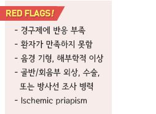
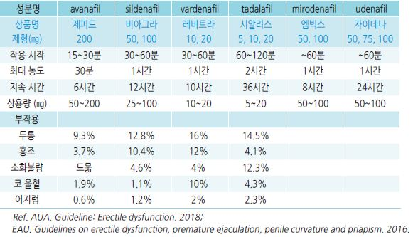
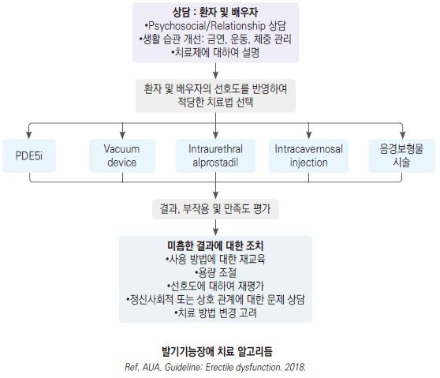
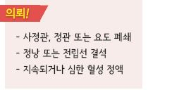

# 성기능장애 Sexual Dysfunction


## ￭ 발기기능장애 Erectile Dysfunction

* 만족스런 성관계 수행을 위해 충분한 발기를 반복적 또는 지속적으로 달성 또는 유지할 수 없음
* 기질적 및 정신적 원인에 의하며 두 가지 문제가 혼재될 수 있음
* 심혈관 질환의 clue sign일 수 있으며 특히 젊은 연령에서 발생 시 심장 문제 발생 가능성이 높음
* 유병률 : 40\~70세 남성의 ½ 이상; 연령이 증가할수록 증가

## 원인

* 발기 실패 : 심인성, 내분비성(예: testosterone, prolactin, 황체 호르몬 이상), 신경성(예: 척수 손상, 뇌졸중, 당뇨병신경병증)
* 혈액 충만 실패 : 동맥 부전
* 혈액량 유지 실패 : 정맥 폐쇄 부전
* 구조적 문제 : phimosis, lichen sclerosus

### 위험 인자

* 고령
* 흡연, 음주
* 비만, 활동 부족
* 지나친 활동이나 운동, 피로
* 우울, 불안, 분노, 스트레스
* 비뇨기계/골반/혈관 수술, 신경계 질환 또는 손상
* BPH, 심혈관 질환(예: 고혈압, 동맥 경화), 당뇨병, HDL 저하, 갑상선 질환
*   약물

    •항고혈압제 : (발기 저하 정도) β-차단제/이뇨제(thiazide)＞CCB/ACEI＞α-차단제

    •심혈관제, 항이상지질혈증제 : digoxin, gemfibrozil, clofibrate

    •정신성 약물 : SSRI, TCA/heterocyclics, MAOI, benzodiazepine, phenothiazine

    •H2-차단제 : cimetidine, ranitidine, famotidine

•호르몬 : progesterone, estrogen, steroid, 5α-reductase inhibitor

•cytotoxic agent : cyclophosphamide, methotrexate, interferon α-2a

•항콜린제 : disopyramide, oxybutynin, hyoscyamine

## 진단

병력

* 증상 지속 기간
* 이전의 발기 능력
* 아침, 자위, 파트너 등 상황에 따른 발기 상태
* 성욕
* 성적 혐오나 고통에 관한 개인적인 문제
* 성적 성향, 성별 정체성
* 파트너 문제(예: 성욕, 갱년기, 성교통)
* 사정 시간/통제, 오르가즘 장애
* 유발/관련 인자
* 동반 증상, 동반/기저 질환, 약물 복용력
* 이전 및 현재의 치료/대응 방법

### 감별

* 야간 또는 이른 아침 발기 가능, 상황에 따라 다름 → 심인성
* 건강염려증, 사별, 이혼, 불화, 경제적 문제가 있음 → 심인성
* 점차, 지속적으로 진행 → 기질성
* 성욕 감소 → 내분비 질환(예: prolactin↑, testosterone↓)
* 배뇨 장애 및 성교통 동반 → 요로 질환
* 당뇨병, 고혈압, 심혈관 질환, 이상지질혈증, 신경계 질환 및 약물 복용 → 기저 질환/약물
* 장, 방광, 전립선 또는 혈관 수술 병력 → 수술 후유 장애, 신경 손상

### 검사

*
  *   신체검사 : 혈압/맥박수, 하지 맥박, 복부 둘레, BMI, 직장수지검사(전립선, anal sphincter tone), genital reflex

      (cremasteric reflex, bulbocavernosus reflex, pudendal-evoked response)
* 실험실 검사 : 혈당, 지질, TFT, PSA, testosterone; 최근 1년 내 검사한 적이 없는 경우 고려
* 영상 검사 : doppler, angiogram, cavernosogram; 일반적으로 시행하지는 않음
* prostaglandin E1의 intracorporeal injection : 정상 혈관 상태에서는 발기됨

### 국제 발기 부전 지수 (International index of erectile function(IIEF-5) Questionnaire)

```

```

***

## Management

### 치료 방침

* 생활 중재
* 당뇨병, 고혈압, 이상지질혈증 등 기저 질환 치료 및 투여 중인 약물 조정
* 약물 치료 : 1차 선택제- PDE5i

## 비-약물 치료

* 금연, 음주 제한, 적정 체중 유지
* 적당한 활동, 규칙적 운동
* 스트레스 관리, 심리적 문제 치료
* 배우자 상담, 부부간의 소통/스킨십 향상

> ✽지중해식 식단 등 건강 식이가 성 기능 저하를 예방해 준다는 보고가 있음

> ✽30~~60분의 유산소 운동을 1주일에 3~~5회 시행하면 testosterone 이상의 효과가 있다는 메타분석 결과가 있음

## 약물 치료

### Phosphodiesterase-5 inhibitor (PDE5i)

* 기전 : intracavernosal cyclic guanosine monophosphate↑→ NO-induced vasodilation 연장
*   효과 : 원인에 관계없이 유효; 성욕에는 영향을 주지 않으므로 성적 자극이 필요하며 이 경우 55\~80%에서 유효;

    약제들 간의 유의미한 효과 차이는 없음(약동학적 차이 및 개인차가 있음)
* 용법 : 1일 1회 이내, 관계 1시간 전 복용; sildenafil, vardenafil은 공복 복용 시 최대 효과
*   부작용 : 두통, 어지럼, 저혈압, 안면 홍조, 위산역류, 코 울혈, 광과민(sildenafil, vardenafil), 하부 요통(tadalafil),

    음경강직; mirodenafil, udenafil, avanafil은 상대적으로 두통이 적음
*   주의/금기 : nitrate/nitroglycerin/α-차단제 복용, 심혈관 질환(부정맥, 저혈압, 악성 고혈압 포함), 간/신부전, 망막 질환,

    저혈량증

    • PDE5i 복용 24시간 내 nitrate 복용 금지(tadalafil은 48시간)
* 저용량 적용 대상 : 고령, 신부전, α-차단제 복용, CYP3A4 대사 약물 복용
*   고지방식과 과량의 알코올이 효과를 저해할 수 있음(tadalafil은 영향을 적게 받음)

    

### Testosterone

* hypogonadism 환자에서 적용; 정상 testosterone 상태에서는 효과 없음
* PDE5i와 병용 시 이에 대한 효과를 향상시킬 가능성이 있음
*   발생률 ＞1%인 부작용 : 부종, 식욕/체중↑, 여드름, estradiol↑, hypogonadism, 치은염, 미각/후각 변화, 설사,

    GERD, 안면 홍조, 고혈압, 기침, 호흡 곤란, 불면, 흥분, 적혈구↑, 혈소판↑, 요통, 두통, 어지럼, 피로, 오한,

    BPH, 전립선염, 사정 장애, 전립선암, 부착 부위 피부염
* 금기 : 전립선암, 유방암
*   모니터링 : 3개월 내 효과 없으면 중단. 최소 매년 효과/부작용 평가; testosterone, 발기 상태, 여성형유방증,

    수면무호흡증, 하부 요로 증상, BPH, 전립선암(PSA), 적혈구, LFT, 지질
* 용법 : 패취/겔 등 비-경구 장기 작용 testosterone(예: enanthate, cypionate) 투여
* \[테스토 겔] : 1% 50 ㎎/5g/p, 어깨, 팔, 복부 피부에 1일 1회 오전 5 g 도포

> ✽경구제는 간 독성 문제로 사용 안 함

### 기타

* trazodone : 일부 우울, 불안증 환자에서 효과
* prostaglandin E2(alprostadil) penile injection : 드물게 priapism, 섬유화, 통증/감염 부작용
* vacuum-assisted device : 효과적이나 사용상 불편함이 있음
* 보형물 삽입 : 효과적; 드물게 감염, 기계 고장 부작용
*   은행, 인삼, HCG, L-arginine : 증거 불충분으로 권하지 않음

    

> **질병코드** F52 기질성 장애나 질병에 의하지 않은 성기능장애

N48.4 기질적 원인에 의한 발기부전

##

## ￭ 사정장애 Ejaculatory dysfunction

* 자연적인 사정 반사 : 삽입 후 2\~5분에 사정 발생
*   감염 원인 가능성이 있는 경우 소변 검사/배양 검사, 사정관 폐쇄 가능성이 있는 경우 transrectal ultrasonography

    또는 pelvic MRI 고려

### 치료 방침

* 원인, 기저 질환 치료
* 복용 약물 확인 및 조정
* 발기 장애가 있는 경우 발기 장애를 치료
* 환자 및 배우자 상담, 부부간의 소통/스킨십 향상
* 안심시킴, 성공적 관계에 대한 강박감을 줄임

## 종류

### 조기사정 (Premature ejaculation)

* 정의 : 질 삽입 후 거의 항상 1분 이내에 사정이 되는 사정 반사 조절 능력 장애
* 유병률 : 미국 20\~30%
* 신체 검사는 정상; 진단을 위한 특이 검사는 없음
*   원인 : 음경 과민, 5-hydroxytryptamine 수용체 과민, 성적 과흥분, 드문 성관계, 성 매개 감염 공포,

    성관계에 대한 불안/죄의식, 프라이버시 결핍, 상호 부적응

#### 비-약물 치료

*   성관계 방법 교육 : 사정 전 여성 파트너의 움직임 중지, coronal squeeze technique(사정 욕구가 중지될 때까지

    glans penis를 꽉 쥠), start & stop technique(사정에 도달할 때 음경 자극을 중단, 사정 욕구가 중단되면 다시 자극)
* psychotherapy

#### 약물 치료

*   국소 마취제 도포 : 2.5% prilocaine/2.5% lidocaine \[엠라]; 관계 15\~30분 전 귀두 또는 음경 전체 도포,

    관계 직전 세척; 경험을 통하여 도포 부위, 도포 용량을 조정함
*   dapoxetine : 조루증 치료제로 허가

    • 부작용 : 어지럼, 두통, 구역, 불안, 불면, 졸음, 진전, 시야 흐림, 이명, 홍조, 다한증, 발기 부전, 혈압 상승

    • 금기 : 기립성 저혈압, 중증 간/심질환, 감정 장애, 유당 대사 장애, 최근 약물 복용력(CYP3A4 억제제, 항우울제,

    치오리다진, 세로토닌제), 여성, ＜18세, ≥65세

    • 용법 : 성관계 1~~2시간 전 30~~60 ㎎. 1일 1회 이내 복용 \[프릴리지]
*   TCA : 성관계 4시간 전 clomipramine 25\~50 ㎎, 1일 1회 이내 복용 \[그로민]

    • 부작용 : 어지럼, 졸음, 두통, 불면, 감정 이상, 성욕 변화, 소화불량, 진전, 다한증, 저혈압, 빈맥, 마비, 기억력 장애,

    피부염, 배뇨 곤란, 시야 흐림

    • 금기 : 일반적인 TCA 금기증, 심근경색, 심한 심장 질환, 녹내장, 감정 장애, 유당 장애, 심각한 저혈압,

    최근 항우울제 복용력, 여성, ＜18세, ≥65세
* SSRI : 성관계 4시간 전 복용; sertraline 50~~200 ㎎, fluoxetine 20~~40 ㎎ (☞ p. 1146)
* α1-adrenoceptor antagonist (☞ p. 1146)
* PDE5 inhibitor

### 지연사정 (Delayed ejaculation)

* 정의 : 자극, 발기 및 사정을 원하는 상태에도 불구하고 사정까지 30분 이상 지연되는 상태
*   원인 : 심인성, 성관계에 대한 불안, 약물(항우울제, α/β-차단제, thiazide, 항정신병제, opioid, 알코올),

    사정 시 통증 유발 질환(예: 전립선염, 정낭염)

#### 치료

* 항우울제를 복용하는 경우 영향이 적은 약물로 교체 : citalopram, fluvoxamine, nefazodone
* 항우울제 복용 환자에 대하여 bupropion, buspirone, yohimbine을 관계 전 복용
* amantadine, cyproheptadine : 일부 연구에서 효과

### 무사정 (Anejaculation)

* 정의 : bulbospongiosus muscle의 수축 또는 정액 방출 결핍
*   원인 : 후복막 림프절 절제, 척수 손상, 약물(α/β-차단제, benzodiazepine, 항우울제, 항정신병제, aminocaproic acid),

    당뇨병신경병증, radical prostatectomy, 선천성 기형(Müllerian duct cyst, Wolffian abnormality)
* 치료 : imipramine 25\~75 ㎎ bid \[이미프라민]

### 정액 역류증 (Retrograde ejaculation)

* 정의 : 방광으로의 정액 역류
*   원인 : (경요도)전립선 절제, 방광 경부 수술, 광범위 골반 수술, 후복막 림프절 절제, 당뇨병신경병증,

    약물(α-차단제, ganglion blocker, 항정신병제), 요도 협착

### 통증성 사정 (Painful ejaculation)

* 정의 : 사정 후 또는 사정 중 생식기 또는 회음부 통증
* 원인 : 감염/염증(예: 고환염, 부고환염, 전립선염, 요도염), 사정관 폐쇄, 정낭 결석, 정관 폐쇄, 심인성
* 치료 : α-차단제(일부에서 효과) (☞ p.668)

### 무쾌감증 (Ejaculatory anhedonia)

* 정의 : 오르가즘 또는 쾌감이 없는 정상 사정
* 원인 : 약물, 심인성, 호르몬 불균형, 성욕 감퇴

### 혈정액 (Hematospermia)

* 정의 : 사정액에 혈액이 존재
* 원인 : 감염, 염증, 결석(요로, 정낭, 전립선), 외음부 외상, 폐쇄, 낭종, 종양, 혈관 기형

> **질병코드** F52 기질성 장애나 질병에 의하지 않은 성기능장애

F53 달리 분류되지 않은 산후기의 정신 및 행동 장애

##

## ￭ 여성 성기능장애 Female sexual dysfunction

* 주요 성 기능 문제 : 성교통, 성욕 감소
* 건강한 여성에서 androgen 검사는 권하지 않음 (✽androgen 수준과 증상이 일치하지 않음)

### 원인 및 위험 인자

* 생식기계 문제 : 질 위축(폐경), 성교통, 질염, 자궁내막증
* 정신적 질환(예: 우울), 만성 질환(예: 당뇨병, 갑상선 질환), 약물(예: SSRI, 피임약)
* 정신적/육체적 스트레스, 흡연, 환경, 파트너 문제
* 성관계 기법 문제(예: 전희 부족)
* 원하지 않는 성관계
* 과거 성과 관련된 문제(예: 성폭력 피해)

### 치료

* 신체 질환 치료, 금연, 음주 교정을 포함한 위험 인자 교정
* 심리 치료
* 부부 상담, 성관계 기법에 대한 교육
* 국소 윤활제
* 국소 마취제 : 성교통 시 고려 (☞ p.710)
* estrogen : 국소제 선호; estradiol hemihydrate 0.1% \[에스트레바 겔] (☞ p.599)
* tibolone : estrogen/progesterone에 비해 성 기능 및 질 건조에 유효 \[리비알]
*   testosteron : 임상적으로 진단되는 폐경 후 성욕 감퇴/기능저하에 대하여 고려; 용량 비례 남성화 부작용.

    투여 중 주기적 s-testosterone 모니터링을 요함; 경피제로써 1회/월 적용
* TCA : amitriptyline 10 ㎎/d, 점차 증량
* 진경제 : gabapentin 300 ㎎ tid 점차 증량
* PDE5i : 일반적으로 효과 없음; 1형 당뇨병, 다발경화증, 척수 손상, 항우울제 관련 시 일부에서 유효
