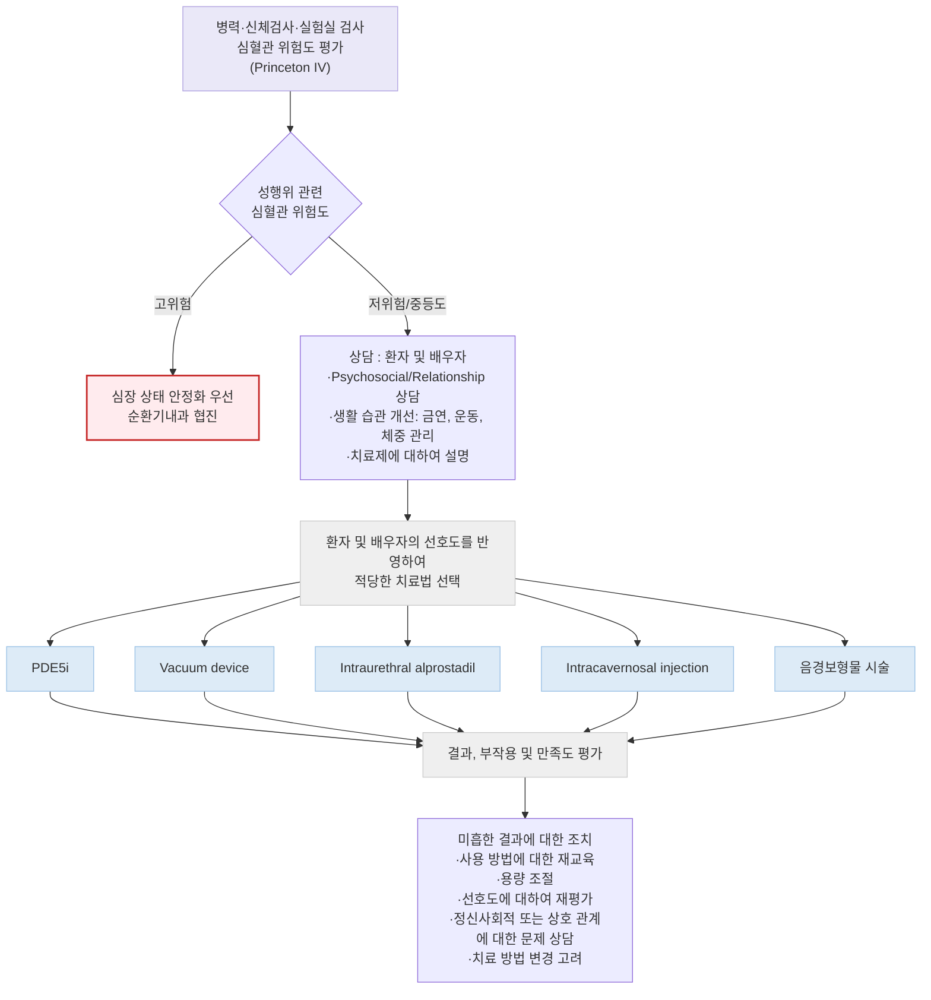

# 성기능장애 Sexual Dysfunction

***

## ￭ 발기기능장애 Erectile Dysfunction (ED)

### <mark style="color:green;">일반 사항</mark>

* 만족스런 성관계 수행을 위해 충분한 발기를 반복적 또는 지속적으로 달성 또는 유지할 수 없는 상태
* 정의 (AUA, 2018) : 성적 활동을 위해 충분한 발기를 얻거나 유지하지 못하는 상태가 지속되는 것
* 분류 : 기질성(organic), 심인성(psychogenic), 혼합성 — 실제로는 대부분 혼재
* 유병률 : 40\~70세 남성의 ½ 이상에서 어느 정도의 ED를 경험; 연령 증가에 따라 유병률 및 중증도 증가
* 심혈관 질환의 clue sign일 수 있음 — 음경 동맥(1\~2 mm)이 관상동맥보다 가늘어 전신 죽상경화증이 먼저 증상화되는 경우가 많음(“**window of opportunity**” 개념); 특히 젊은 연령에서 새로 발생한 ED는 심장 문제 발생 가능성이 높음을 시사


**Princeton IV Consensus (2024) — 성관계 관련 심혈관 위험도 분류**\
① 저위험 : 재관류 후 안정 상태, 조절된 무증상 고혈압, 경증 판막질환, NYHA I–II이며 5 METs 수행 가능\
② 중간/불명확 위험 : 안정형 경·중등도 협심증, 중재술 없이 MI 후 2–8주, NYHA III, PAD 또는 뇌졸중/TIA 병력\
③ 고위험 : 불안정/난치성 협심증, 조절되지 않는 고혈압, NYHA IV, 중재술 없이 MI 후 2주 미만, 고위험 부정맥 등 — 심장 상태 안정화 전까지 성행위 및 ED 치료 보류, 순환기내과 협진\
명백한 심혈관질환이나 심혈관 증상이 없는 혈관성 ED에서는 10년 ASCVD 위험도를 평가하며, ED 자체를 risk-enhancing factor로 간주한다. 계산된 위험이 낮음~중등도인 경우에도 CAC score를 이용한 추가 위험 재분류를 고려한다.


***

### <mark style="color:green;">원인 및 위험 인자</mark>

* 발기 실패(심인성/신경성/내분비성) : 심인성, 내분비성(예: testosterone↓, prolactin↑, 갑상선 이상), 신경성(예: 척수 손상, 뇌졸중, 당뇨병신경병증, 골반 수술 후 신경 손상)
* 혈액 충만 실패 : 동맥 부전(죽상경화증)
* 혈액량 유지 실패 : 정맥 폐쇄 부전(venous leak)
* 구조적 문제 : phimosis, Peyronie disease(음경 만곡), lichen sclerosus

#### <mark style="color:$primary;">위험 인자</mark>

* 고령
* 흡연, 과음
* 비만, 활동 부족
* 지나친 격렬한 운동, 과로
* 우울, 불안, 분노, 스트레스, 관계 갈등
* 비뇨기계/골반/혈관 수술, 신경계 질환 또는 손상
* BPH, 심혈관 질환(고혈압, 동맥경화), 당뇨병, 이상지질혈증(HDL↓), 갑상선 질환
* 약물 : SSRI/SNRI 및 일부 항정신병약, 5α-reductase inhibitor, 일부 β-차단제·thiazide, opioid, androgen deprivation therapy, spironolactone, 일부 항경련제, 알코올·기타 약물남용
  * ✽ ACEI/ARB, CCB는 성기능에 대체로 중립적이며 일부 ARB는 오히려 유리할 가능성이 있음; 약제 간 일률적인 서열 제시는 지양

### <mark style="color:green;">임상 양상</mark>

* 발기 개시 실패, 발기 유지 실패, 또는 발기 강도 저하 — 상황(아침/자위/파트너)에 따른 차이 유무를 확인하는 것이 심인성·기질성 감별에 중요
* 성욕 저하, 조루·지루 등 다른 사정 관련 증상이 동반될 수 있음
* 새로 발생한 ED에서 흉통, 운동 시 호흡곤란 등 심혈관 증상 동반 여부 확인 필요(☞ Princeton IV)

***

### <mark style="color:$danger;">🚩 Red Flags!</mark>

<mark style="color:$danger;">**즉각 조치 또는 의뢰**</mark>

* Ischemic priapism(허혈성 지속발기증) — 발기 4시간 이상 지속, 심한 음경통 동반 → 즉시 비뇨기과 응급 처치(허혈 시간이 길수록 해면체 조직 손상·영구적 발기부전 위험↑)
* 급성 신경학적 결손을 동반한 새로운 발기 이상(척수 손상·뇌졸중 의심)

<mark style="color:$warning;">**당일 또는 조기 의뢰**</mark>

* 음경 기형, Peyronie disease 등 해부학적 이상 의심 → 비뇨기과 의뢰
* 골반/회음부 외상, 수술, 또는 방사선 조사 병력 → 비뇨기과 의뢰
* 새로 발생한 ED이면서 심혈관 위험 인자가 많거나 흉통·호흡곤란 등 심혈관 증상 동반 → 심장 평가 우선(☞ Princeton IV 중간/고위험)
* 성욕 뚜렷한 저하 동반 → 내분비 평가(testosterone, prolactin, TFT)
* PDE5i 복용 후 갑작스러운 청력 저하·이명(돌발성 감각신경성 난청 의심) → 즉시 복용 중단, 이비인후과 의뢰

<mark style="color:$info;">**외래 추적 / 추가 평가 계획**</mark> <mark style="color:$info;">- 즉각 위험 낮으나 호전 없으면 의뢰</mark>

* PDE5i 등 1차 경구 치료에 반응이 부족하거나 환자·배우자가 만족하지 못하는 경우(적절한 용량·복용법·성적 자극 확인 후에도) → 비뇨기과/성의학 전문의 의뢰, 2차 치료 고려
* 심인성 요소가 뚜렷하나 상담·생활 중재에도 개선이 없는 경우 → 정신건강의학과/부부상담 의뢰

### <mark style="color:green;">진단</mark>

#### <mark style="color:$primary;">병력</mark>

* 증상 지속 기간, 발생 양상(급성/점진적)
* 이전의 발기 능력
* 아침, 자위, 파트너 등 상황에 따른 발기 상태
* 성욕
* 성적 혐오나 고통에 관한 개인적인 문제
* 성적 성향, 성별 정체성
* 파트너 문제(예: 성욕, 갱년기, 성교통)
* 사정 시간/통제, 오르가즘 장애
* 유발/관련 인자
* 동반 증상, 동반/기저 질환, 약물 복용력
* 이전 및 현재의 치료/대응 방법

#### <mark style="color:$primary;">감별</mark>

* 야간 또는 이른 아침 발기 가능, 상황에 따라 다름 → 심인성
* 건강염려증, 사별, 이혼, 불화, 경제적 문제가 있음 → 심인성
* 점차, 지속적으로 진행 → 기질성
* 성욕 감소 → 내분비 질환(예: prolactin↑, testosterone↓)
* 배뇨 장애 및 성교통 동반 → 요로 질환
* 당뇨병, 고혈압, 심혈관 질환, 이상지질혈증, 신경계 질환 및 약물 복용 → 기저 질환/약물
* 장, 방광, 전립선 또는 혈관 수술 병력 → 수술 후유 장애, 신경 손상

#### <mark style="color:$primary;">검사</mark>

* 신체검사 : 혈압/맥박수, 하지 맥박, 복부 둘레, BMI, 생식기 진찰; 직장수지검사 및 신경학적 진찰은 병력·증상에 따라 선택
* 기본 검사 : 공복혈당 또는 HbA1c, 지질, 아침 공복 total testosterone(최근 12개월 내 미시행 시)
* 선택 검사 : PSA, prolactin, LH/FSH, TFT, 혈청 크레아티닌, 간기능(AST/ALT) 등 — 병력·증상 및 testosterone 결과에 따라, 특히 PDE5i·testosterone 처방 전 신·간 기능 이상이 의심되면 확인
  * 아침 공복 total testosterone이 낮으면 별도의 날에 반복 측정하여 지속적 저하 여부를 확인
* 영상 검사 : penile duplex Doppler, angiography, cavernosography 등은 일반적으로 일상적으로 시행하지 않으며, 진단이 불명확하거나 1차 치료 실패·혈관 재건술 등 전문 치료를 고려할 때 선택
* prostaglandin E1 intracorporeal injection : 정상 혈관 상태에서는 발기됨(혈관성 원인 감별에 참고)

#### <mark style="color:$primary;">국제 발기 부전 지수 (International Index of Erectile Function-5, IIEF-5)</mark>

<table data-header-hidden><thead><tr><th width="247"></th><th width="100"></th><th width="100"></th><th width="100"></th><th width="100"></th><th width="100"></th></tr></thead><tbody><tr><td><strong>문항</strong></td><td><strong>1점</strong></td><td><strong>2점</strong></td><td><strong>3점</strong></td><td><strong>4점</strong></td><td><strong>5점</strong></td></tr><tr><td>① 발기가 되고 유지되는 것에 있어 당신의 자신감은 얼마나 되는가?</td><td>매우 낮다</td><td>낮다</td><td>그저 그렇다</td><td>높다</td><td>매우 높다</td></tr><tr><td>② 성적 자극으로 발기되었을 때 성교가 가능할 정도의 충분한 발기가 몇 번이나 있었는가?</td><td>거의 없거나 한 번도 없음</td><td>가끔씩(총 횟수의 ½에 훨씬 미달)</td><td>때때로(총 횟수의 ½ 정도)</td><td>대부분(총 횟수의 ½을 훨씬 넘음)</td><td>항상 또는 거의 항상</td></tr><tr><td>③ 성관계에서 삽입 후 발기 상태가 유지된 적이 몇 번이나 있었는가?</td><td>거의 없거나 한 번도 없음</td><td>가끔씩(총 횟수의 ½에 훨씬 미달)</td><td>때때로(총 횟수의 ½ 정도)</td><td>대부분(총 횟수의 ½을 훨씬 넘음)</td><td>항상 또는 거의 항상</td></tr><tr><td>④ 성관계를 마칠 때까지 발기 상태를 유지하는 것은 얼마나 어려웠는가?</td><td>극도로 어려움</td><td>매우 어려움</td><td>어려움</td><td>약간 어려움</td><td>전혀 어렵지 않음</td></tr><tr><td>⑤ 성관계에서 만족감을 느낀 적이 얼마나 되는가?</td><td>거의 없거나 한 번도 없음</td><td>가끔씩(총 횟수의 ½에 훨씬 미달)</td><td>때때로(총 횟수의 ½ 정도)</td><td>대부분(총 횟수의 ½을 훨씬 넘음)</td><td>항상 또는 거의 항상</td></tr></tbody></table>

* 채점 : 성관계를 한 적이 없는 경우 해당 항목 0점 배점 ▶ 판정 : 25\~22점=정상, 21\~17점=경증, 16\~12점=경-중등증, 11\~8점=중등증, 7\~1점=중증
* ✽ 최근 성적으로 비활동적이었던 환자에서는 0점 항목 때문에 총점이 실제 발기능보다 낮게 평가될 수 있으므로 점수만으로 중증도를 판정하지 않는다

***


```mermaid
flowchart TD
    A["병력·신체검사·실험실 검사<br>심혈관 위험도 평가(Princeton IV)"] --> B{"성행위 관련<br>심혈관 위험도"}
    B -->|고위험| B1["심장 상태 안정화 우선<br>순환기내과 협진"]
    B -->|저위험/중등도| C["상담 : 환자 및 배우자<br>·Psychosocial/Relationship 상담<br>·생활 습관 개선: 금연, 운동, 체중 관리<br>·치료제에 대하여 설명"]

    C --> D["환자 및 배우자의 선호도를 반영하여<br>적당한 치료법 선택"]

    D --> E1["PDE5i"]
    D --> E2["Vacuum device"]
    D --> E3["Intraurethral alprostadil"]
    D --> E4["Intracavernosal injection"]
    D --> E5["음경보형물 시술"]

    E1 --> F["결과, 부작용 및 만족도 평가"]
    E2 --> F
    E3 --> F
    E4 --> F
    E5 --> F

    F --> G["미흡한 결과에 대한 조치<br>·사용 방법에 대한 재교육<br>·용량 조절<br>·선호도에 대하여 재평가<br>·정신사회적 또는 상호 관계에 대한 문제 상담<br>·치료 방법 변경 고려"]

    style B1 fill:#ffebee,stroke:#c62828,stroke-width:2px
    style A fill:#EAE8F8,stroke:#B0A3E0
    style D fill:#EFEFEF,stroke:#CCCCCC
    style F fill:#EFEFEF,stroke:#CCCCCC
    style E1 fill:#DDEBF7,stroke:#9BC2E6
    style E2 fill:#DDEBF7,stroke:#9BC2E6
    style E3 fill:#DDEBF7,stroke:#9BC2E6
    style E4 fill:#DDEBF7,stroke:#9BC2E6
    style E5 fill:#DDEBF7,stroke:#9BC2E6
```

<p align="center"><strong>발기기능장애 진단 및 치료 알고리듬</strong></p>

<p align="center"><em><mark style="color:$info;">Ref. AUA. Guideline: Erectile Dysfunction (2018); Princeton IV Consensus (2024)</mark></em></p>

***

### <mark style="background-color:$warning;">Management</mark>

#### <mark style="color:$primary;">치료 방침</mark>

* 성행위 관련 심혈관 위험도 우선 평가(☞ Princeton IV) — 고위험군은 심장 상태 안정화 전까지 치료 보류
* 생활 중재(금연, 절주, 체중 관리, 규칙적 운동)를 모든 환자에게 우선 권고
* 당뇨병, 고혈압, 이상지질혈증 등 기저 질환 치료 및 원인 의심 약물 조정·교체 검토
* 1차 약물 치료 : PDE5i — 원인에 관계없이 우선 고려
* 심리적 요인이 뚜렷한 경우 상담·부부치료 병행
* ✽ PDE5i 무반응 판정 전 확인 : 최대 허용 용량, 적절한 timing/공복 조건, 충분한 성적 자극 하에 4\~8회 이상 시도했는지 확인 — 상당수는 복용법 재교육만으로 반응이 회복됨

***

### <mark style="color:green;">비-약물 치료 및 예방</mark>

* 금연, 음주 제한, 적정 체중 유지
* 적당한 활동, 규칙적 유산소 운동
* 스트레스 관리, 심리적 문제(우울·불안) 치료
* 배우자 상담, 부부간의 소통/스킨십 향상
* 지중해식 식단, DASH 식단 등 심혈관 건강에 유익한 식이가 성기능 저하 예방에도 도움이 된다는 관찰 연구 보고가 있음
* 30\~60분의 유산소 운동을 1주일에 3\~5회 시행 시 위약 대비 유의한 발기기능 개선 효과가 있다는 메타분석 결과가 있음

### <mark style="color:green;">약물 치료</mark>

#### <mark style="color:$primary;">Phosphodiesterase-5 inhibitor (PDE5i)</mark>

* 기전 : intracavernosal cyclic guanosine monophosphate↑ → NO-induced vasodilation 연장
* 효과 : 원인에 관계없이 유효; 성욕에는 영향을 주지 않으므로 성적 자극이 필요하며 이 경우 55\~80%에서 유효; 약제 간 유의미한 효과 차이는 없음(약동학적 차이 및 개인차 있음)
* 용법 : 1일 1회 이내, 관계 1시간 전 복용; sildenafil, vardenafil은 공복 복용 시 최대 효과
* 부작용 : 두통, 어지럼, 저혈압, 안면 홍조, 위산역류, 코 울혈, 일시적 시각 이상·청색시(sildenafil, vardenafil), 하부 요통(tadalafil), 매우 드물게 지속발기증(priapism); mirodenafil, udenafil은 상대적으로 두통이 적음


**⚠️ Nitrate 병용 절대 금기**\
PDE5i 복용 24시간 이내 nitrate/nitroglycerin 복용 금지(tadalafil은 반감기가 길어 48시간). 저혈압·심혈관 허탈 위험. α-차단제와 병용할 때는 α-차단제 치료가 안정된 상태에서 낮은 PDE5i 용량부터 시작하고 어지럼·기립성 저혈압을 관찰하며, 특히 doxazosin/terazosin 등 비선택적 α-차단제에서 주의.


* 주의/금기 : nitrate/nitroglycerin 병용은 절대 금기. 저혈압, 조절되지 않는 고혈압, 불안정 심혈관 질환, 중증 간/신기능 장애, 비동맥성 전방허혈시신경병증(NAION) 병력 등에서는 개별 약제의 허가사항에 따라 주의/금기 여부를 확인
* 저용량 적용 대상 : 고령, 신부전, α-차단제 병용, CYP3A4 억제제 병용
* 고지방식과 과량의 알코올이 흡수·효과를 저해할 수 있음(tadalafil은 영향을 적게 받음)

<table data-header-hidden data-search="false"><thead><tr><th></th><th width="106"></th><th width="97"></th><th width="95"></th><th width="97"></th><th width="105"></th></tr></thead><tbody><tr><td><strong>성분명</strong></td><td><strong>sildenafil</strong></td><td><strong>vardenafil</strong></td><td><strong>tadalafil</strong></td><td><strong>mirodenafil</strong></td><td><strong>udenafil</strong></td></tr><tr><td><strong>상품명</strong></td><td><mark style="color:blue;">\[비아그라]</mark></td><td><mark style="color:blue;">\[레비트라]</mark></td><td><mark style="color:blue;">\[시알리스]</mark></td><td><mark style="color:blue;">\[엠빅스]</mark></td><td><mark style="color:blue;">\[자이데나]</mark></td></tr><tr><td><strong>제형(㎎)</strong></td><td>50, 100</td><td>10, 20</td><td>5, 10, 20</td><td>50, 100</td><td>50, 75, 100</td></tr><tr><td><strong>작용 시작</strong></td><td>30\~60분</td><td>30\~60분</td><td>60\~120분</td><td>\~60분</td><td>\~60분</td></tr><tr><td><strong>최대 농도 도달 시간</strong></td><td>1시간</td><td>1시간</td><td>2시간</td><td>1시간</td><td>1시간</td></tr><tr><td><strong>지속 시간</strong></td><td>12시간</td><td>10시간</td><td>36시간</td><td>8시간</td><td>24시간</td></tr><tr><td><strong>상용량(㎎)</strong></td><td>25\~100</td><td>10\~20</td><td>5\~20</td><td>50\~100</td><td>50\~100</td></tr><tr><td><strong>두통(%)</strong></td><td>12.8</td><td>16</td><td>14.5</td><td>—</td><td>—</td></tr><tr><td><strong>홍조(%)</strong></td><td>10.4</td><td>12</td><td>4.1</td><td>—</td><td>—</td></tr><tr><td><strong>소화불량(%)</strong></td><td>4.6</td><td>4</td><td>12.3</td><td>—</td><td>—</td></tr><tr><td><strong>코 울혈(%)</strong></td><td>1.1</td><td>10</td><td>4.3</td><td>—</td><td>—</td></tr><tr><td><strong>어지럼(%)</strong></td><td>1.2</td><td>2</td><td>2.3</td><td>—</td><td>—</td></tr></tbody></table>

✽avanafil <mark style="color:blue;">\[제피드]</mark>은 2025년 국내 제조사가 원료 수급 문제로 품목허가를 자진취하하여 현재 국내에 유통되지 않음(2026년 기준)\
✽제네릭(성분명 처방) sildenafil·tadalafil이 다수 유통되어 저비용 대안으로 활용 가능; 정품·제네릭 간 생동성은 확인되어 있으나 환자에게 사전 설명 권장

#### <mark style="color:$primary;">Testosterone</mark>

* Hypogonadism(testosterone deficiency) 환자에서 적용; 정상 testosterone 상태에서는 효과 없음
* PDE5i와 병용 시 PDE5i 효과를 향상시킬 가능성이 있음(특히 PDE5i 단독 무반응 + 낮은 testosterone 조합)


**Testosterone 치료의 심혈관 안전성 (TRAVERSE trial, NEJM 2023)**\
과거 testosterone 제제의 심혈관 위험 증가 우려가 있었으나, 심혈관 위험이 높은 hypogonadism 남성 대상 대규모 RCT(TRAVERSE, 2023)에서 testosterone 치료가 위약 대비 주요 심혈관 사건(MACE) 발생을 유의하게 증가시키지 않음이 확인됨. 다만 심방세동, 급성 신손상, 폐색전증 발생은 다소 증가하여 개별 위험-이익 평가는 여전히 필요함.


* 발생률 ＞1%인 부작용 : 부종, 식욕/체중↑, 여드름, estradiol↑, 여성형유방증, 치은염, 미각/후각 변화, 설사, GERD, 안면 홍조, 고혈압, 기침, 호흡 곤란, 불면, 흥분, 적혈구↑, 혈소판↑, 요통, 두통, 어지럼, 피로, 오한, BPH, 전립선염, 사정 장애, 전립선암 위험 관련 논란, 부착 부위 피부염
* 치료 전 평가 : 40세 이상에서는 PSA 측정. PSA 4.0 ng/mL 초과 또는 전립선암 고위험군에서 3.0 ng/mL 초과 시(Endocrine Society 기준) 비뇨의학적 평가 후 치료 여부 결정; 직장수지검사 이상 소견도 전문 평가
* 금기/주의 : 활동성 전립선암·남성 유방암, 향후 가임력 유지 희망 시 외인성 testosterone을 투여하지 않음. 치료 전 hematocrit가 >50%이면 원인을 평가하고 치료 보류를 고려하며, 치료 중 Hct ≥54%이면 감량·일시 중단 등 intervention이 필요. 조절되지 않는 심부전 또는 최근 중대한 심혈관 사건에서는 개별 위험을 평가한 후 치료
* 모니터링 : 치료 반응과 이상반응을 정기 평가; testosterone 수치, 증상/발기 상태, hematocrit, PSA 및 전립선 관련 증상, 여성형유방증, 수면무호흡증, 하부요로증상 등을 환자 위험도에 따라 추적. 적절한 치료에도 임상적 이득이 없으면 지속 여부를 재평가
* 용법 : 국내에서는 비강 겔 제형과 근육 주사제(장기 작용형) 두 경로가 사용 가능; 경피 겔 제형(2%)은 제조사 사정으로 국내 공급이 중단되었고(2026년 기준), 패취 제형과 경구제도 부작용·간독성 문제 등으로 국내 생산이 중단됨
* testosterone nasal gel <mark style="color:blue;">\[나테스토나잘겔]</mark> : 1회 분무 시 5.5 ㎎ 분출; 시작 용량 1일 2회, 양쪽 비공에 각 1회씩 분무(1일 총 22 ㎎); 치료 시작 후 혈청 testosterone이 300 ng/dL 미만이면 1일 3회(1일 총 33 ㎎)로 증량 가능; 반드시 펌프를 끝까지 눌러 정량이 분무되도록 교육
  * ✽ 1일 2회 투여 시 최소 6시간 간격, 1일 3회 투여 시 약 6\~8시간 간격으로 투여
* testosterone undecanoate <mark style="color:blue;">\[네비도]</mark> : 근육 주사; 초회 투여 후 6주째 2회차 투여, 이후 10\~14주 간격 유지 — 비강 겔 사용이 번거롭거나 안정적 혈중 농도를 선호하는 경우 고려
* ✽ testosterone 경피 겔(예: 2% 제형)은 국가에 따라 여전히 사용되는 경우가 있으나, 이는 국내 유통 현황과는 무관함

#### <mark style="color:$primary;">기타</mark>

* prostaglandin E1(alprostadil) penile injection : 효과적이나 드물게 priapism, 섬유화, 통증/감염 부작용
* vacuum-assisted device : 효과적이나 사용상 불편함이 있음
* 음경보형물 삽입술 : 다른 치료에 반응 없는 경우 효과적; 드물게 감염, 기계 고장 부작용
* 은행잎추출물, 인삼, HCG, L-arginine 등 보조요법 : 근거 불충분으로 일상적으로 권하지 않음

***

### <mark style="color:red;">질병코드</mark>

F52.2 기질성 장애나 질병에 의하지 않은 성적 반응의 실패(심인성 발기부전)

N48.4 기질적 원인에 의한 발기부전

***

### <mark style="color:purple;">처방례</mark>

> **처방례 1. 경증\~중등증, 심혈관 위험 낮음**
>
> ```
> 비아그라 50 ㎎/T   1T   관계 1시간 전 필요시
> ```
>
> _✽ 최대 효과를 위해 공복 상태에서 복용; 반응에 따라 25\~100 ㎎으로 조절. Nitrate 복용 여부를 반드시 확인_

> **처방례 2. 고령 또는 α-차단제 병용 중**
>
> ```
> 자이데나 50 ㎎/T   1T   관계 1시간 전 필요시
> ```
>
> _✽ α-blocker 치료가 안정된 상태에서 낮은 PDE5i 용량부터 시작하고 어지럼·기립성 저혈압을 관찰. 특히 doxazosin/terazosin 등 비선택적 α-blocker에서 주의_

> **처방례 3. 성관계 빈도가 높거나 계획적 관계 선호**
>
> ```
> 시알리스 5 ㎎/T   1T   1일 1회 매일 복용
> ```
>
> _✽ 저용량 매일 복용법(daily dosing)은 성관계 시점에 구애받지 않는 장점이 있으며 하부요로증상 동반 시에도 도움; 신기능에 따라 용량 조절_

> **처방례 4. PDE5i 무반응 또는 낮은 testosterone 동반**
>
> ```
> 나테스토나잘겔  1회 분무(5.5 ㎎)  양쪽 비공 각 1회, 1일 2회(1일 22 ㎎)
> 시알리스 5 ㎎/T   1T   1일 1회
> ```
>
> _✽ 증상과 함께 반복 측정한 아침 공복 testosterone 저하로 hypogonadism을 확인한 후 병용. PSA 기준(4.0 ng/mL, 고위험군 3.0 ng/mL) 초과 시 비뇨의학과 선평가. 3개월 후 효과·부작용 재평가; 가임력 계획, hematocrit, 전립선 관련 위험 등을 함께 평가_

***

### <mark style="color:$success;">핵심 복약 지도</mark>

> **PDE5i 복용 방법**
>
> * 관계 예정 시각 기준 1시간 전(vardenafil·sildenafil은 공복이 이상적) 복용하도록 안내
> * 성적 자극이 있어야 효과가 나타나는 약물임을 설명(약을 먹으면 저절로 발기되는 것이 아님)
> * 하루 1회를 초과해서 복용하지 않도록 안내

> **Nitrate 병용 금기 — 반드시 확인**
>
> * 협심증으로 nitrate(니트로글리세린 설하정 포함)를 복용 중이거나 처방받을 가능성이 있는 환자에게는 처방하지 않음
> * 이미 PDE5i를 복용한 경우 24시간(tadalafil 48시간) 이내 nitrate 사용 금지 — 응급실에서도 반드시 고지하도록 환자 교육

> **나테스토나잘겔(비강) 사용 시 주의**
>
> * 처음 사용하는 용기는 사용 전 10회 공분무(priming)하고, 매 투여 시 펌프를 끝까지 눌러 1회 5.5 ㎎이 정량 분무되도록 안내
> * 사용 후 분무기 팁을 마른 휴지로 닦도록 안내
> * 다른 비강내 투여 약물과의 병용은 원칙적으로 권장되지 않음(자료 부족); 예외적으로 비충혈제거제 oxymetazoline은 나테스토 투여 30분 전 사용 시 testosterone 흡수에 임상적으로 의미 있는 영향이 없었다는 자료가 있음
> * 경피 겔과 달리 타인에게 옮겨질 위험은 낮으나, 코 자극감·콧물·비출혈이 흔한 부작용임을 미리 설명

> **언제 다시 병원을 방문해야 하나요?**
>
> * 발기가 **4시간 이상 지속**되는 경우(priapism 의심) — 즉시 응급실 내원
> * PDE5i 복용 후 갑작스러운 시력 저하, 흉통이 발생하는 경우 — 즉시 내원
> * PDE5i 복용 후 갑작스러운 청력 저하·이명이 발생하는 경우(돌발성 감각신경성 난청 의심) — 즉시 복용 중단 및 이비인후과 내원
> * 적절한 용량으로 4\~8주 이상 사용해도 효과가 없는 경우

***

### <mark style="color:blue;">환자 안내서</mark>


**발기부전, 흔하고 치료 가능한 질환입니다**

발기부전은 나이가 들면서 흔히 겪을 수 있는 문제이며, 원인을 확인하고 적절히 치료하면 대부분 호전됩니다. 특히 새로 생긴 발기 문제는 심장 혈관 건강의 신호일 수 있어 함께 점검하는 것이 중요합니다.


#### <mark style="color:$primary;">왜 발기부전이 생기나요?</mark>

* 발기는 신경, 혈관, 호르몬이 함께 작용하는 과정으로, 당뇨병·고혈압·동맥경화·흡연 등은 음경 혈관에 영향을 주어 발기를 어렵게 만들 수 있습니다.
* 스트레스, 우울, 관계의 어려움 같은 심리적 요인도 큰 원인이 됩니다.
* 복용 중인 혈압약, 항우울제 등이 원인이 되기도 하므로 임의로 중단하지 말고 의사와 상의하십시오.

#### <mark style="color:$primary;">일상생활에서 어떻게 관리하나요?</mark>

* **금연하십시오.** 흡연은 음경 혈관을 손상시키는 대표적 원인입니다.
* **규칙적으로 운동하십시오.** 주 3\~5회, 30\~60분의 유산소 운동이 도움이 됩니다.
* **적정 체중과 혈당·혈압·콜레스테롤을 관리하십시오.**
* **배우자와 솔직하게 대화하십시오.** 성기능 문제는 흔한 일이며, 함께 해결책을 찾는 것이 회복에 도움이 됩니다.

#### <mark style="color:$primary;">약은 어떻게 써야 하나요?</mark>

* PDE5i(비아그라, 시알리스 등)는 성적 자극이 있을 때 효과를 나타내는 약으로, 관계 약 1시간 전에 복용하십시오.
* **협심증 약(니트로글리세린 등)을 복용 중이라면 이 약을 절대 함께 사용하지 마십시오.** 심한 혈압 저하가 발생할 수 있습니다.

#### <mark style="color:$primary;">이럴 때는 즉시 병원을 방문하세요</mark>

* 발기가 4시간 넘게 가라앉지 않는 경우
* 약 복용 후 가슴 통증, 갑작스런 시력 변화, 또는 갑작스런 청력 저하나 귀 울림이 생긴 경우

***

## ￭ 사정장애 Ejaculatory Dysfunction

### <mark style="color:green;">일반 사항</mark>

* 사정 반사 : 질내 삽입 후 사정까지의 시간(IELT)은 개인차가 매우 크며, 시간 자체보다 사정 조절 능력과 이로 인한 개인·파트너의 고통 여부가 임상적으로 중요
* 진단 (AUA/SMSNA Disorders of Ejaculation Guideline, 2022) : 사정 관련 문제는 크게 조기사정, 지연사정/무사정, 역행성사정, 통증성사정, 무쾌감증, 혈정액으로 구분

<table><thead><tr><th width="125">아형</th><th width="220">핵심 특징</th><th>주된 접근</th></tr></thead><tbody><tr><td>조기사정</td><td>사정 반사 조절 능력 저하, 삽입 후 매우 짧은 잠복기</td><td>행동 요법, 국소 마취제, dapoxetine/SSRI</td></tr><tr><td>지연사정</td><td>충분한 자극에도 사정이 현저히 지연되거나 도달하지 못함</td><td>원인 약물 조정, 정신적 요인 평가</td></tr><tr><td>무사정</td><td>사정 자체가 없음(오르가즘은 있을 수 있음)</td><td>원인 질환·신경 손상 평가</td></tr><tr><td>정액 역류증</td><td>정액이 방광으로 역류</td><td>수술·신경병증 병력 확인, 불임 상담</td></tr><tr><td>통증성 사정</td><td>사정 시/후 생식기·회음부 통증</td><td>감염/염증 감별 및 치료</td></tr><tr><td>혈정액</td><td>정액 내 혈액</td><td>대개 자연 소실, 반복/지속 시 정밀 평가</td></tr></tbody></table>

***

### <mark style="color:orange;">조기사정 (Premature Ejaculation, PE)</mark>

#### <mark style="color:$primary;">정의 및 역학</mark>

* 정의 (AUA/SMSNA, 2022; ISSM 2014) : 선천성(lifelong) PE — 성경험 초기부터 삽입 후 약 1\~2분 이내 사정, 조절 능력 상실, 이로 인한 고통이 지속되는 상태; 후천성(acquired) PE — 이전에는 정상이었으나 사정 잠복시간이 뚜렷이 짧아지고(대개 2\~3분 이내 또는 50% 이상 단축) 고통을 동반
* 유병률 : 자가 보고 기준 남성의 20\~30%(엄격한 임상 정의 적용 시 약 5% 내외로 낮아짐)
* 신체 검사는 대개 정상; 진단을 위한 특이적 검사는 없음(병력 기반 진단)

#### <mark style="color:$primary;">원인</mark>

* 음경 감각 과민, 5-hydroxytryptamine(세로토닌) 수용체 기능 이상(특히 선천성 PE에서 중추성 세로토닌 조절 이상 가설)
* 성적 과흥분, 드문 성관계
* 성 매개 감염에 대한 두려움, 성관계에 대한 불안/죄의식
* 프라이버시 결핍, 파트너와의 상호 부적응
* 후천성 PE에서는 전립선염, 갑상선기능항진증, 발기부전(발기 소실에 대한 불안으로 서두르는 경우) 동반 여부 확인

#### <mark style="color:$primary;">비-약물 치료</mark>

* 성관계 방법 교육
  * stop-start technique : 사정 욕구가 강해지면 자극을 중단, 욕구가 가라앉으면 재개
  * coronal squeeze technique : 사정 욕구가 사라질 때까지 glans penis(귀두관)를 꽉 쥠
  * 사정 전 여성 파트너의 움직임 중지
* 골반저근 운동(pelvic floor exercise) — 일부 연구에서 사정 조절력 개선 보고
* psychotherapy, 부부 상담 — 불안 기반 PE에 특히 유용

#### <mark style="color:$primary;">약물 치료</mark>

* 국소 마취제 도포 : 2.5% prilocaine/2.5% lidocaine <mark style="color:blue;">\[엠라]</mark>; 관계 15\~30분 전 귀두 또는 음경 전체 도포, 관계 직전 세척; 도포 부위·용량은 경험을 통해 조정. 빠른 효과가 장점이나 도포 부위 감각 저하, 콘돔 미사용 시 파트너에게 전이되어 파트너의 감각 저하를 유발할 수 있음을 사전 설명
* dapoxetine <mark style="color:blue;">\[프릴리지]</mark> : 조루증 치료제로 국내 허가된 유일한 on-demand 경구제
  * 용법 : 성관계 1\~3시간 전 30\~60 ㎎, 1일 1회 이내 복용
  * 부작용 : 어지럼, 두통, 구역, 불안, 불면, 졸음, 진전, 시야 흐림, 이명, 홍조, 다한증, 발기부전, 혈압 상승(기립성 저혈압 포함)
  * 금기 : 기립성 저혈압, 중등도\~중증 간장애(Child-Pugh Class B/C), 중증 신장애, 양극성장애 등 감정 장애, 유당 대사 장애, 강력한 CYP3A4 억제제(ketoconazole, ritonavir 등)·MAO 억제제·다른 항우울제·티오리다진·세로토닌제 병용, 여성, ＜18세, ≥65세
* TCA : clomipramine 25\~50 ㎎, 관계 4시간 전 1일 1회 이내 복용 <mark style="color:blue;">\[그로민]</mark>
  * 부작용 : 어지럼, 졸음, 두통, 불면, 감정 이상, 성욕 변화, 소화불량, 진전, 다한증, 저혈압, 빈맥, 마비, 기억력 장애, 피부염, 배뇨 곤란, 시야 흐림
  * 금기 : 일반적인 TCA 금기증, 심근경색, 심한 심장 질환·중증 부정맥, 녹내장, 전립선비대(배뇨 장애 악화 가능), 감정 장애, 유당 장애, 심각한 저혈압, 최근 항우울제 복용력, 여성, ＜18세, ≥65세
* SSRI(off-label) : sertraline, paroxetine, fluoxetine 등은 매일 투여(daily regimen)의 근거가 더 확립되어 있음; on-demand 투여도 가능하나 효과는 상대적으로 낮을 수 있음. 부작용은 성욕 저하, 발기부전, 체중 증가, 불면 등이며, 국내에서는 조루증에 대해 허가 외(off-label) 사용에 해당하므로 처방 전 환자 설명 및 동의가 필요 (☞ 항우울제)
* α1-adrenoceptor antagonist (☞ 하부요로증상 약제) — 일부 병용 효과 보고
* PDE5 inhibitor — 발기부전 동반 시 병용 고려
* tramadol : 일부 연구에서 사정 지연 효과가 보고되나, 오남용·의존 위험 및 다른 세로토닌성 약물과의 병용 시 세로토닌 증후군 위험이 있어 1차 치료로는 권장하지 않음


**시술적 치료에 대한 주의**\
Dorsal neurectomy, 히알루론산을 이용한 glans penis augmentation(귀두 확대술) 등이 일부 국가(특히 아시아권)에서 시행되고 있으나, ISSM 가이드라인(2014)은 근거 부족과 영구적 성기능 손상 가능성을 이유로 이러한 시술적 치료를 권장하지 않는다. 약물·행동치료에 반응하지 않는 경우 비뇨의학과/성의학 전문의 의뢰를 우선한다.


***

### <mark style="color:orange;">지연사정 (Delayed Ejaculation, DE)</mark>

* 정의 : 충분한 성적 자극에도 원하는 것보다 사정이 현저히 지연되거나 사정에 도달하지 못하는 상태
* 원인 : 심인성(성관계 불안 등), 약물(항우울제 특히 SSRI, α/β-차단제, thiazide, 항정신병제, opioid, 알코올), 사정 시 통증을 유발하는 질환(전립선염, 정낭염), 당뇨병신경병증, 척수 손상
* 치료 : 원인 약물(특히 SSRI/SNRI, opioid 등)의 감량·중단·교체 가능성을 평가하고 심리·관계·성적 자극 패턴을 교정
  * 약물 치료는 근거가 제한적이며 bupropion, buspirone, amantadine, cyproheptadine 등이 소규모 연구에서 사용되었으나 표준치료로 확립되지 않음

### <mark style="color:orange;">기타 사정 장애</mark>

#### <mark style="color:$primary;">무사정 (Anejaculation)</mark>

* 정의 : bulbospongiosus muscle 수축 또는 정액 방출 결핍으로 사정이 전혀 일어나지 않는 상태
* 원인 : 후복막 림프절 절제술, 척수 손상, 약물(α/β-차단제, benzodiazepine, 항우울제, 항정신병제, aminocaproic acid), 당뇨병신경병증, radical prostatectomy, 선천성 기형(Müllerian duct cyst, Wolffian 이상)
* 치료 : 약물 유발성인 경우 원인 약물 조정. 신경학적 무사정이거나 임신을 원하는 경우 비뇨의학과/남성난임 전문의 의뢰 — penile vibratory stimulation, electroejaculation, 또는 수술적 정자 채취 고려

#### <mark style="color:$primary;">정액 역류증 (Retrograde Ejaculation)</mark>

* 정의 : 방광 경부가 제대로 닫히지 않아 정액이 방광으로 역류
* 원인 : (경요도)전립선 절제술, 방광경부 수술, 광범위 골반 수술, 후복막 림프절 절제, 당뇨병신경병증, 약물(α-차단제, ganglion blocker, 항정신병제), 요도 협착
* 감별을 위해 사정 직후 소변 검사에서 정자 확인; 임신 계획이 있는 경우 비뇨의학과 의뢰

#### <mark style="color:$primary;">통증성 사정 (Painful Ejaculation)</mark>

* 정의 : 사정 후 또는 사정 중 생식기 또는 회음부 통증
* 원인 : 감염/염증(고환염, 부고환염, 전립선염, 요도염), 사정관 폐쇄, 정낭 결석, 정관 폐쇄, 심인성
* 치료 : 원인 감염/염증 치료; α-차단제가 일부 환자에서 증상 완화에 도움

#### <mark style="color:$primary;">무쾌감증 (Ejaculatory Anhedonia)</mark>

* 정의 : 사정은 정상적으로 일어나나 오르가즘이나 쾌감이 동반되지 않는 상태
* 원인 : 약물(항우울제 등), 심인성, 호르몬 불균형, 성욕 감퇴 — 원인 평가 후 해당 원인 치료

#### <mark style="color:$primary;">혈정액 (Hematospermia)</mark>

* 정의 : 사정액에 육안적 또는 현미경적 혈액이 존재
* 원인 : 감염, 염증, 결석(요로·정낭·전립선), 외음부 외상, 폐쇄, 낭종, 종양, 혈관 기형; 40세 미만·단발성인 경우 대개 양성이며 자연 소실
* 접근 : 요검사/배양 검사(감염 감별), 40세 이상이거나 반복·지속되는 경우, 육안적 혈뇨·통증 동반 시 transrectal ultrasonography 또는 pelvic MRI 고려 및 비뇨의학과 의뢰 — 특히 고령에서는 전립선암 등 종양성 원인 배제 필요

***

### <mark style="color:$danger;">🚩 Red Flags!</mark>

<mark style="color:$danger;">**즉각 조치 또는 의뢰**</mark>

* 발열·오한, 급성 요폐, 심한 고환/회음부 통증 등 급성 감염·고환염전·요폐를 시사하는 증상 → 원인에 따라 즉각 평가

<mark style="color:$warning;">**당일 또는 조기 의뢰**</mark>

* 지속되거나 심한 혈정액(특히 40세 이상, 육안적 혈뇨·배뇨 증상·체중 감소 동반) → 종양성 원인 배제 위해 비뇨의학과 의뢰
* 정낭 또는 전립선 결석 의심(반복되는 통증성 사정) → 비뇨의학과 의뢰
* 사정관, 정관 또는 요도 폐쇄 의심(무사정 + 불임) → 비뇨의학과 의뢰

<mark style="color:$info;">**외래 추적 / 추가 평가 계획**</mark> <mark style="color:$info;">- 즉각 위험 낮으나 호전 없으면 의뢰</mark>

* 행동 요법·국소 마취제·1차 약물 치료에도 조루 증상이 호전되지 않는 경우
* 단발성 경미한 혈정액이 4\~6주 내 재발 없이 소실되지 않는 경우

***

### <mark style="color:red;">질병코드</mark>

F52.4 조기사정

N53.1 사정 기능장애(지연사정, 통증성 사정, 무사정 오르가즘, 정액 역류증 등)

R36.1 혈정액

✽세부 아형별 KCD 세분류 코드는 청구 시 최신 KCD 고시로 확인할 것

***

### <mark style="color:purple;">처방례</mark>

> **처방례 1. 선천성 조기사정, on-demand 선호**
>
> ```
> 프릴리지 30 ㎎/T   1T   관계 1\~3시간 전 필요시
> ```
>
> _✽ 초회 저용량으로 시작, 효과·내약성에 따라 60 ㎎까지 증량; 기립성 저혈압 증상(어지럼) 사전 설명_

> **처방례 2. 국소요법 선호 또는 전신 부작용 우려**
>
> ```
> 엠라 크림   관계 15\~30분 전 귀두 도포 후 관계 직전 세척
> ```
>
> _✽ 콘돔 사용 시 파트너의 감각 저하 가능성 설명; 도포량은 경험적으로 조정_

> **처방례 3. 발기부전 동반**
>
> ```
> 시알리스 5 ㎎/T   1T   1일 1회
> 프릴리지 30 ㎎/T   1T   관계 1\~3시간 전 필요시
> ```
>
> _✽ 발기부전이 개선되면 조루 증상이 함께 호전되는 경우가 많음; 두 약물 병용 시 기립성 저혈압 위험 증가 가능하므로 모니터링_

***

### <mark style="color:$success;">핵심 복약 지도</mark>

> **dapoxetine 복용 시 주의**
>
> * 매일 복용하는 약이 아니라 관계 예정 1\~3시간 전에만 복용하는 약임을 설명
> * 복용 후 어지럼(기립성 저혈압)이 흔하므로 복용 후 갑자기 일어서지 않도록 안내
> * 음주와 함께 복용하지 않도록 안내

> **언제 다시 병원을 방문해야 하나요?**
>
> * 약물 치료·행동 요법을 충분히 시도해도 증상이 지속되어 관계에 지장을 주는 경우
> * 혈정액이 반복되거나 배뇨 증상, 체중 감소가 동반되는 경우 — 조기 내원

***

## ￭ 여성 성기능장애 Female Sexual Dysfunction (FSD)

### <mark style="color:green;">일반 사항</mark>

* 주요 문제 영역 : 성욕 저하(HSDD), 흥분 장애, 절정감 장애, 성교통(GPPD) — 여러 영역이 중복되는 경우가 흔함
* 건강한 여성에서 androgen(테스토스테론) 검사는 일상적으로 권하지 않음(✽ androgen 수준과 증상이 일치하지 않는 경우가 많음)
* 진료 시 개방형 질문으로 성 건강에 대해 먼저 물어보는 것(permission)이 진단의 시작

### <mark style="color:green;">원인 및 위험 인자</mark>

* 생식기계 문제 : 질 위축(폐경 관련 비뇨생식기증후군, GSM), 성교통, 질염, 자궁내막증
* 정신적 질환(예: 우울), 만성 질환(예: 당뇨병, 갑상선 질환), 약물(SSRI, 복합경구피임제 등)
* 정신적/육체적 스트레스, 흡연, 파트너 문제
* 성관계 기법 문제(예: 전희 부족)
* 원하지 않는 성관계
* 과거 성 관련 트라우마(예: 성폭력 피해) — 민감하게 접근, 필요시 전문 상담 연계

### <mark style="color:green;">치료</mark>

* 신체 질환 치료, 금연·음주 교정을 포함한 위험 인자 교정
* 심리 치료, 부부 상담, 성관계 기법에 대한 교육
* 국소 윤활제(수성/실리콘 기반)
* 국소 마취제 : 성교통 시 고려
* 국소(질) estrogen : GSM에 의한 질건조·성교통에 효과적. 국내 허가된 질용 estrogen 제제의 허가사항에 따라 사용 (☞ 폐경기증후군)


**국외 GSM 치료 옵션 (국내 미허가)**\
DHEA 질좌제(prasterone)와 경구 SERM ospemifene이 NAMS 등 국외 지침에서 국소 estrogen에 반응이 부족하거나 estrogen 사용이 부담스러운 경우의 대안으로 제시되나, 2026년 기준 국내에는 도입되어 있지 않음


* tibolone <mark style="color:blue;">\[리비알]</mark> : 폐경 후 estrogen/progesterone 병합요법에 비해 성 기능 및 질건조에 유효하다는 보고
* testosterone : 생물·심리·관계 요인을 평가·교정한 후에도 지속되는 폐경 후 HSDD에서 고려. 국내 여성 HSDD용 승인 제제는 없어 off-label. 남성용 경피 testosterone을 여성 생리적 농도를 넘지 않도록 약 1/10 용량으로 사용하는 방식이 국제 지침(ISSWSH)에 제시됨. 총 testosterone은 진단 목적이 아니라 과량 투여 방지를 위한 baseline 및 추적 검사로 사용하며, 다모·여드름·탈모 등 androgenic 부작용을 관찰
* TCA : amitriptyline 10 ㎎/d로 시작, 점차 증량(만성 외음부통·성교통 동반 시)
* 진경제 : gabapentin 300 ㎎ tid까지 점차 증량(신경병증성 성교통 동반 시)
* PDE5i : 여성에서 일반적으로 유의한 효과 없음; 1형 당뇨병, 다발경화증, 척수 손상, 항우울제 관련 흥분장애의 일부에서 유효할 수 있다는 보고


**국외 승인 HSDD 치료제 (국내 미허가)**\
· flibanserin : 미국에서 65세 미만 여성의 후천성·전반적 HSDD에 승인(2025년 12월 폐경 후 여성까지 적응증 확대, 생식 상태 무관). 매일 취침 전 복용\
· bremelanotide : 미국에서 폐경 전 여성의 후천성·전반적 HSDD에 승인. 관계 전 피하주사\
2026년 기준 국내에는 HSDD 적응증으로 허가된 제제가 아니므로 해외 제품 사용 여부와 관계없이 국내 허가·안전성 정보를 별도로 확인한다.


***

### <mark style="color:red;">질병코드</mark>

F52.0 성욕감퇴장애

F52.2 성적 반응의 실패(흥분 장애)

N94.1 성교통(dyspareunia)

N95.2 폐경 후 위축성 질염

***

### <mark style="color:$success;">핵심 복약 지도</mark>

> **국소 estrogen 사용법**
>
> * 전신 흡수가 적어 전신 호르몬 요법보다 안전하나, 유방암 병력이 있는 경우 반드시 처방의와 상의 후 사용하도록 안내
> * 효과는 수 주에 걸쳐 서서히 나타남을 설명

> **언제 다시 병원을 방문해야 하나요?**
>
> * 국소 치료 8\~12주 후에도 성교통·질건조가 호전되지 않는 경우
> * 원하지 않는 성관계나 트라우마와 관련된 증상이 있는 경우 — 전문 상담 연계 필요
