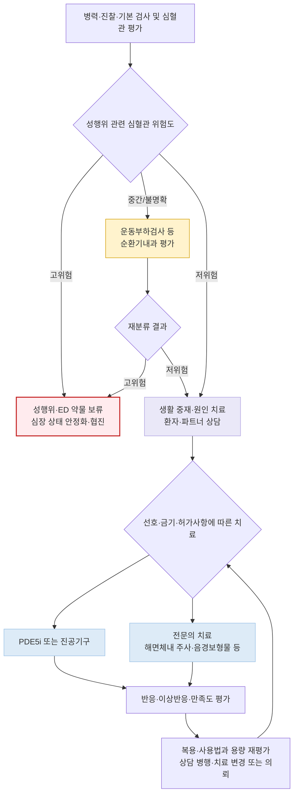

# 성기능장애 Sexual Dysfunction

***

## ￭ 발기기능장애 Erectile Dysfunction (ED)

### <mark style="color:green;">일반 사항</mark>

* 만족스런 성관계 수행을 위해 충분한 발기를 반복적 또는 지속적으로 달성 또는 유지할 수 없는 상태
* 정의 (AUA, 2018) : 성적 활동을 위해 충분한 발기를 얻거나 유지하지 못하는 상태가 지속되는 것
* 분류 : 기질성(organic), 심인성(psychogenic), 혼합성 - 실제로는 대부분 혼재
* 유병률 : 40\~70세 남성의 ½ 이상에서 어느 정도의 ED를 경험; 연령 증가에 따라 유병률 및 중증도 증가
* 심혈관 질환의 clue sign일 수 있음 - 음경 동맥(1\~2 mm)이 관상동맥보다 가늘어 전신 죽상경화증이 먼저 증상화되는 경우가 많음(“**window of opportunity**” 개념); 특히 젊은 연령에서 새로 발생한 ED는 심장 문제 발생 가능성이 높음을 시사


**Princeton IV Consensus (2024) - 성관계 관련 심혈관 위험도 분류**\
① 저위험 : 재관류 후 안정 상태, 조절된 무증상 고혈압, 경증 판막질환, NYHA I–II이며 5 METs 수행 가능\
② 중간/불명확 위험 : 안정형 경·중등도 협심증, 중재술 없이 MI 후 2–8주, NYHA III, PAD 또는 뇌졸중/TIA 병력\
③ 고위험 : 불안정/난치성 협심증, 조절되지 않는 고혈압, NYHA IV, 중재술 없이 MI 후 2주 미만, 고위험 부정맥 등 - 심장 상태 안정화 전까지 성행위 및 ED 치료 보류, 순환기내과 협진\
명백한 심혈관질환이나 심혈관 증상이 없는 혈관성 ED에서는 10년 ASCVD 위험도를 평가하며, ED 자체를 risk-enhancing factor로 간주함. Princeton IV는 특히 40~60세에서 위험이 과소평가될 수 있음을 강조하며, 경계~중간위험(10년 ASCVD 위험 5~20% 미만)에서는 CAC score를 이용한 추가 위험 재분류를 권고함. 미국 위험계산식의 국내 적용 한계, 검사 가용성·비용을 함께 고려함. 성행위 관련 중간/불명확 위험군은 운동부하검사 등으로 저위험 또는 고위험으로 재분류한 후 치료 여부를 결정함.


***

### <mark style="color:green;">원인 및 위험 인자</mark>

* 발기 실패(심인성/신경성/내분비성) : 심인성, 내분비성(예: testosterone↓, prolactin↑, 갑상선 이상), 신경성(예: 척수 손상, 뇌졸중, 당뇨병신경병증, 골반 수술 후 신경 손상)
* 혈액 충만 실패 : 동맥 부전(죽상경화증)
* 혈액량 유지 실패 : 정맥 폐쇄 부전(venous leak)
* 구조적 문제 : phimosis, Peyronie disease(음경 만곡), lichen sclerosus

#### <mark style="color:$primary;">위험 인자</mark>

* 고령
* 흡연, 과음
* 비만, 활동 부족
* 만성 스트레스, 수면 부족·과로; 에너지 부족을 동반한 과도한 운동은 호르몬 저하와 관련될 수 있으나 규칙적인 운동 자체는 보호 요인임
* 우울, 불안, 분노, 스트레스, 관계 갈등
* 비뇨기계/골반/혈관 수술, 신경계 질환 또는 손상
* BPH, 심혈관 질환(고혈압, 동맥경화), 당뇨병, 이상지질혈증(HDL↓), 갑상선 질환
* 약물 : SSRI/SNRI 및 일부 항정신병약, 5α-reductase inhibitor, 일부 β-차단제·thiazide, opioid, androgen deprivation therapy, spironolactone, 일부 항경련제, 알코올·기타 약물남용
  * ✽ ACEI/ARB, CCB는 성기능에 대체로 중립적이며 일부 ARB는 오히려 유리할 가능성이 있음; 약제 간 일률적인 서열 제시는 지양

### <mark style="color:green;">임상 양상</mark>

* 발기 개시 실패, 발기 유지 실패, 또는 발기 강도 저하 - 상황(아침/자위/파트너)에 따른 차이 유무를 확인하는 것이 심인성·기질성 감별에 중요
* 성욕 저하, 조루·지루 등 다른 사정 관련 증상이 동반될 수 있음
* 새로 발생한 ED에서 흉통, 운동 시 호흡곤란 등 심혈관 증상 동반 여부 확인 필요(☞ Princeton IV)

***

### <mark style="color:$danger;">🚩 Red Flags!</mark>

<mark style="color:$danger;">**즉각 조치 또는 의뢰**</mark>

* 발기가 4시간 이상 지속되는 경우(통증 유무와 무관) → 즉시 응급실/비뇨의학과 평가; 특히 단단한 발기와 음경통은 허혈성 지속발기증을 시사하며 지연 시 영구적 발기부전 위험이 증가함
* 급성 신경학적 결손을 동반한 새로운 발기 이상(척수 손상·뇌졸중 의심)
* 지속되는 흉통, 안정 시 호흡곤란·실신 등 급성 심혈관 증상 → 성행위·ED 약물 보류, 즉시 응급 평가
* PDE5i 복용 후 갑작스러운 뚜렷한 시력 저하 → 복용 중단, 즉시 안과/응급 평가

<mark style="color:$warning;">**당일~수일 내 평가**</mark>

* PDE5i 복용 후 갑작스러운 청력 저하·이명 → 복용 중단, 당일 이비인후과 평가
* 최근 골반/회음부 외상 또는 갑자기 생긴 통증성 음경 변형 → 당일 비뇨의학과 평가
* 새로 발생한 ED와 함께 운동 시 흉통·호흡곤란이 있거나 성행위 관련 중간/불명확·고위험군에 해당 → 심장 평가 우선(안정 시 증상은 즉각 조치)
* 고위험 심장 상태가 의심되면 증상이 가볍더라도 성행위·ED 약물을 보류하고 순환기내과 평가

<mark style="color:$info;">**외래 추적 / 추가 평가 계획**</mark> <mark style="color:$info;">- 즉각 위험 낮으나 호전 없으면 의뢰</mark>

* 만성 음경 만곡·Peyronie disease, 과거 골반 수술·방사선 치료 병력, 뚜렷한 성욕 저하 → 외래에서 비뇨의학과/내분비 평가 계획
* PDE5i 등 1차 경구 치료에 반응이 부족하거나 환자·배우자가 만족하지 못하는 경우(적절한 용량·복용법·성적 자극 확인 후에도) → 비뇨기과/성의학 전문의 의뢰, 2차 치료 고려
* 심인성 요소가 뚜렷하나 상담·생활 중재에도 개선이 없는 경우 → 정신건강의학과/부부상담 의뢰

### <mark style="color:green;">진단</mark>

#### <mark style="color:$primary;">병력</mark>

* 증상 지속 기간, 발생 양상(급성/점진적)
* 이전의 발기 능력
* 아침, 자위, 파트너 등 상황에 따른 발기 상태
* 성욕
* 성적 혐오나 고통에 관한 개인적인 문제
* 성적 성향, 성별 정체성
* 파트너 문제(예: 성욕, 갱년기, 성교통)
* 사정 시간/통제, 오르가즘 장애
* 유발/관련 인자
* 동반 증상, 동반/기저 질환, 약물 복용력
* 이전 및 현재의 치료/대응 방법

#### <mark style="color:$primary;">감별</mark>

* 야간 또는 이른 아침 발기가 보존되고 상황에 따라 다름 → 심인성 요소를 시사하나 기질성 원인을 배제하지 못함
* 건강염려증, 사별, 이혼, 불화, 경제적 문제가 있음 → 심인성 요소 평가; 기질성 요인과 혼재 가능
* 점차, 지속적으로 진행 → 기질성 요인을 시사하나 혼합성 가능성을 함께 평가
* 성욕 감소 → testosterone 저하·prolactin 증가뿐 아니라 우울, 약물, 관계 요인 등을 함께 평가
* 배뇨 장애 및 성교통 동반 → 요로 질환
* 당뇨병, 고혈압, 심혈관 질환, 이상지질혈증, 신경계 질환 및 약물 복용 → 기저 질환/약물
* 장, 방광, 전립선 또는 혈관 수술 병력 → 수술 후유 장애, 신경 손상

#### <mark style="color:$primary;">검사</mark>

* 신체검사 : 혈압/맥박수, 하지 맥박, 복부 둘레, BMI, 생식기 진찰; 직장수지검사 및 신경학적 진찰은 병력·증상에 따라 선택
* 기본 검사 : 공복혈당 또는 HbA1c, 지질, 아침 공복 total testosterone(최근 12개월 내 미시행 시)
* 선택 검사 : PSA, prolactin, LH/FSH, TFT, 혈청 크레아티닌, 간기능(AST/ALT) 등 - 병력·증상 및 testosterone 결과에 따라, 특히 PDE5i·testosterone 처방 전 신·간 기능 이상이 의심되면 확인
  * 아침 공복 total testosterone이 낮으면 별도의 날에 반복 측정하여 지속적 저하 여부를 확인
* 영상 검사 : penile duplex Doppler, angiography, cavernosography 등은 일반적으로 일상적으로 시행하지 않으며, 진단이 불명확하거나 1차 치료 실패·혈관 재건술 등 전문 치료를 고려할 때 선택
* 해면체내 혈관작용제 주사검사 : 발기 반응·혈류 평가에 이용하나 단독 반응만으로 혈관성 원인을 확정하거나 배제하지 못함; 전문 평가에서 선택 시행

#### <mark style="color:$primary;">국제 발기 부전 지수 (International Index of Erectile Function-5, IIEF-5)</mark>

* 지난 6개월의 경험을 기준으로 응답함(진료기관에서 사용하는 검증된 한국어 양식의 지시문·채점표를 함께 확인)

<table data-header-hidden><thead><tr><th width="247"></th><th width="100"></th><th width="100"></th><th width="100"></th><th width="100"></th><th width="100"></th><th width="100"></th></tr></thead><tbody><tr><td><strong>문항</strong></td><td><strong>0점</strong></td><td><strong>1점</strong></td><td><strong>2점</strong></td><td><strong>3점</strong></td><td><strong>4점</strong></td><td><strong>5점</strong></td></tr><tr><td>① 발기가 되고 유지되는 것에 있어 당신의 자신감은 얼마나 되는가?</td><td>해당 없음</td><td>매우 낮다</td><td>낮다</td><td>그저 그렇다</td><td>높다</td><td>매우 높다</td></tr><tr><td>② 성적 자극으로 발기되었을 때 성교가 가능할 정도의 충분한 발기가 몇 번이나 있었는가?</td><td>성적 활동 없음</td><td>거의 없거나 한 번도 없음</td><td>가끔씩(총 횟수의 ½에 훨씬 미달)</td><td>때때로(총 횟수의 ½ 정도)</td><td>대부분(총 횟수의 ½을 훨씬 넘음)</td><td>항상 또는 거의 항상</td></tr><tr><td>③ 성관계에서 삽입 후 발기 상태가 유지된 적이 몇 번이나 있었는가?</td><td>성교 시도 없음</td><td>거의 없거나 한 번도 없음</td><td>가끔씩(총 횟수의 ½에 훨씬 미달)</td><td>때때로(총 횟수의 ½ 정도)</td><td>대부분(총 횟수의 ½을 훨씬 넘음)</td><td>항상 또는 거의 항상</td></tr><tr><td>④ 성관계를 마칠 때까지 발기 상태를 유지하는 것은 얼마나 어려웠는가?</td><td>성교 시도 없음</td><td>극도로 어려움</td><td>매우 어려움</td><td>어려움</td><td>약간 어려움</td><td>전혀 어렵지 않음</td></tr><tr><td>⑤ 성관계에서 만족감을 느낀 적이 얼마나 되는가?</td><td>성교 시도 없음</td><td>거의 없거나 한 번도 없음</td><td>가끔씩(총 횟수의 ½에 훨씬 미달)</td><td>때때로(총 횟수의 ½ 정도)</td><td>대부분(총 횟수의 ½을 훨씬 넘음)</td><td>항상 또는 거의 항상</td></tr></tbody></table>

* 채점 : ①은 1~5점; ②는 성적 활동 없음, ③~⑤는 성교 시도 없음이면 해당 문항 0점. 성적 활동/성교 시도가 있었으나 발기·만족이 거의 없었던 경우는 1점으로 구분함 ▶ 판정 : 22~25점=정상, 17~21점=경증, 12~16점=경-중등증, 8~11점=중등증, 1~7점=중증
* ✽ 최근 성적으로 비활동적이었던 환자에서는 0점 항목 때문에 총점이 실제 발기능보다 낮게 평가될 수 있으므로 점수만으로 중증도를 판정하지 않음

***


```mermaid
flowchart TD
    A["병력·진찰·기본 검사 및 심혈관 평가"] --> B{"성행위 관련 심혈관 위험도"}
    B -->|고위험| H["성행위·ED 약물 보류<br>심장 상태 안정화·협진"]
    B -->|중간/불명확| I["운동부하검사 등<br>순환기내과 평가"]
    I --> J{"재분류 결과"}
    J -->|고위험| H
    J -->|저위험| C
    B -->|저위험| C["생활 중재·원인 치료<br>환자·파트너 상담"]
    C --> D{"선호·금기·허가사항에 따른 치료"}
    D --> E["PDE5i 또는 진공기구"]
    D --> K["전문의 치료<br>해면체내 주사·음경보형물 등"]
    E --> F["반응·이상반응·만족도 평가"]
    K --> F
    F --> G["복용·사용법과 용량 재평가<br>상담 병행·치료 변경 또는 의뢰"]
    G --> D
    style H fill:#ffebee,stroke:#c62828,stroke-width:2px
    style I fill:#fff3cd,stroke:#d39e00
    style C fill:#EAE8F8,stroke:#B0A3E0
    style E fill:#DDEBF7,stroke:#9BC2E6
    style K fill:#DDEBF7,stroke:#9BC2E6
```

<p align="center"><strong>발기기능장애 진단 및 치료 알고리듬</strong></p>

<p align="center"><em><mark style="color:$info;">Ref. AUA. Erectile Dysfunction Guideline (2018); Princeton IV Consensus (2024); EAU Sexual and Reproductive Health (2026)</mark></em></p>

***

### <mark style="background-color:$warning;">Management</mark>

#### <mark style="color:$primary;">치료 방침</mark>

* 성행위 관련 심혈관 위험도 우선 평가(☞ Princeton IV) - 고위험군은 심장 상태 안정화 전까지 보류; 중간/불명확 위험군은 운동부하검사 등으로 재분류한 후 성행위·치료 여부 결정
* 생활 중재(금연, 절주, 체중 관리, 규칙적 운동)를 모든 환자에게 우선 권고
* 당뇨병, 고혈압, 이상지질혈증 등 기저 질환 치료 및 원인 의심 약물 조정·교체 검토
* 1차 약물 치료 : PDE5i - 원인에 관계없이 우선 고려
* 심리적 요인이 뚜렷한 경우 상담·부부치료 병행
* ✽ PDE5i 무반응 판정 전 확인 : 최대 허용 용량, 적절한 timing/공복 조건, 충분한 성적 자극 하에 4\~8회 이상 시도했는지 확인 - 상당수는 복용법 재교육만으로 반응이 회복됨

***

### <mark style="color:green;">비-약물 치료 및 예방</mark>

* 금연, 음주 제한, 적정 체중 유지
* 적당한 활동, 규칙적 유산소 운동
* 스트레스 관리, 심리적 문제(우울·불안) 치료
* 배우자 상담, 부부간의 소통/스킨십 향상
* 지중해식 식단, DASH 식단 등 심혈관 건강에 유익한 식이가 성기능 저하 예방에도 도움이 된다는 관찰 연구 보고가 있음
* 30~60분의 유산소 운동을 1주일에 3~5회 시행한 연구들을 포함한 무작위시험 메타분석에서 비운동 대조군 대비 발기기능 개선이 보고됨; 심장 상태·체력에 맞추어 운동 강도를 조절

### <mark style="color:green;">약물 치료</mark>

#### <mark style="color:$primary;">Phosphodiesterase-5 inhibitor (PDE5i)</mark>

* 기전 : intracavernosal cyclic guanosine monophosphate↑ → NO-induced vasodilation 연장
* 효과 : 다양한 원인의 ED에서 1차 약물로 고려; 성욕을 높이는 약은 아니며 성적 자극이 필요함. 반응은 원인·중증도·동반 질환과 개인에 따라 다르고 약동학·선호·내약성을 고려하여 선택
* 용법 : 필요시 요법은 성관계 전 복용하며 최대 24시간 내 1회; 매일 요법은 정해진 시각에 복용. 약제별 시작 시점·용량은 아래 표를 따르며 sildenafil·vardenafil은 고지방 식사 시 발현이 지연될 수 있음
* 부작용 : 두통, 어지럼, 저혈압, 안면 홍조, 소화불량, 코 울혈, 일시적 시각 이상·청색시(sildenafil 등), 요통·근육통(tadalafil), 드물게 지속발기증; 약제별 이상반응률을 서로 다른 시험에서 직접 비교하여 우열을 단정하지 않음


**⚠️ Nitrate 병용 절대 금기**\
질산염/NO donor(니트로글리세린, isosorbide 제제, nicorandil, amyl nitrite 등) 및 riociguat 병용 금기. Sildenafil·vardenafil 복용 후 질산염은 최소 24시간, tadalafil은 최소 48시간 피해야 함. 이 시간 경과가 자가 사용의 허용 기준은 아니며, 신·간기능 저하·상호작용 약물이 있으면 더 오래 작용할 수 있음. Udenafil·mirodenafil에 이 간격을 일률적으로 적용하지 말고 제품 허가사항과 전문 판단을 따름. α-차단제 치료가 안정된 상태에서 낮은 PDE5i 용량부터 시작하고 기립성 저혈압을 관찰함.


* 주의/금기 : 질산염/NO donor·riociguat 병용 금기. 저혈압, 조절되지 않는 고혈압, 불안정 심혈관 질환, 중증 간/신기능 장애, NAION 병력은 약제별 허가사항 확인. Vardenafil은 선천성 QT 연장 및 class IA/III 항부정맥제 병용 시 피함
* 저용량 또는 투여 간격 조절 검토 : 고령, 신·간기능 저하, α-차단제 또는 CYP3A4 억제제 병용; 강력한 CYP3A4 억제제는 약제에 따라 금기 또는 엄격한 용량 제한이므로 단순 감량으로 처리하지 않음
* 고지방식은 특히 sildenafil·vardenafil의 발현을 지연시킬 수 있음; tadalafil은 음식 영향이 적으나 과량 음주는 모든 PDE5i에서 어지럼·저혈압 및 성기능 저하 위험을 높임

<table><thead><tr><th>성분명 / 대표 제품</th><th>필요시 복용법</th><th>매일 복용법</th><th>효과 발현 / 반응 가능 시간</th></tr></thead><tbody><tr><td>sildenafil <mark style="color:blue;">[비아그라]</mark></td><td>50 ㎎ 시작, 반응·내약성에 따라 25~100 ㎎; 약 1시간 전</td><td>ED의 표준 매일 요법 없음</td><td>약 30~60분 / 최대 약 12시간</td></tr><tr><td>vardenafil <mark style="color:blue;">[레비트라 등]</mark></td><td>10 ㎎ 시작, 반응·내약성에 따라 5~20 ㎎; 약 25~60분 전</td><td>ED의 표준 매일 요법 없음</td><td>약 30~60분 / 최대 약 10시간</td></tr><tr><td>tadalafil <mark style="color:blue;">[시알리스]</mark></td><td>10 ㎎ 시작, 필요시 20 ㎎; 적어도 30분 전</td><td>5 ㎎ 1일 1회; 심한 신장애에서는 비권장, 간장애는 개별 위험-이익 평가</td><td>약 30분부터, 최대 효과 약 2시간 / 최대 36시간</td></tr><tr><td>mirodenafil <mark style="color:blue;">[엠빅스]</mark></td><td>50~100 ㎎; 약 1시간 전</td><td>표준 매일 요법 없음</td><td>약 1시간 / 비교적 짧은 작용</td></tr><tr><td>udenafil <mark style="color:blue;">[자이데나]</mark></td><td>100 ㎎ 시작, 필요시 200 ㎎; 약 30분~12시간 전</td><td>빈번한 사용(주 ≥3회)이 필요한 경우 50 ㎎ 1일 1회, 필요시 75 ㎎</td><td>약 30~60분 / 최대 약 24시간</td></tr></tbody></table>

✽반응 가능 시간은 발기가 계속 유지되는 시간을 의미하지 않음. 제형·함량·유통 여부는 실제 처방 제품 기준으로 확인함. Avanafil <mark style="color:blue;">[제피드]</mark>은 국내 품목 허가·유통 상태 확인이 필요하여 본 표에서 제외함.
✽제네릭(성분명 처방) sildenafil·tadalafil이 다수 유통되어 저비용 대안으로 활용 가능; 정품·제네릭 간 생동성은 확인되어 있으나 환자에게 사전 설명 권장

#### <mark style="color:$primary;">Testosterone</mark>

* Hypogonadism(testosterone deficiency) 환자에서 적용; 정상 testosterone 상태에서는 효과 없음
* PDE5i와 병용 시 PDE5i 효과를 향상시킬 가능성이 있음(특히 PDE5i 단독 무반응 + 낮은 testosterone 조합)


**Testosterone 치료의 심혈관 안전성 (TRAVERSE trial, NEJM 2023)**\
과거 testosterone 제제의 심혈관 위험 증가 우려가 있었으나, 심혈관 위험이 높은 hypogonadism 남성 대상 대규모 RCT(TRAVERSE, 2023)에서 testosterone 치료가 위약 대비 주요 심혈관 사건(MACE) 발생을 유의하게 증가시키지 않음이 확인됨. 다만 심방세동, 급성 신손상, 폐색전증 발생은 다소 증가하여 개별 위험-이익 평가는 여전히 필요함. 이 결과는 연구 대상과 경피 겔 요법의 MACE 비열등성 결과이며, 모든 제형·환자에서 모든 심혈관 위험이 없다는 뜻은 아님. FDA는 2025년 심혈관 위험 경고 문구를 조정하면서 혈압 상승 경고를 추가하도록 하여, 치료 전후 혈압을 함께 확인함.


* 주요 이상반응 : 적혈구증가증, 여드름·지성피부, 부종, 여성형유방증, 혈압 상승, 정자 생성 억제; 비강 제형은 코 자극·비출혈, 경피 제형은 피부 자극·타인 전이 위험이 있음. 제형별 이상반응 빈도를 전체 testosterone 제제에 일률적으로 적용하지 않음
* 치료 전 평가 : 40세 이상에서는 PSA 측정. PSA 4.0 ng/mL 초과 또는 전립선암 고위험군에서 3.0 ng/mL 초과 시(Endocrine Society 기준) 비뇨의학적 평가 후 치료 여부 결정; 직장수지검사 이상 소견도 전문 평가
* 금기/주의 : 활동성 전립선암·남성 유방암, 가까운 장래 임신/가임력 유지 희망 시 외인성 testosterone을 투여하지 않음. 치료 전 Hct >50%이면 원인 평가 및 치료 보류를 고려; 치료 중 Hct ≥54%이면 감량·일시 중단 등 조치. 치료되지 않은 중증 수면무호흡증, 중증 하부요로증상, 조절되지 않는 심부전, 혈전성향 및 최근 6개월 내 심근경색·뇌졸중에서는 투여를 피하고 전문 평가
* 모니터링 : 증상·testosterone·Hct·혈압을 치료 전 및 시작 3~6개월 후, 12개월 및 이후 최소 연 1회 확인(위험도에 따라 더 자주, 제형별 농도 측정 시점 준수). PSA·전립선 위험은 연령·기저 위험에 따라 추적. 첫 12개월 내 PSA가 기저치보다 >1.4 ng/㎖ 증가하거나 >4 ng/㎖로 확인되면 비뇨의학과 평가; 3~6개월의 적절한 치료에도 임상적 이득이 없으면 지속 여부 재평가
* 용법 : 비강 겔·근육 주사 등 국내 허가 제품의 용법을 따름. 경피 겔·경구제·패취의 허가 상태, 공급 중단 여부와 이유를 제형 전체로 일반화하지 말고 개별 제품 기준으로 확인함
* testosterone nasal gel <mark style="color:blue;">[나테스토나잘겔]</mark> : 1회 펌프 작동 시 5.5 ㎎; 양쪽 비공에 각 1회씩, 1일 2회(총 22 ㎎) 시작. 최소 30일 후 오전 투여 20분~2시간 뒤 채혈한 testosterone이 <300 ng/dL이면 1일 3회(총 33 ㎎)로 증량 고려; 최대 용량에서도 지속 저하 또는 임상효과 부족이면 다른 치료법 검토
  * ✽ 1일 2회 투여 시 최소 6시간 간격, 1일 3회 투여 시 약 6\~8시간 간격으로 투여
* testosterone undecanoate <mark style="color:blue;">[네비도]</mark> : 1,000 ㎎/4 ㎖를 매우 천천히 심부 둔부 근육 주사(혈관내 주입 금지); 첫 투여 간격은 농도·증상에 따라 6주까지 단축 가능하며 이후 10~14주 간격. 투여 직후 기침·호흡곤란 등 폐유성 미세색전증 및 아나필락시스 가능성에 대비하여 관찰
* ✽ Testosterone 저하가 확인되지 않은 PDE5i 무반응만으로 호르몬을 추가하지 않음; 임신 계획이 있으면 남성난임 전문의와 가임력을 보존하는 대안을 검토

#### <mark style="color:$primary;">기타</mark>

* prostaglandin E1(alprostadil) penile injection : 효과적이나 드물게 priapism, 섬유화, 통증/감염 부작용
* vacuum-assisted device : 약물 없이 발기를 보조할 수 있으나 불편감·멍·통증 가능; 압박 고리는 30분 이내 제거하며 출혈성 질환·항응고제 복용 여부를 전문의와 검토
* 음경보형물 삽입술 : 다른 치료에 반응 없는 경우 효과적; 드물게 감염, 기계 고장 부작용
* 은행잎추출물·인삼·L-arginine 등 보조요법은 효과가 제한적이거나 근거가 불충분하여 표준치료를 대체하지 않음. hCG는 저성선자극호르몬성 성선기능저하증의 가임력 치료 등에 전문적으로 사용되며 일반 ED 보조제로 처방하지 않음

***

### <mark style="color:red;">질병코드</mark>

F52.2 성적 반응의 실패 Failure of genital response(비기질성 발기부전 등)

N48.4 기질적 원인의 발기부전 Impotence of organic origin

***

### <mark style="color:purple;">처방례</mark>

> **처방례 1. 경증\~중등증, 심혈관 위험 낮음**
>
> ```
> 비아그라 50 ㎎/T   1T   관계 1시간 전 필요시
> ```
>
> _✽ 최대 효과를 위해 공복 상태에서 복용; 반응에 따라 25\~100 ㎎으로 조절. Nitrate 복용 여부를 반드시 확인_

> **처방례 2. 고령 또는 α-차단제 병용 중**
>
> ```
> 실데나필 25 ㎎/T   1T   관계 약 1시간 전 필요시(해당 함량 제품 선택)
> ```
>
> _✽ α-blocker 치료가 안정된 상태에서 낮은 PDE5i 용량부터 시작하고 어지럼·기립성 저혈압을 관찰. 특히 doxazosin/terazosin 등 비선택적 α-blocker에서 주의_

> **처방례 3. 성관계 빈도가 높거나 복용 시점에 구애받지 않는 요법 선호**
>
> ```
> 시알리스 5 ㎎/T   1T   1일 1회 매일 복용
> ```
>
> _✽ 저용량 매일 복용법(daily dosing)은 성관계 시점에 구애받지 않는 장점이 있으며 하부요로증상 동반 시에도 도움; 심한 신장애에서는 1일 1회 요법 비권장, 간장애는 개별 위험-이익 평가_

> **처방례 4. 증상과 반복 검사로 확인된 성선기능저하증 + ED**
>
> ```
> 나테스토나잘겔  1회 분무(5.5 ㎎)  양쪽 비공 각 1회, 1일 2회(1일 22 ㎎)
> 시알리스 5 ㎎/T   1T   1일 1회
> ```
>
> _✽ 증상과 함께 반복 측정한 아침 공복 testosterone 저하로 hypogonadism을 확인한 후 병용. PSA 기준(4.0 ng/mL, 고위험군 3.0 ng/mL) 초과 시 비뇨의학과 선평가. 3개월 후 효과·부작용 재평가; 가임력 계획, hematocrit, 전립선 관련 위험 등을 함께 평가_

***

### <mark style="color:$success;">핵심 복약 지도</mark>

> **PDE5i 복용 방법**
>
> * 필요시 요법은 약제별 권장 시간에 복용(☞ 용량 표); 매일 요법은 성관계와 관계없이 정해진 시각에 복용
> * 성적 자극이 있어야 효과가 나타나는 약물임을 설명(약을 먹으면 저절로 발기되는 것이 아님)
> * 하루 1회를 초과해서 복용하지 않도록 안내

> **Nitrate 병용 금기 - 반드시 확인**
>
> * nitrate(니트로글리세린 설하정 포함)를 정기적 또는 필요시 사용하는 환자에게 PDE5i를 병용하지 않음; 질산염 치료의 필요성·변경 가능성은 심장 담당의와 검토
> * 복용 후 흉통이 생기면 니트로글리세린을 스스로 사용하지 말고 119/응급실에 연락; 약 이름·용량·마지막 복용 시각을 반드시 고지. 질산염 사용 여부는 의료진이 판단

> **나테스토나잘겔(비강) 사용 시 주의**
>
> * 각 용기를 처음 사용할 때만 용기를 뒤집어 10회 공분무(priming)하고, 나온 분무액을 따뜻한 물로 씻어 버림. 매 투여 시 펌프를 끝까지 눌러 1회 5.5 ㎎이 정량 분무되도록 안내; 손에 묻으면 비누와 따뜻한 물로 씻음
> * 사용 후 분무기 팁을 마른 휴지로 닦도록 안내
> * 다른 비강내 투여 약물과의 병용은 원칙적으로 권장되지 않음(자료 부족); 예외적으로 비충혈제거제 oxymetazoline은 나테스토 투여 30분 전 사용 시 testosterone 흡수에 임상적으로 의미 있는 영향이 없었다는 자료가 있음
> * 경피 겔과 달리 타인에게 옮겨질 위험은 낮으나, 코 자극감·콧물·비출혈이 흔한 부작용임을 미리 설명

> **언제 다시 병원을 방문해야 하나요?**
>
> * 발기가 **4시간 이상 지속**되는 경우(priapism 의심) - 즉시 응급실 내원
> * PDE5i 복용 후 갑작스러운 시력 저하, 흉통이 발생하는 경우 - 즉시 내원
> * PDE5i 복용 후 갑작스러운 청력 저하·이명이 발생하는 경우(돌발성 감각신경성 난청 의심) - 즉시 복용 중단 및 이비인후과 내원
> * 적절한 용량으로 4\~8주 이상 사용해도 효과가 없는 경우

***

## <mark style="color:blue;">환자 안내서</mark>


**발기부전, 흔하고 치료 가능한 질환입니다**

발기부전은 나이가 들면서 흔히 겪을 수 있는 문제이며, 원인을 확인하고 적절히 치료하면 대부분 호전됩니다. 특히 새로 생긴 발기 문제는 심장 혈관 건강의 신호일 수 있어 함께 점검하는 것이 중요합니다.


#### <mark style="color:$primary;">왜 발기부전이 생기나요?</mark>

* 발기는 신경, 혈관, 호르몬이 함께 작용하는 과정으로, 당뇨병·고혈압·동맥경화·흡연 등은 음경 혈관에 영향을 주어 발기를 어렵게 만들 수 있습니다.
* 스트레스, 우울, 관계의 어려움 같은 심리적 요인도 큰 원인이 됩니다.
* 복용 중인 혈압약, 항우울제 등이 원인이 되기도 하므로 임의로 중단하지 말고 의사와 상의하십시오.

#### <mark style="color:$primary;">일상생활에서 어떻게 관리하나요?</mark>

* **금연하십시오.** 흡연은 음경 혈관을 손상시키는 대표적 원인입니다.
* **규칙적으로 운동하십시오.** 주 3\~5회, 30\~60분의 유산소 운동이 도움이 됩니다.
* **적정 체중과 혈당·혈압·콜레스테롤을 관리하십시오.**
* **배우자와 솔직하게 대화하십시오.** 성기능 문제는 흔한 일이며, 함께 해결책을 찾는 것이 회복에 도움이 됩니다.

#### <mark style="color:$primary;">약은 어떻게 써야 하나요?</mark>

* PDE5i(비아그라, 시알리스 등)는 성적 자극이 있을 때 효과를 나타냅니다. 필요할 때 먹는 방식과 매일 먹는 방식의 복용법이 다르므로 처방받은 약의 안내를 따르십시오.
* **협심증 약(니트로글리세린 등)을 복용 중이라면 이 약을 절대 함께 사용하지 마십시오.** 심한 혈압 저하가 발생할 수 있습니다.

#### <mark style="color:$primary;">이럴 때는 즉시 병원을 방문하세요</mark>

* 발기가 4시간 넘게 가라앉지 않는 경우
* 약 복용 후 가슴 통증이나 갑작스런 시력 저하가 생기면 즉시 응급 진료를 받으십시오. 가슴 통증이 생겨도 니트로글리세린을 스스로 사용하지 말고, 복용한 약과 시각을 의료진에게 알리십시오. 갑작스런 청력 저하·귀 울림은 약을 중단하고 당일 진료를 받으십시오.

***

## ￭ 사정장애 Ejaculatory Dysfunction

### <mark style="color:green;">일반 사항</mark>

* 사정 반사 : 질내 삽입 후 사정까지의 시간(IELT)은 개인차가 매우 크며, 시간 자체보다 사정 조절 능력과 이로 인한 개인·파트너의 고통 여부가 임상적으로 중요
* 사정 관련 문제 : 조기사정, 지연사정/무사정, 역행성사정, 통증성사정, 사정 무쾌감증, 혈정액 등; AUA/SMSNA 지침(2020, 논문 2022)은 주로 조기사정·지연사정을 다루며, 다른 아형은 EAU 지침을 함께 참고

<table><thead><tr><th width="125">아형</th><th width="220">핵심 특징</th><th>주된 접근</th></tr></thead><tbody><tr><td>조기사정</td><td>사정 반사 조절 능력 저하, 삽입 후 매우 짧은 잠복기</td><td>행동 요법, 국소 마취제, dapoxetine/SSRI</td></tr><tr><td>지연사정</td><td>충분한 자극에도 사정이 현저히 지연되거나 도달하지 못함</td><td>원인 약물 조정, 정신적 요인 평가</td></tr><tr><td>무사정</td><td>사정 자체가 없음(오르가즘은 있을 수 있음)</td><td>원인 질환·신경 손상 평가</td></tr><tr><td>정액 역류증</td><td>정액이 방광으로 역류</td><td>수술·신경병증 병력 확인, 불임 상담</td></tr><tr><td>통증성 사정</td><td>사정 시/후 생식기·회음부 통증</td><td>감염/염증 감별 및 치료</td></tr><tr><td>혈정액</td><td>정액 내 혈액</td><td>대개 자연 소실, 반복/지속 시 정밀 평가</td></tr></tbody></table>

***

### <mark style="color:orange;">조기사정 (Premature Ejaculation, PE)</mark>

#### <mark style="color:$primary;">정의 및 역학</mark>

* 평생형(lifelong) PE : 성경험 초기부터 사정 조절력 저하와 고통이 지속. ISSM(2014)은 질내 삽입 전 또는 약 1분 이내, AUA/SMSNA(2020; 논문 2022)는 삽입 성관계 시작 후 약 2분 이내를 기준으로 하므로 두 정의를 혼합하지 않음
* 후천성(acquired) PE : 이전보다 사정 잠복시간이 현저하게 짧아지고 조절력 저하·고통 동반; ISSM은 흔히 약 3분 이하로 단축되는 경우를 기술하며, AUA/SMSNA는 2~3분 미만 또는 이전보다 ≥50% 단축을 참고 기준으로 제시함. 시간만으로 진단하지 않음
* “평생형”은 성경험 초기부터 지속된다는 뜻으로, 선천적 이상을 확정하는 용어가 아님. 질내 삽입 이외의 성활동에서는 IELT 기준을 그대로 적용하지 않음
* 유병률 : 자가 보고 기준 남성의 20\~30%(엄격한 임상 정의 적용 시 약 5% 내외로 낮아짐)
* 신체 검사는 대개 정상; 진단을 위한 특이적 검사는 없음(병력 기반 진단)

#### <mark style="color:$primary;">원인</mark>

* 음경 감각 과민, 5-hydroxytryptamine(세로토닌) 수용체 기능 이상(특히 평생형 PE에서 중추성 세로토닌 조절 이상 가설)
* 성적 과흥분, 드문 성관계
* 성 매개 감염에 대한 두려움, 성관계에 대한 불안/죄의식
* 프라이버시 결핍, 파트너와의 상호 부적응
* 후천성 PE에서는 전립선염, 갑상선기능항진증, 발기부전(발기 소실에 대한 불안으로 서두르는 경우) 동반 여부 확인

#### <mark style="color:$primary;">비-약물 치료</mark>

* 성관계 방법 교육
  * stop-start technique : 사정 욕구가 강해지면 자극을 중단, 욕구가 가라앉으면 재개
  * squeeze technique : 사정 욕구가 강해지면 자극을 중단하고 귀두·귀두관상연 부위를 통증이 생기지 않을 정도로 부드럽게 압박
  * 환자와 파트너가 합의한 자극 강도·속도 조절; 행동 요법 단독의 근거는 제한적이며 약물·상담과 병행 가능
* 골반저근 운동(pelvic floor exercise) - 일부 연구에서 사정 조절력 개선 보고
* psychotherapy, 부부 상담 - 불안 기반 PE에 특히 유용

#### <mark style="color:$primary;">약물 치료</mark>

* 국소 마취제 도포 : 2.5% prilocaine/2.5% lidocaine <mark style="color:blue;">[엠라]</mark>는 조루증에 허가 외 사용. 관계 15~30분 전 귀두에 소량 도포하고 관계 직전 충분히 닦아내거나 세척. 넓은 부위·과량·손상된 피부 도포를 피하며 본인·파트너의 감각 저하, 피부 자극, 드물게 메트헤모글로빈혈증 위험 설명; 콘돔 재질과 크림의 적합성도 확인
* dapoxetine <mark style="color:blue;">[프릴리지]</mark> : 국내 허가된 필요시 경구 조루 치료제(18~64세 남성); clomipramine 15 ㎎ 조루 치료제도 국내 허가되어 있음
  * 용법 : 관계 1~3시간 전 30 ㎎으로 시작; 효과 부족·내약성 양호하면 60 ㎎까지 증량, 최대 24시간 내 1회. 초회에 기립성 반응이 있으면 증량하지 않음. 4주 또는 6회 투여 후 효과·위험 재평가
  * 주요 이상반응 : 구역, 어지럼, 두통, 기립성 저혈압·실신; 투여 전 실신·기립성 반응 병력과 누운/선 자세 혈압·맥박 확인
  * 금기 : 중대한 심장 질환(허가사항상 NYHA II~IV 심부전, 유의한 전도장애·허혈성 심장질환·판막질환 등), 중등도~중증 간장애, 조증/양극성장애 병력, MAOI·다른 세로토닌성 약물·티오리다진 및 강력한 CYP3A4 억제제 병용 등. SSRI/SNRI/TCA·tramadol 등 중단 후 14일 이내, dapoxetine 중단 후 7일 이내의 교차 사용 금기; 장반감기 약물은 별도 검토
  * 피해야 할 대상/주의 : 기립성 반응 병력이 있거나 검사에서 반응이 나타나는 경우 투여를 피함. 중증 신장애는 비권장, ≥65세는 안전성·유효성 미확립; <18세·여성에게 사용하지 않음. CYP2D6 대사 저하 또는 중등도 CYP3A4 억제제 병용 등은 30 ㎎ 제한 여부 확인
* TCA : clomipramine 15 ㎎ <mark style="color:blue;">[네노마 등 조루증 허가 제제]</mark> : 성행위 2~6시간 전 15 ㎎, 최대 24시간 내 1회; 4주 또는 6회 후 재평가. 일반 항우울제 제형의 용량을 조루증 허가 용법에 그대로 적용하지 않음
  * 주요 이상반응 : 구역, 어지럼·졸음, 구갈·변비·배뇨곤란 등 항콜린작용, 기립성 저혈압 및 심장 전도 이상
  * 금기/주의 : 주요 정신과 질환 또는 병력, MAOI·SSRI/SNRI 등 세로토닌성 약물 병용, 심한 심장 질환·부정맥, 녹내장, 중증 요폐 위험 등 제품 허가사항 확인. 조루증용 15 ㎎ 제제는 여성·19세 미만·65세 이상 등에 금기이며, 항우울제 치료를 중단하여 이 약으로 대체하지 않음
* SSRI(off-label) : sertraline, paroxetine, fluoxetine 등은 매일 투여(daily regimen)의 근거가 더 확립되어 있음; on-demand 투여도 가능하나 효과는 상대적으로 낮을 수 있음. 부작용은 성욕 저하, 발기부전, 체중 증가, 불면 등이며, 국내에서는 조루증에 대해 허가 외(off-label) 사용에 해당하므로 처방 전 환자 설명 및 동의가 필요 (☞ 항우울제)
* α1-adrenoceptor antagonist는 사정량 감소·무사정을 유발할 수 있어 조루증의 일상적인 치료로 사용하지 않음(☞ 하부요로증상 약제)
* PDE5 inhibitor : ED 동반 시 ED 치료를 우선함. 조루 약물을 추가할 때는 기립성 저혈압·실신 위험과 해당 제품 허가사항을 개별 검토; dapoxetine과의 병용을 모든 환자에게 일률적으로 권하지 않음
* tramadol : 일부 연구에서 사정 지연 효과가 보고되나, 오남용·의존 위험 및 다른 세로토닌성 약물과의 병용 시 세로토닌 증후군 위험이 있어 1차 치료로는 권장하지 않음


**시술적 치료에 대한 주의**\
Dorsal neurectomy, 히알루론산을 이용한 glans penis augmentation(귀두 확대술) 등이 일부 국가(특히 아시아권)에서 시행되고 있으나, ISSM 가이드라인(2014)은 근거 부족과 영구적 성기능 손상 가능성을 이유로 이러한 시술적 치료를 권장하지 않음. 약물·행동치료에 반응하지 않는 경우 비뇨의학과/성의학 전문의 의뢰를 우선함.


***

### <mark style="color:orange;">지연사정 (Delayed Ejaculation, DE)</mark>

* 정의 : 충분한 성적 자극에도 원하는 것보다 사정이 현저히 지연되거나 사정에 도달하지 못하는 상태
* 원인 : 심인성(성관계 불안 등), 약물(항우울제 특히 SSRI, α/β-차단제, thiazide, 항정신병제, opioid, 알코올), 사정 시 통증을 유발하는 질환(전립선염, 정낭염), 당뇨병신경병증, 척수 손상
* 치료 : 원인 약물(특히 SSRI/SNRI, opioid 등)의 감량·중단·교체 가능성을 평가하고 심리·관계·성적 자극 패턴을 교정
  * 약물 치료는 근거가 제한적이며 bupropion, buspirone, amantadine, cyproheptadine 등이 소규모 연구에서 사용되었으나 표준치료로 확립되지 않음

### <mark style="color:orange;">기타 사정 장애</mark>

#### <mark style="color:$primary;">무사정 (Anejaculation)</mark>

* 정의 : 정액의 전향성 방출이 없는 상태; emission·expulsion 장애 또는 수술 후 정액 형성 소실 등을 감별하며 역행성사정과 구분. 오르가즘은 보존될 수 있음
* 원인 : 후복막 림프절 절제술, 척수 손상, 약물(α/β-차단제, benzodiazepine, 항우울제, 항정신병제, aminocaproic acid), 당뇨병신경병증, radical prostatectomy, 선천성 기형(Müllerian duct cyst, Wolffian 이상)
* 치료 : 약물 유발성인 경우 원인 약물 조정. 신경학적 무사정이거나 임신을 원하는 경우 비뇨의학과/남성난임 전문의 의뢰 - penile vibratory stimulation, electroejaculation, 또는 수술적 정자 채취 고려

#### <mark style="color:$primary;">정액 역류증 (Retrograde Ejaculation)</mark>

* 정의 : 방광 경부가 제대로 닫히지 않아 정액이 방광으로 역류
* 원인 : (경요도)전립선 절제술, 방광경부 수술, 광범위 골반 수술, 후복막 림프절 절제, 당뇨병신경병증, 약물(α-차단제, ganglion blocker, 항정신병제), 요도 협착
* 병력·정액량과 사정 직후 소변의 정자 검사를 함께 해석; 소변에서 소량의 정자가 보인다는 사실만으로 확진하지 않음. Tamsulosin·silodosin 관련 무정액 사정은 방광 역류가 아닌 정액 방출 억제일 수 있음. 근치적 전립선절제술 후 dry orgasm은 정액 형성 소실이며 역행성사정과 구분; 임신 계획 시 비뇨의학과 의뢰

#### <mark style="color:$primary;">통증성 사정 (Painful Ejaculation)</mark>

* 정의 : 사정 후 또는 사정 중 생식기 또는 회음부 통증
* 원인 : 감염/염증(고환염, 부고환염, 전립선염, 요도염), 사정관 폐쇄, 정낭 결석, 정관 폐쇄, 심인성
* 치료 : 원인 감염/염증 치료; α-차단제가 일부 환자에서 증상 완화에 도움

#### <mark style="color:$primary;">무쾌감증 (Ejaculatory Anhedonia)</mark>

* 정의 : 사정은 정상적으로 일어나나 오르가즘이나 쾌감이 동반되지 않는 상태
* 원인 : 약물(항우울제 등), 심인성, 호르몬 불균형, 성욕 감퇴 - 원인 평가 후 해당 원인 치료

#### <mark style="color:$primary;">혈정액 (Hematospermia)</mark>

* 정의 : 사정액에 육안적 또는 현미경적 혈액이 존재
* 원인 : 감염, 염증, 결석(요로·정낭·전립선), 외음부 외상, 폐쇄, 낭종, 종양, 혈관 기형; 40세 미만·단발성인 경우 대개 양성이며 자연 소실
* 접근 : 외상·시술·항응고제·감염 위험 및 실제 정액 출혈인지 확인. 요검사, 증상/위험에 따른 배양·STI 검사 시행; ≥40세 또는 반복·지속 시 전립선 진찰·PSA 등 위험 기반 평가 및 비뇨의학과 의뢰. 젊은 단발성·무증상 환자는 영상검사가 대개 불필요하며, 지속·재발 또는 이상 소견에서 TRUS/pelvic MRI를 선택; 육안적 혈뇨는 별도 혈뇨 평가

***

### <mark style="color:$danger;">🚩 Red Flags!</mark>

<mark style="color:$danger;">**즉각 조치 또는 의뢰**</mark>

* 발열·오한, 급성 요폐, 심한 고환/회음부 통증 등 급성 감염·고환염전·요폐를 시사하는 증상 → 원인에 따라 즉각 평가

<mark style="color:$warning;">**당일~수일 내 평가**</mark>

* 지속되거나 심한 혈정액(특히 40세 이상, 육안적 혈뇨·배뇨 증상·체중 감소 동반) → 종양성 원인 배제 위해 비뇨의학과 의뢰

<mark style="color:$info;">**외래 추적 / 추가 평가 계획**</mark> <mark style="color:$info;">- 즉각 위험 낮으나 호전 없으면 의뢰</mark>

* 반복 통증성 사정의 결석 또는 무사정·불임의 폐쇄성 원인 의심 → 비뇨의학과 전문 평가 계획
* 행동 요법·국소 마취제·1차 약물 치료에도 조루 증상이 호전되지 않는 경우
* 단발성 경미한 혈정액이 4\~6주 내 재발 없이 소실되지 않는 경우

***

### <mark style="color:red;">질병코드</mark>

F52.4 조기사정 Premature ejaculation

F52.3 절정감장애 Orgasmic dysfunction(비기질성 지연사정·무절정 등, 실제 진단에 따라 적용)

✽기질성 사정장애·혈정액은 원인 질환 및 KCD-9 색인·포함 용어에 따라 코드 선택. N53.1·R36.1 등 미국 ICD-10-CM 세부 코드를 국내 KCD 코드로 그대로 사용하지 않음. 혈정액의 국내 대체 코드는 최종 KCD-9 색인 확인이 필요하여 본 장에서는 확정하지 않음.

***

### <mark style="color:purple;">처방례</mark>

> **처방례 1. 평생형 조기사정, on-demand 선호**
>
> ```
> 프릴리지 30 ㎎/T   1T   관계 1\~3시간 전 필요시
> ```
>
> _✽ 초회 저용량으로 시작, 효과·내약성에 따라 60 ㎎까지 증량; 기립성 저혈압 증상(어지럼) 사전 설명_

> **처방례 2. 국소요법 선호 또는 전신 부작용 우려**
>
> ```
> 엠라 크림   관계 15\~30분 전 귀두 도포 후 관계 직전 세척
> ```
>
> _✽ 조루증에 허가 외 사용. 관계 직전 충분히 세척하고, 파트너 전이·감각 저하 및 콘돔 재질 적합성을 설명; 과량·넓은 부위 도포를 피함_

> **처방례 3. 발기부전 동반**
>
> ```
> 시알리스 5 ㎎/T   1T   1일 1회
> ```
>
> _✽ 먼저 ED 치료 반응을 평가. 조루가 지속되면 행동·국소요법 또는 조루 약물 추가를 검토하되, dapoxetine 병용은 저혈압·실신 위험과 허가사항을 확인하여 개별 결정_

> **처방례 4. Clomipramine 조루증 허가 제제 선택**
>
> ```
> 네노마 15 ㎎/T   1T   관계 2~6시간 전 필요시
> ```
>
> _✽ 최대 24시간 내 1회. 주요 정신과 질환·심장 질환, 세로토닌성 약물 복용 및 연령 금기 확인; dapoxetine 또는 다른 항우울제와 함께 복용하지 않음_

***

### <mark style="color:$success;">핵심 복약 지도</mark>

> **dapoxetine 복용 시 주의**
>
> * 매일 복용하는 약이 아니라 관계 예정 1\~3시간 전에만 복용하는 약임을 설명
> * 복용 후 어지럼(기립성 저혈압)이 흔하므로 복용 후 갑자기 일어서지 않도록 안내
> * 음주와 함께 복용하지 않도록 안내
> * 최소 물 1컵과 복용; 어지럼·식은땀·구역 등 실신 전구증상 시 즉시 누워 쉬고 운전·위험 작업을 피함
> * 다른 항우울제, tramadol, 조루약을 임의로 추가하지 않음; 고열·심한 초조·진전/근육경직·의식 변화 시 세로토닌 증후군 가능성으로 즉시 평가

> **언제 다시 병원을 방문해야 하나요?**
>
> * 약물 치료·행동 요법을 충분히 시도해도 증상이 지속되어 관계에 지장을 주는 경우
> * 혈정액이 반복되거나 배뇨 증상, 체중 감소가 동반되는 경우 - 조기 내원

***

## ￭ 여성 성기능장애 Female Sexual Dysfunction (FSD)

### <mark style="color:green;">일반 사항</mark>

* 주요 문제 영역 : 성욕 저하, 흥분 장애, 절정감 장애, 생식기-골반통/삽입장애(GPPPD) - 여러 영역이 중복 가능. 성욕 저하만으로 HSDD를 진단하지 않고 환자 자신의 유의한 고통과 생물·심리·관계 요인을 평가; DSM-5-TR은 여성 성적 관심/흥분장애를 통합 분류함
* 건강한 여성에서 androgen(테스토스테론) 검사는 일상적으로 권하지 않음(✽ androgen 수준과 증상이 일치하지 않는 경우가 많음)
* 진료 시 개방형 질문으로 성 건강에 대해 먼저 물어보는 것(permission)이 진단의 시작

### <mark style="color:green;">원인 및 위험 인자</mark>

* 생식기계 문제 : 질 위축(폐경 관련 비뇨생식기증후군, GSM), 성교통, 질염, 자궁내막증
* 정신적 질환(예: 우울), 만성 질환(예: 당뇨병, 갑상선 질환), 약물(SSRI/SNRI 등); 복합경구피임제의 성욕 영향은 개인차가 크므로 시간적 관련성을 평가
* 정신적/육체적 스트레스, 흡연, 파트너 문제
* 성관계 기법 문제(예: 전희 부족)
* 원하지 않는 성관계
* 과거 성 관련 트라우마(예: 성폭력 피해) - 민감하게 접근, 필요시 전문 상담 연계

### <mark style="color:green;">평가</mark>

* 성욕·흥분·오르가즘·통증을 구분하고 지속 기간, 평생형/후천성, 전반적/상황적 여부 및 환자 자신의 고통 확인; DSM-5-TR의 주요 여성 성기능장애는 통상 ≥6개월 지속과 유의한 고통을 요구함
* 통증은 표재성/심부, 자극 유발 여부를 확인. 환자의 동의를 얻어 외음부·질 진찰, 필요시 면봉 통증 지도(cotton-swab test)·골반저 압통 평가; 질염·피부질환·GSM·자궁내막증 등 감별
* 임신검사·감염 검사·TSH·prolactin 등은 증상에 따라 선택하며 광범위 호르몬 검사를 일률적으로 시행하지 않음; FSFI 및 성 관련 고통 척도는 보조적으로 활용

### <mark style="color:$danger;">🚩 Red Flags!</mark>

<mark style="color:$danger;">**즉각 조치 또는 의뢰**</mark>

* 임신 가능성과 급성 심한 골반통·실신·출혈, 패혈증 소견 또는 급성 성폭력 피해로 긴급 의료·안전 지원이 필요한 경우 → 즉시 평가/연계

<mark style="color:$warning;">**당일~수일 내 평가**</mark>

* 발열·골반통·비정상 분비물 → 감염/PID 평가(중증이면 즉각 조치)
* 폐경 후 출혈, 반복 성교 후 출혈, 외음부의 궤양·종괴·지속 병변 → 산부인과 조기 평가

<mark style="color:$info;">**외래 추적 / 추가 평가 계획**</mark>

* 원인 치료에도 지속되는 성교통, 삽입장애, HSDD 또는 트라우마 관련 증상 → 산부인과·성의학·정신건강 전문 평가

### <mark style="color:green;">치료</mark>

* 신체 질환 치료, 금연·음주 교정을 포함한 위험 인자 교정
* 심리 치료, 부부 상담, 성관계 기법에 대한 교육
* 국소 윤활제(수성/실리콘 기반)는 성관계 시 사용, 질 보습제는 규칙적으로 사용; 향료·자극성 세정제 회피
* 국소 마취제 : 유발성 외음부통 등 선별된 환자에서 국소 lidocaine을 허가 외로 고려; 모든 성교통에 일률적으로 사용하지 않고 파트너 전이·피부 자극 설명
* 골반저 과긴장·압통 또는 삽입장애 : 골반저 이완 중심 물리치료, 통증 교육·인지행동치료 및 필요시 단계적 질 확장기 치료; 단순 근력 강화 운동을 일률적으로 처방하지 않음
* 국소(질) estrogen : GSM에 의한 질건조·성교통에 효과적. 국내 허가된 질용 estrogen 제제의 허가사항에 따라 사용 (☞ 폐경기증후군)


**국외 GSM 치료 옵션 (국내 미허가)**\
DHEA 질좌제(prasterone)와 경구 SERM ospemifene이 NAMS 등 국외 지침에서 국소 estrogen에 반응이 부족하거나 estrogen 사용이 부담스러운 경우의 대안으로 제시되나, 2026년 기준 국내에는 도입되어 있지 않음


* tibolone <mark style="color:blue;">[리비알]</mark> : 폐경 증상 치료가 필요한 적합한 환자에서 성욕·질건조 개선 가능; 성기능장애만을 이유로 일률적으로 시작하지 않고 연령·뇌졸중·유방암·출혈 위험과 국내 허가사항을 함께 평가(☞ 폐경기증후군)
* testosterone : 생물·심리·관계 요인 교정 후에도 지속되는 폐경 후 HSDD에서 전문의와 고려; 국내 여성 HSDD 승인 제제가 없어 허가 외 사용. ISSWSH(2021)는 남성용 경피 제제 약 1/10 용량으로 여성 생리적 농도를 유지하는 방식을 제시하나, 이를 비강 겔·근육주사에 환산 적용하지 않음. 시작 전 total testosterone·SHBG·지질·간기능, 시작 3~6주 후 및 안정화 후 4~6개월마다 농도·남성화 이상반응 확인; 6개월 내 유의한 효과 없으면 중단. 장기 안전성 자료가 제한적임
* TCA : 만성 외음부통의 선별된 환자에서 amitriptyline 10 ㎎ 취침 전 시작 등을 허가 외로 고려할 수 있으나 근거 제한적; 졸음·항콜린작용·부정맥 위험을 평가하고 전문 치료와 병행
* 항경련제 : gabapentin은 신경병증성 통증이 의심되는 선별된 환자에서 허가 외 고려. 외음부통 무작위시험에서 위약 대비 통증 개선이 입증되지 않아 일상적 1차 단독치료로 권하지 않음; 사용 시 저용량부터 점진 증량, 신기능·졸음·어지럼 평가
* PDE5i : 여성 성기능장애의 일상적 치료로 권하지 않음. 항우울제 관련 장애 등 일부 연구 결과가 있으나 적응 대상·효과가 확립되지 않았으며 국내 여성 성기능장애에는 허가 외 사용


**국외 승인 HSDD 치료제 (국내 미허가)**\
· flibanserin : 미국에서 65세 미만 여성의 후천성·전반적 HSDD에 승인(2025년 12월 폐경 후 여성까지 적응증 확대, 생식 상태 무관). 매일 취침 전 복용\
· bremelanotide : 미국에서 폐경 전 여성의 후천성·전반적 HSDD에 승인. 관계 전 피하주사\
2026년 기준 국내에는 HSDD 적응증으로 허가된 제제가 아니므로 해외 제품 사용 여부와 관계없이 국내 허가·안전성 정보를 별도로 확인함.


***

### <mark style="color:red;">질병코드</mark>

F52.0 성욕의 결핍 또는 상실 Lack or loss of sexual desire

F52.2 성적 반응의 실패 Failure of genital response(비기질성 흥분 장애 등)

F52.3 절정감장애 Orgasmic dysfunction

F52.5 비기질성 질경련 Nonorganic vaginismus

F52.6 비기질성 성교통 Nonorganic dyspareunia

N94.1 성교통 Dyspareunia

N95.2 폐경후 위축성 질염 Postmenopausal atrophic vaginitis

***

### <mark style="color:$success;">핵심 복약 지도</mark>

> **국소 estrogen 사용법**
>
> * 저용량 질 estrogen은 전신 흡수가 적지만 원인불명 질출혈은 먼저 평가. 유방암 병력은 비호르몬 치료 우선 후 필요시 종양 담당의와 함께 결정(특히 aromatase inhibitor 복용 시)
> * 효과는 수 주에 걸쳐 서서히 나타남을 설명

> **언제 다시 병원을 방문해야 하나요?**
>
> * 국소 치료 8~12주 후에도 성교통·질건조가 호전되지 않는 경우; 폐경 후 출혈·반복 성교 후 출혈은 이 기간을 기다리지 말고 조기 내원
> * 원하지 않는 성관계나 트라우마와 관련된 증상이 있는 경우 - 전문 상담 연계 필요

***

### 참고 지침 및 주요 근거

* [EAU Guidelines on Sexual and Reproductive Health (2026): Management of Erectile Dysfunction](https://uroweb.org/guidelines/sexual-and-reproductive-health/chapter/management-of-erectile-dysfunction), [Disorders of Ejaculation](https://uroweb.org/guidelines/sexual-and-reproductive-health/chapter/disorders-of-ejaculation), [Male Hypogonadism](https://uroweb.org/guidelines/sexual-and-reproductive-health/chapter/male-hypogonadism)
* [Endocrine Society: Testosterone Therapy in Men With Hypogonadism (2018)](https://www.endocrine.org/clinical-practice-guidelines/testosterone-therapy)
* [Erectile Dysfunction: AUA Guideline (2018)](https://www.auanet.org/guidelines-and-quality/guidelines/erectile-dysfunction-%28ed%29-guideline)
* [Disorders of Ejaculation: An AUA/SMSNA Guideline (2020; journal publication 2022)](https://www.auajournals.org/doi/10.1097/JU.0000000000002392)
* [Princeton IV consensus guidelines: PDE5 inhibitors and cardiac health (2024)](https://pubmed.ncbi.nlm.nih.gov/38148297/)
* [ISSWSH Clinical Practice Guideline for the Use of Systemic Testosterone for HSDD in Women (2021)](https://www.isswsh.org/resources/publications/405-international-society-for-the-study-of-women-s-sexual-health-clinical-practice-guideline-for-the-use-of-systemic-testosterone-for-hypoactive-sexual-desire-disorder-in-women)
* [ACOG Committee Opinion No. 673: Persistent Vulvar Pain (2016)](https://www.acog.org/clinical/clinical-guidance/committee-opinion/articles/2016/09/persistent-vulvar-pain)
* [Brown et al. Gabapentin for the Treatment of Vulvodynia: A Randomized Controlled Trial (2018)](https://pubmed.ncbi.nlm.nih.gov/29742655/)
* [TRAVERSE: Cardiovascular Safety of Testosterone-Replacement Therapy (2023)](https://www.nejm.org/doi/full/10.1056/NEJMoa2215025); [FDA testosterone labeling changes (2025)](https://www.fda.gov/drugs/drug-alerts-and-statements/fda-issues-class-wide-labeling-changes-testosterone-products)
* [FDA Addyi prescribing information, revised December 2025](https://www.accessdata.fda.gov/drugsatfda_docs/label/2025/022526s013lbl.pdf)
* 국내 제품 허가사항 대조(식약처 자료를 제공하는 약학정보원): [자이데나 50 ㎎](https://health.kr/searchDrug/result_drug.asp?drug_cd=2010100800003), [자이데나 100 ㎎](https://health.kr/searchDrug/result_drug.asp?drug_cd=A11AOOOOO7701), [프릴리지](https://health.kr/searchDrug/result_drug.asp?drug_cd=2009090700541), [네노마 15 ㎎](https://health.kr/searchDrug/result_drug.asp?drug_cd=2013032100009), [나테스토나잘겔](https://health.kr/searchDrug/result_drug.asp?drug_cd=2018060700006), [시알리스 5 ㎎](https://health.kr/searchDrug/result_drug.asp?drug_cd=A11AKP08G3782). 허가·공급·급여는 서로 다른 정보이며 실제 처방 시 해당 품목의 최신 상태 확인

* 국내 제품 제조사 정보: [시알리스 5 ㎎ — 한독](https://www.handok.co.kr/product/detail?idx=45), [네비도 — SK케미칼](https://www.skchemicals.com/ls/product_view.aspx?serno=1229)
