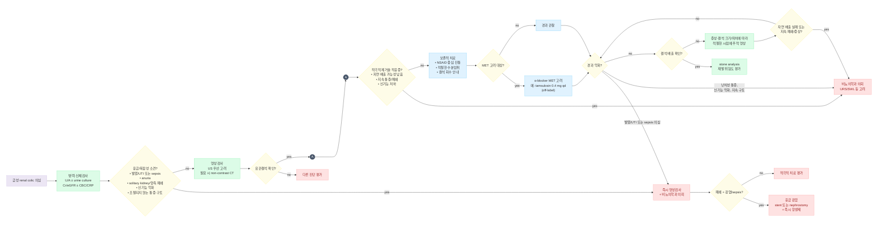

# 요로 결석 (요로결석증) Urolithiasis

## <mark style="color:green;">일반 사항</mark>

* 신장부터 요도까지의 요로 계통에 발생하는 결석
* urinary crystal이 결합하여 nidus를 만들고 calculus로 성장
  * supersaturation과 dehydration이 salt 농도를 높이고 결정 응집을 촉진
* 대부분 신장 유래, 드물게 bladder stone
  * bladder stone 원인 : 장기간의 방광 도뇨관 유치, 불완전 방광 비움, 이물/약물 등
* 호발 : 중년 남성; 여성에서의 발생률도 증가 추세
* 자연 배출 가능성은 **결석의 크기와 위치에 따라 다름**
  * 대략 상부 요관 49\~52%, 중부 58\~70%, 원위부 68\~83%에서 자연 배출
  * ＜5 ㎜ 결석은 약 75%, 원위부 요관의 ＜5 ㎜ 결석은 약 89%에서 자연 배출
  * 배출까지 대략 1\~4주 정도 소요될 수 있음(개인차가 큼); 결석이 클수록 자연 배출 가능성 감소
* 유병률 : 일생 동안 약 10%에서 경험. 재발이 흔하며 장기적으로 반복될 수 있음

### <mark style="color:orange;">위험 인자</mark>

* 가족력, 본인의 신장 결석 병력
* 식이 : 많은 동물성 단백질, 정제 탄수화물, 소금, 당 함유 음료 섭취
* 신장 기형 : 말굽콩팥, 요관신우접합부 폐쇄
* 불완전 방광 비움 : 신경인성 방광, BPH
* 비만, 좌식 생활/직업
* 고온 환경/여름철, 탈수
* 흡수 장애 질환 : 크론병, 위장 우회술, 셀리악병, short bowel syndrome
* 대사 질환 : 비만, 당뇨병, 인슐린 저항성, 통풍 등
* 약물(기전별)
  * carbonic anhydrase 억제 : topiramate, zonisamide, acetazolamide → alkaline urine/hypocitraturia, Ca phosphate stone 위험
  * 약물 결정 형성 : 일부 antiretroviral protease inhibitor(예: indinavir), triamterene 등
  * 기타 보고된 약물(상대적으로 근거 수준이 낮은 보고) : loop diuretic, probenecid, guaifenesin(거담제), ephedrine 등

***

## <mark style="color:green;">원인 - 결석의 종류</mark>

* Ca oxalate, Ca phosphate, struvite, uric acid, cystine; mixed stone

#### <mark style="color:$primary;">Calcium stone</mark>

* ＞80% 차지; 주로 Ca oxalate, 드물게 Ca phosphate

**원인**

* 소변 : 적은 소변량, 소변 Ca↑, 소변 oxalate↑(CaOx stone), citrate↓, 높은 소변 pH(CaP stone)
* 해부학적 이상 : medullary sponge kidney, horseshoe kidney
* 식이 섭취 : 수분↓, Ca↓, oxalate↑, K↓, Na↑, sucrose↑, fructose↑, phytate↓, Vit C↑
* 기저 질환 : 부갑상선기능항진증, 통풍, 비만, 당뇨병, distal renal tubular acidosis, IBD, 흡수장애를 유발하는 비만수술, short bowel syndrome

#### <mark style="color:$primary;">Uric acid stone</mark>

* 10\~15% 차지
* 원인 : 산성뇨(pH ＜5.5)가 핵심 위험 인자, hyperuricosuria/hyperuricemia가 동반될 수 있음

#### <mark style="color:$primary;">Struvite stone (Magnesium ammonium phosphate)</mark>

* 5\~10% 차지
* 원인 : urease 생성 균(예: *Proteus*, *Klebsiella*, *Providencia*, 일부 *Pseudomonas* 등)에 의한 UTI, alkaline urine

#### <mark style="color:$primary;">Cystine stone</mark>

* ＜1% 차지
* 원인 : cystinuria(autosomal recessive disorder에 기인)

***

## <mark style="color:green;">임상 양상</mark>

* 무증상 : 요로의 폐쇄가 발생하기 전까지는 증상 없음
* 신장/요관 결석 : 폐쇄 발생 시 간헐적인 극심한 급성 편측 옆구리 통증/압통
* 결석이 하강함에 따라 통증 부위도 하강
  * ureter로 하강하면 → 사타구니 방사통 발생
  * 요관방광접합부에 끼어 있으면 → 방광 자극 증상(빈뇨, 절박뇨), 음경/외음부 방사통 발생
  * 방광으로 들어가면 → 통증 감소
* 혈뇨 : 육안 또는 현미경적 혈뇨가 흔하나 **혈뇨가 없다고 요로결석을 배제할 수 없음**
* 구역, 구토, 빈맥, 식은땀
* **발열이 동반되면 감염성 폐쇄 가능성을 우선 평가**
* 결석의 크기와 증상 정도는 비례하지 않음

***

### <mark style="color:$danger;">🚩 Red Flags!</mark>

<mark style="color:$danger;">**즉각 조치 또는 의뢰**</mark> <mark style="color:$danger;">- 비뇨의학적 응급, 즉시 감압술 필요</mark>

* **폐쇄 + 발열/UTI/sepsis 의심(감염성 폐쇄 요로결석)** → 항생제만으로 치료하지 않고 즉시 요로 감압(ureteral stent 또는 percutaneous nephrostomy) 필요
* anuria
* hemodynamic instability(저혈압 ± 빈맥, 의식 변화 등) → 패혈성 쇼크 의심

<mark style="color:$warning;">**당일 또는 조기 의뢰**</mark>

* solitary kidney의 폐쇄 또는 bilateral obstruction
* Cr 상승/신기능 악화
* 적절한 진통에도 조절되지 않는 통증
* 지속적인 구역/구토로 경구 섭취 불가
* 임신에서 폐쇄 또는 합병증 의심
* 해부학적 이상과 동반된 폐쇄
* ＞10 ㎜ 등 자연 배출 가능성이 낮은 결석
* 의미 있는 hydronephrosis 또는 지속되는 폐쇄

<mark style="color:$info;">**외래 추적 / 추가 평가 계획**</mark> <mark style="color:$info;">- 즉각 위험 낮으나 계획된 재평가 필요</mark>

* 보존적 치료/MET에도 약 30일(4주) 내 배출되지 않거나 지속 폐쇄가 확인되는 경우(AUA 2026 기준; EAU는 고정 기간보다 감염·난치성 통증·신기능 악화 발생 시 즉시 중단을 강조)
* 반복/재발성 결석, 다발성·양측성 결석 또는 결석 크기 증가 → 재발 고위험군 대사 평가 계획
* 지속되거나 과도한 육안혈뇨 → 결석 외 요로상피암 등 다른 원인 평가

***

## <mark style="color:green;">진단</mark>

* 첫 번째 결석 발생 시에도 병력, 기본 혈액/소변검사 및 재발 위험도 평가
* 배출 또는 제거된 결석을 확보할 수 있으면 **stone analysis 시행 권고**

### <mark style="color:orange;">실험실 검사</mark>

* 소변 검사 : U/A(혈뇨, pH, pyuria 등), 감염 의심 시 소변 배양
* 혈액 검사 : Cr/eGFR, 전해질, Ca, uric acid; 감염/전신반응 의심 시 CBC ± CRP
* PTH : 고칼슘혈증 또는 부갑상선기능항진증 의심 시
* 모든 환자에게 일률적인 상세 대사검사를 시행하지는 않으며, 재발 고위험군에서 specific metabolic evaluation 시행

#### <mark style="color:$primary;">대사 이상 검사(결석 평가)</mark>

* 검사 대상 : 재발성 결석 또는 재발 위험이 높은 환자
  * 가족력, 조기 발병, 다발성/양측성 결석, 기존 결석의 확대, 특정 결석 성분(cystine, uric acid, infection stone 등), 해부학적/대사 질환 동반 등
* 급성 발작이 가라앉고 안정된 상태에서 평소 식이·수분 섭취를 유지한 상태로 시행
  * 급성 발작 후 최소 20일 이후, 가능하면 약 3개월 후 평가(안정 상태, 감염 없는 상태 확인)
* 24시간 소변 : **연속 2회 채취**
  * 요량, Cr, pH, Ca, Na, uric acid, oxalate, citrate 등
* 혈액 : Cr/eGFR, Na, K, Ca, P, uric acid 등; 필요 시 PTH
* 결석을 확보할 수 있으면 성분 분석

### <mark style="color:orange;">영상 검사</mark>

* 초음파(US) : 초기 평가에 유용; hydronephrosis 확인, 임신·소아에서 우선 고려
* Non-contrast CT(NCCT) : 급성 요관결석의 가장 정확한 확진검사
  * 결석의 위치·크기·밀도, 폐쇄 정도 및 다른 급성 복통 원인 평가
* 복부 X선(KUB) : radiopaque stone의 위치 확인 및 선택적 추적에 이용
  * radiopaque : Ca stone, struvite stone, cystine stone(비교적 약한 음영, faint radiopaque/ground-glass appearance - sulfur 함유로 인해 순수 radiolucent인 uric acid stone과는 구분됨)
  * radiolucent : uric acid stone(Ca이 혼합되면 radiopaque)
* ✽ IVP는 현재 routine 진단검사로 선호하지 않음
* 육안으로 결석 배출이 확인되지 않거나 증상이 지속되면 임상 상황에 따라 추적 영상검사 고려

### <mark style="color:orange;">감별</mark>

* dysuria : interstitial cystitis(pelvic pain syndrome), 전립선염, 요로 감염, 질염
* 발열, 오한 : 신우신염, infected obstructed system
* 혈뇨 : BPH, 사구체 질환, 요로 감염, 요로상피암/전립선 종양
* 구역, 구토 : 위장관 질환, 위장관 또는 요로 폐쇄, 통증에 대한 비특이적 반응
* 통증, 압통
  * 복부 : 위장관 질환, 담낭염
  * 옆구리 : 대상포진, 근골격 질환, 신우신염, 담낭 연관통(우측)
  * 사타구니/골반 : 자궁외임신, 탈장, 난소 염전/기타 난소 질환, PID, pelvic pain syndrome, 전립선염, 고환 질환, 요도염, 질염
  * 치골 상부 : interstitial cystitis, 복막염, 전립선염, 요로 감염
* 빈뇨 : BPH, bladder spasms, 수분 과다 섭취, 고혈당, 요로 감염

***



<p align="center"><strong>급성 요관결석의 진단 및 초기 관리 알고리듬</strong></p>

<p align="center"><em><mark style="color:$info;">Ref. EAU Guidelines on Urolithiasis, 2026; AUA Surgical Management of Kidney and Ureteral Stones Guideline, 2026.</mark></em></p>

***

## <mark style="background-color:$warning;">Management</mark>

### <mark style="color:orange;">치료 방침</mark>

* 급성 통증 : NSAID를 1차 진통제로 사용
* 적절한 환자에서 보존적 관찰 ± medical expulsive therapy(MET)
* 감염성 폐쇄, 난치성 통증, 지속 폐쇄, 신기능 저하 등에서는 비뇨의학과 의뢰 및 적극적 치료
* 재발 예방에서는 충분한 수분 섭취가 핵심


**MET 적용 범위**\
EAU는 특히 **5\~10 ㎜ 원위부 요관결석**에서 α-blocker의 이득이 가장 뚜렷하다고 권고함. AUA 2026은 **≤10 ㎜ 원위부 요관결석에서 MET를 권고**하고, 중부·근위부 ≤10 ㎜에서도 선택적으로 고려할 수 있도록 보다 넓게 제시함



**급성 산통에서 과도한 수액/수분 공급은 도움이 되지 않음**\
결석 배출을 촉진하거나 통증을 줄인다는 근거는 없으며, 재발 예방 목적의 충분한 수분 섭취(2.5\~3 L/d)와는 구분되는 개념


***

## <mark style="color:green;">비-약물 치료 및 예방</mark>

* **재발 예방을 위한 hydration**
  * 목표 소변량 : 2\~2.5 L/d 이상, 고위험 환자에서는 가능하면 ＞2.5 L/d
  * 일반적으로 수분 섭취량 2.5\~3 L/d 정도를 권고하되 체격, 활동량, 기후, 심·신장 기능에 따라 조절
  * 수분은 물을 우선 권고; 알코올·당 함유 음료를 결석 예방을 위한 수분 공급원으로 권장하지 않음
  * ✽심부전, 진행성 만성신장병 등 수분 제한이 필요한 환자에서는 목표 수분량을 개별화
* 균형 잡힌 식단
  * 식이 Ca : 1\~1.2 g/d 정도의 정상 섭취 유지(과도한 제한 금지)
  * 소금 제한 : 대략 4\~5 g/d
  * 동물성 단백질 과다 섭취 제한 : 약 0.8\~1 g/㎏/d 범위 고려
  * 적정 체중 유지, 과도한 당/과당 섭취 제한

***

## <mark style="color:green;">약물 치료</mark>

### <mark style="color:orange;">배출 촉진 - Medical Expulsive Therapy(MET)</mark>

* α-blocker는 요관 평활근을 이완하여 적절한 환자에서 결석 배출을 촉진할 수 있음
* EAU : 5\~10 ㎜ 원위부 요관결석에서 이득이 가장 뚜렷하며, 적극적 제거술 적응증이 없는 환자에서 고려
* AUA 2026 : ≤10 ㎜ 원위부 요관결석에서 α-blocker MET를 권고, 중부·근위부 ≤10 ㎜에서는 선택적으로 고려 가능
* **국내 요로결석에 대한 α-blocker 사용은 off-label**임을 설명
* 부작용 : 기립성 저혈압·어지럼 외에도 역행성 사정 등 사정 장애가 발생할 수 있음
* 감염, refractory pain, renal function deterioration 등이 발생하면 MET 중단 후 적극적 치료 평가
* AUA 2026 기준 약 30일(4주)간 MET를 시행 후 재평가하되, 합병증 발생 시 기간을 기다리지 않고 즉시 재평가

#### <mark style="color:$primary;">α1-차단제</mark>

* tamsulosin : 0.4 ㎎ qd <mark style="color:blue;">\[하루날 디]</mark> (☞ [전립선비대증](124_-benign-prostatic-hyperplasia-bph.md#a1-a1-adrenoceptor-antagonist))

### <mark style="color:orange;">통증 완화</mark>

#### <mark style="color:$primary;">NSAID - 1차 선택</mark>

* ibuprofen : 400\~800 ㎎ tid <mark style="color:blue;">\[부루펜]</mark>
* dexibuprofen : 300 ㎎ tid <mark style="color:blue;">\[애니펜]</mark>
* naproxen : 500 ㎎ bid <mark style="color:blue;">\[낙센]</mark>
* 신기능 저하, 탈수, 소화성궤양/출혈 위험, 심혈관 위험 등 NSAID 금기·주의사항 확인

#### <mark style="color:$primary;">Acetaminophen</mark>

* NSAID 금기 또는 추가 진통이 필요한 경우 고려 <mark style="color:blue;">\[타이레놀 이알]</mark>

#### <mark style="color:$primary;">진경제</mark>

* 국내에서 병용되는 경우가 있으나 **NSAID에 routine으로 추가하여 renal colic의 진통 효과를 개선한다는 근거는 부족함**
* 대표 처방의 필수 약제로 권장하지 않으며, 필요 시 환자별로 선택적으로 고려
  * tiropramide : 100 ㎎ tid <mark style="color:blue;">\[티로파]</mark>
  * phloroglucinol : 160 ㎎ tid <mark style="color:blue;">\[후로스판]</mark>
  * cimetropium : 50 ㎎ tid <mark style="color:blue;">\[알기론]</mark>
  * scopolamine butylbromide : 10\~20 ㎎ tid\~qid <mark style="color:blue;">\[부스코판]</mark>
  * (☞ [소화기계약제](../224_/073_.md#gi-antispasmodic-agent))

#### <mark style="color:$primary;">마약성 진통제</mark>

* NSAID로 조절되지 않거나 NSAID를 사용할 수 없는 경우 선택적으로 고려
* ibuprofen/codeine/acetaminophen <mark style="color:blue;">\[마이폴]</mark>
* hydrocodone/acetaminophen <mark style="color:blue;">\[하이코돈]</mark>
* meperidine <mark style="color:blue;">\[데메롤]</mark>은 구역/구토 등 부작용 때문에 가급적 피함

### <mark style="color:orange;">구역, 구토 조절</mark>

* 필요 시 항구토제 사용
* 지속적인 구토로 경구 섭취가 불가능하면 입원/비뇨의학과 평가 고려

### <mark style="color:orange;">재발 예방 약물</mark>

#### <mark style="color:$primary;">Calcium stone</mark>

**식이**

* Ca oxalate stone
  * 과도한 oxalate 섭취 제한 : 시금치·대황·견과류·초콜릿 등
  * 과도한 동물성 단백질, 소금, sucrose/fructose 섭취 제한
  * 고용량 Vit C 보충제 피함
  * 식이 calcium은 과도하게 제한하지 않음(Ca 섭취 부족 → 장내 oxalate 결합 Ca 감소 → oxalate 흡수↑ → 소변 oxalate↑ → 결석 형성↑ 가능)
  * calcium 보충제가 필요한 경우 식사와 함께 복용하는 것이 oxalate 결합에 유리할 수 있음
* Hypocitraturia : 과일·채소 섭취 증가 및 필요 시 potassium citrate 고려

**약물** (재발성 결석에서 장기 예방 목적)

* Hypercalciuria 및 재발성 calcium stone
  * 우선 sodium 섭취 제한
  * 지속되는 hypercalciuria에서 thiazide 계열 고려
    * hydrochlorothiazide : 25 ㎎ qd <mark style="color:blue;">\[다이크로짇]</mark>
    * ✽반응이 불충분하면 25 ㎎ bid로 증량하거나 indapamide, chlorthalidone 등 long-acting thiazide로 교체를 고려할 수 있음(국내 가용성·보험기준 확인 필요)
    * ✽재발 감소를 위한 **장기(수개월\~수년) 예방 목적** 약물이며 급성 통증기 약물이 아님; 저칼륨혈증·통풍 악화 등 모니터링 필요
  * hypocitraturia가 동반되면 potassium citrate 병용 고려
* Hypocitraturia
  * potassium citrate : 10\~20 mEq bid <mark style="color:blue;">\[유로시트라-케이]</mark>
  * ✽과도한 urine alkalinization은 Ca phosphate stone 위험을 높일 수 있으므로 urine pH 모니터링
* Hyperoxaluria
  * 장성(enteric) hyperoxaluria와 원발성(primary) hyperoxaluria는 접근이 다름
  * enteric hyperoxaluria : oxalate 및 지방 과다 섭취 제한, 충분한 수분, 식사와 함께 calcium 섭취 ± alkaline citrate 고려
  * primary hyperoxaluria 의심 시 전문의 평가; 일부 병형에서 pyridoxine 사용 가능

#### <mark style="color:$primary;">Uric acid stone</mark>

**기존 결석의 용해(oral chemolysis)**

* 순수 uric acid stone은 경구 알칼리화로 용해 가능
* potassium citrate 또는 sodium bicarbonate로 urine pH를 대략 **7.0\~7.2**로 조절
* 환자가 urine pH를 자가 측정하면서 용량을 조절하도록 교육
* 지나친 알칼리화는 Ca phosphate stone 형성을 촉진할 수 있어 주의
* 폐쇄가 있는 경우 필요 시 urinary drainage 병행

**재발 예방**

* 충분한 수분 섭취 및 purine 과다 섭취 제한
* 지속적인 산성뇨 교정을 위해 alkaline citrate 사용
* hyperuricosuria가 있는 경우 allopurinol 고려
  * allopurinol : 100\~300 ㎎/d <mark style="color:blue;">\[자이로릭]</mark> - 신기능에 따라 용량 조절

#### <mark style="color:$primary;">Cystine stone</mark>

* 매우 충분한 수분 섭취로 높은 urine volume 유지
* potassium citrate 등으로 **urine pH 7.5\~8.0** 범위로 알칼리화(8.0 초과 시 Ca phosphate stone 위험 급증에 주의)
* 충분한 수분·알칼리화로 조절되지 않는 고위험 cystinuria에서는 **tiopronin** 등 cystine-binding thiol drug를 전문의 영역에서 고려
* D-penicillamine은 부작용 때문에 제한적으로 사용
* captopril은 현재 표준적 1차 chelating agent로 보지 않음

#### <mark style="color:$primary;">결석 종류별 목표 urine pH</mark>

<table><thead><tr><th width="180">결석/상황</th><th>urine pH 목표 또는 주의</th></tr></thead><tbody><tr><td>Uric acid stone 용해</td><td>7.0~7.2</td></tr><tr><td>Uric acid stone 재발 예방</td><td>산성뇨 교정; 과도한 알칼리화 주의</td></tr><tr><td>Cystine stone</td><td>7.5~8.0(8.0 초과 시 Ca phosphate stone 위험 증가)</td></tr><tr><td>Calcium oxalate + hypocitraturia</td><td>citrate 보충 시 과도한 pH 상승 주의</td></tr><tr><td>Calcium phosphate stone</td><td>높은 urine pH가 결석 형성을 촉진할 수 있어 과도한 알칼리화 주의</td></tr></tbody></table>

***

## <mark style="color:green;">시술 및 기타 처치</mark>

### <mark style="color:orange;">적응증</mark>

* 자연 배출 가능성이 낮은 결석
* 적절한 진통에도 지속되는 통증
* 지속적인 요로 폐쇄
* 신기능 저하(renal failure, bilateral obstruction, solitary kidney의 폐쇄)
* 감염 동반 시에는 우선 응급 감압 후 감염 조절, definitive stone treatment는 이후 시행

#### <mark style="color:$primary;">ESWL (SWL)</mark>

* 신결석 및 일부 요관결석에 적용
* 성공률은 결석 크기·위치·밀도 및 환자 해부학 등에 따라 달라짐
* 성공률이 낮아지는 상황 : 비만(피부-결석 거리 증가), 큰 결석, 하부 신배·하부 요관 결석 등 - 이런 경우 URS/PCNL을 우선 고려
* 금기/부적합 : 임신, 교정되지 않은 출혈성 질환, 조절되지 않은 UTI, 결석 원위부의 해부학적 폐쇄 등
* 잔류 결석이 있는 경우 임상적 의미에 따라 추적 관리

#### <mark style="color:$primary;">요관경하 결석제거술 (Ureteroscopy, URS)</mark>

* 요관 및 일부 신결석에 적용
* SWL보다 한 번의 시술로 stone-free가 될 가능성이 높으나 시술 관련 합병증은 더 많을 수 있음
* **uncomplicated URS 후 routine ureteral stenting은 권장되지 않음**
* 요관 손상, 잔류 결석, 감염, 출혈, difficult access 등 필요성이 있는 경우 stent 선택적 사용

#### <mark style="color:$primary;">경피적 신쇄석술 (Percutaneous Nephrolithotomy, PCNL)</mark>

* **＞2 ㎝ 신결석의 1차 치료**; staghorn/complex calculi 등에 특히 적합
* PCNL이 불가능하거나 금기인 경우 flexible URS/RIRS 또는 SWL을 대안으로 고려할 수 있으나 추가 시술 가능성이 높아질 수 있음

***

## <mark style="color:green;">추적 관리</mark>

* 보존적 치료 중
  * 고정된 간격으로 반복 영상검사를 시행하기보다 **증상, 결석의 크기·위치, 배출 확인 여부에 따라 적절한 시점에 재평가**
  * 발열/UTI, refractory pain, renal function deterioration, 지속 구토가 발생하면 즉시 재평가
* 적극적 치료 후 잔류 결석 평가 : 시술 종류와 임상 상황에 따라 US/KUB/NCCT 선택
* 대사 예방 치료 후 : 약물 예방 치료 시작 8\~12주 후 24시간 소변 재검 → 이상 소견이 지속되면 치료 조정 후 재검; 정상화되면 대체로 연 1회 평가

***

### <mark style="color:red;">질병코드</mark>

N20.0 신결석

N20.1 요관결석

N20.2 신결석, 요관결석 동반

N20.9 상세불명의 신장 및 요관의 결석

N21.0 방광의 결석

***

## <mark style="color:purple;">처방례</mark>

> **처방례 1. 급성 통증**
>
> ```
> 애니펜정 300 ㎎/T[dexibuprofen]  1T tid  식후
> 타이레놀 이알 650 ㎎/T  1~2T tid  필요시 추가(acetaminophen 1일 최대 4,000 ㎎)
> ```
>
> _✽애니펜(dexibuprofen)이 곧 NSAID이며 1차 진통제로 사용; NSAID 금기(신기능 저하, 소화성 궤양력, 항응고제 사용 등)를 확인. 진경제의 routine 병용은 권장하지 않음_

> **처방례 2. Medical Expulsive Therapy (5\~10 ㎜ 원위 요관 결석)**
>
> ```
> 하루날 디 0.4 ㎎/T  1T qd
> 애니펜정 300 ㎎/T[dexibuprofen]  1T tid  통증 시
> ```
>
> _✽요로결석에 대한 α-blocker 사용은 off-label; 약 30일(4주)간 시도 후 미배출 시 영상 재평가 및 비뇨의학과 의뢰. 기립성 저혈압·사정 장애 등 부작용 주의 교육 필요_

> **처방례 3. NSAID 단독으로 통증 조절이 불충분한 경우**
>
> ```
> 마이폴[acetaminophen 250 ㎎+ibuprofen 200 ㎎+codeine 10 ㎎]  1T tid  식후
> ```
>
> _✽마이폴은 그 자체에 **ibuprofen(NSAID)이 포함**되어 있으므로 NSAID 단독 요법에 반응이 불충분한 환자에게 추가 진통 목적으로 사용; NSAID 금기 환자에게는 사용하지 않음(→ 처방례 3-1 참고). 타이레놀 이알과 병용 시 acetaminophen 총량이 중복되지 않도록 확인_

> **처방례 3-1. NSAID 금기 환자의 심한 통증**
>
> ```
> 하이코돈[hydrocodone/acetaminophen]  1T tid~qid  통증 시
> ```
>
> _✽NSAID 성분이 없는 opioid/acetaminophen 복합제; 신기능 저하, 소화성 궤양력, 항응고제 사용 등 NSAID 금기 환자에서 선택. meperidine(데메롤)은 구역 부작용으로 지양. 진경제는 routine 병용이 아닌 선택적 추가임을 유의_

> **처방례 4. 재발 예방 (Hypercalciuric calcium stone)**
>
> ```
> 다이크로짇 25 ㎎/T  1T qd  (아침)
> 유로시트라-케이 10 mEq/포  2포 bid
> ```
>
> _✽재발성 calcium stone에서 장기(수개월 이상) 예방 목적으로 사용; 급성 통증기의 약제가 아님. 저칼륨혈증·통풍 악화 여부를 정기적으로 확인_

> **처방례 5. Uric acid stone - 경구 알칼리화(oral chemolysis)**
>
> ```
> 유로시트라-케이 10 mEq/포  2~3포 bid~tid  urine pH 7.0~7.2 목표로 용량 조절
> ```
>
> _✽자가 urine pH 측정으로 용량 조절 교육; 과도한 알칼리화 시 Ca phosphate stone 위험 증가에 주의_

***

### <mark style="color:$success;">핵심 복약 지도</mark>

> **NSAID(애니펜, 부루펜 등)**
>
> * 1차 진통제로 식후 규칙적으로 복용하며, 신기능 저하·소화성 궤양·항응고제 복용 중인 환자는 처방 전 반드시 확인이 필요합니다.
> * 통증이 조절되지 않으면 임의로 용량을 늘리기보다 재내원하여 마약성 진통제 병용 여부를 상의하십시오.

> **α1-차단제(하루날 디 등, MET)**
>
> * 첫 복용 시 기립성 저혈압으로 어지럼이 생길 수 있으므로 취침 전 복용을 권장하며, 앉았다 일어날 때 천천히 움직이도록 안내합니다.
> * 역행성 사정 등 사정 장애가 발생할 수 있음을 미리 설명합니다.
> * 국내 허가 외 사용(off-label)임을 설명하고, 약 30일(4주) 복용해도 결석이 배출되지 않으면 재평가가 필요합니다.

> **재발 예방 약물(thiazide, citrate)**
>
> * 급성 통증을 없애는 약이 아니라, 재발을 줄이기 위해 **장기간 꾸준히** 복용하는 약임을 설명합니다.
> * thiazide 복용 중에는 정기적인 전해질(K, Mg) 및 요산 수치 확인이 필요합니다.

> **복합 진통제 사용 시 acetaminophen 중복 주의**
>
> * 마이폴(acetaminophen 250 ㎎ 포함)과 타이레놀을 함께 처방할 경우 1일 총 acetaminophen 용량이 4,000 ㎎을 넘지 않도록 확인합니다.

> **언제 다시 병원을 방문해야 하나요?**
>
> * 38℃ 이상의 발열 또는 오한이 동반되는 경우 - 즉시 내원
> * 진통제로 조절되지 않는 극심한 통증 또는 반복되는 구토 - 즉시 내원
> * 소변량이 급격히 줄거나 없는 경우 - 즉시 내원
> * 약 30일(4주) 이내에 결석 배출이 확인되지 않는 경우 - 예약 재내원

***

### <mark style="color:blue;">환자 안내서</mark>


**요로 결석, 통증은 심해도 대부분 저절로 좋아질 수 있습니다**

요로 결석은 소변 속 성분이 뭉쳐 신장이나 요관에 돌처럼 굳어지는 질환입니다. 크기가 작을수록, 요관 아래쪽에 위치할수록 자연 배출 가능성이 높으나, 통증 조절과 경과 관찰이 중요합니다.


#### <mark style="color:$primary;">왜 생기나요?</mark>

* 소변이 너무 진하거나(수분 섭취 부족) 특정 성분(칼슘, 옥살산, 요산 등)이 많이 배출되면 결정이 뭉쳐 돌이 됩니다.
* 짠 음식, 동물성 단백질(고기·생선·달걀) 과다 섭취, 탄산음료, 비만, 더운 날씨에서의 땀 배출 등이 위험을 높입니다.
* 가족 중 결석이 있었던 경우 본인도 발생 위험이 높습니다.

#### <mark style="color:$primary;">일상생활에서 어떻게 관리하나요?</mark>

* **물을 하루 2.5\~3 L 정도 충분히 드십시오.** 소변이 맑거나 옅은 노란색을 유지하는 정도가 목표입니다. 다만 물을 많이 마시는 것은 **재발 예방**에 도움이 되는 것이지, 지금 당장의 심한 통증을 줄이거나 결석을 빨리 내보내는 방법은 아닙니다.
* **짠 음식과 고기·생선·달걀 등 동물성 단백질을 적당히 줄이십시오.**
* 칼슘을 일부러 줄일 필요는 없습니다. 오히려 적당한 칼슘 섭취가 결석 예방에 도움이 됩니다.
* 시금치, 근대 등 수산(oxalate)이 많은 채소나 초콜릿을 과도하게 섭취하지 않는 것이 좋습니다.
* 적정 체중을 유지하고 규칙적으로 움직이십시오.

#### <mark style="color:$primary;">약은 어떻게 써야 하나요?</mark>

* 통증약(NSAID)은 식후 규칙적으로 복용하며, 위장 장애가 있으면 알려 주십시오.
* 배출을 돕는 약(α1-차단제)은 어지럼이 생길 수 있어 취침 전 복용하고, 일어날 때 천천히 움직이십시오.
* 재발 방지약(이뇨제, citrate 제제 등)은 통증을 없애는 약이 아니라 **꾸준히 오래 복용해야 효과가 있는 예방약**입니다.
* 가능하면 소변으로 나온 돌을 체로 걸러 모아 성분 검사를 받으시면 이후 예방에 큰 도움이 됩니다.

#### <mark style="color:$primary;">이럴 때는 즉시 병원을 방문하세요</mark>

* **38℃ 이상의 열이나 오한**이 함께 있는 경우
* 진통제를 먹어도 **참기 힘든 통증**이거나 **구토가 반복**되는 경우
* 소변이 거의 나오지 않는 경우
* 약 한 달(30일)이 지나도 결석이 나온 것을 확인하지 못한 경우 - 예약된 날짜에 꼭 재검사를 받으십시오
