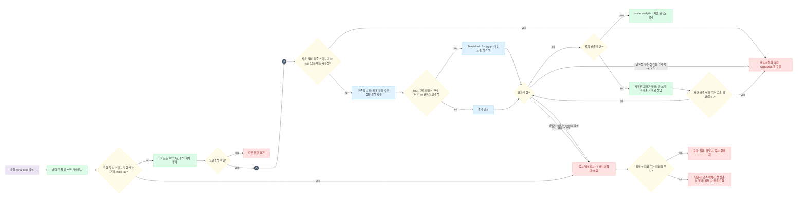

# 요로 결석 (요로결석증) Urolithiasis

## <mark style="color:green;">일반 사항</mark>

* 신장부터 요도까지의 요로 계통에 발생하는 결석
* urinary crystal이 결합하여 nidus를 만들고 calculus로 성장
  * supersaturation과 dehydration이 salt 농도를 높이고 결정 응집을 촉진
* 대부분 신장 유래, 드물게 bladder stone
  * bladder stone 원인 : 장기간의 방광 도뇨관 유치, 불완전 방광 비움, 이물/약물 등
* 호발 : 중년 남성; 여성에서의 발생률도 증가 추세
* 아래 자연 배출 수치는 **요관결석**에 대한 자료이며 신장·방광 결석에 그대로 적용하지 않음
* 자연 배출 가능성은 **결석의 크기와 위치에 따라 다름**
  * 대략 상부 요관 49\~52%, 중부 58\~70%, 원위부 68\~83%에서 자연 배출
  * ＜5 ㎜ 결석은 약 75%, 원위부 요관의 ＜5 ㎜ 결석은 약 89%에서 자연 배출
  * 배출까지 대략 1\~4주 정도 소요될 수 있음(개인차가 큼); 결석이 클수록 자연 배출 가능성 감소
* 유병률은 국가·연령·조사 방법에 따라 다름; 재발이 흔하여 첫 발생부터 재발 위험도 평가와 예방 교육이 필요함

### <mark style="color:orange;">위험 인자</mark>

* 가족력, 본인의 신장 결석 병력
* 식이 : 많은 동물성 단백질, 정제 탄수화물, 소금, 당 함유 음료 섭취
* 신장 기형 : 말굽콩팥, 요관신우접합부 폐쇄
* 불완전 방광 비움 : 신경인성 방광, BPH
* 비만, 좌식 생활/직업
* 고온 환경/여름철, 탈수
* 흡수 장애 질환 : 크론병, 위장 우회술, 셀리악병, short bowel syndrome
* 대사 질환 : 비만, 당뇨병, 인슐린 저항성, 통풍 등
* 약물(기전별)
  * carbonic anhydrase 억제 : topiramate, zonisamide, acetazolamide → alkaline urine/hypocitraturia, Ca phosphate stone 위험
  * 약물 결정 형성 : 일부 antiretroviral protease inhibitor(예: indinavir), triamterene 등
  * 소변 Ca 배설 증가 : loop diuretic(특히 장기간 투여 또는 미숙아에서 주의)
  * 기타 보고된 약물 : probenecid, guaifenesin(거담제), ephedrine 등

***

## <mark style="color:green;">원인 - 결석의 종류</mark>

* Ca oxalate, Ca phosphate, struvite, uric acid, cystine; mixed stone

#### <mark style="color:$primary;">Calcium stone</mark>

* 가장 흔한 결석; 주로 Ca oxalate이며 Ca phosphate 또는 혼합 결석도 있음

**원인**

* 소변 : 적은 소변량, 소변 Ca↑, 소변 oxalate↑(CaOx stone), citrate↓, 높은 소변 pH(CaP stone)
* 해부학적 이상 : medullary sponge kidney, horseshoe kidney
* 식이 섭취 : 수분↓, Ca↓, oxalate↑, K↓, Na↑, sucrose↑, fructose↑, phytate↓, Vit C↑
* 기저 질환 : 부갑상선기능항진증, 통풍, 비만, 당뇨병, distal renal tubular acidosis, IBD, 흡수장애를 유발하는 비만수술, short bowel syndrome

#### <mark style="color:$primary;">Uric acid stone</mark>

* 비율은 지역과 환자군에 따라 다름; 비만·당뇨병·대사증후군과 관련됨
* 원인 : 산성뇨(pH ＜5.5)가 핵심 위험 인자, hyperuricosuria/hyperuricemia가 동반될 수 있음

#### <mark style="color:$primary;">Struvite stone (Magnesium ammonium phosphate)</mark>

* 감염 결석; 비율은 지역과 환자군에 따라 다름
* 원인 : urease 생성 균(예: *Proteus*, *Klebsiella*, *Providencia*, 일부 *Pseudomonas* 등)에 의한 UTI, alkaline urine

#### <mark style="color:$primary;">Cystine stone</mark>

* ＜1% 차지
* 원인 : cystinuria(autosomal recessive disorder에 기인)

***

## <mark style="color:green;">임상 양상</mark>

* 무증상 신결석이 흔하지만 **폐쇄 없이 혈뇨·불편감이 생기거나, 폐쇄가 있어도 통증이 없을 수 있음**
* 신장/요관 결석 : 폐쇄 발생 시 간헐적인 극심한 급성 편측 옆구리 통증/압통
* 결석이 하강함에 따라 통증 부위도 하강
  * ureter로 하강하면 → 사타구니 방사통 발생
  * 요관방광접합부에 끼어 있으면 → 방광 자극 증상(빈뇨, 절박뇨), 음경/외음부 방사통 발생
  * 방광으로 들어가면 → 통증 감소
* 혈뇨 : 육안 또는 현미경적 혈뇨가 흔하나 **혈뇨가 없다고 요로결석을 배제할 수 없음**
* 구역, 구토, 빈맥, 식은땀
* **발열·오한 또는 전신 상태 악화가 동반되면 감염성 폐쇄 가능성을 우선 평가**; 고령자·면역저하자 등에서는 발열 없이도 중증 감염이 가능함
* 결석의 크기와 증상 정도는 비례하지 않음

***

### <mark style="color:$danger;">🚩 Red Flags!</mark>

<mark style="color:$danger;">**즉각 조치 또는 의뢰**</mark> <mark style="color:$danger;">- 응급실·비뇨의학과에서 즉시 평가 및 필요 시 감압</mark>

* **폐쇄 + UTI/sepsis 의심** → 소변·혈액 배양 및 즉시 항생제, 응급 요로 감압(ureteral stent 또는 percutaneous nephrostomy); 항생제만으로 치료하거나 배양 결과를 기다려 감압을 지연하지 않음
* anuria 또는 폐쇄에 의한 급성 신손상
* **solitary kidney의 폐쇄 또는 bilateral obstruction** → 응급 평가 및 신기능·소변량에 따라 신속한 감압
* hemodynamic instability(저혈압, 의식 변화 등) → 패혈성 쇼크 및 다른 응급 질환 평가·소생술

<mark style="color:$warning;">**당일~수일 내 평가**</mark>

* 적절한 진통에도 조절되지 않는 통증 또는 지속 구토로 경구 섭취 불가 **(당일)**
* Cr 상승/신기능 악화 **(당일; 폐쇄성 급성 신손상은 즉각 조치)**
* 임신에서 폐쇄 또는 합병증 의심 **(당일)**
* 의미 있는 hydronephrosis, 지속 폐쇄 또는 해부학적 이상과 동반된 폐쇄 → 신기능·증상에 따라 당일 또는 수일 내 비뇨의학과 평가; 지속 폐쇄를 단순 외래 관찰 대상으로 두지 않음

<mark style="color:$info;">**외래 추적 / 추가 평가 계획**</mark> <mark style="color:$info;">- 합병증 없고 상태 안정 시 계획된 평가</mark>

* ＞10 ㎜ 등 자연 배출 가능성이 낮은 요관결석 → 비뇨의학과 조기 치료 계획(크기만으로 응급 감압 적응증은 아님)
* 보존적 치료/MET로 약 30일 내 배출이 확인되지 않으면 영상 재평가 및 적극적 치료 상담(AUA 2026); 합병증이 생기면 이 기간을 기다리지 않음
* 반복/재발성 결석, 다발성·양측성 결석 또는 크기 증가 → 대사 평가 계획
* 지속되거나 과도한 육안혈뇨 → 결석 외 원인 평가; 혈괴로 인한 요폐·빈혈·혈역학적 이상은 당일 또는 응급 평가

***

## <mark style="color:green;">진단</mark>

* 첫 번째 결석 발생 시에도 병력, 기본 혈액/소변검사 및 재발 위험도 평가
* 배출 또는 제거된 결석을 확보할 수 있으면 **stone analysis 시행 권고**

### <mark style="color:orange;">실험실 검사</mark>

* 소변 검사 : U/A(혈뇨, pH, pyuria 등), 감염 의심 시 소변 배양
* 혈액 검사 : Cr/eGFR, 전해질, Ca, uric acid; 급성 산통 평가 시 CBC·CRP 포함 고려
* 감염성 폐쇄/sepsis 의심 시 혈액 배양도 시행하되 항생제·감압을 지연하지 않음
* 임신 가능성이 있으면 임신 여부 확인 후 영상검사·약물 선택
* PTH : 고칼슘혈증 또는 부갑상선기능항진증 의심 시
* 모든 환자에게 일률적인 상세 대사검사를 시행하지는 않으며, 재발 고위험군에서 specific metabolic evaluation 시행

#### <mark style="color:$primary;">대사 이상 검사(결석 평가)</mark>

* 검사 대상 : 재발성 결석 또는 재발 위험이 높은 환자
  * 가족력, 조기 발병, 다발성/양측성 결석, 기존 결석의 확대, 특정 성분(cystine, uric acid, infection stone, brushite 등), CKD·단일신, 해부학적/대사 질환 동반 등
* 급성 발작이 가라앉고 안정된 상태에서 평소 식이·수분 섭취를 유지한 상태로 시행
  * 급성 발작 후 최소 20일 이후, 가능하면 약 3개월 후 평가(안정 상태, 감염 없는 상태 확인)
* 24시간 소변 : **연속 2회 채취**
  * 요량, Cr, pH, Ca, Na, uric acid, oxalate, citrate 등
* 혈액 : Cr/eGFR, Na, K, Ca, P, uric acid 등; 필요 시 PTH
* 결석을 확보할 수 있으면 성분 분석

### <mark style="color:orange;">영상 검사</mark>

* 초음파(US) : 초기 평가에 유용; hydronephrosis 확인, 임신·소아에서 우선 고려
* 발열, 단일신 또는 진단 불확실 시 **즉시 영상 평가**; 진통·패혈증 처치를 지연하지 않음
* Non-contrast CT(NCCT) : 급성 요관결석의 가장 정확한 확진검사; 가능한 경우 저선량 프로토콜 사용
  * 결석의 위치·크기·밀도, 폐쇄 정도 및 다른 급성 복통 원인 평가
  * KUB에서 보이지 않는 uric acid stone도 NCCT에서는 확인 가능; indinavir 등 일부 약물 결석은 CT에서도 보이지 않을 수 있음
  * 임신 : US 우선 → 필요한 경우 MRI → 여전히 진단이 불확실하고 결과가 치료에 영향을 주면 전문의 판단 아래 저선량 CT를 최후 수단으로 고려
* 복부 X선(KUB) : radiopaque stone의 위치 확인 및 선택적 추적에 이용
  * radiopaque : Ca stone, struvite stone, cystine stone(비교적 약한 음영, faint radiopaque/ground-glass appearance - sulfur 함유로 인해 순수 radiolucent인 uric acid stone과는 구분됨)
  * radiolucent : uric acid stone(Ca이 혼합되면 radiopaque)
* ✽ IVP는 현재 routine 진단검사로 선호하지 않음
* **통증 소실만으로 배출을 확정하지 않음**; 배출된 결석을 확보하지 못하면 영상으로 잔류 결석·폐쇄 평가 및 신기능 확인

### <mark style="color:orange;">감별</mark>

* dysuria : interstitial cystitis(pelvic pain syndrome), 전립선염, 요로 감염, 질염
* 발열, 오한 : 신우신염, infected obstructed system
* 혈뇨 : BPH, 사구체 질환, 요로 감염, 요로상피암/전립선 종양
* 구역, 구토 : 위장관 질환, 위장관 또는 요로 폐쇄, 통증에 대한 비특이적 반응
* 통증, 압통
  * 복부 : 위장관 질환, 충수염, 담낭염; 고령자·혈관 위험군에서는 복부대동맥류 파열/대동맥 질환도 배제
  * 옆구리 : 대상포진, 근골격 질환, 신우신염, 담낭 연관통(우측)
  * 사타구니/골반 : 자궁외임신, 탈장, 난소 염전/기타 난소 질환, PID, pelvic pain syndrome, 전립선염, 고환 질환, 요도염, 질염
  * 치골 상부 : interstitial cystitis, 복막염, 전립선염, 요로 감염
* 빈뇨 : BPH, bladder spasms, 수분 과다 섭취, 고혈당, 요로 감염

***


```mermaid
flowchart LR
    subgraph Col1 [" "]
        direction TB

        NodeA["급성 renal colic 의심"] --> NodeB["병력·진찰 및 소변·혈액검사"]

        NodeB --> NodeC{"감염·무뇨·신기능 악화 또는 기타 Red Flag?"}

        NodeC -- yes --> NodeD["즉시 영상검사 · + 비뇨의학과 의뢰"]

        NodeD --> NodeE{"감염성 폐쇄 또는 폐쇄성 무뇨?"}
        NodeE -- yes --> NodeF["응급 감압; 감염 시 즉시 항생제"]
        NodeE -- no --> NodeG["단일신·양측 폐쇄·급성 신손상 평가; 필요 시 신속 감압"]

        NodeC -- no --> NodeH["US 또는 NCCT로 결석·폐쇄 평가"]

        NodeH --> NodeI{"요관결석 확인?"}
        NodeI -- no --> NodeJ["다른 진단 평가"]
        NodeI -- yes --> NodeK(("A"))
    end

    subgraph Col2 [" "]
        direction TB

        NodeK2(("A")) --> NodeL{"지속 폐쇄·통증·신기능 저하 또는 낮은 배출 가능성?"}

        NodeL -- yes --> NodeM["비뇨의학과 의뢰 · URS/SWL 등 고려"]
        NodeL -- no --> NodeN["보존적 치료: 진통·정상 수분섭취·결석 회수"]

        NodeN --> NodeO{"MET 고려 대상? · 주로 5~10 ㎜ 원위 요관결석"}
        NodeO -- yes --> NodeP["Tamsulosin 0.4 ㎎ qd 식후 고려; 허가 외"]
        NodeO -- no --> NodeQ["경과 관찰"]

        NodeP --> NodeR{"경과 악화?"}
        NodeQ --> NodeR

        NodeR -- "발열/UTI 또는 sepsis 의심" --> NodeD
        NodeR -- "무뇨·급성 신손상" --> NodeD
        NodeR -- "난치성 통증·신기능 악화·지속 구토" --> NodeM
        NodeR -- no --> NodeS{"결석 배출 확인?"}

        NodeS -- yes --> NodeT["stone analysis · 재발 위험도 평가"]
        NodeS -- no --> NodeU["계획된 재평가·영상; 약 30일 미배출 시 치료 상담"]

        NodeU --> NodeV{"자연 배출 실패 또는 지속 폐쇄/증상?"}
        NodeV -- yes --> NodeM
        NodeV -- no --> NodeR
    end

    NodeK --> NodeK2

    style Col1 fill:none,stroke:none
    style Col2 fill:none,stroke:none

    classDef startNode fill:#ECE6F4,stroke:#D1C4E9,stroke-width:1px;
    classDef decision fill:#FEFCE8,stroke:#FEF08A,stroke-width:1px;
    classDef alert fill:#FEE2E2,stroke:#FCA5A5,stroke-width:1px,color:#991B1B;
    classDef greenBox fill:#DCFCE7,stroke:#86EFAC,stroke-width:1px;
    classDef blueBox fill:#E0F2FE,stroke:#7DD3FC,stroke-width:1px;
    classDef conn fill:#475569,stroke:#334155,stroke-width:1px,color:#FFFFFF;

    class NodeA startNode;
    class NodeC,NodeE,NodeI,NodeL,NodeO,NodeR,NodeS,NodeV decision;
    class NodeD,NodeF,NodeG,NodeJ,NodeM alert;
    class NodeB,NodeH,NodeT,NodeU greenBox;
    class NodeN,NodeP,NodeQ blueBox;
    class NodeK,NodeK2 conn;
```

<p align="center"><strong>급성 요관결석의 진단 및 초기 관리 알고리듬</strong></p>

<p align="center"><em><mark style="color:$info;">Ref. EAU Guidelines on Urolithiasis, 2026; AUA Surgical Management of Kidney and Ureteral Stones Guideline, 2026.</mark></em></p>

***

## <mark style="background-color:$warning;">Management</mark>

### <mark style="color:orange;">치료 방침</mark>

* 급성 통증 : NSAID를 1차 진통제로 사용
* 적절한 환자에서 보존적 관찰 ± medical expulsive therapy(MET)
* 감염성 폐쇄, 난치성 통증, 지속 폐쇄, 신기능 저하 등에서는 비뇨의학과 의뢰 및 적극적 치료
* 재발 예방에서는 충분한 수분 섭취가 핵심


**MET 적용 범위**\
EAU는 특히 **5\~10 ㎜ 원위부 요관결석**에서 α-blocker의 이득이 가장 뚜렷하다고 권고함. AUA 2026은 **≤10 ㎜ 원위부 요관결석에서 MET를 권고**하고, 중부·근위부 ≤10 ㎜에서도 선택적으로 고려할 수 있도록 보다 넓게 제시함



**급성 산통에서 과도한 수액/수분 공급은 도움이 되지 않음**\
결석 배출을 촉진하거나 통증을 줄인다는 근거는 없으며, 재발 예방 목적의 충분한 수분 섭취(2.5\~3 L/d)와는 구분되는 개념


***

## <mark style="color:green;">비약물 치료 및 예방</mark>

* **재발 예방을 위한 hydration**
  * 목표 소변량 : **24시간 ＞2.5 L**(EAU); 수분 섭취량과 실제 소변량을 구분함
  * 일반적으로 수분 섭취량 2.5\~3 L/d 정도를 권고하되 체격, 활동량, 기후, 심·신장 기능에 따라 조절
  * 수분은 물을 우선 권고; 알코올·당 함유 음료를 결석 예방을 위한 수분 공급원으로 권장하지 않음
  * ✽심부전, 진행성 만성신장병 등 수분 제한이 필요한 환자에서는 목표 수분량을 개별화
* 균형 잡힌 식단
  * 식이 Ca : 1\~1.2 g/d 정도의 정상 섭취 유지(과도한 제한 금지)
  * 소금(NaCl) 제한 : 대략 4\~5 g/d(나트륨 약 1.6\~2 g/d)
  * 동물성 단백질 과다 섭취 제한 : 약 0.8\~1 g/㎏/d 범위 고려
  * 적정 체중 유지, 과도한 당/과당 섭취 제한

***

## <mark style="color:green;">약물 치료</mark>

### <mark style="color:orange;">배출 촉진 - Medical Expulsive Therapy(MET)</mark>

* α-blocker는 요관 평활근을 이완하여 적절한 환자에서 결석 배출을 촉진할 수 있음
* EAU : 5\~10 ㎜ 원위부 요관결석에서 이득이 가장 뚜렷하며, 적극적 제거술 적응증이 없는 환자에서 고려
* AUA 2026 : ≤10 ㎜ 원위부 요관결석에서 α-blocker MET를 권고, 중부·근위부 ≤10 ㎜에서는 선택적으로 고려 가능
* **국내 요로결석에 대한 α-blocker 사용은 off-label**임을 설명
* 부작용 : 기립성 저혈압·어지럼 외에도 역행성 사정 등 사정 장애가 발생할 수 있음
* 감염, refractory pain, renal function deterioration 등이 발생하면 MET 중단 후 적극적 치료 평가
* AUA 2026 기준 약 30일(4주)간 MET를 시행 후 재평가하되, 합병증 발생 시 기간을 기다리지 않고 즉시 재평가

#### <mark style="color:$primary;">α1-차단제</mark>

* tamsulosin : 0.4 ㎎ qd 식후 <mark style="color:blue;">\[한미탐스캡슐 0.4 ㎎]</mark>
  * 제품별 함량·제형 확인(하루날디정은 0.2 ㎎ 제형임)
  * 선택한 캡슐은 통째로 복용; 기립성 저혈압 환자·임부/임신 가능성이 있는 여성에서는 금기, 혈압강하제·PDE5 억제제 병용 시 저혈압 주의 (☞ [전립선비대증](124_-benign-prostatic-hyperplasia-bph.md#a1-a1-adrenoceptor-antagonist))

### <mark style="color:orange;">통증 완화</mark>

#### <mark style="color:$primary;">NSAID - 1차 선택</mark>

* ibuprofen : 400\~800 ㎎ tid <mark style="color:blue;">\[부루펜]</mark>
* dexibuprofen : 300 ㎎ tid <mark style="color:blue;">\[애니펜]</mark>
* naproxen : 500 ㎎ bid <mark style="color:blue;">\[낙센]</mark>
* 최소 유효용량을 최단기간 사용; 통증 소실 후 일률적인 장기 복용은 피함
* **NSAID끼리 병용하지 않음**; 마이폴에 포함된 ibuprofen도 NSAID임
* AKI·중증 신기능 저하, 탈수, 소화성궤양/출혈 위험, 심혈관 위험 및 임신 여부 등 금기·주의사항 확인
* 심한 급성 산통·구토로 경구 치료가 어렵다면 응급실에서 주사 진통·항구토 치료 및 감압/제거술 평가

#### <mark style="color:$primary;">Acetaminophen</mark>

* NSAID 금기 또는 추가 진통이 필요한 경우 고려; 급성 심한 산통에서는 정맥주사 acetaminophen 등 의료기관 치료를 고려
* acetaminophen 서방정 650 ㎎ : 1회 2정, 8시간 간격 필요 시; **24시간 최대 6정(3,900 ㎎)** <mark style="color:blue;">\[타이레놀8시간이알서방정]</mark>
* 다른 acetaminophen 함유제와 병용 시 전체 용량 확인; 간질환·과음·저체중/쇠약 환자는 더 낮은 한도를 개별 적용; 서방정은 쪼개거나 씹지 않음

#### <mark style="color:$primary;">진경제</mark>

* NSAID에 추가해도 산통의 진통 효과를 개선하지 않으므로 **요로결석 산통 치료 목적으로 권장하지 않음**(EAU; NICE NG118)

#### <mark style="color:$primary;">마약성 진통제</mark>

* NSAID로 조절되지 않거나 NSAID를 사용할 수 없는 경우 선택적으로 고려
* ibuprofen/codeine/acetaminophen <mark style="color:blue;">\[마이폴캡슐]</mark> : 기존 NSAID에 추가하지 않고 **대체**할 때 선택적으로 고려; NSAID 금기 환자에게는 사용하지 않음
* hydrocodone/acetaminophen <mark style="color:blue;">\[하이코돈정5 ㎎(5/325 ㎎)]</mark> : 함량을 명시하고 최저 용량·최단기간 사용; 간·신장 기능 및 호흡억제 위험에 따라 조절
* 졸림·호흡억제·변비·의존성 주의; 음주 및 benzodiazepine 등 진정제 병용을 피하고 운전 금지
* 난치성 통증을 경구 opioid 증량만으로 관리하지 않으며 감압/제거술 적응증 재평가
* meperidine <mark style="color:blue;">\[데메롤]</mark>은 구역/구토 등 부작용 때문에 가급적 피함

### <mark style="color:orange;">구역, 구토 조절</mark>

* 필요 시 항구토제 사용
* 지속 구토로 경구 섭취가 불가능하면 **당일** 응급실/비뇨의학과 평가; 탈수 교정은 필요하지만 배출 촉진 목적의 강제 수액은 시행하지 않음

### <mark style="color:orange;">재발 예방 약물</mark>

#### <mark style="color:$primary;">Calcium stone</mark>

**식이**

* Ca oxalate stone
  * 과도한 oxalate 섭취 제한 : 시금치·대황·견과류·초콜릿 등
  * 과도한 동물성 단백질, 소금, sucrose/fructose 섭취 제한
  * 고용량 Vit C 보충제 피함
  * 식이 calcium은 과도하게 제한하지 않음(Ca 섭취 부족 → 장내 oxalate 결합 Ca 감소 → oxalate 흡수↑ → 소변 oxalate↑ → 결석 형성↑ 가능)
  * calcium 보충제가 필요한 경우 식사와 함께 복용하는 것이 oxalate 결합에 유리할 수 있음
* Hypocitraturia : 과일·채소 섭취 증가 및 필요 시 potassium citrate 고려

**약물** (재발성 결석에서 장기 예방 목적)

* Hypercalciuria 및 재발성 calcium stone
  * 우선 sodium 섭취 제한
  * 지속되는 hypercalciuria에서 thiazide 계열 고려
    * hydrochlorothiazide : 25 ㎎ qd <mark style="color:blue;">\[다이크로짇]</mark>
    * 24시간 소변 Ca·Na, 혈압·전해질 및 재발 상태를 확인한 뒤 증량/변경 판단; 필요 시 25 ㎎ bid(50 ㎎/d) 또는 indapamide, chlorthalidone 등 장시간 작용 제제 고려(국내 제품 가용성·허가·급여 확인)
    * CARI는 식이 교정 후 지속 고칼슘뇨·재발에서 조건부로 thiazide를 권고하며 장시간 작용 제제를 선호함; HCTZ 반응 불충분 시 자동 증량하지 않음
    * 국내 hydrochlorothiazide의 결석 예방 사용은 허가 외임
    * NOSTONE 시험(NEJM 2023)에서 HCTZ 12.5·25·50 ㎎/d의 복합 재발 지표는 위약보다 유의하게 감소하지 않았음. EAU 2026은 고칼슘뇨에서 thiazide를 계속 권고하므로, 식이 교정 후에도 고칼슘뇨·재발이 지속되는 환자에서 이득·위험을 상의하여 선택함
    * 혈압, Na·K, Cr/eGFR, 요산·혈당 모니터링; 저나트륨혈증·저칼륨혈증·통풍·내당능 악화 주의; HCTZ 장기 복용 시 자외선 차단·피부 병변 확인
    * 급성 통증기 약물이 아님; 단순히 소변 Ca가 감소했다는 이유만으로 임상적 재발 예방 효과를 단정하지 않음
  * hypocitraturia가 동반되면 potassium citrate 병용 고려
* Hypocitraturia
  * potassium citrate <mark style="color:blue;">\[유로시트라케이10mEq서방정; 10 mEq/정]</mark>
  * 국내 허가 초회량 : 요중 citrate ＞150 ㎎/d인 경증·중등도는 **10 mEq tid(30 mEq/d)**, ＜150 ㎎/d인 중증은 **20 mEq tid(60 mEq/d)**; 경계값은 전체 대사 상태와 반응에 따라 판단
  * 식사 중 또는 식후에 통째로 복용; urine citrate·pH에 따라 조절하되 **100 mEq/d 초과 투여하지 않음**
  * 과도한 알칼리화는 Ca phosphate stone 위험을 높일 수 있어 pH 모니터링
  * **고칼륨혈증, 만성 신부전, 급성 탈수, 중증 심부전/심근손상 등 칼륨 배설 저하 위험, 칼륨보존성 이뇨제 병용에서는 금기**; 연하·위장관 통과 장애, 항콜린제 투여, 위궤양 및 허가사항의 해당 요로감염 금기도 확인
  * 투여 전 및 투여 중 혈청 K·Cr/eGFR 등 확인; ACE 억제제/ARB·NSAID 등 병용 시 고칼륨혈증 주의
  * 허가사항은 전해질·Cr·CBC를 4개월마다 검사하도록 제시하며, 시작·증량 후 및 위험요인이 있으면 더 일찍 확인
* Hyperuricosuric calcium oxalate stone : 식이 조절 후 allopurinol 고려; 소변 Ca·요산 및 신기능 평가 후 선택

* Hyperoxaluria
  * 장성(enteric) hyperoxaluria와 원발성(primary) hyperoxaluria는 접근이 다름
  * enteric hyperoxaluria : oxalate 및 지방 과다 섭취 제한, 충분한 수분, 식사와 함께 calcium 섭취 ± alkaline citrate 고려
  * primary hyperoxaluria 의심 시 전문의 평가; 일부 병형에서 pyridoxine 사용 가능

#### <mark style="color:$primary;">Uric acid stone</mark>

**기존 결석의 용해(oral chemolysis)**

* 순수 uric acid stone은 경구 알칼리화로 용해 가능
* potassium citrate 또는 sodium bicarbonate로 알칼리화; **EAU 2026 용해 목표 pH 7.0\~7.2**, **AUA 내과적 관리 2026 용해 목표 pH 6.5\~7.0**으로 차이가 있어 전문의가 성분·반응·Ca phosphate 위험에 따라 목표를 정함
* 환자가 urine pH를 자가 측정하면서 용량을 조절하도록 교육
* 지나친 알칼리화는 Ca phosphate stone 형성을 촉진할 수 있어 주의
* 신우·요관 폐쇄를 동반한 uric acid stone에서는 **요로 배액과 함께 용해 치료**를 계획; 감염·신기능 악화 등 응급 소견이면 감압을 우선함
* US/CT 등으로 실제 용해·폐쇄 해소를 확인; pH 교정만으로 치료 성공을 판단하지 않음
* 위 pH 7.0\~7.2는 **EAU의 용해 목표**이며 유로시트라케이 국내 허가사항의 일반 pH 목표 6.0\~7.0과 구분함

**재발 예방**

* 충분한 수분 섭취 및 purine 과다 섭취 제한
* 지속적인 산성뇨 교정을 위해 alkaline citrate 사용; 대체로 urine pH **6.0\~6.5** 목표로 개별화하며 용해 목적의 높은 pH를 계속 유지하지 않음
* hyperuricosuria가 있는 경우 allopurinol 고려
  * allopurinol : 100\~300 ㎎/d <mark style="color:blue;">\[자이로릭]</mark> - 저용량으로 시작하고 신기능에 따라 조절; 단순 산성뇨만 있는 환자의 1차 치료는 알칼리화임
  * 발진·발열·점막 병변 발생 시 즉시 중단·평가; 한국인 등 HLA-B*58:01 위험군, 특히 CKD 동반 시 투여 전 검사 필요성 검토

#### <mark style="color:$primary;">Cystine stone</mark>

* 성인 목표 소변량 **＞3 L/d**; 하루 동안 분산하여 수분 섭취하고 밤 동안의 농축도 줄이도록 교육
* potassium citrate 등으로 **urine pH ＞7.5**를 목표로 전문의가 조절; 대체로 7.5\~8.0 범위에서 자가 측정하며 과도한 알칼리화에 따른 Ca phosphate stone 위험에 주의(8.0을 급격한 위험 변화의 절대 경계로 보지는 않음)
* cystine stone에 대한 유로시트라케이 사용은 국내 허가 외임; 소금·동물성 단백질 제한 병행
* 충분한 수분·알칼리화로 조절되지 않는 고위험 cystinuria에서는 **tiopronin** 등 cystine-binding thiol drug를 전문의 영역에서 고려
* thiol drug 사용 전·중 요단백 및 약제별 혈액검사 등 모니터링; D-penicillamine은 부작용 때문에 제한적으로 사용
* captopril은 현재 표준적 1차 chelating agent로 보지 않음

#### <mark style="color:$primary;">Struvite / infection stone</mark>

* 가능한 한 **완전한 결석 제거**와 감염원·요로 폐쇄/이물 교정이 핵심; 항생제만으로 잔류 감염 결석을 해결하기 어려움
* 지속 세균뇨는 배양 결과에 따른 항생제로 치료; 제거 후 항생제 기간은 잔류 결석·감염 상태에 따라 개별화
* 제거·감염 조절 후 혼합 결석의 대사 이상도 평가; 알칼리화제를 감염 결석 치료 목적으로 사용하지 않음
* 녹각석(staghorn calculus)은 형태를 가리키며 모두 struvite인 것은 아니므로 성분 분석이 필요함

#### <mark style="color:$primary;">결석 종류별 목표 urine pH</mark>

<table><thead><tr><th width="180">결석/상황</th><th>urine pH 목표 또는 주의</th></tr></thead><tbody><tr><td>Uric acid stone 용해</td><td>EAU 2026: 7.0~7.2; AUA 내과적 관리 2026: 6.5~7.0; 전문의가 개별화</td></tr><tr><td>Uric acid stone 재발 예방</td><td>대체로 6.0~6.5; 개별화, 과도한 알칼리화 주의</td></tr><tr><td>Cystine stone</td><td>EAU 목표 ＞7.5; 보통 7.5~8.0에서 조절, 과도한 알칼리화 주의</td></tr><tr><td>Calcium oxalate + hypocitraturia</td><td>citrate 보충 시 과도한 pH 상승 주의</td></tr><tr><td>Calcium phosphate stone</td><td>높은 urine pH가 결석 형성을 촉진할 수 있어 과도한 알칼리화 주의</td></tr></tbody></table>

***

## <mark style="color:green;">시술 및 기타 처치</mark>

### <mark style="color:orange;">적응증</mark>

* 자연 배출 가능성이 낮은 결석
* 적절한 진통에도 지속되는 통증
* 지속적인 요로 폐쇄
* 신기능 저하(renal failure, bilateral obstruction, solitary kidney의 폐쇄)
* 감염 동반 시에는 우선 응급 감압 후 감염 조절, definitive stone treatment는 이후 시행

#### <mark style="color:$primary;">ESWL (SWL)</mark>

* 신결석 및 일부 요관결석에 적용
* 성공률은 결석 크기·위치·밀도 및 환자 해부학 등에 따라 달라짐
* 성공률이 낮아지는 상황 : 긴 피부-결석 거리, 큰 결석, 불리한 하부 신배 해부학, 고밀도(예: ＞1,000 HU)·단단한 결석 등; 원위 요관결석은 SWL도 선택지이나 URS의 1회 성공률이 더 높아 우선 고려 가능
* 하부 신배 ＞1 ㎝ 또는 신결석 ＞2 ㎝에서는 RIRS/PCNL 등 내시경 치료를 우선 검토
* 금기/부적합 : 임신, 교정되지 않은 출혈성 질환, 조절되지 않은 UTI, 결석 원위부의 해부학적 폐쇄, 충격파 경로에 인접한 동맥류 등
* 잔류 결석이 있는 경우 임상적 의미에 따라 추적 관리

#### <mark style="color:$primary;">요관경하 결석제거술 (Ureteroscopy, URS)</mark>

* 요관 및 일부 신결석에 적용
* SWL보다 한 번의 시술로 stone-free가 될 가능성이 높으나 시술 관련 합병증은 더 많을 수 있음
* **uncomplicated URS 후 routine ureteral stenting은 권장되지 않음**
* 요관 손상, 잔류 결석, 감염 위험, 출혈, difficult access 등에서는 stent 선택적 사용; 삽입 시 제거 일정 안내 및 추적

#### <mark style="color:$primary;">경피적 신쇄석술 (Percutaneous Nephrolithotomy, PCNL)</mark>

* **＞2 ㎝ 신결석의 1차 치료**; staghorn/complex calculi 등에 특히 적합
* PCNL이 불가능하거나 금기인 경우 flexible URS/RIRS 또는 SWL을 대안으로 고려할 수 있으나 추가 시술 가능성이 높아질 수 있음

***

## <mark style="color:green;">추적 관리</mark>

* 보존적 치료 중
  * 진단 시 재평가 일정을 정함; 외래에서는 실무적으로 1\~2주 내 초기 재평가를 고려하고 증상·결석 크기/위치·폐쇄 정도에 따라 조절(모든 환자에게 적용하는 지침상의 고정 간격은 아님)
  * 통증·체온·섭취·소변량, 신기능 및 필요 시 US/KUB/저선량 NCCT 확인; 통증이 없어져도 배출을 확인하지 못하면 잔류 폐쇄 평가
  * 약 30일 MET 후 미배출이면 적극적 치료 상담; 지속 폐쇄·신기능 악화 등에서는 기다리지 않음
  * 발열/UTI, refractory pain, renal function deterioration, 지속 구토가 발생하면 즉시 재평가
* 적극적 치료 후 잔류 결석 평가 : 시술 종류와 임상 상황에 따라 US/KUB/NCCT 선택; 잔류 결석 ＞4 ㎜는 추가 치료를 적극 검토
* 무증상 비폐쇄 신결석 : 크기·위치·성분·재발 위험에 따라 영상 추적; 성장·증상·감염·폐쇄 발생 시 치료 상담
* 방광 결석 : BPH·신경인성 방광·도뇨관/이물 등 원인 평가 및 치료; 요관결석 MET를 그대로 적용하지 않음
* 대사 예방 치료 후 : 약물 예방 치료 시작 8\~12주 후 24시간 소변 재검 → 이상 소견이 지속되면 치료 조정 후 재검; 정상화되면 대체로 연 1회 평가

***

### <mark style="color:red;">질병코드</mark>

N20.0 신결석

N20.1 요관결석

N20.2 신결석, 요관결석 동반

N20.9 상세불명의 신장 및 요관의 결석

N21.0 방광의 결석

***

## <mark style="color:purple;">처방례</mark>

✽성인 외래 예시이며 신기능·출혈 위험·임신 여부·병용약을 확인하고 개별 조절함. 난치성 산통·감염·무뇨·급성 신손상에서는 외래 경구 처방보다 당일/응급 평가를 우선함.

> **처방례 1. 합병증 없는 급성 통증**
>
> ```
> 애니펜정 300 ㎎/T[dexibuprofen]  1T tid  통증 시, 식후, 단기간
> 필요 시 추가 : 타이레놀8시간이알서방정 650 ㎎/T  2T q8h prn
> ```
>
> _✽NSAID는 한 가지만 사용. 타이레놀 서방정은 24시간 최대 6정(3,900 ㎎); 다른 acetaminophen 함유제와 중복 확인. 심한 통증이 지속되면 재평가함._

> **처방례 2. MET(주로 5\~10 ㎜ 원위 요관결석)**
>
> ```
> 한미탐스캡슐 0.4 ㎎/C[tamsulosin]  1C qd  식후
> 애니펜정 300 ㎎/T[dexibuprofen]  1T tid  통증 시, 식후, 단기간
> ```
>
> _✽tamsulosin의 요로결석 사용은 국내 허가 외. 약 30일 이내 재평가하되 중간 경과 확인을 계획하고, 감염·신기능 악화·난치성 통증이면 즉시 중단·의뢰. 기립성 저혈압 및 사정 장애 안내._

> **처방례 3. NSAID 단독 효과가 불충분하여 복합제로 대체하는 경우**
>
> ```
> 마이폴캡슐[acetaminophen 250 ㎎+ibuprofen 200 ㎎+codeine phosphate 10 ㎎]/C
> 1C tid  필요 시, 단기간  (기존 NSAID 중단)
> ```
>
> _✽기존 NSAID에 추가하지 않음. NSAID 금기 환자에게 사용하지 않으며, acetaminophen 총량·졸림·호흡억제·변비를 확인함. 조절되지 않는 산통은 약제 변경만으로 지연하지 않고 감압/제거술 평가._

> **처방례 3-1. NSAID 금기이며 acetaminophen만으로 부족한 경우**
>
> ```
> 하이코돈정5 ㎎[hydrocodone tartrate 5 ㎎+acetaminophen 325 ㎎]/T
> 1T q6h prn  단기간
> ```
>
> _✽최저 용량의 예시. 중증 신·간장애에서는 축적 위험이 있어 별도 조절·평가가 필요하며, NSAID 금기라는 이유만으로 자동 선택하지 않음. 다른 opioid·진정제·음주와 병용하지 않으며 운전 금지. 복합제의 acetaminophen도 총량에 포함함._

> **처방례 4. 재발성 calcium stone + 지속 고칼슘뇨**
>
> ```
> 다이크로짇정 25 ㎎/T[hydrochlorothiazide]  1T qd  아침
> ```
>
> _✽저염식 후에도 고칼슘뇨·재발이 지속될 때 이득·위험을 상의하여 선택하는 국내 허가 외 처방. 혈압·Na·K·Cr·요산·혈당 확인. Citrate를 일률적으로 병용하지 않으며 저구연산염뇨 등 별도 적응증이 있을 때 추가함._

> **처방례 4-1. 저구연산염뇨성 calcium oxalate stone**
>
> ```
> 유로시트라케이10mEq서방정 10 mEq/T  1T tid  식사 중
> 중증 저구연산염뇨 시 : 2T tid(60 mEq/d)로 시작 고려
> ```
>
> _✽24시간 urine citrate·pH와 혈청 K·신기능에 따라 조절; 100 mEq/d 초과 금지. 서방정이므로 포 단위로 쓰지 않으며 분할·분쇄·씹기 금지. 고칼륨혈증·만성 신부전 등 금기 확인._

> **처방례 5. Uric acid stone - 경구 용해 치료**
>
> ```
> 유로시트라케이10mEq서방정 10 mEq/T  2T tid(60 mEq/d)  식사 중/식후
> 소변 pH 및 K·신기능에 따라 조절, 100 mEq/d 초과 금지
> ```
>
> _✽초기 용량의 예시이며 전문의와 치료 계획 수립. pH 7.0\~7.2는 EAU 용해 목표이며 AUA 내과적 관리 2026은 6.5\~7.0을 제시함(국내 허가 일반 목표 6.0\~7.0과 구분). 자가 pH 및 영상으로 용해·폐쇄 해소 확인; 폐쇄 시 배액 병행, 감염성 폐쇄는 응급 감압을 우선함._

***

### <mark style="color:$success;">핵심 복약 지도</mark>

> **NSAID(애니펜, 부루펜 등)**
>
> * 통증에 맞추어 처방된 용량으로 단기간 복용합니다. 신기능 저하·탈수·소화성 궤양·항응고제 복용·임신 여부를 확인하며, 다른 NSAID를 함께 먹지 않습니다.
> * 통증이 조절되지 않으면 임의로 증량하지 말고 당일 재평가를 받습니다. 감압 또는 결석 제거가 필요할 수 있습니다.

> **α1-차단제(한미탐스 0.4 ㎎ 등, MET)**
>
> * 선택한 한미탐스캡슐은 하루 한 번 식후 복용합니다. 어지럼·실신 위험이 있으므로 천천히 일어나며, 심한 어지럼이나 실신이 생기면 복용을 중단하고 진료를 받습니다.
> * 역행성 사정 등 사정 장애가 발생할 수 있음을 미리 설명합니다.
> * 국내 허가 외 사용(off-label)임을 설명하고, 약 30일(4주) 복용해도 결석이 배출되지 않으면 재평가가 필요합니다.

> **재발 예방 약물(thiazide, citrate)**
>
> * 급성 통증을 없애는 약이 아니라, 재발을 줄이기 위해 **장기간 꾸준히** 복용하는 약임을 설명합니다.
> * thiazide는 혈압·전해질(Na, K)·신기능·요산·혈당을 확인합니다. Citrate는 혈청 K·신기능과 소변 pH·citrate를 확인합니다.
> * 유로시트라케이는 서방정으로 식사 중/식후 통째로 삼키며, 쪼개거나 씹지 않습니다. 신부전·고칼륨혈증이 있거나 칼륨보존성 이뇨제를 복용하면 처방 전에 반드시 알립니다.

> **복합 진통제 사용 시 acetaminophen 중복 주의**
>
> * 마이폴(250 ㎎/캡슐), 하이코돈5 ㎎(325 ㎎/정), 타이레놀 등의 acetaminophen 총량을 합산합니다. 타이레놀 650 ㎎ 서방정 자체는 24시간 6정(3,900 ㎎) 이내이며, 간질환·과음·쇠약 시에는 더 낮은 한도를 정합니다.
> * 마이폴에는 ibuprofen이 있으므로 애니펜·부루펜·낙센 등 다른 NSAID와 함께 복용하지 않습니다.

> **언제 다시 병원을 방문해야 하나요?**
>
> * 발열·오한 또는 전신 상태 악화가 동반되는 경우 - 즉시 내원(고령자·면역저하자에서는 열이 없어도 중증 감염 가능)
> * 진통제로 조절되지 않는 극심한 통증 또는 반복되는 구토 - 즉시 내원
> * 소변량이 급격히 줄거나 없는 경우 - 즉시 내원
> * 약 30일(4주) 이내에 결석 배출이 확인되지 않는 경우 - 예약 재내원

***

## <mark style="color:blue;">환자 안내서</mark>


**작은 요관결석은 자연 배출될 수 있지만, 배출과 폐쇄 해소 확인이 필요합니다**

요로 결석은 소변 속 성분이 뭉쳐 신장이나 요관에 돌처럼 굳어지는 질환입니다. 크기가 작을수록, 요관 아래쪽에 위치할수록 자연 배출 가능성이 높으나, 통증 조절과 경과 관찰이 중요합니다.


#### <mark style="color:$primary;">왜 생기나요?</mark>

* 소변이 너무 진하거나(수분 섭취 부족) 특정 성분(칼슘, 옥살산, 요산 등)이 많이 배출되면 결정이 뭉쳐 돌이 됩니다.
* 짠 음식, 동물성 단백질 과다 섭취, 설탕·과당이 많이 든 음료, 비만, 더운 날씨에서의 땀 배출 등이 위험을 높입니다.
* 가족 중 결석이 있었던 경우 본인도 발생 위험이 높습니다.

#### <mark style="color:$primary;">일상생활에서 어떻게 관리하나요?</mark>

* **물을 하루 2.5\~3 L 정도 충분히 드십시오.** 보통 하루 소변량 2.5 L 이상이 되도록 조절하고, 더운 날이나 땀을 많이 흘린 날에는 더 필요할 수 있습니다. 심부전·신장병으로 수분 제한을 안내받은 경우에는 담당 의사와 목표량을 정하십시오. 다만 물을 많이 마시는 것은 **재발 예방**에 도움이 되는 것이지, 지금 당장의 심한 통증을 줄이거나 결석을 빨리 내보내는 방법은 아닙니다.
* **짠 음식과 고기·생선·달걀 등 동물성 단백질을 적당히 줄이십시오.**
* 칼슘을 일부러 줄일 필요는 없습니다. 오히려 적당한 칼슘 섭취가 결석 예방에 도움이 됩니다.
* 시금치, 근대 등 수산(oxalate)이 많은 채소나 초콜릿을 과도하게 섭취하지 않는 것이 좋습니다.
* 적정 체중을 유지하고 규칙적으로 움직이십시오.

#### <mark style="color:$primary;">약은 어떻게 써야 하나요?</mark>

* 통증약은 처방된 용량으로 필요한 기간에만 복용하며, 다른 소염진통제를 추가하지 마십시오. 검은 변·피 토함·소변량 감소가 있으면 바로 진료를 받으십시오.
* 배출을 돕는 약(한미탐스캡슐)은 하루 한 번 식후 복용하고 일어날 때 천천히 움직이십시오. 심한 어지럼·실신이 생기면 복용을 중단하고 진료를 받으십시오.
* 재발 방지약(이뇨제, citrate 제제 등)은 통증을 없애는 약이 아니라 **꾸준히 오래 복용해야 효과가 있는 예방약**입니다.
* 가능하면 소변으로 나온 돌을 체로 걸러 모아 성분 검사를 받으십시오. **통증이 없어져도 결석이 나왔다고 단정할 수 없으므로 예약된 재검사를 받으십시오.**

#### <mark style="color:$primary;">이럴 때는 즉시 병원을 방문하세요</mark>

* **발열·오한, 심한 무기력, 의식 변화**가 함께 있는 경우(열이 높지 않아도 기다리지 마십시오)
* 진통제를 먹어도 **참기 힘든 통증**이거나 **구토가 반복**되는 경우
* 소변이 거의 나오지 않는 경우

#### <mark style="color:$primary;">예약된 재검사도 중요합니다</mark>

* 통증이 없어져도 결석 배출을 확인하지 못했다면 예약된 날짜에 재검사를 받으십시오. 약 30일간의 배출촉진요법에도 배출되지 않으면 제거 치료를 상의합니다.
* 담당 의사가 정한 중간 재평가 일정을 지키고, 위 응급 증상이 있으면 예약일을 기다리지 마십시오.

***

### 참고 지침 및 약제 정보

* [Medical Management of Kidney Stones: AUA Guideline (2026), Part II - 확인된 요산석 용해·예방 pH 목표](https://www.auajournals.org/doi/full/10.1097/JU.0000000000005228)
* [CARI Guidelines - Pharmacological Prevention of Kidney Stones](https://www.cariguidelines.org/guidelines/kidney-stones/pharmacological-prevention-of-kidney-stones/)
* [2020 ACR Guideline for the Management of Gout - allopurinol 투여 전 HLA-B*58:01 평가](https://pmc.ncbi.nlm.nih.gov/articles/PMC10563586/)

* [EAU Guidelines on Urolithiasis, 2026 - 진단·응급 처치·MET·수술](https://uroweb.org/guidelines/urolithiasis/chapter/guidelines)
* [EAU Guidelines on Urolithiasis, 2026 - 대사 평가·재발 예방](https://uroweb.org/guidelines/urolithiasis/chapter/metabolic-evaluation-and-recurrence-prevention)
* [Surgical Management of Kidney and Ureteral Stones: AUA Guideline (2026)](https://www.auanet.org/documents/Guidelines/PDF/2025%20Guidelines/Surgical%20Stones%20Unabridged%202026.pdf)
* [NICE NG118. Renal and ureteric stones: assessment and management](https://www.nice.org.uk/guidance/ng118/chapter/recommendations)
* [Dhayat NA, et al. Hydrochlorothiazide and Prevention of Kidney-Stone Recurrence. NEJM 2023;388:781–791.](https://pubmed.ncbi.nlm.nih.gov/36856614/)
* [한미탐스캡슐 0.4 ㎎ 제품설명서(제조사)](https://common.hanmi.co.kr/upfile/ces/product/391efb0e-bb49-4f82-b0f7-fdf580953935.pdf)
* [유로시트라케이10mEq서방정 허가사항(식약처 자료, 약학정보원 제공)](https://health.kr/searchDrug/result_drug.asp?drug_cd=A11AOOOOO9528)
* [하이코돈정5 ㎎ 허가사항(식약처 자료, 약학정보원 제공)](https://health.kr/searchDrug/result_drug.asp?drug_cd=2012040200006)
* [타이레놀8시간이알서방정 허가사항(식약처 자료, 약학정보원 제공)](https://health.kr/searchDrug/result_drug.asp?drug_cd=2022020300026)

✽국외 지침 용량·목표와 국내 제품 허가사항을 구분함. 약제 허가·급여·유통 상태는 실제 처방 시 최신 정보를 확인함. 검토 기준일 : 2026-10-02.
