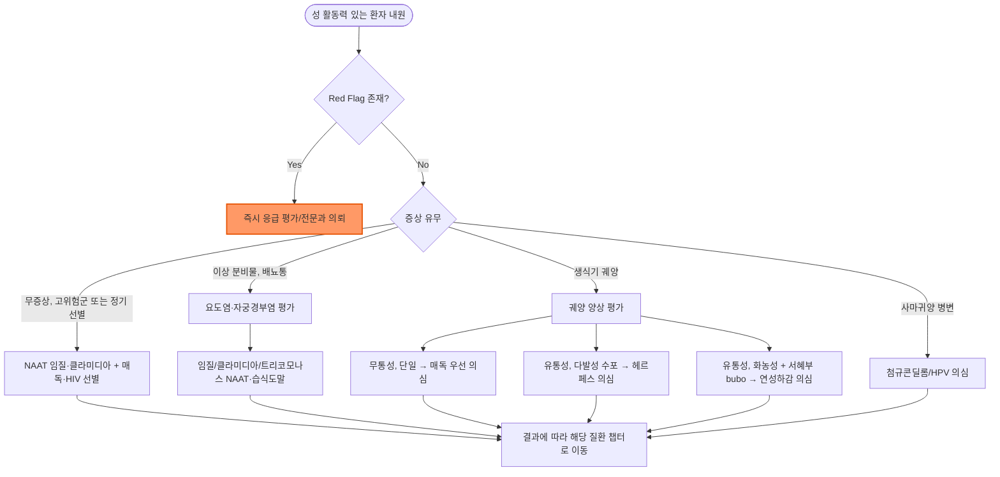

# 성매개감염 총론 (Sexually Transmitted Infections) STI

## <mark style="color:green;">일반 사항</mark>

* 성 접촉(질·항문·구강 성교, 피부 점막 접촉 포함)을 통해 전파되는 감염병의 총칭
* 다른 이름 : 성병(STD, sexually transmitted disease), 성매개감염(STI)\
  ✽과거에는 STD(성병)라는 용어가 통용되었으나, 무증상 감염을 포함하는 현재는 STI가 표준 용어로 사용됨
* 정의 : 세균, 바이러스, 원충, 기생충 등 다양한 병원체에 의해 발생하며, 무증상 감염이 흔해 진단 없이 전파가 지속될 수 있음
* 분류 (병원체별)
  * 세균성 : 매독, 임질, 클라미디아감염증, 연성하감
  * 바이러스성 : 생식기 단순포진(HSV), 첨규콘딜롬(HPV), HIV, B형간염
  * 원충성 : 트리코모나스 질염
  * 기생충성 : 사면발이, 옴 (☞ 피부질환 파트)
* 질병관리청 법정감염병 분류 (2026년 기준)

<table><thead><tr><th width="180">질환</th><th width="90">신고 등급</th><th>수록 위치</th></tr></thead><tbody><tr><td>매독</td><td>3급 (전수감시)</td><td>(☞ [매독](syphilis.md))</td></tr><tr><td>임질</td><td>4급 (표본감시)</td><td>(☞ [임질](gonorrhea.md))</td></tr><tr><td>클라미디아감염증</td><td>4급 (표본감시)</td><td>(☞ [클라미디아감염증](chlamydia.md))</td></tr><tr><td>연성하감</td><td>4급 (표본감시)</td><td>본 챕터 내 수록</td></tr><tr><td>성기단순포진</td><td>4급 (표본감시)</td><td>피부질환 파트 '단순포진' 챕터</td></tr><tr><td>첨규콘딜롬</td><td>4급 (표본감시)</td><td>피부질환 파트</td></tr><tr><td>HIV 감염</td><td>3급 (전수감시)</td><td>감염내과 파트 참조</td></tr></tbody></table>

* 역학 : 국내에서는 클라미디아감염증이 세균성 성매개질환 중 발생률이 가장 높으며, 무증상 비율이 높아 선별검사 없이는 상당수가 진단되지 않음
* 합병증 : 골반염(PID), 불임, 만성 골반통, 자궁외임신, 신생아 감염(수직감염), HIV 감염 위험 상승


✽본 챕터는 성매개질환 관리의 공통 원칙과, 국내 발생 빈도가 낮아 별도 챕터를 두지 않는 연성하감·트리코모나스 질염을 다룸. 임질·매독·클라미디아감염증은 진료 비중과 알고리듬 복잡도를 고려해 독립 챕터에서 상세히 다룸.


## <mark style="color:green;">원인 및 위험 인자</mark>

* 콘돔 미사용 성관계
* 다수의 성 파트너 또는 새로운 파트너
* 성매개질환 기왕력
* 성매개질환 유행 지역·집단과의 접촉
* 성매매, 물질 사용 동반 성관계
* 면역저하 상태 (HIV 감염 등) - 다른 성매개질환 이환 위험을 높이고 중증도를 악화시킴

## <mark style="color:green;">임상 양상</mark>

* 특히 클라미디아감염증 등 상당수는 무증상 - 증상이 없어도 전파 가능하므로 위험군에서는 증상과 무관하게 정기 선별검사가 핵심
* 증상이 있는 경우, 대표적으로 아래와 같은 증후군으로 분류되며 원인 병원체가 겹치므로 병력·이학적 소견으로 우선 접근 (☞ 상세 감별표는 [진단 - 증후군별 감별](#증후군별-감별) 참조)
  * 요도염·자궁경부염형 : 배뇨통, 이상 분비물
  * 궤양형 : 생식기 궤양(무통성/유통성)
  * 사마귀양형 : 생식기·항문 주위 구진·사마귀
  * 전신 증상 동반형 : 발열, 발진, 관절통 등 - 파종성 임균감염, 2기 매독, 급성 HIV 감염 등 전신 감염 시사

***

### <mark style="color:$danger;">🚩 Red Flags!</mark>

<mark style="color:$danger;">**즉각 조치 또는 의뢰**</mark>

* 하복통 + 발열 + 골반 압통/부속기 압통 → 골반염(PID), 난관-난소농양 또는 파열 의심 → 즉시 부인과 응급 평가
* 발열 + 다발 관절통 + 피부 병변(농포성 발진) → 파종성 임균감염 의심 → 즉시 입원 치료
* 시력 저하, 청력 저하, 뇌막염 유사 증상, 신경학적 결손 → 신경매독/안매독/이과매독 의심 → 즉시 신경과·안과 협진 및 뇌척수액 검사
* 임신부의 활동성 생식기 궤양·수포성 병변 → 분만 방식 결정에 즉각 영향 → 즉시 산과 의뢰
* 음낭 통증·부종 + 발열 + 전신 독성 소견(빈맥, 저혈압, 피부 괴사·염발음) → Fournier 괴사근막염 의심 → 즉시 비뇨의학과·외과 응급 협진 및 수술적 처치

<mark style="color:$warning;">**당일 또는 조기 의뢰**</mark>

* HIV 선별검사 양성 → 감염내과 의뢰
* 매독 혈청검사 양성이나 감염 시기·병기가 불명확한 경우 → 감염내과 협진
* 임신부에서 성매개질환 확진 → 산과 협진 (수직감염 예방 계획)
* 성폭력 피해 정황이 동반된 경우 → 해바라기센터 등 관련 기관 연계
* 발열을 동반한 급성 생식기·항문 주위 궤양 + 림프절병증(국내 성매개 접촉력 있는 MSM 등 고위험군) → 엠폭스(Mpox) 등 비전형 병원체 감별 고려 → 감염내과 협진
* 편측 음낭 통증·압통 + 발열(전신 독성 징후 없음) → 급성 부고환염/고환염 의심(임질·클라미디아 연관 가능) → 비뇨의학과 협진 (☞ [급성 부고환염](121_-acute-epididymitis.md))

<mark style="color:$info;">**외래 추적 / 추가 평가 계획**</mark> <mark style="color:$info;">- 즉각 위험 낮으나 호전 없으면 의뢰</mark>

* 표준 치료 후에도 증상이 지속되거나 재발하는 경우 → 치료 실패와 재감염 감별
* 파트너 미치료로 인한 재감염 가능성 → 파트너 검사·치료 여부 확인
* 반복적인 성매개질환 진단 → 위험 행동 상담 및 정기 선별검사 안내

## <mark style="color:green;">진단</mark>

* 선별검사 원칙
  * 성 활동이 있는 25세 미만 여성 : 매년 클라미디아·임질 선별검사; 25세 이상이라도 새 파트너·다수 파트너 등 위험인자가 있으면 매년 선별검사
  * 고위험군(다수 파트너, 성매매, 남성 동성 간 성접촉 등) : 정기적(3\~6개월) 선별검사, 매독·HIV 동시 검사
  * 임신부 : 산전 검사 시 매독·HIV·B형간염 선별 포함 (국내 산전검사 권고에는 C형간염(HCV) 선별이 일상적으로 포함되지 않음)
  * 한 가지 성매개질환 진단 시 다른 성매개질환(HIV, 매독 등) 동시 검사 권고
* 검체 및 검사법
  * NAAT(핵산증폭검사) : 요도·자궁경부·인후·직장 검체에서 임질·클라미디아 동시 검출
  * 구강·항문 성접촉력이 있는 경우(특히 MSM) : 인후·직장 등 노출 부위별(extragenital) NAAT 검사를 함께 시행
  * 매독 : RPR/VDRL(비특이 선별) → TPHA/FTA-ABS(특이 확인검사)
  * HIV : 4세대 선별검사(항원-항체 동시 검출)
* 파트너 관리 : 최근 60일 이내 성 파트너는 증상 유무와 관계없이 검사·동시치료 원칙(60일 이내 파트너가 없다면 가장 최근 파트너를 치료)\
  ✽해외 가이드라인의 EPT(Expedited Partner Therapy, 파트너 간접처방)와 달리, 국내 의료법상 진찰 없는 대리 처방·파트너 약제 일괄 처방은 제한되므로 파트너도 직접 내원하여 진찰·처방을 받도록 안내
* 재검사(retesting) : 임질, 클라미디아감염증, 트리코모나스 질염은 재감염 위험이 높아 치료 후 약 3개월에 재선별검사(rescreening)를 권고; 치료 확인(test of cure)은 임신부, 인후 임질, 증상 지속 시 등 제한된 상황에서만 시행

### <mark style="color:orange;">동반 검사 권고</mark>

* 특정 STI가 진단되면 아래 표에 따라 함께 확인할 검사를 결정

<table><thead><tr><th width="150">진단된 STI</th><th>함께 시행 권고 검사</th></tr></thead><tbody><tr><td>임질</td><td>HIV, 매독</td></tr><tr><td>클라미디아감염증</td><td>HIV, 매독</td></tr><tr><td>매독</td><td>HIV</td></tr><tr><td>반복 STI / 고위험군</td><td>HIV, HBV(면역 여부 포함), HCV, PrEP 적응증 평가</td></tr></tbody></table>

### <mark style="color:orange;">증후군별 감별</mark>

* 성매개질환은 증상 없이도 흔하므로, 아래는 증상이 있을 때의 감별 접근

<table><thead><tr><th width="170">주요 증후군</th><th width="220">주요 원인 질환</th><th>참고</th></tr></thead><tbody><tr><td>요도염·자궁경부염, 이상 분비물</td><td>임질, 클라미디아감염증, 트리코모나스 질염</td><td>(☞ [요도염](115_-urethritis.md), [임질](gonorrhea.md), [클라미디아감염증](chlamydia.md))</td></tr><tr><td>생식기 궤양 / 직장염</td><td>매독(무통성 단일 궤양), 생식기 헤르페스(유통성 다발성 수포·궤양), 연성하감(유통성, 국내 드묾), 성병성 림프육아종증(LGV, 심한 직장통·혈성 분비물·서혜부 림프절병증, 주로 MSM), 엠폭스(비전형·항문 주위 궤양, 고위험군 접촉력 시 고려)</td><td>매독 (☞ [매독](syphilis.md)); LGV (☞ [클라미디아감염증](chlamydia.md#성병성-림프육아종증-lgv-의심-또는-확인)); 헤르페스는 피부질환 파트</td></tr><tr><td>사마귀양 병변</td><td>첨규콘딜롬(HPV)</td><td>피부질환 파트</td></tr></tbody></table>

***



<p align="center"><strong>성매개질환 증상별 평가 알고리듬</strong></p>

<p align="center"><em><mark style="color:$info;">Ref. CDC Sexually Transmitted Infections Treatment Guidelines, 2021 (2023\~2024 update 반영)</mark></em></p>

***

## <mark style="background-color:$warning;">Management</mark>


**성매개질환 관리의 공통 원칙**

① 파트너 동시 치료(치료 완료 후 최소 7일, 그리고 파트너 치료 완료 시까지 성관계 금지) ② 법정감염병 신고 의무 이행 ③ 매독·HIV 동시 검사 권고 ④ 치료 후 재발·재감염 여부 확인을 위한 추적 계획


### <mark style="color:orange;">연성하감 (Chancroid)</mark>

* 원인균 : *Haemophilus ducreyi* (그람음성 간균)
* 잠복기 : 3\~14일 (통상 4\~10일)
* 임상 양상 : 통증이 심한 생식기 궤양(1개 또는 다발성), 궤양 기저부 불규칙·화농성, 편측성 압통성 서혜부 림프절병증(bubo) 동반 가능
* 진단 : 국내에서는 배양 등 특수 검사가 거의 시행되지 않아, 매독·헤르페스를 배제한 통증성 궤양에서 임상 진단이 대부분
* 치료 (CDC STI Treatment Guidelines, 2021) : 처방례 1 참조 (☞ [처방례](#처방례))

### <mark style="color:orange;">트리코모나스 질염 (Trichomoniasis)</mark>

* 원인균 : *Trichomonas vaginalis* (편모충, 원충)
* 잠복기 : 5\~28일
* 임상 양상 : 여성 - 악취를 동반한 황록색 거품성 질분비물, 외음부 소양감, 딸기 모양 자궁경부(strawberry cervix); 남성 - 대부분 무증상이거나 경미한 요도염
* 진단 : NAAT(가장 민감), 습식 도말(wet mount)에서 운동성 원충 관찰(현장 진단 가능하나 민감도 낮음)
* 치료 (CDC STI Treatment Guidelines, 2021) : 여성은 처방례 2, 남성·파트너 동시치료는 처방례 3 참조 (☞ [처방례](#처방례))
* 재검사 : 여성은 재감염 확률이 높아 치료 후 3개월 이내 재검사 권고(CDC)

***

## <mark style="color:green;">비-약물 치료 및 예방</mark>

* 콘돔의 일관되고 올바른 사용 - 재감염 및 신규 감염 위험 감소
* 진단 시 HIV·매독 등 동반 성매개질환 동시 검사
* 최근 60일 이내 성 파트너 검사·동시 치료
* 치료 완료 후 최소 7일간, 그리고 파트너 치료가 완료될 때까지 성관계를 피함
* HPV 예방접종 - 첨규콘딜롬 및 관련 암 예방 목적으로 성 활동 개시 전 접종이 이상적이나, 26\~45세는 개별 상담(shared decision-making) 후 접종 여부를 결정 (☞ 피부질환 파트 '첨규콘딜롬' 챕터)
* B형간염 예방접종 - 미접종·항체 미형성 성인은 접종 권고 (☞ 예방접종 파트)
* HIV 음성이면서 반복적인 STI 진단, MSM 등 HIV 고위험군에서는 HIV PrEP(노출 전 예방요법) 적응증 평가를 함께 고려
* 성매개질환은 치료되더라도 면역이 생기지 않는 경우가 대부분이므로, 반복 감염 예방 교육과 정기 선별검사가 중요함


**Doxycycline 노출 후 예방요법 (Doxy-PEP, CDC 2024)**\
최근 12개월 내 세균성 STI(매독, 클라미디아, 임질) 진단 병력이 있는 남성과 성관계를 하는 남성(MSM) 및 트랜스젠더 여성(TGW)에서, 콘돔 없는 성관계 후 72시간 이내 doxycycline 200 ㎎ 1회 복용(24시간 내 200 ㎎ 초과 금지)을 권고함(CDC Clinical Guidelines on Doxy-PEP, MMWR Recomm Rep 2024;73[No. RR-2]:1–8). 근거가 된 3건의 무작위대조시험을 종합하면 매독·클라미디아 감염을 70% 이상, 임질 감염을 약 50% 감소시킴; 그중 DoxyPEP 연구(HIV PrEP 병용군)에서는 클라미디아 약 88%, 매독 약 87%, 임질 약 55% 감소로 보고됨. Doxycycline 알레르기, 임신 중에는 사용하지 않음. 기존 STI 예방법(콘돔, 정기 선별검사, HIV PrEP 등)을 대체하지 않으며 병행함을 원칙으로 함. 상담을 통한 공유 의사결정 후 처방을 고려하며, 처방 시 3\~6개월마다 노출 부위 STI 재평가가 필요함\
✽국내 가이드라인에는 아직 정식 반영되지 않았고 관련 연구·임상 경험도 부족하며, 항생제 내성 확산 우려가 있어 대상군 선정에 신중을 기할 것


***

### <mark style="color:red;">질병코드</mark>

A57 연성하감

A59.0 비뇨생식기 트리코모나스증

Z11.3 성매개감염병에 대한 특수 선별검사

Z20.2 성매개감염병 접촉 및 노출

***

## <mark style="color:purple;">처방례</mark>

> **처방례 1.** 연성하감 표준 치료
>
> ```
> 지스로맥스 250 ㎎/T  4T(총 1 g)  1회 경구
> ```
>
> _✽ 단회 경구 투여로 치료 순응도 확보; 임신부에서도 사용 가능. 대안 : ceftriaxone 250 ㎎ 근주 1회(국내 유통 제형은 주로 1 g 바이알이므로 조제 시 250 ㎎만 정확히 분할하여 사용), ciprofloxacin 500 ㎎ bid 3일(임신부 금기), 또는 erythromycin base 500 ㎎ tid 7일_

> **처방례 2.** 트리코모나스 질염 (여성)
>
> ```
> 후라시닐 250 ㎎/T  2T bid  7일간
> ```
>
> _✽ 여성에서는 단회 2 g 요법보다 500 ㎎ bid 7일 요법의 치료 성공률이 더 높음(CDC STI Treatment Guidelines, 2021). 치료 중 및 치료 종료 후 최소 3일(72시간)간 금주(디설피람 유사 반응; 국내 후라시닐정 첨부문서 기준)_

> **처방례 3.** 트리코모나스 (남성, 또는 파트너 동시치료)
>
> ```
> 후라시닐 250 ㎎/T  8T  1회 경구
> ```
>
> _✽ 남성은 단회 요법으로 충분한 경우가 많음; 여성 지표환자와 파트너를 동시에 치료해야 재감염을 막을 수 있음_

***

### <mark style="color:$success;">핵심 복약 지도</mark>

> **성매개질환 치료 시 공통 안내**
>
> 1. 처방된 항생제는 증상이 호전되어도 정해진 용량·기간까지 모두 복용하십시오.
> 2. 치료가 끝나고 최소 7일간(또는 파트너 치료 완료 시까지)은 성관계를 피하십시오.
> 3. 최근 60일 이내 성 파트너는 증상 유무와 관계없이 함께 검사·치료를 받아야 재감염을 막을 수 있습니다.
> 4. 매독·HIV는 초기에 증상이 없을 수 있으므로 동시 선별검사를 권합니다.
> 5. 메트로니다졸 복용 중·복용 후 최소 3일(72시간)은 음주를 피하십시오(국내 첨부문서 기준).

> **언제 다시 병원을 방문해야 하나요?**
>
> * 치료 후에도 증상이 지속되거나 재발하는 경우
> * 발열, 심한 하복통이 새로 생기는 경우 - 즉시 내원
> * 임신 중이거나 임신 계획이 있는 경우 - 사전 상담 필요

***

### <mark style="color:blue;">환자 안내서</mark>


**성매개질환(성병), 조기 발견과 파트너 동시 치료가 핵심입니다**

성매개질환은 증상이 없는 경우도 많아 본인도 모르게 다른 사람에게 옮길 수 있습니다. 정확한 진단과 함께 최근 60일 이내 성 파트너도 함께 검사·치료를 받아야 재감염을 막을 수 있습니다.


#### <mark style="color:$primary;">왜 성매개질환에 걸리나요?</mark>

* 세균, 바이러스, 원충 등 다양한 병원체가 성 접촉(질·항문·구강)을 통해 전파됩니다.
* 증상이 없어도 감염되어 있을 수 있고, 이 경우에도 다른 사람에게 옮길 수 있습니다.
* HIV는 다른 성매개질환과 별도로 전문적인 관리와 추적이 필요한 질환이므로, 진단 시 감염내과에서 별도로 안내해 드립니다.

#### <mark style="color:$primary;">일상생활에서 어떻게 관리하나요?</mark>

* 콘돔은 가장 효과적인 예방법이지만 100% 예방은 어렵습니다.
* **치료가 끝날 때까지 성관계를 피하십시오.**
* 새 파트너가 생기기 전, 또는 정기적으로 선별검사를 받는 것이 좋습니다.
* 자궁경부암 등과 관련된 HPV는 예방접종으로 예방할 수 있으니 접종 여부를 상담하십시오.
* **완치 후에도 다시 노출되면 재감염될 수 있습니다.** 치료가 끝났다고 해서 면역이 생기는 것은 아닙니다.

#### <mark style="color:$primary;">약은 어떻게 써야 하나요?</mark>

* 증상이 사라져도 처방된 항생제·항원충제는 끝까지 복용하십시오.
* 파트너도 함께 처방받은 약을 복용해야 재감염을 막을 수 있습니다.

#### <mark style="color:$primary;">이럴 때는 즉시 병원을 방문하세요</mark>

* 심한 아랫배 통증과 발열이 함께 나타나는 경우
* 치료 후에도 증상이 좋아지지 않거나 다시 나타나는 경우
* 임신 중이거나 임신을 계획 중인 경우
