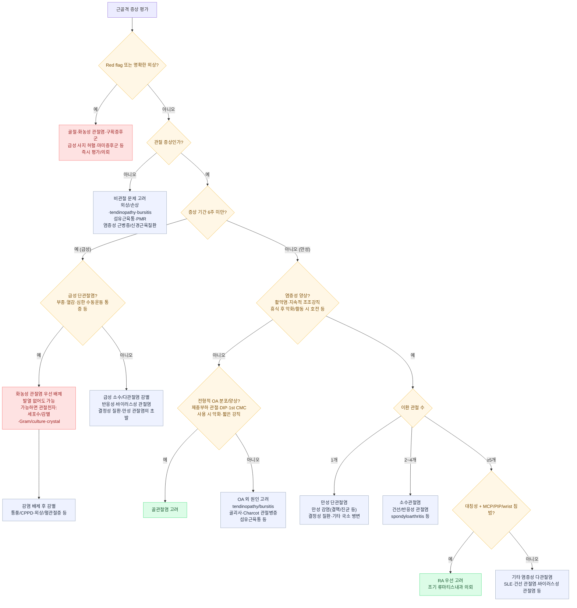
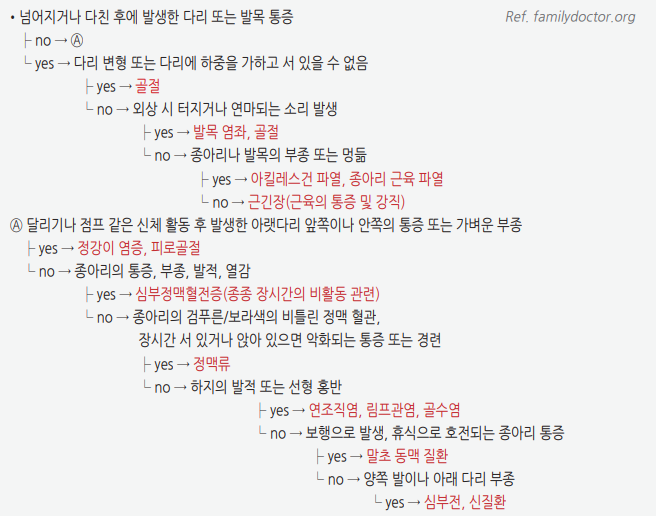
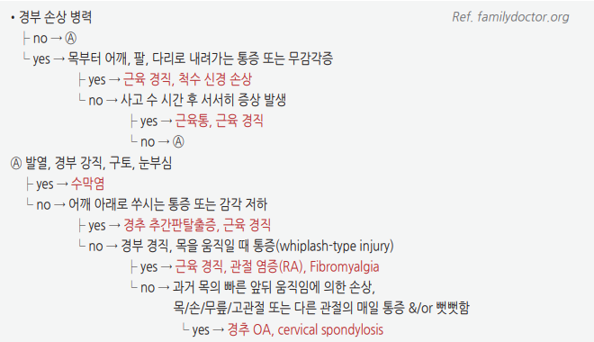

# 근골격계 문제의 감별

## <mark style="color:green;">일반 사항 테스트</mark>

* 관절통, 근육통, 사지 통증 등 근골격계 증상은 1차 진료에서 매우 흔한 주소증 중 하나
* 목적 : 관절 문제와 비관절 문제, 염증성과 비염증성 병인을 구분하여 감별진단의 범위를 체계적으로 좁히는 접근 제시
* 본 챕터는 개별 질환(골관절염, 류마티스 관절염, 통풍 등)의 상세 진단·치료에 앞서 적용하는 근골격 증상의 공통 감별 틀을 다룸 — 확정 진단 이후의 개별 질환 관리는 각 질환별 챕터 참조

### <mark style="color:$danger;">🚩 Red Flags!</mark>

<mark style="color:$danger;">**즉각 조치 또는 의뢰**</mark>

* 외상 직후 발생한 심한 국소 통증 + 변형·부동 또는 체중 부하 불가 → 골절 의심, 즉시 영상 평가 및 필요시 정형외과 의뢰
* **급성 비외상성 단관절의 심한 통증·부종·열감 또는 수동운동 제한** → 화농성 관절염(septic arthritis) 우선 배제. 발열이 없어도 배제할 수 없으며, 가능하면 신속한 관절천자 및 응급 평가
* 외상·압박 손상 또는 격렬한 운동 후 **예상보다 심하고 지속되는 통증, 수동 신전 시 통증 악화, 팽팽한 부종/긴장, 감각이상** → 구획증후군(compartment syndrome) 의심, 즉시 응급 평가. 맥박 소실·마비는 후기 소견이므로 기다리지 않음 (☞ 하단 "다리 통증의 감별" 표 참조)
* 갑작스러운 심한 사지 통증 + 창백·냉감·맥박 감소/소실, 감각저하 또는 근력저하 → 급성 사지 허혈(acute limb ischemia) 의심, 즉시 혈관외과/응급 평가
* **요통/하지통 + 새로 발생한 요폐·배뇨/배변장애, 회음부(saddle) 감각저하, 양측 하지 근력저하** → 마미증후군(cauda equina syndrome) 의심, 즉시 응급 평가
* 진통제로 조절되지 않는 심한 통증과 진행성 감각저하·근력저하 등 신경학적 이상 → 급성 신경 압박/손상 등 의심, 응급 평가

<mark style="color:$warning;">**당일 또는 조기 의뢰**</mark>

* 새로 발생한 지속적·진행성 **비기계적 통증**, 특히 악성 종양 병력, 설명되지 않는 체중 감소·발열·야간 발한 또는 국소 골성 통증 동반 → 감염·악성 종양(원발 또는 전이) 평가
* 악성 종양 병력이 있는 환자의 새로운 국소 골성 통증 또는 야간통 → 골전이·병적 골절 가능성 평가
* 발열·야간 발한·malaise 등 전신 증상을 동반한 근골격통 → 감염성·악성·전신 염증성 질환 평가
* **객관적 근력저하**가 확인되는 경우 → 염증성 근병증(idiopathic inflammatory myopathy) 또는 신경근육질환 평가
* 50세 이상에서 양측 어깨/고관절대 통증과 현저한 조조강직 → polymyalgia rheumatica(PMR) 고려. PMR에서는 통증으로 움직임이 제한될 수 있으나 객관적 근력저하는 전형적이지 않음
* 자세 변화나 활동에 거의 영향받지 않고 지속되거나 점차 악화되는 통증 → 종양성·감염성·염증성 병변 고려, 필요한 검사 및 영상 평가

<mark style="color:$info;">**외래 추적 / 추가 평가 계획**</mark> <mark style="color:$info;">- 즉각 위험 낮으나 호전 없으면 의뢰</mark>

* 휴식 시 악화되거나 활동과 무관한 통증이 반복되는 경우
* 원인이 불명확한 야간 통증이 수 주간 지속되는 경우
* 4\~6주 이상 지속되는 원인 불명의 근골격통 → 감별진단 재평가 및 필요시 전문과 의뢰

***

## <mark style="color:green;">진단</mark>

근골격 증상의 감별은 다음 네 가지 축으로 체계화할 수 있음 :

1. 해부학적 위치 — 관절 vs 비관절
2. 병리적 특성 — 염증성 vs 비염증성
3. 진행 기간 — 발생 속도, 지속 기간
4. 병변 범위 — 이환 관절 수, 범위, 대칭성, 부위

✽RA, 통풍, polymyalgia rheumatica, 섬유근육통 등 각 질환의 정식 분류/진단기준은 해당 질환 챕터 참조

### <mark style="color:orange;">해부학적 위치에 따른 감별</mark>

#### <mark style="color:$primary;">관절 문제</mark>

* 깊거나 광범위한 통증
* 능동과 수동 움직임 모두에 제한 또는 통증
* 부종, 불안정, 변형, crepitus, locking 동반 가능

#### <mark style="color:$primary;">비관절 문제</mark>

* 능동 움직임 시 통증이 있으나 보통 수동 움직임 시에는 통증이 적거나 없음
* 관절 운동 범위는 비교적 유지되며 관절 자체의 부종·불안정·변형·crepitus 등은 드묾
* 관절 인접부의 국소 압통, 특정 자세나 움직임에서 통증 또는 방사통 발생

### <mark style="color:orange;">병리적 특성에 따른 감별</mark>

#### <mark style="color:$primary;">염증성 이상</mark>

* 분류 : 감염성, 결정 침착성(통풍, 가성통풍(CPPD)), 면역 관련(RA, SLE), 반응성(rheumatic fever, reactive arthritis), 기타 염증성 질환
* 국소 소견 : 홍반, 열감, 통증, 관절종창/활막염
  * 강직 : 지속적인 조조강직(흔히 30\~60분 이상), 휴식 후 악화되고 활동으로 호전하는 양상이 흔함 (RA, polymyalgia rheumatica 등)
* 전신 소견 : 피로, 발열, 발진, 체중 감소 등 가능
* 검사 소견 : ESR/CRP 상승, 혈소판 증가, albumin 감소, 만성 질환 빈혈 등이 동반될 수 있으나 정상 염증표지자가 염증성 질환을 배제하지는 않음

#### <mark style="color:$primary;">비염증성 이상</mark>

* 분류 : 외상(rotator cuff tear), 반복 사용/퇴행성 연부조직 질환(bursitis, tendinopathy), 퇴행성 관절질환(OA), 일부 종양성/증식성 병변, 통증 증폭(fibromyalgia)
* 관절 자체의 활막성 부종·열감은 대개 없으며, 통증은 사용·체중부하 또는 특정 움직임에서 악화되는 경우가 흔함
  * 강직 : 짧고 간헐적인 경우가 흔하며, 특히 OA의 조조강직은 대개 30분 이내
* 검사 소견 : 전신 염증표지자(ESR/CRP)는 대개 정상
* 섬유근육통은 광범위 통증·피로·수면장애와 주관적 강직을 호소할 수 있으나 객관적 관절종창/활막염이 없고 ESR/CRP는 대개 정상

<table><thead><tr><th width="100">구분</th><th width="190">조조강직/활동과의 관계</th><th width="160">전신 증상</th><th width="120">ESR/CRP</th><th>대표 질환</th></tr></thead><tbody><tr><td>염증성</td><td>지속적 조조강직(흔히 30~60분 이상), 휴식 후 악화·활동으로 호전</td><td>동반 가능 (발열, 체중 감소, 피로 등)</td><td>상승할 수 있으나 정상도 가능</td><td>RA, 통풍/CPPD, 반응성 관절염, 화농성 관절염</td></tr><tr><td>비염증성</td><td>짧은 강직; OA는 대개 ≤30분, 사용·체중부하로 통증 악화</td><td>대개 없음</td><td>대개 정상</td><td>골관절염, tendinopathy, 섬유근육통</td></tr></tbody></table>

### <mark style="color:orange;">진행 기간에 따른 감별</mark>

**발생 속도**

* 급속 발생 : 화농성 관절염, 통풍/CPPD, 외상성 관절 손상
* 서서히 발생 : OA, RA, 섬유근육통 등

**지속 기간**

* 급성(6주 미만) : 감염성, 결정 침착성, 반응성, 바이러스성 관절염 등
* 만성(6주 이상) : OA, RA 및 기타 만성 염증성 관절염, 비관절성 통증 증후군(fibromyalgia) 등

### <mark style="color:orange;">병변 범위에 따른 감별</mark>

**이환 관절 수**

* 단관절(monoarthritis, 1개) : 화농성 관절염, 통풍/CPPD, 외상 등 우선 고려
* 소수관절(oligoarthritis, 2\~4개) : spondyloarthritis, 반응성 관절염, 건선 관절염, 결정성 관절염 등
* 다관절(polyarthritis, ≥5개) : RA, SLE, 바이러스성 관절염, 다관절형 OA 등

**범위**

* 국소 : tendinopathy, bursitis, 수근관증후군 등
* 광범위 : inflammatory myopathy, fibromyalgia 등

**대칭성**

* 대칭성 다관절 : RA, SLE 등
* 비대칭성 소수/다관절 : spondyloarthritis, reactive arthritis, gout, sarcoidosis 등

**관절 분포**

<table><thead><tr><th width="160">주요 침범 부위</th><th>대표적으로 고려할 질환/감별 포인트</th></tr></thead><tbody><tr><td>DIP</td><td>골관절염, 건선 관절염. RA는 전형적으로 MCP·PIP·wrist를 침범하며 DIP는 상대적으로 보존되는 경향</td></tr><tr><td>PIP / MCP / wrist</td><td>RA, SLE 등 염증성 관절염; OA도 PIP를 침범할 수 있음</td></tr><tr><td>1st CMC</td><td>손 골관절염의 전형적 부위</td></tr><tr><td>1st MTP</td><td>통풍의 전형적 침범 부위(podagra)</td></tr><tr><td>슬관절·손목의 급성 관절염(특히 고령)</td><td>CPPD 고려</td></tr><tr><td>Sacroiliac joint / axial skeleton</td><td>axial spondyloarthritis(방사선학적 형태가 ankylosing spondylitis), 퇴행성 척추질환 등</td></tr></tbody></table>

### <mark style="color:orange;">연령·동반 질환 및 인구학적 특성에 따른 감별</mark>

* 젊은 연령 : SLE, reactive arthritis, spondyloarthritis 등 고려
* 중년 : RA, 섬유근육통, 통풍, 과사용성 tendinopathy 등
* 고령 : OA, CPPD, polymyalgia rheumatica, 골다공증성 취약골절(척추 압박골절·고관절 골절 등), 화농성 관절염 위험 증가
* 남성 : 통풍, spondyloarthritis가 상대적으로 흔함
* 여성 : RA, 섬유근육통, 골다공증, SLE가 상대적으로 흔함
* 당뇨병 — 수근관증후군, Charcot 관절병증, 감염 위험 증가
* 만성콩팥병/신부전 — 통풍; **장기 투석**에서는 β2-microglobulin 관련 dialysis-related amyloidosis(수근관증후군, 관절병증 등) 고려
* 우울/불면 — 섬유근육통과 동반 가능
* 다발골수종 — 요통·골통·병적 골절
* 악성 종양 — 골전이·병적 골절 우선 고려; 일부에서는 paraneoplastic inflammatory myopathy 가능
* 골다공증 — 취약골절
* 전신 glucocorticoid 장기 사용 — 골다공증/골절, 골괴사(osteonecrosis), 감염 위험 증가
* 이뇨제·일부 화학요법 — 고요산혈증/통풍 위험 증가

### <mark style="color:orange;">감별 진단 알고리듬</mark>

***

<em>1차 진료에서 활용 가능한 근골격 증상 감별 흐름 (일반적 임상 접근에 기초하여 정리)</em>

***

### <mark style="color:orange;">관절통의 발생 양상에 따른 감별</mark>

* 수 분 이내의 갑작스러운 발생 → 골절, 관절 내 손상/유리체, 외상 등
* 수 시간\~2일 이내 발생 → 감염, 결정 침착 질환, 급성 염증성 관절염
* 수일\~수 주, 잠행성 진행 → 저강도/만성 감염, 골관절염, 침윤성 질환, 종양 등
* 정주 약물 사용, 면역 저하 → 화농성 관절염 위험 증가
* 과거 자연 호전되었던 반복적 급성 발작 → 결정 침착 질환 등 고려
* 최근 지속된 glucocorticoid 치료 → 감염, 골괴사(osteonecrosis)
* 응고병증, 항응고제 사용 → 출혈 관절증
* 요도염, 결막염, 설사, 발진 → 반응성 관절염
* 건선 피부병변, 손발톱 pitting(점상 함몰) → 건선 관절염
* 이뇨제 사용, 통풍 결절, 요로 결석력, 과도한 음주 → 통풍
* 포도막염/눈의 염증, 염증성 요통 → axial spondyloarthritis(ankylosing spondylitis 포함)
* 이동성 다발성 관절통, 손발의 건초염, 피부 병변 → 파종성 임균감염/임균성 관절염
* 폐문 림프절병증, 결절홍반 → sarcoidosis

### <mark style="color:orange;">다리 통증의 감별</mark>

<table><thead><tr><th width="145">상태</th><th>병력 및 진찰 소견</th></tr></thead><tbody><tr><td>골절</td><td>• 최근의 심한 외상(낙상, 운동), 고령의 골다공증; 이환된 다리에 체중 부하 어려움 • 관절삼출/혈관절증, 국소 압통·부종, 움직임 시 통증; 골성 압통점</td></tr><tr><td>말초동맥질환(PAD)</td><td>• 고령, 당뇨병, 죽상경화성 심혈관질환, 흡연 등 위험인자 • 간헐적 파행, 맥박 감소, 냉감, 피부색 변화 • ABI &#x3C;0.90이면 PAD 시사. 전형적 운동성 파행이 있으나 휴식 시 ABI가 정상/경계이면 운동 후 ABI 검사 고려</td></tr><tr><td>급성 사지 허혈</td><td>• 갑작스러운 심한 통증, 창백, 냉감, 맥박 감소/소실 • 감각저하·근력저하는 진행성 허혈을 시사 → 즉시 혈관외과/응급 평가</td></tr><tr><td>심부정맥혈전증(DVT)</td><td>• 최근 수술·입원/부동, 악성 종양, 임신, estrogen 사용, 과거 VTE 등 위험인자 • 편측 하지 부종, 통증/압통, 열감 등이 가능 • 임상 사전확률(Wells score 등)을 평가한 뒤 D-dimer 및 압박초음파(compression ultrasonography)를 적절히 선택</td></tr><tr><td>구획증후군</td><td>• 골절·둔기/압박 손상, 재관류 손상 또는 격렬한 운동 후 발생 가능 • 손상 정도에 비해 심하고 지속적인 통증, 수동 신전으로 악화되는 통증이 중요한 조기 소견 • 팽팽한 부종/긴장, 감각이상 등이 동반될 수 있음. 마비·맥박 소실은 후기 소견이므로 대기하지 말고 즉시 의뢰</td></tr><tr><td>화농성 관절염</td><td>• 최근 감염, 수술, 관절 주사, 인공관절, 면역저하 등 위험인자 • 지속되는 심한 관절통, 부종·열감, 수동운동 제한; 발열은 없을 수 있음 • 의심 시 관절천자 및 응급 평가</td></tr><tr><td>연조직염</td><td>• 최근 피부 외상, 찰과상, 정맥 기능 부전·부종, 심부전(CHF), 간경화, 당뇨 등 위험인자 • 발열, malaise, 전신 쇠약 동반 가능 • 피부의 통증, 부종, 열감, 진행하는 경계 불명확한 발적</td></tr></tbody></table>

<figure><figcaption>
다리 통증의 주요 원인 질환 감별
</figcaption></figure>

✽구획증후군은 6P(Pain, Pallor, Paresthesia, Pulselessness, Poikilothermia, Paralysis) 중 맥박 소실·마비는 늦게 나타나는 후기 소견 — **손상 정도에 비해 심한 통증, 수동 신전 시 통증 악화, 팽팽한 부종/긴장, 감각이상** 등 조기 소견만으로도 의심하고 지체 없이 의뢰

### <mark style="color:orange;">경부 통증의 감별</mark>

* 단순 기계적/근막성 통증 : 자세·활동과 연관된 국소 경부 통증, 명확한 진행성 신경학적 결손 없음
* 경추 신경근병증(cervical radiculopathy) : 경부에서 상지로 방사되는 통증, 감각이상, 근력저하 또는 반사 변화
* 경추 척수병증(cervical myelopathy) : 보행장애, 손의 미세운동 저하, 상위운동신경원 징후 등 → 조기 영상 및 전문과 평가
* 발열·암 병력·외상·골다공증/장기 steroid 사용·진행성 신경학적 이상 등 동반 → 감염, 종양, 골절 등 Red Flag 원인 평가

<figure><figcaption>
경부 통증의 주요 원인 질환 감별
</figcaption></figure>

***

### <mark style="color:orange;">검사 원칙</mark>

* 검사는 병력·진찰에서 형성된 감별진단을 확인하거나 배제하는 방향으로 선택하며, 원인 불명의 근골격통에 ESR/CRP, RF, anti-CCP, ANA, 요산 등을 일률적으로 선별검사하는 방식은 피함
* ESR/CRP는 염증 여부를 보조하지만 정상이라고 염증성 관절염·감염을 배제할 수 없음
* RF/anti-CCP, ANA 등 자가항체 검사는 임상적으로 RA, 결합조직질환 등이 의심될 때 선택적으로 시행
* 혈청 요산은 급성 통풍 발작 중 정상일 수 있으며, 단독으로 통풍을 확진하거나 배제하는 검사로 사용하지 않음
* **급성 원인불명 단관절염**, 특히 화농성 관절염이 의심되는 경우 혈액검사만으로 판단하지 말고 가능한 한 관절천자를 시행하여 활액 세포수/감별, Gram stain/culture, crystal 분석 등으로 평가
* 활액에서 결정이 확인되어도 화농성 관절염의 동시 존재를 완전히 배제할 수 없음

***

## <mark style="background-color:$warning;">Management</mark>


**1차 진료에서의 접근 순서**


* Red Flags 우선 배제 (외상성 골절, 화농성 관절염, 구획증후군, 급성 사지 허혈, 마미증후군 등)
* 관절 vs 비관절, 염증성 vs 비염증성 구분 → 감별진단 범위 축소
* 급성 단관절염에서는 발열 유무와 관계없이 화농성 관절염 가능성을 먼저 평가하고, 의심 시 관절천자 및 신속한 의뢰
* 병력·진찰만으로 확진이 어려운 경우 임상적 의심에 따라 ESR/CRP, 선택적 혈청검사, 관절 영상, 관절천자 등으로 보완
* 지속성 synovitis 또는 RA/spondyloarthritis 등 염증성 관절염이 의심되면 **RF/anti-CCP 등 혈청검사 결과를 기다리며 의뢰를 지연하지 말고 류마티스내과 조기 의뢰 고려**
* 확정 진단에 따라 개별 질환별 챕터의 치료 원칙 적용 (골관절염, 류마티스 관절염, 통풍 등은 본 Part의 개별 챕터 참조)

***

### <mark style="color:red;">질병코드</mark>

M25.5 관절통

M79.1 근육통(Myalgia)

M79.6 사지의 통증

R29.9 기타 및 상세불명의 근골격계 증상 및 징후

***

### <mark style="color:blue;">환자 안내서</mark>


**관절이나 근육이 아픈 경우, 원인에 따라 치료 방법이 다릅니다**

관절 통증과 근육 통증은 원인이 매우 다양하며, 일부는 며칠 안에 저절로 좋아지지만 일부는 빠른 치료가 필요합니다.


#### <mark style="color:$primary;">왜 관절이나 근육이 아픈가요?</mark>

* 관절 자체의 문제(관절염, 통풍 등)인지, 관절 주변 힘줄·인대·근육의 문제(tendinopathy, 근육통 등)인지에 따라 원인이 다릅니다.
* 갑자기 심해진 통증인지, 몇 주에 걸쳐 서서히 나타난 통증인지도 원인을 구분하는 데 중요한 단서입니다.

#### <mark style="color:$primary;">집에서 어떻게 관리하나요?</mark>

* **다친 부위는 무리하게 움직이지 마십시오.** 갑작스러운 손상 직후 붓고 열감이 있는 경우에는 초기 24\~48시간 냉찜질이 통증·부종 완화에 도움이 될 수 있습니다. 만성적인 근육 긴장이나 뻣뻣함에는 온찜질이 도움이 될 수 있습니다. 냉·온찜질은 피부에 직접 대지 말고 화상이나 피부 손상에 주의하십시오.
* **통증이 만성적이고 급성 손상이나 심한 염증이 없다면 적절한 활동을 유지하십시오.** 장기간의 안정은 근력 저하와 관절 강직을 악화시킬 수 있으며, 걷기·수영·실내 자전거 등 관절에 무리가 적은 활동부터 시작할 수 있습니다.
* **처방 없이 진통제를 임의로 장기 복용하지 마십시오.** 특히 소염진통제(NSAIDs)는 장기간 또는 과량 복용 시 위장관 출혈, 신장 기능 악화 및 심혈관계 부작용 위험이 있으므로 의사와 상의하십시오.

#### <mark style="color:$primary;">이럴 때는 즉시 병원을 방문하세요</mark>

* 외상 직후 심하게 붓고 모양이 변형되었거나 체중을 실을 수 없는 경우
* 관절이 갑자기 심하게 아프고 붓거나 열감이 있는 경우 — **열이 없어도** 심한 단관절염은 빠른 평가가 필요함
* 외상이나 심한 운동 후 통증이 예상보다 매우 심하고 지속되며, 다리가 팽팽하게 붓거나 감각이 이상해지는 경우
* 다리가 갑자기 심하게 아프면서 차갑거나 창백해지고 맥박이 약해지는 경우
* 허리·다리 통증과 함께 갑자기 소변이 잘 나오지 않거나 회음부 감각이 둔해지고 양쪽 다리에 힘이 빠지는 경우
* 팔·다리에 새로 힘이 빠지거나 감각이 둔해지는 증상이 진행하는 경우
* 암 병력이 있거나 이유 없이 체중이 줄면서 새로 생긴 지속적 통증·야간통이 있는 경우
