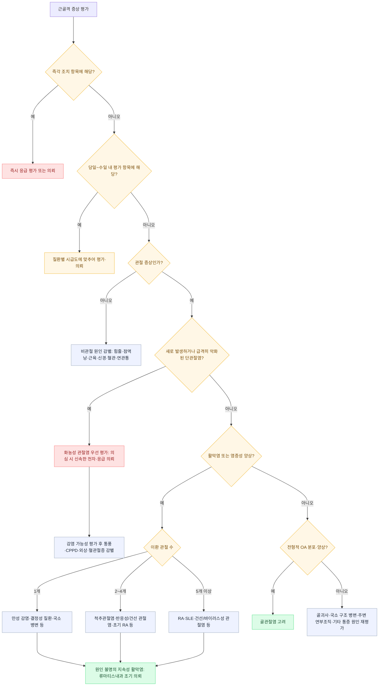
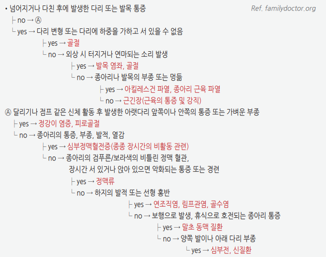
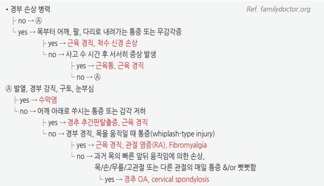

# 근골격계 문제의 감별

## <mark style="color:green;">일반 사항</mark>

* 관절통, 근육통, 사지 통증 등 근골격계 증상은 1차 진료에서 매우 흔한 주소증 중 하나
* 목적 : 관절 문제와 비관절 문제, 염증성과 비염증성 병인을 구분하여 감별진단의 범위를 체계적으로 좁히는 접근 제시
* 본 챕터는 성인 1차 진료를 중심으로 개별 질환(골관절염, 류마티스 관절염, 통풍 등)의 상세 진단·치료에 앞서 적용하는 근골격 증상의 공통 감별 틀을 다룸 - 확정 진단 이후의 개별 질환 관리는 각 질환별 챕터 참조

### <mark style="color:$danger;">🚩 Red Flags!</mark>

<mark style="color:$danger;">**즉각 조치 또는 의뢰**</mark>

* 외상 직후 발생한 심한 국소 통증 + 변형·움직임 불가 또는 체중 부하 불가 → 골절·탈구 의심, 즉시 영상 평가 및 필요시 정형외과 의뢰
* **급성 비외상성 단관절의 심한 통증·부종·열감 또는 수동운동 제한** → 화농성 관절염(septic arthritis) 우선 배제. 발열이 없어도 배제할 수 없으며, 지체 없이 관절천자 및 응급 평가(천자가 어려우면 즉시 가능한 기관으로 의뢰)
* 외상·압박 손상 또는 격렬한 운동 후 **예상보다 심하고 지속되는 통증, 수동 신장 시 통증 악화, 팽팽한 부종/긴장, 감각이상** → 구획증후군(compartment syndrome) 의심, 즉시 응급 평가. 맥박 소실·마비는 후기 소견이므로 기다리지 않음 (☞ 하단 "다리 통증의 감별" 표 참조)
* 갑작스러운 심한 사지 통증 + 창백·냉감·맥박 감소/소실, 감각저하 또는 근력저하 → 급성 사지 허혈(acute limb ischemia) 의심, 즉시 혈관외과/응급 평가
* **요통/하지통 + 새로 발생한 요폐·배뇨/배변장애 또는 회음부(saddle) 감각저하, 진행성 하지 근력저하** → 마미증후군(cauda equina syndrome) 의심, 즉시 응급 평가
* 암 병력자의 새 척추 통증에 보행장애, 하지 근력저하·감각저하 또는 배뇨·배변장애가 동반 → 전이성 척수압박 의심, 즉시 응급 평가 및 긴급 MRI
* **급속히 진행하는 근력저하**, 특히 양측성 근력저하 또는 호흡곤란·연하곤란 동반 → 신경근육질환·척수병증 등 의심, 즉시 응급 평가; 심한 통증 동반 여부와 무관하게 판단함
* 압박 손상·격렬한 운동·고열/열손상·약물 노출 뒤 심한 근육통·근육 부종·근력저하, 짙은 갈색 소변 또는 소변량 감소 → 횡문근융해증 의심, 신속한 CK·콩팥기능·전해질 평가 및 응급 의뢰; 소변색이 정상이어도 배제할 수 없음
* 거대세포동맥염 의심 환자의 새 시력저하·일과성 시력상실·복시 → 즉시 응급/안과 평가 및 치료
* DVT 의심 증상에 호흡곤란·흉통·실신 등 폐색전증 의심 증상 동반 → 즉시 응급 평가
* 피부 소견에 비해 매우 심한 통증, 빠르게 퍼지는 부종·발적, 수포·피부 괴사 또는 전신 독성 소견 → 괴사성 연조직 감염 의심, 즉시 응급/외과 평가

<mark style="color:$warning;">**당일~수일 내 평가**</mark>

* 새로 발생한 지속적·진행성 **비기계적 통증**, 특히 악성 종양 병력, 설명되지 않는 체중 감소 또는 국소 골성 통증·야간통이 동반되면 골전이·병적 골절 등 종양성 병변 평가. **암 병력자의 새로 발생한 지속적·진행성 척추 통증 또는 수면을 방해하는 야간 척추 통증은 당일(24시간 이내) 전문과 평가/상담**; 신경학적 증상이 동반되면 즉시 평가(위 참조)
* 발열·야간 발한·전신 쇠약 등을 동반한 근골격통 → 감염성·악성·전신 염증성 질환 평가; 감염이 의심되면 당일 평가, 패혈증 등 전신 불안정이 있으면 즉시 응급 평가
* **객관적 근력저하**가 확인되는 경우 → 염증성 근병증(idiopathic inflammatory myopathy) 또는 신경근육질환 평가; 급속 진행·호흡/연하 장애가 있으면 즉시 평가(위 참조)
* 50세 이상에서 양측 어깨/고관절대 통증과 현저한 조조강직 → polymyalgia rheumatica(PMR) 고려. PMR에서는 통증으로 움직임이 제한될 수 있으나 객관적 근력저하는 전형적이지 않음. 새 두통·턱 파행·일과성 시력상실/시력저하가 있으면 거대세포동맥염을 의심하여 당일 평가(시각 증상은 즉시 평가). 거대세포동맥염을 강하게 의심하면 확진 검사 결과를 기다리며 glucocorticoid 치료를 지연하지 않음
* 새로 발생한 편측 하지 부종·통증/열감 → DVT 고려, **당일 평가**(VTE 위험인자가 있으면 가능성 증가); 호흡곤란·흉통·실신 등 폐색전증 의심 증상이 동반되면 즉시 응급 평가
* 당뇨병·말초신경병증 환자의 새로 발생한 한쪽 발의 열감·발적·부종(통증이 적어도 가능) → 활동성 Charcot 신경골관절병증과 감염 감별, 신속한 평가와 고정·부하 경감 계획; 진단이 확정될 때까지 무리한 보행을 피함
* 원인 불명의 지속성 활막염, 특히 손·발 작은 관절 또는 둘 이상의 관절 침범 → 류마티스내과 조기 의뢰; 6주 경과나 혈액검사 결과를 기다리지 않음

<mark style="color:$info;">**외래 추적 / 추가 평가 계획**</mark> <mark style="color:$info;">- 즉각 위험 낮으나 호전 없으면 의뢰</mark>

* 휴식 시 악화되거나 활동과 무관한 통증이 반복되더라도 진행성 통증·암/감염 의심 소견이 없으면 원인 재평가 계획 수립
* 원인이 불명확한 야간 통증이 반복되면 동반 위험인자를 재확인하고, 지속·악화되거나 암 병력·전신 증상 동반 시 평가 시점을 앞당김
* 위험 소견·활막염이 없는 원인 불명의 근골격통도 경과와 기능 저하에 따라 재평가하며, 4\~6주 이상 지속되면 감별진단 재검토 및 필요시 전문과 의뢰; 이 기간은 위험 소견이 있는 환자를 기다리는 기준이 아님

***

## <mark style="color:green;">진단</mark>

근골격 증상의 감별은 다음 네 가지 축으로 체계화할 수 있음 :

1. 해부학적 위치 - 관절 vs 비관절
2. 병리적 특성 - 염증성 vs 비염증성
3. 진행 기간 - 발생 속도, 지속 기간
4. 병변 범위 - 이환 관절 수, 범위, 대칭성, 부위

✽RA, 통풍, polymyalgia rheumatica, 섬유근육통 등 각 질환의 정식 분류/진단기준은 해당 질환 챕터 참조. 분류기준 충족 여부만으로 초기 질환을 배제하지 않음

### <mark style="color:orange;">초기 병력·진찰의 핵심</mark>

* 발생 시점·외상/과사용·감염 선행 여부, 통증 위치와 방사, 야간통·조조강직, 실제 관절종창, 기능 저하 및 전신 증상 확인
* 진찰에서 압통 위치, 열감·삼출/활막염, 능동·수동 관절운동, 저항운동 시 통증, 근력·감각·반사 및 말초 맥박을 증상에 맞추어 확인
* **관절통(arthralgia)**과 **객관적 활막염을 동반한 관절염(arthritis)**을 구별함; 관절통만으로 염증성 관절염을 확진하지 않으며, 초기 질환이 의심되면 추적 진찰함
* 근육통·통증에 따른 움직임 제한과 실제 근력저하를 구별함. 의자에서 일어나기·계단 오르기·팔 올리기 어려움 등 근위부 약화가 있으면 신경근육 진찰과 CK 등 표적 검사를 고려함
* 최근 처방약·일반약·보충제와 약물 변경 확인: statin 관련 근육 증상, 전신 glucocorticoid 관련 근병증/골괴사, fluoroquinolone 관련 힘줄 손상 등 고려
* 국소 근골격 진찰만으로 설명되지 않는 통증은 신경성·혈관성 통증과 내장 연관통도 고려함

### <mark style="color:orange;">해부학적 위치에 따른 감별</mark>

#### <mark style="color:$primary;">관절 문제</mark>

* 대체로 깊거나 광범위한 통증
* 전형적으로 능동과 수동 움직임 모두에 제한 또는 통증
* 부종, 불안정, 변형, crepitus, locking 동반 가능

#### <mark style="color:$primary;">비관절 문제</mark>

* 대체로 능동 움직임에서 통증이 뚜렷하고 수동 움직임에서는 통증이 적으나, 수동운동 끝범위에서도 통증이 생길 수 있음
* 관절 운동 범위는 비교적 유지되며 관절 자체의 삼출/활막염은 대개 없으나, 점액낭염의 국소 부종이나 인대 손상의 불안정은 가능
* 관절 인접부의 국소 압통, 특정 자세나 움직임에서 통증 또는 방사통 발생
* 능동·수동운동 양상은 감별 단서이며 단독 확진 기준이 아님. 유착성 관절낭염 등은 능동·수동운동 모두 제한될 수 있음

### <mark style="color:orange;">병리적 특성에 따른 감별</mark>

#### <mark style="color:$primary;">염증성 이상</mark>

* 분류 : 감염성, 결정 침착성(통풍, 급성 CPP 결정 관절염[흔히 가성통풍으로 불림]), 면역 관련(RA, SLE), 감염 후 면역 관련(급성 류마티스열, 반응성 관절염), 기타 염증성 질환
* 국소 소견 : 홍반, 열감, 통증, 관절종창/활막염
  * 강직 : 지속적인 조조강직(흔히 30\~60분 이상), 휴식 후 악화되고 가벼운 활동으로 호전하는 양상이 흔함 (RA, polymyalgia rheumatica 등); 급성 통풍/CPP 결정 관절염·화농성 관절염은 움직임으로 통증이 심해질 수 있음
* 전신 소견 : 피로, 발열, 발진, 체중 감소 등 가능
* 검사 소견 : ESR/CRP 상승, 혈소판 증가, albumin 감소, 만성 질환 빈혈 등이 동반될 수 있으나 정상 염증표지자가 염증성 질환을 배제하지는 않음

#### <mark style="color:$primary;">비염증성 이상</mark>

* 분류 : 외상(rotator cuff tear), 반복 사용/퇴행성 연부조직 질환(tendinopathy 등), 퇴행성 관절질환(OA), 일부 종양성/증식성 병변, 통각처리 변화가 관여하는 섬유근육통(fibromyalgia)
* 관절 자체의 활막성 부종·열감은 대개 없으며, 통증은 사용·체중부하 또는 특정 움직임에서 악화되는 경우가 흔함
  * 강직 : 짧고 간헐적인 경우가 흔하며, 특히 OA의 조조강직은 대개 30분 이내
* 검사 소견 : 전신 염증표지자(ESR/CRP)는 대개 정상
* OA에는 국소 활막염이 동반될 수 있으며, **bursitis는 비관절성 병변이지만 염증성·결정성·감염성 원인도 가능**하므로 비염증성으로 일괄 분류하지 않음
* 섬유근육통은 광범위 통증·피로·수면장애와 주관적 강직을 호소할 수 있으나 객관적 관절종창/활막염이 없고 ESR/CRP는 대개 정상

<table><thead><tr><th width="100">구분</th><th width="190">조조강직/활동과의 관계</th><th width="160">전신 증상</th><th width="120">ESR/CRP</th><th>대표 질환</th></tr></thead><tbody><tr><td>염증성</td><td>지속적 조조강직(흔히 30~60분 이상), 휴식 후 악화·가벼운 활동으로 호전 가능; 급성 결정성·감염성 관절염은 운동 시 악화 가능</td><td>동반 가능 (발열, 체중 감소, 피로 등)</td><td>상승할 수 있으나 정상도 가능</td><td>RA, 통풍/CPPD, 반응성 관절염, 화농성 관절염</td></tr><tr><td>비염증성</td><td>짧은 강직; OA는 대개 ≤30분, 사용·체중부하로 통증 악화</td><td>대개 없음</td><td>대개 정상</td><td>골관절염, tendinopathy, 섬유근육통</td></tr></tbody></table>

### <mark style="color:orange;">진행 기간에 따른 감별</mark>

**발생 속도**

* 급속 발생 : 화농성 관절염, 통풍/CPPD, 외상성 관절 손상
* 서서히 발생 : OA, RA, 섬유근육통 등

**지속 기간**

* 급성(6주 미만) : 감염성, 결정 침착성, 반응성, 바이러스성 관절염 등
* 만성(6주 이상) : OA, RA 및 기타 만성 염증성 관절염, 비관절성 통증 증후군(fibromyalgia) 등

✽각 질환은 급성·만성 양상 모두 가능하며, 만성 관절질환에서도 새로운 급성 발작이나 감염이 발생할 수 있음. 6주는 감별을 위한 편의상 기간 구분이며, 지속성 활막염이나 Red Flags의 평가·의뢰를 6주까지 미루는 기준이 아님

### <mark style="color:orange;">병변 범위에 따른 감별</mark>

**이환 관절 수**

* 단관절(monoarthritis, 1개) : 화농성 관절염, 통풍/CPPD, 외상 등 우선 고려
* 소수관절(oligoarthritis, 2\~4개) : spondyloarthritis, 반응성 관절염, 건선 관절염, 결정성 관절염 등
* 다관절(polyarthritis, ≥5개) : RA, SLE, 바이러스성 관절염, 다관절형 OA 등

**범위**

* 국소 : tendinopathy, bursitis, 수근관증후군 등
* 광범위 : inflammatory myopathy, fibromyalgia 등

**대칭성**

* 대칭성 다관절 : RA, SLE 등
* 비대칭성 소수/다관절 : spondyloarthritis, reactive arthritis, gout, sarcoidosis 등

**관절 분포**

<table><thead><tr><th width="160">주요 침범 부위</th><th>대표적으로 고려할 질환/감별 포인트</th></tr></thead><tbody><tr><td>DIP</td><td>골관절염, 건선 관절염. RA는 전형적으로 MCP·PIP·wrist를 침범하며 DIP는 상대적으로 보존되는 경향</td></tr><tr><td>PIP / MCP / wrist</td><td>RA, SLE 등 염증성 관절염; OA도 PIP를 침범할 수 있음</td></tr><tr><td>1st CMC</td><td>손 골관절염의 전형적 부위</td></tr><tr><td>1st MTP</td><td>통풍의 전형적 침범 부위(podagra)</td></tr><tr><td>슬관절·손목의 급성 관절염(특히 고령)</td><td>급성 CPP 결정 관절염 고려</td></tr><tr><td>Sacroiliac joint / axial skeleton</td><td>axial spondyloarthritis(방사선학적 형태가 ankylosing spondylitis), 퇴행성 척추질환 등</td></tr></tbody></table>

### <mark style="color:orange;">연령·동반 질환 및 인구학적 특성에 따른 감별</mark>

* 젊은 연령 : SLE, reactive arthritis, spondyloarthritis 등 고려
* 중년 : RA, 섬유근육통, 통풍, 과사용성 tendinopathy 등
* 고령 : OA, CPPD, polymyalgia rheumatica, 골다공증성 취약골절(척추 압박골절·고관절 골절 등), 화농성 관절염 위험 증가
* 남성 : 통풍이 상대적으로 흔함. 방사선학적 axial spondyloarthritis(강직척추염)는 남성에서 더 흔하나, axial spondyloarthritis 전체는 여성에서도 흔하므로 성별만으로 배제하지 않음
* 여성 : RA, 섬유근육통, 골다공증, SLE가 상대적으로 흔함
* 당뇨병 - 수근관증후군, Charcot 관절병증, 감염 위험 증가
* 만성콩팥병/신부전 - 통풍; **장기 투석**에서는 β2-microglobulin 관련 dialysis-related amyloidosis(수근관증후군, 관절병증 등) 고려
* 우울/불면 - 섬유근육통과 동반 가능
* 다발골수종 - 요통·골통·병적 골절
* 악성 종양 - 골전이·병적 골절 우선 고려; 일부에서는 paraneoplastic inflammatory myopathy 가능
* 골다공증 - 취약골절
* 전신 glucocorticoid 장기 사용 - 골다공증/골절, 골괴사(osteonecrosis), 감염 위험 증가
* 이뇨제·일부 화학요법 - 고요산혈증/통풍 위험 증가

### <mark style="color:orange;">감별 진단 알고리듬</mark>

***

```mermaid
flowchart TD
    S["근골격 증상 평가"] ---> R{"즉각 조치 항목에 해당?"}
    R -- "예" ---> RE["즉시 응급 평가 또는 의뢰"]
    R -- "아니오" ---> U{"당일~수일 내 평가 항목에 해당?"}
    U -- "예" ---> UE["질환별 시급도에 맞추어 평가·의뢰"]
    U -- "아니오" ---> Q1{"관절 증상인가?"}

    Q1 -- "아니오" ---> NA["비관절 원인 감별: 힘줄·점액낭·근육·신경·혈관·연관통"]
    Q1 -- "예" ---> Q2{"새로 발생하거나 급격히 악화된 단관절염?"}
    Q2 -- "예" ---> SA["화농성 관절염 우선 평가: 의심 시 신속한 천자·응급 의뢰"]
    SA ---> AC["감염 가능성 평가 후 통풍·CPPD·외상·혈관절증 감별"]
    Q2 -- "아니오" ---> Q3{"활막염 또는 염증성 양상?"}

    Q3 -- "예" ---> Q4{"이환 관절 수"}
    Q4 -- "1개" ---> MONO["만성 감염·결정성 질환·국소 병변 등"]
    Q4 -- "2~4개" ---> OLIGO["척추관절염·반응성/건선 관절염·초기 RA 등"]
    Q4 -- "5개 이상" ---> POLY["RA·SLE·건선/바이러스성 관절염 등"]
    MONO ---> RF["원인 불명의 지속성 활막염: 류마티스내과 조기 의뢰"]
    OLIGO ---> RF
    POLY ---> RF

    Q3 -- "아니오" ---> Q5{"전형적 OA 분포·양상?"}
    Q5 -- "예" ---> OA2["골관절염 고려"]
    Q5 -- "아니오" ---> NOA["골괴사·국소 구조 병변·주변 연부조직·기타 통증 원인 재평가"]

    classDef q fill:#FFF7E6,stroke:#F0B429,stroke-width:1px,color:#7A4A00;
    classDef box fill:#EEF2FF,stroke:#94A3B8,stroke-width:1px,color:#1E293B;
    classDef danger fill:#FEE2E2,stroke:#F87171,stroke-width:1px,color:#991B1B;
    classDef warning fill:#FFF7E6,stroke:#F0B429,stroke-width:1px,color:#7A4A00;
    classDef good fill:#DCFCE7,stroke:#4ADE80,stroke-width:1px,color:#14532B;
    class R,U,Q1,Q2,Q3,Q4,Q5 q;
    class NA,AC,MONO,OLIGO,POLY,NOA box;
    class RE,SA danger;
    class UE warning;
    class OA2,RF good;
```

<em>성인 1차 진료에서 활용 가능한 근골격 증상 감별 흐름 (일반적 임상 접근과 참고 지침에 기초하여 정리)</em>

✽평가 중 새로운 위험 소견이 확인되면 즉시 해당 Red Flag 단계로 재분류함. 단순 외상력만으로 모든 환자를 응급 의뢰하지 않으며, 골절·탈구·신경혈관 손상 의심 여부에 따라 판단함.

✽관절 수·대칭성·기간·분포는 감별 단서임. **RA는 5개 미만의 관절 또는 비대칭성으로도 시작할 수 있으며**, 지속성 활막염 의뢰를 분류기준 충족이나 6주 경과까지 미루지 않음. 급성 다관절염도 중증 감염/패혈증 소견이 있으면 즉시 평가함.

***

### <mark style="color:orange;">관절통의 발생 양상에 따른 감별</mark>

* 수 분 이내의 갑작스러운 발생 → 골절, 관절 내 손상/유리체, 외상 등
* 수 시간\~2일 이내 발생 → 감염, 결정 침착 질환, 급성 염증성 관절염
* 수일\~수 주, 잠행성 진행 → RA 등 염증성 관절염, 저강도/만성 감염, 골관절염, 침윤성 질환, 종양 등; 발생 속도만으로 확진/배제하지 않음
* 정주 약물 사용, 면역 저하 → 화농성 관절염 위험 증가
* 과거 자연 호전되었던 반복적 급성 발작 → 결정 침착 질환 등 고려
* 최근 지속된 glucocorticoid 치료 → 감염, 골괴사(osteonecrosis)
* 응고병증, 항응고제 사용 → 출혈 관절증
* 최근 요도염·설사 후 관절염, 결막염 등의 동반 → 반응성 관절염; 전형적 3징후가 모두 있어야 하는 것은 아님
* 건선 피부병변, 손발톱 pitting(점상 함몰) → 건선 관절염
* 이뇨제 사용, 통풍 결절, 요로 결석력, 과도한 음주 → 통풍
* 포도막염/눈의 염증, 염증성 요통 → axial spondyloarthritis(ankylosing spondylitis 포함)
* 이동성 다발성 관절통, 손발의 건초염, 피부 병변 → 파종성 임균감염/임균성 관절염
* 폐문 림프절병증, 결절홍반 → sarcoidosis

### <mark style="color:orange;">다리 통증의 감별</mark>

<table><thead><tr><th width="145">상태</th><th>병력 및 진찰 소견</th></tr></thead><tbody><tr><td>골절</td><td>• 최근의 심한 외상(낙상, 운동), 고령의 골다공증; 이환된 다리에 체중 부하 어려움 • 관절삼출/혈관절증, 국소 압통·부종, 움직임 시 통증; 골성 압통점 • 고령자에서는 가벼운 낙상에도 취약골절 가능. 고관절 골절이 임상적으로 의심되면 단순 X선 음성만으로 배제하지 않으며 MRI(24시간 내 불가/금기이면 CT 고려)</td></tr><tr><td>말초동맥질환(PAD)</td><td>• 고령, 당뇨병, 죽상경화성 심혈관질환, 흡연 등 위험인자 • 간헐적 파행, 맥박 감소, 냉감, 피부색 변화 • ABI ≤0.90은 비정상(PAD에 합당), 0.91~0.99는 경계, 1.00~1.40은 정상 범위. 운동성 비관절성 하지 증상이 있으나 휴식 시 ABI가 0.90 &lt; ABI ≤1.40이면 운동 후 ABI 검사 • ABI >1.40은 비압박성 혈관 가능(당뇨병·CKD 등); 발가락혈압/발가락상완지수(TBI)와 파형 평가</td></tr><tr><td>급성 사지 허혈</td><td>• 갑작스러운 심한 통증, 창백, 냉감, 맥박 감소/소실 • 감각저하·근력저하는 진행성 허혈을 시사 → 즉시 혈관외과/응급 평가</td></tr><tr><td>심부정맥혈전증(DVT)</td><td>• 최근 수술·입원/부동, 악성 종양, 임신, estrogen 사용, 과거 VTE 등 위험인자 • 편측 하지 부종, 통증/압통, 열감 등이 가능 • 의심 시 당일 임상 사전확률(Wells score 등)을 평가한 뒤 D-dimer 및 압박초음파(compression ultrasonography)를 선택 • DVT 가능성이 높으면 초음파 우선; 검사 지연 시 출혈 위험·금기를 검토하여 확진 전 치료용 항응고 여부 결정. 호흡곤란·흉통·실신 동반 시 폐색전증 응급 평가</td></tr><tr><td>구획증후군</td><td>• 골절·둔기/압박 손상, 재관류 손상 또는 격렬한 운동 후 발생 가능 • 손상 정도에 비해 심하고 지속적인 통증, 수동 신장으로 악화되는 통증이 중요한 조기 소견 • 팽팽한 부종/긴장, 감각이상 등이 동반될 수 있음. 마비·맥박 소실은 후기 소견이므로 대기하지 말고 즉시 의뢰</td></tr><tr><td>화농성 관절염</td><td>• 최근 감염, 수술, 관절 주사, 인공관절, 면역저하 등 위험인자 • 지속되는 심한 관절통, 부종·열감, 수동운동 제한; 발열은 없을 수 있음 • 의심 시 관절천자 및 응급 평가</td></tr><tr><td>연조직염</td><td>• 최근 피부 외상, 찰과상, 정맥 기능 부전·부종, 심부전(CHF), 간경화, 당뇨 등 위험인자 • 발열, malaise, 전신 쇠약 동반 가능 • 피부의 통증, 부종, 열감, 진행하는 경계 불명확한 발적 • 피부 소견보다 심한 통증·급속 악화·수포/괴사·전신 독성 소견이면 괴사성 연조직 감염을 의심하여 즉시 외과/응급 평가</td></tr><tr><td>신경성 파행/신경근병증</td><td>• 요추관협착증: 서기·걷기에서 하지 통증/저림, 앉거나 허리를 굽히면 호전하는 양상 • 신경근병증: 방사통, 감각저하·근력저하·반사 변화 가능 • PAD와 동반될 수 있으므로 말초 맥박과 신경학적 소견을 함께 평가</td></tr><tr><td>활동성 Charcot 신경골관절병증</td><td>• 당뇨병·말초신경병증 환자의 한쪽 발 열감·발적·부종; 통증이 경미할 수 있음 • 감염·DVT 등과 감별하며, 신속한 평가와 고정·부하 경감 계획 필요</td></tr></tbody></table>

<figure><figcaption>
다리 통증의 주요 원인 질환 감별
</figcaption></figure>

✽6P(Pain, Pallor, Paresthesia, Pulselessness, Poikilothermia, Paralysis)는 급성 사지 허혈을 기억하는 데 쓰이는 소견임. **급성 구획증후군은 손상 정도에 비해 심한 통증, 해당 근육의 수동 신장 시 통증 악화, 팽팽한 부종/긴장, 감각이상** 등 조기 소견으로 의심함. 맥박이 유지되어도 배제할 수 없으며, 마비·맥박 소실을 기다리지 않고 즉시 의뢰함. 운동 중 반복되지만 휴식으로 호전하는 만성 운동성 구획증후군과 응급도가 다름

### <mark style="color:orange;">경부 통증의 감별</mark>

* 단순 기계적/근막성 통증 : 자세·활동과 연관된 국소 경부 통증, 명확한 진행성 신경학적 결손 없음
* 경추 신경근병증(cervical radiculopathy) : 경부에서 상지로 방사되는 통증, 감각이상, 근력저하 또는 반사 변화
* 경추 척수병증(cervical myelopathy) : 보행장애, 손의 미세운동 저하, 상위운동신경원 징후(과다반사·병적 반사) 등 → 신속한 경추 MRI 및 전문과 평가; 급속 진행·중대한 근력저하·배뇨/배변장애가 있으면 즉시 응급 평가
* 발열·암 병력·외상·골다공증/장기 steroid 사용·진행성 신경학적 이상 등 동반 → 감염, 종양, 골절 등 Red Flag 원인 평가

<figure><figcaption>
경부 통증의 주요 원인 질환 감별
</figcaption></figure>

***

### <mark style="color:orange;">검사 원칙</mark>

* 검사는 병력·진찰에서 형성된 감별진단을 확인하거나 배제하는 방향으로 선택하며, 원인 불명의 근골격통에 ESR/CRP, RF, anti-CCP, ANA, 요산 등을 일률적으로 선별검사하는 방식은 피함
* ESR/CRP는 염증 여부를 보조하지만 정상이라고 염증성 관절염·감염을 배제할 수 없음
* RF/anti-CCP, ANA 등 자가항체 검사는 임상적으로 RA, 결합조직질환 등이 의심될 때 선택적으로 시행
* 혈청 요산은 급성 통풍 발작 중 정상일 수 있으며, 단독으로 통풍을 확진하거나 배제하는 검사로 사용하지 않음. 발작 중 낮은 수치이지만 통풍이 강하게 의심되면 발작 호전 후 최소 2주 뒤 재측정 고려
* **급성 원인불명 단관절염**, 특히 화농성 관절염이 의심되면 혈액검사만으로 판단하지 말고 지체 없이 관절천자(또는 즉시 가능한 기관으로 의뢰)를 통해 활액 세포수/감별, Gram stain·배양, 결정 분석 등을 시행. 패혈증·패혈성 쇼크가 아니라면 가능한 한 항생제 투여 전 활액 및 혈액배양 검체를 채취하되(혈액배양은 특히 발열·균혈증 의심 시), 패혈증 치료를 검체 채취 때문에 지연하지 않음
* 활액에서 결정이 확인되어도 화농성 관절염의 동시 존재를 배제할 수 없음. 활액 백혈구 >50,000/μL는 감염을 시사하지만 확진 기준이 아니며, 낮은 수치(<25,000/μL 포함)나 Gram 염색 음성도 감염을 배제하지 못함; 면역저하에서는 수치 해석에 특히 주의함
* 관절천자 검체량이 적으면 세균 배양 등 병원체 확인을 우선하고, 이어 백혈구 수/감별·결정 분석을 시행함. 발열·균혈증/패혈증 의심 시 혈액배양도 시행함. 인공관절 감염은 별도의 진단기준·전문과 접근이 필요함
* 객관적 근력저하나 약물 관련 근병증이 의심되면 CK, 콩팥기능·전해질 등 선택적 검사; 임상 상황에 따라 TSH 등 원인 검사 추가. CK가 정상이어도 모든 근병증을 배제할 수 없음
* 영상은 임상 의심에 따라 선택함: 골절/구조 병변은 단순 X선, 관절삼출·힘줄/점액낭 병변은 초음파, 잠복골절·골괴사·심부 감염·척수/신경 압박 등은 MRI 등을 고려함. 전형적인 OA는 일률적 영상 없이 임상 진단 가능하며, 단순 X선 정상만으로 초기 감염·잠복골절 등을 배제하지 않음

***

## <mark style="background-color:$warning;">Management</mark>


**1차 진료에서의 접근 순서**


* Red Flags 우선 배제 (외상성 골절, 화농성 관절염, 구획증후군, 급성 사지 허혈, 마미증후군 등)
* 관절 vs 비관절, 염증성 vs 비염증성 구분 → 감별진단 범위 축소
* 급성 단관절염에서는 발열 유무와 관계없이 화농성 관절염 가능성을 먼저 평가하고, 의심 시 지체 없이 관절천자 또는 즉시 가능한 기관으로 의뢰
* 병력·진찰만으로 확진이 어려운 경우 임상적 의심에 따라 ESR/CRP, 선택적 혈청검사, 관절 영상, 관절천자 등으로 보완
* 원인 불명의 지속성 활막염, 특히 손·발 작은 관절 또는 둘 이상의 관절 침범 시 **증상 기간이 6주 미만이거나 ESR/CRP 정상·RF/anti-CCP 음성이어도 검사 결과를 기다리며 의뢰를 지연하지 말고 류마티스내과 조기 의뢰**
* 화농성 관절염이 의심되는 관절에 관절강내 steroid를 주사하지 않음. 거대세포동맥염이 강하게 의심되는 경우는 확진 검사 때문에 전신 glucocorticoid 치료를 지연하지 않음
* 확정 진단에 따라 개별 질환별 챕터의 치료 원칙 적용 (골관절염, 류마티스 관절염, 통풍 등은 본 Part의 개별 챕터 참조)

***

### <mark style="color:red;">질병코드</mark>

✽아래는 증상 코드의 상위 범주임. 확정 진단이 있으면 해당 질환 코드를 우선하고, 진료 부위 등에 따른 세분코드가 있는 경우 실제 청구에 맞는 코드를 선택함.

M25.5 관절통 Pain in joint

M79.1 근통 Myalgia

M79.6 사지의 통증 Pain in limb

R29.8 신경계통 및 근골격계통의 기타 및 상세불명의 증상 및 징후 Other and unspecified symptoms and signs involving the nervous and musculoskeletal systems

***

## <mark style="color:blue;">환자 안내서</mark>


**관절이나 근육이 아픈 경우, 원인에 따라 치료 방법이 다릅니다**

관절 통증과 근육 통증은 원인이 매우 다양하며, 일부는 며칠 안에 저절로 좋아지지만 일부는 빠른 치료가 필요합니다.


#### <mark style="color:$primary;">왜 관절이나 근육이 아픈가요?</mark>

* 관절 자체의 문제(관절염, 통풍 등)인지, 관절 주변 힘줄·인대·근육의 문제(힘줄병증, 근육통 등)인지에 따라 원인이 다릅니다.
* 갑자기 심해진 통증인지, 몇 주에 걸쳐 서서히 나타난 통증인지도 원인을 구분하는 데 중요한 단서입니다.

#### <mark style="color:$primary;">집에서 어떻게 관리하나요?</mark>

* **다친 부위는 무리하게 움직이지 마십시오.** 갑작스러운 손상 직후 붓고 열감이 있는 경우에는 초기 24\~48시간 냉찜질이 통증·부종 완화에 도움이 될 수 있습니다. 만성적인 근육 긴장이나 뻣뻣함에는 온찜질이 도움이 될 수 있습니다. 냉·온찜질은 피부에 직접 대지 말고 화상이나 피부 손상에 주의하십시오.
* **통증이 만성적이고 급성 손상이나 심한 염증이 없다면 적절한 활동을 유지하십시오.** 장기간의 안정은 근력 저하와 관절 강직을 악화시킬 수 있으며, 걷기·수영·실내 자전거 등 관절에 무리가 적은 활동부터 시작할 수 있습니다.
* **처방 없이 진통제를 임의로 장기 복용하지 마십시오.** 특히 소염진통제(NSAIDs)는 장기간 또는 과량 복용 시 위장관 출혈, 신장 기능 악화 및 심혈관계 부작용 위험이 있으므로 의사와 상의하십시오.

#### <mark style="color:$primary;">이럴 때는 즉시 병원을 방문하세요</mark>

* 외상 직후 심하게 붓고 모양이 변형되었거나 체중을 실을 수 없는 경우
* 관절이 갑자기 심하게 아프고 붓거나 열감이 있는 경우 - **열이 없어도** 심한 단관절염은 빠른 평가가 필요함
* 외상이나 심한 운동 후 통증이 예상보다 매우 심하고 지속되며, 다리가 팽팽하게 붓거나 감각이 이상해지는 경우
* 다리가 갑자기 심하게 아프면서 차갑거나 창백해지고 맥박이 약해지는 경우
* 허리·다리 통증과 함께 갑자기 소변이 잘 나오지 않거나 회음부 감각이 둔해지거나 다리의 힘이 점차 빠지는 경우
* 암 병력이 있고 새로 생긴 허리·등 통증과 함께 걷기 어렵거나 다리 감각·근력이 떨어지는 경우
* 팔·다리에 새로 힘이 빠지거나 감각이 둔해지는 증상이 빠르게 진행하는 경우, 특히 숨쉬기 어렵거나 삼키기 어려운 경우
* 심한 운동·더위·압박 손상 뒤 심한 근육통과 함께 소변이 짙은 갈색으로 변하거나 소변량이 줄어드는 경우
* 피부가 빠르게 붓고 붉어지면서 통증이 매우 심하거나 수포·검게 변한 피부가 생기는 경우
* 한쪽 다리가 붓고 아프면서 갑자기 숨이 차거나 가슴이 아프거나 쓰러지는 경우
* 50세 이상에서 새 두통·씹을 때 턱 통증과 함께 시력이 떨어지거나 잠시라도 보이지 않거나 물체가 둘로 보이는 경우

**다음 증상은 조기에 진료받으세요**

* 암 병력이 있고 새로 생긴 지속적·악화되는 허리/등 통증 또는 잠을 깨우는 야간통이 있으면 당일 진료받으세요.
* 이유 없이 체중이 줄면서 새로 생긴 지속적 통증·야간통이 있으면 빠른 시일 내에 진료받으세요.
* 새로 한쪽 다리가 붓고 아프거나 뜨거워지면 당일 진료받으세요.
* 당뇨병이 있고 한쪽 발이 새로 붓고 붉어지거나 뜨거워지면, 통증이 적어도 무리한 보행을 피하고 신속히 진료받으세요.
* 손·발 관절이 계속 붓고 뻣뻣하거나 여러 관절이 붓는 경우에는 6주를 기다리지 말고 진료받으세요.
* 50세 이상에서 양쪽 어깨·엉덩이 주위가 심하게 뻣뻣하고 아프면서 새 두통이나 씹을 때 턱 통증이 생긴 경우에는 당일 진료; 시력이 떨어지거나 잠시라도 보이지 않았다면 즉시 응급 평가

***

### 참고 지침 및 자료

* [NICE NG100. Rheumatoid arthritis in adults: management](https://www.nice.org.uk/guidance/ng100/chapter/recommendations) — 지속성 활막염의 조기 의뢰
* [EBJIS. Guideline for management of septic arthritis in native joints (SANJO), 2023](https://doi.org/10.5194/jbji-8-29-2023) — 관절천자·활액 해석·항생제 투여 전 검체 채취
* [NICE NG234. Spinal metastases and metastatic spinal cord compression, 2023](https://www.nice.org.uk/guidance/ng234/chapter/recommendations) — 척추전이·척수압박의 긴급도
* [NICE NG158. Venous thromboembolic diseases: diagnosis, management and thrombophilia testing](https://www.nice.org.uk/guidance/ng158/chapter/Recommendations) — DVT 의심 시 검사 경로
* [2024 ACC/AHA multisociety Guideline for the Management of Lower Extremity Peripheral Artery Disease](https://doi.org/10.1161/CIR.0000000000001251) — ABI·운동 ABI·TBI
* [BOASt. Diagnosis and Management of Compartment Syndrome of the Extremities, 2025 개정](https://www.boa.ac.uk/resource/boast-10-pdf.html) — 급성 구획증후군의 조기 소견과 즉시 치료
* [BSR. Guideline on diagnosis and treatment of giant cell arteritis, 2020](https://doi.org/10.1093/rheumatology/kez672) — 강하게 의심되는 경우 확진 전 치료
* [NICE NG127. Suspected neurological conditions: recognition and referral](https://www.nice.org.uk/guidance/ng127/chapter/Recommendations-for-adults-aged-over-16) — 급속 진행 근력저하의 긴급 의뢰
* [AAST. Rhabdomyolysis: a Critical Care Committee Clinical Consensus Document, 2022](https://doi.org/10.1136/tsaco-2021-000836) — 횡문근융해증의 임상·검사 소견
* [IDSA. Practice Guidelines for the Diagnosis and Management of Skin and Soft Tissue Infections, 2014](https://www.idsociety.org/practice-guideline/skin-and-soft-tissue-infections/) — 괴사성 연조직 감염의 긴급 외과 평가
* [IWGDF. Guidelines on the diagnosis and treatment of active Charcot neuro-osteoarthropathy in persons with diabetes mellitus, 2023](https://iwgdfguidelines.org/charcot-2023/) — 활동성 Charcot 병변 의심 시 고정·부하 경감
* [NICE NG65. Spondyloarthritis in over 16s: diagnosis and management](https://www.nice.org.uk/guidance/ng65/chapter/recommendations) — 성별에 따른 배제 금지 및 임상 감별
* [NICE NG226. Osteoarthritis in over 16s: diagnosis and management, 2022](https://www.nice.org.uk/guidance/ng226/chapter/recommendations) — 임상 진단과 선택적 영상검사
* [NICE CG124. Hip fracture: management](https://www.nice.org.uk/guidance/cg124/chapter/Recommendations) — 단순 X선 음성인 고관절 골절 의심 환자의 추가 영상
* [NICE NG219. Gout: diagnosis and management, 2022](https://www.nice.org.uk/guidance/ng219/chapter/Recommendations) — 급성 발작 중 혈청 요산 해석 및 재측정
* [AAOS OrthoInfo. Elbow (Olecranon) Bursitis](https://orthoinfo.aaos.org/en/diseases--conditions/elbow-olecranon-bursitis/) — 점액낭염의 감염·결정성 원인 감별
