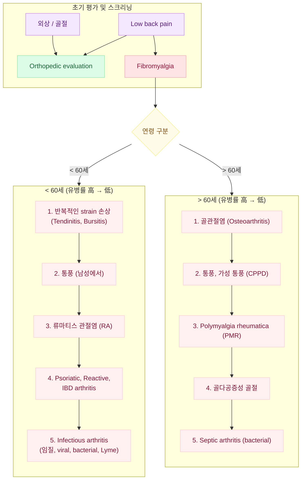
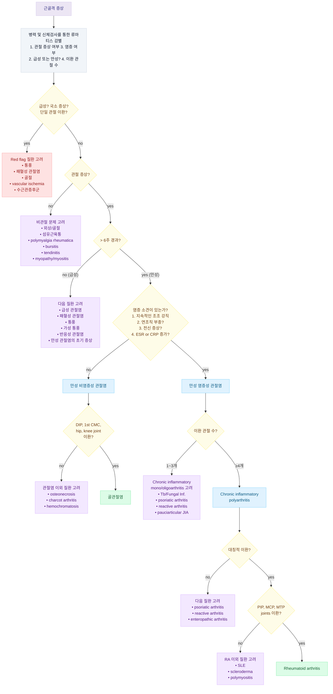

# 근골격계 문제의 감별

### Red Flags!&#x20;

* 외상으로 시작 - 중년 이후에 새로이 시작(＞50세)
* 발열, 야간 발한, malaise - 근육 약화
* 진통제로 호전되지 않는 심한 통증 - 신경학적 이상
* 자세 변화, 활동에 영향을 받지 않음 - 설명할 수 없는 체중 감소
* 휴식 시 악화 - 악성 종양 병력
* 야간 통증

## 근골격 증상의 감별

흔한 근골격 증상의 진단 알고리듬
\
Ref. Harrison’s Principles of internal medicine 20th ed. 2020. fig 363-2 .

### 해부학적 위치

#### 관절 문제

* 깊거나 광범위한 통증
* 능동과 수동 움직임 모두에 제한 또는 통증, 부종, 불안정, 변형, crepitus, locking

#### 비관절 문제

* 능동 움직임 때 통증이 있으며, 보통 수동 움직임 때는 통증이 없음
* 운동 범위가 유지되며, 부종/불안정/변형/crepitus 등은 드묾
* 관절 주위 이상 : 관절 인접부 국소 압통, 자세 또는 특정 움직임 시 통증 또는 방사통 발생

### 병리적 특성

#### 염증성 이상

* 분류 : 감염성, 결절성(통풍, 가성통풍), 면역 관련(RA, SLE), 반응성(rheumatic fever, reactive arthritis), 특발성
* 국소 : 홍반, 열감, 통증, 부종
  * 강직 : 수 시간 동안 지속, 활동으로 호전(RA, polymyalgia rheumatica)
* 전신 : 피로, 발열, 발진, 체중 감소
* 실험실 검사 : ESR↑, CRP↑, PLT↑, albumin↓, 빈혈(만성 질환 시)

#### 비염증성 이상

* 분류 : 외상(rotator cuff tear), 반복 사용(bursitis, tendinitis), 퇴행성/비효과적 재생(OA), 종양(pigmented villonodular synovitis), 통증 증폭(fibromyalgia)
* 윤활낭 부종 또는 열감 없는 통증, 전신 증상 없음, 주간, 간헐적 강직
  * 강직 : 짧은 시간(＜60분) 지속되는 간헐적 강직, 활동으로 악화
* 실험실 검사 : 정상

### 진행 기간

#### 발생 속도

* 급속 발생 : 화농성 관절염, 통풍
* 서서히 발생 : OA, RA, 섬유근육통

#### 지속 기간

* 급성(＜6주) : 감염성, 결절성, 반응성
* 만성 : 비염증성(OA), 면역성(RA), 비관절성(fibromyalgia)

### 병변 범위

#### 이환 관절 수

* 소수 관절 : 감염성, 결절성
* 다관절(≥4개) : OA, RA

#### 범위

* 국소 : 건염, 수근관증후군
* 광범위 : polymyositis, fibromyalgia

#### 대칭성

* 대칭, 다관절 : RA
* 비대칭, 소수 관절 : spondyloarthritis, reactive arthritis, gout, sarcoid

#### 부위

* 상지 : RA, OA
* 하지 : reactive arthritis, gout
* axial skeleton : OA, ankylosing spondylitis

### 기타

* 동반 질환 : 당뇨병-수근관증후군, 신부전-통풍, 우울/불면-섬유근육통, 골수종-요통, 암-근육염, 골다공증-골절, 전신 steroid-골괴사/septic arthritis, 이뇨제/화학요법-통풍
* 젊은 연령 : SLE, 반응성 관절염
* 중년 : 섬유근육통, RA
* 노년 : OA, polymyalgia rheumatica
* 남 : 통풍, spondyloarthritis, ankylosing spondylitis
* 여 : RA, 섬유근육통, 골다공증, lupus

근골격 증상의 진단 알고리듬
\
Ref. Harrison’s Principles of internal medicine 20th ed. 2020. fig 363-1 .

## 관절통의 감별

* 수 분 이내의 갑작스런 발생 → 골절, 관절 내 이상, 외상, 유리체
* 수 시간\~2일 이내 발생 → 감염, 결정 침착 질환, 염증성 관절염
* 수일\~수 주, 잠행성 진행 → 무통성 감염, 골관절염, 침윤성 질환, 종양
* 정주 약물 사용, 면역 저하 → 화농성 관절염
* 과거 자연 치유되었던 급성 발작 병력 → 결정침착질환, 염증성 관절염
* 최근 지속된 steroid 치료 → 감염, 무혈관 괴사
* 응고병증, 항응고제 사용 → 출혈 관절증
* 요도염, 결막염, 설사, 발진 → 반응 관절염
* 건선성 반, 손톱 변화(소와) → 건선 관절염
* 이뇨제 사용, 통풍 결절, 요로 결석력, 알코올 남용 → 통풍
* 눈의 염증, 요통 → 강직성 척추염
* 이동성 다발성 관절통, 손발의 건초염, 피부염 → 임질성 관절염
* 폐문샘병증, 결절홍반 → Sarcoidosis

## 증상/병력에 따른 다리 문제의 감별

<table data-header-hidden><thead><tr><th width="101"></th><th></th></tr></thead><tbody><tr><td><strong>상태</strong></td><td><strong>병력 및 진찰 소견</strong></td></tr><tr><td><strong>골절</strong></td><td>• 최근의 심한 외상(낙상, 운동), 고령의 골다공증; 이환된 다리에 체중 부하가 어려움 • Joint effusion, hemarthrosis; 압통, 부종, 부동성 통증, 이환 부위 압통점</td></tr><tr><td><strong>말초동맥폐쇄질환</strong></td><td>• >55세, 2형 당뇨병, 혈행성 심질환, 흡연, 2형 당뇨병의 적은 생활 • 간헐적 파행, 펄스 사기, 냉증, 이환 일측의 백박 압박 • capillary refill time 지연(>2초), vascular filling time 지연, ankle brachial index &#x3C;0.90</td></tr><tr><td><strong>심부정맥혈전증</strong></td><td>• 최근의 수술, 악성 종양, 임신, 의식, 하지 부동(immobilization) • 장딴지 통증, 부종, 압통, 열감; 걷거나 서 있으면 심해지고 휴식 또는 올리면 호전되는 장딴지 통증 • dorsalis pedis pulse 소실, 원위부 창백</td></tr><tr><td><strong>구획증후군</strong></td><td>• 둔기 외상 병력, 압박 손상; 최근에 수축하지 않은 엄격한 훈련 또는 운동 참여 • 스트레칭으로 악화되는 하지의 지속적인 통증 • 이환부의 부종, 긴장/단단함, 심한 통증, 이상감각, 마비, 맥박 소실</td></tr><tr><td><strong>패혈성 관절염</strong></td><td>• 최근의 감염, 수술, 주사 병력, 면역 저하 상태 • 지속되는 통증(부동성), 관절 부종, 열감</td></tr><tr><td><strong>연조직염</strong></td><td>• 최근의 피부 외상, 찰과상, 장액 기능 부전, CHF, 간경화, 당뇨 • 열감, malaise, 약화 • 이환 피부 통증, 부종, 열감, 진행하는 불규칙한 경계의 발적</td></tr></tbody></table>

<figure><figcaption></figcaption></figure>

## 증상/병력에 따른 경부 통증의 감별

<figure><figcaption></figcaption></figure>
