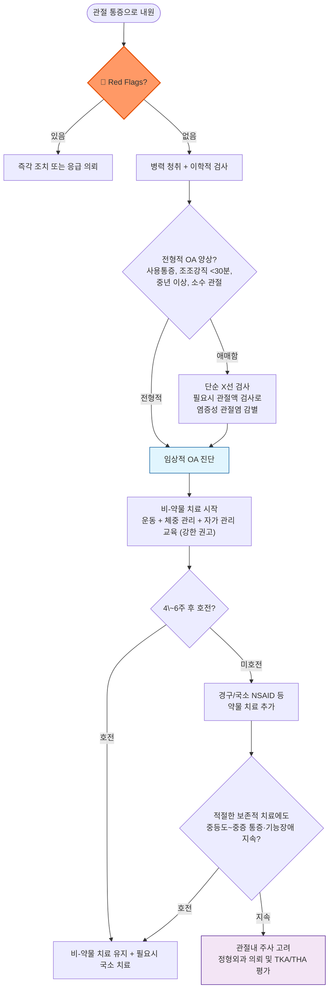

# 골관절염 (퇴행성 관절염) Osteoarthritis, OA

## <mark style="color:green;">일반 사항</mark>

* 연골, 윤활막, 인대, 연골 밑 뼈 등 관절을 구성하는 여러 구조물들에 병리학적 변화가 발생하여 관절의 통증 및 강직, 기능 제한이 발생하는 만성 관절 질환
* 다른 이름 : 퇴행성 관절염, 퇴행성 관절 질환(degenerative joint disease)
* 조직학적 변화 : molecular derangement(관절 조직의 대사 이상) → anatomic &/or physiologic derangements (연골 degradation, bone remodeling, osteophyte 형성, 관절 염증, 관절 기능 상실)
* 분류
  * 원발성(특발성) : 뚜렷한 선행 원인 없이 노화·유전·생역학적 요인에 의해 발생; 대다수의 OA
  * 속발성 : 외상, 감염, 결정성 관절염, 내분비·대사 질환, 선천성 기형 등 명확한 선행 원인에 의해 이차적으로 발생
* 호발 부위 : 무릎, 엉덩이, 손, 척추 관절
* 유병률
  * 국내 65세 이상 의사진단 유병률(2017\~2021년 국민건강영양조사) : 전체 30.2%, 여성 43.5%, 남성 13%; 고령일수록, 여성에서 증가 — 엉덩관절은 남성에서, 손·무릎관절은 여성에서 상대적으로 더 흔함
  * 국내 50세 이상 무릎 골관절염 유병률 : 방사선학적 유병률 약 37\~38%, 증상 동반 유병률 약 14\~24% (질병관리청, 국민건강영양조사)
* 합병증 : 관절 변형, 보행 장애 및 낙상 위험 증가, 만성 통증에 의한 우울·불안, 활동량 감소에 따른 심혈관 질환·대사증후군 위험 증가
* 치료 목표 : 통증·염증 감소, 기능 유지, 삶의 질 향상
  * ✽현재까지 질병의 진행을 멈추거나 역행시키는 것으로 확인된 치료(disease-modifying OA drug, DMOAD)는 없음; tanezumab(NGF 억제제) 등 후보 물질이 개발되었으나 급속 진행성 관절 파괴(RPOA), 말초 감각 이상(abnormal peripheral sensation) 등 신경계 이상반응을 포함한 안전성 문제로 상용화되지 못함 (2026년 기준)

## <mark style="color:green;">원인 및 위험 인자</mark>

* 노화 : ＞50세, 특히 ＞70세
* 여성(특히 손, 무릎)
* 비만 : 체중 부하 관절(특히 무릎)
* 직업 : 반복적으로 쪼그려 앉거나 무릎을 구부리거나 물건을 들어 올리는 육체노동
* 스포츠 활동 : 운동 선수, 심한 활동
* 관절 외상/감염 병력
* 근육 쇠약, 고유감각 결손, 신경병증
* 선천적인 해부학적 기형 : 대퇴골두골단분리증, 선천성 골반이형성증
* 내분비 대사 질환 : 말단비대증, 칼슘결정침착, 혈색소침착증, 윌슨씨병, 파젯씨병
* 가족력

## <mark style="color:green;">임상 양상</mark>

* 흔히 수 분 동안의 관절 불편감이나 강직으로 시작하여 점차 진행
  * [ ] 골관절염 초기 6년 동안은 증상의 변화가 거의 없다는 보고가 있음
* 통증 : 하나 또는 몇 개 관절의 국소 통증, 관절 및 관절 주위 압통, 다양한 강도, 간헐적 발생, 사용에 의하여 악화되고 휴식으로 완화, 심한 경우 야간 통증, 저온 습한 날씨에 악화
* 강직 : 일시적; ＜30분 지속되는 조조강직 또는 장시간 휴식 후 활동 개시 때의 뻣뻣함
* 부종 : 윤활막 증식 및 삼출에 의한 부종
* crackling, crepitus : 관절면 손상(거칠어짐)에 의해 움직임 때 소리 또는 마찰 느낌
* 변형, 운동 제한 : 관절 변형(관절 가장자리 비대), 관절 정렬 변화, 관절 운동 범위 제한/고정(locking) 또는 과다/불안정

#### <mark style="color:$primary;">손</mark>

* 흔히 엄지손가락 carpometacarpal 관절 이환
* 관절 비후성 변화 : Heberden node(DIP joint), Bouchard node(PIP joint)

#### <mark style="color:$primary;">어깨</mark>

* 특히 바깥 회전 운동 제한

#### <mark style="color:$primary;">무릎</mark>

* 관절 부종(삼출), popliteal cyst(Baker's cyst)
* 하지 불안정 또는 약화, 특히 외측 또는 계단 내려갈 때
* 관절 정렬 변화 : genu varum 또는 genu valgum

#### <mark style="color:$primary;">고관절</mark>

* 엉덩이 통증, 사타구니-앞쪽넓적다리 방사통
* 관절가동범위 감소 — 특히 내회전(internal rotation) 감소가 비교적 초기부터 흔하며, 진행 시 굴곡·외전 등도 제한

#### <mark style="color:$primary;">발</mark>

* 흔히 첫 번째 metatarsophalangeal 관절 이환/운동 제한, 엄지발가락 굳음증(hallux rigidus)
* 관절 변형 : 무지 외반증

#### <mark style="color:$primary;">척추</mark>

* 흔히 하부 경추 및 하부 요추의 apophyseal (facet) joint 이환
* 경추 부위 퇴행성 변화가 신경근을 압박하면 목/어깨/상지 방사통, 상지 저림·위약감 동반 가능
* 요추의 퇴행성 변화가 척추관협착증 또는 추간판탈출증에 의한 신경 압박을 동반하면 하지 방사통·감각 저하·근력 저하 및 neurogenic claudication(pseudoclaudication)이 발생할 수 있음 — 이는 facet OA 자체보다는 동반된 신경 압박 병변에 의한 소견임에 유의; 배뇨/배변 장애·안장마취 동반 시에는 마미증후군을 의심하여 즉시 의뢰

### <mark style="color:$danger;">🚩 Red Flags!</mark>

<mark style="color:$danger;">**즉각 조치 또는 의뢰**</mark>

* 급성으로 발생한 비외상성 단관절 열감·발적·부종·심한 통증 → **발열 유무와 관계없이** 화농성(감염성) 관절염을 우선 배제; 관절천자 고려
* 외상 직후 발생한 급격한 관절 부종·혈관절증(hemarthrosis) 의심
* 요통·하지 증상과 함께 새로 발생한 배뇨/배변 장애, 안장 감각 저하(saddle anesthesia), 진행성 양측 하지 신경학적 결손 → 마미증후군(cauda equina syndrome) 의심; 척추관협착증·추간판탈출증 등 신경 압박 병변과의 감별이 핵심이며 OA(facet joint 변화) 자체에 의한 것이 아님에 유의

<mark style="color:$warning;">**당일 또는 조기 의뢰**</mark>

* 염증성 징후를 동반하나 화농성 관절염 정도로 급격하지 않은 관절 통증 → 결정성 관절염(통풍, 가성통풍) 또는 염증성 관절염 의심
* ＞30분 지속되는 조조강직, 다관절·대칭성 침범 → RA 등 염증성 관절염 감별 필요
* 비전형적인 부위 침범(예: 손목, 발목 등 OA에서 드문 부위) 또는 새로 발생한 단일 관절염
* 원인 불명의 체중 감소, 야간 통증이 뚜렷한 경우 → 악성 종양 등 감별 필요

<mark style="color:$info;">**외래 추적 / 추가 평가 계획**</mark> <mark style="color:$info;">- 즉각 위험 낮으나 호전 없으면 의뢰</mark>

* 증상의 갑작스런 악화
* 표준 비-약물·약물 치료 4\~6주 후에도 호전이 없는 경우
* 기능 제한이 진행하여 일상생활이 어려워지는 경우 → 정형외과 의뢰(관절 치환술 등 수술적 치료 고려)

## <mark style="color:green;">진단</mark>

### <mark style="color:orange;">영상 검사</mark>

* 초기에는 유의미한 소견 없을 수 있음; ✽방사선학적 OA 소견의 정도와 통증·기능 장애의 정도는 반드시 일치하지 않으므로 영상 소견만으로 증상의 원인을 단정하지 않음
* X선 소견 : 골극(osteophyte) 형성, 비균일·비대칭적 관절강 협소, 연골하 골경화, 연골하 낭종
* ✽관절 주위 골감소(periarticular osteopenia)나 marginal erosion은 OA의 전형적 소견이 아니며, 뚜렷할 경우 RA 등 염증성 관절염을 우선 감별
* ✽45세 이상 + 사용에 의해 악화되는 통증 + 조조강직이 없거나 ≤30분인 전형적 경우, 비전형적 소견(야간통, 급격한 악화, 신경학적 이상 등)이 없다면 영상 검사 없이 임상적으로 진단 가능 [NICE]

### <mark style="color:orange;">실험실 검사</mark>

* OA의 진단을 위한 실험실 검사는 보통 필요 없음
* 다른 질환 배제를 위하여 고려
* 관절액 검사 : 만성 염증성 관절염과의 감별
  * 비염증성(OA 등) : 대개 ＜2,000 cells/㎣(흔히 ＜1,000 cells/㎣), mononuclear cell 우세
  * 염증성 : 대개 ≥2,000 cells/㎣, neutrophil 우세
  * ✽감염 여부는 관절액 WBC 수치만으로 배제할 수 없으며 Gram stain·배양·결정 검사를 함께 판단

### <mark style="color:orange;">감별</mark>

#### <mark style="color:$primary;">비관절 질환</mark>

* 능동 운동 시 통증 발생, 수동 운동 시 통증 없음
* 관절 인접 부위의 국소 압통, 관절낭으로부터 떨어진 부위에 이상 소견이 존재
* 관절 부종, 마찰음, 불안정성, 변형 등이 없거나 증상과 무관하게 발생
* 국소 증상 발생 예 : 힘줄염, 수근관증후군
* 광범위 증상 발생 예 : 다발근육염, 섬유근육통

#### <mark style="color:$primary;">감염/염증성 질환을 시사하는 소견</mark>

* 국소 염증 소견 : 홍반, 열, 통증, 부종 악화
* 전신 증상 : 피로, 발열, 발진, 체중 감소
* 검사 : CBC, ESR/CRP; 감염성 관절염 의심 시 관절액 WBC·결정 검사·Gram stain·배양, 필요시 혈액 배양

#### <mark style="color:$primary;">지속 기간</mark>

* 급성(＜6주) : 감염성, 결정성(예: 통풍, CPPD), 반응성 관절염
* 만성 : OA, 류마티스 관절염(RA), 섬유근육통

#### <mark style="color:$primary;">이환 관절 수</mark>

* 소수 관절 이환 : 결정성, 감염성
* 많은 관절(≥4개) 이환 : OA, RA

#### <mark style="color:$primary;">관절 분포 양상</mark>

* OA : DIP, PIP, 1st CMC, 무릎, 고관절, 1st MTP 등을 흔히 침범; 손 OA도 양측성으로 나타날 수 있어 대칭성만으로 RA를 감별하지 않음
* RA : MCP, PIP, 손목, MTP를 주로 대칭적으로 침범하며 DIP는 대개 보존
* 통풍/CPPD : 급성 단관절 또는 소수 관절염이 흔함; 통풍은 1st MTP, CPPD는 무릎·손목 등이 흔한 부위이나 만성 다관절 통풍은 상지도 침범 가능
* 척추관절염 : 비대칭적 하지 관절염 및 축성(axial)·건부착부(enthesis) 침범이 단서

#### <mark style="color:$primary;">연령</mark>

* ＜60세 : 반복 사용, 과도 긴장, 통풍(남성), RA, 척추관절염, 감염성 관절염
* ＞60세 : OA, 결정성(통풍, 가성통풍/CPPD), 류마티스성 다발성 근통, 골다공증성 골절, 혈관염, 약제 유발성 질환

#### <mark style="color:$primary;">관절 질환별 특징</mark>

<table><thead><tr><th width="95">항목</th><th width="150">RA (p.815)</th><th width="150">통풍 (p.825)</th><th width="160">결체조직질환 (p.834)</th><th width="150">섬유근육통 (p.834)</th><th>류마티스성 다발근통(PMR)</th></tr></thead><tbody><tr><td>진행 속도</td><td>급성/아급성</td><td>급성</td><td>아급성</td><td>만성</td><td>수주 이내</td></tr><tr><td>성별/연령</td><td>남:여=1:3, 모든 연령</td><td>남:여=3:1 (폐경 전 여성은 드묾)</td><td>남:여=1:10, 20\~40세</td><td>남:여=1:7, 30\~50세</td><td>≥50세, 남:여=1:2</td></tr><tr><td>관절 침범 양상</td><td>대칭적 양측 손발</td><td>단일 관절염, 주로 발허리발가락·발목·무릎</td><td>중증 대칭적</td><td>널리 퍼진 형태</td><td>양측 어깨·고관절대 통증·조조강직</td></tr><tr><td>기타</td><td>레이노병, 건조한 눈/입, 전신 이상</td><td>위험 인자: 비만, 음주, 이뇨제 치료</td><td>레이노병, 나비모양/혈관염 양상 발진, 전신 증상, 홍반성 홍통</td><td>수면 질 저하, 연조직 통증, 유발점, 다양한 증상</td><td>ESR/CRP 상승; 거대세포동맥염(GCA) 동반 가능 — 새 두통·턱파행·시각 증상 확인</td></tr></tbody></table>

***



<p align="center"><strong>진단 및 치료 알고리듬</strong></p>

<p align="center"><em><mark style="color:$info;">Ref. ACR/AF Guideline for the Management of OA of the Hand, Hip &#x26; Knee (2019); OARSI Guidelines for the Non-surgical Management of Knee, Hip, and Polyarticular OA (2019)</mark></em></p>

***

## <mark style="background-color:$warning;">Management</mark>


**단계별 치료 전략 (Step-wise Approach)**\
비-약물 치료(운동, 체중 관리, 자가 관리 교육)가 모든 관절·모든 중증도에서 1차 치료이자 핵심 축이며, 약물 치료는 이를 보완하는 역할. 다관절·전신 동반질환이 있는 환자는 다학제적 접근이 권장됨 (ACR/AF 2019, OARSI 2019)


## <mark style="color:green;">비-약물 치료 및 예방</mark>

* 온/냉찜질
* 관절 보호 장치, 부목(특히 손의 OA에 유용)
* 관절 과부하 회피, 과사용 금지 : 지팡이, 보행기, 벽/계단 손잡이 이용

> ✽압박대는 일반적으로 권하지 않음

* 과도하게 증상을 악화시키는 활동은 조절하되, 장기간의 완전한 휴식은 피하고 가능한 범위에서 활동을 유지
* 금연
* 체중 감량
  * 과체중·비만 동반 무릎·고관절 OA에서는 체중의 ≥5% 감량을 1차 목표로 하며, 약 10% 감량에서 더 큰 통증·기능 개선을 기대할 수 있음 [NICE, 2024 Australian Knee OA Standard]
  * ✽비만 동반 무릎 OA 환자 대상 semaglutide 2.4 ㎎ 주 1회 피하주사 68주 투여 시 위약 대비 체중 및 WOMAC 통증 점수가 유의하게 개선되었다는 보고가 있음(STEP 9 trial, NEJM 2024); 다만 2026년 기준 국내외에서 슬관절 골관절염 자체에 대한 적응증으로 승인된 것은 아니며, 비만·과체중 동반 시 체중 감량 목적의 기존 승인 기준에 따라 사용을 고려
* 관절 주위 근육 근력 강화 : 수영, 에어로빅, quadriceps 강화 운동
* 적정 vitamin D 상태 유지 : 골다공증 예방 등 전반적인 뼈 건강을 위해 필요; 다만 OA의 통증 완화나 구조적 진행 억제 목적으로 vitamin D를 routine하게 투여하는 것은 권고되지 않음 (☞ p.806)

### <mark style="color:orange;">운동</mark>

* 효과 : 통증↓, 관절 기능↑, 삶의 질↑; 통증 등 관절염 증상으로 운동을 하지 않으면 관절의 운동 기능은 더욱 감소하고 강직, 부종, 근육 약화, 관절 불안정은 악화됨
* 규칙적 운동 : 거의 매일 30분씩(10분씩 하루 3\~4회로 분할 시행할 수 있음), "조금이라도 하는 것이 전혀 안하는 것보다 낫다."
* 강도 : 통증을 완전히 피할 필요는 없으며 경도의 일시적 불편감은 허용됨 — 이는 관절 손상을 의미하지 않음. 운동 후 통증이 현저히 악화되거나 다음날까지 지속되면 강도·시간을 조절 [NICE, 2024 Australian Knee OA Standard]
* 신체/관절 상태에 맞는 운동을 선택; 비정상적인 관절은 심하지 않은 운동의 반복에 의해서도 OA 위험이 증가함

✽신체 활동 및 운동 가이드 (☞ [운동지침](../231_/216_-physical-activity-guideline.md))

#### <mark style="color:$primary;">Warm up</mark>

* 일반인은 3\~5분, 관절염 환자는 10\~15분
* 천천히 걷기 또는 10분 이내의 운동을 하는 경우에는 warm up 단계를 생략할 수 있음
* 방법
  1. 앉은 상태로 관절 운동 및 유연성 운동을 머리에서 시작하여 발까지 시행
  2. 제자리 걷기
  3. 운동할 때 속도의 절반 속도로 걷기

#### <mark style="color:$primary;">근육 강화 운동</mark>

* weight bearing 운동
* 부드럽게 움직임, 갑자기 움직이지 않음
* 통증이나 과도한 피로 없이 연속적으로 8\~10회(=1세트) 시행이 가능한 무게를 선택
* 피로와 관절 스트레스를 피하기 위해 팔과 다리 운동을 1세트씩 번갈아 시행
* 1세트 운동으로 관절통이 심해지지 않는다면 무게를 늘릴 수 있음
* 염증성 관절염(예: RA)이 있는 환자에서는 보다 가벼운 무게로 천천히 시행

#### <mark style="color:$primary;">지구력 운동</mark>

* 종류 : 수중 운동(예: 수영, 물속에서 걷기, 수중 에어로빅), 고정 자전거 타기
* 운동 중 대화를 할 수 있는, 통증이 악화되지 않는 낮은 강도 및 짧은 시간으로 시작
* 운동 후 관절이나 근육에 약간의 통증을 느끼는 정도는 허용; 2시간 이상 지속하는 것은 피함

#### <mark style="color:$primary;">Cool down</mark>

* 평소 상태로 심박수가 회복되어 갑작스런 혈압 저하, 어지럼, 구역 등을 예방함
* 방법 : 운동 강도를 낮춤(예: 천천히 걷기, 가벼운 기구 들기), 스트레칭/유연성 운동

#### <mark style="color:$primary;">주의</mark>

* 걷기 운동은 가능한 한 평평하고 수평한 곳에서 시행
* 적당한 신발(예: 걷기에 특화된 신발) 착용, 필요시 신발 쿠션/깔창 사용
* 필요한 경우 국소 NSAID 등 적절한 진통 치료를 병행하여 운동 참여를 돕되, 진통제로 통증이 조절된 상태에서 무리하게 강도를 높이지 않도록 함
* 급격한 부종, 심한 통증, 관절 불안정성이 발생하면 중단하고 재평가; 경도의 일시적 불편감만으로 중단할 필요는 없음
* 천천히 시작하여 점차 강도를 높임
* 운동 시 자세에 주의. 필요시 치료사의 도움을 받음
* 빠른 방향 전환/회전, 충격이 있는 운동은 피함(특히 하지 인공 관절 수술 환자)

### <mark style="color:orange;">골관절염의 '권고' 요법</mark>


아래는 ACR/AF(2019) 가이드라인의 관절 부위별(HAND/KNEE/HIP) 권고 강도를 정리한 표. 강한 권고 항목은 모든 환자에게 우선 고려, 조건부 권고 항목은 환자의 상황·선호를 반영한 공동 의사결정(shared decision-making) 하에 고려


<table><thead><tr><th width="230">비-약물·물리/심리사회적 치료</th><th width="90" align="center">HAND</th><th width="90" align="center">KNEE</th><th width="90" align="center">HIP</th></tr></thead><tbody><tr><td>운동(걷기, 강화 운동, 수상 운동 등)</td><td align="center"><mark style="color:blue;">강한 권고</mark></td><td align="center"><mark style="color:blue;">강한 권고</mark></td><td align="center"><mark style="color:blue;">강한 권고</mark></td></tr><tr><td>자가 관리 프로그램(목표 설정·문제 해결·질병 교육 등)</td><td align="center"><mark style="color:blue;">강한 권고</mark></td><td align="center"><mark style="color:blue;">강한 권고</mark></td><td align="center"><mark style="color:blue;">강한 권고</mark></td></tr><tr><td>1st CMC Orthosis(HAND) / TF Knee Brace(KNEE)</td><td align="center"><mark style="color:blue;">강한 권고</mark></td><td align="center"><mark style="color:blue;">강한 권고</mark></td><td align="center">—</td></tr><tr><td>체중 감량(과체중·비만 동반)</td><td align="center">—</td><td align="center"><mark style="color:blue;">강한 권고</mark></td><td align="center"><mark style="color:blue;">강한 권고</mark></td></tr><tr><td>태극권(Tai Chi)</td><td align="center">—</td><td align="center"><mark style="color:blue;">강한 권고</mark></td><td align="center"><mark style="color:blue;">강한 권고</mark></td></tr><tr><td>지팡이(보행에 의미 있는 영향이 있는 경우)</td><td align="center">—</td><td align="center"><mark style="color:blue;">강한 권고</mark></td><td align="center"><mark style="color:blue;">강한 권고</mark></td></tr><tr><td>온/냉 치료, 인지행동 요법, Acupuncture</td><td align="center">조건부 권고</td><td align="center">조건부 권고</td><td align="center">조건부 권고</td></tr><tr><td>Kinesiotaping(1st CMC 대상)</td><td align="center">조건부 권고</td><td align="center">—</td><td align="center">—</td></tr><tr><td>Balance Training</td><td align="center">—</td><td align="center">조건부 권고</td><td align="center">조건부 권고</td></tr><tr><td>다른 손 Orthoses(1st CMC 이외) / PF Knee Brace</td><td align="center">조건부 권고</td><td align="center">조건부 권고</td><td align="center">—</td></tr><tr><td>Paraffin(HAND) / Yoga(KNEE)</td><td align="center">조건부 권고</td><td align="center">조건부 권고</td><td align="center">—</td></tr><tr><td>RFA(genicular nerve, KNEE)</td><td align="center">—</td><td align="center">조건부 권고</td><td align="center">—</td></tr></tbody></table>

* 무릎과 고관절 OA를 위한 운동에는 걷기, 강화 운동, 수상 운동 등이 있으며 감독을 받으면 더 좋은 결과를 보임
* multidisciplinary group-based program : skill-building(목표 설정, 문제 해결, 긍정적 사고), 질병/약효/부작용에 대한 교육, 관절 보호, fitness & exercise goals
* 1st carpometacarpal(CMC) joint OA에 대한 neoprene or rigid orthose는 강한 권고, 그 외 CMC joint에 대한 orthoses는 조건부 권고
* TF=tibiofemoral, PF=patellofemoral, RFA=radiofrequency ablation

### <mark style="color:orange;">골관절염의 '권고하지 않음' 요법</mark>

<table><thead><tr><th width="260">비-약물·물리/심리사회적 치료</th><th width="90" align="center">HAND</th><th width="90" align="center">KNEE</th><th width="90" align="center">HIP</th></tr></thead><tbody><tr><td>TENS</td><td align="center">—</td><td align="center"><mark style="color:$danger;">강한 권고 안함</mark></td><td align="center">—</td></tr><tr><td>Iontophoresis(HAND) / Manual Therapy ±exercise(KNEE)</td><td align="center">조건부 권고 안함</td><td align="center">조건부 권고 안함</td><td align="center">—</td></tr><tr><td>Massage Therapy</td><td align="center">—</td><td align="center">조건부 권고 안함</td><td align="center">—</td></tr><tr><td>Modified Shoes / Wedged Insoles</td><td align="center">—</td><td align="center">조건부 권고 안함</td><td align="center">—</td></tr><tr><td>Pulsed Vibration Therapy</td><td align="center">—</td><td align="center">조건부 권고 안함</td><td align="center">—</td></tr></tbody></table>

> ✽감별에 참고 : 관절경을 이용한 세정술(lavage) 및 변연절제술(debridement)은 기계적 증상(locking 등)이 뚜렷하지 않은 OA 자체의 통증 완화 목적으로는 권고되지 않음(ACR/AF, AAOS)

Ref. ACR/AF. Guideline for the management of OA of the Hand, Hip, & Knee. 2019

## <mark style="color:green;">약물 치료</mark>

* 무증상 OA는 약물 치료하지 않음
* 경구제의 부작용을 감안하여 경피제를 우선 권고하기도 함


**⚠️ 심혈관·위장관 동반질환 시 NSAID 사용 주의 (OARSI 2019)**\
심혈관 질환 동반 또는 노쇠(frailty) 환자에서는 경구 NSAID 사용을 권고하지 않음. 위장관 동반질환이 있는 경우 COX-2 억제제 또는 NSAID+PPI 병용을 고려. 경구 NSAID를 부득이 사용하는 경우 최소 유효 용량으로 최단 기간만 사용


### <mark style="color:orange;">경구제</mark>

#### <mark style="color:$primary;">NSAID</mark>

* 작용 : 진통 및 항염; 약제 종류에 따른 일반적 효과 차이는 없으나 개인차는 있음 (☞ p.15)
* 최소 유효 용량으로 최단 기간 투여
* GI 문제가 있거나 장기 사용이 필요한 경우에는 COX-2 억제제 권고
* 주의 : 위궤양, 위장 출혈, 신 기능 저하, 고혈압, 부종
  * 장기 사용 시 주기적인 혈압, CBC, RFT, 대변 잠혈 모니터링을 요함
* ibuprofen : 400\~800 ㎎ tid <mark style="color:blue;">\[부루펜]</mark>
* naproxen : 500 ㎎ bid <mark style="color:blue;">\[낙센]</mark>, <mark style="color:blue;">\[낙소졸]</mark>(esomeprazole 복합제)
* celecoxib : COX-2 억제제; 200 ㎎ qd <mark style="color:blue;">\[쎄레브렉스]</mark>

#### <mark style="color:$primary;">Acetaminophen</mark>

* OA에서 1차 치료제로 권고하지 않음; 통증 감소 효과에 대한 근거가 약하고 간독성 우려가 있어 NICE 등 최신 지침에서도 routine 사용을 반복적으로 배제함
* 주의 : 간/신 기능 저하 환자, 고령, 저체중, 과도한 음주 — 이런 경우 최대 용량을 더 낮춰 고려
* 용법 : 650\~1,000 ㎎ q8h prn, 최대 3 g/day (이 챕터의 OA 권고 상한이며, 제품 허가상 최대 용량과는 별개이므로 초과 처방 시 유의) <mark style="color:blue;">\[타이레놀]</mark>

#### <mark style="color:$primary;">Opioid</mark>

* Routine 치료가 아니며, 다른 치료(비-약물 치료, NSAID 등)가 금기·무효이거나 수술·전문의 평가를 기다리는 제한적 상황에서 단기간 저용량부터 고려 (☞ p.12)
* tramadol : 저용량(예 50 ㎎)부터 시작하여 최대 100 ㎎ bid\~qid까지 점증 <mark style="color:blue;">\[트리돌]</mark>
  * acetaminophen 병용 <mark style="color:blue;">\[울트라셋]</mark> 또는 NSAID 병용으로 효과 상승
* ✽tramadol 이외의 아편유사제(non-tramadol opioids)는 ACR/AF에서 조건부 권고 안함으로 분류; 낙상·의존 위험을 고려해 다른 치료에 반응하지 않는 중증 통증에 한해 최후 수단으로 신중히 고려

#### <mark style="color:$primary;">항우울제</mark>

* duloxetine : 30\~60 ㎎ qd <mark style="color:blue;">\[심발타]</mark> — **무릎 OA에 대한 ACR/AF(2019) 조건부 권고 약제**; ACR/AF가 OA 통증에 조건부 권고하는 중추작용 진통제는 duloxetine이 대표적
  * 우울증 치료 용량보다 적은 용량에도 반응; 오심 등 초기 부작용은 대개 일시적 (보험기준 ☞ p.1177)
  * [ ] 요통과 골관절염 통증에 대한 항우울제 효과는 전반적으로 미약하다는 메타분석 보고가 있음
* nortriptyline, amitriptyline 등 삼환계 항우울제(TCA)는 OA 통증 자체에 대한 근거는 충분하지 않으며, neuropathic pain 등 별도 적응증이 동반된 경우에 한해 저용량 사용을 고려 (☞ p.1146); 특히 고령자에서는 항콜린성 부작용·기립성 저혈압·낙상 위험을 고려하여 OA의 1차 진통 목적 병용은 권장하지 않음

#### <mark style="color:$primary;">기타</mark>

* glucosamine <mark style="color:blue;">\[오스테민]</mark>, chondroitin <mark style="color:blue;">\[콘로인]</mark>
  * 손 OA에는 chondroitin이 조건부 권고이나, 무릎·고관절 OA에는 glucosamine·chondroitin 모두 강한 권고 안함 [ACR/AF 2019]; 다수의 연구에서 단독/병용 모두 위약과 차이 없다는 보고가 근거
  * 사용하는 경우에는 6개월 투여 후에도 명백한 효과가 없으면 중단할 것을 권고; 보험 적용 여부는 처방 시점의 심평원 급여기준을 확인
* S-adenosyl-L-methionine <mark style="color:blue;">\[사메론]</mark>, avocado <mark style="color:blue;">\[이모튼]</mark>, soybean : 일부에서 통증 및 기능적 개선 (보험주의); 가이드라인 상 공식 권고 등급은 없음

### <mark style="color:orange;">경피제</mark>

#### <mark style="color:$primary;">NSAID</mark>

* 무릎 OA에 강한 권고, 손 OA에는 조건부 권고 [ACR/AF 2019]; 고관절 OA에는 적용 부위 특성상 근거 없음
* 무릎 OA에서는 경구 NSAID보다 먼저 고려할 것을 권고 [OARSI 2019]
* non-low back 근골격계 손상 급성 통증에 대하여 topical NSAID 적용을 권고 [ACP, AAFP]
  * [ ] 경구제와 동등한 효과가 있다는 보고가 있음
* ketoprofen <mark style="color:blue;">\[케토톱 플라스타/겔]</mark>
* piroxicam <mark style="color:blue;">\[트라스트 패취/겔]</mark>

#### <mark style="color:$primary;">Capsaicin cream</mark>

* 작용 : 감각 신경 말단의 탈감작 효과; 효과 발현까지 2주 이상 소요
* 무릎 OA에 조건부 권고; 손 OA에는 눈 오염 위험 등으로 조건부 권고 안함 [ACR/AF 2019]; 고관절 OA에는 효과 없음
* 부작용 : 작열감(초기에 심하며 차츰 완화됨)
* 용법 : 0.075% 크림 qid <mark style="color:blue;">\[다이악센]</mark>

#### <mark style="color:$primary;">Opioid</mark>

* 비마약성 진통제 등 다른 치료로 호전되지 않는 심한 만성 통증에 대하여 고려
* 부작용 : 어지러움, 기면, 변비, 입마름, 구역, 구토, 두통, 적용 부위 가려움
* buprenorphine : 1주 1매, 저용량(5\~10 ㎍)으로 시작 <mark style="color:blue;">\[노스판 패취]</mark>

### <mark style="color:orange;">관절 내 주사</mark>

#### <mark style="color:$primary;">Steroid</mark>

* 대상 : 갑자기 악화된 OA(특히 무릎관절, 고관절), 다른 치료로 호전되지 않는 경우
* 무릎·고관절 OA에 강한 권고, 손 OA에는 조건부 권고 [ACR/AF 2019]
* 단기(4\~8주) 증상 완화 효과; 장기 효과는 불분명
* 고관절은 관절 깊이로 인해 영상 가이드(초음파 또는 투시)로 시술
  * ✽OARSI 2019는 고관절 OA에서 유효성 근거가 상대적으로 부족함을 지적; ACR/AF의 강한 권고와 온전히 일치하지는 않으므로 임상 상황에 맞게 판단
* 동일 관절에 대하여 확립된 절대적 상한은 없으며 이전 주사의 효과·지속 기간과 환자 개별 위험을 고려하여 맞춤 결정하는 것이 원칙; 통상 연 3\~4회 이하로 반복하지 않는 경우가 많음 [EULAR]
* 주사 후 약 24시간은 격렬한 운동이나 과도한 관절 사용을 피하되, 완전한 고정이나 장기간의 비체중부하는 필요하지 않음; 이후 통증을 보며 점진적으로 평소 활동으로 복귀 [EULAR]

- [ ] 무릎 OA에 대하여 1년간 steroid 관절 내 주사(평균 2.6회) vs 물리 치료(평균 12회)를 비교한 결과 물리 치료군에서 증상 개선이 더 우수했다는 보고가 있음

#### <mark style="color:$primary;">Hyaluronic acid (HA)</mark>

* 작용 : 관절의 점탄성 회복, chondrocyte 보호, 항염 작용 기대 (보험기준 ☞ p.1192)


**⚠️ 가이드라인 간 입장 차이 — 상용화된 통념과의 괴리**\
무릎·고관절 OA에서 관절내 HA는 ACR/AF(2019)에서 조건부 권고 안함(무릎) 및 강한 권고 안함(고관절)으로 분류됨. OARSI(2019) 역시 근거 수준이 낮고 제제 간 표준화가 부족함을 지적. 이후 발표된 가이드라인은 부정적 입장이 더 강화되는 추세로, NICE(2022)는 OA 전반에서 HA 주사를 제공하지 말 것을, AAOS(2024)는 고관절 OA에서 위약 대비 기능·통증 개선 이득이 없다는 이유로 강한 반대 권고를 명시함. 국내 임상에서는 널리 사용되고 있으나, steroid 대비 장기 효과가 있다는 일부 연구와 위약 대비 이득이 불확실하다는 메타분석이 공존하므로 환자와 공동 의사결정을 통해 신중히 적용


* \[히루안 플러스 주] : 1회/주 × 3주 주사; 슬관절, 견관절에 적용
* \[시노비안 주] : 1회 주사; 슬관절에 적용; BDDE(1,4-butanediol diglycidyl ether) cross-linked sodium hyaluronate 성분

#### <mark style="color:$primary;">Platelet-rich plasma (PRP) 및 줄기세포 주사</mark>

* 무릎·고관절 OA에서 ACR/AF(2019)는 강한 반대 권고로 분류; OARSI(2019) 등에서도 권고 등급 체계는 다르나 표준화되지 않은 제제와 낮은 근거 수준을 이유로 routine 사용을 권고하지 않음. 2024 Australian Knee OA Standard 역시 PRP·줄기세포 치료를 권장하지 않음
* 논란; 일부 환자에서 초기 OA에 대하여 HA보다 효과적이라는 보고가 있는 반면, 무릎 OA에 대하여 관절 통증 감소나 기능 개선에 있어 위약보다 효과적이지 않다거나 HA보다 열등하다는 보고가 있음. 발목 관절염에 대하여 낮은 수준의 일부 연구에서 효과가 있었으나 보다 큰 규모의 무작위 연구에서는 식염수 주입과 차이가 없었다는 보고가 있음

#### <mark style="color:$primary;">관절 내 Botulinum Toxin</mark>

* 무릎·고관절 OA에 조건부 권고 안함 [ACR/AF 2019]; 근거 수준 낮음

#### <mark style="color:$primary;">Polynucleotide (PN) 주사</mark>

* 국내에서 무릎 OA에 HA의 보완 요법으로 널리 사용되는 조직수복용 생체재료(예: 콘쥬란); ACR/AF·OARSI 등 국제 가이드라인에는 별도 항목이 없어 권고 등급이 정립되어 있지 않음
* 국내 급여기준 : 선별급여로 본인부담률 90% 수준; 급여 인정 투여 횟수·기간 등 세부 기준은 관련 고시 개정 및 행정·법적 절차(집행정지 등)에 따라 변동된 바 있어 처방 시점의 심평원 최신 급여기준을 확인

## <mark style="color:green;">시술 및 기타 처치</mark>

* Prolotherapy(증식치료) : 무릎·고관절 OA에 조건부 권고 안함 [ACR/AF 2019]
* 관절경 세정술/변연절제술 : locking 등 기계적 증상이 뚜렷하지 않은 통증 완화 목적으로는 권고되지 않음 — ACR/AF 및 AAOS 모두 방향은 일관되게 "권고하지 않음"이나, 근거 등급은 AAOS 2013년판의 Strong에서 2021년 개정판 Moderate로 다소 낮아짐
* 인공관절 치환술(TKA/THA) : 보존적 치료(비-약물 치료 + 약물 치료)에 반응하지 않는 중증 기능 제한·통증 지속 시 정형외과 의뢰

***

### <mark style="color:red;">질병코드</mark>

M15 다발관절증

M16 고관절증(관절증-고관절)

M17 무릎관절증(관절증-무릎)

M18 첫째 손목손허리(수근중수)관절의 관절증

M19 기타 관절증

M19.9 상세불명의 관절증

***

## <mark style="color:purple;">처방례</mark>

> **처방례 1. 경증, 손 골관절염**
>
> ```
> 케토톱 플라스타  1매  환부 부착 bid
> ```
>
> _✽작은 관절(손) OA에서 국소 NSAID는 경구제 대비 전신 부작용이 적어 우선 고려; 손 OA에서는 조건부 권고임을 환자에게 설명_

> **처방례 2. 일시적·간헐적 통증(다른 치료가 부적절할 때 단기간)**
>
> ```
> 타이레놀 이알서방정 650 ㎎/T  1T  tid prn
> ```
>
> _✽acetaminophen은 routine 1차 치료가 아니며, NSAID 등이 금기·불내성일 때 단기간 사용; 1T tid = 1일 총량 1.95 g로 이 챕터의 OA 권고 상한(3 g/day) 이내; 고령·저체중·간질환·과음 시 최대 용량을 더 낮춤_

> **처방례 3. 지속적 통증, 무릎/고관절**
>
> ```
> 낙소졸 500 ㎎/T  2T  #2 (보험주의)
> ```
>
> _✽무릎·고관절 OA에서 경구 NSAID는 강한 권고; naproxen/esomeprazole 복합제로 GI 위험 경감_

> **처방례 4. 고령, 위장관 위험이 높은 지속적 통증(무릎)**
>
> ```
> 케토톱 플라스타  1매  환부 부착 bid (1차)
> 반응 불충분 시 : 쎄레브렉스 200 ㎎/C  1C  qd (± PPI 병용)
> ```
>
> _✽고령·위장관 위험이 높은 환자에서는 국소 NSAID를 먼저 시도하고, 경구 NSAID가 필요하면 COX-2 억제제를 위장관 위험도에 따라 PPI와 병용; TCA를 OA 진통 목적으로 통상적으로 병용하지 않음_

> **처방례 5. 경구 NSAID로 호전 없는 중등도 만성 통증**
>
> ```
> 심발타 30 ㎎/C  1C  qd (2주 후 60 ㎎로 증량 고려)
> ```
>
> _✽duloxetine은 무릎 OA에서 조건부 권고; NSAID 반응 불충분 시 병용 또는 대체 고려. 오심 등 초기 부작용은 대개 일시적_

***

### <mark style="color:$success;">핵심 복약 지도</mark>

> **경구 NSAID, 최소 용량·최단 기간 원칙**
>
> * 통증이 있을 때만 필요한 최소 용량으로 복용하고, 임의로 장기 복용하지 않도록 안내
> * 위장 장애 병력, 고령, 항응고제 병용 시에는 COX-2 억제제 또는 PPI 병용을 우선 고려
> * 심혈관 질환·신기능 저하 환자에서는 경구 NSAID 자체를 자제하고 국소제·acetaminophen 등 대안을 먼저 고려

> **국소(경피) 제제 우선 원칙**
>
> * 무릎·손 등 표재성 관절에는 국소 NSAID를 경구제보다 먼저 시도하도록 안내(전신 흡수가 적어 부작용 위험 감소)
> * 고관절 OA에는 국소제가 효과가 없음을 설명

> **관절내 주사 관리**
>
> * Steroid 주사는 동일 관절에 통상 연 3\~4회를 넘지 않도록 하고, 주사 후 약 24시간은 과도한 관절 사용을 피하되 장기간의 비체중부하는 필요하지 않음을 안내
> * Hyaluronic acid, PRP 등은 가이드라인마다 권고가 엇갈리고 국내에서도 근거가 제한적임을 환자에게 설명하고 비용 대비 효과에 대한 기대치를 조정

> **언제 다시 병원을 방문해야 하나요?**
>
> * 표준 치료(운동+진통제) 4\~6주 이내에 증상이 호전되지 않는 경우
> * 관절에 **열감·발적과 함께 급격히 통증이 심해지는** 경우 — 감염성 관절염 감별 위해 즉시 내원
> * 원인 불명의 **체중 감소**, 야간 통증이 새로 생기는 경우
> * 요통 환자에서 **하지 감각 저하, 다리 힘 빠짐, 배뇨·배변 장애**가 동반되는 경우 — 즉시 내원

***

### <mark style="color:blue;">환자 안내서</mark>


**골관절염, 관절을 아끼면서도 계속 움직이는 것이 최선의 치료입니다**

골관절염은 나이가 들면서 연골뿐 아니라 뼈·윤활막 등 관절 전체에 변화가 생겨 통증과 뻣뻣함이 나타나는 매우 흔한 질환입니다. 완전히 되돌리는 치료법은 없지만, 꾸준한 운동과 체중 관리만으로도 통증을 크게 줄이고 관절 기능을 오래 유지할 수 있습니다.


#### <mark style="color:$primary;">왜 관절이 아프고 뻣뻣해지나요?</mark>

* 골관절염은 단순히 연골이 닳는 병이 아니라, 연골·뼈·관절을 감싸는 막(윤활막) 등 관절 전체에 변화가 생기는 질환입니다. 이러한 변화와 관절 주변 근육의 약화 등이 함께 작용해 통증과 뻣뻣함이 생깁니다.
* 나이, 비만, 반복적인 관절 사용, 과거 관절 부상 등이 주요 원인이며, 완전히 예방하기는 어렵지만 꾸준한 관리로 증상을 줄이고 관절 기능을 오래 유지하는 데 도움이 됩니다.

#### <mark style="color:$primary;">일상생활에서 어떻게 관리하나요?</mark>

* **아프지 않은 범위 내에서 매일 조금씩이라도 운동하십시오.** 걷기, 수영, 실내 자전거처럼 관절에 충격이 적은 운동이 좋습니다. 운동을 쉬면 오히려 관절이 더 뻣뻣해지고 근육이 약해집니다.
* **체중을 줄이십시오.** 무릎에는 걸을 때 체중의 3\~5배에 이르는 하중이 실리므로, 체중을 조금만 줄여도 통증이 뚜렷하게 줄어듭니다.
* **관절에 무리가 가는 자세나 동작(쪼그려 앉기, 무거운 물건 들기)을 피하십시오.**
* **온찜질과 냉찜질을 상황에 맞게 활용하십시오.** 뻣뻣함에는 온찜질, 급성 부종·통증에는 냉찜질이 도움이 됩니다.
* **필요하면 지팡이나 무릎 보호대를 사용하십시오.** 부끄러워하지 않아도 됩니다 — 관절을 보호해 더 오래 걸을 수 있게 해줍니다.

#### <mark style="color:$primary;">약은 어떻게 써야 하나요?</mark>

* 진통제·소염제는 증상이 있을 때 필요한 만큼만 사용하는 것이 원칙입니다. 통증이 없는 날까지 습관적으로 복용하지 마십시오.
* 바르는 소염제(파스, 겔)는 먹는 약보다 위장 부담이 적어 무릎이나 손 관절에는 먼저 시도해볼 수 있습니다.
* 글루코사민, 콘드로이친 등 건강기능식품은 효과가 입증되지 않았으므로, 사용하더라도 6개월 후에도 효과가 없으면 중단하는 것이 좋습니다.

#### <mark style="color:$primary;">이럴 때는 즉시 병원을 방문하세요</mark>

* 관절이 **갑자기 뜨거워지고 심하게 붓거나** 열이 함께 나는 경우
* 이유 없이 **체중이 줄고** 밤에 통증이 심해 잠을 설치는 경우
* 허리 통증과 함께 **다리 힘이 빠지거나 대소변을 보기 어려운** 경우
* 꾸준히 치료했는데도 4\~6주 이상 증상이 전혀 좋아지지 않는 경우
