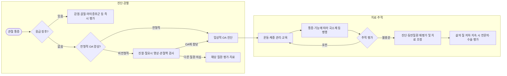

# 골관절염 (퇴행성 관절염) Osteoarthritis, OA

## <mark style="color:green;">일반 사항</mark>

* 연골, 윤활막, 인대, 연골 밑 뼈 등 관절을 구성하는 여러 구조물들에 병리학적 변화가 발생하여 관절의 통증 및 강직, 기능 제한이 발생하는 만성 관절 질환
* 다른 이름 : 퇴행성 관절염, 퇴행성 관절 질환(degenerative joint disease)
* 병태생리 : 관절 조직의 대사·생체역학적 이상과 염증 반응이 상호작용 → 연골 손상, 연골하 골재형성, 골극 형성, 윤활막 변화 및 기능 저하
* 분류
  * 원발성(특발성) : 뚜렷한 선행 원인 없이 노화·유전·생체역학적 요인에 의해 발생; 대다수의 OA
  * 속발성 : 외상, 감염, 결정성 관절염, 내분비·대사 질환, 선천성 기형 등 명확한 선행 원인에 의해 이차적으로 발생
* 호발 부위 : 무릎, 엉덩이, 손, 척추 관절
* 유병률
  * 국내 65세 이상 의사진단 유병률(2017\~2021년 국민건강영양조사) : 전체 30.2%, 여성 43.5%, 남성 13%; 고령일수록, 여성에서 증가 - 엉덩관절은 남성에서, 손·무릎관절은 여성에서 상대적으로 더 흔함
  * 국내 50세 이상 무릎 OA : 춘천 지역사회 주민 504명 연구에서 방사선학적 OA 37.3%, 증상 동반 OA 24.2% [Kim et al., 2010]; 지역 표본의 수치이므로 전국 국민건강영양조사 유병률로 일반화하지 않음
* 합병증 : 관절 변형, 보행 장애 및 낙상 위험 증가, 만성 통증에 의한 우울·불안, 활동량 감소에 따른 심혈관 질환·대사증후군 위험 증가
* 치료 목표 : 통증·염증 감소, 기능 유지, 삶의 질 향상
  * ✽현재까지 임상에서 승인된 질병수정 골관절염 약제(disease-modifying OA drug, DMOAD)는 없음; tanezumab(NGF 억제제)은 구조적 진행 억제제가 아닌 진통제 후보였으며, 급속 진행성 골관절염(RPOA) 등 안전성 문제로 상용화되지 못함

## <mark style="color:green;">원인 및 위험 인자</mark>

* 노화 : ＞50세, 특히 ＞70세
* 여성(특히 손, 무릎)
* 비만 : 체중 부하 관절(특히 무릎)
* 직업 : 반복적으로 쪼그려 앉거나 무릎을 구부리거나 물건을 들어 올리는 육체노동
* 관절 외상 위험이 높은 경쟁 스포츠·반복적인 과부하; 일반적인 걷기·수영·근력 운동 자체를 OA의 위험 요인으로 설명하지 않음
* 관절 외상/감염 병력
* 근육 쇠약, 고유감각 결손, 신경병증
* 발달성·해부학적 이상 : 발달성 고관절이형성증, 대퇴골두골단분리증의 후유 변형 등
* 내분비 대사 질환 : 말단비대증, 칼슘결정침착, 혈색소침착증, 윌슨씨병, 파젯씨병
* 가족력

## <mark style="color:green;">임상 양상</mark>

* 사용 시 통증과 휴식 후 짧은 강직이 서서히 나타나며, 경과 중 증상의 호전·악화를 반복할 수 있음
* 통증 : 하나 또는 몇 개 관절의 국소 통증, 관절 및 관절 주위 압통, 다양한 강도, 간헐적 발생, 사용에 의하여 악화되고 휴식으로 완화, 진행한 경우 휴식·야간에도 통증이 나타날 수 있음; 날씨에 따른 증상 변화는 개인차가 있음
* 강직 : 일시적; ＜30분 지속되는 조조강직 또는 장시간 휴식 후 활동 개시 때의 뻣뻣함
* 부종 : 윤활막 증식 및 삼출에 의한 부종
* crackling, crepitus : 관절면 손상(거칠어짐)에 의해 움직임 때 소리 또는 마찰 느낌
* 변형, 운동 제한 : 관절 변형(관절 가장자리 비대), 관절 정렬 변화, 관절 운동 범위 제한 또는 불안정; 지속적인 진성 잠김(true locking)은 반월상연골 병변·유리체 등 별도 원인을 평가

#### <mark style="color:$primary;">손</mark>

* 흔히 엄지손가락 carpometacarpal 관절 이환
* 관절 비후성 변화 : Heberden node(DIP joint), Bouchard node(PIP joint)

#### <mark style="color:$primary;">어깨</mark>

* 능동·수동 관절가동범위가 함께 제한될 수 있음; 외회전 제한만으로 OA를 진단하지 않으며 유착성 관절낭염·회전근개 질환 등을 감별

#### <mark style="color:$primary;">무릎</mark>

* 관절 부종(삼출), popliteal cyst(Baker's cyst)
* 무릎이 꺾이는 느낌(giving way), 대퇴사두근 약화, 계단 이용 시 통증·불안정
* 관절 정렬 변화 : genu varum 또는 genu valgum

#### <mark style="color:$primary;">고관절</mark>

* 엉덩이 통증, 사타구니-앞쪽넓적다리 방사통
* 관절가동범위 감소 - 특히 내회전(internal rotation) 감소가 비교적 초기부터 흔하며, 진행 시 굴곡·외전 등도 제한

#### <mark style="color:$primary;">발</mark>

* 흔히 첫 번째 metatarsophalangeal 관절 이환/운동 제한, 엄지발가락 굳음증(hallux rigidus)
* 무지 외반증은 동반될 수 있으나 그 자체로 첫째 MTP OA를 진단하지 않음

#### <mark style="color:$primary;">척추</mark>

* 흔히 하부 경추 및 하부 요추의 apophyseal (facet) joint 이환
* 경추 부위 퇴행성 변화가 신경근을 압박하면 목/어깨/상지 방사통, 상지 저림·위약감 동반 가능
* 요추의 퇴행성 변화가 척추관협착증 또는 추간판탈출증에 의한 신경 압박을 동반하면 하지 방사통·감각 저하·근력 저하 및 neurogenic claudication(pseudoclaudication)이 발생할 수 있음 - 이는 facet OA 자체보다는 동반된 신경 압박 병변에 의한 소견임에 유의; 배뇨/배변 장애·안장마취 동반 시에는 마미증후군을 의심하여 즉시 의뢰

### <mark style="color:$danger;">🚩 Red Flags!</mark>

<mark style="color:$danger;">**즉각 조치 또는 의뢰**</mark>

* 급성으로 발생한 비외상성 단관절 열감·발적·부종·심한 통증 → **발열 유무와 관계없이** 화농성(감염성) 관절염을 우선 배제; 의심 시 지체 없이 관절천자·관절액 배양을 포함한 응급 평가
* 외상 직후 발생한 급격한 관절 부종·혈관절증(hemarthrosis) 의심
* 요통·하지 증상과 함께 새로 발생한 배뇨/배변 장애, 안장 감각 저하(saddle anesthesia), 진행성 양측 하지 신경학적 결손 → 마미증후군(cauda equina syndrome) 의심; 척추관협착증·추간판탈출증 등 신경 압박 병변과의 감별이 핵심이며 OA(facet joint 변화) 자체에 의한 것이 아님에 유의

<mark style="color:$warning;">**당일~수일 내 평가**</mark>

* 새로 발생한 열감·삼출·관절 부종은 결정성·염증성 관절염도 고려하되, 증상이 덜 급격하거나 발열이 없다는 이유로 감염을 배제하지 않음; 감염 의심 또는 급성 단관절염은 즉각 조치 항목에 따라 평가
* ＞30분 지속되는 조조강직, 다관절·대칭성 침범 → RA 등 염증성 관절염 감별 필요
* 비전형적인 부위 침범(예: 손목, 발목 등 OA에서 드문 부위) 또는 새로 발생한 단일 관절염
* 원인 불명의 체중 감소, 야간 통증이 뚜렷한 경우 → 악성 종양 등 감별 필요

<mark style="color:$info;">**조기 평가 및 추적**</mark>

* 위험 징후 없이 서서히 악화하거나 반복되는 통증; 갑작스러운 악화는 감염·골절·결정성 관절염 등 위험 징후를 먼저 재확인
* 표준 비-약물·약물 치료 4\~6주 후에도 호전이 없는 경우
* 기능 제한이 진행하여 일상생활이 어려워지는 경우 → 정형외과 의뢰(관절 치환술 등 수술적 치료 고려)

## <mark style="color:green;">진단</mark>

### <mark style="color:orange;">영상 검사</mark>

* 초기에는 유의미한 소견 없을 수 있음; ✽방사선학적 OA 소견의 정도와 통증·기능 장애의 정도는 반드시 일치하지 않으므로 영상 소견만으로 증상의 원인을 단정하지 않음
* X선 소견 : 골극(osteophyte) 형성, 비균일·비대칭적 관절강 협소, 연골하 골경화, 연골하 낭종
* ✽관절 주위 골감소(periarticular osteopenia)나 변연부 미란(marginal erosion)은 RA 등 염증성 관절염을 시사; 미란성 손 OA에서는 DIP/PIP의 중심부 미란(central erosion)이 나타날 수 있어 구별
* ✽45세 이상 + 활동 관련 통증 + 조조강직이 없거나 ≤30분인 전형적 경우 임상적으로 진단 가능 [NICE]; 최근 외상, 급격한 악화, 지속적인 심한 야간통, 뜨겁고 부은 관절, 신경학적 이상 등 비전형적 소견이 있으면 추가 평가
* 영상이 필요하면 단순 X선을 우선 고려(무릎은 가능한 경우 체중부하 촬영); MRI·CT를 OA 진단이나 경과 확인 목적으로 일률적으로 시행하지 않음

### <mark style="color:orange;">실험실 검사</mark>

* OA의 진단을 위한 실험실 검사는 보통 필요 없음
* 다른 질환 배제를 위하여 고려
* 관절액 검사 : 비전형적 삼출이나 감염·결정성·염증성 관절염이 의심될 때 시행
  * 비염증성(OA 등) : 대개 ＜2,000 cells/㎣(흔히 ＜1,000 cells/㎣), mononuclear cell 우세
  * 염증성 : 대개 ≥2,000 cells/㎣, neutrophil 우세
  * ✽감염 여부는 관절액 WBC 수치만으로 배제할 수 없으며 Gram stain·배양·결정 검사를 함께 판단; 결정이 확인되어도 동반 감염은 배제되지 않음

### <mark style="color:orange;">감별</mark>

#### <mark style="color:$primary;">비관절 질환</mark>

* 능동 운동에서 통증이 두드러지고 수동 운동에서 상대적으로 적은 경우 관절 주위 질환을 시사할 수 있으나 예외가 있음
* 관절 인접 부위의 국소 압통, 관절낭으로부터 떨어진 부위에 이상 소견이 존재
* 관절 부종, 마찰음, 불안정성, 변형 등이 없거나 증상과 무관하게 발생
* 국소 증상 발생 예 : 힘줄염, 수근관증후군
* 광범위 증상 발생 예 : 다발근육염, 섬유근육통

#### <mark style="color:$primary;">감염/염증성 질환을 시사하는 소견</mark>

* 국소 염증 소견 : 홍반, 열, 통증, 부종 악화
* 전신 증상 : 피로, 발열, 발진, 체중 감소
* 검사 : CBC, ESR/CRP; 감염성 관절염 의심 시 관절액 WBC·결정 검사·Gram stain·배양, 필요시 혈액 배양

#### <mark style="color:$primary;">지속 기간</mark>

* 급성(＜6주) : 감염성, 결정성(예: 통풍, CPPD), 반응성 관절염
* 만성 : OA, 류마티스 관절염(RA), 섬유근육통

#### <mark style="color:$primary;">이환 관절 수</mark>

* 단관절염(1개) : 감염성·결정성 관절염, OA 등
* 소수관절염(2\~4개), 다관절염(≥5개) : OA·RA·척추관절염·결정성 관절염 등에서 가능; 관절 수만으로 원인을 구분하지 않음

#### <mark style="color:$primary;">관절 분포 양상</mark>

* OA : DIP, PIP, 1st CMC, 무릎, 고관절, 1st MTP 등을 흔히 침범; 손 OA도 양측성으로 나타날 수 있어 대칭성만으로 RA를 감별하지 않음
* RA : MCP, PIP, 손목, MTP를 주로 대칭적으로 침범하며 DIP는 대개 보존
* 통풍/CPPD : 급성 단관절 또는 소수 관절염이 흔함; 통풍은 1st MTP, CPPD는 무릎·손목 등이 흔한 부위이나 만성 다관절 통풍은 상지도 침범 가능
* 척추관절염 : 비대칭적 하지 관절염 및 축성(axial)·건부착부(enthesis) 침범이 단서

#### <mark style="color:$primary;">연령</mark>

* OA는 연령이 높을수록 흔하나 젊은 환자에서도 외상·기형 등에 따른 속발성 OA가 가능
* 고령의 새 관절 증상에서도 감염·결정성 관절염·RA를 배제하지 않음; ≥50세의 양측 어깨·고관절대 통증과 강직에는 PMR을 고려

#### <mark style="color:$primary;">관절 질환별 특징</mark>

<table><thead><tr><th width="95">항목</th><th width="150">RA</th><th width="150">통풍</th><th width="160">결체조직질환</th><th width="150">섬유근육통</th><th>류마티스성 다발근통(PMR)</th></tr></thead><tbody><tr><td>진행 속도</td><td>급성/아급성</td><td>급성</td><td>아급성</td><td>만성</td><td>수주 이내</td></tr><tr><td>성별/연령</td><td>여성에서 흔함, 모든 연령</td><td>남성에서 흔함(폐경 전 여성은 드묾)</td><td>질환별로 다름</td><td>여성에서 흔함, 다양한 연령</td><td>≥50세, 여성에서 흔함</td></tr><tr><td>관절 침범 양상</td><td>대칭적 양측 손발</td><td>단일 관절염, 주로 발허리발가락·발목·무릎</td><td>질환별 침범 양상 상이</td><td>널리 퍼진 형태</td><td>양측 어깨·고관절대 통증·조조강직</td></tr><tr><td>기타</td><td>관절 종창·장시간 조조강직; 건조 증상·전신 증상 동반 가능</td><td>위험 인자: 비만, 음주, 이뇨제 치료</td><td>질환에 따라 레이노 현상, 발진, 전신 증상 등</td><td>수면 질 저하, 광범위 통증·피로 등; 압통점 검사는 진단의 필수 요건이 아님</td><td>ESR/CRP 상승; 거대세포동맥염(GCA) 동반 가능 - 새 두통·턱파행·시각 증상 확인</td></tr></tbody></table>

***


```mermaid
graph LR
    subgraph S1["진단·감별"]
        direction TB
        A([관절 통증]) --> B{"응급 징후?"}
        B -- 있음 --> C["감염·골절·마미증후군 등 즉시 평가"]
        B -- 없음 --> D{"전형적 OA 양상?"}
        D -- 전형적 --> E["임상적 OA 진단"]
        D -- 비전형적 --> F["진찰·필요시 영상·관절액 검사"]
        F -- OA에 합당 --> E
        F -- 다른 질환 의심 --> G["해당 질환 평가·치료"]
    end
    subgraph S2["치료·추적"]
        direction TB
        H["운동·체중 관리·교육"] --> I["통증·기능에 따라 국소제 등 병행"]
        I --> J{"추적 평가"}
        J -- 호전 --> H
        J -- 불충분 --> K["진단·동반질환 재평가 및 치료 조정"]
        K --> L["삶의 질 저하 지속 시 전문의·수술 평가"]
    end
    E --> H
```

<p align="center"><strong>진단 및 치료 알고리듬</strong></p>

<p align="center"><em><mark style="color:$info;">저자 재구성 (참고 문헌: ACR 2026 권고 요약본; OARSI 2019; NICE NG226, 2022)</mark></em></p>

***

## <mark style="background-color:$warning;">Management</mark>


**단계별 치료 전략 (Step-wise Approach)**\
비-약물 치료(운동, 체중 관리, 자가 관리 교육)가 모든 관절·모든 중증도에서 1차 치료이자 핵심 축이며, 약물 치료는 이를 보완하는 역할. 다관절·전신 동반질환이 있는 환자는 다학제적 접근이 권장됨 (ACR 2026 권고 요약본, OARSI 2019)


## <mark style="color:green;">비-약물 치료 및 예방</mark>

* 온/냉찜질
* 관절 보호 장치·부목 : 통증·기능 저하가 있는 손 OA와 무릎 OA에서 환자에 맞춰 선택
* 관절 과부하 회피, 과사용 금지 : 지팡이, 보행기, 벽/계단 손잡이 이용

> ✽보호대는 적응 관절과 증상에 맞춰 선택; 모든 압박대·보조기를 일률적으로 권고하거나 배제하지 않음

* 과도하게 증상을 악화시키는 활동은 조절하되, 장기간의 완전한 휴식은 피하고 가능한 범위에서 활동을 유지
* 금연
* 체중 감량
  * 과체중·비만 동반 무릎·고관절 OA에서는 체중의 ≥5% 감량을 1차 목표로 하며, 약 10% 감량에서 더 큰 통증·기능 개선을 기대할 수 있음 [NICE, 2024 Australian Knee OA Standard]
  * ✽ACR 2026은 비만 동반 무릎 OA에서 식사·운동과 함께 적정 체중을 달성하기 위한 GLP-1 수용체 작용제 사용을 조건부 권고. 비만 동반 무릎 OA 환자 대상 semaglutide 2.4 ㎎ 주 1회 피하주사 68주 투여 시 위약 대비 체중 및 WOMAC 통증 점수가 유의하게 개선되었다는 보고가 있음(STEP 9 trial, NEJM 2024); OA 권고가 국내 OA 적응증 허가를 의미하는 것은 아니며, 국내 비만 치료 허가 기준에 따라 사용; 2.4 ㎎은 목표 유지 용량으로 낮은 시작 용량에서 제품 허가사항에 따라 증량
* 관절 주위 근육 근력 강화 : 수영, 에어로빅, quadriceps 강화 운동
* 적정 vitamin D 상태 유지 : 골다공증 예방 등 전반적인 뼈 건강을 위해 필요; 다만 OA의 통증 완화나 구조적 진행 억제 목적으로 vitamin D를 routine하게 투여하는 것은 권고되지 않음 (☞ p.806)

### <mark style="color:orange;">운동</mark>

* 효과 : 통증↓, 관절 기능↑, 삶의 질↑; 통증 등 관절염 증상으로 운동을 하지 않으면 관절의 운동 기능은 더욱 감소하고 강직, 부종, 근육 약화, 관절 불안정은 악화됨
* 규칙적 운동 : 거의 매일 30분씩(10분씩 하루 3\~4회로 분할 시행할 수 있음), "조금이라도 하는 것이 전혀 안하는 것보다 낫다."; 목표치는 WHO/ACSM 기준 중강도 유산소 주 150\~300분 또는 고강도 75\~150분(또는 동등한 조합)에 근력·유연성·신경운동(균형) 운동을 함께 시행 [EULAR 2026]
* 강도 : 통증을 완전히 피할 필요는 없으며 경도의 일시적 불편감은 허용됨 - 이는 관절 손상을 의미하지 않음. 운동 후 통증이 현저히 악화되거나 다음날까지 지속되면 강도·시간을 조절 [NICE, 2024 Australian Knee OA Standard]; 규칙적 운동이 OA를 악화시킨다는 근거는 없으므로 통증에 대한 두려움으로 운동을 회피하지 않도록 설명 [EULAR 2026]
* 관절 변형·불안정성이 있으면 운동 종류와 부하를 개별 조절; 운동 자체를 회피하기보다 물리치료사의 평가와 감독을 고려
* 기능 제한이 뚜렷하거나 비활동 상태였던 환자는 낮은 강도부터 점진적으로 증량; 증상과 체력에 맞추고 장시간 앉아 있는 시간을 줄임 [EULAR 신체활동 권고 2025 개정, 2026 출판]

✽신체 활동 및 운동 가이드 (☞ [운동지침](../231_/216_-physical-activity-guideline.md))

#### <mark style="color:$primary;">Warm up</mark>

* 낮은 강도의 걷기·관절가동 운동으로 시작하여 몸을 준비; 운동 종류·체력·강직 정도에 따라 시간을 조절
* 방법
  1. 앉은 상태로 관절 운동 및 유연성 운동을 머리에서 시작하여 발까지 시행
  2. 제자리 걷기
  3. 운동할 때 속도의 절반 속도로 걷기

#### <mark style="color:$primary;">근육 강화 운동</mark>

* 저항 운동 : 체중·탄력 밴드·기구 등을 이용하며, 필요한 경우 비체중부하 자세에서 시작
* 부드럽게 움직임, 갑자기 움직이지 않음
* 통증이나 과도한 피로 없이 연속적으로 8\~10회(=1세트) 시행이 가능한 무게를 선택
* 피로와 관절 스트레스를 피하기 위해 팔과 다리 운동을 1세트씩 번갈아 시행
* 정해진 반복 횟수를 안정적으로 수행하고 운동 후 증상이 악화하지 않으면 부하를 조금씩 증가; 주 2일 이상을 목표로 하되 초기에는 개인별 조절
* 염증성 관절염(예: RA)이 있는 환자에서는 보다 가벼운 무게로 천천히 시행

#### <mark style="color:$primary;">지구력 운동</mark>

* 종류 : 수중 운동(예: 수영, 물속에서 걷기, 수중 에어로빅), 고정 자전거 타기
* 운동 중 대화를 할 수 있는, 통증이 악화되지 않는 낮은 강도 및 짧은 시간으로 시작
* 운동 후 경도의 일시적 통증은 허용하되, 현저한 악화·부종 또는 다음날까지 지속되는 통증에는 다음 운동의 강도·시간을 줄이고 필요시 재평가

#### <mark style="color:$primary;">Cool down</mark>

* 평소 상태로 심박수가 회복되어 갑작스런 혈압 저하, 어지럼, 구역 등을 예방함
* 방법 : 운동 강도를 낮춤(예: 천천히 걷기, 가벼운 기구 들기), 스트레칭/유연성 운동

#### <mark style="color:$primary;">주의</mark>

* 걷기 운동은 가능한 한 평평하고 수평한 곳에서 시행
* 편하고 안정적인 신발 착용; OA 치료 목적으로 내측·외측 쐐기 깔창을 일률적으로 처방하지 않음
* 필요한 경우 국소 NSAID 등 적절한 진통 치료를 초기부터 병행하여 운동 참여를 돕되, 진통제로 통증이 조절된 상태에서 무리하게 강도를 높이지 않도록 함
* 급격한 부종, 심한 통증, 관절 불안정성이 발생하면 중단하고 재평가; 경도의 일시적 불편감만으로 중단할 필요는 없음
* 천천히 시작하여 점차 강도를 높임
* 운동 시 자세에 주의. 필요시 치료사의 도움을 받음
* 빠른 방향 전환/회전, 충격이 있는 운동은 피함(특히 하지 인공 관절 수술 환자)

### <mark style="color:orange;">비약물 요법의 주요 권고</mark>


**ACR 2026 권고 요약본 기준(2026년 9월 14일 공개)**\
2019 지침의 개정 요약본이며 정식 논문은 출판 전. 아래는 주요 항목만 정리한 표로, 적용 시 환자의 금기·선호·접근성을 함께 판단. ‘—’는 해당 부위의 권고를 이 표에 제시하지 않았다는 뜻임.


<table><thead><tr><th>요법</th><th>손</th><th>무릎</th><th>고관절</th></tr></thead><tbody>
<tr><td>운동</td><td>조건부 권고</td><td>강한 권고</td><td>강한 권고</td></tr>
<tr><td>감량(과체중·비만)</td><td>—</td><td>강한 권고</td><td>강한 권고</td></tr>
<tr><td>보조기(손: 1st CMC·손가락 / 무릎: TF·PF)</td><td>조건부 권고</td><td>조건부 권고</td><td>—</td></tr>
<tr><td>치료적 테이핑(손은 1st CMC)</td><td>조건부 권고</td><td>조건부 권고</td><td>—</td></tr>
<tr><td>CBT·온/냉 치료·침</td><td>조건부 권고</td><td>조건부 권고</td><td>조건부 권고</td></tr>
<tr><td>태극권·마사지</td><td>—</td><td>조건부 권고</td><td>조건부 권고</td></tr>
<tr><td>파라핀 / 요가</td><td>조건부 권고(파라핀)</td><td>조건부 권고(요가)</td><td>—</td></tr>
<tr><td>관절염용 장갑</td><td>조건부 권고</td><td>—</td><td>—</td></tr>
<tr><td>RFA</td><td>—</td><td>조건부 권고</td><td>—</td></tr>
<tr><td>쐐기 깔창·TENS</td><td>—</td><td>조건부 반대</td><td>조건부 반대</td></tr>
</tbody></table>

* 교육·자가 관리, 보행 보조 및 필요한 물리·작업치료 의뢰를 함께 시행
* TF=tibiofemoral, PF=patellofemoral, CBT=인지행동치료, RFA=고주파 절제술
* 도수치료는 운동을 대체하지 않으며, NICE NG226은 무릎·고관절 OA에서 운동과 병행하는 경우에만 고려하도록 함

## <mark style="color:green;">약물 치료</mark>

* 무증상 OA는 약물 치료하지 않음
* 경구제의 부작용을 감안하여 경피제를 우선 권고하기도 함


**⚠️ 심혈관·위장관 동반질환 시 NSAID 사용 주의 (OARSI 2019)**\
심혈관 질환 동반 또는 노쇠(frailty) 환자에서는 경구 NSAID 사용을 권고하지 않음. 위장관 동반질환이 있는 경우 COX-2 억제제 또는 NSAID+PPI 병용을 고려. 경구 NSAID를 부득이 사용하는 경우 최소 유효 용량으로 최단 기간만 사용


### <mark style="color:orange;">경구제</mark>

#### <mark style="color:$primary;">NSAID</mark>

* 작용 : 진통 및 항염; 약제·용량에 따라 효과·위험이 다르고 개인차가 있음 (☞ p.15)
* 최소 유효 용량으로 최단 기간 투여
* 위장관 위험이 높은 경우 심혈관·신장 위험까지 함께 평가하여 COX-2 억제제 또는 NSAID+PPI 등을 선택; 장기 사용 필요성 자체가 COX-2 억제제의 적응증은 아님
* 주의 : 위궤양·위장 출혈, 만성콩팥병·급성 신손상, 심부전·심혈관 질환, 고혈압·부종; 항응고제 및 이뇨제·ACE 억제제/ARB 병용 여부 확인
  * 시작 전 혈압·신기능·복용 약물을 확인; 고위험 환자는 시작·증량 후 조기에 Cr/eGFR·K를 재확인하고 장기 사용 시 혈압·CBC·신기능 등을 주기적으로 평가. 대변 잠혈 검사만으로 NSAID 관련 출혈을 감시하거나 배제하지 않음
  * 서로 다른 경구 NSAID를 중복 처방하지 않음; NICE NG226은 경구 NSAID 사용 시 위장 보호 치료(PPI 등) 병용을 권고
* ibuprofen : 예 400 ㎎ tid부터 반응에 따라 조절(필요시 800 ㎎ tid); 저용량으로 충분하면 증량하지 않음 <mark style="color:blue;">\[부루펜]</mark>
* naproxen : 250\~500 ㎎ bid <mark style="color:blue;">\[낙센]</mark>; <mark style="color:blue;">\[낙소졸]</mark>은 naproxen/esomeprazole 고정 복합제로 규격별 용법과 적응증 확인(500/20 ㎎ 처방례 참고)
* celecoxib : COX-2 억제제; 200 ㎎ qd <mark style="color:blue;">\[쎄레브렉스]</mark>

#### <mark style="color:$primary;">Acetaminophen</mark>

* 진통 효과가 작아 일률적인 1차 선택은 아님. ACR 2026은 조건부 권고, NICE NG226은 다른 약물 치료가 금기·불내성·무효일 때 단기간·간헐적으로만 고려; AAOS 2021 무릎 지침은 권고하므로 지침 간 차이를 구분
* 주의 : 간/신 기능 저하 환자, 고령, 저체중, 과도한 음주 - 이런 경우 최대 용량을 더 낮춰 고려
* 용법 예 : 일반정 500\~1,000 ㎎ q8h prn, OA에서는 1일 총량 ≤3 g를 권고 상한으로 사용 [ACR/AF 2019]; 제품 허가상 최대량과 구분하고 복합제·감기약의 acetaminophen을 합산. 서방정은 해당 제품의 용법을 따름 <mark style="color:blue;">\[타이레놀]</mark>

#### <mark style="color:$primary;">Opioid</mark>

* ACR 2026은 tramadol을 포함한 opioid를 조건부 반대; AAOS 2021도 무릎 OA에서 tramadol을 포함한 경구 opioid를 권고하지 않음. NICE는 약한 opioid를 다른 약물 치료가 금기·불내성·무효일 때 단기간·간헐적으로만 고려하고 강한 opioid는 제공하지 않도록 함 (☞ p.12)
* 예외적으로 tramadol 사용 시 : 일반제형 50 ㎎ 등 저용량부터 최소 기간 사용; 성인 허가 상한 400 ㎎/일. ＞75세 및 신장·간기능 저하 시 배설 지연에 따라 투여간격 연장 등을 고려하고 제형별 허가사항을 확인 <mark style="color:blue;">\[트리돌]</mark>
  * acetaminophen 복합제 <mark style="color:blue;">\[울트라셋]</mark> 사용 시 acetaminophen 총량을 합산; duloxetine·SSRI/SNRI 병용 시 세로토닌 증후군·경련 위험, 고령자에서는 진정·낙상 위험을 고려
* ✽tramadol도 낙상·의존·호흡억제 위험이 있으며 자동적인 다음 단계 치료로 제시하지 않음; 다른 치료에 불응하면 진단·수술 가능성·전문의 평가를 우선 재검토

#### <mark style="color:$primary;">항우울제</mark>

* duloxetine : 30 ㎎ qd로 1주 시작 후 60 ㎎ qd <mark style="color:blue;">\[드록틴]</mark> - ACR 2026은 손·무릎·고관절 OA에 조건부 권고; 국내 허가 적응증은 **NSAID에 반응이 적절하지 않은 골관절염 통증**
  * 60 ㎎/일 초과 시 추가 이득은 확인되지 않음; 간기능 장애·중증 신장애(CrCl ＜30 ㎖/min)는 금기. OA 허가사항에는 13주 초과 투여의 안전성·유효성이 연구되지 않았다고 명시되어 있어 지속 필요성을 재평가; 중단 시 감량하고 tramadol 병용을 피하거나 신중히 판단 (보험기준 ☞ p.1177)
* OA 자체에는 TCA·기타 SNRI·pregabalin·gabapentin을 조건부 반대 [ACR 2026]; 신경병증성 통증 등 별도 적응증은 따로 판단 (☞ p.1146). 고령자에서는 항콜린성 부작용·기립성 저혈압·낙상에 유의

#### <mark style="color:$primary;">기타</mark>

* glucosamine <mark style="color:blue;">\[오스테민]</mark>, chondroitin <mark style="color:blue;">\[콘로인]</mark>
  * 손·무릎·고관절 모두 glucosamine·chondroitin 및 복합제를 강하게 반대 [ACR 2026]; 손 chondroitin의 2019년 조건부 권고는 변경됨
  * 표준 치료로 새로 시작하지 않으며, 이미 복용 중이면 효과·비용을 검토하고 뚜렷한 이득이 없을 때 중단을 논의; 반드시 6개월을 채울 필요는 없음. 보험은 처방 시점 기준 확인
* S-adenosyl-L-methionine(SAMe) : OA의 핵심 치료로 제시할 근거가 제한적
* avocado-soybean unsaponifiables(ASU, 아보카도-소야 불검화물 추출물) <mark style="color:blue;">\[이모튼]</mark> : 국내 허가는 **성인 무릎 OA의 증상 완화**; 300.03 ㎎/C 1C qd, 식사와 함께 복용. 아보카도·소야의 별개 요법이 아니며 구조적 진행 억제 효과를 확립된 것으로 설명하지 않음
* 미란성 손 OA의 methotrexate는 조건부 권고 [ACR 2026]; 국내 OA 적응증 허가 외 사용으로 류마티스내과에서 검토. 모든 손 OA에 확대 적용하지 않음

### <mark style="color:orange;">경피제</mark>

#### <mark style="color:$primary;">NSAID</mark>

* 무릎·손 OA에 국소 NSAID를 강하게 권고 [ACR 2026]; 고관절은 깊어 관절 통증 개선을 기대하기 어려움
* 국소제가 적합한 무릎·손 OA에서는 경구 NSAID보다 먼저 고려 [ACR/AF 2019, NICE NG226]
* ketoprofen <mark style="color:blue;">\[케토톱 플라스타/겔]</mark>
  * 광과민 반응 : 사용 중과 중단 후 2주까지 적용 부위를 햇빛·자외선으로부터 보호; 피부 발진 시 중단. 상처·습진 부위에 사용하지 않으며 경구 NSAID와 임의 중복 사용하지 않음
* piroxicam <mark style="color:blue;">\[트라스트 패취/겔]</mark>

#### <mark style="color:$primary;">Capsaicin cream</mark>

* 작용 : 감각 신경 말단의 탈감작 효과; 효과 발현까지 2주 이상 소요
* 무릎은 조건부 권고, 손은 조건부 반대 [ACR 2026]; 고관절은 깊어 유의한 효과를 기대하기 어려움
* 부작용 : 작열감(초기에 심하며 차츰 완화됨)
* 용법 : 0.075% 크림 qid <mark style="color:blue;">\[다이악센]</mark>

#### <mark style="color:$primary;">Opioid</mark>

* buprenorphine도 opioid 비권고 범주에 해당; OA의 통상적인 국소 치료제로 제시하지 않음. 다른 비마약성 치료에 불응한 중등도·중증 만성 통증에서 예외적으로 전문의와 검토
* 부작용 : 호흡억제, 진정·낙상, 변비, 구역, 의존 및 적용 부위 반응; 패치는 전신 작용을 하며 가열·절단하지 않음
* buprenorphine : 5 ㎍/h 패치부터 시작하여 7일마다 교체, 반응에 따라 10 ㎍/h 등으로 조절 <mark style="color:blue;">\[노스판 패취]</mark>

### <mark style="color:orange;">관절 내 주사</mark>

#### <mark style="color:$primary;">Steroid</mark>

* 대상 : 갑자기 악화된 OA(특히 무릎관절, 고관절), 다른 치료로 호전되지 않는 경우; 열감·급성 삼출 등 감염이 의심되면 관절천자 등으로 먼저 평가하고 감염된 관절에는 주사하지 않음
* 무릎·고관절 OA에 강한 권고, 손 OA에 조건부 권고 [ACR 2026]
* 단기 증상 완화(약 2\~10주, NICE NG226); 반복 투여로 구조적 진행을 억제하는 치료는 아님
* 고관절은 관절 깊이로 인해 영상 가이드(초음파 또는 투시)로 시술
  * ✽OARSI 2019는 고관절·다관절 OA의 관절내 steroid를 권고하지 않으며, ACR의 권고와 다름
* 동일 관절에 대하여 확립된 절대적 상한은 없으며 이전 주사의 효과·지속 기간과 환자 개별 위험을 고려하여 맞춤 결정하는 것이 원칙; 관행적으로 동일 관절의 연 3\~4회 초과를 피하지만 이 숫자는 검증된 절대 상한이 아님 [EULAR 2021]
* 주사 후 약 24시간은 과사용을 피하되 완전한 고정은 권하지 않음; 당뇨병 환자는 특히 주사 후 1\~3일간 혈당 상승을 관찰. 관절치환술 예정 시 주사와 수술 간격(통상 최소 3개월)을 담당 정형외과와 확인 [EULAR 2021]


#### <mark style="color:$primary;">Hyaluronic acid (HA)</mark>

* 작용 : 점탄성 보완을 통한 윤활·통증 완화 기대; 연골 재생이나 구조적 진행 억제는 확립되지 않음 (보험기준 ☞ p.1192)


**⚠️ HA의 지침별 권고를 구분**\
ACR 2026은 손·무릎·고관절 관절내 HA에 조건부 반대. NICE NG226은 OA에 제공하지 않도록 권고하며, AAOS는 무릎의 routine 사용을 권고하지 않고 고관절은 강하게 반대함. OARSI 2019는 동반질환에 따라 **무릎에서 선택적인 치료(Level 1B/2)**로 인정하지만 고관절·다관절 OA에는 권고하지 않음. 국내 허가·보험과 국제 권고는 별개이며, 적용 시 제한적인 기대효과·비용을 설명.


* <mark style="color:blue;">\[히루안플러스주]</mark> : 1주 1회 1관 × 3주; 허가는 **슬관절 OA 및 견관절주위염**. 견관절주위염의 허가를 견관절 OA 적응증으로 해석하지 않음
* <mark style="color:blue;">\[시노비안주]</mark> : 슬관절 OA에 1회 1관 주사; 반복 투여 시 간격은 6개월 이상으로 허가사항에 따라 판단. BDDE(1,4-butanediol diglycidyl ether) 가교 sodium hyaluronate 제제

#### <mark style="color:$primary;">Platelet-rich plasma (PRP) 및 줄기세포 주사</mark>

* PRP : ACR 2026은 무릎·고관절에서 강하게 반대; AAOS 2021은 무릎의 통증·기능 개선 가능성을 제한적 근거로 제시. 제제·투여법의 이질성과 불확실성을 설명하고 routine 치료로 제시하지 않음
* 줄기세포 주사 : 무릎·고관절에서 강하게 반대 [ACR 2026]; 배양 세포·지방 유래 제제·골수 농축물·수술과 병행하는 허가된 세포치료제는 서로 동일하지 않으므로 구분
* 연골 재생·OA 진행 억제를 확립된 효능으로 안내하지 않으며, 국내 시술·제품별 허가 범위와 신의료기술·급여 여부를 개별 확인

#### <mark style="color:$primary;">관절 내 Botulinum Toxin</mark>

* 무릎·고관절 OA에 조건부 권고 안함 [ACR 2026]

#### <mark style="color:$primary;">Polynucleotide (PN) 주사</mark>

* 무릎 OA에 사용하는 의료기기인 조직수복용 생체재료(예: 콘쥬란); 약제인 PDRN과 구분. 주요 국제 OA 지침에서 별도 권고가 정립되어 있지 않으며 연골 재생 효과를 확립된 것으로 설명하지 않음
* 국내 급여 : 선별급여 대상이나 본인부담률·횟수·주기 기준은 고시 개정과 집행정지에 따라 확인이 필요하여 고정 수치로 단정하지 않음. 심평원 기준의 의약품제제·다른 슬관절강내 주입용 치료재료와 **동일·동시 투여 금지**에 유의; HA와 자동 병용하는 요법으로 제시하지 않음

## <mark style="color:green;">시술 및 기타 처치</mark>

* Dextrose prolotherapy(증식치료) : 무릎·고관절에서 조건부 반대 [ACR 2026]
* 관절경 세정술/변연절제술 : OA 자체의 통증 치료 목적으로 권고하지 않음 [NICE NG226, AAOS 2021(Moderate)]. 단순한 걸림·딸깍거림만으로 예외를 인정하지 않으며, 지속적인 진성 잠김·유리체·급성 손상 등 별도 병변은 정형외과에서 평가.
* 인공관절 치환술(TKA/THA) : 통증·기능 제한이 삶의 질에 상당한 영향을 주고 적절한 비수술 치료가 무효이거나 부적절한 경우 정형외과 의뢰; 4\~6주 재평가 시점만으로 수술 여부를 결정하지 않음

***

### <mark style="color:red;">질병코드</mark>

M15 다발관절증 Polyarthrosis

M16 고관절증(관절증-고관절) Coxarthrosis [arthrosis of hip]

M17 무릎관절증(관절증-무릎) Gonarthrosis [arthrosis of knee]

M18 첫째 손목손허리(수근중수)관절의 관절증 Arthrosis of first carpometacarpal joint

M19 기타 관절증 Other arthrosis

M19.9 상세불명의 관절증 Arthrosis, unspecified

***

## <mark style="color:purple;">처방례</mark>

> **처방례 1. 경증, 손 골관절염**
>
> ```
> 케토톱 플라스타  1매  환부 부착 bid
> ```
>
> _✽손 OA에서 국소 NSAID는 강한 권고 [ACR 2026]. 엄지 기저부의 작은 관절에는 부착 면적·굴곡에 맞는 제품 규격을 확인하고 필요시 겔 제형을 선택_

> **처방례 2. 일시적·간헐적 통증(다른 치료가 부적절할 때 단기간)**
>
> ```
> 타이레놀정 500 ㎎/T  1~2T  q8h prn (1일 최대 6T)
> ```
>
> _✽다른 치료가 금기·불내성·무효일 때 단기간·간헐적 사용; 일반정 처방이며 1일 총량 3 g 이하. 고령·저체중·간질환·과음 시 더 낮추고 다른 acetaminophen 함유 약을 합산_

> **처방례 3. NSAID 관련 위·십이지장궤양 위험이 있고 저용량 NSAID로 충분하지 않은 무릎/고관절 OA**
>
> ```
> 낙소졸정 500/20 ㎎/T  1T  bid, 식전 최소 30분 (보험주의)
> ```
>
> _✽나프록센/에스오메프라졸 복합제. 정제를 쪼개거나 씹거나 부수지 않음; PPI가 상부 위장관 위험을 낮추어도 나프록센의 심혈관·신장 위험은 남음_

> **처방례 4. 고령, 위장관 위험이 높은 지속적 통증(무릎)**
>
> ```
> 케토톱 플라스타  1매  환부 부착 bid (1차)
> 반응 불충분 시 경구제로 전환 검토 : 쎄레브렉스 200 ㎎/C  1C  qd + PPI 병용
> ```
>
> _✽고령·위장관 위험이 높은 환자에서는 국소 NSAID를 먼저 시도. 경구제가 필요하면 위장관·심혈관·신장 위험을 함께 평가하고, 이 처방례처럼 위장관 위험이 높은 경우 PPI를 병용; TCA를 OA 진통 목적으로 통상적으로 병용하지 않음_

> **처방례 5. 경구 NSAID로 호전 없는 중등도 만성 통증**
>
> ```
> 드록틴 30 ㎎/C  1C  qd × 1주 → 드록틴 60 ㎎/C  1C  qd
> ```
>
> _✽국내 허가는 NSAID에 반응이 적절하지 않은 OA 통증; 치료 반응·이상반응과 지속 필요성을 재평가. 필요 시 규칙적으로 복용하고 중단 시 감량_

***

### <mark style="color:$success;">핵심 복약 지도</mark>

> **경구 NSAID, 최소 용량·최단 기간 원칙**
>
> * 통증이 있을 때만 필요한 최소 용량으로 복용하고, 임의로 장기 복용하지 않도록 안내
> * 위장관 출혈 병력·항응고제 병용 시 위장관뿐 아니라 출혈·심혈관·신장 위험까지 평가하여 약제 및 PPI 병용 여부를 결정
> * 심혈관 질환·심부전·신기능 저하 환자에서는 경구 NSAID를 피하거나 신중히 사용하고, 해당 관절에 적합한 국소제와 비약물 치료를 우선 고려

> **국소(경피) 제제 우선 원칙**
>
> * 무릎·손 등 표재성 관절에는 국소 NSAID를 경구제보다 먼저 시도하도록 안내(전신 흡수가 적어 부작용 위험 감소)
> * 고관절은 깊어 국소제의 관절 통증 개선 효과를 기대하기 어려움을 설명
> * ketoprofen은 사용 중과 중단 후 2주까지 적용 부위를 자외선으로부터 보호

> **관절내 주사 관리**
>
> * Steroid 반복 횟수는 효과·위험에 따라 개별 결정; 관행적인 연 3\~4회가 절대 상한은 아님. 주사 후 24시간은 과사용을 피하고, 당뇨병 환자는 1\~3일 혈당을 관찰
> * Hyaluronic acid와 PRP는 각각 지침별 권고가 다르며, PRP에 대해서도 ACR/AF와 AAOS의 평가가 다름을 설명하고 기대효과·비용을 함께 검토

> **언제 다시 병원을 방문해야 하나요?**
>
> * 운동·교육·필요시 약물 치료 후 4\~6주에도 호전되지 않는 경우; 악화 시에는 기다리지 않고 재평가
> * 관절이 갑자기 심하게 아프고 붓거나 뜨거워지는 경우 - 발열·발적 유무와 무관하게 감염 등을 배제하기 위해 즉시 내원
> * 원인 불명의 **체중 감소**, 야간 통증이 새로 생기는 경우
> * 요통과 함께 **새 배뇨·배변 장애, 회음부 감각 저하 또는 진행하는 양측 다리 위약**이 생기는 경우 - 즉시 응급 평가; 그 외 새로운 감각 저하·위약도 조기에 평가

***

## <mark style="color:blue;">환자 안내서</mark>


**골관절염, 관절을 아끼면서도 계속 움직이는 것이 최선의 치료입니다**

골관절염은 나이가 들면서 연골뿐 아니라 뼈·윤활막 등 관절 전체에 변화가 생겨 통증과 뻣뻣함이 나타나는 매우 흔한 질환입니다. 완전히 되돌리는 치료법은 없지만, 꾸준한 운동과 체중 관리만으로도 통증을 크게 줄이고 관절 기능을 오래 유지할 수 있습니다.


### <mark style="color:orange;">왜 관절이 아프고 뻣뻣해지나요?</mark>

* 골관절염은 단순히 연골이 닳는 병이 아니라, 연골·뼈·관절을 감싸는 막(윤활막) 등 관절 전체에 변화가 생기는 질환입니다. 이러한 변화와 관절 주변 근육의 약화 등이 함께 작용해 통증과 뻣뻣함이 생깁니다.
* 나이, 비만, 반복적인 관절 사용, 과거 관절 부상 등이 주요 원인이며, 완전히 예방하기는 어렵지만 꾸준한 관리로 증상을 줄이고 관절 기능을 오래 유지하는 데 도움이 됩니다.

### <mark style="color:orange;">일상생활에서 어떻게 관리하나요?</mark>

* **견딜 수 있는 범위에서 매일 조금씩 운동하십시오.** 걷기, 수영, 실내 자전거와 근력 운동이 도움이 됩니다. 가볍고 일시적인 불편감은 관절 손상을 뜻하지 않습니다. 통증이 크게 심해지거나 다음날까지 지속되면 강도·시간을 줄이고, 갑작스러운 부종·심한 통증은 진료를 받으십시오.
* **과체중·비만이라면 체중을 줄이십시오.** 우선 체중의 5% 감량을 목표로 하고, 약 10% 감량하면 더 큰 효과를 기대할 수 있습니다. 정상 체중이라면 유지하고 근육이 줄지 않도록 하십시오.
* **관절에 무리가 가는 자세나 동작(쪼그려 앉기, 무거운 물건 들기)을 피하십시오.**
* **온찜질과 냉찜질을 상황에 맞게 활용하십시오.** 뻣뻣함에는 온찜질, 급성 부종·통증에는 냉찜질이 도움이 됩니다.
* **필요하면 지팡이나 무릎 보호대를 사용하십시오.** 부끄러워하지 않아도 됩니다 - 관절을 보호해 더 오래 걸을 수 있게 해줍니다.

### <mark style="color:orange;">약은 어떻게 써야 하나요?</mark>

* 소염진통제는 필요한 최소 용량으로 짧게 사용하며, 서로 다른 소염진통제·파스를 임의로 겹쳐 쓰지 마십시오. 둘록세틴처럼 매일 복용해야 하는 약은 처방대로 복용하고 임의로 중단하지 마십시오.
* 바르는 소염제(파스, 겔)는 먹는 약보다 위장 부담이 적어 무릎이나 손 관절에는 먼저 시도해볼 수 있습니다.
* 글루코사민·콘드로이친은 최신 ACR 권고에서 손·무릎·고관절 모두 권하지 않습니다. 이미 복용 중이라면 효과·비용을 담당 의사와 검토하고 뚜렷한 도움이 없을 때 중단을 논의하십시오.
* 케토프로펜 파스·겔을 사용하면 사용 중과 중단 후 2주까지 해당 피부를 햇빛으로부터 보호하십시오.

### <mark style="color:orange;">이럴 때는 진료를 받으세요</mark>

* 관절이 **갑자기 뜨거워지고 심하게 붓거나** 통증이 급격히 심해진 경우 : 열이 없어도 즉시 진료
* 허리 통증과 함께 **새로운 배뇨·배변 장애, 회음부 감각 저하 또는 진행하는 양측 다리 위약**이 생긴 경우 : 즉시 응급 평가
* 이유 없이 **체중이 줄거나 새로운 야간 통증**이 뚜렷한 경우 : 조기에 진료
* 꾸준히 치료했는데도 4\~6주 동안 호전되지 않거나 일상 기능이 나빠지는 경우 : 외래에서 치료 재평가


## 참고문헌

1. ACR. **2026 Update of the American College of Rheumatology Recommendations for the Management of Osteoarthritis of the Knee, Hip, and Hand.** 권고 요약본, 2026-09-14 공개(정식 논문 출판 전). [공식 안내](https://rheumatology.org/osteoarthritis-guideline), [요약본](https://assets.contentstack.io/v3/assets/bltee37abb6b278ab2c/bltb3d12c34020da842/oa-guideline-summary-2026.pdf)
2. Kolasinski SL, et al. 2019 American College of Rheumatology/Arthritis Foundation guideline for the management of osteoarthritis of the hand, hip, and knee. *Arthritis Care Res.* 2020. [원문](https://pubmed.ncbi.nlm.nih.gov/31908149/)
3. Bannuru RR, et al. OARSI guidelines for the non-surgical management of knee, hip, and polyarticular osteoarthritis. *Osteoarthritis Cartilage.* 2019. [원문](https://pubmed.ncbi.nlm.nih.gov/31278997/)
4. NICE. Osteoarthritis in over 16s: diagnosis and management. NG226, 2022. [권고](https://www.nice.org.uk/guidance/ng226/chapter/recommendations)
5. AAOS. Management of osteoarthritis of the knee (non-arthroplasty). Third edition, 2021. [원문](https://www.aaos.org/OAK3CPG)
6. AAOS. Management of osteoarthritis of the hip. 2024. [지침 안내](https://www.aaos.org/aaos-home/newsroom/press-releases/aaos-updates-management-of-hip-osteoarthritis-guideline/)
7. Rausch Osthoff AK, et al. EULAR recommendations for physical activity in people with inflammatory arthritis and osteoarthritis: 2025 update. *Ann Rheum Dis.* 2026. [논문](https://pubmed.ncbi.nlm.nih.gov/42036268/)
8. Bliddal H, et al. Once-weekly semaglutide in persons with obesity and knee osteoarthritis. *N Engl J Med.* 2024. [논문](https://pubmed.ncbi.nlm.nih.gov/39476339/)
9. 의약품 허가정보: [낙소졸정500/20㎎](https://health.kr/searchDrug/result_drug.asp?drug_cd=2013082200006), [드록틴캡슐60㎎](https://health.kr/searchDrug/result_drug.asp?drug_cd=2014051500004), [노스판패취5㎍/h](https://health.kr/searchDrug/result_drug.asp?drug_cd=A11APPPPP0767), [케토톱플라스타](https://www.handok.co.kr/product/detail?idx=92). 보험기준은 처방 시점의 심평원 고시 확인.
10. Uson J, et al. EULAR recommendations for intra-articular therapies. *Ann Rheum Dis.* 2021;80:1299–1305. [원문](https://pubmed.ncbi.nlm.nih.gov/34035002/)
11. Kim I, et al. The prevalence of knee osteoarthritis in elderly community residents in Korea. *J Korean Med Sci.* 2010;25:293–298. [원문](https://pubmed.ncbi.nlm.nih.gov/20119586/)
12. 질병관리청. 국가건강정보포털: 골관절염. [국내 역학·질환 정보](https://health.kdca.go.kr/healthinfo/biz/health/gnrlzHealthInfo/gnrlzHealthInfo/gnrlzHealthInfoView.do?cntnts_sn=1988)
13. 종근당. [이모튼캡슐 제품·허가 정보](https://www.ckdpharm.com/product/productView.do?prodCode=CKD0000111); LG화학. [히루안플러스주 제품·허가 정보](https://www.lgchem.com/product-detail/hyruan-plus-inj?lang=ko_KR), [시노비안주 제품·허가 정보](https://www.lgchem.com/product-detail/hyruan-one-inj?lang=ko_KR)
14. EMA. [Ketoprofen topical: 자외선 노출과 광과민 반응](https://www.ema.europa.eu/en/medicines/human/referrals/ketoprofen-topical)
15. NHS Specialist Pharmacy Service. [NSAIDs monitoring](https://www.sps.nhs.uk/monitorings/nsaids-monitoring/)
16. 건강보험심사평가원. [치료재료 급여기준(2024년 자료; PN 동일·동시 투여 제한 참고)](https://www.hira.or.kr/ebooksc/2024/08/BZ202408190383445.pdf). 현행 본인부담률·횟수·기간은 최신 고시 및 집행정지 적용 여부를 별도 확인.
17. 유한양행. [트리돌캡슐·서방정 제품 및 허가 용법](https://www.yuhan.co.kr/Mobile/Products/List/?Category=299&YPRD_IDX=1795&cid=176&mode=view&p=1&sf=YPRD_SORT&sm=-1)
18. Australian Commission on Safety and Quality in Health Care. [Osteoarthritis of the Knee Clinical Care Standard (2024)](https://www.safetyandquality.gov.au/clinical-care-standards/osteoarthritis-knee)
