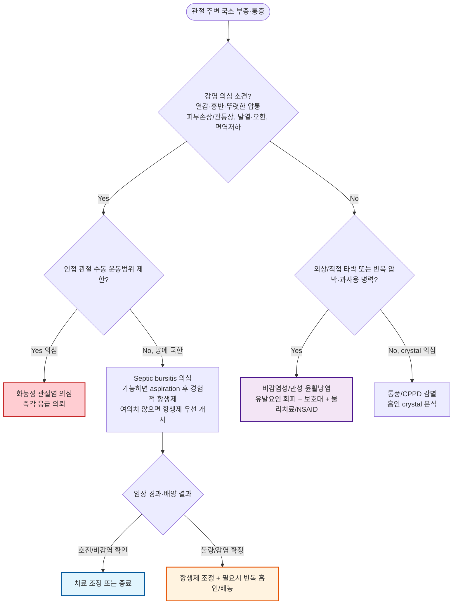

# 윤활낭염 (점액낭염) Bursitis

## <mark style="color:green;">일반 사항</mark>

* 윤활낭(bursa, 점액낭)의 급성 또는 만성 염증
* 윤활낭 : 뼈·건·근육·피부 사이의 마찰을 줄여주는 얇은 윤활액 주머니
* 분류 : 표재성(superficial, 예 - olecranon, prepatellar, subcutaneous calcaneal bursa) vs 심재성(deep, 예 - subacromial, iliopsoas, retrocalcaneal bursa)
  * 표재성 윤활낭 : 피부 바로 아래 위치, 외상·감염에 취약, 부종이 육안으로 두드러짐
  * 심재성 윤활낭 : 관절 주위 깊숙이 위치, 부종이 드러나지 않고 통증·운동 제한이 주된 소견
* 원인에 따른 분류 : 비감염성(과사용/외상/결정성 질환) vs 감염성(septic bursitis) vs 염증성 질환 동반(RA 등)
* 합병증 : 만성화, 반복 재발, 인접 관절·연부조직 감염 파급(봉와직염, 화농성 관절염, 드물게 골수염·패혈증)

***

## <mark style="color:green;">원인</mark>

#### <mark style="color:$primary;">급성 비감염성</mark>

* 손상, 외상, 반복적 미세손상(microtrauma)
* Microcrystalline 질환 : 통풍(gout), CPPD(가성통풍)
* 염증성 질환의 국소 침범 : 류마티스 관절염(RA), 강직성 척추염

#### <mark style="color:$primary;">감염성 (Septic bursitis)</mark>

* 주로 표재성 윤활낭(팔꿈치, 무릎)에서 발생; 대부분 피부 손상(찰과상, 자상, 곤충 물림)을 통한 직접 침투
* 드물게 혈행성 파종(면역저하자, 균혈증 동반 시)
* 원인균 : *Staphylococcus aureus*가 약 80% 이상으로 가장 흔함; 그 외 *Streptococcus* spp.

#### <mark style="color:$primary;">만성</mark>

* 반복적인 사용/압박, 직업·운동 관련 미세손상 누적
* 기저 염증성 질환(RA 등)의 지속

***

## <mark style="color:green;">임상 양상</mark>

* 부종(boggy), 능동 운동 시 통증, 압통, 홍반, 이환부 운동 범위 감소, crepitus
  * 급성에서는 통증이 두드러지고, 만성에서는 통증이 상대적으로 덜함(서서히 진행)
  * 심재성 윤활낭염(어깨, 고관절, retrocalcaneal 등)에서는 부종이 겉으로 잘 드러나지 않음
  * 표재성 윤활낭염(팔꿈치, 슬개골 앞, 피부 바로 아래의 발뒤꿈치 윤활낭)에서는 부종이 크고 상대적으로 통증은 덜함
* Septic bursitis 시사 소견 : 뚜렷한 압통·발적·국소 열감, 피부 손상(찰과상/자상/최근 관통상), 면역저하 등 - **발열은 약 38%에서만 동반되므로 발열이 없다고 감염을 배제할 수 없음**
* 감별의 핵심 단서 - **능동 vs 수동 관절운동범위**
  * 윤활낭염 : 능동 운동은 통증으로 제한되나, **관절 자체의 수동 운동범위는 상대적으로 보존되는 경우가 많음**(단, 심한 통증·주변 봉와직염 동반 시 다소 제한될 수 있음)
  * 화농성 관절염(septic arthritis) : 관절낭 자체의 염증으로 **수동 운동범위도 심하게 제한**되는 경우가 전형적 - 중요한 감별점

***

### <mark style="color:$danger;">🚩 Red Flags!</mark>

<mark style="color:$danger;">**즉각 조치 또는 의뢰**</mark>

* 발열·오한 등 전신 독성 증상을 동반한 급성 윤활낭염 → 패혈성 관절염/전신 감염 의심 → 응급 평가
* 수동 관절운동범위까지 심하게 제한 → 인접 관절강의 화농성 관절염 의심 → 응급 의뢰
* 광범위하게 빠르게 진행하는 발적·수포·피부 괴사 소견 → 괴사성 연부조직 감염 의심 → 즉각 응급 이송

<mark style="color:$warning;">**당일 또는 조기 의뢰**</mark>

* Fluctuant하고 발적·국소 열감·압통이 뚜렷한 급성 표재성 윤활낭염 → septic bursitis 의심, 당일 평가 및 항생제 치료 고려; 가능하면 항생제 투여 전 aspiration하여 Gram stain·배양(여의치 않으면 경험적 항생제 우선 개시)
* 당뇨병, 만성 스테로이드 복용, 이식 후 등 면역저하 환자의 급성 윤활낭염
* 개방창·최근 관통상 부위 인접부의 급성 윤활낭염(감염 경로 의심)

<mark style="color:$info;">**외래 추적 / 추가 평가 계획**</mark> <mark style="color:$info;">- 즉각 위험 낮으나 호전 없으면 의뢰</mark>

* 유발 요인 회피 및 보존적 치료 2\~4주 후에도 호전 없는 만성/재발성 윤활낭염
* 반복 재발로 수술적 절제(bursectomy)를 고려해야 하는 경우 → 정형외과 의뢰
* 기저 RA, 통풍 등 전신 질환이 의심되나 확진되지 않은 경우 → 류마티스내과 협진 고려

***

## <mark style="color:green;">진단</mark>

* 병력 : 최근 직업·운동 종목 변경, 반복 압박 동작, 외상·관통상 병력, 통풍·RA 등 기저 질환 여부
* 진찰 : 부종의 국한 범위, 발적·열감, **능동/수동 운동범위 비교**(☞ 감별의 핵심 단서 참조)
* 영상/실험실 검사 : 대부분 필요하지 않음. 진단이 애매하거나 다른 질환 감별이 필요할 때 고려
  * 초음파 : 낭액 저류 확인, 흡인 시 위치 안내에 유용
  * 단순 방사선(X-ray) : 외상·이물 의심, 만성/재발성 병변에서 석회화·골 이상 확인
  * MRI : 심재성 윤활낭염, 인접 골수염·농양 의심 시
* 국소 needle aspiration : crystal, Gram stain, 배양, WBC 검사; **감염 또는 crystal 질환 의심 시 시행**
  * 흡인은 초음파 유도하에 시행하면 정확도와 안전성이 높아짐
  * ✽비감염성 윤활낭염이 의심되더라도 덮고 있는 피부에 뚜렷한 봉와직염(cellulitis)이 있는 경우, 그 부위를 관통하는 천자는 세균을 낭 내부로 옮길 수 있어 피해야 함
  * ✽낭액 WBC의 감염 진단 cutoff는 관절액(synovial fluid)만큼 표준화되어 있지 않고 증례 간 편차(범위 약 1,000\~165,000/µL)가 큼; 대체로 WBC > 3,000/µL 및 호중구 우세(>50%)가 감염을 지지하는 소견이나, **단일 수치만으로 감염 여부를 확정해서는 안 되며 반드시 임상 소견·Gram stain·배양 결과와 함께 종합 판단**
* 혈액검사 : septic bursitis 의심 시 CBC, CRP/ESR 고려; 중증·면역저하 환자에서는 blood culture 고려
  * ✽정상 WBC·CRP가 초기 감염을 배제하지 않음 - 검사 정상이라도 임상 소견이 뚜렷하면 감염으로 접근

#### Shoulder bursitis, Subacromial bursitis

* 증상 : 어깨 통증(종종 상완으로 방사); 특히 팔을 머리 위로 올릴 때 악화
* 감별 : rotator cuff tear/tendinitis

#### Scapulothoracic bursitis

* 증상 : 견갑골과 늑골 사이의 통증, popping sensation; 팔을 머리 위로 들거나 팔굽혀펴기 시 악화

#### Olecranon bursitis

* 증상 : 팔꿈치의 현저한 부종(골프공 모양), 굴곡 시 통증(신전 시에는 통증 적음; ROM 감소)
* 원인 : 반복적인 압박, 감염, crystal(통풍), RA
* ✽표재성으로 감염 빈도가 가장 높은 부위 중 하나 - 발적·열감 동반 시 septic bursitis 우선 배제

#### Radiohumeral bursitis

* 증상 : 병뚜껑을 열 때, 손목을 돌릴 때, 문 손잡이를 돌릴 때 radiohumeral 관절 부위 통증
* 원인 : 반복적인 상완 회전

#### Ischial bursitis

* 증상 : 앉을 때 바닥에 닿는 엉덩이 부위 통증 악화, 기립 시 완화
* 원인 : 딱딱한 표면에 오래 앉아 있음
* 감별 : 좌골신경과의 해부학적 근접성으로 대퇴 후방 방사통을 동반할 수 있어 요추 신경근병증(L4\~S1)·좌골신경통으로 오인되는 경우가 흔함

#### Greater trochanteric pain syndrome (trochanteric bursitis)

* 증상 : 이환된 쪽으로 누울 때, 다리를 뻗을 때, 서 있을 때 통증
  * 비정상적인 보행(고관절에 가해지는 불규칙한 스트레스)으로 통증 악화
* 원인 : 과도한 운동/달리기, 만성 요통, 반대쪽 무릎 통증, 다리 길이 차이, 과체중
* ✽최근에는 단순 윤활낭 자체의 염증보다 **중둔근(gluteus medius)/소둔근(gluteus minimus)건 병증이 동반된 복합 병태**로 이해되는 추세이며, 이에 따라 병명도 **greater trochanteric pain syndrome**으로 통칭되는 경향
  * 순수 윤활낭염보다 둔근건 병증이 통증의 주된 기여 요인인 경우가 많아, **환자 교육 + 부하 조절(load management) + 둔근 강화 운동을 포함한 exercise-based therapy가 1차 치료**로 우선 고려됨
  * 스테로이드 주사는 단기 증상 완화에는 도움이 될 수 있으나 장기적인 global improvement 측면에서는 운동치료 대비 우월하지 않다는 보고가 있어, 보존치료 실패 시 2차 옵션으로 고려

#### Iliopsoas bursitis

* 증상 : 계단 오를 때 사타구니 부위 통증
* 원인 : 해당 부위 관절염, 과사용(예: 과도한 달리기), 부상
* 감별 : psoas 근육 감염(psoas abscess)
  * ✽발열, 전신 증상, 또는 야간통·안정 시에도 지속되는 통증이 동반되면 단순 과사용성 윤활낭염보다 psoas abscess를 의심하고 **조영증강 CT 또는 MRI**로 감별할 것 - 특히 당뇨, 면역저하, 최근 척추 시술/감염 병력이 있는 경우 역치를 낮춰 영상검사 고려

#### Prepatellar & infrapatellar bursitis

* 증상 : 슬개골 위 또는 아래의 부종/통증; 무릎을 신전하고 누웠을 때 편함
* 원인 : 반복/지속적 무릎 압박·손상; housemaid's knee, nun's knee
* 감별 : 무릎 관절 내 부종(관절염)에서는 무릎을 약간 굴곡하여 누웠을 때 편함 - prepatellar bursitis와 반대

#### Medial collateral ligament bursitis

* 증상 : 무릎 내측 통증; 부종은 뚜렷하지 않음
* 감별 : MCL 또는 meniscus 손상

#### Baker cyst (popliteal cyst)

* 증상 : 무릎 뒤쪽(오금)의 부종/팽만감; 파열 시 하퇴 통증·부종으로 DVT와 유사하게 나타날 수 있음
* 원인 : gastrocnemius-semimembranosus bursa의 팽창; 골관절염, RA, 반월판 손상과 연관
* ✽엄밀히는 무릎 관절과 교통하는 낭종으로 다른 윤활낭염과 병태가 다소 다르나, 무릎 주위 종창의 감별에서 반드시 고려

#### Pes anserinus pain syndrome

* 증상 : 무릎 내측 관절선 아래 약 5\~7 ㎝ 부위의 통증·압통; 서서히 발생하는 경우가 흔하며 계단 오르내리기, 운동, 의자에서 일어날 때 악화(야간통을 동반할 수도 있음)
* 관련/위험 인자 : 무릎 골관절염, 비만, genu valgum

#### Retrocalcaneal bursitis

* 증상 : 발뒤꿈치 후방의 부종/통증
* ✽아킬레스건 앞쪽·종골 사이에 위치한 **심재성(deep)** 윤활낭 - 건 뒤쪽·피부 아래의 subcutaneous calcaneal bursa(표재성)와는 다른 구조임에 주의
* 감별 : 아킬레스건염
* ✽인접한 아킬레스건과의 근접성 때문에 스테로이드 주사 시 건 파열 위험이 높아 특히 주의 필요(☞ 약물 치료 참조)

### <mark style="color:orange;">감별 진단</mark>

* 국소 부종·통증을 유발할 수 있는 질환들의 감별, 특히 응급도가 다른 화농성 관절염과의 구분이 중요

<table><thead><tr><th width="150">질환</th><th width="220">윤활낭염과의 차이점</th><th>핵심 감별 포인트</th></tr></thead><tbody><tr><td>화농성 관절염</td><td>관절강 자체의 감염</td><td>수동 운동범위까지 심하게 제한, 전 관절 부종, 관절액 흡인 필요</td></tr><tr><td>봉와직염(cellulitis)</td><td>피부·피하조직의 미만성 감염</td><td>경계가 불명확한 넓은 발적, 국한된 낭 부종 없음, 파동(fluctuance) 없음</td></tr><tr><td>통풍/CPPD 급성 발작</td><td>관절 또는 인접 조직의 결정 유발 염증</td><td>극심한 통증의 급성 발현, 관절액/낭액에서 crystal 확인</td></tr><tr><td>건염(tendinitis)</td><td>건 자체의 염증</td><td>특정 저항 운동 시 국소 압통, 낭 부종 없이 선상 압통</td></tr></tbody></table>

***



<p align="center"><strong>윤활낭염 진단 및 치료 알고리듬</strong></p>

<p align="center"><em><mark style="color:$info;">Ref. Truong J, Ashurst JV. Septic Bursitis. StatPearls (2024); Baumbach SF et al. Prepatellar and Olecranon Bursitis. Dtsch Arztebl Int (2014)</mark></em></p>

***

## <mark style="background-color:$warning;">Management</mark>

### <mark style="color:orange;">치료 방침</mark>

* 자극/악화 요인 회피
* 통증 및 염증에 대한 대증 치료(경구/경피 NSAID)
* 필요시 bursa aspiration(특히 감염 의심 시), steroid injection(비감염성 표재성에서는 효과 제한적)
* 기저 감염, 기저 질환(RA, 통풍 등) 치료
* 가능한 한 적당한 활동 유지(근 위축 및 관절 구축 예방), 운동 범위 유지
* 경과 : septic bursitis를 제외하면 원인 회피·안정·보호로 대부분 자연 치유됨

***

## <mark style="color:green;">비-약물 치료 및 예방</mark>

* PRICE therapy : protection, rest(부목), ice, compression, elevation
* 윤활낭 보호
  * 통증 유발 활동 회피; 활동 시 warm-up & cool-down, 반복 활동 시 중간 휴식
  * 보호 장비 사용 : 팔꿈치/무릎 보호대, 패드, 쿠션
  * 발뒤꿈치 압력을 줄이기 위한 신발 선택, 충격 흡수 도구 사용(예: 깔창, 패드)
* 물리/운동 치료 : 스트레칭, 근력 강화(특히 greater trochanteric pain syndrome에서 중둔근 강화 운동이 핵심)
* 체중 감량, 자세 교정

***

## <mark style="color:green;">약물 치료</mark>

### <mark style="color:orange;">국소</mark>

* 경피 NSAID가 1차 국소 치료 : ketoprofen <mark style="color:blue;">\[케토톱 플라스타/겔]</mark>, piroxicam <mark style="color:blue;">\[트라스트 패취/겔]</mark>
* ✽capsaicin 크림<mark style="color:blue;">\[다이악센]</mark>은 국내 허가 효능이 당뇨병성 신경증·대상포진 후 신경통·RA/골관절염 수반 통증이며 윤활낭염은 명시된 적응증이 아니므로 1차로 권하지 않음

### <mark style="color:orange;">전신</mark>

* ibuprofen 400\~800 ㎎ tid\~qid <mark style="color:blue;">\[부루펜]</mark>
* naproxen 500 ㎎ bid <mark style="color:blue;">\[낙센]</mark>
* ✽NSAID 금기/신중 투여(신기능 저하, 소화성 궤양 병력, 항응고제 병용, 심혈관 질환) 시 acetaminophen으로 대체 고려

### <mark style="color:orange;">국소 주사</mark>

* lidocaine
* steroid : 감염 배제 후 고려; triamcinolone 40 ㎎/㎖ 0.5\~1.0 ㎖ <mark style="color:blue;">\[트리암시놀론 주]</mark>
  * 표재성 윤활낭염(팔꿈치, 슬개골 앞)에 대한 steroid 주사는 단기 증상 완화에는 도움이 될 수 있으나, 장기 효과는 불확실하고 부작용(감염, 피부 위축) 우려가 있어 1차로는 일반적으로 권하지 않음
  * retrocalcaneal bursitis 등 건에 인접한 부위는 건 파열 위험이 있어 특히 신중; 건 내 주입 회피

### <mark style="color:orange;">항생제</mark>

* septic bursitis에 적용; 경험적 항생제는 *S. aureus*(약 80\~85%)뿐 아니라 *Streptococcus* spp.까지 함께 표적
* 외래 경증\~중등도, 전신 증상 없는 일반적인 경우 : cephalexin 500 ㎎ qid
* Cephalosporin 사용이 곤란한 중증 즉시형 β-lactam 과민반응 병력 : clindamycin(지역 내 감수성 및 inducible resistance 고려하여 선택)
* MRSA 위험이 높은 경우(과거 MRSA 병력, 집단생활시설, 최근 입원 등) : TMP-SMX 또는 doxycycline 고려
  * ✽TMP-SMX·doxycycline은 streptococcal coverage가 상대적으로 약하므로 필요시 streptococcus를 표적하는 약제와 병용 여부를 고려; 중증/입원 환자에서 MRSA 가능성이 높으면 vancomycin 등 IV 옵션 고려. 지역 내 내성률과 배양 결과에 따라 조정
* 외래 uncomplicated 사례에서 실용적으로 10\~14일이 흔히 쓰이나, 근거가 강한 고정 기간은 아니며 **임상 반응·배양 결과·면역상태·배농 여부를 반드시 함께 고려하여 개별화**
* 전신 발열, 면역저하, 반응 불량 시 : 입원 및 IV 항생제, 정형외과/감염내과 협진 의뢰; 반응 불량 시 재흡인 또는 수술적 배농 고려

***

### <mark style="color:red;">질병코드</mark>

M06.2 류마티스윤활낭염

M70.2 팔꿈치의 윤활낭염(olecranon bursitis)

M70.4 무릎 앞쪽 윤활낭염(prepatellar bursitis)

M70.6 대전자부 윤활낭염(trochanteric bursitis)

M71.1 기타 감염성 윤활낭병증(septic bursitis 등)

M71.5 기타 명시된 윤활낭병증

M71.9 상세불명의 윤활낭병증

***

## <mark style="color:purple;">처방례</mark>

> **처방례 1.** 경증 비감염성 윤활낭염
>
> ```
> 트라스트 패취 1매  1일 1회 부착
> ```
>
> _✽경피 NSAID 단독 사용; 경증에서는 국소 치료만으로 충분한 경우가 많음. PRICE와 병행; 2\~4주 내 호전 없으면 재평가_

> **처방례 2.** 중등도 이상 비감염성 윤활낭염
>
> ```
> 맥시부펜 이알 300 ㎎/T (dexibuprofen 300 ㎎/T)  2T  bid (12시간 간격, 1일 최대 4T)
> ```
>
> _✽경구 NSAID 단독 사용; 경피 NSAID와의 정규 병용은 권장하지 않음(추가 효과 근거 부족, GI·신장 부작용 증가 가능성). 만성 반복 압박이 원인인 경우 보호대·자세 교정 등 유발 요인 관리가 약물보다 우선_

> **처방례 3.** Septic bursitis(외래 경증\~중등도, 전신 증상 없음)
>
> ```
> 세파렉신 500 ㎎/Cap  1Cap  qid  #10~14일
> ```
>
> _✽경험적으로 S. aureus를 표적; 흡인 배양·항생제 감수성 결과에 따라 조정. 48\~72시간 내 호전 없거나 전신 증상 발생 시 즉시 재평가/의뢰_

> **처방례 4.** Greater trochanteric pain syndrome, 운동치료 실패
>
> ```
> 트리암시놀론 주 40 ㎎/㎖  0.5~1.0 ㎖  국소 주사(1회)
> ```
>
> _✽감염 배제 후 시행; 임상/초음파 소견상 통증의 주된 발생 구조(peritrochanteric 건 부위 또는 bursa)에 따라 주입 위치를 결정 - trochanteric bursa에 반드시 주입해야 하는 것은 아님. 표재성 부위(팔꿈치·슬개골 앞)에는 권장하지 않음. 반복 주사는 피하며 둔근 강화 운동 병행_

***

### <mark style="color:$success;">핵심 복약 지도</mark>

> **NSAID 사용 원칙**
>
> * 통증·부종이 심할 때 규칙적으로 복용하고, 호전되면 필요시로 감량
> * 위장관 부작용 예방을 위해 식후 복용 권장; 장기 복용 시 위장관·신장 기능 모니터링
> * 항응고제 병용은 피할 것; 경피 NSAID와 경구 NSAID를 정규 병용하지 말고 한 가지 제형을 우선 사용

> **국소(관절 내/낭 내) 스테로이드 주사**
>
> * 감염이 배제된 경우에만 시행
> * 표재성 윤활낭(팔꿈치, 슬개골 앞)에서는 효과가 제한적이고 피부 위축·감염 위험이 있어 일반적으로 권하지 않음
> * 건 주변부(예: 발뒤꿈치)에서는 건 파열 위험으로 건 내 직접 주입을 피함

> **항생제 복용**
>
> * Septic bursitis로 항생제 처방 시 증상이 호전되어도 처방된 기간(대개 10\~14일)을 채워 복용
> * 48\~72시간 내 발적·부종·통증이 악화되거나 발열이 동반되면 즉시 재내원

> **언제 다시 병원을 방문해야 하나요?**
>
> * 발열, 오한 등 전신 증상이 새로 생기거나 악화되는 경우 - 즉시 내원
> * 관절을 수동으로 움직여도 심하게 아프거나 움직이기 어려운 경우 - 즉시 내원
> * 발적·부종이 빠르게 넓게 퍼지는 경우 - 즉시 내원
> * 보존적 치료 2\~4주 이내에 호전이 없는 경우

***

### <mark style="color:blue;">환자 안내서</mark>


**윤활낭염, 관절 주변의 '쿠션'에 생긴 염증입니다**

윤활낭은 뼈와 피부, 근육 사이의 마찰을 줄여주는 작은 물주머니입니다. 반복적인 압박이나 손상, 드물게는 감염으로 이 주머니에 염증이 생기면 붓고 아플 수 있습니다. 대부분은 자극 요인을 피하고 보호하면 자연히 좋아집니다.


#### <mark style="color:$primary;">왜 생기나요?</mark>

* 팔꿈치를 책상에 오래 괴거나, 무릎을 꿇고 오래 일하는 등 **한 부위를 반복해서 누르거나 문지르는 동작**이 가장 흔한 원인입니다.
* 넘어지거나 부딪히는 등의 **외상**도 원인이 될 수 있습니다.
* 드물게 상처를 통해 세균이 들어가 **감염**을 일으키기도 합니다(발적·열감·발열이 동반되면 이 경우를 의심합니다).

#### <mark style="color:$primary;">집에서 어떻게 관리하나요?</mark>

* **해당 부위를 쉬게 하십시오.** 통증을 유발하는 동작이나 압박을 최대한 피합니다.
* **얼음찜질을 하십시오.** 급성기에는 하루 여러 차례, 한 번에 15\~20분씩 얼음찜질이 도움이 됩니다.
* **보호대나 패드를 사용하십시오.** 팔꿈치·무릎 보호대, 쿠션 등으로 압박을 줄입니다.
* **체중이 많이 나가는 경우 체중 조절**이 고관절·무릎 윤활낭염 예방에 도움이 됩니다.
* **고관절 옆쪽이 아픈 경우(대전자 윤활낭염) 엉덩이 근육 강화 운동이 약이나 주사보다 더 근본적인 치료**입니다. 담당 의료진과 상의하여 운동법을 안내받으시길 권합니다.

#### <mark style="color:$primary;">약은 어떻게 써야 하나요?</mark>

* 처방받은 소염진통제는 통증·부종이 있는 동안 규칙적으로 복용하고, 좋아지면 줄여 갑니다.
* 감염이 의심되어 항생제를 처방받은 경우, **증상이 좋아져도 처방된 기간을 반드시 다 채워** 복용하십시오.
* 항생제 복용 후 **48\~72시간이 지나도 증상이 좋아지지 않거나 오히려 악화되면 반드시 다시 병원에 방문**하십시오.

#### <mark style="color:$primary;">이럴 때는 즉시 병원을 방문하세요</mark>

* 열이 나거나 오한이 있는 경우
* 붓고 빨개진 부위가 빠르게 넓어지는 경우
* 관절을 움직이기가 너무 힘들거나 남이 움직여줘도 심하게 아픈 경우
* 2\~4주간 관리해도 증상이 좋아지지 않는 경우
