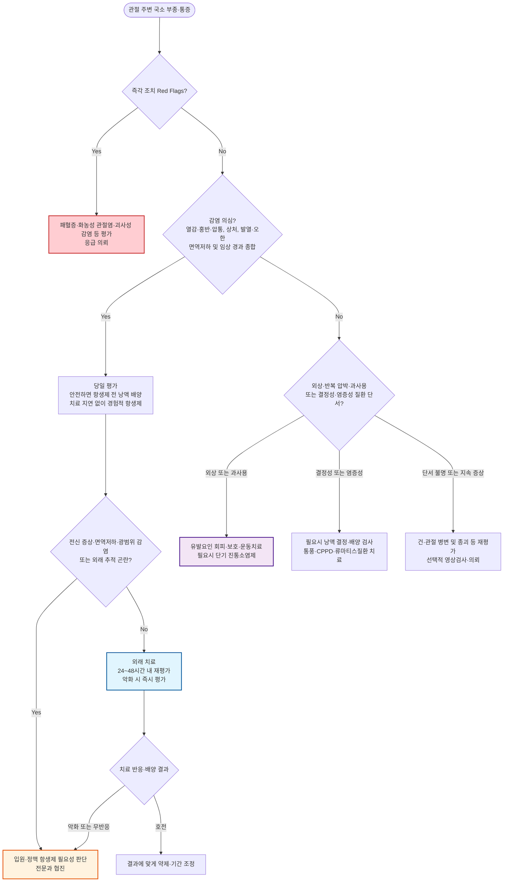

# 윤활낭염 (점액낭염) Bursitis

## <mark style="color:green;">일반 사항</mark>

* 윤활낭(bursa, 점액낭)의 급성 또는 만성 염증
* 윤활낭 : 뼈·건·근육·피부 사이의 마찰을 줄여주는 얇은 윤활액 주머니
* 분류 : 표재성(superficial, 예 - olecranon, prepatellar, subcutaneous calcaneal bursa) vs 심재성(deep, 예 - subacromial, iliopsoas, retrocalcaneal bursa)
  * 표재성 윤활낭 : 피부 바로 아래 위치, 외상·감염에 취약, 부종이 육안으로 두드러짐
  * 심재성 윤활낭 : 관절 주위 깊숙이 위치, 부종이 드러나지 않고 통증·운동 제한이 주된 소견
* 원인에 따른 분류 : 비감염성(과사용/외상/결정성 질환) vs 감염성(septic bursitis) vs 염증성 질환 동반(RA 등)
* 합병증 : 만성화, 반복 재발, 인접 관절·연부조직 감염 파급(봉와직염, 화농성 관절염, 드물게 골수염·패혈증)

***

## <mark style="color:green;">원인</mark>

#### <mark style="color:$primary;">급성 비감염성</mark>

* 손상, 외상, 반복적 미세손상(microtrauma)
* Microcrystalline 질환 : 통풍(gout), CPPD(가성통풍)
* 염증성 질환의 국소 침범 : 류마티스 관절염(RA), 강직성 척추염

#### <mark style="color:$primary;">감염성 (Septic bursitis)</mark>

* 주로 표재성 윤활낭(팔꿈치, 무릎)에서 발생; 대부분 피부 손상(찰과상, 자상, 곤충 물림)을 통한 직접 침투
* 드물게 혈행성 파종(면역저하자, 균혈증 동반 시)
* 원인균 : *Staphylococcus aureus*가 약 80% 이상으로 가장 흔함; 그 외 *Streptococcus* spp.

#### <mark style="color:$primary;">만성</mark>

* 반복적인 사용/압박, 직업·운동 관련 미세손상 누적
* 기저 염증성 질환(RA 등)의 지속

***

## <mark style="color:green;">임상 양상</mark>

* 국소 부종(boggy swelling), 압통, 활동·직접 압박 시 통증; 염증이 뚜렷하면 홍반·열감·운동 제한을 동반할 수 있음
  * 급성에서는 통증이 두드러지고, 만성에서는 통증이 상대적으로 덜함(서서히 진행)
  * 심재성 윤활낭염(어깨, 고관절, retrocalcaneal 등)에서는 부종이 겉으로 잘 드러나지 않음
  * 만성 미세손상성 표재성 윤활낭염(팔꿈치, 슬개골 앞 등)에서는 종창에 비해 통증이 적을 수 있으나, 감염성·결정성·급성 외상성 병변에서는 심한 통증도 가능함
* Septic bursitis 시사 소견 : 뚜렷한 압통·발적·국소 열감, 피부 손상(찰과상/자상/최근 관통상), 면역저하 등 - **발열 동반 비율은 연구·대상군에 따라 다르며, 발열이 없다고 감염을 배제할 수 없음**
* 감별의 핵심 단서 - **능동 vs 수동 관절운동범위**
  * 윤활낭염 : 능동 운동은 통증으로 제한되나, **관절 자체의 수동 운동범위는 상대적으로 보존되는 경우가 많음**(단, 심한 통증·주변 봉와직염 동반 시 다소 제한될 수 있음; 수동 운동범위가 보존되어도 관절 감염을 단독으로 배제할 수 없음)
  * 화농성 관절염(septic arthritis) : 관절낭 자체의 염증으로 **수동 운동범위도 심하게 제한**되는 경우가 전형적 - 중요한 감별점

***

### <mark style="color:$danger;">🚩 Red Flags!</mark>

<mark style="color:$danger;">**즉각 조치 또는 의뢰**</mark>

* 급성 윤활낭염에 저혈압·의식 변화·호흡곤란 등 전신 상태 악화가 동반 → 패혈증/중증 전신 감염 의심 → 응급 평가
* 수동 관절운동범위까지 심하게 제한 → 인접 관절강의 화농성 관절염 의심 → 응급 의뢰
* 빠르게 진행하는 발적·종창에 외관에 비해 심한 통증, 수포·피부 괴사 또는 피부 아래 염발음 동반 → 괴사성 연부조직 감염 의심 → 즉각 응급 이송

<mark style="color:$warning;">**당일~수일 내 평가 (당일)**</mark>

* 발적·국소 열감·압통이 뚜렷한 급성 표재성 윤활낭염(파동감이 뚜렷하지 않아도 감염 가능) → septic bursitis 의심, 당일 평가 및 항생제 치료; 가능하면 항생제 투여 전 안전한 경로로 낭액을 흡인하여 Gram stain·배양(흡인이 지연되거나 안전하지 않으면 치료를 지연하지 않고 경험적 항생제 개시)
* 발열·오한을 동반한 급성 윤활낭염(전신 상태가 안정적이어도 당일 평가; 입원·정맥 항생제 필요성 판단)
* 당뇨병, 만성 스테로이드 복용, 이식 후 등 감염 위험이 높은 환자의 급성 윤활낭염; 특히 면역저하자에서 감염이 의심되면 입원·정맥 항생제 치료를 적극 고려
* 개방창·최근 관통상 부위 인접부의 급성 윤활낭염(감염 경로 의심)
* 갑자기 발생한 한쪽 하퇴 통증·부종 → Baker 낭종 파열과 심부정맥혈전증(DVT) 감별을 위한 당일 평가; 호흡곤란·흉통·실신 동반 시 응급 평가

<mark style="color:$info;">**외래 추적 / 추가 평가 계획**</mark> <mark style="color:$info;">- 즉각 위험 낮으나 호전 없으면 의뢰</mark>

* 유발 요인 회피 및 보존적 치료 2\~4주 후에도 호전 없는 만성/재발성 윤활낭염
* 반복 재발로 수술적 절제(bursectomy)를 고려해야 하는 경우 → 정형외과 의뢰
* 기저 RA, 통풍 등 전신 질환이 의심되나 확진되지 않은 경우 → 류마티스내과 협진 고려

***

## <mark style="color:green;">진단</mark>

* 병력 : 최근 직업·운동 종목 변경, 반복 압박 동작, 외상·관통상 병력, 통풍·RA 등 기저 질환 여부
* 진찰 : 부종의 국한 범위, 발적·열감, **능동/수동 운동범위 비교**(☞ 감별의 핵심 단서 참조)
* 영상/실험실 검사 : 전형적인 경증 비감염성 병변은 대개 임상 진단함. 감염·결정성 질환이 의심되거나 진단이 애매하고 다른 질환 감별이 필요하면 검사함
  * 초음파 : 낭액 저류·벽 비후 확인, 봉와직염·관절 삼출·건 병변과의 감별, 흡인 시 위치 안내에 유용; 초음파 소견만으로 감염 여부를 확정하지 않음
  * 단순 방사선(X-ray) : 외상·이물 의심, 만성/재발성 병변에서 석회화·골 이상 확인
  * MRI : 심재성 병변에서 진단이 불명확하거나 보존치료에 반응하지 않는 경우, 인접 골수염·농양 의심 시 선택적으로 고려; 심재성이라는 이유만으로 일률적으로 시행하지 않음
* 국소 needle aspiration : **감염 또는 결정성 질환이 의심되면 진단 목적의 흡인을 우선 고려**; 가능하면 항생제 투여 전 무균적으로 시행하고 낭액의 WBC·분획, crystal, Gram stain·배양 검사함. 비감염성·비염증성 만성 표재성 종창에서 일률적인 흡인은 의인성 감염 위험 때문에 피함
  * 흡인은 초음파 유도하에 시행하면 정확도와 안전성이 높아짐
  * ✽비감염성 윤활낭염이 의심되더라도 덮고 있는 피부에 봉와직염(cellulitis)이 있는 경우 그 부위를 관통하는 천자는 가급적 피하고, 가능하면 감염되지 않은 피부를 통한 경로를 선택; 안전한 흡인 경로가 없더라도 감염 치료를 지연하지 않음
  * ✽낭액 WBC는 감염성·비감염성 병변 간 중복이 커서 보편적으로 확정된 cutoff가 없음. 작은 비교연구에서 >2,000/µL가 감염을 지지했으나, 낮은 수치도 감염을 배제하지 못함. **임상 소견·호중구 비율·Gram stain·배양을 종합 판단**하며, Gram stain 음성 또는 결정 양성만으로 동반 감염을 배제하지 않음 [1]
  * ✽전신 상태가 안정적이고 면역기능이 보존되며 조기 재진이 확실한 일부 표재성 감염 의심 환자에서는 흡인 없이 경험적 항생제로 치료한 관찰연구가 있음. 모든 환자에 일반화하지 않으며, 진단 불확실·면역저하·중증·재발·치료 실패 시 낭액 배양과 전문 평가의 필요성이 커짐 [2]
  * ✽외상 후 출혈성 낭액 저류가 크고 일상생활을 방해하면 골절 등을 배제한 뒤 감압 목적의 흡인을 선택적으로 고려함
* 혈액검사 : septic bursitis 의심 시 CBC, CRP/ESR 고려; 중증·면역저하 환자에서는 blood culture 고려
  * ✽정상 WBC·CRP가 초기 감염을 배제하지 않음 - 검사 정상이라도 임상 소견이 뚜렷하면 감염으로 접근

#### Shoulder bursitis, Subacromial bursitis

* 증상 : 어깨 통증(종종 상완으로 방사); 특히 팔을 머리 위로 올릴 때 악화
* 감별 : 회전근개 건병증·파열, 유착성 관절낭염, 석회성 건병증
* ✽견봉하 윤활낭염은 회전근개 병변과 동반되는 경우가 많으므로 초음파상 낭액 저류만으로 통증의 원인을 단정하지 않음; 점진적 운동·재활치료를 기본으로 함

#### Scapulothoracic bursitis

* 증상 : 견갑골과 늑골 사이의 통증, popping sensation; 팔을 머리 위로 들거나 팔굽혀펴기 시 악화

#### Olecranon bursitis

* 증상 : 팔꿈치의 현저한 국소 부종(골프공 모양); 관절 운동범위는 대개 보존되나 종창이 크거나 통증이 심하면 굴곡 시 불편할 수 있음
* 원인 : 반복적인 압박, 감염, crystal(통풍), RA
* ✽표재성으로 감염 빈도가 가장 높은 부위 중 하나 - 발적·열감 동반 시 septic bursitis 우선 배제

#### Bicipitoradial bursitis (상완이두근-요골 윤활낭염)

* 위치 : 원위 상완이두근건과 요골 조면 사이
* 증상 : 팔꿈치 앞쪽의 통증·종창, 전완 회내·회외 시 악화; 드물게 인접 요골신경 압박 증상 동반
* 감별 : 원위 상완이두근건 병변, 외측상과 건병증, 요골신경 포착; 병뚜껑·문손잡이를 돌릴 때의 통증만으로 윤활낭염을 진단하지 않음
* 초음파 또는 MRI로 낭의 위치와 건·신경 병변을 구분함 [3]

#### Ischial bursitis

* 증상 : 앉을 때 바닥에 닿는 엉덩이 부위 통증 악화, 기립 시 완화
* 원인 : 딱딱한 표면에 오래 앉아 있음
* 감별 : 좌골신경과의 해부학적 근접성으로 대퇴 후방 방사통을 동반할 수 있어 요추 신경근병증·근위 햄스트링 건병증과 감별이 필요함

#### Greater trochanteric pain syndrome (GTPS, 대전자 통증증후군)

* 증상 : 고관절 외측·대전자 부위 압통; 이환된 쪽으로 누울 때, 계단 오르내리기, 한쪽 다리로 지지하기, 의자에서 일어나기 등에 통증
  * 비정상적인 보행(고관절에 가해지는 불규칙한 스트레스)으로 통증 악화
* 관련/위험 요인 : 운동·달리기의 부하 증가, 만성 요통, 무릎 통증·보행 변화, 다리 길이 차이, 과체중
* ✽GTPS는 **중둔근(gluteus medius)/소둔근(gluteus minimus) 건병증·파열, 대전자 주위 윤활낭 병변 등을 포함하는 임상 증후군**으로, 대전자 윤활낭염과 동의어가 아님
  * 순수 윤활낭염보다 둔근건 병증이 통증의 주된 기여 요인인 경우가 많아, **환자 교육 + 부하 조절(load management) + 둔근 강화 운동을 포함한 exercise-based therapy가 1차 치료**로 우선 고려됨
  * 둔근 건병증 무작위시험에서는 교육·운동치료가 스테로이드 주사보다 8주 통증·전반적 호전 및 52주 전반적 호전에서 우수했으며, 52주 통증은 차이가 없었음. 주사는 지속 통증으로 재활이 어려운 경우 등에서 선택적으로 고려함 [4]
  * 다리 꼬기, 아픈 쪽으로 눕기 등 둔근건을 압박하는 자세를 줄이고 통증을 악화시키는 강한 내전 스트레칭은 피함; 뚜렷한 외전근 약화·Trendelenburg 보행 또는 지속 통증 시 둔근건 파열 등을 추가 평가함

#### Iliopsoas bursitis

* 증상 : 계단 오를 때 사타구니 부위 통증
* 원인 : 해당 부위 관절염, 과사용(예: 과도한 달리기), 부상
* 감별 : psoas 근육 감염(psoas abscess)
  * ✽발열, 전신 증상, 또는 야간통·안정 시에도 지속되는 통증이 동반되면 장요근 농양·심재성 감염·고관절 감염 등 감별 범위를 넓히고 **조영증강 CT 또는 MRI**를 고려함 - 특히 당뇨, 면역저하, 최근 척추 시술/감염 병력이 있는 경우 역치를 낮춰 영상검사 고려

#### Prepatellar & infrapatellar bursitis

* 증상 : 슬개골 앞 또는 아래의 국소 부종·통증; 무릎 꿇기나 직접 압박 시 악화
* 원인 : 반복/지속적 무릎 압박·손상; housemaid's knee, nun's knee
* 감별 : 관절 내 삼출·관절염은 부종의 위치, 수동 운동 시 통증·제한, 관절 삼출 소견으로 감별; 편한 무릎 자세만으로 구분하지 않음

#### Medial collateral ligament bursitis

* 증상 : 무릎 내측 통증; 부종은 뚜렷하지 않음
* 감별 : MCL 또는 meniscus 손상

#### Baker cyst (popliteal cyst)

* 증상 : 무릎 뒤쪽(오금)의 부종/팽만감; 파열 시 하퇴 통증·부종으로 DVT와 유사하게 나타날 수 있음
* 원인 : gastrocnemius-semimembranosus bursa의 팽창; 골관절염, RA, 반월판 손상과 연관
* ✽성인에서는 무릎 관절과 교통하는 낭종인 경우가 많으며 다른 윤활낭염과 병태가 다름; 파열 의심 시에도 DVT를 임상 소견만으로 배제하지 않고 정맥 초음파 등으로 평가함

#### Pes anserinus pain syndrome

* 증상 : 무릎 내측 관절선 아래 약 5\~7 ㎝ 부위의 통증·압통; 서서히 발생하는 경우가 흔하며 계단 오르내리기, 운동, 의자에서 일어날 때 악화(야간통을 동반할 수도 있음)
* 관련/위험 인자 : 무릎 골관절염, 비만, genu valgum

#### Retrocalcaneal bursitis

* 증상 : 발뒤꿈치 후방의 부종/통증
* ✽아킬레스건 앞쪽·종골 사이에 위치한 **심재성(deep)** 윤활낭 - 건 뒤쪽·피부 아래의 subcutaneous calcaneal bursa(표재성)와는 다른 구조임에 주의
* 감별 : 아킬레스건염
* ✽인접한 아킬레스건과의 근접성 때문에 스테로이드 주사 시 건 파열 위험이 높아 특히 주의 필요(☞ 약물 치료 참조)

### <mark style="color:orange;">감별 진단</mark>

* 국소 부종·통증을 유발할 수 있는 질환들의 감별, 특히 응급도가 다른 화농성 관절염과의 구분이 중요

<table><thead><tr><th width="150">질환</th><th width="220">윤활낭염과의 차이점</th><th>핵심 감별 포인트</th></tr></thead><tbody><tr><td>화농성 관절염</td><td>관절강 자체의 감염</td><td>수동 운동범위까지 심하게 제한, 전 관절 부종, 관절액 흡인 필요</td></tr><tr><td>봉와직염(cellulitis)</td><td>피부·피하조직의 미만성 감염</td><td>미만성 발적·피하 부종; 뚜렷한 낭액 저류 없이 나타날 수 있으나 윤활낭염과 동반 가능, 필요시 초음파로 구분</td></tr><tr><td>통풍/CPPD 급성 발작</td><td>관절 또는 인접 조직의 결정 유발 염증</td><td>급성 통증과 종창; 관절액/낭액의 결정 검사로 확인하되 결정 양성만으로 감염 배제 불가</td></tr><tr><td>건병증(tendinopathy)</td><td>건의 과부하·퇴행성 변화 등을 포함하는 병변</td><td>특정 저항 운동 시 국소 압통, 낭 부종 없이 선상 압통</td></tr></tbody></table>

***


```mermaid
graph TD
    A(["관절 주변 국소 부종·통증"]) ---> R{"즉각 조치 Red Flags?"}
    R --->|Yes| D["패혈증·화농성 관절염·괴사성 감염 등 평가\n응급 의뢰"]
    R --->|No| B{"감염 의심?\n열감·홍반·압통, 상처, 발열·오한\n면역저하 및 임상 경과 종합"}
    B --->|Yes| E["당일 평가\n안전하면 항생제 전 낭액 배양\n치료 지연 없이 경험적 항생제"]
    E ---> F{"전신 증상·면역저하·광범위 감염\n또는 외래 추적 곤란?"}
    F --->|Yes| G["입원·정맥 항생제 필요성 판단\n전문과 협진"]
    F --->|No| H["외래 치료\n24~48시간 내 재평가\n악화 시 즉시 평가"]
    H ---> K{"치료 반응·배양 결과"}
    K --->|호전| L["결과에 맞게 약제·기간 조정"]
    K --->|악화 또는 무반응| G
    B --->|No| I{"외상·반복 압박·과사용\n또는 결정성·염증성 질환 단서?"}
    I --->|외상 또는 과사용| J["유발요인 회피·보호·운동치료\n필요시 단기 진통소염제"]
    I --->|결정성 또는 염증성| M["필요시 낭액 결정·배양 검사\n통풍·CPPD·류마티스질환 치료"]
    I --->|단서 불명 또는 지속 증상| N["건·관절 병변 및 종괴 등 재평가\n선택적 영상검사·의뢰"]
    style D fill:#ffcdd2,stroke:#c62828,stroke-width:2px
    style G fill:#fff3e0,stroke:#e65100,stroke-width:2px
    style H fill:#e1f5fe,stroke:#01579b,stroke-width:2px
    style J fill:#f3e5f5,stroke:#4a148c,stroke-width:2px
```

<p align="center"><strong>윤활낭염 진단 및 치료 알고리듬</strong></p>

<p align="center"><em><mark style="color:$info;">저자 재구성(참고 문헌: Baumbach SF et al. Arch Orthop Trauma Surg. 2014;134:359–370; Beyde A et al. Acad Emerg Med. 2022;29:6–14)</mark></em></p>

***

## <mark style="background-color:$warning;">Management</mark>

### <mark style="color:orange;">치료 방침</mark>

* 자극/악화 요인 회피
* 통증 및 염증에 대한 대증 치료(경구/경피 NSAID)
* 필요시 bursa aspiration(특히 감염 의심 시); 스테로이드 주사는 감염 배제 후 선택적으로 고려(비감염성 표재성 윤활낭염에는 통상 권장하지 않음)
* 기저 감염, 기저 질환(RA, 통풍 등) 치료
* 가능한 한 적당한 활동 유지(근 위축 및 관절 구축 예방), 운동 범위 유지
* 경과 : 미세손상성·급성 외상성 비감염성 병변은 보존치료로 호전되는 경우가 많음; 결정성·류마티스질환 관련 병변은 기저 질환 치료가 필요하며, 만성 병변·GTPS는 회복에 수주~수개월이 걸릴 수 있음

***

## <mark style="color:green;">비-약물 치료 및 예방</mark>

* PRICE를 활용한 단기 증상 조절 : protection, relative rest, ice, compression, elevation
  * 장기간 고정보다 통증 유발 활동을 줄이는 상대적 안정이 원칙; 부목은 통증이 심할 때 짧게 선택적으로 사용하고 통증 허용 범위에서 관절 운동 유지함
  * 얼음은 수건을 대고 한 번에 15\~20분 적용; 압박은 표재성 종창에 필요시 사용하되 지나치게 조이지 않음
* 윤활낭 보호
  * 통증 유발 활동 회피; 활동 시 warm-up & cool-down, 반복 활동 시 중간 휴식
  * 보호 장비 사용 : 팔꿈치/무릎 보호대, 패드, 쿠션
  * 발뒤꿈치 압력을 줄이기 위한 신발 선택, 충격 흡수 도구 사용(예: 깔창, 패드)
* 물리/운동 치료 : 병변별로 통증 허용 범위에서 점진적 근력 강화·관절 운동; 특히 GTPS에서는 부하 조절과 둔근 강화 운동이 핵심이며 통증을 유발하는 스트레칭을 일률적으로 시행하지 않음
* 체중 감량, 자세 교정

***

## <mark style="color:green;">약물 치료</mark>

### <mark style="color:orange;">국소</mark>

* 경증 비감염성 표재성 병변에서는 국소 NSAID를 우선 고려할 수 있음; 심재성 병변의 통증 조절 효과는 제한될 수 있음 : ketoprofen <mark style="color:blue;">\[케토톱 플라스타/겔]</mark>, piroxicam <mark style="color:blue;">\[트라스트 패취/겔]</mark>
  * 상처·피부감염·습진 부위에 사용하지 않으며, 발진·접촉피부염 발생 시 중단함
  * ketoprofen : 사용 중 및 중단 후 2주 동안 도포·부착 부위를 옷 등으로 가려 햇빛·자외선 노출을 피함(광과민/광알레르기 위험) [5]
  * 트라스트 패취 : 기본 용법은 2일마다 1매; 목욕·샤워 후 또는 땀이 날 경우 1일 1매 사용 가능. 14세 이하·임신 3기·수유부에 사용하지 않음 [6]
* ✽capsaicin 크림<mark style="color:blue;">\[다이악센]</mark>은 국내 허가 효능이 당뇨병성 신경증·대상포진 후 신경통·RA/골관절염 수반 통증이며 윤활낭염은 명시된 적응증이 아니므로 1차로 권하지 않음

### <mark style="color:orange;">전신</mark>

* ibuprofen 400 ㎎ tid(필요시 증량; 성인 최대 3,200 ㎎/일, 최소 유효 용량을 단기간 사용) <mark style="color:blue;">\[부루펜]</mark>
* naproxen 250\~500 ㎎ bid(증상·위험도에 따라 최소 유효 용량을 단기간 사용) <mark style="color:blue;">\[낙센]</mark>
* ✽NSAID 금기/신중 투여(신기능 저하·탈수, 소화성 궤양/출혈 병력, 항응고제 병용, 심혈관 질환·심부전) 시 acetaminophen으로 진통 대체 고려; 항염 효과는 기대하기 어려움
* ✽고위험 환자는 경구 NSAID 회피 여부·위장 보호 필요성을 판단하고, 필요시 혈압·신기능·K를 확인함; 서로 다른 경구 NSAID 또는 경구·국소 NSAID의 정규 병용을 피함

### <mark style="color:orange;">윤활낭 및 주위 조직 주사</mark>

* lidocaine : 시술 시 국소 마취 목적으로 필요에 따라 사용; 약제 농도·총량·알레르기 병력 확인
* steroid : 감염 배제 후 선택적으로 고려; triamcinolone acetonide 40 ㎎/㎖ <mark style="color:blue;">\[트리암시놀론주사40㎎ 등]</mark>
  * 국내 관절강내·점액낭내·건초내 허가 용량은 1회 2\~40 ㎎이며 부위·병태에 따라 조절함. 모든 낭에 20\~40 ㎎을 일률 적용하지 않음 [7]
  * 견봉하-삼각근하 윤활낭 주사는 triamcinolone 20 ㎎으로도 40 ㎎과 비슷한 효과가 보고됨; 대전자 주위 주사는 20\~40 ㎎(0.5\~1.0 ㎖)이 사용되는 임상 예시임 [8]
  * 표재성 윤활낭염(팔꿈치, 슬개골 앞)에 대한 steroid 주사는 단기 증상 완화에는 도움이 될 수 있으나, 장기 효과는 불확실하고 부작용(감염, 피부 위축) 우려가 있어 1차로는 일반적으로 권하지 않음
  * 건에 인접한 부위는 건 손상·파열 위험을 고려하고 건 내 주입을 피함. 특히 아킬레스건 주변/retrocalcaneal bursa 주사는 일차진료에서 통상 피하고 전문 평가 후 예외적으로 고려함
  * 주사 부위 피부감염·전신 감염이 있으면 시행하지 않음; 무균술을 준수하고 필요시 초음파로 표적·건·혈관·신경 위치 확인함
  * 일시적 혈당 상승, 피부·지방 위축 및 탈색, 감염 위험 설명; 당뇨병 환자는 주사 후 수일간 혈당을 더 자주 확인함. 효과가 없으면 진단을 재평가하고 정기적인 반복 주사를 피함 [8]

### <mark style="color:orange;">항생제</mark>

* septic bursitis에 적용; 경험적 항생제는 *S. aureus*(약 80\~85%)뿐 아니라 *Streptococcus* spp.까지 함께 표적
* 외래 치료 대상 : 경증\~중등도 표재성 병변, 전신 상태 안정, 면역기능 보존 및 조기 재평가 가능
* 일반적인 성인 경험적 경구 치료 예시 : cephalexin 500 ㎎ qid; 신기능에 따라 용량·간격 조절. MRSA는 치료하지 못하므로 위험인자와 배양 결과 확인
  * ✽팔렉신의 국내 허가 적응증에는 연조직염·창상감염 등이 포함되나 감염성 윤활낭염이 별도 명시되어 있지는 않음. 위 처방은 감염성 윤활낭염에 대한 임상 치료 예시이며, 제품별 허가범위와 구분함 [10]
* Cephalosporin 사용이 곤란한 중증 즉시형 β-lactam 과민반응 병력 : clindamycin(지역 내 감수성 및 inducible resistance 고려하여 선택)
* MRSA 위험이 높은 경우(과거 MRSA 감염/보균, 최근 의료기관 노출 등; 지역 역학 함께 고려) : TMP-SMX 또는 doxycycline 고려
  * ✽TMP-SMX·doxycycline은 streptococcal coverage가 상대적으로 약하므로 필요시 streptococcus를 표적하는 약제와 병용 여부를 고려; 중증/입원 환자에서 MRSA 가능성이 높으면 vancomycin 등 IV 옵션 고려. 지역 내 내성률과 배양 결과에 따라 조정
* 외래 uncomplicated 사례에서 실용적으로 10\~14일이 흔히 쓰이나, 근거가 강한 고정 기간은 아니며 **임상 반응·배양 결과·면역상태·배농 여부를 반드시 함께 고려하여 개별화**; 외래 치료 시 24\~48시간 내 재평가를 계획하고 악화하면 즉시 재평가
* 전신 감염 증상, 면역저하, 광범위 감염 또는 경구 치료 반응 불량 시 : 입원·IV 항생제 필요성 판단 및 정형외과/감염내과 협진; 고름 저류·격벽·지속 감염·이물 또는 반복 재발 시 재흡인/절개배농·윤활낭 절제 등을 고려함 [2,9]
* ✽심재성 감염 의심 병변에는 위의 외래 표재성 치료 경로를 그대로 적용하지 않고 조기 전문 평가 및 영상검사·배농 필요성을 판단함

***

### <mark style="color:red;">질병코드</mark>

M06.2 류마티스윤활낭염 Rheumatoid bursitis

M70.2 주두윤활낭염 Olecranon bursitis

M70.4 무릎뼈앞윤활낭염 Prepatellar bursitis

M70.6 대퇴골돌기윤활낭염(대전자 윤활낭염) Trochanteric bursitis

M71.0 윤활낭의 농양 Abscess of bursa

M71.1 기타 감염성 윤활낭염 Other infective bursitis

M71.2 오금의 윤활막낭[베이커] Synovial cyst of popliteal space [Baker]

M71.5 달리 분류되지 않은 기타 윤활낭염 Other bursitis, not elsewhere classified

M71.8 기타 명시된 윤활낭병증 Other specified bursopathies

M71.9 상세불명의 윤활낭병증 Bursopathy, unspecified

M75.5 어깨의 윤활낭염 Bursitis of shoulder

✽부위·원인·농양 여부에 맞게 코드를 선택함. GTPS 전체가 윤활낭염을 뜻하지 않으므로 둔근 건병증/파열이 주진단이면 확진 병변에 맞게 코딩함; 청구 시 해당 분류의 세부 부위 코드를 확인함

***

## <mark style="color:purple;">처방례</mark>

> **처방례 1.** 경증 비감염성 윤활낭염
>
> ```
> 트라스트 패취 1매  2일마다 1회 부착
> ```
>
> _✽경피 NSAID 단독 사용; 경증 표재성 병변에서는 국소 치료만으로 통증 조절이 가능한 경우가 많음. PRICE와 병행; 목욕·샤워 후 또는 땀이 날 경우에는 허가상 1일 1매 사용 가능. 2\~4주 내 호전 없으면 재평가_

> **처방례 2.** 경구 NSAID가 필요한 성인 비감염성 윤활낭염
>
> ```
> 맥시부펜 이알 300 ㎎/T (dexibuprofen 서방정)  2T  bid (12시간 간격, 1일 최대 4T)
> ```
>
> _✽이 제형의 성인 허가 용량은 1회 600 ㎎, 1일 최대 1,200 ㎎임. 필요한 기간만 사용하고 서방정은 씹거나 부수지 않음. 고령자·심혈관/신장/위장관 고위험 환자에서는 다른 제형의 저용량 치료 또는 대체 진통제를 고려함. 경구 NSAID 단독 사용; 경피 NSAID와의 정규 병용은 권장하지 않음(추가 효과 근거 부족, GI·신장 부작용 증가 가능성). 만성 반복 압박이 원인인 경우 보호대·자세 교정 등 유발 요인 관리가 약물보다 우선_

> **처방례 3.** Septic bursitis(성인 외래 경증\~중등도 표재성 병변, 전신 증상 없음·면역기능 보존)
>
> ```
> 팔렉신 500 ㎎/Cap (cephalexin)  1Cap  qid  #10~14일
> ```
>
> _✽S. aureus(MSSA) 및 Streptococcus spp.를 표적; MRSA 위험·약물 알레르기·신기능 확인. 가능하면 치료 전 낭액 배양 후 결과에 따라 조정; 10\~14일은 통상적 예시이며 반응에 따라 기간 조절. 24\~48시간 내 재평가하고 그 전에 악화하거나 전신 증상이 생기면 즉시 평가/의뢰_

> **처방례 4.** Greater trochanteric pain syndrome, 보존치료에도 지속되는 통증으로 재활이 어려운 경우
>
> ```
> 트리암시놀론주사40㎎ 40 ㎎/㎖  0.5~1.0 ㎖ (20~40 ㎎)  대전자 주위 국소 주사(1회)
> ```
>
> _✽감염 배제 후 시행; 임상/초음파 소견에 따라 대전자 주위 윤활낭 또는 적절한 건 주위 공간에 주사하되 건 내 주입은 피함. 표재성 부위(팔꿈치·슬개골 앞)에는 권장하지 않음. 정기적인 반복 주사는 피하고 주사 반응과 재활 경과를 재평가함; 둔근 강화 운동 병행_

***

### <mark style="color:$success;">핵심 복약 지도</mark>

> **NSAID 사용 원칙**
>
> * 통증·부종이 심할 때 규칙적으로 복용하고, 호전되면 필요시로 감량
> * 위장 불편감을 줄이려면 식후 복용할 수 있으나, 식후 복용만으로 궤양·출혈을 예방할 수 없음; 고위험 환자에서는 위장 보호 및 대체 치료를 검토하고 필요시 신기능·혈압 확인
> * 항응고제 복용 중에는 의료진과 출혈 위험을 확인하고 NSAID 사용을 결정; 경피 NSAID와 경구 NSAID를 정규 병용하지 말고 한 가지 제형을 우선 사용

> **윤활낭 및 주위 조직 스테로이드 주사**
>
> * 감염이 배제된 경우에만 시행
> * 표재성 윤활낭(팔꿈치, 슬개골 앞)에서는 효과가 제한적이고 피부 위축·감염 위험이 있어 일반적으로 권하지 않음
> * 건 내 직접 주입을 피하며, 아킬레스건 주변 주사는 일차진료에서 통상 피함
> * 당뇨병 환자는 주사 후 수일간 혈당을 더 자주 확인; 주사 후 심해지는 통증·발적·발열이 있으면 즉시 재평가

> **항생제 복용**
>
> * Septic bursitis로 항생제 처방 시 증상이 호전되어도 임의로 중단하거나 기간을 단축하지 말고, 정해진 재진 때 경과와 배양 결과에 따라 치료 기간을 확인
> * 24\~48시간 내 예정된 재평가를 받고, 그 전이라도 발적·부종·통증이 악화되거나 발열이 생기면 즉시 재내원

> **언제 다시 병원을 방문해야 하나요?**
>
> * 발열, 오한 등 전신 증상이 새로 생기거나 악화되는 경우 - 즉시 내원
> * 관절을 수동으로 움직여도 심하게 아프거나 움직이기 어려운 경우 - 응급 평가
> * 의식 변화·심한 어지럼/실신·호흡곤란 등 전신 상태 악화 - 응급 평가
> * 발적·부종이 빠르게 넓게 퍼지는 경우 - 즉시 내원
> * 보존적 치료 2\~4주 이내에 호전이 없는 경우

***

## <mark style="color:blue;">환자 안내서</mark>


**윤활낭염, 관절 주변의 '쿠션'에 생긴 염증입니다**

윤활낭은 뼈와 피부, 근육 사이의 마찰을 줄여주는 작은 물주머니입니다. 반복적인 압박이나 손상, 드물게는 감염으로 이 주머니에 염증이 생기면 붓고 아플 수 있습니다. 반복 압박이나 가벼운 손상으로 생긴 경우에는 자극 요인을 피하고 보호하면 좋아지는 경우가 많습니다. 감염이나 통풍·류마티스질환이 원인이면 별도 치료가 필요합니다.


#### <mark style="color:$primary;">왜 생기나요?</mark>

* 팔꿈치를 책상에 오래 괴거나, 무릎을 꿇고 오래 일하는 등 **한 부위를 반복해서 누르거나 문지르는 동작**이 가장 흔한 원인입니다.
* 넘어지거나 부딪히는 등의 **외상**도 원인이 될 수 있습니다.
* 드물게 상처를 통해 세균이 들어가 **감염**을 일으키기도 합니다. 빨갛고 뜨거우며 아프면 열이 나지 않아도 감염 가능성을 확인해야 합니다.

#### <mark style="color:$primary;">집에서 어떻게 관리하나요?</mark>

* **통증을 유발하는 동작이나 압박을 줄이십시오.** 오래 고정하지 말고 견딜 수 있는 범위에서 가볍게 관절을 움직이십시오.
* **얼음찜질을 하십시오.** 급성기에는 하루 여러 차례, 한 번에 15\~20분씩 얼음찜질이 도움이 됩니다. 얼음을 피부에 직접 대지 말고 수건으로 감싸 사용하십시오.
* **보호대나 패드를 사용하십시오.** 팔꿈치·무릎 보호대, 쿠션 등으로 압박을 줄입니다.
* **체중이 많이 나가는 경우 체중 조절**이 고관절·무릎 윤활낭염 예방에 도움이 됩니다.
* **고관절 옆쪽 통증은 윤활낭뿐 아니라 엉덩이 근육의 힘줄 문제로도 생길 수 있습니다.** 아픈 쪽으로 눕거나 다리를 꼬는 자세를 줄이고, 의료진의 안내에 따라 엉덩이 근육 강화 운동을 단계적으로 시행하십시오.

#### <mark style="color:$primary;">약은 어떻게 써야 하나요?</mark>

* 처방받은 소염진통제는 통증·부종이 있는 동안 규칙적으로 복용하고, 좋아지면 줄여 갑니다.
* 케토프로펜 성분의 파스·겔은 사용 중 및 중단 후 2주 동안 해당 부위를 옷으로 가려 햇빛·자외선 노출을 피하십시오. 파스·겔은 상처나 감염된 피부에 사용하지 마십시오.
* 감염이 의심되어 항생제를 처방받은 경우, **증상이 좋아져도 임의로 중단하지 말고** 재진 때 안내받은 기간대로 복용하십시오.
* 감염 치료 중에는 **24\~48시간 내 예정된 재진을 받으십시오.** 그 전에 증상이 악화되면 바로 병원에 연락하거나 방문하십시오.

#### <mark style="color:$primary;">이럴 때는 즉시 병원을 방문하세요</mark>

* 열이 나거나 오한이 있는 경우
* 붓고 빨개진 부위가 빠르게 넓어지는 경우
* 관절을 움직이기가 너무 힘들거나 남이 움직여줘도 심하게 아픈 경우
* 의식이 흐려지거나 실신·호흡곤란 등 전신 상태가 나빠지는 경우(응급실로 가십시오)
* 갑자기 한쪽 종아리가 붓고 아픈 경우(당일 평가를 받으십시오)

보호와 치료를 2\~4주간 시행해도 호전되지 않으면 예약 진료에서 원인과 치료 계획을 다시 확인하십시오.


***

### 주요 참고 문헌

1. Stell IM, Gransden WR. Simple tests for septic bursitis: comparative study. BMJ. 1998;316:1877–1880. [원문](https://pmc.ncbi.nlm.nih.gov/articles/PMC28586/)
2. Beyde A, et al. Efficacy of empiric antibiotic management of septic olecranon bursitis without bursal aspiration in emergency department patients. Acad Emerg Med. 2022;29:6–14. [원문](https://pmc.ncbi.nlm.nih.gov/articles/PMC8766900/)
3. Slouma M, et al. Bicipitoradial bursitis: A diagnosis challenge! Clin Case Rep. 2020. doi:10.1002/ccr3.3125. [원문](https://onlinelibrary.wiley.com/doi/full/10.1002/ccr3.3125)
4. Mellor R, et al. Education plus exercise versus corticosteroid injection use versus a wait and see approach on global outcome and pain from gluteal tendinopathy: prospective, single blinded, randomised clinical trial. BMJ. 2018;361:k1662. [원문](https://www.bmj.com/content/361/bmj.k1662)
5. European Medicines Agency. Ketoprofen topical — referral: 광과민반응 및 사용 중·중단 후 2주 자외선 차단 권고. [자료](https://www.ema.europa.eu/en/medicines/human/referrals/ketoprofen-topical)
6. 식품의약품안전처. 트라스트패취(피록시캄) 허가사항. [자료](https://nedrug.mfds.go.kr/pbp/CCBBB01/getItemDetail?itemSeq=199401576)
7. 식품의약품안전처 허가정보: 트리암시놀론주사40㎎(동광제약), 맥시부펜이알정300㎎(한미약품); 용법·용량 및 주의사항. [트리암시놀론 허가정보](https://health.kr/searchDrug/result_drug.asp?drug_cd=A11A0130B0087) · [맥시부펜 이알 허가정보](https://health.kr/searchDrug/result_drug.asp?drug_cd=A11AKP07K0077)
8. Benzon HT, et al. Use and safety of corticosteroid injections in joints and musculoskeletal soft tissue: guidelines from the American Society of Regional Anesthesia and Pain Medicine, the American Academy of Pain Medicine, the American Society of Interventional Pain Physicians, and the International Pain and Spine Intervention Society. Reg Anesth Pain Med. 2026;51:746–773 (온라인 선공개 2025). doi:10.1136/rapm-2024-105656. [원문](https://doi.org/10.1136/rapm-2024-105656)
9. Baumbach SF, Lobo CM, Badyine I, Mutschler W, Kanz KG. Prepatellar and olecranon bursitis: literature review and development of a treatment algorithm. Arch Orthop Trauma Surg. 2014;134:359–370. [서지·초록](https://pubmed.ncbi.nlm.nih.gov/24305696/)
10. 식품의약품안전처. 팔렉신캡슐500밀리그램 허가사항. [자료](https://nedrug.mfds.go.kr/pbp/CCBBB01/getItemDetail?itemSeq=199900719)
