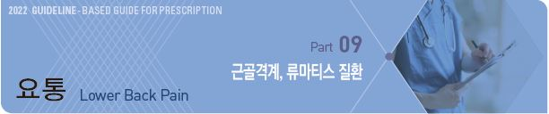
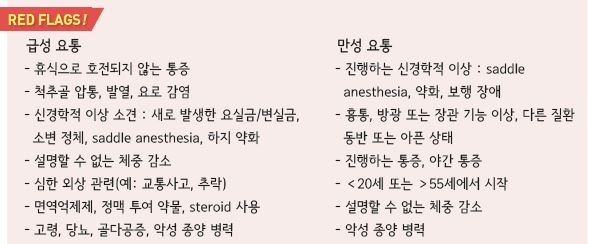
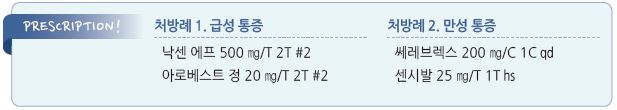

# 요통 Lower Back Pain



## 일반 사항

* lumbosacral spine 및 pelvic girdle의 통증
* 대부분의 요통은 원인이 불분명한 비특이적인 것으로 수 주(4\~6주) 내 회복되며 재발이 흔함
* 급성 ＜6주(또는 4주), 아급성 6주\~12주, 만성 ＞12주(3개월)

## 원인

*   국소/비특이적 mechanical LBP(87%) : lumbar strain/sprain(70%), disc/facet degeneration(10%),

    osteoporotic compression fracture(4%), spondylolisthesis(2%), 심한 scoliosis, kyphosis,

    asymmetric transitional vertebrae(＜1%), traumatic fracture(＜1%)
* 하지 증상 동반 LBP(7%) : disc herniation(4%), spinal stenosis(3%)
* 중증 전신성 원인(예: 암, 감염) ＜1%

#### 요통 유발 질환들

* Spondylosis (척추굳음증) : 척추의 관절염; disc space narrowing, facet joint의 염증성 변화
* Anterolisthesis (전방전위) : 아래 척추에 비하여 vertebral body의 전방 전위
* Spondylolisthesis (척추앞전위증) : spondylolysis에 의한 2차적인 anterolisthesis
* Retrolisthesis (후방전위) : 바로 아래 척추에 비하여 vertebral body의 후방 전위
* Spondylolysis (척추용해증) : pars interarticularis의 골절(보통 L5)
*   Spinal stenosis (척추관협착증) : 골 또는 연조직에 의한 vertebral canal의 narrowing; 주로 facet joints에서의 골의 비후 및

    ligamentum flavum의 비후에 의함
* Radiculopathy (신경근병증) : 신경근 장애; 해당 신경 지역의 방사통, 감각 둔화, 저림, 근육 약화
* Sciatica (좌골신경통) : 좌골신경 지역의 통증, 감각 둔화, 저림, 하지 후방/측방으로의 방사통
*   Cauda equina syndrome (말총증후군) : 중증 요추 추간판 파열, 척추협착, 척수 감염/염증/출혈/골절, 척수의 종양,

    기타 척수 손상 등에 의한 최하단 척수 신경근의 비정상적인 압박; 장 및 방광 조절 기능 상실,

    서혜부 및 회음부의 감각 둔화(saddle anesthesia), 하지 약화

### 위험 인자

* 연령, 유전, 낮은 유연성
* 비만, 흡연
* 나쁜 업무 자세, 하이힐 착용
* 부족한 신체 활동
* 활동 : 힘든 일, 장시간 앉거나 서 있기, 무거운 물건 들기, 허리 굽히기, 갑자기 비틀기
*   심리적 요인 : 낮은 직무 만족도, 기분 장애(우울, 불안); 객관적 증거 없이 지속되는 경우에 의심

    

## 임상 양상

* 국소 통증, 척추 주위 근육 경련 및 압통
* 관절 가동 범위 감소
* 보통 활동 또는 특정 자세에서 통증 증가, 휴식 시 완화
* spinal structure(근육, 인대, facet joint & disk) : 대퇴부로 방사(무릎 아래는 드묾)
* facet : sacroiliac joint/ posterior superior iliac spine 부위로 방사
* sacroiliac : 대퇴부, 무릎 아래로 방사
* 요추 신경근 : 흔히 요통보다 하지통 발생; L1~~L3- hip &/or thigh, L4~~S1- knee 아래로 방사

## 진단

### 신체검사

* 걸음걸이, 자세, 얼굴 표정
* 운동 범위
* 근육 압통, spasm, 위축
* 반사, 강도, 감각
* 맥박
*   Disk herniation 평가

    •slump test : 구부정하게 앉은 자세에서 고개를 숙여 턱을 가슴에 붙이고 한쪽 다리를 올림

    •straight leg test : 바로 누운 자세에서 다리를 쭉 펴고 ankle dorsiflex 상태로 다리를 올림
* Saddle anesthesia 평가 : anal wink reflex(항문 주위 피부를 쓰다듬으면 항문 괄약근이 수축)
* 고관절 평가 : FABER test, FADIR test (☞ p.773)
*   Gillet test or stork test : 반대쪽 다리를 올려 고관절과 무릎관절을 굴곡시킨 상태로 한쪽 다리로 서서 허리를 신전시킴;

    요천추부 통증 시 spondylolisthesis 또는 facet OA 고려
* Waddell sign : physical exam에 대하여 과잉 반응, 광범위한 압통; 정신적 문제 고려

### 영상 검사

*   대부분 필요 없음

    •영상 검사가 주는 정보가 실제 통증의 원인과 무관한 경우가 많음 (✽40세 이상의 척추 촬영에서 대부분 해부학적 이상이

    존재하지만 일반적으로 환자의 증상과 상관관계 없음)

    •대부분의 요통은 심각한 문제가 아니며 초기 치료가 동일함

    •영상 검사 없이 환자의 증상/병력, 진찰 소견에 집중하는 것이 더 유익할 수 있음
*   경고 증상이 있는 경우 시행

    •CT/MRI 대상 : 신경학적 이상, 심한 신경근 증상이 동반된 운동 근육 약화, ＞6주 지속되는 신경근 증상

### 실험실 검사

* 감염, 골수 종양 의심 시 고려
* CBC, ESR, CRP

### 증상/병력에 따른 감별

```

```

물리적 요통 감별 진단

```

```

만성 요통 환자에 대한 진단 및 관리 알고리듬

```

```

***

## Management

### 치료 방침

* 경고 징후가 없는 경우 환자를 안심시킴 : 대부분의 급성 요통은 특별한 치료에 관계없이 회복됨
* 적당한 육체 활동 권고 : 대부분의 경우 침상 안정보다 활동이 효과적임
* 약물 치료 : NSAID 또는 acetaminophen을 1차로 선택
* 4주 이상 지속되는 경우 재평가

## 비-약물 치료 및 예방

* 정상 체중 유지
*   운동, 활동 : 증상을 악화시키지 않는 수준에서의 적당한 규칙적 육체 활동

    •core strengthening exercise가 예방에 중요

    •주 1회의 간단한 스트레칭 운동, 하루 한 번의 허리 펴기도 증상 개선에 도움

    •가벼운 스트레칭으로 시작 → 수영, 수중에어로빅; 심하게 비틀기, 굽히기, 젖히기는 피함

    •저강도 운동 : 몸통 신전근, 복근 또는 허리 강화 재활 운동, 유산소 운동, crunch exercise

    •Mckenzie exercise : 추간판탈출증에 적용할 수 있으나 효과는 확실치 않음; 급성 손상, 척추 골절/추간판 파열 등에서는 금기;

    통증 증가, 감각 저하, 이상 감각 시 중지
* 스트레스 완화 : 우울증 등 동반된 심리적 문제 해결
* 자세 교육 : 무거운 물건 드는 방법, 좋은 자세 교육
* 금연
* 찜질 : 급성 요통에 대하여 초기 수일(5일 정도) 시행; 냉/온찜질의 진통 효과는 비슷
* 허리 지지대, 신발 깔창, 마사지, 카이로프랙틱, 척추 도수 교정 : 효과에 대한 증거 부족

> ✽만성 요통에서 물리 치료사에 의한 물리 치료가 보다 효과적이라는 보고가 있으나 증거는 부족

## 약물 치료

*   급성 통증 : NSAID 또는 acetaminophen으로 2\~4주 투여하면서 평가

    •NSAID에 근육이완제를 추가하거나, NSAID와 acetaminophen을 병용할 수 있으나(NSAID 기본 투여+ acetaminophen 투여)

    이에 대한 근거는 부족함

### NSAID

```
(☞ p.15)
```

* 제제에 따른 일반적 효과 차이는 없으나 환자에 따른 차이는 있음; radicular Sx에는 효과 없음
* 일부 연구에서 acetaminophen보다 NSAID가 효과적
* ibuprofen : 400\~800 ㎎ tid, 최대 3,200 ㎎/d \[부루펜]
* naproxen : 250 ㎎ tid\~500 ㎎ bid \[낙센]
* aceclofenac : 100 ㎎ bid \[에어탈]
* celecoxib : 200 ㎎ qd \[쎄레브렉스]

### Acetaminophen

* 요통 증상 완화 효과에 대한 근거는 부족함
* 용법 : 650\~1,300 ㎎ tid, 최대 4 g/d \[타이레놀]

### 근이완제

* 효과에 대하여 의문, 특히 만성 통증에서 효과 입증 안 됨
* 대상 : 급만성 요통에 대하여 단기 사용 고려
* 부작용 : 졸음, 어지럼, 구역
* afloqualone : 20 ㎎ tid \[아로베스트]
* cyclobenzaprine : 5~~10 ㎎ tid, 서방형 15~~30 ㎎ qd \[본렉스]
* tizanidine : 1\~2 ㎎ tid \[티자리드]

### Benzodiazepine

* 작용 : 근육 이완 효과
* 주의 : 중독성 문제로 제한적 사용(단기 사용); 졸음 주의
* diazepam : 2\~5 ㎎ tid \[디아제팜]

### Opioid

* 대상 : 심한 급성 통증에 대하여 단기 사용 또는 NSAID에 반응하지 않는 경우
* 투여 기간 제한 : 아편성 물질- 3\~7일 이내, 트라마돌- 2주 이내
*   tramadol : 100 ㎎ bid\~qid \[트리돌]

    •acetaminophen 병용 \[울트라셋/세미] 또는 NSAID 병용으로 효과 상승
* hydrocodone : 2.5~~10 ㎎ 필요시 q4~~6h

### 항경련제 (Anticonvulsants)

* 대상 : 말초 신경병증성 통증, 신경근병증; 일부 환자에서 단기적 효과
* topiramate : 50~~400 ㎎ #1~~2 \[토파맥스]

### 항우울제

```
(☞ p.1146)
```

* 항우울제에는 항우울 작용과 별개의 진통 효과가 있음; SNRI, TCA (☞ p.13)
* 대상 : 만성 요통, 우울 동반 환자 (✽만성 통증 환자에서 흔히 우울증이 동반됨)
* 우울증 치료 때보다 효과가 빠르게 나타나며(약 1주) 저용량에서도 효과가 있음
* 투여 중 부작용 등 위해보다 효과와 필요성이 더 우월한지 여부를 정기적으로 평가
* duloxetine : 30\~60 ㎎ qd \[심발타]

### 국소 Steroid 주사

* triamcinolone

### Herbal therapy

* Devil’s claw(악마의 발톱), Willow bark(버드나무 껍질), Capsicum : 일부 환자에서 유효

> **질병코드** M54.5 요통


