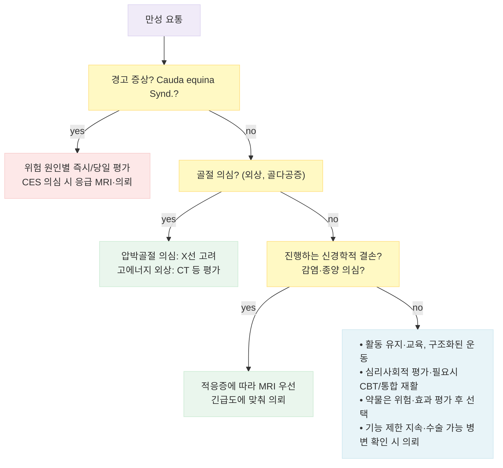

# 요통 Lower Back Pain

## <mark style="color:green;">일반 사항</mark>

* 정의 : 하부 늑골연(lower rib margin)과 둔부 주름(gluteal fold) 사이에 발생하는 통증으로, 하지 방사통을 동반하거나 동반하지 않을 수 있음(WHO 기준과 정합)
* lumbosacral spine 및 pelvic girdle의 통증을 포괄
* 다른 이름 : lumbago
* 대부분의 요통은 원인이 불분명한 비특이적(nonspecific) 요통(약 90%)으로, 수 주(4\~6주) 내 회복되나 재발이 흔함(1년 내 재발률 최대 50%)
* 유병률 : 전 세계 장애(disability)의 단일 원인 1위(GBD); 평생 유병률 60\~80%; 연령표준화 유병률은 여성(인구 10만 명당 9,330명)이 남성(5,520명)보다 높고, 약 85세경 최고치에 이름 [JAMA 2026]
* 급성 ＜6주(또는 4주), 아급성 6주\~12주, 만성 ＞12주(3개월)

## <mark style="color:green;">원인</mark>

* 비특이적(nonspecific) 요통이 약 90%를 차지하며, 신경근병증·척추관협착증이 초진의 5\~10%, 척추 골절·축성 척추관절염·척추 감염·악성종양·내장/혈관성 연관통은 각각 1% 미만을 차지함 [JAMA 2026]
* 전통적으로는 다음과 같이 세분하여 설명되어 왔음(Conn's Current Therapy 등) - 구조를 특정하기보다 비특이적 통증의 대략적인 구성비를 보여주는 참고 자료로 활용
  * 국소/비특이적 mechanical LBP(87%) : lumbar strain/sprain(70%), disc/facet degeneration(10%), osteoporotic compression fracture(4%), spondylolisthesis(2%), 심한 scoliosis, kyphosis, asymmetric transitional vertebrae(＜1%), traumatic fracture(＜1%)
  * 하지 증상 동반 LBP(7%) : disc herniation(4%), spinal stenosis(3%)
  * 중증 전신성 원인(예: 암, 감염) ＜1%
  * ✽이 전통적 분류의 'mechanical LBP'는 현대적 의미의 'nonspecific LBP'와 완전히 같은 개념은 아니며, compression fracture처럼 특정 구조적 원인도 일부 포함되어 있음에 유의

#### <mark style="color:$primary;">요통 유발 질환들</mark>

* Spondylosis (척추굳음증) : 척추의 관절염; disc space narrowing, facet joint의 염증성 변화
* Anterolisthesis (전방전위) : 아래 척추에 비하여 vertebral body의 전방 전위
* Spondylolisthesis (척추전방전위증) : 한 척추체가 인접 척추체에 대해 전방으로 전위된 상태; 원인에 따라 퇴행성(가장 흔함, 특히 고령), 협부형(isthmic, spondylolysis에 의한 2차적 전위), 선천성/이형성, 외상성, 병적 원인 등으로 구분; Meyerding 분류(Grade I\~V, 하위 종판 대비 전위 정도)로 중증도 평가
* Retrolisthesis (후방전위) : 바로 아래 척추에 비하여 vertebral body의 후방 전위
* Spondylolysis (척추용해증) : pars interarticularis의 골절(보통 L5)
* Spinal stenosis (척추관협착증) : 골 또는 연조직에 의한 vertebral canal의 narrowing; 주로 facet joints에서의 골의 비후 및 ligamentum flavum의 비후에 의함
* Radiculopathy (신경근병증) : 신경근 장애; 해당 신경 지역의 방사통, 감각 둔화, 저림, 근육 약화
* Sciatica (좌골신경통) : 좌골신경 지역의 통증, 감각 둔화, 저림, 하지 후방/측방으로의 방사통
* Cauda equina syndrome (말총증후군) : 중증 요추 추간판 파열, 척추협착, 척수 감염/염증/출혈/골절, 척수의 종양, 기타 척수 손상 등에 의한 최하단 척수 신경근의 비정상적인 압박; 새로 발생한 배뇨·배변·성기능 변화, 서혜부 및 회음부의 감각 둔화(saddle anesthesia), 하지 약화 - 신경외과적 응급

### <mark style="color:orange;">위험 인자</mark>

* 연령, 유전, 낮은 유연성
* 비만, 흡연
* 나쁜 업무 자세, 하이힐 착용
* 부족한 신체 활동
* 활동 : 힘든 일, 장시간 앉거나 서 있기, 무거운 물건 들기, 허리 굽히기, 갑자기 비틀기
* 심리사회적 요인(yellow flags) : 낮은 직무 만족도, 기분 장애(우울, 불안), 통증 관련 두려움-회피 신념(fear-avoidance belief), 낮은 자기효능감; 만성화의 가장 강력한 예측 인자 중 하나로, 객관적 이상 소견 없이 통증이 지속되는 경우 특히 고려

## <mark style="color:green;">임상 양상</mark>

* 국소 통증, 척추 주위 근육 경련 및 압통
* 관절 가동 범위 감소
* 보통 활동 또는 특정 자세에서 통증 증가, 휴식 시 완화
* spinal structure(근육, 인대, facet joint & disk) : 대퇴부로 방사(무릎 아래는 드묾)
* facet : sacroiliac joint/ posterior superior iliac spine 부위로 방사
* sacroiliac : 대퇴부, 무릎 아래로 방사
* 요추 신경근 : 흔히 요통보다 하지통이 더 두드러짐; L1\~L3 - hip &/or thigh, L4\~S1 - knee 아래로 방사
* ✽구조별 방사통 위치는 서로 겹치는 경우가 많아, 통증 분포만으로 원인 구조(facet, SI joint, disk 등)를 단정할 수 없음 - 병력·신체검사·영상 소견을 종합하여 판단

### <mark style="color:$danger;">🚩 Red Flags!</mark>

<mark style="color:$danger;">**즉각 조치 또는 의뢰**</mark> <mark style="color:$danger;">- 생명 위협 또는 즉각적 위해 가능성</mark>

* Cauda equina syndrome 의심 소견 : 새로 발생한 배뇨 기능 변화(요저류, 배뇨곤란, 방광 충만·배뇨 감각 저하, hesitancy, 요실금 등 초기 변화 포함), 변실금·배변 기능 변화, 회음부·생식기 감각 저하 또는 성기능 변화, saddle anesthesia, 양측 또는 진행하는 하지 위약·마비, 보행 장애 → 경미하거나 비전형적으로 보이더라도 CES 초기 소견일 수 있으므로 지체 없이 응급 MRI 및 즉시 신경외과/정형외과 의뢰; 진단·수술이 지연되면 영구적인 방광·직장·성기능 장애 및 하지 마비 위험이 있어 압박이 확인되면 지체 없이 감압 수술을 시행
* 복부 대동맥류(AAA) 의심 : 고령·심혈관 위험 인자가 있는 환자의 급성 심한 요통·옆구리 통증이 박동성 복부 종괴, 좌우 맥박 차이, 찢어지는 듯한 통증과 동반되는 경우 → 파열/박리 가능성을 염두에 두고 응급 평가
* 심한 외상 관련 발생(예: 교통사고, 고소 추락, 낙상) → 척추 골절·척수 손상 배제
* 발열 또는 최근 감염력·균혈증 위험 요인(정맥 투여 약물 사용, 최근 시술) + 새로 발생한 심한 국소 요통·척추골 압통 → 척추 감염(척추골수염, 경막외농양) 의심 - 두 소견이 반드시 함께 있어야 하는 것은 아니며, 발열이 없어도 배제되지 않음
* 급격히 진행하는 국소 신경학적 결손(근력 저하가 진행하는 경우)

<mark style="color:$warning;">**당일~수일 내 평가**</mark>

* 면역억제제, 정맥 투여 약물(마약류 등) 사용력, 최근 감염 또는 시술력 → 척추 감염 위험 증가; 새로 발생한 심한 국소 척추통·압통이나 전신 증상과 결합되면 당일 평가(경막외농양이 의심되면 즉각 조치)
* 악성 종양 병력, 설명할 수 없는 체중 감소 → 전이성 척추 종양 의심; 암 병력과 새로 발생한 진행성 국소 통증이 결합되면 당일 평가
* 고령, 골다공증, 만성 steroid 사용 → 병적/압박 골절 위험
* 지속적·진행성 야간통(누워도 완화되지 않음)이 암 병력, 체중 감소, 발열 등 전신 증상과 동반되는 경우
* ＜20세 또는 ＞55세에서 새로 시작된 요통이면서, 외상·골다공증·악성종양 병력·발열 등 전신 증상·진행성 신경학적 이상 등 다른 위험 요인이 동반되는 경우(연령 단독은 특이도가 낮아 다른 소견과 함께 판단)
* 당뇨병 또는 면역저하 환자에서 발열·균혈증 위험·심한 지속성 국소 척추통 등 척추 감염 의심 소견이 동반되는 경우; 발열·옆구리 통증·CVA tenderness·배뇨 증상이 동반되면 신우신염 등 비척추성 감염과의 감별도 함께 고려(당뇨·요로감염 자체만으로 모든 요통을 당일 의뢰할 필요는 없음)
* 흉통이 새로 동반되는 경우 - 흉추 병변, 대동맥 질환 등 다른 원인 감별 필요

_✽개별 위험 인자의 척추 골절 posttest probability: 고령(≥70세) 9%, 심한 외상 11%, 6개월 이상 corticosteroid 사용 33%; 암 병력의 척추 전이 posttest probability 33% - 개별 소견의 진단적 가치는 제한적이며 복합 소견 시 의심을 높임 [JAMA 2026]_

<mark style="color:$info;">**외래 추적 / 추가 평가 계획**</mark> <mark style="color:$info;">- 즉각 위험 낮으나 호전 없으면 의뢰</mark>

* 표준적 보존 치료(활동 유지, NSAID 등) 4\~6주 후에도 호전이 없는 경우
* 다른 전신 질환이 동반되거나 전반적으로 아픈 상태(general malaise) - 단, 새로운 배뇨·배변 기능 변화가 있다면 아무리 경미해도 Tier 1(즉각 조치)로 접근
* 심리사회적 위험 요인(우울, 불안, 낮은 직무 만족도, fear-avoidance belief) 동반 시 → 만성화 위험 평가(☞ 위험도 계층화) 및 필요시 개입

## <mark style="color:green;">진단</mark>

### <mark style="color:orange;">신체검사</mark>

✽[Low back muscle(3D)](https://www.innerbody.com/anatomy/muscular/lower-torso)

* 걸음걸이, 자세, 얼굴 표정
* 운동 범위
* 근육 압통, spasm, 위축
* 반사, 강도, 감각
* 맥박(말초 혈관 질환 감별)
* Disk herniation 평가
  * slump test : 구부정하게 앉은 자세에서 고개를 숙여 턱을 가슴에 붙이고 한쪽 다리를 올림
  * straight leg raise(SLR) test : 바로 누운 자세에서 다리를 쭉 펴고 ankle dorsiflex 상태로 다리를 올림; 30\~70° 사이에서 통증 재현 시 양성(민감도 高, 특이도 低)
  * crossed(대측) SLR test : 반대측 다리 거상 시 환측 하지에 통증 재현 → 추간판탈출증에 대해 특이도 高(민감도는 낮음)
* Cauda equina syndrome 의심 시
  * 회음부·생식기 감각, 새로 발생한 성기능 변화, 하지 근력·감각을 평가; anal wink reflex 등 부가 검사를 시행하더라도 응급 MRI·의뢰를 지연하지 않음
  * post-void residual(PVR) bladder scan : 요저류 여부를 평가하는 보조 검사. PVR ≥200㎖이면 CES 가능성이 높아지나, 낮은 PVR만으로 CES를 배제할 수 없음 - 임상적으로 의심되면 PVR 결과와 무관하게 응급 MRI를 우선함
  * digital rectal exam(항문 괄약근 tone)은 필수 선별 검사가 아니며 정상 소견만으로 CES를 배제할 수 없음; 검사·PVR 확인보다 응급 의뢰를 우선
* 고관절 평가 : FABER test, FADIR test
* Stork test (single-leg hyperextension test) : 한쪽 다리로 서서 허리를 신전; 국소 통증 재현 시 spondylolysis(pars 결손) 시사하나 진단 정확도는 충분히 높지 않아 양성이어도 확진할 수 없으며, 임상적 의심 시 영상 검사와 함께 해석
* Gillet test : 서 있는 자세에서 한쪽 고관절을 굴곡시키며 양측 posterior superior iliac spine(PSIS)의 움직임을 촉진 비교; 비대칭적 움직임 시 sacroiliac joint 기능 이상 시사(stork test와는 평가 대상이 다른 별개의 검사)
* Waddell sign : 기질적 병변으로 설명되지 않는 비기질적(non-organic) 신체 징후(과도한 압통 반응, 부적절한 부위의 통증 호소 등) - 심리사회적 요인 평가의 단서로 활용하되, 꾀병의 근거로 단정하지 않음

### <mark style="color:orange;">위험도 계층화</mark>

* STarT Back Screening Tool 등 검증된 위험도 계층화 도구를 초진 시 활용 고려(NICE NG59, 2020) - 신체적 요인(통증 부위·방사통 여부·기능 제한)과 심리사회적 요인(두려움-회피 신념, 우울·불안, 파국적 사고)을 함께 평가하여 저위험/중위험/고위험군으로 구분
* 이러한 도구들의 판별력은 제한적(C statistic 0.59\~0.71 수준)이며, 단독으로 치료 결정을 내리기보다 임상적 판단을 보완하는 용도로 사용 [JAMA 2026]
* 저위험군 : 안심 및 활동 유지 교육 위주의 최소 개입
* 중위험군 : 운동·재활 프로그램 병행
* 고위험군(심리사회적 위험 요인 뚜렷) : 다학제적 접근(운동+심리적 개입) 고려 - 조기 식별 시 만성화 예방에 도움이 될 수 있음

### <mark style="color:orange;">영상 검사</mark>

* 대부분 필요 없음
  * 영상 소견과 실제 증상 간의 상관관계는 약함(✽40세 이상의 척추 촬영에서 대부분 해부학적 이상이 존재하지만 일반적으로 환자의 증상과 상관관계 없음)
  * 대부분의 요통은 심각한 문제가 아니며 초기 치료가 동일함
  * 영상 검사 없이 환자의 증상/병력, 진찰 소견에 집중하는 것이 더 유익할 수 있음
* Red Flag가 있는 경우 시행
  * MRI(해당 적응증에서 1차 선택) : cauda equina syndrome, 진행하는 신경학적 결손, 감염·종양 의심, 약 6주 이상의 신경근병증에서 시술·수술을 고려하는 경우 - 연부조직·신경근·경막외 공간 평가에 우수; 감염·종양 의심 시 필요한 조영 여부는 전문과·영상의학과와 결정
  * 단순 X선 : 골다공증성 압박골절 등 골절 의심 시 초기 평가에 고려. CT : 고에너지 외상 후 골절·골성 구조 평가에 유용; MRI 금기 시 신경조직 평가의 단순 대체가 되는 것은 아니며 적응증에 따라 CT 척수조영술 등을 전문과와 논의
  * 단순 비특이적 요통이나 합병되지 않은(uncomplicated) 신경근병증에서는 초기 영상 검사가 불필요

### <mark style="color:orange;">실험실 검사</mark>

* 감염, 골수 종양 의심 시 고려
* CBC, ESR, CRP

### <mark style="color:orange;">감별 진단</mark>

* 병력의 핵심 특징(발생 계기, 방사통 여부, 발열·전신 증상 동반, 연령, 임신 여부 등)에 따라 원인 질환을 감별

***

<figure><figcaption><p>병력 기반 요통 감별 흐름도</p></figcaption></figure>

***

### <mark style="color:orange;">물리적 요통 감별 진단</mark>

<table>
<thead><tr><th>양상</th><th>주요 단서</th></tr></thead>
<tbody>
<tr><td>비특이적 mechanical LBP</td><td>자세·활동에 따라 변화, 국소 근육 압통·경직, 신경학적 결손 없음</td></tr>
<tr><td>Disc herniation / radiculopathy</td><td>하지 방사통 동반, 앉을 때 악화되는 경향, dermatomal sensory change, SLR(+)</td></tr>
<tr><td>Spinal stenosis</td><td>보행·신전 시 악화(neurogenic claudication), 앉거나 앞으로 굽히면 호전; 혈관성 파행과 감별</td></tr>
<tr><td>Compression fracture</td><td>고령·골다공증·외상력, 국소 척추 압통, 급성 발생</td></tr>
<tr><td>Inflammatory back pain (예: 축성 척추관절염)</td><td>젊은 연령, 아침 강직, 운동으로 호전, 휴식으로 악화</td></tr>
<tr><td>Infection / malignancy</td><td>발열·체중 감소 등 전신 증상, 지속성 야간통, 면역억제·암 병력 등</td></tr>
</tbody>
</table>

✽개별 질환의 증상은 서로 겹치는 경우가 많아 이 표만으로 확진할 수 없으며, 병력·신체검사·필요시 영상 검사를 종합하여 판단\
Ref. AAFP 2007;75(8):1181-1188; NICE NG59(2020); Conn's Current Therapy 2017(구성 참고)

**신경성 파행 vs 혈관성 파행 감별 팁**

* 자세 의존성 : 신경성(척추관협착)은 허리를 굽히거나 앉으면 즉시 호전(장바구니를 밀며 걷거나 자전거 타기는 편함); 혈관성은 자세와 무관하게 걷는 거리·강도에 비례해 악화
* 정지 시 호전 속도 : 신경성은 앉거나 굽혀야 호전(단순히 서 있기만 해서는 잘 호전되지 않음); 혈관성은 그냥 멈춰 서 있기만 해도 수분 내 호전
* 맥박 : 혈관성은 말초 맥박 감소/소실 동반 가능; 신경성은 맥박 정상
* 급성 심한 요통·옆구리 통증에서 박동성 복부 종괴나 좌우 맥박 차이가 동반되면 파행 감별과 별개로 AAA를 우선 배제(☞ Red Flags)

***


```mermaid
flowchart TD
    A["만성 요통"] --> B["경고 증상? Cauda equina Synd.?"]
    B -->|yes| C["위험 원인별 즉시/당일 평가<br/>CES 의심 시 응급 MRI·의뢰"]
    B -->|no| D["골절 의심? (외상, 골다공증)"]
    D -->|yes| E["압박골절 의심: X선 고려<br/>고에너지 외상: CT 등 평가"]
    D -->|no| F["진행하는 신경학적 결손?<br/>감염·종양 의심?"]
    F -->|yes| G["적응증에 따라 MRI 우선<br/>긴급도에 맞춰 의뢰"]
    F -->|no| H["• 활동 유지·교육, 구조화된 운동<br/>• 심리사회적 평가·필요시 CBT/통합 재활<br/>• 약물은 위험·효과 평가 후 선택<br/>• 기능 제한 지속·수술 가능 병변 확인 시 의뢰"]

    classDef purple fill:#f0ebf8,stroke:#dcd3f0,color:#333
    classDef yellow fill:#fff9c4,stroke:#ffe082,color:#333
    classDef pink fill:#fde8e8,stroke:#f8cece,color:#333
    classDef green fill:#eaf6ed,stroke:#ccebd4,color:#333
    classDef blue fill:#e8f4f8,stroke:#cee7f0,color:#333,text-align:left

    class A purple
    class B,D,F yellow
    class C pink
    class E,G green
    class H blue
```

<p align="center"><strong>만성 요통 환자에 대한 진단 및 관리 알고리듬</strong></p>

<p align="center"><em><mark style="color:$info;">Ref. Common Questions About Chronic Low Back Pain. AFP 2015;91(10). Fig 1.</mark></em></p>


본 알고리듬은 red flag·골절·신경학적 증상 배제를 통한 기본 골격을 보여줌. WHO의 2023년 만성 원발성 요통(chronic primary low back pain) 가이드라인은 여기에 더해 생물심리사회적(biopsychosocial) 평가, 구조화된 운동 치료, 필요시 심리적 개입을 포함한 다학제적 접근을 강조함(☞ 위험도 계층화)


***

## <mark style="background-color:$warning;">Management</mark>

### <mark style="color:orange;">치료 방침</mark>

* 경고 징후가 없는 경우 환자를 안심시킴 : 대부분의 급성 비특이적 요통은 시간이 지나며 호전됨
* 적당한 육체 활동 권고 : 대부분의 경우 침상 안정보다 활동이 효과적임
* 약물 치료 : 급성 비특이적 요통으로 기능 제한이 있으면 금기·상호작용 확인 후 NSAID를 최소 유효 용량·최단 기간 고려. 만성 비특이적 요통에서는 교육·활동·구조화된 운동과 필요시 심리적 개입·통합 재활이 우선이며, 약물은 기능 개선이 불충분할 때 개별적으로 고려. Acetaminophen 단독은 효과 근거가 부족함
* 초진 시 위험도 계층화(☞ 위험도 계층화)를 통해 치료 강도를 조절
* 4주 이상 지속되는 경우 재평가

## <mark style="color:green;">비-약물 치료 및 예방</mark>

* 정상 체중 유지
  * ✽이는 예방적 위험 인자 관리 차원이며, 이미 발생한 만성 요통의 치료 수단으로서 약물적 체중감량을 사용하는 것은 권장되지 않고(조건부 권고, 반대), 비약물적 체중감량의 치료 효과는 근거가 불충분함(권고 보류) [WHO 2023]
* 운동, 활동 : 증상을 악화시키지 않는 수준에서의 적당한 규칙적 육체 활동
  * 코어 강화를 포함한 다양한 운동을 지속 가능한 형태로 선택
  * 획일적인 빈도·강도보다는 유산소 운동, 근력·코어 강화, 유연성 운동 등을 환자가 꾸준히 지속할 수 있는 형태로 개별화하여 시행하는 것이 권장됨; 가벼운 스트레칭조차 증상 개선에 도움이 될 수 있음
  * 가벼운 스트레칭으로 시작 → 수영, 수중에어로빅; 심하게 비틀기, 굽히기, 젖히기는 피함
  * 저강도 운동 : 몸통 신전근, 복근 또는 허리 강화 재활 운동, 유산소 운동, crunch exercise
  * McKenzie 운동(방향 선호에 따른 반복 운동) : 일부 환자에서 고려할 수 있으나 모든 추간판탈출증 환자에게 획일적으로 적용하지 않음. 골절 등 구조적 위험을 먼저 평가하고, 하지 통증의 말초화·근력 저하 등 신경학적 악화가 있으면 중단·재평가
* 스트레스 완화 : 우울증 등 동반된 심리적 문제 해결
* 자세 교육 : 무거운 물건 드는 방법, 좋은 자세 교육
* 금연
* 찜질 : 급성 요통에 대하여 초기 수일(5일 정도) 시행; 냉/온찜질의 진통 효과는 비슷
* 도수치료(manual therapy) : 운동을 포함한 치료 패키지의 일부로서만 고려(NICE NG59, 2020) - 단독 시행의 근거는 부족
* 허리 지지대, 신발 깔창, rocker-sole 신발, 견인(traction), 초음파, TENS/PENS, 간섭파 치료 : 효과에 대한 근거가 부족하여 일상적으로 권장되지 않음(NICE NG59, 2020)
* 이동 제한이 동반된 경우, 개인별 평가에 기반하여 지팡이·보행기 등 적절한 이동 보조기구 제공을 고려(good practice statement) - 위의 허리 지지대·벨트와는 구분되는 권고임에 유의 [WHO 2023]
* 침술(needling therapy) : 가이드라인 간 권고가 상충함 - NICE NG59(2020)는 효과 근거 부족을 이유로 권장하지 않는 반면, WHO의 만성 원발성 요통(CPLBP) 특화 가이드라인(2023)은 조건부로 권고함(사용, 낮은 근거 수준); 시행할 경우 항응고제 복용 환자(특히 고령자)에서 삽입 부위 출혈 위험에 주의하고, 단독 치료가 아닌 생물심리사회적 평가에 기반한 치료 패키지의 일부로 고려 [NICE NG59 2020; WHO 2023]

- [ ] 만성 요통에서 물리 치료사에 의한 물리 치료가 보다 효과적이라는 보고가 있으나 증거는 부족

## <mark style="color:green;">약물 치료</mark>

* 급성 비특이적 요통 : 활동·자가관리 교육과 함께 기능 제한이 있으면 금기 확인 후 NSAID를 최소 유효 용량·최단 기간 고려하고 수일\~1주 내 효과·부작용 재평가; 지속 사용 시 위장관·신장·심혈관 위험을 다시 확인. Acetaminophen 단독은 일상적으로 권장되지 않으나 NSAID 사용이 어렵거나 추가 진통이 필요한 경우 개별적으로 고려(NICE NG59, 2020)
  * NSAID에 근육이완제를 추가하거나, NSAID와 acetaminophen을 병용할 수 있으나(NSAID 기본 투여 + acetaminophen 투여) 이에 대한 근거는 부족함

### <mark style="color:orange;">NSAID</mark>

(☞ [통증](../220_/001_-pain.md#nsaid))

* 제제에 따른 일반적 효과 차이는 없으나 환자에 따른 차이는 있음; radicular Sx(좌골신경통)에는 근거가 제한적 - 사용 시 최소 유효 용량으로 최단 기간
* 일부 연구에서 acetaminophen보다 NSAID가 효과적
* ibuprofen : 400\~800 ㎎ tid, 최대 3,200 ㎎/d \[부루펜]
* naproxen : 250 ㎎ tid\~500 ㎎ bid \[낙센]
* aceclofenac : 100 ㎎ bid \[에어탈]
* celecoxib : 200 ㎎ qd \[쎄레브렉스]

### <mark style="color:orange;">Acetaminophen</mark>

* 요통 증상 완화 효과에 대한 근거는 부족함(단독 사용은 권장되지 않음; NICE NG59 2020, WHO 2023 만성 원발성 요통 가이드라인 모두 단독 요법으로 권장하지 않음)
* 용법 : 650\~1,300 ㎎ tid, 최대 4 g/d \[타이레놀]; 단, 고령·저체중·간질환·만성 음주자에서는 더 낮은 최대 용량 적용

### <mark style="color:orange;">근이완제</mark>

* 효과에 대하여 의문, 특히 만성 통증에서 효과 입증 안 됨
* 대상 : 근경직·근경련이 뚜렷한 급성(아급성 포함) 비특이적 요통에서 단기간 선택적으로 고려; 만성 요통에서는 일상적 사용 근거가 부족
* 부작용 : 졸음, 어지럼, 구역
* afloqualone : 20 ㎎ tid \[아로베스트]
* eperisone : 50 ㎎ tid \[에페신]
* cyclobenzaprine : 5\~10 ㎎ tid, 서방형 15\~30 ㎎ qd \[본렉스]
* tizanidine : 1\~2 ㎎ tid \[티자리드]

### <mark style="color:orange;">Benzodiazepine</mark>

* 급성 비특이적 요통에 대한 효과 근거가 매우 제한적이므로 요통 치료 목적으로 일상적으로 사용하지 않음. 좌골신경통에는 NICE NG59(2020)가 위해·이득을 고려하여 사용하지 않도록 권고함
* 다른 독립적인 적응증으로 이미 사용 중이면 진정·낙상·의존 위험을 평가하고, opioid·다른 진정제와의 병용을 특히 주의

### <mark style="color:orange;">Opioid</mark>

* 대상 : NSAID가 금기이거나 내약성이 없거나 충분한 효과가 없고 다른 대안이 적절하지 않은 심한 급성 통증에 한하여, 매우 단기간 고려; 급성 좌골신경통에서 opioid의 효과에 대한 근거는 불충분함
* 만성 요통 및 만성(＞12주) 좌골신경통에서는 장기적 이득에 대한 근거가 부족하고 의존·오남용 위험이 있어 사용을 권장하지 않음(NICE NG59 2020; WHO 2023 만성 원발성 요통 가이드라인도 만성 요통에서 opioid를 권장하지 않음)
* 투여 기간 : 필요한 최소 기간(가능하면 수일)만 처방하고 조기 재평가; 지속이 필요하면 통증·기능 개선과 부작용·의존 위험을 다시 평가
* tramadol 속방형 : 성인에서 50 ㎎ 필요시 q6h로 시작을 고려하고 반응·내약성에 따라 조정, 1일 최대 400 ㎎ \[트리돌캡슐50㎎]; 고령·신장애·간장애에서는 투여 간격과 용량을 개별 조정

    • acetaminophen 복합제 \[울트라셋/세미]는 각 성분의 총량과 중복 복용에 주의. SSRI/SNRI/TCA 등 세로토닌성 약물과 병용 시 세로토닌증후군·경련 위험, benzodiazepine·음주 등과 병용 시 과도한 진정·호흡억제 위험을 점검

### <mark style="color:orange;">항경련제 (Anticonvulsants)</mark>


gabapentin, pregabalin 등 gabapentinoid 계열 및 기타 항경련제는 최근 근거(NICE NG59 2020 개정, 다수의 체계적 문헌고찰)에서 좌골신경통·신경근병증에 대한 유의한 효과가 확인되지 않았고, 졸림·어지럼 등 이상반응 위험은 증가하는 것으로 나타나 요통·좌골신경통 치료 목적으로 일상적으로 권장하지 않음(NICE는 요통·좌골신경통 모두에서 항경련제 사용을 권장하지 않음).


* 항경련제(topiramate 등)를 요통·신경근병증에 사용하는 것에 대한 근거는 확립되어 있지 않음
* 단, 요통·좌골신경통과는 별개로 확립된 말초 신경병증성 통증 적응증(예: 당뇨병성 신경병증)이 동반되어 있다면 해당 질환의 치료 지침에 따라 사용할 수 있음 - 요통·좌골신경통 자체의 치료를 위해 시범 투여하는 것과는 구분

### <mark style="color:orange;">항우울제</mark>

(☞ [항우울제](../231_/213_-antidepressants-and-anxiolytics.md))

* 항우울제에는 항우울 작용과 별개의 진통 효과가 있음; SNRI, TCA
* 순수 비특이적 축성(axial) 요통 자체를 치료할 목적의 SSRI/SNRI/TCA 일상적 사용은 권장되지 않음(NICE NG59, 2020; WHO 2023의 만성 원발성 요통 권고). 다만 ACP는 만성 비특이적 요통에서 비약물 치료 후 duloxetine을 후속 선택지로 제시하며, 효과는 작고 부작용을 고려해야 하므로 지침 간 차이를 구분
* 대상 : 명확한 우울·불안 등 정신건강 적응증이 있거나, 별도의 신경병증성 통증 요소가 동반된 경우 해당 적응증에 따라 사용(✽만성 통증 환자에서 흔히 우울증이 동반됨); 신경병증성 통증 등 별도의 승인·근거가 있는 적응증에서의 진통 효과는 항우울 효과와 별개로 나타날 수 있음
* 투여 중 부작용 등 위해보다 효과와 필요성이 더 우월한지 여부를 정기적으로 평가
* duloxetine : 30 ㎎ qd로 시작, 내약성 양호 시 1주 후 60 ㎎ qd로 증량 \[듀로셉톨] [JAMA 2026]; 비특이적 요통만을 목적으로 한 사용은 국내 허가·급여기준과 별도로 구분

### <mark style="color:orange;">국소 Steroid 주사</mark>

* 단순 축성 요통(방사통 없는 경우)에 대한 경막외/척추 주사는 근거가 부족하여 일상적으로 권장되지 않음(NICE NG59, 2020)
* 급성의 심한(acute and severe) 좌골신경통에서는 경막외 국소마취제+스테로이드 주사를 보존적 치료 실패를 전제조건으로 하지 않고 단기 증상 완화 목적으로 고려할 수 있음(NICE NG59, 2020); 다만 중심성 척추관협착증에 의한 신경성 파행에는 사용하지 않음. 국내 실무에서는 보존적 치료에 반응하지 않는 지속성 신경근통에 한해 전문과 판단하에 시행하는 경우가 많으며, 급성 중증 좌골신경통에서는 이보다 조기에 고려할 수도 있음(☞ 시술 및 기타 처치) - 통증클리닉/척추 전문과 협진
* triamcinolone

### <mark style="color:orange;">Herbal therapy</mark>

* 국소 Capsicum(고추, cayenne pepper) : 조건부 권고(사용), 근거 수준 낮음 - 사용 시 피부 자극 가능성 사전 설명
* Devil's claw(악마의 발톱), White willow(버드나무 껍질) : 조건부 권고(사용하지 않음) - 작은 이득이 불확실한 위해와 비교할 때 근거가 불충분함 [WHO 2023]

## <mark style="color:green;">시술 및 기타 처치</mark>

* 경막외 스테로이드 주사(ESI)/선택적 신경근 차단술 : 급성의 심한 좌골신경통에서는 조기에 고려할 수 있고(NICE NG59, 2020), 만성 신경근병증에서는 보존적 치료에 반응하지 않는 경우 단기적 증상 완화 목적으로 고려; 중심성 척추관협착증에 의한 신경성 파행에는 사용하지 않음; 장기적 기능 개선 효과는 제한적
* Radiofrequency denervation : 만성 facet-mediated 요통에서 비수술적 치료 실패 + 진단적 medial branch block에 양성 반응을 보인 경우에 한해 고려(NICE NG59, 2020)
* 골다공증성 압박골절에서의 vertebroplasty/kyphoplasty : sham-controlled 연구에서 위약 대비 뚜렷한 우위를 보이지 못한 경우가 있어 근거가 논란이 됨 - 통증클리닉/정형외과·신경외과와 개별 상담 후 결정
* 수술적 치료 의뢰 기준(척추외과/신경외과) : cauda equina syndrome(응급), 진행하는 근력 저하, ＞6\~12주 보존적 치료에 반응하지 않는 심한 좌골신경통(특히 기능 제한이 심한 경우), 증상성 척추관협착증으로 삶의 질 저하가 뚜렷한 경우

***

## <mark style="color:red;">질병코드</mark>

M54.56 요통, 요추부

M54.46 좌골신경통을 동반한 요통, 요추부(하지 방사통 동반 시)

M54.5, M54.4는 KCD-8(2021년 시행) 개정으로 부위별 세분류(M54.50\~M54.59, M54.40\~M54.49)로 세분화되었으며, 2026년 1월 1일부터는 KCD-9(2025년 7월 고시)가 시행 중 - 세분류 코드 자체는 KCD-9에서도 유지되나, 청구 프로그램의 상병마스터가 최신 KCD-9 기준으로 갱신되어 있는지 확인 필요. 임상 양상에 맞는 단일 코드 선택 필요(방사통이 뚜렷하면 M54.4x, 순수 축성 통증이면 M54.5x)

***

## <mark style="color:purple;">처방례</mark>

> **처방례 1. 급성 통증**
>
> ```
> 낙센에프정 500 ㎎/T  2T #2
> 아로베스트정 20 ㎎/T  2T #2
> ```
>
> _✽비특이적 급성 요통 1차 치료; NSAID가 필요한 급성 비특이적 요통의 예시로, 근이완제는 근경련이 뚜렷하거나 NSAID 단독으로 충분치 않을 때 단기 병용. 수일\~1주 내 약물 효과·부작용을 재평가하고, 침상안정보다 일상 활동 유지를 권고_

> **처방례 2. 만성 비특이적 요통에서 약물 치료가 필요한 경우**
>
> ```
> 쎄레브렉스 200 ㎎/C  1C qd (필요시 단기간)
> ```
>
> _✽교육·활동 유지·구조화된 운동을 우선 시행하고, 기능 제한이 지속될 때 금기·상호작용 확인 후 단기간 NSAID를 고려하는 예시. 위장관·신장·심혈관 위험을 평가하고 정기적으로 중단 가능성을 재평가. 우울증이나 수면장애가 동반되면 별도 평가·치료하며, 단순 불면 또는 요통을 이유로 TCA를 자동 추가하지 않음_

> **처방례 3. 급성 좌골신경통(중등도\~중증)**
>
> ```
> 낙센에프정 500 ㎎/T  2T #2
> 트리돌캡슐50㎎  1C 필요시 q6h (단기간 처방 후 조기 재평가)
> ```
>
> _✽방사통이 뚜렷한 급성 좌골신경통에서 NSAID 단독으로 조절되지 않고 다른 대안이 마땅치 않을 때 매우 단기간 고려할 수 있는 예시이며, "표준 1차 치료"로 일상적으로 사용하는 처방은 아님(급성 좌골신경통에서 opioid의 효과 근거는 불충분함). gabapentinoid(pregabalin, gabapentin)는 유효성 근거가 부족하여 1차로 추가하지 않으며, 약 6주 이상 지속되며 시술·수술을 고려하거나 진행하는 신경학적 결손이 있으면 영상 검사·전문과 의뢰를 고려(진행성 결손은 기다리지 않고 긴급 평가)_

***

### <mark style="color:$success;">핵심 복약 지도</mark>

> **NSAID 복용 시 이렇게 안내하세요**
>
> 1. 가능한 최소 유효 용량으로 최단 기간만 사용하도록 안내합니다.
> 2. 위장 장애, 신기능 저하, 심혈관 위험 인자(고혈압, 심부전, 신질환)가 있는 환자에서는 특히 주의하고, 필요시 위장보호제를 병용합니다.
> 3. 복용 중 흑색변, 심한 속쓰림, 부종·소변량 감소가 있으면 즉시 중단하고 내원하도록 안내합니다.

> **근이완제·benzodiazepine·opioid 사용 시**
>
> 1. 졸음, 어지럼을 유발할 수 있어 운전·기계 조작에 주의하도록 안내합니다.
> 2. 정해진 짧은 기간만 사용하며, 특히 opioid·benzodiazepine은 지속 투여 전 효과·부작용과 의존 위험을 다시 평가하도록 안내합니다.
> 3. 술과 함께 복용하지 않도록 안내합니다. Opioid와 benzodiazepine 등 진정제의 병용은 과도한 졸음·호흡억제 위험이 있으므로 처방된 약과 다른 약·건강기능식품의 복용을 알리도록 합니다.

> **활동에 대한 안내**
>
> 1. 침상 안정은 오히려 회복을 늦출 수 있으므로, 통증이 허용하는 범위 내에서 평소 활동을 유지하도록 권고합니다.
> 2. "통증이 있다고 해서 반드시 손상이 진행되고 있는 것은 아니다"라는 점을 설명하여 불필요한 두려움-회피 행동을 줄입니다.

> **언제 다시 병원을 방문해야 하나요?**
>
> * 수일\~1주 내 약물 효과나 부작용을 점검하고, 4\~6주간 활동·운동 등 보존적 치료에도 호전이 없는 경우 재평가
> * 새로 발생한 **배뇨 감각·소변줄기 변화, 소변·대변 조절 장애, 회음부·생식기 감각 또는 성기능 변화**가 있는 경우 - 즉시 응급실 내원
> * **하지 위약이 진행**하거나 걸음걸이에 문제가 생기는 경우 - 즉시 내원
> * 발열과 함께 요통이 악화되는 경우
> * 설명되지 않는 체중 감소가 동반되는 경우

***

### <mark style="color:blue;">환자 안내서</mark>


**요통, 대부분은 심각한 병이 아니며 저절로 좋아집니다**

허리 통증은 매우 흔하며, 대부분 특별한 검사나 시술 없이 몇 주 안에 좋아집니다. 침상에 누워만 있기보다 일상생활을 유지하는 것이 회복에 더 도움이 됩니다.


#### <mark style="color:$primary;">왜 요통이 생기나요?</mark>

* 대부분의 요통은 특정한 하나의 손상이 아니라 허리 근육·인대의 긴장, 디스크와 관절의 자연스러운 노화 변화 등이 복합적으로 작용하여 생깁니다.
* 영상 검사(X선, MRI)에서 보이는 "이상 소견"이 반드시 통증의 원인은 아니며, 나이가 들면서 누구에게나 나타날 수 있는 변화인 경우가 많습니다.

#### <mark style="color:$primary;">일상생활에서 어떻게 관리하나요?</mark>

* **평소 활동을 계속 유지하십시오.** 통증이 허락하는 범위 내에서 걷기 등 가벼운 움직임을 지속하는 것이 침상 안정보다 회복에 유리합니다.
* 급성기 초기 며칠은 온찜질 또는 냉찜질(취향에 따라)이 도움이 될 수 있습니다.
* 무거운 물건은 허리가 아니라 무릎을 굽혀 다리 힘으로 들어 올리십시오.
* 통증이 줄어들면서 가벼운 스트레칭, 걷기, 수영 등으로 서서히 활동량을 늘려 가십시오.
* 담배를 피우신다면 금연이 회복과 재발 방지에 도움이 됩니다.

#### <mark style="color:$primary;">약은 어떻게 써야 하나요?</mark>

* 소염진통제(NSAID)는 처방된 기간과 용량을 지켜 복용하십시오. 임의로 장기간 복용하지 않도록 합니다.
* 근이완제나 진통제로 졸릴 수 있으니, 복용 중에는 운전이나 위험한 작업을 피하십시오.

#### <mark style="color:$primary;">이럴 때는 즉시 병원을 방문하세요</mark>

* 소변을 보기 어렵거나 소변이 나오는 느낌이 달라질 때, 소변·대변 조절이 어려워질 때, 사타구니·항문·생식기 주변 감각이나 성기능에 새 변화가 생길 때
* 다리 힘이 눈에 띄게 빠지거나 걷기 힘들어질 때
* 열이 나면서 허리 통증이 심해질 때
* 교통사고나 낙상 등 큰 외상 이후 통증이 시작되었을 때
