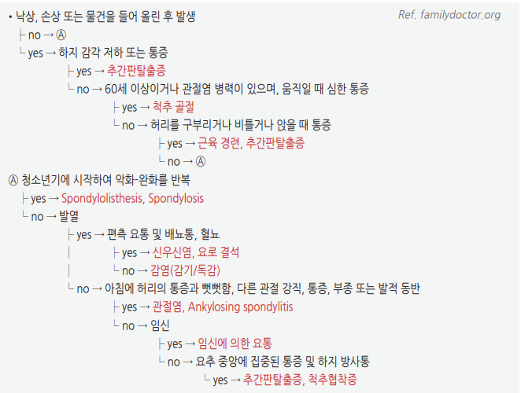
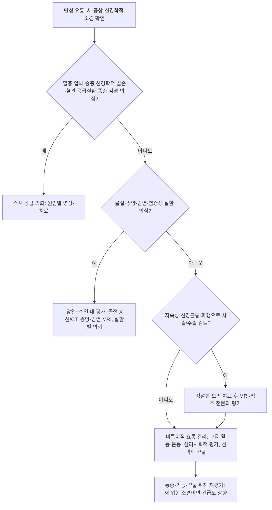

# 요통 Lower Back Pain

## <mark style="color:green;">일반 사항</mark>

* 정의 : 하부 늑골연(lower rib margin)과 둔부 주름(gluteal fold) 사이에 발생하는 통증으로, 하지 방사통을 동반하거나 동반하지 않을 수 있음(WHO 기준과 정합)
* lumbosacral spine 및 pelvic girdle의 통증을 포괄
* 다른 이름 : lumbago
* 대부분의 요통은 특정 원인 질환을 확인하기 어려운 비특이적(nonspecific) 요통(약 90%)임. 급성 비특이적 요통은 초기 4\~6주 동안 통증·기능이 크게 호전되는 경우가 많으나, 완전한 회복이 늦어지거나 증상이 지속·재발할 수 있으므로 경과에 맞춘 재평가가 필요함
* 유병률 : 전 세계 장애(disability)의 단일 원인 1위(GBD); 평생 유병률 60\~80%; 연령표준화 유병률은 여성(인구 10만 명당 9,330명)이 남성(5,520명)보다 높고, 약 85세경 최고치에 이름 [JAMA 2026]
* 기간 분류 : 이 챕터에서는 급성 ＜6주, 아급성 6\~12주, 만성 ＞12주로 통일함 [JAMA 2026]. ACP 2017은 급성 ＜4주, 아급성 4\~12주를 사용하므로 지침별 경계를 구분함

## <mark style="color:green;">원인</mark>

* 초진 요통의 약 90%는 비특이적 요통이며, 신경근병증·척추관협착증 등 특정 척추 질환과 구분함 [JAMA 2026]
* 원인별 빈도는 연령·골다공증·진료 환경에 따라 달라짐. 골절·감염·악성종양·축성 척추관절염·내장/혈관성 연관통의 빈도를 모두 일률적으로 1% 미만으로 간주하지 않음
* 임상적으로 다음과 같이 분류하여 접근함
  * 비특이적 요통 : 증상·진찰만으로 근육·인대·추간판·후관절 등 특정 통증 발생 구조를 확정하기 어려움
  * 신경근병증·척추관협착증 : 하지 방사통, 객관적 신경학적 이상 또는 신경성 파행을 평가함
  * 특정 척추 질환 : 압박골절·외상성 골절, 감염, 종양, 축성 척추관절염 등
  * 비척추성 원인 : 대동맥 질환, 신우신염·요로결석, 고관절 질환, 골반·복부 질환 등

#### <mark style="color:$primary;">요통 유발 질환들</mark>

* Spondylosis (척추굳음증) : 추간판·척추 종판·후관절 등의 퇴행성 변화; disc space narrowing, osteophyte, facet joint degeneration 등을 포함하며 영상 소견만으로 통증 원인을 확정할 수 없음
* Anterolisthesis (전방전위) : 아래 척추에 비하여 vertebral body의 전방 전위
* Spondylolisthesis (척추전방전위증) : 한 척추체가 인접 척추체에 대해 전방으로 전위된 상태; 원인에 따라 퇴행성(가장 흔함, 특히 고령), 협부형(isthmic, spondylolysis에 의한 2차적 전위), 선천성/이형성, 외상성, 병적 원인 등으로 구분; Meyerding 분류(Grade I\~V, 하위 종판 대비 전위 정도)로 중증도 평가
* Retrolisthesis (후방전위) : 바로 아래 척추에 비하여 vertebral body의 후방 전위
* Spondylolysis (척추용해증) : pars interarticularis의 결손 또는 피로골절로, 흔히 L5에 발생함
* Spinal stenosis (척추관협착증) : 골 또는 연조직에 의한 vertebral canal의 narrowing; 주로 facet joints에서의 골의 비후 및 ligamentum flavum의 비후에 의함
* Radiculopathy (신경근병증) : 신경근 기능 장애로 해당 신경근 분포의 감각 저하, 근력 저하 또는 반사 변화가 나타남; 신경근통(radicular pain)이 동반될 수 있으나 방사통만으로 객관적 신경근병증이 확정되는 것은 아님
* Sciatica (좌골신경통) : 주로 요천추 신경근에서 기원하여 둔부·하지로 뻗치는 통증을 지칭함. 모든 하지 연관통을 좌골신경통으로 분류하지 않으며, 감각 이상·근력 저하의 동반 여부를 별도로 평가함
* Cauda equina syndrome (말총증후군) : 척수 원뿔 아래 척추관 내 말총 신경근의 압박·손상으로 발생함. 큰 요추 추간판탈출증, 종양, 감염·경막외농양, 혈종, 외상성 병변 등이 원인이 될 수 있으며, 새로 발생한 배뇨·배변·성기능 변화, 회음부 감각 저하(saddle sensory change), 하지 위약을 평가함 - 신경외과적 응급

### <mark style="color:orange;">위험 인자</mark>

* 과거 요통, 연령, 유전적 요인, 만성 질환(예: 당뇨병)
* 비만, 흡연
* 직업적 노출 : 반복적인 무거운 물건 들기, 몸통 비틀기, 전신 진동 등; 특정 자세나 하이힐 착용만으로 원인을 단정하지 않음
* 부족한 신체 활동
* 활동 : 힘든 일, 장시간 앉거나 서 있기, 무거운 물건 들기, 허리 굽히기, 갑자기 비틀기
* 심리사회적 요인(yellow flags) : 낮은 직무 만족도, 우울·불안, 통증 관련 두려움-회피 신념(fear-avoidance belief), 낮은 자기효능감 등은 통증 지속·기능 제한과 관련됨. 영상 이상 유무와 관계없이 평가하며, 통증이 심리적 원인으로만 생겼다는 의미는 아님

## <mark style="color:green;">임상 양상</mark>

* 국소 통증, 척추 주위 근육 경련 및 압통
* 관절 가동 범위 감소
* 보통 활동 또는 특정 자세에서 통증 증가, 휴식 시 완화
* spinal structure(근육, 인대, facet joint & disk) : 대퇴부로 방사(무릎 아래는 드묾)
* facet : sacroiliac joint/ posterior superior iliac spine 부위로 방사
* sacroiliac : 대퇴부, 무릎 아래로 방사
* 요추 신경근 : 흔히 요통보다 하지통이 더 두드러짐; L1\~L3 - hip &/or thigh, L4\~S1 - knee 아래로 방사
* ✽구조별 방사통 위치는 서로 겹치는 경우가 많아, 통증 분포만으로 원인 구조(facet, SI joint, disk 등)를 단정할 수 없음 - 병력·신체검사·영상 소견을 종합하여 판단

### <mark style="color:$danger;">🚩 Red Flags!</mark>

<mark style="color:$danger;">**즉각 조치 또는 의뢰**</mark> <mark style="color:$danger;">- 생명 위협 또는 즉각적 위해 가능성</mark>

* Cauda equina syndrome 의심 소견 : 새로 발생한 배뇨 기능 변화(요저류, 배뇨곤란, 방광 충만·배뇨 감각 저하, hesitancy, 요실금 등 초기 변화 포함), 변실금·배변 기능 변화, 회음부·생식기 감각 저하 또는 성기능 변화, saddle anesthesia, 양측 또는 진행하는 하지 위약·마비, 보행 장애 → 경미하거나 비전형적으로 보이더라도 CES 초기 소견일 수 있으므로 지체 없이 응급 MRI 및 즉시 신경외과/정형외과 의뢰; 진단·수술이 지연되면 영구적인 방광·직장·성기능 장애 및 하지 마비 위험이 있어 압박이 확인되면 지체 없이 감압 수술을 시행
* 대동맥 응급질환 의심 : 갑작스럽고 심한 복부·등·요통에 실신, 저혈압·쇼크, 알려진 대동맥류 또는 혈관 위험 요인이 동반되면 복부 대동맥류(AAA) 파열 등을 의심하여 즉시 응급 평가. 박동성 복부 종괴가 없어도 배제되지 않음. 갑작스러운 흉통·등통증, 맥박/혈압 차이, 신경학적 증상은 대동맥박리 등 급성 대동맥증후군의 단서임
* 심한 외상 관련 발생(예: 교통사고, 고소 추락, 낙상) → 척추 골절·척수 손상 배제
* 척추 감염·경막외농양 의심 : 새로 발생한 심한 국소 척추통·압통에 발열, 최근 균혈증·감염·척추 시술, 정맥 주사 약물 사용 또는 면역저하 등이 동반되면 긴급 평가. 신경학적 결손, 패혈증 또는 경막외농양이 의심되면 즉시 응급 MRI·의뢰; 발열이 없거나 전형적인 3징후(요통·발열·신경학적 결손)가 모두 갖춰지지 않아도 배제되지 않음
* 급격히 진행하는 국소 신경학적 결손 또는 새로 발생한 중증 근력 저하 → 응급/긴급 영상 평가·척추 전문과 의뢰
* 현재 또는 과거 암 환자의 새 방사통, 감각 저하, 하지 위약, 보행 장애 또는 배뇨·배변 장애 → 전이성 척수/말총 압박 의심, 즉시 응급 의뢰; 의심되는 전이성 척수 압박은 MRI를 가능한 빨리, 24시간 이내 시행 [NICE NG234]

<mark style="color:$warning;">**당일~수일 내 평가**</mark>

* 면역억제제, 정맥 투여 약물(마약류 등) 사용력, 최근 감염 또는 시술력 → 척추 감염 위험 증가; 새로 발생한 심한 국소 척추통·압통이나 전신 증상과 결합되면 당일 평가(경막외농양이 의심되면 즉각 조치)
* 악성 종양 병력과 새로 발생한 지속성·진행성 척추통, 수면을 방해하는 야간통 또는 국소 압통 → 당일 전문과 상담·평가(24시간 이내). 신경학적 압박 증상이 없더라도 척추 전이가 의심되면 신속히 영상 계획(통상 MRI 1주 이내); 방사통·감각 이상·위약·보행/배뇨·배변 이상이 동반되면 즉각 조치로 상향 [NICE NG234]
* 설명되지 않는 체중 감소 등 암 의심 소견 → 다른 병력·진찰 소견과 함께 조기 평가
* 고령·골다공증·만성 steroid 사용 환자의 새 국소 요통, 경미한 외상 후 통증 또는 척추골 압통 → 압박골절 평가. 통증·외상·진찰 소견을 함께 판단하며 위험 인자만으로 모든 환자에게 긴급 영상을 시행하지 않음
* 지속적·진행성 야간통(누워도 완화되지 않음)이 암 병력, 체중 감소, 발열 등 전신 증상과 동반되는 경우
* ＜20세 또는 ＞55세에서 새로 시작된 요통이면서, 외상·골다공증·악성종양 병력·발열 등 전신 증상·진행성 신경학적 이상 등 다른 위험 요인이 동반되는 경우(연령 단독은 특이도가 낮아 다른 소견과 함께 판단)
* 당뇨병 또는 면역저하 환자에서 발열·균혈증 위험·심한 지속성 국소 척추통 등 척추 감염 의심 소견이 동반되는 경우; 발열·옆구리 통증·CVA tenderness·배뇨 증상이 동반되면 신우신염 등 비척추성 감염과의 감별도 함께 고려(당뇨·요로감염 자체만으로 모든 요통을 당일 의뢰할 필요는 없음)
* 흉추부 통증이 새로 동반되면 흉추 병변 등 평가. 갑작스러운 심한 흉통·등통증 또는 순환 불안정이 있으면 대동맥/심혈관 응급질환 가능성에 따라 즉각 조치

_✽Red Flag는 진단을 확정하는 항목이 아님. 개별 소견의 검사 후 확률(posttest probability)은 대상군의 사전 확률과 진료 환경에 따라 달라지므로 고정된 위험률로 적용하지 않음. 암 병력, 외상, 골다공증·steroid 사용 등과 새 통증·진찰 소견을 종합하여 판단함_

<mark style="color:$info;">**외래 추적 / 추가 평가 계획**</mark> <mark style="color:$info;">- 즉각 위험 낮으나 호전 없으면 의뢰</mark>

* 표준적 보존 치료(활동 유지, NSAID 등) 4\~6주 후에도 호전이 없는 경우
* 전신 질환이 동반되면 해당 질환·약물과 요통의 연관성을 평가. 발열·순환 불안정·감염/종양 의심 또는 새로운 배뇨·배변/신경학적 변화가 있으면 해당 긴급도에 맞춰 상향함
* 심리사회적 위험 요인(우울, 불안, 낮은 직무 만족도, fear-avoidance belief) 동반 시 → 만성화 위험 평가(☞ 위험도 계층화) 및 필요시 개입

## <mark style="color:green;">진단</mark>

### <mark style="color:orange;">신체검사</mark>

✽[Low back muscle(3D)](https://www.innerbody.com/anatomy/muscular/lower-torso)

* 걸음걸이, 자세, 얼굴 표정
* 운동 범위
* 근육 압통, spasm, 위축
* 반사, 강도, 감각
* 맥박(말초 혈관 질환 감별)
* Disk herniation 평가
  * slump test : 앉은 자세에서 흉요추·경부를 굴곡하고 무릎을 펴며 발목을 배측굴곡하여 평소의 하지 방사통을 재현하는지 확인함; 경부 굴곡을 풀었을 때 증상 변화도 평가함. 단순 햄스트링 당김만으로 양성 판정하지 않음
  * straight leg raise(SLR) test : 바로 누운 자세에서 무릎을 편 채 고관절을 수동 굴곡함. 약 30\~70°에서 평소의 하지 방사통(흔히 무릎 아래로 내려가는 통증)이 재현되면 양성; 요통이나 햄스트링 당김만으로 판정하지 않음. 발목 배측굴곡은 신경 긴장을 증가시키는 추가 조작으로 활용함(민감도 高, 특이도 低)
  * crossed(대측) SLR test : 반대측 다리 거상 시 환측 하지에 통증 재현 → 추간판탈출증에 대해 특이도 高(민감도는 낮음)
* Cauda equina syndrome 의심 시
  * 회음부·생식기 감각, 새로 발생한 성기능 변화, 하지 근력·감각을 평가; anal wink reflex 등 부가 검사를 시행하더라도 응급 MRI·의뢰를 지연하지 않음
  * post-void residual(PVR) bladder scan : 요저류 여부를 평가하는 보조 검사. PVR ≥200㎖이면 CES 가능성이 높아지나, 낮은 PVR만으로 CES를 배제할 수 없음 - 임상적으로 의심되면 PVR 결과와 무관하게 응급 MRI를 우선함
  * digital rectal exam(항문 괄약근 tone)은 필수 선별 검사가 아니며 정상 소견만으로 CES를 배제할 수 없음; 검사·PVR 확인보다 응급 의뢰를 우선
* 고관절 평가 : FABER test, FADIR test
* Stork test (single-leg hyperextension test) : 한쪽 다리로 서서 허리를 신전; 국소 통증 재현 시 spondylolysis(pars 결손) 시사하나 진단 정확도는 충분히 높지 않아 양성이어도 확진할 수 없으며, 임상적 의심 시 영상 검사와 함께 해석
* Gillet test : 서서 한쪽 고관절을 굴곡시킬 때 동측 PSIS와 천골의 상대적 움직임을 촉진하는 SI joint 운동성 검사. 검사자 간 재현성·타당도가 제한적이므로 비대칭만으로 SI joint 기능 이상이나 통증 원인을 진단하지 않음(single-leg hyperextension test와 평가 목적이 다름)
* Waddell signs : 진찰 중 비전형적인 통증·행동 반응을 기술하는 보조 소견. 기질적 질환을 배제하거나 꾀병·심리적 원인을 확정하는 검사가 아니며, 통증 경험·기능·심리사회적 요인을 폭넓게 평가하는 단서로만 활용함

### <mark style="color:orange;">위험도 계층화</mark>

* STarT Back Screening Tool 등 검증된 위험도 계층화 도구를 초진 시 활용 고려(NICE NG59) - 신체적 요인(통증 부위·방사통 여부·기능 제한)과 심리사회적 요인(두려움-회피 신념, 우울·불안, 파국적 사고)을 함께 평가하여 저위험/중위험/고위험군으로 구분
* 이러한 도구들의 판별력은 제한적(C statistic 0.59\~0.71 수준)이며, 단독으로 치료 결정을 내리기보다 임상적 판단을 보완하는 용도로 사용 [JAMA 2026]
* 저위험군 : 안심 및 활동 유지 교육 위주의 최소 개입
* 중위험군 : 운동·재활 프로그램 병행
* 고위험군(심리사회적 위험 요인 뚜렷) : 환자별 평가에 따라 운동·재활과 심리적 개입을 포함한 다학제적 접근 고려 [WHO 2023; ACP 2017]
* 지침 구분 : NICE는 2026년 7월 심리치료 및 운동·심리 통합 프로그램의 기존 권고를 일부 근거의 철회(retraction)를 이유로 철회함. 이를 현재 NICE 권고로 인용하지 않으며, WHO 2023 등의 관련 권고와 구분함. 권고 철회 자체가 심리치료 전반의 금기 또는 비효과 판정을 뜻하는 것은 아님

### <mark style="color:orange;">영상 검사</mark>

* 대부분 필요 없음
  * 무증상 성인에서도 추간판 퇴행·돌출 등 영상 이상이 흔하고 연령에 따라 증가함. 영상 소견을 통증 원인으로 단정하지 않되, 증상·진찰과 일치하는 신경근 압박·골절·감염·종양 소견의 임상적 의미는 구분함
  * 대부분의 요통은 심각한 문제가 아니며 초기 치료가 동일함
  * 영상 검사 없이 환자의 증상/병력, 진찰 소견에 집중하는 것이 더 유익할 수 있음
* 중대한 원인이 의심되거나 결과가 치료 방침을 바꿀 경우 적응증에 맞춰 시행 [ACR Appropriateness Criteria; NICE NG59]
  * MRI(해당 적응증에서 1차 선택) : cauda equina syndrome, 진행하는 신경학적 결손, 감염·종양 의심, 약 6주 이상의 신경근병증에서 시술·수술을 고려하는 경우 - 연부조직·신경근·경막외 공간 평가에 우수; 감염·종양 의심 시 필요한 조영 여부는 전문과·영상의학과와 결정
  * 단순 X선 : 골다공증성 압박골절 등 골절 의심 시 초기 평가에 고려. CT : 고에너지 외상 후 골절·골성 구조 평가에 유용; MRI 금기 시 신경조직 평가의 단순 대체가 되는 것은 아니며 적응증에 따라 CT 척수조영술 등을 전문과와 논의
  * 단순 비특이적 요통이나 합병되지 않은(uncomplicated) 신경근병증에서는 초기 영상 검사가 불필요함. 4\~6주 이상 지속된다는 이유만으로 MRI를 자동 시행하지 않으며, 새 위험 소견·기능 변화·시술/수술 필요성을 재평가함

### <mark style="color:orange;">실험실 검사</mark>

* 단순 비특이적 요통에는 일상적인 혈액검사가 필요하지 않음
* 감염·종양·염증성 질환 등 의심 시 CBC, ESR, CRP 등 선택 검사; ESR/CRP 정상만으로 중대한 질환을 모두 배제하지 않음
* 척추 감염·균혈증 의심 시 혈액배양 및 MRI·전문과 평가를 고려하고, 패혈증/신경학적 악화 시 검사 때문에 응급 치료를 지연하지 않음
* 요로 원인 의심 시 요검사·요배양, 골수종 의심 시 빈혈·신기능·칼슘과 단백전기영동 등 질환별 검사를 선택함

### <mark style="color:orange;">감별 진단</mark>

* 병력의 핵심 특징(발생 계기, 방사통 여부, 발열·전신 증상 동반, 연령, 임신 여부 등)에 따라 원인 질환을 감별

***

<figure><figcaption><p>병력 기반 요통 감별 흐름도</p></figcaption></figure>

***

### <mark style="color:orange;">주요 원인 감별</mark>

<table>
<thead><tr><th>양상</th><th>주요 단서</th></tr></thead>
<tbody>
<tr><td>비특이적 mechanical LBP</td><td>자세·활동에 따라 변화, 국소 근육 압통·경직, 신경학적 결손 없음</td></tr>
<tr><td>Disc herniation / radiculopathy</td><td>하지 방사통 동반, 앉을 때 악화되는 경향, dermatomal sensory change, SLR(+)</td></tr>
<tr><td>Spinal stenosis</td><td>보행·신전 시 악화(neurogenic claudication), 앉거나 앞으로 굽히면 호전; 혈관성 파행과 감별</td></tr>
<tr><td>Compression fracture</td><td>고령·골다공증·외상력, 국소 척추 압통, 급성 발생</td></tr>
<tr><td>Inflammatory back pain (예: 축성 척추관절염)</td><td>젊은 연령, 아침 강직, 운동으로 호전, 휴식으로 악화</td></tr>
<tr><td>Infection / malignancy</td><td>발열·체중 감소 등 전신 증상, 지속성 야간통, 면역억제·암 병력 등</td></tr>
</tbody>
</table>

✽개별 질환의 증상은 서로 겹치는 경우가 많아 이 표만으로 확진할 수 없으며, 병력·신체검사·필요시 영상 검사를 종합하여 판단\
Ref. AAFP 2007;75(8):1181-1188; NICE NG59; Conn's Current Therapy 2017(구성 참고)

**신경성 파행 vs 혈관성 파행 감별 팁**

* 자세 의존성 : 신경성(척추관협착)은 앉거나 허리를 앞으로 굽히면 호전하는 경향(장바구니를 밀며 걷기·자전거 타기가 상대적으로 편함); 혈관성은 보행 거리·강도와 관련되며 자세 의존성이 덜함
* 정지 시 호전 : 신경성은 서 있기만 하면 지속되고 앉거나 굽힐 때 호전하는 경향; 혈관성은 멈춰 서 있기만 해도 수분 내 호전하는 경향. 개별 증상만으로 확진하지 않음
* 맥박 : 혈관성에서 말초 맥박 감소/소실이 있을 수 있으나 정상 맥박만으로 말초동맥질환을 배제하지 않음. 임상적으로 의심되면 ABI 등 평가; 척추관협착증과 말초동맥질환이 함께 있을 수 있음
* 급성 심한 요통·옆구리 통증과 실신·저혈압 등은 파행 감별과 별개로 대동맥 응급질환을 평가함(☞ Red Flags)

**염증성 요통 평가**

* 45세 이전 시작, 3개월 이상 지속되는 요통에 운동으로 호전·휴식으로 악화, 야간통, 아침 강직, 교대성 둔부통 등이 있으면 축성 척추관절염을 고려함
* 건선·포도막염·염증성 장질환·말초 관절염/부착부염·가족력을 확인하고, 의심이 지속되면 류마티스내과 의뢰. 단순 X선·ESR/CRP 정상 또는 HLA-B27 음성만으로 배제하지 않음 [NICE NG65]

***


```mermaid
flowchart TD
    A["만성 요통: 새 증상·신경학적 소견 확인"] --> B{"말총 압박·중증 신경학적 결손·혈관 응급질환·중증 감염 의심?"}
    B -->|예| C["즉시 응급 의뢰: 원인별 영상·치료"]
    B -->|아니오| D{"골절·종양·감염·염증성 질환 의심?"}
    D -->|예| E["당일~수일 내 평가: 골절 X선/CT, 종양·감염 MRI, 질환별 의뢰"]
    D -->|아니오| F{"지속성 신경근통·파행으로 시술/수술 검토?"}
    F -->|예| G["적절한 보존 치료 후 MRI·척추 전문과 평가"]
    F -->|아니오| H["비특이적 요통 관리: 교육·활동·운동, 심리사회적 평가, 선택적 약물"]
    G --> H
    H --> I["통증·기능·약물 위해 재평가: 새 위험 소견이면 긴급도 상향"]
```

<p align="center"><strong>만성 요통 환자에 대한 진단 및 관리 알고리듬</strong></p>

<p align="center"><em>Ref. NICE NG59·NG234, ACR Appropriateness Criteria, WHO 2023을 바탕으로 재구성함.</em></p>


본 알고리듬은 red flag·골절·신경학적 증상 배제를 통한 기본 골격을 보여줌. WHO의 2023년 만성 원발성 요통(chronic primary low back pain) 가이드라인은 여기에 더해 생물심리사회적(biopsychosocial) 평가, 구조화된 운동 치료, 필요시 심리적 개입을 포함한 다학제적 접근을 강조함(☞ 위험도 계층화)


***

## <mark style="background-color:$warning;">Management</mark>

### <mark style="color:orange;">치료 방침</mark>

* 경고 징후가 없는 경우 환자를 안심시킴 : 대부분의 급성 비특이적 요통은 시간이 지나며 호전됨
* 적당한 육체 활동 권고 : 대부분의 경우 침상 안정보다 활동이 효과적임
* 약물 치료 : 급성 비특이적 요통으로 기능 제한이 있으면 금기·상호작용 확인 후 NSAID를 최소 유효 용량·최단 기간 고려. 만성 비특이적 요통에서는 교육·활동·구조화된 운동과 필요시 심리적 개입·통합 재활이 우선이며, 약물은 기능 개선이 불충분할 때 개별적으로 고려. Acetaminophen 단독은 효과 근거가 부족함
* 초진 시 위험도 계층화(☞ 위험도 계층화)를 통해 치료 강도를 조절
* 4주 이상 지속되는 경우 재평가

## <mark style="color:green;">비-약물 치료 및 예방</mark>

* 정상 체중 유지
  * ✽이는 예방적 위험 인자 관리 차원이며, 이미 발생한 만성 요통의 치료 수단으로서 약물적 체중감량을 사용하는 것은 권장되지 않고(조건부 권고, 반대), 비약물적 체중감량의 치료 효과는 근거가 불충분함(권고 보류) [WHO 2023]
* 운동, 활동 : 통증·기능에 맞춰 규칙적인 신체 활동을 유지하고 점진적으로 늘림. 운동 중 일시적인 경미한 통증 증가만으로 활동을 모두 중단하지 않되, 새 위약·지속적인 하지 방사통 악화 등은 재평가함
  * 코어 강화를 포함한 다양한 운동을 지속 가능한 형태로 선택
  * 획일적인 빈도·강도보다는 유산소 운동, 근력·코어 강화, 유연성 운동 등을 환자가 꾸준히 지속할 수 있는 형태로 개별화하여 시행하는 것이 권장됨; 가벼운 스트레칭조차 증상 개선에 도움이 될 수 있음
  * 걷기·가벼운 스트레칭·수중 운동 등에서 시작하여 선호와 기능에 따라 점진적으로 증량함. 굽히기·젖히기·비틀기를 모든 환자에게 일률적으로 금지하지 않으며, 골절 위험이나 증상을 악화시키는 특정 동작은 개별 조절함
  * 저강도 운동 : 몸통 신전근, 복근 또는 허리 강화 재활 운동, 유산소 운동, crunch exercise
  * McKenzie 운동(방향 선호에 따른 반복 운동) : 일부 환자에서 고려할 수 있으나 모든 추간판탈출증 환자에게 획일적으로 적용하지 않음. 골절 등 구조적 위험을 먼저 평가하고, 하지 통증의 말초화·근력 저하 등 신경학적 악화가 있으면 중단·재평가
* 스트레스 완화 : 우울증 등 동반된 심리적 문제 해결
* 자세 교육 : 무거운 물건 드는 방법, 좋은 자세 교육
* 금연
* 찜질 : 표재성 온열은 급성·아급성 요통의 단기 통증 완화에 고려함 [ACP 2017]. 냉찜질의 효과 및 냉·온찜질 간 비교 근거는 불충분하므로 효과가 같다고 단정하지 않음. 피부에 직접 고온·냉원을 대지 않고 감각 저하가 있으면 특히 화상·동상을 주의함 [Cochrane]
* 도수치료(manual therapy) : 운동을 포함한 치료 패키지의 일부로 고려 [NICE NG59, 2026 문구 개정]; 골절·감염·종양 또는 진행성 신경학적 결손이 의심되면 원인 평가를 우선함
* 허리 지지대, 신발 깔창, rocker-sole 신발, 견인(traction), 초음파, TENS/PENS, 간섭파 치료 : 효과에 대한 근거가 부족하여 일상적으로 권장되지 않음(NICE NG59)
* 이동 제한이 동반된 경우, 개인별 평가에 기반하여 지팡이·보행기 등 적절한 이동 보조기구 제공을 고려(good practice statement) - 위의 허리 지지대·벨트와는 구분되는 권고임에 유의 [WHO 2023]
* 침술(needling therapy) : 가이드라인 간 권고가 상충함 - NICE NG59는 효과 근거 부족을 이유로 권장하지 않는 반면, WHO의 만성 원발성 요통(CPLBP) 특화 가이드라인(2023)은 조건부로 권고함(사용, 낮은 근거 수준); 시행할 경우 항응고제 복용 환자(특히 고령자)에서 삽입 부위 출혈 위험에 주의하고, 단독 치료가 아닌 생물심리사회적 평가에 기반한 치료 패키지의 일부로 고려 [NICE NG59; WHO 2023]

* 물리치료·재활은 구조화된 운동·자가관리 교육과 기능 회복을 중심으로 구성함. 초음파·전기치료 등 수동적 처치만 장기간 반복하는 방식은 권장하지 않음

## <mark style="color:green;">약물 치료</mark>

* 급성 비특이적 요통 : 활동·자가관리 교육과 함께 기능 제한이 있으면 금기 확인 후 NSAID를 최소 유효 용량·최단 기간 고려하고 수일\~1주 내 효과·부작용 재평가. Acetaminophen 단독을 NSAID 금기의 표준 대체 요법으로 제시하지 않음; 다른 진통 목적이나 선택적 보조 사용은 효과·위해를 설명하고 개별 판단함 [NICE NG59]
  * NSAID에 근이완제나 acetaminophen을 일률적으로 추가하지 않음. 근이완제는 근경련이 뚜렷한 경우 단기 선택을 고려하되, NSAID 병용으로 추가 효과가 보장되는 것은 아니며 진정·낙상 위험을 평가함

### <mark style="color:orange;">NSAID</mark>

(☞ [통증](../220_/001_-pain.md#nsaid))

* 제제에 따른 일반적 효과 차이는 없으나 환자에 따른 차이는 있음; radicular Sx(좌골신경통)에는 근거가 제한적 - 사용 시 최소 유효 용량으로 최단 기간
* NSAID 간 비교 효과의 차이는 대체로 작으며 위장관·신장·심혈관 위험, 상호작용과 비용을 기준으로 선택함
* 활동성 위장관 출혈/궤양, 중증 신장애, 탈수, 심부전·심혈관질환 등을 확인하고 고위험군에서는 회피 또는 대안을 고려함. 필요시 PPI 위장보호를 병용하되 신장·심혈관 위험까지 예방하는 것은 아님
* NSAID 두 종류를 중복 처방하지 않음. 항응고제·항혈소판제, ACE 억제제/ARB+이뇨제 병용 등에서는 출혈·급성 신손상 위험을 점검함
* ibuprofen : 성인의 경증\~중등도 통증에서 200\~400 ㎎ 1일 3\~4회 \[부루펜정]. 국내 허가사항의 일부 염증성 질환 용법은 1회 200\~600 ㎎ 1일 3\~4회, 1일 최고 3,200 ㎎이나 이를 요통의 목표 용량으로 사용하지 않음
* naproxen : 흔히 250\~500 ㎎ bid \[낙센/낙센에프]. 골격근장애의 국내 허가 용법은 초회 500 ㎎ 후 6\~8시간 간격 250 ㎎, 최대 1,250 ㎎/d이며 적응증·증상에 따라 조정함
* aceclofenac : 100 ㎎ bid \[에어탈]
* celecoxib : 200 ㎎ qd 또는 100 ㎎ bid는 골관절염·강직척추염의 국내 허가 용법 \[쎄레브렉스캡슐]. 만성 비특이적 요통 자체는 국내 허가 효능에 명시되어 있지 않아 해당 목적으로의 사용은 허가 외 사용으로 구분함. 급성 통증 허가 용법과도 구분하며 심혈관질환·심부전·임신 등 제품별 금기를 확인함

### <mark style="color:orange;">Acetaminophen</mark>

* NICE NG59는 요통에서 acetaminophen 단독 사용을 권장하지 않음. WHO 2023은 만성 원발성 요통에 직접 적용되는 시험이 없어 공식 권고를 내리지 않음(no recommendation). 급성 비특이적 요통에서는 위약보다 유효하지 않았음
* 별도 적응증 또는 개별 판단으로 사용할 경우 제형을 명시함 : 속방형 500\~1,000 ㎎ 필요시 q4\~6h(모든 제제 합산 최대 4,000 ㎎/d); \[타이레놀8시간이알서방정 650 ㎎]은 1회 2정(1,300 ㎎) q8h, 최대 6정(3,900 ㎎)/d이며 쪼개거나 씹지 않음. 고령·저체중·간질환·음주 등에서는 더 낮은 한도 또는 회피를 개별 결정함

### <mark style="color:orange;">근이완제</mark>

* 급성 요통에서 기대되는 이득은 작고 근거의 확실성이 제한적이며, 만성 원발성 요통에서는 WHO 2023이 일상적 사용에 조건부 반대 권고함
* 대상 : 근경직·근경련이 뚜렷한 급성(아급성 포함) 비특이적 요통에서 단기간 선택적으로 고려; 만성 요통에서는 일상적 사용 근거가 부족
* 부작용 : 졸음, 어지럼, 구역
* afloqualone : 20 ㎎ tid \[아로베스트]
* eperisone : 50 ㎎ tid \[에페신]
* cyclobenzaprine : 국내 서방형 \[본렉스이알캡슐] 15 ㎎ qd, 필요시 30 ㎎ qd; 2\~3주 이상 장기 투여하지 않음. 고령자·간장애 환자에는 투여하지 않으며, 부정맥·심부전·심전도 전도장애·갑상선항진증·MAO 억제제 병용 등 금기를 확인함. 해외 속방형 5\~10 ㎎ tid 용량을 이 제품에 적용하지 않음
* tizanidine : 1\~2 ㎎ tid 식후 \[티자리드]. Ciprofloxacin·fluvoxamine 병용은 금기이며, 저혈압·서맥·졸음·간기능 이상에 주의함; 고령·신기능 저하 시 감량을 고려함

### <mark style="color:orange;">Benzodiazepine</mark>

* 급성 비특이적 요통에 대한 효과 근거가 매우 제한적이므로 요통 치료 목적으로 일상적으로 사용하지 않음. 좌골신경통에는 NICE NG59가 위해·이득을 고려하여 사용하지 않도록 권고함
* 다른 독립적인 적응증으로 이미 사용 중이면 진정·낙상·의존 위험을 평가하고, opioid·다른 진정제와의 병용을 특히 주의

### <mark style="color:orange;">Opioid</mark>

* 대상 : NSAID가 금기이거나 내약성이 없거나 충분한 효과가 없고 다른 대안이 적절하지 않은 심한 급성 통증에 한하여, 매우 단기간 고려; 급성 좌골신경통에서 opioid의 효과에 대한 근거는 불충분함
* 만성 요통 및 만성(＞12주) 좌골신경통에서는 장기적 이득에 대한 근거가 부족하고 의존·오남용 위험이 있어 사용을 권장하지 않음(NICE NG59; WHO 2023 만성 원발성 요통 가이드라인도 만성 요통에서 opioid를 권장하지 않음)
* 투여 기간 : 필요한 최소 기간(가능하면 수일)만 처방하고 조기 재평가; 지속이 필요하면 통증·기능 개선과 부작용·의존 위험을 다시 평가
* tramadol 속방형 : 성인에서 50 ㎎ 필요시 q6h로 시작을 고려하고 반응·내약성에 따라 조정, 1일 최대 400 ㎎ \[트리돌캡슐50㎎]; 고령·신장애·간장애에서는 투여 간격과 용량을 개별 조정

  * acetaminophen 복합제 \[울트라셋/세미]는 각 성분의 총량과 중복 복용에 주의. SSRI/SNRI/TCA 등 세로토닌성 약물과 병용 시 세로토닌증후군·경련 위험, benzodiazepine·음주 등과 병용 시 과도한 진정·호흡억제 위험을 점검함

### <mark style="color:orange;">항경련제 (Anticonvulsants)</mark>


gabapentin, pregabalin 등 gabapentinoid 계열 및 기타 항경련제는 최근 근거(NICE NG59 2020 개정, 다수의 체계적 문헌고찰)에서 좌골신경통·신경근병증에 대한 유의한 효과가 확인되지 않았고, 졸림·어지럼 등 이상반응 위험은 증가하는 것으로 나타나 요통·좌골신경통 치료 목적으로 일상적으로 권장하지 않음(NICE는 요통·좌골신경통 모두에서 항경련제 사용을 권장하지 않음).


* 항경련제(topiramate 등)를 요통·신경근병증에 사용하는 것에 대한 근거는 확립되어 있지 않음
* 단, 요통·좌골신경통과는 별개로 확립된 말초 신경병증성 통증 적응증(예: 당뇨병성 신경병증)이 동반되어 있다면 해당 질환의 치료 지침에 따라 사용할 수 있음 - 요통·좌골신경통 자체의 치료를 위해 시범 투여하는 것과는 구분

### <mark style="color:orange;">항우울제</mark>

(☞ [항우울제](../231_/213_-antidepressants-and-anxiolytics.md))

* 항우울제에는 항우울 작용과 별개의 진통 효과가 있음; SNRI, TCA
* 순수 비특이적 축성(axial) 요통 자체를 치료할 목적의 SSRI/SNRI/TCA 일상적 사용은 권장되지 않음(NICE NG59; WHO 2023의 만성 원발성 요통 권고). 다만 ACP는 만성 비특이적 요통에서 비약물 치료 후 duloxetine을 후속 선택지로 제시하며, 효과는 작고 부작용을 고려해야 하므로 지침 간 차이를 구분
* 대상 : 명확한 우울·불안 등 정신건강 적응증이 있거나, 별도의 신경병증성 통증 요소가 동반된 경우 해당 적응증에 따라 사용(✽만성 통증 환자에서 흔히 우울증이 동반됨); 신경병증성 통증 등 별도의 승인·근거가 있는 적응증에서의 진통 효과는 항우울 효과와 별개로 나타날 수 있음
* 투여 중 부작용 등 위해보다 효과와 필요성이 더 우월한지 여부를 정기적으로 평가
* duloxetine : 선택 시 30 ㎎ qd로 시작, 내약성 양호 시 1주 후 60 ㎎ qd로 증량 \[듀로셉톨캡슐]. 만성 비특이적 요통 자체에 대한 사용은 국내 허가 외 사용임; 국내 허가는 주요우울장애·범불안장애·당뇨병성 말초 신경병증성 통증·섬유근육통·NSAID 반응 불충분 골관절염 통증이며, 급여 여부는 해당 진단·기준에 따라 별도 판단함

### <mark style="color:orange;">전신 Steroid 및 경막외 주사</mark>

* 경구 steroid는 좌골신경통에 일상적으로 사용하지 않음 [NICE NG59]; 만성 원발성 요통에서도 전신 glucocorticoid의 일상적 사용에 조건부 반대 권고함 [WHO 2023]
* 경막외 steroid 주사는 전신 steroid와 적응증·근거가 다름. 단순 축성 요통의 표준 치료로 제시하지 않으며, 급성 중증 좌골신경통 등 선택적 적용은 전문과 평가 후 결정함(☞ 시술 및 기타 처치)

### <mark style="color:orange;">Herbal therapy</mark>

* WHO 2023의 만성 원발성 요통 대상 권고 : 국소 Capsicum(고추, cayenne pepper)은 조건부 사용 권고(낮은 근거 수준); 피부 자극 가능성을 설명함. 급성 요통·신경근병증 전반으로 효과를 확대 해석하지 않음
* Devil's claw(악마의 발톱), White willow(버드나무 껍질) : 조건부 권고(사용하지 않음) - 작은 이득이 불확실한 위해와 비교할 때 근거가 불충분함 [WHO 2023]

## <mark style="color:green;">시술 및 기타 처치</mark>

* 경막외 스테로이드 주사(ESI)/선택적 신경근 주사 : NICE NG59는 급성 중증 좌골신경통에서 국소마취제+steroid 경막외 주사를 고려하도록 함. 보존적 치료 실패를 반드시 기다려야 하는 것은 아니며, 진행성 위약·말총증후군의 응급 평가를 대신하지 않음
  * AAN 2025 근거 검토에서는 신경근병증의 단기(≤3개월) 통증·장애 개선이 제한적으로 확인되었으나 장기 통증 개선 근거는 불충분함. 요추 협착증에서는 일부 장애 개선 가능성이 있으나 단기 통증 개선은 확인되지 않음
  * NICE는 중심성 척추관협착증의 신경성 파행에 경막외 주사를 사용하지 않도록 권고함. BMJ 2025 지침은 만성(≥3개월) 비암성·비염증성 축성·신경근성 척추통에서 경막외 주사를 강하게 권고하지 않음; 이는 급성 중증 좌골신경통 권고와 적용 범위가 다름
  * 반복 주사를 자동 계획하지 않으며 목표·단기 효과·누적 steroid 위해를 재평가함. 감염, 출혈 위험·항혈전제 관리, 일시적 고혈당 및 드문 중증 신경학적 합병증 등을 시술 전 설명함
* Radiofrequency denervation : NICE NG59는 비수술적 치료 실패, medial branch 지배 구조에서 기원한 중등도\~중증 국소 만성 요통, 진단적 medial branch block 양성 반응이 있을 때 선택적으로 고려함. BMJ 2025는 만성 비암성·비염증성 축성 척추통에서 관절 고주파 치료에 강한 반대 권고를 제시하므로, 지침 차이와 효과의 불확실성을 설명하고 전문과에서 개별 판단함
* 골다공증성 압박골절의 vertebroplasty/kyphoplasty : 비특이적 요통에 시행하는 시술이 아님. Vertebroplasty는 여러 sham-controlled 연구에서 일관된 임상적 이득을 보이지 못했으며, 그 결과를 kyphoplasty에 동일하게 적용하지 않음. NICE TA279는 최적 통증 관리에도 심한 통증이 지속되는 최근의 미유합 골절이고 진찰·영상에서 해당 골절 부위와 통증이 일치하는 경우에 한해 선택지로 제시함. 척추 전문과 평가와 함께 골다공증 치료·이차 골절 예방을 시행함
* 수술적 치료 의뢰 : 말총증후군(응급), 새 중증 또는 진행하는 근력 저하(긴급), 적절한 보존적 치료 후에도 통증·기능 제한이 심한 좌골신경통이나 증상성 척추관협착증. 보통 약 6주 이상 지속되는 경우 영상·수술 필요성을 검토하되, 모든 환자에서 6\~12주를 반드시 기다리는 기준은 아님
* 좌골신경통의 감압수술 검토 시 증상·진찰과 영상 병변의 일치 여부를 확인함. 단순 비특이적 축성 요통에 척추 유합술·인공 추간판 수술을 일상적으로 제시하지 않음 [NICE NG59]

***

### <mark style="color:red;">질병코드</mark>

* M54.56 요통, 요추부 Low back pain, lumbar region

* M54.46 좌골신경통을 동반한 요통, 요추부 Lumbago with sciatica, lumbar region

* 요추부·요천부 등 실제 부위와 KCD-9의 포함·제외 항목을 확인하여 세부 코드를 선택함. 단순 하지 연관통만으로 M54.46을 자동 적용하지 않으며, 신경근병증을 동반한 추간판장애 등 원인 질환이 확인되면 해당 질환 코드(예: M51.1 계열)의 적용을 검토함. 같은 상태를 중복 코딩하는 것은 피하되, 임상적으로 서로 다른 동반 질환까지 단일 코드로 제한하지 않음

***

## <mark style="color:purple;">처방례</mark>

> **처방례 1. 급성 비특이적 요통에서 약물이 필요한 경우**
>
> ```
> 낙센에프정 500 ㎎/T  2T #2
> 아로베스트정 20 ㎎/T  3T #3 (근경련이 뚜렷할 때만 단기 선택 병용)
> ```
>
> _✽NSAID가 필요한 급성 비특이적 요통의 예시. Naproxen은 250 ㎎ bid 등 더 낮은 유효 용량부터 조정할 수 있으며, 근이완제는 자동 병용하지 않음. Afloqualone의 통상 용량은 20 ㎎ tid이며 연령·증상·진정 부작용에 따라 감량함. 수일\~1주 내 효과·부작용을 재평가하고, 침상안정보다 일상 활동 유지를 권고함_

> **처방례 2. 만성 비특이적 요통에서 약물 치료가 필요한 경우**
>
> ```
> 부루펜정 400 ㎎/T  1T 필요시, 1일 3회 이내 (단기간)
> ```
>
> _✽교육·활동 유지·구조화된 운동을 우선 시행하고, 기능 제한이 지속될 때 금기·상호작용 확인 후 단기간 NSAID를 고려하는 예시. 위장관·신장·심혈관 위험을 평가하고 정기적으로 중단 가능성을 재평가. 우울증이나 수면장애가 동반되면 별도 평가·치료하며, 단순 불면 또는 요통을 이유로 TCA를 자동 추가하지 않음_

> **처방례 3. 급성 좌골신경통에서 단기 진통을 시도하는 경우**
>
> ```
> 낙센에프정 500 ㎎/T  2T #2
> ```
>
> _✽좌골신경통에서 NSAID의 효과 근거는 제한적이므로, 금기·위해를 확인한 후 단기 반응을 평가하는 예시임. NSAID 반응이 부족하다는 이유만으로 tramadol이나 gabapentinoid를 자동 추가하지 않음. 급성 중증 좌골신경통에서는 전문과 평가·경막외 주사 등 선택지를 논의하며, opioid는 다른 대안이 적절하지 않은 예외적 상황에서 매우 단기간 개별 판단함. 약 6주 이상 지속되어 시술·수술을 검토하면 MRI·전문과 의뢰를 고려하고, 새 중증/진행성 결손이나 말총증후군 소견은 즉시 긴급 평가함_

***

### <mark style="color:$success;">핵심 복약 지도</mark>

> **NSAID 복용 시 이렇게 안내하세요**
>
> 1. 가능한 최소 유효 용량으로 최단 기간만 사용하도록 안내합니다.
> 2. 위장 장애, 신기능 저하, 심혈관 위험 인자(고혈압, 심부전, 신질환)가 있는 환자에서는 특히 주의하고, 필요시 위장보호제를 병용합니다.
> 3. 복용 중 흑색변, 심한 속쓰림, 부종·소변량 감소가 있으면 즉시 중단하고 내원하도록 안내합니다.

> **근이완제·benzodiazepine·opioid 사용 시**
>
> 1. 졸음, 어지럼을 유발할 수 있어 운전·기계 조작에 주의하도록 안내합니다.
> 2. 정해진 짧은 기간만 사용하며, 특히 opioid·benzodiazepine은 지속 투여 전 효과·부작용과 의존 위험을 다시 평가하도록 안내합니다.
> 3. 술과 함께 복용하지 않도록 안내합니다. Opioid와 benzodiazepine 등 진정제의 병용은 과도한 졸음·호흡억제 위험이 있으므로 처방된 약과 다른 약·건강기능식품의 복용을 알리도록 합니다.

> **활동에 대한 안내**
>
> 1. 침상 안정은 오히려 회복을 늦출 수 있으므로, 통증이 허용하는 범위 내에서 평소 활동을 유지하도록 권고합니다.
> 2. "통증이 있다고 해서 반드시 손상이 진행되고 있는 것은 아니다"라는 점을 설명하여 불필요한 두려움-회피 행동을 줄입니다.

> **언제 다시 병원을 방문해야 하나요?**
>
> * 수일\~1주 내 약물 효과나 부작용을 점검하고, 4\~6주간 활동·운동 등 보존적 치료에도 호전이 없는 경우 재평가
> * 새로 발생한 **배뇨 감각·소변줄기 변화, 소변·대변 조절 장애, 회음부·생식기 감각 또는 성기능 변화**가 있는 경우 - 즉시 응급실 내원
> * **하지 위약이 진행**하거나 걸음걸이에 문제가 생기는 경우 - 즉시 내원
> * 발열과 함께 요통이 악화되는 경우
> * 설명되지 않는 체중 감소가 동반되는 경우

***

## <mark style="color:blue;">환자 안내서</mark>


**요통, 대부분은 심각한 병이 아니며 저절로 좋아집니다**

허리 통증은 매우 흔하며, 대부분 특별한 검사나 시술 없이 몇 주 안에 좋아집니다. 침상에 누워만 있기보다 일상생활을 유지하는 것이 회복에 더 도움이 됩니다.


#### <mark style="color:$primary;">왜 요통이 생기나요?</mark>

* 대부분의 요통은 특정한 하나의 손상이 아니라 허리 근육·인대의 긴장, 디스크와 관절의 자연스러운 노화 변화 등이 복합적으로 작용하여 생깁니다.
* 영상 검사(X선, MRI)에서 보이는 "이상 소견"이 반드시 통증의 원인은 아니며, 나이가 들면서 누구에게나 나타날 수 있는 변화인 경우가 많습니다.

#### <mark style="color:$primary;">일상생활에서 어떻게 관리하나요?</mark>

* **평소 활동을 계속 유지하십시오.** 통증이 허락하는 범위 내에서 걷기 등 가벼운 움직임을 지속하는 것이 침상 안정보다 회복에 유리합니다.
* 온찜질은 단기 통증 완화에 도움이 될 수 있습니다. 냉찜질이 더 편하면 짧게 시도할 수 있으나, 온찜질과 같은 효과가 입증된 것은 아닙니다. 피부에 직접 대거나 찜질한 채 잠들지 마십시오.
* 무거운 물건은 몸에 가까이 두고 무릎과 고관절을 함께 사용하여 편안하게 드십시오. 특정 자세 하나가 정답은 아니며, 통증을 악화시키는 무게·반복 동작은 조절하십시오.
* 통증이 줄어들면서 가벼운 스트레칭, 걷기, 수영 등으로 서서히 활동량을 늘려 가십시오.
* 담배를 피우신다면 금연을 권합니다. 흡연은 요통의 위험 요인이며 전반적인 건강에도 해롭습니다.

#### <mark style="color:$primary;">약은 어떻게 써야 하나요?</mark>

* 소염진통제(NSAID)는 처방된 기간과 용량을 지켜 복용하십시오. 임의로 장기간 복용하지 않도록 합니다.
* 근이완제나 진통제로 졸릴 수 있으니, 복용 중에는 운전이나 위험한 작업을 피하십시오.

#### <mark style="color:$primary;">이럴 때는 즉시 병원을 방문하세요</mark>

* 소변을 보기 어렵거나 소변이 나오는 느낌이 달라질 때, 소변·대변 조절이 어려워질 때, 사타구니·항문·생식기 주변 감각이나 성기능에 새 변화가 생길 때
* 다리 힘이 눈에 띄게 빠지거나 걷기 힘들어질 때
* 열이 나면서 허리 통증이 심해질 때, 특히 면역저하·최근 감염·척추 시술이 있는 경우
* 갑작스러운 심한 허리·복부·가슴 통증과 함께 실신하거나 식은땀·심한 어지럼이 있을 때
* 암 병력이 있으면서 새로 다리로 뻗치는 통증·감각 변화·위약이 생길 때
* 교통사고나 낙상 등 큰 외상 이후 통증이 시작되었을 때


***

## 주요 참고문헌 및 확인 자료

* Cashin AG, Chou R, Weimer MB, McAuley JH. [Low Back Pain: A Review](https://doi.org/10.1001/jama.2026.9631). JAMA. 2026;336(2):144–158.
* WHO. [WHO guideline for non-surgical management of chronic primary low back pain in adults in primary and community care settings](https://www.ncbi.nlm.nih.gov/books/NBK599212/). 2023. 만성 원발성 요통에 대한 권고이며 특정 중증 원인 질환의 처치를 대체하지 않음.
* NICE. [Low back pain and sciatica in over 16s: assessment and management (NG59)](https://www.nice.org.uk/guidance/ng59). 2016; 좌골신경통 약물 권고 2020 개정, [2026년 7월 심리치료 관련 권고 철회](https://www.nice.org.uk/guidance/ng59/evidence/july-2026-exceptional-surveillance-of-low-back-pain-and-sciatica-in-over-16s-assessment-and-management-nice-guideline-59-15788632717?tab=evidence) 확인.
* ACP. [Noninvasive Treatments for Acute, Subacute, and Chronic Low Back Pain: A Clinical Practice Guideline From the American College of Physicians](https://doi.org/10.7326/M16-2367). Ann Intern Med. 2017;166:514–530.
* ACR. [ACR Appropriateness Criteria: Low Back Pain](https://acsearch.acr.org/docs/69483/Narrative/). Revised 2021.
* NICE. [Spinal metastases and metastatic spinal cord compression (NG234)](https://www.nice.org.uk/guidance/ng234); [Spondyloarthritis in over 16s: diagnosis and management (NG65)](https://www.nice.org.uk/guidance/ng65).
* Armon C, et al. [Epidural Steroids for Cervical and Lumbar Radicular Pain and Spinal Stenosis Systematic Review Summary: Report of the AAN Guidelines Subcommittee](https://doi.org/10.1212/WNL.0000000000213361). Neurology. 2025;104:e213361.
* [Commonly used interventional procedures for non-cancer chronic spine pain: a clinical practice guideline](https://doi.org/10.1136/bmj-2024-079970). BMJ. 2025;388:e079970.
* NICE. [Percutaneous vertebroplasty and percutaneous balloon kyphoplasty for treating osteoporotic vertebral compression fractures (TA279)](https://www.nice.org.uk/guidance/ta279).
* French SD, et al. [Superficial heat or cold for low back pain](https://www.cochrane.org/evidence/CD004750_superficial-heat-or-cold-low-back-pain). Cochrane Database Syst Rev. 2006;CD004750.
* 국내 제품 허가자료 : 식약처 [부루펜정400밀리그램](https://nedrug.mfds.go.kr/pbp/CCBBB01/getItemDetail?itemSeq=198300343), [타이레놀8시간이알서방정](https://nedrug.mfds.go.kr/pbp/CCBBB01/getItemDetail?itemSeq=202200407), [본렉스이알캡슐15밀리그램](https://nedrug.mfds.go.kr/pbp/CCBBB01/getItemDetail?itemSeq=200903044); 제조사 [낙센에프정](https://www.ckdpharm.com/product/productView.do?prodCode=CKD0000003), [듀로셉톨캡슐](https://www.whanin.com/_product/view.php?item=125), [쎄레브렉스캡슐](https://www.viatris.co.kr/ko-kr/products/product-details/celebrex-capsule-100mg-200mg), [아로베스트정](https://www.inno-n.com/business/medicine/view?bpc_cd=P101&no=176), [티자리드정](https://ekdp.com/product/items_view.do?s=8).

✽검토 기준일 : 2026년 10월 2일. 약제 허가·급여와 지침별 적용 대상은 구분하여 해석함.
