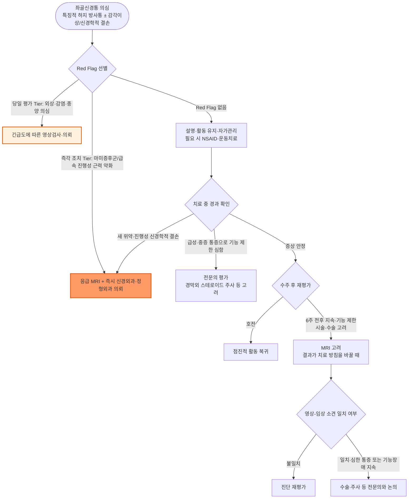

# 좌골 신경통 (요추 신경근병증) Sciatica, Lumbosacral Radiculopathy

## <mark style="color:green;">일반 사항</mark>

* 좌골신경통(sciatica) : 주로 L4\~S1 신경근의 자극 또는 압박으로 둔부에서 하지로 뻗치는 신경근성 통증(radicular pain). 감각 이상이 흔히 동반되며, 객관적 근력 약화·감각 저하·반사 감소가 동반되면 **요천추 신경근병증(lumbosacral radiculopathy)**으로 평가함
* 관련 용어 : lumbosacral radicular syndrome, radicular pain, nerve root pain, lumbosacral radiculopathy
* L5, S1 이환이 가장 흔함
* 역학 : 진단 기준에 따라 빈도 차이가 크며, 연간 발생률은 약 1\~5%, 평생 발생률은 약 10\~40%로 보고됨; 뚜렷한 성별 우세는 없으며 주로 30\~50대에 호발
* 자연 경과 : 대부분 보존적 치료로 수주\~수개월 내 호전되며, 많은 환자에서 초기 4\~6주 동안 뚜렷한 호전을 보임. 일부에서는 증상이 지속되거나 재발할 수 있음

## <mark style="color:green;">원인</mark>

* 추간판탈출증(가장 흔함)
* 척추관/외측 함요(lateral recess)/추간공 협착
* 퇴행성 척추질환, spondylolisthesis
* 드물게 종양, 감염, 혈종 등 신경근 압박 병변

### <mark style="color:orange;">위험 인자</mark>

* 연령 증가, 비만/과체중, 흡연
* 반복적인 들기, 굴곡, 회전을 하는 활동이나 운동(예: 춤, 골프)
* 운동 부족
* 장시간 운전 등 진동 노출
* ✽임신 중 요통·골반통은 좌골신경통과 임상 양상이 겹칠 수 있어 단순 위험인자로 단정하기보다 감별이 필요함(하단 감별 진단 참조)

## <mark style="color:green;">임상 양상</mark>

* buttock & leg 후측방에서 발까지 방사통, 작열감 또는 감각 저하
* 하지 통증 (허리 통증보다 하지 통증이 심함)
* 척추 움직임에 따라 증상이 변할 수 있음 : 추간판성 병변에서는 굴곡 시 악화되거나 신전 방향에서 centralization을 보이는 경우가 있으나, 척추관·추간공 협착에서는 반대로 신전 시 악화되고 굴곡 시 완화되는 경우가 있음
* 아침, 장시간 착석 또는 기립, Valsalva maneuver(예: 기침, 배변) 시 증상 악화
* 대부분 편측 발생
* 장기간 지속되면 근 위축 발생
* Centralization phenomenon(McKenzie 개념) : 신전 등 특정 자세·운동 시 통증이 원위부(다리)에서 근위부(허리)로 옮겨오는 양상 → 예후가 좋은 신호로 활용 가능

### <mark style="color:$danger;">🚩 Red Flags!</mark>

<mark style="color:$danger;">**즉각 조치 또는 의뢰**</mark> <mark style="color:$danger;">- 생명 위협 또는 즉각적 위해 가능성</mark>

* 마미증후군(cauda equina syndrome) 의심 소견 : 새로운 요폐(urinary retention) 또는 배뇨감각 변화, 배변 조절 곤란, 회음부 주위 감각 저하(안장 마취), 양측 하지 위약, 급성 성기능 장애 → 응급 MRI 및 즉시 신경외과/정형외과 의뢰
* 급속 진행성이거나 심한 근력 약화(예: 완전 족하수)

<mark style="color:$warning;">**당일~수일 내 평가**</mark>

* 중증 외상 후 발생(골절 의심) (당일)
* 발열과 심한 척추 통증, 최근 감염·척추 시술, IV 약물 사용 또는 면역저하 등 척추 감염·경막외농양 의심 (당일)
* 암 병력과 새로 발생한 지속성 통증·방사통 등 척추 전이 의심 (당일~조기 평가); 보행장애, 위약, 감각장애, 배뇨·배변장애가 동반되면 전이성 척수/마미 압박 가능성을 고려하여 즉시 평가
* 설명할 수 없는 체중 감소가 다른 의심 소견과 동반되거나 진행하는 경우 (조기 평가)

<mark style="color:$info;">**외래 추적 / 추가 평가 계획**</mark> <mark style="color:$info;">- 즉각 위험 낮으나 호전 없으면 의뢰</mark>

* ＜20세 또는 ＞50세에서 처음 발생 - 단독으로는 특이도가 낮으며, 암력·감염력 등 다른 위험 인자가 동반될 때 의미가 커짐
* 심한 증상 또는 비정형 통증
* 6주 이상 지속되거나 일상 기능 제한이 계속되는 경우 - 진단 재평가 및 필요 시 영상검사/전문의뢰

## <mark style="color:green;">진단</mark>

### <mark style="color:orange;">신체검사</mark>

* 하지 감각 및 운동 검사 : dermatome을 따라 감각 저하, myotome을 따라 근 약화 ✽[Dermatome](https://www.physio-pedia.com/Dermatomes), [Myotome](https://www.physio-pedia.com/Myotomes)
* 이환 신경근에 따른 증상 발생 부위

<table><thead><tr><th width="85">신경근</th><th width="230">감각 저하 부위</th><th width="200">대표 근력검사</th><th>저하된 반사</th></tr></thead><tbody><tr><td><strong>L4</strong></td><td>하지 전내측, 내측 복사뼈</td><td>knee extension, ankle dorsiflexion</td><td>patellar tendon (knee jerk)</td></tr><tr><td><strong>L5</strong></td><td>하지 외측, 제1·2족지 dorsum web space</td><td>great toe extension, ankle dorsiflexion</td><td>뚜렷한 표준 심부건반사 없음(medial hamstring reflex, posterior tibial reflex 등이 보조적으로 언급되나 재현성은 낮음)</td></tr><tr><td><strong>S1</strong></td><td>하지 후측, 뒤꿈치 외측</td><td>ankle plantarflexion</td><td>Achilles tendon (ankle jerk)</td></tr></tbody></table>

* ✽Myotome과 dermatome은 인접 신경근 사이의 중첩과 개인차가 크므로(예: ankle dorsiflexion은 L4\~L5, knee extension은 L3\~L4 중첩 지배), 단일 근력검사나 감각분포만으로 병변 신경근을 확정하지 않고 통증 분포·감각·근력·반사를 종합하여 판단함

* straight-leg raise(SLR) : 무릎을 편 상태에서 고관절을 수동으로 굴곡할 때 약 30\~70° 범위에서 환자의 평소 방사성 하지 통증(대개 무릎 아래)이 재현되면 양성; 단순 요통이나 hamstring 당김은 양성으로 보지 않음
* seated SLR : 무릎을 구부리고 의자에 앉은 자세에서 수동적으로 무릎을 펴면 통증 재현
* crossed SLR : 건측 SLR 시행 중 환측의 전형적인 방사통이 재현되면 양성
* Bragard sign : SLR 양성 각도에서 다리를 살짝 내린 뒤 발목을 배굴시켜 통증이 재현되면 양성(햄스트링 당김과의 감별에 유용); Bowstring test : SLR 양성 각도에서 무릎을 살짝 굴곡시키며 오금부 좌골신경을 압박하여 통증이 재현되는지 확인
* [slump test](https://www.youtube.com/watch?v=HFGfP84uwEo) : 앉은 자세에서 흉·요추 굴곡, 경추 굴곡, 무릎 신전 및 발목 배굴을 단계적으로 시행하여 평소의 신경근성 하지 통증이 재현되는지 평가; 추간판탈출증에서 SLR보다 민감할 수 있으나(Majlesi 등, 2008) 단독으로 진단하지 않고 다른 임상소견과 함께 해석
* 마미증후군 의심 시 : saddle/perineal sensation, 하지 신경학적 검사, 새로운 요폐(urinary retention)·배뇨감각 변화를 신속히 평가하고 즉시 MRI 의뢰
  ✽digital rectal examination(DRE)의 anal tone 검사는 진단 정확도가 낮고 거짓 안심을 줄 수 있음. 정상 소견을 근거로 응급 MRI 의뢰를 늦추거나 마미증후군을 배제하지 않음
* 하지 맥박 검사 : 혈관 질환과 감별

### <mark style="color:orange;">통증-기능 평가</mark>

* Oswestry Disability Index(ODI) 또는 숫자통증척도(NRS) 등으로 초진 시 기저치를 기록하고, 6주 재평가 시 비교하면 치료 반응을 객관적으로 추적하는 데 도움이 됨

### <mark style="color:orange;">영상 검사</mark>

* Red Flag나 진행성 신경학적 결손이 없으면 일률적인 초기 영상검사는 피함. 6주 전후에도 증상이 지속·악화하여 수술·주사 등 치료를 고려하고, 검사 결과가 치료 방침을 바꿀 가능성이 있을 때 영상검사 고려; 호전 중이라면 6주 경과만으로 MRI를 시행하지 않음
* X선 : 진단적 가치가 높지 않음; 일률적 검사는 권고하지 않음
* MRI : 신경근 압박 원인·위치와 임상 소견의 일치 여부를 평가하는 데 유용; 마미증후군이 의심되면 응급 시행, 감염·종양 또는 중증·진행성 신경학적 결손이 의심되면 긴급도에 따라 조기 시행
* CT : 골격 이상 진단에 특히 유효
* 초음파 : 복부 질환 의심 시 고려(예: abdominal aortic aneurysm)
* 신경전도 검사, 근전도 검사 : 진찰·영상 소견이 불일치하거나 말초신경병증과의 감별이 필요한 경우 보조적으로 고려; 모든 좌골신경통 환자에게 일률적으로 시행하지 않음
* 영상 소견과 임상 증상이 일치하지 않으면(예: 무증상 디스크 소견) 다른 원인 감별이 필요하며 영상 소견만으로 치료 방침을 결정하지 않음

### <mark style="color:orange;">감별 진단</mark>

* 하지로 뻗치는 통증·저림을 유발할 수 있는 질환들과의 감별

<table><thead><tr><th width="160">질환</th><th width="250">좌골신경통과의 차이점</th><th>핵심 감별 포인트</th></tr></thead><tbody><tr><td>척추관협착증<br>(neurogenic claudication)</td><td>보행 시 악화, 앉거나 허리를 굽히면 호전; 양측성인 경우가 많음</td><td>허리를 굽히면(예: 카트를 밀며 걷기) 증상이 완화되는 양상</td></tr><tr><td>Deep gluteal syndrome<br>(구 piriformis syndrome)</td><td>영상검사상 신경근 압박 소견이 없음; 둔부 심부 압통</td><td>FAIR test(굴곡-내전-내회전) 시 통증 재현; SLR은 음성일 수 있음</td></tr><tr><td>상위 요추 신경근병증(L2\~L4)<br>/대퇴신경병증</td><td>방사통이 대퇴 전방에 국한; 후방 하지 방사통은 드묾</td><td>Femoral nerve stretch test 양성; 슬개건반사 저하</td></tr><tr><td>Common peroneal neuropathy</td><td>발목 배굴·족지 신전·외번 약화(foot drop)와 감각 이상이 종아리 외측\~발등에 주로 분포; 요통은 흔하지 않음</td><td>비골두 부위 압통·Tinel 징후; L5 신경근병증과 달리 tibialis posterior(내번)는 보존됨</td></tr><tr><td>말초혈관질환<br>(vascular claudication)</td><td>신경학적 결손·감각 이상이 동반되는 경우는 드묾</td><td>자세 변화와 무관하게 보행 시 악화; 하지 맥박 저하 또는 소실</td></tr><tr><td>고관절 병변<br>(골관절염 등)</td><td>서혜부 통증이 주 증상; 방사통은 대개 무릎 상부까지</td><td>고관절 운동범위 제한, 서혜부 통증 유발 검사 양성</td></tr><tr><td>Greater trochanteric pain syndrome</td><td>대전자 부위 국소 압통이 주 증상</td><td>옆으로 누우면 악화; 대전자부 직접 압통</td></tr><tr><td>천장관절통(SI joint pain)</td><td>방사통이 대개 무릎 상부까지; 신경학적 결손 없음</td><td>천장관절 유발검사(compression, FABER 등) 양성</td></tr><tr><td>임신 관련 골반대 통증</td><td>특정 신경근 dermatome과 불일치; 골반 전방·후방 통증 우세</td><td>임신 중 발생, posterior pelvic pain provocation test 양성</td></tr><tr><td>당뇨병성 말초신경병증</td><td>양측성, 장갑-양말(glove-stocking) 분포</td><td>특정 신경근 dermatome과 불일치하는 분포; 당뇨병력</td></tr><tr><td>대상포진(herpes zoster)</td><td>피부분절을 따르는 통증이나 발진 선행/동반</td><td>수포성 발진(피부분절 분포); 발진 전에는 감별 어려울 수 있음</td></tr></tbody></table>

***



<p align="center"><strong>진단 및 치료 알고리듬</strong></p>

***

## <mark style="background-color:$warning;">Management</mark>


**단계별 치료 전략 (Step-wise Approach)**


<table><thead><tr><th width="90">단계</th><th width="230">핵심 치료</th><th>대상</th></tr></thead><tbody><tr><td>Step 1</td><td>Red Flag 선별, 설명·활동 유지·자가관리; 필요 시 NSAID 단기 고려</td><td>모든 환자(첫 내원); NSAID는 위험 평가 후 선택</td></tr><tr><td>Step 2</td><td>개별화한 운동/물리치료, 증상 완화 목적 온·냉찜질</td><td>증상에 따라 초기부터, 또는 단기 자가관리로 충분히 호전되지 않는 경우</td></tr><tr><td>Step 3</td><td>진단 재평가, 치료 방침을 바꿀 때 MRI 고려; 급성·중증 통증에는 경막외 스테로이드 주사 전문의 상담 가능</td><td>증상·기능장애가 지속하여 침습적 치료 고려 시; 급성 중증 통증은 6주를 일률적으로 기다리지 않음</td></tr><tr><td>Step 4</td><td>수술적 치료 의뢰</td><td>중증·진행성 결손은 조기 의뢰; 비수술 치료 후 심한 통증·기능장애가 지속하고 영상·임상이 일치하는 경우</td></tr></tbody></table>

### <mark style="color:orange;">6주 재평가 체크리스트</mark>

<table><thead><tr><th width="110">판정</th><th width="230">기준</th><th>조치</th></tr></thead><tbody><tr><td>호전</td><td>통증·ODI/NRS 감소, 기능 회복</td><td>현 치료 지속, 점진적 활동 복귀; 6주 경과만으로 영상검사를 시행하지 않음</td></tr><tr><td>정체</td><td>통증·기능 변화 없음, Red Flag 없음</td><td>진단 재평가; 주사·수술 등을 고려하고 영상 결과가 치료 방침을 바꿀 때 MRI 고려</td></tr><tr><td>악화</td><td>새 위약 또는 신경학적 결손 진행, 통증 심화</td><td>6주 재평가를 기다리지 않음; 즉시 신경학적 평가 후 응급·조기 MRI와 전문의뢰 여부 결정</td></tr></tbody></table>

## <mark style="color:green;">비-약물 치료 및 예방</mark>

* 침상 안정은 권장하지 않음; 통증이 심한 경우 짧은 상대적 휴식은 가능하나, 가능한 범위에서 일상 활동을 유지하는 것이 회복에 도움이 됨
* 냉찜질 또는 온찜질 : 특정 순서나 기간에 대한 확립된 근거는 부족하며, 환자가 증상 완화를 느끼는 경우 보조적으로 사용
* 물리 치료
* Red Flag가 없고 증상이 안정적이면 우선 보존적 치료를 시행하며 수주간 경과를 관찰함. 새 위약·배뇨감각 변화 등 경고 증상이 생기면 예정된 추적 시점보다 일찍 재평가

### <mark style="color:orange;">생활 관리 및 재발 예방</mark>

* ✽아래 생활 수칙은 증상 완화를 위한 실용적 조언이며, 재발을 예방한다는 강한 근거가 확립된 것은 아님 - 핵심은 정상적인 활동 유지와 운동(self-management)
* 적정 체중 유지
* 금연
* 하이 힐 착용을 피함
* 지속적인 근력 및 유연성 훈련 또는 활동
* 운동 또는 활동 전에 준비 운동을 함
* 가능한 한 무거운 물건을 들고 다니지 않음(예: 장보기 시 카트 이용)
* 물건을 들 때의 자세 주의 : 물건 정면에 다리를 벌리고 서서 허리는 세우고 무릎을 구부려 들어 올림, 가능한 한 물건을 몸 가까이 듦; 허리를 비틀지 않음
* 의자에 앉아 있을 때 척추를 natural position으로 유지, 허리 지지(특히 운전 시)
* 등받이가 높은 의자 선택, 필요시 등을 기대고 다리를 받쳐주는 의자 선택
* 장시간 앉아서 작업해야할 때는 자주 일어나서 걸음(예: 1시간마다 10분 걷기)
* 장시간 서서 작업할 때는 발받침을 두고 번갈아 발을 올리고 있음
* 옆으로 누워 잘 때는 무릎 사이에 베개를 끼움

### <mark style="color:orange;">Exercise</mark>

☞ [NHS 좌골신경통 일반 자가관리](https://www.nhs.uk/conditions/sciatica/)

* 아래 동작은 모든 환자에게 동일하게 적용하는 처방이 아니라, 증상 반응에 따라 고르는 예시임. 천천히 시작하고 하지 통증·저림이 발 쪽으로 더 뻗치거나 새 위약이 생기면 중단하고 재평가함. 신전에서 악화되는 척추관협착증 등은 자세를 개별화함

#### <mark style="color:$primary;">Knee to chest stretch</mark>

* 방법 : 베개를 베고 무릎을 90°구부리고 발을 엉덩이 폭만큼 벌리고 누움 → 한쪽 무릎을 가슴 쪽으로 당겨 양 손으로 잡고 20\~30초간 유지; 각 다리로 3회 반복
* 시행 중 목과 상체는 편안한 이완 상태를 유지하며 심호흡 함

#### <mark style="color:$primary;">Sciatic mobilising stretch</mark>

* 방법 : 베개를 베고 무릎을 굽혀 누움 → 한쪽 허벅지 뒤를 잡고 무릎을 통증이 없는 범위에서 천천히 폈다가 다시 굽힘; 강하게 당긴 자세를 오래 유지하지 않으며 소수의 부드러운 움직임으로 시작
* 시행 중 목과 상체를 편안하게 유지함. 다리 저림·방사통이 심해지거나 발 쪽으로 내려가면 중단

#### <mark style="color:$primary;">Back extension</mark>

* 방법 : 엎드려 팔꿈치를 구부려 팔을 몸 옆에 둠(elbow full flexion), 손바닥은 바닥을 짚고 얼굴은 바닥을 향함 → 상박을 바닥에 붙여놓은 상태에서 팔꿈치를 90°굴곡 상태로 펴며 상체를 들고(골반은 바닥에 붙어 있는 상태임) 복부 근육을 부드럽게 늘리고 5\~10초간 유지(고개를 뒤로 젖히지 않음); 8\~10회 반복
* 이 동작 중 통증이 다리에서 허리 쪽으로 옮겨오면(centralization) 유리한 반응일 수 있음. 반대로 다리 아래쪽으로 통증이 확대되면 반복하지 않음

#### <mark style="color:$primary;">Standing hamstring stretch</mark>

* 방법 : 똑바로 서서 한 다리를 안정된 물체에 올림 → 올려 놓은 다리를 편안한 범위에서 펴고, 허리를 편 상태에서 가볍게 앞으로 기울임; 하지 방사통을 당겨 유발하면 시행하지 않음

#### <mark style="color:$primary;">Lying deep gluteal stretch</mark>

* 방법 : 베개를 베고 무릎을 90°구부리고 발을 엉덩이 폭만큼 벌리고 누워 오른쪽 다리를 왼쪽 대퇴부에 올려놓음 → 왼쪽 허벅지를 잡고 오른쪽 엉덩이에서 스트레칭이 느껴지도록 앞으로 당기고 20\~30초간 유지 → 다리를 바꿔 시행; 각 다리로 2\~3회 반복
* 척추는 바닥에 닿은 상태로 엉덩이를 똑바로 유지함. 손으로 허벅지를 잡을 수 없다면 타올로 허벅지를 감아 시행할 수 있음

## <mark style="color:green;">약물 치료</mark>

### <mark style="color:orange;">NSAID</mark>

* 좌골신경통 자체에 대한 효과 근거는 제한적임. 위장관 출혈·궤양, 신기능, 심혈관 위험, 병용약물 및 필요 시 위장 보호를 평가하여 증상 완화가 필요할 때 최소 유효 용량·최단 기간 사용; 장기 사용은 피함
* ibuprofen : 200\~800 ㎎ tid <mark style="color:blue;">\[부루펜]</mark>
* naproxen : 250\~500 ㎎ bid <mark style="color:blue;">\[낙센]</mark>

### <mark style="color:orange;">경구 Steroid</mark>

* 단기 사용이 기능 향상에 도움이 될 수 있다는 일부 보고가 있으나, NICE NG59(2016년 제정, 2020년 개정)는 전반적인 임상적 이득이 없고 위해 가능성이 있다는 근거를 바탕으로 좌골신경통 치료 목적의 경구 corticosteroid 사용을 권고하지 않음

### <mark style="color:orange;">기타 약제</mark>

* Gabapentinoid, 기타 항경련제 : NICE NG59는 사용을 권고하지 않음 (근거 부족 + 장기 부작용 위험)
* 벤조디아제핀 : NICE NG59는 사용을 권고하지 않음
* Opioid : 만성 좌골신경통에서는 사용을 권고하지 않음(NICE NG59); 급성 좌골신경통에서도 유효성 근거가 충분하지 않아 routine use는 피하고 예외적으로 개별 판단
* 항우울제(TCA 등) : 좌골신경통 자체에 대한 유효성 근거가 불충분함(NICE NG59: no evidence on antidepressants for sciatica); 만성 요통·중추성 민감화 동반 시 임상적으로 개별화하여 고려
* 근이완제 : radicular pain 자체에 대한 근거는 제한적이며, 동반 근육경련이 뚜렷한 경우 단기간 개별 고려


**국내 임상 현장에서의 Gabapentinoid 처방에 대하여**\
NICE NG59는 근거 부족과 부작용 위험을 이유로 gabapentinoid(pregabalin, gabapentin 등) 사용을 권고하지 않음. 국내 외래에서 예외적으로 사용되는 경우가 있더라도 좌골신경통의 일상적인 2차 치료로 제시하지 않음. 투여 중이라면 통증·기능의 실제 개선과 어지럼·졸림 등을 재평가하고 이득이 불분명하면 지속하지 않음


## <mark style="color:green;">시술 및 기타 처치</mark>

### <mark style="color:orange;">Epidural steroid 주사</mark>

* 급성·중증 좌골신경통에서 전문의 평가 후 고려할 수 있으며 6주 경과를 일률적으로 기다릴 필요는 없음. 위약 대비 단기(3개월 이내) 통증·기능 개선 효과가 있으나 평균 효과 크기는 작음(Cochrane 2020: 통증 약 5/100점, 기능장애 약 4/100점 개선 - 임상적으로 중요하지 않을 수 있는 수준). AAN systematic review 2025에서도 신경근성 통증의 단기 통증·기능 개선 가능성을 보고함; 장기 통증 개선 효과는 불확실함


**⚠️ 경막외 스테로이드 주사 관련 안전성 경고 (FDA Drug Safety Communication)**\
매우 드물게 실명, 뇌졸중, 마비, 사망 등 심각한 신경학적 합병증이 보고됨. 시술 전 환자에게 설명하고, 숙련된 시술자가 투시 유도 하에 시행하는 것이 권장됨.\
추간공 경막외 주사(TFESI) 시행 시에는 혈관 내 주입에 의한 척수 경색 위험을 줄이기 위해 수용성/비입자성 스테로이드(예: dexamethasone) 사용이 권장됨.


### <mark style="color:orange;">수술</mark>

* 대상 : 비수술적 치료에도 통증·기능장애가 지속되고 영상검사 소견이 임상 증상과 일치하는 경우 수술적 감압술을 고려; 진행성 또는 중증 신경학적 결손(진행성 근력 약화 포함)은 조기 전문의뢰

***

### <mark style="color:red;">질병코드</mark>

M54.3　좌골신경통

M54.4　요통을 동반한 좌골신경통

M51.1　요추 및 기타 추간판장애, 신경근병증 동반

***

## <mark style="color:purple;">처방례</mark>

> **처방례 1. 급성 좌골신경통 - NSAID 필요 시, 동반 근육경련이 뚜렷하면 근이완제 개별 고려**
>
> ```
> 낙센에프정 500 ㎎/T　1T　bid (필요 시 단기간)
> 아로베스트정 20 ㎎/T　1T　bid (근육경련 동반 시 단기간)
> ```
>
> _✽NSAID는 모든 좌골신경통 환자에게 필수인 약제가 아님. 위장관·신장·심혈관 위험과 병용약을 확인하여 투여 여부·기간을 결정. 아로베스트정은 요통증에 따른 근긴장 개선 목적으로 사용하며 신경근성 방사통 자체에 대한 효과와 구별_

> **처방례 2. 만성 통증/중추성 민감화 동반 환자의 개별화 예**
>
> ```
> 쎄레브렉스 200 ㎎/C　1C　qd
> 센시발정 25 ㎎/T　1T　hs
> ```
>
> _✽센시발정(nortriptyline)의 좌골신경통·통증 목적 사용은 국내 허가 외이며, 좌골신경통 자체에 대한 표준 치료로 확립된 근거가 없음(NICE NG59: no evidence on antidepressants for sciatica). 동반 만성 통증 특성을 평가한 후 개별적으로 판단하고, 특히 고령자나 배뇨장애 위험 환자에서는 입마름·변비·배뇨곤란 등 항콜린제 부작용, 졸림·기립성 증상 등에 주의. 증상 지속 시 약제 연장만 하지 말고 진단·기능·전문의뢰 필요성을 재평가_

***

### <mark style="color:$success;">핵심 복약 지도</mark>

> **NSAID 복용 시 주의사항**
>
> * 위장 장애 예방을 위해 가급적 식후 복용
> * 위장관 출혈·궤양 병력, 항응고제·항혈소판제 복용, 콩팥 기능, 심혈관 위험 및 다른 NSAID 복용 여부를 사용 전 확인; 필요한 경우 위장 보호 전략 고려
> * 장기 사용은 피하고 통증 조절 목적으로 최소 유효 용량, 최단 기간 사용

> **근이완제(아플로쿠알론 등) 복용 시 주의사항**
>
> * 졸림, 어지러움이 유발될 수 있어 복용 중 운전이나 위험한 기계 조작 주의
> * 음주 병용 금지

> **자가 운동 시행 안내**
>
> * 안내된 스트레칭은 통증을 유발하지 않는 범위 내에서 시행
> * 통증이 다리 아래쪽에서 허리 쪽으로 옮겨오는 방향(centralization)은 유리한 반응일 수 있음. 다리 통증·저림이 발 쪽으로 더 뻗치거나 새 위약이 생기면 운동을 중단하고 재평가

> **언제 다시 병원을 방문해야 하나요?**
>
> * 소변이 잘 나오지 않거나 소변 줄기·배뇨감각이 새로 변한 경우, 배변 조절이 어렵거나 항문 주위(회음부) 감각이 무뎌지는 경우 - 요폐·실금이 나타날 때까지 기다리지 말고 즉시 응급실 내원
> * 하지 위약이 새로 생기거나 빠르게 진행되는 경우 - 즉시 평가
> * 통증·기능이 악화하면 예정된 추적일 전에 재평가; 수주간 치료에도 호전이 없으면 진단과 치료 계획 재검토

***

## <mark style="color:blue;">환자 안내서</mark>


**좌골신경통, 대부분 시간이 지나며 좋아집니다**

좌골신경통은 허리의 신경 뿌리가 눌리거나 자극을 받아 엉덩이에서 다리, 발까지 통증이 뻗치는 증상입니다. 대부분 특별한 시술이나 수술 없이 수주\~수개월에 걸쳐 좋아지며, 특히 처음 4\~6주 동안 많이 호전됩니다.


### <mark style="color:$primary;">왜 다리까지 통증이 뻗치나요?</mark>

* 허리 척추뼈 사이의 디스크가 밀려나오거나 척추관이 좁아지면서, 다리로 내려가는 신경이 눌리기 때문에 생깁니다.
* 눌린 신경의 위치에 따라 통증이 뻗치는 다리 부위와 힘이 빠지는 부위가 다를 수 있습니다.

### <mark style="color:$primary;">일상생활에서 어떻게 관리하나요?</mark>

* **완전히 누워만 있지 마십시오.** 통증이 아주 심할 때만 짧게 안정을 취하고, 이후에는 통증이 허용하는 범위에서 걷기 등 활동을 유지하는 것이 회복에 더 도움이 됩니다.
* **무거운 물건을 들 때는 무릎을 굽히고 물건을 몸에 가까이 붙여 드십시오.** 허리를 굽히거나 비트는 자세는 피하십시오.
* **장시간 앉아 있지 마십시오.** 1시간마다 일어나 10분 정도 걷습니다.
* **옆으로 누워 잘 때는 무릎 사이에 베개를 끼우십시오.**
* 안내받은 운동을 무리하지 않는 범위에서 시행하십시오. 다리 통증·저림이 발 쪽으로 더 내려가면 그 동작을 멈추고 상담하십시오.

### <mark style="color:$primary;">약은 어떻게 써야 하나요?</mark>

* 소염진통제는 통증이 심한 시기에 짧게 사용하는 것이 원칙입니다.
* 근육이완제 복용 후에는 졸릴 수 있으니 운전이나 위험한 작업은 피하십시오.

### <mark style="color:$primary;">이럴 때는 즉시 병원(응급실)을 방문하세요</mark>

* 소변이 평소처럼 나오지 않거나 소변 줄기·배뇨감각이 새로 변한 경우, 소변·대변을 조절하기 어렵거나 항문·회음부 주위 감각이 무뎌지는 경우
* 다리에 새로 힘이 빠지거나 힘이 빠지는 정도가 빠르게 심해지는 경우
* 발열과 심한 허리 통증이 함께 있거나, 암 병력이 있으면서 새로 보행장애·다리 힘 빠짐·배뇨장애가 생긴 경우

원인 모를 체중 감소나 지속되는 비정상적인 통증이 있다면 늦추지 말고 진료를 받아 원인을 확인하십시오.
