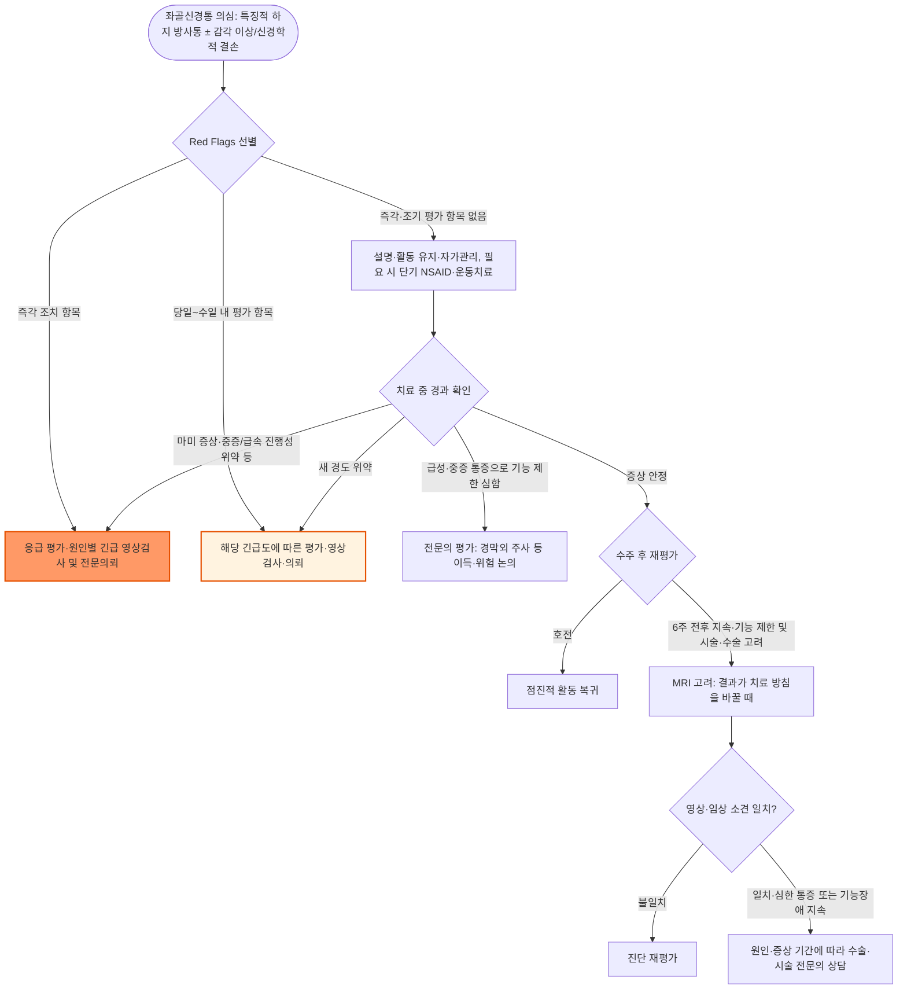

# 좌골신경통 (요천추 신경근병증) Sciatica, Lumbosacral Radiculopathy

## <mark style="color:green;">일반 사항</mark>

* 좌골신경통(sciatica) : 주로 L4\~S1 신경근의 자극 또는 압박으로 둔부에서 하지로 뻗치는 신경근성 통증(radicular pain). 감각 이상이 흔히 동반되며, 객관적 근력 약화·감각 저하·반사 감소가 동반되면 **요천추 신경근병증(lumbosacral radiculopathy)**으로 평가함
* 관련 용어 : lumbosacral radicular syndrome, radicular pain, nerve root pain. 신경근성 통증과 신경근병증은 동반될 수 있으나 동의어는 아님; 객관적 신경학적 결손 없이 방사통만 나타날 수도 있음
* L5, S1 이환이 가장 흔함
* 역학 : 진단 기준과 조사 대상에 따라 유병률·발생률 차이가 큼. 추간판탈출증에 의한 좌골신경통은 주로 중년에서, 퇴행성 협착에 의한 증상은 고령자에서 흔함
* 자연 경과 : 대부분 보존적 치료로 수주\~수개월 내 호전되며, 많은 환자에서 초기 4\~6주 동안 뚜렷한 호전을 보임. 일부에서는 증상이 지속되거나 재발할 수 있음

## <mark style="color:green;">원인</mark>

* 추간판탈출증(가장 흔함)
* 척추관/외측 함요(lateral recess)/추간공 협착
* 퇴행성 척추질환, spondylolisthesis
* 드물게 종양, 감염, 혈종 등 신경근 압박 병변

### <mark style="color:orange;">위험 인자</mark>

* 연령 증가, 비만/과체중, 흡연
* 무거운 물건을 반복적으로 들거나 허리를 굽히고 비트는 직업적 부하
* 장시간 운전 등 진동 노출
* ✽임신 중 요통·골반통은 좌골신경통과 임상 양상이 겹칠 수 있어 단순 위험인자로 단정하기보다 감별이 필요함(하단 감별 진단 참조)

## <mark style="color:green;">임상 양상</mark>

* 둔부에서 하지·발로 뻗치는 방사통, 작열감 또는 감각 이상; L5·S1 병변에서는 후외측 하지 통증이 흔하며 이환 신경근에 따라 분포가 달라짐
* 흔히 허리 통증보다 하지 통증이 심하며, 요통이 뚜렷하지 않을 수도 있음
* 척추 움직임에 따라 증상이 변할 수 있음 : 추간판성 병변에서는 굴곡 시 악화되거나 신전 방향에서 centralization을 보이는 경우가 있으나, 척추관·추간공 협착에서는 반대로 신전 시 악화되고 굴곡 시 완화되는 경우가 있음
* 장시간 착석·기립 또는 Valsalva maneuver(예: 기침, 배변) 시 악화될 수 있으나 원인과 환자에 따라 다름
* 대부분 편측 발생
* 운동신경 기능장애가 지속되면 근 위축이 발생할 수 있음
* Centralization phenomenon(McKenzie 개념) : 신전 등 특정 자세·운동 시 통증이 원위부(다리)에서 근위부(허리)로 옮겨오는 양상 → 예후가 좋은 신호로 활용 가능

### <mark style="color:$danger;">🚩 Red Flags!</mark>

<mark style="color:$danger;">**즉각 조치 또는 의뢰**</mark> <mark style="color:$danger;">- 생명 위협 또는 즉각적 위해 가능성</mark>

* 마미증후군(cauda equina syndrome) 의심 소견 : 새로운 요폐(urinary retention), 배뇨감각·소변 줄기 변화 또는 배뇨 시 힘주기, 배변 조절 곤란, 회음부 주위 감각 저하(안장 마취), 양측 하지 위약, 급성 성기능 장애 → 응급 MRI 및 즉시 신경외과/정형외과 의뢰. 모든 소견이 함께 나타나거나 완전 요폐·실금이 발생할 때까지 기다리지 않으며, 편측 하지 증상만 있어도 배제하지 않음
* 급속 진행성이거나 심한 근력 약화(예: 완전 족하수)
* 암 병력이 있는 환자의 새 신경근성 방사통, 보행장애, 위약, 감각장애 또는 배뇨·배변장애 → 전이성 척수/마미 압박을 의심하여 즉시 전문의 평가 및 긴급 MRI 경로로 의뢰(NICE NG234)
* 척추 감염·경막외농양 의심에 신경학적 결손 또는 패혈증 소견이 동반됨
* 갑작스러운 심한 등·복부 통증과 실신·저혈압, 또는 급성 하지 통증과 냉감·창백·맥박 소실 → 대동맥 질환·급성 하지허혈 등 혈관성 응급질환 감별

<mark style="color:$warning;">**당일~수일 내 평가**</mark>

* 중증 외상 후 발생(골절 의심) (당일)
* 발열, 최근 감염·척추 시술, IV 약물 사용 또는 면역저하 등 위험 단서와 심한 척추 통증으로 척추 감염·경막외농양 의심 (당일); 발열이 없어도 배제하지 않음
* 암 병력과 새로 발생한 지속성·진행성 허리 통증 등 척추 전이 의심 (당일); 새 신경근성 방사통이나 신경학적 증상이 동반되면 위의 즉각 조치 항목 적용
* 새로 발생한 근력 약화이나 중증·급속 진행성은 아닌 경우 (당일); 근력 등급·보행·족하수 여부를 기록하고 조기 영상검사·전문의뢰 필요성 판단
* 설명할 수 없는 체중 감소가 다른 의심 소견과 동반되거나 진행하는 경우 (조기 평가)

<mark style="color:$info;">**외래 추적 / 추가 평가 계획**</mark> <mark style="color:$info;">- 즉각 위험 낮으나 호전 없으면 의뢰</mark>

* 비정형 통증 또는 예상과 다른 경과 - 연령만으로 영상검사 여부를 결정하지 않고 암·감염·골절 위험과 신경학적 소견을 함께 평가
* 6주 이상 지속되거나 일상 기능 제한이 계속되는 경우 - 진단 재평가 및 필요 시 영상검사/전문의뢰

## <mark style="color:green;">진단</mark>

### <mark style="color:orange;">신체검사</mark>

* 하지 감각·근력·심부건반사, 보행 및 발뒤꿈치/발끝 걷기를 양측 비교; 근력은 MRC 등급으로 기록하고 추적 시 비교
* 이환 신경근에 따른 증상 발생 부위

<table><thead><tr><th width="85">신경근</th><th width="230">감각 저하 부위</th><th width="200">대표 근력검사</th><th>저하된 반사</th></tr></thead><tbody><tr><td><strong>L4</strong></td><td>종아리 내측, 내측 복사뼈</td><td>knee extension, ankle dorsiflexion</td><td>patellar tendon (knee jerk)</td></tr><tr><td><strong>L5</strong></td><td>종아리 전외측, 발등·엄지발가락 부위(제1·2족지 사이 포함)</td><td>great toe extension, ankle dorsiflexion; hip abduction·ankle inversion은 감별에 보조적</td><td>뚜렷한 표준 심부건반사 없음(medial hamstring reflex, posterior tibial reflex 등이 보조적으로 언급되나 재현성은 낮음)</td></tr><tr><td><strong>S1</strong></td><td>종아리 후외측, 발 외측·발바닥 외측 및 제5족지 부위</td><td>ankle plantarflexion(한쪽 발로 발뒤꿈치 들기)</td><td>Achilles tendon (ankle jerk)</td></tr></tbody></table>

* ✽일반적인 후외측 추간판탈출은 L4–5에서 L5, L5–S1에서 S1 신경근을 침범함; 추간공/추간공외 탈출은 해당 추간공으로 나가는 신경근을 침범하므로 추간판 높이와 이환 신경근을 동일시하지 않음

* ✽Myotome과 dermatome은 인접 신경근 사이의 중첩과 개인차가 크므로(예: ankle dorsiflexion은 L4\~L5, knee extension은 L3\~L4 중첩 지배), 단일 근력검사나 감각분포만으로 병변 신경근을 확정하지 않고 통증 분포·감각·근력·반사를 종합하여 판단함

* straight-leg raise(SLR) : 무릎을 편 상태에서 고관절을 수동으로 굴곡할 때 약 30\~70° 범위에서 환자의 평소 방사성 하지 통증(대개 무릎 아래)이 재현되면 양성; 단순 요통이나 hamstring 당김은 양성으로 보지 않음
* seated SLR : 앉은 자세에서 무릎을 수동적으로 펴 평소의 방사성 하지 통증이 재현되는지 평가; 단순 햄스트링 당김과 구별
* crossed SLR : 건측 SLR 시행 중 환측의 전형적인 방사통이 재현되면 양성
* Bragard sign : SLR 양성 각도에서 다리를 살짝 내린 뒤 발목을 배굴시켜 방사통이 재현되는지 평가; Bowstring test : SLR 양성 각도에서 무릎을 살짝 굴곡한 뒤 오금부를 압박하여 방사통 재현 여부 확인. 보조적 검사이며 단독으로 신경근 압박을 확정하지 않음
* SLR은 주로 L5·S1 신경근 자극 평가에 활용하며, crossed SLR은 일반 SLR보다 특이도가 높고 민감도는 낮은 편임. 대퇴 전방 통증 등 L2\~L4 병변이 의심되면 femoral nerve stretch test를 함께 고려
* [slump test](https://www.youtube.com/watch?v=HFGfP84uwEo) : 앉은 자세에서 흉·요추 굴곡, 경추 굴곡, 무릎 신전 및 발목 배굴을 단계적으로 시행하여 평소의 신경근성 하지 통증이 재현되는지 평가; 추간판탈출증에서 SLR보다 민감할 수 있으나(Majlesi 등, 2008) 단독으로 진단하지 않고 다른 임상소견과 함께 해석
* 마미증후군 의심 시 : saddle/perineal sensation, 하지 신경학적 검사, 새로운 요폐(urinary retention)·배뇨감각 변화를 신속히 평가하고 즉시 MRI 의뢰
  ✽digital rectal examination(DRE)의 anal tone 검사는 진단 정확도가 낮고 거짓 안심을 줄 수 있음. 정상 소견을 근거로 응급 MRI 의뢰를 늦추거나 마미증후군을 배제하지 않음
  ✽방광 초음파의 배뇨 후 잔뇨량(PVR)은 보조적으로 활용할 수 있으나, PVR ＜200 ㎖라도 불완전 마미증후군이 가능하므로 의심 증상이 있으면 응급 MRI를 지연하지 않음(Todd 등, 2022)
* 하지 맥박 검사 : 혈관 질환과 감별

### <mark style="color:orange;">통증-기능 평가</mark>

* 숫자통증척도(NRS)로 통증, Oswestry Disability Index(ODI) 등으로 기능장애를 평가하고 초진 시 기저치를 기록함. 초기에는 증상·약물 위험에 따라 1\~2주 내 경과를 확인하고 이후 재평가 시 비교; 6주는 지속 증상의 치료 전략을 재검토하는 시점이며 그때까지 진료를 미루라는 의미가 아님

### <mark style="color:orange;">영상 검사</mark>

* Red Flag나 진행성 신경학적 결손이 없으면 일률적인 초기 영상검사는 피함. 6주 전후에도 증상이 지속·악화하여 수술·주사 등 치료를 고려하고, 검사 결과가 치료 방침을 바꿀 가능성이 있을 때 영상검사 고려; 호전 중이라면 6주 경과만으로 MRI를 시행하지 않음
* X선 : 진단적 가치가 높지 않음; 일률적 검사는 권고하지 않음
* MRI : 신경근 압박 원인·위치와 임상 소견의 일치 여부를 평가하는 데 유용; 일반적인 추간판탈출증·협착 평가에는 비조영 MRI를 우선 고려. 마미증후군이 의심되면 응급 시행, 감염·종양 또는 중증·진행성 신경학적 결손이 의심되면 긴급도에 따라 조기 시행하고 조영 여부는 목적에 맞게 결정
* CT : 골절·골성 병변 평가에 유용하며, MRI 시행이 불가능한 경우 대안으로 고려; 필요한 경우 전문의가 CT myelography 여부를 결정
* 초음파 : 복부 질환 의심 시 고려(예: abdominal aortic aneurysm)
* 신경전도 검사, 근전도 검사 : 진찰·영상 소견이 불일치하거나 말초신경병증과의 감별이 필요한 경우 보조적으로 고려; 모든 좌골신경통 환자에게 일률적으로 시행하지 않음
* 영상 소견과 임상 증상이 일치하지 않으면(예: 무증상 디스크 소견) 다른 원인 감별이 필요하며 영상 소견만으로 치료 방침을 결정하지 않음

### <mark style="color:orange;">감별 진단</mark>

* 하지로 뻗치는 통증·저림을 유발할 수 있는 질환들과의 감별

<table><thead><tr><th width="160">질환</th><th width="250">좌골신경통과의 차이점</th><th>핵심 감별 포인트</th></tr></thead><tbody><tr><td>척추관협착증에 의한 신경성 파행<br>(neurogenic claudication)</td><td>보행 시 악화, 앉거나 허리를 굽히면 호전; 양측성인 경우가 많음</td><td>허리를 굽히면(예: 카트를 밀며 걷기) 완화되는 양상; 협착 자체도 신경근성 통증의 원인이므로 동반 여부 평가</td></tr><tr><td>심부둔부증후군<br>(deep gluteal syndrome; 이상근증후군 포함)</td><td>둔부 공간의 좌골신경 포착에 의한 통증; 둔부 심부 압통·착석 시 악화</td><td>FAIR test·seated piriformis stretch/active piriformis test 등은 보조적; 요추·고관절 원인 감별. 요추 MRI에서 압박이 없다는 사실만으로 진단하지 않음</td></tr><tr><td>상위 요추 신경근병증(L2\~L4)<br>/대퇴신경병증</td><td>대퇴 전방에서 무릎·종아리 내측까지 통증·감각 이상 가능; 후방 하지 방사통은 드묾</td><td>Femoral nerve stretch test, 무릎 신전 근력·슬개건반사 평가; 고관절 내전 약화는 대퇴신경 단독 병변보다 신경근/신경총 병변을 시사</td></tr><tr><td>Common peroneal neuropathy</td><td>발목 배굴·족지 신전·외번 약화(foot drop)와 감각 이상이 종아리 외측\~발등에 주로 분포; 요통은 흔하지 않음</td><td>비골두 부위 압통·Tinel 징후; L5 신경근병증과 달리 tibialis posterior(내번)는 보존됨</td></tr><tr><td>말초혈관질환<br>(vascular claudication)</td><td>신경학적 결손·감각 이상이 동반되는 경우는 드묾</td><td>자세 변화와 무관하게 보행 시 악화; 하지 맥박 저하 또는 소실</td></tr><tr><td>고관절 병변<br>(골관절염 등)</td><td>서혜부 통증이 주 증상; 방사통은 대개 무릎 상부까지</td><td>고관절 운동범위 제한, 서혜부 통증 유발 검사 양성</td></tr><tr><td>Greater trochanteric pain syndrome</td><td>대전자 부위 국소 압통이 주 증상</td><td>옆으로 누우면 악화; 대전자부 직접 압통</td></tr><tr><td>천장관절통(SI joint pain)</td><td>방사통이 대개 무릎 상부까지; 신경학적 결손 없음</td><td>천장관절 유발검사(compression, FABER 등) 양성</td></tr><tr><td>임신 관련 골반대 통증</td><td>특정 신경근 dermatome과 불일치; 골반 전방·후방 통증 우세</td><td>임신 중 발생, posterior pelvic pain provocation test 양성</td></tr><tr><td>당뇨병성 말초신경병증</td><td>대개 양측 발끝에서 시작하는 원위부 대칭성 감각 이상; 진행 시 양말-장갑 분포</td><td>특정 신경근 dermatome과 불일치하는 분포; 당뇨병력</td></tr><tr><td>대상포진(herpes zoster)</td><td>피부분절을 따르는 통증이 발진에 선행하거나 발진과 동반됨</td><td>수포성 발진(피부분절 분포); 발진 전에는 감별 어려울 수 있음</td></tr></tbody></table>

***


```mermaid
graph TD
    A(["좌골신경통 의심: 특징적 하지 방사통 ± 감각 이상/신경학적 결손"]) --> B{"Red Flags 선별"}
    B -->|즉각 조치 항목| C["응급 평가·원인별 긴급 영상검사 및 전문의뢰"]
    B -->|당일~수일 내 평가 항목| D["해당 긴급도에 따른 평가·영상검사·의뢰"]
    B -->|즉각·조기 평가 항목 없음| E["설명·활동 유지·자가관리, 필요 시 단기 NSAID·운동치료"]
    E --> F{"치료 중 경과 확인"}
    F -->|마미 증상·중증/급속 진행성 위약 등| C
    F -->|새 경도 위약| D
    F -->|급성·중증 통증으로 기능 제한 심함| K["전문의 평가: 경막외 주사 등 이득·위험 논의"]
    F -->|증상 안정| G{"수주 후 재평가"}
    G -->|호전| L["점진적 활동 복귀"]
    G -->|6주 전후 지속·기능 제한 및 시술·수술 고려| H["MRI 고려: 결과가 치료 방침을 바꿀 때"]
    H --> I{"영상·임상 소견 일치?"}
    I -->|불일치| M["진단 재평가"]
    I -->|일치·심한 통증 또는 기능장애 지속| J["원인·증상 기간에 따라 수술·시술 전문의 상담"]
    style C fill:#f96,stroke:#e65100,stroke-width:2px
    style D fill:#fff3e0,stroke:#e65100,stroke-width:2px
```

<p align="center"><strong>진단 및 치료 알고리듬</strong></p>

***

## <mark style="background-color:$warning;">Management</mark>


**단계별 치료 전략 (Step-wise Approach)**


<table><thead><tr><th width="90">단계</th><th width="230">핵심 치료</th><th>대상</th></tr></thead><tbody><tr><td>Step 1</td><td>Red Flag 선별, 설명·활동 유지·자가관리; 필요 시 NSAID 단기 고려</td><td>모든 환자(첫 내원); NSAID는 위험 평가 후 선택</td></tr><tr><td>Step 2</td><td>개별화한 운동/물리치료, 증상 완화 목적 온·냉찜질</td><td>증상에 따라 초기부터, 또는 단기 자가관리로 충분히 호전되지 않는 경우</td></tr><tr><td>Step 3</td><td>진단 재평가, 치료 방침을 바꿀 때 MRI 고려; 급성·중증 통증에는 경막외 스테로이드 주사 전문의 상담 가능</td><td>증상·기능장애가 지속하여 침습적 치료 고려 시; 급성 중증 통증은 6주를 일률적으로 기다리지 않음</td></tr><tr><td>Step 4</td><td>수술적 치료 의뢰</td><td>중증·진행성 결손은 조기 의뢰; 비수술 치료 후 심한 통증·기능장애가 지속하고 영상·임상이 일치하는 경우</td></tr></tbody></table>

### <mark style="color:orange;">경과 확인 및 6주 재평가 체크리스트</mark>

<table><thead><tr><th width="110">판정</th><th width="230">기준</th><th>조치</th></tr></thead><tbody><tr><td>호전</td><td>NRS·ODI 감소, 기능 회복</td><td>현 치료 지속, 점진적 활동 복귀; 6주 경과만으로 영상검사를 시행하지 않음</td></tr><tr><td>정체</td><td>통증·기능 변화 없음, Red Flag 없음</td><td>진단 재평가; 주사·수술 등을 고려하고 영상 결과가 치료 방침을 바꿀 때 MRI 고려</td></tr><tr><td>악화</td><td>새 위약 또는 신경학적 결손 진행, 통증 심화</td><td>6주 재평가를 기다리지 않음; 즉시 신경학적 평가 후 응급·조기 MRI와 전문의뢰 여부 결정</td></tr></tbody></table>

## <mark style="color:green;">비-약물 치료 및 예방</mark>

* 침상 안정은 권장하지 않음; 통증이 심한 경우 짧은 상대적 휴식은 가능하나, 가능한 범위에서 일상 활동을 유지하는 것이 회복에 도움이 됨
* 냉찜질 또는 온찜질 : 특정 순서나 기간에 대한 확립된 근거는 부족하며, 환자가 증상 완화를 느끼는 경우 보조적으로 사용
* 운동치료 : 통증 반응과 기능 수준에 맞춰 걷기·유산소 운동, 몸통 안정화·근력 운동 등을 단계적으로 적용; 지속 증상·기능 제한이 있으면 재활 전문가의 지도 고려. 국내 2025 요추 추간판탈출증 지침에서도 운동치료를 권고함
* 도수치료·관절 가동술 등은 운동을 포함한 치료 계획의 일부로 고려; 수동적 처치만 반복하는 방식은 피함. NICE NG59는 견인·치료용 초음파·TENS·간섭파를 일률적으로 제공하는 것을 권고하지 않음
* Red Flag가 없고 증상이 안정적이면 우선 보존적 치료를 시행하며 수주간 경과를 관찰함. 새 위약·배뇨감각 변화 등 경고 증상이 생기면 예정된 추적 시점보다 일찍 재평가

### <mark style="color:orange;">생활 관리 및 재발 예방</mark>

* ✽아래 생활 수칙은 증상 완화를 위한 실용적 조언이며, 재발을 예방한다는 강한 근거가 확립된 것은 아님 - 핵심은 정상적인 활동 유지와 운동(self-management)
* 적정 체중 유지
* 금연
* 증상을 악화시키는 신발·자세를 피하고 편안한 신발을 선택함
* 지속적인 근력 및 유연성 훈련 또는 활동
* 운동 또는 활동 전에 준비 운동을 함
* 급성 통증기에 증상을 악화시키는 무거운 들기·비틀기를 줄이고, 호전되면 점진적으로 활동 부하를 늘림(필요 시 장보기 카트 이용)
* 물건을 들 때의 자세 주의 : 물건 정면에 다리를 벌리고 서서 허리는 세우고 무릎을 구부려 들어 올림, 가능한 한 물건을 몸 가까이 듦; 허리를 비틀지 않음
* 앉을 때 편안한 자세를 취하고 필요 시 허리 지지를 사용함; 한 가지 자세를 오래 유지하기보다 자주 자세를 바꿈
* 의자·발받침은 체형과 증상에 맞춰 선택함
* 장시간 앉아서 작업할 때는 자주 일어나 짧게 걷고, 간격·시간은 증상과 작업 환경에 맞춤
* 장시간 서서 작업할 때는 발받침을 두고 번갈아 발을 올리고 있음
* 옆으로 누워 잘 때는 무릎 사이에 베개를 끼움

### <mark style="color:orange;">Exercise</mark>

☞ [NHS 좌골신경통 일반 자가관리](https://www.nhs.uk/conditions/sciatica/)

* 아래 동작은 모든 환자에게 동일하게 적용하는 처방이 아니라, 증상 반응에 따라 고르는 예시임. 천천히 시작하고 하지 통증·저림이 발 쪽으로 더 뻗치거나 새 위약이 생기면 중단하고 재평가함. 신전에서 악화되는 척추관협착증 등은 자세를 개별화함

#### <mark style="color:$primary;">Knee to chest stretch</mark>

* 방법 : 베개를 베고 무릎을 90°구부리고 발을 엉덩이 폭만큼 벌리고 누움 → 한쪽 무릎을 가슴 쪽으로 당겨 양 손으로 잡고 20\~30초간 유지; 각 다리로 3회 반복
* 시행 중 목과 상체는 편안한 이완 상태를 유지하며 심호흡 함

#### <mark style="color:$primary;">Sciatic mobilising stretch</mark>

* 방법 : 베개를 베고 무릎을 굽혀 누움 → 한쪽 허벅지 뒤를 잡고 무릎을 통증이 없는 범위에서 천천히 폈다가 다시 굽힘; 강하게 당긴 자세를 오래 유지하지 않으며 소수의 부드러운 움직임으로 시작
* 시행 중 목과 상체를 편안하게 유지함. 다리 저림·방사통이 심해지거나 발 쪽으로 내려가면 중단

#### <mark style="color:$primary;">Back extension</mark>

* 방법 : 엎드린 자세에서 팔꿈치를 어깨 아래에 놓고 전완을 바닥에 댐 → 전완으로 지지하여 상체를 부드럽게 들어 올리고 골반은 바닥에 유지; 목을 과도하게 젖히지 않으며 편안한 범위에서 수초 유지 후 내려옴. 소수 회부터 시작하여 증상 반응에 따라 반복 횟수를 조절함
* 이 동작 중 통증이 다리에서 허리 쪽으로 옮겨오면(centralization) 유리한 반응일 수 있음. 반대로 다리 아래쪽으로 통증이 확대되면 반복하지 않음

#### <mark style="color:$primary;">Standing hamstring stretch</mark>

* 방법 : 똑바로 서서 한 다리를 안정된 물체에 올림 → 올려 놓은 다리를 편안한 범위에서 펴고, 허리를 편 상태에서 가볍게 앞으로 기울임; 하지 방사통을 당겨 유발하면 시행하지 않음

#### <mark style="color:$primary;">Lying deep gluteal stretch</mark>

* 방법 : 베개를 베고 무릎을 90°구부리고 발을 엉덩이 폭만큼 벌리고 누워 오른쪽 다리를 왼쪽 대퇴부에 올려놓음 → 왼쪽 허벅지를 잡고 오른쪽 엉덩이에서 스트레칭이 느껴지도록 앞으로 당기고 20\~30초간 유지 → 다리를 바꿔 시행; 각 다리로 2\~3회 반복
* 척추는 바닥에 닿은 상태로 엉덩이를 똑바로 유지함. 손으로 허벅지를 잡을 수 없다면 타올로 허벅지를 감아 시행할 수 있음

## <mark style="color:green;">약물 치료</mark>

### <mark style="color:orange;">NSAID</mark>

* 좌골신경통 자체에 대한 효과 근거는 제한적임. 위장관 출혈·궤양, 신기능, 심혈관 위험, 병용약물 및 필요 시 위장 보호를 평가하여 증상 완화가 필요할 때 최소 유효 용량·최단 기간 사용; 장기 사용은 피함
* ibuprofen : 성인 일반 통증용량 1회 200\~400 ㎎, 1일 3\~4회 범위에서 필요 시 단기간 사용 <mark style="color:blue;">\[부루펜정]</mark>. 국내 허가의 관절염 등 용량과 일반 통증용량을 구별하며 800 ㎎/회를 일률적인 시작·일반 용량으로 제시하지 않음
* naproxen : <mark style="color:blue;">\[낙센정 250 ㎎, 낙센에프정 500 ㎎]</mark>. 국내 골격근장애(요천통 포함) 허가용량은 초회 500 ㎎ 후 필요 시 6\~8시간 간격으로 250 ㎎, 1일 총량 ≤1,250 ㎎; 연령·증상에 따라 조절. 250\~500 ㎎ bid는 관절염 등의 허가용법이므로 급성 통증용법과 구별함
* 여러 NSAID를 병용하지 않으며 탈수·급성 신손상·활동성 궤양/출혈 등에서는 피함. 고위험 환자는 PPI 병용 등 위장 보호를 고려하되 신장·심혈관 위험까지 줄여주는 것은 아님

### <mark style="color:orange;">경구 Steroid</mark>

* 일부 연구·Cochrane 2022에서 작거나 제한적인 단기 이득이 보고되었으나, NICE NG59의 약물 권고(2020년 개정)는 전반적인 이득 부족과 위해 가능성을 근거로 좌골신경통 치료 목적의 경구 corticosteroid 사용을 권고하지 않음. 일상적인 처방례에 포함하지 않음

### <mark style="color:orange;">기타 약제</mark>

* Gabapentinoid, 기타 항경련제 : NICE NG59는 전반적인 이득이 확인되지 않고 위해 근거가 있어 사용을 권고하지 않음; 일반적인 신경병증성 통증 권고를 좌골신경통에 그대로 적용하지 않음
* 벤조디아제핀 : NICE NG59는 사용을 권고하지 않음
* Opioid : 만성 좌골신경통에서는 사용을 권고하지 않음(NICE NG59); 급성 좌골신경통에서도 유효성 근거가 충분하지 않아 routine use는 피하고 예외적으로 개별 판단
* 항우울제(TCA·SNRI 등) : 좌골신경통 자체에 대한 유효성 근거가 불충분하며, NICE NG59는 추가 연구가 필요하다고 판단함. 중추성 민감화가 의심된다는 이유만으로 정형화한 처방을 제시하지 않음; 동반 우울증 등 별도 적응증이 있으면 해당 질환의 근거와 국내 허가에 따라 판단
* 근이완제 : radicular pain 자체에 대한 근거는 제한적이며, 동반 근육경련이 뚜렷한 경우 단기간 개별 고려


**국내 임상 현장에서의 Gabapentinoid 처방에 대하여**\
NICE NG59는 전반적인 이득 부족과 위해 근거를 이유로 gabapentinoid(pregabalin, gabapentin 등) 사용을 권고하지 않음. 국내 외래에서 사용되는 경우가 있더라도 좌골신경통의 일상적인 2차 치료로 제시하지 않음. 투여 중이라면 통증·기능의 실제 개선과 어지럼·졸림 등을 재평가하고 이득이 불분명하면 감량·중단 계획을 논의함. 지속 복용 중인 gabapentinoid·opioid·벤조디아제핀은 금단 위험이 있으므로 임의로 갑자기 중단하지 않음


## <mark style="color:green;">시술 및 기타 처치</mark>

### <mark style="color:orange;">Epidural steroid 주사</mark>

* 급성·중증 좌골신경통에서 전문의 평가 후 고려할 수 있으며 6주 경과를 일률적으로 기다릴 필요는 없음. 위약 대비 단기(3개월 이내) 통증·기능 개선 효과가 있으나 평균 효과 크기는 작음(Cochrane 2020: 통증 약 5/100점, 기능장애 약 4/100점 개선 - 임상적으로 중요하지 않을 수 있는 수준). AAN systematic review 2025에서도 신경근성 통증의 단기 통증·기능 개선 가능성을 보고함; 장기 통증 개선 효과는 불확실함
* NICE NG59에서 급성은 ＜3개월, 만성은 ≥3개월로 정의함. BMJ 2025는 ≥3개월의 만성 신경근성 척추 통증에 경막외 주사를 강하게 반대함. 국내 2025 요추 추간판탈출증 지침은 일반적 보존치료에 충분히 반응하지 않는 선별 환자에서 경막외 신경차단술을 권고함(권고 B, 근거 낮음); 다만 분석에 포함된 연구의 증상 기간은 ＜2개월이므로 이를 만성 환자의 반복 주사를 지지하는 근거로 확대하지 않음. AAN 2025도 모든 만성 환자의 반복 시술을 권하는 지침으로 해석하지 않음
* 신경근성 방사통과 중심성 척추관협착에 의한 신경성 파행을 구별함; NICE NG59는 후자에 경막외 주사를 권고하지 않음. 시행 여부는 원인, 증상 기간, 기대 이득과 위험을 공유하여 결정


**⚠️ 경막외 스테로이드 주사 관련 안전성 경고 (FDA Drug Safety Communication)**\
매우 드물게 실명, 뇌졸중, 마비, 사망 등 심각한 신경학적 합병증이 보고됨. 투시 유도 여부와 무관하게 보고되었으므로 영상 유도가 위험을 완전히 없애는 것은 아님. 시술 전 감염, 출혈 위험·항혈전제, 당뇨병 등 위험을 평가하고 환자에게 설명함.\
숙련된 시술자가 영상 유도와 조영제 확인 등 권장 안전 절차에 따라 시행함. 요추 추간공 경막외 주사(TFESI)의 첫 주사는 비입자성 스테로이드(예: dexamethasone)를 권고하며, 약물 주입 전 실시간 투시 등으로 조영제 흐름과 혈관 내 유입 여부를 확인함(IPSIS 2025). 비입자성 약제도 모든 신경학적 위험을 제거하지 않음.\
FDA는 corticosteroid의 경막외 투여를 승인하지 않았음을 명시함. 이는 미국 허가 상태에 관한 설명이며, 국내에서는 선택한 제품의 허가 투여경로와 적용 급여기준을 별도로 확인함.


### <mark style="color:orange;">수술</mark>

* 대상 : 비수술적 치료에도 통증·기능장애가 지속되고 영상검사 소견이 임상 증상과 일치하는 경우 수술적 감압술을 고려; 진행성 또는 중증 신경학적 결손(진행성 근력 약화 포함)은 조기 전문의뢰
* 추간판탈출증에서는 수술이 다리 통증을 더 빨리 완화할 수 있으나, 비수술 치료와의 차이는 장기 추적에서 줄어들 수 있음. 영상상 탈출 크기만으로 수술을 결정하지 않으며 증상·신경학적 결손·기능과 환자 선호를 종합함(국내 2025 지침)

***

### <mark style="color:red;">질병코드</mark>

M54.3　좌골신경통 Sciatica

M54.4　좌골신경통을 동반한 요통 Lumbago with sciatica

M51.1　신경뿌리병증을 동반한 요추 및 기타 추간판장애 Lumbar and other intervertebral disc disorders with radiculopathy

* 부위별 세분코드가 있는 항목은 실제 코딩 시 해당 부위의 코드를 선택함. 원인이 추간판장애로 확인되면 M51.1 등 원인에 맞는 코드를 적용하며, M54.3·M54.4 증상코드를 관행적으로 중복 부여하지 않음

***

## <mark style="color:purple;">처방례</mark>

> **처방례 1. 급성 좌골신경통 - NSAID 필요 시, 동반 근육경련이 뚜렷하면 근이완제 개별 고려**
>
> ```
> 낙센정 250 ㎎/T　초회 2T, 이후 통증 시 1T를 6~8시간 간격으로 (최대 5T/일, 단기간)
> 아로베스트정 20 ㎎/T　1T　tid (근육경련 동반 시 단기간, 필요 시 감량)
> ```
>
> _✽성인 예시. NSAID는 모든 좌골신경통 환자에게 필수인 약제가 아님. 낙센정 용법은 국내 골격근장애(요천통 포함)의 허가용법에 따른 예시이며, 낮은 용량으로 충분하면 감량함. 첫날 초회량도 1일 최대량에 포함함. 위장관·신장·심혈관 위험과 병용약을 확인하여 투여 여부·기간 결정. 아로베스트정의 통상 허가용법은 20 ㎎ tid이며 고령자·졸림 등에서는 감량; 요통증에 따른 근긴장 개선 목적이며 신경근성 방사통 자체의 치료 효과와 구별함_

> **처방례 2. 다른 NSAID를 선택하는 단기 예 - 처방례 1의 NSAID와 병용하지 않음**
>
> ```
> 부루펜정 200 ㎎/T　1~2T　tid (통증 시, 단기간)
> ```
>
> _✽성인 일반 통증의 국내 허가용량은 1회 200\~400 ㎎, 1일 3\~4회이며 위 예시는 그 범위 내 단기 사용임. NSAID 선택·용량은 위험과 반응에 따라 결정함. 좌골신경통 자체의 효과는 제한적이므로 호전이 없으면 증량·연장만 하지 않고 진단·기능·전문의뢰 필요성을 재평가함. 중추성 민감화 의심만을 근거로 nortriptyline을 정형화한 처방례에 포함하지 않음_

***

### <mark style="color:$success;">핵심 복약 지도</mark>

> **NSAID 복용 시 주의사항**
>
> * 위장 불편을 줄이기 위해 가급적 식후 복용
> * 식후 복용이 궤양·출혈을 예방하는 것은 아님; 검은 변·토혈·심한 복통이 생기면 복용을 중단하고 즉시 진료
> * 위장관 출혈·궤양 병력, 항응고제·항혈소판제 복용, 콩팥 기능, 심혈관 위험 및 다른 NSAID 복용 여부를 사용 전 확인; 필요한 경우 위장 보호 전략 고려
> * 장기 사용은 피하고 통증 조절 목적으로 최소 유효 용량, 최단 기간 사용

> **근이완제(아플로쿠알론 등) 복용 시 주의사항**
>
> * 졸림, 어지러움이 유발될 수 있어 복용 중 운전이나 위험한 기계 조작을 피함
> * 음주 병용 금지

> **자가 운동 시행 안내**
>
> * 안내된 스트레칭은 통증을 유발하지 않는 범위 내에서 시행
> * 통증이 다리 아래쪽에서 허리 쪽으로 옮겨오는 방향(centralization)은 유리한 반응일 수 있음. 다리 통증·저림이 발 쪽으로 더 뻗치거나 새 위약이 생기면 운동을 중단하고 재평가

> **언제 다시 병원을 방문해야 하나요?**
>
> * 소변이 잘 나오지 않거나 소변 줄기·배뇨감각이 새로 변한 경우, 배변 조절이 어렵거나 항문 주위(회음부) 감각이 무뎌지는 경우 - 요폐·실금이 나타날 때까지 기다리지 말고 즉시 응급실 내원
> * 다리에 새로 힘이 빠지면 당일 진료; 심하게 빠지거나 빠르게 진행되면 즉시 응급실 내원
> * 통증·기능이 악화하면 예정된 추적일 전에 재평가; 수주간 치료에도 호전이 없으면 진단과 치료 계획 재검토

***

## <mark style="color:blue;">환자 안내서</mark>


**좌골신경통, 대부분 시간이 지나며 좋아집니다**

좌골신경통은 허리의 신경 뿌리가 눌리거나 자극을 받아 엉덩이에서 다리, 발까지 통증이 뻗치는 증상입니다. 대부분 특별한 시술이나 수술 없이 수주\~수개월에 걸쳐 좋아지며, 특히 처음 4\~6주 동안 많이 호전됩니다.


### <mark style="color:$primary;">왜 다리까지 통증이 뻗치나요?</mark>

* 허리 척추뼈 사이의 디스크가 밀려나오거나 척추관이 좁아지면서, 다리로 내려가는 신경 뿌리가 눌리거나 주변 염증으로 자극받아 생깁니다.
* 눌린 신경의 위치에 따라 통증이 뻗치는 다리 부위와 힘이 빠지는 부위가 다를 수 있습니다.

### <mark style="color:$primary;">일상생활에서 어떻게 관리하나요?</mark>

* **완전히 누워만 있지 마십시오.** 통증이 아주 심할 때만 짧게 안정을 취하고, 이후에는 통증이 허용하는 범위에서 걷기 등 활동을 유지하는 것이 회복에 더 도움이 됩니다.
* **물건을 들 때는 몸에 가까이 붙여 드십시오.** 통증이 심한 시기에는 무거운 물건 들기나 증상을 악화시키는 비틀기를 줄이고, 좋아지면 활동량을 조금씩 늘리십시오.
* **한 자세로 오래 있지 마십시오.** 자주 일어나 짧게 걷고 자세를 바꾸십시오.
* **옆으로 누워 잘 때는 무릎 사이에 베개를 끼우십시오.**
* 안내받은 운동을 무리하지 않는 범위에서 시행하십시오. 다리 통증·저림이 발 쪽으로 더 내려가면 그 동작을 멈추고 상담하십시오.

### <mark style="color:$primary;">약은 어떻게 써야 하나요?</mark>

* 소염진통제는 통증이 심한 시기에 짧게 사용하는 것이 원칙입니다.
* 다른 소염진통제를 함께 복용하지 마십시오. 검은 변·피 토함·심한 복통이 생기면 복용을 중단하고 즉시 진료를 받으십시오.
* 근육이완제 복용 후에는 졸릴 수 있으니 운전이나 위험한 작업은 피하십시오.

### <mark style="color:$primary;">이럴 때는 즉시 병원(응급실)을 방문하세요</mark>

* 소변이 평소처럼 나오지 않거나 소변 줄기·배뇨감각이 새로 변한 경우, 소변·대변을 조절하기 어렵거나 항문·회음부 주위 감각이 무뎌지는 경우
* 다리에 힘이 심하게 빠지거나 힘이 빠지는 정도가 빠르게 심해지는 경우
* 암 병력이 있으면서 다리로 뻗치는 새 통증, 보행장애·다리 힘 빠짐·배뇨장애가 생긴 경우

다리에 새로 힘이 빠지지만 심하지 않은 경우에도 당일 진료를 받으십시오. 발열과 심한 허리 통증이 함께 있거나 최근 감염·척추 시술, 면역저하가 있으면서 심한 허리 통증이 생기면 발열이 없어도 당일 진료를 받으십시오. 원인 모를 체중 감소나 지속되는 비정상적인 통증이 있다면 늦추지 말고 원인을 확인하십시오.


***

### 주요 근거 및 참고 자료

* [NICE NG59. Low back pain and sciatica in over 16s: assessment and management](https://www.nice.org.uk/guidance/ng59) — 2016년 제정, 좌골신경통 약물 권고 2020년 개정, 전체 지침 최종 개정 2026-07-29. 영상검사·비약물 치료·약물·경막외 주사·수술 권고 참조
* [Lee JJ, et al. Evidence-Based Clinical Practice Guidelines for Patients With Lumbar Disc Herniation With Radiculopathy in South Korea. Neurospine. 2025;22:366–383](https://doi.org/10.14245/ns.2550094.047) — 요추 추간판탈출증의 운동·신경차단·수술에 관한 국내 지침; 모든 원인의 좌골신경통에 일괄 적용하지 않음
* [NICE NG234. Spinal metastases and metastatic spinal cord compression](https://www.nice.org.uk/guidance/ng234) — 암 병력과 신경근성 통증 등 압박 의심 증상의 응급 평가 기준
* [ACR Appropriateness Criteria®: Low Back Pain](https://acsearch.acr.org/docs/69483/narrative/) — 초기 일률적 영상검사 제한 및 지속 증상·위험 소견의 영상검사 선택
* [Todd NV, et al. Post-void bladder ultrasound in suspected cauda equina syndrome. Int Orthop. 2022](https://pubmed.ncbi.nlm.nih.gov/35182176/) — 잔뇨량 ＜200 ㎖만으로 마미증후군을 배제하지 않음
* [Tabrah J, et al. Can digital rectal examination be used to detect cauda equina compression? Musculoskelet Sci Pract. 2022](https://pubmed.ncbi.nlm.nih.gov/35180641/) — 항문 긴장도 검사의 진단 정확도 한계
* [Oliveira CB, et al. Epidural corticosteroid injections for lumbosacral radicular pain. Cochrane Database Syst Rev. 2020;CD013577](https://www.cochrane.org/evidence/CD013577_corticosteroid-injections-treatment-sciatica) — 위약 대비 작은 단기 평균 효과
* [Armon C, et al. Epidural Steroids for Cervical and Lumbar Radicular Pain and Spinal Stenosis Systematic Review Summary: Report of the AAN Guidelines Subcommittee. Neurology. 2025](https://pubmed.ncbi.nlm.nih.gov/39938000/) — 단기 통증·기능 개선과 장기 통증 효과의 불확실성
* [Busse JW, et al. Commonly used interventional procedures for non-cancer chronic spine pain: a clinical practice guideline. BMJ. 2025;388:e079970](https://doi.org/10.1136/bmj-2024-079970) — 만성 신경근성 척추 통증의 경막외 주사 비권고
* [IPSIS. Safety practices for interventional pain procedures: Epidural and sacroiliac interventions. 2025](https://pmc.ncbi.nlm.nih.gov/articles/PMC12002863/) — 영상·조영제 확인 및 요추 TFESI 첫 주사의 비입자성 스테로이드 권고
* [FDA. FDA requires label changes to warn of rare but serious neurologic problems after epidural corticosteroid injections for pain. 2014](https://www.fda.gov/drugs/drug-safety-and-availability/fda-drug-safety-communication-fda-requires-label-changes-warn-rare-serious-neurologic-problems-after) — 중대한 신경학적 위해 및 미국 경막외 투여 미승인 고지
* [Chou R, et al. Systemic corticosteroids for radicular and non-radicular low back pain. Cochrane Database Syst Rev. 2022;CD012450](https://doi.org/10.1002/14651858.CD012450.pub2) — 전신 스테로이드의 제한적인 평균 효과
* [Martin HD, et al. Deep gluteal syndrome. J Hip Preserv Surg. 2015;2:99–107](https://doi.org/10.1093/jhps/hnv029) — 이상근증후군을 포함한 둔부 공간의 좌골신경 포착
* 국내 제품 용량: [의약품안전나라 부루펜정200밀리그램](https://nedrug.mfds.go.kr/pbp/CCBBB01/getItemDetail?itemSeq=197700120), [종근당 낙센에프정 제품정보](https://www.ckdpharm.com/product/productView.do?prodCode=CKD0000003), [아로베스트정 허가정보(식약처 자료)](https://health.kr/searchDrug/result_drug.asp?drug_cd=A11ABBBBB1358) 참조
