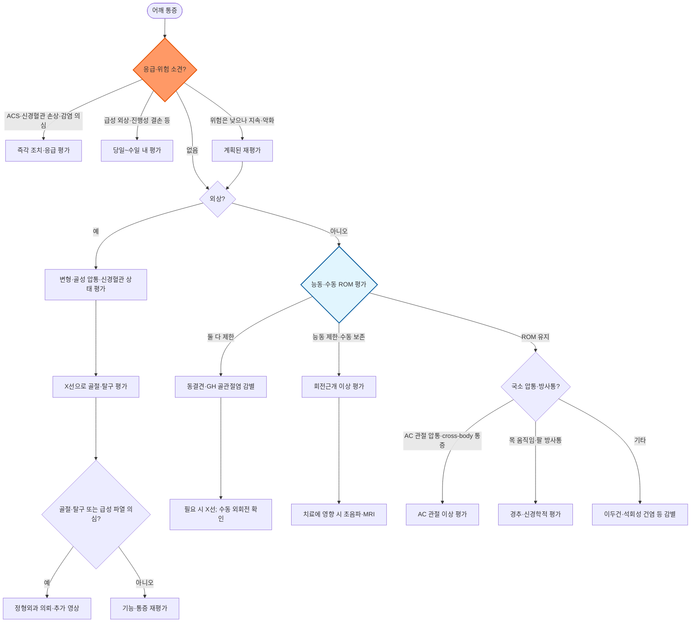

# 어깨 통증 Shoulder Pain

## <mark style="color:green;">일반 사항</mark>

* 1차 진료에서 매우 흔한 근골격계 주소증으로, 평생 유병률이 약 70%에 이름 (Ref. J Am Board Fam Med 2024)
* 경과에 따른 분류 : 급성(≤6주), 아급성(6주\~6개월), 만성(＞6개월, 치료 여부와 무관)
* 연령대별 흔한 원인이 다름
  * ＜30\~40세 : 불안정성(아탈구/탈구), 외상, 회전근개(RTC) tendinopathy
  * 중년(40\~60세) : 유착 관절낭염, RTC 부분 파열
  * 고령(＞60세) : RTC 완전 파열, glenohumeral(GH) 골관절염
* 만성 통증(＞6개월)의 주요 원인 : RTC 이상, adhesive capsulitis, instability, GH OA

## <mark style="color:green;">원인</mark>

* 외상 : 골절, 탈구, 인대/건 파열
* 과사용 : rotator cuff(RTC) 이상, 이두박근 건염, 윤활낭염, 근긴장, apophysis 손상
* 관절염 : OA(Acromioclavicular, Glenohumeral), RA
* 유착 : Adhesive capsulitis(=Frozen shoulder)
* 연관통 : 목의 이상, 심장 질환(급성 관상동맥증후군 등), 담낭 질환

### <mark style="color:orange;">위험 인자</mark>

* 반복적인 overhead activity, 어깨 부하 운동 : 배드민턴, 테니스, 야구, 배구, 역도
* 부적절한 운동 : 준비 운동 부족, 빠른 부하 증가, 잘못된 운동 방법
* 근력 저하 또는 불균형
* 동반 질환 : 당뇨병, 갑상선 질환

***

### <mark style="color:$danger;">🚩 Red Flags!</mark>

<mark style="color:$danger;">**즉각 조치 또는 의뢰**</mark>

* 운동과 관련되거나 갑자기 발생한 어깨·팔 통증에 흉부 불편감, 식은땀, 오심, 호흡곤란 등이 동반 → 급성 관상동맥증후군(ACS) 의심. 흉통이 뚜렷하지 않거나 우측 어깨가 아픈 경우도 배제하지 않음
* 외상 후 심한 변형 또는 원위부 맥박 소실·감각 저하·운동 마비 → 골절/탈구 및 동반 혈관·신경 손상 의심; 원위부 순환·신경 기능을 즉시 확인
* 급성으로 시작된 심한 어깨 관절통과 수동 운동 시 극심한 통증·운동 제한, 관절의 발적·부종·열감 또는 발열 → 화농성 관절염(septic arthritis) 의심. 발열이나 눈에 띄는 발적이 없어도 배제하지 않으며, 골수염 등도 감별
  * 감별 주의 : 급성 석회성 건염(calcific tendinitis)의 급성 발작기(resorptive phase)도 유사하게 국소 발적·열감과 극심한 통증, 때로 염증표지자 상승을 보일 수 있어 감염과 매우 유사할 수 있음. X선/초음파상 석회 침착 소견은 진단에 도움이 되나, 석회 소견이 있다는 이유만으로 감염을 배제해서는 안 되며, 감염이 임상적으로 의심되면 응급 평가와 신속한 관절천자(관절액 세포 수·감별, 결정, Gram stain·배양)를 진행 (☞ 석회성 건염 참조)

<mark style="color:$warning;">**당일~수일 내 평가**</mark>

* 외상 후 골성 압통, 변형, 뚜렷한 운동 제한 또는 능동 거상 불능(당일) → 연령에 관계없이 골절·탈구를 평가하고 X선 검사 우선; 수동 운동은 보존되나 새로 발생한 근력 저하·능동 거상 불능은 급성 회전근개 파열 가능성을 평가·의뢰
* 설명되지 않는 심한 급성 관절통, 특히 수동 운동 시 통증이 심한 경우(당일) → 발열·발적 여부와 무관하게 감염성 관절염을 감별; 의심되면 Tier 1에 따라 즉시 평가
* 설명되지 않는 지속적 휴식통/야간통이 체중 감소, 발열, 암 병력 등과 동반되는 경우 → 종양, 감염 등 심각한 원인 배제 필요
* 원인이 불확실한 통증이 체중 감소·발한 등 전신 증상과 동반되는 경우

<mark style="color:$info;">**외래 추적 / 추가 평가 계획**</mark> <mark style="color:$info;">- 즉각 위험 낮으나 호전 없으면 의뢰</mark>

* 4\~6주간의 적절한 보존적 치료(교육·활동 조절·운동 치료 ± 진통제)에도 반응 없는 통증 → 진단을 재평가하고 필요 시 영상 검사·전문과 의뢰
* 만성 경과(＞6개월)이며 원인이 불확실한 경우

***

## <mark style="color:green;">진단</mark>

### <mark style="color:orange;">검사</mark>

* 영상 검사 : 외상 여부, 경과(급성/만성), 의심 질환 및 검사 결과가 치료 방침을 변경하는지에 따라 선택
  * 급성 외상성 어깨 통증에서 골절·탈구 가능성이 있으면 X선 검사 우선
  * 급성·아급성 비외상성 어깨 통증에서 Red Flag가 없고 임상적으로 RTC tendinopathy 등이 명확하면 초기 영상 검사는 보통 필요 없음
  * 만성 또는 지속성 어깨 통증(＞6개월 또는 원인 불명확)에서 영상 검사가 필요한 경우 X선 검사를 기본 초기 영상검사로 고려 \[ACR Appropriateness Criteria, Chronic Shoulder Pain 2022 Update]
  * ✽특정 증상 기간을 영상 검사의 획일적 기준으로 삼지 않으며, 회복 속도는 환자마다 상이함 - 감염/종양 의심, 주요 외상, 진행성 위약 등 소견이 영상 검사의 실질적 기준 [JAMA Intern Med 2026]
  * X선 음성이지만 occult fracture가 의심되면 CT 또는 MRI 고려
  * RTC tear 의심 : 초음파 또는 MRI; labral tear/불안정증 의심 : MRI 또는 MR arthrography 선택
* electromyography(EMG) : 신경학적 이상(경추 신경근병증 등) 의심 시
* 감염 의심 (Red Flags 참조) : CBC, CRP/ESR, 발열·균혈증 의심 시 혈액배양을 고려. 혈액검사 정상 또는 발열 부재로 화농성 관절염을 배제하지 않으며, 의심 시 신속한 관절천자 후 관절액 배양, WBC/differential, 결정 검사, Gram stain 시행. 패혈증/쇼크에서는 검체 채취를 이유로 항생제 투여를 지연하지 않음
* 실험실 검사 : RA 등 면역 질환 의심 시 시행 (☞ 관련 질환 챕터)

### <mark style="color:orange;">신체검사</mark>

* 진찰 순서 : 시진과 골성·관절 압통 확인 → 능동·수동 운동 범위(특히 수동 외회전) 비교 → 저항 시 근력, 경추 검사 및 상지 신경혈관 검사 → 의심 질환에 맞는 특수검사. 통증으로 인한 가성 근력저하와 실제 근력저하를 구분

✽[Shoulder anatomy](https://emedicine.medscape.com/article/1899211-overview), [Shoulder muscle(3D)](https://www.innerbody.com/image/musc10.html)

_<mark style="color:$info;">Ref. Woodward TW, et al. The painful shoulder: part I. Clinical evaluation. AFP 2000;15;61(10); Burbank KM, et al. Chronic shoulder pain: part I. Evaluation and diagnosis. AFP 2008;15;77(4)</mark>_

#### <mark style="color:$primary;">어깨 관절 검사 (Shoulder Examination)</mark>

<table><thead><tr><th width="180">검사명</th><th width="330">검사 방법 [양성 소견]</th><th>의심 상태</th></tr></thead><tbody><tr><td><a href="https://www.aafp.org/afp/2000/0515/p3079.html#fig-2">Apley scratch test</a></td><td>팔을 (머리/허리) 뒤로 돌려 반대편 scapula의 상/하 부위를 만지도록 함 [운동 범위 감소 또는 좌우 차이]</td><td>Shoulder ROM screening</td></tr><tr><td><a href="https://www.aafp.org/afp/2000/0515/p3079.html#fig-5">Neer's test</a></td><td>full pronation 후 팔을 수동 full flexion [어깨 통증 재현]</td><td>Rotator cuff-related/subacromial pain</td></tr><tr><td><a href="https://www.aafp.org/afp/2000/0515/p3079.html#fig-6">Hawkins' test</a></td><td>팔꿈치 및 어깨 90° 굴곡 후 수동 내회전 [어깨 통증 재현]</td><td>Rotator cuff-related/subacromial pain</td></tr><tr><td><a href="https://www.aafp.org/afp/2000/0515/p3079.html#fig-3">Empty can test</a></td><td>팔을 scapular plane(관상면 앞 약 30°)에서 90° 정도 들어 올리고 엄지를 아래로 향하게 한 상태(full pronation)에서 검사자가 저항을 가하며 팔을 올리게 함 [건측보다 약화]</td><td>RTC 이상 (supraspinatus)</td></tr><tr><td>Painful arc test</td><td>능동 외전 시 60\~120° 구간에서 통증 재현 (그 이전·이후 구간은 상대적으로 편안함) [해당 구간 통증]</td><td>RTC-related/subacromial pain</td></tr><tr><td><a href="https://www.aafp.org/afp/2000/0515/p3079.html#fig-4">External rotation / Infraspinatus strength test</a></td><td>팔을 몸에 붙이고 팔꿈치 90° 굴곡 후 검사자가 저항을 가하면서 외회전 [건측보다 약화]</td><td>RTC 이상 (infraspinatus, teres minor)</td></tr><tr><td><a href="https://www.youtube.com/watch?v=t9dSDVRbjn0">Lift-off test</a></td><td>손등을 허리 뒤(요추부)에 댄 상태에서 손을 등에서 뒤쪽으로 떼어내도록 함(능동 lift-off); 가능하면 그 자세에서 검사자가 저항을 추가 [손을 등에서 떼지 못하거나 건측보다 약화]. 통증·강직으로 자세 자체가 불가능하면 belly-press test(손바닥을 배에 대고 팔꿈치를 앞으로 빼며 누름) 또는 bear-hug test로 대체</td><td>RTC 이상 (subscapularis)</td></tr><tr><td><a href="https://www.youtube.com/watch?v=qvwYEoeHPaA">Drop-arm test</a></td><td>팔을 수동으로 외전(약 90° 이상)시킨 후 천천히 능동적으로 내리도록 함 [유지하지 못하고 팔이 갑자기 떨어지거나 현저한 약화]</td><td>RTC tear</td></tr><tr><td><a href="https://www.aafp.org/afp/2000/0515/p3079.html#fig-7">Cross-body test</a></td><td>팔을 들어(90° 굴곡) 능동 내전 [AC joint 부위 통증]</td><td>AC joint 관절염</td></tr><tr><td><a href="https://www.youtube.com/watch?v=qKqJRrms4u8">Apprehension test</a></td><td>누워서 어깨 90° 외전, 팔꿈치 90° 굴곡 상태에서 검사자가 어깨를 외회전 시킴 [탈구될 것 같은 apprehension/불안감 재현]</td><td>Anterior GH 불안정</td></tr><tr><td><a href="https://www.youtube.com/watch?v=qKqJRrms4u8">Relocation test</a></td><td>Apprehension test 양성 시, 그 자세에서 상완골 근위부에 후방 압력 [apprehension/불안감 감소 또는 소실]</td><td>Anterior GH 불안정</td></tr><tr><td><a href="https://www.aafp.org/afp/2000/0515/p3079.html#fig-10">Sulcus test</a></td><td>중립 자세에서 검사자가 팔꿈치 또는 손목을 아래로 당김 [acromion 측/하부 함몰]</td><td>Inferior GH 불안정</td></tr><tr><td><a href="https://www.youtube.com/watch?v=lAqg39HUV7I">Clunk test</a></td><td>누워서 팔을 머리 위로 뻗어 올림. 검사자가 어깨 뒤 상완골두에 힘을 가하면서 외회전 [덜컹 소리, 걸림]</td><td>Labrum 이상</td></tr><tr><td><a href="https://www.aafp.org/afp/2000/0515/p3079.html#fig-15">Spurling's test</a></td><td>목을 환측으로 신전·회전시키고 조심스럽게 축성 압박 [평소 경험하는 팔 쪽 방사통 재현; 목·어깨의 국소 통증만으로는 양성 판정하지 않음]</td><td>Cervical nerve root 이상</td></tr></tbody></table>

#### <mark style="color:$primary;">이두근 검사 (Biceps Tendon Tests)</mark>

<table><thead><tr><th width="180">검사명</th><th width="330">검사 방법 [양성 소견]</th><th>의심 상태</th></tr></thead><tbody><tr><td><a href="https://www.aafp.org/afp/2000/0515/p3079.html#fig-9">Yergason test</a></td><td>팔꿈치 90° 굴곡 및 pronation 후 검사자가 손목을 잡고 저항을 가하면서 supination [통증/약화]</td><td>Biceps tendon 불안정 또는 건염</td></tr><tr><td><a href="https://www.youtube.com/watch?v=N00gA4Pvsbw">Speed's maneuver</a></td><td>supination 및 어깨 60° 굴곡 후 검사자가 손목을 잡고 저항을 가하면서 팔을 올리도록 함 [통증/약화]</td><td>Biceps tendon 불안정 또는 건염</td></tr></tbody></table>

### <mark style="color:orange;">감별 진단</mark>

* 통증 부위, 유발 동작, 운동 범위 제한 양상, 연령에 따라 원인 질환을 감별함

<table>
<thead><tr><th width="125">구분</th><th width="315">주요 단서</th><th>의심 상태</th></tr></thead>
<tbody>
<tr><td>통증/압통 부위</td><td>어깨 위쪽·견봉쇄골관절 부위</td><td>AC 관절 이상, 승모근 통증</td></tr>
<tr><td>통증/압통 부위</td><td>외측 삼각근 부위 통증, 견봉하 압통</td><td>회전근개 관련 통증</td></tr>
<tr><td>통증/압통 부위</td><td>견갑골 주변 뒤쪽 통증</td><td>견갑흉곽 운동 이상, 경추성 연관통</td></tr>
<tr><td>통증/압통 부위</td><td>광범위한 어깨 통증</td><td>회전근개 이상, 동결견, GH 골관절염</td></tr>
<tr><td>통증/압통 부위</td><td>여러 부위의 압통과 전신 통증</td><td>섬유근통 등 비관절성 원인</td></tr>
<tr><td>통증 유발</td><td>머리 위로 팔을 들 때 통증, 저항 운동 시 약화</td><td>회전근개 관련 통증·파열</td></tr>
<tr><td>통증 유발</td><td>목 움직임에 따른 악화, 팔꿈치 아래로 퍼지는 통증·감각 이상</td><td>경추 신경근병증</td></tr>
<tr><td>통증 유발</td><td>무거운 물건을 들거나 팔을 몸통 앞쪽으로 가로지를 때 관절 정점 통증</td><td>AC 관절 이상</td></tr>
<tr><td>통증 유발</td><td>야간 통증</td><td>회전근개 이상, 동결견, GH 골관절염 등; 단독으로 특정 질환을 진단하지 않음</td></tr>
<tr><td>통증 유발</td><td>외전·외회전 자세에서 탈구될 것 같은 불안감</td><td>GH 관절 불안정증</td></tr>
<tr><td>운동 범위</td><td>능동·수동 ROM 모두 제한, 특히 수동 외회전 제한; X선상 뚜렷한 OA 없음</td><td>동결견</td></tr>
<tr><td>운동 범위</td><td>능동·수동 ROM 제한과 X선상 관절 간격 감소·골극</td><td>GH 골관절염</td></tr>
<tr><td>운동 범위</td><td>능동 ROM 제한, 수동 ROM 상대적으로 유지</td><td>회전근개 이상; 외상 후 급성 근력 저하면 파열 평가</td></tr>
<tr><td>연령·외상</td><td>젊은 환자의 외상 후 불안감·탈구감</td><td>불안정증(아탈구·탈구)</td></tr>
<tr><td>연령·외상</td><td>중·고령의 서서히 진행하는 강직 또는 근력 저하</td><td>동결견, GH 골관절염, 회전근개 파열 등</td></tr>
<tr><td>연령·외상</td><td>외상 후 국소 골성 압통·변형·거상 불능</td><td>모든 연령에서 골절·탈구 우선 배제; 파열 동반 가능</td></tr>
<tr><td>기타</td><td>반복 부하·과사용</td><td>회전근개·AC 관절·관절와순 등</td></tr>
<tr><td>기타</td><td>당뇨병·갑상선 질환·이상지질혈증, 수술·고정 병력</td><td>동결견 위험 증가</td></tr>
</tbody></table>

### <mark style="color:orange;">질환별 상세 소견</mark>

#### <mark style="color:$primary;">회전근개 이상 (Rotator cuff disorder)</mark>

* 구성 근육 : supraspinatus, infraspinatus, teres minor, subscapularis muscle
* rotator cuff-related shoulder pain : tendinopathy, bursopathy, 부분 파열 등 회전근개 관련 통증을 포괄하는 임상적 개념

**Rotator cuff tendinopathy & bursopathy**

* 위험 요인 : 반복적인 overhead activity, 과도하거나 급격한 부하 증가, 연령 관련 퇴행성 변화 등
* 기전 : 반복 부하, 건의 내재적 퇴행성 변화, 연령, 근력·운동 조절 및 biomechanical factor 등이 복합적으로 작용
* 과거에는 subacromial impingement를 주요 기전으로 설명하였으나, 단순한 기계적 충돌만으로 rotator cuff tendinopathy를 설명하기는 어려움

**Tear**

* 젊은 연령에서는 주로 사고에 의하여 발생

**임상 양상**

* 어깨를 위로 올릴 때(예: 머리 빗기) 또는 능동적 외전 시 통증 (painful arc 60\~120°)
* 어깨 앞 및 측면(deltoid) 통증, 야간 통증
* 능동 운동 범위 감소, 수동 운동 범위 유지, 약화

**진단**

* RTC tear 의심 : 외상성 onset, 뚜렷한 근력 저하, 능동 ROM 감소에 비해 수동 ROM 보존 여부와 empty-can, external rotation strength, lift-off, drop-arm 등의 소견을 조합하여 판단. 단일 특수검사만으로 확진하지 않음
* 영상 검사 : 초음파 또는 MRI가 주로 사용되며, X선 검사는 동반 골성 병변 및 다른 원인 감별에 활용
  * 상완골두 sclerosis/cyst, acromiohumeral 간격 감소, acromial spur
  * ✽수술 전 평가에서 초음파와 MRI의 전층 파열 진단정확도는 유사하며, 초음파가 비용이 낮고 접근성이 좋으나 검사자 의존도가 높고 지방변성·관절내 구조 평가에는 제한적 - 치료 계획을 위한 상세 연조직 평가가 필요하면 MRI 선호 [JAMA Intern Med 2026]
* 참고 : ＞60세 무증상 환자의 약 50%에서 MRI상 RTC 파열이 관찰됨 (Sher JS, et al. J Bone Joint Surg Am 1995)
* 증상이 있는 소\~중형 전층 파열은 비수술적 운동치료로도 증상·기능이 호전될 수 있으나, 장기적으로는 파열 크기·근위축·지방변성이 진행할 수 있어 수술 가능성이 있는 환자는 임상 경과 관찰 및 필요 시 영상 추적을 고려 \[AAOS Clinical Practice Guideline for the Management of Rotator Cuff Injuries, 2025]

#### <mark style="color:$primary;">석회성 건염 (Calcific tendinitis)</mark>

* 정의 : 회전근개 건(주로 supraspinatus) 내 hydroxyapatite 결정 침착에 의한 통증성 질환
* 유병률 : 전체 어깨 통증의 약 10\~20%; 여성, 40\~60대에서 호발
* 경과 (3단계) : formative(형성기, 무증상 또는 경미) → resting(휴지기) → resorptive(흡수기, 결정이 재흡수되며 급성 염증 반응으로 극심한 통증 유발)
  * resorptive phase에서는 국소 발적·열감을 동반한 급격한 통증, 때로 염증표지자 상승까지 보일 수 있어 화농성 관절염과 매우 유사할 수 있음. X선/초음파의 석회 침착 소견은 진단에 도움이 되지만, 그 소견만으로 감염을 배제하지 말고 발열·전신 증상·고위험 인자가 있으면 관절천자 등 추가 평가를 우선함 (☞ Red Flags 참조)
* 임상 양상 : 특별한 유발 손상 없이 갑자기 시작되는 심한 통증, 야간 통증, 현저한 능동·수동 운동 범위 제한(급성기)
* 진단 : X선에서 rotator cuff 부착부의 석회 침착 확인(formative/resting phase에서는 균질하게 치밀한 음영, resorptive phase에서는 경계가 흐릿하고 솜털 모양); 증상이 애매한 경우 초음파로 확인 가능
* 치료 : 급성기에는 금기가 없으면 단기간 진통제·냉찜질, 필요 시 단기간 arm sling으로 통증을 조절하고 가능한 범위에서 운동 재개. 증상이 지속되는 석회성 건병증에서는 주사, 초음파 유도 세척술(barbotage), 체외충격파치료(ESWT) 등을 선별적으로 논의하되, 세척술의 효과는 위약 시술 대조시험과 지침 간 해석이 엇갈림. 심한 난치성 통증·기능장애에서 수술적 치료 상담 고려 [BMJ 2023; J Orthop Sports Phys Ther 2025]

#### <mark style="color:$primary;">이두건병증 (Biceps tendinopathy)</mark>

* 정의 : long head of biceps(LHB) tendon의 건염·불안정성·파열을 포함하는 질환군; 단독으로 발생하기보다 RTC 이상(특히 subscapularis 파열에 동반된 biceps 불안정)과 동반되는 경우가 많음
* 임상 양상 : 상완 전방부(bicipital groove) 국소 압통, overhead activity 시 악화, Yergason/Speed's test 양성 (☞ 신체검사 표 참조)
* Long head of biceps rupture : 급격한 통증 직후 상완 전방부에 "Popeye sign"(근육 배가 원위부로 몰려 튀어나옴)이 특징적; 대개 기능적 결손은 크지 않아 보존적 치료가 우선이며, 미용상 문제나 젊은 활동적 환자에서 수술 고려
* 치료 : 활동 조절, 점진적 운동 치료, 필요 시 단기간 진통제가 초기 선택. 뚜렷한 근력 저하·파열 의심 등 영상 결과가 치료를 바꿀 때 초음파/MRI로 동반 회전근개 병변 평가

#### <mark style="color:$primary;">유착 관절낭염 (Adhesive capsulitis), 동결견 (Frozen shoulder)</mark>

**일반 사항**

* 정의 : GH joint capsule의 진행성 섬유화/구축에 따른 어깨의 통증/강직, 운동 제한 (대한재활의학회 동결견 진료지침, 2025)
* 진단은 원칙적으로 병력·신체검사에 기반한 임상 진단이며, 초음파·MRI는 확진이 아닌 보조적 도구로 활용 \[대한재활의학회 2025]
* 기전 : 관절낭과 coracohumeral ligament 등의 염증·섬유화 및 구축 → 관절 용적 감소, 움직임 제한, 경직
* 유병률 : 2\~5%(당뇨병 환자에서는 10\~20%까지), 50대 중반에서 가장 많음, 약 10%에서 반대편도 이환
* 경과 : 자연 호전이 흔하지만 수개월~수년에 걸릴 수 있고 일부에서는 통증·운동 제한이 남음. 비치료 환자 51명의 장기 추적 연구에서는 94%가 정상에 가까운 기능·운동 범위를 회복하였으며 평균 이환 기간은 약 15개월이었으나, 이를 모든 환자의 회복률로 일반화하지 않음 [Vastamäki H, et al. Clin Orthop Relat Res 2012; 국내 동결견 진료지침 2025]

**원인 및 위험 인자**

* 원인 : 불확실; 만성 염증성 반응(fibroblastic proliferation) 추정
* 위험 인자 : ≥40세, 여성, 외상 또는 수술·고정 후 장기간 어깨를 사용하지 않은 경우. 당뇨병·갑상선 질환·이상지질혈증과의 연관이 일관되게 보고됨
  * 관련 질환 : 당뇨병, 갑상선 질환, 이상지질혈증, Dupuytren 구축; 뇌졸중 등 신경계 질환이나 수술 후 고정에서도 이차성 관절 강직에 주의

**임상 양상** (3단계 경과)

1. Painful (freezing) phase : 야간이나 환측으로 누울 때 악화되는 어깨 통증이 두드러지며, 이후 능동·수동 운동 범위(ROM) 제한이 점차 진행; 1주\~10개월까지 지속
   * poorly localized 어깨 통증, 압통, 강직, 근력 약화; 목과 등의 통증 동반
2. Frozen (stiffening) phase : 1년까지 지속되는 어깨 강직, ROM 제한(능동 및 수동 운동 모두 어깨 굴곡, 외전, 회전에 현저한 제한). 보통 통증은 점차 완화되며 ROM의 마지막 부분 및 야간에 발생
3. Thawing (recovery) phase : 1\~3년에 걸쳐 점차 호전; ROM 제한이 남을 수 있음(약 10%)

**진단**

* 점진적인 어깨 통증과 능동·수동 운동 범위 제한(특히 수동 외회전 제한)을 바탕으로 진단하며, 다른 관절·골성 질환을 감별
* 영상 검사 : 다른 질환 배제를 위해 선별적 시행; X선상 보통 정상. MRI상 coracohumeral lig. 비후, inf joint capsule ＞5 ㎜, axillary pouch 소실
* 관절조영술은 현재 일반적인 진단 목적으로는 드물게 사용하며, 다른 질환 감별을 위한 영상 검사를 선택적으로 시행

**치료**

* 경구 corticosteroid는 일부에서 단기 증상 개선이 보고되었으나, 6~12주에는 이득이 유지되지 않았고 전신 부작용이 있어 통상적 1차 치료로 권고하기에는 근거가 부족함. 심한 통증에서 선별적으로 검토하되 당뇨병·고혈압·감염 위험 등을 평가하고 반복 처방은 신중히 판단 [국내 동결견 진료지침 2025]
* 교육·운동 치료 및 관절강 내 주사 등 적절한 비수술 치료에도 심한 기능 제한이 지속되면 전문과 의뢰. 마취하 도수조작(MUA)의 효과 근거는 충분하지 않고 골절·회전근개 파열 등의 위험이 있으므로, 특정 기간만을 기준으로 일률적으로 권하지 않으며 시술·수술 여부를 개별화 [국내 동결견 진료지침 2025]

#### <mark style="color:$primary;">상완견관절 골관절염 (Glenohumeral osteoarthritis)</mark>

* 주로 ＞50세에서 발생

**임상 양상**

* 활동 시 통증, 야간 통증
* 강직, 움직임 제한

**진단**

* 서서히 진행되는 임상 양상
* X선 검사 : 관절 간격 감소, 골극, 연골하 경화 등. 진행되면 능동·수동 운동 범위가 모두 현저히 제한될 수 있음

#### <mark style="color:$primary;">상완견관절 불안정증 (Glenohumeral instability)</mark>

* 불안정증 : 상완골두의 ball이 shoulder socket에서 비정상적으로 움직이는 상태; dislocation 및 subluxation을 포함
* 대부분 ＜40세에서 처음 발생
* 원인 : 운동, 부딪힘

**임상 양상**

* 때때로 모호함
* 간혹 소리(clicking, popping)
* 움직일 때 팔이 어깨에서 미끄러지거나 붙잡히는 느낌
* deltoid 감각 둔화
* 탈구 시 심한 통증, 움직임 제한

**진단**

* 과거 병력
* anterior GH 불안정 : apprehension, relocation 양성
* inferior GH 불안정 : sulcus test 양성
* X선 검사 : 반복적인 비외상성 불안정증에서는 정상일 수 있으나, 급성 외상·탈구 시에는 골절·탈구 확인을 위해 시행; 정복 전후 신경혈관 상태를 평가

#### <mark style="color:$primary;">견봉쇄골 관절 이상 (Acromioclavicular joint disorder)</mark>

**종류**

* osteoarthritis
* acromioclavicular joint lig. stretching 또는 tearing
* acromioclavicular joint 탈구

**위험 인자**

* 남성, 20\~50세
* 격렬한 접촉 운동 : 럭비
* 추락 위험이 큰 운동 : 스키

**임상 양상**

* 관절통
* 관절 움직임 제한
* AC joint 통증 : 어깨 정점 부위의 국소 통증/압통, 팔을 들어올리거나 cross-body adduction 동작 시 악화

**진단**

* 국소 압통 등 임상 양상
* cross-body adduction test 양성 : AC joint 부위 통증 재현
* X선 검사 : acromioclavicular joint에 OA 소견(AC joint OA)

***



<p align="center"><strong>어깨 통증 감별 진단 알고리듬</strong></p>

<p align="center"><em><mark style="color:$info;">Ref. Burbank KM, et al. Chronic shoulder pain: part I. Evaluation and diagnosis. Am Fam Physician 2008;77(4); Sidhar K, et al. A Simplified Approach to Evaluate and Manage Shoulder Pain. J Am Board Fam Med 2024;37(6):1156-66</mark></em></p>

***

## <mark style="background-color:$warning;">Management</mark>

### <mark style="color:orange;">치료 방침</mark>

* 보존적 치료 : 행동 수정, 물리 치료, 약물 치료, 국소 steroid 주사
* 회복 기간은 원인에 따라 수주에서 수개월 이상까지 다양하며, 만성 RTC tear·진행성 GH OA 등 일부 질환에서는 잔여 증상이나 기능 제한이 남을 수 있음

<table><thead><tr><th width="170">원인 질환</th><th width="280">초기 선택</th><th>추가 선택</th></tr></thead><tbody><tr><td>AC 관절 골관절염</td><td>교육·활동 조절, 운동 치료, 필요 시 단기 진통제</td><td>지속되는 국소 통증에 AC 관절 주사; 선택적 수술 의뢰</td></tr><tr><td>동결견</td><td>통증 단계에 맞춘 운동·물리 치료; 심한 초기 통증에는 관절강 내 스테로이드 주사 고려</td><td>주사와 물리 치료 병합 또는 스테로이드 병합 관절낭 팽창술 고려; 난치성 기능 장애 시 전문과 의뢰</td></tr><tr><td>GH 불안정증</td><td>급성 골절·탈구 배제 및 처치, 이후 안정화 운동</td><td>재발성 불안정·골성 결손 등에 전문과 의뢰</td></tr><tr><td>GH 골관절염</td><td>교육·활동 조절, 운동 치료, 필요 시 단기 진통제</td><td>증상·기능 장애에 따라 주사 또는 관절치환술 상담; 히알루론산 주사 비권고</td></tr><tr><td>회전근개 관련 통증·부분 파열</td><td>교육·활동 조절, 점진적 운동 치료, 필요 시 단기 진통제</td><td>지속되는 통증에 1회 스테로이드 주사 고려; 의미 있는 근력 저하·난치성 기능 장애 시 의뢰</td></tr></tbody></table>

_✽약물은 통증 완화를 위한 보조 선택이며 질환별 운동·주사 치료의 위치가 다름. Ref. 대한재활의학회 동결견 진료지침 2025; AAOS 회전근개 지침 2025; J Orthop Sports Phys Ther 회전근개 건병증 지침 2025._

## <mark style="color:green;">비-약물 치료 및 예방</mark>

### <mark style="color:orange;">행동 수정 (주의해야 하는 동작)</mark>

* 통증을 악화시키는 bench pressing, 공 던지기 등은 일시적으로 부하를 줄이고 증상에 맞추어 점진적으로 재개
* 머리 위로 팔 올리기가 통증을 유발하면 동작·부하를 조절 : 회전근개 이상, GH 골관절염
* 무거운 물건 들기 주의 : GH OA
* cross-body adduction 주의 : AC OA
* 통증을 유발하지 않는 수준의 움직임은 지속하는 것이 필요

### <mark style="color:orange;">물리 치료</mark>

* 온/냉찜질 : 외상 초기에는 냉찜질, 만성 통증에는 온찜질; 10\~30분간 적용, 동상 주의
* 마사지, 도수 치료 : 효과가 일정하지 않음
* 동결견에서 관절강 내 corticosteroid 주사와 물리 치료 병합은 통증·기능 개선에 도움이 될 수 있음(국내 동결견 진료지침 2025). 운동의 강도는 통증 단계·기능 제한·환자 선호에 맞추어 조절
* 운동 치료 : ROM 회복 및 rotator cuff/scapular muscle의 점진적 강화·부하 운동을 증상에 맞추어 시행; 통증 완화 및 기능 개선의 핵심 치료
* therapeutic ultrasound, iontophoresis 등 물리적 modality : 근거가 제한적이거나 일관되지 않아 보조적으로 선택

#### <mark style="color:$primary;">Adhesive capsulitis exercise</mark>

* [Codman pendulum exercise](https://www.youtube.com/watch?v=dYQsTDnnCdQ) : 이환되지 않은 팔로 탁자를 짚고 상체를 앞으로 숙이고 이환된 팔을 늘어뜨림. 이환된 팔을 힘들이지 말고(몸을 흔들어) 천천히 좌우로 흔듦, 시계 방향 및 반시계 방향으로 작고 크게 원형 운동함
* [wall climbing](https://www.youtube.com/watch?v=ocOJTXj8Xeo) : 손으로 벽을 짚고 선 후 손가락으로 벽을 기어오르는 동작. 매 6 inch 오를 때마다 멈춰 유지(30초). 통증이 느껴지면 중단

### <mark style="color:orange;">기타</mark>

* arm sling : 급성 외상·AC joint 손상·극심한 통증에서 단기간 comfort 목적으로 사용; 장기간 고정은 관절 강직 위험이 있으므로 피하고 가능한 범위 내에서 조기 ROM 운동을 시작

## <mark style="color:green;">약물 치료</mark>

* 진통제는 교육·활동 조절·운동 치료를 돕는 단기 보조 요법으로 사용. 환자의 위장관·심혈관·신장·간 위험에 따라 acetaminophen 또는 NSAID를 선택 (☞ 관련 챕터)

### <mark style="color:orange;">항염증제, 진통제</mark>

* ibuprofen : 200\~800 ㎎ tid <mark style="color:blue;">\[부루펜]</mark>
* naproxen : 250\~500 ㎎ bid <mark style="color:blue;">\[낙센]</mark>
* acetaminophen : 제품·제형에 맞추어 투여(예: 650 ㎎ 서방정은 1회 2정, 최소 8시간 간격, 24시간 최대 6정). 모든 함유 제품의 총량 확인; 간질환·잦은 음주·고령·저체중에서는 더 낮은 용량·상한 고려 <mark style="color:blue;">\[타이레놀8시간이알서방정]</mark>
* 국소 NSAID 겔/패치 : 전신 노출을 줄이고 싶은 환자에서 피부 상태·제형별 허가사항을 확인한 뒤 시도 가능. 일반 근골격계 통증에서는 경구제보다 전신 부작용이 적지만, 깊은 회전근개 병변에서 경구제와 동등한 효과가 입증된 것은 아님 [J Orthop Sports Phys Ther 2025]
* tramadol : 다른 진통 요법으로 조절되지 않는 심한 급성 통증에서 예외적으로 단기간 고려; 캡슐은 성인 1회 50 ㎎으로 시작, 허가상 1일 최대 400 ㎎. 고령·신기능/간기능 저하 시 용법을 조정하고 구체적 복용 간격과 1일 한도를 처방전에 명시 <mark style="color:blue;">\[트리돌캡슐50㎎]</mark>
  * ✽국내에서는 현재 마약류(향정신성의약품)로 지정되어 있지 않으나, 의존성·오남용 우려로 식약처 집중모니터링 대상이며 마약류 지정 여부가 지속 논의 중임(2022년 허가사항에서 "의존성이 낮으나" 문구 삭제, 경고 강화). 처방 시 최소 유효 용량·최단 기간 원칙 준수

## <mark style="color:green;">시술 및 기타 처치</mark>

### <mark style="color:orange;">Steroid 국소 주사</mark>

* 대상 : 동결견의 심한 초기 통증에서는 운동 치료와 병행하여 관절강 내 주사를 고려 가능. 회전근개 관련 통증에서는 운동·교육 등 초기 치료 후 통증으로 재활이 어렵거나 증상이 지속될 때 단기 통증·기능 개선을 위해 국소 마취제 병용 1회 주사를 고려 \[AAOS Clinical Practice Guideline for the Management of Rotator Cuff Injuries, 2025]
* subacromial-subdeltoid bursa, glenohumeral joint, AC joint 등 병변 부위에 따라 시행; 필요 시 초음파 유도
* 주사 유도법은 대상 병변·시술자의 숙련도·접근성을 고려. 동결견 관절강 내 주사는 초음파 유도의 임상적 우월성이 확립되지 않았지만 정확도는 높을 수 있으며, 회전근개 건병증의 견봉하 주사는 가능한 경우 초음파 유도가 단기 통증 조절에 도움이 될 수 있음 [국내 동결견 진료지침 2025; J Orthop Sports Phys Ther 2025]
* 질환 종류와 병변 부위에 따라 효과 차이가 있으며 장기 효과는 제한적일 수 있음
* 반복 주사는 가급적 제한하며, 특히 rotator cuff tear가 있거나 수술을 고려하는 환자에서는 반복 corticosteroid injection이 회전근개 조직의 integrity를 저해하고 이후 봉합술 결과에 영향을 줄 수 있어 피하는 것이 바람직함 \[AAOS 2025]
* AC joint 주사 시 주의 : AC joint는 피하 지방층이 얇은 표재성 부위이므로, 다른 관절강 내 주사보다 피부 위축(fat atrophy) 및 탈색(hypopigmentation) 위험이 상대적으로 높음 - 시술 전 환자에게 설명

### <mark style="color:orange;">기타, 수술</mark>

* hyaluronate 주사 : Glenohumeral OA에서 임상적 이득이 없어 권고하지 않음 \[AAOS]
* capsular hydrodilatation (관절낭 팽창술) : 동결견에서 식염수 등을 주입하며 관절강 내 스테로이드를 병합하는 방법; 일부에서 단기 통증·기능 개선을 위해 고려 [국내 동결견 진료지침 2025]
* suprascapular nerve block : 단기 통증 완화 효과
* low-level laser therapy : adhesive capsulitis에서 일부 단기 효과가 보고되었으나 근거 제한
* 보톡스 : 증거 불충분
* PRP(platelet rich plasma) : 회전근개 전층 파열의 비수술적 관리 및 봉합술 생물학적 증강 목적의 routine 사용은 지지되지 않음; 다만 liquid PRP는 제한적 맥락에서 일부 근거가 있음 \[AAOS 2025]. 그 외 어깨 질환에서는 근거가 제한적
* 수술/정형외과 의뢰 : 골절·탈구 및 급성 외상 후 새로 발생한 현저한 근력 저하·전층 회전근개 파열 의심 시 조기 평가. 큰/진행성 파열 또는 적절한 비수술 치료에도 증상이 지속되는 경우에도 고려. 수술 결정은 파열 크기뿐 아니라 외상 여부, 증상·기능, 활동 수준, 근위축·지방변성, 연령·동반질환 등을 종합하여 판단

***

## <mark style="color:red;">질병코드</mark>

M19.01 기타 관절의 원발성 관절증, 어깨부분

M25.51 관절통, 어깨부분

M75.0 어깨의 유착성 관절낭염

M75.1 회전근개 증후군

M75.3 어깨의 석회성 건염

M75.4 어깨의 충돌증후군

M75.9 어깨병변, 상세불명

S43.0 어깨관절의 탈구

S43.1 견봉쇄골관절의 탈구

S43.4 어깨관절의 염좌 및 긴장

***

## <mark style="color:purple;">처방례</mark>

> **처방례 1. 경증\~중등도 급성 통증**
>
> ```
> 부루펜정 400 ㎎/T  1T  tid  pc
> ```
>
> _✽교육·활동 조절·운동 치료와 함께 단기간 통증 조절이 필요한 환자에서 사용. 위장관·심혈관·신장 위험과 항응고제 병용 여부를 평가하고 최소 유효 용량·최단 기간 사용_

> **처방례 2. NSAID 금기 또는 사용이 부적절한 경우**
>
> ```
> 타이레놀8시간이알서방정 650 ㎎/T  2T  q8h  (1일 최대 6T)
> ```
>
> _✽NSAID 사용이 부적절한 환자에서 고려하는 성인 예시이며, 650 ㎎ 서방정은 씹거나 분쇄하지 않음. 1일 6정(3,900 ㎎)은 이 제형의 상한이므로 최소 유효 용량으로 단기간 사용하고, 고령·저체중·간질환·잦은 음주에서는 더 낮은 용량·상한을 개별 설정. 복합제의 acetaminophen 함량을 합산_

> **처방례 3. 심한 급성 통증, 다른 진통제로 조절되지 않을 때 예외적 단기 사용**
>
> ```
> 트리돌캡슐50㎎  1Cap  q6h prn  (이 처방례에서 1일 최대 4Cap)
> ```
>
> _✽다른 진통 요법으로 조절되지 않는 심한 급성 통증에서 예외적으로 단기간 사용. 허가상 성인 최대 400 ㎎/일이나 이 처방례는 최대 200 ㎎/일로 제한. 고령·신/간기능 저하 환자에서는 용량·간격 조정. 졸림·오심·변비, 의존·오남용 위험 및 SSRI/SNRI/TCA 등과 병용 시 세로토닌 증후군 위험 설명_

> **처방례 4. 유착 관절낭염의 초기 심한 통증과 기능 제한**
>
> ```
> triamcinolone acetonide 40 ㎎ 관절강 내 주사 (초음파 유도 하, 1회)
> ```
>
> _✽관절강 내 corticosteroid 주사는 단기 통증·기능 개선 목적으로 고려하며 반복 주사는 가급적 제한. 당뇨 환자에서는 일시적 혈당 상승 가능성을 사전에 설명_

***

### <mark style="color:$success;">핵심 복약 지도</mark>

> **NSAID 복용 시 주의 사항**
>
> * 위장 불편을 줄이기 위해 가능하면 음식과 함께 복용하도록 안내; 위장관 출혈 위험은 식사 여부와 별개로 환자 위험인자에 따라 평가
> * 65세 이상, 소화성 궤양 병력, 항응고제/저용량 아스피린 병용 시 위장관 출혈 위험 증가 - 필요시 PPI 병용 고려
> * 신기능 저하 환자, 이뇨제/ACE 억제제 병용 환자에서는 신독성 위험 설명
> * 최소 유효 용량·최단 기간 사용하고, 수일 이상 복용이 필요하거나 통증이 악화되면 원인과 부작용을 재평가

> **Tramadol 처방 시 주의 사항**
>
> * 졸림, 어지럼 유발 가능 - 복용 초기 운전·기계 조작 주의
> * SSRI, SNRI, TCA, triptan 등과 병용 시 세로토닌 증후군 위험 - 병용 약물 확인 필요
> * 필요 최소 용량으로 가능한 짧게 사용; 의존·오남용 가능성이 있어 수일 이상 지속적으로 필요한 경우 원인 재평가 및 치료 방침 재검토

> **관절강 내 steroid 주사 관련 안내**
>
> * 주사 후 1\~2일간 일시적으로 통증이 악화될 수 있음을 사전에 설명 (steroid flare)
> * 반복 주사는 가급적 제한하며, 회전근개 파열이 있거나 수술을 고려하면 건 조직과 향후 봉합술에 영향을 줄 수 있어 신중히 판단
> * AC joint 등 표재성 부위 주사 시 피부 위축·탈색 가능성을 사전에 설명
> * 당뇨 환자는 주사 후 수일간 혈당이 일시적으로 상승할 수 있음을 안내

> **언제 다시 병원을 방문해야 하나요?**
>
> * 4\~6주간의 적절한 교육·활동 조절·운동 치료에도 통증이나 기능이 호전되지 않는 경우
> * 갑자기 시작된 심한 어깨 관절통, 특히 조금만 움직여도 극심한 통증이 있거나 발열·발적·부종이 동반되는 경우 - 즉시 평가
> * 외상 후 심한 변형, 팔의 감각 저하나 힘이 빠지는 증상이 동반되는 경우 - 즉시 내원
> * 갑자기 발생한 어깨·팔 통증에 가슴 불편감, 식은땀, 오심 또는 호흡곤란이 동반되는 경우 - 흉통이 없어도 즉시 응급실 방문
> * 약물 복용 후 흑색변·혈변, 심한 위통, 피부 발진·두드러기·호흡곤란 등 알레르기 반응이 나타나는 경우 - 즉시 복용 중단 후 내원

***

### <mark style="color:blue;">환자 안내서</mark>


**어깨 통증, 원인에 따라 치료와 회복 기간이 다릅니다**

어깨 통증은 회전근개(어깨 힘줄), 관절, 인대, 신경 등 다양한 원인으로 생길 수 있습니다. 대부분은 시간과 적절한 관리로 좋아지지만, 원인에 따라 회복까지 수개월이 걸릴 수 있습니다.


#### <mark style="color:$primary;">왜 어깨가 아픈가요?</mark>

* 어깨는 우리 몸에서 움직임의 범위가 가장 넓은 관절이라 그만큼 손상되기도 쉽습니다.
* 반복적으로 팔을 머리 위로 드는 동작(운동, 작업)이나 나이가 들면서 힘줄이 약해지는 것이 흔한 원인입니다.
* 넘어지거나 부딪히는 외상, 관절염, 어깨 관절막이 굳어지는 이른바 '오십견'(유착 관절낭염)도 흔한 원인입니다.

#### <mark style="color:$primary;">일상생활에서 어떻게 관리하나요?</mark>

* **통증을 유발하는 동작을 당분간 피하십시오.** 머리 위로 팔 올리기, 무거운 물건 들기, 벤치프레스나 공 던지기 같은 동작은 증상을 악화시킬 수 있습니다.
* **통증이 없는 범위 내에서는 팔을 계속 움직이십시오.** 완전히 움직이지 않으면 오히려 어깨가 굳을 수 있습니다.
* **온찜질 또는 냉찜질을 활용하십시오.** 다친 직후에는 냉찜질이, 오래된 통증에는 온찜질이 도움이 될 수 있습니다. 한 번에 10\~30분을 넘기지 말고 동상에 주의하십시오.
* **의사나 물리치료사가 알려준 운동을 증상에 맞추어 꾸준히 하십시오.** 어깨가 뻣뻣할 때는 코드만(Codman) 진자 운동이나 벽 오르기 운동을 통증이 허용하는 범위에서 시행합니다.

#### <mark style="color:$primary;">약은 어떻게 복용하나요?</mark>

* 소염진통제(NSAID)는 위장 불편을 줄이기 위해 음식과 함께 복용할 수 있으며, 타이레놀(acetaminophen)은 식사와 관계없이 복용할 수 있습니다. 정해진 용량과 기간을 지켜주십시오.
* 관절 내 주사 후 1\~2일간 통증이 일시적으로 심해질 수 있습니다. 열이 나거나 통증·붓기가 지속적으로 악화되면 즉시 진료받으십시오.

#### <mark style="color:$primary;">이럴 때는 즉시 병원을 방문하세요</mark>

* 어깨가 갑자기 매우 아프고 조금만 움직여도 극심한 통증이 생기는 경우. 열이 나거나 붉게 붓고 뜨거워지면 더욱 서둘러 진료받으십시오.
* 넘어지거나 부딪힌 후 어깨 모양이 심하게 변형되거나, 팔에 힘이 빠지고 감각이 둔해지는 경우
* 갑자기 발생한 어깨·팔 통증에 가슴 불편감, 식은땀, 오심 또는 숨찬 증상이 동반되는 경우 - 흉통이 뚜렷하지 않아도 즉시 119 또는 응급실

**재평가를 예약하세요**

* 적절히 관리했는데도 4\~6주가 지나도록 통증이 나아지지 않거나 기능이 떨어지는 경우
