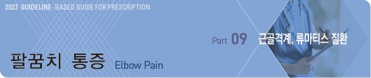
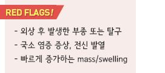
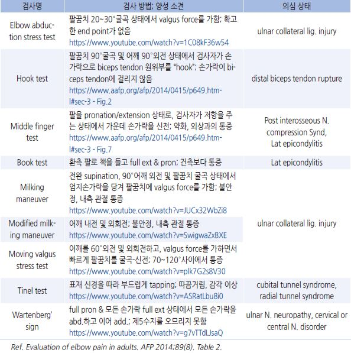
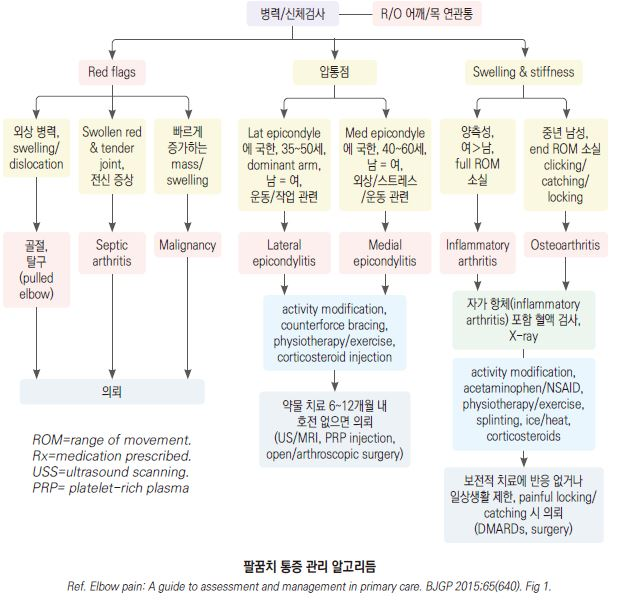

# 팔꿈치 통증 Elbow Pain



## 일반 사항

* 팔꿈치 관절과 주위 구조물(tendon, bursa, nerve)의 이상 또는 연관통(목, 어깨, 손목)으로 발생
* lateral epicondyle에서의 문제가 가장 흔함
* 정상 운동 범위 : 0o(full extension)~~135~~150o(full flexion), 0o(supination)\~180o(pronation)
* 진찰 시 다음 상태에 대하여 양측을 비교 : 홍반, 부종, 열감, 위축, deformity, 비대칭
* 직업과 관련하여 발생한 통증은 치료가 어려움



## 원인

*   과사용(운동, 직업) : 손을 움직이는 근육의 힘줄들의 기시부인 lateral/medial

    epicondyle에서 tendinopathy(epicondylitis) 발생
* 연관통 : cervical radiculopathy, rotator cuff syndrome
* arthritis : RA(inflammatory), 외상 후, primary osteoarthritis(드묾)
* 소아 : pulled elbow

### Lat elbow pain

```

```

### Med elbow pain

```

```

### 기타

```

```

## 진단

### 신체검사

> ✽elbow anatomy 1, elbow anatomy 2

> ✽elbow muscle(3D)

*   팔꿈치 신전 및 굴곡 운동 범위가 정상인 경우 관절 내 문제일 가능성은 적음

    

    ※ 링크

> ```
> Elbow abduction stress test
> ```

```
Hook test - Fig.2
```

```
Middle finger test - Fig.7
Milking maneuver
Modified milk
Moving valgus stress test
Tinel test
Wartenberg’ sign
```

>

영상 검사

* 보통 필요 없음
* plain radiography : tendinopathy에서는 대부분 정상 소견; 외상력, 운동 범위/기능의 유의미한 감소가 있는 경우 고려
* 초음파 : tendinopathy(MRI보다 정확도 낮음)
* MRI : tendinopathy, nerve entrapment, joint effusion 진단에 가장 유효
* MR arthrography : ligament tear, osteochondral defect, loose body
* CT : 만성 통증 진단에 대한 유용성 낮음; soft tissue calcification(예: myositis ossificans, intra-articular body)

### 신경전도 검사

* 신경 이상이 의심되는 경우 고려
* neuropathy에서 전기적 이상 발생까지 시일이 걸리므로 발병 6\~8주 이후(최소 3주 이후) 시행

### 실험실 검사

* CBC, ESR, RA factor, autoantibody : 염증성 관절염이 의심되는 경우 시행
*   점액낭액 검사 : WBC, 배양 검사, 그람염색, crystal 확인; 검사와 관련하여 합병증이 발생할 수 있으므로

    진단이 불확실하거나난치성인 경우, 통증/국소 염증/전신 발열이 있는 경우 고려

### 감별

* full extension 시 통증 → synovitis(예: RA, reactive arthritis, psoriasis, IBD, gout, septic arthritis)
* numbness, tingling → nerve radiculopathy(예: medial epicondylitis, osteoarthritis, inflammatory arthritis)
* 만성, 진행성, full extension 제한, painful clicking/catching/locking, 강직 → 골관절염
*   lateral epicondyle과 olecranon 사이 bulging, 팔꿈치 신전 또는 굴곡 제한, supination 또는 pronation 제한

    → radiohumeral joint 이상(예: arthritis)
* 양측성, 관절 부종 및 강직, ROM 감소, 다른 관절 이환, 전신 증상 → 염증성 관절염(예: RA)
* 팔꿈치 후방 구조물에서의 click, crepitus → radial head fracture, arthritis, loose body
*   팔꿈치 전체 통증, 팔꿈치 운동 범위 정상, 팔꿈치 움직임에 따른 통증 증가 없음, 국소 압통 및 부종 없음,

    어깨 또는 목을 움직일 때 증상 증가 → 연관통

***

## Management

### 치료 목표

* 통증 완화, 신체 기능 회복, 작업 능력 유지

### 보존적 치료

* Rest : relative rest, 악화 증상 회피, counterforce bracing
* Ice : 동상 주의(피부에 직접 얼음이 닿지 않도록 함)
*   진통제 : acetaminophen, NSAID

    •acetaminophen : 650\~1,300 ㎎ tid \[타이레놀]

    •ibuprofen : 200\~800 ㎎ tid \[부루펜]

    •naproxen : 250 ㎎ tid\~500 ㎎ bid \[낙센]
* steroid injection : 단기 증상 완화 효과; 장기 사용은 금지
* 재활 치료, PT : 근력 강화

※ 추적 관리 : 환자 상황에 따라 결정. 일반적으로 2\~4주

의뢰

* 6\~12개월의 보존적 치료에도 불구하고 호전되지 않으면 의뢰
* botulinum toxin, PRP : tendinopathy에 적용(근거 부족)
*   수술; 수술 후에도 25%의 환자에서 증상이 남아 있음

    

> **질병코드** M25.52 관절통, 위팔

M70.2 주두윤활낭염

M75.2 이두근 힘줄염

M77.0 내측상과염

M77.1 외측상과염

G56.2 척골신경의 병변

G56.3 요골신경의 병변
