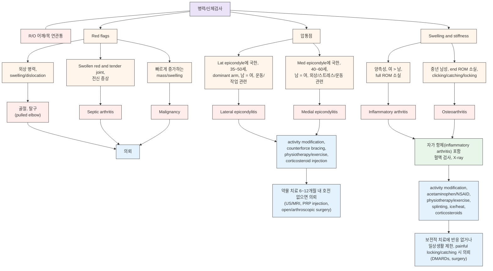

# 팔꿈치 통증 Elbow Pain

## 일반 사항

* 팔꿈치 관절과 주위 구조물(tendon, bursa, nerve)의 이상 또는 연관통(목, 어깨, 손목)으로 발생
* lateral epicondyle에서의 문제가 가장 흔함
* 정상 운동 범위 : 0o(full extension)~~135~~150o(full flexion), 0o(supination)\~180o(pronation)
* 진찰 시 다음 상태에 대하여 양측을 비교 : 홍반, 부종, 열감, 위축, deformity, 비대칭
* 직업과 관련하여 발생한 통증은 치료가 어려움

## 원인

*   과사용(운동, 직업) : 손을 움직이는 근육의 힘줄들의 기시부인 lateral/medial

    epicondyle에서 tendinopathy(epicondylitis) 발생
* 연관통 : cervical radiculopathy, rotator cuff syndrome
* arthritis : RA(inflammatory), 외상 후, primary osteoarthritis(드묾)
* 소아 : pulled elbow

#### Lat elbow pain

| 진단                                   | 병인 / 임상 양상 / 진단 검사                                                                                                                                                                         | 치료                                                                                                       |
| ------------------------------------ | ------------------------------------------------------------------------------------------------------------------------------------------------------------------------------------------ | -------------------------------------------------------------------------------------------------------- |
| **Lat epicondylitis (Tennis elbow)** | 
• 반복적인 팔꿈치/손목 움직임 • 잡행성; 주로 쓰는 팔 이환; lat epicondyle 압통 • 손목 resisted ext 또는 radial deviation 시 통증, 악력 감소 • book test, middle finger test • lat epicondyle 국소 마취 주사 시 호전
 | 
• Rest, Ice, Bracing(손목 ext 자세) • 스트레칭, 강화 훈련 • NSAID, 국소 steroid 주사, PRP, dry needling, 수술
 |
| **Post interosseous N. Synd**        | 
• 중지 신전력 약화 • middle finger test
                                                                                                                                                 | 
• 자극 활동 중지 • Bracing(전완 supn, 손목 ext) • PT, 수술
                                              |
| **Radial tunnel Synd**               | 
• 전완 외측부 통증 • 제3수지 resisted flex 시 전완 근위부 ext M. 통증 발생
                                                                                                                           | • 수술                                                                                                     |

¹⁾ 초보 one-handed backhand stroke player에서 호발\
²⁾ 손의 extensor M. 기시부(lateral epicondyle의 원위 1 ㎝)\
³⁾ 종종 tennis elbow로 오진하거나 이를 치료하다 실패하면 Radial tunnel Synd으로 진단하게 됨
\
PT=physical therapy, supn=supination, pron=pronation, ext=extension, flex=flexion,
\
PRP=platelet-rich plasma
\
Ref. Evaluation of elbow pain in adults. AFP 2014;89(8)

#### Med elbow pain

| 진단                                     | 병인 / 임상 양상 / 진단 검사                                                                                                                                                                               | 치료                                                                                               |
| -------------------------------------- | ------------------------------------------------------------------------------------------------------------------------------------------------------------------------------------------------ | ------------------------------------------------------------------------------------------------ |
| **Med epicondylitis (Golfer’s elbow)** | 
• 반복적인 elbow valgus stress &#x26; flex, wrist pron &#x26; flex • 잠행성: med epicondyle 압통; 손목 resisted flex &#x26; pron 또는 ulnar deviation 시 통증; 악력 감소 • med epicondyle 국소 마취 주사 시 호전
 | 
• Rest, Ice, Bracing; 스트레칭, 강화 훈련 • NSAID(경구/경피); 국소 steroid 주사, PRP, dry needling; 수술
 |
| **Cubital tunnel Synd (Ulnar N.)**     | 
• 지속적인 굴곡 상태/활동, med epicondylitis • 잠행성: 전완 내측/제4,5수지 따끔거림·감각 저하; 악력 약화 • cubital tunnel Tinel sign; Wartenberg’s sign
                                                             | 
• 자극 활동 중지, 야간 팔꿈치 신전 복부, PT • 수술
                                                      |
| **Ulnar collateral ligament injury**   | 
• 반복적인 elbow valgus stress; 운동선수(overhead throwing 동작) • 운동 중 유발 활동 후 통증 발생; valgus elbow instability; 팔꿈치 내측 bruising, 압통 • moving valgus stress test, milking maneuver
            | 
• Rest, Ice, sling • NSAID; 수술
                                                         |

¹⁾ flexor-pron M. 부착부(medial epicondyle의 전방 및 원위 5\~10 ㎜)\
²⁾ 4\~6개월 치료에 회복 안 되는 경우 고려

#### 기타

| 진단                               | 병인 / 임상 양상 / 진단 검사                                                                                                                                 | 치료                                                                            |
| -------------------------------- | -------------------------------------------------------------------------------------------------------------------------------------------------- | ----------------------------------------------------------------------------- |
| **Biceps tendinitis (Anterior)** | 
• 반복적인 elbow flex, forearm supn/pron • vague pain; ante-cubital fossa 전방 압통 • resisted supn 시 antecubital fossa 심부 통증 발생; hook test¹)
 | 
• Rest, Ice; PT • NSAID
                                             |
| **Olecranon bursitis (무균성)**     | 
• minor trauma(예: 팔꿈치로 기댐), RA, gout • olecranon의 boggy, cystic swelling; 염증 소견(예: 홍반) 없음, 압통 없음; 운동 범위 정상 • 점액낭액 검사
                  | 
• Ice, 압박 드레싱, 약한 통증 회피 • 1~2주간 압박, bursectomy³) • 국소 steroid 주사
 |
| **Olecranon bursitis (세균성)**     | 
•abrasion, cellulitis •olecranon 부위 염증 소견; 전신 발열
 (50%에서 발생) •점액낭액 검사
                                                                    | 
•흡인 및 mechanical rest
 •전신 항생제
                                      |
| **Post impingement**             | 
• 완전 신전 시 통증 • 영상 검사(신경골 검사)
                                                                                                             | 
• 불편한 동작 회피 • arthroscopic osteotomy
                                |
| **Triceps tendinopathy**         | 
• 반복적인 신전(힘들어 미는 동작); resisted Ext. 시 통증 • triceps M. 부착부 압통
                                                                             | 
• Rest, Ice; PT • NSAID
                                             |

¹⁾ hook test 양성(hooking 되지 않음) 시 tendon rupture 의심\
²⁾ Olecranon의 국소 홍반, 열감을 동반한 급성 부종에 대하여 외상, 통풍 등 고려\
³⁾ ＞3개월 치료에 회복 안되는 경우 고려

### Red Flags!

* 외상 후 발생한 부종 또는 탈구
* 국소 염증 증상, 전신 발열
* 빠르게 증가하는 mass/swelling

## 진단

### 신체검사

✽[elbow anatomy](https://emedicine.medscape.com/article/96758-overview), [elbow muscle](https://www.healthline.com/health/elbow-muscles-male#1)(3D)

* 팔꿈치 신전 및 굴곡 운동 범위가 정상인 경우 관절 내 문제일 가능성은 적음

| 검사명                                                                        | 검사 방법 \[양성 소견]                                                                               | 의심 상태                                                            |
| -------------------------------------------------------------------------- | -------------------------------------------------------------------------------------------- | ---------------------------------------------------------------- |
| [Elbow abduction stress test](https://www.youtube.com/watch?v=1C08kF36w54) | 팔꿈치 20\~30° 굴곡 상태에서 valgus force를 가함; 확고한 end point가 없음                                      | Ulnar collateral ligament injury                                 |
| [Hook test](https://www.aafp.org/afp/2014/0415/p649.html#sec-3)            | 팔꿈치 90° 굴곡 및 어깨 90° 외전 상태에서 검사자가 손가락으로 biceps tendon 원위부를 “hook”; 손가락이 biceps tendon에 걸리지 않음 | Distal biceps tendon rupture                                     |
| [Middle finger test](https://www.aafp.org/afp/2014/0415/p649.html#sec-3)   | 팔을 pronation/extension 상태로, 검사자가 저항을 주는 상태에서 가운데 손가락을 신전; 약화, 외상과의 통증                        | Post interosseous N. compression syndrome, Lateral epicondylitis |
| Book test                                                                  | 환측 팔로 책을 들고 full extension & pronation; 건측보다 통증                                              | Lateral epicondylitis                                            |
| [Milking maneuver](https://www.youtube.com/watch?v=JUCx32WbZi8)            | 전완 supination, 90° 어깨 외전 및 팔꿈치 굴곡 상태에서 엄지손가락을 당겨 팔꿈치에 valgus force를 가함; 불안정, 내측 관절 통증        | Ulnar collateral ligament injury                                 |
| [Modified milking maneuver](https://www.youtube.com/watch?v=SwigwaZxBXE)   | 어깨 내전 및 외회전; 불안정, 내측 관절 통증                                                                   | Ulnar collateral ligament injury                                 |
| [Moving valgus stress test](https://www.youtube.com/watch?v=plk7G2s8V30)   | 어깨를 60° 외전 및 외회전하고, valgus force를 가하면서 빠르게 팔꿈치를 굴곡-신전; 70\~120° 사이에서 통증                      | Ulnar collateral ligament injury                                 |
| [Tinel test](https://www.youtube.com/watch?v=ASRatLbu8i0)                  | 표재 신경을 따라 부드럽게 tapping; 따끔거림, 감각 이상                                                          | Cubital tunnel syndrome, Radial tunnel syndrome                  |
| [Wartenberg’s sign](https://www.youtube.com/watch?v=g7vTTdLJsaQ)           | full pronation 및 모든 손가락 full extension 상태에서 모든 손가락을 abduction 후 adduction; 제5수지를 오므리지 못함     | Ulnar N. neuropathy, Cervical or central N. disorder             |

Ref. Evaluation of elbow pain in adults. AFP 2014;89(8). Table 2.

### 영상 검사

* 보통 필요 없음
* plain radiography : tendinopathy에서는 대부분 정상 소견; 외상력, 운동 범위/기능의 유의미한 감소가 있는 경우 고려
* 초음파 : tendinopathy(MRI보다 정확도 낮음)
* MRI : tendinopathy, nerve entrapment, joint effusion 진단에 가장 유효
* MR arthrography : ligament tear, osteochondral defect, loose body
* CT : 만성 통증 진단에 대한 유용성 낮음; soft tissue calcification(예: myositis ossificans, intra-articular body)

### 신경전도 검사

* 신경 이상이 의심되는 경우 고려
* neuropathy에서 전기적 이상 발생까지 시일이 걸리므로 발병 6\~8주 이후(최소 3주 이후) 시행

### 실험실 검사

* CBC, ESR, RA factor, autoantibody : 염증성 관절염이 의심되는 경우 시행
* 점액낭액 검사 : WBC, 배양 검사, 그람염색, crystal 확인; 검사와 관련하여 합병증이 발생할 수 있으므로 진단이 불확실하거나난치성인 경우, 통증/국소 염증/전신 발열이 있는 경우 고려

### 감별

* full extension 시 통증 → synovitis(예: RA, reactive arthritis, psoriasis, IBD, gout, septic arthritis)
* numbness, tingling → nerve radiculopathy(예: medial epicondylitis, osteoarthritis, inflammatory arthritis)
* 만성, 진행성, full extension 제한, painful clicking/catching/locking, 강직 → 골관절염
* lateral epicondyle과 olecranon 사이 bulging, 팔꿈치 신전 또는 굴곡 제한, supination 또는 pronation 제한 → radiohumeral joint 이상(예: arthritis)
* 양측성, 관절 부종 및 강직, ROM 감소, 다른 관절 이환, 전신 증상 → 염증성 관절염(예: RA)
* 팔꿈치 후방 구조물에서의 click, crepitus → radial head fracture, arthritis, loose body
* 팔꿈치 전체 통증, 팔꿈치 운동 범위 정상, 팔꿈치 움직임에 따른 통증 증가 없음, 국소 압통 및 부종 없음, 어깨 또는 목을 움직일 때 증상 증가 → 연관통

***

## Management

### 치료 목표

* 통증 완화, 신체 기능 회복, 작업 능력 유지

### 보존적 치료

* Rest : relative rest, 악화 증상 회피, counterforce bracing
* Ice : 동상 주의(피부에 직접 얼음이 닿지 않도록 함)
* 진통제 : acetaminophen, NSAID
  * acetaminophen : 650\~1,300 ㎎ tid \[타이레놀]
  * ibuprofen : 200\~800 ㎎ tid \[부루펜]
  * naproxen : 250 ㎎ tid\~500 ㎎ bid \[낙센]
* steroid injection : 단기 증상 완화 효과; 장기 사용은 금지
* 재활 치료, PT : 근력 강화
* 추적 관리 : 환자 상황에 따라 결정. 일반적으로 2\~4주

### 의뢰

* 6\~12개월의 보존적 치료에도 불구하고 호전되지 않으면 의뢰
* botulinum toxin, PRP : tendinopathy에 적용(근거 부족)
* 수술; 수술 후에도 25%의 환자에서 증상이 남아 있음

```mermaid
graph TD
    A["병력/신체검사"]
    B["R/O 어깨/목 연관통"]

    A --- B

    A --> C["Red flags"]
    A --> D["압통점"]
    A --> E["Swelling and stiffness"]

    %% Red flags branch
    C --> C1["외상 병력,<br/>swelling/dislocation"]
    C --> C2["Swollen red and tender joint,<br/>전신 증상"]
    C --> C3["빠르게 증가하는<br/>mass/swelling"]

    C1 --> R1["골절, 탈구<br/>(pulled elbow)"]
    C2 --> R2["Septic arthritis"]
    C3 --> R3["Malignancy"]

    R1 --> X["의뢰"]
    R2 --> X
    R3 --> X

    %% 압통점 branch
    D --> D1["Lat epicondyle에 국한, 35~50세,<br/>dominant arm, 남 = 여, 운동/작업 관련"]
    D --> D2["Med epicondyle에 국한, 40~60세,<br/>남 = 여, 외상/스트레스/운동 관련"]

    D1 --> R4["Lateral epicondylitis"]
    D2 --> R5["Medial epicondylitis"]

    R4 --> T1["activity modification,<br/>counterforce bracing,<br/>physiotherapy/exercise,<br/>corticosteroid injection"]
    R5 --> T1

    T1 --> T2["약물 치료 6~12개월 내 호전 없으면 의뢰<br/>(US/MRI, PRP injection,<br/>open/arthroscopic surgery)"]

    %% Swelling and stiffness branch
    E --> E1["양측성, 여 &gt; 남,<br/>full ROM 소실"]
    E --> E2["중년 남성, end ROM 소실,<br/>clicking/catching/locking"]

    E1 --> R6["Inflammatory arthritis"]
    E2 --> R7["Osteoarthritis"]

    R6 --> T3["자가 항체(inflammatory arthritis) 포함<br/>혈액 검사, X-ray"]
    R7 --> T3

    T3 --> T4["activity modification,<br/>acetaminophen/NSAID,<br/>physiotherapy/exercise,<br/>splinting, ice/heat,<br/>corticosteroids"]

    T4 --> T5["보전적 치료에 반응 없거나<br/>일상생활 제한, painful locking/catching 시 의뢰<br/>(DMARDs, surgery)"]

    %% Direct Styling for Maximum Compatibility
    style A fill:#EBE4F9,stroke:#333,stroke-width:1px
    style B fill:#FFEDEB,stroke:#333,stroke-width:1px
    style C fill:#FFF5EA,stroke:#333,stroke-width:1px
    style D fill:#FFF5EA,stroke:#333,stroke-width:1px
    style E fill:#FFF5EA,stroke:#333,stroke-width:1px
    style C1 fill:#FFF5EA,stroke:#333,stroke-width:1px
    style C2 fill:#FFF5EA,stroke:#333,stroke-width:1px
    style C3 fill:#FFF5EA,stroke:#333,stroke-width:1px
    style D1 fill:#FFF5EA,stroke:#333,stroke-width:1px
    style D2 fill:#FFF5EA,stroke:#333,stroke-width:1px
    style E1 fill:#FFF5EA,stroke:#333,stroke-width:1px
    style E2 fill:#FFF5EA,stroke:#333,stroke-width:1px
    style R1 fill:#FFEDEB,stroke:#333,stroke-width:1px
    style R2 fill:#FFEDEB,stroke:#333,stroke-width:1px
    style R3 fill:#FFEDEB,stroke:#333,stroke-width:1px
    style R4 fill:#FFEDEB,stroke:#333,stroke-width:1px
    style R5 fill:#FFEDEB,stroke:#333,stroke-width:1px
    style R6 fill:#FFEDEB,stroke:#333,stroke-width:1px
    style R7 fill:#FFEDEB,stroke:#333,stroke-width:1px
    style X fill:#E3F2FD,stroke:#333,stroke-width:1px
    style T1 fill:#E3F2FD,stroke:#333,stroke-width:1px
    style T2 fill:#E3F2FD,stroke:#333,stroke-width:1px
    style T3 fill:#E8F5E9,stroke:#333,stroke-width:1px
    style T4 fill:#E3F2FD,stroke:#333,stroke-width:1px
    style T5 fill:#E3F2FD,stroke:#333,stroke-width:1px
```

팔꿈치 통증 관리 알고리듬
\
Ref. Elbow pain: A guide to assessment and management in primary care. BJGP 2015;65(640). Fig 1.

### **질병코드**&#x20;

M25.52 관절통, 위팔

M70.2 주두윤활낭염

M75.2 이두근 힘줄염

M77.0 내측상과염

M77.1 외측상과염

G56.2 척골신경의 병변

G56.3 요골신경의 병변

