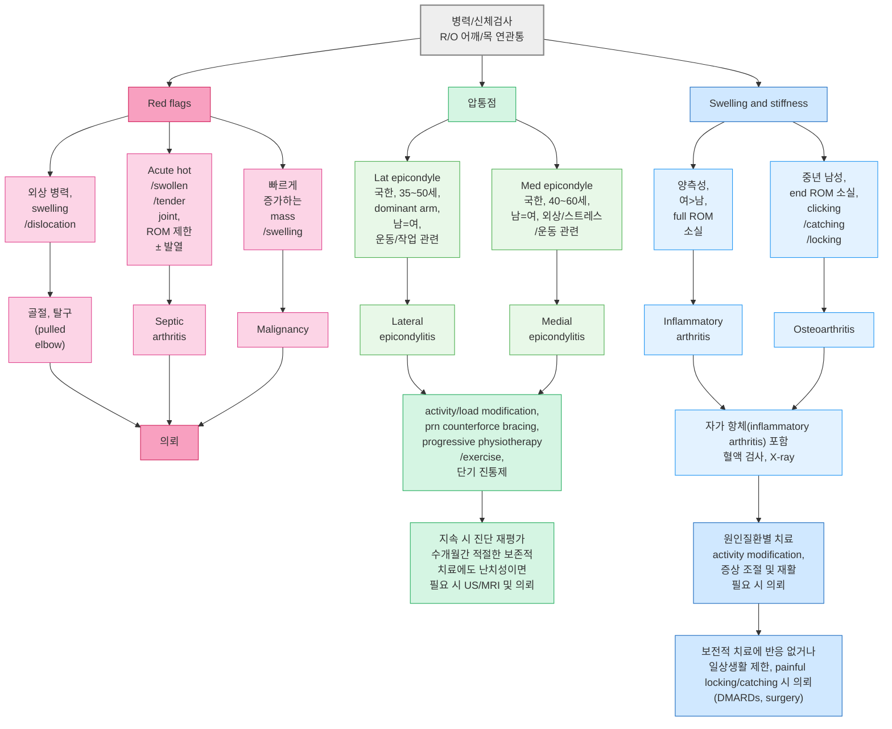

# 팔꿈치 통증 Elbow Pain

## <mark style="color:green;">일반 사항</mark>

* 팔꿈치 관절과 주위 구조물(tendon, bursa, nerve)의 이상 또는 연관통(목, 어깨, 손목)에 의해 발생
* lateral epicondyle에서의 문제(외측상과염)가 가장 흔함
* 정상 운동 범위 : 신전 0°\~굴곡 140\~150°; 회외(supination) 0°\~회내(pronation) 각 80\~90°
* 진찰 시 다음 소견에 대하여 양측을 비교 : 홍반, 부종, 열감, 위축, deformity, 비대칭
* 직업성 반복 부하가 지속되면 회복이 지연될 수 있으므로 작업 자세·도구·부하 조정이 중요

## <mark style="color:green;">원인</mark>

* 과사용(운동, 직업) : 손목을 움직이는 근육의 힘줄 기시부인 lateral/medial epicondyle에서 tendinopathy(epicondylitis) 발생
* 연관통 : cervical radiculopathy, rotator cuff syndrome
* arthritis : RA(inflammatory), 외상 후, primary osteoarthritis(드묾)
* 소아 : pulled elbow(radial head subluxation)

#### <mark style="color:$primary;">외측 팔꿈치 통증 (Lateral elbow pain)</mark>

<table><thead><tr><th width="230">진단</th><th>병인 / 임상 양상 / 진단 검사</th><th width="250">치료</th></tr></thead><tbody><tr><td><strong>외측상과염 (Lateral epicondylitis, Tennis elbow)</strong></td><td>• 반복적인 팔꿈치/손목 움직임<sup>1)</sup><br>• 잠행성; 주로 쓰는 팔 이환; lateral epicondyle 압통<sup>2)</sup><br>• 손목 resisted extension 또는 radial deviation 시 통증, 악력 감소<br>• Cozen test, Mill test, book test, middle finger test; pain-free grip strength 평가<br>• 국소 마취 주사는 routine 진단검사가 아니며 비전형적이거나 진단이 불확실한 경우 선택적으로 고려</td><td>• 활동/부하 조절, Ice, 필요 시 counterforce brace<br>• 점진적 스트레칭 및 근력 강화 운동(PT)<br>• 단기간 NSAID 등 진통제<br>• corticosteroid 주사는 routine으로 권고하지 않음; PRP는 만성·난치성 사례에서 개별 검토 가능하나 placebo 대비 효과 미입증(근거 수준 매우 낮음)<br>• 충분한 보존적 치료에도 지속 시 재평가/정형외과 의뢰</td></tr><tr><td><strong>Posterior interosseous N. syndrome</strong></td><td>• 운동신경병증: finger/thumb extension weakness 또는 finger drop이 핵심<br>• wrist extension은 남을 수 있으나 radial deviation이 나타날 수 있음<br>• 일반적으로 감각 소실 없음</td><td>• 자극 활동 중지, 부목, PT<br>• 진행성 운동 약화 또는 보존적 치료 실패 시 전문의 평가/수술 고려</td></tr><tr><td><strong>Radial tunnel syndrome</strong></td><td>• 전완 외측부 통증<sup>3)</sup>; 뚜렷한 감각/운동 결손은 대개 없음<br>• radial tunnel 부위 압통<br>• 제3수지 resisted extension(Maudsley test) 또는 resisted supination 시 전완 근위부 신전근 통증 발생</td><td>• 자극 활동 회피, 부목, PT<br>• NSAID<br>• 무효 시 전문의 평가/수술 고려</td></tr></tbody></table>

_¹⁾ 초보 one-handed backhand stroke player에서 호발_\
_²⁾ 손목 신전근 기시부, 특히 단요측수근신근(ECRB; Extensor Carpi Radialis Brevis) 기시부(lateral epicondyle의 원위 1 ㎝)_\
_³⁾ 종종 tennis elbow로 오진하거나 이를 치료하다 실패하면 radial tunnel syndrome으로 진단하게 됨_\
_PT=physical therapy, PRP=platelet-rich plasma_

_<mark style="color:$info;">Ref. Evaluation of elbow pain in adults. AFP 2014;89(8)</mark>_

#### <mark style="color:$primary;">내측 팔꿈치 통증 (Medial elbow pain)</mark>

<table><thead><tr><th width="230">진단</th><th>병인 / 임상 양상 / 진단 검사</th><th width="250">치료</th></tr></thead><tbody><tr><td><strong>내측상과염 (Medial epicondylitis, Golfer's elbow)</strong></td><td>• 반복적인 elbow valgus stress 및 굴곡, 손목 회내 및 굴곡<sup>1)</sup><br>• 잠행성: medial epicondyle 압통; 손목 resisted flexion 및 회내 또는 ulnar deviation 시 통증; 악력 감소<br>• 국소 마취 주사는 routine 진단검사가 아니며 비전형적이거나 진단이 불확실한 경우 선택적으로 고려</td><td>• 활동/부하 조절, Ice, Bracing; 스트레칭, 강화 훈련<br>• NSAID(경구/경피)<br>• 주사치료는 routine으로 사용하지 않고 난치성 사례에서 선택적으로 고려; 충분한 보존적 치료에도 지속 시 의뢰</td></tr><tr><td><strong>Cubital tunnel syndrome (Ulnar N.)</strong></td><td>• 지속적인 굴곡 상태/활동, medial epicondylitis 동반 가능<br>• 잠행성: 전완 내측/제4·5수지 저림·감각 저하; 악력 약화<br>• cubital tunnel Tinel sign; Wartenberg's sign</td><td>• 자극 활동 중지, 야간에 과도한 팔꿈치 굴곡 회피; 필요 시 약 30\~45°의 가벼운 굴곡을 유지하는 부목 고려, PT<br>• 진행성 근력저하 또는 무효 시 전문의 평가/수술</td></tr><tr><td><strong>Ulnar collateral ligament injury</strong></td><td>• 반복적인 elbow valgus stress; 운동선수(overhead throwing 동작)<br>• 유발 활동 후 통증 발생; valgus elbow instability; 팔꿈치 내측 bruising, 압통<br>• moving valgus stress test, milking maneuver</td><td>• Rest, Ice, sling<br>• NSAID; 무효 시 수술<sup>2)</sup></td></tr></tbody></table>

¹⁾ 손목 굴곡-회내근 부착부(medial epicondyle의 전방 및 원위 5\~10 ㎜)\
²⁾ 4\~6개월 치료에 회복 안 되는 경우 고려

#### <mark style="color:$primary;">기타 원인</mark>

<table><thead><tr><th width="230">진단</th><th>병인 / 임상 양상 / 진단 검사</th><th width="250">치료</th></tr></thead><tbody><tr><td><strong>Distal biceps tendinopathy</strong></td><td>• 반복적인 팔꿈치 굴곡, 전완 회외/회내<br>• 애매한 통증(vague pain); antecubital fossa 전방 압통<br>• resisted supination 또는 굴곡 시 antecubital fossa 심부 통증 발생</td><td>• Rest, Ice; PT<br>• NSAID</td></tr><tr><td><strong>Distal biceps tendon rupture</strong></td><td>• 급격한 eccentric load 후 발생하는 "pop"음, ecchymosis, supination weakness<br>• hook test 양성(hooking 되지 않음)<sup>1)</sup></td><td>• Complete rupture 의심 시 조기 정형외과 의뢰 - 시간이 지나면 tendon retraction·scarring으로 일차 봉합이 어려워질 수 있으므로 수술 적응 환자에서는 진단·의뢰를 지연하지 않음<br>• Partial rupture는 개별 평가 후 보존적/수술적 치료 결정</td></tr><tr><td><strong>Olecranon bursitis (무균성)</strong></td><td>• minor trauma(예: 팔꿈치로 기댐), RA, gout<br>• olecranon의 boggy, cystic swelling; 만성 microtraumatic형에서는 대개 압통·홍반·열감이 뚜렷하지 않고 운동 범위 정상, 단 gout·RA 등 inflammatory aseptic bursitis에서는 국소 염증 소견이 나타날 수 있음<br>• 점액낭액 검사</td><td>• Ice, 압박 드레싱, 유발 동작 회피<br>• 지속적·증상성인 경우 선택적 흡인 고려; 감염을 충분히 배제한 난치성 사례에서 corticosteroid 주사를 제한적으로 고려할 수 있으나 피부 위축·감염 위험 설명<br>• 3개월 이상 충분한 보존적 치료에도 회복되지 않으면 bursectomy 고려<sup>3)</sup></td></tr><tr><td><strong>Olecranon bursitis (세균성)</strong></td><td>• abrasion, cellulitis 동반<br>• olecranon 부위 염증 소견; 전신 발열(약 50%에서 발생)<sup>2)</sup><br>• 점액낭액 검사(그람염색, 배양)</td><td>• 전신 항생제 신속 시작; 진단 확인 또는 배양이 필요한 경우 (가능하면 항생제 투여 전) 흡인 및 Gram stain/배양 시행; 전신독성, 광범위 cellulitis, 면역저하 등 중증 소견 시 입원/정주 항생제 평가</td></tr><tr><td><strong>Posterior impingement</strong></td><td>• 완전 신전 시 통증<br>• 영상 검사(연골골 검사)</td><td>• 불편한 동작 회피<br>• 무효 시 arthroscopic osteotomy</td></tr><tr><td><strong>Triceps tendinopathy</strong></td><td>• 반복적인 신전 동작(힘껏 미는 동작); resisted extension 시 통증<br>• triceps M. 부착부 압통</td><td>• Rest, Ice; PT<br>• NSAID</td></tr></tbody></table>

_¹⁾ hook test는 tendinopathy가 아닌 distal biceps tendon rupture(특히 complete rupture)를 평가하는 검사_\
_²⁾ olecranon의 국소 홍반, 열감을 동반한 급성 부종에 대해 외상, 통풍 등도 감별 고려_\
_³⁾ 3개월 이상 치료에 회복 안 되는 경우 고려_

### <mark style="color:$danger;">🚩 Red Flags!</mark>

<mark style="color:$danger;">**즉각 조치 또는 의뢰**</mark>

* 외상 후 발생한 개방성 골절/탈구, 심한 변형
* 신경혈관 손상 징후(원위부 맥박 소실, 급성 감각/운동 마비, 심한 창백·냉감)
* Compartment syndrome 의심(심한 통증, 수동 신전 시 극심한 통증 악화, 감각 저하)

<mark style="color:$warning;">**당일 또는 조기 의뢰**</mark>

* 급성 관절 발적·열감·부종·심한 압통 또는 운동 범위 제한 ± 발열 → septic arthritis 우선 배제; olecranon 국소 염증이 주된 경우 세균성 점액낭염 감별
* 빠르게 증가하는 mass/swelling → 악성 종양 감별 필요
* 외상 후 발생한 국소 부종 또는 관절 불안정성 의심(탈구는 아니나)
* 새로 발생하거나 진행하는 운동 약화(finger/thumb drop, intrinsic hand muscle weakness) → PIN/ulnar neuropathy 등 신경병증 의심, 조기 신경학적 평가

<mark style="color:$info;">**외래 추적 / 추가 평가 계획**</mark> <mark style="color:$info;">- 즉각 위험 낮으나 호전 없으면 의뢰</mark>

* 6\~12개월의 보존적 치료에도 호전되지 않는 만성 통증
* 진행성 강직, painful clicking/catching/locking
* 진행하지 않는 간헐적 저림·감각 저하(신경 포착 증후군 의심)

## <mark style="color:green;">진단</mark>

### <mark style="color:orange;">신체검사</mark>

✽[Elbow anatomy](https://emedicine.medscape.com/article/96758-overview), [Elbow muscle(3D)](https://www.innerbody.com/image/musc07.html)

* 팔꿈치 신전 및 굴곡 운동 범위가 완전히 정상이라면 주요 관절내 병변 가능성은 상대적으로 낮아짐

<table><thead><tr><th width="230">검사명</th><th>검사 방법 [양성 소견]</th><th width="230">의심 상태</th></tr></thead><tbody><tr><td><a href="https://www.youtube.com/watch?v=1C08kF36w54">Elbow abduction stress test</a></td><td>팔꿈치 20\~30° 굴곡 상태에서 valgus force를 가함; 확고한 end point가 없음</td><td>Ulnar collateral ligament injury</td></tr><tr><td><a href="https://www.aafp.org/afp/2014/0415/p649.html#sec-3">Hook test</a></td><td>팔꿈치 90° 굴곡 및 어깨 90° 외전 상태에서 검사자가 손가락으로 biceps tendon 원위부를 "hook"; 손가락이 biceps tendon에 걸리지 않음</td><td>Distal biceps tendon rupture</td></tr><tr><td>Cozen test</td><td>팔꿈치 굴곡, 전완 회내 상태에서 손목 신전·요측 편위를 저항에 대항해 시행; lateral epicondyle 통증 유발</td><td>Lateral epicondylitis</td></tr><tr><td>Mill test</td><td>팔꿈치를 신전하면서 전완 회내 및 손목 굴곡으로 공통 신전근을 수동 신장; lateral epicondyle 통증 유발</td><td>Lateral epicondylitis</td></tr><tr><td><a href="https://www.aafp.org/afp/2014/0415/p649.html#sec-3">Middle finger test (Maudsley test)</a></td><td>팔을 회내/신전 상태로 두고 가운데 손가락 신전에 저항을 가함; lateral elbow/radial tunnel 부위 통증을 평가</td><td>Radial tunnel syndrome, Lateral epicondylitis 감별 보조</td></tr><tr><td>Book test</td><td>환측 팔로 책을 들고 완전 신전 및 회내 상태 유지; 건측보다 통증</td><td>Lateral epicondylitis</td></tr><tr><td><a href="https://www.youtube.com/watch?v=JUCx32WbZi8">Milking maneuver</a></td><td>전완 회외, 어깨 90° 외전 및 팔꿈치 굴곡 상태에서 엄지손가락을 당겨 팔꿈치에 valgus force를 가함; 불안정, 내측 관절 통증</td><td>Ulnar collateral ligament injury</td></tr><tr><td><a href="https://www.youtube.com/watch?v=SwigwaZxBXE">Modified milking maneuver</a></td><td>어깨 내전 및 외회전; 불안정, 내측 관절 통증</td><td>Ulnar collateral ligament injury</td></tr><tr><td><a href="https://www.youtube.com/watch?v=plk7G2s8V30">Moving valgus stress test</a></td><td>어깨를 60° 외전 및 외회전하고, valgus force를 가하면서 빠르게 팔꿈치를 굴곡-신전; 70\~120° 사이에서 통증</td><td>Ulnar collateral ligament injury</td></tr><tr><td><a href="https://www.youtube.com/watch?v=ASRatLbu8i0">Tinel test</a></td><td>표재 신경을 따라 부드럽게 tapping; 저림, 감각 이상</td><td>Cubital tunnel syndrome, Radial tunnel syndrome</td></tr><tr><td>Elbow flexion test</td><td>팔꿈치를 최대 굴곡한 상태로 60초간 유지; 제4·5수지 저림·감각 이상 유발</td><td>Cubital tunnel syndrome</td></tr><tr><td><a href="https://www.youtube.com/watch?v=g7vTTdLJsaQ">Wartenberg's sign</a></td><td>완전 회내 및 모든 손가락 완전 신전 상태에서 모든 손가락을 외전 후 내전; 제5수지를 오므리지 못함</td><td>Ulnar N. neuropathy, Cervical or central N. disorder</td></tr><tr><td>Froment's sign</td><td>엄지와 검지 사이에 종이를 집게 하고 검사자가 당길 때, 엄지 IP joint를 굴곡시켜(FPL 동원) 종이를 잡음</td><td>Ulnar N. motor weakness</td></tr></tbody></table>

Ref. Evaluation of elbow pain in adults. AFP 2014;89(8). Table 2.

### <mark style="color:orange;">영상 검사</mark>

* 전형적인 tendinopathy는 임상진단이 우선이며 영상검사가 routine으로 필요하지 않음
* plain radiography : tendinopathy 자체는 대부분 정상이나 만성 병변에서는 드물게 부착부 골극(enthesophyte)·연부조직 석회화 등 골성/석회화 변화가 관찰될 수 있음; 외상력, 운동 범위/기능의 유의미한 감소, 골성 병변 의심 시 고려
* Elbow extension test : 급성 외상 후 팔꿈치를 능동적으로 완전히 신전하지 못하면 골절 가능성이 높아 X-ray 시행을 권고; 단 소아에서는 이 검사 단독으로 골절을 배제할 수 없음
* 초음파 : tendon pathology/tear, effusion 및 일부 신경 병변의 동적 평가에 유용
* MRI : 진단이 불확실하거나 깊은 연부조직·신경 포착·인대/연골/골연골 병변이 의심되는 경우, 또는 수술 전 평가에서 고려
* MR arthrography : ligament tear, osteochondral defect, loose body 평가에 선택적으로 고려
* CT : soft tissue calcification(예: myositis ossificans), intra-articular body 및 골성 병변 평가에 선택적으로 사용

### <mark style="color:orange;">신경전도 검사</mark>

* 신경 포착이 의심되거나 병변 위치·중증도 확인이 필요한 경우 고려
* NCS는 비교적 조기에도 진단에 도움이 될 수 있으나, 급성 축삭손상의 needle EMG 탈신경 소견은 발생 후 수주가 지나야 뚜렷해질 수 있으므로 검사 시점과 임상 경과에 따라 재검을 고려

### <mark style="color:orange;">실험실 검사</mark>

* CBC, ESR/CRP : 감염 또는 염증성 관절염이 의심되는 경우 기본 검사
* RF, anti-CCP 등 : 임상적으로 RA 등 특정 염증성 관절염이 의심되는 경우 선택적으로 시행
* 점액낭액 검사 : WBC, 배양 검사, 그람염색, crystal 확인; 검사와 관련하여 합병증이 발생할 수 있으므로 진단이 불확실하거나 난치성인 경우, 통증/국소 염증/전신 발열이 있는 경우 고려

### <mark style="color:orange;">감별 진단</mark>

* 완전 신전 또는 terminal extension 시 통증 → synovitis뿐 아니라 posterior impingement, osteoarthritis/osteophyte, loose body 등 관절내·후방 병변 감별(염증성 관절염 예: RA, psoriatic arthritis, reactive arthritis, IBD-associated arthritis, crystal arthritis, septic arthritis)
* numbness, tingling → nerve entrapment 또는 radiculopathy(예: cubital tunnel syndrome, radial tunnel syndrome, cervical radiculopathy)
* 만성, 진행성, full extension 제한, painful clicking/catching/locking, 강직 → 골관절염
* lateral epicondyle과 olecranon 사이 bulging, 팔꿈치 신전 또는 굴곡 제한, supination 또는 pronation 제한 → radiohumeral joint 이상(예: arthritis)
* 양측성, 관절 부종 및 강직, ROM 감소, 다른 관절 이환, 전신 증상 → 염증성 관절염(예: RA)
* 팔꿈치 후방 구조물에서의 click, crepitus → radial head fracture, arthritis, loose body
* 팔꿈치 전체 통증, 팔꿈치 운동 범위 정상, 팔꿈치 움직임에 따른 통증 증가 없음, 국소 압통 및 부종 없음, 어깨 또는 목을 움직일 때 증상 증가 → 연관통(cervical radiculopathy, rotator cuff syndrome)

***


```mermaid
graph TD
    A["병력/신체검사<br/>R/O 어깨/목 연관통"]
    A --> C["Red flags"]
    A --> D["압통점"]
    A --> E["Swelling and stiffness"]

    %% Red flags branch
    C --> C1["외상 병력,<br/>swelling<br/>/dislocation"]
    C --> C2["Acute hot<br/>/swollen<br/>/tender <br/>joint,<br/>ROM 제한<br/> ± 발열"]
    C --> C3["빠르게 <br/>증가하는<br/>mass<br/>/swelling"]
    C1 --> R1["골절, 탈구<br/>(pulled <br/>elbow)"]
    C2 --> R2["Septic <br/>arthritis"]
    C3 --> R3["Malignancy"]
    R1 --> X["의뢰"]
    R2 --> X
    R3 --> X

    %% 압통점 branch
    D --> D1["Lat epicondyle<br/>국한, 35~50세,<br/>dominant arm, <br/>남=여, <br/>운동/작업 관련"]
    D --> D2["Med epicondyle<br/>국한, 40~60세,<br/>남=여, 외상/스트레스<br/>/운동 관련"]
    D1 --> R4["Lateral <br/>epicondylitis"]
    D2 --> R5["Medial <br/>epicondylitis"]
    R4 --> T1["activity/load modification,<br/>prn counterforce bracing,<br/>progressive physiotherapy<br/>/exercise,<br/>단기 진통제"]
    R5 --> T1
    T1 --> T2["지속 시 진단 재평가<br/>수개월간 적절한 보존적 <br/>치료에도 난치성이면<br/>필요 시 US/MRI 및 의뢰"]

    %% Swelling and stiffness branch
    E --> E1["양측성, <br/>여>남,<br/>full ROM <br/>소실"]
    E --> E2["중년 남성, <br/>end ROM 소실,<br/>clicking<br/>/catching<br/>/locking"]
    E1 --> R6["Inflammatory <br/>arthritis"]
    E2 --> R7["Osteoarthritis"]
    R6 --> T3["자가 항체(inflammatory arthritis) 포함<br/>혈액 검사, X-ray"]
    R7 --> T3
    T3 --> T4["원인질환별 치료<br/>activity modification,<br/>증상 조절 및 재활<br/>필요 시 의뢰"]
    T4 --> T5["보전적 치료에 반응 없거나<br/>일상생활 제한, painful locking/catching 시 의뢰<br/>(DMARDs, surgery)"]
style A fill:#eeeeee,stroke:#888888,stroke-width:2px
classDef redflags fill:#f8a0c0,stroke:#d01f5a
class C,X redflags
classDef cgroup fill:#fcd4e6,stroke:#e0448e
class C1,C2,C3,R1,R2,R3 cgroup
classDef green fill:#d5f5e3,stroke:#27ae60
class D,T1,T2 green
classDef lightGreen fill:#e8f8e8,stroke:#4caf50
class D1,D2,R4,R5 lightGreen
classDef sky fill:#e3f2ff,stroke:#2196f3
class E1,E2,R6,R7,T3 sky
classDef blue fill:#d0e8ff,stroke:#1a6abf
class E,T4,T5 blue
```

<p align="center"><strong>팔꿈치 통증 관리 알고리듬</strong></p>

<p align="center"><em><mark style="color:$info;">Ref. Elbow pain: A guide to assessment and management in primary care. BJGP 2015;65(640). Fig 1. 치료 경로는 BESS patient care pathway: Tennis elbow (2023)의 운동치료 우선 및 corticosteroid/ESWT 비권고를 반영하여 수정.</mark></em></p>

***

## <mark style="background-color:$warning;">Management</mark>

### <mark style="color:orange;">치료 목표</mark>

* 통증 완화, 신체 기능 회복, 작업 능력 유지


**단계별 치료 전략 (Step-wise Approach)**


<table><thead><tr><th width="100">단계</th><th width="260">핵심 치료</th><th>대상</th></tr></thead><tbody><tr><td>Step 1</td><td>활동/부하 조절, ice, 필요 시 단기 acetaminophen/NSAID</td><td>모든 환자</td></tr><tr><td>Step 2</td><td>점진적 스트레칭·근력 강화 운동(PT), 필요 시 counterforce bracing</td><td>초기부터 병행하거나 증상 지속 시 강화</td></tr><tr><td>Step 3</td><td>진단 재평가(신경 포착, 관절내 병변, 연관통 등); 필요 시 영상검사/전문의 상담</td><td>수주~수개월의 적절한 보존적 치료에도 호전이 불충분한 경우</td></tr><tr><td>Step 4</td><td>정형외과 의뢰 및 난치성 치료 옵션 개별 검토</td><td>수개월~6\~12개월의 충분한 보존적 치료에도 일상생활 제한이 지속되는 경우</td></tr></tbody></table>

### <mark style="color:orange;">보존적 치료</mark>

* Rest : relative rest, 악화 동작 회피, counterforce bracing
* Ice : 동상 주의(피부에 직접 얼음이 닿지 않도록 함)
* 작업·운동 자세 교정 및 ergonomic modification
* 재활 치료, PT : 통증 허용 범위에서 점진적 resistance exercise(신전근/굴곡근의 concentric·eccentric 강화)와 스트레칭; 예: wrist extensor/flexor의 점진적 eccentric-concentric resistance exercise
* 추적 관리 : 환자 상황에 따라 결정. 일반적으로 2\~4주

## <mark style="color:green;">약물 치료</mark>

### <mark style="color:orange;">진통제</mark>

* acetaminophen 650\~1,300 ㎎ tid <mark style="color:blue;">\[타이레놀]</mark>
* ibuprofen 200\~400 ㎎ tid\~qid, 필요 시 <mark style="color:blue;">\[부루펜]</mark>
  * ✽고용량이 필요한 경우 GI·신장·심혈관 위험을 평가하고 최소 유효용량으로 단기간 사용
* naproxen 250 ㎎ tid\~500 ㎎ bid <mark style="color:blue;">\[낙센]</mark>

### <mark style="color:orange;">국소 주사 치료</mark>

* corticosteroid 국소 주사 : 외측상과염에서 단기 통증 완화는 가능하지만 중·장기 재발/예후를 개선하지 못하며, BESS 2023 pathway에서는 routine 사용을 권고하지 않음. 반복 주사는 건 약화·파열 및 국소 조직 손상 위험이 있어 피함
* PRP(platelet-rich plasma) : 만성·난치성 lateral elbow tendinopathy에서 개별적으로 고려할 수 있으나 placebo 대비 통증·기능 개선 효과는 입증되지 않았고 근거 수준은 매우 낮음(BESS 2023, conditional neutral); 시행 시 placebo보다 이득이 없을 수 있음을 설명
* dry needling : 일부 연구에서 단기 통증·기능 개선이 보고되었으나 placebo 대비 효과는 확인된 바 없고(BESS 2023: 직접 비교 연구 없음), 현재 근거로는 표준치료로 권고하기 어려움; 운동치료를 대체하지 않음


**외측상과염 주사 치료의 위치**\
최신 경로에서는 활동/부하 조절과 점진적 운동치료가 중심이다. corticosteroid 주사를 routine 2차 치료로 사용하지 않으며, PRP 등 주사치료는 충분한 보존적 치료 후에도 지속되는 난치성 사례에서 근거의 불확실성을 설명한 뒤 개별적으로 검토한다.


## <mark style="color:green;">시술 및 기타 처치</mark>

### <mark style="color:orange;">의뢰 기준</mark>

* 6\~12개월의 충분한 보존적 치료에도 불구하고 호전되지 않으면 정형외과 의뢰
* ESWT(체외충격파) : 외측상과염에서 BESS 2023 pathway는 routine 사용을 권고하지 않음
* botulinum toxin : 일부 난치성 tendinopathy에서 연구되었으나 근력저하 등 부작용과 제한된 근거로 routine 치료는 아님
* 수술(open/arthroscopic release) : 장기간의 적절한 비수술적 치료에도 심한 통증·기능 제한이 지속되는 일부 환자에서 전문의와 개별 검토; placebo surgery 대비 명확한 우월성이 입증되지 않았음을 설명(BESS 2023, conditional neutral)

***

### <mark style="color:red;">질병코드</mark>

M25.52 관절통, 위팔

M70.2 주두윤활낭염

M77.0 내측상과염

M77.1 외측상과염

G56.2 척골신경의 병변

G56.3 요골신경의 병변

✽ 원위부 biceps tendon 병변은 M75.2(어깨 부위 이두근 힘줄염)에 해당하지 않으므로 본 코드 목록에서 제외함. 실제 청구 시 병변 형태(건병증/파열 등)에 맞는 KCD 코드를 확인

***

## <mark style="color:purple;">처방례</mark>

> **처방례 1. 외측상과염(테니스엘보), 경증\~중등도**
>
> ```
> 부루펜정 400 ㎎  1정  tid  pc  2주
> 전완 counterforce brace(외측상과 원위부 착용)  활동 시 착용
> ```
>
> _✽초기에는 유발 활동/부하를 조절하고 필요 시 단기간 NSAID 및 brace를 보조적으로 사용한다. 운동치료는 통증 허용 범위에서 조기에 시작하여 점진적으로 강화_

> **처방례 2. 외측상과염, 6주 이상 지속**
>
> ```
> 유발 활동/부하 조절 지속
> 점진적 손목 신전근 스트레칭 및 resistance exercise(PT)  교육/시행
> 필요 시 counterforce brace  활동 시 착용
> ```
>
> _✽6주 이상 지속 자체는 corticosteroid 주사의 적응증이 아니다. 운동치료를 강화하면서 radial tunnel/PIN 병변, 관절내 병변, cervical referred pain 등 진단을 재평가하고, 수개월간 적절한 보존적 치료에도 난치성이면 영상검사 또는 전문의 의뢰를 고려_

> **처방례 3. 내측상과염(골프엘보)**
>
> ```
> 낙센정 250 ㎎  1정  bid  pc  2주
> 전완 counterforce brace(내측상과 원위부 착용)  활동 시 착용
> ```
>
> _✽치료 원칙은 외측상과염과 동일하나 ulnar nerve 증상(제4·5수지 저림) 동반 여부를 반드시 확인_

> **처방례 4. Olecranon bursitis(무균성, 경증)**
>
> ```
> 타이레놀정 650 ㎎  1정  tid  필요시
> 팔꿈치 압박 드레싱
> ```
>
> _✽뚜렷한 감염 의심 소견이 없으면 흡인 없이 보존적 치료를 우선할 수 있다. 국소 홍반·열감·압통이 뚜렷하거나 배액/피부 병변이 있고 세균성 점액낭염이 의심되면 발열 유무와 관계없이 흡인 및 배양 검사를 고려_

### <mark style="color:$success;">핵심 복약 지도</mark>

> **NSAID 사용 원칙**
>
> * 가능한 최소 유효용량으로 필요한 기간만 사용. 위장관·신장·심혈관 위험은 치료 기간과 기저 위험에 따라 증가하므로, 고령·소화성궤양 병력·항응고제 병용 등 고위험군에서는 단기간이라도 주의하고 필요 시 PPI 병용 또는 다른 진통 전략 고려
> * 위장 불편이 있으면 음식과 함께 또는 식후 복용할 수 있으나, 식후 복용이 위궤양·출혈 위험 자체를 없애는 것은 아님
> * 신기능 저하 환자, 임신부에서는 사용 제한

> **국소 corticosteroid 주사**
>
> * 외측상과염에서는 routine 치료로 권고하지 않음. 선택적으로 시행하는 경우에도 단기 통증 완화와 중·장기 효과의 한계를 설명
> * 반복 주사는 건 위축·파열 및 국소 조직 손상 위험 때문에 피하고, 주사 후에는 무리한 운동·강한 악력 사용을 제한

> **Bracing(보조대) 착용**
>
> * counterforce brace는 상과 원위 3\~4 ㎝ 부위에 착용해야 힘줄 부하가 효과적으로 분산됨; 취침 시에는 제거

> **언제 다시 병원을 방문해야 하나요?**
>
> * 수개월의 적절한 보존적 치료(활동 조절, 운동치료/PT, 필요 시 단기 진통제)에도 호전이 불충분한 경우 - 진단 재평가/의뢰 고려
> * 관절이 갑자기 붓고 붉어지며 뜨겁고 심하게 아프거나 운동 범위가 제한되는 경우(발열 유무와 무관) - 당일 평가
> * 손가락 저림, 감각 저하, 악력 약화가 진행하는 경우
> * 외상 후 심한 변형, 움직일 수 없는 경우 - 즉시 내원

***

### <mark style="color:blue;">환자 안내서</mark>


**팔꿈치 통증, 대부분 과사용 때문에 생깁니다**

팔꿈치 통증은 흔히 반복적인 손목·팔 사용으로 팔꿈치 주변 힘줄에 미세한 손상이 쌓여 발생합니다. 대부분 심각한 질환이 아니며, 활동 조절과 꾸준한 관리로 호전됩니다.


#### <mark style="color:$primary;">왜 팔꿈치가 아프나요?</mark>

* 테니스·골프 같은 운동, 컴퓨터 작업, 공구를 반복적으로 쥐는 직업 등에서 손목을 움직이는 근육의 힘줄이 팔꿈치에 붙는 부위(상과)에 미세한 손상이 반복되어 통증이 생깁니다.
* 팔꿈치 바깥쪽이 아프면 "테니스 엘보"(외측상과염), 안쪽이 아프면 "골프 엘보"(내측상과염)라고 부릅니다.

#### <mark style="color:$primary;">일상생활에서 어떻게 관리하나요?</mark>

* **통증을 유발하는 동작을 줄이십시오.** 무거운 물건을 손목을 편 채로 들거나, 반복적으로 손목을 비트는 동작을 피하십시오.
* **초기에는 얼음찜질을 하십시오.** 하루 2\~3회, 15\~20분씩 하되 피부에 직접 닿지 않게 수건으로 감싸십시오.
* **보조대(브레이스)를 활용하십시오.** 팔꿈치 아래쪽에 착용하면 일부 환자에서 활동 중 통증을 줄이는 데 도움이 될 수 있습니다.
* **통증이 줄어들면 스트레칭과 근력 운동을 시작하십시오.** 완전히 좋아지기를 기다리지 말고, 참을 만한 수준에서 서서히 시작하는 것이 회복에 도움이 됩니다.

#### <mark style="color:$primary;">약은 어떻게 써야 하나요?</mark>

* 소염진통제(NSAID)는 통증이 심한 초기 1\~2주간 도움이 되지만, 장기간 복용하면 위장 장애가 생길 수 있으므로 필요한 기간만 사용하십시오.
* 테니스 엘보에서 스테로이드 주사는 통증을 일시적으로 줄일 수 있지만 장기적인 회복을 더 좋게 하지는 않아 일반적인 치료로 권하지 않습니다. 치료의 중심은 활동 조절과 운동치료입니다.

#### <mark style="color:$primary;">이럴 때는 즉시 병원을 방문하세요</mark>

* 팔꿈치가 심하게 붓거나 모양이 변한 경우 (특히 넘어지거나 다친 직후)
* 팔꿈치가 갑자기 붓고 벌겋고 뜨거우면서 심하게 아프거나 잘 움직이지 못하는 경우 - 몸에 열이 없어도 평가가 필요합니다
* 손가락이 저리거나 힘이 빠지는 증상이 점점 심해지는 경우

#### <mark style="color:$primary;">다시 진료를 받아야 하는 경우</mark>

* 수개월간 활동 조절과 운동치료를 꾸준히 했는데도 통증이나 기능 제한이 뚜렷하게 지속되는 경우
