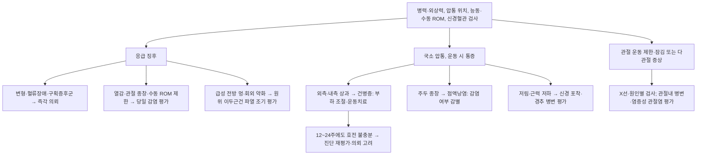

# 팔꿈치 통증 Elbow Pain

## <mark style="color:green;">일반 사항</mark>

* 팔꿈치 관절과 주위 구조물(tendon, bursa, nerve)의 이상 또는 연관통(목, 어깨, 손목)에 의해 발생
* lateral epicondyle에서의 문제(외측상과염)가 가장 흔함
* 정상 운동 범위 : 신전 0°\~굴곡 140\~150°; 회외(supination) 0°\~회내(pronation) 각 80\~90°
* 진찰 시 다음 소견에 대하여 양측을 비교 : 홍반, 부종, 열감, 위축, deformity, 비대칭
* 직업성 반복 부하가 지속되면 회복이 지연될 수 있으므로 작업 자세·도구·부하 조정이 중요

## <mark style="color:green;">원인</mark>

* 과사용(운동, 직업) : 손목 신전근·굴곡/회내근의 상과 부착부에 건병증(tendinopathy) 발생. 관용적으로 상과염(epicondylitis)이라 부르지만 만성 병변이 항상 염증성인 것은 아님
* 연관통 : cervical radiculopathy, rotator cuff syndrome
* arthritis : RA(inflammatory), 외상 후, primary osteoarthritis(드묾)
* 소아 : pulled elbow(radial head subluxation)

### <mark style="color:orange;">외측 팔꿈치 통증 (Lateral elbow pain)</mark>

<table><thead><tr><th width="230">진단</th><th>병인 / 임상 양상 / 진단 검사</th><th width="250">치료</th></tr></thead><tbody><tr><td><strong>외측상과염 (Lateral epicondylitis, Tennis elbow)</strong></td><td>• 반복적인 팔꿈치/손목 움직임<sup>1)</sup><br>• 잠행성; 주로 쓰는 팔 이환; 외측상과와 공통 신전근 기시부 압통<sup>2)</sup><br>• 손목 resisted extension 또는 radial deviation 시 통증, 악력 감소<br>• Cozen test, Mill test, book test, middle finger test; pain-free grip strength 평가<br>• 국소 마취 주사는 routine 진단검사가 아니며 비전형적이거나 진단이 불확실한 경우 선택적으로 고려</td><td>• 활동/부하 조절, Ice, 필요 시 counterforce brace<br>• 점진적 스트레칭 및 근력 강화 운동(PT)<br>• 단기간 NSAID 등 진통제<br>• corticosteroid 주사는 외측상과염 치료에 사용하지 않도록 권고(BESS 2023, 강한 권고); PRP는 만성·난치성 사례에서 개별 검토 가능하나 placebo 대비 효과 미입증(근거 수준 매우 낮음)<br>• 12~24주에도 호전이 없으면 진단 재평가 및 정형외과 의뢰 고려</td></tr><tr><td><strong>Posterior interosseous N. syndrome</strong></td><td>• 운동신경병증: finger/thumb extension weakness 또는 finger drop이 핵심<br>• wrist extension은 남을 수 있으나 radial deviation이 나타날 수 있음<br>• 일반적으로 감각 소실 없음</td><td>• 자극 활동 중지, 부목, PT<br>• 새로 발생하거나 진행하는 운동 약화는 조기 전문의 평가; 보존적 치료에도 호전이 없으면 수술 가능성 검토</td></tr><tr><td><strong>Radial tunnel syndrome</strong></td><td>• 전완 외측부 통증<sup>3)</sup>; 뚜렷한 감각/운동 결손은 대개 없음<br>• 외측상과보다 약 3~5 ㎝ 원위부의 요골터널 부위 압통<br>• 제3수지 resisted extension(Maudsley test) 또는 resisted supination 시 전완 근위부 신전근 통증 발생</td><td>• 자극 활동 회피, 부목, PT<br>• NSAID<br>• 무효 시 전문의 평가/수술 고려</td></tr></tbody></table>

_¹⁾ 초보 one-handed backhand stroke player에서 호발_\
_²⁾ 손목 신전근 기시부, 특히 단요측수근신근(ECRB; Extensor Carpi Radialis Brevis) 기시부(lateral epicondyle의 원위 1 ㎝)_\
_³⁾ 외측상과염과 공존할 수 있으며 압통 위치와 운동신경 결손 유무를 비교한다. Maudsley 검사는 양자를 단독으로 구별하지 못함_\
_PT=physical therapy, PRP=platelet-rich plasma_

_<mark style="color:$info;">Ref. Evaluation of elbow pain in adults. AFP 2014;89(8)</mark>_

### <mark style="color:orange;">내측 팔꿈치 통증 (Medial elbow pain)</mark>

<table><thead><tr><th width="230">진단</th><th>병인 / 임상 양상 / 진단 검사</th><th width="250">치료</th></tr></thead><tbody><tr><td><strong>내측상과염 (Medial epicondylitis, Golfer's elbow)</strong></td><td>• 반복적인 elbow valgus stress 및 굴곡, 손목 회내 및 굴곡<sup>1)</sup><br>• 잠행성: medial epicondyle 압통; 손목 resisted flexion 및 회내 또는 ulnar deviation 시 통증; 악력 감소<br>• 국소 마취 주사는 routine 진단검사가 아니며 비전형적이거나 진단이 불확실한 경우 선택적으로 고려</td><td>• 활동/부하 조절, Ice, Bracing; 스트레칭, 강화 훈련<br>• NSAID(경구/경피)<br>• 주사치료는 routine으로 사용하지 않고 난치성 사례에서 선택적으로 고려; 충분한 보존적 치료에도 지속 시 의뢰</td></tr><tr><td><strong>Cubital tunnel syndrome (Ulnar N.)</strong></td><td>• 지속적인 굴곡 상태/활동, medial epicondylitis 동반 가능<br>• 잠행성: 제4·5수지 및 손 척측의 저림·감각 저하; 악력 약화. 전완 내측까지 객관적인 감각 저하가 있으면 C8–T1 신경근/신경총 병변도 감별<br>• cubital tunnel Tinel sign; Wartenberg's sign</td><td>• 자극 활동 중지, 야간에 과도한 팔꿈치 굴곡 회피; 필요 시 약 30\~45°의 가벼운 굴곡을 유지하는 부목 고려, PT<br>• 진행성 근력저하 또는 무효 시 전문의 평가/수술</td></tr><tr><td><strong>Ulnar collateral ligament injury</strong></td><td>• 반복적인 elbow valgus stress; 운동선수(overhead throwing 동작)<br>• 유발 활동 후 통증 발생; valgus elbow instability; 팔꿈치 내측 bruising, 압통<br>• moving valgus stress test, milking maneuver</td><td>• 투구 등 외반 부하 활동 중단, Ice, 필요 시 단기간 NSAID<br>• 손상 정도와 투구 복귀 목표에 따른 재활·투구 동작 교정; 불안정성이 뚜렷하거나 경쟁적 투구 복귀를 원하면 조기 전문의 평가, 수술 여부는 개별 결정<sup>2)</sup></td></tr></tbody></table>

¹⁾ 손목 굴곡-회내근 부착부(medial epicondyle의 전방 및 원위 5\~10 ㎜)\
²⁾ 수술은 일률적인 치료 기간으로 결정하지 않고 파열 정도·불안정성·운동 목표·재활 반응을 종합하여 판단

### <mark style="color:orange;">기타 원인</mark>

<table><thead><tr><th width="230">진단</th><th>병인 / 임상 양상 / 진단 검사</th><th width="250">치료</th></tr></thead><tbody><tr><td><strong>Distal biceps tendinopathy</strong></td><td>• 반복적인 팔꿈치 굴곡, 전완 회외/회내<br>• 애매한 통증(vague pain); antecubital fossa 전방 압통<br>• resisted supination 또는 굴곡 시 antecubital fossa 심부 통증 발생</td><td>• Rest, Ice; PT<br>• NSAID</td></tr><tr><td><strong>Distal biceps tendon rupture</strong></td><td>• 급격한 eccentric load 후 발생하는 "pop"음, ecchymosis, supination weakness<br>• hook test에서 원위 이두근건이 만져지지 않으면 완전파열 의심<sup>1)</sup>; 부분파열은 검사 결과가 정상일 수 있음</td><td>• Complete rupture 의심 시 조기 정형외과 의뢰 - 시간이 지나면 tendon retraction·scarring으로 일차 봉합이 어려워질 수 있으므로 수술 적응 환자에서는 진단·의뢰를 지연하지 않음<br>• Partial rupture는 개별 평가 후 보존적/수술적 치료 결정</td></tr><tr><td><strong>Olecranon bursitis (무균성)</strong></td><td>• minor trauma(예: 팔꿈치로 기댐), RA, gout<br>• olecranon의 boggy, cystic swelling; 만성 microtraumatic형에서는 대개 압통·홍반·열감이 뚜렷하지 않고 운동 범위 정상, 단 gout·RA 등 inflammatory aseptic bursitis에서는 국소 염증 소견이 나타날 수 있음<br>• 전형적인 비염증성 사례는 점액낭액 검사 불필요; 감염 의심·진단 불확실성·난치성 증상에서 선택적으로 흡인</td><td>• Ice, 압박 드레싱, 유발 동작 회피<br>• 일상 기능을 방해할 만큼 크거나 지속되는 경우 선택적 흡인 고려; 비염증성 만성 사례에 대한 윤활낭 내 corticosteroid 주사는 이득이 불확실하고 피부 위축·감염 위험이 있어 통상 피함<br>• 지속·재발하거나 기능을 방해하는 종창은 전문의에게 의뢰하여 수술 여부 검토<sup>3)</sup></td></tr><tr><td><strong>Olecranon bursitis (세균성)</strong></td><td>• abrasion, cellulitis 동반<br>• olecranon 부위 염증 소견; 전신 발열(약 50%에서 발생)<sup>2)</sup><br>• 점액낭액 검사(그람염색, 배양)</td><td>• S. aureus 등 피부 상재균에 효과적인 전신 항생제 신속 시작; 진단이 불확실하거나 배양이 필요한 경우 가능하면 투여 전 흡인·그람염색/배양. 패혈증 등 중증 상태에서는 검체 채취 때문에 항생제를 지연하지 않음<br>• 전신독성, 광범위 cellulitis, 면역저하 등 중증 소견 시 입원/정주 항생제 평가; 안정적인 경증 외래 환자도 조기(가능하면 다음 날) 재평가</td></tr><tr><td><strong>Posterior impingement</strong></td><td>• 완전 신전 시 통증<br>• 영상 검사로 골극·유리체 등 골성/관절내 병변 및 동반 인대 손상 평가</td><td>• 증상을 유발하는 동작 조절, 재활<br>• 기계적 증상이 지속되는 선별 환자에서 전문의가 관절경적 변연절제·골극 제거 등 검토</td></tr><tr><td><strong>Triceps tendinopathy</strong></td><td>• 반복적인 신전 동작(힘껏 미는 동작); resisted extension 시 통증<br>• triceps M. 부착부 압통</td><td>• Rest, Ice; PT<br>• NSAID</td></tr></tbody></table>

_¹⁾ hook test는 tendinopathy가 아닌 distal biceps tendon rupture(특히 complete rupture)를 평가하는 검사_\
_²⁾ olecranon의 국소 홍반, 열감을 동반한 급성 부종에 대해 외상, 통풍 등도 감별 고려_\
_³⁾ 수술 의뢰 여부는 지속 기간만으로 정하지 않고 재발·크기·기능 제한과 치료 반응을 고려_

### <mark style="color:$danger;">🚩 Red Flags!</mark>

<mark style="color:$danger;">**즉각 조치 또는 의뢰**</mark>

* 외상 후 발생한 개방성 골절/탈구, 심한 변형
* 신경혈관 손상 징후(원위부 맥박 소실, 급성 감각/운동 마비, 심한 창백·냉감)
* 구획증후군 의심(통증이 손상 정도에 비해 극심하거나 전완 근육을 수동으로 늘릴 때 악화, 긴장된 전완, 감각 저하); 맥박이 남아 있어도 배제 불가

<mark style="color:$warning;">**당일~수일 내 평가**</mark>

* 급성 관절 부종·열감·심한 압통 또는 수동 운동 범위 제한(발열이 없어도) → 패혈성 관절염 우선 배제(당일 긴급 평가와 관절액 검사); 주두의 국소 종창·열감은 세균성 점액낭염 감별(당일). 패혈증 징후가 있으면 즉각 응급 평가
* 원인이 불명확하고 빠르게 커지는 종괴, 깊거나 단단한 종괴 → 조기 영상검사·전문의 평가
* 외상 후 발생한 국소 부종 또는 관절 불안정성 의심(당일)
* 새로 발생하거나 진행하는 운동 약화(finger/thumb drop, intrinsic hand muscle weakness) → PIN/ulnar neuropathy 등 신경병증 의심, 조기 신경학적 평가(당일~수일 내)
* 무거운 물건을 들다가 ‘뚝’ 하는 느낌과 함께 팔꿈치 앞쪽 멍·부종, 회외 근력 저하가 발생 → 원위 이두근건 완전파열 의심, 조기 정형외과 평가(당일~수일 내)

<mark style="color:$info;">**외래 추적 / 추가 평가 계획**</mark> <mark style="color:$info;">- 즉각 위험 낮으나 호전 없으면 의뢰</mark>

* 12~24주의 적절한 보존적 치료에도 호전이 없는 만성 통증 → 진단 재평가/전문의 의뢰 고려
* 진행성 강직, painful clicking/catching/locking
* 진행하지 않는 간헐적 저림·감각 저하(신경 포착 증후군 의심)

## <mark style="color:green;">진단</mark>

### <mark style="color:orange;">신체검사</mark>

✽[Elbow anatomy](https://emedicine.medscape.com/article/96758-overview), [Elbow muscle(3D)](https://www.innerbody.com/image/musc07.html)

* 능동·수동 운동 범위를 비교한다. 수동 운동까지 현저히 제한되면 관절내 병변 또는 감염을 의심하고, 주두에 국한된 종창에서 수동 범위가 비교적 보존되면 점액낭염 가능성이 높다. 정상 범위라도 관절내 병변을 완전히 배제하지는 못한다.

<table><thead><tr><th width="230">검사명</th><th>검사 방법 [양성 소견]</th><th width="230">의심 상태</th></tr></thead><tbody><tr><td><a href="https://www.youtube.com/watch?v=1C08kF36w54">Elbow abduction stress test</a></td><td>팔꿈치 20\~30° 굴곡 상태에서 valgus force를 가함; 확고한 end point가 없음</td><td>Ulnar collateral ligament injury</td></tr><tr><td><a href="https://www.aafp.org/afp/2014/0415/p649.html#sec-3">Hook test</a></td><td>팔꿈치 약 90° 굴곡·전완 능동 회외 상태에서 외측으로부터 손가락을 원위 이두근건 아래에 걸어 봄; 건을 걸 수 없으면 완전파열 의심(부분파열은 배제되지 않음)</td><td>Distal biceps tendon rupture</td></tr><tr><td>Cozen test</td><td>팔꿈치 굴곡, 전완 회내 상태에서 손목 신전·요측 편위를 저항에 대항해 시행; lateral epicondyle 통증 유발</td><td>Lateral epicondylitis</td></tr><tr><td>Mill test</td><td>팔꿈치를 신전하면서 전완 회내 및 손목 굴곡으로 공통 신전근을 수동 신장; lateral epicondyle 통증 유발</td><td>Lateral epicondylitis</td></tr><tr><td><a href="https://www.aafp.org/afp/2014/0415/p649.html#sec-3">Middle finger test (Maudsley test)</a></td><td>팔을 회내/신전 상태로 두고 가운데 손가락 신전에 저항을 가함; lateral elbow/radial tunnel 부위 통증을 평가</td><td>Radial tunnel syndrome, Lateral epicondylitis 감별 보조</td></tr><tr><td>Book test</td><td>환측 팔로 책을 들고 완전 신전 및 회내 상태 유지; 건측보다 통증</td><td>Lateral epicondylitis</td></tr><tr><td><a href="https://www.youtube.com/watch?v=JUCx32WbZi8">Milking maneuver</a></td><td>전완 회외, 어깨 90° 외전 및 팔꿈치 굴곡 상태에서 엄지손가락을 당겨 팔꿈치에 valgus force를 가함; 불안정, 내측 관절 통증</td><td>Ulnar collateral ligament injury</td></tr><tr><td><a href="https://www.youtube.com/watch?v=SwigwaZxBXE">Modified milking maneuver</a></td><td>어깨 내전 및 외회전; 불안정, 내측 관절 통증</td><td>Ulnar collateral ligament injury</td></tr><tr><td><a href="https://www.youtube.com/watch?v=plk7G2s8V30">Moving valgus stress test</a></td><td>어깨를 90° 외전 및 외회전하고, valgus force를 가하면서 빠르게 팔꿈치를 굴곡-신전; 70\~120° 사이에서 통증</td><td>Ulnar collateral ligament injury</td></tr><tr><td><a href="https://www.youtube.com/watch?v=ASRatLbu8i0">Tinel test</a></td><td>주관(cubital tunnel)의 척골신경을 따라 부드럽게 두드림; 제4·5수지로 뻗는 저림·감각 이상</td><td>Cubital tunnel syndrome</td></tr><tr><td>Elbow flexion test</td><td>팔꿈치를 최대 굴곡한 상태로 60초간 유지; 제4·5수지 저림·감각 이상 유발</td><td>Cubital tunnel syndrome</td></tr><tr><td><a href="https://www.youtube.com/watch?v=g7vTTdLJsaQ">Wartenberg's sign</a></td><td>손가락을 모으도록 할 때 제5수지가 벌어진 채 남고 내전이 어려움</td><td>척골신경 운동 약화(단독으로 병변 위치 확정 불가)</td></tr><tr><td>Froment's sign</td><td>엄지와 검지 사이에 종이를 집게 하고 검사자가 당길 때, 엄지 IP joint를 굴곡시켜(FPL 동원) 종이를 잡음</td><td>Ulnar N. motor weakness</td></tr></tbody></table>

Ref. Evaluation of elbow pain in adults. AFP 2014;89(8). Table 2.

### <mark style="color:orange;">영상 검사</mark>

* 전형적인 tendinopathy는 임상진단이 우선이며 영상검사가 routine으로 필요하지 않음
* 단순 X선 : 외상 후 골절·탈구가 의심되거나 만성 통증에서 운동 범위 제한, 기계적 증상, 골성 병변이 의심될 때 우선 고려. 전형적 건병증에서는 대개 불필요하며 검사해도 정상인 경우가 많음
* Elbow extension test : 급성 외상 후 팔꿈치를 능동적으로 완전히 신전하지 못하면 X선 시행. 완전히 신전할 수 있어도 국소 골성 압통, 변형 또는 기능장애가 있으면 X선을 고려하고, 특히 소아에서는 검사 하나만으로 골절을 배제하지 않음
* 초음파 : tendon pathology/tear, effusion 및 일부 신경 병변의 동적 평가에 유용
* MRI : 진단이 불확실하거나 깊은 연부조직·신경 포착·인대/연골/골연골 병변이 의심되는 경우, 또는 수술 전 평가에서 고려
* MR arthrography : ligament tear, osteochondral defect, loose body 평가에 선택적으로 고려
* CT : X선에서 명확하지 않은 골절·골극·관절내 유리체 등 골성 병변의 상세 평가에 선택적으로 사용

### <mark style="color:orange;">신경전도 검사</mark>

* 신경 포착이 의심되거나 병변 위치·중증도 확인이 필요한 경우 고려
* NCS는 비교적 조기에도 진단에 도움이 될 수 있으나, 급성 축삭손상의 needle EMG 탈신경 소견은 발생 후 수주가 지나야 뚜렷해질 수 있으므로 검사 시점과 임상 경과에 따라 재검을 고려

### <mark style="color:orange;">실험실 검사</mark>

* CBC, ESR/CRP : 감염 또는 염증성 관절염이 의심되면 시행하되, 정상 수치만으로 초기 패혈성 관절염·점액낭염을 배제하지 않음
* RF, anti-CCP 등 : 임상적으로 RA 등 특정 염증성 관절염이 의심되는 경우 선택적으로 시행
* 관절액 검사 : 패혈성 관절염이 의심되면 지체 없이 관절 천자를 의뢰하여 세포수·감별계산, 그람염색·배양, 결정을 확인. 결정이 보여도 동반 감염을 배제하지 않으며, 패혈증이 아니라면 가능하면 항생제 전에 검체 확보
* 점액낭액 검사 : 세균성 주두윤활낭염이 의심되거나 진단이 불확실할 때 무균적 흡인 후 세포수·그람염색·배양·결정 등을 검사; 전형적인 비염증성 미세외상성 윤활낭염은 감염 유발 위험 때문에 일률적으로 흡인하지 않음

### <mark style="color:orange;">감별 진단</mark>

* 완전 신전 또는 terminal extension 시 통증 → synovitis뿐 아니라 posterior impingement, osteoarthritis/osteophyte, loose body 등 관절내·후방 병변 감별(염증성 관절염 예: RA, psoriatic arthritis, reactive arthritis, IBD-associated arthritis, crystal arthritis, septic arthritis)
* 저림·감각 저하 → 척골신경 포착 또는 경추 신경근병증 등 감별; 순수 요골터널증후군·후골간신경병증에서는 객관적 감각 저하가 흔하지 않음
* 만성, 진행성, full extension 제한, painful clicking/catching/locking, 강직 → 골관절염
* lateral epicondyle과 olecranon 사이 bulging, 팔꿈치 신전 또는 굴곡 제한, supination 또는 pronation 제한 → radiohumeral joint 이상(예: arthritis)
* 양측성, 관절 부종 및 강직, ROM 감소, 다른 관절 이환, 전신 증상 → 염증성 관절염(예: RA)
* 팔꿈치 후방 구조물에서의 click, crepitus → radial head fracture, arthritis, loose body
* 팔꿈치 전체 통증, 팔꿈치 운동 범위 정상, 팔꿈치 움직임에 따른 통증 증가 없음, 국소 압통 및 부종 없음, 어깨 또는 목을 움직일 때 증상 증가 → 연관통(cervical radiculopathy, rotator cuff syndrome)

***


```mermaid
graph TD
    A["병력·외상력, 압통 위치, 능동·수동 ROM, 신경혈관 검사"]
    A --> B["응급 징후"]
    B --> B1["변형·혈류장애·구획증후군 → 즉각 의뢰"]
    B --> B2["열감·관절 종창·수동 ROM 제한 → 당일 감염 평가"]
    B --> B3["급성 전방 멍·회외 약화 → 원위 이두근건 파열 조기 평가"]
    A --> C["국소 압통, 운동 시 통증"]
    C --> C1["외측·내측 상과 → 건병증: 부하 조절·운동치료"]
    C --> C2["주두 종창 → 점액낭염: 감염 여부 감별"]
    C --> C3["저림·근력 저하 → 신경 포착·경추 병변 평가"]
    A --> D["관절 운동 제한·잠김 또는 다관절 증상"]
    D --> D1["X선·원인별 검사; 관절내 병변·염증성 관절염 평가"]
    C1 --> E["12~24주에도 호전 불충분 → 진단 재평가·의뢰 고려"]
```

<p align="center"><strong>팔꿈치 통증 관리 알고리듬</strong></p>

<p align="center"><em><mark style="color:$info;">Ref. BESS patient care pathway: Tennis elbow (2023); SANJO guideline (2023); AAFP, Evaluation of Elbow Pain in Adults (2014). 각 원인별 분기와 긴급도를 재구성.</mark></em></p>

***

## <mark style="background-color:$warning;">Management</mark>

### <mark style="color:orange;">치료 목표</mark>

* 통증 완화, 신체 기능 회복, 작업 능력 유지


**단계별 치료 전략 (Step-wise Approach)**


<table><thead><tr><th width="100">단계</th><th width="260">핵심 치료</th><th>대상</th></tr></thead><tbody><tr><td>Step 1</td><td>활동/부하 조절, 필요 시 냉찜질 및 단기 acetaminophen·국소 NSAID; 경구 NSAID는 위험을 평가하여 선택</td><td>위험 징후가 배제된 건병증 등 보존적 치료 대상</td></tr><tr><td>Step 2</td><td>점진적 스트레칭·근력 강화 운동(PT), 필요 시 counterforce bracing</td><td>초기부터 병행하거나 증상 지속 시 강화</td></tr><tr><td>Step 3</td><td>진단 재평가(신경 포착, 관절내 병변, 연관통 등); 필요 시 영상검사/전문의 의뢰</td><td>12~24주의 적절한 보존적 치료에도 호전이 불충분한 경우</td></tr><tr><td>Step 4</td><td>전문의 평가 후 난치성 치료 옵션 개별 검토</td><td>의뢰 후에도 적절한 비수술적 치료에 반응하지 않고 심한 기능 제한이 지속되는 선별 환자(수술 등 검토)</td></tr></tbody></table>

### <mark style="color:orange;">보존적 치료</mark>

* Relative rest : 악화 동작의 일시적 감량·조절; 완전한 장기 고정은 피함. Counterforce brace는 활동 중 증상 완화를 원할 때 선택적으로 시도
* Ice : 동상 주의(피부에 직접 얼음이 닿지 않도록 함)
* 작업·운동 자세 교정 및 ergonomic modification
* 재활 치료, PT : 통증 허용 범위에서 점진적 resistance exercise(신전근/굴곡근의 concentric·eccentric 강화)와 스트레칭; 예: wrist extensor/flexor의 점진적 eccentric-concentric resistance exercise
* 추적 관리 : 통증·작업 기능·운동 순응도를 평가하며 대개 2\~4주에 재평가; 감염 의심 환자는 이 일정까지 기다리지 않음

## <mark style="color:green;">약물 치료</mark>

### <mark style="color:orange;">진통제</mark>

* acetaminophen 500~1,000 ㎎ q4~6h prn(건강한 성인의 1일 최대 4,000 ㎎을 넘지 않되, 고령·저체중·간질환·음주 등에서는 더 낮은 한도를 개별 적용하고 다른 복합제의 함량 합산) <mark style="color:blue;">\[타이레놀정500㎎]</mark>
* ibuprofen 200\~400 ㎎ tid\~qid, 필요 시 <mark style="color:blue;">\[부루펜정200㎎/400㎎]</mark>
  * ✽소화성궤양/출혈, 신기능, 심혈관 위험, 항응고·항혈소판제 병용, 임신 여부를 확인하고 최소 유효용량으로 단기간 사용; 서로 다른 경구 NSAID를 중복하지 않음
* naproxen 건염·윤활낭염: 초회 500 ㎎, 이후 250 ㎎ q6~8h prn(1일 최대 1,250 ㎎; 연령·증상·위험에 따라 조절) <mark style="color:blue;">\[낙센정250㎎]</mark>
* 국소 NSAID: 국소 통증에 단기간 고려; 경구 NSAID보다 위장관 전신 부작용 부담이 적을 수 있음(해당 제품의 허가 용법 확인)

### <mark style="color:orange;">국소 주사 치료</mark>

* corticosteroid 국소 주사 : 외측상과염에서 단기 통증 완화는 가능하지만 중·장기 재발/예후를 개선하지 못하며, BESS 2023 pathway는 사용하지 말 것을 강하게 권고함. 반복 주사는 건 약화·파열 및 국소 조직 손상 위험이 있어 피함
* PRP(platelet-rich plasma) : 만성·난치성 lateral elbow tendinopathy에서 개별적으로 고려할 수 있으나 placebo 대비 통증·기능 개선 효과는 입증되지 않았고 근거 수준은 매우 낮음(BESS 2023, conditional neutral); 시행 시 placebo보다 이득이 없을 수 있음을 설명
* dry needling : 일부 연구에서 단기 통증·기능 개선이 보고되었으나 placebo 대비 효과는 확인된 바 없고(BESS 2023: 위약 대비 근거 부족), 현재 근거로는 표준치료로 권고하기 어려움; 운동치료를 대체하지 않음


**외측상과염 주사 치료의 위치**\
BESS 2023 경로에서는 활동/부하 조절과 운동치료를 중심으로 권고한다. corticosteroid 주사는 BESS 2023의 강한 비권고에 따라 외측상과염 치료에 사용하지 않으며, PRP 등 주사치료는 충분한 보존적 치료 후에도 지속되는 난치성 사례에서 근거의 불확실성을 설명한 뒤 개별적으로 검토한다.


## <mark style="color:green;">시술 및 기타 처치</mark>

### <mark style="color:orange;">의뢰 기준</mark>

* 외측상과염은 12~24주의 적절한 활동 조절·운동치료에도 호전이 불충분하면 진단을 재평가하고 정형외과 의뢰 고려; 진행성 신경마비·힘줄 완전파열 등은 기다리지 않고 조기 평가
* ESWT(체외충격파) : 외측상과염에서 BESS 2023 pathway는 사용하지 말 것을 강하게 권고함
* botulinum toxin : 일부 난치성 tendinopathy에서 연구되었으나 근력저하 등 부작용과 제한된 근거로 routine 치료는 아님
* 수술(open/arthroscopic release) : 장기간의 적절한 비수술적 치료에도 심한 통증·기능 제한이 지속되는 일부 환자에서 전문의와 개별 검토; placebo surgery 대비 명확한 우월성이 입증되지 않았음을 설명(BESS 2023, conditional neutral)

***

## <mark style="color:red;">질병코드</mark>

M25.52 관절통, 위팔

M70.2 주두윤활낭염

M77.0 내측상과염

M77.1 외측상과염

G56.2 척골신경의 병변

G56.3 요골신경의 병변

✽ 원위부 biceps tendon 병변은 M75.2(어깨 부위 이두근 힘줄염)에 해당하지 않으므로 본 코드 목록에서 제외함. 실제 청구 시 병변 형태(건병증/파열 등)에 맞는 KCD 코드를 확인

***

## <mark style="color:purple;">처방례</mark>

> **처방례 1. 외측상과염(테니스엘보), 경증\~중등도**
>
> ```
> 부루펜정 400 ㎎  1정  tid  pc  필요 시, 단기간(예: 7일)
> 전완 counterforce brace(외측상과 원위부 착용)  활동 시 착용
> ```
>
> _✽초기에는 유발 활동/부하를 조절하고 필요 시 단기간 NSAID 및 brace를 보조적으로 사용한다. 운동치료는 통증 허용 범위에서 조기에 시작하여 점진적으로 강화_

> **처방례 2. 외측상과염, 6주 이상 지속**
>
> ```
> 유발 활동/부하 조절 지속
> 점진적 손목 신전근 스트레칭 및 resistance exercise(PT)  교육/시행
> 필요 시 counterforce brace  활동 시 착용
> ```
>
> _✽6주 이상 지속 자체는 corticosteroid 주사의 적응증이 아니다. 운동치료를 강화하면서 radial tunnel/PIN 병변, 관절내 병변, cervical referred pain 등 진단을 재평가하고, 12~24주에도 호전이 불충분하면 영상검사 또는 전문의 의뢰를 고려_

> **처방례 3. 내측상과염(골프엘보)**
>
> ```
> 낙센정 250 ㎎  초회 2정, 이후 1정  q6~8h  pc  필요 시, 단기간(예: 5일)
> 전완 counterforce brace(내측상과 원위부 착용)  활동 시 착용
> ```
>
> _✽치료 원칙은 외측상과염과 동일하나 ulnar nerve 증상(제4·5수지 저림) 동반 여부를 반드시 확인_

> **처방례 4. Olecranon bursitis(무균성, 경증)**
>
> ```
> 타이레놀정500㎎  1정  q6~8h  필요 시
> 팔꿈치 압박 드레싱
> ```
>
> _✽뚜렷한 감염 의심 소견이 없으면 흡인 없이 보존적 치료를 우선할 수 있다. 국소 홍반·열감·압통이 뚜렷하거나 배액/피부 병변이 있고 세균성 점액낭염이 의심되면 발열 유무와 관계없이 흡인 및 배양 검사를 고려_

### <mark style="color:$success;">핵심 복약 지도</mark>

> **NSAID 사용 원칙**
>
> * 가능한 최소 유효용량으로 필요한 기간만 사용. 위장관·신장·심혈관 위험은 치료 기간과 기저 위험에 따라 증가하므로, 고령·소화성궤양 병력·항응고제 병용 등 고위험군에서는 단기간이라도 주의하고 필요 시 PPI 병용 또는 다른 진통 전략 고려
> * 위장 불편이 있으면 음식과 함께 또는 식후 복용할 수 있으나, 식후 복용이 위궤양·출혈 위험 자체를 없애는 것은 아님
> * 신기능 저하 환자, 임신부에서는 사용 제한

> **국소 corticosteroid 주사**
>
> * 외측상과염에서는 BESS 2023 지침에 따라 사용하지 않도록 권고함. 일시적 진통 효과가 장기 회복 개선을 뜻하지 않음을 설명
> * 반복 주사는 건·국소 조직 손상 위험이 있어 피함

> **Bracing(보조대) 착용**
>
> * counterforce brace는 상과 바로 아래 전완에 너무 조이지 않게 착용하고, 저림·통증이 심해지면 조절하거나 제거; 취침 시에는 제거

> **언제 다시 병원을 방문해야 하나요?**
>
> * 12~24주의 적절한 보존적 치료(활동 조절, 운동치료/PT, 필요 시 단기 진통제)에도 호전이 불충분한 경우 - 진단 재평가/의뢰 고려
> * 관절이 갑자기 붓고 붉어지며 뜨겁고 심하게 아프거나 운동 범위가 제한되는 경우(발열 유무와 무관) - 당일 평가
> * 손가락 저림, 감각 저하, 악력 약화가 진행하는 경우
> * 외상 후 심한 변형, 움직일 수 없는 경우 - 즉시 내원

***

## <mark style="color:blue;">환자 안내서</mark>


**팔꿈치 통증은 원인에 따라 평가합니다**

팔꿈치 통증은 반복적인 사용에 따른 힘줄 문제로 생기는 경우가 많으며, 활동 조절과 운동으로 호전될 수 있습니다. 다만 외상 후 변형, 갑작스러운 심한 부종·열감 또는 진행성 근력 저하가 있다면 아래의 자가 관리보다 진료를 우선하십시오.


### <mark style="color:orange;">왜 팔꿈치가 아프나요?</mark>

* 테니스·골프 같은 운동, 컴퓨터 작업, 공구를 반복적으로 쥐는 직업 등에서 손목을 움직이는 근육의 힘줄이 팔꿈치에 붙는 부위(상과)에 미세한 손상이 반복되어 통증이 생깁니다.
* 팔꿈치 바깥쪽이 아프면 "테니스 엘보"(외측상과염), 안쪽이 아프면 "골프 엘보"(내측상과염)라고 부릅니다.

### <mark style="color:orange;">일상생활에서 어떻게 관리하나요?</mark>

* **통증을 유발하는 동작을 줄이십시오.** 무거운 물건을 손목을 편 채로 들거나, 반복적으로 손목을 비트는 동작을 피하십시오.
* **통증이 심할 때 냉찜질을 시도하십시오.** 한 번에 10\~15분 정도 하되 피부에 직접 닿지 않게 수건으로 감싸십시오.
* **보조대(브레이스)를 활용하십시오.** 팔꿈치 아래쪽에 착용하면 일부 환자에서 활동 중 통증을 줄이는 데 도움이 될 수 있습니다.
* **통증이 허용하는 범위에서 스트레칭과 근력 운동을 시작하십시오.** 완전히 좋아지기를 기다리지 말고, 참을 만한 수준에서 서서히 시작하는 것이 회복에 도움이 됩니다.

### <mark style="color:orange;">약은 어떻게 써야 하나요?</mark>

* 소염진통제(NSAID)는 통증 조절이 필요할 때 짧게 사용할 수 있습니다. 바르는 제제도 선택할 수 있으며, 먹는 약은 위장관·신장·심혈관 부작용을 고려하여 필요한 기간만 사용하십시오.
* 테니스 엘보에서 스테로이드 주사는 통증을 일시적으로 줄일 수 있지만 장기적인 회복을 더 좋게 하지는 않아 일반적인 치료로 권하지 않습니다. 치료의 중심은 활동 조절과 운동치료입니다.

### <mark style="color:orange;">이럴 때는 즉시 병원을 방문하세요</mark>

* 팔꿈치가 심하게 붓거나 모양이 변한 경우 (특히 넘어지거나 다친 직후)
* 팔꿈치가 갑자기 붓고 벌겋고 뜨거우면서 심하게 아프거나 잘 움직이지 못하는 경우 - 몸에 열이 없어도 평가가 필요합니다
* 손가락이 저리거나 힘이 빠지는 증상이 점점 심해지는 경우

### <mark style="color:orange;">다시 진료를 받아야 하는 경우</mark>

* 활동 조절과 운동치료를 12~24주간 꾸준히 했는데도 통증이나 기능 제한이 뚜렷하게 지속되는 경우


## <mark style="color:green;">주요 참고자료</mark>

* [BESS patient care pathway: Tennis elbow (2023)](https://pmc.ncbi.nlm.nih.gov/articles/PMC10395404/) — 운동치료, 주사·체외충격파, 의뢰 시점.
* [AAOS OrthoInfo: Ulnar Collateral Ligament Injury](https://www.orthoinfo.org/diseases--conditions/ulnar-collateral-ligament-ucl-injury/) — 투구 선수의 보존적·수술적 치료 결정.
* [EBJIS: SANJO guideline (2023)](https://jbji.copernicus.org/articles/8/29/2023/) — 패혈성 관절염의 긴급 평가와 관절 천자.
* [ACR Appropriateness Criteria: Chronic Elbow Pain](https://acsearch.acr.org/docs/69423/Narrative/) — 영상검사 선택.
* [AAFP: Common Superficial Bursitis (2017)](https://www.aafp.org/pubs/afp/issues/2017/0215/p224.html) — 윤활낭 흡인 및 감염 평가.
* [AAFP: Acute Monoarthritis (2025)](https://www.aafp.org/pubs/afp/issues/2025/0600/acute-monoarthritis.html) — 패혈성 관절염 감별과 관절액 검사.
* [타이레놀정500㎎ 제품정보](https://health.kr/searchDrug/result_drug.asp?drug_cd=2021082400002), [낙센정250㎎ 허가정보](https://health.kr/searchDrug/result_drug.asp?drug_cd=A11A0120A0286), [부루펜정400㎎ 허가정보](https://health.kr/searchDrug/result_drug.asp?drug_cd=A11A0500A0131) — 국내 제형·용량.
