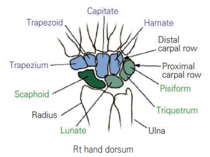
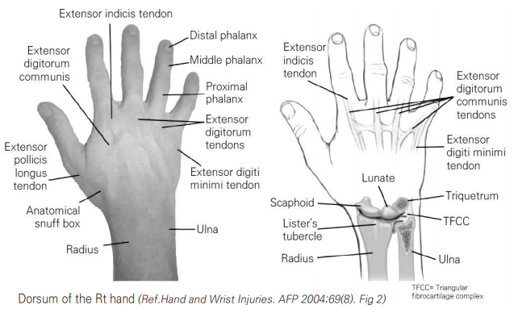
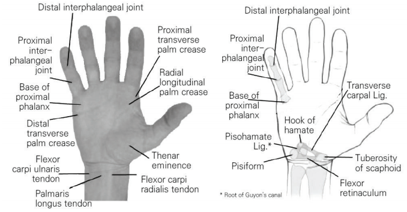
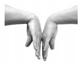
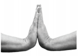
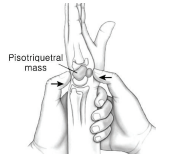
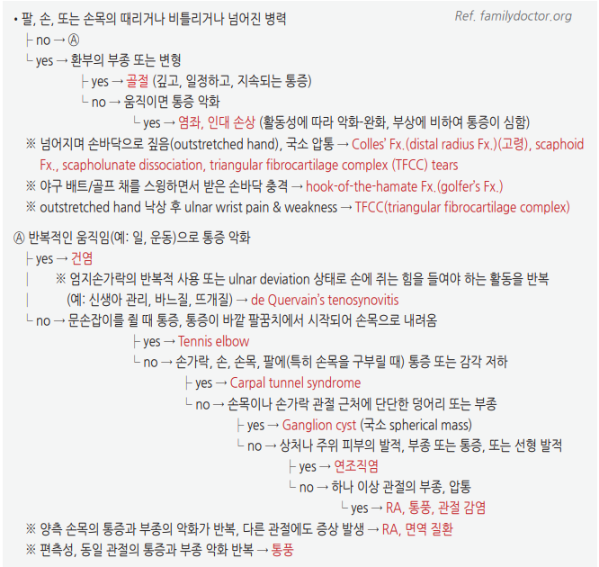
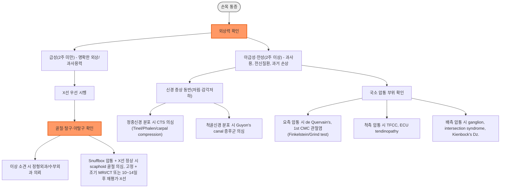

# 손목 통증 Wrist Pain

## <mark style="color:green;">일반 사항</mark>

* 손목 통증은 골·관절·인대·힘줄/건초·신경·연조직 등 다양한 구조의 외상, 과사용, 퇴행성·염증성 질환 및 신경 포착 등에 의해 발생
* 정상 운동 범위 : flexion(palmar flexion)/extension(dorsiflexion) 70\~90도, radial deviation 20도, ulnar deviation 30\~40도
* 항상 환측과 건측을 비교하여 판단

## <mark style="color:green;">원인 및 위험 인자</mark>

* 손상 : 외상(추락, 타박), 반복적 스트레스(과사용, 반복되는 힘든 작업)
* 관절염 : 골관절염, RA
* 기타 : Carpal tunnel syndrome, Ganglion cysts, Kienböck's Dz.

#### <mark style="color:$primary;">부위별 원인</mark>

* Ulnar sided : extensor carpi ulnaris tendinopathy or subluxation, triangular fibrocartilage complex injury, triquetral Fx.
* Radial sided : scaphoid Fx., scapholunate instability, trapezium Fx., de Quervain's tenosynovitis, carpometacarpal(CMC) osteoarthritis
* Volar sided : hook of the hamate Fx., pisiform Fx., carpal tunnel syndrome, ulnar neuropathy
* Dorsal sided : wrist sprain, distal radius Fx., carpal Fx., ganglion cyst, carpal boss, Kienböck's Dz. of the lunate, intersection syndrome

#### <mark style="color:$primary;">힘줄·건초 질환</mark>

* extensor carpi ulnaris(ECU) tendinopathy, intersection syndrome, de Quervain's tenosynovitis

#### <mark style="color:$primary;">Nerve compression 관련 질환</mark>

* carpal tunnel syndrome
* ulnar neuropathy(예 Guyon's canal syndrome)

### <mark style="color:$danger;">🚩 Red Flags!</mark>

<mark style="color:$danger;">**즉각 조치 또는 의뢰**</mark>

* 급성 구획증후군 의심 : 외상·과사용 후 손·아래팔의 손상 정도에 비해 과도한 심한 통증 + 수동 신전 시 악화, tense compartment, 진행하는 이상감각/감각 저하 → 즉시 응급 이송 및 수부외과/정형외과 평가; 창백·맥박 소실은 후기 소견일 수 있으며 맥박이 정상이어도 배제할 수 없음
* 화농성 건초염/손 감염 의심(Kanavel 4징후 : ① 손가락 굴곡 자세, ② 손가락 과신전 시 심한 통증, ③ 손가락 균일한 종창, ④ 이환된 건초 전체의 압통; 발열 등 전신 감염 징후 동반 시 의심 강화) → 즉시 항생제 및 수부외과 의뢰
* 개방성 골절, 심한 변형을 동반한 골절·탈구, 활동성 출혈
* 급성 신경·혈관 손상 징후(급격한 감각 소실, 창백, 맥박 소실, capillary refill 지연)

<mark style="color:$warning;">**당일 또는 조기 의뢰**</mark>

* Scaphoid 골절 의심(낙상력 + anatomic snuffbox 압통) - 초기 X선이 정상이어도 임상적 의심 시 고정하고, 가능한 경우 조기 MRI(또는 CT) 고려; 즉시 추가 영상이 어려우면 10\~14일 후 임상 재평가 및 X선 재촬영
* 건 열상 의심(능동 굴곡·신전 상실, 개방성 상처)
* 진행하는 신경학적 결손(근력 약화 진행, 감각 저하 확대)
* 급성 비외상성 hot swollen wrist(심한 관절통·종창·열감·홍반, 능동/수동 ROM 제한 ± 발열), 특히 면역저하·당뇨·최근 감염/관절 시술 환자 → septic arthritis 우선 배제; 배제 후에는 고령에서 손목이 호발 부위인 CPPD(가성통풍)도 감별; 필요시 즉시 관절천자 및 전문의뢰
* 빠르게 커지는 종괴, 단단하거나 고정된 종괴, 야간통·휴식통, 설명되지 않는 체중 감소 또는 골 파괴 의심 → 종양 등 다른 원인 감별을 위해 조기 의뢰

<mark style="color:$info;">**외래 추적 / 추가 평가 계획**</mark> <mark style="color:$info;">- 즉각 위험 낮으나 호전 없으면 의뢰</mark>

* 보존적 치료(안정·부목·NSAID) 4\~6주 후에도 호전 없는 경우
* 만성 과사용 증상이 지속되거나 악화되는 경우
* 진단이 불명확한 지속성 통증
* 단순 ganglion cyst 등 양성 종괴가 의심되나 지속·증가하거나 증상을 유발하는 경우

## <mark style="color:green;">진단</mark>

### <mark style="color:orange;">손목의 해부학적 구조</mark>

✽[Wrist anatomy](https://emedicine.medscape.com/article/1899456-overview), [Hand muscle(3D)](https://www.innerbody.com/image_skel13/ligm27.html)

<figure><figcaption><p>Rt hand dorsum (Ref. Hand and Wrist Injuries. AFP 2004;69(8). Fig 1)</p></figcaption></figure>

<figure><figcaption><p>Dorsum of the Rt hand (Ref. Hand and Wrist Injuries. AFP 2004;69(8). Fig 2)</p></figcaption></figure>

<figure><figcaption><p>Palm of the Rt hand (Ref. Hand and Wrist Injuries. AFP 2004;69(8). Fig 4)</p></figcaption></figure>

### <mark style="color:orange;">병력 청취 및 관찰</mark>

* 외상 여부 확인(병력이 모호할 수 있음) → 외상 원인 배제 시 과사용 또는 신경 압박 여부 확인 → 병력 및 증상의 부위에 따른 의심 질환 검사
* 통증 정도, 압통, 홍반, 붓기, 덩어리, 피부 병변, 근 위축, 수축, 흉터, 기형 관찰
* 신경 증상 동반(예: 감각 저하, 저림, 따끔거림) 여부 관찰
* 능동 및 수동 운동 범위 관찰

### <mark style="color:orange;">특수 신체검사</mark>

<table><thead><tr><th width="160">검사명</th><th>검사 방법 [양성 소견]</th><th width="200">의심 상태</th></tr></thead><tbody><tr><td><a href="https://www.youtube.com/watch?v=0KXRcnQqGUc">Tinel test</a></td><td>환자의 손목 안쪽 중앙부를 tapping [정중신경 분포를 따라 통증·이상감각 발생 시 양성]</td><td>Carpal tunnel syndrome</td></tr><tr><td>Phalen test</td><td>1분간 손목을 완전 굴곡(양 손등을 붙임) [정중신경 분포를 따라 통증·이상감각 발생 시 양성]</td><td>Carpal tunnel syndrome</td></tr><tr><td>Reverse Phalen test</td><td>1\~2분간 손목을 완전 신전(양 손바닥을 붙임) [정중신경 분포를 따라 통증·이상감각 발생 시 양성]</td><td>Carpal tunnel syndrome</td></tr><tr><td><a href="https://www.youtube.com/watch?v=4Xb0uc53qCs">Carpal compression test</a></td><td>검사자가 엄지손가락으로 30초간 손목 안쪽 중앙부를 압박 [정중신경 분포를 따라 통증·이상감각 발생 시 양성]</td><td>Carpal tunnel syndrome</td></tr><tr><td><a href="http://mskmedicine.com/clinical_skills/finkelsteins-test/">Finkelstein(Eichhoff) test</a></td><td>엄지손가락을 손 안에 넣어 주먹을 쥐게 하고 손목을 수동적으로 ulnar deviation [radial styloid 부위 통증 시 양성; 엄밀히는 Eichhoff maneuver로 기술되는 방법이며, 원래 기술된 능동 신전·외전 후 척측 편위 방식의 Finkelstein test가 위양성률이 더 낮다는 보고가 있음(Wu et al. J Hand Microsurg 2018)]</td><td>de Quervain's tenosynovitis</td></tr><tr><td><a href="https://www.youtube.com/watch?v=1kJtO4NLzBY">Grind test</a></td><td>thumb metacarpal bone을 잡고 trapezium 쪽으로 압박하며 회전 [통증, crepitus]</td><td>1st CMC(trapeziometacarpal) 관절염</td></tr><tr><td>Lunotriquetral shear test</td><td>triquetrum을 손등에서, lunate을 손바닥에서 압박 [통증, crepitus]</td><td>Lunotriquetral ligament tear</td></tr><tr><td><a href="https://www.youtube.com/watch?v=32ywiqilGdg">Supination lift test</a></td><td>손바닥으로 탁자 아래를 받치고 탁자를 밀어 올리게 함 [통증]</td><td>TFCC injury</td></tr><tr><td>Ulnar fovea sign</td><td>척골 붓돌기(ulnar styloid)와 flexor carpi ulnaris 건 사이의 함요부(fovea)를 엄지로 직접 압박 [통증 유발 시 양성]</td><td>TFCC foveal 손상, ulnotriquetral ligament injury</td></tr><tr><td><a href="https://www.youtube.com/watch?v=FTIbOdQV164">Watson's test (Scaphoid shift test)</a></td><td>scaphoid tubercle을 손바닥면에서 압박하면서 손목을 ulnar→radial deviation [통증, clunk(압박을 풀 때 발생)]</td><td>Scaphoid instability, Scapholunate separation</td></tr></tbody></table>

TFCC = triangular fibrocartilage complex(triangular fibrocartilage, ulnar collateral lig., dorsal and palmar radioulnar lig., ulnolunate and ulnotriquetral lig., extensor carpi ulnaris tendon sheath)

✽Ulnar fovea sign : 원 연구에서 민감도 95.2%, 특이도 86.5%로 보고되었으나(Tay et al. J Hand Surg Am 2007), 이후 대규모 재현 연구에서는 민감도 73%, 특이도 44%로 더 낮게 나타나(Schmauss et al. Arch Orthop Trauma Surg 2016) 단독 소견만으로 진단하지 않음

<figure><figcaption><p>② Phalen test</p></figcaption></figure>

<figure><figcaption><p>③ Reverse Phalen test</p></figcaption></figure>

<figure><figcaption><p>⑦ Lunotriquetral shear test (Ref. UpToDate. 2011.)</p></figcaption></figure>

### <mark style="color:orange;">영상 검사</mark>

* 일률적인 검사는 권하지 않음
* X선 : 급성 외상에서 골절·탈구 평가의 초기 검사이며, 만성 지속성 손목 통증에서도 원인이 명확하지 않으면 우선 고려 \[ACR 2023]
  * scaphoid Fx.에서 초기 X선 검사의 최대 20\~30%가 위음성일 수 있음; 임상적으로 골절이 의심되면 고정 후 조기 MRI(또는 CT)를 고려하고, 즉시 추가 영상이 어려우면 10\~14일 후 임상 재평가 및 X선 재촬영
* CT : X선에서 보이지 않는 골절 또는 골성 병변 평가에 고려
* MRI : occult fracture, 무혈관괴사 및 인대·건 등 연조직 병변 평가에 고려
  * 만성 손목 통증에서 X선이 정상 또는 비특이적이고 인대·TFCC 병변이 의심되면 MRI 또는 MR arthrography 고려 \[ACR 2023]
* 초음파 : 인대 및 낭종 진단; 시술자에 따른 정확도의 편차가 있음, 복잡한 골격 구조를 평가하기 어려움
* 기타 : bone scan, arthrography, arthroscopy

### <mark style="color:orange;">발생 기간별 감별</mark>

#### <mark style="color:$primary;">급성(2주 미만)</mark>

외상(타박상, 골절, 염좌, 인대 파열), 과사용, 만성 질환의 악화

<table><thead><tr><th width="170">원인</th><th width="240">특징</th><th>검사</th></tr></thead><tbody><tr><td>Carpal instability</td><td>외상력, carpal tenderness, radial 또는 ulnar deviation 시 소리 발생</td><td>radial/ulnar deviation X선 또는 추가 검사(CT, MRI, bone scan)</td></tr><tr><td>골절</td><td>외상력, 골 압통</td><td>상동</td></tr><tr><td>Joint subluxation</td><td>외상력, 움직임 시 불안정</td><td>X선 또는 MRI</td></tr><tr><td>Ligament tear</td><td>외상력, 움직임 시 통증</td><td>MRI</td></tr></tbody></table>

_Ref. Forman TA, et al. A Clinical Approach to Diagnosing Wrist Pain. AFP 2005;72(9):1753-1758. Table 1; Mirabelli MH, et al. Evaluation and Diagnosis of Wrist Pain. AFP 2013;87(8):568-573. Table 1._

#### <mark style="color:$primary;">아급성(2주\~3개월)/만성(3개월 이상)</mark>

과사용/반복적 사용, 전신 질환, 과거 손상

<table><thead><tr><th width="220">원인</th><th width="220">특징</th><th>검사</th></tr></thead><tbody><tr><td>신경학적(척골·정중·요골 신경 포착)</td><td>감각(운동 동반 가능) 장애를 동반한 통증</td><td>X선, 신경전도 검사</td></tr><tr><td>과거 손상(불유합, 무혈관괴사)</td><td>외상력(회복되지 않았던 손상)</td><td>상동</td></tr><tr><td>전신 질환(RA, amyloidosis, gout, CPPD)</td><td>전신 증상, 부종, 지속적 통증</td><td>CBC, ESR, CRP</td></tr><tr><td>Tendinopathy</td><td>움직임 시 통증</td><td>보통 불필요</td></tr></tbody></table>

_Ref. Mirabelli MH, et al. AFP 2013;87(8):568-573. Table 2; Forman TA, et al. AFP 2005;72(9):1753-1758. Table 2._

### <mark style="color:orange;">부위에 따른 감별</mark>

* anatomic snuff box 압통 → scaphoid 손상, Preiser's Dz.
* lunate tenderness → Kienböck's Dz.
* scapholunate interval 압통(Lister's tubercle에서 원위 1.5 ㎝ 부위) → scapholunate 이상
* distal carpal row, proximal hypothenar area 압통 → hamate hook의 손상(nonunion)
* pisiform과 ulnar styloid 사이 공간 바로 원위부 압통 → TFCC injury
* thenar eminence atrophy → median nerve entrapment(carpal tunnel syndrome)
* mid-carpal area(proximal & distal carpal rows 사이) 압통 → midcarpal strain, instability, arthritis
* radius 원위부 외측면 압통 → de Quervain's tenosynovitis

### <mark style="color:orange;">부위/구조물에 따른 주요 질환의 특징</mark>

<table><thead><tr><th width="220">원인</th><th width="220">특징</th><th>검사</th></tr></thead><tbody><tr><td>TFCC</td><td>pisiform과 ulnar styloid 사이의 압통</td><td>MRI; 필요시 arthroscopy</td></tr><tr><td>Distal radioulnar joint subluxation</td><td>통증, radioulnar grind test 양성</td><td>X선; 필요시 MRI, arthroscopy, cineroentgenography</td></tr><tr><td>Carpal instability</td><td>midcarpal 압통, ulnar deviation 시 clunk</td><td>cineroentgenography</td></tr><tr><td>Scapholunate dissociation</td><td>scapholunate interval 압통</td><td>X선</td></tr><tr><td>De Quervain tenosynovitis</td><td>distal radius의 radial aspect 압통</td><td>초음파</td></tr><tr><td>Intersection syndrome</td><td>distal radius의 dorsum 압통 및 crepitus</td><td>-</td></tr><tr><td>Neoplasm or ganglion</td><td>덩어리, 압통</td><td>초음파</td></tr></tbody></table>

_Ref. Forman TA, et al. A Clinical Approach to Diagnosing Wrist Pain. AFP 2005;72(9):1753-1758. Table 1._

### <mark style="color:orange;">증상/병력에 따른 손/손목 문제의 감별</mark>

<figure><figcaption><p>증상/병력에 따른 손·손목 문제의 감별</p></figcaption></figure>

* 신경 분포를 따라 보다 광범위하게 발생하는 작열감, 이상 감각 → 신경 손상
* carpometacarpal 관절의 두드러짐(squaring) → 퇴행성 관절 질환
* 극심한 지속되는 통증, 최근 감염력 → 급성 septic arthritis
* 평소 약간의 통증, 최근 과사용 또는 힘든 작업 → 만성 질환의 급성 악화
* spontaneous onset, 반복적 작업/활동, 외상 병력 모호, 관절염 증상(통증, 부종), 근력 약화 → nonunion, avascular necrosis
* 전신 증상(예: 발열, 야간 발한, 권태, 체중 감소, 만성 피로), 양측성 또는 다른 관절 이환 → 전신 질환
* excessive extension 및 ulnar or radial deviation 상태에서의 급성 손상, 힘을 쓸 때 clicking or popping 소리 → 인대 손상(예: radial deviation 손상 시 scapholunate lig., ulnar deviation 손상 시 lunotriquetral lig.)

### <mark style="color:orange;">주요 감별 질환의 병력 및 진찰 소견</mark>

<table><thead><tr><th width="200">상태</th><th>병력 및 진찰 소견</th></tr></thead><tbody><tr><td>Compartment syndrome</td><td>외상력(손상, 수술, 과격한 활동); 지속적인 아래팔 통증과 조임감; 얼얼함, 화끈거림, 무감각<br>이환된 구획의 압통 및 긴장감; 관련 근육의 수동 신장 시 통증 증가; 진행하는 이상감각·감각 저하. 창백·마비·맥박 감소/소실은 후기 소견일 수 있으며 맥박이 정상이어도 배제할 수 없음</td></tr><tr><td>손의 화농성 건초염/감염</td><td>최근 손상력; 감염과 염증의 전형적 증상<br>Kanavel 4징후 : ① 손가락 굴곡 자세, ② 손가락 과신전 시 심한 통증, ③ 손가락 균일한 종창, ④ 이환된 건초 전체의 압통</td></tr><tr><td>Long flexor tendon 파열</td><td>건의 열상; 강한 굴곡 수축<br>원위지 및 근위지 관절의 독립된 운동 상실; 이환된 근육의 촉지 실패</td></tr><tr><td>Lunate 골절/탈구</td><td>손으로 바닥을 짚고 넘어지거나 접질린 이력; 손목 전체의 통증<br>손목 신전 시 동작 끝부분에서 통증 유발; 쥐는 힘 감소 또는 물건을 잡을 때 통증</td></tr><tr><td>Scaphoid fracture</td><td>손을 편 상태로 넘어진 이력; 15\~30세 남성, 골다공증 여성<br>손목 주위 종창과 멍; anatomic snuffbox 및 주상골 결절의 압통; 손을 쥘 때 통증 증가</td></tr><tr><td>원위부 Radius(Colles') 골절</td><td>강하게 손목을 신전한 채 팔을 쭉 펴고 넘어진 경우; 젊은 남성 혹은 나이 든 여성<br>손목 종창; 손목을 중립위로 놓으려 함; 손목 신전 시 통증</td></tr><tr><td>Radial head fracture</td><td>손을 쭉 펴고 넘어진 이력<br>팔꿈치 관절 삼출(팔꿈치를 약간 굽힌 자세로 있으려 함); 회외·회내 능동적 관절 운동 시 통증 및 제한; 요골두 압통</td></tr><tr><td>레이노병</td><td>가족력; estrogen 치료 여성; 한랭 노출/동상; 교원혈관병 질환자<br>손가락 창백, 청색증, 충혈 홍반; 혈관수축제 복용력(β-차단제, 암페타민, 충혈완화제, 카페인)</td></tr><tr><td>Complex regional pain syndrome (Reflex sympathetic dystrophy)</td><td>손상 혹은 수술 이력; 유발 사건에 비례하지 않는 심한 작열감·찌르는·쑤시는 통증; 일반 진통제에 무반응; 2차적 통각과민·감각과민<br>종창, 온감, 홍반; 정상과 이환된 팔다리의 체온 차이</td></tr><tr><td>Melanoma</td><td>암 병력; 여성 ＜40세, 남성 ＞40세; 흰색 피부, 일광 화상 병력<br>비대칭 또는 불규칙 모양; 가장자리가 파여 있거나 물결 모양·불분명; 고르지 않은 색; 지름 ＞6 mm</td></tr></tbody></table>

_Ref. Red flags for potential serious conditions in patients with elbow, wrist, or hand problems. Kaiser Permanente Southern California Orthopaedic PT Residency._

### <mark style="color:orange;">흔한 손목 질환</mark>

#### <mark style="color:$primary;">손목터널증후군 (Carpal tunnel syndrome, CTS)</mark>

* 손목의 골과 인대 사이에서 median nerve entrapment에 의해 발생하는 지연형 정중신경 마비 (☞ [수근관증후군](142_-carpal-tunnel-syndrome-cts.md))
* 관련 요인/위험 인자 : 여성, 비만, 당뇨병, 갑상선저하증, RA, 임신, 원위요골 골절 후 변형 등; 반복적인 강한 힘 사용이나 진동 노출은 직업성 CTS 위험과 관련될 수 있으나 일반적인 키보드 사용과의 인과관계는 명확하지 않음
* 증상 : 엄지·검지·중지 및 약지의 요측 절반(median nerve distribution)의 저림·통증·감각 저하가 전형적이며 밤에 심함; 손 사용이나 손목 굴곡 시 악화될 수 있음. Palmar cutaneous branch는 carpal tunnel을 통과하지 않아 thenar eminence의 감각은 대개 보존됨
* 검사 : Tinel test, Phalen test, reverse Phalen test, carpal compression test; 병력·이학적 소견에 기반한 CTS-6 임상 진단 도구로 대부분 충분하며, 신경전도/근전도·초음파의 일률적 시행은 권고되지 않음 \[AAOS 2024 Strong evidence]
  * CTS-6 구성 항목(6가지 소견에 가중치를 부여해 점수화) : 야간 저림·통증, 정중신경 분포의 저림, thenar 위약, Tinel sign 양성, Phalen test 양성, 정중신경 분포의 2-point discrimination 저하\
    ✽AAOS 2024 지침은 일반적인 키보드 사용과 CTS 발생 사이에 명확한 연관성 근거가 없다고 명시함(작업 관련 CTS는 진동 노출, 강한 힘의 반복 사용 등과 더 관련)

#### <mark style="color:$primary;">de Quervain tenosynovitis (드퀘르뱅 건초염)</mark>

* 엄지손가락과 손목을 연결하는 제1 신근구획 힘줄(장무지외전근건 및 단무지신전근건)의 협착성 건초염
* 원인 : 반복적인 엄지·손목 사용(gripping or grabbing; 도구 사용, golf club, tennis racket 등)과 연관될 수 있으며, 임신·산후/수유기에 호발; 다만 반복적·강한 수작업과의 연관성은 보고되나 인과관계는 확립되지 않음 \[Stahl et al. Plast Reconstr Surg 2013]
* 증상 : 엄지손가락과 손목의 통증, 손목 부종, 주먹 또는 도구를 쥘 때 통증 또는 힘의 약화
* 검사 : Finkelstein(Eichhoff) test

#### <mark style="color:$primary;">TFCC injury (삼각섬유연골복합체 손상)</mark>

* 척측 손목 통증의 흔한 원인; axial loading 또는 회전(rotation) 동반 외상, 혹은 반복적 과사용으로 발생
* 증상 : ulnar-sided wrist pain, 힘을 줄 때(grip, push-up 등) 악화, clicking·popping
* 검사 : ulnar fovea sign, supination lift test
* 지속 증상 또는 불안정성 소견 시 MRI 고려; 영상과 임상 소견이 불일치하거나 지속적 불안정성이 있으면 MRI/임상 소견에 관계없이 수부외과 평가 및 관절경을 고려(임상 검사·MRI 모두 진단 정확도에 한계가 있음)

#### <mark style="color:$primary;">Ganglion cyst (결절종)</mark>

* 손목에서 가장 흔한 양성 연조직 종괴; dorsal wrist(특히 scapholunate 부위)가 호발 부위
* 관절낭 또는 건초에서 기원한 점액성 낭종; 무증상인 경우가 많음
* 증상 : 무통성 또는 경도의 통증을 동반한 국소 종괴; 손목 운동 시 악화 가능
* 무증상 시 관찰; 통증·기능 장애 동반 시 흡인 또는 수술 고려(☞ 시술 및 기타 처치)

***



<p align="center"><strong>손목 통증 평가 알고리듬</strong></p>

<p align="center"><em><mark style="color:$info;">Ref. Forman TA, et al. AFP 2005;72(9):1753-1758; Mirabelli MH, et al. AFP 2013;87(8):568-573.</mark></em></p>

***

## <mark style="background-color:$warning;">Management</mark>


**비특이적·과사용성 손목 통증에서는 활동 조절, 냉찜질, 적절한 부목과 단기 진통제를 사용할 수 있으며, 골절·인대 손상·신경포착·감염 등 원인 질환에 따라 치료를 달리합니다.**


## <mark style="color:green;">비-약물 치료 및 예방</mark>

* Rest : 통증 유발 동작 회피
* 냉찜질 : 손상 후 6시간\~2일 동안 수 시간(2\~6시간)마다 15분간 적용; 동상 주의(피부에 직접 얼음이 닿지 않도록 함)
* Brace : 손상 부위와 치료 목적에 맞는 부목을 선택(예: CTS는 neutral wrist splint, de Quervain 건초염은 thumb spica splint)
  * 손 전체를 장기간 고정해야 하는 경우 구축 예방을 위해 intrinsic-plus(safe hand) position을 고려 : wrist 0\~30° extension, MCP joint 70\~90° flexion, IP joint 0° extension, thumb abduction/opposition
* 재활 치료 : 스트레칭, 강화 훈련(통증 호전 후 점진적으로 시행)

#### <mark style="color:$primary;">예방</mark>

* 손목을 반복적으로 과도하게 사용하는 작업을 줄이고, 작업 시 손목을 중립에 가깝게 유지하며 자주 휴식
* 스트레칭, 강화 훈련
* 골절 위험이 높은 경우 충분한 칼슘·Vit D 섭취 및 골다공증 위험 평가
* 낙상 예방 : 적당한 신발, 미끄러짐 방지 장치, 발에 걸릴 위험이 있는 물건을 치움, 조명을 어둡지 않게 함; 고령에서 약물 주의
* 필요시 활동(특히 운동) 중 손목 보호대 착용

## <mark style="color:green;">약물 치료</mark>

* 비특이적·과사용성 손목 통증에서 증상 조절 목적으로 acetaminophen 또는 NSAID를 단기간 사용할 수 있음
  * acetaminophen 500\~1,000 ㎎ q6\~8h PRN <mark style="color:blue;">\[타이레놀]</mark> - 일반적으로 총 3,000\~4,000 ㎎/day를 넘지 않도록 하며, 고령·간질환·과음 등 위험 요인에서는 더 낮은 최대 용량을 적용
  * ibuprofen 200\~800 ㎎ tid <mark style="color:blue;">\[부루펜]</mark>
  * naproxen 250 ㎎ tid\~500 ㎎ bid <mark style="color:blue;">\[낙센]</mark>
* 국소(topical) NSAID : 경증 건초염·염좌에서 전신 부작용을 줄이면서 국소 통증을 조절할 수 있는 선택지; 고령, 위장관 질환, 신기능 저하 환자에서 경구제 대안으로 고려
  * diclofenac gel <mark style="color:blue;">\[볼타렌 겔]</mark>, ketoprofen patch <mark style="color:blue;">\[케토톱]</mark>

## <mark style="color:green;">시술 및 기타 처치</mark>

* 스테로이드 국소 주사
  * de Quervain 건초염 : 활동 조절과 함께 corticosteroid injection을 조기에 고려할 수 있으며, 3\~4주 thumb spica immobilization 병용이 효과적인 1차 치료 전략으로 제시됨 \[Challoumas et al. JAMA Netw Open 2023]
  * 손목터널증후군 : 단기 증상 완화 효과는 있으나 장기적 이득은 입증되지 않음 \[AAOS 2024 Strong evidence]
  * 감염, 연골 손상, 피부 색소 탈실 등의 위험을 사전에 설명
* PRP(platelet-rich plasma) 주사 : 손목터널증후군의 비수술적 치료에서 장기적 이득이 입증되지 않음 \[AAOS 2024 Strong evidence]
* 낭종(ganglion cyst) 흡인 : 증상이 있는 경우 고려하나 1년 내 50% 이상에서 재발할 수 있음 \[AFP 2024]
* 수술 : carpal tunnel syndrome, de Quervain 건초염 등에서 보존적 치료로 호전되지 않을 때 고려
  * 손목터널증후군 : mini-open과 endoscopic release 간 장기 결과의 차이는 없음; 국소 마취만으로 시행 가능하며, 수술 후 정기적 재활치료나 부목 고정을 일률적으로 시행할 필요는 없음 \[AAOS 2024]

***

### <mark style="color:red;">질병코드</mark>

M25.53 관절통, 아래팔

M25.54 관절통, 손

M65.4 요골경상돌기건초염\[드퀘르뱅]

G56.0 정중신경의 병변\[손목터널증후군]

M77.2 손목의 관절주위염

M67.44 결절종, 손(수근골 포함)

M19.03 원발성 관절증, 아래팔

M19.04 원발성 관절증, 손

S62 손목 및 손 부위의 골절

S63 손목 및 손 부위의 관절 및 인대의 탈구, 염좌 및 긴장

S63.5 손목의 염좌 및 긴장

S64 손목 및 손 부위의 신경의 손상

S66 손목 및 손 부위의 근육 및 힘줄의 손상

***

## <mark style="color:purple;">처방례</mark>

> **처방례 1. 손목 염좌/건염(경증)**
>
> ```
> naproxen 250 ㎎/T  1T bid  (식후)
> ※ 증상에 따라 5~7일 단기 사용
> ※ 손목 보호대 착용 및 안정 병행
> ```

> **처방례 2. 손목터널증후군(경도\~중등도)**
>
> ```
> 야간 손목 부목(neutral position)  매일 밤 4~6주 착용
> 통증 동반 시 acetaminophen 또는 NSAID  단기간 필요시 사용
> ```
>
> _✽야간 neutral wrist splint가 보존적 치료의 중심이다. 지속적 감각 저하, thenar weakness/atrophy 또는 보존적 치료 실패 시 수부외과 평가를 고려하며, 국소 스테로이드 주사는 단기 증상 완화 효과는 있으나 장기적 이득은 입증되지 않음(AAOS 2024)._

> **처방례 3. de Quervain 건초염**
>
> ```
> 엄지 스파이카 부목(thumb spica splint)  3~4주
> 통증 동반 시 naproxen 250 ㎎/T  1T bid  단기간 필요시 사용
> corticosteroid injection  조기에 고려
> ```
>
> _✽Finkelstein(Eichhoff) test가 진단에 도움이 된다. Corticosteroid injection 후 3\~4주 thumb spica immobilization을 병용하는 전략이 1차 치료로 제안된다. CSI 단독과 비교한 추가적인 기능·통증 개선은 통계적으로 유의했으나 임상적으로 의미 있는 차이에는 미치지 못했다(Challoumas et al. JAMA Netw Open 2023)._

> **처방례 4. Scaphoid 골절 의심(임상적 의심, 초기 X선 음성)**
>
> ```
> Thumb spica cast 고정
> 가능한 경우 조기 MRI(또는 CT) 고려
> 즉시 추가 영상이 어려우면 10~14일 후 임상 재평가 및 X선 재촬영
> ```
>
> _✽초기 X선의 위음성률이 최대 20\~30%로 높아, snuffbox 압통이 있으면 임상적으로 골절에 준하여 치료_

***

### <mark style="color:$success;">핵심 복약 지도</mark>

> **NSAID/acetaminophen 복용 시 주의사항**
>
> * 식후 복용을 권장하며, 위장 장애·신장 기능 저하 환자에서는 저용량으로 시작하거나 acetaminophen을 우선 고려하십시오.
> * 항응고제 복용 중인 환자는 NSAID 병용 시 출혈 위험이 증가할 수 있습니다.
> * 증상 완화 목적의 단기 사용이 원칙이며, 4\~6주 이상 지속 시 재평가가 필요합니다.

> **부목/보호대 착용법**
>
> * 손목터널증후군에서는 야간에 손목을 중립위(neutral position)로 유지하는 부목을 착용합니다. de Quervain 건초염에서는 thumb spica splint 등 질환별 적절한 부목을 선택합니다.
> * 장기간 고정은 관절 강직 및 근력 약화를 유발할 수 있으므로, 통증이 호전되면 점진적으로 사용 시간을 줄이고 스트레칭을 병행하십시오.

> **스테로이드 국소 주사 관련 안내**
>
> * 감염, 연골 손상, 피부 색소 탈실 등의 위험이 있을 수 있음을 사전에 설명하십시오.
> * 손목터널증후군에서 국소 스테로이드 주사는 단기 증상 완화에는 도움이 되나 장기적 이득은 입증되지 않았습니다(AAOS 2024).
> * 낭종(ganglion cyst) 흡인은 1년 내 50% 이상에서 재발할 수 있음을 안내하십시오.

> **언제 다시 병원을 방문해야 하나요?**
>
> * 보존적 치료 4\~6주 후에도 증상이 호전되지 않는 경우
> * 손·손목의 급격한 부종, 감각 저하, 창백, 맥박 소실 등 신경·혈관 증상이 발생하는 경우 - 즉시 내원
> * 국소 열감, 홍반, 심한 압통 등 감염 징후가 발생하는 경우 - 즉시 내원
> * 외상 후 심한 통증이 지속되거나 변형이 관찰되는 경우 - 즉시 내원

***

### <mark style="color:blue;">환자 안내서</mark>


**손목 통증, 대부분은 과사용이나 가벼운 손상 때문입니다**

손목 통증은 반복적인 사용이나 가벼운 손상으로 인한 힘줄·인대의 자극이나 손상이 흔한 원인입니다. 다만 넘어지면서 다친 경우나 저림·감각 이상이 동반되는 경우에는 정확한 진단이 필요합니다.


#### <mark style="color:$primary;">왜 손목이 아픈가요?</mark>

* 손목은 여러 개의 작은 뼈와 인대, 힘줄이 좁은 공간에 모여 있어, 반복적인 사용이나 작은 손상에도 통증이 쉽게 발생합니다.
* 컴퓨터·스마트폰 사용, 운동(골프, 테니스 등), 육아(아이 안기) 등 반복 동작이 흔한 유발 요인입니다.
* 손을 짚고 넘어지는 경우 손목뼈(주상골 등)의 골절이 흔히 발생할 수 있습니다.

#### <mark style="color:$primary;">일상생활에서 어떻게 관리하나요?</mark>

* **통증을 유발하는 동작을 줄이십시오.** 반복적인 손목 사용을 피하고, 작업 중간에 자주 휴식을 취하십시오.
* **질환에 맞는 부목을 사용하십시오.** 손목터널증후군에서는 야간에 손목을 중립위로 유지하는 부목이 도움이 되며, 드퀘르뱅 건초염에서는 엄지까지 고정하는 thumb spica 부목을 사용할 수 있습니다.
* **초기 손상에는 냉찜질을 하십시오.** 손상 후 2일 이내 15분씩 하루 여러 차례 적용하며, 얼음이 피부에 직접 닿지 않도록 하십시오.
* **손목 스트레칭과 근력 강화 운동**을 통증이 가라앉은 후 점진적으로 시작하십시오.
* **드퀘르뱅 건초염이 있다면 엄지를 반복적으로 사용하는 동작(문자 입력, 아이 안기, 병뚜껑 열기 등)을 의식적으로 줄이십시오.**
* **넘어짐을 예방하십시오.** 걸려 넘어질 물건을 치우고, 미끄럼 방지 신발을 착용하며, 특히 어르신은 집 안 조명을 밝게 유지하십시오. 손을 짚고 넘어지면서 손목뼈가 부러지는 경우가 흔합니다.

#### <mark style="color:$primary;">약은 어떻게 써야 하나요?</mark>

* 소염진통제(NSAID)나 타이레놀은 통증이 심할 때 짧은 기간 사용하는 약입니다. 임의로 장기간 복용하지 마십시오.
* 스테로이드 주사는 일시적으로 통증을 크게 줄여주지만, 반복 주사는 힘줄이나 관절에 좋지 않은 영향을 줄 수 있어 의사와 상담 후 결정하십시오.

#### <mark style="color:$primary;">이럴 때는 즉시 병원을 방문하세요</mark>

* 넘어지거나 다친 후 손목이 심하게 붓거나 모양이 변한 경우
* 손이나 손가락의 감각이 없어지거나 색깔이 창백해지는 경우
* 손가락을 움직이기 어렵거나 힘이 빠지는 경우
* 손목 주변이 뜨겁고 붉게 부어오르며 열이 나는 경우
