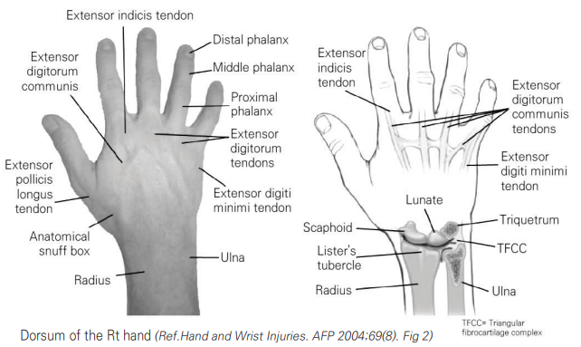
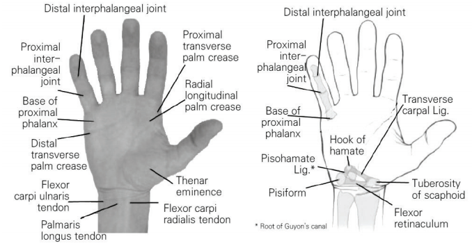
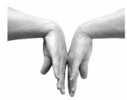
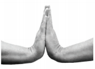
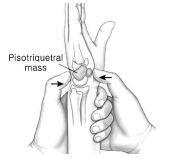
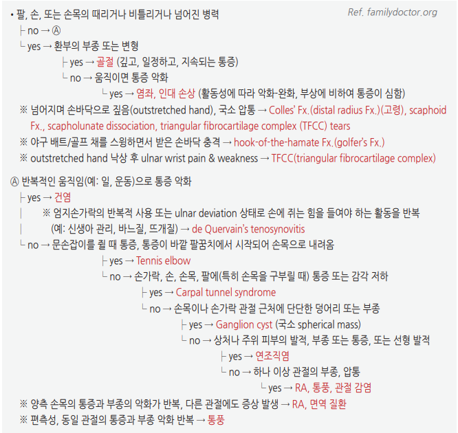
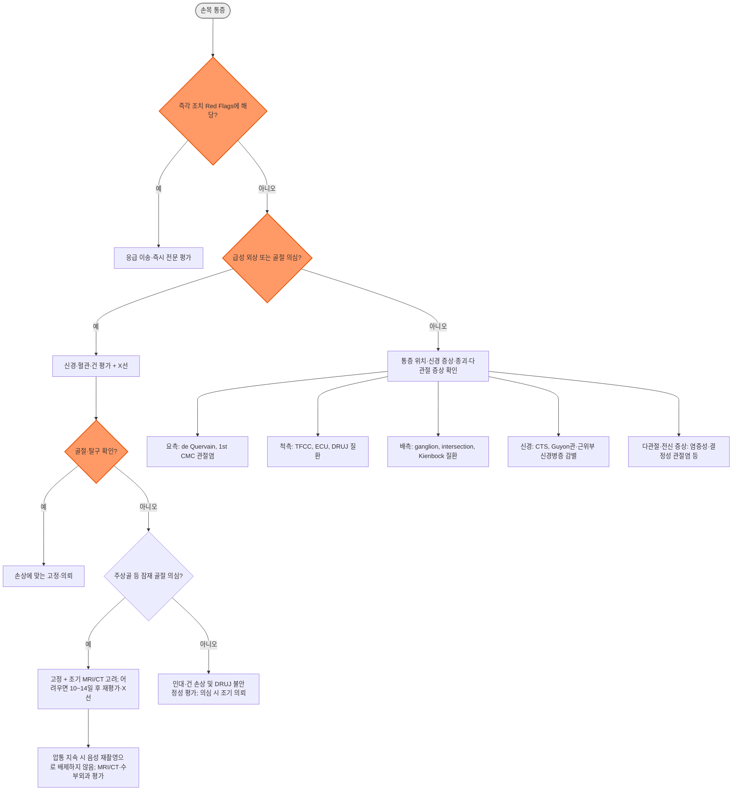

# 손목 통증 Wrist Pain

## <mark style="color:green;">일반 사항</mark>

* 반복 사용, 외상 등에 의한 골, 인대, 힘줄, 연조직 등 손목 구조물의 손상 또는 염증으로 발생
* 정상 운동 범위 : flexion(palmar flexion) 약 80도, extension(dorsiflexion) 약 70도, radial deviation 20도, ulnar deviation 30\~40도
* 연령·개인차를 고려하고 항상 환측과 건측을 비교하여 판단

## <mark style="color:green;">원인 및 위험 인자</mark>

* 손상 : 외상(추락, 타박), 반복적 스트레스(과사용, 반복되는 힘든 작업)
* 관절염 : 골관절염, RA
* 기타 : Carpal tunnel syndrome, Ganglion cysts, Kienböck's Dz.

#### <mark style="color:$primary;">부위별 원인</mark>

* Ulnar sided : extensor carpi ulnaris tendinopathy or subluxation, triangular fibrocartilage complex injury, triquetral Fx.
* Radial sided : scaphoid Fx., scapholunate instability, trapezium Fx., de Quervain's tenosynovitis, carpometacarpal(CMC) osteoarthritis
* Volar sided : hook of the hamate Fx., pisiform Fx., carpal tunnel syndrome, ulnar neuropathy
* Dorsal sided : wrist sprain, distal radius Fx., carpal Fx., ganglion cyst, carpal boss, Kienböck's Dz. of the lunate, intersection syndrome

#### <mark style="color:$primary;">힘줄·건초 질환</mark>

* extensor carpi ulnaris(ECU) tendinopathy, intersection syndrome, de Quervain's tenosynovitis

#### <mark style="color:$primary;">Nerve compression 관련 질환</mark>

* carpal tunnel syndrome
* ulnar neuropathy(예 Guyon's canal syndrome)

### <mark style="color:$danger;">🚩 Red Flags!</mark>

<mark style="color:$danger;">**즉각 조치 또는 의뢰**</mark>

* 급성 구획증후군 의심 : 외상·과사용 후 손·아래팔의 손상 정도에 비해 과도한 심한 통증 + 수동 신전 시 악화, tense compartment, 진행하는 이상감각/감각 저하 → 즉시 응급 이송 및 수부외과/정형외과 평가; 창백·맥박 소실은 후기 소견일 수 있으며 맥박이 정상이어도 배제할 수 없음
* 손가락 화농성 굴곡건초염 의심(Kanavel 4징후 : ① 손가락 굴곡 자세, ② 손가락을 수동적으로 신전할 때 통증, ③ 손가락 균일한 종창, ④ 이환된 건초 전체의 압통; 발열이 없어도 가능하고 4징후가 모두 나타나지 않아도 배제할 수 없음) → 즉시 수부외과 평가 및 항생제 치료
* 급성으로 뜨겁고 부은 손목(심한 관절통·종창·열감, 특히 수동 운동 제한 ± 발열) → 패혈성 관절염 의심 시 즉시 전문 평가와 관절액 검사. 혈액검사 정상만으로 배제하지 않으며, 전신 상태가 안정적이면 가능하면 관절액·혈액배양 채취 후 항생제를 시작하고 패혈증 의심 시 채취 때문에 항생제를 지연하지 않음; CPPD·통풍도 감별하되 관절액에서 결정이 확인되어도 동반 감염을 배제하지 못함 \[SANJO 2023]
* 개방성 골절, 심한 변형을 동반한 골절·탈구, 활동성 출혈; 월상골·월상골주위 탈구 의심 시 외견상 변형이나 신경 증상이 뚜렷하지 않아도 즉시 평가
* 급성 신경·혈관 손상 또는 급성 손목터널증후군 징후(외상 후 급격히 심해지는 정중신경 분포의 통증·저림·감각 저하, 급격한 근력 저하, 창백, 맥박 소실, capillary refill 지연)

<mark style="color:$warning;">**당일\~수일 내 평가**</mark>

* Scaphoid 골절 의심(손을 짚고 넘어짐 등 외상력 + anatomic snuffbox 또는 주상골 결절 압통)(당일) — 초기 X선이 정상이어도 임상적 의심 시 고정하고, 가능한 경우 조기 MRI(또는 CT) 고려; 즉시 추가 영상이 어려우면 10\~14일 후 임상 재평가 및 X선 재촬영
* 건 열상·파열 의심(능동 굴곡·신전 상실, 개방성 상처 또는 강한 견인 손상)(당일)
* 외상 후 scapholunate 인대 손상 또는 distal radioulnar joint(DRUJ) 불안정성 의심(국소 압통·통증성 clunk, 회내·회외 제한, 척골두의 비정상적 이동) → 고정 후 조기 수부외과 평가; 단순 염좌로 보고 4\~6주 기다리지 않음
* 진행하는 신경학적 결손(근력 약화 진행, 감각 저하 확대)(당일)
* 빠르게 커지는 종괴, 단단하거나 고정된 종괴, 야간통·휴식통, 설명되지 않는 체중 감소 또는 골 파괴 의심 → 종양 등 다른 원인 감별을 위해 조기 의뢰

<mark style="color:$info;">**외래 추적 / 추가 평가 계획**</mark> <mark style="color:$info;">- 즉각 위험 낮으나 호전 없으면 의뢰</mark>

* 활동 조절·적절한 부목 등 보존적 치료에도 4\~6주 후 호전이 없는 경우(진통제를 계속 복용하며 기다리지 않음)
* 만성 과사용 증상이 지속되거나 악화되는 경우
* 진단이 불명확한 지속성 통증
* 손상 정도에 비례하지 않는 지속성 통증과 이질통, 피부색·온도·발한의 좌우 차이, 부종·운동 제한 → CRPS 등 평가; 골절·감염·신경 손상 등 다른 원인을 우선 감별
* 단순 ganglion cyst 등 양성 종괴가 의심되나 지속·증가하거나 증상을 유발하는 경우

## <mark style="color:green;">진단</mark>

### <mark style="color:orange;">손목의 해부학적 구조</mark>

✽[wrist anatomy 1](https://emedicine.medscape.com/article/1899456-overview), [wrist anatomy 2](https://www.aafp.org/afp/2004/0415/p1941.htm) ✽[forearm muscle](https://www.healthline.com/human-body-maps/forearm#1)(3D) ✽[hand muscle](https://www.healthline.com/human-body-maps/ring-finger#1)(3D)

<figure><figcaption><p>Dorsum of the Rt hand (Ref. Hand and Wrist Injuries. AFP 2004;69(8). Fig 2)</p></figcaption></figure>

<figure><figcaption><p>Palm of the Rt hand (Ref. Hand and Wrist Injuries. AFP 2004;69(8). Fig 4)</p></figcaption></figure>

### <mark style="color:orange;">병력 청취 및 관찰</mark>

* 외상 여부 확인(병력이 모호할 수 있음) → 외상 원인 배제 시 과사용 또는 신경 압박 여부 확인 → 병력 및 증상의 부위에 따른 의심 질환 검사
* 통증 정도, 압통, 홍반, 붓기, 덩어리, 피부 병변, 근 위축, 수축, 흉터, 기형 관찰
* 신경 증상 동반(예: 감각 저하, 저림, 따끔거림) 여부 관찰
* 능동 및 수동 운동 범위, 악력, 회내·회외 관찰; 넘어져 다친 경우 팔꿈치·아래팔도 함께 진찰
* 외상 시 개방창·변형을 확인하고 정중·척골·요골신경의 감각·운동, 손가락 관류(색, 온도, 모세혈관 재충만, 맥박)를 초기에 평가

### <mark style="color:orange;">특수 신체검사</mark>

<table><thead><tr><th width="160">검사명</th><th>검사 방법 [양성 소견]</th><th width="200">의심 상태</th></tr></thead><tbody><tr><td><a href="https://www.youtube.com/watch?v=0KXRcnQqGUc">Tinel test</a></td><td>환자의 손목 안쪽 중앙부를 tapping [정중신경 분포의 손가락으로 저림·이상감각이 재현되면 양성; 국소 손목 통증만으로 판정하지 않음]</td><td>Carpal tunnel syndrome</td></tr><tr><td>Phalen test</td><td>1분간 손목을 완전 굴곡(양 손등을 붙임) [정중신경 분포의 손가락으로 저림·이상감각이 재현되면 양성; 국소 손목 통증만으로 판정하지 않음]</td><td>Carpal tunnel syndrome</td></tr><tr><td>Reverse Phalen test</td><td>1\~2분간 손목을 완전 신전(양 손바닥을 붙임) [정중신경 분포의 손가락으로 저림·이상감각이 재현되면 양성; 국소 손목 통증만으로 판정하지 않음]</td><td>Carpal tunnel syndrome</td></tr><tr><td><a href="https://www.youtube.com/watch?v=4Xb0uc53qCs">Carpal compression test</a></td><td>검사자가 엄지손가락으로 30초간 손목 안쪽 중앙부를 압박 [정중신경 분포의 손가락으로 저림·이상감각이 재현되면 양성; 국소 손목 통증만으로 판정하지 않음]</td><td>Carpal tunnel syndrome</td></tr><tr><td>Eichhoff maneuver</td><td>엄지손가락을 손 안에 넣어 주먹을 쥐게 하고 손목을 수동적으로 ulnar deviation [radial styloid 부위 통증 시 양성; 이 방법은 Eichhoff maneuver이며, Finkelstein test와 구분함. Finkelstein 방식의 위양성률이 더 낮다는 보고가 있음(Wu et al. J Hand Microsurg 2018)]</td><td>de Quervain's tenosynovitis</td></tr><tr><td><a href="https://www.youtube.com/watch?v=1kJtO4NLzBY">Grind test</a></td><td>thumb metacarpal bone을 잡고 trapezium 쪽으로 압박하며 회전 [통증, crepitus]</td><td>1st CMC(trapeziometacarpal) 관절염</td></tr><tr><td>Lunotriquetral shear test</td><td>전완을 안정시키고 한 엄지를 손바닥쪽 pisiform에, 다른 엄지를 손등쪽 lunate에 놓아 서로 마주보는 방향으로 압박(Kleinman shear test) [척측 손목 통증; pisotriquetral 관절염도 통증을 유발하므로 감별]</td><td>Lunotriquetral ligament tear</td></tr><tr><td><a href="https://www.youtube.com/watch?v=32ywiqilGdg">Supination lift test</a></td><td>전완을 회외하여 손바닥으로 탁자 아래를 받치고 탁자를 밀어 올리게 함 [척측 손목 통증]</td><td>TFCC injury</td></tr><tr><td>Ulnar fovea sign</td><td>척골 붓돌기(ulnar styloid)와 flexor carpi ulnaris 건 사이의 함요부(fovea)를 엄지로 직접 압박 [통증 유발 시 양성]</td><td>TFCC foveal 손상, ulnotriquetral ligament injury</td></tr><tr><td><a href="https://www.youtube.com/watch?v=FTIbOdQV164">Watson's test (Scaphoid shift test)</a></td><td>scaphoid tubercle을 손바닥면에서 압박하면서 손목을 ulnar→radial deviation [통증, clunk(압박을 풀 때 발생)]</td><td>Scapholunate instability; 건측과 비교하며 통증 없는 clunk만으로 확진하지 않음</td></tr></tbody></table>

* Finkelstein test : 엄지를 주먹 안에 넣지 않고 검사자가 엄지를 잡아 손목을 부드럽게 척측편위하며 요골 붓돌기 부위 통증 재현 여부를 확인함. 강한 유발 동작은 피함. Wu 등의 연구는 무증상 성인에서 위양성을 비교한 연구이며 환자군의 민감도를 입증한 연구는 아님
* 특수 신체검사는 병력·압통 위치와 함께 해석하며, 급성 골절·탈구가 의심되면 강한 스트레스 검사를 먼저 시행하지 않음

TFCC = triangular fibrocartilage complex(triangular fibrocartilage, ulnar collateral lig., dorsal and palmar radioulnar lig., ulnolunate and ulnotriquetral lig., extensor carpi ulnaris subsheath)

✽Ulnar fovea sign : 원 연구에서 민감도 95.2%, 특이도 86.5%로 보고되었으나(Tay et al. J Hand Surg Am 2007), 이후 대규모 재현 연구에서는 민감도 73%, 특이도 44%로 더 낮게 나타나(Schmauss et al. Arch Orthop Trauma Surg 2016) 단독 소견만으로 진단하지 않음

<figure><figcaption><p>② Phalen test</p></figcaption></figure>

<figure><figcaption><p>③ Reverse Phalen test</p></figcaption></figure>

<figure><figcaption><p>⑦ Lunotriquetral shear test (Ref. UpToDate. 2011.)</p></figcaption></figure>

### <mark style="color:orange;">영상 검사</mark>

* 영상 선택은 외상 여부, 지속 기간, 압통 부위와 의심 질환에 따라 결정함; 전형적 경증 과사용성 건초염에서는 영상 없이 임상 진단 가능
* X선 : 급성 외상에서 골절·탈구 평가의 초기 검사이며, 만성 지속성 손목 통증에서도 보통 초기 영상으로 적절함. 손목 PA·측면·사면 촬영을 기본으로 의심 손상에 맞는 추가 뷰를 선택함 \[ACR Acute Hand and Wrist Trauma 2018; Chronic Hand and Wrist Pain 2023 update]
  * 주상골 골절은 초기 X선에서 보이지 않을 수 있음; 임상적으로 골절이 의심되면 고정 후 조기 MRI(또는 CT)를 고려하고, 즉시 추가 영상이 어려우면 10\~14일 후 임상 재평가 및 X선 재촬영; 압통·임상적 의심이 지속되면 재촬영도 정상이라고 배제하지 말고 MRI/CT 또는 수부외과 평가로 연결함. 가능한 한 2주 내 확진·치료 계획을 수립함 \[BSSH]
* CT : X선에서 보이지 않는 골절 또는 골성 병변 평가에 고려
* MRI : occult fracture, 무혈관괴사 및 인대·건 등 연조직 병변 평가에 고려
* 초음파 : 표재성 힘줄·건초염, 일부 인대 손상, 결절종 및 동적 힘줄 탈구 평가에 유용; 시술자에 따른 편차가 있으며 잠재 골절이나 복잡한 골성 병변을 배제하는 검사로 사용하지 않음
* MR arthrography : X선 이후에도 TFCC·수근 인대 손상 의심이 지속될 때 전문 평가에 따라 고려
* Arthroscopy : 영상 검사가 아닌 침습적 진단·치료 시술이며 수부외과에서 선택적으로 시행; bone scan은 초기 일률적 검사로 사용하지 않음

### <mark style="color:orange;">발생 기간별 감별</mark>

#### <mark style="color:$primary;">급성(2주 미만)</mark>

외상(타박상, 골절, 염좌, 인대 파열), 과사용, 만성 질환의 악화

<table><thead><tr><th width="170">원인</th><th width="240">특징</th><th>검사</th></tr></thead><tbody><tr><td>Carpal instability</td><td>외상력, carpal tenderness, radial 또는 ulnar deviation 시 소리 발생</td><td>PA·측면 X선 우선; 필요시 스트레스 뷰·동적 투시, MRI/MR arthrography 등을 전문 평가에 따라 선택</td></tr><tr><td>골절</td><td>외상력, 골 압통</td><td>해당 부위 X선 우선; 잠재 골절 의심이 지속되면 MRI 또는 CT, 상황에 따라 10\~14일 후 재촬영</td></tr><tr><td>Joint subluxation</td><td>외상력, 움직임 시 불안정</td><td>X선 우선; DRUJ 정렬·불안정성 평가는 CT 등을 전문 평가에 따라 고려</td></tr><tr><td>Ligament tear</td><td>외상력, 움직임 시 통증·불안정성</td><td>우선 X선; 지속적인 의심·불안정성 시 수부외과 평가 및 MRI 등 고려</td></tr></tbody></table>

_Ref. Forman TA, et al. A Clinical Approach to Diagnosing Wrist Pain. AFP 2005;72(9):1753-1758. Table 1; Mirabelli MH, et al. Evaluation and Diagnosis of Wrist Pain. AFP 2013;87(8):568-573. Table 1._

#### <mark style="color:$primary;">아급성(2주\~3개월)/만성(3개월 이상)</mark>

과사용/반복적 사용, 전신 질환, 과거 손상

<table><thead><tr><th width="220">원인</th><th width="220">특징</th><th>검사</th></tr></thead><tbody><tr><td>신경학적(척골·정중·요골 신경 포착)</td><td>신경 분포에 따른 저림·감각 저하(운동 장애 동반 가능)</td><td>병력·신경학적 진찰 우선; 진단이 불확실하거나 중증도·다른 신경병증 평가가 필요한 경우 신경전도검사 등 고려</td></tr><tr><td>과거 손상(불유합, 무혈관괴사)</td><td>외상력(회복되지 않았던 손상)</td><td>X선 우선; 필요시 CT 또는 MRI</td></tr><tr><td>전신 질환(RA, amyloidosis, gout, CPPD)</td><td>다른 관절 증상, 부종, 지속적 통증</td><td>의심 질환에 따른 혈액검사; 급성 단관절염은 감염 배제를 위한 관절액 검사 우선 고려</td></tr><tr><td>Tendinopathy</td><td>움직임 시 통증</td><td>보통 불필요</td></tr></tbody></table>

_Ref. Mirabelli MH, et al. AFP 2013;87(8):568-573. Table 2; Forman TA, et al. AFP 2005;72(9):1753-1758. Table 2._

### <mark style="color:orange;">부위에 따른 감별</mark>

* anatomic snuff box 압통 → scaphoid 손상, Preiser's Dz.
* lunate tenderness → Kienböck's Dz.
* scapholunate interval 압통(Lister's tubercle에서 원위 1.5 ㎝ 부위) → scapholunate 이상
* distal carpal row, proximal hypothenar area 압통 → hamate hook의 손상(nonunion)
* pisiform과 ulnar styloid 사이 공간 바로 원위부 압통 → TFCC injury
* thenar eminence atrophy → median nerve entrapment(carpal tunnel syndrome)
* mid-carpal area(proximal & distal carpal rows 사이) 압통 → midcarpal strain, instability, arthritis
* radius 원위부 외측면 압통 → de Quervain's tenosynovitis

### <mark style="color:orange;">부위/구조물에 따른 주요 질환의 특징</mark>

<table><thead><tr><th width="220">원인</th><th width="220">특징</th><th>검사</th></tr></thead><tbody><tr><td>TFCC injury</td><td>척측 fovea 압통, 부하·회전 시 통증; DRUJ 불안정성 동반 여부 확인</td><td>X선 우선; 지속 증상·불안정성 시 MRI/MR arthrography 등 전문 평가; 필요시 arthroscopy</td></tr><tr><td>DRUJ instability/subluxation</td><td>회내·회외 시 통증·제한, DRUJ ballottement에서 과도한 이동·통증; 건측과 비교</td><td>PA·진측면 X선 우선; 필요시 양측 CT(회내·중립·회외)로 정렬 평가, TFCC 평가를 위한 MRI</td></tr><tr><td>Carpal instability</td><td>midcarpal 압통, ulnar deviation 시 clunk</td><td>PA·측면 X선 우선; 동적 불안정성 의심 시 스트레스 뷰·동적 투시 등을 전문 평가에 따라 선택</td></tr><tr><td>Scapholunate dissociation</td><td>scapholunate interval 압통, 통증성 Watson test</td><td>X선 우선; 초기 또는 동적 손상에서는 정상일 수 있으므로 지속 의심 시 수부외과 평가 및 추가 영상</td></tr><tr><td>De Quervain tenosynovitis</td><td>요골 붓돌기 부근 압통</td><td>임상 진단; 진단이 불확실한 경우 초음파 고려</td></tr><tr><td>Intersection syndrome</td><td>요골 붓돌기보다 약 4\~8 ㎝ 근위의 배측·요측 아래팔 통증과 crepitus</td><td>대개 임상 진단; 불확실하면 초음파 또는 MRI</td></tr><tr><td>Ganglion/기타 종괴</td><td>국소 종괴 ± 압통; 빠른 성장·고정성·비전형적 소견은 별도 평가</td><td>전형적 결절종은 임상 진단; 불확실하면 초음파, 고형·비전형적 종괴는 MRI 및 전문 의뢰</td></tr></tbody></table>

_Ref. Forman TA, et al. AFP 2005;72(9):1753-1758. Table 1을 바탕으로 검사 순서 보완; ACR Chronic Hand and Wrist Pain (2023 update)._

### <mark style="color:orange;">증상/병력에 따른 손/손목 문제의 감별</mark>

<figure><figcaption><p>증상/병력에 따른 손·손목 문제의 감별</p></figcaption></figure>

* 신경 분포를 따라 보다 광범위하게 발생하는 작열감, 이상 감각 → 신경 손상
* carpometacarpal 관절의 두드러짐(squaring) → 퇴행성 관절 질환
* 극심한 지속되는 통증, 최근 감염력 → 급성 septic arthritis
* 평소 약간의 통증, 최근 과사용 또는 힘든 작업 → 만성 질환의 급성 악화
* spontaneous onset, 반복적 작업/활동, 외상 병력 모호, 관절염 증상(통증, 부종), 근력 약화 → nonunion, avascular necrosis
* 전신 증상(예: 발열, 야간 발한, 권태, 체중 감소, 만성 피로), 양측성 또는 다른 관절 이환 → 전신 질환
* excessive extension 및 ulnar or radial deviation 상태에서의 급성 손상, 힘을 쓸 때 clicking or popping 소리 → 인대 손상(예: radial deviation 손상 시 scapholunate lig., ulnar deviation 손상 시 lunotriquetral lig.)

### <mark style="color:orange;">주요 감별 질환의 병력 및 진찰 소견</mark>

<table><thead><tr><th width="200">상태</th><th>병력 및 진찰 소견</th></tr></thead><tbody><tr><td>Compartment syndrome</td><td>외상력(손상, 수술, 과격한 활동); 지속적인 아래팔 통증과 조임감; 얼얼함, 화끈거림, 무감각<br>이환된 구획의 압통 및 긴장감; 관련 근육의 수동 신장 시 통증 증가; 진행하는 이상감각·감각 저하. 창백·마비·맥박 감소/소실은 후기 소견일 수 있으며 맥박이 정상이어도 배제할 수 없음</td></tr><tr><td>손의 화농성 건초염/감염</td><td>최근 손상력; 감염과 염증의 전형적 증상<br>Kanavel 4징후 : ① 손가락 굴곡 자세, ② 손가락을 수동적으로 신전할 때 통증, ③ 손가락 균일한 종창, ④ 이환된 건초 전체의 압통</td></tr><tr><td>Long flexor tendon 파열</td><td>건의 열상; 강한 굴곡 수축<br>다른 관절을 고정한 상태에서 DIP(심지굴근)·PIP(천지굴근)의 독립된 능동 굴곡 상실; 부분 열상에서는 굴곡이 가능하더라도 통증·약화가 나타날 수 있음</td></tr><tr><td>Lunate 골절, lunate/perilunate 탈구</td><td>손으로 바닥을 짚고 넘어지거나 접질린 이력; 손목 전체의 통증<br>심한 손목 통증·종창, 악력 감소; 정중신경 증상 동반 가능. 탈구는 PA·측면 X선의 수근골 정렬을 확인하고 의심 시 즉시 수부외과 평가</td></tr><tr><td>Scaphoid fracture</td><td>손을 편 상태로 넘어진 이력; 15\~30세 남성, 골다공증 여성<br>손목 주위 종창과 멍; anatomic snuffbox 및 주상골 결절의 압통; 손을 쥘 때 통증 증가</td></tr><tr><td>원위요골 골절(Colles' 골절 등)</td><td>강하게 손목을 신전한 채 팔을 쭉 펴고 넘어진 경우; 젊은 남성 혹은 나이 든 여성<br>손목 종창; 손목을 중립위로 놓으려 함; 손목 신전 시 통증</td></tr><tr><td>요골두 골절(동반된 팔꿈치 손상)</td><td>손을 쭉 펴고 넘어진 이력<br>팔꿈치 관절 삼출(팔꿈치를 약간 굽힌 자세로 있으려 함); 회외·회내 능동적 관절 운동 시 통증 및 제한; 요골두 압통</td></tr><tr><td>레이노현상</td><td>한랭·정서적 스트레스에 의해 유발되는 손가락의 일시적 색 변화(창백·청색·홍조가 모두 나타나지 않을 수 있음)<br>결합조직질환 및 혈관수축제 복용 여부 확인; 지속성 허혈·궤양·비대칭 소견은 이차성 원인 평가</td></tr><tr><td>복합부위통증증후군(CRPS)</td><td>손상 혹은 수술 이력; 유발 사건에 비례하지 않는 심한 작열감·찌르는·쑤시는 통증; 이질통·통각과민, 피부색·온도·발한의 좌우 차이, 부종·운동 제한 또는 영양성 변화<br>진통제 반응만으로 진단하지 않으며 Budapest 임상 기준과 다른 원인 배제에 근거해 평가</td></tr></tbody></table>

_Ref. Red flags for potential serious conditions in patients with elbow, wrist, or hand problems. Kaiser Permanente Southern California Orthopaedic PT Residency._

✽피부의 비대칭·불규칙 색소성 병변이 관찰되면 손목 통증의 일반적 원인과 별개로 피부 병변을 평가함

### <mark style="color:orange;">흔한 손목 질환</mark>

#### <mark style="color:$primary;">손목터널증후군 (Carpal tunnel syndrome, CTS)</mark>

* 손목의 골과 인대 사이에서 median nerve entrapment에 의해 발생하는 정중신경의 압박성 신경병증 (☞ [수근관증후군](142_-carpal-tunnel-syndrome-cts.md))
* 관련 요인/위험 인자 : 여성, 비만, 당뇨병, 갑상선저하증, RA, 임신, 원위요골 골절 후 변형 등; 반복적인 강한 힘 사용이나 진동 노출은 직업성 CTS 위험과 관련될 수 있으나 일반적인 키보드 사용과의 인과관계는 명확하지 않음
* 증상 : 엄지·검지·중지 및 약지의 요측 절반(median nerve distribution)의 저림·통증·감각 저하가 전형적이며 밤에 심함; 손 사용이나 손목 굴곡 시 악화될 수 있음. Palmar cutaneous branch는 carpal tunnel을 통과하지 않아 thenar eminence의 감각은 대개 보존됨
* 검사 : Tinel test, Phalen test, reverse Phalen test, carpal compression test; 병력·이학적 소견에 기반한 CTS-6 임상 진단 도구로 대부분 충분하며, 신경전도/근전도·초음파의 일률적 시행은 권고되지 않음 \[AAOS 2024 Strong evidence]
  * CTS-6 구성 항목 : 정중신경 분포의 저림(3.5점), 야간 저림(4점), thenar 위축 또는 위약(5점), Phalen test 양성(5점), 두 점 식별능 저하(정중신경 지배 손가락에서 5 ㎜ 이하로 떨어진 두 점을 구별하지 못함; 4.5점), Tinel sign 양성(4점). 총 26점이며 12점 이상을 CTS 가능성을 뒷받침하는 기준으로 사용함; 단순한 감각 저하를 두 점 식별능 항목 대신 사용하지 않으며 비전형적 증상에서는 추가 평가가 필요함
  * 임상 진단이 불확실하거나 지속적 감각 소실·근력 약화가 있는 경우, 다른 신경병증 감별 또는 중증도 평가가 필요한 경우에는 신경전도/근전도검사 등을 선택적으로 시행함
  * ✽AAOS 2024 지침은 일반적인 키보드 사용과 CTS 발생 사이에 명확한 연관성 근거가 없다고 명시함(작업 관련 CTS는 진동 노출, 강한 힘의 반복 사용 등과 더 관련)

#### <mark style="color:$primary;">de Quervain tenosynovitis (드퀘르뱅 건초염)</mark>

* 엄지손가락과 손목을 연결하는 제1 신근구획 힘줄(장무지외전근건 및 단무지신전근건)의 협착성 건초염
* 관련 요인 : 반복적인 쥐기·엄지 사용, 육아 등에서 증상이 유발·악화될 수 있으며 임신·산후 여성에서 흔함; 모든 환자의 원인을 과사용으로 단정하지 않음
* 증상 : 엄지손가락과 손목의 통증, 손목 부종, 주먹 또는 도구를 쥘 때 통증 또는 힘의 약화
* 검사 : 요골 붓돌기 압통과 Eichhoff maneuver 또는 Finkelstein test(서로 다른 검사 동작)

#### <mark style="color:$primary;">TFCC injury (삼각섬유연골복합체 손상)</mark>

* 척측 손목 통증의 흔한 원인; axial loading 또는 회전(rotation) 동반 외상, 혹은 반복적 과사용으로 발생
* 증상 : ulnar-sided wrist pain, 힘을 줄 때(grip, push-up 등) 악화, clicking·popping
* 검사 : ulnar fovea sign, supination lift test
* X선으로 골절·척골 변이·퇴행성 변화를 먼저 평가하고 DRUJ 불안정성 여부를 확인함
* DRUJ가 안정적이면 활동 조절·손목 부목과 단기 진통제로 치료할 수 있음; 지속 증상 또는 불안정성 소견 시 MRI 등 추가 영상 및 수부외과 의뢰 고려. 급성 불안정성은 조기에 의뢰함

#### <mark style="color:$primary;">Ganglion cyst (결절종)</mark>

* 손목에서 가장 흔한 양성 연조직 종괴; dorsal wrist(특히 scapholunate 부위)가 호발 부위
* 관절낭 또는 건초에서 기원한 점액성 낭종; 무증상인 경우가 많음
* 증상 : 무통성 또는 경도의 통증을 동반한 국소 종괴; 손목 운동 시 악화 가능
* 무증상 시 관찰; 통증·기능 장애 동반 시 흡인 또는 수술 고려(☞ 시술 및 기타 처치)

***


```mermaid
graph TD
    Start(["손목 통증"]) ---> RF{"즉각 조치 Red Flags에 해당?"}
    RF --->|예| ER["응급 이송·즉시 전문 평가"]
    RF --->|아니오| Trauma{"급성 외상 또는 골절 의심?"}
    Trauma --->|예| XR["신경·혈관·건 평가 + X선"]
    XR ---> Result{"골절·탈구 확인?"}
    Result --->|예| Fix["손상에 맞는 고정·의뢰"]
    Result --->|아니오| Susp{"주상골 등 잠재 골절 의심?"}
    Susp --->|예| Occult["고정 + 조기 MRI/CT 고려; 어려우면 10~14일 후 재평가·X선"]
    Occult ---> Persist["압통 지속 시 음성 재촬영으로 배제하지 않음; MRI/CT·수부외과 평가"]
    Susp --->|아니오| Soft["인대·건 손상 및 DRUJ 불안정성 평가; 의심 시 조기 의뢰"]
    Trauma --->|아니오| Local["통증 위치·신경 증상·종괴·다관절 증상 확인"]
    Local ---> Radial["요측: de Quervain, 1st CMC 관절염"]
    Local ---> Ulnar["척측: TFCC, ECU, DRUJ 질환"]
    Local ---> Dorsal["배측: ganglion, intersection, Kienbock 질환"]
    Local ---> Neuro["신경: CTS, Guyon관·근위부 신경병증 감별"]
    Local ---> Systemic["다관절·전신 증상: 염증성·결정성 관절염 등"]
    classDef startNode fill:#eeeeee,stroke:#888888,stroke-width:2px
    classDef mainNode fill:#f96,stroke:#e65100,stroke-width:2px
    class Start startNode
    class RF,Trauma,Result mainNode
```

<p align="center"><strong>손목 통증 평가 알고리듬</strong></p>

<p align="center"><em><mark style="color:$info;">Ref. Forman TA, et al. AFP 2005;72(9):1753-1758; Mirabelli MH, et al. AFP 2013;87(8):568-573; ACR Appropriateness Criteria Acute Hand and Wrist Trauma (2018), Chronic Hand and Wrist Pain (2023 update; published 2024); BSSH Scaphoid fracture standards.</mark></em></p>

***

## <mark style="background-color:$warning;">Management</mark>


**비특이적·과사용성 손목 통증에서는 활동 조절, 냉찜질, 적절한 부목과 단기 진통제를 사용할 수 있으며, 골절·인대 손상·신경포착·감염 등 원인 질환에 따라 치료를 달리합니다.**


## <mark style="color:green;">비-약물 치료 및 예방</mark>

* Rest : 통증 유발 동작 회피
* 냉찜질 : 초기 24\~48시간에 통증·부종 완화를 위해 15분씩 하루 여러 차례 적용; 동상 주의(피부에 직접 얼음이 닿지 않도록 함)
* Brace : 손상 부위와 치료 목적에 맞는 부목을 선택(예: CTS는 neutral wrist splint, de Quervain 건초염은 thumb spica splint)
  * 손 전체 고정이 필요한 특정 손상에서는 전문가 지시에 따라 구축 예방을 위해 intrinsic-plus(safe hand) position을 고려 : wrist 약 20\~30° extension, MCP joint 70\~90° flexion, IP joint 0° extension, thumb abduction/opposition
* 재활 치료 : 골절·불안정 인대 손상 등 고정이 필요한 병변을 배제하거나 치유를 확인한 뒤 스트레칭·강화 훈련을 점진적으로 시행

#### <mark style="color:$primary;">예방</mark>

* 손목을 반복적으로 과도하게 사용하는 작업을 줄이고, 작업 시 손목을 중립에 가깝게 유지하며 자주 휴식
* 스트레칭, 강화 훈련
* 골절 위험이 높은 경우 충분한 칼슘·Vit D 섭취 및 골다공증 위험 평가
* 낙상 예방 : 적당한 신발, 미끄러짐 방지 장치, 발에 걸릴 위험이 있는 물건을 치움, 조명을 어둡지 않게 함; 고령에서 약물 주의
* 필요시 활동(특히 운동) 중 손목 보호대 착용

## <mark style="color:green;">약물 치료</mark>

* 다음은 성인 용량이며 비특이적·과사용성 손목 통증의 증상 조절에 acetaminophen 또는 NSAID를 단기간 사용함; 동시 복용 약·위장관·신장·심혈관 위험과 임신 여부를 확인함. 손목터널증후군의 신경 압박 자체를 치료하는 약은 아님
  * acetaminophen(속방정) 500\~1,000 ㎎, 1일 3\~4회(4\~6시간 이상 간격) PRN <mark style="color:blue;">\[타이레놀정 500 ㎎]</mark> — 국내 허가 최대 4,000 ㎎/day(다른 복합제 포함); 최대량을 목표로 증량하지 않고 최소 유효량을 사용함. 허약 고령·저체중·간질환·음주 등에서는 감량 또는 회피 여부를 개별 판단하며, 심한 간장애·복용 중 음주는 피함
  * ibuprofen : 경증 통증은 200\~400 ㎎, 1일 3\~4회 PRN <mark style="color:blue;">\[부루펜정]</mark>. 국내 허가상 연조직손상·건염 등은 1회 200\~600 ㎎, 1일 3\~4회; 단순 손목 통증에 고용량을 일률적으로 사용하지 않음
  * naproxen : 염좌·건염 등은 초회 500 ㎎ 후 6\~8시간 간격으로 250 ㎎, 증상에 따라 조절하며 1일 총 1,250 ㎎을 넘지 않음 <mark style="color:blue;">\[낙센정]</mark>. 관절염의 허가 용법(250\~500 ㎎ bid)과 구분함
* 국소(topical) NSAID : 경증 건초염·염좌의 국소 통증에 고려; 경구제보다 전신 노출은 적지만 신기능 저하 등 위험 요인이 있으면 사용 면적·기간과 병용약을 확인
  * diclofenac gel <mark style="color:blue;">\[볼타렌에멀겔]</mark>, ketoprofen patch <mark style="color:blue;">\[케토톱플라스타]</mark>
  * ketoprofen 외용제 : 사용 중 및 중단 후 2주까지 적용 부위의 자외선 노출을 피함(광과민 반응); 15세 미만과 임신 6개월 이상에서는 사용하지 않음
* NSAID : 활동성 위장관 출혈·궤양, 중증 신장장애·심부전, NSAID 과민반응 등 금기·위험 요인을 확인하고, 탈수·항응고제·다른 NSAID 병용을 주의함. 임신 약 20주 이후에는 태아 신기능 이상·양수과소증 위험으로 가급적 피하고 임신 말기에는 금기임; 제품별 임신·수유 금기도 확인함

## <mark style="color:green;">시술 및 기타 처치</mark>

* 스테로이드 국소 주사
  * de Quervain 건초염 : 활동 조절과 함께 corticosteroid injection을 조기에 고려할 수 있으며, 주사 후 3\~4주 thumb spica immobilization 병용을 1차 치료 전략으로 고려함(메타분석에 근거한 치료 제안). 주사 단독 대비 추가 기능 이득은 통계적으로 유의했지만 임상적으로 의미 있는 차이에는 미치지 못했음 \[Challoumas et al. JAMA Netw Open 2023]
  * 손목터널증후군 : 단기 증상 완화 효과는 있으나 장기적 이득은 입증되지 않음 \[AAOS 2024 Strong evidence]
  * 주사 부위 감염·피부 탈색/위축, 드문 힘줄 손상 등의 가능성을 사전에 설명하고 감염 의심 부위에는 주사하지 않음; 건 실질 내 주입을 피하고, 해부학적 위치·격벽이 불분명하거나 이전 주사 효과가 없으면 초음파 유도 주사를 고려함
* PRP(platelet-rich plasma) 주사 : 손목터널증후군의 비수술적 치료에서 장기적 이득이 입증되지 않음 \[AAOS 2024 Strong evidence]
* 결절종(ganglion cyst) 흡인 : 증상이 있는 경우 고려하나 1년 내 50% 이상에서 재발할 수 있음 \[Pujalte et al. AFP 2024]. 손바닥쪽(volar) 결절종은 요골동맥 등과 가까워 위치 확인 없이 흡인하지 않으며 초음파 유도 또는 수부외과 평가를 고려함 \[BSSH]; 흡인 후 스테로이드 추가의 이득은 명확하지 않아 일률적으로 병용하지 않음
* 수술 : carpal tunnel syndrome, de Quervain 건초염 등에서 보존적 치료로 호전되지 않을 때 고려
  * 손목터널증후군 : mini-open과 endoscopic release 간 장기 결과의 차이는 없음; 국소 마취만으로 시행 가능하며, 수술 후 정기적 재활치료나 부목 고정을 일률적으로 시행할 필요는 없음 \[AAOS 2024]

***

### <mark style="color:red;">질병코드</mark>

M25.53 관절통, 아래팔(손목관절 포함) Pain in joint, forearm

M25.54 관절통, 손 Pain in joint, hand

M65.4 요골경상돌기건초염\[드퀘르뱅] Radial styloid tenosynovitis [de Quervain]

G56.0 손목터널증후군 Carpal tunnel syndrome

M77.2 손목의 관절주위염 Periarthritis of wrist

M67.44 결절종, 손(수근골 포함) Ganglion, hand

M19.03 원발성 관절증, 아래팔 Primary arthrosis of other joints, forearm

M19.04 원발성 관절증, 손 Primary arthrosis of other joints, hand

S52.5 요골 하단의 골절 Fracture of lower end of radius

S52.6 척골 및 요골 둘 다의 하단골절 Fracture of lower end of both ulna and radius

S62 손목 및 손 부위의 골절 Fracture at wrist and hand level

S63 손목 및 손 부위의 관절 및 인대의 탈구, 염좌 및 긴장 Dislocation, sprain and strain of joints and ligaments at wrist and hand level

S63.5 손목의 염좌 및 긴장 Sprain and strain of wrist

S64 손목 및 손 부위의 신경의 손상 Injury of nerves at wrist and hand level

S66 손목 및 손 부위의 근육 및 힘줄의 손상 Injury of muscle and tendon at wrist and hand level

✽원위요골·척골 골절은 손목 부근에 발생해도 S52 계열을 사용함. S62·S63·S64·S66은 상위 분류이며 실제 진단에 맞는 세부 코드를 선택함

***

## <mark style="color:purple;">처방례</mark>

> **처방례 1. 손목 염좌/건염(경증)**
>
> ```
> ibuprofen 200 ㎎/T [부루펜정]  1~2T tid PRN  (식후)
> ※ 통증 호전 시 중단; 수일간 단기 사용 후 필요시 재평가
> ※ 손목 보호대 착용 및 안정 병행
> ```

> **처방례 2. 손목터널증후군(경도\~중등도)**
>
> ```
> 야간 손목 부목(neutral position)  매일 밤 4~6주 착용
> 동반 통증이 있을 때만 acetaminophen 또는 NSAID  단기간 필요시 사용(신경 압박 자체의 치료는 아님)
> ```
>
> _✽야간 neutral wrist splint가 보존적 치료의 중심임. 지속적 감각 저하, thenar weakness/atrophy 또는 보존적 치료 실패 시 수부외과 평가를 고려하며, 국소 스테로이드 주사는 단기 증상 완화 효과는 있으나 장기적 이득은 입증되지 않음(AAOS 2024)._

> **처방례 3. de Quervain 건초염**
>
> ```
> 엄지 스파이카 부목(thumb spica splint)  3~4주
> 통증 동반 시 ibuprofen 200 ㎎/T [부루펜정]  1~2T tid PRN  단기간 사용
> corticosteroid injection  조기에 고려
> ```
>
> _✽요골 붓돌기 압통과 Eichhoff maneuver 또는 Finkelstein test가 진단에 도움이 됨. Corticosteroid injection 후 3\~4주 thumb spica immobilization을 병용하는 전략이 메타분석에서 1차 치료로 제안됨. CSI 단독과 비교한 추가적인 기능 개선은 통계적으로 유의했으나 임상적으로 의미 있는 차이에는 미치지 못했음(Challoumas et al. JAMA Netw Open 2023)._

> **처방례 4. Scaphoid 골절 의심(임상적 의심, 초기 X선 음성)**
>
> ```
> 손목 부목으로 고정(상황에 따라 엄지 포함)
> 가능한 경우 조기 MRI(또는 CT) 고려
> 즉시 추가 영상이 어려우면 10~14일 후 임상 재평가 및 X선 재촬영
> 압통 지속 시 MRI/CT 또는 수부외과 평가(음성 재촬영으로 배제하지 않음)
> ```
>
> _✽확진된 주상골 골절 중 일부는 초기 X선에 보이지 않음. 낙상 후 snuffbox 또는 주상골 결절 압통 등으로 의심되면 음성 X선만으로 배제하지 말고 고정 및 추적 검사 일정을 정함._

***

### <mark style="color:$success;">핵심 복약지도</mark>

> **NSAID/acetaminophen 복용 시 주의사항**
>
> * NSAID는 위장 장애를 줄이기 위해 식사와 함께 또는 식후에 복용할 수 있습니다. Acetaminophen은 식사와 관계없이 복용할 수 있습니다. 신기능 저하·소화성궤양 등 위험 요인이 있으면 NSAID 사용 여부를 먼저 확인하십시오.
> * 항응고제 복용 중인 환자는 NSAID 병용 시 출혈 위험이 증가할 수 있습니다. 서로 다른 소염진통제를 임의로 함께 복용하지 마십시오.
> * 감기약·복합진통제에 포함된 아세트아미노펜까지 총량에 포함하며, 중복 복용과 음주를 피하십시오.
> * 케토톱 등 케토프로펜 외용제를 사용하면 사용 중과 중단 후 2주까지 붙인 부위의 자외선 노출을 피하십시오.
> * 진통제는 필요한 최소 용량으로 짧게 사용하십시오. 통증이 지속·악화하거나 저림·근력 약화가 발생하면 약을 계속 복용하며 기다리지 말고 재평가받으십시오.

### <mark style="color:orange;">부목/보호대 및 시술 안내</mark>

> **부목/보호대 착용법**
>
> * 손목터널증후군에서는 야간에 손목을 중립위(neutral position)로 유지하는 부목을 착용합니다. de Quervain 건초염에서는 thumb spica splint 등 질환별 적절한 부목을 선택합니다.
> * 장기간 고정은 관절 강직 및 근력 약화를 유발할 수 있으므로, 과사용성 통증에서는 의사의 지시에 따라 사용 시간을 조절하십시오. 골절·인대 손상 또는 주사 후 정해진 기간의 고정은 통증이 줄었다고 임의로 중단하지 마십시오.

> **스테로이드 국소 주사 관련 안내**
>
> * 주사 부위 감염·피부 탈색/위축, 드문 힘줄 손상 등의 가능성을 사전에 설명하십시오.
> * 손목터널증후군에서 국소 스테로이드 주사는 단기 증상 완화에는 도움이 되나 장기적 이득은 입증되지 않았습니다(AAOS 2024).
> * 결절종 흡인은 재발이 흔하므로(일부 연구에서 1년 내 50% 이상) 경과 관찰·흡인·수술의 선택지를 함께 설명하십시오.

> **언제 다시 병원을 방문해야 하나요?**
>
> * 보존적 치료 4\~6주 후에도 증상이 호전되지 않는 경우
> * 손·손목의 급격한 부종, 감각 저하, 창백, 맥박 소실 등 신경·혈관 증상이 발생하는 경우 — 즉시 내원
> * 국소 열감, 홍반, 심한 압통 등 감염 징후가 발생하는 경우 — 즉시 내원
> * 외상 후 심한 통증이 지속되거나 변형이 관찰되는 경우 — 즉시 내원

***

## <mark style="color:blue;">환자 안내서</mark>


**손목 통증은 원인에 따라 치료가 달라집니다**

손목 통증은 반복적인 사용이나 가벼운 손상으로 인한 힘줄·인대의 자극이나 손상이 흔한 원인입니다. 다만 넘어지면서 다친 경우나 저림·감각 이상이 동반되는 경우에는 정확한 진단이 필요합니다.


### <mark style="color:orange;">왜 손목이 아픈가요?</mark>

* 손목은 여러 개의 작은 뼈와 인대, 힘줄이 좁은 공간에 모여 있어, 반복적인 사용이나 작은 손상에도 통증이 쉽게 발생합니다.
* 컴퓨터·스마트폰 사용, 운동(골프, 테니스 등), 육아(아이 안기) 등 반복 동작이 흔한 유발 요인입니다.
* 손을 짚고 넘어지는 경우 원위요골이나 손목뼈(주상골 등)에 골절이 생길 수 있습니다.

### <mark style="color:orange;">일상생활에서 어떻게 관리하나요?</mark>

* **통증을 유발하는 동작을 줄이십시오.** 반복적인 손목 사용을 피하고, 작업 중간에 자주 휴식을 취하십시오.
* **질환에 맞는 부목을 사용하십시오.** 손목터널증후군에서는 야간에 손목을 중립위로 유지하는 부목이 도움이 되며, 드퀘르뱅 건초염에서는 엄지까지 고정하는 thumb spica 부목을 사용할 수 있습니다.
* **초기 손상에는 냉찜질을 하십시오.** 손상 후 2일 이내 15분씩 하루 여러 차례 적용하며, 얼음이 피부에 직접 닿지 않도록 하십시오.
* **손목 스트레칭과 근력 강화 운동**은 골절이나 불안정한 인대 손상이 없는지 확인한 뒤 통증이 가라앉으면 점진적으로 시작하십시오. 골절이 의심되거나 확진된 경우에는 정해진 고정 기간과 재검 일정을 지키십시오.
* **드퀘르뱅 건초염이 있다면 엄지를 반복적으로 사용하는 동작(문자 입력, 아이 안기, 병뚜껑 열기 등)을 의식적으로 줄이십시오.**
* **넘어짐을 예방하십시오.** 걸려 넘어질 물건을 치우고, 미끄럼 방지 신발을 착용하며, 특히 어르신은 집 안 조명을 밝게 유지하십시오. 손을 짚고 넘어지면서 손목뼈가 부러지는 경우가 흔합니다.

### <mark style="color:orange;">약은 어떻게 써야 하나요?</mark>

* 소염진통제(NSAID)나 타이레놀은 통증이 심할 때 짧은 기간 사용하는 약입니다. 임의로 장기간 복용하지 마십시오.
* 드퀘르뱅 건초염이나 손목터널증후군에서 스테로이드 주사는 증상 완화에 도움이 될 수 있습니다. 효과의 지속 기간과 주사 부위의 피부 변화 등 위험을 의사와 상의해 결정하십시오.

### <mark style="color:orange;">이럴 때는 즉시 병원을 방문하세요</mark>

* 넘어지거나 다친 후 손목이 심하게 붓거나 모양이 변한 경우
* 손이나 손가락의 감각이 없어지거나 색깔이 창백해지는 경우
* 손가락을 움직이기 어렵거나 힘이 빠지는 경우
* 손목 주변이 뜨겁고 붉게 부어오르며 심하게 아프거나 움직이기 어려운 경우(열이 없어도 즉시 진료)
* 넘어져 다친 뒤 엄지 쪽 손목 통증이 지속되는 경우(X선이 정상이었더라도 다시 평가)


***

### 주요 참고문헌

* American Academy of Orthopaedic Surgeons. [Management of Carpal Tunnel Syndrome Evidence-Based Clinical Practice Guideline](https://www.aaos.org/cts2cpg). 2024.
* American College of Radiology. [ACR Appropriateness Criteria® Acute Hand and Wrist Trauma](https://acsearch.acr.org/docs/69418/narrative/). Revised 2018.
* Stensby JD, et al. [ACR Appropriateness Criteria® Chronic Hand and Wrist Pain: 2023 Update](https://pubmed.ncbi.nlm.nih.gov/38823956/). J Am Coll Radiol. 2024;21(6S):S65-S78.
* British Society for Surgery of the Hand. [Scaphoid fracture standards](https://www.bssh.ac.uk/_userfiles/pages/files/professionals/Trauma%20standards/Scaphoid%20standards.pdf).
* Challoumas D, et al. [Management of de Quervain Tenosynovitis: A Systematic Review and Network Meta-Analysis](https://pubmed.ncbi.nlm.nih.gov/37889490/). JAMA Netw Open. 2023;6(10):e2337001.
* Wu F, et al. [Finkelstein's Test Is Superior to Eichhoff's Test in the Investigation of de Quervain's Disease](https://pubmed.ncbi.nlm.nih.gov/30154628/). J Hand Microsurg. 2018;10(2):116-118.
* Ravn C, et al. [Guideline for management of septic arthritis in native joints (SANJO)](https://jbji.copernicus.org/articles/8/29/2023/). J Bone Jt Infect. 2023;8:29-37.
* Pujalte GGA, et al. [Injections of the Hand and Wrist: Part II](https://www.aafp.org/pubs/afp/issues/2024/1000/injections-hand-wrist-part-2.html). Am Fam Physician. 2024;110(4):402-410.
* British Society for Surgery of the Hand. [Ganglion cysts](https://www.bssh.ac.uk/patients/conditions/20/ganglion_cysts).
* 식품의약품안전처. [타이레놀정500밀리그람](https://nedrug.mfds.go.kr/pbp/CCBBB01/getItemDetail?itemSeq=202106092), [부루펜정200밀리그램](https://nedrug.mfds.go.kr/pbp/CCBBB01/getItemDetail?itemSeq=197700120), [케토톱플라스타](https://nedrug.mfds.go.kr/pbp/CCBBB01/getItemDetail?itemSeq=199300356) 허가사항; 종근당 [낙센정 제품정보](https://ckdpharm.com/product/productView.do?prodCode=CKD0000002). 확인일 2026-10-03.
