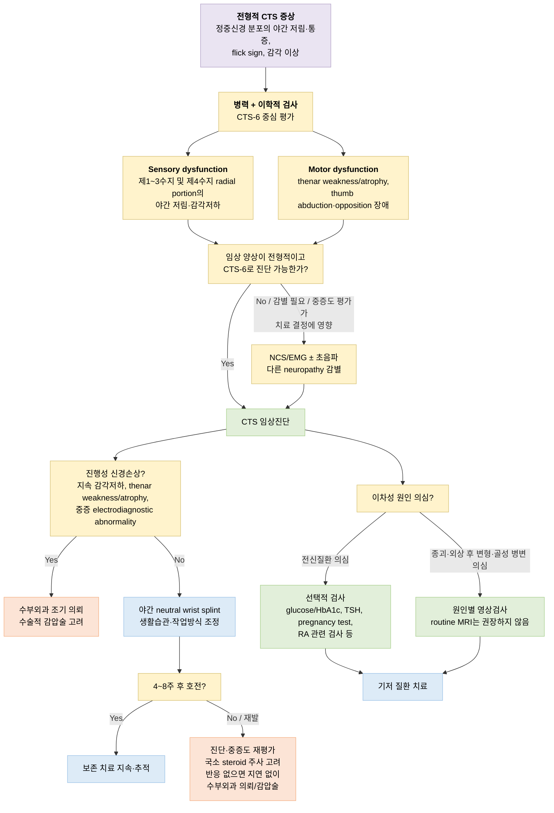

# 수근관증후군 (손목터널증후군) Carpal Tunnel Syndrome (CTS)

## <mark style="color:green;">일반 사항</mark>

* 손목 안쪽의 carpal bone들과 transverse carpal lig.로 둘러싸인 좁은 통로(carpal tunnel) 내 압력 상승으로 median nerve가 압박되어 발생하는, 상지에서 가장 흔한 압박성 신경병증(entrapment neuropathy)
* 다른 이름 : 손목터널증후군(KCD 공식 병명), median neuropathy at the wrist
* 양측성인 경우가 흔하며, 좌우 증상 정도가 다를 수 있음
* 유병률 : 일반 성인의 약 3\~5%; 진단 기준·대상 인구에 따라 차이가 있으며, 여성에서 남성 대비 2\~5배 높음

## <mark style="color:green;">원인</mark>

* 대부분 특정 단일 원인을 확인하기 어려운 특발성(idiopathic) CTS

### <mark style="color:orange;">위험 인자</mark>

* 연령 : 중년 이후 연령 증가
* 성별 : 여성(남성의 2\~5배)
* 비만/높은 BMI, 반복적인 손목 사용률 \[AAOS 2024 Strong evidence]
* 폐경 주변기, wrist ratio/index 증가, 류마티스 관절염, 정신사회적 요인, 원예, 원위부 상지 건병증, 조립라인 작업, 일부 컴퓨터 관련 작업, 진동 노출, 건염, 작업장에서의 강한 악력/힘 사용 \[AAOS 2024 Moderate evidence]
  * ✽ 일부 직업적·반복적 손 사용 요인과의 연관성이 보고되지만, AAOS 2024 지침은 단순한 키보드 사용량(high keyboard use) 자체와 CTS 발생 간 연관성을 뒷받침할 신뢰할 만한 근거는 없다는 실무진 의견(committee opinion)을 제시함; 개별 작업 요인의 인과관계는 여전히 논란이 있음
* 투석, 섬유근통, 정맥류, 원위 요골 골절 \[AAOS 2024 Limited evidence]
* 신체 활동/운동은 발생 위험을 낮춤 \[AAOS 2024 Moderate evidence]
* 경구 피임약, 호르몬 대체요법은 발생 위험과 연관성 없음 \[AAOS 2024 Moderate evidence]
* 전신 연관 질환 : 당뇨병, RA, 갑상선저하증, 신부전
* 체액/호르몬 변화 : 임신, 비만, CHF
  * 임신 관련해서는 보통 출산 수 주 후 자연 회복

### <mark style="color:orange;">국소적/구조적 이차성 원인</mark>

* 공간점유 병변(Space-occupying lesions) : 건막염(tenosynovitis), 통풍 결절(gout), 결절종(ganglion), 종양
* 국소 염증 또는 허혈성 손상
* 외상 : 원위 요골 골절(distal radius fracture)의 부정유합, perilunate \& lunate 탈구

### <mark style="color:orange;">CTS와 감별해야 할 polyneuropathy 원인</mark>

* 알코올 남용, Vit 결핍, 독성 노출 등은 generalized polyneuropathy를 유발하여 CTS와 유사한 증상을 보이거나 CTS와 동반될 수 있음

## <mark style="color:green;">임상 양상</mark>

* 정중신경 지배 손가락(제1\~3수지 및 제4수지 radial portion)의 야간 통증, 감각 저하, 따끔거림; 주간에는 손목이 굴곡·신전된 상태를 오래 유지할 때 발생(예: 운전, 휴대폰 사용, 타이핑, 독서); 흔히 환자는 손 전체의 증상으로 표현함
* 손가락 움직임 장애, 악력 약화(예: 병을 열 때 손에 힘이 없음)
* 간혹 정중신경을 따라 근위부(팔꿈치, 간혹 어깨)로 방사되는 통증과 이상 감각
* 손을 흔들거나 문지르면 완화(환자가 손목의 통증을 줄이기 위해서 손과 손목을 터는 행동 "Flick sign")
* 양측 발생(보통 한쪽 손의 증상이 보다 심함)

### <mark style="color:orange;">임상 경과 및 증상 변이</mark>

* 일부 CTS 환자에서는 불안·우울 등 정신사회적 요인이 동반되며(약 30% 보고), 증상·기능 장애와 연관될 수 있으나 인과관계에 대한 근거는 일관되지 않음 \[APTA/JOSPT 2026]
* 정중신경 영역을 벗어난 extramedian symptom spread는 central sensitization 가능성을 시사할 수 있으나, 이를 확진하는 표준화된 방법은 없으며 근거도 제한적임 \[APTA/JOSPT 2026]

### <mark style="color:$danger;">🚩 Red Flags!</mark>

<mark style="color:$danger;">**즉각 조치 또는 의뢰**</mark>

* 외상(원위 요골 골절, 관절 탈구, 손목 압궤 손상 등) 직후 급격히 발생·악화되는 손저림·감각저하와 손목 부종/긴장감 → 급성 수근관증후군 의심; 비가역적 신경 손상 예방을 위해 응급 감압술이 필요할 수 있어 즉시 정형외과/수부외과 응급 의뢰

<mark style="color:$warning;">**당일 또는 조기 의뢰**</mark>

* Thenar 위축 또는 객관적인 thumb abduction/opposition weakness가 새로 확인되는 경우 → 진행된 신경 손상 가능성, 수부외과 조기 의뢰; 필요 시 신경전도/근전도 검사로 중증도 및 감별 평가(검사 때문에 의뢰를 지연하지 않음)
* 임신 중 지속적 감각소실, 객관적 thenar weakness/atrophy 등 신경손상 소견이 새로 발생하거나 빠르게 진행하는 경우
* 정중신경 분포를 뚜렷하게 벗어난 지속적 감각이상에 목 통증·상지 방사통, 다른 신경학적 이상 등이 동반되는 경우 → 경추 신경근병증 등 감별 필요

<mark style="color:$info;">**외래 추적 / 추가 평가 계획**</mark> <mark style="color:$info;">- 즉각 위험 낮으나 호전 없으면 의뢰</mark>

* 야간 neutral wrist splint를 중심으로 한 4\~8주 보존 치료에도 호전이 없는 경우 → 진단 재평가, 필요 시 신경전도검사 및 수부외과 의뢰
* 양측성 증상이면서 갑상선기능저하증, 당뇨병, RA 등 전신 질환이 의심되는 경우 → 원인 질환 감별 검사 계획

## <mark style="color:green;">진단</mark>

### <mark style="color:orange;">이학적 검사</mark>

* [Carpal(or Durkan) compression test](https://www.youtube.com/watch?v=4Xb0uc53qCs) : 엄지손가락으로 환자의 손목 터널 위(손목 안쪽 중앙부)를 30초간 압박; 30초 내 정중신경 분포 지역에 통증 또는 저림 등 감각 이상이 시작되면 양성. 일부 연구에서 민감도 약 87%, 특이도 약 90%가 보고되었으나 연구별 차이가 있어 단독으로 확진하거나 배제하지 않음
* [Tinel test](https://www.youtube.com/watch?v=0KXRcnQqGUc) : 환자의 손목 안쪽 중앙부 tapping 시 증상 유발
* Phalen test : 1분간 손목 완전 굴곡 시(양 손등을 붙이고 있음) 증상 유발
* reverse Phalen test : 2분간 손목 완전 신전 시(양 손바닥을 붙이고 있음) 증상 유발
* two-point discrimination 저하 : 정중신경 지배 손가락에서 5 ㎜ 간격의 두 점을 구별하지 못하는 경우
* thenar 위축 : 오랜 기간 지속된 환자들에서 thumb abduction \& opposition의 약화; CTS를 rule-in하는 데는 강한 연관성이 있으나, 위축이 없다고 CTS를 배제할 수는 없음 \[AAOS 2024 Strong evidence]
* ✽ Phalen test, Tinel test, Flick sign은 단독 소견만으로는 CTS를 rule-in/out하는 근거가 약함 \[AAOS 2024 Strong evidence] — CTS-6 등 여러 소견을 종합한 도구 사용을 권장; APTA/JOSPT 2026도 Phalen test, Tinel sign, Durkan(carpal compression) test를 CTS 의심 환자 진단에 함께 사용하도록(should use) 권고

### <mark style="color:orange;">검사실 검사</mark>

* 신경전도/근전도 검사 : 검사 방법과 기준에 따라 진단 정확도가 달라지며, 일반적으로 특이도는 높은 편이나 민감도는 검사법에 따라 차이가 큼. 진단이 불확실하거나 다른 신경병증과의 감별이 필요한 경우, 또는 중증도·예후 평가 결과가 치료 결정에 영향을 줄 것으로 판단되는 경우 시행; 전형적 임상 양상에서는 CTS-6를 이용한 임상진단이 가능 \[AAOS 2024 Strong evidence]
* 초음파 검사 : carpal tunnel inlet에서 정중신경 cross-sectional area(CSA) 증가가 진단을 지지함. 측정 위치·방법과 연구에 따라 diagnostic cutoff가 달라 단일 CSA 수치를 절대 진단 기준으로 사용하지 않음
* MRI, upper limb neurodynamic test(ULNT) : 통상적인 CTS 진단 목적의 사용은 권장되지 않음 \[AAOS 2024 Moderate evidence] — 다른 원인 배제가 필요한 경우에 한해 고려
* 실험실 검사 : routine panel로 시행하지 않으며, 병력·진찰상 이차성 원인이 의심될 때 선택적으로 시행(예: glucose/HbA1c, TSH, pregnancy test, RA 관련 검사 등)

### <mark style="color:orange;">CTS-6</mark>

1. 주로 정중신경 지배 손가락(제1\~3수지, 제4수지 radial aspect)에서 증상 발생(3.5점)
2. nocturnal numbness(4점)
3. thenar atrophy \&/or weakness(5점)
4. Phalen test 양성(5점)
5. Tinel sign 양성(4점)
6. 2-point discrimination 소실(4.5점)

▶ 판정 : ≥12점 CTS(Carpal tunnel syndrome) 확률 ≥80%

✽ CTS-6는 AAOS 2024에서 routine 초음파 또는 신경전도검사/근전도를 대체하여 사용할 수 있는 1차 진단 도구로 권고되며(Strong evidence), APTA/JOSPT 2026에서도 CTS 의심 환자의 진단에 사용하도록(should use) 재확인됨

**증상 분포/선별 도구**

* Katz-Stirrat Hand Symptom Diagram(HSD) : CTS 의심 환자에서 증상의 위치와 양상을 파악하기 위해 사용 \[APTA/JOSPT 2026 should use]
* 직업 관련 CTS 선별 : Katz-Stirrat HSD 또는 Kamath-Stothard questionnaire를 초기 선별 도구로 고려할 수 있음 \[APTA/JOSPT 2026 may use]

### <mark style="color:orange;">감별 진단</mark>

* 손저림·감각이상을 유발하는 다른 질환과의 감별이 필요

<table><thead><tr><th width="150">질환</th><th width="230">CTS와의 차이점</th><th>핵심 감별 포인트</th></tr></thead><tbody><tr><td>경추 신경근병증(C6-7)</td><td>목 통증·상지 방사통 동반, 정중신경 영역을 벗어난 감각 분포</td><td>목 통증/상지 방사통, dermatomal sensory loss, reflex·근력 변화, Spurling test 양성; 임상적으로 필요할 때 경추 영상검사</td></tr><tr><td>회내근증후군(Pronator teres syndrome)</td><td>전완부에서 정중신경 압박; palmar cutaneous branch 분포(수장부 감각)도 저하될 수 있음(CTS에서는 보존됨), 야간 증상 드묾</td><td>전완부 압통, 저림이 손목이 아닌 전완에서 유발</td></tr><tr><td>드퀘르벵건초염(De Quervain's tenosynovitis)</td><td>요측 손목 통증, 감각이상은 없음</td><td>Finkelstein test 양성</td></tr><tr><td>당뇨병성 다발신경병증</td><td>양측성, 장갑-양말(glove-stocking) 분포, 전신 감각저하</td><td>당뇨병력, 전신 신경전도검사</td></tr><tr><td>주관증후군(Cubital tunnel syndrome, 척골신경병증)</td><td>제4\~5수지 및 손등 척측의 감각저하(정중신경이 아닌 척골신경 분포), 팔꿈치 부위 통증·저림</td><td>팔꿈치부 Tinel test, elbow flexion test</td></tr><tr><td>흉곽출구증후군</td><td>정중신경 분포에 국한되지 않는 상지 전체 감각증상, overhead activity와 관련된 악화</td><td>Neurogenic TOS : 상지 전체 저림·이상감각; Vascular TOS : 색조·맥박·부종 등 혈관 소견 동반</td></tr></tbody></table>

***



<p align="center"><strong>수근관 증후군 관리 알고리듬</strong></p>

<p align="center"><em><mark style="color:$info;">Ref. Based on AAOS Clinical Practice Guideline for the Management of Carpal Tunnel Syndrome (2024) and APTA/JOSPT Hand Pain and Sensory Deficits: Carpal Tunnel Syndrome CPG (2026); modified for primary care</mark></em></p>

***

## <mark style="background-color:$warning;">Management</mark>


**AAOS 2024 지침 핵심 요지**\
경증\~중등도이면서 진행성 신경손상 소견이 없는 CTS는 야간 neutral wrist splint와 생활습관 조정이 보존 치료의 중심입니다. 국소 corticosteroid 주사는 단기 증상 완화에 사용할 수 있으나 장기적 patient-reported outcome 개선은 없으며, PRP 주사 역시 장기적 이득이 입증되지 않았습니다. 보존 치료에 반응이 없거나 지속적 감각저하, thenar weakness/atrophy 등 진행성 신경손상 소견이 있으면 수술적 감압술을 고려하며, 진행 소견이 있는 경우 steroid 치료를 거치느라 의뢰를 지연하지 않습니다.


### <mark style="color:orange;">치료 방침</mark>

* 경증\~중등증, 진행성 신경손상 없음 : 생활습관/작업방식 조정, 야간 neutral wrist splint를 우선; NSAID는 CTS 자체의 증상 개선 효과가 입증되지 않았으므로 routine treatment로는 권장하지 않으며, 동반된 비특이적 손목·근골격계 통증의 단기 진통 목적으로만 제한적으로 사용; 필요 시 국소 steroid 주사 고려
* 4\~8주 보존 치료에도 증상이 지속되거나 재발하는 경우 : 진단 및 중증도 재평가 후 수부외과 의뢰/수술적 감압술 고려
* 지속적 감각저하, thenar weakness/atrophy 또는 중증 electrodiagnostic abnormality 등 진행성 신경손상 : steroid 단계를 거치지 않고 수부외과 조기 의뢰 및 수술적 감압술 고려
* 증상 악화 요인 조절 : 반복적인 극단적 wrist flexion/extension, 강한 gripping, 진동 노출 등 증상을 유발하는 활동을 줄이거나 작업방식 조정; 인체 공학적 생활 도구(예: 책상, 키보드) 활용, 규칙적 휴식

## <mark style="color:green;">비-약물 치료 및 생활·작업환경 조정</mark>

* neutral wrist splint : 수면 중 normal anatomic position으로 부목 적용; 4\~8주 꾸준히 착용 후 재평가; 야간 착용만으로 불충분하면 주간 착용 확대 또는 손목 각도 조정을 고려할 수 있음 \[APTA/JOSPT 2026]
* 손목 고정(주간) : 야간 splint에 비해 근거가 약함
* 냉찜질 : 단독 효과에 대한 근거는 제한적
* Neuromobilization(신경 활주 운동) : 연구 결과가 상충하여 단독 효과에 대한 명확한 권고를 내리기 어려움 \[APTA/JOSPT 2026]
* Manual therapy(경추부·상지) : 경증\~중등도 CTS에서 단기 통증 및 기능 개선 목적으로 시행을 고려할 수 있음 \[APTA/JOSPT 2026 may perform]
* 치료용 초음파 : 근거의 질 자체는 높으나(High Quality of Evidence), evidence-to-decision 과정에서 장기적 증상 개선에 대한 권고 강도가 downgrade됨 \[AAOS 2024 Limited option (downgraded)]
* 지압, 인슐린 주입, 영양보충제 : 대조군/위약 대비 우월성이 입증되지 않아 일상적으로 권장하지 않음 \[AAOS 2024 Limited evidence]
* 레이저 치료(저출력/고강도), 키네시오 테이핑(경증 CTS), 간섭파, 표재열, 심부열(diathermy) : 단기 증상·통증 개선 목적의 사용을 고려할 수 있으나(may use/may recommend) \[APTA/JOSPT 2026], 장기적인 patient-reported outcome 개선에 대한 권고 강도는 downgrade됨 \[AAOS 2024 Limited option (downgraded)]
* 체외충격파치료(ESWT) : 경증\~중등도 CTS에서 단기·중기(＜6개월) 증상 및 기능 개선 목적으로 고려할 수 있으며, radial ESWT를 focused ESWT보다 우선 고려할 수 있음 \[APTA/JOSPT 2026]; 다만 장기적 patient-reported outcome 개선에 대한 권고 강도는 downgrade됨 \[AAOS 2024 Limited option (downgraded)]
* 이온영동/포노포레시스(스테로이드 병용), 자기 치료 : 사용하지 않을 것을 권고 \[APTA/JOSPT 2026]
* 증상 악화 요인 조절 : 반복적인 극단적 wrist flexion/extension, 강한 gripping, 진동 노출 등 증상을 유발하는 활동을 줄이거나 작업방식 조정; 인체 공학적 도구(책상, 키보드) 활용, 규칙적 휴식, 손목 운동

## <mark style="color:green;">약물 치료</mark>

### <mark style="color:orange;">NSAID</mark>

* CTS 자체에 대한 치료 효과는 입증되지 않았으며, 위약 대비 우월성도 확인되지 않음 \[AAOS 2024 Limited option (downgraded)] — routine treatment로 권장하지 않으며, 동반된 비특이적 손목·근골격계 통증의 단기 진통 목적으로만 제한적으로 사용
* ibuprofen : 200\~800 ㎎ tid <mark style="color:blue;">\[부루펜]</mark>
* naproxen : 250 ㎎ tid\~500 ㎎ bid <mark style="color:blue;">\[낙센]</mark>

### <mark style="color:orange;">Steroid 터널 내 주사</mark>

* landmark technique에서는 proximal wrist crease의 palmaris longus tendon ulnar side 접근이 사용됨. Palmaris longus가 선천적으로 없을 수 있고 median nerve 또는 tendon 내 주입 위험이 있으므로 해부학적 landmark를 정확히 확인하며, 숙련도가 낮거나 해부학이 불명확하면 초음파 유도하 주사를 고려
* 단기(수 주\~수개월) 증상 완화 목적으로 사용하며, 장기적인 patient-reported outcome 개선 효과는 입증되지 않음 \[AAOS 2024 Strong evidence] — 반복 주사보다는 반응 평가 후 수술적 치료 여부를 조기에 결정하는 데 활용하고, 반응이 없으면 수술적 치료를 미루지 않음
* 금기 : 감염 소견, 터널 내 종괴, 출혈 경향
* hydrocortisone 20 ㎎, methylprednisolone 15\~40 ㎎, triamcinolone 20 ㎎
  * 보통 2% lidocaine 0.15\~0.5 ㎖(or 1% 용액 1 ㎖)를 혼합하여 주사

### <mark style="color:orange;">Platelet-rich plasma (PRP) Injections</mark>

* 통증 감소와 신경전도 향상 효과가 있다는 예비 연구 수준의 보고가 있었으나, AAOS 2024 지침에서는 leukocyte-rich/leukocyte-poor PRP 모두 비수술 치료로서 장기적 이득에 대한 근거가 없다고 명시함 \[Strong evidence] — 일상적 사용은 권장하지 않음

### <mark style="color:orange;">경구 Steroid</mark>

* 단기 효과(2\~4주); 국소 주사보다 효과 적음; AAOS 2024 비수술 치료 목록에서는 장기적 patient-reported outcome 개선 근거가 부족한 것으로 분류됨
* 진행성 신경손상 소견이 없는 경증\~중등증에서 국소 주사가 어렵거나 단기 증상 완화가 필요한 경우 제한적으로 고려; thenar weakness/atrophy, 지속 감각저하 등 진행 소견이 있으면 경구 steroid로 의뢰를 지연하지 않음
* prednisolone : 20 ㎎ qd ×7d → 10 ㎎ qd ×7d <mark style="color:blue;">\[소론도]</mark> (5 ㎎/정 기준 4정 → 2정)

## <mark style="color:green;">시술 및 기타 처치</mark>

* 적응증 : 다른 치료에 반응이 없는 경우, thenar 위축/근력저하·지속 감각저하 등 진행된 신경 손상 소견, 중증 신경전도검사 이상
* Decompression : transverse carpal ligament를 dividing; open, mini-open, endoscopic technique이 사용되며, AAOS 2024는 mini-open과 endoscopic release 간 patient-reported outcome에 유의한 차이가 없음을 Strong evidence로 제시함
* 국소마취만으로 시행 가능 \[AAOS 2024 Strong evidence]; 외래/진료실 환경에서도 안전하게 시행 가능하다는 보고가 있음(제한적 근거)
* 수술 후 관리
  * 통상적인 부목 고정/보조기는 권장되지 않음 \[AAOS 2024 Moderate evidence]
  * 통상적인 감독하 재활 치료는 필요하지 않으나, 환자 교육 차원의 간단한 손목·손가락 운동은 고려할 수 있음 \[AAOS 2024 Moderate evidence]
  * 통증 관리는 NSAID/acetaminophen 사용 \[AAOS 2024 Strong evidence]
  * 예방적 항생제는 통상적으로 필요하지 않음
* 대부분 장기적으로 호전되지만 일부에서 증상이 지속·재발할 수 있으며, revision surgery가 필요한 비율은 보고에 따라 대략 0.3\~7% 정도로 다양함

***

### <mark style="color:red;">질병코드</mark>

G56.0 손목터널증후군

***

## <mark style="color:purple;">처방례</mark>

> **처방례 1. 경증(전형적 초기 사례)**
>
> ```
> neutral wrist splint  야간 착용, 4~8주
> ※ 동반 통증이 있는 경우 단기간 analgesic 병용 가능
> ```
>
> _✽야간 neutral wrist splint가 초기 보존 치료의 중심이며, NSAID는 CTS 자체의 증상 개선 효과가 입증되지 않았으므로 routine treatment로 권장하지 않음(동반 통증에 대한 단기 진통 목적으로만 제한적으로 병용 가능); 4\~8주 후 재평가하여 호전 없으면 진단·중증도 재평가 및 다음 단계 고려_

> **처방례 2. 경증~중등도(보존 치료 반응 불충분, 진행성 신경손상 없음)**
>
> ```
> triamcinolone 20 ㎎ + 2% lidocaine 0.3 ㎖  carpal tunnel 내 혼합 주사 (1회)
> neutral wrist splint  야간 착용 지속
> ```
>
> _✽단기 증상 완화 목적; 반복 주사보다는 반응 평가 후 수술적 치료 여부를 조기에 결정하는 데 활용(AAOS 2024)_

> **처방례 3. 임신 관련 CTS**
>
> ```
> neutral wrist splint  야간 착용
> 아세트아미노펜 500 ㎎  필요시
> ```
>
> _✽임신 관련 CTS에서는 splint 등 비약물적 치료를 우선하며, 진통이 필요하면 acetaminophen을 우선 고려한다. NSAID는 임신 20주 이후에는 원칙적으로 회피하며, 불가피한 20\~30주 사용은 최소 유효용량·최단기간으로 제한; 30주 이후에는 fetal ductus arteriosus 조기 폐쇄 위험 때문에 사용을 회피한다; 대부분 출산 수 주 후 자연 호전된다_

> **처방례 4. Thenar 위축/지속적 감각저하 등 진행성 신경손상 의심**
>
> ```
> neutral wrist splint  야간 착용
> 수부외과 조기 의뢰  ± 신경전도/근전도 검사
> ```
>
> _✽진행성 신경손상 소견이 있으면 steroid 단계를 거치지 않고 수부외과 의뢰 및 수술적 감압술을 고려한다. 신경전도/근전도 검사는 중증도·감별 평가에 도움이 되지만 검사 때문에 의뢰를 지연하지 않음._

***

### <mark style="color:$success;">핵심 복약 지도</mark>

> **스플린트 사용법**
>
> * 야간(수면 중) 착용을 기본으로 하며, 손목을 중립위(neutral, 0도)로 유지하도록 지도
> * 4\~8주 꾸준히 착용한 후에도 증상이 지속되면 재평가

> **국소 스테로이드 주사**
>
> * 단기 증상 완화 목적이며, 장기적 효과는 제한적임을 설명
> * 감염 징후, 종괴, 출혈 경향이 있는 경우 금기
> * 반복 주사보다는 반응이 없으면 수술적 치료를 미루지 않도록 안내

> **경구 스테로이드/NSAID**
>
> * NSAID는 CTS 자체에 대한 치료 효과가 입증되지 않았으므로 routine 사용은 권장하지 않으며, 동반된 비특이적 손목·근골격계 통증에 대해서만 단기간 제한적으로 사용; CTS의 장기 경과를 개선하는 치료는 아님
> * 경구 steroid는 진행성 신경손상 소견이 없는 환자에서 제한적으로 단기간 고려; thenar weakness/atrophy 또는 지속 감각저하가 있으면 약물 치료로 수부외과 의뢰를 지연하지 않음

> **언제 다시 병원을 방문해야 하나요?**
>
> * 4\~8주 보존 치료 후에도 호전이 없는 경우
> * thenar 위축, 객관적인 엄지 벌림/맞섬 근력 저하(thumb abduction/opposition weakness)가 새로 발생한 경우
> * 외상 후 손저림·부종이 급격히 악화되는 경우 — 즉시 내원

***

### <mark style="color:blue;">환자 안내서</mark>


**수근관증후군(손목터널증후군), 손목의 신경이 눌려서 생기는 병입니다**

손목 안쪽의 좁은 통로(수근관)를 지나는 신경이 눌리면서 손가락 저림, 감각 저하, 통증이 나타나는 질환입니다. 대부분 치료로 호전되지만, 방치하면 손의 힘이 약해질 수 있습니다.


#### <mark style="color:$primary;">왜 손저림이 생기나요?</mark>

* 손목 안쪽의 좁은 통로를 지나는 신경이 반복적인 손목 사용, 손목 부기, 임신, 갑상선 질환 등으로 눌려서 발생합니다.

#### <mark style="color:$primary;">일상생활에서 어떻게 관리하나요?</mark>

* **밤에 손목 보조기(스플린트)를 착용하십시오.** 자는 동안 손목이 구부러지지 않게 하여 신경 압박을 줄여줍니다.
* **손목을 심하게 구부리거나 반복적으로 사용하는 동작을 줄이십시오.** 운전, 스마트폰 사용, 타이핑 시 자주 쉬어 주세요.
* **의사나 치료사의 안내에 따라 손목 스트레칭이나 신경 활주 운동을 시행할 수 있습니다.** 일부 환자에서 증상 조절에 도움이 될 수 있으나, 야간 스플린트를 대체하는 핵심 치료는 아닙니다. (아래 운동법 참고)

#### <mark style="color:$primary;">약은 어떻게 써야 하나요?</mark>

* 소염진통제는 동반된 통증을 줄이는 데 도움이 될 수 있으나, 수근관증후군 자체의 경과를 바꾸지는 않습니다.
* 국소 주사는 일시적으로 증상을 크게 줄여줄 수 있지만 효과가 오래가지 않을 수 있습니다.

#### <mark style="color:$primary;">이럴 때는 즉시 병원을 방문하세요</mark>

* 외상 이후 갑자기 손이 심하게 붓고 저림이 심해지는 경우
* 엄지손가락 아래 근육이 줄어들거나, 엄지 힘이 약해져 물건을 자주 떨어뜨리는 경우
* 4\~8주간 치료해도 증상이 나아지지 않는 경우

#### <mark style="color:$primary;">손목 스트레칭·신경 활주 운동은 어떻게 하나요?</mark>

운동 중 심한 통증이 발생하면 중지하십시오. 3\~4주 이상 꾸준하게 시행한 후 호전되지 않으면 재평가가 필요하며, 호전이 있으면 이후에도 지속하십시오.

* ☞ [Therapeutic Exercise Program for Carpal Tunnel Syndrome](https://www.orthoinfo.org/globalassets/pdfs/a00789_therapeutic-exercise-program-for-carpal-tunnel_final.pdf)

**Wrist Extension Stretch**

* 팔을 뻗고 손목을 dorsiflexion → 반대쪽 손으로 손바닥을 잡고 팔 안쪽이 쭉 펴진 느낌이 들도록 부드럽게 당김 → 15초간 유지
* 팔을 바꾸어 가며 각 5회 반복(1 set), 1일 4 set(특히 활동 전), 주 5\~7일 시행

<div align="left"><figure><figcaption></figcaption></figure></div>

**Wrist Flexion Stretch**

* 팔을 뻗고 손목을 palmar flexion → 반대쪽 손으로 손등을 잡고 팔 바깥쪽이 쭉 펴진 느낌이 들도록 부드럽게 당김 → 15초간 유지
* 팔을 바꾸어 가며 각 5회 반복, 1일 4 set(특히 활동 전), 주 5\~7일 시행

<div align="left"><figure><figcaption></figcaption></figure></div>

**Median Nerve Glides**

* ① 주먹을 쥠 → ② 손가락을 모두 붙이고 손을 폄 → ③ 손목 신전 → ④ 엄지손가락 신전/외전 → ⑤ 손바닥이 위를 향하도록 전완을 돌림 → ⑥ 다른 손으로 엄지손가락을 부드럽게 당겨 스트레칭
* 각 자세를 3\~7초간 유지, 10\~15회 반복(1 set), 1일 1 set, 주 6\~7일 시행
* 시행 전 15분간 손에 온찜질, 시행 후 20분간 냉찜질

<div align="left"><figure><figcaption></figcaption></figure></div>

**Tendon Glides**

* Series A : ① 손목과 손가락을 똑바로 세움 → ② 손가락 끝 마디를 'hook' 모양으로 굽힘 → ③ 다른 손가락들 위로 엄지손가락을 놓고 주먹을 꽉 쥠
* Series B : ① 손목과 손가락을 똑바로 세움 → ② PIP \& DIP 관절을 곧게 유지한 채 MCP 관절을 굴곡하여 'tabletop'을 만듦 → ③ PIP 관절을 굴곡하여 손가락이 손바닥에 닿게 함
* 각 자세를 3초간 유지, 5\~10회 반복(1 set), 1일 2\~3 set, 견딜 수 있으면 횟수 증가
* 시행 전 15분간 손에 열을 가함, 시행 후 20분간 냉찜질

<div align="left"><figure><figcaption></figcaption></figure></div>
