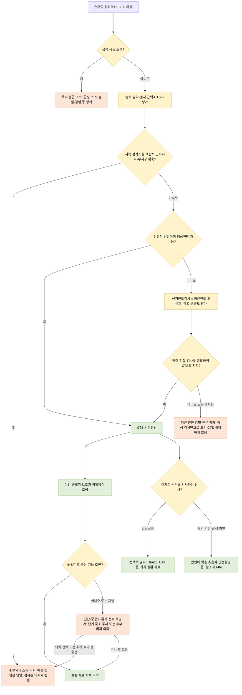
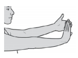
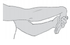
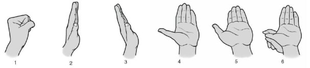
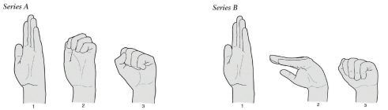

# 수근관증후군 (손목터널증후군) Carpal Tunnel Syndrome (CTS)

## <mark style="color:green;">일반 사항</mark>

* 손목 안쪽의 carpal bone들과 transverse carpal lig.로 둘러싸인 좁은 통로(carpal tunnel) 내 압력 상승으로 median nerve가 압박되어 발생하는, 상지에서 가장 흔한 압박성 신경병증(entrapment neuropathy)
* 다른 이름 : 손목터널증후군(KCD 공식 병명), median neuropathy at the wrist
* 양측성인 경우가 흔하며, 좌우 증상 정도가 다를 수 있음
* 유병률 : 일반 성인의 약 3\~5%; 진단 기준·대상 인구에 따라 차이가 있으며, 여성에서 남성 대비 2\~5배 높음

## <mark style="color:green;">원인</mark>

* 대부분 특정 단일 원인을 확인하기 어려운 특발성(idiopathic) CTS

### <mark style="color:orange;">위험 인자</mark>

* 연령 : 중년에서 흔함; 연령과 위험의 관계가 일률적으로 증가하는 것은 아님 [APTA/JOSPT 2026]
* 성별 : 여성(남성의 2\~5배)
* 비만/높은 BMI, 높은 손·손목 반복 동작 노출 \[AAOS 2016 Strong evidence]
* 폐경 주변기, wrist ratio/index 증가, 류마티스 관절염, 정신사회적 요인, 원예, 원위부 상지 건병증, 조립라인 작업, 일부 컴퓨터 관련 작업, 진동 노출, 건염, 작업장에서의 강한 악력/힘 사용 \[AAOS 2016 Moderate evidence]
  * ✽ 위 위험 인자의 근거 수준은 AAOS **2016** 지침의 분류임. AAOS 2024 지침은 단순한 키보드 사용량(high keyboard use) 자체와 CTS 발생 간 연관성을 뒷받침할 신뢰할 만한 근거가 없다는 실무진 합의 의견(committee opinion)을 제시함; 직업적 요인 중 반복·힘 사용·진동과 단순 키보드 사용은 구분하여 평가
* 투석, 섬유근통, 정맥류, 원위 요골 골절 \[AAOS 2016 Limited evidence]
* 신체 활동/운동과 발생 위험 감소의 연관성이 보고됨 \[AAOS 2016 Moderate evidence]; 후속 근거 평가에서는 보호 효과의 근거가 제한적이므로 개인의 운동이 CTS를 예방한다고 단정하지 않음
* 경구 피임약, 호르몬 대체요법 : AAOS 2016은 발생 위험 증가·감소와 연관성이 없다고 평가했으나(Moderate evidence), 후속 근거는 상충함 \[APTA/JOSPT 2026]; 위험 여부를 확정적으로 단정하지 않음
* 전신 연관 질환 : 당뇨병, RA, 갑상선저하증, 신부전
  * 고령자의 양측 CTS에 원인 불명 심부전/심실벽 비후, 요추관협착증 등 다른 단서가 동반되면 ATTR 아밀로이드증 감별을 고려; 양측 CTS만으로 일률적 선별 검사를 시행하지는 않음. 수술 환자에서 아밀로이드증 위험 인자가 여러 개인 경우 건활막 병리검사는 개별적으로 고려 가능 \[AAOS 2024 Consensus]
* 체액/호르몬 변화 : 임신, 비만, CHF
  * 임신 관련 CTS는 출산 후 호전되는 경우가 많으나 수주~수개월 이상 지속될 수 있음; 지속적 감각저하·근력저하가 있으면 재평가

### <mark style="color:orange;">국소적/구조적 이차성 원인</mark>

* 공간점유 병변(Space-occupying lesions) : 건막염(tenosynovitis), 통풍 결절(gout), 결절종(ganglion), 종양
* 국소 염증 또는 허혈성 손상
* 외상 : 원위 요골 골절(distal radius fracture)의 부정유합, perilunate \& lunate 탈구

### <mark style="color:orange;">CTS와 감별해야 할 polyneuropathy 원인</mark>

* 알코올 남용, Vit 결핍, 독성 노출 등은 generalized polyneuropathy를 유발하여 CTS와 유사한 증상을 보이거나 CTS와 동반될 수 있음

## <mark style="color:green;">임상 양상</mark>

* 정중신경 지배 손가락(제1\~3수지 및 제4수지 radial portion)의 야간 통증, 감각 저하, 따끔거림; 주간에는 손목이 굴곡·신전된 상태를 오래 유지할 때 발생(예: 운전, 휴대폰 사용, 타이핑, 독서); 흔히 환자는 손 전체의 증상으로 표현함
* 손의 미세 동작 어려움, 악력 약화(예: 병을 열 때 손에 힘이 없음); 진행 시 단무지외전근(abductor pollicis brevis) 약화·무지구(thenar) 위축이 발생할 수 있음
* 손바닥 전체가 아닌 무지구 피부의 객관적 감각은 대개 보존됨(palmar cutaneous branch는 수근관 밖으로 주행); 이 부위까지 감각저하가 있으면 근위부 정중신경병증 등을 감별
* 간혹 정중신경을 따라 근위부(팔꿈치, 간혹 어깨)로 방사되는 통증과 이상 감각
* 손을 흔들거나 문지르면 완화(환자가 손목의 통증을 줄이기 위해서 손과 손목을 터는 행동 "Flick sign")
* 양측 발생(보통 한쪽 손의 증상이 보다 심함)

### <mark style="color:orange;">임상 경과 및 증상 변이</mark>

* 일부 CTS 환자에서는 불안·우울 등 정신사회적 요인이 동반되며(약 30% 보고), 증상·기능 장애와 연관될 수 있으나 인과관계에 대한 근거는 일관되지 않음 \[APTA/JOSPT 2026]
* 정중신경 영역을 벗어난 extramedian symptom spread는 central sensitization 가능성을 시사할 수 있으나, 이를 확진하는 표준화된 방법은 없으며 근거도 제한적임 \[APTA/JOSPT 2026]

### <mark style="color:$danger;">🚩 Red Flags!</mark>

<mark style="color:$danger;">**즉각 조치 또는 의뢰**</mark>

* 외상(원위 요골 골절, 관절 탈구, 손목 압궤 손상 등) 후 또는 급성 출혈·감염 등의 상황에서 급격히 발생·악화되는 손저림·감각저하와 심한 통증, 손목 부종/긴장감 → 급성 수근관증후군 의심; 비가역적 신경 손상 예방을 위해 응급 감압술이 필요할 수 있어 즉시 정형외과/수부외과 응급 의뢰

<mark style="color:$warning;">**당일~수일 내 평가**</mark>

* Thenar 위축 또는 객관적인 thumb abduction/opposition weakness가 새로 확인되는 경우(빠른 진행 시 당일) → 진행된 신경 손상 가능성, 수부외과 조기 의뢰; 필요 시 신경전도/근전도 검사로 중증도 및 감별 평가(검사 때문에 의뢰를 지연하지 않음)
* 임신 중 지속적 감각소실, 객관적 thenar weakness/atrophy 등 신경손상 소견이 새로 발생하거나 빠르게 진행하는 경우(빠른 진행 시 당일)
* 정중신경 분포를 뚜렷하게 벗어난 지속적 감각이상에 목 통증·상지 방사통, 다른 신경학적 이상 등이 동반되는 경우 → 경추 신경근병증 등 감별 필요

<mark style="color:$info;">**외래 추적 / 추가 평가 계획**</mark> <mark style="color:$info;">- 즉각 위험 낮으나 호전 없으면 의뢰</mark>

* 야간 neutral wrist splint를 중심으로 한 4\~8주 보존 치료에도 호전이 없는 경우 → 진단 재평가, 필요 시 신경전도검사 및 수부외과 의뢰
* 양측성 증상이면서 갑상선기능저하증, 당뇨병, RA 등 전신 질환이 의심되는 경우 → 원인 질환 감별 검사 계획

## <mark style="color:green;">진단</mark>

### <mark style="color:orange;">이학적 검사</mark>

* [Carpal(or Durkan) compression test](https://www.youtube.com/watch?v=4Xb0uc53qCs) : 엄지손가락으로 환자의 손목 터널 위(손목 안쪽 중앙부)를 30초간 압박; 30초 내 정중신경 지배 손가락에 저림 등 평소의 증상이 재현되면 양성(압박 부위의 국소 통증만으로 양성 판정하지 않음). 진단 정확도는 연구별 차이가 커 단독으로 확진하거나 배제하지 않음
* [Tinel test](https://www.youtube.com/watch?v=0KXRcnQqGUc) : 손목 정중신경 주행 부위를 가볍게 tapping하여 정중신경 지배 손가락으로 방사되는 저림·이상감각이 재현되면 양성
* Phalen test : 1분간 손목 완전 굴곡 시(양 손등을 붙이고 있음) 증상 유발
* reverse Phalen test : 양 손바닥을 붙인 채 손목 신전을 약 1분 유지하여 정중신경 지배 손가락의 증상 재현을 확인; 심한 통증·저림이 생기면 조기에 중단
* two-point discrimination 저하 : 정중신경 지배 손가락에서 5 ㎜ 간격의 두 점을 구별하지 못하는 경우
* thenar 위축 : 오랜 기간 지속된 환자들에서 thumb abduction \& opposition의 약화; CTS를 rule-in하는 데는 강한 연관성이 있으나, 위축이 없다고 CTS를 배제할 수는 없음 \[AAOS 2016 Strong evidence]
* 감각검사 : 좌우·척골신경 영역과 비교하고, 가능하면 Semmes-Weinstein monofilament로 감각 역치를 평가 [APTA/JOSPT 2026 A]
* ✽ Phalen test, Tinel test, Flick sign은 단독 소견만으로는 CTS를 rule-in/out하는 근거가 약함 \[AAOS 2016 Strong evidence] - CTS-6 등 여러 소견을 종합한 도구 사용을 권장; APTA/JOSPT 2026도 Phalen test, Tinel sign, Durkan(carpal compression) test를 CTS 의심 환자 진단에 함께 사용하도록(should use) 권고

### <mark style="color:orange;">보조 검사</mark>

* 신경전도/근전도 검사 : 검사 방법과 기준에 따라 진단 정확도가 달라지며, 일반적으로 특이도는 높은 편이나 민감도는 검사법에 따라 차이가 큼. 진단이 불확실하거나 다른 신경병증과의 감별이 필요한 경우, 또는 중증도·예후 평가 결과가 치료 결정에 영향을 줄 것으로 판단되는 경우 시행; 전형적 임상 양상에서는 CTS-6를 이용한 임상진단이 가능 \[AAOS 2024 Strong evidence]. 초기·경증 CTS에서는 정상 결과가 나올 수 있으므로 정상 검사만으로 배제하지 않음; 침근전도는 탈신경 또는 다른 신경병증의 감별이 필요한 경우 추가하며 모든 환자에서 필수는 아님
* 초음파 검사 : carpal tunnel inlet에서 정중신경 cross-sectional area(CSA) 증가가 진단을 지지함. 측정 위치·방법과 연구에 따라 diagnostic cutoff가 달라 단일 CSA 수치를 절대 진단 기준으로 사용하지 않음
* MRI, upper limb neurodynamic test(ULNT) : 통상적인 CTS 진단 목적의 사용은 권장되지 않음 \[AAOS 2024 Moderate evidence] - 다른 원인 배제가 필요한 경우에 한해 고려
* 실험실 검사 : routine panel로 시행하지 않으며, 병력·진찰상 이차성 원인이 의심될 때 선택적으로 시행(예: glucose/HbA1c, TSH, pregnancy test, RA 관련 검사 등)

### <mark style="color:orange;">CTS-6</mark>

1. 주로 정중신경 지배 손가락(제1\~3수지, 제4수지 radial aspect)의 저림·감각저하(3.5점)
2. nocturnal numbness(4점)
3. thenar atrophy 및/또는 객관적 단무지외전근 약화(5점; 단순한 주관적 악력 저하와 구분)
4. Phalen test 양성(5점)
5. Tinel sign 양성(4점)
6. 정중신경 지배 손가락에서 5 ㎜ 이하 간격의 두 점을 구별하지 못함(4.5점)

▶ 판정 : ≥12점이면 CTS 가능성이 높음(기존 개발·검증 집단에서 약 80% 확률에 해당); 환자군·진료 환경에 따라 실제 확률은 달라질 수 있음

✽ CTS-6는 AAOS 2024에서 routine 초음파 또는 신경전도검사/근전도를 대체하여 사용할 수 있는 1차 진단 도구로 권고되며(Strong evidence), APTA/JOSPT 2026에서도 CTS 의심 환자의 진단에 사용하도록(should use) 재확인됨

* 점수가 낮아도 초기 CTS를 배제하지 않으며, 비전형적 양상·감별 필요·중증도 평가 필요 시 보조 검사를 선택함

**증상 분포/선별 도구**

* Katz-Stirrat Hand Symptom Diagram(HSD) : CTS 의심 환자에서 증상의 위치와 양상을 파악하기 위해 사용 \[APTA/JOSPT 2026 should use]
* 직업 관련 CTS 선별 : Katz-Stirrat HSD 또는 Kamath-Stothard questionnaire를 초기 선별 도구로 고려할 수 있음 \[APTA/JOSPT 2026 may use]

### <mark style="color:orange;">치료 반응 평가</mark>

* 초기와 추적 시 야간 각성, 저림 빈도, 지속적 감각저하, 엄지 근력 및 일상 기능을 비교함
* 필요 시 Boston Carpal Tunnel Questionnaire의 Symptom Severity Scale(BCTQ-SSS)로 증상, DASH 또는 QuickDASH로 상지 기능의 변화를 평가 [APTA/JOSPT 2026 B]; CTS-6는 진단 도구이므로 치료 반응 평가 도구와 구분

### <mark style="color:orange;">감별 진단</mark>

* 손저림·감각이상을 유발하는 다른 질환과의 감별이 필요

<table><thead><tr><th width="150">질환</th><th width="230">CTS와의 차이점</th><th>핵심 감별 포인트</th></tr></thead><tbody><tr><td>경추 신경근병증(C6-7)</td><td>목 통증·상지 방사통 동반, 정중신경 영역을 벗어난 감각 분포</td><td>목 통증/상지 방사통, dermatomal sensory loss, reflex·근력 변화, Spurling test 양성; 임상적으로 필요할 때 경추 영상검사</td></tr><tr><td>회내근증후군(Pronator teres syndrome)</td><td>전완부에서 정중신경 압박; palmar cutaneous branch 분포(무지구 피부)의 감각도 저하될 수 있음(CTS에서는 대개 보존됨), 야간 증상 드묾</td><td>전완부 압통, 저림이 손목이 아닌 전완에서 유발</td></tr><tr><td>드퀘르벵건초염(De Quervain's tenosynovitis)</td><td>요측 손목 통증이 중심이며, 정중신경 분포의 저림은 전형적이지 않음</td><td>Finkelstein test 양성</td></tr><tr><td>당뇨병성 다발신경병증</td><td>대개 발에서 시작하는 원위부 대칭성 감각저하; 진행 시 손에도 장갑-양말(glove-stocking) 분포</td><td>당뇨병력, 하지 감각·반사 확인; 필요 시 상·하지 신경전도검사(CTS 동반 가능)</td></tr><tr><td>주관증후군(Cubital tunnel syndrome, 척골신경병증)</td><td>제4\~5수지 및 손등 척측의 감각저하(정중신경이 아닌 척골신경 분포), 팔꿈치 부위 통증·저림</td><td>팔꿈치부 Tinel test, elbow flexion test</td></tr><tr><td>흉곽출구증후군</td><td>정중신경 분포에 국한되지 않는 상지 전체 감각증상, overhead activity와 관련된 악화</td><td>Neurogenic TOS : 상지 전체 저림·이상감각; Vascular TOS : 색조·맥박·부종 등 혈관 소견 동반</td></tr></tbody></table>

***


```mermaid
graph TD
    A["손저림·감각저하: CTS 의심"] ---> R{"급성 응급 소견?"}
    R --->|예| ER["즉시 응급 의뢰: 급성 CTS·출혈·감염 등 평가"]
    R --->|아니오| B["병력·감각·엄지 근력·CTS-6 평가"]
    B ---> W{"지속 감각소실·객관적 근력저하·무지구 위축?"}
    W --->|예| H["수부외과 조기 의뢰: 빠른 진행은 당일, 검사는 의뢰와 병행"]
    W --->|아니오| D{"전형적 양상이며 임상진단 가능?"}
    D --->|예| E["CTS 임상진단"]
    D --->|아니오| F["신경전도검사 ± 침근전도·초음파: 감별·중증도 평가"]
    F ---> Q{"병력·진찰·검사를 종합하여 CTS를 지지?"}
    Q --->|예| E
    Q --->|아니오 또는 불확실| X["다른 원인 감별·전문 평가: 정상 검사만으로 초기 CTS 배제하지 않음"]
    E ---> I["야간 중립위 보조기·작업방식 조정"]
    I ---> J{"4~8주 후 증상·기능 호전?"}
    J --->|예| K["보존 치료 지속·추적"]
    J --->|아니오 또는 재발| L["진단·중증도·환자 선호 재평가: 단기 국소 주사 또는 수부외과 의뢰"]
    L --->|의뢰 선택 또는 주사 효과 불충분| H
    L --->|주사 후 호전| K
    E ---> M{"이차성 원인을 시사하는 단서?"}
    M --->|전신질환| N["선택적 검사: HbA1c·TSH 등, 기저 질환 치료"]
    M --->|종괴·외상·골성 병변| O["원인에 맞춘 초음파·단순촬영 등, 필요 시 MRI"]

    classDef assess fill:#FFF3CC,stroke:#D6C175,color:#000
    classDef action fill:#FCE4D6,stroke:#F4B084,color:#000
    classDef care fill:#E2EFDA,stroke:#A9D08E,color:#000
    class R,B,W,D,F,Q,J,M assess
    class ER,H,L,X action
    class E,I,K,N,O care
```

<p align="center"><strong>수근관 증후군 관리 알고리듬</strong></p>

<p align="center"><em><mark style="color:$info;">Ref. Based on AAOS Clinical Practice Guideline for the Management of Carpal Tunnel Syndrome (2024) and APTA/JOSPT Hand Pain and Sensory Deficits: Carpal Tunnel Syndrome CPG (2026); modified for primary care</mark></em></p>

***

## <mark style="background-color:$warning;">Management</mark>


**진료 요약(AAOS 2024·APTA/JOSPT 2026 근거 반영)**\
경증\~중등도이면서 진행성 신경손상 소견이 없는 CTS는 야간 neutral wrist splint와 생활습관 조정이 보존 치료의 중심임. 국소 corticosteroid 주사는 단기 증상 완화에 사용할 수 있으나 장기적 patient-reported outcome 개선은 없으며, PRP 주사 역시 장기적 이득이 입증되지 않음. 보존 치료에 반응이 없거나 지속적 감각저하, thenar weakness/atrophy 등 진행성 신경손상 소견이 있으면 수술적 감압술을 고려함; 진행 소견이 있는 경우 steroid 치료를 거치느라 의뢰를 지연하지 않음.


### <mark style="color:orange;">치료 방침</mark>

* 경증\~중등증, 진행성 신경손상 없음 : 생활습관/작업방식 조정, 야간 neutral wrist splint를 우선; NSAID는 CTS 자체의 증상 개선 효과가 입증되지 않았으므로 routine treatment로는 권장하지 않으며, 동반된 비특이적 손목·근골격계 통증의 단기 진통 목적으로만 제한적으로 사용; 필요 시 국소 steroid 주사 고려
* 4\~8주 보존 치료에도 증상이 지속되거나 재발하는 경우 : 진단 및 중증도 재평가 후 국소 주사 또는 수부외과 의뢰/수술적 감압술을 환자와 상의; 4\~8주는 실무상 재평가 시점이며, 지침에서 검증된 수술 전환의 절대 기한은 아님. 중증도·기능 제한·이전 치료 반응·환자 선호를 함께 판단
* 지속적 감각저하, thenar weakness/atrophy 또는 중증 electrodiagnostic abnormality 등 진행되었거나 진행성인 신경손상 의심 : steroid 단계를 거치지 않고 수부외과 조기 의뢰 및 수술적 감압술 고려
* 증상 악화 요인 조절 : 반복적인 극단적 wrist flexion/extension, 강한 gripping, 진동 노출 등 증상을 유발하는 활동을 줄이거나 작업방식 조정; 인체 공학적 생활 도구(예: 책상, 키보드) 활용, 규칙적 휴식

## <mark style="color:green;">비-약물 치료 및 생활·작업환경 조정</mark>

* neutral wrist splint : 수면 중 중립위에 가까운 자세(대략 0도)로 손목을 유지하는 전완 기반 보조기 적용; 4\~8주 꾸준히 착용 후 재평가; 야간 착용만으로 불충분하면 주간 착용 확대 또는 손목 각도 조정을 고려할 수 있음 \[APTA/JOSPT 2026]
* 주간 보조기 : 야간 착용으로 증상 조절이 불충분하면 증상 유발 활동 중 착용을 고려; 피부 압박·불편감·기능 제한을 확인하고, 손목을 과도하게 굴곡·신전시키는 각도 조정은 피함
* 냉찜질 : 단독 효과에 대한 근거는 제한적
* 보조기+스트레칭 : 무지구 위축이 없고 two-point discrimination이 정상인 경증\~중등도 환자에서 병용을 고려할 수 있음 [APTA/JOSPT 2026 C]; 운동 중 저림·통증이 증가하면 중단
* Neuromobilization(신경 활주 운동) : 연구 결과가 상충하여 단독 효과에 대한 명확한 권고를 내리기 어려움 \[APTA/JOSPT 2026]
* Manual therapy(경추부·상지) : 경증\~중등도 CTS에서 단기 통증 및 기능 개선 목적으로 시행을 고려할 수 있음 \[APTA/JOSPT 2026 may perform]
* 치료용 초음파 : 장기적인 증상 개선 효과가 입증되지 않음 \[AAOS 2024 Limited option (downgraded)]; **열성 치료 초음파(thermal ultrasound)**는 경증~중등도 CTS에 사용하지 않을 것을 권고 \[APTA/JOSPT 2026]. 진단용 정중신경 초음파와 구분
* 지압, 인슐린 주입, 영양보충제 : 대조군/위약 대비 우월성이 입증되지 않아 일상적으로 권장하지 않음 \[AAOS 2024 Limited option (downgraded)]
* 레이저 치료(저출력/고강도), 키네시오 테이핑(경증 CTS), 간섭파, 표재열, 심부열(diathermy) : 단기 증상·통증 개선 목적의 사용을 고려할 수 있으나(may use/may recommend) \[APTA/JOSPT 2026], 레이저·키네시오 테이핑의 장기적 환자보고결과 개선은 확인되지 않음 [AAOS 2024 Limited option (downgraded)]
* 체외충격파치료(ESWT) : 경증\~중등도 CTS에서 단기·중기(＜6개월) 증상 및 기능 개선 목적으로 고려할 수 있으며, radial ESWT를 focused ESWT보다 우선 고려할 수 있음 \[APTA/JOSPT 2026]; 다만 ESWT의 장기적 환자보고결과 개선은 확인되지 않음 [AAOS 2024 Limited option (downgraded)]
* 이온영동/포노포레시스(스테로이드 병용), 자기 치료 : 사용하지 않을 것을 권고 \[APTA/JOSPT 2026]
* 증상 악화 요인 조절 : 반복적인 극단적 wrist flexion/extension, 강한 gripping, 진동 노출 등 증상을 유발하는 활동을 줄이거나 작업방식 조정; 인체 공학적 도구(책상, 키보드) 활용, 규칙적 휴식; 운동은 증상을 유발하지 않는 범위에서 시행

## <mark style="color:green;">약물 치료</mark>

### <mark style="color:orange;">NSAID</mark>

* CTS 자체에 대한 치료 효과는 입증되지 않았으며, 위약 대비 우월성도 확인되지 않음 \[AAOS 2024 Limited option (downgraded)] - routine treatment로 권장하지 않으며, 동반된 비특이적 손목·근골격계 통증의 단기 진통 목적으로만 제한적으로 사용
* ibuprofen : 동반 통증에 200\~400 ㎎ tid, 최소 유효용량·최단기간 사용 <mark style="color:blue;">\[부루펜정]</mark>; 고용량을 CTS의 표준 처방으로 사용하지 않음
* naproxen : 동반 골격근장애 통증의 국내 허가 용법은 초회 500 ㎎ 후 250 ㎎을 6\~8시간 간격으로 필요 시 투여(최대 1,250 ㎎/일) <mark style="color:blue;">\[낙센정 250 ㎎]</mark>; CTS 자체의 치료 용법과 구분
* 위장관 출혈·소화성 궤양, 신기능 저하, 심부전·심혈관 위험, 항응고제 병용 등을 평가; 서로 다른 NSAID를 중복하지 않음

### <mark style="color:orange;">Steroid 터널 내 주사</mark>

* landmark technique에서는 proximal wrist crease의 palmaris longus tendon ulnar side 접근이 사용됨. Palmaris longus가 선천적으로 없을 수 있고 median nerve 또는 tendon 내 주입 위험이 있으므로 해부학적 landmark를 정확히 확인하며, 숙련도가 낮거나 해부학이 불명확하면 초음파 유도하 주사를 고려
* 단기(수 주\~수개월) 증상 완화 목적으로 사용하며, 장기적인 patient-reported outcome 개선 효과는 입증되지 않음 \[AAOS 2024 Strong evidence] - 반복 주사보다는 반응 평가 후 수술적 치료 여부를 조기에 결정하는 데 활용하고, 반응이 없으면 수술적 치료를 미루지 않음
* 주의/금기 : 주사 부위 감염이나 전신 감염이 있으면 시행하지 않음; 터널 내 종괴가 의심되면 원인 평가를 우선. 항응고제·항혈소판제 복용 또는 출혈 위험은 일률적 절대 금기로 취급하지 않고 약제·응고 상태·시술 위험을 개별 평가
* 연구·임상 사용 예 : triamcinolone acetonide 20\~40 ㎎ 또는 methylprednisolone acetate 20\~40 ㎎ 1회; 최적 약제·용량은 확립되지 않았으며 고용량의 우월성도 일관되지 않음. CTS의 신경 주위 국소 주사에 적합한 제형인지 확인 [Karimzadeh et al. 2019]
* 국내 허가 범위 : <mark style="color:blue;">[트리암주 40 ㎎/㎖]</mark>의 관절강·점액낭·건초 주사 허가를 CTS의 수근관 내 정중신경 주위 주사에 그대로 적용할 수 없음; 이 목적의 사용은 **허가 외 사용**으로 설명함. 국소마취제 혼합은 필수가 아니며, 혼합할 경우 제품별 적합성과 총 주입량을 확인
* 무균적으로 시행하고 신경·혈관·건 내 주입을 피함. 주삿바늘 삽입 또는 주입 중 전기 오는 듯한 통증·손가락으로 뻗치는 저림, 비정상적인 저항이 생기면 즉시 중단하고 위치를 재평가
* 이상반응 : 일시적 통증 악화, 피부 탈색·피하 지방 위축, 감염, 드문 정중신경 손상·건 손상; 당뇨병 환자는 주사 후 수일간 일시적 혈당 상승 가능성을 설명하고 혈당 확인

### <mark style="color:orange;">Platelet-rich plasma (PRP) Injections</mark>

* 통증 감소와 신경전도 향상 효과가 있다는 예비 연구 수준의 보고가 있었으나, AAOS 2024 지침에서는 leukocyte-rich/leukocyte-poor PRP 모두 비수술 치료로서 장기적 이득에 대한 근거가 없다고 명시함 \[Strong evidence] - 일상적 사용은 권장하지 않음

### <mark style="color:orange;">경구 Steroid</mark>

* 단기 효과(2\~4주); 국소 주사보다 효과 적음; AAOS 2024 비수술 치료 목록에서는 장기적 patient-reported outcome 개선 근거가 부족한 것으로 분류됨
* 진행성 신경손상 소견이 없는 경증\~중등증에서 국소 주사가 어렵거나 단기 증상 완화가 필요한 경우 제한적으로 고려; thenar weakness/atrophy, 지속 감각저하 등 진행 소견이 있으면 경구 steroid로 의뢰를 지연하지 않음
* prednisolone : 20 ㎎ qd ×7d → 10 ㎎ qd ×7d (단기 사용 예; CTS 치료는 **허가 외 사용**) <mark style="color:blue;">\[소론도]</mark> (5 ㎎/정 기준 4정 → 2정)

## <mark style="color:green;">시술 및 기타 처치</mark>

* 적응증 : 다른 치료에 반응이 없는 경우, thenar 위축/근력저하·지속 감각저하 등 진행된 신경 손상 소견, 중증 신경전도검사 이상
* Decompression : transverse carpal ligament를 dividing; open, mini-open, endoscopic technique이 사용되며, AAOS 2024는 mini-open과 endoscopic release 간 patient-reported outcome에 유의한 차이가 없음을 Strong evidence로 제시함
* 국소마취만으로 시행 가능 \[AAOS 2024 Strong evidence]; 외래/진료실 환경에서도 안전하게 시행 가능하다는 보고가 있음(제한적 근거)
* 수술 후 관리
  * 통상적인 부목 고정/보조기는 권장되지 않음 \[AAOS 2024 Moderate evidence]
  * 통상적인 감독하 재활 치료는 필요하지 않으나, 환자 교육 차원의 간단한 손목·손가락 운동은 고려할 수 있음 \[AAOS 2024 Moderate evidence]
  * 통증 관리는 NSAID/acetaminophen 사용 \[AAOS 2024 Strong evidence]
  * 예방적 항생제는 통상적으로 필요하지 않음
* 대부분 장기적으로 호전되지만 일부에서 증상이 지속·재발할 수 있으며, revision surgery가 필요한 비율은 보고에 따라 대략 0.3\~7% 정도로 다양함

***

### <mark style="color:red;">질병코드</mark>

G56.0 손목터널증후군 Carpal tunnel syndrome

***

## <mark style="color:purple;">처방례</mark>

> **처방례 1. 경증(전형적 초기 사례)**
>
> ```
> neutral wrist splint  야간 착용, 4~8주
> ※ 동반 통증이 있는 경우 단기간 analgesic 병용 가능
> ```
>
> _✽야간 neutral wrist splint가 초기 보존 치료의 중심이며, NSAID는 CTS 자체의 증상 개선 효과가 입증되지 않았으므로 routine treatment로 권장하지 않음(동반 통증에 대한 단기 진통 목적으로만 제한적으로 병용 가능); 4\~8주 후 재평가하여 호전 없으면 진단·중증도 재평가 및 다음 단계 고려_

> **처방례 2. 경증~중등도(보존 치료 반응 불충분, 진행성 신경손상 없음)**
>
> ```
> triamcinolone acetonide 20 ㎎  수근관 내 정중신경 주위 국소 주사 (1회, 허가 외)
>   예: 트리암주 40 ㎎/㎖ 0.5 ㎖
>   ※ 숙련된 시술자가 시행; 초음파 유도 고려
>   ※ 국소마취제 혼합은 필요 시 제품 적합성·총량 확인 후 결정
> neutral wrist splint  야간 착용 지속
> ```
>
> _✽단기 증상 완화 목적; 반복 주사보다는 반응 평가 후 수술적 치료 여부를 조기에 결정하는 데 활용(AAOS 2024)_

> **처방례 3. 임신 관련 CTS**
>
> ```
> neutral wrist splint  야간 착용
> 아세트아미노펜 500 ㎎  통증 시, 필요하면 6시간 간격
>   ※ 최소 유효용량·최단기간; 이 예에서는 최대 2,000 ㎎/일
>   ※ 다른 아세트아미노펜 함유 약과 중복하지 않음
> ```
>
> _✽임신 관련 CTS에서는 splint 등 비약물적 치료를 우선하며, 진통이 필요하면 acetaminophen을 우선 고려함(저림 자체를 치료하는 약은 아님). NSAID는 임신 20주 이후에는 원칙적으로 회피하며, 불가피한 20\~30주 사용은 태아 신장기능 저하·양수과소 위험 때문에 최소 유효용량·최단기간으로 제한; 30주 이후에는 fetal ductus arteriosus 조기 폐쇄 위험 때문에 사용을 회피함. 출산 후 호전되는 경우가 많지만 수개월 이상 지속될 수 있으므로, 감각저하·근력저하가 남거나 악화하면 재평가함._

> **처방례 4. Thenar 위축/지속적 감각저하 등 진행성 신경손상 의심**
>
> ```
> neutral wrist splint  야간 착용
> 수부외과 조기 의뢰  ± 신경전도/근전도 검사
> ```
>
> _✽진행성 신경손상 소견이 있으면 steroid 단계를 거치지 않고 수부외과 의뢰 및 수술적 감압술을 고려함. 신경전도/근전도 검사는 중증도·감별 평가에 도움이 되지만 검사 때문에 의뢰를 지연하지 않음._

***

### <mark style="color:$success;">핵심 복약 지도</mark>

> **스플린트 사용법**
>
> * 야간(수면 중) 착용을 기본으로 하며, 손목을 중립위에 가깝게(neutral, 대략 0도) 유지하도록 지도; 너무 조이지 않게 착용하고 피부 눌림·부종·저림 증가가 있으면 맞춤 상태를 확인
> * 4\~8주 꾸준히 착용한 후에도 증상이 지속되면 재평가

> **국소 스테로이드 주사**
>
> * 단기 증상 완화 목적이며, 장기적 효과는 제한적임을 설명
> * 감염 소견이 있으면 주사하지 않으며, 종괴가 의심되면 원인을 먼저 평가. 항응고제·항혈소판제 복용 등 출혈 위험은 개별 평가
> * 주사 부위 발적·열감·통증이 계속 심해지거나 새로운 감각소실·근력저하가 생기면 즉시 재평가; 당뇨병 환자는 수일간 혈당 확인
> * 반복 주사보다는 반응이 없으면 수술적 치료를 미루지 않도록 안내

> **경구 스테로이드/NSAID**
>
> * NSAID는 CTS 자체에 대한 치료 효과가 입증되지 않았으므로 routine 사용은 권장하지 않으며, 동반된 비특이적 손목·근골격계 통증에 대해서만 단기간 제한적으로 사용; CTS의 장기 경과를 개선하는 치료는 아님
> * 경구 steroid는 진행성 신경손상 소견이 없는 환자에서 제한적으로 단기간 고려; thenar weakness/atrophy 또는 지속 감각저하가 있으면 약물 치료로 수부외과 의뢰를 지연하지 않음

> **언제 다시 병원을 방문해야 하나요?**
>
> * 4\~8주 보존 치료 후에도 호전이 없는 경우
> * thenar 위축, 객관적인 엄지 벌림/맞섬 근력 저하(thumb abduction/opposition weakness)가 새로 발생한 경우
> * 외상 후 손저림·부종이 급격히 악화되는 경우 - 즉시 내원

***

## <mark style="color:blue;">환자 안내서</mark>


**수근관증후군(손목터널증후군), 손목의 신경이 눌려서 생기는 병입니다**

손목 안쪽의 좁은 통로(수근관)를 지나는 신경이 눌리면서 손가락 저림, 감각 저하, 통증이 나타나는 질환입니다. 대부분 치료로 호전되지만, 방치하면 손의 힘이 약해질 수 있습니다.


### <mark style="color:$primary;">왜 손저림이 생기나요?</mark>

* 손목 안쪽의 좁은 통로를 지나는 신경이 반복적인 손목 사용, 손목 부기, 임신, 갑상선 질환 등으로 눌려서 발생합니다.

### <mark style="color:$primary;">일상생활에서 어떻게 관리하나요?</mark>

* **밤에 손목 보조기(스플린트)를 착용하십시오.** 자는 동안 손목이 구부러지지 않게 하여 신경 압박을 줄여줍니다.
* **손목을 심하게 구부리거나 반복적으로 사용하는 동작을 줄이십시오.** 운전, 스마트폰 사용, 타이핑 시 자주 쉬어 주세요.
* **의사나 치료사의 안내에 따라 손목 스트레칭이나 신경 활주 운동을 시행할 수 있습니다.** 일부 환자에서 증상 조절에 도움이 될 수 있으나, 야간 스플린트를 대체하는 핵심 치료는 아닙니다. (아래 운동법 참고)

### <mark style="color:$primary;">약은 어떻게 써야 하나요?</mark>

* 소염진통제는 동반된 통증을 줄이는 데 도움이 될 수 있으나, 수근관증후군 자체의 경과를 바꾸지는 않습니다.
* 국소 주사는 일시적으로 증상을 크게 줄여줄 수 있지만 효과가 오래가지 않을 수 있습니다.

### <mark style="color:$primary;">언제 진료를 받아야 하나요?</mark>

* **즉시 응급 평가:** 외상 이후 손이 갑자기 심하게 붓고 저림·감각저하가 빠르게 악화되는 경우
* **조기 진료(빠르게 악화하면 당일):** 엄지손가락 아래 근육이 줄어들거나, 엄지 힘이 약해져 물건을 자주 떨어뜨리는 경우
* **외래 재평가:** 4\~8주간 보조기를 착용하는 등 치료했으나 호전되지 않거나 재발하는 경우

### <mark style="color:$primary;">손목 스트레칭·신경 활주 운동은 어떻게 하나요?</mark>

의사나 치료사의 안내를 받아 자신에게 맞는 운동을 선택하십시오. 운동 중 통증이 심해지거나 저림이 지속적으로 악화하면 중지하고 상담하십시오. 엄지손가락 아래 근육이 줄거나 힘이 약해지고, 감각이 계속 둔해져 있으면 운동보다 조기 진료를 우선하십시오. 특히 손목 굽힘 스트레칭은 손가락 저림을 일시적으로 늘릴 수 있으므로, 불편한 저림이 생기면 중단하십시오. 3\~4주간 시행해도 호전되지 않으면 재평가하고, 호전되면 유지 운동으로 지속할 수 있습니다.

* ☞ [Therapeutic Exercise Program for Carpal Tunnel Syndrome](https://www.orthoinfo.org/globalassets/pdfs/a00789_therapeutic-exercise-program-for-carpal-tunnel_final.pdf)

**Wrist Extension Stretch**

* 팔을 뻗되 팔꿈치를 잠그지 않고 손목을 dorsiflexion → 반대쪽 손으로 손바닥을 잡고 팔 안쪽이 쭉 펴진 느낌이 들도록 부드럽게 당김 → 15초간 유지
* 팔을 바꾸어 가며 각 5회 반복(1 set), 1일 4 set(특히 활동 전), 주 5\~7일 시행

<div align="left"><figure><figcaption></figcaption></figure></div>

**Wrist Flexion Stretch**

* 손바닥이 아래를 향하도록 팔을 뻗되 팔꿈치를 잠그지 않고 손목을 palmar flexion → 반대쪽 손으로 손등을 잡고 팔 바깥쪽이 쭉 펴진 느낌이 들도록 부드럽게 당김 → 15초간 유지
* 팔을 바꾸어 가며 각 5회 반복, 1일 4 set(특히 활동 전), 주 5\~7일 시행

<div align="left"><figure><figcaption></figcaption></figure></div>

**Median Nerve Glides**

* ① 엄지를 손가락 밖에 둔 채 주먹을 쥠 → ② 엄지를 손 옆에 둔 채 손가락을 폄 → ③ 손가락을 편 상태에서 손목을 신전 → ④ 엄지손가락을 폄 → ⑤ 손바닥이 위를 향하도록 전완을 돌림 → ⑥ 다른 손으로 엄지손가락을 부드럽게 당겨 스트레칭(엄지를 세게 당기지 않음)
* 각 자세를 3\~7초간 유지, 10\~15회 반복(1 set), 1일 1 set, 주 6\~7일 시행
* AAOS 운동 자료의 보조 안내 : 시행 전 온찜질 15분·시행 후 냉찜질 20분을 제시하나 필수 절차는 아님. 감각이 둔하면 자가 찜질을 피하고 의료진과 상의; 시행할 때는 천을 사이에 두고 피부 상태와 온도를 확인하며 통증·피부색 변화가 생기면 즉시 중단

<div align="left"><figure><figcaption></figcaption></figure></div>

**Tendon Glides**

* Series A : ① 손목과 손가락을 똑바로 세움 → ② MCP 관절은 편 채 PIP·DIP 관절을 굽혀 'hook' 모양을 만듦 → ③ 엄지를 다른 손가락 바깥에 둔 채 통증 없는 범위에서 부드럽게 주먹을 쥠(강한 악력 운동이 아님)
* Series B : ① 손목과 손가락을 똑바로 세움 → ② PIP \& DIP 관절을 곧게 유지한 채 MCP 관절을 굴곡하여 'tabletop'을 만듦 → ③ PIP 관절을 굴곡하여 손가락이 손바닥에 닿게 함
* 각 자세를 3초간 유지, 5\~10회 반복(1 set), 1일 2\~3 set, 견딜 수 있으면 횟수 증가
* AAOS 운동 자료의 보조 안내 : 온·냉찜질은 필수 절차가 아니며, 감각이 둔하면 자가 찜질을 피함. 위 신경 활주 운동의 피부 보호 안내를 동일하게 적용

<div align="left"><figure><figcaption></figcaption></figure></div>

***

## 참고문헌

* [AAOS. Management of Carpal Tunnel Syndrome: Evidence-Based Clinical Practice Guideline (2024)](https://www.aaos.org/globalassets/quality-and-practice-resources/carpal-tunnel/carpal-tunnel-2024/cts-cpg.pdf).
* [AAOS. Management of Carpal Tunnel Syndrome: Evidence-Based Clinical Practice Guideline (2016)](https://www.aaos.org/globalassets/quality-and-practice-resources/carpal-tunnel/cts_cpg_4-25-19.pdf). 위험 인자의 당시 근거 수준과 개별 진찰 소견을 인용.
* [Erickson M, et al. Hand Pain and Sensory Deficits: Carpal Tunnel Syndrome: Revision 2026. J Orthop Sports Phys Ther. 2026](https://www.orthopt.org/uploads/content_files/files/Hand_Pain_CTS_jospt.2026.0301_new.pdf).
* [Padua L, et al. Long term follow-up of carpal tunnel syndrome during pregnancy: a cohort study (2007)](https://pubmed.ncbi.nlm.nih.gov/17918501/).
* [Malige A, Matullo KS. Hand Corticosteroid Injections in Patients on “Blood Thinners” (2020)](https://pubmed.ncbi.nlm.nih.gov/30880479/).
* [Karimzadeh A, et al. The comparison of the effectiveness between different doses of local methylprednisolone injection versus triamcinolone in Carpal Tunnel Syndrome: a double-blind clinical trial. J Pain Res. 2019;12:579–584](https://pmc.ncbi.nlm.nih.gov/articles/PMC6368124/). 주사 용량의 연구 예시; 최적 용량의 확정 근거와 구분.
* [신풍제약. 트리암주 제품정보](https://shinpoong.co.kr/sub2/2_2.php?cate=0067_0085_&mode=view&p_idx=145). 국내 허가 효능·투여경로 확인.
* [유한양행. 소론도정 제품정보](https://yuhan.co.kr/Products/List/?YPRD_IDX=1828&cid=176&mode=view). 국내 CTS 적응증 미기재 확인.
* [종근당. 낙센정 제품정보](https://www.ckdpharm.com/product/productView.do?prodCode=CKD0000002). 동반 골격근장애 통증의 허가 용법.
* [Werner RA, et al. Reverse Phalen's maneuver as an aid in diagnosing carpal tunnel syndrome. Arch Phys Med Rehabil. 1994](https://pubmed.ncbi.nlm.nih.gov/8024425/).
* [AAOS OrthoInfo. Therapeutic Exercise Program for Carpal Tunnel Syndrome](https://www.orthoinfo.org/globalassets/pdfs/a00789_therapeutic-exercise-program-for-carpal-tunnel_final.pdf). 운동은 증상 없는 범위로 조정하여 안내.
* [FDA. NSAIDs in pregnancy: avoid use at 20 weeks or later](https://www.fda.gov/drugs/drug-safety-and-availability/fda-recommends-avoiding-use-nsaids-pregnancy-20-weeks-or-later-because-they-can-result-low-amniotic).
