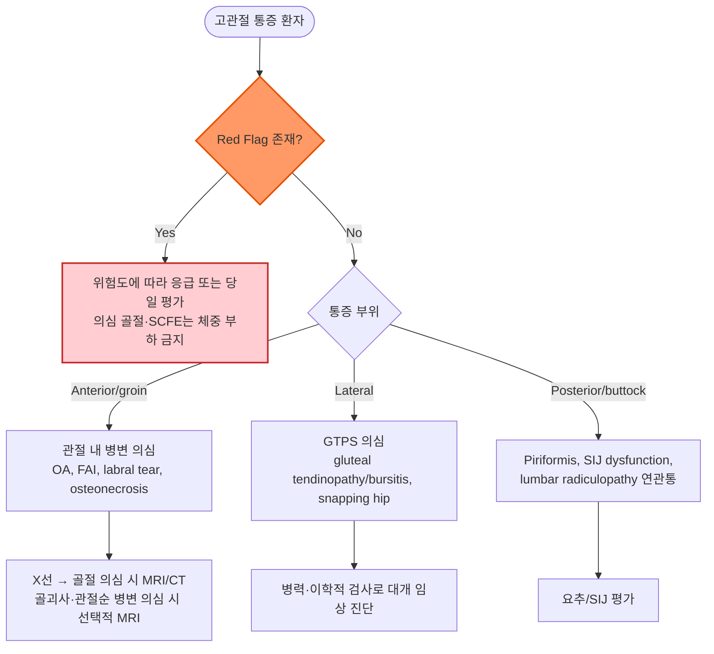

# 고관절 통증 Hip Pain

### <mark style="color:green;">일반 사항</mark>

* 고관절 자체(관절 내) 또는 고관절 주위 연부 조직(관절 외)의 통증, 또는 요추부·골반 등 인접 구조물로부터의 연관통을 포괄하는 증상
* 통증 부위에 따라 anterior(전방 고관절/서혜부), lateral(외측 고관절), posterior(후방 고관절/둔부) 3영역으로 구분하는 것이 병력 청취와 감별 진단에 유용
* 일차 진료에서 흔히 접하는 근골격계 주소 중 하나이며, 연령대에 따라 원인 분포가 크게 다름 (소아·청소년 - 선천/apophyseal 병변, 감염, 활막염; 청장년 - 과사용·염좌·FAI; 고령 - 퇴행성 관절염·골절)
* 고관절 골관절염의 전 세계 유병률은 약 7.2%로 추정됨 (AAOS 2023)
* 병력·신체검사만으로 원인별 접근이 가능한 경우가 많으나, 부위별로 다양한 감별 진단이 존재하여 체계적 접근이 필요

***

### <mark style="color:green;">원인</mark>

#### <mark style="color:orange;">부위별 흔한 원인</mark>

* anterior hip or groin : 관절 내 병변(예: OA, hip labral tear); 관절 외 병변(예: hip flexor injury); 복부 or 골반 기원 연관통
* lateral hip : greater trochanteric pain syndrome(GTPS; gluteus medius/minimus tendinopathy 또는 tear, 동반 점액낭염 등), external snapping hip; 외측 대전자 부위의 국소 통증이 허벅지 외측으로 퍼질 수 있음
* posterior hip or buttock : piriformis syndrome, sacroiliac joint(SIJ) dysfunction, lumbar radiculopathy

#### <mark style="color:orange;">연령별 흔한 원인</mark>

* \~사춘기 : 선천 기형, avulsion Fx, apophyseal/epiphyseal injury, transient synovitis, 화농성 관절염, Legg-Calvé-Perthes disease(4\~10세 호발), slipped capital femoral epiphysis(SCFE, 비만 청소년에서 호발)
* 성인 : 염좌, femoroacetabular impingement, 타박상, 점액낭염, greater trochanteric pain syndrome
* 고령 : 퇴행성 골관절염, 골절(낙상 후 대퇴골 경부/전자간부 골절), 무혈성 괴사

#### <mark style="color:orange;">위험 인자</mark>

* 고령, 골다공증, steroid 사용, 비만, 이전 고관절 외상/수술력, 부위 무관 과거 골절력, 부모의 고관절 골절 가족력, 반복적·과사용성 스포츠 활동

***

### <mark style="color:green;">임상 양상</mark>

* 고관절 통증 및 약화
* 부종
* 멍
* 고관절 운동 범위 제한
* thigh 또는 buttock 방사통
* 하지 기형 또는 단축
* 보행 장애

#### <mark style="color:$danger;">🚩 Red Flags!</mark>

<mark style="color:$danger;">**즉각 조치 또는 의뢰**</mark>

* 심한 외상 후 움직일 수 없음 / 체중 부하 불가, 환측 하지 외회전(externally rotated leg) 소견 (→ 골절·탈구 의심)
* 뚜렷한 변형, 심한 멍/출혈
* 급성 비외상성 심한 고관절 통증, 체중 부하 불가 또는 현저한 수동 ROM 통증/제한 ± 발열·국소 열감/홍반 → 화농성 관절염 의심; 고령, 당뇨병, 면역저하, 최근 관절 시술/인공관절 치환술 병력이 있는 환자는 발열이 없어도 배제하지 않음
  * 소아에서 **Kocher–Caird(수정 Kocher) 기준**(발열 >38.5°C, 체중 부하 불가, ESR>40 mm/h, WBC>12,000/mm³, CRP>20 mg/L)은 화농성 관절염과 일과성 활막염 감별의 보조 도구임. 임상적으로 감염이 의심되면 기준 개수나 CRP 수치와 관계없이 즉시 평가하고, 정형외과 협진 및 관절 천자를 고려
  * CRP 상승은 의심을 높이는 보조 소견이지만 비특이적이며, CRP 단독 상승으로 화농성 관절염을 진단하거나 정상 수치로 배제할 수 없음
  * 미취학 아동에서 발열·염증 소견이 뚜렷하지 않을 수 있음. 확진 환자 129명(3개월~5세)을 대상으로 한 연구에서 Kocher 기준 ≥3개 또는 수정 기준 ≥4개의 민감도는 각각 56.6%였음. _Kingella kingae_ 감염에서도 전형적인 기준이 충족되지 않을 수 있으므로 기준 미충족만으로 안심하지 않음 [Hagedoorn et al. J Pediatr Orthop 2023;43:e608–e613; doi:10.1097/BPO.0000000000002441]
* 급성 하지 위약·감각 소실, 또는 회음부 감각 저하/괄약근 기능 이상 동반 → cauda equina syndrome 의심, 응급 이송

<mark style="color:$warning;">**당일~수일 내 평가**</mark>

* 의도하지 않은 체중 감소, 암 병력, 야간통 → 골 전이 등 악성 종양 의심
* 고령자의 낙상·경미한 외상 후 지속되는 고관절/서혜부 통증, 특히 체중 부하 곤란 (당일) → X선이 정상이거나 불확실해도 불현성 골절 의심; 체중 부하를 피하게 하고 당일 비조영 MRI 또는 CT 및 정형외과 평가
* 청소년의 급성/아급성 고관절·서혜부·무릎 통증(특히 비만, 내회전 제한) (당일) → 대퇴골두 골단분리증(SCFE) 의심; 체중 부하를 금지하고 당일 정형외과 평가. 불안정 SCFE가 의심되면 통증을 유발하는 frog-leg 자세를 강요하지 않음

<mark style="color:$info;">**외래 추적 / 추가 평가 계획**</mark> <mark style="color:$info;">- 즉각 위험 낮으나 호전 없으면 의뢰</mark>

* 수 주간의 보존적 치료(휴식·진통제·물리치료)에도 호전이 없는 경우

***

### <mark style="color:green;">진단</mark>

#### <mark style="color:orange;">영상 검사</mark>

* X선 검사 : 외상성 골절 의심 또는 지속되는 비외상성 통증의 초기 영상검사; 정상 X선만으로 불현성 골절이나 초기 골괴사를 배제하지 않음
  * 급성 외상 : AP pelvis + 증상측 hip lateral view; 골절 의심 시 아픈 고관절을 무리하게 움직이는 자세는 피함
  * SCFE 의심 청소년 : 양측 고관절이 포함된 AP pelvis 및 측면상으로 평가; 불안정 SCFE가 의심되면 frog-leg lateral 대신 환측 cross-table lateral view 고려 [POSNA, SCFE Study Guide]
  * 만성/비외상성 통증 : AP pelvis ± lateral view로 OA·FAI·dysplasia 등 구조적 병변 평가; 필요 시 체중 부하 AP 촬영. FAI(cam/pincer 형태) 감별에는 Dunn 45° view 등 추가 측면상으로 대퇴골두-경부 이행부 평가. 영상상 형태 이상만으로 FAI 증후군을 진단하지 않음
  * X선이 음성·불확실하나 불현성 골절이 의심되면 당일 비조영 MRI 또는 CT 추가; CT 음성 후에도 임상적 의심이 지속되면 MRI 고려. 골수 병변(불현성 골절, 골괴사 등) 평가에는 MRI가 특히 유용 (☞ Red Flags) [ACR Appropriateness Criteria, Acute Hip Pain: 2024 Update]
* MRI : X선 검사 등으로 진단이 되지 않을 때(특히 대퇴골두 osteonecrosis, labral tear, 불현성 골절); 관절순 파열 의심 시 고해상도 3-T hip protocol MRI로 평가 가능하며, 장비·판독 경험·임상 상황에 따라 MR arthrography 고려. 무증상자에게도 관절순 영상 이상이 있으므로 증상·진찰과 함께 해석 _✽전통적으로 MR arthrography가 labral tear의 diagnostic test of choice로 여겨져 왔으나(AFP 2014), 최근에는 3-T non-arthrographic MRI의 진단 정확도가 개선되어 장비·판독 경험에 따라 우선 고려되기도 함_
  * ✽Osteonecrosis 초기(Stage I)는 X선상 정상으로 보이는 경우가 흔함; 고용량/장기간 glucocorticoid 사용, 과음 등 위험 인자가 있는 환자가 지속적인 서혜부 통증을 호소하면 X선이 정상이더라도 조기 MRI를 고려
* 초음파 : tendon, bursa, joint effusion, functional 원인(예: snapping hip) 진단에 유효
* bone scan : MRI 시행이 어렵거나 다발성 골병변/전이성 병변 평가 등 제한적 상황에서 고려

#### <mark style="color:orange;">실험실 검사</mark>

* 관절 천자(joint aspiration) : 자가 관절의 화농성 관절염이 의심되면 신속히 시행(고관절은 보통 영상 유도하); 활액의 배양·Gram 염색, WBC/호중구 비율, 결정 검사를 시행하고 필요 시 혈액배양 채취. 활액 세포수·Gram 염색·배양의 음성 결과 하나만으로 감염을 배제하지 않음. 가능하면 검체 채취 후 경험적 항생제 시작; 패혈증·패혈성 쇼크에서는 항생제 투여를 지연하지 않음 [EBJIS SANJO guideline. J Bone Jt Infect 2023;8:29–37]
* Bursal aspiration : 통상적인 GTPS/trochanteric bursitis에서는 일반 진단검사로 사용하지 않으며, 감염성 점액낭염 또는 crystal disease 등이 의심되는 특별한 상황에서 선택적으로 고려
* 혈액 검사 : 2차성 원인 진단 또는 다른 질환 배제를 위하여 고려
* 소아 화농성 관절염 의심 시 : CBC, ESR, CRP 및 영상검사로 평가하되, 수치가 정상이거나 예측기준을 충족하지 않아도 배제하지 않음. 정형외과와 신속히 상의하여 관절 천자 및 배양을 포함한 진단·치료 결정

#### <mark style="color:orange;">신체검사</mark>

✽[Hip anatomy](https://emedicine.medscape.com/article/1898964-overview), [Hip muscle(3D)](https://www.innerbody.com/image/musc08.html), [Leg muscle(3D)](https://www.innerbody.com/anatomy/muscular/leg-foot)

* 양측을 비교 평가하는 것이 중요함
* Normal Hip ROM Angles
  * **Flexion (bending knee to chest) :** 110° to 120°
  * **Extension (moving leg backward) :** 10° to 15°
  * **Abduction (moving leg outward) :** 30° to 50°
  * **Adduction (moving leg inward) :** 30°
  * **Internal Rotation :** 30° to 40°
  * **External Rotation :** 40° to 60°
  * ✽고관절·무릎을 90° 굽힌 자세에서는 아래다리를 바깥쪽으로 움직이면 고관절 내회전, 안쪽으로 움직이면 외회전임. 다리를 편 자세에서 발끝 방향만으로 판단할 때와 혼동하지 않도록 검사 자세를 명시

<mark style="color:$primary;">**Trendelenburg test (= Single leg stance phase)**</mark>

* [방법 ](https://www.aafp.org/afp/2021/0115/p81): 한 다리로 섬(디딤 발); 반대쪽(들어올린 쪽) 골반이 내려가면 양성(디딤 발 쪽 gluteus medius/minimus 약화)
* 주된 의미 : stance-side hip abductor weakness/insufficiency를 시사하며, GTPS 또는 gluteal tendon tear에서 특히 유용
* 관련 상태 : 디딤 발 쪽 gluteus medius/minimus 약화(1차적 의미); hip labral tear, transient synovitis, Legg-Calvé-Perthes(LCP) Dz, slipped capital femoral epiphysis(SCFE) 등 다양한 고관절 질환에서 통증·기능 저하로 인해 이차적으로 양성일 수 있음

※ Trendelenburg gait : 환측 고관절 쪽으로 상체가 기울어짐

<mark style="color:$primary;">**Hip ROM testing**</mark>

* 방법 : abduction, adduction, extension, internal & external rotation을 각각 시행; 운동 범위 제한, 수동적 움직임으로 (특히 운동 범위 끝에서) 통증 발생 시 양성
* 관련 상태 : synovitis, septic arthritis, loose body, chondral lesion, OA, LCP Dz, osteonecrosis

<mark style="color:$primary;">**FABER (flexion, abduction, external rotation) test (= Patrick's test)**</mark>

* [방법 ](https://www.aafp.org/afp/2021/0115/p81): 누운 자세에서 고관절과 무릎을 45°굴곡 시키고 외전/외회전시켜 발목이 반대 다리의 무릎 근위부에 놓이도록 함; SIJ/요추/post hip 통증, groin pain 발생 시 양성
* 단독으로 특정 질환을 확진하지 않으며 관절 내 병변에 대한 선별 검사로 해석
* 관련 상태 : hip or SIJ 이상; OA, SIJ dysfunction, hip labral tear, loose body, chondral lesions, femoral acetabular impingement, iliopsoas bursitis, iliopsoas spasm

<mark style="color:$primary;">**FADIR (flexion, adduction, internal rotation) test (= Impingement test)**</mark>

* [방법 ](https://www.aafp.org/afp/2021/0115/p81): 누운 자세에서 고관절과 무릎을 약 90° 굴곡하고 고관절을 내전·내회전시킴; 통증 발생 시 양성
* 단독으로 특정 질환을 확진하지 않으며 관절 내 병변에 대한 선별 검사로 해석
* 관련 상태 : hip labral tear, loose body, chondral lesion, femoral acetabular impingement

<mark style="color:$primary;">**Log roll test**</mark>

* [방법 ](https://www.aafp.org/afp/2014/0101/p27): 누운 자세에서 다리를 신전시켜 힘을 빼게 하고 하지를 통나무 굴리듯이 내회전 및 외회전시킴(log roll); 움직임 제한, 통증 발생 시 양성 _✽AFP 2014에서는 passive supine rotation을 "Freiberg test"로도 표기하나, 다른 문헌에서 Freiberg maneuver는 piriformis 유발 검사로 별도 정의되기도 하여 혼동 방지를 위해 본문에서는 log roll test로 통일함_
* 관련 상태 : 전방/서혜부 통증 → 관절 내 병변(SCFE, FAI, osteonecrosis 등); 후방 통증은 비특이적이므로 요추 신경학적 검사, SIJ 및 둔부 진찰 결과와 함께 해석; mechanical clicking/catching 동반 시 관절순 등 관절 내 병변 고려

<mark style="color:$primary;">**Straight leg raise against resistance test (= Stinchfield test)**</mark>

* [방법 ](https://www.aafp.org/afp/2014/0101/p27): 누운 자세에서 다리를 쭉 펴고 저항을 가한 상태에서 하지를 45° 들어올림; 서혜부/전방 고관절 통증이 재현되거나 뚜렷한 약화가 있으면 양성
* 관련 상태 : 관절 내 병변·고관절 굽힘근 병변 등에서 통증이 재현될 수 있으나 원인 질환에 특이적이지 않음

<mark style="color:$primary;">**Straight leg raise(SLR) test**</mark>

* [방법 ](https://www.aafp.org/afp/2014/0101/p27): 누운 자세에서 다리를 쭉 펴고 힘을 뺀 상태에서 하지를 수동 거상
  * 30\~70° 거상 시 무릎 아래로 방사되는 좌골신경성 통증이 재현되면 lumbar nerve-root irritation/radiculopathy 시사(발목 배굴 시 악화, 무릎/고관절 굴곡 시 완화)
  * 70° 이상에서의 후대퇴부 국소 당김·통증만으로는 양성으로 판단하지 않으며 hamstring tightness 또는 hip/posterior soft-tissue origin 고려
* 고관절 자체 질환의 진단검사가 아니라 lumbar radiculopathy와 연관통 감별에 주로 사용

<mark style="color:$primary;">**Ober test (passive adduction)**</mark>

* [방법 ](https://www.aafp.org/afp/2014/0101/p27): 건측을 아래로 하여 옆으로 눕히고 검사자는 환자의 등 뒤에 서서 수동적으로 시행; 움직임 제한, 통증 발생 시 양성
  * Tensor fasciae latae 검사 : 고관절과 무릎을 완전 신전하고 진찰대 밖으로 다리를 내어 놓아 중력에 의하여 다리가 내려가도록(내전되도록) 함
  * Gluteus medius : 고관절 완전 신전, 무릎 45\~90°굴곡 시킴
  * Gluteus maximus : 고관절 굴곡, 무릎 신전 시키고 상체를 어깨가 진찰대에 닿도록 돌리게 함(상체 supine)
* 관련 상태 : external snapping hip, greater trochanteric pain syndrome

<mark style="color:$primary;">**기타**</mark>

* 골반 기울어짐 : 시진상 양쪽 iliac crest 높이가 다름
  * 원인 : 다리 길이의 차이, 골반 골절, 측만증, 편측 척추 주위근 경직
* 쪼그려 앉기 장애
  * 원인 : 중등증 이상의 관절염 또는 점액낭염, 관련 근육 장애

#### <mark style="color:orange;">증상/병력에 따른 감별</mark>

<figure><figcaption></figcaption></figure>

* Lumbosacral spine or SIJ로부터의 연관통 : 요통 동반, 통증/감각 이상 증상이 원위부로 확장, 고관절 및 연조직의 이상이 명확하지 않음; lower lumbar root → gluteus & posterolateral thigh area, SIJ → gluteal area

<mark style="color:$primary;">**부위에 따른 감별**</mark>

_<mark style="color:$info;">(Ref. Evaluation of the Patient with Hip Pain. AFP 2014;89(1))</mark>_

<mark style="color:$primary;">**Anterior thigh or groin pain**</mark>

<table><thead><tr><th width="180">진단</th><th width="360">임상 양상</th><th>병력/위험 인자</th></tr></thead><tbody><tr><td><strong>Meralgia paresthetica</strong></td><td>(외측대퇴피신경 압박에 의한) Anterolateral thigh hypesthesia, dysesthesia; 고관절 질환 또는 lumbar radiculopathy 증거 없음</td><td>복부 비만, 임신, 조이는 내의</td></tr><tr><td><strong>Athletic pubalgia (sports hernia)</strong></td><td>dull, diffuse, inner thigh 방사통, 외부 압박/복압 증가(예: 재채기, 윗몸일으키기, Valsalva maneuver) 시 통증; inguinal canal/pubic tubercle 압통, adductor origin, resisted sit-up 또는 hip flexion 시 통증; 직접 압박 또는 고관절 굴곡에 의해 악화되지 않음</td><td>심한 운동(예: 축구, 럭비, 하키, 역도)</td></tr></tbody></table>

<mark style="color:$primary;">**Anterolateral hip and groin pain**</mark>

<table><thead><tr><th width="180">진단</th><th width="360">임상 양상</th><th>병력/위험 인자</th></tr></thead><tbody><tr><td><strong>Osteoarthritis</strong></td><td>점차 악화, 깊은 쑤시는 일관된 통증(특히 체중 부하 시), 강직, 활동으로 악화/휴식으로 완화; ROM 감소</td><td>&gt;50세, 비만, 이전 관절 손상</td></tr><tr><td><strong>Osteonecrosis</strong>¹⁾</td><td>deep groin, 체중 부하/움직임 시 통증, 휴식 시 통증, thigh/buttock 연관통; 잠행성 시작; 외상으로 급성 악화; log roll test(+), 점진적 ROM 제한</td><td>고용량/장기간 glucocorticoid 사용, 과도한 음주, 외상성 femoral neck fracture/dislocation(우선 고려); SLE, sickle cell disease, HIV 감염, 흡연</td></tr><tr><td><strong>Femoroacetabular impingement</strong></td><td>deep groin, 장시간 앉은 후 일어설 때 통증, Lat hip/Ant thigh 방사통; FADIR/FABER tests(+)</td><td>장거리 운전</td></tr><tr><td><strong>Hip labral tear</strong></td><td>dull or sharp groin pain, lat hip/ant thigh/buttock 방사통, 체중 부하 시 통증; Trendelenburg or antalgic gait²⁾, mechanical Sx³⁾, 내회전 장애, FADIR/FABER tests(+)</td><td>hip 탈구 병력</td></tr><tr><td><strong>Femoral neck fracture</strong>⁴⁾</td><td>deep, 연관통, 체중 부하 시 통증, GT 압통; painful ROM</td><td>여성, 운동선수(피로 골절), steroid, 흡연, 골다공증(고령, 저에너지 낙상)</td></tr><tr><td><strong>Iliopsoas bursitis (internal snapping hip)</strong></td><td>deep, 연관통; 간헐적 catching, snapping, popping; 고관절 굴곡→신전 시 snapping</td><td>발레, 달리기</td></tr><tr><td><strong>Loose body / Chondral lesion</strong></td><td>deep, 연관통; mechanical Sx; ROM 제한, catching/grinding, FADIR/FABER test(+)</td><td>고관절 탈구/외상, Legg-Calvé-Perthes disease</td></tr><tr><td><strong>Septic arthritis</strong></td><td>체중 부하 시 통증, 수동 움직임/휴식 중에도 통증; 소아에서는 발열 동반이 흔함</td><td>고령, 당뇨병, RA, 최근 관절 수술, 인공 관절; (소아) ☞ Red Flags</td></tr></tbody></table>

_¹⁾ osteonecrosis는 aseptic necrosis, avascular necrosis, ischemic necrosis라고도 불림_\
_&#xB2;⁾ antalgic gait : 통증을 줄이기 위하여 환측 보행 시간(체중이 실리는 시간)을 보다 짧게 걸음_\
_&#xB3;⁾ mechanical symptoms : such as catching or painful clicking._\
_GT=Greater trochanter, ROM=range of motion_\
_⁴⁾ 고관절 골절은 관절낭 기준 intracapsular(femoral neck 34%, femoral head 드묾)/extracapsular(intertrochanteric 48%, subtrochanteric 5.8%)로 분류됨 [JAMA 2026]_

<mark style="color:$primary;">**Posterolateral pain**</mark>

<table><thead><tr><th width="220">진단</th><th width="320">임상 양상</th><th>병력/위험 인자</th></tr></thead><tbody><tr><td><strong>Gluteal muscle tear or avulsion</strong>*</td><td>압통, lat thigh/buttock 방사통, resisted external rotation 시 통증; 외전 약화, Trendelenburg gait</td><td>중년 여성</td></tr><tr><td><strong>Iliac crest apophysis avulsion</strong></td><td>iliac crest 압통 및/또는 ecchymosis</td><td>외상, &#x3C;25세(골격 미성숙)</td></tr></tbody></table>

_\*Conditions associated with Greater trochanter pain syndrome_

<mark style="color:$primary;">**Posterior pain**</mark>

<table><thead><tr><th width="220">진단</th><th width="320">임상 양상</th><th>병력/위험 인자</th></tr></thead><tbody><tr><td><strong>Hamstring muscle strain or avulsion</strong></td><td>엉덩이 통증, 압통, ischial tuberosity 압통; ecchymosis, 하지 굴곡 약화, palpable gap</td><td>고관절 굴곡 &#x26; 하지 신전 시 eccentric muscle contraction</td></tr><tr><td><strong>Ischial apophysis avulsion</strong></td><td>엉덩이 통증, 압통, ecchymosis</td><td>골격 미성숙, eccentric muscle contraction</td></tr><tr><td><strong>Ischiofemoral impingement</strong></td><td>buttock/back pain, post thigh 방사통; sciatica 증상</td><td>-</td></tr><tr><td><strong>Piriformis syndrome</strong></td><td>buttock pain, 앉거나 걸을 때 악화, post thigh 방사통, sciatic notch 위 압통; sciatica 유사 증상; 다른 요추·고관절 원인 배제 필요</td><td>buttock 외상</td></tr><tr><td><strong>SIJ dysfunction</strong></td><td>허리/엉덩이/서혜부 방사통, FABER test 시 국소 SIJ 통증, SIJ line 압통</td><td>여성(특히 임신), 경증 외상</td></tr></tbody></table>

<mark style="color:$primary;">**Lateral pain**</mark>

<table><thead><tr><th width="220">진단</th><th width="320">임상 양상</th><th>병력/위험 인자</th></tr></thead><tbody><tr><td><strong>Greater trochanteric bursitis</strong>*</td><td>대전자 주변 국소 압통, lat thigh 방사통; ROM 정상</td><td>달리기, 중년 여성; 보행 장애(무릎/발목 질환, 다리 길이 차이)</td></tr><tr><td><strong>Greater trochanteric pain syndrome</strong></td><td>압통, lat thigh 방사통, 근위 iliotibial band 압통; 경증 아침 강직, 이환 부위로 누워 자기 어려움; Trendelenburg gait</td><td>knee OA, 비만, 요통, 여성; 반복 작업</td></tr><tr><td><strong>External snapping hip</strong></td><td>압통, lat thigh 방사통; 보행 시 snapping or popping; Ober test(+), GT 위 통증</td><td>-</td></tr></tbody></table>

_\*Conditions associated with Greater trochanter pain syndrome_


**GTPS 용어에 대하여**\
과거 "trochanteric bursitis"로 통칭되었으나, MRI·조직학 연구에서 순수 점액낭염은 드물고 gluteus medius/minimus tendinopathy(±bursitis)가 주된 병인으로 확인되어, 현재는 **greater trochanteric pain syndrome(GTPS)** 이 포괄적 진단명으로 권장됨


✽Snapping hip은 발생 기전에 따라 internal(iliopsoas tendon, 상단 표 참고), external(iliotibial band/gluteus maximus, 상단 표 참고), intra-articular(loose body, labral tear 등 관절 내 병변에 의한 mechanical catching/clicking, ☞ 아래 감별표) 3가지로 분류됨

#### <mark style="color:orange;">불현성 골절 (Occult Fracture)</mark>

* 원인 : 낙상 등 외상 후 비전위 골절 또는 운동·훈련 증가에 따른 대퇴골경부 피로골절 등
* 임상 양상 : 서혜부/전방 고관절 통증, 체중 부하 시 악화, 보행 장애 및 고관절 수동 운동 시 통증. 개별 유발검사 양성만으로 골절을 확진하거나 배제하지 않음
* 검사 : 초기 X선이 정상일 수 있음. 골절 의심 시 체중 부하·운동을 중단하고 비조영 MRI 또는 CT로 신속히 평가; CT 음성 후에도 의심이 남으면 MRI 고려
* 고령자의 경도 외상 후 지속 통증·체중 부하 곤란, 또는 운동선수의 지속되는 활동 관련 서혜부 통증에서 특히 주의 (☞ Red Flags)

***



<p align="center"><strong>고관절 통증 초기 평가 알고리듬</strong></p>

<p align="center"><em><mark style="color:$info;">Ref. AFP 2014;89:27–34를 바탕으로 재구성; ACR Appropriateness Criteria, Acute Hip Pain: 2024 Update; Hagedoorn et al. J Pediatr Orthop 2023</mark></em></p>

***

### <mark style="background-color:$warning;">Management</mark>


**부위·기전에 따른 접근**\
Red Flags 배제 후, 통증 부위(anterior/lateral/posterior)와 유발 기전(관절 내 vs 관절 외 vs 연관통)에 따라 초기 보존적 치료를 적용하며, 확진된 개별 질환의 세부 관리는 해당 질환 챕터를 참고


* 급성 경증 염좌·타박 및 일부 과사용성 연부조직 질환(경증 건병증·점액낭염 등)은 자기 제한적이며 보존적 치료(휴식, 활동 조절, 진통제, 물리 치료)로 호전; OA, 증상이 지속되는 FAI 증후군·관절순 병변, 뚜렷한 둔근힘줄 파열, 골괴사 등은 경과에 따라 표적 치료·추가 평가 필요
* 관절 내 병변(OA, 관절순 병변, FAI 증후군 등)은 증상·진찰·영상 소견을 종합해 판단; 지속적인 기능 장애, 심한 구조적 병변 또는 적절한 보존적 치료에 반응이 없으면 정형외과/스포츠의학과 의뢰 고려. 무증상 영상 소견만으로 의뢰·시술을 결정하지 않음
* GTPS(외측 고관절 통증)는 hip abductor/gluteal strengthening 등 표적 운동치료 + 활동(부하) 조절이 1차 치료이며, 국소 스테로이드 주사보다 52주 시점의 환자 보고 전반적 개선율이 높았으나 통증 강도에는 차이가 없었음(Mellor et al. BMJ 2018; 체계적 문헌고찰, Physiotherapy 2024); 주사는 급성기 통증 조절 목적의 보조 수단으로 고려
* 고관절 골관절염 : 1차 치료는 NSAID + 운동치료(물리치료/자가 운동 모두 가능); 관절강내 corticosteroid 주사는 단기 증상 완화 목적으로 중등도 권고 수준으로 고려 가능하나, 관절강내 hyaluronic acid 주사는 권고되지 않음(AAOS 2023)
  * ✽AAOS 2023은 관절강내 corticosteroid 주사를 High-quality evidence에 근거해 Moderate recommendation(하향)으로 제시하며, 연구 간 이질성·용량 차이와 함께 감염 및 RPOA 등 이상반응 보고의 부족을 하향 사유로 명시함; 또한 감염과 RPOA를 주사 시 고려해야 할 주요 위험으로 별도로 언급함

***

### <mark style="color:green;">비-약물 치료 및 예방</mark>

* 휴식·활동 조절 : 급성 악화 시 통증 유발 활동을 일시적으로 줄이고, 골절·감염 등 긴급 원인이 배제되면 통증 범위 내에서 점진적으로 운동 및 활동 재개
* 냉찜질 : 얼음이 직접 피부에 닿지 않도록 함(동상 주의), 한 번에 10\~15분 이상 지속하지 않음
*   열찜질 : 국소 열감이 없을 때 시행(외상 초기에는 피함); 열찜질이 부종을 악화시킬 수 있음;

    한 번에 20분 이상 지속하지 않음(화상 주의)
* 목발 등 보행 보조구 : 보행 시 통증 조절에 선택적으로 사용; 골절·SCFE 의심 시에는 평가 전 체중 부하 금지. 부목·압박 붕대는 모든 고관절 통증에 일률적으로 권고하지 않음
* 물리 치료, 운동 (☞ GTPS·OA에서 1차 치료로서 중요성이 높음)
* 적정 체중 유지, 비만 치료
* 통증을 악화시키는 활동을 피함
* 장시간 서 있거나, 앉거나 누웠을 때를 포함하여 같은 자세로 오래 있지 않음
* 아픈 고관절을 아래로 하여 옆으로 눕지 않음, 옆으로 누울 때는 무릎 사이에 베개를 끼움
* 구부린 자세로 일하는 것을 피함, 물건을 들 때 무릎을 구부림
* twisting, bending, running, jumping, 갑자기 출발 또는 정지하는 활동을 피함
* 반복적인 작업을 할 때는 자주 휴식을 취함
* 계단 오르내림을 줄임
* 굽이 높은 신발 착용을 피함
* 스트레칭, 근육 강화 훈련

<mark style="color:$primary;">**운동**</mark>

* 운동 전 충분한 준비 운동
* 체중 부하가 적은 운동 선택 : 수영, 자전거
* 고관절에 무리를 주는 운동을 피함 : 농구, 테니스
* 하지 충격을 줄임 : 딱딱한 바닥에서 뛰는 것을 피함, 충격을 흡수할 수 있는 잘 맞는 신발 착용
* 필요시 보호 장비 착용
* 운동량을 천천히 늘림
* 피로로 자세가 무너지거나 통증이 심해지면 운동량을 줄이고 회복 후 재개

***

### <mark style="color:green;">약물 치료</mark>

#### <mark style="color:orange;">진통제</mark>

* NSAID : ibuprofen 200\~400 ㎎ tid <mark style="color:blue;">\[부루펜]</mark>, naproxen 250\~500 ㎎ bid <mark style="color:blue;">\[낙센]</mark>; 필요 시 증상·위험도에 따라 증량 가능하나 고용량은 최소 기간만 사용 _✽국내 식약처 허가사항상 경증·중등도 동통에는 ibuprofen 1회 200\~400 ㎎, 1일 3\~4회이며, 관절염 등에는 1회 200\~600 ㎎까지(1일 최고 3,200 ㎎) 사용 가능_
* acetaminophen : 650\~1,000 ㎎ tid <mark style="color:blue;">\[타이레놀]</mark>; 총 3 g/day 이내를 기본 안전 상한으로 하며, 간질환·과음 병력이 있으면 추가 감량 _✽AAOS 2023 hip OA 가이드라인에서 NSAID는 강력 권고(Strong)인 반면, acetaminophen은 근거 불충분으로 Option(Consensus) 수준에 그침 - 1차 선택제는 아니며, NSAID 금기·고령자 등에서 보조적으로 고려_

#### <mark style="color:orange;">스테로이드</mark>

* 국소(관절강내/점액낭) corticosteroid injection : 적응증이 확인된 경우(예: symptomatic hip OA, 일부 GTPS)에 선택적으로 시행
* 관절강내(intra-articular) 주사는 감염 및 rapidly progressive osteoarthritis(RPOA), subchondral insufficiency fracture 등 관절 손상 위험을 고려하여 적응증을 엄격히 하고, 가능하면 영상 유도하 시행
* 고관절 통증 자체를 이유로 전신 corticosteroid를 일률적으로 사용하지 않음
* 건주위/점액낭 주사는 힘줄 내 직접 주입을 피하고 반복 시 건 손상 위험에 유의. 반복 주사의 간격·횟수는 치료 반응, 이전 주사 이력, 조직 손상·감염 위험에 따라 개별 결정. 인공고관절 치환술을 계획 중이면 최근 관절강내 주사 여부와 수술 시점을 수술의와 상의 [ASRA 등 다학회 지침. Reg Anesth Pain Med 2025; doi:10.1136/rapm-2024-105656]

#### <mark style="color:orange;">항생제</mark>

* 화농성 관절염 의심 시 신속한 관절 천자·배양과 정형외과 협진 후 경험적 항생제 및 배농을 포함한 응급 치료; 패혈증이면 검체 채취를 이유로 항생제를 지연하지 않음

***

### <mark style="color:green;">시술 및 기타 처치</mark>

* 관절강내 또는 peritrochanteric/bursal corticosteroid injection : 진단적 겸 치료적 목적; 고관절 **관절강내** 주사는 심부 관절이므로 초음파(US) 또는 투시(fluoroscopy) 유도하 시행을 권장하며, 대전자 주변 주사는 표적과 임상 상황에 따라 영상 유도 여부를 결정; tendon substance 내 직접 주입은 피하며, 반응 불량·재발 시 정형외과/재활의학과 의뢰; 관절강내 주사는 RPOA 등 관절 손상 위험을 고려하여 반복 시행에 신중
* 체외충격파치료(ESWT) : 보존적 치료에 반응 없는 난치성 GTPS/건병증에서 고려 가능; focused ESWT는 중기 통증·기능 개선 근거가 있으나 radial ESWT의 효과는 뚜렷하지 않고 장기 효과 근거도 아직 제한적임
* 관절 천자(aspiration) : 화농성 관절염 의심 시 응급 진단 및 배양 목적으로 시행 (즉시 정형외과 의뢰)

***

### <mark style="color:red;">질병코드</mark>

M25.55 관절통, 골반 부분 및 대퇴

M70.6 대퇴골돌기윤활낭염 Trochanteric bursitis

M76.0 둔부힘줄염 Gluteal tendinitis

M16 고관절증 Coxarthrosis

S72 대퇴골의 골절 Fracture of femur

✽GTPS는 임상적 포괄 진단명으로, M70.6이 GTPS 전체를 뜻하지 않음. 확인된 병태(윤활낭염, 둔근힘줄병증 등)에 맞춰 코드 선택

***

### <mark style="color:purple;">처방례</mark>

> **처방례 1. 경증 염좌·건병증**
>
> ```
> acetaminophen 500 ㎎/T  2T tid  pc
> ```
>
> _✽경증 염좌·건병증의 단기 통증 조절에 선택 가능; NSAID 금기 또는 위장관·신장 위험이 높은 환자에서 대안으로 고려; 고령자에서도 간기능·영양 상태·병용 약물을 확인 후 사용_

> **처방례 2. 고관절 골관절염, 활동 시 통증**
>
> ```
> naproxen 250 ㎎/T  1T bid  pc
> ```
>
> _✽NSAID 사용 전 위장관·심혈관·신장 위험을 평가하고 최소 유효 용량으로 단기간 사용; 관절강내 corticosteroid 주사는 단기 증상 완화 목적으로 중등도 권고 수준(AAOS 2023)이며 RPOA 등 관절 손상 위험을 고려해 적응증을 신중히 판단, 관절강내 hyaluronic acid 주사는 권고되지 않음(AAOS 2023)_

> **처방례 3. Greater trochanteric pain syndrome(외측 고관절 통증)**
>
> ```
> ibuprofen 400 ㎎/T  1T tid  pc
> ```
>
> _✽1차 치료는 활동 조절 및 표적 둔근 운동치료; NSAID는 급성기 통증 조절 목적의 보조적 사용; 수 주간 반응 불량 시 초음파 유도하 peritrochanteric/bursal corticosteroid injection 고려(정형외과/재활의학과 의뢰); tendon substance 내 직접 주입은 피함_

> **처방례 4. 급성 염좌·타박, 부종 동반**
>
> ```
> ibuprofen 400 ㎎/T  1T tid  pc  (5\~7일)
> ```
>
> _✽급성기 48시간 이내 냉찜질 병행; 소화성궤양 병력·항응고제 복용·신기능 저하가 있으면 NSAID 대신 acetaminophen을 우선 고려_

***

### <mark style="color:$success;">핵심 복약 지도</mark>

> **NSAID 복용 시 주의사항**
>
> * 공복 복용 시 위장 자극이 있을 수 있어 식후 복용 권장
> * 항응고제·저용량 aspirin 병용 시 출혈 위험 증가 - 병용 여부 확인 필요
> * 고령자, 신기능 저하 환자에서는 신독성·체액 저류 위험으로 최소 용량·최단 기간 사용

> **국소 스테로이드 주사 관련 안내**
>
> * 반복 주사는 이전 효과와 주사 횟수·간격, 감염·조직 손상 위험을 평가해 개별 결정합니다. 힘줄 안에 직접 주사하지 않습니다
> * 관절강내 주사는 rapidly progressive osteoarthritis(RPOA) 등 관절 손상 가능성이 있어 반복 주사 시 증상·영상 변화를 관찰하며 신중히 결정
> * 주사 후 1\~2일간 국소 부종·통증이 일시적으로 악화될 수 있음을 미리 안내

> **활동 조절**
>
> * 통증을 유발하는 반복 동작(계단, 쪼그려 앉기, 장시간 서기)을 줄이도록 안내
> * 골절·감염 등 긴급 원인이 배제되었다면 완전한 안정보다는 통증 범위 내에서의 활동 유지가 회복에 도움이 됨을 강조

> **언제 다시 병원을 방문해야 하나요?**
>
> * 보존적 치료 수 주 이내에도 증상이 호전되지 않는 경우
> * 발열 유무와 관계없이 고관절을 움직이기 몹시 아프거나, 국소 열감·홍반이 동반되는 경우 - 즉시 내원
> * 갑자기 체중 부하가 불가능해지거나 변형이 발생하는 경우 - 즉시 내원
> * 하지 위약, 감각 저하, 대소변 조절 이상이 동반되는 경우 - 즉시 내원

***

## <mark style="color:blue;">환자 안내서</mark>


**고관절 통증, 부위에 따라 원인이 다릅니다**

고관절 통증은 사타구니(앞쪽), 바깥쪽, 엉덩이(뒤쪽) 중 어디가 아픈지에 따라 원인이 달라집니다. 근육·힘줄의 과사용이나 관절의 퇴행성 변화가 흔한 원인이며, 원인에 따라 활동 조절·운동·약물치료 등으로 통증과 기능을 개선할 수 있습니다.


<mark style="color:$primary;">**왜 고관절이 아픈가요?**</mark>

* 퇴행성 관절염, 관절 주위 힘줄의 손상·과부하(건병증), 일부 점액낭염, 근육 문제 등이 흔한 원인입니다
* 허리에서 시작된 통증이 엉덩이나 허벅지로 퍼져 느껴지는 경우도 있습니다

<mark style="color:$primary;">**일상생활에서 어떻게 관리하나요?**</mark>

* **아픈 쪽으로 눕지 마십시오.** 옆으로 누울 때는 무릎 사이에 베개를 끼우면 도움이 됩니다.
* **오래 서 있거나 같은 자세로 있는 것을 피하십시오.** 자주 자세를 바꾸어 주십시오.
* **통증을 유발하는 동작(쪼그려 앉기, 계단 오르내리기, 다리 꼬기)을 줄이십시오.**
* **진찰에서 골절·감염 등 긴급 원인이 배제되었다면**, 완전히 쉬기보다는 통증이 심하지 않은 범위에서 걷기·수영·자전거 같은 운동을 점진적으로 하십시오. 밴드를 이용한 낮은 강도의 엉덩이 근력 운동도 도움이 될 수 있으나 통증이 심해지면 강도·횟수를 줄이십시오.
* 급성 통증·부종이 있을 때는 얼음찜질(피부에 직접 닿지 않게, 15분 이내)을 하십시오.

<mark style="color:$primary;">**약은 어떻게 써야 하나요?**</mark>

* 소염진통제는 식후에 복용하고, 정해진 기간만 사용하십시오.
* 속쓰림, 검은 변, 어지러움 등이 나타나면 복용을 중단하고 병원에 문의하십시오.

<mark style="color:$primary;">**이럴 때는 즉시 병원을 방문하세요**</mark>

* 갑자기 심한 통증이 생기거나 다리에 체중을 실을 수 없는 경우
* 열이 나지 않아도 고관절을 움직이기 몹시 아프거나 붓고 뜨거운 경우
* 다리에 갑자기 힘이 빠지거나 감각이 떨어지고, 특히 회음부 감각 저하나 소변·대변 조절 이상이 생긴 경우
* 넘어지거나 다친 뒤 통증이 지속되거나 걷기 어려운 경우: 검사 전에는 무리해서 걷지 마십시오
