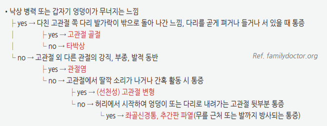
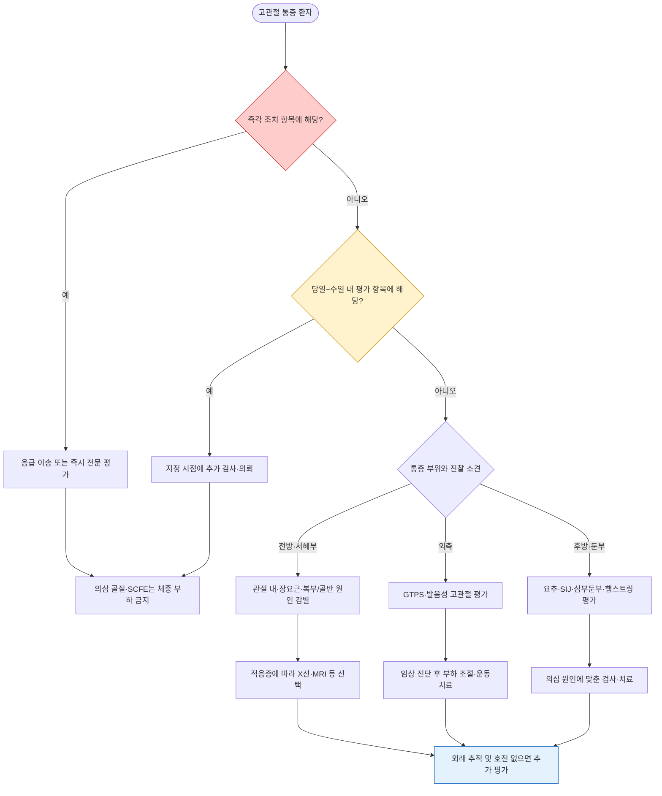

# 고관절 통증 Hip Pain

### <mark style="color:green;">일반 사항</mark>

* 고관절 자체(관절 내) 또는 고관절 주위 연부 조직(관절 외)의 통증, 또는 요추부·골반 등 인접 구조물로부터의 연관통을 포괄하는 증상
* 통증 부위에 따라 anterior(전방 고관절/서혜부), lateral(외측 고관절), posterior(후방 고관절/둔부) 3영역으로 구분하는 것이 병력 청취와 감별 진단에 유용
* 일차 진료에서 흔히 접하는 근골격계 주소 중 하나이며, 연령대에 따라 원인 분포가 크게 다름 (소아·청소년 - 선천/apophyseal 병변, 감염, 활막염; 청장년 - 과사용·염좌·FAI; 고령 - 퇴행성 관절염·골절)
* 고관절 골관절염의 전 세계 통합 유병률은 약 7.2%로 보고되었으나, 연구의 연령·지역·진단 기준에 따라 차이가 큼; 국내 유병률을 뜻하지 않음 (Fan et al. Arthritis Res Ther 2023;25:51; AAOS 2023 인용)
* 병력·신체검사만으로 원인별 접근이 가능한 경우가 많으나, 부위별로 다양한 감별 진단이 존재하여 체계적 접근이 필요

***

### <mark style="color:green;">원인</mark>

#### <mark style="color:orange;">부위별 흔한 원인</mark>

* anterior hip or groin : 관절 내 병변(예: OA, hip labral tear); 관절 외 병변(예: hip flexor injury); 복부 or 골반 기원 연관통
* lateral hip : greater trochanteric pain syndrome(GTPS; gluteus medius/minimus tendinopathy 또는 tear, 동반 점액낭염 등), external snapping hip; 외측 대전자 부위의 국소 통증이 허벅지 외측으로 퍼질 수 있음
* posterior hip or buttock : piriformis syndrome, sacroiliac joint(SIJ) dysfunction, lumbar radiculopathy

#### <mark style="color:orange;">연령별 흔한 원인</mark>

* \~사춘기 : 선천 기형, avulsion Fx, apophyseal/epiphyseal injury, transient synovitis, 화농성 관절염, Legg-Calvé-Perthes disease(4\~10세 호발), slipped capital femoral epiphysis(SCFE, 비만 청소년에서 호발)
* 성인 : 염좌, femoroacetabular impingement, 타박상, 점액낭염, greater trochanteric pain syndrome
* 고령 : 퇴행성 골관절염, 골절(낙상 후 대퇴골 경부/전자간부 골절), 골다공증성 불충분골절
* 대퇴골두 골괴사(osteonecrosis)는 청장년에서도 중요한 원인이며, 연령보다 glucocorticoid 사용·과음·외상 등 위험 인자를 함께 평가

#### <mark style="color:orange;">위험 인자</mark>

* 골절 : 고령, 골다공증, 취약골절 병력, 부모의 고관절 골절 가족력, 낙상, glucocorticoid 사용
* 골괴사 : 고용량/장기간 glucocorticoid 사용, 과음, 대퇴골 경부 골절·고관절 탈구 병력
* 과사용성 병변·피로골절 : 반복적 스포츠 활동, 급격한 훈련량 증가; 낮은 에너지 가용성·월경 이상·낮은 골밀도 등도 확인
* OA·GTPS : 고령, 비만, 이전 관절 손상, 보행 역학 이상 등; 위험 인자만으로 원인을 확정하지 않음

***

### <mark style="color:green;">임상 양상</mark>

* 고관절 통증 및 약화; 서혜부 통증이 대퇴부 또는 무릎으로 느껴질 수 있어, 특히 소아·청소년의 원인 불명 무릎 통증에서는 고관절을 함께 진찰
* 부종·멍 : 외상·표재 연부조직 병변에서 동반될 수 있으나, 심부 관절인 고관절에서는 감염·관절삼출이 있어도 외부 부종·홍반이 뚜렷하지 않을 수 있음
* 고관절 운동 범위 제한
* thigh 또는 buttock 방사통
* 하지 기형 또는 단축
* 보행 장애

#### <mark style="color:$danger;">🚩 Red Flags!</mark>

<mark style="color:$danger;">**즉각 조치 또는 의뢰**</mark>

* 외상 후 움직일 수 없음/체중 부하 불가, 뚜렷한 하지 변형·단축, 신경혈관 이상 또는 심한 출혈 → 골절·탈구 의심; 응급 평가. 고령자에서는 경미한 낙상만으로도 골절이 발생할 수 있음
  * 전위된 대퇴골 경부/전자부 골절에서는 외회전·단축이 흔함; 후방 고관절 탈구에서는 굴곡·내전·내회전 자세가 흔함. 외회전 소견이 없다고 골절·탈구를 배제하지 않음
* 급성 비외상성 심한 고관절 통증, 체중 부하 불가 또는 현저한 수동 ROM 통증/제한 ± 발열·국소 열감/홍반 → 화농성 관절염 의심; 고령, 당뇨병, 면역저하, 최근 관절 시술/인공관절 치환술 병력이 있는 환자는 발열이 없어도 배제하지 않음
  * 소아에서 **Kocher–Caird(수정 Kocher) 기준**(발열 >38.5°C, 체중 부하 불가, ESR>40 mm/h, WBC>12,000/mm³, CRP>20 mg/L)은 화농성 관절염과 일과성 활막염 감별의 보조 도구임. 임상적으로 감염이 의심되면 기준 개수나 CRP 수치와 관계없이 즉시 평가하고, 정형외과 협진 및 관절 천자를 고려
  * CRP 상승은 의심을 높이는 보조 소견이지만 비특이적이며, CRP 단독 상승으로 화농성 관절염을 진단하거나 정상 수치로 배제할 수 없음
  * 미취학 아동에서 발열·염증 소견이 뚜렷하지 않을 수 있음. 확진 환자 129명(3개월~5세)을 대상으로 한 연구에서 Kocher 기준 ≥3개 또는 수정 기준 ≥4개의 민감도는 각각 56.6%였음. _Kingella kingae_ 감염에서도 전형적인 기준이 충족되지 않을 수 있으므로 기준 미충족만으로 안심하지 않음 [Hagedoorn et al. J Pediatr Orthop 2023;43:e608–e613; doi:10.1097/BPO.0000000000002441]
* 급성 또는 빠르게 진행하는 하지 위약·감각 소실, 회음부 감각 저하, 새로 발생한 요폐/요실금·대변 조절 이상 → cauda equina syndrome 등 급성 신경학적 응급질환 의심, 응급 이송
* 청소년에서 급성 고관절·서혜부·무릎 통증과 보행 불가 → 불안정 SCFE 의심; 체중 부하·유발검사를 금지하고 즉시 정형외과 응급 평가

<mark style="color:$warning;">**당일~수일 내 평가**</mark>

* 의도하지 않은 체중 감소, 암 병력, 지속·진행하는 휴식통/야간통 → 골 전이 등 악성 종양 평가; 야간통만으로 악성 종양을 단정하지 않음
* 고령자의 낙상·경미한 외상 후 지속되는 고관절/서혜부 통증, 특히 체중 부하 곤란 (당일) → X선이 정상이거나 불확실해도 불현성 골절 의심; 체중 부하를 금지하고 당일 추가 영상검사 및 정형외과 평가 (☞ 불현성 골절)
* 청소년의 급성/아급성 고관절·서혜부·무릎 통증(특히 비만, 내회전 제한) (당일) → 대퇴골두 골단분리증(SCFE) 의심; 체중 부하를 금지하고 당일 정형외과 평가. 보행 불가/불안정 SCFE가 의심되면 즉각 조치로 상향하고 frog-leg 자세를 강요하지 않음
* 운동·훈련 증가 후 지속되는 체중 부하성 서혜부 통증, 특히 절뚝거림 동반 (당일) → 대퇴골경부 피로골절 의심; 운동·체중 부하 중단, X선이 정상이면 비조영 MRI 우선 고려
* glucocorticoid 사용·과음 등 위험 인자와 지속되는 서혜부 통증 → 골괴사 가능성을 조기에 평가; X선 정상이어도 MRI 및 정형외과 의뢰 고려

<mark style="color:$info;">**외래 추적 / 추가 평가 계획**</mark> <mark style="color:$info;">- 즉각 위험 낮으나 호전 없으면 의뢰</mark>

* 초기 보존적 치료 후 통증·보행·기능을 2\~4주 내 재평가; 악화 시 조기 재평가. 지속적인 외전 약화·Trendelenburg 소견, 기계적 잠김 또는 호전 없는 통증은 추가 영상검사·의뢰 고려
* 소아의 절뚝거림은 성인과 같은 수 주 관찰 원칙을 적용하지 않음; 진단이 불확실하면 조기 추적, 7일 이상 지속되거나 재발하면 추가 평가 (☞ 소아·청소년의 고관절 통증)

***

### <mark style="color:green;">진단</mark>

#### <mark style="color:orange;">병력 및 초기 평가</mark>

* 발생 시점·외상·훈련량 변화, 정확한 통증 부위와 방사, 체중 부하 가능 여부, 야간/휴식통, 아침 강직, 잠김·걸림·snapping, 발열 및 전신 증상을 확인
* glucocorticoid·음주·암·감염·인공관절 병력, 임신 가능성, 요추 증상 및 복부·비뇨생식기 증상을 확인
* 보행·하지 길이·변형, 대전자·서혜부·좌골결절 압통, 능동/수동 ROM, 근력과 하지 신경혈관 상태를 평가; 필요 시 요추·SIJ·무릎·복부 및 탈장 진찰을 추가
* 골절·탈구·SCFE가 의심되거나 수동 운동 시 심한 통증이 있으면 한 발 서기·충돌검사 등 유발검사를 강행하지 않음

#### <mark style="color:orange;">영상 검사</mark>

* X선 검사 : 외상성 골절 의심 또는 지속되는 비외상성 통증의 초기 영상검사; 정상 X선만으로 불현성 골절이나 초기 골괴사를 배제하지 않음
  * 급성 외상 : AP pelvis + 증상측 hip lateral view; 골절 의심 시 아픈 고관절을 무리하게 움직이는 자세는 피함
  * SCFE 의심 청소년 : 양측 고관절이 포함된 AP pelvis 및 측면상으로 평가; 불안정 SCFE가 의심되면 frog-leg lateral 대신 환측 cross-table lateral view 고려 [POSNA, SCFE Study Guide]
  * 만성/비외상성 통증 : AP pelvis ± lateral view로 OA·FAI·dysplasia 등 구조적 병변 평가; 필요 시 체중 부하 AP 촬영. FAI(cam/pincer 형태) 감별에는 Dunn 45° view 등 추가 측면상으로 대퇴골두-경부 이행부 평가. 영상상 형태 이상만으로 FAI 증후군을 진단하지 않음
  * 외상 후 X선이 음성·불확실하나 불현성 골절이 의심되면 비조영 MRI 또는 CT로 신속히 평가(ACR 2024에서는 둘 다 적절). NICE CG124는 MRI를 우선 권고하며 24시간 내 MRI 불가 또는 금기이면 CT를 고려; CT 음성 후에도 의심이 지속되면 MRI 시행. 골수 병변(불현성 골절, 골괴사 등) 평가에는 MRI가 특히 유용 (☞ Red Flags) [ACR Appropriateness Criteria, Acute Hip Pain: 2024 Update]
* MRI : 진찰·초기 영상검사에서 의심한 병변을 확인할 필요가 있을 때(특히 대퇴골두 osteonecrosis, labral tear, 불현성 골절); 관절순 파열 의심 시 고해상도 3-T hip protocol MRI로 평가 가능하며, 장비·판독 경험·임상 상황에 따라 MR arthrography 고려. 무증상자에게도 관절순 영상 이상이 있으므로 증상·진찰과 함께 해석 _✽전통적으로 MR arthrography가 labral tear의 diagnostic test of choice로 여겨져 왔으나(AFP 2014), 최근에는 3-T non-arthrographic MRI의 진단 정확도가 개선되어 장비·판독 경험에 따라 우선 고려되기도 함_
  * ✽Osteonecrosis 초기(Stage I)는 X선상 정상으로 보이는 경우가 흔함; 고용량/장기간 glucocorticoid 사용, 과음 등 위험 인자가 있는 환자가 지속적인 서혜부 통증을 호소하면 X선이 정상이더라도 조기 MRI를 고려
* 초음파 : 둔근힘줄·점액낭·관절삼출 평가 및 snapping hip의 동적 관찰, 천자·주사 유도에 유용; 관절삼출만으로 일과성 활막염과 화농성 관절염을 구분할 수 없음
* GTPS는 대개 임상 진단; 지속 증상, 뚜렷한 외전 약화/Trendelenburg 소견 또는 적절한 운동치료에도 호전이 없으면 둔근힘줄 파열 확인을 위해 초음파 또는 MRI 고려
* bone scan : MRI 시행이 어렵거나 다발성 골병변/전이성 병변 평가 등 제한적 상황에서 고려

#### <mark style="color:orange;">실험실 검사</mark>

* 관절 천자(joint aspiration) : 자가 관절의 화농성 관절염이 의심되면 신속히 시행(고관절은 보통 영상 유도하); 활액의 배양·Gram 염색, WBC/호중구 비율, 결정 검사를 시행하고 필요 시 혈액배양 채취. 활액 세포수·Gram 염색·배양의 음성 결과 하나만으로 감염을 배제하지 않음. 가능하면 검체 채취 후 경험적 항생제 시작; 패혈증·패혈성 쇼크에서는 항생제 투여를 지연하지 않음 [EBJIS SANJO guideline. J Bone Jt Infect 2023;8:29–37]
* Bursal aspiration : 통상적인 GTPS/trochanteric bursitis에서는 일반 진단검사로 사용하지 않으며, 감염성 점액낭염 또는 crystal disease 등이 의심되는 특별한 상황에서 선택적으로 고려
* 혈액 검사 : 단순 기계적 통증에 일률적으로 시행하지 않음; 감염·염증성 관절질환·악성 질환 등 임상 의심에 따라 CBC, ESR, CRP 등을 선택. 염증성 질환이 의심되면 관련 증상에 맞춰 추가 검사·의뢰
* 소아 화농성 관절염 의심 시 : CBC, ESR, CRP 및 영상검사로 평가하되, 수치가 정상이거나 예측기준을 충족하지 않아도 배제하지 않음. 정형외과와 신속히 상의하여 관절 천자 및 배양을 포함한 진단·치료 결정

#### <mark style="color:orange;">신체검사</mark>

✽[Hip anatomy](https://emedicine.medscape.com/article/1898964-overview), [Hip muscle(3D)](https://www.innerbody.com/image/musc08.html), [Leg muscle(3D)](https://www.innerbody.com/anatomy/muscular/leg-foot)

* 양측을 비교 평가하는 것이 중요함
* Normal Hip ROM Angles : 대략적인 참고 범위이며 연령·검사 자세·측정법에 따라 차이가 있음
  * **Flexion (bending knee to chest) :** 110° to 120°
  * **Extension (moving leg backward) :** 10° to 15°
  * **Abduction (moving leg outward) :** 30° to 50°
  * **Adduction (moving leg inward) :** 30°
  * **Internal Rotation :** 30° to 40°
  * **External Rotation :** 40° to 60°
  * ✽고관절·무릎을 90° 굽힌 자세에서는 아래다리를 바깥쪽으로 움직이면 고관절 내회전, 안쪽으로 움직이면 외회전임. 다리를 편 자세에서 발끝 방향만으로 판단할 때와 혼동하지 않도록 검사 자세를 명시

<mark style="color:$primary;">**Trendelenburg test**</mark>

* [방법 ](https://www.aafp.org/afp/2021/0115/p81): 한 다리로 섬(디딤 발); 반대쪽(들어올린 쪽) 골반이 내려가면 양성(디딤 발 쪽 gluteus medius/minimus 약화)
* 주된 의미 : stance-side hip abductor weakness/insufficiency를 시사하며, GTPS 또는 gluteal tendon tear에서 특히 유용
* 관련 상태 : 디딤 발 쪽 gluteus medius/minimus 약화(1차적 의미); hip labral tear, transient synovitis, Legg-Calvé-Perthes(LCP) Dz, slipped capital femoral epiphysis(SCFE) 등 다양한 고관절 질환에서 통증·기능 저하로 인해 이차적으로 양성일 수 있음

※ Trendelenburg gait : 환측 다리로 지지할 때 반대쪽 골반이 내려감; 이를 보상하기 위해 상체가 환측으로 기울 수 있음. 단순히 한 발 서기 중 통증이 발생하는지 평가하는 검사와 구분

<mark style="color:$primary;">**Hip ROM testing**</mark>

* 방법 : flexion, extension, abduction, adduction, internal & external rotation을 각각 시행; 운동 범위 제한, 수동적 움직임으로 (특히 운동 범위 끝에서) 통증 발생 시 양성
* 관련 상태 : synovitis, septic arthritis, loose body, chondral lesion, OA, LCP Dz, osteonecrosis

<mark style="color:$primary;">**FABER (flexion, abduction, external rotation) test (= Patrick's test)**</mark>

* [방법 ](https://www.aafp.org/afp/2021/0115/p81): 누운 자세에서 검사측 고관절을 굴곡·외전·외회전시켜 발목을 반대쪽 무릎 바로 위에 놓음(figure-of-four). 반대쪽 골반을 고정하고 검사측 무릎을 부드럽게 내려 평소 통증의 재현 및 좌우 가동범위 차이를 확인
* 서혜부 통증은 관절 내 병변, 후방 SIJ 부위 통증은 SIJ 기원을 시사하나 단독으로 확진하지 않음; 통증 위치를 기록
* 관련 상태 : hip or SIJ 이상; OA, SIJ dysfunction, hip labral tear, loose body, chondral lesions, femoral acetabular impingement, iliopsoas bursitis, iliopsoas spasm

<mark style="color:$primary;">**FADIR (flexion, adduction, internal rotation) test (= Impingement test)**</mark>

* [방법 ](https://www.aafp.org/afp/2021/0115/p81): 누운 자세에서 고관절과 무릎을 약 90° 굴곡하고 고관절을 내전·내회전시킴; 평소 전방 고관절/서혜부 통증이 재현되면 양성
* 단독으로 특정 질환을 확진하지 않으며 관절 내 병변에 대한 선별 검사로 해석
* 관련 상태 : hip labral tear, loose body, chondral lesion, femoral acetabular impingement

<mark style="color:$primary;">**Log roll test**</mark>

* [방법 ](https://www.aafp.org/afp/2014/0101/p27): 누운 자세에서 다리를 신전시켜 힘을 빼게 하고 하지를 통나무 굴리듯이 내회전 및 외회전시킴(log roll); 움직임 제한, 통증 발생 시 양성 _✽AFP 2014에서는 passive supine rotation을 "Freiberg test"로도 표기하나, 다른 문헌에서 Freiberg maneuver는 piriformis 유발 검사로 별도 정의되기도 하여 혼동 방지를 위해 본문에서는 log roll test로 통일함_
* 관련 상태 : 전방/서혜부 통증 → 관절 내 병변(SCFE, FAI, osteonecrosis 등); 후방 통증은 비특이적이므로 요추 신경학적 검사, SIJ 및 둔부 진찰 결과와 함께 해석; mechanical clicking/catching 동반 시 관절순 등 관절 내 병변 고려

<mark style="color:$primary;">**Straight leg raise against resistance test (= Stinchfield test)**</mark>

* [방법 ](https://www.aafp.org/afp/2014/0101/p27): 누운 자세에서 다리를 쭉 펴고 저항을 가한 상태에서 하지를 45° 들어올림; 서혜부/전방 고관절 통증이 재현되거나 뚜렷한 약화가 있으면 양성
* 관련 상태 : 관절 내 병변·고관절 굽힘근 병변 등에서 통증이 재현될 수 있으나 원인 질환에 특이적이지 않음

<mark style="color:$primary;">**Straight leg raise(SLR) test**</mark>

* [방법 ](https://www.aafp.org/afp/2014/0101/p27): 누운 자세에서 다리를 쭉 펴고 힘을 뺀 상태에서 하지를 수동 거상
  * 30\~70° 거상 시 무릎 아래로 방사되는 좌골신경성 통증이 재현되면 lumbar nerve-root irritation/radiculopathy 시사(발목 배굴 시 악화, 무릎/고관절 굴곡 시 완화)
  * 70° 이상에서의 후대퇴부 국소 당김·통증만으로는 양성으로 판단하지 않으며 hamstring tightness 또는 hip/posterior soft-tissue origin 고려
* 고관절 자체 질환의 진단검사가 아니라 lumbar radiculopathy와 연관통 감별에 주로 사용

<mark style="color:$primary;">**Ober test (passive adduction)**</mark>

* 방법 : 건측을 아래로 하여 옆으로 눕히고 골반을 고정; 검사측 무릎을 약 90° 굴곡한 상태에서 고관절을 외전·신전한 뒤, 다리를 지지하며 천천히 내전시켜 가동범위·증상을 확인. 무릎을 편 modified Ober 변형도 있음
* 해석 : 골반이 기울어지는 보상 없이 내전이 제한되면 양성 소견으로 기록; 통증 여부를 별도로 기록. 특정 둔근을 각각 검사하거나 장경인대 단축·GTPS를 확진하는 검사로 사용하지 않음
* 사체 연구에서 장경인대 절단 후에도 내전 범위가 유의하게 변하지 않았고 둔근·관절낭의 영향이 확인되어, 장경인대의 긴장도를 단독 측정하는 검사로서 타당성이 제한됨 [Willett et al. Am J Sports Med 2016;44:696–701]

<mark style="color:$primary;">**기타**</mark>

* 골반 기울어짐 : 시진상 양쪽 iliac crest 높이가 다름
  * 원인 : 다리 길이의 차이, 골반 골절, 측만증, 편측 척추 주위근 경직
* 쪼그려 앉기 장애
  * 원인 : 중등증 이상의 관절염 또는 점액낭염, 관련 근육 장애

#### <mark style="color:orange;">증상/병력에 따른 감별</mark>

<figure><figcaption></figcaption></figure>

* Lumbosacral spine or SIJ로부터의 연관통 : 요통 동반, 통증/감각 이상 증상이 원위부로 확장, 고관절 및 연조직의 이상이 명확하지 않음; lower lumbar root → gluteus & posterolateral thigh area, SIJ → gluteal area

<mark style="color:$primary;">**부위에 따른 감별**</mark>

_<mark style="color:$info;">(Ref. Evaluation of the Patient with Hip Pain. AFP 2014;89(1))</mark>_

<mark style="color:$primary;">**Anterior thigh or groin pain**</mark>

<table><thead><tr><th width="180">진단</th><th width="360">임상 양상</th><th>병력/위험 인자</th></tr></thead><tbody><tr><td><strong>Meralgia paresthetica</strong></td><td>(외측대퇴피신경 압박에 의한) 대퇴 전외측 감각 저하·저림·화끈거림; 순수 감각신경 병변으로 근력·심부건반사는 보존. 위약·반사 변화가 있으면 요추 신경근병증 등 다른 원인을 평가</td><td>복부 비만, 임신, 조이는 내의</td></tr><tr><td><strong>운동선수의 서혜부 통증</strong><br>(과거 athletic pubalgia / sports hernia로 통칭)</td><td>내전근 관련: 국소 압통 및 저항성 내전 시 통증; 장요근 관련: 압통, 저항성 굴곡/신전 스트레칭 시 통증; 서혜관 관련: 서혜관 부위 통증·압통, 저항성 복근 수축·기침/Valsalva 시 악화 가능; 치골 관련: 치골결합 부위 압통. 실제 탈장 및 관절 내 원인과 감별</td><td>심한 운동(예: 축구, 럭비, 하키, 역도)</td></tr></tbody></table>

✽운동선수의 서혜부 통증은 여러 병태가 겹칠 수 있음. Doha agreement는 모호한 sports hernia/athletic pubalgia보다 내전근·장요근·서혜관·치골 관련 임상 분류를 권장 [Br J Sports Med 2015;49:768–774]

<mark style="color:$primary;">**Anterolateral hip and groin pain**</mark>

<table><thead><tr><th width="180">진단</th><th width="360">임상 양상</th><th>병력/위험 인자</th></tr></thead><tbody><tr><td><strong>Osteoarthritis</strong></td><td>점차 악화, 깊은 쑤시는 일관된 통증(특히 체중 부하 시), 강직, 활동으로 악화/휴식으로 완화; ROM 감소</td><td>&gt;50세, 비만, 이전 관절 손상</td></tr><tr><td><strong>Osteonecrosis</strong>¹⁾</td><td>deep groin, 체중 부하/움직임 시 통증, 휴식 시 통증, thigh/buttock 연관통; 잠행성 시작; 외상으로 급성 악화; log roll test(+), 점진적 ROM 제한</td><td>고용량/장기간 glucocorticoid 사용, 과도한 음주, 외상성 femoral neck fracture/dislocation(우선 고려); SLE, sickle cell disease, HIV 감염, 흡연</td></tr><tr><td><strong>Femoroacetabular impingement syndrome (FAI 증후군)</strong></td><td>deep groin, 장시간 앉은 후 일어설 때 통증, Lat hip/Ant thigh 방사통; FADIR/FABER tests(+)</td><td>cam/pincer 형태 등 구조적 요인; 깊은 굴곡·회전 및 장시간 앉기는 증상 유발 동작. 장거리 운전 자체를 원인으로 단정하지 않음</td></tr><tr><td><strong>Hip labral tear</strong></td><td>dull or sharp groin pain, lat hip/ant thigh/buttock 방사통, 체중 부하 시 통증; Trendelenburg or antalgic gait²⁾, mechanical Sx³⁾, 내회전 장애, FADIR/FABER tests(+)</td><td>FAI 형태, 고관절 이형성증, 반복 부하·외상 또는 퇴행성 변화; 탈구 병력이 없어도 발생</td></tr><tr><td><strong>Femoral neck fracture</strong>⁴⁾</td><td>deep, 연관통, 체중 부하 시 통증, GT 압통; painful ROM</td><td>여성, 운동선수(피로 골절), steroid, 흡연, 골다공증(고령, 저에너지 낙상)</td></tr><tr><td><strong>Iliopsoas tendinopathy/bursitis, internal snapping hip</strong></td><td>장요근 병변: 전방/서혜부 통증, 저항성 고관절 굴곡 또는 장요근 신장 시 통증. Internal snapping hip은 장요근힘줄의 이동으로 인한 전방 snapping으로, 점액낭염과 동의어가 아니며 무통성으로도 발생</td><td>발레, 달리기</td></tr><tr><td><strong>Loose body / Chondral lesion</strong></td><td>deep, 연관통; mechanical Sx; ROM 제한, catching/grinding, FADIR/FABER test(+)</td><td>고관절 탈구/외상, Legg-Calvé-Perthes disease</td></tr><tr><td><strong>Septic arthritis</strong></td><td>체중 부하 시 통증, 수동 움직임/휴식 중에도 통증; 발열이 없어도 배제하지 않음</td><td>고령, 당뇨병, RA, 최근 관절 수술, 인공 관절; (소아) ☞ Red Flags</td></tr></tbody></table>

_¹⁾ osteonecrosis는 aseptic necrosis, avascular necrosis, ischemic necrosis라고도 불림_\
_&#xB2;⁾ antalgic gait : 통증을 줄이기 위하여 환측 보행 시간(체중이 실리는 시간)을 보다 짧게 걸음_\
_&#xB3;⁾ mechanical symptoms : such as catching or painful clicking._\
_GT=Greater trochanter, ROM=range of motion_\
_⁴⁾ 고관절 골절은 관절낭 기준 intracapsular(femoral neck 34%, femoral head 드묾)/extracapsular(intertrochanteric 48%, subtrochanteric 5.8%)로 분류됨; 비율은 해당 리뷰가 인용한 자료의 값으로 모든 인구에 동일하게 적용되는 분포가 아님 [Hip Fractures: A Review. JAMA 2026; doi:10.1001/jama.2026.11895]_

<mark style="color:$primary;">**Posterolateral pain**</mark>

<table><thead><tr><th width="220">진단</th><th width="320">임상 양상</th><th>병력/위험 인자</th></tr></thead><tbody><tr><td><strong>Gluteus medius/minimus tendon tear or avulsion</strong>*</td><td>압통, lat thigh/buttock 방사통, 저항성 외전/외회전 시 통증; 외전 약화, Trendelenburg gait</td><td>중년 여성</td></tr><tr><td><strong>Iliac crest apophysis avulsion</strong></td><td>iliac crest 압통 및/또는 ecchymosis</td><td>외상, &#x3C;25세(골격 미성숙)</td></tr></tbody></table>

_\*Conditions associated with Greater trochanter pain syndrome_

<mark style="color:$primary;">**Posterior pain**</mark>

<table><thead><tr><th width="220">진단</th><th width="320">임상 양상</th><th>병력/위험 인자</th></tr></thead><tbody><tr><td><strong>Hamstring muscle strain or avulsion</strong></td><td>엉덩이 통증, 압통, ischial tuberosity 압통; ecchymosis, 하지 굴곡 약화, palpable gap</td><td>고관절 굴곡 &#x26; 하지 신전 시 eccentric muscle contraction</td></tr><tr><td><strong>Ischial apophysis avulsion</strong></td><td>엉덩이 통증, 압통, ecchymosis</td><td>골격 미성숙, eccentric muscle contraction</td></tr><tr><td><strong>Ischiofemoral impingement</strong></td><td>buttock/back pain, post thigh 방사통; sciatica 증상</td><td>-</td></tr><tr><td><strong>Piriformis syndrome</strong></td><td>buttock pain, 앉거나 걸을 때 악화, post thigh 방사통, sciatic notch 위 압통; sciatica 유사 증상; 다른 요추·고관절 원인 배제 필요</td><td>buttock 외상</td></tr><tr><td><strong>SIJ dysfunction</strong></td><td>허리/엉덩이/서혜부 방사통, FABER test 시 국소 SIJ 통증, SIJ line 압통</td><td>여성(특히 임신), 경증 외상</td></tr></tbody></table>

<mark style="color:$primary;">**Lateral pain**</mark>

<table><thead><tr><th width="220">진단</th><th width="320">임상 양상</th><th>병력/위험 인자</th></tr></thead><tbody><tr><td><strong>Greater trochanteric bursitis</strong>*</td><td>대전자 주변 국소 압통, lat thigh 방사통; ROM 정상</td><td>달리기, 중년 여성; 보행 장애(무릎/발목 질환, 다리 길이 차이)</td></tr><tr><td><strong>Greater trochanteric pain syndrome</strong></td><td>압통, lat thigh 방사통, 근위 iliotibial band 압통; 경증 아침 강직, 이환 부위로 누워 자기 어려움; Trendelenburg gait</td><td>knee OA, 비만, 요통, 여성; 반복 작업</td></tr><tr><td><strong>External snapping hip</strong></td><td>압통, lat thigh 방사통; 보행 시 snapping or popping; 고관절 굴곡·신전 시 GT 위에서 snapping 재현; 동적 초음파로 확인 가능</td><td>-</td></tr></tbody></table>

_\*Conditions associated with Greater trochanter pain syndrome_


**GTPS 용어에 대하여**\
과거 "trochanteric bursitis"로 통칭되었으나, MRI·조직학 연구에서 순수 점액낭염은 드물고 gluteus medius/minimus tendinopathy(±bursitis)가 주된 병인으로 확인되어, 현재는 **greater trochanteric pain syndrome(GTPS)** 이 포괄적 진단명으로 권장됨


✽Snapping hip은 발생 기전에 따라 internal(iliopsoas tendon, 상단 표 참고), external(iliotibial band/gluteus maximus, 상단 표 참고), intra-articular(loose body, labral tear 등 관절 내 병변에 의한 mechanical catching/clicking, ☞ 관절 내 병변 감별표) 3가지로 분류됨

#### <mark style="color:orange;">불현성 골절 (Occult Fracture)</mark>

* 원인 : 낙상 등 외상 후 비전위 골절 또는 운동·훈련 증가에 따른 대퇴골경부 피로골절 등
* 임상 양상 : 서혜부/전방 고관절 통증, 체중 부하 시 악화, 보행 장애 및 고관절 수동 운동 시 통증. 개별 유발검사 양성만으로 골절을 확진하거나 배제하지 않음
* 검사 : 초기 X선이 정상일 수 있음. 골절 의심 시 체중 부하·운동을 중단하고 신속히 추가 영상검사
  * 외상 후 불현성 골절 : 비조영 MRI 또는 CT가 적절; NICE는 MRI 우선, 24시간 내 불가/금기 시 CT 고려. CT 음성 후에도 의심이 남으면 MRI
  * 대퇴골경부 피로/불충분골절 : X선 음성·불확실 시 비조영 MRI 우선; 초기 골수 변화 평가에 유리하며, 재촬영만 기다리며 운동을 지속하지 않음 [ACR Stress Fracture: 2024 Update]
* 고령자의 경도 외상 후 지속 통증·체중 부하 곤란, 또는 운동선수의 지속되는 활동 관련 서혜부 통증에서 특히 주의 (☞ Red Flags)

#### <mark style="color:orange;">소아·청소년의 고관절 통증</mark>

* 고관절 병변은 절뚝거림·대퇴부 또는 무릎 통증만으로 나타날 수 있음; 양측 고관절 및 인접 관절을 평가
* 일과성 활막염(transient synovitis) : 감염 등 긴급 원인을 배제한 뒤 고려. 진통 후 보행 가능하고 전신 상태가 양호한 저위험 환자는 휴식·체중별 진통제와 추적 계획을 세워 관찰; 증상이 지속되면 절뚝거림 발생 7일 이내 재평가; 악화·발열·보행 불가 시 즉시 재평가, 7일 이상 지속/재발하면 추가 평가
* Perthes disease : 지속되는 절뚝거림·내회전/외전 제한을 보이면 영상검사 및 소아정형외과 평가
* SCFE : 비만 청소년에서 흔하지만 정상 체중에서도 발생; 내회전 제한 및 굴곡 시 비자발적 외회전이 단서. 의심 시 체중 부하 금지·당일 의뢰, 보행 불가이면 응급 평가
* 초음파상 삼출이나 Kocher–Caird 기준 미충족만으로 화농성 관절염을 배제하지 않음 (☞ Red Flags) [RCH, The limping or non-weight bearing child; POSNA SCFE Study Guide]

***


```mermaid
graph TD
    Start(["고관절 통증 환자"]) ---> Emer{"즉각 조치 항목에 해당?"}
    Emer --->|예| ER["응급 이송 또는 즉시 전문 평가"]
    Emer --->|아니오| Urgent{"당일~수일 내 평가 항목에 해당?"}
    Urgent --->|예| Eval["지정 시점에 추가 검사·의뢰"]
    Urgent --->|아니오| Loc{"통증 부위와 진찰 소견"}
    ER ---> Safe["의심 골절·SCFE는 체중 부하 금지"]
    Eval ---> Safe
    Loc --->|전방·서혜부| Ant["관절 내·장요근·복부/골반 원인 감별"]
    Loc --->|외측| Lat["GTPS·발음성 고관절 평가"]
    Loc --->|후방·둔부| Post["요추·SIJ·심부둔부·햄스트링 평가"]
    Ant ---> Img["적응증에 따라 X선·MRI 등 선택"]
    Lat ---> PE["임상 진단 후 부하 조절·운동치료"]
    Post ---> Other["의심 원인에 맞춘 검사·치료"]
    Img ---> Follow["외래 추적 및 호전 없으면 추가 평가"]
    PE ---> Follow
    Other ---> Follow
    style Emer fill:#ffcccc,stroke:#c62828
    style Urgent fill:#fff3cd,stroke:#c88b00
    style Follow fill:#e3f2fd,stroke:#1565c0
```

<p align="center"><strong>고관절 통증 초기 평가 알고리듬</strong></p>

<p align="center"><em><mark style="color:$info;">Ref. 부위별 감별 접근을 바탕으로 재구성; ACR Acute Hip Pain/Stress Fracture 2024; SANJO 2023; POSNA SCFE; RCH 소아 절뚝거림 지침</mark></em></p>

***

### <mark style="background-color:$warning;">Management</mark>


**부위·기전에 따른 접근**\
Red Flags 배제 후, 통증 부위(anterior/lateral/posterior)와 유발 기전(관절 내 vs 관절 외 vs 연관통)에 따라 초기 보존적 치료를 적용하며, 확진된 개별 질환의 세부 관리는 해당 질환 챕터를 참고


* 급성 경증 염좌·타박 및 일부 과사용성 연부조직 질환(경증 건병증·점액낭염 등)은 자기 제한적이며 보존적 치료(휴식, 활동 조절, 진통제, 물리 치료)로 호전; OA, 증상이 지속되는 FAI 증후군·관절순 병변, 뚜렷한 둔근힘줄 파열, 골괴사 등은 경과에 따라 표적 치료·추가 평가 필요
* 관절 내 병변(OA, 관절순 병변, FAI 증후군 등)은 증상·진찰·영상 소견을 종합해 판단; FAI 증후군은 증상·임상 징후·영상 소견의 3요소가 필요(Warwick Agreement 2016); 지속적인 기능 장애, 심한 구조적 병변 또는 적절한 보존적 치료에 반응이 없으면 정형외과/스포츠의학과 의뢰 고려. 무증상 영상 소견만으로 의뢰·시술을 결정하지 않음
* GTPS(외측 고관절 통증)는 hip abductor/gluteal strengthening 등 표적 운동치료 + 활동(부하) 조절이 1차 치료이며, Mellor et al. BMJ 2018의 둔근힘줄병증 RCT에서 교육+운동은 단회 국소 스테로이드 주사보다 8주 통증·전반적 개선에 유리했고, 52주에는 전반적 개선에 유리했으나 통증 강도에는 차이가 없었음. 이 결과를 모든 GTPS 병태에 일률적으로 적용하지 않음; 주사는 단기 통증 조절을 위한 선택적 보조 수단
* 고관절 골관절염 : 교육·개별화된 운동치료와 과체중/비만 시 체중 관리가 기본; 통증·기능 장애 및 위험도에 따라 경구 NSAID를 추가; 관절강내 corticosteroid 주사는 단기 증상 완화 목적으로 중등도 권고 수준으로 고려 가능하나, 관절강내 hyaluronic acid 주사는 권고되지 않음(AAOS 2023)
  * ✽AAOS 2023은 관절강내 corticosteroid 주사를 High-quality evidence에 근거해 Moderate recommendation(하향)으로 제시하며, 연구 간 이질성·용량 차이와 함께 감염 및 RPOA 등 이상반응 보고의 부족을 하향 사유로 명시함; 또한 감염과 RPOA를 주사 시 고려해야 할 주요 위험으로 별도로 언급함

***

### <mark style="color:green;">비-약물 치료 및 예방</mark>

* 휴식·활동 조절 : 급성 악화 시 통증 유발 활동을 일시적으로 줄이고, 골절·감염 등 긴급 원인이 배제되면 통증 범위 내에서 점진적으로 운동 및 활동 재개
* 냉찜질 : 얼음이 직접 피부에 닿지 않도록 함(동상 주의), 한 번에 10\~15분 이상 지속하지 않음
* 열찜질 : 국소 열감이 없을 때 시행(외상 초기에는 피함); 부종을 악화시킬 수 있어 한 번에 20분 이내로 시행(화상 주의)
* 지팡이는 보통 아픈 다리의 반대쪽 손에 사용하여 부하를 줄임; 목발 등 보행 보조구 : 보행 시 통증 조절에 선택적으로 사용; 골절·SCFE 의심 시에는 평가 전 체중 부하 금지. 부목·압박 붕대는 모든 고관절 통증에 일률적으로 권고하지 않음
* 물리 치료, 운동 (☞ GTPS·OA에서 1차 치료로서 중요성이 높음)
* 적정 체중 유지, 비만 치료
* 통증을 악화시키는 활동을 피함
* 장시간 서 있거나, 앉거나 누웠을 때를 포함하여 같은 자세로 오래 있지 않음
* 아픈 고관절을 아래로 하여 옆으로 눕지 않음, 옆으로 누울 때는 무릎 사이에 베개를 끼움
* 구부린 자세로 일하는 것을 피함, 물건을 들 때 무릎을 구부림
* 비틀기·깊은 굴곡·달리기·점프·급격한 방향 전환은 통증을 유발하면 일시적으로 줄임; 모든 환자에게 영구 금지하지 않음
* 반복적인 작업을 할 때는 자주 휴식을 취함
* 계단 오르내림이 통증을 악화시키면 일시적으로 줄임
* 굽이 높은 신발 착용을 피함
* 관절 가동범위·근육 강화 훈련을 원인별로 개별화; GTPS에서는 다리 꼬기·과도한 고관절 내전 자세 및 통증을 유발하는 둔근/장경인대 스트레칭을 줄여 힘줄 압박을 피함

<mark style="color:$primary;">**운동**</mark>

* 운동 전 충분한 준비 운동
* 체중 부하가 적은 운동 선택 : 수영, 자전거
* 농구·테니스 등 충격·회전 부하가 큰 운동이 증상을 악화시키면 일시 조절하고 회복에 따라 복귀
* 하지 충격을 줄임 : 딱딱한 바닥에서 뛰는 것을 피함, 충격을 흡수할 수 있는 잘 맞는 신발 착용
* 필요시 보호 장비 착용
* 운동량을 천천히 늘림
* 피로로 자세가 무너지거나 통증이 심해지면 운동량을 줄이고 회복 후 재개

***

### <mark style="color:green;">약물 치료</mark>

#### <mark style="color:orange;">진통제</mark>

* NSAID : ibuprofen 200\~400 ㎎ tid <mark style="color:blue;">\[부루펜]</mark>, naproxen 250\~500 ㎎ bid <mark style="color:blue;">\[낙센]</mark>; 필요 시 증상·위험도에 따라 증량 가능하나 고용량은 최소 기간만 사용 _✽국내 식약처 허가사항상 경증·중등도 동통에는 ibuprofen 1회 200\~400 ㎎, 1일 3\~4회이며, 관절염 등에는 1회 200\~600 ㎎까지(1일 최고 3,200 ㎎) 사용 가능_
* acetaminophen 일반정 : 500\~1,000 ㎎, 4시간 이상 간격을 두고 필요 시 1일 최대 3회 <mark style="color:blue;">\[타이레놀정 500 ㎎]</mark>; 이 챕터에서는 총 3,000 ㎎/일 이내를 기본 상한으로 적용하며, 간질환·과음·저체중·영양불량이 있으면 추가 감량/회피를 개별 판단 _✽AAOS 2023 hip OA 가이드라인에서 NSAID는 강력 권고(Strong)인 반면, acetaminophen은 근거 불충분으로 Option(Consensus) 수준에 그침 - 1차 선택제는 아니며, NSAID 금기/불내약성이 있으면 단기·간헐적 대안으로 고려; 고령 자체만으로 자동 선택하지 않음_

* ✽Acetaminophen 650 ㎎ 서방정은 일반정과 용법이 다름; 타이레놀8시간이알서방정의 국내 허가 용법은 1회 2정(1,300 ㎎), 8시간 간격, 24시간 최대 6정(3,900 ㎎)이며 분할·분쇄하지 않음. 일반정 500 ㎎의 국내 허가상 최대량은 4,000 ㎎/일이지만, 이 챕터의 처방은 보수적으로 3,000 ㎎/일 이내로 제시함. 허가 최대량을 상시 목표량으로 사용하지 않음 [식약처 허가사항]
* Acetaminophen도 제품 허가상 금기(활동성 소화성궤양, 심한 간·신장장애 등)를 확인; NSAID의 대안이라는 이유로 모든 환자에게 안전한 것으로 설명하지 않음
* NSAID 안전성 : ibuprofen·naproxen 등 두 종류 이상의 NSAID를 중복하지 않음. 활동성 위장관 출혈/궤양, 중증 신장·심장 질환, 탈수 및 주요 병용약을 확인; 위험이 높으면 회피 또는 대안 선택. 골관절염에서 경구 NSAID 사용 시 위장관 보호제(PPI 등) 병용을 고려하며, NICE NG226은 동시 위장관 보호를 권고. 반복/지속 사용 또는 고위험 환자는 혈압·신기능 등을 추적; ibuprofen은 저용량 aspirin의 항혈소판 효과를 감소시킬 수 있어 대안 검토
* 임신 : NSAID는 임신 20주 이후 양수과소증/태아 신장기능 장애 및 동맥관 수축 위험에 유의하여 원칙적으로 회피, 임신 말기 3개월은 금기; 불가피한 사용은 전문 판단 [부루펜 허가사항]
* 고관절 OA는 심부 관절 병변이므로 국소 NSAID의 효과를 무릎 OA와 동일하게 기대하지 않음; 대전자 주변 표재 통증의 단기 사용은 별도로 판단

#### <mark style="color:orange;">스테로이드</mark>

* 국소(관절강내/점액낭) corticosteroid injection : 적응증이 확인된 경우(예: symptomatic hip OA, 일부 GTPS)에 선택적으로 시행
* 관절강내(intra-articular) 주사는 감염 및 rapidly progressive osteoarthritis(RPOA), subchondral insufficiency fracture 등 관절 손상 위험을 고려하여 적응증을 엄격히 하고, 초음파 또는 투시 유도하 시행
* 고관절 통증 자체를 이유로 전신 corticosteroid를 일률적으로 사용하지 않음
* 건주위/점액낭 주사는 힘줄 내 직접 주입을 피하고 반복 시 건 손상 위험에 유의. 반복 주사의 간격·횟수는 치료 반응, 이전 주사 이력, 조직 손상·감염 위험에 따라 개별 결정. 인공고관절 치환술 예정 3개월 이내에는 해당 관절의 스테로이드 주사를 피하도록 권고되며(특히 1개월 이내 주의), 최근 주사 여부와 수술 시점을 수술의와 상의 [ASRA 등 다학회 지침. Reg Anesth Pain Med 2025; doi:10.1136/rapm-2024-105656]

#### <mark style="color:orange;">항생제</mark>

* 화농성 관절염 의심 시 신속한 관절 천자·배양과 정형외과 협진 후 경험적 항생제 및 배농을 포함한 응급 치료; 패혈증이면 검체 채취를 이유로 항생제를 지연하지 않음

***

### <mark style="color:green;">시술 및 기타 처치</mark>

* 관절강내 국소마취제 주사는 통증의 관절 내 기원 확인에 도움이 될 수 있으나 반응만으로 확진하지 않음; corticosteroid 주사는 OA·일부 GTPS의 단기 치료 목적; 고관절 **관절강내** 주사는 심부 관절이므로 초음파(US) 또는 투시(fluoroscopy) 유도하 시행을 권장하며, 대전자 주변 주사는 표적과 임상 상황에 따라 영상 유도 여부를 결정; tendon substance 내 직접 주입은 피하며, 반응 불량·재발 시 정형외과/재활의학과 의뢰; 관절강내 주사는 RPOA 등 관절 손상 위험을 고려하여 반복 시행에 신중
* 체외충격파치료(ESWT) : 보존적 치료에 반응 없는 난치성 GTPS/건병증에서 고려 가능; 일부 연구에서 단기·중기 통증 개선이 보고되었으나 연구 간 이질성·편향 위험이 크고 기능 개선의 임상적 의미와 장기 효과는 불확실. 2024 메타분석에서는 focused 방식의 통증 감소가 radial보다 컸으나 근거의 한계 때문에 일률적인 우열·효과를 단정하지 않음; 1차 운동치료를 대체하지 않음 [JBJS Rev 2024;12:e24.00091; Musculoskeletal Care 2024;22:e1892]
* 관절 천자(aspiration) : 화농성 관절염 의심 시 응급 진단 및 배양 목적으로 시행 (즉시 정형외과 의뢰)

***

### <mark style="color:red;">질병코드</mark>

M25.55 관절통, 골반 부분 및 대퇴 Pain in joint, pelvic region and thigh

M70.6 대퇴골돌기윤활낭염 Trochanteric bursitis

M76.0 둔부힘줄염 Gluteal tendinitis

M16 고관절증 Coxarthrosis

S72 대퇴골의 골절 Fracture of femur

✽M16·S72는 상위 범주로 제시한 것으로 실제 기록·청구에는 확인된 병태에 맞는 세부코드를 선택. GTPS는 임상적 포괄 진단명으로, M70.6이 GTPS 전체를 뜻하지 않음. 확인된 병태(윤활낭염, 둔근힘줄병증 등)에 맞춰 코드 선택

***

### <mark style="color:purple;">처방례</mark>

✽아래는 성인 단기 처방의 예시이며 소아·청소년은 체중별 용량을 별도 적용; 필요 기간·동반 질환·제형을 확인. 처방례 1은 acetaminophen 일반정 기준임

> **처방례 1. 경증 염좌·건병증**
>
> ```
> acetaminophen 500 ㎎/T  1~2T, 필요 시 최대 tid  (총 3,000 ㎎/일 이내)
> ```
>
> _✽경증 염좌·건병증의 단기 통증 조절에 선택 가능; NSAID 금기 또는 위장관·신장 위험이 높은 환자에서 대안으로 고려; 고령자에서도 간기능·영양 상태·병용 약물을 확인 후 사용_

> **처방례 2. 고관절 골관절염, 활동 시 통증**
>
> ```
> naproxen 250 ㎎/T  1T bid  pc  (단기 사용 후 재평가)
> ```
>
> _✽NSAID 사용 전 위장관·심혈관·신장 위험을 평가하고 최소 유효 용량으로 단기간 사용; 관절강내 corticosteroid 주사는 단기 증상 완화 목적으로 중등도 권고 수준(AAOS 2023)이며 RPOA 등 관절 손상 위험을 고려해 적응증을 신중히 판단, 관절강내 hyaluronic acid 주사는 권고되지 않음(AAOS 2023)_

> **처방례 3. Greater trochanteric pain syndrome(외측 고관절 통증)**
>
> ```
> ibuprofen 400 ㎎/T  1T tid  pc
> ```
>
> _✽1차 치료는 활동 조절 및 표적 둔근 운동치료; NSAID는 급성기 통증 조절 목적의 보조적 사용; 통증으로 운동이 어렵거나 적절한 운동치료 후에도 반응 불량 시 진단·힘줄 파열 여부를 재평가하고 선택적으로 peritrochanteric/bursal corticosteroid injection 고려(정형외과/재활의학과 의뢰); tendon substance 내 직접 주입은 피함_

> **처방례 4. 급성 염좌·타박, 부종 동반**
>
> ```
> ibuprofen 400 ㎎/T  1T tid  pc  (5~7일)
> ```
>
> _✽급성기 48시간 이내 냉찜질 병행; 소화성궤양 병력·항응고제 복용·신기능 저하가 있으면 NSAID 대신 acetaminophen을 우선 고려_

***

### <mark style="color:$success;">핵심 복약 지도</mark>

> **NSAID 복용 시 주의사항**
>
> * 공복 복용 시 위장 자극이 있을 수 있어 식후 복용 권장; 식후 복용만으로 궤양·출혈 위험이 예방되지는 않음
> * 다른 소염진통제와 중복 복용하지 않음; 골관절염의 경구 NSAID 처방에서는 PPI 등 위장관 보호도 함께 검토
> * 항응고제·저용량 aspirin 병용 시 출혈 위험 증가 - 병용 여부 확인 필요
> * 고령자, 신기능 저하 환자에서는 신독성·체액 저류 위험으로 최소 용량·최단 기간 사용

> **Acetaminophen 복용 시 주의사항**
>
> * 일반정·서방정의 용량과 복용 간격을 구분; 감기약·복합진통제를 포함한 총량을 확인
> * 일반정은 이 챕터 기준 총 3,000 ㎎/일 이내; 간질환·음주·저체중·영양불량이 있으면 감량/회피를 개별 판단
>
> **국소 스테로이드 주사 관련 안내**
>
> * 반복 주사는 이전 효과와 주사 횟수·간격, 감염·조직 손상 위험을 평가해 개별 결정; 힘줄 안에 직접 주사하지 않음
> * 관절강내 주사는 rapidly progressive osteoarthritis(RPOA) 등 관절 손상 가능성이 있어 반복 주사 시 증상·영상 변화를 관찰하며 신중히 결정
> * 주사 후 1\~2일간 국소 통증이 일시적으로 악화될 수 있음을 안내; 심한 통증이 지속/악화하거나 열감·홍반·발열이 생기면 감염 평가
> * 당뇨병 환자에서는 일시적 고혈당 가능성을 안내하고 주사 후 혈당 확인

> **활동 조절**
>
> * 통증을 유발하는 반복 동작(계단, 쪼그려 앉기, 장시간 서기)을 줄이도록 안내
> * 골절·감염 등 긴급 원인이 배제되었다면 완전한 안정보다는 통증 범위 내에서의 활동 유지가 회복에 도움이 됨을 강조

> **언제 다시 병원을 방문해야 하나요?**
>
> * 성인은 초기 치료 후 2\~4주 내 재평가; 악화하거나 새로운 위험 신호가 생기면 즉시 재평가
> * 소아의 절뚝거림은 지속 시 발생 7일 이내 재평가; 보행 불가·발열·악화 시 즉시 내원
> * 발열 유무와 관계없이 고관절을 움직이기 몹시 아프거나, 국소 열감·홍반이 동반되는 경우 - 즉시 내원
> * 갑자기 체중 부하가 불가능해지거나 변형이 발생하는 경우 - 즉시 내원
> * 하지 위약, 감각 저하, 대소변 조절 이상이 동반되는 경우 - 즉시 내원

***

## <mark style="color:blue;">환자 안내서</mark>


**고관절 통증, 부위에 따라 원인이 다릅니다**

고관절 통증은 사타구니(앞쪽), 바깥쪽, 엉덩이(뒤쪽) 중 어디가 아픈지에 따라 원인이 달라집니다. 근육·힘줄의 과사용이나 관절의 퇴행성 변화가 흔한 원인이며, 원인에 따라 활동 조절·운동·약물치료 등으로 통증과 기능을 개선할 수 있습니다.


<mark style="color:$primary;">**왜 고관절이 아픈가요?**</mark>

* 퇴행성 관절염, 관절 주위 힘줄의 손상·과부하(건병증), 일부 점액낭염, 근육 문제 등이 흔한 원인입니다
* 허리에서 시작된 통증이 엉덩이나 허벅지로 퍼져 느껴지는 경우도 있습니다

<mark style="color:$primary;">**일상생활에서 어떻게 관리하나요?**</mark>

* **아픈 쪽으로 눕지 마십시오.** 옆으로 누울 때는 무릎 사이에 베개를 끼우면 도움이 됩니다.
* **오래 서 있거나 같은 자세로 있는 것을 피하십시오.** 자주 자세를 바꾸어 주십시오.
* **통증을 유발하는 동작(쪼그려 앉기, 계단 오르내리기, 다리 꼬기)을 줄이십시오.**
* **진찰에서 골절·감염 등 긴급 원인이 배제되었다면**, 완전히 쉬기보다는 통증이 심하지 않은 범위에서 걷기·수영·자전거 같은 운동을 점진적으로 하십시오. 밴드를 이용한 낮은 강도의 엉덩이 근력 운동도 도움이 될 수 있으나 통증이 심해지면 강도·횟수를 줄이십시오.
* 급성 통증·부종이 있을 때는 얼음찜질(피부에 직접 닿지 않게, 15분 이내)을 하십시오.

<mark style="color:$primary;">**약은 어떻게 써야 하나요?**</mark>

* 소염진통제는 식후에 복용하고, 정해진 기간만 사용하십시오. 다른 소염진통제를 함께 복용하지 마십시오.
* 아세트아미노펜(타이레놀 등)은 감기약·복합진통제에도 들어 있을 수 있습니다. 모든 약에 들어 있는 총량을 확인하고, 일반정과 서방정의 복용법을 구분하십시오.
* 지속되는 속쓰림 등 이상 증상이 있으면 복용을 중단하고 병원에 문의하십시오. 검은 변·피를 토함·실신/심한 어지러움이 나타나면 즉시 진료를 받으십시오.

<mark style="color:$primary;">**이럴 때는 즉시 병원을 방문하세요**</mark>

* 갑자기 심한 통증이 생기거나 다리에 체중을 실을 수 없는 경우
* 열이 나지 않아도 고관절을 움직이기 몹시 아프거나 붓고 뜨거운 경우
* 다리에 갑자기 힘이 빠지거나 감각이 떨어지고, 특히 회음부 감각 저하나 소변·대변 조절 이상이 생긴 경우
* 넘어지거나 다친 뒤 통증이 지속되거나 걷기 어려운 경우: 검사 전에는 무리해서 걷지 마십시오


***

### <mark style="color:green;">주요 참고문헌</mark>

* American Academy of Orthopaedic Surgeons. [Management of Osteoarthritis of the Hip: Evidence-Based Clinical Practice Guideline](https://www.aaos.org/quality/quality-programs/osteoarthritis-of-the-hip/). 2023-12-01.
* American College of Radiology. [Acute Hip Pain](https://acsearch.acr.org/docs/3082587/Narrative/). Revised 2024; [Stress (Fatigue/Insufficiency) Fracture, Including Sacrum, Excluding Other Vertebrae](https://acsearch.acr.org/docs/69435/Narrative/). Revised 2024.
* NICE. [Hip fracture: management (CG124)](https://www.nice.org.uk/guidance/cg124/chapter/recommendations); [Osteoarthritis in over 16s: diagnosis and management (NG226)](https://www.nice.org.uk/guidance/ng226/chapter/recommendations).
* Ravn C, et al. [Guideline for management of septic arthritis in native joints (SANJO)](https://jbji.copernicus.org/articles/8/29/2023/). J Bone Jt Infect. 2023;8:29–37.
* Hagedoorn NN, et al. [Comparison of Clinical Prediction Rules in Pre-school Aged Children With Septic Hip Arthritis Due to Different Pathogens](https://doi.org/10.1097/BPO.0000000000002441). J Pediatr Orthop. 2023;43:e608–e613.
* POSNA. [SCFE (Slipped Capital Femoral Epiphysis) Study Guide](https://posna.org/physician-education/study-guide/scfe-(slipped-capital-femoral-epiphysis)); Royal Children's Hospital. [The limping or non-weight bearing child](https://www.rch.org.au/clinicalguide/guideline_index/The_limping_or_non-weight_bearing_child/).
* Griffin DR, et al. [The Warwick Agreement on femoroacetabular impingement syndrome](https://doi.org/10.1136/bjsports-2016-096743). Br J Sports Med. 2016;50:1169–1176.
* Weir A, et al. [Doha agreement meeting on terminology and definitions in groin pain in athletes](https://doi.org/10.1136/bjsports-2015-094869). Br J Sports Med. 2015;49:768–774.
* Willett GM, et al. [An Anatomic Investigation of the Ober Test](https://pubmed.ncbi.nlm.nih.gov/26755689/). Am J Sports Med. 2016;44:696–701.
* Mellor R, et al. [Education plus exercise versus corticosteroid injection use versus a wait and see approach on global outcome and pain from gluteal tendinopathy](https://pmc.ncbi.nlm.nih.gov/articles/PMC5930290/). BMJ. 2018;361:k1662.
* [Extracorporeal Shockwave Therapy for Greater Trochanteric Pain Syndrome: A Systematic Review with Meta-Analysis of Randomized Clinical Trials](https://pubmed.ncbi.nlm.nih.gov/39297780/). JBJS Rev. 2024;12:e24.00091; [Is shockwave therapy effective in the management of greater trochanteric pain syndrome?](https://pubmed.ncbi.nlm.nih.gov/38777616/). Musculoskeletal Care. 2024;22:e1892.
* Benzon HT, et al. [Use and safety of corticosteroid injections in joints and musculoskeletal soft tissue](https://doi.org/10.1136/rapm-2024-105656). 다학회 지침, 온라인 출판 2025.
* [Hip Fractures: A Review](https://pubmed.ncbi.nlm.nih.gov/42461643/). JAMA. 2026; doi:10.1001/jama.2026.11895.
* 식품의약품안전처. [타이레놀정500밀리그람 허가사항](https://nedrug.mfds.go.kr/pbp/CCBBB01/getItemDetail?itemSeq=202106092); [타이레놀8시간이알서방정 허가사항](https://nedrug.mfds.go.kr/pbp/CCBBB01/getItemDetail?itemSeq=202200407). [부루펜정400밀리그램 허가사항](https://nedrug.mfds.go.kr/pbp/CCBBB01/getItemDetail?itemSeq=198300343); 종근당 [낙센정 제품정보](https://www.ckdpharm.com/product/productView.do?prodCode=CKD0000002). 국내 약제 용량은 제형·제품별 허가사항을 확인.
