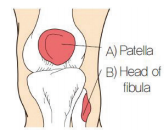
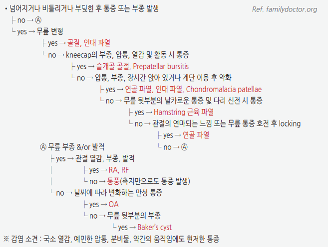
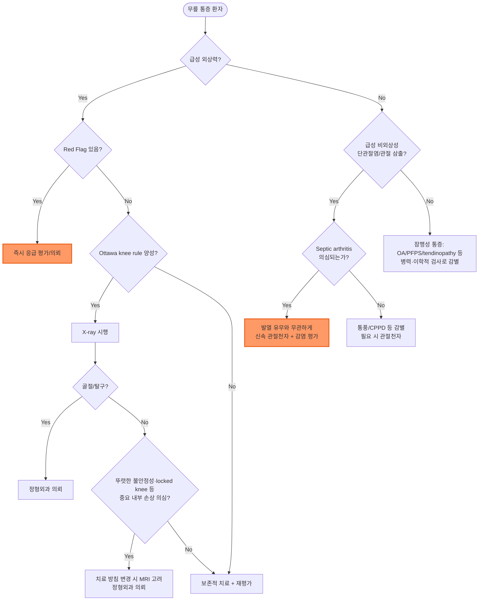

# 무릎 통증 Knee Pain

## <mark style="color:green;">일반 사항</mark>

* 외상, 과사용, 퇴행성 변화 등에 의한 관절 내(예: OA, RA) 또는 관절 주위(예: anserine bursitis, collateral ligament strain)의 급만성 통증, 만성 질환의 급성 악화, 또는 연관통(예: 고관절 질환)
* 무릎의 정상 운동 범위 : 0°(extension)\~135°(flexion)

***

## <mark style="color:green;">원인 및 위험 인자</mark>

* 외상 : 인대 손상, 반월연골 손상, 골절, 탈구, 윤활막염
* 과사용 : patellar tendinopathy, quadriceps tendinopathy, patellofemoral syndrome, bursitis, apophysitis
* 연령 관련 : 관절염, 퇴행성 변화, apophysitis(젊은 연령)
* 류마티스 질환 : RA, gout, pseudogout
* 감염 : septic arthritis, 골수염
* 연관통 : 고관절, 허리
* 혈관 질환 : 슬와동맥류, 심부정맥혈전증
* 기타 : 종양, 낭종, plica syndrome

#### <mark style="color:$primary;">위험 인자</mark>

* 비만
* 여성 — knee OA, patellofemoral pain, ACL injury 등 일부 질환에서 위험 증가
* 낮은 유연성
* malalignment
* 과거의 손상
* 근육 불균형 또는 약화
* 부적당한 신발, 바닥
* 부적당한 운동 방법
* 많거나 무리한 운동량, 빈도 증가
* 무리한 활동 : 점프, 회전, 가속, 감속, 무릎 구부림\
  ✽중등도의 규칙적 신체 활동군과 비활동군을 비교한 코호트에서 knee OA 발생 위험도에 유의한 차이가 없었다는 보고가 있음 — 적절한 강도의 운동 자체가 OA 위험을 높이지는 않음

***

### <mark style="color:$danger;">🚩 Red Flags!</mark>

<mark style="color:$danger;">**즉각 조치 또는 의뢰**</mark> <mark style="color:$danger;">- 생명·사지 위협 또는 즉각적 위해 가능성</mark>

* 개방성 골절 또는 개방창을 동반한 외상
* 명백한 변형·탈구 또는 신경혈관 손상 징후(원위부 맥박 소실, 창백, 심한 감각 저하) → 슬와동맥 손상, 구획증후군 의심
* 급성으로 발생한 심한 단관절 통증·종창·열감/발적, 현저한 수동 ROM 제한 또는 체중 부하 불가 → **발열 유무와 무관하게 septic arthritis 우선 배제**; 고령, 면역저하, 당뇨, 최근 관절주사/수술, 인공관절, 균혈증 위험이 있으면 의심 역치를 낮춤
* 급성 단측 하지 부종·통증과 함께 청색증·심한 부종(phlegmasia) 또는 흉통·호흡곤란 등 폐색전증 시사 소견 동반 → 즉각 응급 평가

<mark style="color:$warning;">**당일 또는 조기 의뢰**</mark>

* 급성 외상 후 뚜렷한 관절 불안정성(인대 완전 파열 의심)
* Ottawa knee rule 양성 소견(골절 배제를 위한 영상 검사 필요)
* 소아·청소년의 외상 후 관절 통증 — Salter-Harris physeal fracture 배제 필요
* 급속히 진행하는 큰 관절 혈종(hemarthrosis) — ACL 손상, 슬개골 탈구, 경골 고평부 골절 의심
* 급성 단측 하지 또는 종아리 부종·통증·열감/발적, DVT 위험 인자 동반(phlegmasia·폐색전증 시사 소견은 없음) → 심부정맥혈전증 의심; Wells score 저위험군은 D-dimer 음성으로 배제 가능하나, 중등도 이상 위험군에서는 D-dimer 단독으로 배제하지 않고 압박초음파 시행; Baker cyst 파열과 감별
* 외상 후 지속적으로 완전 신전이 되지 않는 true locked knee(displaced meniscal tear·관절 유리체 등 의심) — 통증으로 인해 일시적으로 움직이지 못하는 pseudolocking과 감별 필요 → 조기 정형외과 평가
* 야간통·체중 감소 등 전신 증상을 동반한 지속적 통증 → 종양 의심

<mark style="color:$info;">**외래 추적 / 추가 평가 계획**</mark> <mark style="color:$info;">- 즉각 위험 낮으나 호전 없으면 의뢰</mark>

* 표준 보존적 치료(4\~6주) 후에도 호전이 없는 경우
* 뚜렷한 외상 없이 서서히 진행하는 만성 통증·기능 제한

***

## <mark style="color:green;">진단</mark>

### <mark style="color:orange;">신체검사</mark>

✽[Knee anatomy](https://emedicine.medscape.com/article/1898986-overview), [Knee muscle(3D)](https://www.innerbody.com/image/musc09.html)

* 보통 supine position에서 hamstring muscle을 이완한 상태로 시행

#### <mark style="color:$primary;">기본 진찰(시진·촉진·ROM·신경혈관)</mark>

* gait : 파행, quadriceps avoidance gait(무릎을 완전히 펴지 않고 걷는 양상) 관찰
* 시진 : 부종, 발적, 변형, valgus/varus alignment, quadriceps 근위축 확인
* 관절 삼출 평가 : bulge sign(경도 삼출), patellar ballottement test(중등도 이상 삼출 시 슬개골이 뜨는 느낌)
* 능동/수동 ROM 및 관절선(joint line) 압통 촉진
* Straight-leg raise 및 extensor mechanism 평가 : 시행 불가 시 quadriceps/patellar tendon 파열, 슬개골 골절 등 extensor mechanism disruption 의심
* 원위부 맥박·감각 등 신경혈관 상태 확인
* 고관절 ROM 및 서혜부 압통 : 고관절 연관통 감별을 위해 항상 함께 평가
* 필요 시 발목·요추 진찰 병행

이후 아래의 유발 검사(provocative test)로 세부 진단을 좁혀나감.

#### <mark style="color:$primary;">Quadriceps angle (Q angle)</mark>

* [방법](https://www.aafp.org/afp/2003/0901/p907.html) : anterior superior iliac spine\~patella 중심의 가상선과 patella 중심\~tibial tuberosity의 가상선 사이 각도 측정
* 참고 범위 : 남성 약 10\~15°, 여성 약 15\~20°(측정 자세·검사자에 따라 편차가 큼); 단일 절단값의 진단 정확도는 낮아 **단독 진단 기준으로 사용하지 않고 patellar maltracking의 보조 소견으로 해석**
* 관련 상태 : 슬개골 불안정(quadriceps muscle의 강한 수축이 슬개골을 외측으로 당김)

#### <mark style="color:$primary;">Patellar apprehension test</mark>

* [방법](https://www.youtube.com/watch?v=0yez2vW1Mrc) : 무릎을 약간 굴곡시킨 상태에서 슬개골을 천천히 외측(lateral)으로 밀어 전위시킴; 환자가 슬개골이 빠질 것 같은 불안감을 호소하거나 quadriceps를 수축시켜 검사 동작을 저지하려 하면 양성
* 관련 상태 : 슬개골 불안정, 이전 외측 슬개골 탈구 병력 시사

#### <mark style="color:$primary;">Anterior drawer test</mark>

* [방법](https://www.youtube.com/watch?v=IdnBKv38EEQ) : 무릎을 90° 굴곡시키고 발바닥을 바닥에 붙인 상태에서, 양손으로 tibia를 잡고(엄지손가락은 tibial tubercle에 위치) tibia를 앞으로 당김; 반대쪽보다 많이 움직이면 양성
* 관련 상태 : ACL 손상

#### <mark style="color:$primary;">Lachman test</mark>

* [방법](https://www.youtube.com/watch?v=JFkbKNNa7xQ) : 무릎을 30° 굴곡시키고, 한 손은 thigh를, 다른 손은 tibia를 잡고(엄지손가락은 tibial tuberosity에 위치) tibia를 앞으로 당김; tibia가 명확한 endpoint 없이 움직이면 양성(반대쪽과 비교)
* 관련 상태 : ACL 손상

#### <mark style="color:$primary;">Pivot shift test</mark>

* [방법](https://www.youtube.com/watch?v=2TPfLOcxbTI) : 다리를 펴고 누운 상태에서 양손으로 tibia를 약간 내회전 상태로 잡고, 무릎을 천천히 굴곡시키면서 axial load와 valgus stress를 가함; 20\~40° 굴곡에서 "clunk"(부딪히는 둔탁한 소리) 또는 "glide"가 나면 양성
* 관련 상태 : ACL 손상

#### <mark style="color:$primary;">Posterior drawer test</mark>

* [방법](https://www.youtube.com/watch?v=AiHpMqqLgkI) : 무릎을 90° 굴곡시키고 발바닥을 바닥에 붙인 상태에서, 양손으로 tibia를 잡고 뒤로 움직임; 반대쪽보다 많이 움직이면 양성
* 관련 상태 : PCL 손상

#### <mark style="color:$primary;">Posterior sag sign</mark>

* [방법](https://www.youtube.com/watch?v=7vgTMnfP4fs) : 하지를 이완한 상태에서 엉덩이와 무릎을 각각 90° 굴곡시킴(종아리·발뒤꿈치를 받치거나, 발을 바닥에 붙이고 엉덩이 45°·무릎 90° 굴곡); femur에 대해 tibia가 처져 있으면 양성(반대쪽과 비교)
* 관련 상태 : PCL 손상

#### <mark style="color:$primary;">Valgus\[Varus] stress test</mark>

* 방법 : 한 손으로 tibia 원위부 안쪽\[바깥쪽]을 잡고, 다른 손으로 무릎 바깥쪽\[안쪽]을 잡아 무릎에 내측\[외측]으로 압력을 가함, 무릎 신전 및 30° 굴곡(unlocked) 상태에서 각각 시행; 정상보다 많이 움직이거나 명확한 endpoint 없이 움직이면 양성(반대쪽과 비교) ([valgus test](https://www.youtube.com/watch?v=GSFbttpxCuQ), [varus test](https://www.youtube.com/watch?v=sg1gk6QKARw))
* 관련 상태 : valgus stress test 양성 — MCL 손상; varus stress test 양성 — LCL 손상

#### <mark style="color:$primary;">McMurray test</mark>

* [방법](https://www.youtube.com/watch?v=lwDFPAyGGgI) : 한 손으로 무릎을, 다른 손으로 발을 잡고 무릎을 최대한 굴곡시킨 후 다리를 내회전 또는 외회전시키면서 무릎을 폄; 통증과 함께 "딸깍" 또는 "뻑" 소리가 나거나 통증 발생 시 양성
* 관련 상태 : 외측 반월연골(내회전 시 양성), 내측 반월연골(외회전 시 양성) 손상

#### <mark style="color:$primary;">Thessaly test</mark>

* 방법 : 약 20° 무릎 굴곡 상태에서 환자가 한 발로 서서 몸통과 무릎을 내·외회전시킴; joint-line pain, catching, locking감이 재현되면 양성
* 관련 상태 : meniscal tear 의심 — 초기 연구는 높은 정확도를 보고했으나 이후 독립적 검증 연구에서는 재현되지 않아(민감도 약 0.6\~0.66, 특이도 약 0.4\~0.53) McMurray test·관절선 압통과 함께 보조적으로 해석하며 단독으로 확진·배제하지 않음; 급성 통증·불안정이 심하면 시행이 어려울 수 있음

#### <mark style="color:$primary;">Clarke's test (Patellar grind test)</mark>

* [방법](https://www.youtube.com/watch?v=Y3mKHgg6JoU) : 무릎을 펴게 하고 슬개골 바로 위에 손의 web space를 위치시켜 하방으로 약간의 압력을 가한 상태에서 환자가 quadriceps를 수축시킴; patellofemoral joint에 통증 발생 시 양성(양측 비교)
* 관련 상태 : PFPS, OA — 단, PFPS를 단독으로 확진하거나 배제하기에는 진단 정확도가 낮아 보조적으로 해석

#### <mark style="color:$primary;">Ober test</mark>

* [방법](https://www.youtube.com/watch?v=Amjv6FzDeLE) : 옆으로 눕히고 무릎을 받쳐 굴곡시키고 고관절을 외전·신전시킴. 골반을 안정화한 상태에서 무릎을 받친 손을 내려 고관절을 서서히 내전시킴; 대퇴가 중립선까지 충분히 내려가지 않고 외전된 상태로 남으면 양성
* 관련 상태 : IT band/TFL tightness. 무릎 외측 통증이 동반될 수 있으나, **통증 유발 자체가 양성 기준은 아님**

#### <mark style="color:$primary;">Dial test</mark>

* [방법](https://www.youtube.com/watch?v=3UGffd71KyI) : 엎드린 상태에서 무릎을 30° 굴곡시키고 양발을 잡아 발뒤꿈치를 모으고 힘을 가해 최대한 외회전시킨 뒤 양쪽 발의 각도(foot-thigh angle)를 비교. 무릎을 90° 굴곡시켜 다시 비교(supine position에서도 시행 가능); 한쪽이 반대쪽보다 10° 이상 외회전되면 양성
* 관련 상태 : 30°에서 외회전 증가가 두드러지면 PLC(postero-lateral corner, fibular collateral ligament·popliteus tendon·popliteofibular ligament 등을 포함하는 구조) 손상을 시사하며, 30°와 90° 모두에서 증가하면 PCL 동반 손상을 고려. 검사 결과를 손상 구조와 1:1로 단정하지 않고 다른 불안정성 검사와 함께 해석

### <mark style="color:orange;">실험실 검사</mark>

* arthrocentesis : **septic arthritis 의심 시 가능한 한 신속히 시행**하여 관절액 세포수·감별계산, Gram stain/배양, 결정 검사를 시행; gout, pseudogout 의심 시에도 진단에 유용
  * sepsis/septic shock 상태가 아니라면 가능한 한 항생제 투여 전에 관절액을 채취하여 배양 위음성을 줄임; sepsis가 있다면 검체 채취 때문에 항생제 투여를 지연시키지 않음
  * 결정(요산나트륨/CPPD)이 확인되어도 septic arthritis의 동시 감염 가능성을 완전히 배제하지 않음
* CBC, ESR, CRP : 감염·염증성 관절염 평가에 보조적으로 사용하되 정상이라고 septic arthritis를 배제할 수 없음; RF/anti-CCP는 RA 의심 시 고려

### <mark style="color:orange;">영상 검사</mark>

* Plain radiography : 급성 외상에서는 Ottawa knee rule 등 골절 가능성에 따라 시행; 만성 통증에서는 OA·골병변 평가의 초기 영상으로 고려
* MRI without contrast : 임상적으로 의미 있는 ACL/PCL·반월연골·osteochondral lesion 등 내부 구조 손상이 의심되고 **검사 결과가 치료 방침을 변경할 경우**, 또는 적절한 보존적 치료 후에도 mechanical symptom·불안정성이 지속될 때 고려. 단순 OA 또는 비특이적 만성 통증의 초기 검사로 일률적으로 시행하지 않음
* 초음파 : tendon·bursa·Baker cyst 등 표재성 연부조직 병변 평가에 유용
* CT : 골절 또는 골성 병변에 대한 추가 평가
* arthroscopy : 단순 진단 목적으로 일률적으로 시행하지 않으며, 수술적 치료 적응증이 있는 반월연골·인대·유리체 병변 등에서 치료와 함께 시행; OA의 lavage/debridement 단독 목적으로는 권고하지 않음

#### <mark style="color:$primary;">The Ottawa knee rule</mark>

* 무릎의 급성 손상 후 다음 중 하나 이상에 해당하면 골절 배제를 위해 영상 검사 시행(민감도 약 98\~100%, 특이도 약 30\~50%)
  1. ≥55세
  2. patella의 isolated tenderness(무릎 다른 부위의 골 압통은 없음)
  3. fibula head의 tenderness
  4. 90° 무릎 굽힘 불가능
  5. 체중 부하(수상 현장과 응급실에서 각각 4걸음 보행) 불가능

<div align="left"><figure><figcaption></figcaption></figure></div>

<p align="center"><strong>The Ottawa knee rule</strong></p>

<p align="center"><em><mark style="color:$info;">Ref. Stiell IG, et al. Use of radiography in acute knee injuries: need for clinical decision rules. Acad Emerg Med. 1995;2(11).</mark></em></p>

### <mark style="color:orange;">감별 진단</mark>

#### <mark style="color:$primary;">통증 부위별</mark>

* 광범위 : OA
* 전방부 통증 : patellofemoral pain syndrome(PFPS), chondromalacia patellae(슬개골 관절연골의 구조적 병변), patellar tendinopathy(Jumper's knee), 슬개골 탈구/아탈구, pre/suprapatellar bursitis, tibial apophysitis(Osgood-Schlatter lesion), fat pad impingement, quadriceps tendinopathy
* 내측부 통증 : medial collateral ligament(MCL) sprain, medial meniscal tear, pes anserine bursitis, medial plica syndrome
* 외측부 통증 : lateral collateral ligament(LCL) sprain, lateral meniscal tear, iliotibial band syndrome
* 후방부 통증 : popliteal cyst(Baker's cyst), posterior cruciate ligament(PCL) injury, meniscal posterior horn injury, popliteal aneurysm, hamstring 또는 gastrocnemius injury, deep vein thrombosis

#### <mark style="color:$primary;">발병 양상(Onset, Duration)</mark>

* 급성 외상성 : 골절, 타박, 인대 손상, 반월연골 손상, 슬개골 탈구/아탈구
* 급성 비외상성 염증성 단관절염 : septic arthritis, gout, CPPD, 골수염 — 발열·오한 등 전신 증상이 있으면 감염 가능성이 높아지지만, 없다고 septic arthritis를 배제할 수 없음
* 잠행성 : OA, PFPS, chondromalacia, iliotibial band syndrome, RA, 점액낭염, tendinopathy, loose body, bipartite patella, 퇴행성 반월연골 파열, 종양

#### <mark style="color:$primary;">손상 기전</mark>

* 무릎 굴곡 상태에서 전방 근위 경골에 후방으로 향하는 힘이 가해져 tibia가 femur에 대해 posterior translation됨(예: 넘어짐, dashboard injury) : PCL 손상
* 과신전 : ACL, PCL 손상
* 측면 충격 : valgus load(예: 운동 중 외측면 가격) — MCL 손상; varus load — LCL 손상
* 서 있는 자세에서의 회전, 급작스러운 방향 전환 : 반월연골 손상
* 급작스러운 감속, cutting, 회전 : ACL 손상

#### <mark style="color:$primary;">부종</mark>

* 빠른 진행(2시간 이내), 크고 팽팽한 삼출 : ACL 손상, 슬개골 탈구(아탈구 시에도 발생 가능), tibial plateau 골절·osteochondral fracture
* 서서히 진행(24\~36시간)하는 적은 부종 : 반월연골 손상, 염좌
* 활동 후 재발하는 부종 : 반월연골 손상
* 무릎 뒤 부종 : popliteal cyst(Baker's cyst)
* prepatellar 부종 : bursitis
* bony swelling : OA, neuropathic arthropathy

#### <mark style="color:$primary;">악화 또는 완화 요인</mark>

* 계단 오를 때 통증 : 슬개대퇴 관절 질환(예: OA, PFPS)
* 계단 오르내릴 때 통증 : 반월연골 손상, PFPS
* 오래 앉아 있을 때 또는 앉았다 일어설 때 통증(theater sign) : PFPS

#### <mark style="color:$primary;">증상/병력에 따른 감별</mark>

<figure><figcaption></figcaption></figure>

#### <mark style="color:$primary;">질환별 특징</mark>

<table><thead><tr><th width="180">질환</th><th width="230">병력</th><th width="260">신체검사</th><th>실험실 검사</th></tr></thead><tbody><tr><td>만성 염증성 관절염(예: RA)</td><td>지속적인 조조강직(흔히 30~60분 이상) 및 다관절성 염증 증상</td><td>여러 관절의 부종 또는 압통(다관절성)</td><td>ESR/CRP 상승, RF/anti-CCP 양성 가능</td></tr><tr><td>통풍 또는 가성통풍</td><td>급성 발생, 호발 관절(제1중족지, 무릎 등) 침범 과거력</td><td>관절의 심한 부종·발적·압통</td><td>관절액 결정 확인(요산나트륨/CPPD), 백혈구 증가</td></tr><tr><td>고관절염(연관통)</td><td>고관절 회전 시 무릎으로 방사되는 통증</td><td>고관절 회전 시 통증, 서혜부 압통</td><td>—</td></tr><tr><td>PFPS</td><td>상대적으로 젊은 나이, squatting·계단·오래 앉기 등에서 악화되는 retropatellar/peripatellar pain</td><td>슬개대퇴 관절 위 압통</td><td>—</td></tr><tr><td>Anserine bursitis</td><td>—</td><td>관절선보다 원위부인 관절선 하방 2~5 cm 근위 경골 내측 압통(관절선 자체의 압통과 감별)</td><td>—</td></tr><tr><td>Trochanteric bursitis</td><td>엉덩이 외측 통증</td><td>대퇴골 대전자 부위 압통</td><td>—</td></tr><tr><td>Iliotibial band syndrome</td><td>—</td><td>장경인대 부위 압통, Ober test 양성</td><td>—</td></tr><tr><td>골 병변(종양, 골수염 등)</td><td>야간통 또는 지속적 통증, 체중 감소 등 전신 증상 동반 가능</td><td>국소 압통, 종괴 촉지 가능</td><td>ESR/CRP 상승 가능, 영상 검사상 이상 소견</td></tr><tr><td>Meniscal tear</td><td>물리적 증상 우세(knee buckling 또는 locking)</td><td>무릎 관절선 압통, McMurray test 양성</td><td>MRI에서 반월연골 손상 소견</td></tr><tr><td>ACL tear</td><td>급격한 감속·착지·회전·직접 충격; 손상 당시 "펑" 소리</td><td>Lachman test 양성(가장 민감), anterior drawer test·pivot shift test 양성</td><td>MRI에서 전방십자인대 손상 소견</td></tr></tbody></table>

_<mark style="color:$info;">Ref. Felson DT. Clinical practice. Osteoarthritis of the knee. N Engl J Med 2006;354:841-8.</mark>_


**ACL tear — 대표적 급성 무릎 손상의 예**\
급격한 감속·착지·회전이나 직접 충격으로 발생하며, 여성이 남성보다 약 3배 호발하고 16\~18세 청소년기에 특히 흔함. 급성기에는 심한 통증·부종과 함께 손상 당시 "펑" 소리를 느끼는 경우가 많고, 만성기에는 불안정감과 함께 고관절·슬관절을 완전히 펴지 않고 걷는 quadriceps avoidance gait가 나타날 수 있음. Lachman test가 가장 민감한 검사이며, 병력과 신체검사만으로도 임상적 진단이 가능함; 진단이 불확실하거나 동반 손상(반월연골·연골·다른 인대) 평가 및 수술 계획이 필요한 경우 MRI를 시행함. 치료는 활동 수준·연령·동반 손상에 따라 보존적 치료 또는 재건술을 고려하며, 수술적 재건 후 스포츠 복귀까지 보통 9\~12개월이 소요됨 (☞ 정형외과 의뢰).


***



<p align="center"><strong>무릎 통증 초기 평가 알고리듬</strong></p>

<p align="center"><em><mark style="color:$info;">Ref. Ottawa knee rule(Stiell IG, et al. Acad Emerg Med 1995) 및 표준 무릎 통증 평가 원칙을 종합함</mark></em></p>

***

## <mark style="background-color:$warning;">Management</mark>

### <mark style="color:orange;">치료 방침</mark>

* 급성 손상에서는 초기 통증을 유발하는 활동을 줄이고 필요 시 Compression·Elevation 및 진통 치료를 병행하되, 장기간 완전 안정은 피하고 통증이 허용하는 범위에서 조기에 관절 운동과 단계적 체중부하를 재개(PEACE & LOVE 개념)
  ✽냉찜질은 통증·부종의 단기 완화 목적으로 필요 시 1회 15\~20분 시행할 수 있으나 조직 치유 자체에 대한 근거는 확립되어 있지 않으며, 과도한 안정보다 조기 활동 복귀·점진적 부하가 강조됨
* 만성 통증에 대한 약물 투여 시 장기 투여에 따른 부작용을 감안
* 척추, 고관절, 발의 문제가 동반된 경우 함께 치료
* 테이핑, IMS, 도수치료, 침, 마사지, 레이저치료, 체외충격파치료 : 질환별로 근거 수준이 상이하며(예: 체외충격파치료는 patellar tendinopathy에서 근거가 상대적으로 더 확립됨), 특정 적응증에서 보조적으로 고려

***

## <mark style="color:green;">비-약물 치료 및 예방</mark>

* 환자 교육 및 self-management 지원 — 질환 경과와 치료 목표에 대한 이해를 높임
* 규칙적인 운동 및 근력 강화 : OA 비약물 치료의 핵심 축[ACR/AF 2019, AAOS 2021]; 지나친 운동은 피하며 스트레칭, 요가, 필라테스, 수중운동 등 유연성·균형 운동 병행
* 과체중·비만인 경우 체중 감량 : 5\~10% 이상 감량 시 통증·기능에 유의한 호전 보고(IDEA trial, JAMA 2013)
* bracing(안정이 필요한 경우), 지팡이 사용 — 통증·기능 개선에 도움 [AAOS 2021]
* 생활 환경 조절 : 높은 의자, 변기 좌석 높이기 사용

***

## <mark style="color:green;">약물 치료</mark>

_✽아래 용량은 대표적 예시이며, 실제 처방은 환자의 연령·동반질환·신장/간기능 등 임상 상황에 따라 조정이 필요함_

### <mark style="color:orange;">경구제</mark>

* acetaminophen : 650\~1,000 ㎎ tid prn <mark style="color:blue;">\[타이레놀]</mark> — knee OA에서는 일반적으로 최대 3,000 ㎎/day; 간질환·과음·고령 등에서는 더 낮은 용량 고려; 8시간 지속형 서방정 사용 시 <mark style="color:blue;">\[타이레놀8시간이알서방정]</mark> 650 ㎎/T 2T q8h(24시간 6T 초과 금지) 용법을 따름(2018년 허가사항 개정으로 제품명에 '8시간' 표기가 추가됨)
* ibuprofen : 200\~800 ㎎ tid <mark style="color:blue;">\[부루펜]</mark>
* naproxen : 250 ㎎ tid\~500 ㎎ bid <mark style="color:blue;">\[낙센]</mark>
* celecoxib : OA에 적용, 상대적으로 적은 GI 부작용; 200 ㎎ qd <mark style="color:blue;">\[쎄레브렉스]</mark>
* tramadol 또는 opioid : 급성 근골격계 손상의 일상적 1차 치료로 권고하지 않음; NSAID·acetaminophen 등에 비해 추가 이득이 제한적이고 부작용·의존 및 지속 사용 위험이 있어, 중증 외상성 통증 등 선택된 경우에만 단기간 고려 [ACP/AAFP 2020]
* clematis 추출물(SKI306X) : 일부 OA, RA에서 증상 완화 효과; 200 ㎎ tid <mark style="color:blue;">\[조인스]</mark>


**보조 요법(강황, 생강 추출물, glucosamine, chondroitin, Vit D)**\
경도\~중등도 knee OA에서 통증 감소·기능 향상에 도움이 될 수 있다는 보고가 있으나 근거가 일관되지 않음. AAOS(2021)는 "도움이 될 수 있는 보조 옵션"으로 조건부 언급하는 반면, ACR/Arthritis Foundation(2019)은 glucosamine·chondroitin(단독 또는 병합)의 사용을 **강력히 권고하지 않음** — 가이드라인 간 근거·권고가 상반되므로, **사용 전 환자와 기대 효과·비용·근거의 한계에 대해 충분히 상의**한 후 결정



**⚠️ NSAID 장기 사용 시 주의**\
고용량·장기간 NSAID 사용이 골유합에 영향을 줄 가능성이 보고되어 있으므로 골유합이 중요한 환자에서는 불필요한 장기·고용량 사용을 피함. 단기간 사용이 임상적으로 골유합을 지연시키는지는 불확실하므로, 필요 시 최소 유효 용량을 최단 기간 사용


### <mark style="color:orange;">국소제</mark>

(☞ [급여기준](https://www.hira.or.kr/rc/insu/insuadtcrtr/InsuAdtCrtrPopup.do?mtgHmeDd=20181201\&sno=1\&mtgMtrRegSno=0031))

* knee OA에서는 전신 노출과 부작용을 줄이기 위해 국소 NSAID를 경구 NSAID보다 우선 고려할 수 있음 [AAOS 2021, ACR/AF 2019]. 다만 근거는 제형·성분에 따라 차이가 있으므로 국내 파스형 제제를 diclofenac gel 등의 근거와 완전히 동일하게 일반화하지 않음
* ketoprofen <mark style="color:blue;">\[케토톱 플라스타/겔]</mark>
* piroxicam <mark style="color:blue;">\[트라스트 패취/겔]</mark>
* capsaicin : 감각 신경 말단의 탈감작 효과; 효과 발현까지 2주 이상 소요; 초기에 심한 작열감·발적 부작용; 0.075% cream qid <mark style="color:blue;">\[다이악센]</mark>

***

## <mark style="color:green;">시술 및 기타 처치</mark>

(☞ [골관절염](135_-osteoarthritis-oa.md#undefined-32))

* steroid 관절 내 주사 : 단기 통증 완화 효과. 반복 주사의 적정 횟수에 대한 확립된 근거는 없으며 잦은 장기 반복은 피함. 이 책에서는 **보수적 실무 기준으로 동일 관절 연 2회 이내**를 원칙으로 제시하되, 가이드라인에서 정한 절대적 상한은 아님 <mark style="color:blue;">\[트리암시놀론]</mark>
* hyaluronic acid(HA) 관절 내 주사(viscosupplementation) : OA에서 통증 감소·기능 향상 보고가 있으나, knee OA 환자에서의 일률적 사용은 권고하지 않음 [AAOS 2021]; ACR/AF(2019)도 사용에 조건부 반대 — **표준 1차 치료로 확립된 것은 아니므로 개별 상담 후 선택** <mark style="color:blue;">\[히루안 플러스]</mark>(1회/주 ×3주), <mark style="color:blue;">\[시노비안 주]</mark>
* polynucleotide(PN) 관절 내 주사 : Kellgren-Lawrence grade I\~III의 슬관절 골관절염에 사용. 급여 인정 횟수, 타 관절강내 주사제·치료재료와의 동시 투여 제한 및 본인부담률은 관련 고시의 집행정지 등으로 변경될 수 있으므로 **처방 시 최신 HIRA 급여기준 확인** <mark style="color:blue;">\[콘쥬란]</mark>
* platelet-rich plasma(PRP) 관절 내 주사 : symptomatic knee OA에서 통증·기능 개선에 도움이 될 수 있으나 제제(leukocyte-rich vs -poor)·제조법과 연구 간 이질성이 큼. **AAOS 2021은 제한적 근거(Limited recommendation)로 긍정적 권고**를 제시하나, ACR/AF 2019는 표준화 부족 등을 이유로 강하게 반대하여 가이드라인 간 견해가 상이함 — **표준 치료가 아니므로 시행 전 개별 상담 필요**
* botulinum toxin A 연조직 내 주사 : 일부 PFPS에서 유효 보고

### <mark style="color:orange;">무릎 OA 약물·시술에 대한 주요 가이드라인 권고 비교</mark>

<table><thead><tr><th width="150"></th><th width="260">권고(사용)</th><th>비권고 또는 조건부 반대</th></tr></thead><tbody><tr><td>ACR/AF (2019)</td><td>국소·경구 NSAID(강력 권고), 관절 내 스테로이드 주사(강력 권고), acetaminophen·duloxetine·tramadol·국소 capsaicin(조건부)</td><td>glucosamine, chondroitin(강력 반대), HA 관절 주사(조건부 반대), PRP 관절 주사(강력 반대)</td></tr><tr><td>AAOS (2021, 3rd ed.)</td><td>국소 NSAID, 운동/재활, brace, cane; PRP는 통증·기능 개선 가능성에 대해 제한적 근거(Limited recommendation)</td><td>외측 쐐기 깔창(비권고), HA 관절 주사 일률적 사용(비권고), lavage/debridement 단독 관절경(비권고)</td></tr></tbody></table>

_<mark style="color:$info;">Ref. Kolasinski SL, et al. 2019 ACR/AF Guideline for OA of the Hand, Hip, and Knee. Arthritis Rheumatol 2020;72:220-33. / Brophy RH, Fillingham YA. AAOS CPG Summary: Management of OA of the Knee (Nonarthroplasty), 3rd ed. J Am Acad Orthop Surg 2022;30:e721-9.</mark>_

***

### <mark style="color:red;">질병코드</mark>

M17 무릎관절증

M23 무릎의 내부장애

M25.56 관절통, 아래다리

M76.5 무릎뼈힘줄염

S83 무릎의 관절 및 인대의 탈구, 염좌 및 긴장

***

## <mark style="color:purple;">처방례</mark>

> **처방례 1. 급성 경도 손상(타박·염좌, 불안정 소견 없음)**
>
> ```
> 타이레놀8시간이알서방정 650 ㎎/T  2T  q8h (24시간 내 6T 초과 금지)
> 케토톱 엘 플라스타 7매/포  1일 1회 부착
> ```
>
> _✽초기 통증 유발 활동을 줄이고 필요 시 냉찜질·압박·거상을 병행하되 장기간 완전 안정은 피함; 48\~72시간 후에도 부종·통증이 지속되거나 관절 불안정 소견이 있으면 재평가_

> **처방례 2. 급성 중등도\~중증 손상(관절 삼출·불안정 의심)**
>
> ```
> 부루펜 400 ㎎/T  1T  tid  pc
> 케토톱 엘 플라스타 7매/포  1일 1회 부착
> ```
>
> _✽큰 관절 삼출, 뚜렷한 불안정성 또는 수술적 치료가 필요한 인대·반월연골 손상이 의심되고 검사 결과가 치료 방침을 바꿀 경우 MRI 및 정형외과 의뢰를 고려; tramadol/opioid는 효과 대비 위해·의존 및 지속 사용 위험 때문에 일상적 1차 치료로 권고하지 않음_

> **처방례 3. 만성 슬관절염(OA), 경도\~중등도 — 국소 치료 우선**
>
> ```
> 케토톱 엘 플라스타 7매/포  1일 1회 부착
> 조인스 2T  #2 (효과가 있는 경우 유지)
> ```
>
> _✽전신 부작용을 줄이고자 하는 경우 국소 NSAID를 우선 고려[AAOS 2021, ACR/AF 2019]. 다만 국소 NSAID의 근거는 성분·제형에 따라 차이가 있으며, clematis 추출물은 반응이 있는 환자에서만 유지_

> **처방례 4. 만성 슬관절염(OA), 경구 NSAID 필요 시**
>
> ```
> 쎄레브렉스 200 ㎎/C  1C  qd
> ```
>
> _✽NSAID가 필요한 환자에서 선택 가능한 경구 NSAID 중 하나. GI 위험이 높고 심혈관·신장 위험이 허용되는 경우 celecoxib를 고려하며, 가능한 최소 유효 용량·최단 기간 사용_

> **처방례 5. 급성 통풍성 관절염 발작(무릎)**
>
> ```
> 콜킨 0.6 ㎎/T  2T  즉시 복용 후 1시간 뒤 1T 추가
> 마지막 복용 후 12시간 경과 뒤부터 0.6 ㎎  qd\~bid  증상 호전 시까지
> ```
>
> _✽저용량 colchicine 요법(로딩 총 1.8 ㎎ → 마지막 복용 12시간 후부터 유지 용량 재개; FDA 라벨 기준). NSAID 또는 단기 경구 스테로이드도 동등한 1차 대안임[ACR 2020]. 신기능 저하 시 용량 조절 및 강한 CYP3A4/P-gp 억제제(클래리스로마이신 등)와 병용 주의. 진단 확진을 위해 가능하면 관절천자로 요산나트륨 결정 확인 권고; 재발성이거나 진단이 불확실하면 류마티스내과 의뢰_

***

### <mark style="color:$success;">핵심 복약 지도</mark>

> **NSAID(경구/국소) 사용 원칙**
>
> * 최소 유효 용량을 최단 기간 사용; 위장관·신장·심혈관 위험 인자가 있는 환자는 celecoxib 또는 국소 NSAID를 우선 고려
> * 골유합이 중요한 환자에서는 불필요한 고용량·장기간 사용을 피함; 단기간 사용이 임상적 골유합 지연을 일으키는지는 불확실
> * 국소제는 도포 후 손을 씻고, 도포 부위에 열찜질·밀봉 드레싱을 하지 않도록 안내

> **관절 내 스테로이드 주사**
>
> * 효과는 대개 수주\~수개월로 제한적. 반복 주사의 적정 횟수에 대한 확립된 근거는 없으며, 본서에서는 보수적 실무 기준으로 동일 관절 연 2회 이내를 원칙으로 제시함(가이드라인의 절대적 상한은 아님)
> * 주사 후 1\~2일간 국소 통증이 악화될 수 있음(주사 후 통증, post-injection flare)을 미리 안내

> **히알루론산(HA) 관절 주사**
>
> * 모든 knee OA 환자에게 일률적으로 권장되지는 않으므로, 스테로이드 주사·경구 치료에 반응이 부족한 환자에서 개별적으로 상의 후 결정
> * 제품에 따라 1회 또는 주 1회 ×3회 등 투여 스케줄이 다르므로 처방 전 확인

> **급성 손상 시 자가 관리 지도**
>
> * 통증을 유발하는 활동은 초기에 줄이되, 장기간 완전히 움직이지 않는 것은 피하도록 안내(PEACE & LOVE 개념)
> * 냉찜질은 통증·부종 완화 목적으로 필요 시 1회 15\~20분 시행할 수 있으며, 압박·거상을 함께 지도
> * 통증이 허용하는 범위 내에서 조기에 관절 운동과 단계적 체중부하를 늘려가도록 안내

> **언제 다시 병원을 방문해야 하나요?**
>
> * 발열 유무와 관계없이 갑자기 무릎이 심하게 붓고 아프며 움직이기 어렵거나 체중을 싣기 힘든 경우 — 즉시 내원
> * 무릎을 완전히 펴거나 구부릴 수 없는 경우(감돈 의심) — 즉시 내원
> * 다리에 힘이 빠지거나 감각이 이상해지는 경우, 발이 창백해지거나 맥박이 약해지는 경우 — 즉시 내원
> * 보존적 치료 4\~6주 후에도 통증·기능 제한이 호전되지 않는 경우

***

### <mark style="color:blue;">환자 안내서</mark>


**무릎 통증, 원인에 따라 치료가 달라집니다**

무릎 통증은 다친 직후 생긴 급성 통증부터, 오랜 기간 서서히 나타나는 관절염성 통증까지 원인이 매우 다양합니다. 원인에 맞는 치료를 받는 것이 중요하며, 특히 다친 직후에는 초기 대처가 회복 속도에 큰 영향을 줍니다.


#### <mark style="color:$primary;">왜 무릎이 아픈가요?</mark>

* 갑자기 다쳐서 생기는 경우 : 인대·반월연골(물렁뼈) 손상, 골절, 탈구 등
* 오래 써서 서서히 생기는 경우 : 연골이 닳는 퇴행성 관절염(OA), 무릎뼈 주변의 염증, 힘줄염 등
* 무릎 자체가 아니라 엉덩관절이나 허리 문제가 무릎으로 뻗쳐 아플 수도 있습니다

#### <mark style="color:$primary;">다쳤을 때는 어떻게 해야 하나요?</mark>

* **다친 직후 1\~3일은 통증을 유발하는 활동을 줄이십시오.** 다만 장기간 완전히 움직이지 않는 것은 오히려 회복에 도움이 되지 않으니 피하십시오.
* **얼음찜질을 하십시오.** 하루 여러 차례, 한 번에 15\~20분 정도가 적당합니다.
* **탄력 붕대로 가볍게 압박하고, 다리를 심장보다 높게 올려두십시오.** 붓기를 줄이는 데 도움이 됩니다.
* 통증이 허용하는 범위에서 가능한 한 일찍 움직임을 늘려가되, 무리하지 않도록 하십시오.

#### <mark style="color:$primary;">일상생활에서 어떻게 관리하나요?</mark>

* **적정 체중을 유지하십시오.** 체중이 늘수록 무릎에 실리는 부담이 커집니다.
* **무리하지 않는 규칙적인 운동을 하십시오.** 걷기, 수영, 자전거 타기처럼 무릎에 부담이 적은 운동이 좋으며, 넙다리 근육(허벅지 근육)을 강화하면 무릎이 더 안정됩니다.
* **점프, 급회전, 급정지가 많은 운동은 부상 위험이 높으므로 준비운동을 충분히 하십시오.**
* 통증이 있을 때는 높은 의자를 사용하거나 변기 좌석을 높이면 무릎에 가해지는 부담을 줄일 수 있습니다.

#### <mark style="color:$primary;">약은 어떻게 써야 하나요?</mark>

* 처방받은 진통소염제는 정해진 용량과 기간을 지켜 복용하십시오.
* 바르는 소염제(파스, 겔)는 먹는 약보다 전신 부작용이 적어 먼저 시도해볼 수 있습니다.
* 관절 주사(스테로이드, 히알루론산 등)는 효과와 한계가 있으므로 담당 의사와 상의하여 결정하십시오.

#### <mark style="color:$primary;">이럴 때는 즉시 병원을 방문하세요</mark>

* 열이 없더라도 무릎이 갑자기 심하게 붓고 아프며 움직이기 어렵거나 체중을 싣기 힘든 경우
* 무릎을 다친 후 모양이 변형되었거나, 전혀 움직일 수 없는 경우
* 다리가 갑자기 부으면서 붉어지고 열감이 느껴지는 경우
* 발이 창백해지거나 저리고, 맥박이 약하게 느껴지는 경우
* 보존적 치료를 4\~6주 이상 받아도 증상이 호전되지 않는 경우
