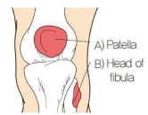
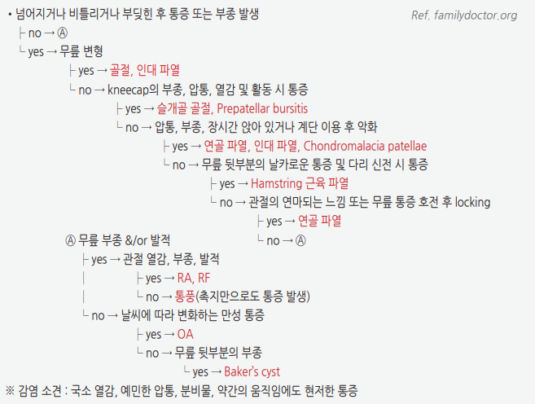

# 무릎 통증 Knee Pain

## <mark style="color:green;">일반 사항</mark>

* 외상, 과사용, 퇴행성 변화 등에 의한 관절 내(예: OA, RA) 또는 관절 주위(예: anserine bursitis, collateral ligament strain)의 급만성 통증, 만성 질환의 급성 악화, 또는 연관통(예: 고관절 질환)
* 무릎의 정상 운동 범위 : 0°(extension)\~135°(flexion)

***

## <mark style="color:green;">원인 및 위험 인자</mark>

* 외상 : 인대 손상, 반월연골 손상, 골절, 탈구, 윤활막염
* 과사용 : patellar tendinopathy, quadriceps tendinopathy, patellofemoral syndrome, bursitis, apophysitis
* 연령 관련 : 관절염, 퇴행성 변화, apophysitis(젊은 연령)
* 류마티스 질환 : RA, gout, pseudogout
* 감염 : septic arthritis, 골수염
* 연관통 : 고관절, 허리
* 혈관 질환 : 슬와동맥류, 심부정맥혈전증
* 기타 : 종양, 낭종, plica syndrome

#### <mark style="color:$primary;">위험 인자</mark>

* 비만
* 여성 - knee OA, patellofemoral pain, ACL injury 등 일부 질환에서 위험 증가
* 낮은 유연성
* malalignment
* 과거의 손상
* 근육 불균형 또는 약화
* 부적당한 신발, 바닥
* 부적당한 운동 방법
* 많거나 무리한 운동량, 빈도 증가
* 무리한 활동 : 점프, 회전, 가속, 감속, 무릎 구부림\
  ✽중등도의 규칙적 신체 활동군과 비활동군을 비교한 코호트에서 knee OA 발생 위험도에 유의한 차이가 없었다는 보고가 있음 - 적절한 강도의 운동 자체가 OA 위험을 높이지는 않음

***

### <mark style="color:$danger;">🚩 Red Flags!</mark>

<mark style="color:$danger;">**즉각 조치 또는 의뢰**</mark> <mark style="color:$danger;">- 생명·사지 위협 또는 즉각적 위해 가능성</mark>

* 개방성 골절 또는 관절강과의 연결이 의심되는 개방창(외상성 관절강 개방, traumatic arthrotomy)
* 명백한 변형·경골대퇴관절 탈구 또는 신경혈관 손상 징후(원위부 맥박 소실, 창백, 심한 감각 저하) → 즉각 응급 평가. 경골대퇴관절 탈구는 자연 정복되어 변형이 사라졌거나 맥박이 만져져도 슬와동맥 손상 평가가 필요함
* 손상 정도에 비해 심한 진행성 통증, 수동 발목·발가락 운동 시 통증, 팽팽한 종아리 또는 감각 이상 → 급성 구획증후군 의심; **맥박 소실을 기다리지 않고** 응급 평가
* 급성으로 발생한 심한 단관절 통증·종창·열감/발적, 현저한 수동 ROM 제한 또는 체중 부하 불가 → **발열 유무와 무관하게 septic arthritis 우선 배제**; 고령, 면역저하, 당뇨, 최근 관절주사/수술, 인공관절, 균혈증 위험이 있으면 의심 역치를 낮춤
* 급성 단측 하지 부종·통증과 함께 청색증·심한 부종(phlegmasia) 또는 흉통·호흡곤란 등 폐색전증 시사 소견 동반 → 즉각 응급 평가

<mark style="color:$warning;">**당일~수일 내 평가**</mark>

* 급성 외상 후 뚜렷한 관절 불안정성(인대 완전 파열 의심)
* Ottawa knee rule 양성 소견(골절 배제를 위한 영상 검사 필요; 당일 평가)
* 소아·청소년의 외상 후 뚜렷한 국소 골/성장판 압통, 큰 부종 또는 체중부하 곤란 - Salter-Harris 성장판 골절 배제 필요(당일 평가)
* 청소년의 파행·무릎 통증과 고관절 내회전 제한, 특히 체중부하 곤란 → 대퇴골두 골단분리증(SCFE) 의심; **체중부하를 금지**하고 당일 정형외과 평가
* 급속히 진행하는 큰 혈관절증(hemarthrosis) - ACL 손상, 슬개골 탈구, 경골 고평부·골연골 골절 의심(당일 평가)
* 외상 후 능동 신전 또는 straight-leg raise 불가, 신전 지연(extensor lag) 또는 힘줄 결손 촉지 → 슬개건·대퇴사두근건 파열 등 신전기전 손상 의심; 무릎을 신전 상태로 보호하고 당일 정형외과 평가
* 급성 단측 하지 또는 종아리 부종·통증 ±열감/발적에서 DVT가 의심되는 경우(위험 인자가 없어도 배제하지 않음; phlegmasia·폐색전증 시사 소견은 없음) → 심부정맥혈전증 의심(당일 평가); Baker cyst 파열과 감별
  * **2단계 DVT Wells score**에서 ≤1점(DVT unlikely)은 D-dimer 검사, ≥2점(DVT likely)은 근위부 정맥 압박초음파를 우선 시행. D-dimer 양성이면 초음파로 확인하고, 근위부 초음파 음성·D-dimer 양성이면 6~8일 후 재검을 계획. 당일 검사가 불가능하면 신속 의뢰하며, 검사 결과를 4시간 이내 확보하기 어려우면 NICE 진단 경로에 따라 출혈 위험을 평가하여 확진 전 치료용 항응고를 고려[NICE NG158]
* 외상 후 지속적으로 완전 신전이 되지 않는 true locked knee(displaced meniscal tear·관절 유리체 등 의심) - 통증으로 인해 일시적으로 움직이지 못하는 pseudolocking과 감별 필요 → 당일 정형외과 평가; 통증을 참고 강제로 신전시키지 않음
* 중장년층에서 뚜렷한 외상 없이 갑자기 생긴 국소 통증·체중부하통, 진찰에 비해 심한 통증 또는 초기 X-ray가 정상인데 지속되는 통증 → 연골하 불충분골절(SIFK) 등 의심; 체중부하를 줄이고 조기 MRI/정형외과 평가(보행 불가이면 당일)
* 지속·진행하는 휴식통/야간통, 종괴 또는 체중 감소 등 전신 증상 → 종양 등 의심; 전신 증상 동반을 필수 조건으로 삼지 않음

<mark style="color:$info;">**외래 추적 / 추가 평가 계획**</mark> <mark style="color:$info;">- 즉각 위험 낮으나 호전 없으면 의뢰</mark>

* 표준 보존적 치료(4\~6주) 후에도 호전이 없는 경우
* 뚜렷한 외상 없이 서서히 진행하는 만성 통증·기능 제한

***

## <mark style="color:green;">진단</mark>

### <mark style="color:orange;">병력</mark>

* 외상 시점·손상 기전, 통증 위치·기간, 즉시 또는 지연성 부종, 잠김·불안정감 및 체중부하 가능 여부 확인
* 비외상성 통증에서는 조조강직, 발열, 피부 감염, 최근 관절주사/수술, 인공관절, 통풍·염증성 관절염 병력 및 고관절·허리 증상을 확인
* 항응고제 복용, 면역저하, 당뇨, DVT 위험 인자 및 통증과 활동 부하의 관계를 함께 확인

### <mark style="color:orange;">신체검사</mark>

✽[Knee anatomy](https://emedicine.medscape.com/article/1898986-overview), [Knee muscle(3D)](https://www.innerbody.com/image/musc09.html)

* 보통 supine position에서 hamstring muscle을 이완한 상태로 시행

#### <mark style="color:$primary;">기본 진찰(시진·촉진·ROM·신경혈관)</mark>

* gait : 파행, 입각기 무릎 굴곡 감소, 신전 제한 및 불안정감 관찰. quadriceps avoidance gait는 무릎 신전근 요구량을 줄이는 보행 적응을 가리키며, 단순히 “무릎을 완전히 펴지 않는 보행”과 동일하지 않고 ACL 손상에 특이적이지 않음
* 시진 : 부종, 발적, 변형, valgus/varus alignment, quadriceps 근위축 확인
* 관절 삼출 평가 : bulge sign(경도 삼출), patellar ballottement test(중등도 이상 삼출 시 슬개골이 뜨는 느낌)
* 능동/수동 ROM 및 관절선(joint line) 압통 촉진
* Straight-leg raise 및 능동 신전·extensor lag 평가 : 시행 불가 시 quadriceps/patellar tendon 파열, 슬개골 골절 등 extensor mechanism disruption 의심. 심한 통증·삼출에 의한 근억제도 감별하고, straight-leg raise가 가능해도 부분 파열 등을 완전히 배제하지 않음
* 원위부 맥박·감각 등 신경혈관 상태 확인
* 고관절 ROM 및 서혜부 압통 : 고관절 연관통 감별을 위해 항상 함께 평가. 소아·청소년의 파행·무릎 통증에서는 고관절 내회전 제한을 확인하여 대퇴골두 골단분리증(SCFE) 등을 놓치지 않음
* 필요 시 발목·요추 진찰 병행

이후 아래의 유발 검사(provocative test)로 세부 진단을 좁혀나감. 골절·탈구가 의심되거나 통증·불안정이 심하면 먼저 영상 검사와 보호를 시행하고, 회전·체중부하 검사를 강제로 시행하지 않음. 급성 통증·삼출·근육 방어로 위음성이 가능하므로 필요 시 재진찰함.

#### <mark style="color:$primary;">Quadriceps angle (Q angle)</mark>

* [방법](https://www.aafp.org/afp/2003/0901/p907.html) : anterior superior iliac spine\~patella 중심의 가상선과 patella 중심\~tibial tuberosity의 가상선 사이 각도 측정
* 참고 범위 : 남성 약 10\~15°, 여성 약 15\~20°(측정 자세·검사자에 따라 편차가 큼); 단일 절단값의 진단 정확도는 낮아 **단독 진단 기준으로 사용하지 않고 patellar maltracking의 보조 소견으로 해석**
* 관련 상태 : 슬개골 정렬·추적의 참고 소견. Q angle 증가만으로 슬개골 불안정이나 PFPS를 진단하지 않음

#### <mark style="color:$primary;">Patellar apprehension test</mark>

* [방법](https://www.youtube.com/watch?v=0yez2vW1Mrc) : 무릎을 약간 굴곡시킨 상태에서 슬개골을 천천히 외측(lateral)으로 밀어 전위시킴; 환자가 슬개골이 빠질 것 같은 불안감을 호소하거나 quadriceps를 수축시켜 검사 동작을 저지하려 하면 양성
* 관련 상태 : 슬개골 불안정, 이전 외측 슬개골 탈구 병력 시사

#### <mark style="color:$primary;">Anterior drawer test</mark>

* [방법](https://www.youtube.com/watch?v=IdnBKv38EEQ) : 무릎을 90° 굴곡시키고 발바닥을 바닥에 붙인 상태에서, 양손으로 tibia를 잡고(엄지손가락은 tibial tubercle에 위치) tibia를 앞으로 당김; 반대쪽보다 많이 움직이면 양성
* 관련 상태 : ACL 손상. 먼저 posterior sag를 확인하여, PCL 손상으로 뒤로 처진 tibia가 정상 위치로 이동하는 것을 전방 불안정으로 오인하지 않음

#### <mark style="color:$primary;">Lachman test</mark>

* [방법](https://www.youtube.com/watch?v=JFkbKNNa7xQ) : 무릎을 약 20~30° 굴곡시키고, 한 손은 thigh를, 다른 손은 tibia를 잡고(엄지손가락은 tibial tuberosity에 위치) tibia를 앞으로 당김; 반대쪽보다 전방 이동이 증가하고 endpoint가 부드럽거나 불명확하면 양성
* 관련 상태 : ACL 손상

#### <mark style="color:$primary;">Pivot shift test</mark>

* [방법](https://www.youtube.com/watch?v=2TPfLOcxbTI) : 다리를 펴고 누운 상태에서 양손으로 tibia를 약간 내회전 상태로 잡고, 무릎을 천천히 굴곡시키면서 axial load와 valgus stress를 가함; 20~40° 굴곡에서 전방 아탈구된 외측 경골 고평부가 정복되는 clunk 또는 glide를 느끼면 양성(단순한 관절 소리와 구분)
* 관련 상태 : ACL 손상; 양성은 회전 불안정성을 뒷받침하지만 음성만으로 배제하지 않음. 급성 통증·삼출이 심하면 검사를 유보할 수 있음

#### <mark style="color:$primary;">Posterior drawer test</mark>

* [방법](https://www.youtube.com/watch?v=AiHpMqqLgkI) : 무릎을 90° 굴곡시키고 발바닥을 바닥에 붙인 상태에서, 양손으로 tibia를 잡고 뒤로 움직임; 반대쪽보다 많이 움직이면 양성
* 관련 상태 : PCL 손상

#### <mark style="color:$primary;">Posterior sag sign</mark>

* [방법](https://www.youtube.com/watch?v=7vgTMnfP4fs) : 하지를 이완한 상태에서 엉덩이와 무릎을 각각 90° 굴곡시킴(종아리·발뒤꿈치를 받치거나, 발을 바닥에 붙이고 엉덩이 45°·무릎 90° 굴곡); femur에 대해 tibia가 처져 있으면 양성(반대쪽과 비교)
* 관련 상태 : PCL 손상

#### <mark style="color:$primary;">Valgus\[Varus] stress test</mark>

* 방법 : valgus 검사는 무릎 외측을 내측으로 밀면서 원위 경골을 외측으로 움직여 내측 관절간격에 벌어지는 힘을 가함; varus 검사는 반대 방향으로 외측 관절간격에 힘을 가함. 무릎 신전 및 약 30° 굴곡 상태에서 각각 시행; 정상보다 많이 움직이거나 명확한 endpoint 없이 움직이면 양성(반대쪽과 비교) ([valgus test](https://www.youtube.com/watch?v=GSFbttpxCuQ), [varus test](https://www.youtube.com/watch?v=sg1gk6QKARw))
* 관련 상태 : 약 30° 굴곡에서 valgus stress test 양성 - MCL 손상; varus stress test 양성 - LCL 손상. 완전 신전 상태에서도 이완이 있으면 관절낭·십자인대 등을 포함한 복합 손상을 의심

#### <mark style="color:$primary;">McMurray test</mark>

* [방법](https://www.youtube.com/watch?v=lwDFPAyGGgI) : 한 손으로 무릎을, 다른 손으로 발을 잡고 무릎을 최대한 굴곡시킨 후 내측 반월연골 평가 시 경골 외회전과 valgus stress, 외측 반월연골 평가 시 경골 내회전과 varus stress를 가하면서 무릎을 폄; 통증과 함께 "딸깍" 또는 "뻑" 소리가 나거나 통증 발생 시 양성
* 관련 상태 : 외측 반월연골(내회전 시 양성), 내측 반월연골(외회전 시 양성) 손상

#### <mark style="color:$primary;">Thessaly test</mark>

* 방법 : 약 20° 무릎 굴곡 상태에서 환자가 한 발로 서서 몸통과 무릎을 내·외회전시킴(검사자가 손을 잡아 균형을 보조); joint-line pain, catching, locking감이 재현되면 양성
* 관련 상태 : meniscal tear 의심 - 초기 연구는 높은 정확도를 보고했으나 Blyth 등(2015)의 독립 검증에서는 일차진료 검사자 기준 민감도 0.66·특이도 0.39로 낮았으므로 McMurray test·관절선 압통과 함께 보조적으로 해석하며 단독으로 확진·배제하지 않음; 급성 통증·불안정이 심하면 시행이 어려울 수 있음

#### <mark style="color:$primary;">Clarke's test (Patellar grind test)</mark>

* [방법](https://www.youtube.com/watch?v=Y3mKHgg6JoU) : 무릎을 펴게 하고 슬개골 바로 위에 손의 web space를 위치시켜 하방으로 약간의 압력을 가한 상태에서 환자가 quadriceps를 수축시킴; patellofemoral joint에 통증 발생 시 양성(양측 비교)
* 해석 : 통증이 없는 사람에서도 양성이 흔하고 진단 정확도가 낮아 PFPS/연골연화증 진단을 위한 일상적 검사를 권장하지 않음. PFPS는 쪼그려 앉기·계단·장시간 앉기 등에서 재현되는 슬개골 주위/뒤 통증과 감별 진찰을 중심으로 평가[Doberstein 2008]

#### <mark style="color:$primary;">Ober test</mark>

* [방법](https://www.youtube.com/watch?v=Amjv6FzDeLE) : 옆으로 눕히고 무릎을 받쳐 굴곡시키고 고관절을 외전·신전시킴. 골반을 안정화한 상태에서 무릎을 받친 손을 내려 고관절을 서서히 내전시킴; 대퇴가 중립선까지 충분히 내려가지 않고 외전된 상태로 남으면 양성
* 해석 : 고관절 내전 제한을 확인하는 보조 진찰. 중둔근·소둔근 및 고관절 관절낭 등 여러 구조의 영향을 받으므로 **장경인대(IT band) 긴장이나 IT band syndrome을 단독으로 진단하는 검사로 사용하지 않음**. 통증 유발 자체가 양성 기준은 아님[Willett 2016]

#### <mark style="color:$primary;">Dial test</mark>

* [방법](https://www.youtube.com/watch?v=3UGffd71KyI) : 엎드린 상태에서 무릎을 30° 굴곡시키고 양발을 잡아 경골에 양쪽 동일한 정도의 외회전력을 가한 뒤 양쪽 발의 각도(foot-thigh angle)를 비교. 무릎을 90° 굴곡시켜 다시 비교(supine position에서도 시행 가능); 한쪽이 반대쪽보다 10° 이상 외회전되면 양성
* 관련 상태 : 30°에서 외회전 증가가 두드러지면 PLC(postero-lateral corner, fibular collateral ligament·popliteus tendon·popliteofibular ligament 등을 포함하는 구조) 손상을 시사하며, 30°와 90° 모두에서 증가하면 PCL 동반 손상을 고려. 검사 결과를 손상 구조와 1:1로 단정하지 않고 다른 불안정성 검사와 함께 해석

### <mark style="color:orange;">실험실 검사</mark>

* arthrocentesis : **septic arthritis 의심 시 가능한 한 신속히 시행**하여 관절액 세포수·감별계산, Gram stain/배양, 결정 검사를 시행; gout, pseudogout 의심 시에도 진단에 유용
  * sepsis/septic shock 상태가 아니라면 가능한 한 항생제 투여 전에 관절액을 채취하여 배양 위음성을 줄임; sepsis가 있다면 검체 채취 때문에 항생제 투여를 지연시키지 않음
  * 관절액 백혈구 >50,000/㎕는 감염을 시사하지만 단독 확진 기준은 아니며, 이보다 낮아도 감염을 배제하지 못함(특히 면역저하). Gram stain 음성도 감염 배제 근거가 되지 않음
  * 결정(요산나트륨/CPPD)이 확인되어도 septic arthritis의 동시 감염 가능성을 완전히 배제하지 않음
  * 발열 또는 균혈증/sepsis 의심 시 가능하면 항생제 투여 전에 혈액배양 2세트를 채취. 인공관절 감염은 별도 진단 기준으로 신속 전문 평가
  * 검체량이 부족하면 세균학적 검사 → 세포수·감별계산 → 결정 검사 순으로 우선함[SANJO 2023]
* CBC, ESR, CRP : 감염·염증성 관절염 평가에 보조적으로 사용하되 정상이라고 septic arthritis를 배제할 수 없음; RF/anti-CCP는 RA 의심 시 고려

### <mark style="color:orange;">영상 검사</mark>

* Plain radiography : 급성 외상에서는 Ottawa knee rule 등 골절 가능성에 따라 시행. 만성 통증에서 영상 검사가 필요하면 초기 검사로 선택[ACR 2026]; OA 평가에는 가능하면 체중부하 촬영을 포함. 다만 전형적 OA의 임상 진단과 비수술적 치료에 영상 검사가 항상 필수인 것은 아님[NICE NG226]
* MRI without contrast : 임상적으로 의미 있는 ACL/PCL·반월연골·osteochondral lesion 등 내부 구조 손상이 의심되고 **검사 결과가 치료 방침을 변경할 경우**, 또는 적절한 보존적 치료 후에도 mechanical symptom·불안정성이 지속될 때 고려. 단순 OA 또는 비특이적 만성 통증의 초기 검사로 일률적으로 시행하지 않음. 초기 X-ray가 정상이어도 잠재 골절·SIFK가 의심되거나 원인 불명의 삼출이 지속되면 MRI를 고려하며, 기계적 증상 발생이나 4~6주 치료 실패를 기다릴 필요가 없음. 중장년층의 퇴행성 반월연골 파열은 무증상에서도 흔하므로 MRI 소견을 통증의 원인으로 곧바로 단정하지 않음[Englund 2008]
* 초음파 : tendon·bursa·Baker cyst 등 표재성 연부조직 병변 평가에 유용
* CT : 경골 고평부 등 골절의 범위·형태 또는 골성 병변 추가 평가에 유용; 단순촬영 음성이어도 임상적으로 골절이 의심되면 MRI 또는 CT를 고려
* arthroscopy : 단순 진단 목적으로 일률적으로 시행하지 않으며, 수술적 치료 적응증이 있는 반월연골·인대·유리체 병변 등에서 치료와 함께 시행; OA의 lavage/debridement 단독 목적으로는 권고하지 않음

#### <mark style="color:$primary;">The Ottawa knee rule</mark>

* 무릎의 급성 손상 후 다음 중 하나 이상에 해당하면 골절 평가를 위해 단순방사선촬영을 시행(성인 연구의 통합 민감도 약 98\~99%, 특이도 약 40\~50%). **골절 영상 촬영의 결정 규칙이며 인대·반월연골 손상을 배제하는 규칙은 아님.** 소아는 5세 이상에서 검증 연구가 있으나, 성장판 손상 의심 시 음성이어도 별도 평가. 명백한 변형·개방성 손상, 신뢰하기 어려운 진찰 또는 규칙 음성이어도 골절 의심이 높은 경우에는 규칙과 무관하게 영상 검사
  1. ≥55세
  2. patella의 isolated tenderness(무릎 다른 부위의 골 압통은 없음)
  3. fibula head의 tenderness
  4. 90° 무릎 굽힘 불가능
  5. **수상 직후와 진료 시 두 시점 모두** 체중부하하여 4걸음 보행 불가능(절뚝거리더라도 각 다리에 2회씩 체중을 싣고 총 4걸음 가능하면 이 항목은 음성)

<div align="left"><figure><figcaption></figcaption></figure></div>

<p align="center"><strong>The Ottawa knee rule</strong></p>

<p align="center"><em><mark style="color:$info;">Ref. Stiell IG, et al. Derivation of a decision rule for the use of radiography in acute knee injuries. Ann Emerg Med. 1995;26:405–413. / Bachmann LM, et al. Accuracy of Ottawa knee rule to rule out knee fractures: a systematic review. Ann Intern Med. 2004;140:121–124.</mark></em></p>

### <mark style="color:orange;">감별 진단</mark>

#### <mark style="color:$primary;">통증 부위별</mark>

* 광범위 : OA
* 전방부 통증 : patellofemoral pain syndrome(PFPS), chondromalacia patellae(슬개골 관절연골의 구조적 병변), patellar tendinopathy(Jumper's knee), 슬개골 탈구/아탈구, pre/suprapatellar bursitis, tibial apophysitis(Osgood-Schlatter lesion), fat pad impingement, quadriceps tendinopathy
* 내측부 통증 : medial collateral ligament(MCL) sprain, medial meniscal tear, pes anserine bursitis, medial plica syndrome
* 외측부 통증 : lateral collateral ligament(LCL) sprain, lateral meniscal tear, iliotibial band syndrome
* 후방부 통증 : popliteal cyst(Baker's cyst), posterior cruciate ligament(PCL) injury, meniscal posterior horn injury, popliteal aneurysm, hamstring 또는 gastrocnemius injury, deep vein thrombosis

#### <mark style="color:$primary;">발병 양상(Onset, Duration)</mark>

* 급성 외상성 : 골절, 타박, 인대 손상, 반월연골 손상, 슬개골 탈구/아탈구
* 급성 비외상성 : 염증성 단관절염(septic arthritis, gout, CPPD), 골수염, SIFK, 항응고제/출혈질환 관련 혈관절증 등 - 발열·오한 등 전신 증상이 있으면 감염 가능성이 높아지지만, 없다고 septic arthritis를 배제할 수 없음
* 잠행성 : OA, PFPS, chondromalacia, iliotibial band syndrome, RA, 점액낭염, tendinopathy, loose body, bipartite patella, 퇴행성 반월연골 파열, 종양

#### <mark style="color:$primary;">손상 기전</mark>

* 무릎 굴곡 상태에서 전방 근위 경골에 후방으로 향하는 힘이 가해져 tibia가 femur에 대해 posterior translation됨(예: 넘어짐, dashboard injury) : PCL 손상
* 과신전 : ACL, PCL 손상
* 측면 충격 : valgus load(예: 운동 중 외측면 가격) - MCL 손상; varus load - LCL 손상
* 서 있는 자세에서의 회전, 급작스러운 방향 전환 : 반월연골 손상
* 급작스러운 감속, cutting, 회전 : ACL 손상

#### <mark style="color:$primary;">부종</mark>

* 빠른 진행(2시간 이내), 크고 팽팽한 삼출 : ACL 손상, 슬개골 탈구(아탈구 시에도 발생 가능), tibial plateau 골절·osteochondral fracture
* 서서히 진행(24\~36시간)하는 적은 부종 : 반월연골 손상, 염좌
* 활동 후 재발하는 부종 : 반월연골 손상
* 무릎 뒤 부종 : popliteal cyst(Baker's cyst)
* prepatellar 부종 : bursitis
* bony swelling : OA, neuropathic arthropathy

#### <mark style="color:$primary;">악화 또는 완화 요인</mark>

* 계단 오를 때 통증 : 슬개대퇴 관절 질환(예: OA, PFPS)
* 계단 오르내릴 때 통증 : PFPS·슬개대퇴 OA 등; 반월연골 손상에서도 가능하지만 통증 유발 동작만으로 구별하지 않음
* 오래 앉아 있을 때 또는 앉았다 일어설 때 통증(theater sign) : PFPS

#### <mark style="color:$primary;">증상/병력에 따른 감별</mark>

<figure><figcaption></figcaption></figure>

#### <mark style="color:$primary;">질환별 특징</mark>

<table><thead><tr><th width="180">질환</th><th width="230">병력</th><th width="260">신체검사</th><th>검사 소견</th></tr></thead><tbody><tr><td>OA</td><td>활동·체중부하 시 통증, 조조강직은 대개 30분 이내</td><td>염발음, 골성 비대, ROM 제한; 관절선 압통 가능</td><td>영상 검사 시 관절간격 감소·골극 등; 전형적 임상상에서는 일률적 검사가 필수는 아님</td></tr><tr><td>만성 염증성 관절염(예: RA)</td><td>지속적인 조조강직(흔히 30~60분 이상) 및 다관절성 염증 증상</td><td>여러 관절의 부종 또는 압통(다관절성)</td><td>ESR/CRP 상승, RF/anti-CCP 양성 가능</td></tr><tr><td>통풍 또는 가성통풍</td><td>급성 발생, 호발 관절(제1중족지, 무릎 등) 침범 과거력</td><td>관절의 심한 부종·발적·압통</td><td>관절액 결정 확인(요산나트륨/CPPD), 백혈구 증가</td></tr><tr><td>고관절염(연관통)</td><td>고관절 회전 시 무릎으로 방사되는 통증</td><td>고관절 회전 시 통증, 서혜부 압통</td><td>-</td></tr><tr><td>PFPS</td><td>상대적으로 젊은 나이, squatting·계단·오래 앉기 등에서 악화되는 retropatellar/peripatellar pain</td><td>슬개대퇴 관절 위 압통</td><td>-</td></tr><tr><td>Anserine bursitis</td><td>-</td><td>내측 관절선보다 수 ㎝ 아래의 거위발 부위 국소 압통(관절선 자체의 압통과 감별)</td><td>-</td></tr><tr><td>Iliotibial band syndrome</td><td>달리기 등 반복적인 무릎 굴곡·신전 시 외측 통증</td><td>대퇴골 외측상과 주위 국소 압통; Ober test는 고관절 내전 제한을 평가하며 장경인대 긴장에 특이적이지 않음</td><td>-</td></tr><tr><td>골 병변(종양, 골수염 등)</td><td>야간통 또는 지속적 통증, 체중 감소 등 전신 증상 동반 가능</td><td>국소 압통, 종괴 촉지 가능</td><td>ESR/CRP 상승 가능, 영상 검사상 이상 소견</td></tr><tr><td>Meniscal tear</td><td>회전 손상 후 관절선 통증, catching/locking 가능; 퇴행성 파열은 서서히 발생하며 buckling은 비특이적</td><td>무릎 관절선 압통, McMurray test 양성</td><td>MRI에서 반월연골 손상 소견</td></tr><tr><td>ACL tear</td><td>급격한 감속·착지·회전·직접 충격; 손상 당시 "펑" 소리</td><td>Lachman test 양성(전방 이동 증가·부드러운 endpoint), anterior drawer test·pivot shift test 양성</td><td>MRI에서 전방십자인대 손상 소견</td></tr></tbody></table>

_<mark style="color:$info;">Ref. 질환별 전형적 병력·진찰 소견을 종합하여 재구성. OA 항목 참고: Felson DT. Osteoarthritis of the knee. N Engl J Med. 2006;354:841–848.</mark>_


**ACL tear - 대표적 급성 무릎 손상의 예**\
급격한 감속·착지·회전이나 직접 충격으로 발생하며, 방향 전환·점프가 많은 스포츠에서 흔함. 같은 스포츠와 노출량을 비교할 때 여성에서 위험이 더 높지만, 성별 위험비·호발 연령은 종목과 대상 집단에 따라 달라짐. 급성기에는 심한 통증·부종과 함께 손상 당시 "펑" 소리를 느끼는 경우가 많고, 만성기에는 반복적인 giving-way와 보행 적응이 나타날 수 있음. Lachman test는 유용하지만 “가장 민감한 검사”로 단정하지 않고 anterior drawer·pivot shift 및 병력을 함께 해석함[Sokal 2022]. 병력과 신체검사만으로도 임상적 진단이 가능함; 진단이 불확실하거나 동반 손상(반월연골·연골·다른 인대) 평가 및 수술 계획이 필요한 경우 MRI를 시행함. 치료는 활동 수준·연령·동반 손상에 따라 보존적 치료 또는 재건술을 고려하며, 수술적 재건 후 스포츠 복귀까지 흔히 9\~12개월 이상이 소요되며, 기간만으로 결정하지 않고 부종·ROM, 근력·기능검사 및 심리적 준비도를 함께 평가함 (☞ 정형외과 의뢰).


***


**외상 여부와 관계없이 먼저 응급 Red Flags 확인**\
감염성 관절염, 경골대퇴관절 탈구/혈관 손상, 구획증후군, phlegmasia 또는 폐색전증 시사 소견 → 즉각 응급 평가·의뢰. SCFE·DVT·신전기전 손상·true locked knee 등 당일 평가 항목도 일반 보존적 치료보다 먼저 확인함.


<table><thead><tr><th width="50%">급성 외상성 통증</th><th width="50%">비외상성 통증</th></tr></thead><tbody>
<tr><td><strong>① 골절 가능성 평가</strong><br>Ottawa knee rule 양성 또는 임상적 골절 의심 → 당일 X-ray. 음성이어도 골절 의심이 높으면 추가 영상/정형외과 평가.</td><td><strong>① 급성 관절 통증·삼출</strong><br>감염 의심 → 신속 관절천자·배양 및 전문 평가. sepsis이면 검체 채취 때문에 항생제를 지연하지 않음. 통풍·CPPD에서도 동시 감염 가능성을 고려.</td></tr>
<tr><td><strong>② 중요 내부 손상 확인</strong><br>골절/탈구, true locked knee, 신전기전 손상 또는 큰 혈관절증 → 당일 정형외과 평가. 뚜렷한 불안정성 → 신속 전문 평가. 치료 방침에 따라 MRI; MRI 예약 때문에 의뢰를 지연하지 않음.</td><td><strong>② 관절 밖 원인·잠재 골절 확인</strong><br>단측 종아리 부종·통증 → DVT 경로. 청소년 파행·고관절 내회전 제한 → SCFE 경로. 중장년층의 갑작스러운 국소 체중부하통 → SIFK 등을 고려하고 보호적 체중부하 및 조기 영상/전문 평가.</td></tr>
<tr><td><strong>③ 경도·안정 손상</strong><br>활동 부하 조절·진통 치료·필요 시 냉찜질·압박·거상. 안전성이 확인된 범위에서 운동·체중부하를 점진적으로 재개하고 48~72시간 내 호전 없으면 재평가.</td><td><strong>③ 잠행성 통증</strong><br>OA/PFPS/tendinopathy·염증성 관절염·연관통을 병력·진찰로 감별. 운동·교육·체중관리 중심 치료; 영상 필요 시 X-ray 우선. 원인 불명·진행성 통증·지속 삼출은 추가 평가.</td></tr>
</tbody></table>

<p align="center"><strong>무릎 통증 초기 평가 알고리듬</strong></p>

<p align="center"><em><mark style="color:$info;">Ref. Ottawa knee rule; AAOS Acute Isolated Meniscal Pathology(2024); SANJO(2023); NICE NG158; ACR Chronic Knee Pain(2026) 등을 종합함. AAOS 2024는 급성 단독 반월연골 손상 지침이며 퇴행성 파열·root tear·ACL 동반 손상에는 그대로 적용하지 않음</mark></em></p>

***

## <mark style="background-color:$warning;">Management</mark>

### <mark style="color:orange;">치료 방침</mark>

* 급성 손상에서는 초기 통증 유발 활동을 줄이고 필요 시 압박·거상 및 진통 치료를 병행. **골절·탈구·신전기전 파열·SCFE 등 고정 또는 체중부하 제한이 필요한 상태를 먼저 배제**한 뒤, 경도·안정 손상에서 장기간 완전 안정을 피하고 관절 운동과 단계적 체중부하를 재개
  ✽냉찜질은 통증·부종의 단기 완화 목적으로 필요 시 1회 15\~20분 시행할 수 있으나 조직 치유 자체에 대한 근거는 확립되어 있지 않으며, 과도한 안정보다 조기 활동 복귀·점진적 부하가 강조됨
* 만성 통증에 대한 약물 투여 시 장기 투여에 따른 부작용을 감안
* 반월연골 손상 : 급성 전위성 파열로 ROM이 제한되면 조기 수술 평가; 수술 시 가능한 한 반월연골을 보존. 퇴행성 파열은 운동·재활 중심의 보존적 치료를 우선하며, MRI상 파열이나 단순 clicking/catching만으로 관절경 수술을 결정하지 않음[AAOS 2024, BMJ 2017]
* 척추, 고관절, 발의 문제가 동반된 경우 함께 치료
* 테이핑, IMS, 도수치료, 침, 마사지, 레이저치료, 체외충격파치료 : 질환별로 근거 수준이 다르고 일부는 추가 이득이 불확실하므로, 원인 질환의 운동·재활 치료를 우선한 뒤 선택적으로 고려. 특히 슬개건병증에서 체외충격파치료의 운동 치료 대비 추가 효과는 확립되지 않음

***

## <mark style="color:green;">비-약물 치료 및 예방</mark>

* 환자 교육 및 self-management 지원 - 질환 경과와 치료 목표에 대한 이해를 높임
* 규칙적인 운동 및 근력 강화 : OA 비약물 치료의 핵심 축[ACR/AF 2019, AAOS 2021]; 유산소·근력 운동을 증상에 맞게 조정하고 유연성·균형 운동을 병행
* 슬개대퇴통증(PFPS) : 교육과 무릎 중심의 운동 치료(필요 시 고관절 운동 병행)를 우선. 테이핑, 기성 발 보조기, 동작/달리기 재훈련 등은 평가 결과에 따라 보조적으로 선택하며 무릎 보조기를 일률적으로 권하지 않음[Best practice guide 2024]
* 슬개건병증(patellar tendinopathy) : 점프 등 유발 부하를 조절하면서 점진적 저항운동을 시행; 수동적 처치만으로 대체하지 않음
* 과체중·비만인 경우 체중 감량 : 우선 체중의 ≥5% 감량을 목표로 하고 가능하면 ≥10% 감량을 지향; IDEA trial은 과체중·비만 knee OA 환자에서 식이·운동 병합의 효과를 평가한 연구임(모든 체중의 환자에게 적용하지 않음)
* bracing(안정이 필요한 경우), 지팡이 사용 - 통증·기능 개선에 도움 [AAOS 2021]
* 생활 환경 조절 : 높은 의자, 변기 좌석 높이기 사용

***

## <mark style="color:green;">약물 치료</mark>

_✽아래 경구제 용량과 처방례는 성인 예시임. 제형별 국내 허가 용법과 임상적으로 선택한 보수적 용량을 구분하며, 연령·동반질환·신장/간기능·병용약에 따라 조정함. 소아는 별도 체중별 용량을 적용함_

### <mark style="color:orange;">경구제</mark>

* acetaminophen : 속방정은 500~1,000 ㎎ 1일 3~4회(간격 4~6시간) prn <mark style="color:blue;">[타이레놀정500밀리그람]</mark>(허가상 최대 4,000 ㎎/일). OA에서 효과는 제한적이므로 NSAID가 부적합한 경우 등에 단기·간헐적으로 고려하며, 반복 사용 시 일반적으로 3,000 ㎎/일 이내를 목표로 하고 간질환·과음·쇠약 등에서는 더 낮게 조정. 서방정 <mark style="color:blue;">[타이레놀8시간이알서방정]</mark>은 650 ㎎/T 2T q8h, 허가상 24시간 최대 6T(3,900 ㎎)이며 쪼개거나 씹지 않음; 속방정 용량·간격과 혼용하지 않음
* ibuprofen : 국내 허가 용법상 OA·연조직 손상은 200~600 ㎎ 1일 3~4회, 경증~중등도 통증은 200~400 ㎎ 1일 3~4회 <mark style="color:blue;">[부루펜]</mark>. 허가상 1일 최대 3,200 ㎎은 일상적 목표 용량이 아니며, 최소 유효 용량을 최단 기간 사용
* naproxen : OA는 250~500 ㎎ bid(q12h) <mark style="color:blue;">[낙센]</mark>. 급성 골격근장애·건염·점액낭염은 초회 500 ㎎ 후 250 ㎎ q6~8h, 1일 최대 1,250 ㎎(국내 허가 용법); 적응증별 용량을 구분
* celecoxib : OA 용법은 200 ㎎ qd 또는 100 ㎎ bid. 일부 비선택적 NSAID보다 GI 위험이 낮을 수 있으나 출혈 위험은 남아 있고 심혈관·신장 위험은 별도 평가. 국내 허가상 확립된 허혈성 심장질환·말초동맥질환·뇌혈관질환, NYHA II~IV 심부전, 중증 신장애(CrCl <30 ㎖/min), 임부/수유부 등에는 금기 <mark style="color:blue;">\[쎄레브렉스]</mark>
* tramadol 또는 opioid : 급성 근골격계 손상의 일상적 1차 치료로 권고하지 않음; NSAID·acetaminophen 등에 비해 추가 이득이 제한적이고 부작용·의존 및 지속 사용 위험이 있어, 중증 외상성 통증 등 선택된 경우에만 단기간 고려 [ACP/AAFP 2020]. OA에서 tramadol은 ACR/AF 2019의 조건부 권고와 AAOS 2021의 비권고가 상반되므로 통상적인 장기 치료로 제시하지 않음
* 위령선·괄루근·하고초 복합추출물(SKI306X) : 국내에서 OA·RA의 증상 완화에 허가된 복합추출물로, 주요 국제 지침의 표준 1차 약제로 확립된 것은 아님. RA에서는 DMARD를 대체하지 않음; 조인스정 200 ㎎ 1T tid <mark style="color:blue;">\[조인스정]</mark>


**보조 요법(강황, 생강 추출물, glucosamine, chondroitin, Vit D)**\
경도\~중등도 knee OA에서 통증 감소·기능 향상에 도움이 될 수 있다는 보고가 있으나 근거가 일관되지 않음. AAOS(2021)는 제한적 근거(Limited)로 도움 가능성을 언급하는 반면, ACR/Arthritis Foundation(2019)은 glucosamine·chondroitin(단독 또는 병합)의 사용을 **강력히 권고하지 않음** - 가이드라인 간 근거·권고가 상반되므로, **사용 전 환자와 기대 효과·비용·근거의 한계에 대해 충분히 상의**한 후 결정. Vit D 결핍이나 골다공증 등 별도 적응증의 치료와 OA 통증 치료 목적의 일률적 보충은 구분



**⚠️ 경구 NSAID 처방 전 위험 평가**\
활동성 위장관 출혈/궤양, 중증 신장기능 저하·심부전 및 NSAID 과민반응 등 금기 여부를 확인. 항응고제·항혈소판제·SSRI 병용 시 출혈 위험, ACE inhibitor/ARB·이뇨제 병용 및 탈수 시 급성 신손상 위험을 평가하며, 반복 처방 시 혈압·신기능 등을 점검. 위장관 고위험 환자는 PPI 등 위장보호 전략을 고려하되 PPI가 신장·심혈관 위험을 막아주지는 않음. 고용량·장기간 NSAID 사용이 골유합에 영향을 줄 가능성이 보고되어 있으므로 골유합이 중요한 환자에서는 불필요한 장기·고용량 사용을 피함. 단기간 사용이 임상적으로 골유합을 지연시키는지는 불확실하므로, 필요 시 최소 유효 용량을 최단 기간 사용


### <mark style="color:orange;">국소제</mark>

(☞ [급여기준](https://www.hira.or.kr/rc/insu/insuadtcrtr/InsuAdtCrtrPopup.do?mtgHmeDd=20181201\&sno=1\&mtgMtrRegSno=0031))

* knee OA에서는 전신 노출과 부작용을 줄이기 위해 국소 NSAID를 경구 NSAID보다 우선 고려할 수 있음 [AAOS 2021, ACR/AF 2019]. 다만 근거는 제형·성분에 따라 차이가 있으므로 국내 파스형 제제를 diclofenac gel 등의 근거와 완전히 동일하게 일반화하지 않음
* ketoprofen <mark style="color:blue;">\[케토톱 플라스타/겔]</mark> - 외용제의 광과민 반응에 주의하고 부착·도포 부위의 햇빛 노출을 치료 중 및 중단 후 2주간 피하도록 안내
* piroxicam <mark style="color:blue;">\[트라스트 패취/겔]</mark>
* capsaicin : 감각 신경 말단의 탈감작 효과; 효과는 반복 사용 후 나타나며 개인차가 있음; 초기에 일시적 작열감·발적 가능; 0.075% cream 1일 3~4회(간격 ≥4시간) <mark style="color:blue;">\[다이악센크림]</mark>

***

## <mark style="color:green;">시술 및 기타 처치</mark>

(☞ [골관절염](135_-osteoarthritis-oa.md))

* steroid 관절 내 주사 : 감염성 관절염 의심 시에는 주사하지 않고 관절액 검사 등으로 우선 평가. OA에서 단기 통증 완화(대개 2~10주[NICE NG226])에 사용하며 운동 치료를 돕는 보조 수단으로 설명. 힘줄 내 주사는 피함. 반복 주사의 적정 횟수에 대한 확립된 근거는 없으며 잦은 장기 반복은 피함. 이 책에서는 **보수적 실무 기준으로 동일 관절 연 2회 이내**를 원칙으로 제시하되, 가이드라인에서 정한 절대적 상한은 아님 <mark style="color:blue;">\[트리암시놀론]</mark>
* hyaluronic acid(HA) 관절 내 주사(viscosupplementation) : OA에서 통증 감소·기능 향상 보고가 있으나, knee OA 환자에서의 일률적 사용은 권고하지 않음 [AAOS 2021]; ACR/AF(2019)도 사용에 조건부 반대 - **표준 1차 치료로 확립된 것은 아니므로 개별 상담 후 선택** <mark style="color:blue;">\[히루안 플러스]</mark>(1회/주 ×3주), <mark style="color:blue;">\[시노비안 주]</mark>
* polynucleotide(PN) 관절강내 주입용 의료기기 : 슬관절 골관절염에 사용하는 조직수복용 생체재료. Kellgren-Lawrence grade I~III 등의 대상 범위는 급여기준과 구분하여 확인. 급여 인정 횟수, 타 관절강내 주사제·치료재료와의 동시 투여 제한 및 본인부담률은 관련 고시의 집행정지 등으로 변경될 수 있으므로 **처방 시 최신 HIRA 급여기준 확인** <mark style="color:blue;">\[콘쥬란]</mark>
* platelet-rich plasma(PRP) 관절 내 주사 : symptomatic knee OA에서 통증·기능 개선에 도움이 될 수 있으나 제제(leukocyte-rich vs -poor)·제조법과 연구 간 이질성이 큼. **AAOS 2021은 제한적 근거(Limited recommendation)로 긍정적 권고**를 제시하나, ACR/AF 2019는 표준화 부족 등을 이유로 강하게 반대하여 가이드라인 간 견해가 상이함 - **표준 치료가 아니므로 시행 전 개별 상담 필요**
* botulinum toxin A 주사 : 일부 난치성 PFPS 연구에서 외측광근 등에 주입한 결과가 보고되었으나 근거가 제한적임. PFPS 치료는 국내 허가 외 사용이며 표준 치료로 권고하지 않음; 교육·운동 치료가 우선

### <mark style="color:orange;">무릎 OA 약물·시술에 대한 주요 가이드라인 권고 비교</mark>

<table><thead><tr><th width="150"></th><th width="260">권고(사용)</th><th>비권고 또는 조건부 반대</th></tr></thead><tbody><tr><td>ACR/AF (2019)</td><td>국소·경구 NSAID(강력 권고), 관절 내 스테로이드 주사(강력 권고), acetaminophen·duloxetine·tramadol·국소 capsaicin(조건부)</td><td>glucosamine, chondroitin(강력 반대), HA 관절 주사(조건부 반대), PRP 관절 주사(강력 반대)</td></tr><tr><td>AAOS (2021, 3rd ed.)</td><td>국소 NSAID, 운동/재활, brace, cane; PRP는 통증·기능 개선 가능성에 대해 제한적 근거(Limited recommendation)</td><td>tramadol을 포함한 경구 opioid(비권고), 외측 쐐기 깔창(비권고), HA 관절 주사 일률적 사용(비권고), lavage/debridement 단독 관절경(비권고)</td></tr></tbody></table>

_<mark style="color:$info;">Ref. Kolasinski SL, et al. 2019 ACR/AF Guideline for OA of the Hand, Hip, and Knee. Arthritis Rheumatol 2020;72:220-33. / Brophy RH, Fillingham YA. AAOS CPG Summary: Management of OA of the Knee (Nonarthroplasty), 3rd ed. J Am Acad Orthop Surg 2022;30:e721-9.</mark>_

***

### <mark style="color:red;">질병코드</mark>

M17 무릎관절증 Gonarthrosis [arthrosis of knee]

M23 무릎의 내부장애 Internal derangement of knee

M25.56 관절통, 아래다리 Pain in joint, lower leg

M76.5 무릎뼈힘줄염 Patellar tendinitis

S83 무릎의 관절 및 인대의 탈구, 염좌 및 긴장 Dislocation, sprain and strain of joints and ligaments of knee

✽M17·M23·S83은 상위 분류이며 실제 기록·청구에는 진단에 맞는 세부 코드를 선택. 급성 외상성 반월연골/인대 손상을 만성 내부장애(M23)로 일률적으로 코딩하지 않음.

***

## <mark style="color:purple;">처방례</mark>

> **처방례 1. 급성 경도 손상(타박·염좌, 불안정 소견 없음)**
>
> ```
> 타이레놀정500밀리그람 500 ㎎/T  1~2T  q6h prn (이 처방례에서는 24시간 내 최대 6T)
> 케토톱엘플라스타 7매/포  1일 1회 부착
> ```
>
> _✽속방정의 보수적 1일 최대 6T(3,000 ㎎) 예시이며 제품 허가상 최대 8T(4,000 ㎎)와 구분. 감기약·복합진통제의 acetaminophen 중복을 피함. 초기 통증 유발 활동을 줄이고 필요 시 냉찜질·압박·거상을 병행하되 장기간 완전 안정은 피함; 48\~72시간 후에도 부종·통증이 지속되거나 관절 불안정 소견이 있으면 재평가_

> **처방례 2. 급성 중등도\~중증 손상(관절 삼출·불안정 의심)**
>
> ```
> 부루펜정400밀리그램 400 ㎎/T  1T  tid  pc  (단기간)
> ```
>
> _✽큰 혈관절증·신전기전 파열·true locked knee가 의심되면 당일 정형외과 평가, 뚜렷한 불안정성은 신속 전문 평가. 골절/탈구 의심 시 X-ray 등으로 먼저 평가하며 진통제 처방 때문에 의뢰를 늦추지 않음. 검사 결과가 치료 방침을 바꿀 경우 MRI 고려. 경구 NSAID와 국소 NSAID의 병용을 일률적으로 처방하지 않음; tramadol/opioid는 일상적 1차 치료로 권고하지 않음_

> **처방례 3. 만성 슬관절염(OA), 경도\~중등도 - 국소 치료 우선**
>
> ```
> 케토톱엘플라스타 7매/포  1일 1회 부착
> ```
>
> _✽전신 부작용을 줄이고자 하는 경우 국소 NSAID를 우선 고려[AAOS 2021, ACR/AF 2019]. 운동·교육·체중관리를 함께 시행하며 국소 NSAID의 근거는 성분·제형에 따라 차이가 있음. 조인스정은 효과·비용을 개별 상담한 뒤 선택적으로 고려하며 모든 환자에게 기본 병용하지 않음_

> **처방례 4. 만성 슬관절염(OA), 경구 NSAID 필요 시**
>
> ```
> 쎄레브렉스캡슐 200 ㎎/C  1C  qd
> ```
>
> _✽NSAID가 필요한 환자에서 선택 가능한 경구 NSAID 중 하나. GI 위험이 높을 때 고려할 수 있으나 확립된 심혈관질환·NYHA II~IV 심부전·중증 신장애 등 국내 허가 금기를 먼저 확인하고, 가능한 최소 유효 용량·최단 기간 사용_

> **처방례 5. 급성 통풍성 관절염 발작(무릎)**
>
> ```
> 콜킨정 0.6 ㎎/T  2T  즉시 복용 후 1시간 뒤 1T 추가
> ```
>
> _✽발작 초기 총 1.8 ㎎의 저용량 colchicine 요법(콜킨정 국내 허가 용법). ‘12시간 후 예방 용량 재개’는 이미 예방 목적으로 복용 중인 환자에게 해당하며 초발 환자의 일률적 유지 처방이 아님. 이후 항염증 치료는 증상·동반질환에 따라 개별화하며 NSAID 또는 단기 글루코코르티코이드도 대안[ACR 2020]. 신기능·간기능 및 CYP3A4/P-gp 억제제(예: 클래리스로마이신, 사이클로스포린) 병용을 확인. 국내 허가상 중증 위장관·간·신·심·혈액질환, 임부/수유부 및 신장 또는 간장애가 있으면서 강력한 CYP3A4 억제제/P-gp 억제제를 병용하는 경우에는 금기. 중증 신장애·투석 환자에게 이 처방례를 적용하지 않고 다른 항염증 치료를 선택하며, 그 밖의 기능 저하·고령 환자도 개별 평가. 초발·진단 불확실·감염 의심 시 관절천자로 결정 및 감염을 평가하며, 결정이 확인되어도 동시 감염은 배제되지 않음_

***

### <mark style="color:$success;">핵심 복약 지도</mark>

> **NSAID(경구/국소) 사용 원칙**
>
> * 최소 유효 용량을 최단 기간 사용; 위장관·신장·심혈관 위험과 병용약을 각각 평가. 국소 NSAID를 우선 고려할 수 있으나 경구제와의 병용은 자동으로 하지 않음; 위장관 위험이 높아 경구 NSAID가 필요하면 위장보호 전략을 함께 검토
> * 골유합이 중요한 환자에서는 불필요한 고용량·장기간 사용을 피함; 단기간 사용이 임상적 골유합 지연을 일으키는지는 불확실
> * 국소제는 부착·도포 후 손을 씻고, 적용 부위에 열찜질·밀봉 드레싱을 하지 않도록 안내. 케토프로펜 외용제는 광과민 반응 때문에 사용 중과 중단 후 2주간 적용 부위의 햇빛·자외선 노출을 피함

> **관절 내 스테로이드 주사**
>
> * 효과는 대개 2~10주의 단기 완화로 제한적이며 연골 재생 치료로 설명하지 않음. 반복 주사의 적정 횟수에 대한 확립된 근거는 없으며, 본서에서는 보수적 실무 기준으로 동일 관절 연 2회 이내를 원칙으로 제시함(가이드라인의 절대적 상한은 아님)
> * 주사 후 1~2일간 국소 통증이 악화될 수 있음(post-injection flare)을 안내. 심한 통증·종창·열감이 지속/악화되거나 발열이 생기면 단순 flare로 간주하지 않고 감염을 신속 평가; 당뇨 환자에게 일시적 혈당 상승과 자가혈당 확인을 안내

> **히알루론산(HA) 관절 주사**
>
> * 모든 knee OA 환자에게 일률적으로 권장되지는 않으므로, 스테로이드 주사·경구 치료에 반응이 부족한 환자에서 개별적으로 상의 후 결정
> * 제품에 따라 1회 또는 주 1회 ×3회 등 투여 스케줄이 다르므로 처방 전 확인

> **급성 손상 시 자가 관리 지도**
>
> * 통증을 유발하는 활동은 초기에 줄이되, 장기간 완전히 움직이지 않는 것은 피하도록 안내. 단, 골절·탈구·신전기전 파열·SCFE 등 의심 시에는 고정·체중부하 제한 및 전문 평가가 우선
> * 냉찜질은 필요 시 천을 대고 1회 15~20분 시행하며 피부에 얼음을 직접 대지 않음. 압박 후 저림·창백·통증 증가가 생기면 붕대를 풀고 상태 확인
> * 경도·안정 손상으로 확인된 경우 통증이 허용하는 범위에서 관절 운동과 단계적 체중부하를 늘리도록 안내

> **언제 다시 병원을 방문해야 하나요?**
>
> * 발열 유무와 관계없이 갑자기 무릎이 심하게 붓고 아프며 움직이기 어렵거나 체중을 싣기 힘든 경우 - 즉시 평가(감염성 관절염 등 배제)
> * 외상 후 무릎이 걸려 완전히 펴지지 않거나 스스로 다리를 곧게 들 수 없는 경우 - 당일 평가
> * 갑작스러운 단측 종아리 부종·통증은 당일 평가; 흉통·호흡곤란 또는 청색증·심한 부종이 동반되면 즉각 응급 평가
> * 다리에 힘이 빠지거나 감각이 이상해지는 경우, 발이 창백해지거나 맥박이 약해지는 경우 - 즉시 내원
> * 보존적 치료 4\~6주 후에도 통증·기능 제한이 호전되지 않는 경우

***

## <mark style="color:blue;">환자 안내서</mark>


**무릎 통증, 원인에 따라 치료가 달라집니다**

무릎 통증은 다친 직후 생긴 급성 통증부터, 오랜 기간 서서히 나타나는 관절염성 통증까지 원인이 매우 다양합니다. 원인에 맞는 치료를 받는 것이 중요하며, 특히 다친 직후에는 초기 대처가 회복 속도에 큰 영향을 줍니다.


#### <mark style="color:$primary;">왜 무릎이 아픈가요?</mark>

* 갑자기 다쳐서 생기는 경우 : 인대·반월연골(물렁뼈) 손상, 골절, 탈구 등
* 서서히 생기는 경우 : 퇴행성 관절염(OA), 무릎뼈 주변의 통증, 힘줄병증 등. 관절염에는 나이·과거 손상·체중·유전 등 여러 요인이 영향을 주며, 운동이 무조건 관절을 닳게 하는 것은 아닙니다
* 무릎 자체가 아니라 엉덩관절이나 허리 문제가 무릎으로 뻗쳐 아플 수도 있습니다

#### <mark style="color:$primary;">다쳤을 때는 어떻게 해야 하나요?</mark>

* **다친 직후에는 통증을 유발하는 활동을 줄이십시오.** 골절이나 힘줄 파열 등이 의심되면 먼저 진료를 받고, 의료진이 안전한 움직임과 체중부하 범위를 정하도록 하십시오. 가벼운 안정 손상이라면 장기간 완전히 움직이지 않는 것은 피하십시오.
* **통증 완화를 위해 필요하면 얼음찜질을 하십시오.** 천으로 감싸 한 번에 15~20분 정도 시행하고 피부에 얼음을 직접 대지 마십시오.
* **탄력 붕대로 가볍게 압박하고, 다리를 심장보다 높게 올려두십시오.** 붓기 완화에 사용할 수 있습니다. 발이 저리거나 창백해지고 통증이 더 심해지면 즉시 붕대를 푸십시오.
* 의료진이 가벼운 안정 손상으로 확인한 뒤에는 허용된 범위에서 점차 움직임을 늘리십시오.

#### <mark style="color:$primary;">일상생활에서 어떻게 관리하나요?</mark>

* **적정 체중을 유지하십시오.** 체중이 늘수록 무릎에 실리는 부담이 커집니다.
* **무리하지 않는 규칙적인 운동을 하십시오.** 걷기, 수영, 자전거 타기처럼 무릎에 부담이 적은 운동이 좋으며, 넙다리 근육(허벅지 근육)을 강화하면 무릎이 더 안정됩니다.
* **점프, 급회전, 급정지가 많은 운동은 부상 위험이 높으므로 준비운동을 충분히 하십시오.**
* 통증이 있을 때는 높은 의자를 사용하거나 변기 좌석을 높이면 무릎에 가해지는 부담을 줄일 수 있습니다.

#### <mark style="color:$primary;">약은 어떻게 써야 하나요?</mark>

* 처방받은 진통소염제는 정해진 용량과 기간을 지키십시오. 감기약·복합진통제와 같은 성분이 중복되는지 확인하고, 검은 변·피를 토함·소변량 감소·심한 발진이 생기면 복용을 중단하고 진료를 받으십시오.
* 바르는 소염제(파스, 겔)는 먹는 약보다 전신 부작용이 적어 먼저 시도해볼 수 있습니다. 먹는 소염제와 함께 사용할 때는 의료진과 상의하십시오. 케토프로펜 성분 파스를 쓴 부위는 사용 중과 중단 후 2주간 햇빛에 노출되지 않게 하십시오.
* 관절 주사(스테로이드, 히알루론산 등)는 효과와 한계가 있으므로 담당 의사와 상의하여 결정하십시오.

#### <mark style="color:$primary;">바로 또는 당일 진료가 필요한 경우</mark>

* 열이 없더라도 무릎이 갑자기 심하게 붓고 아프며 움직이기 어렵거나 체중을 싣기 힘든 경우
* 무릎을 다친 후 모양이 변형되었거나, 발이 차갑고 창백하거나 감각이 떨어지는 경우는 즉시 응급 평가
* 다친 뒤 무릎이 걸려 펴지지 않거나 스스로 다리를 곧게 들 수 없는 경우는 당일 평가
* 한쪽 종아리/다리가 갑자기 붓고 아프면 당일 평가; 흉통·숨참 또는 다리의 심한 부종·청색증이 동반되면 즉시 응급 평가

#### <mark style="color:$primary;">외래에서 다시 평가받아야 할 때</mark>

* 적절한 치료를 4\~6주 받아도 통증이나 기능 제한이 호전되지 않는 경우


***

### 주요 참고 지침 및 근거

* AAOS. [Management of Acute Isolated Meniscal Pathology](https://www.aaos.org/ampcpg). 2024. 급성 단독 반월연골 손상에 적용하며 퇴행성 파열·root tear·ACL 동반 손상은 적용 범위 밖임.
* AAOS. [Management of Osteoarthritis of the Knee (Non-Arthroplasty), 3rd ed.](https://www.aaos.org/oak3cpg). 2021.
* Kolasinski SL, et al. [2019 ACR/Arthritis Foundation Guideline for the Management of Osteoarthritis of the Hand, Hip, and Knee](https://doi.org/10.1002/art.41142). Arthritis Rheumatol. 2020;72:220–233.
* ACR. [ACR Appropriateness Criteria® Chronic Knee Pain: Update 2026](https://doi.org/10.1016/j.jacr.2026.05.002). J Am Coll Radiol. 2026;23:1799–1809.
* Ravn C, et al. [Guideline for management of septic arthritis in native joints (SANJO)](https://jbji.copernicus.org/articles/8/29/2023/). J Bone Jt Infect. 2023;8:29–37.
* NICE. [Venous thromboembolic diseases: diagnosis, management and thrombophilia testing (NG158)](https://www.nice.org.uk/guidance/ng158); [Osteoarthritis in over 16s: diagnosis and management (NG226)](https://www.nice.org.uk/guidance/ng226).
* Sokal PA, et al. [The diagnostic accuracy of clinical tests for anterior cruciate ligament tears are comparable but the Lachman test has been previously overestimated](https://doi.org/10.1007/s00167-022-06898-4). Knee Surg Sports Traumatol Arthrosc. 2022;30:3287–3303.
* Willett GM, et al. [An Anatomic Investigation of the Ober Test](https://pubmed.ncbi.nlm.nih.gov/26755689/). Am J Sports Med. 2016;44:696–701.
* Doberstein ST, et al. [The Diagnostic Value of the Clarke Sign in Assessing Chondromalacia Patella](https://pmc.ncbi.nlm.nih.gov/articles/PMC2267328/). J Athl Train. 2008;43:190–196.
* Blyth M, et al. [Diagnostic accuracy of the Thessaly test and other clinical examination tests for meniscal tears](https://www.ncbi.nlm.nih.gov/books/NBK310279/). Health Technol Assess. 2015;19(62).
* Ochi J, et al. [Subchondral insufficiency fracture of the knee: review of current concepts and radiological differential diagnoses](https://doi.org/10.1007/s11604-021-01224-3). Jpn J Radiol. 2022.
* Englund M, et al. [Incidental Meniscal Findings on Knee MRI in Middle-Aged and Elderly Persons](https://doi.org/10.1056/NEJMoa0800777). N Engl J Med. 2008;359:1108–1115.
* Siemieniuk RAC, et al. [Arthroscopic surgery for degenerative knee arthritis and meniscal tears: a clinical practice guideline](https://www.bmj.com/content/357/bmj.j1982). BMJ. 2017;357:j1982.
* Neal BS, et al. [Best practice guide for patellofemoral pain based on synthesis of a systematic review, the patient voice and expert clinical reasoning](https://doi.org/10.1136/bjsports-2024-108110). Br J Sports Med. 2024;58:1486–1495.
* 국내 용법 확인 : 식품의약품안전처 [부루펜정200밀리그램](https://nedrug.mfds.go.kr/pbp/CCBBB01/getItemDetail?itemSeq=197700120), [콜킨정](https://nedrug.mfds.go.kr/pbp/CCBBB01/getItemDetail?itemSeq=198801219), [타이레놀정500밀리그람](https://nedrug.mfds.go.kr/pbp/CCBBB01/getItemDetail?itemSeq=202106092), [타이레놀8시간이알서방정](https://nedrug.mfds.go.kr/pbp/CCBBB01/getItemDetail?itemSeq=202200407); 종근당 [낙센정 제품정보](https://ckdpharm.com/product/productView.do?prodCode=CKD0000002), 비아트리스 [쎄레브렉스캡슐 제품설명서](https://www.viatris.co.kr/-/media/project/common/viatriscokr/pdf/product-chart/celebrex100mg-200mg_20250602.pdf). 허가사항·급여기준은 실제 처방 시 해당 제품의 최신 내용을 확인함.
