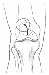
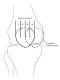
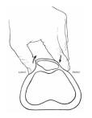
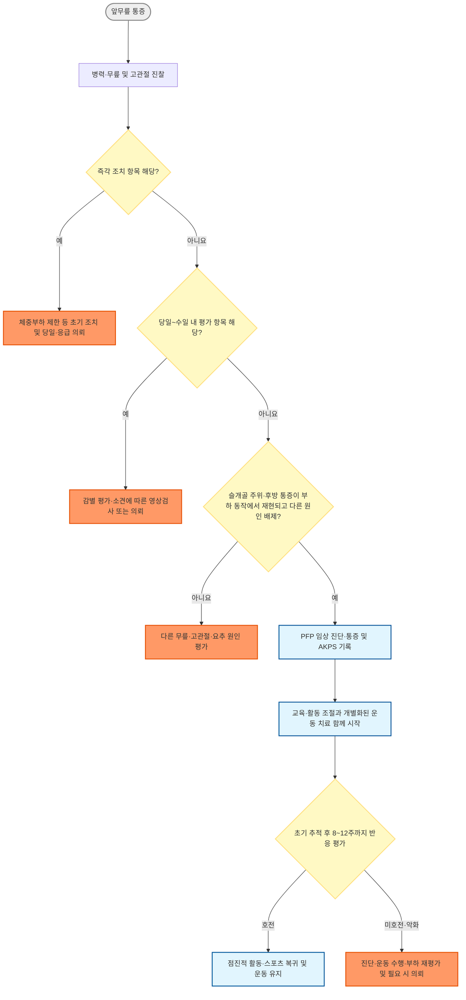
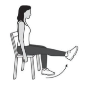

# 슬개대퇴 통증증후군 (슬개대퇴 통증) Patellofemoral Pain (PFP)

## <mark style="color:green;">일반 사항</mark>

* 앞무릎 및 슬개골 주위의 통증 및 경직. 계단 오름, 무릎 꿇음, 쪼그려 앉기, 오래 앉아 있은 후 악화되는 하지 부하 관련 통증 증후군
* 다른 이름 : anterior knee pain, runner's knee\
  ✽anterior knee pain은 PFP보다 넓은 증상 용어이며, runner's knee 역시 비특이적으로 사용될 수 있음\
  ✽2016년 국제 슬개대퇴 통증 연구 학술대회(International Patellofemoral Pain Research Retreat) 합의문 이후 "슬개대퇴 통증증후군(PFPS)"보다 "슬개대퇴 통증(Patellofemoral Pain, PFP)"이라는 명칭이 국제적으로 통용됨(다양한 임상 양상을 포괄하는 선호 용어); 본 챕터에서는 두 명칭을 병기함
* 정의 (JOSPT 2019 CPG) : 슬개골 후방 또는 슬개골 주위에 국한된 통증으로, 계단 오르내리기·쪼그려 앉기·오래 앉아 있기·달리기·점프 등 하지 부하 활동 시 악화되며, 서서히 발생하거나 때로 급성으로 악화됨
* 임상 분류 (JOSPT 2019 CPG의 평가·치료 구성 틀) : ① 다른 뚜렷한 기능 손상 없는 과사용/과부하형 ② 근력 저하형 ③ 운동 조절 저하형 ④ 가동성 이상형 - 서로 겹칠 수 있는 임상적 특성이며, 확정된 독립 질병 아형으로 보지 않음; 평가된 손상·기능 제한에 따라 치료를 개별화함
* 유병률 (체계적 문헌고찰, Smith 등 2018) : 해당 리뷰에 포함된 연구의 연간 유병률은 일반 인구 22.7%, 청소년 28.9%로 보고됨; 전체 일반 인구의 통합 추정치 또는 국내 유병률로 해석하지 않음. 청소년의 통합 시점 유병률은 7.2%, 여성 청소년 운동선수에서는 22.7%로 조사 기간·대상에 따라 차이가 큼; 청소년·젊은 성인의 흔한 무릎 통증 원인임
* 경과 : 자연적으로 완전히 소실되는 단순한 self-limiting disorder로 보기는 어려우며, 증상이 지속되거나 재발할 수 있음. 진단 후 5\~8년 추적 연구에서는 추적 설문 응답자 60명(원 대상자의 19.3%) 중 34명(57%)이 불량한 회복을 보고함(Lankhorst 등); 이 수치를 모든 PFP 환자의 장기 예후에 그대로 적용하지는 않음. 2025 JOSPT 예후 체계적 문헌고찰에서도 장기 예후 연구의 근거와 공백을 정리함
* 동반 심리적 부담 : 영국에서 PFP 증상을 자가 보고한 400명의 온라인 설문 연구(Wride·Bannigan 2019)에서 응답자의 약 절반이 불안, 약 1/5이 우울 증상으로 분류됨; 이 비율을 일반 PFP 환자 전체에 적용하지는 않으며, 통증과 기능 저하가 지속되면 심리사회적 요인을 평가

***

## <mark style="color:green;">원인 및 위험 인자</mark>

#### <mark style="color:$primary;">기전</mark>

* 과사용, 하지 부하 활동량의 급격한 증가(훈련량 급증 등)
* 환자별로 관찰되는 근력·유연성·움직임 조절의 차이 : quadriceps, hamstring, gastrocnemius 및 고관절 근육 등; 관찰된 차이가 반드시 발병 원인이라는 뜻은 아님
* 일부 환자에서 동반되는 하지 정렬·구조적 특성 : patella alta, 슬개골 과운동성 등; 구조적 특성만으로 PFP를 진단하거나 통증의 원인으로 단정하지 않음

#### <mark style="color:$primary;">위험 인자</mark>

* 여성 청소년·젊은 성인 운동선수에서 흔히 관찰되지만 비운동선수에서도 발생함; 높은 빈도와 개인의 전향적 발병 위험 인자는 구분할 것
* 평가 시 확인할 수 있는 동반 소견 : 외측 지대의 긴장, 슬개골 과운동성, 외상·수술 병력 등. 이들 소견을 일률적인 발병 위험 인자로 단정하지 않음
* quadriceps 근력 저하 : 특히 군인 집단에서 향후 PFP 발생의 위험 인자로 확인됨(중등도 근거)\
  ✽하지만 연령, 체중, 신장, BMI, 체지방률, Q angle은 해당 분석에서 향후 PFP 발생과의 연관성이 확인되지 않았다는 강~중등도 근거가 있으며(Neal 등, BJSM 2019 체계적 문헌고찰), 고관절 근력 저하 역시 전체적으로는 전향적 위험 인자로 확인되지 않음(중등도 근거) - 다만 청소년에서는 오히려 높은 고관절 외전근력이 향후 PFP 위험과 연관된다는 역설적 보고가 있어 단순한 "약하면 위험"의 도식은 성립하지 않음
  * ※ 임상적으로 PFP 환자에서 고관절·대퇴사두근 근력 저하가 흔히 동반 관찰되나(횡단적 연관), 이것이 반드시 발병의 "원인"이라는 근거는 제한적임; 다만 hip+knee 강화 운동이 통증·기능을 호전시킨다는 근거는 확립되어 있어(치료적 유효성과 병태생리적 인과관계는 별개 문제) 치료 원칙에는 영향을 주지 않음

***

## <mark style="color:green;">임상 양상</mark>

* 무릎을 구부릴 때 통증, 특히 반복적으로 무릎을 구부리는 운동/활동(예: 계단 오르내리기, 달리기, 점프, 쪼그려 앉기) 시 악화
* 극장에서의 영화 관람, 비행기 여행 등 장시간 무릎을 구부리고 있은 후 통증 및/또는 뻣뻣함("theater sign")
* 무릎 앞쪽의 둔한 통증; 보통 점진적으로 진행
* 광범위한 무릎 앞부분 통증; 통증 부위를 정확히 지적하지 못하고 슬개골 주위로 둥글게 표현함("circle sign")
* 소량의 삼출액이 동반될 수 있으나 뚜렷한 부종은 드묾; 뚜렷한 삼출액이나 true mechanical locking은 PFP의 전형적 소견이 아님(통증으로 인해 순간적으로 움직임을 멈추는 것을 환자가 "걸린다"고 표현하는 경우와 구분 필요) - 뚜렷한 삼출액·true locking·슬개골 아탈구/탈구감이 있으면 다른 원인(감별 참조)을 우선 고려. 통증에 의한 일시적 대퇴사두근 억제로 힘이 빠지는 느낌이 생길 수 있으므로, giving-way만으로 구조적 불안정성을 확정하지 않음
* 내측 또는 외측 retinaculum의 압통
* 국소 압통은 다양하게 나타날 수 있으며 patellar facet 또는 retinaculum 주위 압통이 동반될 수 있음; 뚜렷한 골성 국소 압통은 stress fracture 등 다른 병변을 고려. 무릎과 고관절의 운동 범위는 대개 정상

***

### <mark style="color:$danger;">🚩 Red Flags!</mark>

<mark style="color:$danger;">**즉각 조치 또는 의뢰**</mark>

* 외상 후 급격한 관절 종창(수 시간 내, 혈관절증 의심) - 특히 슬개골 골절, 슬개골 탈구/신전기전 파열(급성 대퇴사두근건·슬개건 파열) 가능성
* 외상 후 무릎을 능동적으로 신전하거나 하지직거상(straight-leg raise)을 하지 못함 → 신전기전 손상 의심(통증에 의한 억제와 감별); 일시적 억제라고 단정하고 평가를 미루지 않음
* 청소년에서 외상 후 갑작스러운 경골결절(tibial tubercle)의 심한 통증·종창과 신전 장애 → 경골결절 견열골절 등 급성 신전기전 손상 의심
* 급성 심한 관절통과 함께 현저한 관절운동 제한/체중부하 불가, 관절 발적·열감 또는 큰 삼출액이 있으면 화농성 관절염 우선 배제 - 전신 발열 유무와 무관하게 의심 시 즉시 평가
* 신경혈관 손상 징후(원위부 냉감·창백·맥박 소실)
* 청소년의 무릎 통증에 절뚝거림·고관절 내회전 제한 또는 외회전 보행 동반 → 대퇴골두 골단분리증(SCFE) 의심; 체중부하를 중단하고 당일 정형외과 평가(체중부하 불가·급격한 악화 시 즉시 응급 평가)

<mark style="color:$warning;">**당일~수일 내 평가**</mark>

* **지속적인 true locking(수동으로도 무릎이 완전히 펴지지 않는 기계적 차단)** → 전위된 반월연골 파열·관절내 유리체 의심; **당일 평가·긴급 정형외과 의뢰**, MRI를 기다리느라 의뢰를 지연하지 않음
* 새로 생긴 뚜렷한 삼출액, 반복적인 catching 또는 giving-way → 반월연골·인대 손상·슬개대퇴 불안정성 등을 평가; 삼출액이 없어도 반복 증상은 평가 대상임
* 최근 슬개골 아탈구/탈구가 의심되거나 뚜렷한 불안정감 → 슬개대퇴 불안정성 평가(급성 외상 후 큰 삼출액·신전 장애가 있으면 즉시 평가)
* 안정 시에도 지속되는 통증, 야간통, 체중 감소 동반 → 골종양 등 감별 필요

<mark style="color:$info;">**외래 추적 / 추가 평가 계획**</mark> <mark style="color:$info;">- 즉각 위험 낮으나 호전 없으면 의뢰</mark>

* 활동 조절 및 8\~12주간의 구조화된 운동 치료 후에도 통증·기능 호전이 없는 경우\
  ✽긴 증상 기간, 높은 연령, 낮은 기저 슬관절 신전근력은 무릎 중심 운동 치료의 반응과 연관된 예후 지표로 보고되었으나(Deng 등, JOSPT Open 2025 meta-regression), 탐색적 연구 결과이므로 개별 환자의 예후를 단독으로 판단하는 기준으로 사용하지 않음
* 반복적으로 재발하는 경증 증상
* 청소년의 tibial tubercle 국소 압통·부종(특히 급성장기) → 전형적 Osgood-Schlatter병 등 견인성 골단염 감별; 대부분 비응급 보존적 치료 대상
* 심리사회적 요인(불안·우울, 통증에 대한 두려움-회피 행동)이 회복을 저해하는 것으로 보이는 경우

***

## <mark style="color:green;">진단</mark>

### <mark style="color:orange;">진단 원칙</mark>

* PFP는 특이적인 단일 검사가 없는 임상 진단이며, 영상검사는 진단 확립보다는 감별 목적으로 사용됨
* 진단 기준(JOSPT 2019 CPG) : ① 슬개골 후방 또는 주위의 통증이 ② 쪼그려 앉기 등 슬개대퇴 관절에 부하가 걸리는 동작으로 재현되고 ③ 다른 무릎 통증 원인이 배제될 때 진단
* 핵심 진단 검사 : **쪼그려 앉기(squat) 시 슬개골 후방/주위 통증 재현**이 PFP를 시사하는 근거 수준이 가장 높은 단일 임상 검사로 권고됨(JOSPT 2019 CPG); 계단 오르내리기, 무릎 꿇기 등 다른 부하 동작으로도 재현 가능
* **치료 반응 평가 척도** : Kujala Anterior Knee Pain Scale (AKPS, 0\~100점)을 사용할 수 있음(JOSPT 2019 CPG); 점수가 높을수록 기능 상태가 좋으며, 초기 평가 후 추적 시 통증·기능 변화의 정량적 평가에 활용

### <mark style="color:orange;">신체검사</mark>

_<mark style="color:$info;">Ref. Management of Patellofemoral Pain Syndrome. AFP 2007;75(2). fig2\~4 (그림 출처); 검사의 임상적 위치는 JOSPT 2019 CPG 기준으로 갱신</mark>_

✽쪼그려 앉기 시 통증 재현과 patellar tilt test의 가동성 저하는 JOSPT 2019 CPG가 제시한 진단 보조 소견임. Tilt test만으로 PFP를 확진하지 않으며, 다른 개별 검사들의 진단 정확도는 제한적임; **쪼그려 앉기 통증 재현이 우선되는 핵심 소견**이며, 아래 검사들은 보조적·감별적 정보로 활용

#### <mark style="color:$primary;">J sign (외측 슬개골 추적 이상)</mark>

* 앉거나 누운 상태에서 능동적으로 무릎을 신전시킬 때, 마지막 신전 구간에서 슬개골이 갑자기 외측으로 치우치는 J자 모양의 추적을 보이면 양성; 추적 이상 소견이며 단독으로 PFP 또는 탈구 위험을 확정하지 않음

<div align="left"><figure><figcaption></figcaption></figure></div>

#### <mark style="color:$primary;">Patellar mobility testing</mark>

* 똑바로 누워 대퇴사두근을 이완하고 무릎을 약 20~30° 굴곡한 상태에서 슬개골을 내측·외측으로 부드럽게 이동시켜 반대쪽과 비교함; 1 quadrant는 슬개골 전체 폭의 1/4에 해당함
* medial glide가 1 quadrant 미만이면 외측 구조물 tightness, 3 quadrants를 넘는 이동은 과운동성을 시사하는 관례적 기준임; 검사 자세·근육 긴장에 영향을 받으므로 이동 거리만으로 진단하지 않음

<div align="left"><figure><figcaption></figcaption></figure></div>

#### <mark style="color:$primary;">Patellar tilt test</mark>

* 방법 : 똑바로 누워 무릎을 펴게 하고 엄지와 집게손가락으로 슬개골을 잡고 슬개골 내측을 누르고 외측 가장자리를 들어 올림
* 외측 가장자리가 수평 이상으로 들어 올려지지 않으면 가동성 저하·외측 지대의 긴장을 시사함; PFP 진단의 보조 소견이며 검사자 간 재현성은 제한적임

<div align="left"><figure><figcaption></figcaption></figure></div>

#### <mark style="color:$primary;">Patellar grind (compression, Clarke's sign) test</mark>

* 방법 : 똑바로 누워 무릎을 약 10~20° 굴곡하고 대퇴사두근을 이완한 상태에서 슬개골 상연 바로 위에 가벼운 저항을 주고 대퇴사두근을 수축하게 하여 통증을 관찰함; 슬개골을 활차에 강하게 눌러 비비거나 강제로 하방 이동시키지 않음
* ✽통증 유발과 위양성 가능성이 높고 진단 정확도가 낮아 **일상적 시행은 권장되지 않음**; 양성만으로 연골연화증을 진단하지 않음

#### <mark style="color:$primary;">기능적 부하·근력 평가</mark>

* **Single-leg squat / step-down test** : 편측 스쿼트 또는 계단 내려서기에서 통증 재현, 동적 슬관절 외반(dynamic knee valgus), 반대쪽 골반 처짐을 관찰함; 대퇴사두근과 고관절 외전·신전·외회전근의 근력도 함께 평가함
* 관찰된 움직임 차이가 모두 통증의 원인이라는 뜻은 아님; 동작 수정 시 통증·기능 변화와 환자의 운동 수행 능력을 치료 구성에 반영함
* Vastus medialis coordination test는 과거 보조 검사이나 일상적으로 필수 시행할 근거는 제한적임. VMO만 선택적으로 강화하는 치료보다 대퇴사두근 전체 및 필요 시 고관절 운동을 중심으로 구성함

#### <mark style="color:$primary;">Patellar apprehension test</mark>

* [방법](https://www.youtube.com/watch?v=4TnCQppTy1g) : 똑바로 눕히고 무릎을 약 20~30° 굴곡하고 대퇴사두근을 이완한 상태에서 슬개골을 내측에서 외측으로 밀어 움직임(탈구될 때까지 강제로 밀지 않음)
* 외측에서 apprehension(슬개골이 탈구될 것 같은 불안감)·방어성 quadriceps 수축 또는 검사 회피 반응이 나타나면 양성 - 단순 통증보다 apprehension 자체가 핵심 소견이며, 슬개대퇴 불안정성(외측 구조물 tightness가 아닌 재발성 아탈구/탈구 위험) 시사 - 단순 PFP보다 불안정성 감별에 더 특이적인 검사

### <mark style="color:orange;">영상 검사</mark>

* 대부분 진단에 필수적이지 않음; 전형적 병력·이학적 소견이 뚜렷하면 생략 가능
* 적응증 : 중증 외상력, 비전형적 증상(삼출액·locking·야간통 등), Red Flag 동반, 표준 치료에 반응하지 않는 경우
* 단순 방사선(AP, lateral ± sunrise/Merchant axial view)이 1차 선택; PFP 자체의 진단 목적으로 MRI를 일상적으로 시행하지 않으며, osteochondral lesion·구조적 불안정성 등 다른 병변이 의심될 때 선택적으로 고려(단순 PFP에서 MRI 이상소견은 증상과 잘 연관되지 않음)

### <mark style="color:orange;">감별 진단</mark>

(☞ [무릎통증](144_-knee-pain.md))

* 앞쪽 무릎 통증을 유발하는 질환들의 감별. 특히 삼출액·locking·국소 골 압통·전신 증상 동반 시 PFP 단독 진단을 재고할 것

<table><thead><tr><th width="200">원인</th><th>특징</th></tr></thead><tbody><tr><td>Articular cartilage injury</td><td>외상력, 삼출액, 이환부 압통 (예: femoral condyle, patella)</td></tr><tr><td>Bone tumor</td><td>잠행성 통증, 골의 압통, 야간통</td></tr><tr><td>Chondromalacia patellae</td><td>슬개골 관절연골의 구조적 변화; 무증상일 수도 있으며, 후슬개골 통증·외상력·삼출액만으로 PFP와 구분하거나 진단할 수 없음</td></tr><tr><td>Hoffa's disease</td><td>infrapatellar fat pad의 통증 및 압통</td></tr><tr><td>Iliotibial band syndrome</td><td>외측부 통증, lateral femoral epicondyle 압통</td></tr><tr><td>Loose body</td><td>다양한 증상, intermittent sharp pain, locking, effusion</td></tr><tr><td>Osgood-Schlatter disease</td><td>청소년에서 tibial tubercle의 patellar tendon 부착부 압통 및 부종</td></tr><tr><td>Osteochondritis dissecans</td><td>다양한 증상, intermittent pain, swelling, or locking</td></tr><tr><td>Patellar instability/subluxation</td><td>슬개골의 불안감과 함께 간헐적 통증, 부종, medial retinaculum 압통</td></tr><tr><td>Patellar stress fracture</td><td>슬개골 국소 압통</td></tr><tr><td>Patellar tendinopathy</td><td>tendon 압통, 만성인 경우 tendon 비후</td></tr><tr><td>Patellofemoral osteoarthritis</td><td>중년 이후(40~50대 이상에서 PFP와 경계가 모호할 수 있음), crepitus 또는 삼출액</td></tr><tr><td>Patellofemoral pain (PFP)</td><td>슬개골 주위 또는 후방 통증, 대개 뚜렷한 삼출액 없음(소량은 가능), squat 등 부하 동작 시 통증 재현</td></tr><tr><td>Pes anserine bursitis</td><td>무릎 내측 통증, pes anserine bursa 압통</td></tr><tr><td>Plica synovialis</td><td>patella 내외측 압통</td></tr><tr><td>Prepatellar bursitis</td><td>외상 후 슬개골 전방의 부종</td></tr><tr><td>Quadriceps tendinopathy</td><td>tendon 압통</td></tr><tr><td>요추/고관절 연관통</td><td>원인에 따라 다른 증상; 무릎 진찰이 정상이거나 소견이 통증과 맞지 않으면 고관절·요추 평가. 청소년의 절뚝거림·고관절 내회전 제한은 SCFE를 우선 배제</td></tr><tr><td>Saphenous neuritis</td><td>통증은 대부분 poorly localized, 수술 병력</td></tr><tr><td>Sinding-Larsen-Johansson Syndrome</td><td>청소년에서 슬개골 inferior pole의 patellar tendon 부착부 압통</td></tr><tr><td>Symptomatic bipartite patella</td><td>주로 슬개골 상외측 부골편 부위의 국소 압통 및 특징적 영상 소견; 무증상 우연 소견과 구분</td></tr></tbody></table>

✽연골연화증 영상 소견은 PFP와 동의어가 아니며, 소견만으로 통증의 원인이라고 단정하지 않음.

_<mark style="color:$info;">Ref. Management of Patellofemoral Pain Syndrome. AFP 2007;75(2). Table 2를 바탕으로 JOSPT 2019 CPG·AAOS SCFE 자료를 반영하여 수정</mark>_

***


```mermaid
graph TD
    Start(["앞무릎 통증"]) ---> A["병력·무릎 및 고관절 진찰"]
    A ---> RF{"즉각 조치 항목 해당?"}
    RF --->|예| C["체중부하 제한 등 초기 조치 및 당일·응급 의뢰"]
    RF --->|아니요| U{"당일~수일 내 평가 항목 해당?"}
    U --->|예| V["감별 평가·소견에 따른 영상검사 또는 의뢰"]
    U --->|아니요| D{"슬개골 주위·후방 통증이 부하 동작에서 재현되고 다른 원인 배제?"}
    D --->|아니요| X["다른 무릎·고관절·요추 원인 평가"]
    D --->|예| F["PFP 임상 진단·통증 및 AKPS 기록"]
    F ---> H["교육·활동 조절과 개별화된 운동 치료 함께 시작"]
    H ---> I{"초기 추적 후 8~12주까지 반응 평가"}
    I --->|호전| J["점진적 활동·스포츠 복귀 및 운동 유지"]
    I --->|미호전·악화| K["진단·운동 수행·부하 재평가 및 필요 시 의뢰"]

    class RF,U,D,I question
    class C,V,X,K refer
    class F,H,J action
    class Start start
    classDef start fill:#eeeeee,stroke:#888888,stroke-width:2px
    classDef question fill:#fff9c4,stroke:#ffe082,stroke-width:2px
    classDef refer fill:#f96,stroke:#e65100,stroke-width:2px
    classDef action fill:#e1f5fe,stroke:#01579b,stroke-width:2px
```

<p align="center"><strong>진단 및 치료 알고리듬</strong></p>

<p align="center"><em><mark style="color:$info;">Ref. [JOSPT 2019 CPG] Willy RW, et al. Patellofemoral Pain. J Orthop Sports Phys Ther. 2019;49(9):CPG1-CPG95; Neal BS, et al. Best practice guide for patellofemoral pain based on synthesis of a systematic review, the patient voice and expert clinical reasoning. Br J Sports Med. 2024;58(24):1486-1495.</mark></em></p>

***

## <mark style="background-color:$warning;">Management</mark>


**운동 치료가 핵심입니다 - 안정(rest)이나 고정이 아닙니다**

PFP는 대개 점진적으로 발생하는 부하 관련 통증으로, 장기간의 활동 중단이나 고정은 근력 약화·기능 저하를 초래할 수 있어 일반적으로 권장되지 않습니다. 1차 치료의 핵심은 환자 교육과 개별화된 운동 치료이며, knee-targeted exercise를 기본으로 환자 평가에 따라 hip-targeted exercise 등을 병합합니다(JOSPT 2019 CPG는 hip+knee 병합 운동을 권고하며, Neal 등 BJSM 2024 Best Practice Guide는 무릎 중심 ± 고관절 운동의 개별화를 강조함).


### <mark style="color:orange;">치료 방침</mark>

<table><thead><tr><th width="90">구성</th><th width="260">핵심 치료</th><th>비고</th></tr></thead><tbody><tr><td>기본 교육</td><td>환자 교육 + 활동 조절(통증 유발 부하의 일시적 감량, 완전 중단이 아님)</td><td>모든 환자</td></tr><tr><td>핵심 운동</td><td>교육 + knee-targeted exercise 중심의 운동 치료(우선 8~12주 계획, 중간 평가에 따라 조절); 개별 평가에 따라 hip-targeted exercise 병합</td><td>교육·활동 조절과 함께 시작하는 1차 핵심 치료; 2024 Best Practice Guide는 환자 양상에 따른 개별화를 강조. VMO 단독 분리 강화보다 대퇴사두근 전체 및 고관절 복합체 운동에 집중</td></tr><tr><td>보조 수단</td><td>필요에 따라 기성 foot orthosis, 개별화된 슬개골 테이핑, 도수치료, movement/running retraining 등을 운동·교육에 병행</td><td>기성 깔창은 단기 증상 개선이 예상되는 환자에게 고려; 도수치료를 단독 치료로 사용하지 않음. 슬개대퇴 보조기·슬리브·스트랩은 PFP 치료에 일상적으로 처방하지 않음(JOSPT 2019 CPG)</td></tr><tr><td>재평가</td><td>초기 2~4주에 수행·부하·통증을 점검하고, 8~12주간의 적절한 치료 후에도 호전이 없으면 진단, 운동 순응도·부하, 감별진단을 재평가하고 소견에 따라 영상검사 또는 의뢰</td><td>8\~12주는 수술 결정 기준이 아님. 재발성 탈구 등 별도의 구조적 질환이 확인되면 해당 질환에 따라 전문의가 치료를 판단</td></tr></tbody></table>

* 근력·유연성·움직임 조절 등 여러 임상적 요소가 함께 관찰될 수 있어 개별화된 접근이 원칙
* 고관절 근력 저하는 향후 PFP 발생의 전향적 위험 인자로는 확립되어 있지 않지만(☞ 원인 및 위험 인자 참조), hip+knee 강화 운동이 통증·기능을 호전시킨다는 **치료적 유효성 근거는 확립**되어 있음 - 위험 인자 여부와 치료 원칙은 별개로 판단할 것
* 초음파치료, 전기자극, 냉치료 등 biophysical agents를 PFP 치료 목적으로 사용하지 않으며(JOSPT 2019 CPG Grade B), 슬개대퇴/무릎/요추 관절의 단독 도수 관절가동술도 권장되지 않음(JOSPT 2019 CPG Grade A)
* Dry needling은 PFP 치료 목적으로 **권장하지 않음**(JOSPT 2019 CPG Grade A); acupuncture는 통증 감소 목적으로 고려할 수 있으나 위약 대비 우월성은 불확실함(JOSPT 2019 CPG Grade C)
* 개별화된 슬개골 테이핑은 운동 치료와 함께 초기 통증 감소에 고려할 수 있음. 연부조직 도수치료와 보행 재훈련(gait retraining)은 환자별로 운동 치료의 보조 수단으로 선택; 슬개골 보조기·슬리브·스트랩은 PFP에 일상적으로 사용하지 않음
  * 테이핑(McConnell taping 등)은 그 자체가 치료 목표가 아니라, 통증을 낮춰 운동 치료를 수행할 수 있게 돕는 일시적 "window of opportunity"로 이해하는 것이 임상적으로 유용함

***

## <mark style="color:green;">비-약물 치료 및 예방</mark>

* **운동 치료(1차 핵심 치료)** : 환자 교육과 함께 knee-targeted exercise를 기본으로 개별화된 빈도와 강도로(예 : 주 2\~3회 이상의 구조화된 운동을 환자 상태와 부하 내성에 맞추어 조절) 우선 8~12주를 계획하고 중간 반응에 따라 조정하며, 고관절 근력 저하·운동조절 이상 등 개별 평가 결과에 따라 hip-targeted exercise를 병합
  * Hip+knee 병합 운동은 적절한 환자에서 통증과 기능 개선에 효과적이며, 모든 환자에게 동일한 프로그램을 일률적으로 적용하기보다 임상 양상에 따라 구성
  * 체중부하 운동(얕은 스쿼트·낮은 계단 오르기 등)과 비체중부하 무릎 신전 운동을 통증·수행 능력에 맞게 선택하며, 필요하면 고관절 외전·신전·외회전 운동을 병합함. 처음에는 낮은 저항·횟수·굴곡 범위에서 시작하여 점진적으로 늘림
  * 운동 중 통증은 환자가 감당할 수 있는 경미한 범위로 제한하고 운동 후·다음 날의 증상도 확인함. 통증이 뚜렷하게 증가하거나 다음 날까지 악화되면 저항·횟수·동작 범위를 낮추며, 새 종창·잠김·불안정성은 재평가함; 모든 환자에게 동일한 통증 점수 한계를 적용하지 않음
  * **초기 2~4주에 통증·AKPS·운동 수행과 부하를 점검**하고, 8~12주에 전반적 반응을 평가함. 8~12주는 효과가 처음 나타나는 최소 기간이 아니며, 악화·새 Red Flag가 있으면 조기 평가함
* 활동 조절 : 통증을 심하게 유발하는 활동(쪼그려 앉기, 계단, 달리기 등)의 강도·빈도를 일시적으로 낮추고 필요하면 해당 활동만 잠시 중단함; 견딜 수 있는 일상 활동·대체 운동을 유지하며 장기간의 완전한 안정·고정은 피함. 청소년 운동선수는 보호자와 함께 전체 훈련 부하·학교 체육·스포츠 복귀 계획을 조정함
* Foot orthosis(기성품) : 단기(대개 6주 이내) 통증 감소를 위해 선택적으로 고려; 특히 과도한 발 회내가 있거나 착용 직후 증상이 개선되는 환자에서 운동 치료와 병행. 맞춤형 깔창의 기성품 대비 우월성은 확립되지 않음
* 슬개골 테이핑 : 운동 치료 초기 통증 감소를 위한 단기 보조 수단으로 개별화하여 시도; 슬개골 보조기·슬리브·스트랩은 PFP 치료에 일상적으로 권장되지 않음
* 신발 : 활동에 적합한 쿠셔닝·지지력을 갖춘 신발 착용
* 훈련량 관리 : 운동/활동량을 점진적으로 늘림(급격한 증량 회피); 준비 운동·정리 운동(스트레칭 포함)
* 체중 관리 : 과체중·비만 성인은 건강상 이득과 부하 관리를 위해 개별적으로 고려; PFP에서 체중 감량만의 치료 효과 근거는 제한적임. 정상 체중 또는 성장기 청소년에게 통증 치료 목적으로 일률적인 감량을 권하지 않음

* [Knee conditioning program](https://www.orthoinfo.org/recovery/knee-conditioning-program/): Stretching & Strengthening Exercises \[American Academy of Orthopaedic Surgeons]

<figure><figcaption></figcaption></figure>

***

## <mark style="color:green;">약물 치료</mark>

* 약물은 운동 치료를 대체하지 않으며, PFP 자체에 대한 질환 특이적 약물 근거는 제한적임(Cochrane review, Heintjes 등 2004 : NSAID가 단기 통증 감소에 제한적 근거를 보였으나 3개월 후 전체 통증 개선은 확인되지 않음). 운동 치료를 가능하게 하기 위한 **최소 유효 용량으로 단기간** 증상 조절 목적으로만 사용

✽아래 용량은 성인 예시(acetaminophen 해당 제품은 12세 이상 허가)이며, 소아·청소년은 제형별 허가와 연령·체중에 따라 별도 조절함. PFP 약물 효과 근거와 일반 진통 목적의 국내 제품 허가 용법을 구분함.

* acetaminophen : 제품 제형에 따라 용법이 다름. 650 ㎎ 서방정 <mark style="color:blue;">[타이레놀8시간이알서방정]</mark>의 허가 용법은 12세 이상 1회 2정(1,300 ㎎), 8시간 간격, 24시간 최대 6정(3,900 ㎎). 다른 acetaminophen 함유 약과의 중복 복용에 주의하며, 간질환·음주·저체중·영양불량 등 위험 인자를 고려하여 필요 시 용량을 낮추거나 다른 제형을 선택; 서방정은 으깨거나 씹지 않고 그대로 삼킴
* ibuprofen : 200~400 ㎎, 필요 시 1일 3회 이내 단기간 사용 예 <mark style="color:blue;">[부루펜정 200 ㎎]</mark>; 효과가 부족하면 자동 증량보다 진단·부하·위험 인자를 재평가함
* naproxen : <mark style="color:blue;">[낙센정 250 ㎎]</mark>의 골격근장애 등 국내 허가 용법은 초회 500 ㎎ 후 6~8시간 간격으로 250 ㎎, 1일 최대 1,250 ㎎임. PFP에 특이적인 용법은 아니며 모든 환자에게 초회량·최대량까지 투여하지 않고 최소 유효 용량으로 단기간 사용함
* 국소 외용 NSAID : 경구제 사용이 부담스러운 경우 고려할 수 있으나 PFP 자체의 직접적인 효과 근거는 제한적임
  * diclofenac gel <mark style="color:blue;">[볼타렌에멀겔]</mark> : 12세 이상, 1회 2~4 g을 1일 3~4회 도포. 7일간 사용 후 개선이 없거나 악화되면 중단·재평가; 의사 지시 없이 근육·관절 손상에 7일을 넘겨 사용하지 않으며, 제품 허가상 14일 이상 사용하지 않음. **12세 미만·임부·수유부·NSAID 과민반응 병력은 사용 금기**; 상처·습진·점막에 사용하거나 밀봉하지 않음
  * ketoprofen 첩부제 <mark style="color:blue;">[케토톱플라스타]</mark> : 1일 2회 부착; **15세 미만 사용 금기**, 사용 중 및 사용 후 2주까지 부착 부위의 자외선 노출을 피함(광과민 반응). 임신기간 6개월 이상은 금기이며, 그 이전 임신·수유도 사용 전 평가가 필요함
* 경구 NSAID를 두 종류 이상 병용하지 않으며, 국소제와의 병용도 전신 흡수·신장 및 위장관 위험을 고려하여 일률적으로 권하지 않음

***

## <mark style="color:green;">시술 및 기타 처치</mark>

* 국소 스테로이드 주사 : PFP는 일차적으로 염증성 병태가 아니므로 일상적으로 권장되지 않음(PFP에 대한 유효성 근거가 부족하며 반복 주사에는 연골·건 손상 위험도 고려)
* 관절강 내 hyaluronic acid 주사 : 단순 PFP에서 일상적으로 권장되지 않음; Hart 등 2019 sham-controlled RCT에서는 두 군 모두 가정 운동을 시행했고, HA 주사는 sham 주사 대비 임상적으로 유의한 추가 이득을 보이지 않음
* 수술적 치료 : 단순 PFP에 일상적으로 시행하지 않음. 운동 치료 8\~12주 후 호전이 없다는 이유만으로 수술을 결정하지 않으며 진단·부하·운동 수행을 재평가. 재발성 슬개골 탈구 등 별도의 구조적 질환이 확인된 경우 그 질환의 적응증에 따라 정형외과에서 판단. 만성 PFP의 관절경 추가 효과는 운동 치료 단독 대비 확인되지 않았음

***

### <mark style="color:red;">질병코드</mark>

M22.2 무릎뼈대퇴골의 장애 (슬개대퇴 장애) Patellofemoral disorders

M22.4 무릎뼈의 연골연화 (슬개골 연골연화증) Chondromalacia patellae - 단순 PFP와 구분되는 연골연화증을 별도로 진단한 경우; 영상 소견만으로 증상 원인이라고 단정하지 않음

✽감별 : M22.0 무릎뼈의 재발성 탈구 Recurrent dislocation of patella는 **재발성 탈구를 진단한 경우**에 사용함. M22.1 무릎뼈의 재발성 불완전탈구 Recurrent subluxation of patella는 재발성 아탈구 진단에 해당함; 단순 불안정감·apprehension 양성만으로 이 코드를 사용하지 않음. 급성 외상성 탈구는 손상 코드 적용 여부를 별도로 판단함

✽청구 시 KCD-9(2026년 시행)의 공식 명칭·적용 범위와 원내 코드 체계를 확인함; 미국 ICD-10-CM의 좌우 세분 코드를 KCD에 그대로 적용하지 않음

***

## <mark style="color:purple;">처방례</mark>

✽성인 예시이며 약물 처방과 별개로 교육·활동 조절·운동 치료를 함께 시행함; 통증 정도만으로 특정 약물이나 고정된 용량을 자동 선택하지 않음.

> **처방례 1. 경증**
>
> ```
> 타이레놀8시간이알서방정 650 ㎎/T  2T  q8h  필요시(1일 최대 6T)
> ```
>
> _✽경증에서는 통증 시 필요에 따라 acetaminophen 사용; 다른 감기약·진통제와 성분 중복에 유의. 운동 치료(무릎 중심, 필요 시 고관절 운동 병합)를 1차 치료로 함께 안내_

> **처방례 2. 중등도**
>
> ```
> 부루펜정 200 ㎎/T  2T  tid  필요시(단기간)
> ```
>
> _✽중등도 통증에는 NSAID를 단기간 사용; 위장관·신장 위험 인자가 있는 경우 다른 진통 전략을 개별화; 활동성 소화성 궤양·중증 신장장애 등에서는 acetaminophen도 제품 금기 확인이 필요하며 국소제 역시 전신 위험이 전혀 없는 것은 아님_

> **처방례 3. 국소 외용제 중심(전신 부작용 회피가 필요한 경우)**
>
> ```
> 볼타렌에멀겔  1회 2~4 g  환부에 1일 3~4회 도포(7일 후 재평가)
> ```
>
> _✽경구 NSAID의 전신 부작용 위험이 높은 환자에서 국소 외용제가 대안이 될 수 있음; 이 제품은 12세 이상 허가이며 임부·수유부·NSAID 과민반응 병력에서는 사용하지 않음. 14일 이상 사용하지 않음. 국소 제제도 전신 흡수 가능성이 있으므로 신질환·병용약 등을 확인_

> **처방례 4. 만성·재발성 PFP - 약물보다 운동 치료·추적 중심**
>
> * 약물 정규 처방 없음
> * knee-targeted exercise + 필요 시 hip-targeted exercise를 8\~12주 구조화하여 시행
> * AKPS·통증 기저치 기록; 초기 2~4주 점검 후 8~12주에 전반적 반응 재평가
> * 두려움-회피 행동, 불안·우울 등 회복 저해 요인 동반 시 함께 평가
>
> _✽증상 기간이 길거나 초기 슬관절 신전근력이 낮은 경우 치료 반응이 늦을 수 있으므로, 조기 중단보다 순응도·운동 부하·진단 적절성을 재평가_

***

### <mark style="color:$success;">핵심 복약 지도</mark>

> **NSAID/acetaminophen 사용 원칙**
>
> * 통증 조절을 위한 **보조 수단**이며, 교육·활동 조절·운동 치료가 핵심임을 환자에게 설명
> * NSAID는 위장관 부담이 있으므로 식사와 함께 또는 식후 복용 가능; 위장관 출혈·급성 신손상·심혈관계 위험을 고려하여 최소 유효 용량·최단 기간 사용. 수일 사용 후에도 계속 필요하거나 효과가 부족하면 진단·부하·약물 위험을 재평가함; 외용제도 제품별 재평가 시점·최대 사용 기간을 지킴
> * acetaminophen은 복합 감기약·다른 진통제와 성분이 중복되지 않도록 확인; 650 ㎎ 서방정은 8시간 간격, 24시간 최대 6정(3,900 ㎎)을 넘지 않음; 으깨거나 씹지 않고 삼킴
> * 청소년·성장기 운동선수는 연령·체중에 맞는 용량을 사용하고, 탈수·신질환이 동반된 경우 특히 주의하며 최소 유효 용량·최단 기간 사용
> * 신질환·소화성 궤양 병력이 있는 환자에서는 경구 NSAID를 피하거나 신중히 사용하며, 다른 진통제 선택도 간기능·신기능과 병용약을 고려해 개별화

> * 볼타렌에멀겔은 7일 후 개선이 없거나 악화되면 중단·재평가; 임부·수유부 및 12세 미만은 사용하지 않음. 케토톱플라스타는 15세 미만에 사용하지 않고 사용 중·중단 후 2주까지 자외선 노출을 피함

> **운동 치료 우선 원칙**
>
> * 완전한 안정(rest)이나 무릎 고정은 권장하지 않음 - 근력 약화를 유발하여 오히려 회복을 지연시킬 수 있음
> * 경미하고 감당할 수 있는 통증 범위에서 부하를 늘리되 운동 후·다음 날 악화되면 강도·횟수를 낮춤; 통증·AKPS·일상 기능의 호전을 함께 목표로 함
> * 우선 8~12주를 계획하되 초기 2~4주에 수행·통증을 점검함; 수주 내 호전될 수도 있으며 만성 증상은 더 오래 걸릴 수 있음

> **언제 다시 병원을 방문해야 하나요?**
>
> * 8\~12주간의 활동 조절과 운동 치료에도 증상이 호전되지 않는 경우
> * 실제로 무릎이 **계속 펴지지 않는 걸림(true locking)**은 당일 평가; 새 삼출액·반복적인 catching 또는 giving-way는 당일~수일 내 평가
> * 외상 후 무릎을 펴지 못하거나 수 시간 내 심하게 붓는 경우, 관절이 붉고 뜨거우며 심하게 아픈 경우 - 즉시 평가

***

## <mark style="color:blue;">환자 안내서</mark>


**슬개대퇴 통증(PFP), 약보다 운동이 먼저입니다**

무릎뼈(슬개골) 주위나 뒤쪽이 은근하게 아프고, 계단을 오르내리거나 오래 앉았다 일어설 때 더 아프다면 슬개대퇴 통증일 수 있습니다. 진찰에서 다른 손상이 배제되었다면 갑작스러운 운동량 증가, 무릎에 반복적으로 가해지는 부하, 근력·움직임 조절 등 여러 요인을 함께 살펴봅니다.


#### <mark style="color:$primary;">왜 무릎 앞쪽이 아픈가요?</mark>

* 무릎뼈(슬개골)는 허벅지뼈의 홈을 따라 움직이는데, 갑자기 운동량을 늘리거나 평소 안 하던 등산·계단 운동을 많이 한 경우 무릎에 부하가 누적되어 통증이 잘 생깁니다
* 허벅지와 엉덩이 근육의 힘과 움직임 조절 상태는 증상과 관련될 수 있으며, 이를 개선하는 운동이 통증과 기능 회복에 도움이 됩니다

#### <mark style="color:$primary;">일상생활에서 어떻게 관리하나요?</mark>

* **무릎을 완전히 쉬게 하지 마십시오.** 오히려 근력이 떨어져 회복이 늦어질 수 있습니다. 통증이 심하지 않은 범위 내에서 평소 활동을 유지하십시오.
* **쪼그려 앉기, 계단 오르내리기 등 통증을 심하게 유발하는 동작은 당분간 줄이십시오.** 강도와 횟수를 조절하고, 통증이 심한 특정 운동은 잠시 중단할 수 있습니다. 견딜 수 있는 다른 활동은 유지하십시오.
* **운동 강도는 서서히 늘리십시오.** 갑자기 운동량을 늘리면 재발하기 쉽습니다.
* 과체중·비만 성인은 의료진과 건강한 체중 관리 방법을 상의하십시오. 성장기 청소년은 무릎 통증 때문에 임의로 식사량을 줄이지 마십시오.
* 테이핑이나 기성 깔창은 일부 환자에서 초기 통증을 줄여 운동을 돕는 보조 수단으로 사용할 수 있지만 운동 치료를 대신할 수 없습니다. 슬개골 보조기·슬리브·스트랩, 얼음찜질·초음파·전기자극은 PFP의 치료 방법으로 권장되지 않습니다.
* 증상이 오래되었거나 다리 힘이 처음부터 약했다면 회복에 시간이 더 걸릴 수 있습니다. 효과가 더디게 느껴지더라도 조기에 중단하지 말고 꾸준히 지속하는 것이 중요합니다.
* 통증에 대한 걱정이나 스트레스가 회복을 더디게 할 수 있습니다. 통증 때문에 활동을 피하는 마음이 계속된다면 의료진과 함께 이야기해 보시기 바랍니다.

#### <mark style="color:$primary;">운동은 어떻게 하나요?</mark>

* **가장 중요한 치료는 허벅지(대퇴사두근)를 중심으로 한 운동 치료이며, 필요하면 엉덩이 근육 강화 운동을 함께 합니다.** 약물보다 운동 치료가 치료의 핵심입니다.
* 우선 8~12주간 꾸준히 운동할 계획을 세우고, 시작 후 2~4주에 운동 방법과 통증을 점검하십시오. 수주 내 좋아질 수도 있지만 오래된 증상은 회복에 더 많은 시간이 필요할 수 있습니다.
* 운동 중에는 감당할 수 있는 가벼운 불편감 범위로 강도를 조절하십시오. 운동 후 통증이 크게 늘거나 다음 날까지 더 아프면 강도·횟수를 줄이십시오. 붓기나 걸림이 새로 생기면 진료를 받으십시오.
* 구체적인 운동 방법은 아래 안내서를 참고하십시오: [무릎 컨디셔닝 프로그램(미국정형외과학회)](https://www.orthoinfo.org/recovery/knee-conditioning-program/)

#### <mark style="color:$primary;">약은 어떻게 써야 하나요?</mark>

* 통증이 심할 때 타이레놀이나 소염진통제를 필요에 따라 사용할 수 있으나, **약은 증상 조절을 돕는 보조 수단이며, 활동 조절과 운동을 대신하지 않습니다.**
* 소염진통제는 장기간 복용하면 속쓰림, 위장 출혈 등의 부작용이 있을 수 있어 짧은 기간만 사용하십시오.
* 바르는 소염진통제도 연령 제한과 임신·수유 금기 등 주의사항을 확인하십시오. 볼타렌에멀겔은 7일 사용 후에도 개선이 없으면 진료를 받고 14일 이상 사용하지 마십시오. 케토톱은 사용 중과 중단 후 2주까지 붙였던 부위가 햇빛에 노출되지 않도록 하십시오.

#### <mark style="color:$primary;">이럴 때는 진료를 받으세요</mark>

* **즉시 평가** : 다친 뒤 무릎을 펴지 못하거나 수 시간 내 심하게 붓는 경우; 무릎 관절이 붉고 뜨거우며 심하게 아픈 경우
* **당일~수일 내 평가** : 실제로 무릎이 계속 펴지지 않는 걸림은 **당일 평가**가 필요합니다. 새로 붓거나 무릎이 빠질 듯한 불안정감·주저앉는 증상이 반복되는 경우도 평가받으십시오. 청소년이 무릎 통증과 함께 절뚝거리거나 고관절 움직임이 제한되면 걷지 않게 하고 당일 진료를 받으십시오.
* **외래 재평가** : 시작 후 2~4주에 운동 방법·통증을 점검하고, 8~12주간 활동 조절과 운동을 꾸준히 했는데도 호전이 없으면 치료 계획을 다시 평가합니다. 통증이 악화되면 그 전에 진료를 받으십시오.


***

### 주요 참고문헌

* Willy RW, et al. Patellofemoral Pain: Clinical Practice Guidelines. J Orthop Sports Phys Ther. 2019;49(9):CPG1–CPG95. [doi:10.2519/jospt.2019.0302](https://doi.org/10.2519/jospt.2019.0302)
* Neal BS, et al. Best practice guide for patellofemoral pain based on synthesis of a systematic review, the patient voice and expert clinical reasoning. Br J Sports Med. 2024;58(24):1486–1495. [doi:10.1136/bjsports-2024-108110](https://doi.org/10.1136/bjsports-2024-108110)
* Crossley KM, et al. 2016 Patellofemoral pain consensus statement from the 4th International Patellofemoral Pain Research Retreat, Manchester. Part 1. Br J Sports Med. 2016;50:839–843. [doi:10.1136/bjsports-2016-096384](https://doi.org/10.1136/bjsports-2016-096384)
* Smith BE, et al. Incidence and prevalence of patellofemoral pain: A systematic review and meta-analysis. PLoS One. 2018;13:e0190892. [doi:10.1371/journal.pone.0190892](https://doi.org/10.1371/journal.pone.0190892)
* Neal BS, et al. Risk factors for patellofemoral pain: a systematic review and meta-analysis. Br J Sports Med. 2019;53:270–281. [doi:10.1136/bjsports-2017-098890](https://doi.org/10.1136/bjsports-2017-098890)
* Lankhorst NE, et al. Factors that predict a poor outcome 5–8 years after the diagnosis of patellofemoral pain: a multicentre observational analysis. Br J Sports Med. 2016;50:881–886. [doi:10.1136/bjsports-2015-094664](https://doi.org/10.1136/bjsports-2015-094664)
* Wride J, Bannigan K. Investigating the prevalence of anxiety and depression in people living with patellofemoral pain in the UK: the Dep-Pf Study. Scand J Pain. 2019;19:375–382. [doi:10.1515/sjpain-2018-0347](https://doi.org/10.1515/sjpain-2018-0347)
* Deng F, et al. What Prognostic Indicators and Treatment Mechanisms Exist for Efficacious Treatments in People With Patellofemoral Pain? A Secondary Meta-Regression With an Updated Search. JOSPT Open. 2025;3:193–209. [doi:10.2519/josptopen.2025.0119](https://doi.org/10.2519/josptopen.2025.0119)
* Neal BS, et al. Prognosis of Patellofemoral Pain: A Systematic Review With Evidence- and Gap-Map. JOSPT. 2025. [doi:10.2519/jospt.2025.13491](https://doi.org/10.2519/jospt.2025.13491)
* Hart JM, et al. Prospective, Randomized, Double-Blind Evaluation of the Efficacy of a Single-Dose Hyaluronic Acid for the Treatment of Patellofemoral Chondromalacia. Orthop J Sports Med. 2019;7:2325967119854192. [doi:10.1177/2325967119854192](https://doi.org/10.1177/2325967119854192)
* Heintjes EM, et al. Pharmacotherapy for patellofemoral pain syndrome. Cochrane Database Syst Rev. 2004;CD003470. [doi:10.1002/14651858.CD003470.pub2](https://doi.org/10.1002/14651858.CD003470.pub2)
* AAOS OrthoInfo. [Slipped Capital Femoral Epiphysis (SCFE)](https://www.orthoinfo.org/en/diseases--conditions/slipped-capital-femoral-epiphysis-scfe/)
* NHS Right Decisions. [MRI Criteria: locked knee의 긴급 정형외과 의뢰](https://www.rightdecisions.scot.nhs.uk/nhs-tayside-refguide/surgery-and-orthopaedics/orthopaedic-and-trauma-surgery/knee/mri-criteria/)
* 국내 제품 정보(2026-10-03 확인) : 식품의약품안전처 [타이레놀8시간이알서방정](https://nedrug.mfds.go.kr/pbp/CCBBB01/getItemDetail?itemSeq=202200407), [볼타렌에멀겔](https://nedrug.mfds.go.kr/pbp/CCBBB01/getItemDetail?itemSeq=200108778), [케토톱플라스타](https://nedrug.mfds.go.kr/pbp/CCBBB01/getItemDetail?itemSeq=199300356), [부루펜정200밀리그램](https://nedrug.mfds.go.kr/pbp/CCBBB01/getItemDetail?itemSeq=197700120); 종근당 [낙센정](https://ckdpharm.com/product/productView.do?prodCode=CKD0000002)
