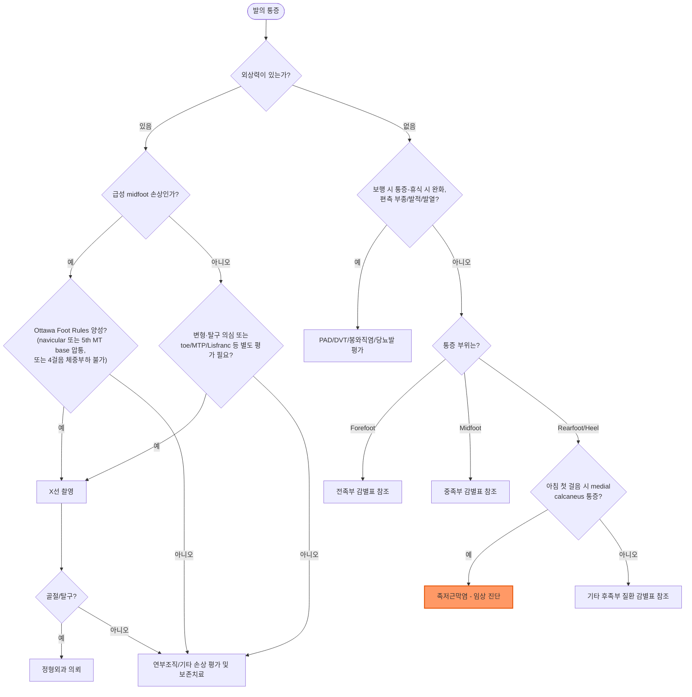

# 발의 통증 Foot Pain

## <mark style="color:green;">일반 사항</mark>

* 발가락에서 발뒤꿈치까지 발에 발생하는 통증의 총칭이며, 원인이 매우 다양하여 병력 청취와 통증 부위에 기반한 체계적 감별이 중요
* 지역사회 기반 역학 연구들에서 65세 이상 성인의 약 20\~30%가 발의 통증을 경험하며, 고령 남성의 약 20%, 여성의 약 25%에서 일상 활동에 지장을 줄 정도의 통증을 호소
* 삶의 질 저하, 낙상 위험 증가와 연관되며 우울 등 정신 건강 및 전반적 신체 활동 감소와도 관련됨
* 위험 인자 : 고령, 비만, 과사용(활발한 신체 활동·운동선수·무용수·군인), 당뇨병(신경병증·혈관병증), 흡연(말초혈관질환), 부적절한 신발, 장시간 서 있거나 걷는 직업

✽ [Foot anatomy](https://www.orthopaedia.com/anatomy-of-the-foot-ankle/), [Foot muscle(3D)](https://www.innerbody.com/anatomy/muscular/leg-foot)

## <mark style="color:green;">원인 및 위험 인자</mark>

* 국소적 원인 (구조적 이상, 과사용성 손상, 외상, 국소 염증/감염, 종양)이 가장 흔함
* 전신성/혈관성 원인도 반드시 고려 : 말초동맥질환(PAD), 심부정맥혈전증(DVT), 당뇨병성 신경병증 및 Charcot 관절병증, 통풍·류마티스관절염 등 전신 염증성 관절염, 봉와직염·괴사성 근막염 등 감염
* 임신 중 체중 증가, 급격한 운동량 증가, 신발 교체는 흔한 유발 계기

***

### <mark style="color:$danger;">🚩 Red Flags!</mark>

<mark style="color:$danger;">**즉각 조치 또는 의뢰**</mark>

* 급성 하지허혈 징후(창백·무맥·심한 통증·마비·감각소실, 소위 6P) → 혈관외과 응급 의뢰
* 개방성 골절, 명백한 변형·탈구를 동반한 외상 → 응급 정형외과 의뢰
* 심한 통증(이학적 소견에 비해 불균형적)과 함께 급속히 진행하는 부종·수포·피부 괴사 → 괴사성 근막염 의심, 응급 의뢰
* 당뇨병 환자의 발 감염에서 전신 독성 징후(발열·빈맥·저혈압 등 패혈증 소견), 급속히 진행하는 괴사·괴저, deep abscess 의심, 또는 중증 허혈 동반 → severe diabetic foot infection 의심, 응급 의뢰
* 급성 비외상성 단관절의 심한 통증·부종·발적 및 수동 ROM의 현저한 제한 ± 발열 → 패혈성 관절염 우선 배제; 응급 관절천자/전문의 평가

<mark style="color:$warning;">**당일 또는 조기 의뢰**</mark>

* 외상 후 국소 골 압통 또는 지속적 체중 부하 통증 → 골절/스트레스 골절 의심, 조기 영상검사
* 편측 하지 부종·발적·열감 → DVT 또는 봉와직염 의심, 당일 평가(DVT는 Wells score 기반 압박 초음파(compression duplex US)로 평가; Homans sign은 민감도·특이도가 낮고 색전 위험이 있어 더 이상 권장되지 않음)
* 당뇨병 환자에서 전신상태는 안정적이나 발적·부종을 동반한 깊은 궤양, probe-to-bone 양성 소견 → 골수염/심부 연부조직 감염 의심, 당일 평가
* 급성 1st MTP 통증·발적·부종(특히 발열 동반 시 패혈성 관절염과 감별 필요) → 통풍 발작 의심, 당일 평가
* 당뇨병성 말초신경병증 환자에서 새로 발생한 편측 발의 부종·발적·온도 상승(통증은 없거나 경미할 수 있으나 있을 수도 있음) → active Charcot neuro-osteoarthropathy 의심; 확진을 기다리지 말고 즉시 고정 및 off-loading(가능하면 knee-high immobilization)을 시작하고 조기 전문의 의뢰; 초기 X선이 정상이어도 배제되지 않으며 MRI가 더 민감함
* 진행성 근력 저하 또는 확산되는 감각 저하 → 척수·말초신경 압박 의심, 신경과/정형외과 의뢰
* 갑작스러운 후족부 통증·"뚝" 소리/파열감 + plantar flexion 약화 또는 Thompson test 양성 → Achilles tendon rupture 의심, 즉시 부목 고정 및 정형외과 조기 의뢰

<mark style="color:$info;">**외래 추적 / 추가 평가 계획**</mark> <mark style="color:$info;">- 즉각 위험 낮으나 호전 없으면 의뢰</mark>

* 표준 보존적 치료(4\~6주) 후에도 호전 없는 족저근막염, Morton neuroma 등 → 영상검사 및 전문과 의뢰 고려
* 신발 교정에도 지속되는 무지외반증(bunion) 등 구조적 변형 → 정형외과/족부 전문의 의뢰
* 급성 징후 없는 만성 다발 관절 침범 → 류마티스내과 협진 고려

***

## <mark style="color:green;">진단</mark>

### <mark style="color:orange;">병력/증상에 따른 감별 진단</mark>

**통증이 지속되는가 간헐적인가?**

* 지속적·휴식 시 통증 : 염증성 질환, 진행된 과사용성 병변, 골절, 감염, 종양 등을 우선 고려(감별 특이도는 낮음)
* 특정 활동·체중 부하 시 반복되는 통증 : 기계적·과사용성 원인을 우선 고려. 예) cuboid syndrome(cuboid subluxation) - 울퉁불퉁한 표면을 걸을 때 유발되는 외측 중족부 통증

**통증의 양상(예: 둔탁함, 예리함, 타는 듯함)은?**

* 날카로운 통증 : 관절, 힘줄의 급성 손상
* 둔한 통증 : 만성 손상. 예) hallux rigidus - 1st MTPJ의 만성 둔통
* burning pain : 신경 손상. 예) tarsal tunnel syndrome - 발바닥 표면의 타는 듯한 통증

**관련 증상이 있는가?**

* 무감각, 이상 감각 : 발 이외 부분의 문제. 예) 척수나 말초신경의 압박
* 보행 시 종아리·발 통증이 있다가 휴식하면 수 분 내 완화 → 간헐적 파행(intermittent claudication), 말초동맥질환(PAD) 의심(특히 흡연자·당뇨병·고령); ABI(ankle-brachial index) 측정으로 평가

**방사통이 있는가?**

* 신경 자극을 일으키는 발의 문제
* 전족 발바닥 및 경골신경의 분포를 따라 통증 : tarsal tunnel syndrome
* 3rd(때로 2nd) intermetatarsal space의 burning/tingling 통증이 인접한 두 발가락으로 방사하고, 좁은 신발·forefoot compression으로 악화되며 Mulder click이 양성일 수 있음 : Morton neuroma

**체중 부하가 있을 때만 통증이 발생하는가? 야간 통증이 있는가?**

* 야간 통증 : 종양, 감염, 염증성 질환, 당뇨병성 신경병증을 우선 고려; 진행된 스트레스 골절에서도 휴식통·야간통이 나타날 수 있음(초기에는 전형적으로 활동·체중부하 통증)
* 체중 부하 시 통증 : 족저근막염, tendinopathy, metatarsalgia

**만성 질환이 있는가?**

* 당뇨병 : 신경병증, Charcot 관절병증, 혈관병증
* 통풍 : 특히 1st MTPJ 통증
* 흡연, 이상지질혈증, 당뇨병 등 심혈관 위험인자 : PAD

**임신으로 인한 체중 증가가 있었는가?**

* longitudinal 또는 transverse arch 붕괴
* longitudinal arch 또는 metatarsal 부위의 trigger pain

**변화와 관련된 요인이 있는가?**

* 달리기 거리의 상당한 증가 같은 운동/활동 증가와 관련된 통증 : overuse injury
* 통증 시작 전 신발 교체나 착용 방법 변경 : 신발 문제
* 지난 1년간 상당한 체중 증가 : 족저근막염

**통증을 완화시키는 것은?**

* 폭이 넓은 신발 착용 시 호전 : bunion(hallux valgus), Morton neuroma

### <mark style="color:orange;">통증 부위에 따른 감별 진단</mark>

#### <mark style="color:$primary;">Forefoot pain, Non-traumatic</mark>

**국소 병소 - 엄지발가락**

<table><thead><tr><th width="260">소견</th><th>의심 진단</th></tr></thead><tbody><tr><td>Valgus deviation</td><td>bunion (hallux valgus)</td></tr><tr><td>Varus deviation</td><td>hallux varus</td></tr><tr><td>1st MTP의 irregularity &amp; enlargement</td><td>골관절염, 통풍, 기타 퇴행성 질환</td></tr><tr><td>엄지발가락의 수동 신전 제한</td><td>hallux limitus, hallux rigidus</td></tr><tr><td>급성 통증·압통·부종·발적</td><td>gout, 드물게 pseudogout 또는 septic joint</td></tr></tbody></table>

**국소 병소 - 엄지발가락 이외**

<table><thead><tr><th width="260">소견</th><th>의심 진단</th></tr></thead><tbody><tr><td>MTP dorsiflexion, PIP plantar flexion, neutral DIP</td><td>hammertoe</td></tr><tr><td>MTP dorsiflexion, PIP &amp; DIP plantar flexion</td><td>claw toe</td></tr><tr><td>5th toe의 rotation &amp; metatarsal bone prominence</td><td>bunionette</td></tr><tr><td>DIP joint plantar flexion</td><td>mallet toe</td></tr><tr><td>MTP, PIP, &amp; DIP joint plantar flexion</td><td>curly toes</td></tr><tr><td>다른 발가락 위 또는 아래로 꼬임</td><td>crossover toes</td></tr></tbody></table>

**Forefoot 피부 또는 발톱의 변화**

<table><thead><tr><th width="260">소견</th><th>의심 진단</th></tr></thead><tbody><tr><td>2nd MT head plantar surface의 큰 callus</td><td>Morton callus의 metatarsalgia</td></tr><tr><td>여러 발가락 MT head plantar surface의 calluses</td><td>metatarsalgia (transverse arch drop, neurogenic condition 관련)</td></tr><tr><td>중심부 core가 있는 callus</td><td>corn (☞ [티눈](../229_/183_-callus-corn.md))</td></tr><tr><td>PIP dorsum의 callus</td><td>신발 마찰 (hammer 또는 curly toe 관련)</td></tr><tr><td>깎아내면 dark dots가 발생하는 callus-like skin</td><td>plantar wart</td></tr><tr><td>Nail bed 측부의 염증 반응</td><td>ingrown toenail</td></tr><tr><td>발톱 모양 이상</td><td>nail dystrophy</td></tr></tbody></table>

* MTP 또는 PIP joints의 광범위한 변화 → rheumatoid arthritis 또는 osteoarthritis
* 발 모양에 명백한 변화가 없는 forefoot pain
  * metatarsal head plantar surface 통증 → metatarsalgia
  * metatarsal shaft의 국소 골 압통 → stress reaction/fracture 감별
  * 3rd(때로 2nd) intermetatarsal space의 burning/tingling 통증, 인접한 두 발가락으로 방사; 좁은 신발·forefoot compression으로 악화, Mulder click 양성 가능 → Morton neuroma

#### <mark style="color:$primary;">Forefoot pain, Trauma-related</mark>

<table><thead><tr><th width="300">소견</th><th>의심 진단</th></tr></thead><tbody><tr><td>엄지발가락의 acute hyperextension 직후 또는 잠시 후 통증·부종</td><td>MTP sprain (“turf toe”)</td></tr><tr><td>1st MTP joint의 지속적 통증, 신발 압박 병력</td><td>sesamoid injury, corn/callus, 드물게 stress fracture</td></tr><tr><td>외상 후 발톱 밑 변색·통증</td><td>subungual hematoma, fracture</td></tr><tr><td>외상 후 압통·변색·malalignment</td><td>toe fracture or dislocation</td></tr><tr><td>외상 또는 과사용 후 forefoot dorsum 부종·압통</td><td>metatarsal fracture, stress fracture</td></tr></tbody></table>

#### <mark style="color:$primary;">Midfoot pain</mark>

**Medial arch, navicular prominence, 또는 N-spot 통증**

<table><thead><tr><th width="300">소견</th><th>의심 진단</th></tr></thead><tbody><tr><td>N-spot 압통<br><em>(N-spot: navicular 근위 배측 표면을 덮는 부위)</em></td><td>navicular stress fracture</td></tr><tr><td>navicular prominence 통증 &amp; posterior tibialis 검사 시 통증</td><td>insertional tendinopathy</td></tr><tr><td>현저한 navicular prominence</td><td>fibrous separation 또는 피로골절을 동반한 accessory navicular</td></tr><tr><td>medial arch 통증, navicular 자체 직접 압통은 없음</td><td>longitudinal arch strain</td></tr><tr><td>midfoot plantar surface를 따라 결절</td><td>plantar fibromatosis (Ledderhose disease)</td></tr></tbody></table>

* 편측성 medial longitudinal arch 소실, hindfoot valgus, forefoot abduction ± navicular 부위 통증 → progressive collapsing foot deformity(PCFD; 과거 posterior tibial tendon dysfunction/adult-acquired flatfoot) 고려; posterior tibialis tendon 및 spring ligament(calcaneonavicular ligament)의 기능부전이 흔히 관여

**Midfoot dorsum 통증**

<table><thead><tr><th width="300">소견</th><th>의심 진단</th></tr></thead><tbody><tr><td>tarsometatarsal(TMT) 관절의 bony irregularity</td><td>TMT 또는 전반적 관절염</td></tr><tr><td>외상 후 Lisfranc joint(=TMT joints) 통증</td><td>Lisfranc joint 염좌 또는 골절</td></tr><tr><td>midfoot dorsum의 soft swollen mass</td><td>ganglion cyst</td></tr><tr><td>extensor tendon을 따라 부종, resisted toe extension 시 통증</td><td>extensor tendinopathy</td></tr></tbody></table>

**Lateral midfoot 통증**

<table><thead><tr><th width="300">소견</th><th>의심 진단</th></tr></thead><tbody><tr><td>압통, cuboid mobility 증가</td><td>cuboid syndrome (cuboid subluxation)</td></tr><tr><td>resisted foot eversion 시 통증</td><td>fibularis(peroneus) brevis/longus tendinopathy</td></tr><tr><td>fifth metatarsal base의 부종·통증</td><td>enthesopathy 또는 avulsion fracture</td></tr></tbody></table>

#### <mark style="color:$primary;">Rear Foot pain</mark>

**Plantar fascia의 medial calcaneus plantar insertion 부위 통증**

<table><thead><tr><th width="300">소견</th><th>의심 진단</th></tr></thead><tbody><tr><td>아침 첫 발을 디딜 때 특히 심한 통증</td><td>족저근막염 (☞ 아래 상세 참조)</td></tr><tr><td>야간 통증, calcaneus 광범위 압통</td><td>calcaneal stress fracture</td></tr><tr><td>calcaneus 위에서 가장 심한 압통, 엄지발가락 신전에 악화되지 않음</td><td>heel fat-pad syndrome/fat-pad contusion, calcaneus 미세골절</td></tr></tbody></table>

**Posterior calcaneus/Achilles 부위 통증**

<table><thead><tr><th width="300">소견</th><th>의심 진단</th></tr></thead><tbody><tr><td>Achilles 부착부 부종 및 squeezing 시 통증, bony irregularity 동반</td><td>insertional enthesopathy, Haglund deformity</td></tr><tr><td>Achilles 부착부에서 근위로 2\~6㎝ 부위의 방추형 비후·압통(부착부와 구분됨)</td><td>non-insertional(mid-portion) Achilles tendinopathy</td></tr><tr><td>plantar flexion 시 통증 악화</td><td>os trigonum 또는 후방 충돌증후군(talar spurring)</td></tr><tr><td>Achilles tendon 전방, posterior calcaneus와 tendon 사이(retrocalcaneal bursa 부위)의 국소 압통·부종</td><td>retrocalcaneal bursitis</td></tr></tbody></table>

**Rigid flat foot & Rear foot bony irregularity**

* rear foot 움직임 제한 → tarsal coalition
* palpable bony irregularity → accessory ossicle

**Talar dome 또는 talus 측면 압통**

* 발목 신전/굴곡 시 악화 → 전방 충돌증후군(tibial/talar spurring 기원)
* talus 측부 통증, 반복적/심한 발목 염좌 병력 → talus의 osteochondral injury

**Lateral malleolus 전방/후방 부종·통증**

* resisted foot eversion 시 악화 → fibularis(peroneal) tendinopathy
* 전방 부종이 더 심하고 rear foot pronation 동반 → sinus tarsi syndrome

**발바닥을 따라 통증, 뚜렷한 국소 압통은 없음**

* medial malleolus 후하방(tarsal tunnel 부위)의 Tinel’s sign 양성 또는 현저한 pronation → tarsal tunnel syndrome

**Fat pad 및 calcaneus의 무통성 flesh-colored papules**

* heel strike 압력 증가와 관련 → piezogenic papules

### <mark style="color:orange;">영상 검사 원칙</mark>

* 비외상성 족저근막염 등 전형적 임상 양상은 병력·이학적 검사만으로 진단 가능하며 일상적 방사선 촬영은 불필요 [ACFAS Clinical Consensus Statement, 2017]
* 만성 발 통증에서 구조적·골성 원인의 영상평가가 필요한 경우 radiography가 일반적인 1차 검사이며, 정렬·변형 평가가 중요한 경우 체중 부하 촬영을 고려 [ACR Appropriateness Criteria® Chronic Foot Pain]
* 급성 midfoot 외상에서는 Ottawa Foot Rules 적용 : midfoot 통증 + (① navicular 압통, ② 5th metatarsal base 압통, ③ 손상 직후 및 진료 시점 모두 4걸음 체중부하 불가) 중 하나라도 해당 시 X선 촬영
  * ✽ Ottawa Foot Rules는 주로 10일 이내의 급성 midfoot/ankle 손상에서 검증되었으며, calcaneus body·toe/MTP 손상 및 Lisfranc 손상은 별도의 임상 판단이 필요
  * ✽ 발목(양측 malleolus 후연 6㎝ 이내) 압통·부종에 대한 X선 적응증은 별도의 Ottawa Ankle Rules로 판단하며, 본 Foot Rules는 midfoot(navicular, 5th MT base) 영역에 적용
* 초기 X선 음성이나 스트레스 골절이 강하게 의심되는 경우(특히 navicular 등 고위험 부위) → MRI 우선 고려(필요시 CT 추가); 초음파는 표재성 연부조직 병변 평가에 선택적으로 사용
* 3개월 이상 지속되는 난치성 통증에서 연부조직 병변 감별이 필요한 경우 → 초음파 또는 MRI 고려

***



<p align="center"><strong>발의 통증 - 병력 기반 감별 알고리듬</strong></p>

<p align="center"><em><mark style="color:$info;">Ref. Ottawa Ankle Rules; ACR Appropriateness Criteria® Acute Trauma to the Foot; ACFAS Clinical Consensus (2017); JOSPT/APTA Heel Pain-Plantar Fasciitis CPG (2023)</mark></em></p>

***

## <mark style="background-color:$warning;">Management</mark>

* 발의 통증은 원인에 따라 치료 방향이 크게 다르므로, 우선 Red Flags 배제 후 원인별 접근 필요
* 대부분의 국소적·과사용성 원인은 보존적 치료(활동 조절, 신발 교정, 스트레칭)로 호전
* 발생 빈도가 가장 높은 족저근막염은 별도 상세 섹션 참조 (☞ 아래)
* 원인 질환이 확인되면 해당 질환의 전문 치료(정형외과·류마티스내과·혈관외과 등)로 연계

<table><thead><tr><th width="170">주요 원인군</th><th>1차 치료 방향</th></tr></thead><tbody><tr><td>과사용성 건병증(tendinopathy), 근막염</td><td>활동 조절, 스트레칭, 온/냉찜질, NSAID prn</td></tr><tr><td>구조적 변형(bunion, hammertoe 등)</td><td>넓은 신발, 패딩·교정기; 증상 지속 시 정형외과 의뢰</td></tr><tr><td>신경성(Morton neuroma, tarsal tunnel)</td><td>신발 교정, 패딩; 난치성 시 주사·수술 고려</td></tr><tr><td>외상성(골절, 염좌)</td><td>고정/부목, 체중 부하 제한, 정형외과 의뢰</td></tr><tr><td>전신 염증성(통풍, RA)</td><td>기저 질환 치료; 급성기 NSAID/colchicine 등</td></tr><tr><td>혈관성(PAD)</td><td>위험인자 관리, 혈관외과 협진</td></tr></tbody></table>

***

## <mark style="color:green;">족저근막염 Plantar Fasciitis - 발뒤꿈치 통증의 가장 흔한 원인</mark>

### <mark style="color:orange;">정의 및 기전</mark>

* 발뒤꿈치에서 발가락까지 이어지는 fibrous tissue인 족저근막의 통증성 병변
* 추정 기전 : 발뒤꿈치 족저근막 부착부의 반복적 미세 손상(microtear)과 그 치유 과정에서 발생하는 콜라겐 변성 및 국소 염증성 변화 - 조직학적으로는 만성 퇴행성(fasciosis) 소견이 더 두드러진다는 보고가 많아 "-itis"보다 실제로는 만성 과사용 손상에 가깝다는 관점도 있음
* 자연 경과 : 대개 수개월의 보존적 치료로 호전되나 회복이 더딘 경우가 흔하며, 약 80%는 12개월 이내 증상이 소실됨

### <mark style="color:orange;">위험 인자</mark>

* 비만
* 중년(40\~60세), 여성에서 다소 호발
* 편평족, 요족 등 아치 이상
* 장시간 서 있는 직업, 달리기, 에어로빅 등 반복적 충격 활동
* 비활동 상태에서 갑작스런 보행/운동량 증가
* 아킬레스건-비복근 단축(tight gastrocnemius-soleus complex)

### <mark style="color:orange;">임상 양상</mark>

* proximal medioplantar surface(발뒤꿈치 바닥\~족부 내측)의 찌르는 듯한, 방사되지 않는 통증
* anteromedial calcaneus의 족저근막 부착부 압통, 발가락(특히 엄지) 신전 시 통증 악화(windlass test 양성 - 엄지발가락을 수동으로 배굴시켜 통증이 재현되는 소견)
* 통상 감각 저하는 동반하지 않음
* 보행 시작 시, 특히 아침 첫 걸음이나 장시간 앉았다 일어난 직후 심하고 활동하면서 일부 완화되나, 장시간 걷거나 서 있으면 다시 악화되고 앉아 쉬면 호전되는 경과가 특징적

### <mark style="color:orange;">진단</mark>

* 전형적 병력(아침 첫 걸음 통증)과 anteromedial calcaneus 압통이라는 이학적 소견이 있고, 과사용·신발 교체·딱딱한 바닥 운동·갑작스런 활동 증가 등의 유발 병력이 부합하면 임상적으로 진단 가능하며 일상적 영상검사는 불필요 [ACFAS 2017]
* 초음파 : 진단이 모호하거나 표준 치료에도 3개월 이상 지속 시 고려(족저근막 두께 비후 소견이 참고됨)
* X선 : 골극(calcaneal spur) 확인 목적보다는 스트레스 골절 등 다른 골격 원인 감별을 위해 고려 - 골극 유무는 증상 중증도와 상관성이 낮음

#### <mark style="color:$primary;">흔한 발뒤꿈치 통증의 감별</mark>

<table><thead><tr><th width="250">감별 진단</th><th>시사 소견</th></tr></thead><tbody><tr><td>Calcaneal stress fracture</td><td>활동 증가 후 발생, 종골 광범위 압통·squeeze test 양성, 진행하면 휴식 시에도 통증</td></tr><tr><td>Heel fat-pad syndrome</td><td>발뒤꿈치 중앙부 깊은 통증, 딱딱한 바닥·맨발 보행에서 악화, 족저근막 부착부 압통은 덜함</td></tr><tr><td>Tarsal tunnel syndrome</td><td>발목 내측~발바닥의 burning/paresthesia, 경골신경 분포, medial malleolus 후하방(tarsal tunnel 부위)에서 Tinel sign 양성 가능</td></tr><tr><td>Baxter nerve entrapment</td><td>발뒤꿈치 내측 근위부의 국소 신경성 통증, 활동 시 악화되며 감각 이상이 뚜렷하지 않을 수 있음; 소지외전근(abductor digiti minimi) 약화 동반 가능</td></tr><tr><td>S1 radiculopathy</td><td>요통 또는 둔부~하지 방사통, 감각·근력·반사 이상 동반 가능</td></tr><tr><td>Inflammatory enthesitis</td><td>양측성 또는 반복성 heel pain, 장시간 조조강직, 척추관절염 관련 증상 동반</td></tr><tr><td>Calcaneal apophysitis (Sever disease)</td><td>성장기 소아·청소년, 달리기·점프 활동 후 후족부 통증과 calcaneal squeeze tenderness; 소아 청소년에서는 우선 감별</td></tr></tbody></table>

### <mark style="color:orange;">치료</mark>


**단계별 치료 전략**

1차 치료는 교육·활동/신발 조정, 족저근막 및 종아리 스트레칭, 필요시 테이핑·도수치료·운동치료를 병행한다 [JOSPT/APTA 2023 CPG]. 아침 첫걸음 통증이 지속되면 1\~3개월간 night splint를 고려한다 [JOSPT/APTA 2023, Grade A]. 표준 보존치료에 반응이 불충분하면 단계적으로 ESWT 또는 맞춤 교정기 등을 추가하고 [BJSM Best Practice Guide, 2021], corticosteroid 주사는 단기 통증 완화 효과와 파열·지방패드 위축 위험을 함께 고려하여 선택적으로 사용한다.


#### <mark style="color:$primary;">보존적 치료 (1차)</mark>

* 적정 체중 유지
* 낮은 굽, 두꺼운 밑창, 아치 지지가 되는 신발 선택; 충격 흡수가 안 되는 신발(플랫슈즈, 하이힐) 회피
* 족저근막 특이적 스트레칭 및 비복근-가자미근 스트레칭, 마사지, 냉찜질, 뒤꿈치 쿠션/패드
* 도수치료, 강화·신경근 재훈련 [JOSPT/APTA 2023]
* 테이핑(다른 물리치료와 병행 시 단기 효과) [JOSPT/APTA 2023]
* trigger point dry needling(비복근·가자미근·족저근 부위) : 통증 감소를 위한 보조 치료로 고려 가능 [JOSPT/APTA 2023]
* 아침 첫 걸음 통증이 두드러진 환자에서 야간 부목(약간의 ankle dorsiflexion 유지)을 1\~3개월 고려 [JOSPT/APTA 2023, Grade A]
* 맞춤 또는 기성 발 교정기(orthoses) : 단독 치료보다는 스트레칭·교육·테이핑 등 다른 보존치료와 병행하여 사용 [JOSPT/APTA 2023]. Core treatment에 충분히 반응하지 않는 경우 ESWT 후 custom orthoses를 단계적으로 고려할 수 있음 [BJSM Best Practice Guide, 2021]
* 운동 변경
  * 회피 : 체중 부하 충격 활동. 예) 등산, 달리기, 오래 걷기
  * 선택 : 족저근막에 부하가 덜한 운동. 예) 고정식 자전거, 수영

#### <mark style="color:$primary;">약물 치료</mark>

* NSAID : 통증에 따라 간헐적 사용; 위장관·신장 위험 고려
* 국소(외용) NSAID : 국소 근골격계 통증에 대한 일반적 진통 전략으로, 전신 NSAID 부작용 위험이 높은 고령·다약제 복용 환자에서 선택적으로 고려
* 국소 corticosteroid 주사 : 단기 통증 경감에는 효과적이나 효과가 일시적이며, 반복 주사 시 족저근막 파열 및 발뒤꿈치 지방패드 위축 위험이 있으므로 반복 주사는 피하거나 최소화하고, 가능한 경우 초음파 유도 하 시행을 고려


**⚠️ 국소 스테로이드 주사 관련 주의**\
반복적인 족저근막 국소 스테로이드 주사는 족저근막 파열 및 지방패드 위축을 유발할 수 있으므로, 동일 부위 반복 주사는 피하거나 최소화하고 가능한 경우 초음파 유도 하 시행을 고려하십시오. 주사 직후 격렬한 체중 부하 활동은 피하도록 안내가 필요합니다.


#### <mark style="color:$primary;">시술적 치료 (난치성)</mark>

* 단계적 접근 : core conservative treatment(교육·스트레칭·테이핑·orthoses) → ESWT → (반응 불충분 시) 수술적 치료 순으로 진행 [BJSM Best Practice Guide, 2021]
* extracorporeal shock wave therapy(ESWT) : 교육·스트레칭·테이핑 등 충분한 core conservative treatment에도 임상적으로 의미 있는 호전이 없을 때 단계적 추가 치료로 고려 [BJSM Best Practice Guide, 2021]
* endoscopic/open fasciotomy : 6\~12개월의 충분한 보존적 치료에도 활동 제한이 지속되는 난치성 환자에서 정형외과/족부 전문의 의뢰 후 고려하는 최후 선택지

## <mark style="color:green;">비-약물 치료 및 예방 (공통 원칙)</mark>

* 볼이 넓고 완충력이 있는 신발 선택; 발에 맞지 않는 신발(하이힐, 플랫슈즈, 낡은 운동화) 회피
* 급격한 운동량·보행량 증가 지양, 점진적 활동량 조정
* 체중 관리
* 당뇨병 환자 : 매일 발 육안 검사, 적절한 발톱 관리, 정기적 신경병증·혈류 선별검사(모노필라멘트 검사, ABI 등), 상처 발생 시 조기 내원 교육

***

### <mark style="color:red;">질병코드</mark>

M79.67 발의 통증 (Pain in foot)

M72.2 발바닥근막성 섬유종증 [포함: 발바닥근막염]

M77.3 종골극(calcaneal spur)

✽정확한 청구 가능 여부 및 코드는 최신 KCD 고시를 반드시 확인할 것 (개정 가능)

✽임상적으로 족저근막염 진단이 명확한 경우, 특이도가 더 높은 M72.2를 주진단으로 우선 고려할 수 있음(참고용 팁이며 실제 청구 기준은 심사평가원 고시 확인 필요)

***

## <mark style="color:purple;">처방례</mark>

> **처방례 1. 경증 족저근막염**
>
> ```
> 이부프로펜 200 ㎎/T  1T  bid  필요시
> ```
>
> _✽경증에서는 통증 시에만 간헐적으로 NSAID 사용; 족저근막 스트레칭 및 신발 교정을 병행 지도_

> **처방례 2. 중등도, 아침 통증이 두드러지는 경우**
>
> ```
> 나프록센 250 ㎎/T  1T  bid  pc  5~7일
> ```
>
> ※ 이후 통증 시 필요에 따라 복용으로 전환\
> ※ 아침 첫 걸음 통증이 심한 경우 야간 부목 1\~3개월 병행 고려\
> ※ 위장관 위험인자(고령, 항응고제 병용, 소화성궤양 병력) 있으면 PPI 병용 또는 국소 NSAID로 대체

> **처방례 3. 충분한 보존적 치료에도 기능 제한이 지속되는 난치성 족저근막염**
>
> ```
> (정형외과/재활의학과 의뢰)
> 초음파 유도 하 국소 corticosteroid 주사 고려
> ```
>
> _✽4\~6주에도 호전이 불충분하면 우선 진단·순응도·스트레칭 수행 여부·신발 및 활동 조절·다른 heel pain 원인을 재평가; 충분한 core conservative treatment에도 기능 제한이 지속되는 경우 ESWT 또는 선택적 corticosteroid 주사를 단계적으로 고려하며, 반복 주사는 족저근막 파열·지방패드 위축 위험이 있어 피하거나 최소화하고 가능한 경우 초음파 유도 하 시행을 고려_

> **처방례 4. 당뇨병 동반 환자**
>
> ```
> 아세트아미노펜 500 ㎎/T  1~2T  tid  필요시
> ```
>
> _✽통상 최대 3 g/day; 저체중·음주·간질환에서는 추가 감량. NSAID는 신기능 저하 위험이 있는 당뇨병 환자에서 신중히 사용하고, 발 감각 저하 여부를 반드시 함께 확인. 근골격계 통증과 burning pain·야간 악화 등 신경병증성 통증 양상이 혼재된 경우 pregabalin, gabapentin, duloxetine 등 신경병증성 통증 1차 약제를 별도로 고려_

***

### <mark style="color:$success;">핵심 복약 지도</mark>

> **NSAID 사용**
>
> * 공복 복용 시 위장 장애가 있을 수 있어 식후 복용을 권장
> * 통증이 없는 날에는 복용을 중단하고 필요시로 전환할 수 있음을 안내
> * 고령, 항응고제·항혈소판제 병용, 신기능 저하 환자에서는 저용량·단기간 사용 원칙

> **아세트아미노펜 사용**
>
> * 통상 최대 3 g/day를 넘지 않도록 안내
> * 간질환, 과음, 저체중 환자에서는 추가 감량이 필요함을 설명

> **국소 스테로이드 주사 관련**
>
> * 효과는 일시적이며 반복 주사는 족저근막 파열, 지방패드 위축 위험이 있으므로 피하거나 최소화해야 함을 설명
> * 주사 후 수일간 격렬한 체중 부하 활동은 피하도록 안내

> **언제 다시 병원을 방문해야 하나요?**
>
> * 표준 보존치료(신발 교정, 스트레칭, NSAID) 4\~6주 이내에 호전이 없는 경우
> * 발뒤꿈치 통증과 함께 발적·부종·발열이 동반되는 경우 - 감염 감별 위해 조기 내원
> * 갑작스런 심한 통증과 함께 부종(파열 의심) - 즉시 내원
> * 당뇨병 환자에서 통증 양상이 변하거나 감각 저하가 동반되는 경우 - 즉시 내원

***

### <mark style="color:blue;">환자 안내서</mark>


**족저근막염, 아침 첫 걸음이 유독 아픈 발뒤꿈치 통증**

발바닥의 근막이 반복적인 자극으로 미세하게 손상되어 생기는 흔한 질환입니다. 대부분 수개월의 꾸준한 관리로 좋아지지만 회복에는 시간이 걸립니다.


#### <mark style="color:$primary;">왜 생기나요?</mark>

* 발바닥의 아치를 지탱하는 족저근막에 반복적인 충격이 누적되어 발생합니다
* 오래 서 있거나 걷는 일, 갑작스런 운동량 증가, 체중 증가, 맞지 않는 신발이 흔한 원인입니다

#### <mark style="color:$primary;">일상생활에서 어떻게 관리하나요?</mark>

* **아침에 일어나 걷기 전 발바닥과 종아리를 가볍게 스트레칭하십시오.** 자는 동안 짧아졌던 근막이 갑자기 늘어나며 통증이 유발되기 때문입니다
* **볼이 넓고 굽이 낮으며 쿠션이 있는 신발을 신으십시오.** 맨발이나 슬리퍼는 피하는 것이 좋습니다
* **아프면 잠시 활동을 줄이고, 아픈 만큼 무리한 걷기·달리기·등산은 피하십시오.**
* **체중이 늘었다면 감량을 목표로 하십시오.** 체중 조절은 회복에 가장 큰 영향을 미치는 요인 중 하나로, 체중 부하가 줄면 증상 완화와 재발 방지에 크게 도움이 됩니다

#### <mark style="color:$primary;">약은 어떻게 써야 하나요?</mark>

* 통증이 있을 때만 소염진통제를 필요에 따라 복용하며, 매일 규칙적으로 드실 필요는 없습니다
* 병원에서 맞는 스테로이드 주사는 효과가 일시적이며 반복 주사는 근막 파열이나 지방패드 위축 위험이 있어 가급적 최소화합니다

#### <mark style="color:$primary;">다음과 같은 경우 다시 진료를 받으세요</mark>

* **즉시 병원을 방문하세요** - 발뒤꿈치가 갑자기 붓고 열이 나거나 색이 변할 때, 갑작스럽게 통증이 심해지며 붓는 경우
* **예약하여 재평가를 받으세요** - 4\~6주 이상 꾸준히 관리했는데도 통증이 나아지지 않을 때
