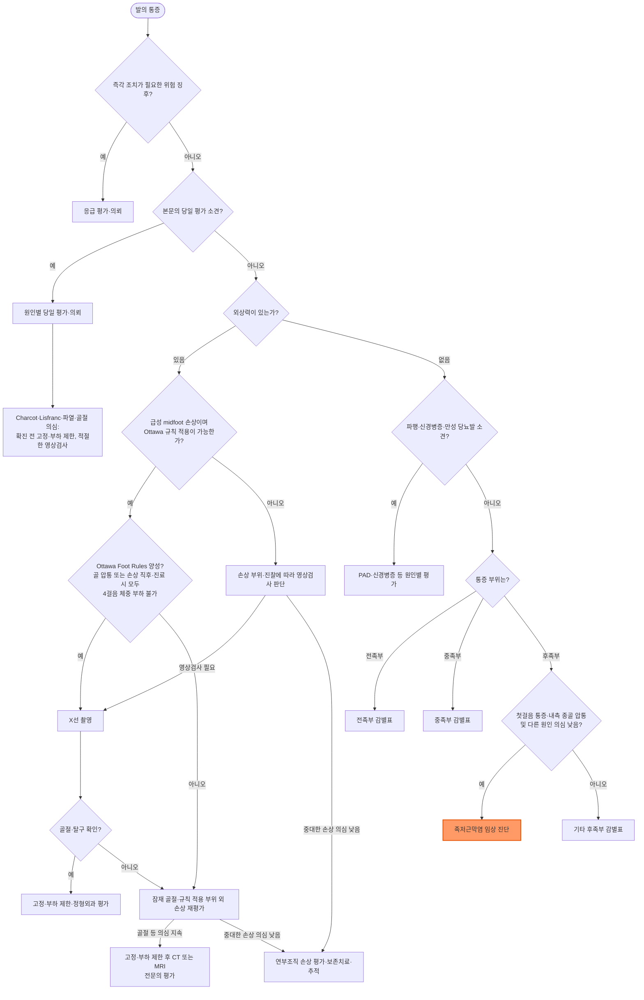

# 발의 통증 Foot Pain

## <mark style="color:green;">일반 사항</mark>

* 발가락에서 발뒤꿈치까지 발에 발생하는 통증의 총칭이며, 원인이 매우 다양하여 병력 청취와 통증 부위에 기반한 체계적 감별이 중요
* 고령자에서 흔하며, 유병률은 조사 대상·통증의 정의·회상 기간에 따라 다름; 일부에서는 보행과 일상 활동에 지장을 줄 정도의 통증을 호소
* 삶의 질 저하, 낙상 위험 증가와 연관되며 우울 등 정신 건강 및 전반적 신체 활동 감소와도 관련됨
* 위험 인자 : 고령, 비만, 과사용(활발한 신체 활동·운동선수·무용수·군인), 당뇨병(신경병증·혈관병증), 흡연(말초혈관질환), 부적절한 신발, 장시간 서 있거나 걷는 직업

✽ [Foot anatomy](https://www.orthopaedia.com/anatomy-of-the-foot-ankle/), [Foot muscle(3D)](https://www.innerbody.com/anatomy/muscular/leg-foot)

## <mark style="color:green;">원인 및 위험 인자</mark>

* 국소적 원인 (구조적 이상, 과사용성 손상, 외상, 국소 염증/감염, 종양)이 가장 흔함
* 전신성/혈관성 원인도 반드시 고려 : 말초동맥질환(PAD), 당뇨병성 신경병증 및 Charcot 관절병증, 통풍·류마티스관절염 등 전신 염증성 관절염, 봉와직염·괴사성 근막염 등 감염. DVT는 발에만 국한된 통증보다는 편측 종아리·하지 부종과 통증이 동반될 때 고려
* 임신 중 체중 증가, 급격한 운동량 증가, 신발 교체는 흔한 유발 계기

***

### <mark style="color:$danger;">🚩 Red Flags!</mark>

<mark style="color:$danger;">**즉각 조치 또는 의뢰**</mark>

* 급성 하지허혈 징후(갑작스러운 심한 통증, 차갑고 창백한 발, 맥박 감소·소실, 감각·운동 장애 등) → 혈관외과 응급 의뢰
* 외상 후 손상 정도에 비해 극심한 통증·팽팽한 부종, 수동 신장 시 통증 악화 ± 감각 이상 → 급성 구획증후군 의심, 맥박이 만져져도 응급 수술 평가
* 개방성 골절, 명백한 변형·탈구를 동반한 외상 → 응급 정형외과 의뢰
* 이학적 소견에 비해 불균형적으로 심한 통증 또는 급속히 진행하는 발적·부종 ± 전신 독성 소견 → 괴사성 근막염 의심, 응급 의뢰; 수포·피부 괴사가 나타날 때까지 기다리지 않음
* 당뇨병 환자의 발 감염에서 전신 독성 징후(발열·빈맥·저혈압 등 패혈증 소견)가 있는 중증 감염, 또는 심부 농양·광범위 괴저·괴사성 감염·구획증후군·중증 허혈을 동반한 중등도 감염 → 긴급 외과 평가; 감염과 허혈이 함께 있으면 혈관 전문의도 긴급 협진 [IWGDF/IDSA 2023]
* 급성 비외상성 단관절의 심한 통증·부종·발적 및 수동 ROM의 현저한 제한 ± 발열 → 패혈성 관절염 우선 배제; 응급 관절천자/전문의 평가
* 편측 하지 부종·통증과 함께 새로 발생한 호흡곤란·흉통·실신 → 폐색전증 의심, 응급 평가 [NICE NG158]

<mark style="color:$warning;">**당일~수일 내 평가**</mark>

* 외상 후 국소 골 압통 또는 체중 부하 불가 → 골절 의심, 당일 평가. 급격한 활동 증가 후 지속되는 국소 골 압통·체중 부하 통증 → 스트레스 골절 감별; 주상골 또는 제5중족골 근위부 등 고위험 부위가 의심되면 당일 고정·체중 부하 제한 및 조기 영상검사·정형외과 평가
* 편측 하지 부종·발적·열감 → DVT 또는 봉와직염 의심, 당일 평가(DVT 의심 시 Wells 점수로 임상 가능성을 판단하고 그 결과에 따라 D-dimer·압박 초음파 검사를 시행; Homans sign만으로 진단하거나 배제하지 않음) [NICE NG158]
* 당뇨병 환자에서 전신상태는 안정적이나 발적·부종을 동반한 깊은 궤양, probe-to-bone 양성 소견 → 골수염/심부 연부조직 감염 의심, 당일 평가
* 급성 1st MTP 통증·발적·부종 → 통풍 발작 의심, 당일 평가; 발열이 없어도 패혈성 관절염은 배제되지 않으며, 위의 응급 관절염 소견이 있으면 즉각 평가
* 당뇨병성 말초신경병증 환자에서 새로 발생한 편측 발의 부종·발적·온도 상승(통증은 없거나 경미할 수 있으나 있을 수도 있음) → active Charcot neuro-osteoarthropathy 의심, 당일 평가; 확진을 기다리지 말고 즉시 무릎 높이 고정 및 부하 경감(knee-high immobilization/off-loading)을 시작하고 전문의 의뢰. 초기 X선이 정상이어도 의심이 지속되면 MRI 시행 [IWGDF 2023]
* 새로 발생하거나 진행하는 근력 저하(foot drop 포함) 또는 확산되는 감각 저하 → 당일 신경학적 평가; 요통과 함께 배뇨·배변 장애·회음부 감각 저하가 동반되면 마미증후군 가능성으로 즉각 응급 평가
* 갑작스러운 후족부 통증·"뚝" 소리/파열감 + plantar flexion 약화 또는 Thompson test 양성 → Achilles tendon rupture 의심, 당일 평가; 발목을 족저굴곡 위치로 부목 고정하고 체중 부하 제한 후 정형외과 의뢰. 일부 능동 족저굴곡이 가능해도 파열을 배제하지 못함
* 외상 후 TMT 관절 압통·부종, 발바닥 중족부의 멍 또는 체중 부하 곤란 → Lisfranc 손상 의심, 당일 고정·체중 부하 제한 및 영상검사·정형외과 평가
* 지속적 허혈성 휴식통, 낫지 않는 발 궤양 또는 괴저 → 만성 사지위협허혈(CLTI) 의심, 신속한 혈관 평가; 급성 허혈 또는 감염 동반 괴저는 즉각 조치

<mark style="color:$info;">**외래 추적 / 추가 평가 계획**</mark> <mark style="color:$info;">- 즉각 위험 낮으나 호전 없으면 의뢰</mark>

* 초기 보존적 치료(4\~6주)에도 호전 없는 족저근막염, Morton neuroma 등 → 진단·치료 수행을 재평가하고, 비전형적 소견 또는 지속적 기능 제한이 있으면 영상검사·전문과 의뢰 고려
* 신발 교정에도 지속되는 무지외반증(bunion) 등 구조적 변형 → 정형외과/족부 전문의 의뢰
* 급성 징후 없는 만성 다발 관절 침범 → 류마티스내과 협진 고려

***

## <mark style="color:green;">진단</mark>

### <mark style="color:orange;">병력/증상에 따른 감별 진단</mark>

**통증이 지속되는가 간헐적인가?**

* 지속적·휴식 시 통증 : 염증성 질환, 진행된 과사용성 병변, 골절, 감염, 종양 등을 우선 고려(감별 특이도는 낮음)
* 특정 활동·체중 부하 시 반복되는 통증 : 기계적·과사용성 원인을 우선 고려. 예) cuboid syndrome - 체중 부하 시 악화되는 외측 중족부 통증

**통증의 양상(예: 둔탁함, 예리함, 타는 듯함)은?**

* 날카로운 통증 : 관절, 힘줄의 급성 손상
* 둔한 통증 : 만성 손상. 예) hallux rigidus - 1st MTPJ의 만성 둔통
* burning pain : 신경 손상. 예) tarsal tunnel syndrome - 발바닥 표면의 타는 듯한 통증

**관련 증상이 있는가?**

* 무감각, 이상 감각 : 국소 신경 포착(족근관증후군 등), 당뇨병성 말초신경병증, 신경근병증 등을 분포와 동반 증상에 따라 감별
* 보행 시 종아리·발 통증이 있다가 휴식하면 수 분 내 완화 → 간헐적 파행(intermittent claudication), 말초동맥질환(PAD) 의심(특히 흡연자·당뇨병·고령); ABI(ankle-brachial index) 측정으로 평가

**방사통이 있는가?**

* 신경 자극을 일으키는 발의 문제
* 전족 발바닥 및 경골신경의 분포를 따라 통증 : tarsal tunnel syndrome
* 3rd(때로 2nd) intermetatarsal space의 burning/tingling 통증이 인접한 두 발가락으로 방사하고, 좁은 신발·forefoot compression으로 악화되며 Mulder click이 양성일 수 있음 : Morton neuroma

**체중 부하가 있을 때만 통증이 발생하는가? 야간 통증이 있는가?**

* 야간 통증 : 신경병증, 허혈성 휴식통, 염증성 질환, 감염 및 드물게 종양을 고려; 진행된 스트레스 골절에서도 휴식통·야간통이 나타날 수 있음(초기에는 전형적으로 활동·체중 부하 통증). 발을 침대 아래로 내리면 완화되는 전족부 휴식통은 허혈 가능성을 시사
* 체중 부하 시 통증 : 족저근막염, tendinopathy, metatarsalgia

**만성 질환이 있는가?**

* 당뇨병 : 신경병증, Charcot 관절병증, 혈관병증
* 통풍 : 특히 1st MTPJ 통증
* 흡연, 이상지질혈증, 당뇨병 등 심혈관 위험인자 : PAD

**임신으로 인한 체중 증가가 있었는가?**

* 체중·인대 이완도 변화에 따른 발 크기와 아치 높이 변화, 종아치 또는 중족골 부위의 기계적 통증 가능
* 임신 자체로 아치 붕괴를 단정하지 않고, 편측 하지 부종·통증이 있으면 DVT 등 다른 원인도 평가

**변화와 관련된 요인이 있는가?**

* 달리기 거리의 상당한 증가 같은 운동/활동 증가와 관련된 통증 : overuse injury
* 통증 시작 전 신발 교체나 착용 방법 변경 : 신발 문제
* 지난 1년간 상당한 체중 증가 : 족저근막염

**통증을 완화시키는 것은?**

* 폭이 넓은 신발 착용 시 호전 : bunion(hallux valgus), Morton neuroma

### <mark style="color:orange;">기본 진찰</mark>

* 양측 발을 비교하고, 서기·보행 평가는 골절·파열·급성 Charcot 의심 소견이 없는 범위에서 시행
* 피부·발톱·발가락 사이의 상처, 궤양, 발적, 굳은살, 변형과 신발의 압박·마모 상태 확인
* 발등동맥·뒤정강동맥 맥박, 피부색·온도·모세혈관 재충만, 부종 및 감각·근력 평가
* 최대 압통 부위를 한 손가락으로 특정하고, 뼈·관절·힘줄·족저근막의 압통, 능동·수동 ROM 및 저항 운동 시 통증을 비교
* 부위별 검사 : 족저근막 windlass test, 종골 squeeze test, Morton neuroma의 forefoot compression/Mulder test, 족근관 부위 Tinel sign, 아킬레스건 파열의 Thompson test 등. 단일 검사 음성만으로 해당 질환을 배제하지 않음
* 후경골건 기능부전/PCFD 의심 시 한 발 뒤꿈치 들기(single-leg heel rise) 수행과 뒤꿈치 내반 여부 평가; 급성 손상 또는 체중 부하가 위험한 경우 시행하지 않음
* 당뇨병 환자의 보호감각은 10-g 모노필라멘트 또는 Ipswich touch test에 더하여 진동·통각·온도감각 중 적어도 한 검사를 함께 시행 [ADA 2026]

### <mark style="color:orange;">통증 부위에 따른 감별 진단</mark>

#### <mark style="color:$primary;">Forefoot pain, Non-traumatic</mark>

**국소 병소 - 엄지발가락**

<table><thead><tr><th width="260">소견</th><th>의심 진단</th></tr></thead><tbody><tr><td>Valgus deviation</td><td>bunion (hallux valgus)</td></tr><tr><td>Varus deviation</td><td>hallux varus</td></tr><tr><td>1st MTP의 irregularity &amp; enlargement</td><td>골관절염, 통풍, 기타 퇴행성 질환</td></tr><tr><td>엄지발가락의 수동 신전 제한</td><td>hallux limitus, hallux rigidus</td></tr><tr><td>급성 통증·압통·부종·발적</td><td>gout; CPP crystal arthritis는 제1 MTP에서 드묾. Septic arthritis는 빈도와 무관하게 우선 배제해야 할 감별 진단</td></tr></tbody></table>

**국소 병소 - 엄지발가락 이외**

<table><thead><tr><th width="260">소견</th><th>의심 진단</th></tr></thead><tbody><tr><td>PIP 굴곡이 주된 변형; MTP 신전이 동반될 수 있으며 DIP는 중립 또는 신전</td><td>hammertoe</td></tr><tr><td>MTP dorsiflexion, PIP &amp; DIP plantar flexion</td><td>claw toe</td></tr><tr><td>제5중족골두 외측 돌출·압통 ± 제5발가락 내반</td><td>bunionette</td></tr><tr><td>DIP joint plantar flexion</td><td>mallet toe</td></tr><tr><td>주로 PIP·DIP 굴곡과 발가락 내반·회전이 동반되어 인접 발가락 아래로 말림</td><td>curly toes</td></tr><tr><td>주로 제2발가락이 엄지 쪽으로 편위·겹침 ± MTP 불안정성</td><td>crossover toe; plantar plate/측부인대 기능부전 감별</td></tr></tbody></table>

**Forefoot 피부 또는 발톱의 변화**

<table><thead><tr><th width="260">소견</th><th>의심 진단</th></tr></thead><tbody><tr><td>제2중족골두 족저면의 국소 굳은살·압통</td><td>국소 압력 증가에 따른 기계적 metatarsalgia; Morton neuroma와 구별</td></tr><tr><td>여러 발가락 MT head plantar surface의 calluses</td><td>기계적 metatarsalgia, 발 변형 또는 신경병증성 압력 분포 이상 등</td></tr><tr><td>중심부 core가 있는 callus</td><td>corn (☞ [티눈](../229_/183_-callus-corn.md))</td></tr><tr><td>PIP dorsum의 callus</td><td>신발 마찰 (hammer 또는 curly toe 관련)</td></tr><tr><td>깎아내면 dark dots가 발생하는 callus-like skin</td><td>plantar wart</td></tr><tr><td>Nail bed 측부의 염증 반응</td><td>ingrown toenail</td></tr><tr><td>발톱 모양 이상</td><td>nail dystrophy</td></tr></tbody></table>

* MTP 또는 PIP joints의 광범위한 변화 → rheumatoid arthritis 또는 osteoarthritis
* 발 모양에 명백한 변화가 없는 forefoot pain
  * metatarsal head plantar surface 통증 → metatarsalgia
  * metatarsal shaft의 국소 골 압통 → stress reaction/fracture 감별
  * 주로 제2 MTP 족저측 압통·부종, 발가락 들림/편위 또는 MTP drawer test에서 불안정성 → plantar plate injury 감별
  * 엄지발가락 MTP 바로 아래의 종자골 국소 압통, toe-off 시 통증 → sesamoiditis 또는 sesamoid stress fracture 감별
  * 3rd(때로 2nd) intermetatarsal space의 burning/tingling 통증, 인접한 두 발가락으로 방사; 좁은 신발·forefoot compression으로 악화, Mulder click 양성 가능 → Morton neuroma

#### <mark style="color:$primary;">Forefoot pain, Trauma-related</mark>

<table><thead><tr><th width="300">소견</th><th>의심 진단</th></tr></thead><tbody><tr><td>엄지발가락의 acute hyperextension 직후 또는 잠시 후 통증·부종</td><td>MTP sprain (“turf toe”)</td></tr><tr><td>제1 MTP 족저측 종자골 부위의 국소 통증·압통; 엄지 신전 또는 toe-off 시 악화</td><td>sesamoid injury/fracture; 과사용성 sesamoiditis도 감별</td></tr><tr><td>외상 후 발톱 밑 변색·통증</td><td>subungual hematoma, fracture</td></tr><tr><td>외상 후 압통·변색·malalignment</td><td>toe fracture or dislocation</td></tr><tr><td>외상 또는 과사용 후 forefoot dorsum 부종·압통</td><td>metatarsal fracture, stress fracture</td></tr></tbody></table>

#### <mark style="color:$primary;">Midfoot pain</mark>

**Medial arch, navicular prominence, 또는 N-spot 통증**

<table><thead><tr><th width="300">소견</th><th>의심 진단</th></tr></thead><tbody><tr><td>N-spot 압통<br><em>(N-spot: navicular 근위 배측 표면을 덮는 부위)</em></td><td>navicular stress fracture</td></tr><tr><td>navicular prominence 통증 &amp; posterior tibialis 검사 시 통증</td><td>insertional tendinopathy</td></tr><tr><td>현저한 navicular prominence</td><td>symptomatic accessory navicular; 돌출 자체는 무증상 정상 변이일 수 있으며 결합부(synchondrosis) 자극 또는 후경골건 병변 동반 여부 평가</td></tr><tr><td>medial arch 통증, navicular 자체 직접 압통은 없음</td><td>longitudinal arch strain</td></tr><tr><td>midfoot plantar surface를 따라 결절</td><td>plantar fibromatosis (Ledderhose disease)</td></tr></tbody></table>

* 편측성 medial longitudinal arch 소실, hindfoot valgus, forefoot abduction ± navicular 부위 통증 → progressive collapsing foot deformity(PCFD; 과거 posterior tibial tendon dysfunction/adult-acquired flatfoot) 고려; posterior tibialis tendon 및 spring ligament(plantar calcaneonavicular ligament)의 기능부전이 흔히 관여

**Midfoot dorsum 통증**

<table><thead><tr><th width="300">소견</th><th>의심 진단</th></tr></thead><tbody><tr><td>tarsometatarsal(TMT) 관절의 bony irregularity</td><td>TMT 또는 전반적 관절염</td></tr><tr><td>외상 후 TMT 관절 부위 통증·부종, 발바닥 중족부의 멍 또는 체중 부하 곤란</td><td>Lisfranc 관절 복합체 손상(인대 손상 또는 골절·탈구); 초기 X선이 정상이어도 배제 불가</td></tr><tr><td>midfoot dorsum의 soft swollen mass</td><td>ganglion cyst</td></tr><tr><td>extensor tendon을 따라 부종, resisted toe extension 시 통증</td><td>extensor tendinopathy</td></tr></tbody></table>

**Lateral midfoot 통증**

<table><thead><tr><th width="300">소견</th><th>의심 진단</th></tr></thead><tbody><tr><td>cuboid 주변 국소 압통·체중 부하 시 외측 중족부 통증(골절·건병증 감별)</td><td>cuboid syndrome</td></tr><tr><td>resisted foot eversion 시 통증</td><td>fibularis(peroneus) brevis/longus tendinopathy</td></tr><tr><td>fifth metatarsal base/근위부의 부종·골 압통</td><td>제5중족골 조면 견열골절(Zone 1), Jones fracture(Zone 2) 또는 근위 골간 스트레스 골절(Zone 3); 단순 골부착부병증으로 단정하지 않음</td></tr></tbody></table>

#### <mark style="color:$primary;">Rear Foot pain</mark>

**Plantar fascia의 medial calcaneus plantar insertion 부위 통증**

<table><thead><tr><th width="300">소견</th><th>의심 진단</th></tr></thead><tbody><tr><td>아침 첫 발을 디딜 때 특히 심한 통증</td><td>족저근막염 (☞ 아래 상세 참조)</td></tr><tr><td>활동 증가 후 체중 부하 통증, calcaneus 광범위 압통·squeeze test 양성; 진행 시 휴식통·야간통</td><td>calcaneal stress fracture</td></tr><tr><td>발뒤꿈치 족저 중앙부의 깊은 압통, 딱딱한 바닥·맨발 보행에서 악화</td><td>heel fat-pad syndrome/fat-pad contusion; 골성 압통·squeeze test 양성이면 종골 골절 별도 감별</td></tr></tbody></table>

**Posterior calcaneus/Achilles 부위 통증**

<table><thead><tr><th width="300">소견</th><th>의심 진단</th></tr></thead><tbody><tr><td>Achilles 부착부 부종 및 squeezing 시 통증, bony irregularity 동반</td><td>insertional enthesopathy, Haglund deformity</td></tr><tr><td>Achilles 부착부에서 근위로 2\~6㎝ 부위의 방추형 비후·압통(부착부와 구분됨)</td><td>non-insertional(mid-portion) Achilles tendinopathy</td></tr><tr><td>plantar flexion 시 통증 악화</td><td>os trigonum 또는 후방 충돌증후군(talar spurring)</td></tr><tr><td>Achilles tendon 전방, posterior calcaneus와 tendon 사이(retrocalcaneal bursa 부위)의 국소 압통·부종</td><td>retrocalcaneal bursitis</td></tr></tbody></table>

**Rigid flat foot & Rear foot bony irregularity**

* rear foot 움직임 제한 → tarsal coalition
* palpable bony irregularity → accessory ossicle

**Talar dome 또는 talus 측면 압통**

* 발목 앞쪽 통증이 배굴(dorsiflexion)에서 악화 → 전방 충돌증후군(골극 또는 연부조직 병변 관련); 후방 통증이 족저굴곡에서 악화되면 후방 충돌증후군 감별
* 염좌 후 지속되는 발목 깊은 통증·부종 ± 걸림/잠김 → talar osteochondral lesion 의심; 표면 압통만으로 위치를 특정하거나 배제하지 못함

**Lateral malleolus 전방/후방 부종·통증**

* resisted foot eversion 시 악화 → fibularis(peroneal) tendinopathy
* 전방 부종이 더 심하고 rear foot pronation 동반 → sinus tarsi syndrome

**발바닥을 따라 통증, 뚜렷한 국소 압통은 없음**

* 경골신경 분포의 burning/tingling 통증이 있고 medial malleolus 후하방(tarsal tunnel 부위)의 Tinel sign 등으로 증상이 재현되면 tarsal tunnel syndrome 고려; pronation은 기여 요인일 수 있으나 단독 진단 근거가 아니며 Tinel 음성도 배제 근거가 아님

**체중 부하 시 발뒤꿈치 가장자리에 나타나는 피부색 구진**

* 피부를 통한 지방조직 돌출과 관련 → piezogenic papules; 대개 무통성이지만 일부에서는 통증이 발생하며 비체중 부하 시 줄어들거나 사라짐

### <mark style="color:orange;">영상 검사 원칙</mark>

* 비외상성 족저근막염 등 전형적 임상 양상은 병력·이학적 검사만으로 진단 가능하며 일상적 방사선 촬영은 불필요 [ACFAS Clinical Consensus Statement, 2018]
* 만성 발 통증에서 구조적·골성 원인의 영상평가가 필요한 경우 radiography가 일반적인 1차 검사이며, 정렬·변형 평가가 중요한 경우 체중 부하 촬영을 고려 [ACR Appropriateness Criteria® Chronic Foot Pain, Update 2025]
* 규칙 적용이 가능한 급성 midfoot 외상에서는 Ottawa Foot Rules 적용 : midfoot 통증 + (① navicular 골 압통, ② 5th metatarsal base 골 압통, ③ 손상 직후 및 진료 시점 모두 4걸음 체중 부하 불가) 중 하나라도 해당 시 족부 X선 촬영
  * ✽ 성인 및 5세 초과 소아의 급성 외상에서 적용을 고려하되, 감각신경병증·의사소통/협조 곤란 등으로 진찰이 신뢰되지 않거나 지연 내원한 경우 규칙 음성만으로 영상검사를 생략하지 않음. Calcaneus body·toe/MTP 손상 및 Lisfranc 손상은 별도의 임상 판단이 필요. 특히 발바닥 중족부 멍, TMT 관절 압통·부종 또는 체중 부하 곤란으로 Lisfranc 손상이 의심되면 Ottawa 음성이라도 고정·체중 부하 제한 후 영상 및 전문의 평가가 필요
  * ✽ 별도의 Ottawa Ankle Rules : malleolar zone 통증 + (내측 또는 외측 malleolus 후연 원위 6㎝/끝의 골 압통, 또는 손상 직후 및 진료 시점 모두 4걸음 체중 부하 불가) 중 하나라도 있으면 발목 X선 촬영. 부종 자체는 판정 기준이 아니며 Foot Rules와 적용 부위를 구별
* 초기 X선 음성이나 스트레스 골절이 강하게 의심되는 경우(특히 navicular 등 고위험 부위) → MRI 우선 고려(필요시 CT 추가); 초음파는 표재성 연부조직 병변 평가에 선택적으로 사용
* Lisfranc 손상이 의심되는 경우 → 가능한 때 체중 부하 족부 X선 고려. X선이 정상·불명확해도 임상적 의심이 지속되면 CT(잠재 골절·관절 정렬) 또는 MRI(인대 손상) 평가 및 정형외과 의뢰 [ACR Appropriateness Criteria® Acute Trauma to the Foot]
* 진단이 모호하거나 적절한 치료에도 기능 제한이 지속되어 연부조직 병변 감별이 필요한 경우 → 초음파 또는 비조영 MRI 고려; 비전형적 소견·파열·골절·감염 의심 시 3개월을 기다리지 않음 [ACR Chronic Foot Pain, Update 2025]

### <mark style="color:orange;">선택적 검사</mark>

* 전형적인 기계적 발 통증에서 일상적 혈액검사는 불필요
* 감염 또는 염증성 질환 의심 시 CBC·CRP/ESR 등 선택; 정상 염증수치만으로 감염을 배제하지 않음
* 패혈성 관절염 가능성이 있는 급성 단관절염은 관절액 세포수·결정검사·Gram 염색·배양을 위한 긴급 관절천자/전문의 평가; 혈청 요산 정상만으로 통풍을 배제하지 않으며 결정이 확인되어도 동반 감염은 가능 [SANJO 2023]
* 당뇨병성 발 골수염 의심 시 probe-to-bone, 단순 X선 및 ESR/CRP 등을 조합하여 평가하고, 불확실하면 MRI 고려; probe-to-bone 한 검사만으로 확진하거나 배제하지 않음 [IWGDF/IDSA 2023]

***


```mermaid
graph TD
    Start(["발의 통증"]) --> Red{"즉각 조치가 필요한 위험 징후?"}
    Red -- 예 --> Urgent["응급 평가·의뢰"]
    Red -- 아니오 --> Day{"본문의 당일 평가 소견?"}
    Day -- 예 --> DayCare["원인별 당일 평가·의뢰"]
    DayCare --> Protect["Charcot·Lisfranc·파열·골절 의심:<br>확진 전 고정·부하 제한, 적절한 영상검사"]
    Day -- 아니오 --> Trauma{"외상력이 있는가?"}
    Trauma -- 있음 --> TraumaEval{"급성 midfoot 손상이며<br>Ottawa 규칙 적용이 가능한가?"}
    TraumaEval -- 예 --> Ottawa{"Ottawa Foot Rules 양성?<br>골 압통 또는 손상 직후·진료 시 모두<br>4걸음 체중 부하 불가"}
    Ottawa -- 예 --> XR["X선 촬영"]
    Ottawa -- 아니오 --> Recheck["잠재 골절·규칙 적용 부위 외 손상 재평가"]
    TraumaEval -- 아니오 --> Clinical["손상 부위·진찰에 따라 영상검사 판단"]
    Clinical -- 영상검사 필요 --> XR
    Clinical -- 중대한 손상 의심 낮음 --> SoftTissue["연부조직 손상 평가·보존치료·추적"]
    XR --> XResult{"골절·탈구 확인?"}
    XResult -- 예 --> OrthoRef["고정·부하 제한·정형외과 평가"]
    XResult -- 아니오 --> Recheck
    Recheck -- 골절 등 의심 지속 --> Advanced["고정·부하 제한 후 CT 또는 MRI<br>전문의 평가"]
    Recheck -- 중대한 손상 의심 낮음 --> SoftTissue
    Trauma -- 없음 --> Vascular{"파행·신경병증·만성 당뇨발 소견?"}
    Vascular -- 예 --> VascularEval["PAD·신경병증 등 원인별 평가"]
    Vascular -- 아니오 --> Location{"통증 부위는?"}
    Location -- 전족부 --> ForefootDx["전족부 감별표"]
    Location -- 중족부 --> MidfootDx["중족부 감별표"]
    Location -- 후족부 --> RearfootQ{"첫걸음 통증·내측 종골 압통<br>및 다른 원인 의심 낮음?"}
    RearfootQ -- 예 --> PFDx["족저근막염 임상 진단"]
    RearfootQ -- 아니오 --> OtherRear["기타 후족부 감별표"]
    style PFDx fill:#f96,stroke:#e65100,stroke-width:2px
```

<p align="center"><strong>발의 통증 - 병력 기반 감별 알고리듬</strong></p>

<p align="center"><em><mark style="color:$info;">Ref. ACR Appropriateness Criteria® Acute Trauma to the Foot (2019); ACFAS Clinical Consensus (2018); JOSPT/APTA Heel Pain–Plantar Fasciitis CPG (2023); IWGDF Charcot Guideline (2023)</mark></em></p>

***

## <mark style="background-color:$warning;">Management</mark>

* 발의 통증은 원인에 따라 치료 방향이 크게 다르므로, 우선 Red Flags 배제 후 원인별 접근 필요
* 대부분의 국소적·과사용성 원인은 보존적 치료(활동 조절, 신발 교정, 스트레칭)로 호전
* 발뒤꿈치 통증의 흔한 원인인 족저근막염은 별도 상세 섹션 참조 (☞ 아래)
* 원인 질환이 확인되면 해당 질환의 전문 치료(정형외과·류마티스내과·혈관외과 등)로 연계

<table><thead><tr><th width="170">주요 원인군</th><th>1차 치료 방향</th></tr></thead><tbody><tr><td>과사용성 건병증(tendinopathy), 근막염</td><td>활동·부하 조절, 진단에 맞는 점진적 근력·건 부하 운동, 스트레칭; 필요시 단기간 진통제. 아킬레스건 실질 내 corticosteroid 주사는 피함</td></tr><tr><td>구조적 변형(bunion, hammertoe 등)</td><td>넓은 신발, 패딩·교정기; 증상 지속 시 정형외과 의뢰</td></tr><tr><td>신경성(Morton neuroma, tarsal tunnel)</td><td>넓은 신발, 신경 압박·국소 부하 감소; Morton neuroma에서는 중족골두 바로 근위부 패드 고려. 지속 시 원인 재평가 및 전문의 치료</td></tr><tr><td>외상성(골절, 염좌)</td><td>골절·파열 의심 시 고정 및 체중 부하 제한·정형외과 평가; 단순 염좌는 중증도에 따른 기능적 재활</td></tr><tr><td>전신 염증성(통풍, RA)</td><td>감염 배제 후 질환별 치료; 급성 통풍에는 적응에 따라 NSAID·colchicine·corticosteroid 중 선택. RA는 질병조절항류마티스제 치료를 위한 협진</td></tr><tr><td>혈관성(PAD)</td><td>증상·허혈 정도 평가, 금연·심혈관 위험인자 및 적응에 따른 약물 관리·운동치료; 휴식통·궤양·괴저는 신속한 혈관 평가</td></tr></tbody></table>

***

## <mark style="color:green;">족저근막염 Plantar Fasciitis - 발뒤꿈치 통증의 가장 흔한 원인</mark>

### <mark style="color:orange;">정의 및 기전</mark>

* 발뒤꿈치에서 발가락까지 이어지는 fibrous tissue인 족저근막의 통증성 병변
* 추정 기전 : 발뒤꿈치 족저근막 부착부의 반복적 미세 손상(microtear)과 그 치유 과정에서 발생하는 콜라겐 변성 및 국소 염증성 변화 - 조직학적으로는 만성 퇴행성(fasciosis) 소견이 더 두드러진다는 보고가 많아 "-itis"보다 실제로는 만성 과사용 손상에 가깝다는 관점도 있음
* 자연 경과 : 대개 수개월의 보존적 치료로 호전되나 회복이 더딘 경우가 흔하며, 일부에서는 1년 이상 지속되거나 재발할 수 있음; 일정한 시점의 증상 소실률을 모든 환자에 적용하지 않음

### <mark style="color:orange;">위험 인자</mark>

* 비만
* 중년(40\~60세)에서 흔하며 성별 차이는 연구에 따라 일관되지 않음
* 편평족, 요족 등 아치 이상
* 장시간 서 있는 직업, 달리기, 에어로빅 등 반복적 충격 활동
* 비활동 상태에서 갑작스런 보행/운동량 증가
* 종아리 근육의 유연성 저하 및 발목 배굴 제한(tight gastrocnemius-soleus complex)

### <mark style="color:orange;">임상 양상</mark>

* proximal medioplantar surface(발뒤꿈치 바닥\~족부 내측)의 찌르는 듯한, 방사되지 않는 통증
* anteromedial calcaneus의 족저근막 부착부 압통, 발가락(특히 엄지) 신전 시 통증 악화(windlass test 양성 - 엄지발가락을 수동 신전시켜 통증이 재현되는 소견); 음성이라고 배제하지 않음
* 통상 감각 저하는 동반하지 않음
* 보행 시작 시, 특히 아침 첫 걸음이나 장시간 앉았다 일어난 직후 심하고 활동하면서 일부 완화되나, 장시간 걷거나 서 있으면 다시 악화되고 앉아 쉬면 호전되는 경과가 특징적

### <mark style="color:orange;">진단</mark>

* 전형적 병력(아침 첫 걸음/휴식 후 보행 시작 통증)과 anteromedial calcaneus 압통이 있고 다른 원인이 의심되지 않으면 임상적으로 진단 가능하며 일상적 영상검사는 불필요 [ACFAS 2018]
* 초음파 또는 비조영 MRI : 진단이 모호하거나 적절한 치료에도 호전이 불충분한 경우 고려; 초음파의 근막 비후·저에코 등은 보조 소견이며 영상 단독으로 확진하지 않음. 골절·파열·감염 등 의심 시 조기에 검사
* X선 : 골극(calcaneal spur) 확인 목적보다는 스트레스 골절 등 다른 골격 원인 감별을 위해 고려 - 골극은 무증상에서도 흔하며 단독으로 통증의 원인을 확정하거나 치료 방침을 결정하지 않음

#### <mark style="color:$primary;">흔한 발뒤꿈치 통증의 감별</mark>

<table><thead><tr><th width="250">감별 진단</th><th>시사 소견</th></tr></thead><tbody><tr><td>Calcaneal stress fracture</td><td>활동 증가 후 발생, 종골 광범위 압통·squeeze test 양성, 진행하면 휴식 시에도 통증</td></tr><tr><td>Heel fat-pad syndrome</td><td>발뒤꿈치 중앙부 깊은 통증, 딱딱한 바닥·맨발 보행에서 악화, 족저근막 부착부 압통은 덜함</td></tr><tr><td>Tarsal tunnel syndrome</td><td>발목 내측~발바닥의 burning/paresthesia, 경골신경 분포, medial malleolus 후하방(tarsal tunnel 부위)에서 Tinel sign 양성 가능</td></tr><tr><td>Baxter nerve entrapment</td><td>발뒤꿈치 내측 근위부의 국소 신경성 통증, 활동 시 악화되며 감각 이상이 뚜렷하지 않을 수 있음; 소지외전근(abductor digiti minimi) 약화 동반 가능</td></tr><tr><td>S1 radiculopathy</td><td>요통 또는 둔부~하지 방사통, 감각·근력·반사 이상 동반 가능</td></tr><tr><td>Inflammatory enthesitis</td><td>양측성 또는 반복성 heel pain, 장시간 조조강직, 척추관절염 관련 증상 동반</td></tr><tr><td>Calcaneal apophysitis (Sever disease)</td><td>성장기 소아·청소년, 달리기·점프 활동 후 후족부 통증과 calcaneal squeeze tenderness; 소아 청소년에서는 우선 감별</td></tr></tbody></table>

### <mark style="color:orange;">치료</mark>


**단계별 치료 전략**

1차 치료는 교육·활동/신발 조정, 족저근막 및 종아리 스트레칭에 테이핑·도수치료·점진적 운동치료를 조합함 [JOSPT/APTA 2023 CPG]. 아침 첫걸음 통증이 지속되면 1\~3개월간 night splint를 권고함 [JOSPT/APTA 2023, Grade A]. 표준 보존치료에 반응이 불충분하면 단계적으로 ESWT 또는 맞춤 교정기 등을 추가함 [BJSM Best Practice Guide, 2021]. Corticosteroid 주사는 단기 통증 완화 가능성과 파열·지방패드 위축 위험을 함께 고려하여 선택적으로 사용함.


#### <mark style="color:$primary;">보존적 치료 (1차)</mark>

* 적정 체중 유지
* 편안한 착화감·완충력·아치 지지를 갖춘 신발 선택; 지나치게 높은 굽 또는 지지·완충력이 부족한 얇고 평평한 신발은 피하고, 맨발로 딱딱한 바닥을 걷는 활동을 줄임
* 족저근막 특이적 스트레칭 및 비복근-가자미근 스트레칭, 마사지, 냉찜질, 뒤꿈치 쿠션/패드
* 관절·연부조직 제한에 대한 도수치료, 발·발목 근육의 저항 운동을 포함한 강화·신경근 재훈련 [JOSPT/APTA 2023]
* 테이핑(다른 물리치료와 병행 시 단기 효과) [JOSPT/APTA 2023]
* trigger point dry needling(건식침; 비복근·가자미근·발바닥 근육의 근막통증 유발점) : 숙련된 시술자가 통증·기능 개선을 위한 보조 치료로 시행 가능 [JOSPT/APTA 2023, Grade B]
* 아침 첫 걸음 통증이 두드러진 환자에서 야간 부목(약간의 ankle dorsiflexion 유지)을 1\~3개월 권고 [JOSPT/APTA 2023, Grade A]
* 맞춤 또는 기성 발 교정기(orthoses) : 단독 치료보다는 스트레칭·교육·테이핑 등 다른 보존치료와 병행하여 사용 [JOSPT/APTA 2023]. BJSM BPG의 단계적 추가 순서는 core approach → ESWT → custom orthoses이며, 모든 환자에게 이 순서를 강제하는 것은 아님 [BJSM Best Practice Guide, 2021]
* 운동 변경
  * 조절 : 통증을 악화시키는 달리기·점프·장시간 보행/서기를 일시적으로 줄이고 통증과 다음 날 반응을 보며 점진적으로 회복; 모든 체중 부하 활동의 일률적 중단은 피함
  * 선택 : 족저근막에 부하가 덜한 운동. 예) 고정식 자전거, 수영
* 치료용 초음파(ultrasound therapy) : 스트레칭 효과를 높이기 위한 일상적 추가 치료로 권고하지 않음; 진단용 초음파와 구별 [JOSPT/APTA 2023]

#### <mark style="color:$primary;">약물 치료</mark>

* 경구 NSAID : 통증으로 기능·재활이 제한될 때 최소 유효용량으로 단기간 선택적 사용; 족저근막염 자체의 회복을 촉진하는 근거는 부족하므로 일률적으로 처방하지 않음. 위장관·신장·심혈관 위험 고려
* 국소(외용) NSAID : 국소 근골격계 통증에 대한 일반적 진통 전략으로 선택적으로 고려하되, 족저근막염 특이적 효과의 근거는 제한적이며 전신 부작용도 완전히 없어지는 것은 아님; 제품별 국내 허가 범위·피부 상태 확인
* 국소 corticosteroid 주사 : 단기 통증 경감이 가능하나 효과의 크기·지속기간은 불확실하며, 반복 주사 시 족저근막 파열 및 발뒤꿈치 지방패드 위축 위험이 있으므로 반복 주사는 피하거나 최소화하고, 가능한 경우 초음파 유도 하 시행을 고려


**⚠️ 국소 스테로이드 주사 관련 주의**\
반복적인 족저근막 국소 스테로이드 주사는 족저근막 파열 및 지방패드 위축을 유발할 수 있으므로, 동일 부위 반복 주사는 피하거나 최소화하고 가능한 경우 초음파 유도 하 시행을 고려하십시오. 주사 직후 격렬한 체중 부하 활동은 피하도록 안내가 필요합니다.


#### <mark style="color:$primary;">시술적 치료 (난치성)</mark>

* 단계적 접근 : core approach(개별 교육·족저근막 스트레칭·테이핑) → 호전 불충분 시 ESWT → 이후에도 호전 불충분 시 맞춤 교정기 추가 [BJSM Best Practice Guide, 2021]. 수술은 이 BPG의 단계적 권고에 포함된 필수 다음 단계가 아니며 별도로 전문의가 판단
* extracorporeal shock wave therapy(ESWT) : 교육·스트레칭·테이핑 등 충분한 core conservative treatment에도 임상적으로 의미 있는 호전이 없을 때 단계적 추가 치료로 고려 [BJSM Best Practice Guide, 2021]
* endoscopic/open fasciotomy : 6\~12개월의 충분한 보존적 치료에도 활동 제한이 지속되는 난치성 환자에서 정형외과/족부 전문의 의뢰 후 고려하는 최후 선택지; 비복근 단축이 뚜렷한 경우 gastrocnemius recession 등 다른 수술도 전문의가 평가 [ACFAS 2018 전문가 합의]

## <mark style="color:green;">비-약물 치료 및 예방 (공통 원칙)</mark>

* 볼이 넓고 완충력이 있는 신발 선택; 발에 맞지 않거나 지지·완충력이 부족한 신발 회피
* 급격한 운동량·보행량 증가 지양, 점진적 활동량 조정
* 체중 관리
* 당뇨병 환자 : 매일 발 육안 검사, 적절한 발톱 관리, 최소 연 1회 포괄적 발 검사(피부·변형·보호감각·혈관 평가). 감각 저하 또는 궤양·절단 과거력이 있으면 매 방문 시 발 확인. 보호감각 평가는 10-g 모노필라멘트 또는 Ipswich touch test에 진동·통각·온도감각 중 한 검사를 추가. 파행·휴식통·발맥박 감소 등 PAD 의심 소견이 있으면 ABI와 발가락혈압/TBI 등 평가(당뇨병·CKD에서는 동맥 석회화로 ABI가 정상 또는 높게 나타나도 PAD를 배제하지 못함); 무증상 고위험군에서는 PAD 진단이 관리 방침을 바꿀 때 ABI 선별검사 고려. 상처 발생 시 조기 내원 교육 [ADA Standards of Care 2026]

***

### <mark style="color:red;">질병코드</mark>

M79.67 사지의 통증, 발목 및 발 Pain in limb, ankle and foot

M72.2 발바닥근막성 섬유종증 Plantar fascial fibromatosis [발바닥근막염의 코딩에도 사용; 임상적으로 두 질환은 구별]

M77.3 종골돌기 Calcaneal spur

✽원인 질환이 확인되면 증상 코드만 사용하는 대신 해당 진단을 기록함. 영상에서 종골돌기가 보인다는 이유만으로 족저근막염을 종골돌기로 대체 코딩하지 않음. 실제 적용은 KCD-9 분류표·색인 및 청구 시점의 심사평가원 기준으로 확인; 위 세 코드의 KCD-9 개별 원문 대조는 이번 검토에서 완료하지 못함.

***

## <mark style="color:purple;">처방례</mark>

✽성인의 단기 증상 조절 예시이며, 교육·활동/신발 조절·스트레칭을 병행함. 아래 NSAID 용량·빈도는 최소 유효용량을 고려한 예시로, 모든 질환의 제품 허가 표준 요법을 뜻하지 않음. 족저근막염이 제품 허가 효능에 별도로 명시되지 않은 약제는 허가 범위를 확인함.

> **처방례 1. 경증 족저근막염**
>
> ```
> 부루펜정(ibuprofen) 200 ㎎/T  1T  bid  pc  필요시
> ```
>
> _✽경증에서는 통증 시에만 간헐적으로 NSAID 사용; 족저근막 스트레칭 및 신발 교정을 병행 지도_

> **처방례 2. 중등도, 아침 통증이 두드러지는 경우**
>
> ```
> 낙센정(naproxen) 250 ㎎/T  1T  bid  pc  필요시, 5~7일 이내 재평가
> ```
>
> ※ 호전되면 중단하고, 5~7일 이상 필요하면 진단·약물 위험을 재평가\
> ※ 아침 첫 걸음 통증이 심한 경우 야간 부목 1\~3개월 병행 고려\
> ※ 경구 NSAID가 꼭 필요하고 위장관 위험이 높으면 PPI 병용 고려; 활동성 출혈·중증 신기능 저하·심부전 등에서는 경구 NSAID 회피 여부를 우선 판단. PPI는 신장·심혈관 위험을 줄이지 못함
> ※ 여러 경구 NSAID 또는 일반약 진통제를 중복 복용하지 않도록 확인

> **처방례 3. 충분한 보존적 치료에도 기능 제한이 지속되는 난치성 족저근막염**
>
> ```
> (정형외과/재활의학과 의뢰)
> 진단·보존치료 수행 재평가 후 ESWT 등 추가 치료 검토
> 필요시 위험·효과를 설명하고 선택적으로 초음파 유도 corticosteroid 주사 고려
> ```
>
> _✽4\~6주에도 호전이 불충분하면 우선 진단·순응도·스트레칭 수행 여부·신발 및 활동 조절·다른 heel pain 원인을 재평가; 충분한 core conservative treatment에도 기능 제한이 지속되는 경우 ESWT 또는 선택적 corticosteroid 주사를 단계적으로 고려하며, 반복 주사는 족저근막 파열·지방패드 위축 위험이 있어 피하거나 최소화하고 가능한 경우 초음파 유도 하 시행을 고려_

> **처방례 4. 당뇨병 동반 환자의 근골격계 통증 — 감염·허혈·Charcot 등 배제 후, NSAID를 피하려는 경우**
>
> ```
> 타이레놀정(acetaminophen, 즉방형) 500 ㎎/T  1~2T  tid  필요시
> 복용 간격 최소 4~6시간, 이 처방례에서는 최대 6T(3,000 ㎎)/일
> ```
>
> _✽이 예시의 보수적 일일 상한은 3,000 ㎎이며 타이레놀정 500 ㎎의 국내 허가 최대량 4,000 ㎎/일과 구별함. 저체중·영양불량·간질환 등에서는 추가 감량/회피 여부를 개별 판단하고 심한 간장애에서는 사용하지 않음. 복용 중 음주 및 acetaminophen 함유 복합제 중복 사용을 피함. NSAID는 신기능 저하 위험이 있는 당뇨병 환자에서 신중히 사용하고, 발 감각 저하 여부를 반드시 함께 확인. 근골격계 통증과 burning pain·야간 악화 등 신경병증성 통증 양상이 혼재된 경우 pregabalin, gabapentin, duloxetine 등 신경병증성 통증 1차 약제를 별도로 고려_

***

### <mark style="color:$success;">핵심 복약 지도</mark>

> **NSAID 사용**
>
> * 공복 복용 시 위장 장애가 있을 수 있어 식후 복용을 권장
> * 통증이 없는 날에는 복용을 중단하고 필요시로 전환할 수 있음을 안내
> * 고령, 항응고제·항혈소판제 병용, 신기능 저하 환자에서는 사용 가능 여부부터 확인하고 가능한 경우에도 최소 유효용량·단기간 사용; 식후 복용이나 PPI 병용이 중대한 출혈·신장·심혈관 위험을 없애지는 않음
> * 다른 NSAID와 중복 복용하지 않고, 흑색변·토혈·소변량 감소·호흡곤란 등이 생기면 복용을 중단하고 진료

> **아세트아미노펜 사용**
>
> * 이 처방례의 최대량은 3,000 ㎎/일(500 ㎎ 정제 6정)임을 안내하고, 다른 감기약·복합진통제에 포함된 acetaminophen도 합산
> * 국내 제품 허가 최대량 4,000 ㎎/일을 임의 증량 목표로 안내하지 않음
> * 간질환·영양불량·저체중 환자는 감량/회피 여부를 확인하고, 복용 중 음주를 피함

> **국소 스테로이드 주사 관련**
>
> * 효과는 일시적이며 반복 주사는 족저근막 파열, 지방패드 위축 위험이 있으므로 피하거나 최소화해야 함을 설명
> * 주사 후 수일간 격렬한 체중 부하 활동은 피하도록 안내

> **언제 다시 병원을 방문해야 하나요?**
>
> * 교육·신발 및 활동 조절, 스트레칭·테이핑 등 초기 치료를 4\~6주 시행해도 호전이 없는 경우(진단과 치료 수행을 재평가)
> * 발뒤꿈치 통증과 함께 새로 발생한 발적·열감·부종이 있는 경우 - 발열이 없어도 감염·Charcot 등을 감별하기 위해 당일 평가
> * 갑작스런 심한 통증과 함께 부종(파열 의심) - 즉시 내원
> * 당뇨병 환자에서 새로운 상처·색 변화·열감·부종이 생긴 경우 - 당일 진료; 갑자기 차갑고 창백해지거나 심한 통증·운동 장애가 생기면 응급 평가. 서서히 생긴 감각 저하도 조기 상담

***

## <mark style="color:blue;">환자 안내서</mark>


**족저근막염, 아침 첫 걸음이 유독 아픈 발뒤꿈치 통증**

발바닥의 근막이 반복적인 자극으로 미세하게 손상되어 생기는 흔한 질환입니다. 대부분 수개월의 꾸준한 관리로 좋아지지만 회복에는 시간이 걸립니다.


### <mark style="color:$primary;">왜 생기나요?</mark>

* 발바닥의 아치를 지탱하는 족저근막에 반복적인 충격이 누적되어 발생합니다
* 오래 서 있거나 걷는 일, 갑작스런 운동량 증가, 체중 증가, 맞지 않는 신발이 흔한 원인입니다

### <mark style="color:$primary;">일상생활에서 어떻게 관리하나요?</mark>

* **아침에 일어나 걷기 전 발바닥과 종아리를 가볍게 스트레칭하십시오.** 오래 쉰 뒤 첫걸음에서 통증이 두드러지는 경우가 많으며, 걷기 전 스트레칭이 통증 완화에 도움이 됩니다
* **볼이 넓고 편안하며 쿠션과 발바닥 지지가 있는 신발을 신으십시오.** 딱딱한 바닥에서 맨발로 걷거나 지지가 부족한 얇은 슬리퍼를 신는 것은 피하십시오
* **통증을 심하게 만드는 걷기·달리기·등산은 잠시 줄이고, 통증을 보면서 활동을 점진적으로 늘리십시오.** 수영이나 고정식 자전거로 활동을 유지할 수 있습니다
* **과체중이라면 무리가 없는 체중 관리를 함께 계획하십시오.** 체중 관리와 활동량 조절은 발뒤꿈치에 가해지는 부담을 줄이는 데 도움이 될 수 있습니다

### <mark style="color:$primary;">약은 어떻게 써야 하나요?</mark>

* 소염진통제를 처방받았다면 통증 조절을 위해 처방된 기간·용법대로 사용하십시오. 장기 복용이 필요한 치료는 아니므로 이후 지속 여부를 의료진과 상의하십시오
* 병원에서 맞는 스테로이드 주사는 효과가 일시적이며 반복 주사는 근막 파열이나 지방패드 위축 위험이 있어 가급적 최소화합니다

### <mark style="color:$primary;">다음과 같은 경우 다시 진료를 받으세요</mark>

* **응급 진료를 받으세요** - 발이 갑자기 차갑고 창백해지거나 감각·움직임이 떨어질 때, 견디기 어려운 통증이나 빠르게 퍼지는 발적·부종이 생길 때
* **당일 진료를 받으세요** - 갑자기 붓고 뜨거워지거나 상처·고름이 생길 때, “뚝” 소리 후 통증이 심해지거나 걷기 어려울 때. 당뇨병이 있으면 통증이나 발열이 없어도 새로 생긴 발적·열감·부종·상처를 확인받으십시오
* **예약하여 재평가를 받으세요** - 4\~6주 이상 꾸준히 관리했는데도 통증이 나아지지 않을 때

***

### 참고 문헌

* Koc TA Jr, et al. **Heel Pain–Plantar Fasciitis: Revision 2023.** J Orthop Sports Phys Ther. 2023;53(12):CPG1–CPG39. [doi:10.2519/jospt.2023.0303](https://doi.org/10.2519/jospt.2023.0303)
* Morrissey D, et al. **Management of plantar heel pain: a best practice guide informed by a systematic review, expert clinical reasoning and patient values.** Br J Sports Med. 2021;55:1106–1118. [doi:10.1136/bjsports-2019-101970](https://doi.org/10.1136/bjsports-2019-101970)
* Schneider HP, et al. **American College of Foot and Ankle Surgeons Clinical Consensus Statement: Diagnosis and Treatment of Adult Acquired Infracalcaneal Heel Pain.** J Foot Ankle Surg. 2018;57(2):370–381. [doi:10.1053/j.jfas.2017.10.018](https://doi.org/10.1053/j.jfas.2017.10.018) — 전문가 합의문이며 정식 임상진료지침과 구별; 2017년 온라인 선공개, 정식 권호는 2018년
* ACR. **Appropriateness Criteria® Acute Trauma to the Foot.** Revised 2019. [원문](https://acsearch.acr.org/docs/70546/Narrative/)
* ACR. **Appropriateness Criteria® Chronic Foot Pain: Update 2025.** 2025 개정, 2026 논문 출판. [원문](https://acsearch.acr.org/docs/69424/Narrative/), [doi:10.1016/j.jacr.2026.01.012](https://doi.org/10.1016/j.jacr.2026.01.012)
* Wukich DK, et al. **Guidelines on the diagnosis and treatment of active Charcot neuro-osteoarthropathy in persons with diabetes mellitus (IWGDF 2023).** [doi:10.1002/dmrr.3646](https://doi.org/10.1002/dmrr.3646)
* IWGDF/IDSA. **Guidelines on the Diagnosis and Treatment of Diabetes-Related Foot Infections.** 2023. [원문](https://www.idsociety.org/practice-guideline/diabetic-foot-infections/)
* ADA. **12. Retinopathy, Neuropathy, and Foot Care: Standards of Care in Diabetes—2026.** [doi:10.2337/dc26-s012](https://doi.org/10.2337/dc26-s012)
* ACC/AHA, et al. **2024 Guideline for the Management of Lower Extremity Peripheral Artery Disease.** [doi:10.1016/j.jacc.2024.02.013](https://doi.org/10.1016/j.jacc.2024.02.013)
* NICE. **Venous thromboembolic diseases: diagnosis, management and thrombophilia testing (NG158).** [권고 원문](https://www.nice.org.uk/guidance/ng158/chapter/Recommendations)
* Ravn C, et al. **Guideline for management of septic arthritis in native joints (SANJO).** J Bone Jt Infect. 2023;8:29–37. [원문](https://jbji.copernicus.org/articles/8/29/2023/)
* AAOS OrthoInfo. [Stress Fractures of the Foot and Ankle](https://www.orthoinfo.org/diseases--conditions/stress-fractures-of-the-foot-and-ankle/), [Toe and Forefoot Fractures](https://www.orthoinfo.org/diseases--conditions/toe-and-forefoot-fractures/), [Achilles Tendinitis](https://www.orthoinfo.org/diseases--conditions/achilles-tendinitis/)
* 국내 제품 정보 : 식약처 [부루펜정 200 ㎎](https://nedrug.mfds.go.kr/pbp/CCBBB01/getItemDetail?itemSeq=197700120), 종근당 [낙센정 250 ㎎](https://www.ckdpharm.com/product/productView.do?prodCode=CKD0000002), 식약처 [타이레놀정 500 ㎎](https://nedrug.mfds.go.kr/pbp/CCBBB01/getItemDetail?itemSeq=202106092)
