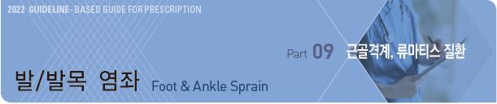
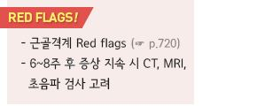
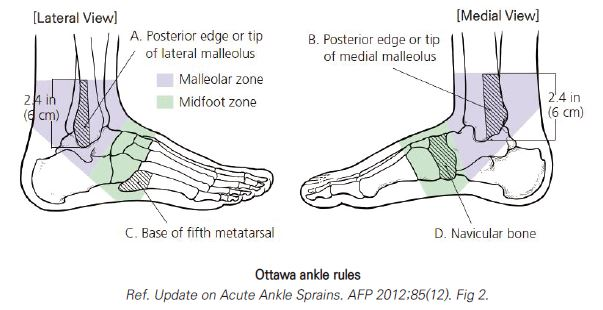
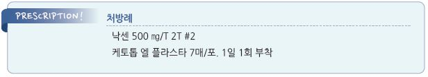

# 발/발목 염좌 Foot & Ankle Sprain



## 일반 사항

* 발목 관절을 지지하는 인대 구조의 손상
* 빈도 : 1년에 인구 30명 중 1건 발생
* 증상 : 부종, 혈종, 압통
*   진단 : 병력, 증상, 유발 검사, 영상 검사; 손상 초기에는 통증/부종/근육 경직으로 인하여 판정이 어려움.

    발생 4\~5일째의 지연 진찰이 더 정확할 수 있음
* 경과 : 대부분 회복에 2\~6주 소요; Syndesmotic injury는 더 오래 걸림

### 종류

#### Lateral ankle sprain III sprain

* 발목 염좌의 85% 차지
* 손상 기전 : inversion & plantar flexion
* 손상 인대 : ant. talofibular lig.(TFL가장 많이 이환), calcaneofibular lig.(CFL), post. TFL.
* 검사 : ant. drawer test, talar tilt test

#### Medial ankle sprain

* 손상 기전 : eversion & dorsiflexion
* 손상 인대 : deltoid lig.(medial collateral lig.)
* 측부 손상보다 덜 흔하지만 손상은 더 심함

High ankle(Syndesmotic) sprain

* 손상 기전 : 심한 dorsiflexion(tibia internal rotation)
* 손상 인대 : ant. inf./post. inf./transverse TFL, interosseous membrane & lig., inf. transverse lig.
* 검사 : squeeze test

### 손상 정도 Grading

* Grade I sprain : 경증 부종/압통, no laxity, 통증 없이 보행 가능
* Grade II sprain : 중등증 부종/압통, mild laxity(firm end point), ant. drawer test(+), 보행 시 통증
* Grade III sprain : 중증 부종/압통/멍, laxity(no end point), ant. drawer test & talar tilt 불안정, 보행 불능



## 원인 및 위험 인자

* 과거 발목 염좌 병력
* 자세 불안정, 보행 이상

진단

> ✽anatomy 1, anatomy 2 ✽ankle muscle(3D)

### 유발 검사

*   anterior drawer test : 무릎 굴곡 및 발목을 약간(15o) plantar-flex 자세에서 검사자는 한쪽 손으로 경골을 고정하고

    다른 손으로 뒷꿈치를 잡고 앞으로 당김. 건측에 비하여 전방 이동(＞1 ㎝)이 있으면 양성; ant. TFL 평가
*   talar tilt test : 검사대에 걸터 앉아 발을 늘어 뜨리고 약간 ankle plantar-flex 자세에서 검사자는 한쪽 손으로 경골을

    고정하고 다른 손으로 calcaneus를 잡고 발목을 inversion시킴. 건측에 비하여 움직임이 크면 (＞15o) 양성; CFL 평가
*   manual squeeze test : supine position에서 검사자가 환자의 아래쪽에 위치하여 양 손을 종아리 중간 ⅓ 측부에 놓고 압박;

    경비골 원위부(발목 관절 바로 위)에서 통증 발생 시 양성; ankle syndesmosis 평가

### 영상 검사

* X선, MRI, CT, 초음파
* 일률적 검사는 권고하지 않음
* 검사 대상 : 골절 의심(Ottawa rule에서 골절 의심), 치료에 호전 안됨

### 증상/병력에 따른 발목 문제의 감별

```

```

### 골절 감별 : Ottawa ankle rules

* 민감도 : 98.5%; 외상 48시간 내 진찰 시 99.6%
* 예외 : 손상 후 10일 이상 경과, 피부 손상 동반, 감각 저하(neuropathy), 임신, 5세 이하

#### Ankle 골절 가능성(X선 검사 대상)

*   malleolar zone에 통증이 있고 다음 중 하나 이상에 해당

    ① 바깥 복사뼈의 tip 또는 비골 원위부 뒤 가장자리 6 ㎝ 부위의 골 압통 (그림 A)

    ② 안쪽 복사뼈의 tip 또는 경골 원위부 뒤 가장자리 6 ㎝ 부위의 골 압통 (그림 B)

    ③ 보조 없이 4걸음 이상 걸을 수 없음



#### Foot 골절 가능성 (X선 검사 대상)

*   midfoot zone에 통증이 있고 다음 중 하나 이상에 해당

    ① 5번째 metatarsal base 부위의 골 압통 (그림 C)

    ② navicular bone 골 압통 (그림 D)

    ③ 보조 없이 4걸음 이상 걸을 수 없음

***

## Management

### 치료 방침

* PRICEMM : Protection, relative Rest, Ice, Compression, Elevation, Medication, Modality
* 활동(운동) 복귀 : gradeⅠ lateral ankle- 1~~2주; gradeⅡ- 2~~3주; gradeⅢ- 4주; syndesmotic sprain- 8\~9주

## 비-약물 치료

#### Protection/Compression

* 중증(예: 보행 곤란) 시 고정(무릎 아래 cast) 및 보행 중지(\~10일)
*   지지 요법 간에 효과의 차이가 있다는 보고가 있음; lace-up or semirigid brace ＞ air stirrup brace ＞ elastic

    bandage/taping
* 병합 치료(예: air-filled brace 및 compression wrap)가 단독 치료보다 효과
* cast : 인대 손상 시 4\~6주간의 cast가 기능 회복에 유익(기간에 대하여 논란)
* 압박 치료의 효과에 대해서는 논란; 압박 스타킹 착용은 회복에 도움이 되지 않음
* 발목 인대 부상 또는 재발을 방지할 수 있는 효과가 입증된 신발은 없음

#### Rest

*   조기 보행 권고 : 조기 보행이 통증 감소 및 회복에 유효; 통증이 심하지 않거나 참을 수 있는 경우에 조기 보행 활동 권고;

    필요시 목발 사용

#### Ice

* 급성 통증, 부종 완화에 유효(적용 방법 및 시행 기간에는 이론이 있음)
* 20분 연속 적용 또는 ‘10분 적용→10분 휴식→10분 적용’을 2시간마다 반복; 3\~7일간 시행

#### Elevation

* 부종 감소에 도움

#### Exercise

* 4\~5일 후에는 저항 운동을 시작할 수 있음

#### Physical therapy

## 약물 치료

### 진통제

```
(☞ p.11)
```

* ibuprofen : 400\~800 ㎎ tid \[부루펜]
* naproxen : 275 ㎎ tid\~500 ㎎ bid \[낙센]
* acetaminophen : 650\~1,300 ㎎ tid \[타이레놀]
* tramadol : 심한 통증에 단기 사용; 50~~100 ㎎ bid~~qid \[트리돌]
* 파스, 겔 : ketoprofen \[케토톱], piroxicam \[트라스트] (보험기준 ☞ p.1175)

### 기타

* platelet-rich plasma(PRP) injection : 염좌 회복에 도움이 될 가능성; 연구 불충분

> ✽Ankle arthritis에 대하여 이득이 없다는 보고가 있음

* 개방성 손상에 대하여 광범위 항생제, 파상풍 백신 고려
* 골다공증 관리(특히 고령 환자)

## 수술

* Grade III sprain, 운동선수, 노동자, 젊은층에서 고려

## 예방/재활

* 균형 : 한쪽 다리로 서 있기(1분), 한쪽 다리로 서서 공받기, 흔들리는 판위에 서 있기
* 근력 강화 : band 운동, 앞쪽 발로 (낮은) 계단 끝에 서서 뒷꿈치 올리고 내리기
*   Plyometrics : 쪼그려 앉았다 점프하기, 가위뛰기(앞뒤로 다리 벌리고 교차 뛰기), bounding(최대 속도의 50%로,

    큰 보폭으로 튀어 오르면서 달리기)
* 운동 시 발목 보호 장구 적용

> **질병코드** S93　발목 및 발 부위의 관절 및 인대의 탈구, 염좌 및 긴장

S96　발목 및 발 부위의 근육 및 힘줄의 손상


